# Hierarchical modeling course notes
Max Joseph  
November 16, 2015  


Chapter 1: Linear models
========================

## Big picture

This course builds on an understanding of the mechanics of linear models. 
Here we introduce some key topics that will facilitate future understanding hierarchical models.

#### Learning goals

<!---
I haven't added anything about interaction effects or centering covariates yet. 
Maybe this would fit well in the general linear model section?
Centering covariates might also be good in the linear regression section. 
Or, maybe it's worth deferring to Gelman and Hill on centering and streamlining the notes?
I also was not sure what we were thinking about varying structure and standard errors. 
Did you have something in mind here?
I have avoided talking much about standard errors yet because it's a fairly 
frequentist notion (sd of the sampling distribution)
-->

- linear regression with `lm`
- intercepts, "categorical" effects
- varying model structure to estimate effects and standard errors
- interactions as variation in slope estimates for different groups
- centering input variables and intepreting resulting parameters
- assumptions and unarticulated priors
- understanding residual variance (Gaussian)
- understanding all of the above graphically
- understanding and plotting output of lm
- notation and linear algebra review: $X\beta$

Linear regression, ANOVA, ANCOVA, and multiple regression models are all species cases of general linear models (hereafter "linear models"). 
In all of these cases, we have observed some response variable $y$, which is potentially modeled as a function of some covariate(s) $x_1, x_2, ..., x_p$.

## Model of the mean

If we have no covariates of interest, then we may be interested in estimating the population mean and variance of the random variable $Y$ based on $n$ observations, corresponding to the values $y_1, ..., y_n$. 
Here, capital letters indicate the random variable, and lowercase corresponds to realizations of that variable. 
This model is sometimes referred to as the "model of the mean". 


```r
# simulating a sample of y values from a normal distribution
y <- rnorm(20)
plot(y)
```

 

We have two parameters to estimate: the mean of $Y$, which we'll refer to as $\mu$, and the variance of $Y$, which we'll refer to as $\sigma^2$. 
Here, and in general, we will use greek letters to refer to parameters. 
If $Y$ is normally distributed, then we can assume that the realizations or samples $y$ that we observe are also normally distributed: $y \sim N(\mu, \sigma^2)$. 
Here and elsewhere, the $\sim$ symbol represents that some quantity "is distributed as" something else (usually a probability distribution). 
You can also think of $\sim$ as meaning "is sampled from".
A key concept here is that we are performing statistical inference, meaning we are trying to learn about (estimate) population-level parameters with sample data. 
In other words, we are not trying to learn about the sample mean $\bar{y}$ or sample variance of $y$. 
These can be calculated and treated as known once we have observed a particular collection of $y$ values. 
The unknown quantities $\mu$ and $\sigma^2$ are the targets of inference. 

Fitting this model (and linear models in general) is possible in R with the `lm` function. 
For this rather simple model, we can estimate the parameters as follows:


```r
# fitting a model of the mean with lm
m <- lm(y ~ 1)
summary(m)
```

```
## 
## Call:
## lm(formula = y ~ 1)
## 
## Residuals:
##      Min       1Q   Median       3Q      Max 
## -1.43811 -0.66015  0.03758  0.68747  1.66412 
## 
## Coefficients:
##             Estimate Std. Error t value Pr(>|t|)  
## (Intercept)   0.3593     0.1967   1.826   0.0836 .
## ---
## Signif. codes:  0 '***' 0.001 '**' 0.01 '*' 0.05 '.' 0.1 ' ' 1
## 
## Residual standard error: 0.8798 on 19 degrees of freedom
```

The summary of our model object `m` provides a lot of information. 
For reasons that will become clear shortly, the estimated population mean is referred to as the "Intercept". 
Here, we get a point estimate for the population mean $\mu$: 0.359 and an estimate of the residual standard deviation $\sigma$: 0.88, which we can square to get an estimate of the residual variance $\sigma^2$: 0.774.

## Linear regression

Often, we are interested in estimating the mean of $Y$ as a function of some other variable, say $X$. 
Simple linear regression assumes that $y$ is again sampled from a normal distribution, but this time the mean or expected value of $y$ is a function of $x$:

$$y_i \sim N(\mu_i, \sigma^2)$$

$$\mu_i = \alpha + \beta x_i$$

Here, subscripts indicate which particular value of $y$ and $x$ we're talking about. 
Specifically, we observe $n$ pairs of values: $(y_i, x_i), ..., (y_n, x_n)$, with all $x$ values known exactly.
Linear regression models can equivalently be written as follows:

$$y_i = \alpha + \beta x_i + \epsilon_i$$

$$\epsilon_i \sim N(0, \sigma^2)$$

Key assumptions here are that each of the error terms $\epsilon_1, ..., \epsilon_n$ are normally distributed around zero with some variance (i.e., the error terms are identically distributed), and that the value of $\epsilon_1$ does not affect the value of any other $\epsilon$ (i.e., the errors are independent).
This combination of assumptions is often referred to as "independent and identically distributed" or i.i.d. 
Equivalently, given some particular $x_i$ and a set of linear regression parameters, the distribution of $y_i$ is normal. 
A common misconception is that linear regression assumes the distribution of $y$ is normal. 
This is wrong - linear regression assumes that the error terms are normally distributed. 
The assumption that the variance $\sigma^2$ is constant for all values of $x$ is referred to as homoskedasticity. 
Rural readers may find it useful to think of skedasticity as the amount of "skedaddle" away from the regression line in the $y$ values. 
If the variance is changing across values of $x$, then the assumption of homoskedasticity is violated and you've got a heteroskedasticity problem. 


```r
# simulate and plot x and y values
n <- 50
x <- runif(n)
alpha <- -2
beta <- 3
sigma <- .4
y <- rnorm(n, mean = alpha + beta * x, sd = sigma)
plot(x, y)

# add known mean function 
lines(x = x, y = alpha + beta * x, col='blue')
legend('topleft', 
       pch = c(1, NA), lty = c(NA, 1), 
       col = c('black', 'blue'), 
       legend = c('Observed data', 'E(y | x)'), 
       bty = 'n')
```

 

The normality assumption means that the probability density of $y$ is highest at the value $\alpha + \beta x$, where the regression line is, and falls off away from the line according to the normal probablity density. 
This graphically looks like a bell 'tube' along the regression line, adding a dimension along $x$ to the classic bell 'curve'.

 

### Model fitting

Linear regression parameters $\alpha$, $\beta$, and $\sigma^2$ can be estimated with `lm`.
The syntax is very similar to the previous model, except now we need to include our covariate `x` in the formula (the first argument to the `lm` function). 


```r
m <- lm(y ~ x)
summary(m)
```

```
## 
## Call:
## lm(formula = y ~ x)
## 
## Residuals:
##      Min       1Q   Median       3Q      Max 
## -0.86701 -0.29002  0.02499  0.28640  0.86596 
## 
## Coefficients:
##             Estimate Std. Error t value Pr(>|t|)    
## (Intercept)  -2.0400     0.1231  -16.57   <2e-16 ***
## x             2.9349     0.2020   14.53   <2e-16 ***
## ---
## Signif. codes:  0 '***' 0.001 '**' 0.01 '*' 0.05 '.' 0.1 ' ' 1
## 
## Residual standard error: 0.4052 on 48 degrees of freedom
## Multiple R-squared:  0.8147,	Adjusted R-squared:  0.8109 
## F-statistic: 211.1 on 1 and 48 DF,  p-value: < 2.2e-16
```

The point estimate for the parameter $\alpha$ is called "(Intercept)". 
This is because our estimate for $\alpha$ is the y-intercept of the estimated regression line when $x=0$ (recall that $y_i = \alpha + \beta x_i + \epsilon_i$).
The estimate for $\beta$ is called "x", because it is a coefficient associated with the variable "x" in this model. 
This parameter is often referred to as the "slope", because it represents the increase in the expected value of $y$ for a one unit increase in $x$ (the rise in y over run in x).
Point estimates for the standard deviation and variance of $\epsilon$ can be extracted as before (`summary(m)$sigma` and `summary(m)$sigma^2`).

### Centering and scaling covariates

Often, it's a good idea to "center" covariates so that they have a mean of zero ($\bar{x} = 0$). 
This is achieved by subtracting the sample mean of a covariate from the vector of covariate values ($x - \bar{x}$).
It's also useful to additionally scale covariates so that they are all on a common and unitless scale. 
While many will divide each covariate by its standard deviation, Gelman and Hill (pg. 57) recommend dividing by twice the standard deviation ($s_x$) so that binary covariates are transformed from $x \in \{0, 1\}$ to $x_t \in \{-0.5, 0.5\}$, where $x_t$ is the transformed covariate: $x_t = \frac{x - \bar{x}}{2 s_x}$. 
If covariates are not centered and scaled, then it is common to observe correlations between estimated slopes and intercepts. 

 

So, we expect that in this case, the estimates for the intercept and slope must be negatively correlated.
This is bourne out in the confidence region for our estimates of $\alpha$ and $\beta$. 
Usually, people inspect univariate confidence intervals for parameters, e.g.,


```r
confint(m)
```

```
##                 2.5 %    97.5 %
## (Intercept) -3.546355 -2.299028
## x            0.806900  1.161508
```

This is misleading because our estimates for these parameters are correlated. 
For any given value of the intercept, there are only certain values of the slope that are supported.
To assess this possibility, we might also be interested in the bivariate confidence ellipse for these two parameters. 
We can evaluate this quantity graphically as follows with some help from the `car` package:


```r
library(car)
confidenceEllipse(m)
```

 

This is not great. 
We want to be able to directly use the univariate confidence intervals. 
Our problem can be solved by centering $x$:

 

Now there is no serious correlation in the estimates and we are free to use the univariate confidence intervals without needing to consider the joint distribution of the slope and intercept. 
This trick helps with interpretation, but it will also prove useful later in the course in the context of Markov chain Monte Carlo (MCMC) sampling. 

### Checking assumptions

We have assumed that the distribution of error terms is normally distributed, and this assumption is worth checking. 
Below, we plot a histogram of the residuals (another name for the $\epsilon$ parameters) along with a superimposed normal probability density so that we can check normality. 


```r
hist(resid(m), breaks = 20, freq = F, 
     main = 'Histogram of model residuals')
curve_x <- seq(min(resid(m)), max(resid(m)), .01)
lines(curve_x, dnorm(curve_x, 0, summary(m)$sigma))
```

 

Even when the assumption of normality is correct, it is not always obvious that the residuals are normally distributed. 
Another useful plot for assessing normality of errors is a quantile-quantile or Q-Q plot. 
If the residuals do not deviate much from normality, then the points in a Q-Q plot won't deviate much from the dashed one-to-one line. 
If points lie above or below the line, then the residual is larger or smaller, respectively, than expected based on a normal distribution. 


```r
plot(m, 2)
```

 

To assess heteroskedasticity, it is useful to inspect a plot of the residuals vs. fitted values, e.g. `plot(m, 1)`. 
If it seems as though the spread or variance of residuals varies across the range of fitted values, then it may be worth worrying about homoskedasticity and trying some transformations to fix the problem. 

## Analysis of variance

Sometimes, the covariate of interest is not continuous but instead categorical (e.g., "chocolate", "strawberry", or "vanilla"). 
We might again wonder whether the mean of a random variable $Y$ depends on the value of this covariate. 
However, we cannot really estimate a meaningful "slope" parameter, because in this case $x$ is not continuous. 
Instead, we might formulate the model as follows:

$$y_i \sim N(\alpha_{j[i]}, \sigma^2)$$

Where $\alpha_j$ is the mean of group $j$, and we have $J$ groups total. 
The notation $\alpha_{j[i]}$ represents the notion that the $i^{th}$ observation corresponds to group $j$, and we are going to assume that all observations in the $j^{th}$ group have the same mean, $\alpha_j$. 
The above model is perfectly legitimate, and our parameters to estimate are the group means $\alpha_1, ..., \alpha_J$ and the residual variance $\sigma^2$. 
This parameterization is called the "means" parameterization, and though it is perhaps easier to understand than the following alternative, it is less often used. 

This model is usually parameterized not in terms of the group means, but rather in terms of an intercept (corresponding to the mean of one "reference" group), and deviations from the intercept (differences between a group of interest and the intercept). 
For instance, in R, the group whose mean is the intercept (the "reference" group) will be the group whose name comes first alphabetically. 
Either way, we will estimate the same number of parameters. 
So if our groups are "chocolate", "strawberry", and "vanilla", R will assign the group "chocolate" to be the intercept, and provide 2 more coefficient estimates for the difference between the estimated group mean of strawberry vs. chocoloate, and vanilla vs. chocolate. 

This parameterization can be written as

$$y_i \stackrel{iid}{\sim} N(\mu_0 + \beta_{j[i]}, \sigma^2)$$

where $\mu_0$ is the "intercept" or mean of the reference group, and $\beta_j$ represents the difference in the population mean of group $j$ compared to the reference group (if $j$ is the reference group, the $\beta_j = 0$). 
Traditionally this model is called simple one-way analysis of variance, but we view it simply as another special case of a linear model.

The following example illustrates some data simulation, visualization, and parameter estimation in this context. 
Specifically, we assess 60 humans for their taste response to three flavors of iced cream. 
We want to extrapolate from our sample to the broader population of all ice cream eating humans to learn whether in general people think ice cream tastiness varies as a function of flavor. 


```r
# simulate and visualize data
n <- 60
x <- rep(c("chocolate", "strawberry", "vanilla"), length.out = n)
x <- factor(x)
sigma <- 1
mu_y <- c(chocolate = 3.352, strawberry = .93, vanilla = 1.5)
y <- rnorm(n, mu_y[x], sigma)

library(ggplot2)
ggplot(data.frame(x, y), aes(x, y)) + 
  geom_jitter(position = position_jitter(width=.1)) + 
  xlab('Group') + 
  ylab('Tastiness')
```

 

### Model fitting

We can estimate our parameters with the `lm` function (this should be a strong hint that there are not huge differences between linear regression and ANOVA). 
The syntax is exactly the same as with linear regression. 
The only difference is that our input `x` is not numeric, it's a character vector. 


```r
m <- lm(y ~ x)
summary(m)
```

```
## 
## Call:
## lm(formula = y ~ x)
## 
## Residuals:
##      Min       1Q   Median       3Q      Max 
## -2.17462 -0.56940 -0.05209  0.48424  2.40424 
## 
## Coefficients:
##             Estimate Std. Error t value Pr(>|t|)    
## (Intercept)   3.3839     0.2290  14.774  < 2e-16 ***
## xstrawberry  -2.6422     0.3239  -8.157 3.77e-11 ***
## xvanilla     -2.1226     0.3239  -6.553 1.76e-08 ***
## ---
## Signif. codes:  0 '***' 0.001 '**' 0.01 '*' 0.05 '.' 0.1 ' ' 1
## 
## Residual standard error: 1.024 on 57 degrees of freedom
## Multiple R-squared:  0.5672,	Adjusted R-squared:  0.552 
## F-statistic: 37.35 on 2 and 57 DF,  p-value: 4.309e-11
```

Because chocolate comes first alphabetically, it is the reference group and the "(Intercept)" estimate corresponds to the estimate of the group-level mean for chocolate. 
The other two estimates are contrasts between the other groups and this reference group, i.e.  "xstrawberry" is the estimated difference between the group mean for strawberry and the reference group. 

If we wish instead to use a means paramaterization, we need to supress the intercept term in our model as follows:


```r
m <- lm(y ~ 0 + x)
summary(m)
```

```
## 
## Call:
## lm(formula = y ~ 0 + x)
## 
## Residuals:
##      Min       1Q   Median       3Q      Max 
## -2.17462 -0.56940 -0.05209  0.48424  2.40424 
## 
## Coefficients:
##             Estimate Std. Error t value Pr(>|t|)    
## xchocolate    3.3839     0.2290  14.774  < 2e-16 ***
## xstrawberry   0.7417     0.2290   3.238  0.00201 ** 
## xvanilla      1.2613     0.2290   5.507  9.1e-07 ***
## ---
## Signif. codes:  0 '***' 0.001 '**' 0.01 '*' 0.05 '.' 0.1 ' ' 1
## 
## Residual standard error: 1.024 on 57 degrees of freedom
## Multiple R-squared:  0.8197,	Adjusted R-squared:  0.8102 
## F-statistic: 86.36 on 3 and 57 DF,  p-value: < 2.2e-16
```

Arguably, this approach is more useful because it simplifies the construction of confidence intervals for the group means:


```r
confint(m)
```

```
##                 2.5 %   97.5 %
## xchocolate  2.9252433 3.842559
## xstrawberry 0.2830610 1.200377
## xvanilla    0.8026443 1.719960
```

### Checking assumptions

Our assumptions in this simple one way ANOVA context are identical to our assumptions with linear regression. 
Specifically, we assumed that our errors are independently and identically distributed, and that the variance is constant for each group (homoskedasticity). 
The built in `plot` method for `lm` objects is designed to return diagnostic plots that help to check these assumptions. 


```r
par(mfrow=c(2, 2))
plot(m)
```

 

## General linear models

We have covered a few special cases of general linear models, which are usually written as follows:

$$y \stackrel{iid}{\sim} N(X \beta, \sigma^2)$$

Where $y$ is a vector consisting of $n$ observations, $X$ is a "design" matrix with $n$ rows and $p$ columns, and $\beta$ is a vector of $p$ parameters. 
There are multivariate general linear models (e.g., MANOVA) where the response variable is a matrix and a covariance matrix is used in place of a scalar variance parameter, but we'll stick to univariate models for simplicity.
The key point here is that the producct of $X$ and $\beta$ provides the mean of the normal distribution from which $y$ is drawn. 
From this perspective, the difference between the model of the mean, linear regression, ANOVA, etc., lies in the structure of $X$ and subsequent interpretation of the parameters $\beta$. 
This is a very powerful idea that unites many superficially disparate approaches. 
It also is the reason that these models are considered "linear", even though a regression line might by quite non-linear (e.g., polynomial regression). 
These models are linear in their parameters, meaning that our expected value for the response $y$ is a **linear combination** (formal notion) of the parameters. 
If a vector of expected values for $y$ in some model cannot be represented as $X \beta$, then it is not a linear model. 

In the model of the mean, $X$ is an $n$ by $1$ matrix, with each element equal to $1$ (i.e. a vector of ones). 
With linear regression, $X$'s first column is all ones (corresponding to the intercept parameter), and the second column contains the values of the covariate $x$. 
In ANOVA, the design matrix $X$ will differ between the means and effects parameterizations. 
With a means parameterization, the entries in column $j$ will equal one if observation (row) $i$ is in group $j$, and entries are zero otherwise. 
If you are not comfortable with matrix multiplication, it's worth investing some effort so that you can understand why $X\beta$ is such a powerful construct. 

>Can you figure out the structure of $X$ with R's default effects parameterization?
>You can check your work with `model.matrix(m)`, where `m` is a model that you've fitted with `lm`.

## Interactions between covariates

Often, the effect of one covariate depends on the value of another covariate. 
This is referred to as "interaction" between the covariates. 
Interactions can exist between two or more continuous and/or nominal covariates. 
These situations have special names in the classical statistics literature. 
For example, models with interactions between nominal covariates fall under "factorial ANOVA", those with interactions between a continuous and a nominal covariate are referred to as "analysis of covariance (ANCOVA)". 
Here we prefer to consider these all as special cases of general linear models. 

### Interactions between two continuous covariates

Here we demonstrate simulation and estimation for a model with an interaction between two continuous covariates. 
Notice that in the simulation, we have exploited the $X \beta$ construct to generate a vector of expected values for $y$. 


```r
n <- 50
x1 <- rnorm(n)
x2 <- rnorm(n)
beta <- c(.5, 1, -1, 2)
sigma <- 1
X <- matrix(c(rep(1, n), x1, x2, x1 * x2), nrow=n)
mu_y <- X %*% beta
y <- rnorm(n, mu_y, sigma)
m <- lm(y ~ x1 * x2)
summary(m)
```

```
## 
## Call:
## lm(formula = y ~ x1 * x2)
## 
## Residuals:
##      Min       1Q   Median       3Q      Max 
## -1.83031 -0.76194 -0.09879  0.89203  1.84869 
## 
## Coefficients:
##             Estimate Std. Error t value Pr(>|t|)    
## (Intercept)   0.5770     0.1425   4.049 0.000195 ***
## x1            0.8741     0.1530   5.712 7.80e-07 ***
## x2           -0.7343     0.1829  -4.015 0.000217 ***
## x1:x2         2.0440     0.1665  12.275 4.08e-16 ***
## ---
## Signif. codes:  0 '***' 0.001 '**' 0.01 '*' 0.05 '.' 0.1 ' ' 1
## 
## Residual standard error: 0.995 on 46 degrees of freedom
## Multiple R-squared:  0.8772,	Adjusted R-squared:  0.8692 
## F-statistic: 109.5 on 3 and 46 DF,  p-value: < 2.2e-16
```

Visualizing these models is tricky, because we are in 3d space (with dimensions $x_1$, $x_2$, and $y$), but contour plots can be effective and leverage peoples' understanding of topographic maps. 


```r
# visualizing the results in terms of the linear predictor
lo <- 40
x1seq <- seq(min(x1), max(x1), length.out = lo)
x2seq <- seq(min(x2), max(x2), length.out = lo)
g <- expand.grid(x1=x1seq, x2=x2seq)
g$e_y <- beta[1] + beta[2] * g$x1 + beta[3] * g$x2 + beta[4] * g$x1 * g$x2
ggplot(g, aes(x=x1, y=x2)) + 
  geom_tile(aes(fill=e_y)) + 
  stat_contour(aes(z=e_y), col='grey') + 
  scale_fill_gradient2() + 
  geom_point(data=data.frame(x1, x2))
```

 

Alternatively, you might check out the `effects` package:


```r
library(effects)
plot(allEffects(m))
```

 

### Interactions between two categorical covariates

Here we demonstrate interaction between two categorical covariates, using the `diamonds` dataset which is in the `ggplot2` package.t
We are interested in the relationship between diamond price, cut quality, and color.


```r
str(ToothGrowth)
```

```
## 'data.frame':	60 obs. of  3 variables:
##  $ len : num  4.2 11.5 7.3 5.8 6.4 10 11.2 11.2 5.2 7 ...
##  $ supp: Factor w/ 2 levels "OJ","VC": 2 2 2 2 2 2 2 2 2 2 ...
##  $ dose: num  0.5 0.5 0.5 0.5 0.5 0.5 0.5 0.5 0.5 0.5 ...
```

```r
ToothGrowth$dose <- factor(ToothGrowth$dose)
ggplot(ToothGrowth, aes(x=interaction(dose, supp), y=len)) + 
  geom_point()
```

 

In general, visualizing the raw data is a good idea. 
However, we might also be interested in a table with group-wise summaries, such as the sample means, standard deviations, and sample sizes. 


```r
library(dplyr)
ToothGrowth %>%
  group_by(dose, supp) %>%
  summarize(mean = mean(len), 
            sd = sd(len), 
            n = n())
```

```
## Source: local data frame [6 x 5]
## Groups: dose [?]
## 
##     dose   supp  mean       sd     n
##   (fctr) (fctr) (dbl)    (dbl) (int)
## 1    0.5     OJ 13.23 4.459709    10
## 2    0.5     VC  7.98 2.746634    10
## 3      1     OJ 22.70 3.910953    10
## 4      1     VC 16.77 2.515309    10
## 5      2     OJ 26.06 2.655058    10
## 6      2     VC 26.14 4.797731    10
```

We can construct a model to estimate the effect of dose, supplement, and their interaction. 


```r
m <- lm(len ~ dose * supp, data = ToothGrowth)
summary(m)
```

```
## 
## Call:
## lm(formula = len ~ dose * supp, data = ToothGrowth)
## 
## Residuals:
##    Min     1Q Median     3Q    Max 
##  -8.20  -2.72  -0.27   2.65   8.27 
## 
## Coefficients:
##              Estimate Std. Error t value Pr(>|t|)    
## (Intercept)    13.230      1.148  11.521 3.60e-16 ***
## dose1           9.470      1.624   5.831 3.18e-07 ***
## dose2          12.830      1.624   7.900 1.43e-10 ***
## suppVC         -5.250      1.624  -3.233  0.00209 ** 
## dose1:suppVC   -0.680      2.297  -0.296  0.76831    
## dose2:suppVC    5.330      2.297   2.321  0.02411 *  
## ---
## Signif. codes:  0 '***' 0.001 '**' 0.01 '*' 0.05 '.' 0.1 ' ' 1
## 
## Residual standard error: 3.631 on 54 degrees of freedom
## Multiple R-squared:  0.7937,	Adjusted R-squared:  0.7746 
## F-statistic: 41.56 on 5 and 54 DF,  p-value: < 2.2e-16
```

This summary gives the effects-parameterization version of the summary. 
The "(Intercept)" refers to the combination of factor levels that occur first alphabetically: in this case, a dose of 0.5 with the "OJ" supplement. 
The coefficients for `dose1` and `dose2` represent estimated contrasts for these two groups relative to the intercept. 
The coefficient for `suppVC` represents the contrast between the "VC" and "OJ" levels of supplement when the dose is 0.5.
The interaction terms represent the difference in the effect of VC for `dose1` and `dose2` relative to a dose of 0.5. 
None of this is particularly intuitive, but this information can be gleaned by inspecting the design matrix $X$ produced by `lm` in the process of fitting the model. 
Inspecting the design matrix along with the dataset to gives a better sense for how $X$ relates to the factor levels:


```r
cbind(model.matrix(m), ToothGrowth)
```

```
##    (Intercept) dose1 dose2 suppVC dose1:suppVC dose2:suppVC  len supp dose
## 1            1     0     0      1            0            0  4.2   VC  0.5
## 2            1     0     0      1            0            0 11.5   VC  0.5
## 3            1     0     0      1            0            0  7.3   VC  0.5
## 4            1     0     0      1            0            0  5.8   VC  0.5
## 5            1     0     0      1            0            0  6.4   VC  0.5
## 6            1     0     0      1            0            0 10.0   VC  0.5
## 7            1     0     0      1            0            0 11.2   VC  0.5
## 8            1     0     0      1            0            0 11.2   VC  0.5
## 9            1     0     0      1            0            0  5.2   VC  0.5
## 10           1     0     0      1            0            0  7.0   VC  0.5
## 11           1     1     0      1            1            0 16.5   VC    1
## 12           1     1     0      1            1            0 16.5   VC    1
## 13           1     1     0      1            1            0 15.2   VC    1
## 14           1     1     0      1            1            0 17.3   VC    1
## 15           1     1     0      1            1            0 22.5   VC    1
## 16           1     1     0      1            1            0 17.3   VC    1
## 17           1     1     0      1            1            0 13.6   VC    1
## 18           1     1     0      1            1            0 14.5   VC    1
## 19           1     1     0      1            1            0 18.8   VC    1
## 20           1     1     0      1            1            0 15.5   VC    1
## 21           1     0     1      1            0            1 23.6   VC    2
## 22           1     0     1      1            0            1 18.5   VC    2
## 23           1     0     1      1            0            1 33.9   VC    2
## 24           1     0     1      1            0            1 25.5   VC    2
## 25           1     0     1      1            0            1 26.4   VC    2
## 26           1     0     1      1            0            1 32.5   VC    2
## 27           1     0     1      1            0            1 26.7   VC    2
## 28           1     0     1      1            0            1 21.5   VC    2
## 29           1     0     1      1            0            1 23.3   VC    2
## 30           1     0     1      1            0            1 29.5   VC    2
## 31           1     0     0      0            0            0 15.2   OJ  0.5
## 32           1     0     0      0            0            0 21.5   OJ  0.5
## 33           1     0     0      0            0            0 17.6   OJ  0.5
## 34           1     0     0      0            0            0  9.7   OJ  0.5
## 35           1     0     0      0            0            0 14.5   OJ  0.5
## 36           1     0     0      0            0            0 10.0   OJ  0.5
## 37           1     0     0      0            0            0  8.2   OJ  0.5
## 38           1     0     0      0            0            0  9.4   OJ  0.5
## 39           1     0     0      0            0            0 16.5   OJ  0.5
## 40           1     0     0      0            0            0  9.7   OJ  0.5
## 41           1     1     0      0            0            0 19.7   OJ    1
## 42           1     1     0      0            0            0 23.3   OJ    1
## 43           1     1     0      0            0            0 23.6   OJ    1
## 44           1     1     0      0            0            0 26.4   OJ    1
## 45           1     1     0      0            0            0 20.0   OJ    1
## 46           1     1     0      0            0            0 25.2   OJ    1
## 47           1     1     0      0            0            0 25.8   OJ    1
## 48           1     1     0      0            0            0 21.2   OJ    1
## 49           1     1     0      0            0            0 14.5   OJ    1
## 50           1     1     0      0            0            0 27.3   OJ    1
## 51           1     0     1      0            0            0 25.5   OJ    2
## 52           1     0     1      0            0            0 26.4   OJ    2
## 53           1     0     1      0            0            0 22.4   OJ    2
## 54           1     0     1      0            0            0 24.5   OJ    2
## 55           1     0     1      0            0            0 24.8   OJ    2
## 56           1     0     1      0            0            0 30.9   OJ    2
## 57           1     0     1      0            0            0 26.4   OJ    2
## 58           1     0     1      0            0            0 27.3   OJ    2
## 59           1     0     1      0            0            0 29.4   OJ    2
## 60           1     0     1      0            0            0 23.0   OJ    2
```

Often, researchers want to know if interactions need to be included in the model. 
From a null hypothesis significance testing perspective, we can evaluate the 'significance' of the interaction term as follows: 


```r
anova(m)
```

```
## Analysis of Variance Table
## 
## Response: len
##           Df  Sum Sq Mean Sq F value    Pr(>F)    
## dose       2 2426.43 1213.22  92.000 < 2.2e-16 ***
## supp       1  205.35  205.35  15.572 0.0002312 ***
## dose:supp  2  108.32   54.16   4.107 0.0218603 *  
## Residuals 54  712.11   13.19                      
## ---
## Signif. codes:  0 '***' 0.001 '**' 0.01 '*' 0.05 '.' 0.1 ' ' 1
```

We find that the interaction between dose and supplement is statistically significant, meaning that if we assume that there is no interaction, it is unlikely to observe data that are as or more extreme as what we have observed over the course of infinitely many replicated experiments that will probably never occur.
Although this is far from intuitive, this approach has been widely used.
We will introduce a more streamlined procedure in chapter 3 that 1) does not assume that the effect is zero to begin with, and 2) does not necessarily invoke a hypothetical infinite number of replicated realizations of the data, conditional on one particular parameter value. 
An alternative approach would be to use information theoretics to decide whether the interaction is warranted:


```r
m2 <- lm(len ~ dose + supp, data = ToothGrowth)
AIC(m, m2)
```

```
##    df      AIC
## m   7 332.7056
## m2  5 337.2013
```

In the past decade following Burnham and Anderson's book on the topic, ecologists have leaned heavily on Akaike's information criterion (AIC), which is a relative measure of model quality (balancing goodness of fit with model complexity). 
Here we see that the original model `m` with interaction has a lower AIC value, and is therefore better supported. 
AIC can be considered to be similar to cross validation, approximating the ability of a model to predict future data.

Being somewhat lazy, we might again choose to plot the results of this model using the `effects` package. 


```r
plot(allEffects(m))
```

 

This is less than satisfying, as it does not show any data. 
All we see is model output. 
If the model is crap, then the output and these plots are also crap. 
But, evaluating the crappiness of the model is difficult when there are no data shown.
Ideally, the data can be shown along with the estimated group means and some indication of uncertainty. 
If we weren't quite so lazy, we could use the `predict` function to obtain confidence intervals for the means of each group. 


```r
# construct a new data frame for predictions
g <- expand.grid(supp = levels(ToothGrowth$supp), 
                 dose = levels(ToothGrowth$dose))
p <- predict(m, g, interval = 'confidence', type='response')
predictions <- cbind(g, data.frame(p))

ggplot(ToothGrowth, aes(x=interaction(dose, supp), y=len)) + 
  geom_segment(data=predictions, 
               aes(y=lwr, yend=upr, 
                   xend=interaction(dose, supp)), col='red') + 
  geom_point(data=predictions, aes(y=fit), color='red', size=2, shape=2) + 
  geom_jitter(position = position_jitter(width=.1), shape=1) + 
  ylab("Length")
```

 

This plot is nice because we can observe the data along with the model output. 
This makes it easier for readers to understand how the model relates to, fits, and does not fit the data.
If you wish to obscure the data, you could make a bar plot with error pars to represent the standard errors. 
Although "dynamite" plots are common, we shall not include one here and we strongly recommend that you never produce such a plot ([more here](http://biostat.mc.vanderbilt.edu/wiki/pub/Main/TatsukiRcode/Poster3.pdf)). 

### Interactions between continuous and categorical covariates

Sometimes, we're interested in interactions between continuous or numeric covariates and another covariates with discrete categorical levels. 
Again, this falls under the broad class of models used in analysis of covariance (ANCOVA). 


```r
x1 <- rnorm(n)
x2 <- factor(sample(c('A', 'B'), n, replace=TRUE))

# generate slopes and intercepts for the first and second groups
a <- rnorm(2)
b <- rnorm(2)
sigma <- .4

X <- matrix(c(ifelse(x2 == 'A', 1, 0), 
              ifelse(x2 == 'B', 1, 0), 
              ifelse(x2 == 'A', x1, 0), 
              ifelse(x2 == 'B', x1, 0)
            ), nrow=n)

mu_y <- X %*% c(a, b)
y <- rnorm(n, mu_y, sigma)
plot(x1, y, col=x2, pch=19)
legend('topright', col=1:2, legend=c('Group A', 'Group B'), pch=19)
```

 

Here the intercepts and slopes are allowed to vary for two groups. 
We can fit a model with an interaction between these covariates. 
The intercepts and slopes are estimated separately for the two groups. 


```r
m <- lm(y ~ x1 * x2)
summary(m)
```

```
## 
## Call:
## lm(formula = y ~ x1 * x2)
## 
## Residuals:
##     Min      1Q  Median      3Q     Max 
## -0.9305 -0.2158  0.0367  0.2833  0.8192 
## 
## Coefficients:
##             Estimate Std. Error t value Pr(>|t|)    
## (Intercept)  1.81217    0.09606  18.865  < 2e-16 ***
## x1           0.33238    0.13702   2.426   0.0193 *  
## x2B         -2.01975    0.12011 -16.816  < 2e-16 ***
## x1:x2B      -1.08619    0.15465  -7.024  8.4e-09 ***
## ---
## Signif. codes:  0 '***' 0.001 '**' 0.01 '*' 0.05 '.' 0.1 ' ' 1
## 
## Residual standard error: 0.4068 on 46 degrees of freedom
## Multiple R-squared:  0.8923,	Adjusted R-squared:  0.8852 
## F-statistic:   127 on 3 and 46 DF,  p-value: < 2.2e-16
```

Let's plot the lines of best fit along with the data. 


```r
plot(x1, y, col=x2, pch=19)
legend('topright', col=1:2, legend=c('Group A', 'Group B'), pch=19)
abline(coef(m)[1], coef(m)[2])
abline(coef(m)[1] + coef(m)[3], coef(m)[2] + coef(m)[4], col='red')
```

 

The `abline` function, used above, adds lines to plots based on a y-intercept (first argument) and a slope (second argument). 
Do you understand why the particular coefficients that we used as inputs provide the desired intercepts and slopes for each group? 

## Further reading

Schielzeth, H. 2010. Simple means to improve the interpretability of regression coefficients. Methods in Ecology and Evolution 1:103–113.  

Enqvist, L. 2005. The mistreatment of covariate interaction terms in linear model analyses of behavioural and evolutionary ecology studies. Animal Behaviour 70:967–971.  

Gelman and Hill. 2009. *Data analysis using regression and multilevel/hierarchical models*. Chapter 3-4.


Chapter 2: Maximum likelihood estimation
=============================

## Big picture

The likelihood is defined as the probability of the data, conditional on some parameter(s). 
Having observed some data, we often want to know which particular parameter values maximize the probability of those data. 
These parameter values are referred to as the maximum likelihood estimates. 

The goal here is to connect the notion of a likelihood to probability distributions and models. 
We can obtain maximum likelihood estimates (MLEs) in a few ways: analytically, with brute force (direct search), and via optimization (e.g., the `optim` function).

#### Learning goals

- definition of likelihood
- single parameter models: obtaining a MLE with optim
- model of the mean with unknown variance 
- fitting simple linear models with likelihood
- assumptions (especially related to independence)
- inference (what probability does the likelihood function represent?)

## What is likelihood?

The likelihood function represents the probability of the data $y$, conditioned on the parameter(s) $\theta$.
Mathematically, the likelihood is $p(\pmb{y}|\theta) = \mathcal{L}(\theta | \pmb{y})$, where $\pmb{y}$ is a (possibly) vector-valued sample of observations from the random variable $\pmb{Y} = (Y_1, Y_2, ..., Y_n)$. 
More casually, the likelihood function tells us the probability of having observed the sample that we did under different values of the parameter(s) $\theta$.
It is important to recognize that $\theta$ is not treated as a random variable in the likelihood function (the data are treated as random variables).
The likelihood is not the probability of $\theta$ conditional on the data $\pmb{y}$; $p(y | \theta) \neq p(\theta | y)$. 
To calculate $p(\theta | y)$, we'll need to invert the above logic, and we can do so later with Bayes' theorem (also known as the law of inverse probability).

### Joint probabilities of independent events

You may recall that if we have two events $A$ and $B$, and we want to know the joint probability that both events $A$ and $B$ occur, we can generally obtain the joint probability as: $P(A, B) = P(A|B)P(B)$ or $P(A, B) = P(B|A)P(A)$. 
However, if the events $A$ and $B$ are independent, then $P(A|B) = P(A)$ and $P(B|A) = P(B)$. 
In other words, having observed that one event has happened, the probability of the other event is unchanged. 
In this case, we obtain the joint probability of two independent events as $P(A, B)=P(A)P(B)$. 
This logic extends to more than two independent events: $P(E_1, E_2, ..., E_n) = \prod_{i=1}^{n} E_i$, where $E_i$ is the $i^{th}$ event.

Why does this matter? 
Recall the independence assumption that we made in the construction of our linear models in the previous chapters: the error terms $\epsilon_i \sim N(0, \sigma^2)$, or equivalently the conditional distribution of y values $y_i$, $[y_i | \beta, \sigma^2] \sim N(X \beta, \sigma^2)$ are independent. 
Here the square brackets are used as a more compact version of probability notation, we could have also written $P(Y_i = y_i | \beta, \sigma^2)$, the probability that the random variable $Y_i$ equals a particular value $y_i$ conditional on the parameters.
The residual error term of observation $i=1$ tells us nothing about the error term for $i=2$, and conditional on a particular $\beta$ and $\sigma^2$, $y_{1}$ tells us nothing about $y_2$. 
If we assume that our observations are conditionally independent (conditioning on our parameter vector $\theta = (\beta, \sigma^2)$), then we can simply multiply all of the point-wise likelihoods together to find the joint probability of our sample $\pmb{y}$ conditional on the parameters (the likelihood of our sample):

$$p(y_1, y_2, ..., y_n |\theta) = p(y_1 | \theta) p(y_2 | \theta) ... p(y_n | \theta)$$
$$p(\pmb{y} | \theta) = \prod_{i=1}^{n} p(y_i | \theta)$$
$$\mathcal{L}(\theta | \pmb{y}) = \prod_{i=1}^{n} p(y_i | \theta)$$

If the observations $y_1, ..., y_n$ are not conditionally independent (or if you like, if the error terms are not independent), then a likelihood function that multiplies the point-wise probabilities together as if they are independent events is no longer valid. 
This is the problem underlying many discussions of non-independence, psuedoreplication, and autocorrelation (spatial, temporal, phylogenetic): all of these lead to violations of this independence assumption, meaning that it is not correct to work with the product of all the point-wise likelihoods unless terms are added to the model (e.g., blocking factors, autoregressive terms, spatial random effects) so that the observations are conditionally indepenent.

## Obtaining maximum likelihood estimates

We have already obtained quite a few maximum likelihood estimates (MLEs) in the previous chapter with the `lm()` function. 
Here, we provide a more general treatment of estimation.

Assuming that we have a valid likelihood function $\mathcal{L}(\theta | \pmb{y})$, we often seek to find the parameter values that maximize the probability of having observed our sample $\pmb{y}$. 
We can proceed in a few different ways, analytically, by direct search, and by optimization for example. 
Usually the likelihood function is computationally and analytically more tractable on a log scale, so that we often end up working with the log-likelihood rather than the likelihood directly.
This is fine, because any parameter(s) $\theta$ that maximize the likelihood will also maximize the log-likelihood and vice versa, because the log function is strictly increasing. 
Mathematically, we might refer to a maximum likelihood estimate as the value of $\theta$ that maximizes $p(\pmb{y} | \theta)$.
Recalling some calculus, it is reasonable to think that we might attempt to differentiate $p(\pmb{y} | \theta)$ with respect to $\theta$, and find the points at which the derivative equal zero to identify candidate maxima. 
The first derivative will be zero at a maximum, but also at any minima or inflection points, so in practice first-order differentiation alone is not sufficient to identify MLEs. 
In this class, we won't worry about analytically deriving MLEs, but for those who are interested and have some multivariate calculus chops, see Casella and Berger's 2002 book *Statistical Inference*. 

So, we've established that the likelihood is: $p(y | \theta) = \prod_{i=1}^n p(y_i | \theta)$. 
Computationally, this is challenging because we are working with really small numbers (products of small numbers) - so small that our computers have a hard time keeping track of them with much precision. 
Summing logs of small numbers is more computationally stable than multiplying many small numbers together. 
So, let's instead work with the log likelihood by taking the log of both sides of the previous equation. 

$$log(p(y|\theta)) = log \big(\prod_{i=1}^n p(y_i | \theta) \big)$$

Because $log(ab) = log(a) + log(b)$, we can sum up the log likelihoods on the right side of the equation: 

$$log(p(y|\theta)) = \sum_{i=1}^n log(p(y_i | \theta))$$

### Direct search

Here we'll illustrate two methods to find MLEs for normal models: direct search and optimization. 
Returning to our simplest normal model (the model of the mean), we have two parameters: $\theta = (\mu, \sigma^2)$ and $y \sim N(\mu, \sigma^2)$. 
As an aside, maximizing the likelihood is equivalent to minimizing the sum of squared error with the normal distribution. 
Below, we simulate a small dataset with known parameters, and then use a direct search over a bivariate grid of parameters ($\mu$ and $\sigma$). 


```r
# set parameters
mu <- 6
sigma <- 3

# simulate observations
n <- 200
y <- rnorm(n, mu, sigma)

# generate a grid of parameter values to search over
g <- expand.grid(mu = seq(4, 8, length.out=100), 
                 sigma=seq(2, 7, length.out=100))

# evaluate the log-likelihood of the data for each parameter combination
g$loglik <- rep(NA, nrow(g))
for (i in 1:nrow(g)){
  g$loglik[i] <- sum(dnorm(y, g$mu[i], g$sigma[i], log = TRUE))
}

# plot results
library(ggplot2)
ggplot(g, aes(x = mu, y = sigma)) + 
  geom_tile(aes(fill = loglik)) + 
  stat_contour(aes(z = loglik), bins=40) + 
  scale_fill_gradient(low="white", high="red")
```

 

This is a contour plot of the log-likelihood surface. 
The black lines are log-likelihood isoclines, corresponding to particular values of the log-likelihood.
If we are lucky, there is only one global maximum on the surface (this can be assessed analytically), and we've found it. 
If the contour plot is hard to understand, here is a 3d representation of the surface (or, at least the points that we evaluated). 


```r
cols <- colorRampPalette(c('purple', 'blue', 'red', 'yellow'))
g$color <- cols(30)[as.numeric(cut(g$loglik, breaks = 30))]
plot3d(x = g$mu, y = g$sigma, z = g$loglik, col = g$color, 
       xlab = 'mu', ylab = 'sigma', zlab = 'loglik')
```

<script src="CanvasMatrix.js" type="text/javascript"></script>
<canvas id="unnamed_chunk_41textureCanvas" style="display: none;" width="256" height="256">
<br>
Your browser does not support the HTML5 canvas element.</canvas>
<script type="text/javascript">
var min = Math.min,
max = Math.max,
sqrt = Math.sqrt,
sin = Math.sin,
acos = Math.acos,
tan = Math.tan,
SQRT2 = Math.SQRT2,
PI = Math.PI,
log = Math.log,
exp = Math.exp,
vshader, fshader,
rglClass = function() {
this.zoom = [];
this.FOV  = [];
this.userMatrix = [];
this.viewport = [];
this.listeners = [];
this.clipplanes = [];
this.opaque = [];
this.transparent = [];
this.subscenes = [];
this.vshaders = [];
this.fshaders = [];
this.flags = [];
this.prog = [];
this.ofsLoc = [];
this.origLoc = [];
this.sizeLoc = [];
this.usermatLoc = [];
this.vClipplane = [];
this.texture = [];
this.texLoc = [];
this.sampler = [];
this.origsize = [];
this.values = [];
this.offsets = [];
this.normLoc = [];
this.clipLoc = [];
this.centers = [];
this.f = [];
this.buf = [];
this.ibuf = [];
this.mvMatLoc = [];
this.prMatLoc = [];
this.textScaleLoc = [];
this.normMatLoc = [];
this.IMVClip = [];
this.drawFns = [];
this.clipFns = [];
this.prMatrix = new CanvasMatrix4();
this.mvMatrix = new CanvasMatrix4();
this.vp = null;
this.prmvMatrix = null;
this.origs = null;
this.gl = null;
};
(function() {
this.getShader = function( gl, shaderType, code ){
var shader;
shader = gl.createShader ( shaderType );
gl.shaderSource(shader, code);
gl.compileShader(shader);
if (gl.getShaderParameter(shader, gl.COMPILE_STATUS) === 0)
alert(gl.getShaderInfoLog(shader));
return shader;
};
this.multMV = function(M, v) {
return [M.m11*v[0] + M.m12*v[1] + M.m13*v[2] + M.m14*v[3],
M.m21*v[0] + M.m22*v[1] + M.m23*v[2] + M.m24*v[3],
M.m31*v[0] + M.m32*v[1] + M.m33*v[2] + M.m34*v[3],
M.m41*v[0] + M.m42*v[1] + M.m43*v[2] + M.m44*v[3]];
};
this.f_is_lit = 1;
this.f_is_smooth = 2;
this.f_has_texture = 4;
this.f_is_indexed = 8;
this.f_depth_sort = 16;
this.f_fixed_quads = 32;
this.f_is_transparent = 64;
this.f_is_lines = 128;
this.f_sprites_3d = 256;
this.f_sprite_3d = 512;
this.f_is_subscene = 1024;
this.f_is_clipplanes = 2048;
this.f_reuse = 4096;
this.whichList = function(id) {
if (this.flags[id] & this.f_is_subscene)
return "subscenes";
else if (this.flags[id] & this.f_is_clipplanes)
return "clipplanes";
else if (this.flags[id] & this.f_is_transparent)
return "transparent";
else
return "opaque";
};
this.inSubscene = function(id, subscene) {
var thelist = this.whichList(id);
return this[thelist][subscene].indexOf(id) > -1;
};
this.addToSubscene = function(id, subscene) {
var thelist = this.whichList(id);
if (this[thelist][subscene].indexOf(id) == -1)
this[thelist][subscene].push(id);
};
this.delFromSubscene = function(id, subscene) {
var thelist = this.whichList(id),
i = this[thelist][subscene].indexOf(id);
if (i > -1)
this[thelist][subscene].splice(i, 1);
};
this.setSubsceneEntries = function(ids, subscene) {
this.subscenes[subscene] = [];
this.clipplanes[subscene] = [];
this.transparent[subscene] = [];
this.opaque[subscene] = [];
for (var i = 0; i < ids.length; i++)
this.addToSubscene(ids[i], subscene);
};
this.getSubsceneEntries = function(subscene) {
return(this.subscenes[subscene].concat(this.clipplanes[subscene]).
concat(this.transparent[subscene]).concat(this.opaque[subscene]));
};
this.getPowerOfTwo = function(value) {
var pow = 1;
while(pow<value) {
pow *= 2;
}
return pow;
};
this.handleLoadedTexture = function(id) {
var gl = this.gl, textureCanvas = this.textureCanvas;
gl.pixelStorei(gl.UNPACK_FLIP_Y_WEBGL, true);
gl.bindTexture(gl.TEXTURE_2D, this.texture[id]);
gl.texImage2D(gl.TEXTURE_2D, 0, gl.RGBA, gl.RGBA, gl.UNSIGNED_BYTE, textureCanvas);
gl.generateMipmap(gl.TEXTURE_2D);
gl.texParameteri(gl.TEXTURE_2D, gl.TEXTURE_MAG_FILTER, gl.LINEAR);
gl.texParameteri(gl.TEXTURE_2D, gl.TEXTURE_MIN_FILTER, gl.LINEAR_MIPMAP_NEAREST);
gl.bindTexture(gl.TEXTURE_2D, null);
};
this.loadImageNowOrLater = function(name, id) {
var image = document.getElementById(name),
self = this;
if (image.rglTextureLoaded) {
this.loadImageToTexture(image, id);
} else {
image.addEventListener("load", 
function() {
self.loadImageToTexture(this, id);
}); 
}
};
this.loadImageToTexture = function(image, id) {
var canvas = this.textureCanvas,
ctx = canvas.getContext("2d"),
w = image.width,
h = image.height,
canvasX = this.getPowerOfTwo(w),
canvasY = this.getPowerOfTwo(h),
gl = this.gl,
maxTexSize = gl.getParameter(gl.MAX_TEXTURE_SIZE);
image.rglTextureLoaded = true;
while (canvasX > 1 && (canvasX > maxTexSize || canvasY > maxTexSize)) {
canvasX /= 2;
canvasY /= 2;
}
canvas.width = canvasX;
canvas.height = canvasY;
ctx.imageSmoothingEnabled = true;
ctx.drawImage(image, 0, 0, canvasX, canvasY);
image.style.display = "none";
this.handleLoadedTexture(id);
this.drawScene();
};
}).call(rglClass.prototype);
var unnamed_chunk_41rgl = new rglClass();
unnamed_chunk_41rgl.start = function() {
var i, j, v, ind, texts, f, texinfo, canvas;
var debug = function(msg) {
document.getElementById("unnamed_chunk_41debug").innerHTML = msg;
};
debug("");
canvas = this.canvas = document.getElementById("unnamed_chunk_41canvas");
this.textureCanvas = document.getElementById("unnamed_chunk_41textureCanvas");
if (!window.WebGLRenderingContext){
debug("<br> Your browser does not support WebGL. See <a href=\"http://get.webgl.org\">http://get.webgl.org</a>");
return;
}
try {
// Try to grab the standard context. If it fails, fallback to experimental.
this.gl = canvas.getContext("webgl") ||
canvas.getContext("experimental-webgl");
}
catch(e) {}
if ( !this.gl ) {
debug("<br> Your browser appears to support WebGL, but did not create a WebGL context.  See <a href=\"http://get.webgl.org\">http://get.webgl.org</a>");
return;
}
var gl = this.gl,
width = 673, height = 481;
canvas.width = width;   canvas.height = height;
var normMatrix = new CanvasMatrix4(),
saveMat = {},
distance,
posLoc = 0,
colLoc = 1;
var activeSubscene = 1;
this.flags[1] = 1192;
this.zoom[1] = 1;
this.FOV[1] = 30;
this.viewport[1] = [0, 0, 672, 480];
this.userMatrix[1] = new CanvasMatrix4();
this.userMatrix[1].load([
1, 0, 0, 0,
0, 0.3420201, -0.9396926, 0,
0, 0.9396926, 0.3420201, 0,
0, 0, 0, 1
]);
this.clipplanes[1] = [];
this.opaque[1] = [7,9,10,11,12,13,14,15,16,17,18];
this.transparent[1] = [];
this.subscenes[1] = [];
function drawTextToCanvas(text, cex) {
var canvasX, canvasY,
textX, textY,
textHeight = 20 * cex,
textColour = "white",
fontFamily = "Arial",
backgroundColour = "rgba(0,0,0,0)",
canvas = document.getElementById("unnamed_chunk_41textureCanvas"),
ctx = canvas.getContext("2d"),
i;
ctx.font = textHeight+"px "+fontFamily;
canvasX = 1;
var widths = [];
for (i = 0; i < text.length; i++)  {
widths[i] = ctx.measureText(text[i]).width;
canvasX = (widths[i] > canvasX) ? widths[i] : canvasX;
}
canvasX = unnamed_chunk_41rgl.getPowerOfTwo(canvasX);
var offset = 2*textHeight, // offset to first baseline
skip = 2*textHeight;   // skip between baselines
canvasY = unnamed_chunk_41rgl.getPowerOfTwo(offset + text.length*skip);
canvas.width = canvasX;
canvas.height = canvasY;
ctx.fillStyle = backgroundColour;
ctx.fillRect(0, 0, ctx.canvas.width, ctx.canvas.height);
ctx.fillStyle = textColour;
ctx.textAlign = "left";
ctx.textBaseline = "alphabetic";
ctx.font = textHeight+"px "+fontFamily;
for(i = 0; i < text.length; i++) {
textY = i*skip + offset;
ctx.fillText(text[i], 0,  textY);
}
return {canvasX:canvasX, canvasY:canvasY,
widths:widths, textHeight:textHeight,
offset:offset, skip:skip};
}
// ****** points object 7 ******
this.flags[7] = 0;
this.vshaders[7] = "	/* ****** points object 7 vertex shader ****** */\n	attribute vec3 aPos;\n	attribute vec4 aCol;\n	uniform mat4 mvMatrix;\n	uniform mat4 prMatrix;\n	varying vec4 vCol;\n	varying vec4 vPosition;\n	void main(void) {\n	  vPosition = mvMatrix * vec4(aPos, 1.);\n	  gl_Position = prMatrix * vPosition;\n	  gl_PointSize = 3.;\n	  vCol = aCol;\n	}";
this.fshaders[7] = "	/* ****** points object 7 fragment shader ****** */\n	#ifdef GL_ES\n	precision highp float;\n	#endif\n	varying vec4 vCol; // carries alpha\n	varying vec4 vPosition;\n	void main(void) {\n      vec4 colDiff = vCol;\n	  vec4 lighteffect = colDiff;\n	  gl_FragColor = lighteffect;\n	}";
this.prog[7]  = gl.createProgram();
gl.attachShader(this.prog[7], this.getShader( gl, gl.VERTEX_SHADER, this.vshaders[7] ));
gl.attachShader(this.prog[7], this.getShader( gl, gl.FRAGMENT_SHADER, this.fshaders[7] ));
//  Force aPos to location 0, aCol to location 1
gl.bindAttribLocation(this.prog[7], 0, "aPos");
gl.bindAttribLocation(this.prog[7], 1, "aCol");
gl.linkProgram(this.prog[7]);
this.offsets[7]={vofs:0, cofs:3, nofs:-1, radofs:-1, oofs:-1, tofs:-1, stride:7};
v=new Float32Array([
4, 2, -669.0015, 0.627451, 0.1254902, 0.9411765, 1,
4.040404, 2, -664.3483, 0.627451, 0.1254902, 0.9411765, 1,
4.080808, 2, -659.7766, 0.5607843, 0.1098039, 0.945098, 1,
4.121212, 2, -655.2866, 0.4941176, 0.09803922, 0.9529412, 1,
4.161616, 2, -650.8782, 0.4313726, 0.08627451, 0.9568627, 1,
4.20202, 2, -646.5515, 0.4313726, 0.08627451, 0.9568627, 1,
4.242424, 2, -642.3063, 0.3647059, 0.07058824, 0.9647059, 1,
4.282828, 2, -638.1428, 0.3019608, 0.05882353, 0.9686275, 1,
4.323232, 2, -634.0609, 0.2352941, 0.04705882, 0.9764706, 1,
4.363636, 2, -630.0605, 0.2352941, 0.04705882, 0.9764706, 1,
4.40404, 2, -626.1419, 0.172549, 0.03137255, 0.9803922, 1,
4.444445, 2, -622.3049, 0.1058824, 0.01960784, 0.9882353, 1,
4.484848, 2, -618.5494, 0.1058824, 0.01960784, 0.9882353, 1,
4.525252, 2, -614.8757, 0.04313726, 0.007843138, 0.9921569, 1,
4.565657, 2, -611.2835, 0.03137255, 0, 0.9647059, 1,
4.606061, 2, -607.773, 0.03137255, 0, 0.9647059, 1,
4.646465, 2, -604.3441, 0.1372549, 0, 0.8588235, 1,
4.686869, 2, -600.9968, 0.1372549, 0, 0.8588235, 1,
4.727273, 2, -597.7311, 0.2392157, 0, 0.7568628, 1,
4.767677, 2, -594.5471, 0.3411765, 0, 0.654902, 1,
4.808081, 2, -591.4447, 0.3411765, 0, 0.654902, 1,
4.848485, 2, -588.4239, 0.4470588, 0, 0.5490196, 1,
4.888889, 2, -585.4847, 0.4470588, 0, 0.5490196, 1,
4.929293, 2, -582.6272, 0.5490196, 0, 0.4470588, 1,
4.969697, 2, -579.8513, 0.5490196, 0, 0.4470588, 1,
5.010101, 2, -577.157, 0.654902, 0, 0.3411765, 1,
5.050505, 2, -574.5443, 0.654902, 0, 0.3411765, 1,
5.090909, 2, -572.0132, 0.654902, 0, 0.3411765, 1,
5.131313, 2, -569.5638, 0.7568628, 0, 0.2392157, 1,
5.171717, 2, -567.196, 0.7568628, 0, 0.2392157, 1,
5.212121, 2, -564.9099, 0.8588235, 0, 0.1372549, 1,
5.252525, 2, -562.7053, 0.8588235, 0, 0.1372549, 1,
5.292929, 2, -560.5824, 0.8588235, 0, 0.1372549, 1,
5.333333, 2, -558.5411, 0.9647059, 0, 0.03137255, 1,
5.373737, 2, -556.5815, 0.9647059, 0, 0.03137255, 1,
5.414141, 2, -554.7034, 0.9647059, 0, 0.03137255, 1,
5.454545, 2, -552.907, 1, 0.06666667, 0, 1,
5.494949, 2, -551.1922, 1, 0.06666667, 0, 1,
5.535354, 2, -549.559, 1, 0.06666667, 0, 1,
5.575758, 2, -548.0074, 1, 0.1686275, 0, 1,
5.616162, 2, -546.5375, 1, 0.1686275, 0, 1,
5.656566, 2, -545.1492, 1, 0.1686275, 0, 1,
5.69697, 2, -543.8425, 1, 0.1686275, 0, 1,
5.737374, 2, -542.6175, 1, 0.2745098, 0, 1,
5.777778, 2, -541.4741, 1, 0.2745098, 0, 1,
5.818182, 2, -540.4123, 1, 0.2745098, 0, 1,
5.858586, 2, -539.4321, 1, 0.2745098, 0, 1,
5.89899, 2, -538.5335, 1, 0.2745098, 0, 1,
5.939394, 2, -537.7166, 1, 0.2745098, 0, 1,
5.979798, 2, -536.9813, 1, 0.3764706, 0, 1,
6.020202, 2, -536.3276, 1, 0.3764706, 0, 1,
6.060606, 2, -535.7556, 1, 0.3764706, 0, 1,
6.10101, 2, -535.2651, 1, 0.3764706, 0, 1,
6.141414, 2, -534.8563, 1, 0.3764706, 0, 1,
6.181818, 2, -534.5291, 1, 0.3764706, 0, 1,
6.222222, 2, -534.2836, 1, 0.3764706, 0, 1,
6.262626, 2, -534.1196, 1, 0.3764706, 0, 1,
6.30303, 2, -534.0373, 1, 0.3764706, 0, 1,
6.343434, 2, -534.0366, 1, 0.3764706, 0, 1,
6.383838, 2, -534.1176, 1, 0.3764706, 0, 1,
6.424242, 2, -534.2801, 1, 0.3764706, 0, 1,
6.464646, 2, -534.5243, 1, 0.3764706, 0, 1,
6.505051, 2, -534.8501, 1, 0.3764706, 0, 1,
6.545455, 2, -535.2576, 1, 0.3764706, 0, 1,
6.585859, 2, -535.7466, 1, 0.3764706, 0, 1,
6.626263, 2, -536.3173, 1, 0.3764706, 0, 1,
6.666667, 2, -536.9696, 1, 0.3764706, 0, 1,
6.707071, 2, -537.7036, 1, 0.2745098, 0, 1,
6.747475, 2, -538.5191, 1, 0.2745098, 0, 1,
6.787879, 2, -539.4163, 1, 0.2745098, 0, 1,
6.828283, 2, -540.3951, 1, 0.2745098, 0, 1,
6.868687, 2, -541.4555, 1, 0.2745098, 0, 1,
6.909091, 2, -542.5975, 1, 0.2745098, 0, 1,
6.949495, 2, -543.8212, 1, 0.1686275, 0, 1,
6.989899, 2, -545.1265, 1, 0.1686275, 0, 1,
7.030303, 2, -546.5134, 1, 0.1686275, 0, 1,
7.070707, 2, -547.982, 1, 0.1686275, 0, 1,
7.111111, 2, -549.5322, 1, 0.06666667, 0, 1,
7.151515, 2, -551.1639, 1, 0.06666667, 0, 1,
7.191919, 2, -552.8774, 1, 0.06666667, 0, 1,
7.232323, 2, -554.6724, 0.9647059, 0, 0.03137255, 1,
7.272727, 2, -556.5491, 0.9647059, 0, 0.03137255, 1,
7.313131, 2, -558.5074, 0.9647059, 0, 0.03137255, 1,
7.353535, 2, -560.5473, 0.8588235, 0, 0.1372549, 1,
7.393939, 2, -562.6689, 0.8588235, 0, 0.1372549, 1,
7.434343, 2, -564.872, 0.8588235, 0, 0.1372549, 1,
7.474748, 2, -567.1568, 0.7568628, 0, 0.2392157, 1,
7.515152, 2, -569.5233, 0.7568628, 0, 0.2392157, 1,
7.555555, 2, -571.9713, 0.654902, 0, 0.3411765, 1,
7.59596, 2, -574.501, 0.654902, 0, 0.3411765, 1,
7.636364, 2, -577.1122, 0.654902, 0, 0.3411765, 1,
7.676768, 2, -579.8052, 0.5490196, 0, 0.4470588, 1,
7.717172, 2, -582.5797, 0.5490196, 0, 0.4470588, 1,
7.757576, 2, -585.4359, 0.4470588, 0, 0.5490196, 1,
7.79798, 2, -588.3737, 0.4470588, 0, 0.5490196, 1,
7.838384, 2, -591.3931, 0.3411765, 0, 0.654902, 1,
7.878788, 2, -594.4941, 0.3411765, 0, 0.654902, 1,
7.919192, 2, -597.6768, 0.2392157, 0, 0.7568628, 1,
7.959596, 2, -600.941, 0.1372549, 0, 0.8588235, 1,
8, 2, -604.2869, 0.1372549, 0, 0.8588235, 1,
4, 2.050505, -657.1265, 0.4941176, 0.09803922, 0.9529412, 1,
4.040404, 2.050505, -652.6996, 0.4941176, 0.09803922, 0.9529412, 1,
4.080808, 2.050505, -648.3504, 0.4313726, 0.08627451, 0.9568627, 1,
4.121212, 2.050505, -644.0788, 0.3647059, 0.07058824, 0.9647059, 1,
4.161616, 2.050505, -639.8849, 0.3019608, 0.05882353, 0.9686275, 1,
4.20202, 2.050505, -635.7687, 0.3019608, 0.05882353, 0.9686275, 1,
4.242424, 2.050505, -631.73, 0.2352941, 0.04705882, 0.9764706, 1,
4.282828, 2.050505, -627.7691, 0.172549, 0.03137255, 0.9803922, 1,
4.323232, 2.050505, -623.8858, 0.172549, 0.03137255, 0.9803922, 1,
4.363636, 2.050505, -620.0801, 0.1058824, 0.01960784, 0.9882353, 1,
4.40404, 2.050505, -616.3521, 0.04313726, 0.007843138, 0.9921569, 1,
4.444445, 2.050505, -612.7018, 0.04313726, 0.007843138, 0.9921569, 1,
4.484848, 2.050505, -609.1291, 0.03137255, 0, 0.9647059, 1,
4.525252, 2.050505, -605.6341, 0.1372549, 0, 0.8588235, 1,
4.565657, 2.050505, -602.2167, 0.1372549, 0, 0.8588235, 1,
4.606061, 2.050505, -598.877, 0.2392157, 0, 0.7568628, 1,
4.646465, 2.050505, -595.6149, 0.2392157, 0, 0.7568628, 1,
4.686869, 2.050505, -592.4304, 0.3411765, 0, 0.654902, 1,
4.727273, 2.050505, -589.3237, 0.3411765, 0, 0.654902, 1,
4.767677, 2.050505, -586.2946, 0.4470588, 0, 0.5490196, 1,
4.808081, 2.050505, -583.3431, 0.4470588, 0, 0.5490196, 1,
4.848485, 2.050505, -580.4693, 0.5490196, 0, 0.4470588, 1,
4.888889, 2.050505, -577.6731, 0.5490196, 0, 0.4470588, 1,
4.929293, 2.050505, -574.9546, 0.654902, 0, 0.3411765, 1,
4.969697, 2.050505, -572.3138, 0.654902, 0, 0.3411765, 1,
5.010101, 2.050505, -569.7505, 0.7568628, 0, 0.2392157, 1,
5.050505, 2.050505, -567.265, 0.7568628, 0, 0.2392157, 1,
5.090909, 2.050505, -564.8571, 0.8588235, 0, 0.1372549, 1,
5.131313, 2.050505, -562.5269, 0.8588235, 0, 0.1372549, 1,
5.171717, 2.050505, -560.2743, 0.9647059, 0, 0.03137255, 1,
5.212121, 2.050505, -558.0994, 0.9647059, 0, 0.03137255, 1,
5.252525, 2.050505, -556.0021, 0.9647059, 0, 0.03137255, 1,
5.292929, 2.050505, -553.9824, 1, 0.06666667, 0, 1,
5.333333, 2.050505, -552.0405, 1, 0.06666667, 0, 1,
5.373737, 2.050505, -550.1761, 1, 0.06666667, 0, 1,
5.414141, 2.050505, -548.3895, 1, 0.1686275, 0, 1,
5.454545, 2.050505, -546.6804, 1, 0.1686275, 0, 1,
5.494949, 2.050505, -545.0491, 1, 0.1686275, 0, 1,
5.535354, 2.050505, -543.4954, 1, 0.1686275, 0, 1,
5.575758, 2.050505, -542.0193, 1, 0.2745098, 0, 1,
5.616162, 2.050505, -540.6208, 1, 0.2745098, 0, 1,
5.656566, 2.050505, -539.3001, 1, 0.2745098, 0, 1,
5.69697, 2.050505, -538.057, 1, 0.2745098, 0, 1,
5.737374, 2.050505, -536.8915, 1, 0.3764706, 0, 1,
5.777778, 2.050505, -535.8038, 1, 0.3764706, 0, 1,
5.818182, 2.050505, -534.7936, 1, 0.3764706, 0, 1,
5.858586, 2.050505, -533.8611, 1, 0.3764706, 0, 1,
5.89899, 2.050505, -533.0063, 1, 0.3764706, 0, 1,
5.939394, 2.050505, -532.2291, 1, 0.3764706, 0, 1,
5.979798, 2.050505, -531.5296, 1, 0.4823529, 0, 1,
6.020202, 2.050505, -530.9077, 1, 0.4823529, 0, 1,
6.060606, 2.050505, -530.3635, 1, 0.4823529, 0, 1,
6.10101, 2.050505, -529.8969, 1, 0.4823529, 0, 1,
6.141414, 2.050505, -529.508, 1, 0.4823529, 0, 1,
6.181818, 2.050505, -529.1967, 1, 0.4823529, 0, 1,
6.222222, 2.050505, -528.9631, 1, 0.4823529, 0, 1,
6.262626, 2.050505, -528.8071, 1, 0.4823529, 0, 1,
6.30303, 2.050505, -528.7288, 1, 0.4823529, 0, 1,
6.343434, 2.050505, -528.7282, 1, 0.4823529, 0, 1,
6.383838, 2.050505, -528.8052, 1, 0.4823529, 0, 1,
6.424242, 2.050505, -528.9598, 1, 0.4823529, 0, 1,
6.464646, 2.050505, -529.1921, 1, 0.4823529, 0, 1,
6.505051, 2.050505, -529.5021, 1, 0.4823529, 0, 1,
6.545455, 2.050505, -529.8897, 1, 0.4823529, 0, 1,
6.585859, 2.050505, -530.355, 1, 0.4823529, 0, 1,
6.626263, 2.050505, -530.8979, 1, 0.4823529, 0, 1,
6.666667, 2.050505, -531.5184, 1, 0.4823529, 0, 1,
6.707071, 2.050505, -532.2167, 1, 0.3764706, 0, 1,
6.747475, 2.050505, -532.9926, 1, 0.3764706, 0, 1,
6.787879, 2.050505, -533.8461, 1, 0.3764706, 0, 1,
6.828283, 2.050505, -534.7773, 1, 0.3764706, 0, 1,
6.868687, 2.050505, -535.7861, 1, 0.3764706, 0, 1,
6.909091, 2.050505, -536.8726, 1, 0.3764706, 0, 1,
6.949495, 2.050505, -538.0367, 1, 0.2745098, 0, 1,
6.989899, 2.050505, -539.2785, 1, 0.2745098, 0, 1,
7.030303, 2.050505, -540.598, 1, 0.2745098, 0, 1,
7.070707, 2.050505, -541.9951, 1, 0.2745098, 0, 1,
7.111111, 2.050505, -543.4698, 1, 0.1686275, 0, 1,
7.151515, 2.050505, -545.0222, 1, 0.1686275, 0, 1,
7.191919, 2.050505, -546.6523, 1, 0.1686275, 0, 1,
7.232323, 2.050505, -548.36, 1, 0.1686275, 0, 1,
7.272727, 2.050505, -550.1453, 1, 0.06666667, 0, 1,
7.313131, 2.050505, -552.0084, 1, 0.06666667, 0, 1,
7.353535, 2.050505, -553.949, 1, 0.06666667, 0, 1,
7.393939, 2.050505, -555.9673, 0.9647059, 0, 0.03137255, 1,
7.434343, 2.050505, -558.0633, 0.9647059, 0, 0.03137255, 1,
7.474748, 2.050505, -560.2369, 0.9647059, 0, 0.03137255, 1,
7.515152, 2.050505, -562.4882, 0.8588235, 0, 0.1372549, 1,
7.555555, 2.050505, -564.8171, 0.8588235, 0, 0.1372549, 1,
7.59596, 2.050505, -567.2238, 0.7568628, 0, 0.2392157, 1,
7.636364, 2.050505, -569.708, 0.7568628, 0, 0.2392157, 1,
7.676768, 2.050505, -572.2699, 0.654902, 0, 0.3411765, 1,
7.717172, 2.050505, -574.9094, 0.654902, 0, 0.3411765, 1,
7.757576, 2.050505, -577.6266, 0.5490196, 0, 0.4470588, 1,
7.79798, 2.050505, -580.4214, 0.5490196, 0, 0.4470588, 1,
7.838384, 2.050505, -583.294, 0.4470588, 0, 0.5490196, 1,
7.878788, 2.050505, -586.2441, 0.4470588, 0, 0.5490196, 1,
7.919192, 2.050505, -589.272, 0.3411765, 0, 0.654902, 1,
7.959596, 2.050505, -592.3774, 0.3411765, 0, 0.654902, 1,
8, 2.050505, -595.5605, 0.2392157, 0, 0.7568628, 1,
4, 2.10101, -646.3314, 0.4313726, 0.08627451, 0.9568627, 1,
4.040404, 2.10101, -642.1148, 0.3647059, 0.07058824, 0.9647059, 1,
4.080808, 2.10101, -637.9722, 0.3019608, 0.05882353, 0.9686275, 1,
4.121212, 2.10101, -633.9035, 0.2352941, 0.04705882, 0.9764706, 1,
4.161616, 2.10101, -629.9088, 0.2352941, 0.04705882, 0.9764706, 1,
4.20202, 2.10101, -625.9881, 0.172549, 0.03137255, 0.9803922, 1,
4.242424, 2.10101, -622.1413, 0.1058824, 0.01960784, 0.9882353, 1,
4.282828, 2.10101, -618.3685, 0.1058824, 0.01960784, 0.9882353, 1,
4.323232, 2.10101, -614.6696, 0.04313726, 0.007843138, 0.9921569, 1,
4.363636, 2.10101, -611.0447, 0.03137255, 0, 0.9647059, 1,
4.40404, 2.10101, -607.4938, 0.03137255, 0, 0.9647059, 1,
4.444445, 2.10101, -604.0169, 0.1372549, 0, 0.8588235, 1,
4.484848, 2.10101, -600.6139, 0.1372549, 0, 0.8588235, 1,
4.525252, 2.10101, -597.2849, 0.2392157, 0, 0.7568628, 1,
4.565657, 2.10101, -594.0298, 0.3411765, 0, 0.654902, 1,
4.606061, 2.10101, -590.8487, 0.3411765, 0, 0.654902, 1,
4.646465, 2.10101, -587.7416, 0.4470588, 0, 0.5490196, 1,
4.686869, 2.10101, -584.7084, 0.4470588, 0, 0.5490196, 1,
4.727273, 2.10101, -581.7492, 0.5490196, 0, 0.4470588, 1,
4.767677, 2.10101, -578.864, 0.5490196, 0, 0.4470588, 1,
4.808081, 2.10101, -576.0527, 0.654902, 0, 0.3411765, 1,
4.848485, 2.10101, -573.3154, 0.654902, 0, 0.3411765, 1,
4.888889, 2.10101, -570.652, 0.7568628, 0, 0.2392157, 1,
4.929293, 2.10101, -568.0626, 0.7568628, 0, 0.2392157, 1,
4.969697, 2.10101, -565.5472, 0.8588235, 0, 0.1372549, 1,
5.010101, 2.10101, -563.1058, 0.8588235, 0, 0.1372549, 1,
5.050505, 2.10101, -560.7383, 0.8588235, 0, 0.1372549, 1,
5.090909, 2.10101, -558.4448, 0.9647059, 0, 0.03137255, 1,
5.131313, 2.10101, -556.2252, 0.9647059, 0, 0.03137255, 1,
5.171717, 2.10101, -554.0796, 1, 0.06666667, 0, 1,
5.212121, 2.10101, -552.008, 1, 0.06666667, 0, 1,
5.252525, 2.10101, -550.0103, 1, 0.06666667, 0, 1,
5.292929, 2.10101, -548.0866, 1, 0.1686275, 0, 1,
5.333333, 2.10101, -546.2369, 1, 0.1686275, 0, 1,
5.373737, 2.10101, -544.4611, 1, 0.1686275, 0, 1,
5.414141, 2.10101, -542.7593, 1, 0.2745098, 0, 1,
5.454545, 2.10101, -541.1315, 1, 0.2745098, 0, 1,
5.494949, 2.10101, -539.5776, 1, 0.2745098, 0, 1,
5.535354, 2.10101, -538.0977, 1, 0.2745098, 0, 1,
5.575758, 2.10101, -536.6917, 1, 0.3764706, 0, 1,
5.616162, 2.10101, -535.3597, 1, 0.3764706, 0, 1,
5.656566, 2.10101, -534.1017, 1, 0.3764706, 0, 1,
5.69697, 2.10101, -532.9177, 1, 0.3764706, 0, 1,
5.737374, 2.10101, -531.8076, 1, 0.3764706, 0, 1,
5.777778, 2.10101, -530.7714, 1, 0.4823529, 0, 1,
5.818182, 2.10101, -529.8093, 1, 0.4823529, 0, 1,
5.858586, 2.10101, -528.9211, 1, 0.4823529, 0, 1,
5.89899, 2.10101, -528.1069, 1, 0.4823529, 0, 1,
5.939394, 2.10101, -527.3666, 1, 0.4823529, 0, 1,
5.979798, 2.10101, -526.7003, 1, 0.4823529, 0, 1,
6.020202, 2.10101, -526.1079, 1, 0.4823529, 0, 1,
6.060606, 2.10101, -525.5895, 1, 0.5843138, 0, 1,
6.10101, 2.10101, -525.1451, 1, 0.5843138, 0, 1,
6.141414, 2.10101, -524.7747, 1, 0.5843138, 0, 1,
6.181818, 2.10101, -524.4782, 1, 0.5843138, 0, 1,
6.222222, 2.10101, -524.2557, 1, 0.5843138, 0, 1,
6.262626, 2.10101, -524.1072, 1, 0.5843138, 0, 1,
6.30303, 2.10101, -524.0326, 1, 0.5843138, 0, 1,
6.343434, 2.10101, -524.0319, 1, 0.5843138, 0, 1,
6.383838, 2.10101, -524.1053, 1, 0.5843138, 0, 1,
6.424242, 2.10101, -524.2526, 1, 0.5843138, 0, 1,
6.464646, 2.10101, -524.4739, 1, 0.5843138, 0, 1,
6.505051, 2.10101, -524.7691, 1, 0.5843138, 0, 1,
6.545455, 2.10101, -525.1383, 1, 0.5843138, 0, 1,
6.585859, 2.10101, -525.5815, 1, 0.5843138, 0, 1,
6.626263, 2.10101, -526.0986, 1, 0.4823529, 0, 1,
6.666667, 2.10101, -526.6897, 1, 0.4823529, 0, 1,
6.707071, 2.10101, -527.3547, 1, 0.4823529, 0, 1,
6.747475, 2.10101, -528.0938, 1, 0.4823529, 0, 1,
6.787879, 2.10101, -528.9067, 1, 0.4823529, 0, 1,
6.828283, 2.10101, -529.7937, 1, 0.4823529, 0, 1,
6.868687, 2.10101, -530.7546, 1, 0.4823529, 0, 1,
6.909091, 2.10101, -531.7895, 1, 0.3764706, 0, 1,
6.949495, 2.10101, -532.8983, 1, 0.3764706, 0, 1,
6.989899, 2.10101, -534.0811, 1, 0.3764706, 0, 1,
7.030303, 2.10101, -535.3379, 1, 0.3764706, 0, 1,
7.070707, 2.10101, -536.6686, 1, 0.3764706, 0, 1,
7.111111, 2.10101, -538.0734, 1, 0.2745098, 0, 1,
7.151515, 2.10101, -539.552, 1, 0.2745098, 0, 1,
7.191919, 2.10101, -541.1046, 1, 0.2745098, 0, 1,
7.232323, 2.10101, -542.7313, 1, 0.2745098, 0, 1,
7.272727, 2.10101, -544.4318, 1, 0.1686275, 0, 1,
7.313131, 2.10101, -546.2063, 1, 0.1686275, 0, 1,
7.353535, 2.10101, -548.0548, 1, 0.1686275, 0, 1,
7.393939, 2.10101, -549.9772, 1, 0.06666667, 0, 1,
7.434343, 2.10101, -551.9737, 1, 0.06666667, 0, 1,
7.474748, 2.10101, -554.0441, 1, 0.06666667, 0, 1,
7.515152, 2.10101, -556.1884, 0.9647059, 0, 0.03137255, 1,
7.555555, 2.10101, -558.4067, 0.9647059, 0, 0.03137255, 1,
7.59596, 2.10101, -560.699, 0.8588235, 0, 0.1372549, 1,
7.636364, 2.10101, -563.0652, 0.8588235, 0, 0.1372549, 1,
7.676768, 2.10101, -565.5054, 0.8588235, 0, 0.1372549, 1,
7.717172, 2.10101, -568.0196, 0.7568628, 0, 0.2392157, 1,
7.757576, 2.10101, -570.6077, 0.7568628, 0, 0.2392157, 1,
7.79798, 2.10101, -573.2698, 0.654902, 0, 0.3411765, 1,
7.838384, 2.10101, -576.0059, 0.654902, 0, 0.3411765, 1,
7.878788, 2.10101, -578.8159, 0.5490196, 0, 0.4470588, 1,
7.919192, 2.10101, -581.7, 0.5490196, 0, 0.4470588, 1,
7.959596, 2.10101, -584.6579, 0.4470588, 0, 0.5490196, 1,
8, 2.10101, -587.6898, 0.4470588, 0, 0.5490196, 1,
4, 2.151515, -636.5107, 0.3019608, 0.05882353, 0.9686275, 1,
4.040404, 2.151515, -632.4897, 0.2352941, 0.04705882, 0.9764706, 1,
4.080808, 2.151515, -628.5393, 0.172549, 0.03137255, 0.9803922, 1,
4.121212, 2.151515, -624.6594, 0.172549, 0.03137255, 0.9803922, 1,
4.161616, 2.151515, -620.85, 0.1058824, 0.01960784, 0.9882353, 1,
4.20202, 2.151515, -617.1112, 0.04313726, 0.007843138, 0.9921569, 1,
4.242424, 2.151515, -613.4429, 0.04313726, 0.007843138, 0.9921569, 1,
4.282828, 2.151515, -609.8452, 0.03137255, 0, 0.9647059, 1,
4.323232, 2.151515, -606.3179, 0.03137255, 0, 0.9647059, 1,
4.363636, 2.151515, -602.8612, 0.1372549, 0, 0.8588235, 1,
4.40404, 2.151515, -599.475, 0.2392157, 0, 0.7568628, 1,
4.444445, 2.151515, -596.1594, 0.2392157, 0, 0.7568628, 1,
4.484848, 2.151515, -592.9143, 0.3411765, 0, 0.654902, 1,
4.525252, 2.151515, -589.7397, 0.3411765, 0, 0.654902, 1,
4.565657, 2.151515, -586.6357, 0.4470588, 0, 0.5490196, 1,
4.606061, 2.151515, -583.6022, 0.4470588, 0, 0.5490196, 1,
4.646465, 2.151515, -580.6393, 0.5490196, 0, 0.4470588, 1,
4.686869, 2.151515, -577.7468, 0.5490196, 0, 0.4470588, 1,
4.727273, 2.151515, -574.9249, 0.654902, 0, 0.3411765, 1,
4.767677, 2.151515, -572.1735, 0.654902, 0, 0.3411765, 1,
4.808081, 2.151515, -569.4927, 0.7568628, 0, 0.2392157, 1,
4.848485, 2.151515, -566.8824, 0.7568628, 0, 0.2392157, 1,
4.888889, 2.151515, -564.3427, 0.8588235, 0, 0.1372549, 1,
4.929293, 2.151515, -561.8734, 0.8588235, 0, 0.1372549, 1,
4.969697, 2.151515, -559.4747, 0.9647059, 0, 0.03137255, 1,
5.010101, 2.151515, -557.1465, 0.9647059, 0, 0.03137255, 1,
5.050505, 2.151515, -554.8889, 0.9647059, 0, 0.03137255, 1,
5.090909, 2.151515, -552.7017, 1, 0.06666667, 0, 1,
5.131313, 2.151515, -550.5851, 1, 0.06666667, 0, 1,
5.171717, 2.151515, -548.5391, 1, 0.1686275, 0, 1,
5.212121, 2.151515, -546.5636, 1, 0.1686275, 0, 1,
5.252525, 2.151515, -544.6586, 1, 0.1686275, 0, 1,
5.292929, 2.151515, -542.8242, 1, 0.2745098, 0, 1,
5.333333, 2.151515, -541.0603, 1, 0.2745098, 0, 1,
5.373737, 2.151515, -539.3669, 1, 0.2745098, 0, 1,
5.414141, 2.151515, -537.744, 1, 0.2745098, 0, 1,
5.454545, 2.151515, -536.1917, 1, 0.3764706, 0, 1,
5.494949, 2.151515, -534.71, 1, 0.3764706, 0, 1,
5.535354, 2.151515, -533.2987, 1, 0.3764706, 0, 1,
5.575758, 2.151515, -531.958, 1, 0.3764706, 0, 1,
5.616162, 2.151515, -530.6878, 1, 0.4823529, 0, 1,
5.656566, 2.151515, -529.4882, 1, 0.4823529, 0, 1,
5.69697, 2.151515, -528.359, 1, 0.4823529, 0, 1,
5.737374, 2.151515, -527.3004, 1, 0.4823529, 0, 1,
5.777778, 2.151515, -526.3124, 1, 0.4823529, 0, 1,
5.818182, 2.151515, -525.3949, 1, 0.5843138, 0, 1,
5.858586, 2.151515, -524.5479, 1, 0.5843138, 0, 1,
5.89899, 2.151515, -523.7714, 1, 0.5843138, 0, 1,
5.939394, 2.151515, -523.0655, 1, 0.5843138, 0, 1,
5.979798, 2.151515, -522.4301, 1, 0.5843138, 0, 1,
6.020202, 2.151515, -521.8652, 1, 0.5843138, 0, 1,
6.060606, 2.151515, -521.3709, 1, 0.5843138, 0, 1,
6.10101, 2.151515, -520.9471, 1, 0.5843138, 0, 1,
6.141414, 2.151515, -520.5939, 1, 0.5843138, 0, 1,
6.181818, 2.151515, -520.3112, 1, 0.5843138, 0, 1,
6.222222, 2.151515, -520.0989, 1, 0.6862745, 0, 1,
6.262626, 2.151515, -519.9573, 1, 0.6862745, 0, 1,
6.30303, 2.151515, -519.8862, 1, 0.6862745, 0, 1,
6.343434, 2.151515, -519.8856, 1, 0.6862745, 0, 1,
6.383838, 2.151515, -519.9555, 1, 0.6862745, 0, 1,
6.424242, 2.151515, -520.096, 1, 0.6862745, 0, 1,
6.464646, 2.151515, -520.307, 1, 0.5843138, 0, 1,
6.505051, 2.151515, -520.5885, 1, 0.5843138, 0, 1,
6.545455, 2.151515, -520.9406, 1, 0.5843138, 0, 1,
6.585859, 2.151515, -521.3632, 1, 0.5843138, 0, 1,
6.626263, 2.151515, -521.8563, 1, 0.5843138, 0, 1,
6.666667, 2.151515, -522.42, 1, 0.5843138, 0, 1,
6.707071, 2.151515, -523.0542, 1, 0.5843138, 0, 1,
6.747475, 2.151515, -523.7589, 1, 0.5843138, 0, 1,
6.787879, 2.151515, -524.5342, 1, 0.5843138, 0, 1,
6.828283, 2.151515, -525.38, 1, 0.5843138, 0, 1,
6.868687, 2.151515, -526.2963, 1, 0.4823529, 0, 1,
6.909091, 2.151515, -527.2832, 1, 0.4823529, 0, 1,
6.949495, 2.151515, -528.3406, 1, 0.4823529, 0, 1,
6.989899, 2.151515, -529.4685, 1, 0.4823529, 0, 1,
7.030303, 2.151515, -530.667, 1, 0.4823529, 0, 1,
7.070707, 2.151515, -531.936, 1, 0.3764706, 0, 1,
7.111111, 2.151515, -533.2755, 1, 0.3764706, 0, 1,
7.151515, 2.151515, -534.6855, 1, 0.3764706, 0, 1,
7.191919, 2.151515, -536.1661, 1, 0.3764706, 0, 1,
7.232323, 2.151515, -537.7173, 1, 0.2745098, 0, 1,
7.272727, 2.151515, -539.3389, 1, 0.2745098, 0, 1,
7.313131, 2.151515, -541.0311, 1, 0.2745098, 0, 1,
7.353535, 2.151515, -542.7938, 1, 0.2745098, 0, 1,
7.393939, 2.151515, -544.6271, 1, 0.1686275, 0, 1,
7.434343, 2.151515, -546.5309, 1, 0.1686275, 0, 1,
7.474748, 2.151515, -548.5052, 1, 0.1686275, 0, 1,
7.515152, 2.151515, -550.55, 1, 0.06666667, 0, 1,
7.555555, 2.151515, -552.6655, 1, 0.06666667, 0, 1,
7.59596, 2.151515, -554.8514, 0.9647059, 0, 0.03137255, 1,
7.636364, 2.151515, -557.1078, 0.9647059, 0, 0.03137255, 1,
7.676768, 2.151515, -559.4348, 0.9647059, 0, 0.03137255, 1,
7.717172, 2.151515, -561.8323, 0.8588235, 0, 0.1372549, 1,
7.757576, 2.151515, -564.3004, 0.8588235, 0, 0.1372549, 1,
7.79798, 2.151515, -566.839, 0.7568628, 0, 0.2392157, 1,
7.838384, 2.151515, -569.4481, 0.7568628, 0, 0.2392157, 1,
7.878788, 2.151515, -572.1277, 0.654902, 0, 0.3411765, 1,
7.919192, 2.151515, -574.8779, 0.654902, 0, 0.3411765, 1,
7.959596, 2.151515, -577.6986, 0.5490196, 0, 0.4470588, 1,
8, 2.151515, -580.5899, 0.5490196, 0, 0.4470588, 1,
4, 2.20202, -627.5708, 0.172549, 0.03137255, 0.9803922, 1,
4.040404, 2.20202, -623.7322, 0.172549, 0.03137255, 0.9803922, 1,
4.080808, 2.20202, -619.9609, 0.1058824, 0.01960784, 0.9882353, 1,
4.121212, 2.20202, -616.257, 0.04313726, 0.007843138, 0.9921569, 1,
4.161616, 2.20202, -612.6203, 0.04313726, 0.007843138, 0.9921569, 1,
4.20202, 2.20202, -609.051, 0.03137255, 0, 0.9647059, 1,
4.242424, 2.20202, -605.5491, 0.1372549, 0, 0.8588235, 1,
4.282828, 2.20202, -602.1144, 0.1372549, 0, 0.8588235, 1,
4.323232, 2.20202, -598.7471, 0.2392157, 0, 0.7568628, 1,
4.363636, 2.20202, -595.4472, 0.2392157, 0, 0.7568628, 1,
4.40404, 2.20202, -592.2146, 0.3411765, 0, 0.654902, 1,
4.444445, 2.20202, -589.0493, 0.3411765, 0, 0.654902, 1,
4.484848, 2.20202, -585.9514, 0.4470588, 0, 0.5490196, 1,
4.525252, 2.20202, -582.9207, 0.5490196, 0, 0.4470588, 1,
4.565657, 2.20202, -579.9575, 0.5490196, 0, 0.4470588, 1,
4.606061, 2.20202, -577.0615, 0.654902, 0, 0.3411765, 1,
4.646465, 2.20202, -574.2329, 0.654902, 0, 0.3411765, 1,
4.686869, 2.20202, -571.4716, 0.7568628, 0, 0.2392157, 1,
4.727273, 2.20202, -568.7776, 0.7568628, 0, 0.2392157, 1,
4.767677, 2.20202, -566.1511, 0.7568628, 0, 0.2392157, 1,
4.808081, 2.20202, -563.5918, 0.8588235, 0, 0.1372549, 1,
4.848485, 2.20202, -561.0999, 0.8588235, 0, 0.1372549, 1,
4.888889, 2.20202, -558.6752, 0.9647059, 0, 0.03137255, 1,
4.929293, 2.20202, -556.318, 0.9647059, 0, 0.03137255, 1,
4.969697, 2.20202, -554.028, 1, 0.06666667, 0, 1,
5.010101, 2.20202, -551.8054, 1, 0.06666667, 0, 1,
5.050505, 2.20202, -549.6501, 1, 0.06666667, 0, 1,
5.090909, 2.20202, -547.5622, 1, 0.1686275, 0, 1,
5.131313, 2.20202, -545.5416, 1, 0.1686275, 0, 1,
5.171717, 2.20202, -543.5884, 1, 0.1686275, 0, 1,
5.212121, 2.20202, -541.7025, 1, 0.2745098, 0, 1,
5.252525, 2.20202, -539.8839, 1, 0.2745098, 0, 1,
5.292929, 2.20202, -538.1326, 1, 0.2745098, 0, 1,
5.333333, 2.20202, -536.4487, 1, 0.3764706, 0, 1,
5.373737, 2.20202, -534.832, 1, 0.3764706, 0, 1,
5.414141, 2.20202, -533.2828, 1, 0.3764706, 0, 1,
5.454545, 2.20202, -531.8008, 1, 0.3764706, 0, 1,
5.494949, 2.20202, -530.3863, 1, 0.4823529, 0, 1,
5.535354, 2.20202, -529.039, 1, 0.4823529, 0, 1,
5.575758, 2.20202, -527.7591, 1, 0.4823529, 0, 1,
5.616162, 2.20202, -526.5465, 1, 0.4823529, 0, 1,
5.656566, 2.20202, -525.4012, 1, 0.5843138, 0, 1,
5.69697, 2.20202, -524.3234, 1, 0.5843138, 0, 1,
5.737374, 2.20202, -523.3127, 1, 0.5843138, 0, 1,
5.777778, 2.20202, -522.3695, 1, 0.5843138, 0, 1,
5.818182, 2.20202, -521.4936, 1, 0.5843138, 0, 1,
5.858586, 2.20202, -520.685, 1, 0.5843138, 0, 1,
5.89899, 2.20202, -519.9438, 1, 0.6862745, 0, 1,
5.939394, 2.20202, -519.2698, 1, 0.6862745, 0, 1,
5.979798, 2.20202, -518.6633, 1, 0.6862745, 0, 1,
6.020202, 2.20202, -518.124, 1, 0.6862745, 0, 1,
6.060606, 2.20202, -517.6521, 1, 0.6862745, 0, 1,
6.10101, 2.20202, -517.2476, 1, 0.6862745, 0, 1,
6.141414, 2.20202, -516.9103, 1, 0.6862745, 0, 1,
6.181818, 2.20202, -516.6404, 1, 0.6862745, 0, 1,
6.222222, 2.20202, -516.4378, 1, 0.6862745, 0, 1,
6.262626, 2.20202, -516.3026, 1, 0.6862745, 0, 1,
6.30303, 2.20202, -516.2347, 1, 0.6862745, 0, 1,
6.343434, 2.20202, -516.2341, 1, 0.6862745, 0, 1,
6.383838, 2.20202, -516.3009, 1, 0.6862745, 0, 1,
6.424242, 2.20202, -516.435, 1, 0.6862745, 0, 1,
6.464646, 2.20202, -516.6364, 1, 0.6862745, 0, 1,
6.505051, 2.20202, -516.9052, 1, 0.6862745, 0, 1,
6.545455, 2.20202, -517.2413, 1, 0.6862745, 0, 1,
6.585859, 2.20202, -517.6447, 1, 0.6862745, 0, 1,
6.626263, 2.20202, -518.1155, 1, 0.6862745, 0, 1,
6.666667, 2.20202, -518.6536, 1, 0.6862745, 0, 1,
6.707071, 2.20202, -519.259, 1, 0.6862745, 0, 1,
6.747475, 2.20202, -519.9318, 1, 0.6862745, 0, 1,
6.787879, 2.20202, -520.6719, 1, 0.5843138, 0, 1,
6.828283, 2.20202, -521.4794, 1, 0.5843138, 0, 1,
6.868687, 2.20202, -522.3542, 1, 0.5843138, 0, 1,
6.909091, 2.20202, -523.2963, 1, 0.5843138, 0, 1,
6.949495, 2.20202, -524.3057, 1, 0.5843138, 0, 1,
6.989899, 2.20202, -525.3825, 1, 0.5843138, 0, 1,
7.030303, 2.20202, -526.5266, 1, 0.4823529, 0, 1,
7.070707, 2.20202, -527.7381, 1, 0.4823529, 0, 1,
7.111111, 2.20202, -529.0168, 1, 0.4823529, 0, 1,
7.151515, 2.20202, -530.363, 1, 0.4823529, 0, 1,
7.191919, 2.20202, -531.7764, 1, 0.3764706, 0, 1,
7.232323, 2.20202, -533.2573, 1, 0.3764706, 0, 1,
7.272727, 2.20202, -534.8054, 1, 0.3764706, 0, 1,
7.313131, 2.20202, -536.4208, 1, 0.3764706, 0, 1,
7.353535, 2.20202, -538.1036, 1, 0.2745098, 0, 1,
7.393939, 2.20202, -539.8538, 1, 0.2745098, 0, 1,
7.434343, 2.20202, -541.6712, 1, 0.2745098, 0, 1,
7.474748, 2.20202, -543.556, 1, 0.1686275, 0, 1,
7.515152, 2.20202, -545.5081, 1, 0.1686275, 0, 1,
7.555555, 2.20202, -547.5276, 1, 0.1686275, 0, 1,
7.59596, 2.20202, -549.6144, 1, 0.06666667, 0, 1,
7.636364, 2.20202, -551.7685, 1, 0.06666667, 0, 1,
7.676768, 2.20202, -553.99, 1, 0.06666667, 0, 1,
7.717172, 2.20202, -556.2788, 0.9647059, 0, 0.03137255, 1,
7.757576, 2.20202, -558.6349, 0.9647059, 0, 0.03137255, 1,
7.79798, 2.20202, -561.0584, 0.8588235, 0, 0.1372549, 1,
7.838384, 2.20202, -563.5492, 0.8588235, 0, 0.1372549, 1,
7.878788, 2.20202, -566.1074, 0.7568628, 0, 0.2392157, 1,
7.919192, 2.20202, -568.7328, 0.7568628, 0, 0.2392157, 1,
7.959596, 2.20202, -571.4256, 0.7568628, 0, 0.2392157, 1,
8, 2.20202, -574.1858, 0.654902, 0, 0.3411765, 1,
4, 2.252525, -619.4289, 0.1058824, 0.01960784, 0.9882353, 1,
4.040404, 2.252525, -615.7605, 0.04313726, 0.007843138, 0.9921569, 1,
4.080808, 2.252525, -612.1564, 0.04313726, 0.007843138, 0.9921569, 1,
4.121212, 2.252525, -608.6167, 0.03137255, 0, 0.9647059, 1,
4.161616, 2.252525, -605.1413, 0.1372549, 0, 0.8588235, 1,
4.20202, 2.252525, -601.7303, 0.1372549, 0, 0.8588235, 1,
4.242424, 2.252525, -598.3836, 0.2392157, 0, 0.7568628, 1,
4.282828, 2.252525, -595.1013, 0.2392157, 0, 0.7568628, 1,
4.323232, 2.252525, -591.8833, 0.3411765, 0, 0.654902, 1,
4.363636, 2.252525, -588.7297, 0.4470588, 0, 0.5490196, 1,
4.40404, 2.252525, -585.6404, 0.4470588, 0, 0.5490196, 1,
4.444445, 2.252525, -582.6154, 0.5490196, 0, 0.4470588, 1,
4.484848, 2.252525, -579.6548, 0.5490196, 0, 0.4470588, 1,
4.525252, 2.252525, -576.7586, 0.654902, 0, 0.3411765, 1,
4.565657, 2.252525, -573.9268, 0.654902, 0, 0.3411765, 1,
4.606061, 2.252525, -571.1592, 0.7568628, 0, 0.2392157, 1,
4.646465, 2.252525, -568.456, 0.7568628, 0, 0.2392157, 1,
4.686869, 2.252525, -565.8171, 0.8588235, 0, 0.1372549, 1,
4.727273, 2.252525, -563.2427, 0.8588235, 0, 0.1372549, 1,
4.767677, 2.252525, -560.7325, 0.8588235, 0, 0.1372549, 1,
4.808081, 2.252525, -558.2867, 0.9647059, 0, 0.03137255, 1,
4.848485, 2.252525, -555.9053, 0.9647059, 0, 0.03137255, 1,
4.888889, 2.252525, -553.5882, 1, 0.06666667, 0, 1,
4.929293, 2.252525, -551.3354, 1, 0.06666667, 0, 1,
4.969697, 2.252525, -549.147, 1, 0.06666667, 0, 1,
5.010101, 2.252525, -547.0229, 1, 0.1686275, 0, 1,
5.050505, 2.252525, -544.9633, 1, 0.1686275, 0, 1,
5.090909, 2.252525, -542.9679, 1, 0.2745098, 0, 1,
5.131313, 2.252525, -541.0369, 1, 0.2745098, 0, 1,
5.171717, 2.252525, -539.1702, 1, 0.2745098, 0, 1,
5.212121, 2.252525, -537.3679, 1, 0.3764706, 0, 1,
5.252525, 2.252525, -535.63, 1, 0.3764706, 0, 1,
5.292929, 2.252525, -533.9564, 1, 0.3764706, 0, 1,
5.333333, 2.252525, -532.3471, 1, 0.3764706, 0, 1,
5.373737, 2.252525, -530.8022, 1, 0.4823529, 0, 1,
5.414141, 2.252525, -529.3217, 1, 0.4823529, 0, 1,
5.454545, 2.252525, -527.9054, 1, 0.4823529, 0, 1,
5.494949, 2.252525, -526.5535, 1, 0.4823529, 0, 1,
5.535354, 2.252525, -525.2661, 1, 0.5843138, 0, 1,
5.575758, 2.252525, -524.0428, 1, 0.5843138, 0, 1,
5.616162, 2.252525, -522.884, 1, 0.5843138, 0, 1,
5.656566, 2.252525, -521.7896, 1, 0.5843138, 0, 1,
5.69697, 2.252525, -520.7595, 1, 0.5843138, 0, 1,
5.737374, 2.252525, -519.7937, 1, 0.6862745, 0, 1,
5.777778, 2.252525, -518.8923, 1, 0.6862745, 0, 1,
5.818182, 2.252525, -518.0552, 1, 0.6862745, 0, 1,
5.858586, 2.252525, -517.2825, 1, 0.6862745, 0, 1,
5.89899, 2.252525, -516.5741, 1, 0.6862745, 0, 1,
5.939394, 2.252525, -515.9301, 1, 0.6862745, 0, 1,
5.979798, 2.252525, -515.3503, 1, 0.6862745, 0, 1,
6.020202, 2.252525, -514.835, 1, 0.6862745, 0, 1,
6.060606, 2.252525, -514.384, 1, 0.7921569, 0, 1,
6.10101, 2.252525, -513.9974, 1, 0.7921569, 0, 1,
6.141414, 2.252525, -513.6751, 1, 0.7921569, 0, 1,
6.181818, 2.252525, -513.4172, 1, 0.7921569, 0, 1,
6.222222, 2.252525, -513.2236, 1, 0.7921569, 0, 1,
6.262626, 2.252525, -513.0944, 1, 0.7921569, 0, 1,
6.30303, 2.252525, -513.0295, 1, 0.7921569, 0, 1,
6.343434, 2.252525, -513.0289, 1, 0.7921569, 0, 1,
6.383838, 2.252525, -513.0927, 1, 0.7921569, 0, 1,
6.424242, 2.252525, -513.2209, 1, 0.7921569, 0, 1,
6.464646, 2.252525, -513.4134, 1, 0.7921569, 0, 1,
6.505051, 2.252525, -513.6702, 1, 0.7921569, 0, 1,
6.545455, 2.252525, -513.9915, 1, 0.7921569, 0, 1,
6.585859, 2.252525, -514.377, 1, 0.7921569, 0, 1,
6.626263, 2.252525, -514.8269, 1, 0.6862745, 0, 1,
6.666667, 2.252525, -515.3411, 1, 0.6862745, 0, 1,
6.707071, 2.252525, -515.9197, 1, 0.6862745, 0, 1,
6.747475, 2.252525, -516.5627, 1, 0.6862745, 0, 1,
6.787879, 2.252525, -517.27, 1, 0.6862745, 0, 1,
6.828283, 2.252525, -518.0416, 1, 0.6862745, 0, 1,
6.868687, 2.252525, -518.8776, 1, 0.6862745, 0, 1,
6.909091, 2.252525, -519.778, 1, 0.6862745, 0, 1,
6.949495, 2.252525, -520.7426, 1, 0.5843138, 0, 1,
6.989899, 2.252525, -521.7717, 1, 0.5843138, 0, 1,
7.030303, 2.252525, -522.8651, 1, 0.5843138, 0, 1,
7.070707, 2.252525, -524.0228, 1, 0.5843138, 0, 1,
7.111111, 2.252525, -525.2449, 1, 0.5843138, 0, 1,
7.151515, 2.252525, -526.5313, 1, 0.4823529, 0, 1,
7.191919, 2.252525, -527.8821, 1, 0.4823529, 0, 1,
7.232323, 2.252525, -529.2972, 1, 0.4823529, 0, 1,
7.272727, 2.252525, -530.7767, 1, 0.4823529, 0, 1,
7.313131, 2.252525, -532.3205, 1, 0.3764706, 0, 1,
7.353535, 2.252525, -533.9287, 1, 0.3764706, 0, 1,
7.393939, 2.252525, -535.6012, 1, 0.3764706, 0, 1,
7.434343, 2.252525, -537.3381, 1, 0.3764706, 0, 1,
7.474748, 2.252525, -539.1393, 1, 0.2745098, 0, 1,
7.515152, 2.252525, -541.0049, 1, 0.2745098, 0, 1,
7.555555, 2.252525, -542.9348, 1, 0.2745098, 0, 1,
7.59596, 2.252525, -544.9291, 1, 0.1686275, 0, 1,
7.636364, 2.252525, -546.9877, 1, 0.1686275, 0, 1,
7.676768, 2.252525, -549.1107, 1, 0.06666667, 0, 1,
7.717172, 2.252525, -551.298, 1, 0.06666667, 0, 1,
7.757576, 2.252525, -553.5496, 1, 0.06666667, 0, 1,
7.79798, 2.252525, -555.8657, 0.9647059, 0, 0.03137255, 1,
7.838384, 2.252525, -558.246, 0.9647059, 0, 0.03137255, 1,
7.878788, 2.252525, -560.6907, 0.8588235, 0, 0.1372549, 1,
7.919192, 2.252525, -563.1998, 0.8588235, 0, 0.1372549, 1,
7.959596, 2.252525, -565.7732, 0.8588235, 0, 0.1372549, 1,
8, 2.252525, -568.4109, 0.7568628, 0, 0.2392157, 1,
4, 2.30303, -612.0113, 0.04313726, 0.007843138, 0.9921569, 1,
4.040404, 2.30303, -608.502, 0.03137255, 0, 0.9647059, 1,
4.080808, 2.30303, -605.0543, 0.1372549, 0, 0.8588235, 1,
4.121212, 2.30303, -601.6681, 0.1372549, 0, 0.8588235, 1,
4.161616, 2.30303, -598.3434, 0.2392157, 0, 0.7568628, 1,
4.20202, 2.30303, -595.0804, 0.2392157, 0, 0.7568628, 1,
4.242424, 2.30303, -591.8789, 0.3411765, 0, 0.654902, 1,
4.282828, 2.30303, -588.739, 0.4470588, 0, 0.5490196, 1,
4.323232, 2.30303, -585.6605, 0.4470588, 0, 0.5490196, 1,
4.363636, 2.30303, -582.6437, 0.5490196, 0, 0.4470588, 1,
4.40404, 2.30303, -579.6884, 0.5490196, 0, 0.4470588, 1,
4.444445, 2.30303, -576.7947, 0.654902, 0, 0.3411765, 1,
4.484848, 2.30303, -573.9626, 0.654902, 0, 0.3411765, 1,
4.525252, 2.30303, -571.192, 0.7568628, 0, 0.2392157, 1,
4.565657, 2.30303, -568.4829, 0.7568628, 0, 0.2392157, 1,
4.606061, 2.30303, -565.8354, 0.8588235, 0, 0.1372549, 1,
4.646465, 2.30303, -563.2495, 0.8588235, 0, 0.1372549, 1,
4.686869, 2.30303, -560.7252, 0.8588235, 0, 0.1372549, 1,
4.727273, 2.30303, -558.2623, 0.9647059, 0, 0.03137255, 1,
4.767677, 2.30303, -555.8611, 0.9647059, 0, 0.03137255, 1,
4.808081, 2.30303, -553.5214, 1, 0.06666667, 0, 1,
4.848485, 2.30303, -551.2432, 1, 0.06666667, 0, 1,
4.888889, 2.30303, -549.0266, 1, 0.06666667, 0, 1,
4.929293, 2.30303, -546.8716, 1, 0.1686275, 0, 1,
4.969697, 2.30303, -544.7781, 1, 0.1686275, 0, 1,
5.010101, 2.30303, -542.7462, 1, 0.2745098, 0, 1,
5.050505, 2.30303, -540.7759, 1, 0.2745098, 0, 1,
5.090909, 2.30303, -538.8671, 1, 0.2745098, 0, 1,
5.131313, 2.30303, -537.0198, 1, 0.3764706, 0, 1,
5.171717, 2.30303, -535.2341, 1, 0.3764706, 0, 1,
5.212121, 2.30303, -533.51, 1, 0.3764706, 0, 1,
5.252525, 2.30303, -531.8474, 1, 0.3764706, 0, 1,
5.292929, 2.30303, -530.2465, 1, 0.4823529, 0, 1,
5.333333, 2.30303, -528.707, 1, 0.4823529, 0, 1,
5.373737, 2.30303, -527.2291, 1, 0.4823529, 0, 1,
5.414141, 2.30303, -525.8127, 1, 0.5843138, 0, 1,
5.454545, 2.30303, -524.4579, 1, 0.5843138, 0, 1,
5.494949, 2.30303, -523.1647, 1, 0.5843138, 0, 1,
5.535354, 2.30303, -521.933, 1, 0.5843138, 0, 1,
5.575758, 2.30303, -520.7629, 1, 0.5843138, 0, 1,
5.616162, 2.30303, -519.6544, 1, 0.6862745, 0, 1,
5.656566, 2.30303, -518.6074, 1, 0.6862745, 0, 1,
5.69697, 2.30303, -517.6219, 1, 0.6862745, 0, 1,
5.737374, 2.30303, -516.6981, 1, 0.6862745, 0, 1,
5.777778, 2.30303, -515.8358, 1, 0.6862745, 0, 1,
5.818182, 2.30303, -515.035, 1, 0.6862745, 0, 1,
5.858586, 2.30303, -514.2958, 1, 0.7921569, 0, 1,
5.89899, 2.30303, -513.6182, 1, 0.7921569, 0, 1,
5.939394, 2.30303, -513.0021, 1, 0.7921569, 0, 1,
5.979798, 2.30303, -512.4475, 1, 0.7921569, 0, 1,
6.020202, 2.30303, -511.9545, 1, 0.7921569, 0, 1,
6.060606, 2.30303, -511.5231, 1, 0.7921569, 0, 1,
6.10101, 2.30303, -511.1533, 1, 0.7921569, 0, 1,
6.141414, 2.30303, -510.8449, 1, 0.7921569, 0, 1,
6.181818, 2.30303, -510.5982, 1, 0.7921569, 0, 1,
6.222222, 2.30303, -510.413, 1, 0.7921569, 0, 1,
6.262626, 2.30303, -510.2894, 1, 0.7921569, 0, 1,
6.30303, 2.30303, -510.2273, 1, 0.7921569, 0, 1,
6.343434, 2.30303, -510.2268, 1, 0.7921569, 0, 1,
6.383838, 2.30303, -510.2878, 1, 0.7921569, 0, 1,
6.424242, 2.30303, -510.4104, 1, 0.7921569, 0, 1,
6.464646, 2.30303, -510.5946, 1, 0.7921569, 0, 1,
6.505051, 2.30303, -510.8403, 1, 0.7921569, 0, 1,
6.545455, 2.30303, -511.1476, 1, 0.7921569, 0, 1,
6.585859, 2.30303, -511.5164, 1, 0.7921569, 0, 1,
6.626263, 2.30303, -511.9467, 1, 0.7921569, 0, 1,
6.666667, 2.30303, -512.4387, 1, 0.7921569, 0, 1,
6.707071, 2.30303, -512.9922, 1, 0.7921569, 0, 1,
6.747475, 2.30303, -513.6072, 1, 0.7921569, 0, 1,
6.787879, 2.30303, -514.2839, 1, 0.7921569, 0, 1,
6.828283, 2.30303, -515.022, 1, 0.6862745, 0, 1,
6.868687, 2.30303, -515.8218, 1, 0.6862745, 0, 1,
6.909091, 2.30303, -516.683, 1, 0.6862745, 0, 1,
6.949495, 2.30303, -517.6059, 1, 0.6862745, 0, 1,
6.989899, 2.30303, -518.5903, 1, 0.6862745, 0, 1,
7.030303, 2.30303, -519.6362, 1, 0.6862745, 0, 1,
7.070707, 2.30303, -520.7438, 1, 0.5843138, 0, 1,
7.111111, 2.30303, -521.9128, 1, 0.5843138, 0, 1,
7.151515, 2.30303, -523.1434, 1, 0.5843138, 0, 1,
7.191919, 2.30303, -524.4356, 1, 0.5843138, 0, 1,
7.232323, 2.30303, -525.7894, 1, 0.5843138, 0, 1,
7.272727, 2.30303, -527.2047, 1, 0.4823529, 0, 1,
7.313131, 2.30303, -528.6815, 1, 0.4823529, 0, 1,
7.353535, 2.30303, -530.22, 1, 0.4823529, 0, 1,
7.393939, 2.30303, -531.8199, 1, 0.3764706, 0, 1,
7.434343, 2.30303, -533.4814, 1, 0.3764706, 0, 1,
7.474748, 2.30303, -535.2045, 1, 0.3764706, 0, 1,
7.515152, 2.30303, -536.9892, 1, 0.3764706, 0, 1,
7.555555, 2.30303, -538.8354, 1, 0.2745098, 0, 1,
7.59596, 2.30303, -540.7432, 1, 0.2745098, 0, 1,
7.636364, 2.30303, -542.7125, 1, 0.2745098, 0, 1,
7.676768, 2.30303, -544.7433, 1, 0.1686275, 0, 1,
7.717172, 2.30303, -546.8358, 1, 0.1686275, 0, 1,
7.757576, 2.30303, -548.9897, 1, 0.06666667, 0, 1,
7.79798, 2.30303, -551.2053, 1, 0.06666667, 0, 1,
7.838384, 2.30303, -553.4824, 1, 0.06666667, 0, 1,
7.878788, 2.30303, -555.8211, 0.9647059, 0, 0.03137255, 1,
7.919192, 2.30303, -558.2213, 0.9647059, 0, 0.03137255, 1,
7.959596, 2.30303, -560.6831, 0.8588235, 0, 0.1372549, 1,
8, 2.30303, -563.2064, 0.8588235, 0, 0.1372549, 1,
4, 2.353535, -605.2523, 0.1372549, 0, 0.8588235, 1,
4.040404, 2.353535, -601.892, 0.1372549, 0, 0.8588235, 1,
4.080808, 2.353535, -598.5906, 0.2392157, 0, 0.7568628, 1,
4.121212, 2.353535, -595.3482, 0.2392157, 0, 0.7568628, 1,
4.161616, 2.353535, -592.1647, 0.3411765, 0, 0.654902, 1,
4.20202, 2.353535, -589.0402, 0.3411765, 0, 0.654902, 1,
4.242424, 2.353535, -585.9746, 0.4470588, 0, 0.5490196, 1,
4.282828, 2.353535, -582.968, 0.5490196, 0, 0.4470588, 1,
4.323232, 2.353535, -580.0203, 0.5490196, 0, 0.4470588, 1,
4.363636, 2.353535, -577.1316, 0.654902, 0, 0.3411765, 1,
4.40404, 2.353535, -574.3018, 0.654902, 0, 0.3411765, 1,
4.444445, 2.353535, -571.5309, 0.7568628, 0, 0.2392157, 1,
4.484848, 2.353535, -568.819, 0.7568628, 0, 0.2392157, 1,
4.525252, 2.353535, -566.166, 0.7568628, 0, 0.2392157, 1,
4.565657, 2.353535, -563.572, 0.8588235, 0, 0.1372549, 1,
4.606061, 2.353535, -561.0369, 0.8588235, 0, 0.1372549, 1,
4.646465, 2.353535, -558.5608, 0.9647059, 0, 0.03137255, 1,
4.686869, 2.353535, -556.1436, 0.9647059, 0, 0.03137255, 1,
4.727273, 2.353535, -553.7853, 1, 0.06666667, 0, 1,
4.767677, 2.353535, -551.4861, 1, 0.06666667, 0, 1,
4.808081, 2.353535, -549.2457, 1, 0.06666667, 0, 1,
4.848485, 2.353535, -547.0643, 1, 0.1686275, 0, 1,
4.888889, 2.353535, -544.9418, 1, 0.1686275, 0, 1,
4.929293, 2.353535, -542.8783, 1, 0.2745098, 0, 1,
4.969697, 2.353535, -540.8737, 1, 0.2745098, 0, 1,
5.010101, 2.353535, -538.928, 1, 0.2745098, 0, 1,
5.050505, 2.353535, -537.0413, 1, 0.3764706, 0, 1,
5.090909, 2.353535, -535.2136, 1, 0.3764706, 0, 1,
5.131313, 2.353535, -533.4448, 1, 0.3764706, 0, 1,
5.171717, 2.353535, -531.7349, 1, 0.3764706, 0, 1,
5.212121, 2.353535, -530.084, 1, 0.4823529, 0, 1,
5.252525, 2.353535, -528.492, 1, 0.4823529, 0, 1,
5.292929, 2.353535, -526.959, 1, 0.4823529, 0, 1,
5.333333, 2.353535, -525.4849, 1, 0.5843138, 0, 1,
5.373737, 2.353535, -524.0697, 1, 0.5843138, 0, 1,
5.414141, 2.353535, -522.7135, 1, 0.5843138, 0, 1,
5.454545, 2.353535, -521.4163, 1, 0.5843138, 0, 1,
5.494949, 2.353535, -520.1779, 1, 0.6862745, 0, 1,
5.535354, 2.353535, -518.9986, 1, 0.6862745, 0, 1,
5.575758, 2.353535, -517.8782, 1, 0.6862745, 0, 1,
5.616162, 2.353535, -516.8167, 1, 0.6862745, 0, 1,
5.656566, 2.353535, -515.8141, 1, 0.6862745, 0, 1,
5.69697, 2.353535, -514.8705, 1, 0.6862745, 0, 1,
5.737374, 2.353535, -513.9858, 1, 0.7921569, 0, 1,
5.777778, 2.353535, -513.1602, 1, 0.7921569, 0, 1,
5.818182, 2.353535, -512.3934, 1, 0.7921569, 0, 1,
5.858586, 2.353535, -511.6856, 1, 0.7921569, 0, 1,
5.89899, 2.353535, -511.0367, 1, 0.7921569, 0, 1,
5.939394, 2.353535, -510.4467, 1, 0.7921569, 0, 1,
5.979798, 2.353535, -509.9158, 1, 0.7921569, 0, 1,
6.020202, 2.353535, -509.4437, 1, 0.7921569, 0, 1,
6.060606, 2.353535, -509.0306, 1, 0.7921569, 0, 1,
6.10101, 2.353535, -508.6765, 1, 0.8941177, 0, 1,
6.141414, 2.353535, -508.3812, 1, 0.8941177, 0, 1,
6.181818, 2.353535, -508.145, 1, 0.8941177, 0, 1,
6.222222, 2.353535, -507.9676, 1, 0.8941177, 0, 1,
6.262626, 2.353535, -507.8492, 1, 0.8941177, 0, 1,
6.30303, 2.353535, -507.7898, 1, 0.8941177, 0, 1,
6.343434, 2.353535, -507.7893, 1, 0.8941177, 0, 1,
6.383838, 2.353535, -507.8477, 1, 0.8941177, 0, 1,
6.424242, 2.353535, -507.9651, 1, 0.8941177, 0, 1,
6.464646, 2.353535, -508.1415, 1, 0.8941177, 0, 1,
6.505051, 2.353535, -508.3768, 1, 0.8941177, 0, 1,
6.545455, 2.353535, -508.671, 1, 0.8941177, 0, 1,
6.585859, 2.353535, -509.0241, 1, 0.7921569, 0, 1,
6.626263, 2.353535, -509.4362, 1, 0.7921569, 0, 1,
6.666667, 2.353535, -509.9073, 1, 0.7921569, 0, 1,
6.707071, 2.353535, -510.4373, 1, 0.7921569, 0, 1,
6.747475, 2.353535, -511.0262, 1, 0.7921569, 0, 1,
6.787879, 2.353535, -511.6741, 1, 0.7921569, 0, 1,
6.828283, 2.353535, -512.381, 1, 0.7921569, 0, 1,
6.868687, 2.353535, -513.1467, 1, 0.7921569, 0, 1,
6.909091, 2.353535, -513.9714, 1, 0.7921569, 0, 1,
6.949495, 2.353535, -514.8551, 1, 0.6862745, 0, 1,
6.989899, 2.353535, -515.7977, 1, 0.6862745, 0, 1,
7.030303, 2.353535, -516.7993, 1, 0.6862745, 0, 1,
7.070707, 2.353535, -517.8597, 1, 0.6862745, 0, 1,
7.111111, 2.353535, -518.9792, 1, 0.6862745, 0, 1,
7.151515, 2.353535, -520.1576, 1, 0.6862745, 0, 1,
7.191919, 2.353535, -521.3949, 1, 0.5843138, 0, 1,
7.232323, 2.353535, -522.6912, 1, 0.5843138, 0, 1,
7.272727, 2.353535, -524.0464, 1, 0.5843138, 0, 1,
7.313131, 2.353535, -525.4605, 1, 0.5843138, 0, 1,
7.353535, 2.353535, -526.9336, 1, 0.4823529, 0, 1,
7.393939, 2.353535, -528.4656, 1, 0.4823529, 0, 1,
7.434343, 2.353535, -530.0566, 1, 0.4823529, 0, 1,
7.474748, 2.353535, -531.7066, 1, 0.3764706, 0, 1,
7.515152, 2.353535, -533.4155, 1, 0.3764706, 0, 1,
7.555555, 2.353535, -535.1833, 1, 0.3764706, 0, 1,
7.59596, 2.353535, -537.01, 1, 0.3764706, 0, 1,
7.636364, 2.353535, -538.8958, 1, 0.2745098, 0, 1,
7.676768, 2.353535, -540.8404, 1, 0.2745098, 0, 1,
7.717172, 2.353535, -542.844, 1, 0.2745098, 0, 1,
7.757576, 2.353535, -544.9065, 1, 0.1686275, 0, 1,
7.79798, 2.353535, -547.028, 1, 0.1686275, 0, 1,
7.838384, 2.353535, -549.2084, 1, 0.06666667, 0, 1,
7.878788, 2.353535, -551.4478, 1, 0.06666667, 0, 1,
7.919192, 2.353535, -553.7461, 1, 0.06666667, 0, 1,
7.959596, 2.353535, -556.1033, 0.9647059, 0, 0.03137255, 1,
8, 2.353535, -558.5195, 0.9647059, 0, 0.03137255, 1,
4, 2.40404, -599.0931, 0.2392157, 0, 0.7568628, 1,
4.040404, 2.40404, -595.8726, 0.2392157, 0, 0.7568628, 1,
4.080808, 2.40404, -592.7085, 0.3411765, 0, 0.654902, 1,
4.121212, 2.40404, -589.6009, 0.3411765, 0, 0.654902, 1,
4.161616, 2.40404, -586.5497, 0.4470588, 0, 0.5490196, 1,
4.20202, 2.40404, -583.5551, 0.4470588, 0, 0.5490196, 1,
4.242424, 2.40404, -580.617, 0.5490196, 0, 0.4470588, 1,
4.282828, 2.40404, -577.7354, 0.5490196, 0, 0.4470588, 1,
4.323232, 2.40404, -574.9103, 0.654902, 0, 0.3411765, 1,
4.363636, 2.40404, -572.1416, 0.654902, 0, 0.3411765, 1,
4.40404, 2.40404, -569.4294, 0.7568628, 0, 0.2392157, 1,
4.444445, 2.40404, -566.7738, 0.7568628, 0, 0.2392157, 1,
4.484848, 2.40404, -564.1746, 0.8588235, 0, 0.1372549, 1,
4.525252, 2.40404, -561.632, 0.8588235, 0, 0.1372549, 1,
4.565657, 2.40404, -559.1458, 0.9647059, 0, 0.03137255, 1,
4.606061, 2.40404, -556.7161, 0.9647059, 0, 0.03137255, 1,
4.646465, 2.40404, -554.3429, 1, 0.06666667, 0, 1,
4.686869, 2.40404, -552.0262, 1, 0.06666667, 0, 1,
4.727273, 2.40404, -549.7661, 1, 0.06666667, 0, 1,
4.767677, 2.40404, -547.5623, 1, 0.1686275, 0, 1,
4.808081, 2.40404, -545.4151, 1, 0.1686275, 0, 1,
4.848485, 2.40404, -543.3243, 1, 0.1686275, 0, 1,
4.888889, 2.40404, -541.2902, 1, 0.2745098, 0, 1,
4.929293, 2.40404, -539.3124, 1, 0.2745098, 0, 1,
4.969697, 2.40404, -537.3912, 1, 0.3764706, 0, 1,
5.010101, 2.40404, -535.5264, 1, 0.3764706, 0, 1,
5.050505, 2.40404, -533.7181, 1, 0.3764706, 0, 1,
5.090909, 2.40404, -531.9664, 1, 0.3764706, 0, 1,
5.131313, 2.40404, -530.2711, 1, 0.4823529, 0, 1,
5.171717, 2.40404, -528.6323, 1, 0.4823529, 0, 1,
5.212121, 2.40404, -527.05, 1, 0.4823529, 0, 1,
5.252525, 2.40404, -525.5242, 1, 0.5843138, 0, 1,
5.292929, 2.40404, -524.0549, 1, 0.5843138, 0, 1,
5.333333, 2.40404, -522.6422, 1, 0.5843138, 0, 1,
5.373737, 2.40404, -521.2858, 1, 0.5843138, 0, 1,
5.414141, 2.40404, -519.986, 1, 0.6862745, 0, 1,
5.454545, 2.40404, -518.7427, 1, 0.6862745, 0, 1,
5.494949, 2.40404, -517.5558, 1, 0.6862745, 0, 1,
5.535354, 2.40404, -516.4255, 1, 0.6862745, 0, 1,
5.575758, 2.40404, -515.3517, 1, 0.6862745, 0, 1,
5.616162, 2.40404, -514.3343, 1, 0.7921569, 0, 1,
5.656566, 2.40404, -513.3735, 1, 0.7921569, 0, 1,
5.69697, 2.40404, -512.4691, 1, 0.7921569, 0, 1,
5.737374, 2.40404, -511.6212, 1, 0.7921569, 0, 1,
5.777778, 2.40404, -510.8298, 1, 0.7921569, 0, 1,
5.818182, 2.40404, -510.0949, 1, 0.7921569, 0, 1,
5.858586, 2.40404, -509.4165, 1, 0.7921569, 0, 1,
5.89899, 2.40404, -508.7946, 1, 0.8941177, 0, 1,
5.939394, 2.40404, -508.2292, 1, 0.8941177, 0, 1,
5.979798, 2.40404, -507.7203, 1, 0.8941177, 0, 1,
6.020202, 2.40404, -507.2679, 1, 0.8941177, 0, 1,
6.060606, 2.40404, -506.872, 1, 0.8941177, 0, 1,
6.10101, 2.40404, -506.5325, 1, 0.8941177, 0, 1,
6.141414, 2.40404, -506.2496, 1, 0.8941177, 0, 1,
6.181818, 2.40404, -506.0231, 1, 0.8941177, 0, 1,
6.222222, 2.40404, -505.8532, 1, 0.8941177, 0, 1,
6.262626, 2.40404, -505.7397, 1, 0.8941177, 0, 1,
6.30303, 2.40404, -505.6828, 1, 0.8941177, 0, 1,
6.343434, 2.40404, -505.6823, 1, 0.8941177, 0, 1,
6.383838, 2.40404, -505.7383, 1, 0.8941177, 0, 1,
6.424242, 2.40404, -505.8508, 1, 0.8941177, 0, 1,
6.464646, 2.40404, -506.0198, 1, 0.8941177, 0, 1,
6.505051, 2.40404, -506.2453, 1, 0.8941177, 0, 1,
6.545455, 2.40404, -506.5273, 1, 0.8941177, 0, 1,
6.585859, 2.40404, -506.8658, 1, 0.8941177, 0, 1,
6.626263, 2.40404, -507.2607, 1, 0.8941177, 0, 1,
6.666667, 2.40404, -507.7122, 1, 0.8941177, 0, 1,
6.707071, 2.40404, -508.2202, 1, 0.8941177, 0, 1,
6.747475, 2.40404, -508.7846, 1, 0.8941177, 0, 1,
6.787879, 2.40404, -509.4056, 1, 0.7921569, 0, 1,
6.828283, 2.40404, -510.083, 1, 0.7921569, 0, 1,
6.868687, 2.40404, -510.817, 1, 0.7921569, 0, 1,
6.909091, 2.40404, -511.6074, 1, 0.7921569, 0, 1,
6.949495, 2.40404, -512.4543, 1, 0.7921569, 0, 1,
6.989899, 2.40404, -513.3577, 1, 0.7921569, 0, 1,
7.030303, 2.40404, -514.3176, 1, 0.7921569, 0, 1,
7.070707, 2.40404, -515.334, 1, 0.6862745, 0, 1,
7.111111, 2.40404, -516.4069, 1, 0.6862745, 0, 1,
7.151515, 2.40404, -517.5363, 1, 0.6862745, 0, 1,
7.191919, 2.40404, -518.7222, 1, 0.6862745, 0, 1,
7.232323, 2.40404, -519.9646, 1, 0.6862745, 0, 1,
7.272727, 2.40404, -521.2634, 1, 0.5843138, 0, 1,
7.313131, 2.40404, -522.6188, 1, 0.5843138, 0, 1,
7.353535, 2.40404, -524.0306, 1, 0.5843138, 0, 1,
7.393939, 2.40404, -525.499, 1, 0.5843138, 0, 1,
7.434343, 2.40404, -527.0239, 1, 0.4823529, 0, 1,
7.474748, 2.40404, -528.6052, 1, 0.4823529, 0, 1,
7.515152, 2.40404, -530.243, 1, 0.4823529, 0, 1,
7.555555, 2.40404, -531.9373, 1, 0.3764706, 0, 1,
7.59596, 2.40404, -533.6881, 1, 0.3764706, 0, 1,
7.636364, 2.40404, -535.4954, 1, 0.3764706, 0, 1,
7.676768, 2.40404, -537.3593, 1, 0.3764706, 0, 1,
7.717172, 2.40404, -539.2795, 1, 0.2745098, 0, 1,
7.757576, 2.40404, -541.2563, 1, 0.2745098, 0, 1,
7.79798, 2.40404, -543.2896, 1, 0.1686275, 0, 1,
7.838384, 2.40404, -545.3794, 1, 0.1686275, 0, 1,
7.878788, 2.40404, -547.5256, 1, 0.1686275, 0, 1,
7.919192, 2.40404, -549.7284, 1, 0.06666667, 0, 1,
7.959596, 2.40404, -551.9876, 1, 0.06666667, 0, 1,
8, 2.40404, -554.3034, 1, 0.06666667, 0, 1,
4, 2.454545, -593.4814, 0.3411765, 0, 0.654902, 1,
4.040404, 2.454545, -590.392, 0.3411765, 0, 0.654902, 1,
4.080808, 2.454545, -587.3568, 0.4470588, 0, 0.5490196, 1,
4.121212, 2.454545, -584.3758, 0.4470588, 0, 0.5490196, 1,
4.161616, 2.454545, -581.4489, 0.5490196, 0, 0.4470588, 1,
4.20202, 2.454545, -578.5763, 0.5490196, 0, 0.4470588, 1,
4.242424, 2.454545, -575.7578, 0.654902, 0, 0.3411765, 1,
4.282828, 2.454545, -572.9936, 0.654902, 0, 0.3411765, 1,
4.323232, 2.454545, -570.2835, 0.7568628, 0, 0.2392157, 1,
4.363636, 2.454545, -567.6276, 0.7568628, 0, 0.2392157, 1,
4.40404, 2.454545, -565.0259, 0.8588235, 0, 0.1372549, 1,
4.444445, 2.454545, -562.4785, 0.8588235, 0, 0.1372549, 1,
4.484848, 2.454545, -559.9851, 0.9647059, 0, 0.03137255, 1,
4.525252, 2.454545, -557.546, 0.9647059, 0, 0.03137255, 1,
4.565657, 2.454545, -555.1611, 0.9647059, 0, 0.03137255, 1,
4.606061, 2.454545, -552.8304, 1, 0.06666667, 0, 1,
4.646465, 2.454545, -550.5538, 1, 0.06666667, 0, 1,
4.686869, 2.454545, -548.3315, 1, 0.1686275, 0, 1,
4.727273, 2.454545, -546.1634, 1, 0.1686275, 0, 1,
4.767677, 2.454545, -544.0494, 1, 0.1686275, 0, 1,
4.808081, 2.454545, -541.9896, 1, 0.2745098, 0, 1,
4.848485, 2.454545, -539.9841, 1, 0.2745098, 0, 1,
4.888889, 2.454545, -538.0327, 1, 0.2745098, 0, 1,
4.929293, 2.454545, -536.1355, 1, 0.3764706, 0, 1,
4.969697, 2.454545, -534.2925, 1, 0.3764706, 0, 1,
5.010101, 2.454545, -532.5037, 1, 0.3764706, 0, 1,
5.050505, 2.454545, -530.7691, 1, 0.4823529, 0, 1,
5.090909, 2.454545, -529.0887, 1, 0.4823529, 0, 1,
5.131313, 2.454545, -527.4625, 1, 0.4823529, 0, 1,
5.171717, 2.454545, -525.8904, 1, 0.5843138, 0, 1,
5.212121, 2.454545, -524.3726, 1, 0.5843138, 0, 1,
5.252525, 2.454545, -522.9089, 1, 0.5843138, 0, 1,
5.292929, 2.454545, -521.4995, 1, 0.5843138, 0, 1,
5.333333, 2.454545, -520.1442, 1, 0.6862745, 0, 1,
5.373737, 2.454545, -518.8431, 1, 0.6862745, 0, 1,
5.414141, 2.454545, -517.5963, 1, 0.6862745, 0, 1,
5.454545, 2.454545, -516.4036, 1, 0.6862745, 0, 1,
5.494949, 2.454545, -515.2651, 1, 0.6862745, 0, 1,
5.535354, 2.454545, -514.1808, 1, 0.7921569, 0, 1,
5.575758, 2.454545, -513.1507, 1, 0.7921569, 0, 1,
5.616162, 2.454545, -512.1747, 1, 0.7921569, 0, 1,
5.656566, 2.454545, -511.253, 1, 0.7921569, 0, 1,
5.69697, 2.454545, -510.3855, 1, 0.7921569, 0, 1,
5.737374, 2.454545, -509.5721, 1, 0.7921569, 0, 1,
5.777778, 2.454545, -508.813, 1, 0.8941177, 0, 1,
5.818182, 2.454545, -508.108, 1, 0.8941177, 0, 1,
5.858586, 2.454545, -507.4573, 1, 0.8941177, 0, 1,
5.89899, 2.454545, -506.8607, 1, 0.8941177, 0, 1,
5.939394, 2.454545, -506.3183, 1, 0.8941177, 0, 1,
5.979798, 2.454545, -505.8301, 1, 0.8941177, 0, 1,
6.020202, 2.454545, -505.3961, 1, 0.8941177, 0, 1,
6.060606, 2.454545, -505.0163, 1, 0.8941177, 0, 1,
6.10101, 2.454545, -504.6907, 1, 0.8941177, 0, 1,
6.141414, 2.454545, -504.4193, 1, 0.8941177, 0, 1,
6.181818, 2.454545, -504.2021, 1, 0.8941177, 0, 1,
6.222222, 2.454545, -504.0391, 1, 0.8941177, 0, 1,
6.262626, 2.454545, -503.9302, 1, 0.8941177, 0, 1,
6.30303, 2.454545, -503.8755, 1, 0.8941177, 0, 1,
6.343434, 2.454545, -503.8751, 1, 0.8941177, 0, 1,
6.383838, 2.454545, -503.9288, 1, 0.8941177, 0, 1,
6.424242, 2.454545, -504.0368, 1, 0.8941177, 0, 1,
6.464646, 2.454545, -504.1989, 1, 0.8941177, 0, 1,
6.505051, 2.454545, -504.4152, 1, 0.8941177, 0, 1,
6.545455, 2.454545, -504.6857, 1, 0.8941177, 0, 1,
6.585859, 2.454545, -505.0104, 1, 0.8941177, 0, 1,
6.626263, 2.454545, -505.3893, 1, 0.8941177, 0, 1,
6.666667, 2.454545, -505.8224, 1, 0.8941177, 0, 1,
6.707071, 2.454545, -506.3096, 1, 0.8941177, 0, 1,
6.747475, 2.454545, -506.8511, 1, 0.8941177, 0, 1,
6.787879, 2.454545, -507.4468, 1, 0.8941177, 0, 1,
6.828283, 2.454545, -508.0966, 1, 0.8941177, 0, 1,
6.868687, 2.454545, -508.8007, 1, 0.8941177, 0, 1,
6.909091, 2.454545, -509.5589, 1, 0.7921569, 0, 1,
6.949495, 2.454545, -510.3713, 1, 0.7921569, 0, 1,
6.989899, 2.454545, -511.2379, 1, 0.7921569, 0, 1,
7.030303, 2.454545, -512.1588, 1, 0.7921569, 0, 1,
7.070707, 2.454545, -513.1337, 1, 0.7921569, 0, 1,
7.111111, 2.454545, -514.163, 1, 0.7921569, 0, 1,
7.151515, 2.454545, -515.2463, 1, 0.6862745, 0, 1,
7.191919, 2.454545, -516.3839, 1, 0.6862745, 0, 1,
7.232323, 2.454545, -517.5757, 1, 0.6862745, 0, 1,
7.272727, 2.454545, -518.8217, 1, 0.6862745, 0, 1,
7.313131, 2.454545, -520.1218, 1, 0.6862745, 0, 1,
7.353535, 2.454545, -521.4762, 1, 0.5843138, 0, 1,
7.393939, 2.454545, -522.8847, 1, 0.5843138, 0, 1,
7.434343, 2.454545, -524.3475, 1, 0.5843138, 0, 1,
7.474748, 2.454545, -525.8644, 1, 0.5843138, 0, 1,
7.515152, 2.454545, -527.4355, 1, 0.4823529, 0, 1,
7.555555, 2.454545, -529.0608, 1, 0.4823529, 0, 1,
7.59596, 2.454545, -530.7403, 1, 0.4823529, 0, 1,
7.636364, 2.454545, -532.474, 1, 0.3764706, 0, 1,
7.676768, 2.454545, -534.2619, 1, 0.3764706, 0, 1,
7.717172, 2.454545, -536.1039, 1, 0.3764706, 0, 1,
7.757576, 2.454545, -538.0002, 1, 0.2745098, 0, 1,
7.79798, 2.454545, -539.9507, 1, 0.2745098, 0, 1,
7.838384, 2.454545, -541.9554, 1, 0.2745098, 0, 1,
7.878788, 2.454545, -544.0142, 1, 0.1686275, 0, 1,
7.919192, 2.454545, -546.1273, 1, 0.1686275, 0, 1,
7.959596, 2.454545, -548.2945, 1, 0.1686275, 0, 1,
8, 2.454545, -550.5159, 1, 0.06666667, 0, 1,
4, 2.50505, -588.37, 0.4470588, 0, 0.5490196, 1,
4.040404, 2.50505, -585.4039, 0.4470588, 0, 0.5490196, 1,
4.080808, 2.50505, -582.4898, 0.5490196, 0, 0.4470588, 1,
4.121212, 2.50505, -579.6278, 0.5490196, 0, 0.4470588, 1,
4.161616, 2.50505, -576.8177, 0.654902, 0, 0.3411765, 1,
4.20202, 2.50505, -574.0598, 0.654902, 0, 0.3411765, 1,
4.242424, 2.50505, -571.3538, 0.7568628, 0, 0.2392157, 1,
4.282828, 2.50505, -568.6999, 0.7568628, 0, 0.2392157, 1,
4.323232, 2.50505, -566.098, 0.7568628, 0, 0.2392157, 1,
4.363636, 2.50505, -563.5482, 0.8588235, 0, 0.1372549, 1,
4.40404, 2.50505, -561.0503, 0.8588235, 0, 0.1372549, 1,
4.444445, 2.50505, -558.6045, 0.9647059, 0, 0.03137255, 1,
4.484848, 2.50505, -556.2108, 0.9647059, 0, 0.03137255, 1,
4.525252, 2.50505, -553.869, 1, 0.06666667, 0, 1,
4.565657, 2.50505, -551.5793, 1, 0.06666667, 0, 1,
4.606061, 2.50505, -549.3416, 1, 0.06666667, 0, 1,
4.646465, 2.50505, -547.1559, 1, 0.1686275, 0, 1,
4.686869, 2.50505, -545.0223, 1, 0.1686275, 0, 1,
4.727273, 2.50505, -542.9407, 1, 0.2745098, 0, 1,
4.767677, 2.50505, -540.9111, 1, 0.2745098, 0, 1,
4.808081, 2.50505, -538.9335, 1, 0.2745098, 0, 1,
4.848485, 2.50505, -537.0081, 1, 0.3764706, 0, 1,
4.888889, 2.50505, -535.1345, 1, 0.3764706, 0, 1,
4.929293, 2.50505, -533.3131, 1, 0.3764706, 0, 1,
4.969697, 2.50505, -531.5436, 1, 0.4823529, 0, 1,
5.010101, 2.50505, -529.8262, 1, 0.4823529, 0, 1,
5.050505, 2.50505, -528.1609, 1, 0.4823529, 0, 1,
5.090909, 2.50505, -526.5475, 1, 0.4823529, 0, 1,
5.131313, 2.50505, -524.9862, 1, 0.5843138, 0, 1,
5.171717, 2.50505, -523.4769, 1, 0.5843138, 0, 1,
5.212121, 2.50505, -522.0197, 1, 0.5843138, 0, 1,
5.252525, 2.50505, -520.6144, 1, 0.5843138, 0, 1,
5.292929, 2.50505, -519.2613, 1, 0.6862745, 0, 1,
5.333333, 2.50505, -517.9601, 1, 0.6862745, 0, 1,
5.373737, 2.50505, -516.7109, 1, 0.6862745, 0, 1,
5.414141, 2.50505, -515.5139, 1, 0.6862745, 0, 1,
5.454545, 2.50505, -514.3688, 1, 0.7921569, 0, 1,
5.494949, 2.50505, -513.2757, 1, 0.7921569, 0, 1,
5.535354, 2.50505, -512.2347, 1, 0.7921569, 0, 1,
5.575758, 2.50505, -511.2457, 1, 0.7921569, 0, 1,
5.616162, 2.50505, -510.3087, 1, 0.7921569, 0, 1,
5.656566, 2.50505, -509.4238, 1, 0.7921569, 0, 1,
5.69697, 2.50505, -508.5909, 1, 0.8941177, 0, 1,
5.737374, 2.50505, -507.81, 1, 0.8941177, 0, 1,
5.777778, 2.50505, -507.0812, 1, 0.8941177, 0, 1,
5.818182, 2.50505, -506.4044, 1, 0.8941177, 0, 1,
5.858586, 2.50505, -505.7796, 1, 0.8941177, 0, 1,
5.89899, 2.50505, -505.2068, 1, 0.8941177, 0, 1,
5.939394, 2.50505, -504.6861, 1, 0.8941177, 0, 1,
5.979798, 2.50505, -504.2174, 1, 0.8941177, 0, 1,
6.020202, 2.50505, -503.8007, 1, 0.8941177, 0, 1,
6.060606, 2.50505, -503.4361, 1, 0.8941177, 0, 1,
6.10101, 2.50505, -503.1234, 1, 0.8941177, 0, 1,
6.141414, 2.50505, -502.8629, 1, 1, 0, 1,
6.181818, 2.50505, -502.6543, 1, 1, 0, 1,
6.222222, 2.50505, -502.4978, 1, 1, 0, 1,
6.262626, 2.50505, -502.3933, 1, 1, 0, 1,
6.30303, 2.50505, -502.3408, 1, 1, 0, 1,
6.343434, 2.50505, -502.3404, 1, 1, 0, 1,
6.383838, 2.50505, -502.392, 1, 1, 0, 1,
6.424242, 2.50505, -502.4956, 1, 1, 0, 1,
6.464646, 2.50505, -502.6512, 1, 1, 0, 1,
6.505051, 2.50505, -502.8589, 1, 1, 0, 1,
6.545455, 2.50505, -503.1186, 1, 0.8941177, 0, 1,
6.585859, 2.50505, -503.4304, 1, 0.8941177, 0, 1,
6.626263, 2.50505, -503.7941, 1, 0.8941177, 0, 1,
6.666667, 2.50505, -504.2099, 1, 0.8941177, 0, 1,
6.707071, 2.50505, -504.6778, 1, 0.8941177, 0, 1,
6.747475, 2.50505, -505.1976, 1, 0.8941177, 0, 1,
6.787879, 2.50505, -505.7695, 1, 0.8941177, 0, 1,
6.828283, 2.50505, -506.3934, 1, 0.8941177, 0, 1,
6.868687, 2.50505, -507.0693, 1, 0.8941177, 0, 1,
6.909091, 2.50505, -507.7973, 1, 0.8941177, 0, 1,
6.949495, 2.50505, -508.5773, 1, 0.8941177, 0, 1,
6.989899, 2.50505, -509.4093, 1, 0.7921569, 0, 1,
7.030303, 2.50505, -510.2934, 1, 0.7921569, 0, 1,
7.070707, 2.50505, -511.2295, 1, 0.7921569, 0, 1,
7.111111, 2.50505, -512.2176, 1, 0.7921569, 0, 1,
7.151515, 2.50505, -513.2578, 1, 0.7921569, 0, 1,
7.191919, 2.50505, -514.3499, 1, 0.7921569, 0, 1,
7.232323, 2.50505, -515.4941, 1, 0.6862745, 0, 1,
7.272727, 2.50505, -516.6904, 1, 0.6862745, 0, 1,
7.313131, 2.50505, -517.9386, 1, 0.6862745, 0, 1,
7.353535, 2.50505, -519.2389, 1, 0.6862745, 0, 1,
7.393939, 2.50505, -520.5912, 1, 0.5843138, 0, 1,
7.434343, 2.50505, -521.9955, 1, 0.5843138, 0, 1,
7.474748, 2.50505, -523.4519, 1, 0.5843138, 0, 1,
7.515152, 2.50505, -524.9603, 1, 0.5843138, 0, 1,
7.555555, 2.50505, -526.5208, 1, 0.4823529, 0, 1,
7.59596, 2.50505, -528.1332, 1, 0.4823529, 0, 1,
7.636364, 2.50505, -529.7977, 1, 0.4823529, 0, 1,
7.676768, 2.50505, -531.5143, 1, 0.4823529, 0, 1,
7.717172, 2.50505, -533.2828, 1, 0.3764706, 0, 1,
7.757576, 2.50505, -535.1034, 1, 0.3764706, 0, 1,
7.79798, 2.50505, -536.976, 1, 0.3764706, 0, 1,
7.838384, 2.50505, -538.9006, 1, 0.2745098, 0, 1,
7.878788, 2.50505, -540.8773, 1, 0.2745098, 0, 1,
7.919192, 2.50505, -542.906, 1, 0.2745098, 0, 1,
7.959596, 2.50505, -544.9868, 1, 0.1686275, 0, 1,
8, 2.50505, -547.1195, 1, 0.1686275, 0, 1,
4, 2.555556, -583.7164, 0.4470588, 0, 0.5490196, 1,
4.040404, 2.555556, -580.8664, 0.5490196, 0, 0.4470588, 1,
4.080808, 2.555556, -578.0663, 0.5490196, 0, 0.4470588, 1,
4.121212, 2.555556, -575.3163, 0.654902, 0, 0.3411765, 1,
4.161616, 2.555556, -572.6163, 0.654902, 0, 0.3411765, 1,
4.20202, 2.555556, -569.9662, 0.7568628, 0, 0.2392157, 1,
4.242424, 2.555556, -567.3661, 0.7568628, 0, 0.2392157, 1,
4.282828, 2.555556, -564.8161, 0.8588235, 0, 0.1372549, 1,
4.323232, 2.555556, -562.316, 0.8588235, 0, 0.1372549, 1,
4.363636, 2.555556, -559.866, 0.9647059, 0, 0.03137255, 1,
4.40404, 2.555556, -557.4659, 0.9647059, 0, 0.03137255, 1,
4.444445, 2.555556, -555.1158, 0.9647059, 0, 0.03137255, 1,
4.484848, 2.555556, -552.8157, 1, 0.06666667, 0, 1,
4.525252, 2.555556, -550.5656, 1, 0.06666667, 0, 1,
4.565657, 2.555556, -548.3655, 1, 0.1686275, 0, 1,
4.606061, 2.555556, -546.2153, 1, 0.1686275, 0, 1,
4.646465, 2.555556, -544.1152, 1, 0.1686275, 0, 1,
4.686869, 2.555556, -542.0651, 1, 0.2745098, 0, 1,
4.727273, 2.555556, -540.0649, 1, 0.2745098, 0, 1,
4.767677, 2.555556, -538.1148, 1, 0.2745098, 0, 1,
4.808081, 2.555556, -536.2147, 1, 0.3764706, 0, 1,
4.848485, 2.555556, -534.3645, 1, 0.3764706, 0, 1,
4.888889, 2.555556, -532.5643, 1, 0.3764706, 0, 1,
4.929293, 2.555556, -530.8141, 1, 0.4823529, 0, 1,
4.969697, 2.555556, -529.114, 1, 0.4823529, 0, 1,
5.010101, 2.555556, -527.4637, 1, 0.4823529, 0, 1,
5.050505, 2.555556, -525.8636, 1, 0.5843138, 0, 1,
5.090909, 2.555556, -524.3134, 1, 0.5843138, 0, 1,
5.131313, 2.555556, -522.8132, 1, 0.5843138, 0, 1,
5.171717, 2.555556, -521.3629, 1, 0.5843138, 0, 1,
5.212121, 2.555556, -519.9627, 1, 0.6862745, 0, 1,
5.252525, 2.555556, -518.6125, 1, 0.6862745, 0, 1,
5.292929, 2.555556, -517.3123, 1, 0.6862745, 0, 1,
5.333333, 2.555556, -516.062, 1, 0.6862745, 0, 1,
5.373737, 2.555556, -514.8618, 1, 0.6862745, 0, 1,
5.414141, 2.555556, -513.7115, 1, 0.7921569, 0, 1,
5.454545, 2.555556, -512.6112, 1, 0.7921569, 0, 1,
5.494949, 2.555556, -511.5609, 1, 0.7921569, 0, 1,
5.535354, 2.555556, -510.5607, 1, 0.7921569, 0, 1,
5.575758, 2.555556, -509.6104, 1, 0.7921569, 0, 1,
5.616162, 2.555556, -508.7101, 1, 0.8941177, 0, 1,
5.656566, 2.555556, -507.8598, 1, 0.8941177, 0, 1,
5.69697, 2.555556, -507.0595, 1, 0.8941177, 0, 1,
5.737374, 2.555556, -506.3091, 1, 0.8941177, 0, 1,
5.777778, 2.555556, -505.6088, 1, 0.8941177, 0, 1,
5.818182, 2.555556, -504.9585, 1, 0.8941177, 0, 1,
5.858586, 2.555556, -504.3582, 1, 0.8941177, 0, 1,
5.89899, 2.555556, -503.8078, 1, 0.8941177, 0, 1,
5.939394, 2.555556, -503.3075, 1, 0.8941177, 0, 1,
5.979798, 2.555556, -502.8571, 1, 1, 0, 1,
6.020202, 2.555556, -502.4567, 1, 1, 0, 1,
6.060606, 2.555556, -502.1064, 1, 1, 0, 1,
6.10101, 2.555556, -501.806, 1, 1, 0, 1,
6.141414, 2.555556, -501.5556, 1, 1, 0, 1,
6.181818, 2.555556, -501.3552, 1, 1, 0, 1,
6.222222, 2.555556, -501.2048, 1, 1, 0, 1,
6.262626, 2.555556, -501.1044, 1, 1, 0, 1,
6.30303, 2.555556, -501.054, 1, 1, 0, 1,
6.343434, 2.555556, -501.0536, 1, 1, 0, 1,
6.383838, 2.555556, -501.1031, 1, 1, 0, 1,
6.424242, 2.555556, -501.2027, 1, 1, 0, 1,
6.464646, 2.555556, -501.3523, 1, 1, 0, 1,
6.505051, 2.555556, -501.5518, 1, 1, 0, 1,
6.545455, 2.555556, -501.8014, 1, 1, 0, 1,
6.585859, 2.555556, -502.1009, 1, 1, 0, 1,
6.626263, 2.555556, -502.4504, 1, 1, 0, 1,
6.666667, 2.555556, -502.8499, 1, 1, 0, 1,
6.707071, 2.555556, -503.2995, 1, 0.8941177, 0, 1,
6.747475, 2.555556, -503.799, 1, 0.8941177, 0, 1,
6.787879, 2.555556, -504.3484, 1, 0.8941177, 0, 1,
6.828283, 2.555556, -504.948, 1, 0.8941177, 0, 1,
6.868687, 2.555556, -505.5974, 1, 0.8941177, 0, 1,
6.909091, 2.555556, -506.2969, 1, 0.8941177, 0, 1,
6.949495, 2.555556, -507.0464, 1, 0.8941177, 0, 1,
6.989899, 2.555556, -507.8459, 1, 0.8941177, 0, 1,
7.030303, 2.555556, -508.6953, 1, 0.8941177, 0, 1,
7.070707, 2.555556, -509.5948, 1, 0.7921569, 0, 1,
7.111111, 2.555556, -510.5442, 1, 0.7921569, 0, 1,
7.151515, 2.555556, -511.5437, 1, 0.7921569, 0, 1,
7.191919, 2.555556, -512.5931, 1, 0.7921569, 0, 1,
7.232323, 2.555556, -513.6925, 1, 0.7921569, 0, 1,
7.272727, 2.555556, -514.8419, 1, 0.6862745, 0, 1,
7.313131, 2.555556, -516.0413, 1, 0.6862745, 0, 1,
7.353535, 2.555556, -517.2907, 1, 0.6862745, 0, 1,
7.393939, 2.555556, -518.5901, 1, 0.6862745, 0, 1,
7.434343, 2.555556, -519.9395, 1, 0.6862745, 0, 1,
7.474748, 2.555556, -521.3389, 1, 0.5843138, 0, 1,
7.515152, 2.555556, -522.7883, 1, 0.5843138, 0, 1,
7.555555, 2.555556, -524.2877, 1, 0.5843138, 0, 1,
7.59596, 2.555556, -525.837, 1, 0.5843138, 0, 1,
7.636364, 2.555556, -527.4363, 1, 0.4823529, 0, 1,
7.676768, 2.555556, -529.0857, 1, 0.4823529, 0, 1,
7.717172, 2.555556, -530.785, 1, 0.4823529, 0, 1,
7.757576, 2.555556, -532.5344, 1, 0.3764706, 0, 1,
7.79798, 2.555556, -534.3337, 1, 0.3764706, 0, 1,
7.838384, 2.555556, -536.183, 1, 0.3764706, 0, 1,
7.878788, 2.555556, -538.0823, 1, 0.2745098, 0, 1,
7.919192, 2.555556, -540.0316, 1, 0.2745098, 0, 1,
7.959596, 2.555556, -542.0309, 1, 0.2745098, 0, 1,
8, 2.555556, -544.0802, 1, 0.1686275, 0, 1,
4, 2.606061, -579.4824, 0.5490196, 0, 0.4470588, 1,
4.040404, 2.606061, -576.7418, 0.654902, 0, 0.3411765, 1,
4.080808, 2.606061, -574.0493, 0.654902, 0, 0.3411765, 1,
4.121212, 2.606061, -571.4048, 0.7568628, 0, 0.2392157, 1,
4.161616, 2.606061, -568.8084, 0.7568628, 0, 0.2392157, 1,
4.20202, 2.606061, -566.2601, 0.7568628, 0, 0.2392157, 1,
4.242424, 2.606061, -563.7598, 0.8588235, 0, 0.1372549, 1,
4.282828, 2.606061, -561.3076, 0.8588235, 0, 0.1372549, 1,
4.323232, 2.606061, -558.9035, 0.9647059, 0, 0.03137255, 1,
4.363636, 2.606061, -556.5475, 0.9647059, 0, 0.03137255, 1,
4.40404, 2.606061, -554.2395, 1, 0.06666667, 0, 1,
4.444445, 2.606061, -551.9796, 1, 0.06666667, 0, 1,
4.484848, 2.606061, -549.7678, 1, 0.06666667, 0, 1,
4.525252, 2.606061, -547.6041, 1, 0.1686275, 0, 1,
4.565657, 2.606061, -545.4884, 1, 0.1686275, 0, 1,
4.606061, 2.606061, -543.4208, 1, 0.1686275, 0, 1,
4.646465, 2.606061, -541.4013, 1, 0.2745098, 0, 1,
4.686869, 2.606061, -539.4299, 1, 0.2745098, 0, 1,
4.727273, 2.606061, -537.5065, 1, 0.2745098, 0, 1,
4.767677, 2.606061, -535.6312, 1, 0.3764706, 0, 1,
4.808081, 2.606061, -533.804, 1, 0.3764706, 0, 1,
4.848485, 2.606061, -532.0248, 1, 0.3764706, 0, 1,
4.888889, 2.606061, -530.2938, 1, 0.4823529, 0, 1,
4.929293, 2.606061, -528.6108, 1, 0.4823529, 0, 1,
4.969697, 2.606061, -526.9759, 1, 0.4823529, 0, 1,
5.010101, 2.606061, -525.389, 1, 0.5843138, 0, 1,
5.050505, 2.606061, -523.8502, 1, 0.5843138, 0, 1,
5.090909, 2.606061, -522.3596, 1, 0.5843138, 0, 1,
5.131313, 2.606061, -520.9169, 1, 0.5843138, 0, 1,
5.171717, 2.606061, -519.5223, 1, 0.6862745, 0, 1,
5.212121, 2.606061, -518.1759, 1, 0.6862745, 0, 1,
5.252525, 2.606061, -516.8775, 1, 0.6862745, 0, 1,
5.292929, 2.606061, -515.6271, 1, 0.6862745, 0, 1,
5.333333, 2.606061, -514.4249, 1, 0.7921569, 0, 1,
5.373737, 2.606061, -513.2707, 1, 0.7921569, 0, 1,
5.414141, 2.606061, -512.1646, 1, 0.7921569, 0, 1,
5.454545, 2.606061, -511.1066, 1, 0.7921569, 0, 1,
5.494949, 2.606061, -510.0966, 1, 0.7921569, 0, 1,
5.535354, 2.606061, -509.1347, 1, 0.7921569, 0, 1,
5.575758, 2.606061, -508.2209, 1, 0.8941177, 0, 1,
5.616162, 2.606061, -507.3552, 1, 0.8941177, 0, 1,
5.656566, 2.606061, -506.5375, 1, 0.8941177, 0, 1,
5.69697, 2.606061, -505.7679, 1, 0.8941177, 0, 1,
5.737374, 2.606061, -505.0464, 1, 0.8941177, 0, 1,
5.777778, 2.606061, -504.373, 1, 0.8941177, 0, 1,
5.818182, 2.606061, -503.7476, 1, 0.8941177, 0, 1,
5.858586, 2.606061, -503.1703, 1, 0.8941177, 0, 1,
5.89899, 2.606061, -502.6411, 1, 1, 0, 1,
5.939394, 2.606061, -502.1599, 1, 1, 0, 1,
5.979798, 2.606061, -501.7269, 1, 1, 0, 1,
6.020202, 2.606061, -501.3419, 1, 1, 0, 1,
6.060606, 2.606061, -501.0049, 1, 1, 0, 1,
6.10101, 2.606061, -500.7161, 1, 1, 0, 1,
6.141414, 2.606061, -500.4753, 1, 1, 0, 1,
6.181818, 2.606061, -500.2826, 1, 1, 0, 1,
6.222222, 2.606061, -500.138, 1, 1, 0, 1,
6.262626, 2.606061, -500.0414, 1, 1, 0, 1,
6.30303, 2.606061, -499.993, 1, 1, 0, 1,
6.343434, 2.606061, -499.9926, 1, 1, 0, 1,
6.383838, 2.606061, -500.0402, 1, 1, 0, 1,
6.424242, 2.606061, -500.136, 1, 1, 0, 1,
6.464646, 2.606061, -500.2798, 1, 1, 0, 1,
6.505051, 2.606061, -500.4717, 1, 1, 0, 1,
6.545455, 2.606061, -500.7116, 1, 1, 0, 1,
6.585859, 2.606061, -500.9997, 1, 1, 0, 1,
6.626263, 2.606061, -501.3358, 1, 1, 0, 1,
6.666667, 2.606061, -501.72, 1, 1, 0, 1,
6.707071, 2.606061, -502.1522, 1, 1, 0, 1,
6.747475, 2.606061, -502.6326, 1, 1, 0, 1,
6.787879, 2.606061, -503.161, 1, 0.8941177, 0, 1,
6.828283, 2.606061, -503.7375, 1, 0.8941177, 0, 1,
6.868687, 2.606061, -504.362, 1, 0.8941177, 0, 1,
6.909091, 2.606061, -505.0346, 1, 0.8941177, 0, 1,
6.949495, 2.606061, -505.7553, 1, 0.8941177, 0, 1,
6.989899, 2.606061, -506.5241, 1, 0.8941177, 0, 1,
7.030303, 2.606061, -507.341, 1, 0.8941177, 0, 1,
7.070707, 2.606061, -508.2059, 1, 0.8941177, 0, 1,
7.111111, 2.606061, -509.1189, 1, 0.7921569, 0, 1,
7.151515, 2.606061, -510.08, 1, 0.7921569, 0, 1,
7.191919, 2.606061, -511.0891, 1, 0.7921569, 0, 1,
7.232323, 2.606061, -512.1464, 1, 0.7921569, 0, 1,
7.272727, 2.606061, -513.2516, 1, 0.7921569, 0, 1,
7.313131, 2.606061, -514.405, 1, 0.7921569, 0, 1,
7.353535, 2.606061, -515.6064, 1, 0.6862745, 0, 1,
7.393939, 2.606061, -516.856, 1, 0.6862745, 0, 1,
7.434343, 2.606061, -518.1536, 1, 0.6862745, 0, 1,
7.474748, 2.606061, -519.4993, 1, 0.6862745, 0, 1,
7.515152, 2.606061, -520.893, 1, 0.5843138, 0, 1,
7.555555, 2.606061, -522.3348, 1, 0.5843138, 0, 1,
7.59596, 2.606061, -523.8247, 1, 0.5843138, 0, 1,
7.636364, 2.606061, -525.3627, 1, 0.5843138, 0, 1,
7.676768, 2.606061, -526.9487, 1, 0.4823529, 0, 1,
7.717172, 2.606061, -528.5828, 1, 0.4823529, 0, 1,
7.757576, 2.606061, -530.265, 1, 0.4823529, 0, 1,
7.79798, 2.606061, -531.9952, 1, 0.3764706, 0, 1,
7.838384, 2.606061, -533.7736, 1, 0.3764706, 0, 1,
7.878788, 2.606061, -535.6, 1, 0.3764706, 0, 1,
7.919192, 2.606061, -537.4745, 1, 0.2745098, 0, 1,
7.959596, 2.606061, -539.397, 1, 0.2745098, 0, 1,
8, 2.606061, -541.3677, 1, 0.2745098, 0, 1,
4, 2.656566, -575.6336, 0.654902, 0, 0.3411765, 1,
4.040404, 2.656566, -572.9962, 0.654902, 0, 0.3411765, 1,
4.080808, 2.656566, -570.4051, 0.7568628, 0, 0.2392157, 1,
4.121212, 2.656566, -567.8602, 0.7568628, 0, 0.2392157, 1,
4.161616, 2.656566, -565.3616, 0.8588235, 0, 0.1372549, 1,
4.20202, 2.656566, -562.9092, 0.8588235, 0, 0.1372549, 1,
4.242424, 2.656566, -560.5031, 0.8588235, 0, 0.1372549, 1,
4.282828, 2.656566, -558.1433, 0.9647059, 0, 0.03137255, 1,
4.323232, 2.656566, -555.8297, 0.9647059, 0, 0.03137255, 1,
4.363636, 2.656566, -553.5624, 1, 0.06666667, 0, 1,
4.40404, 2.656566, -551.3414, 1, 0.06666667, 0, 1,
4.444445, 2.656566, -549.1666, 1, 0.06666667, 0, 1,
4.484848, 2.656566, -547.0381, 1, 0.1686275, 0, 1,
4.525252, 2.656566, -544.9559, 1, 0.1686275, 0, 1,
4.565657, 2.656566, -542.9199, 1, 0.2745098, 0, 1,
4.606061, 2.656566, -540.9302, 1, 0.2745098, 0, 1,
4.646465, 2.656566, -538.9867, 1, 0.2745098, 0, 1,
4.686869, 2.656566, -537.0895, 1, 0.3764706, 0, 1,
4.727273, 2.656566, -535.2386, 1, 0.3764706, 0, 1,
4.767677, 2.656566, -533.4339, 1, 0.3764706, 0, 1,
4.808081, 2.656566, -531.6755, 1, 0.4823529, 0, 1,
4.848485, 2.656566, -529.9634, 1, 0.4823529, 0, 1,
4.888889, 2.656566, -528.2975, 1, 0.4823529, 0, 1,
4.929293, 2.656566, -526.6779, 1, 0.4823529, 0, 1,
4.969697, 2.656566, -525.1046, 1, 0.5843138, 0, 1,
5.010101, 2.656566, -523.5775, 1, 0.5843138, 0, 1,
5.050505, 2.656566, -522.0966, 1, 0.5843138, 0, 1,
5.090909, 2.656566, -520.662, 1, 0.5843138, 0, 1,
5.131313, 2.656566, -519.2737, 1, 0.6862745, 0, 1,
5.171717, 2.656566, -517.9318, 1, 0.6862745, 0, 1,
5.212121, 2.656566, -516.636, 1, 0.6862745, 0, 1,
5.252525, 2.656566, -515.3865, 1, 0.6862745, 0, 1,
5.292929, 2.656566, -514.1832, 1, 0.7921569, 0, 1,
5.333333, 2.656566, -513.0262, 1, 0.7921569, 0, 1,
5.373737, 2.656566, -511.9155, 1, 0.7921569, 0, 1,
5.414141, 2.656566, -510.8511, 1, 0.7921569, 0, 1,
5.454545, 2.656566, -509.8329, 1, 0.7921569, 0, 1,
5.494949, 2.656566, -508.861, 1, 0.7921569, 0, 1,
5.535354, 2.656566, -507.9353, 1, 0.8941177, 0, 1,
5.575758, 2.656566, -507.0559, 1, 0.8941177, 0, 1,
5.616162, 2.656566, -506.2228, 1, 0.8941177, 0, 1,
5.656566, 2.656566, -505.4359, 1, 0.8941177, 0, 1,
5.69697, 2.656566, -504.6953, 1, 0.8941177, 0, 1,
5.737374, 2.656566, -504.0009, 1, 0.8941177, 0, 1,
5.777778, 2.656566, -503.3529, 1, 0.8941177, 0, 1,
5.818182, 2.656566, -502.7511, 1, 1, 0, 1,
5.858586, 2.656566, -502.1955, 1, 1, 0, 1,
5.89899, 2.656566, -501.6862, 1, 1, 0, 1,
5.939394, 2.656566, -501.2232, 1, 1, 0, 1,
5.979798, 2.656566, -500.8064, 1, 1, 0, 1,
6.020202, 2.656566, -500.4359, 1, 1, 0, 1,
6.060606, 2.656566, -500.1117, 1, 1, 0, 1,
6.10101, 2.656566, -499.8337, 1, 1, 0, 1,
6.141414, 2.656566, -499.602, 1, 1, 0, 1,
6.181818, 2.656566, -499.4166, 1, 1, 0, 1,
6.222222, 2.656566, -499.2774, 1, 1, 0, 1,
6.262626, 2.656566, -499.1845, 1, 1, 0, 1,
6.30303, 2.656566, -499.1378, 1, 1, 0, 1,
6.343434, 2.656566, -499.1375, 1, 1, 0, 1,
6.383838, 2.656566, -499.1833, 1, 1, 0, 1,
6.424242, 2.656566, -499.2755, 1, 1, 0, 1,
6.464646, 2.656566, -499.4138, 1, 1, 0, 1,
6.505051, 2.656566, -499.5985, 1, 1, 0, 1,
6.545455, 2.656566, -499.8294, 1, 1, 0, 1,
6.585859, 2.656566, -500.1066, 1, 1, 0, 1,
6.626263, 2.656566, -500.4301, 1, 1, 0, 1,
6.666667, 2.656566, -500.7998, 1, 1, 0, 1,
6.707071, 2.656566, -501.2158, 1, 1, 0, 1,
6.747475, 2.656566, -501.678, 1, 1, 0, 1,
6.787879, 2.656566, -502.1865, 1, 1, 0, 1,
6.828283, 2.656566, -502.7413, 1, 1, 0, 1,
6.868687, 2.656566, -503.3423, 1, 0.8941177, 0, 1,
6.909091, 2.656566, -503.9897, 1, 0.8941177, 0, 1,
6.949495, 2.656566, -504.6832, 1, 0.8941177, 0, 1,
6.989899, 2.656566, -505.423, 1, 0.8941177, 0, 1,
7.030303, 2.656566, -506.2091, 1, 0.8941177, 0, 1,
7.070707, 2.656566, -507.0415, 1, 0.8941177, 0, 1,
7.111111, 2.656566, -507.9201, 1, 0.8941177, 0, 1,
7.151515, 2.656566, -508.845, 1, 0.7921569, 0, 1,
7.191919, 2.656566, -509.8161, 1, 0.7921569, 0, 1,
7.232323, 2.656566, -510.8335, 1, 0.7921569, 0, 1,
7.272727, 2.656566, -511.8972, 1, 0.7921569, 0, 1,
7.313131, 2.656566, -513.0071, 1, 0.7921569, 0, 1,
7.353535, 2.656566, -514.1633, 1, 0.7921569, 0, 1,
7.393939, 2.656566, -515.3658, 1, 0.6862745, 0, 1,
7.434343, 2.656566, -516.6145, 1, 0.6862745, 0, 1,
7.474748, 2.656566, -517.9095, 1, 0.6862745, 0, 1,
7.515152, 2.656566, -519.2507, 1, 0.6862745, 0, 1,
7.555555, 2.656566, -520.6382, 1, 0.5843138, 0, 1,
7.59596, 2.656566, -522.072, 1, 0.5843138, 0, 1,
7.636364, 2.656566, -523.5521, 1, 0.5843138, 0, 1,
7.676768, 2.656566, -525.0784, 1, 0.5843138, 0, 1,
7.717172, 2.656566, -526.6509, 1, 0.4823529, 0, 1,
7.757576, 2.656566, -528.2698, 1, 0.4823529, 0, 1,
7.79798, 2.656566, -529.9349, 1, 0.4823529, 0, 1,
7.838384, 2.656566, -531.6462, 1, 0.4823529, 0, 1,
7.878788, 2.656566, -533.4039, 1, 0.3764706, 0, 1,
7.919192, 2.656566, -535.2078, 1, 0.3764706, 0, 1,
7.959596, 2.656566, -537.0579, 1, 0.3764706, 0, 1,
8, 2.656566, -538.9543, 1, 0.2745098, 0, 1,
4, 2.707071, -572.1388, 0.654902, 0, 0.3411765, 1,
4.040404, 2.707071, -569.5989, 0.7568628, 0, 0.2392157, 1,
4.080808, 2.707071, -567.1035, 0.7568628, 0, 0.2392157, 1,
4.121212, 2.707071, -564.6527, 0.8588235, 0, 0.1372549, 1,
4.161616, 2.707071, -562.2465, 0.8588235, 0, 0.1372549, 1,
4.20202, 2.707071, -559.8847, 0.9647059, 0, 0.03137255, 1,
4.242424, 2.707071, -557.5676, 0.9647059, 0, 0.03137255, 1,
4.282828, 2.707071, -555.295, 0.9647059, 0, 0.03137255, 1,
4.323232, 2.707071, -553.067, 1, 0.06666667, 0, 1,
4.363636, 2.707071, -550.8834, 1, 0.06666667, 0, 1,
4.40404, 2.707071, -548.7445, 1, 0.1686275, 0, 1,
4.444445, 2.707071, -546.6501, 1, 0.1686275, 0, 1,
4.484848, 2.707071, -544.6003, 1, 0.1686275, 0, 1,
4.525252, 2.707071, -542.595, 1, 0.2745098, 0, 1,
4.565657, 2.707071, -540.6343, 1, 0.2745098, 0, 1,
4.606061, 2.707071, -538.7181, 1, 0.2745098, 0, 1,
4.646465, 2.707071, -536.8465, 1, 0.3764706, 0, 1,
4.686869, 2.707071, -535.0195, 1, 0.3764706, 0, 1,
4.727273, 2.707071, -533.2369, 1, 0.3764706, 0, 1,
4.767677, 2.707071, -531.499, 1, 0.4823529, 0, 1,
4.808081, 2.707071, -529.8056, 1, 0.4823529, 0, 1,
4.848485, 2.707071, -528.1567, 1, 0.4823529, 0, 1,
4.888889, 2.707071, -526.5524, 1, 0.4823529, 0, 1,
4.929293, 2.707071, -524.9927, 1, 0.5843138, 0, 1,
4.969697, 2.707071, -523.4775, 1, 0.5843138, 0, 1,
5.010101, 2.707071, -522.0068, 1, 0.5843138, 0, 1,
5.050505, 2.707071, -520.5808, 1, 0.5843138, 0, 1,
5.090909, 2.707071, -519.1993, 1, 0.6862745, 0, 1,
5.131313, 2.707071, -517.8623, 1, 0.6862745, 0, 1,
5.171717, 2.707071, -516.5698, 1, 0.6862745, 0, 1,
5.212121, 2.707071, -515.322, 1, 0.6862745, 0, 1,
5.252525, 2.707071, -514.1187, 1, 0.7921569, 0, 1,
5.292929, 2.707071, -512.9599, 1, 0.7921569, 0, 1,
5.333333, 2.707071, -511.8457, 1, 0.7921569, 0, 1,
5.373737, 2.707071, -510.776, 1, 0.7921569, 0, 1,
5.414141, 2.707071, -509.7509, 1, 0.7921569, 0, 1,
5.454545, 2.707071, -508.7704, 1, 0.8941177, 0, 1,
5.494949, 2.707071, -507.8344, 1, 0.8941177, 0, 1,
5.535354, 2.707071, -506.9429, 1, 0.8941177, 0, 1,
5.575758, 2.707071, -506.0961, 1, 0.8941177, 0, 1,
5.616162, 2.707071, -505.2937, 1, 0.8941177, 0, 1,
5.656566, 2.707071, -504.5359, 1, 0.8941177, 0, 1,
5.69697, 2.707071, -503.8227, 1, 0.8941177, 0, 1,
5.737374, 2.707071, -503.154, 1, 0.8941177, 0, 1,
5.777778, 2.707071, -502.5299, 1, 1, 0, 1,
5.818182, 2.707071, -501.9503, 1, 1, 0, 1,
5.858586, 2.707071, -501.4153, 1, 1, 0, 1,
5.89899, 2.707071, -500.9249, 1, 1, 0, 1,
5.939394, 2.707071, -500.4789, 1, 1, 0, 1,
5.979798, 2.707071, -500.0776, 1, 1, 0, 1,
6.020202, 2.707071, -499.7208, 1, 1, 0, 1,
6.060606, 2.707071, -499.4085, 1, 1, 0, 1,
6.10101, 2.707071, -499.1408, 1, 1, 0, 1,
6.141414, 2.707071, -498.9177, 1, 1, 0, 1,
6.181818, 2.707071, -498.7391, 1, 1, 0, 1,
6.222222, 2.707071, -498.6051, 1, 1, 0, 1,
6.262626, 2.707071, -498.5156, 1, 1, 0, 1,
6.30303, 2.707071, -498.4707, 1, 1, 0, 1,
6.343434, 2.707071, -498.4703, 1, 1, 0, 1,
6.383838, 2.707071, -498.5145, 1, 1, 0, 1,
6.424242, 2.707071, -498.6032, 1, 1, 0, 1,
6.464646, 2.707071, -498.7365, 1, 1, 0, 1,
6.505051, 2.707071, -498.9143, 1, 1, 0, 1,
6.545455, 2.707071, -499.1367, 1, 1, 0, 1,
6.585859, 2.707071, -499.4037, 1, 1, 0, 1,
6.626263, 2.707071, -499.7151, 1, 1, 0, 1,
6.666667, 2.707071, -500.0712, 1, 1, 0, 1,
6.707071, 2.707071, -500.4718, 1, 1, 0, 1,
6.747475, 2.707071, -500.917, 1, 1, 0, 1,
6.787879, 2.707071, -501.4067, 1, 1, 0, 1,
6.828283, 2.707071, -501.9409, 1, 1, 0, 1,
6.868687, 2.707071, -502.5198, 1, 1, 0, 1,
6.909091, 2.707071, -503.1431, 1, 0.8941177, 0, 1,
6.949495, 2.707071, -503.8111, 1, 0.8941177, 0, 1,
6.989899, 2.707071, -504.5235, 1, 0.8941177, 0, 1,
7.030303, 2.707071, -505.2806, 1, 0.8941177, 0, 1,
7.070707, 2.707071, -506.0822, 1, 0.8941177, 0, 1,
7.111111, 2.707071, -506.9283, 1, 0.8941177, 0, 1,
7.151515, 2.707071, -507.819, 1, 0.8941177, 0, 1,
7.191919, 2.707071, -508.7542, 1, 0.8941177, 0, 1,
7.232323, 2.707071, -509.734, 1, 0.7921569, 0, 1,
7.272727, 2.707071, -510.7584, 1, 0.7921569, 0, 1,
7.313131, 2.707071, -511.8273, 1, 0.7921569, 0, 1,
7.353535, 2.707071, -512.9407, 1, 0.7921569, 0, 1,
7.393939, 2.707071, -514.0988, 1, 0.7921569, 0, 1,
7.434343, 2.707071, -515.3013, 1, 0.6862745, 0, 1,
7.474748, 2.707071, -516.5485, 1, 0.6862745, 0, 1,
7.515152, 2.707071, -517.8401, 1, 0.6862745, 0, 1,
7.555555, 2.707071, -519.1763, 1, 0.6862745, 0, 1,
7.59596, 2.707071, -520.5571, 1, 0.5843138, 0, 1,
7.636364, 2.707071, -521.9824, 1, 0.5843138, 0, 1,
7.676768, 2.707071, -523.4523, 1, 0.5843138, 0, 1,
7.717172, 2.707071, -524.9667, 1, 0.5843138, 0, 1,
7.757576, 2.707071, -526.5258, 1, 0.4823529, 0, 1,
7.79798, 2.707071, -528.1293, 1, 0.4823529, 0, 1,
7.838384, 2.707071, -529.7774, 1, 0.4823529, 0, 1,
7.878788, 2.707071, -531.47, 1, 0.4823529, 0, 1,
7.919192, 2.707071, -533.2073, 1, 0.3764706, 0, 1,
7.959596, 2.707071, -534.989, 1, 0.3764706, 0, 1,
8, 2.707071, -536.8153, 1, 0.3764706, 0, 1,
4, 2.757576, -568.9696, 0.7568628, 0, 0.2392157, 1,
4.040404, 2.757576, -566.5219, 0.7568628, 0, 0.2392157, 1,
4.080808, 2.757576, -564.1171, 0.8588235, 0, 0.1372549, 1,
4.121212, 2.757576, -561.7552, 0.8588235, 0, 0.1372549, 1,
4.161616, 2.757576, -559.4363, 0.9647059, 0, 0.03137255, 1,
4.20202, 2.757576, -557.1603, 0.9647059, 0, 0.03137255, 1,
4.242424, 2.757576, -554.9272, 0.9647059, 0, 0.03137255, 1,
4.282828, 2.757576, -552.7372, 1, 0.06666667, 0, 1,
4.323232, 2.757576, -550.59, 1, 0.06666667, 0, 1,
4.363636, 2.757576, -548.4857, 1, 0.1686275, 0, 1,
4.40404, 2.757576, -546.4244, 1, 0.1686275, 0, 1,
4.444445, 2.757576, -544.4061, 1, 0.1686275, 0, 1,
4.484848, 2.757576, -542.4306, 1, 0.2745098, 0, 1,
4.525252, 2.757576, -540.4981, 1, 0.2745098, 0, 1,
4.565657, 2.757576, -538.6086, 1, 0.2745098, 0, 1,
4.606061, 2.757576, -536.762, 1, 0.3764706, 0, 1,
4.646465, 2.757576, -534.9583, 1, 0.3764706, 0, 1,
4.686869, 2.757576, -533.1975, 1, 0.3764706, 0, 1,
4.727273, 2.757576, -531.4797, 1, 0.4823529, 0, 1,
4.767677, 2.757576, -529.8048, 1, 0.4823529, 0, 1,
4.808081, 2.757576, -528.1729, 1, 0.4823529, 0, 1,
4.848485, 2.757576, -526.5839, 1, 0.4823529, 0, 1,
4.888889, 2.757576, -525.0378, 1, 0.5843138, 0, 1,
4.929293, 2.757576, -523.5347, 1, 0.5843138, 0, 1,
4.969697, 2.757576, -522.0745, 1, 0.5843138, 0, 1,
5.010101, 2.757576, -520.6572, 1, 0.5843138, 0, 1,
5.050505, 2.757576, -519.2829, 1, 0.6862745, 0, 1,
5.090909, 2.757576, -517.9515, 1, 0.6862745, 0, 1,
5.131313, 2.757576, -516.6631, 1, 0.6862745, 0, 1,
5.171717, 2.757576, -515.4175, 1, 0.6862745, 0, 1,
5.212121, 2.757576, -514.215, 1, 0.7921569, 0, 1,
5.252525, 2.757576, -513.0553, 1, 0.7921569, 0, 1,
5.292929, 2.757576, -511.9386, 1, 0.7921569, 0, 1,
5.333333, 2.757576, -510.8648, 1, 0.7921569, 0, 1,
5.373737, 2.757576, -509.834, 1, 0.7921569, 0, 1,
5.414141, 2.757576, -508.8461, 1, 0.7921569, 0, 1,
5.454545, 2.757576, -507.9012, 1, 0.8941177, 0, 1,
5.494949, 2.757576, -506.9991, 1, 0.8941177, 0, 1,
5.535354, 2.757576, -506.14, 1, 0.8941177, 0, 1,
5.575758, 2.757576, -505.3239, 1, 0.8941177, 0, 1,
5.616162, 2.757576, -504.5507, 1, 0.8941177, 0, 1,
5.656566, 2.757576, -503.8204, 1, 0.8941177, 0, 1,
5.69697, 2.757576, -503.1331, 1, 0.8941177, 0, 1,
5.737374, 2.757576, -502.4886, 1, 1, 0, 1,
5.777778, 2.757576, -501.8872, 1, 1, 0, 1,
5.818182, 2.757576, -501.3286, 1, 1, 0, 1,
5.858586, 2.757576, -500.813, 1, 1, 0, 1,
5.89899, 2.757576, -500.3404, 1, 1, 0, 1,
5.939394, 2.757576, -499.9106, 1, 1, 0, 1,
5.979798, 2.757576, -499.5239, 1, 1, 0, 1,
6.020202, 2.757576, -499.18, 1, 1, 0, 1,
6.060606, 2.757576, -498.8791, 1, 1, 0, 1,
6.10101, 2.757576, -498.6211, 1, 1, 0, 1,
6.141414, 2.757576, -498.4061, 1, 1, 0, 1,
6.181818, 2.757576, -498.234, 1, 1, 0, 1,
6.222222, 2.757576, -498.1048, 1, 1, 0, 1,
6.262626, 2.757576, -498.0186, 1, 1, 0, 1,
6.30303, 2.757576, -497.9753, 1, 1, 0, 1,
6.343434, 2.757576, -497.9749, 1, 1, 0, 1,
6.383838, 2.757576, -498.0175, 1, 1, 0, 1,
6.424242, 2.757576, -498.103, 1, 1, 0, 1,
6.464646, 2.757576, -498.2314, 1, 1, 0, 1,
6.505051, 2.757576, -498.4028, 1, 1, 0, 1,
6.545455, 2.757576, -498.6171, 1, 1, 0, 1,
6.585859, 2.757576, -498.8744, 1, 1, 0, 1,
6.626263, 2.757576, -499.1746, 1, 1, 0, 1,
6.666667, 2.757576, -499.5177, 1, 1, 0, 1,
6.707071, 2.757576, -499.9038, 1, 1, 0, 1,
6.747475, 2.757576, -500.3328, 1, 1, 0, 1,
6.787879, 2.757576, -500.8047, 1, 1, 0, 1,
6.828283, 2.757576, -501.3196, 1, 1, 0, 1,
6.868687, 2.757576, -501.8774, 1, 1, 0, 1,
6.909091, 2.757576, -502.4781, 1, 1, 0, 1,
6.949495, 2.757576, -503.1218, 1, 0.8941177, 0, 1,
6.989899, 2.757576, -503.8084, 1, 0.8941177, 0, 1,
7.030303, 2.757576, -504.538, 1, 0.8941177, 0, 1,
7.070707, 2.757576, -505.3105, 1, 0.8941177, 0, 1,
7.111111, 2.757576, -506.1259, 1, 0.8941177, 0, 1,
7.151515, 2.757576, -506.9843, 1, 0.8941177, 0, 1,
7.191919, 2.757576, -507.8856, 1, 0.8941177, 0, 1,
7.232323, 2.757576, -508.8298, 1, 0.7921569, 0, 1,
7.272727, 2.757576, -509.817, 1, 0.7921569, 0, 1,
7.313131, 2.757576, -510.8471, 1, 0.7921569, 0, 1,
7.353535, 2.757576, -511.9201, 1, 0.7921569, 0, 1,
7.393939, 2.757576, -513.0361, 1, 0.7921569, 0, 1,
7.434343, 2.757576, -514.1951, 1, 0.7921569, 0, 1,
7.474748, 2.757576, -515.3969, 1, 0.6862745, 0, 1,
7.515152, 2.757576, -516.6417, 1, 0.6862745, 0, 1,
7.555555, 2.757576, -517.9294, 1, 0.6862745, 0, 1,
7.59596, 2.757576, -519.2601, 1, 0.6862745, 0, 1,
7.636364, 2.757576, -520.6337, 1, 0.5843138, 0, 1,
7.676768, 2.757576, -522.0502, 1, 0.5843138, 0, 1,
7.717172, 2.757576, -523.5097, 1, 0.5843138, 0, 1,
7.757576, 2.757576, -525.0121, 1, 0.5843138, 0, 1,
7.79798, 2.757576, -526.5574, 1, 0.4823529, 0, 1,
7.838384, 2.757576, -528.1458, 1, 0.4823529, 0, 1,
7.878788, 2.757576, -529.7769, 1, 0.4823529, 0, 1,
7.919192, 2.757576, -531.4511, 1, 0.4823529, 0, 1,
7.959596, 2.757576, -533.1682, 1, 0.3764706, 0, 1,
8, 2.757576, -534.9282, 1, 0.3764706, 0, 1,
4, 2.808081, -566.1005, 0.7568628, 0, 0.2392157, 1,
4.040404, 2.808081, -563.74, 0.8588235, 0, 0.1372549, 1,
4.080808, 2.808081, -561.421, 0.8588235, 0, 0.1372549, 1,
4.121212, 2.808081, -559.1432, 0.9647059, 0, 0.03137255, 1,
4.161616, 2.808081, -556.907, 0.9647059, 0, 0.03137255, 1,
4.20202, 2.808081, -554.7122, 0.9647059, 0, 0.03137255, 1,
4.242424, 2.808081, -552.5587, 1, 0.06666667, 0, 1,
4.282828, 2.808081, -550.4467, 1, 0.06666667, 0, 1,
4.323232, 2.808081, -548.376, 1, 0.1686275, 0, 1,
4.363636, 2.808081, -546.3468, 1, 0.1686275, 0, 1,
4.40404, 2.808081, -544.359, 1, 0.1686275, 0, 1,
4.444445, 2.808081, -542.4126, 1, 0.2745098, 0, 1,
4.484848, 2.808081, -540.5076, 1, 0.2745098, 0, 1,
4.525252, 2.808081, -538.6439, 1, 0.2745098, 0, 1,
4.565657, 2.808081, -536.8218, 1, 0.3764706, 0, 1,
4.606061, 2.808081, -535.041, 1, 0.3764706, 0, 1,
4.646465, 2.808081, -533.3016, 1, 0.3764706, 0, 1,
4.686869, 2.808081, -531.6036, 1, 0.4823529, 0, 1,
4.727273, 2.808081, -529.947, 1, 0.4823529, 0, 1,
4.767677, 2.808081, -528.3318, 1, 0.4823529, 0, 1,
4.808081, 2.808081, -526.7581, 1, 0.4823529, 0, 1,
4.848485, 2.808081, -525.2257, 1, 0.5843138, 0, 1,
4.888889, 2.808081, -523.7347, 1, 0.5843138, 0, 1,
4.929293, 2.808081, -522.2852, 1, 0.5843138, 0, 1,
4.969697, 2.808081, -520.8771, 1, 0.5843138, 0, 1,
5.010101, 2.808081, -519.5103, 1, 0.6862745, 0, 1,
5.050505, 2.808081, -518.185, 1, 0.6862745, 0, 1,
5.090909, 2.808081, -516.9011, 1, 0.6862745, 0, 1,
5.131313, 2.808081, -515.6585, 1, 0.6862745, 0, 1,
5.171717, 2.808081, -514.4574, 1, 0.7921569, 0, 1,
5.212121, 2.808081, -513.2977, 1, 0.7921569, 0, 1,
5.252525, 2.808081, -512.1794, 1, 0.7921569, 0, 1,
5.292929, 2.808081, -511.1025, 1, 0.7921569, 0, 1,
5.333333, 2.808081, -510.067, 1, 0.7921569, 0, 1,
5.373737, 2.808081, -509.0729, 1, 0.7921569, 0, 1,
5.414141, 2.808081, -508.1202, 1, 0.8941177, 0, 1,
5.454545, 2.808081, -507.209, 1, 0.8941177, 0, 1,
5.494949, 2.808081, -506.3391, 1, 0.8941177, 0, 1,
5.535354, 2.808081, -505.5107, 1, 0.8941177, 0, 1,
5.575758, 2.808081, -504.7236, 1, 0.8941177, 0, 1,
5.616162, 2.808081, -503.9779, 1, 0.8941177, 0, 1,
5.656566, 2.808081, -503.2737, 1, 0.8941177, 0, 1,
5.69697, 2.808081, -502.6108, 1, 1, 0, 1,
5.737374, 2.808081, -501.9894, 1, 1, 0, 1,
5.777778, 2.808081, -501.4094, 1, 1, 0, 1,
5.818182, 2.808081, -500.8708, 1, 1, 0, 1,
5.858586, 2.808081, -500.3735, 1, 1, 0, 1,
5.89899, 2.808081, -499.9177, 1, 1, 0, 1,
5.939394, 2.808081, -499.5033, 1, 1, 0, 1,
5.979798, 2.808081, -499.1303, 1, 1, 0, 1,
6.020202, 2.808081, -498.7987, 1, 1, 0, 1,
6.060606, 2.808081, -498.5085, 1, 1, 0, 1,
6.10101, 2.808081, -498.2598, 1, 1, 0, 1,
6.141414, 2.808081, -498.0524, 1, 1, 0, 1,
6.181818, 2.808081, -497.8864, 1, 1, 0, 1,
6.222222, 2.808081, -497.7618, 1, 1, 0, 1,
6.262626, 2.808081, -497.6787, 1, 1, 0, 1,
6.30303, 2.808081, -497.6369, 1, 1, 0, 1,
6.343434, 2.808081, -497.6366, 1, 1, 0, 1,
6.383838, 2.808081, -497.6776, 1, 1, 0, 1,
6.424242, 2.808081, -497.7601, 1, 1, 0, 1,
6.464646, 2.808081, -497.884, 1, 1, 0, 1,
6.505051, 2.808081, -498.0492, 1, 1, 0, 1,
6.545455, 2.808081, -498.2559, 1, 1, 0, 1,
6.585859, 2.808081, -498.504, 1, 1, 0, 1,
6.626263, 2.808081, -498.7935, 1, 1, 0, 1,
6.666667, 2.808081, -499.1244, 1, 1, 0, 1,
6.707071, 2.808081, -499.4967, 1, 1, 0, 1,
6.747475, 2.808081, -499.9104, 1, 1, 0, 1,
6.787879, 2.808081, -500.3655, 1, 1, 0, 1,
6.828283, 2.808081, -500.862, 1, 1, 0, 1,
6.868687, 2.808081, -501.4, 1, 1, 0, 1,
6.909091, 2.808081, -501.9793, 1, 1, 0, 1,
6.949495, 2.808081, -502.6, 1, 1, 0, 1,
6.989899, 2.808081, -503.2622, 1, 0.8941177, 0, 1,
7.030303, 2.808081, -503.9657, 1, 0.8941177, 0, 1,
7.070707, 2.808081, -504.7107, 1, 0.8941177, 0, 1,
7.111111, 2.808081, -505.497, 1, 0.8941177, 0, 1,
7.151515, 2.808081, -506.3248, 1, 0.8941177, 0, 1,
7.191919, 2.808081, -507.194, 1, 0.8941177, 0, 1,
7.232323, 2.808081, -508.1045, 1, 0.8941177, 0, 1,
7.272727, 2.808081, -509.0565, 1, 0.7921569, 0, 1,
7.313131, 2.808081, -510.0499, 1, 0.7921569, 0, 1,
7.353535, 2.808081, -511.0847, 1, 0.7921569, 0, 1,
7.393939, 2.808081, -512.1609, 1, 0.7921569, 0, 1,
7.434343, 2.808081, -513.2785, 1, 0.7921569, 0, 1,
7.474748, 2.808081, -514.4375, 1, 0.7921569, 0, 1,
7.515152, 2.808081, -515.6379, 1, 0.6862745, 0, 1,
7.555555, 2.808081, -516.8798, 1, 0.6862745, 0, 1,
7.59596, 2.808081, -518.163, 1, 0.6862745, 0, 1,
7.636364, 2.808081, -519.4876, 1, 0.6862745, 0, 1,
7.676768, 2.808081, -520.8536, 1, 0.5843138, 0, 1,
7.717172, 2.808081, -522.2611, 1, 0.5843138, 0, 1,
7.757576, 2.808081, -523.71, 1, 0.5843138, 0, 1,
7.79798, 2.808081, -525.2002, 1, 0.5843138, 0, 1,
7.838384, 2.808081, -526.7319, 1, 0.4823529, 0, 1,
7.878788, 2.808081, -528.3049, 1, 0.4823529, 0, 1,
7.919192, 2.808081, -529.9194, 1, 0.4823529, 0, 1,
7.959596, 2.808081, -531.5753, 1, 0.4823529, 0, 1,
8, 2.808081, -533.2726, 1, 0.3764706, 0, 1,
4, 2.858586, -563.5081, 0.8588235, 0, 0.1372549, 1,
4.040404, 2.858586, -561.2303, 0.8588235, 0, 0.1372549, 1,
4.080808, 2.858586, -558.9924, 0.9647059, 0, 0.03137255, 1,
4.121212, 2.858586, -556.7945, 0.9647059, 0, 0.03137255, 1,
4.161616, 2.858586, -554.6366, 0.9647059, 0, 0.03137255, 1,
4.20202, 2.858586, -552.5186, 1, 0.06666667, 0, 1,
4.242424, 2.858586, -550.4406, 1, 0.06666667, 0, 1,
4.282828, 2.858586, -548.4025, 1, 0.1686275, 0, 1,
4.323232, 2.858586, -546.4044, 1, 0.1686275, 0, 1,
4.363636, 2.858586, -544.4462, 1, 0.1686275, 0, 1,
4.40404, 2.858586, -542.528, 1, 0.2745098, 0, 1,
4.444445, 2.858586, -540.6498, 1, 0.2745098, 0, 1,
4.484848, 2.858586, -538.8115, 1, 0.2745098, 0, 1,
4.525252, 2.858586, -537.0132, 1, 0.3764706, 0, 1,
4.565657, 2.858586, -535.2548, 1, 0.3764706, 0, 1,
4.606061, 2.858586, -533.5364, 1, 0.3764706, 0, 1,
4.646465, 2.858586, -531.8579, 1, 0.3764706, 0, 1,
4.686869, 2.858586, -530.2194, 1, 0.4823529, 0, 1,
4.727273, 2.858586, -528.6208, 1, 0.4823529, 0, 1,
4.767677, 2.858586, -527.0622, 1, 0.4823529, 0, 1,
4.808081, 2.858586, -525.5436, 1, 0.5843138, 0, 1,
4.848485, 2.858586, -524.0649, 1, 0.5843138, 0, 1,
4.888889, 2.858586, -522.6261, 1, 0.5843138, 0, 1,
4.929293, 2.858586, -521.2274, 1, 0.5843138, 0, 1,
4.969697, 2.858586, -519.8685, 1, 0.6862745, 0, 1,
5.010101, 2.858586, -518.5496, 1, 0.6862745, 0, 1,
5.050505, 2.858586, -517.2708, 1, 0.6862745, 0, 1,
5.090909, 2.858586, -516.0318, 1, 0.6862745, 0, 1,
5.131313, 2.858586, -514.8328, 1, 0.6862745, 0, 1,
5.171717, 2.858586, -513.6737, 1, 0.7921569, 0, 1,
5.212121, 2.858586, -512.5546, 1, 0.7921569, 0, 1,
5.252525, 2.858586, -511.4755, 1, 0.7921569, 0, 1,
5.292929, 2.858586, -510.4363, 1, 0.7921569, 0, 1,
5.333333, 2.858586, -509.4371, 1, 0.7921569, 0, 1,
5.373737, 2.858586, -508.4778, 1, 0.8941177, 0, 1,
5.414141, 2.858586, -507.5585, 1, 0.8941177, 0, 1,
5.454545, 2.858586, -506.6791, 1, 0.8941177, 0, 1,
5.494949, 2.858586, -505.8398, 1, 0.8941177, 0, 1,
5.535354, 2.858586, -505.0403, 1, 0.8941177, 0, 1,
5.575758, 2.858586, -504.2808, 1, 0.8941177, 0, 1,
5.616162, 2.858586, -503.5612, 1, 0.8941177, 0, 1,
5.656566, 2.858586, -502.8817, 1, 1, 0, 1,
5.69697, 2.858586, -502.2421, 1, 1, 0, 1,
5.737374, 2.858586, -501.6424, 1, 1, 0, 1,
5.777778, 2.858586, -501.0827, 1, 1, 0, 1,
5.818182, 2.858586, -500.5629, 1, 1, 0, 1,
5.858586, 2.858586, -500.0831, 1, 1, 0, 1,
5.89899, 2.858586, -499.6432, 1, 1, 0, 1,
5.939394, 2.858586, -499.2434, 1, 1, 0, 1,
5.979798, 2.858586, -498.8834, 1, 1, 0, 1,
6.020202, 2.858586, -498.5634, 1, 1, 0, 1,
6.060606, 2.858586, -498.2834, 1, 1, 0, 1,
6.10101, 2.858586, -498.0434, 1, 1, 0, 1,
6.141414, 2.858586, -497.8432, 1, 1, 0, 1,
6.181818, 2.858586, -497.6831, 1, 1, 0, 1,
6.222222, 2.858586, -497.5629, 1, 1, 0, 1,
6.262626, 2.858586, -497.4826, 1, 1, 0, 1,
6.30303, 2.858586, -497.4423, 1, 1, 0, 1,
6.343434, 2.858586, -497.442, 1, 1, 0, 1,
6.383838, 2.858586, -497.4816, 1, 1, 0, 1,
6.424242, 2.858586, -497.5612, 1, 1, 0, 1,
6.464646, 2.858586, -497.6807, 1, 1, 0, 1,
6.505051, 2.858586, -497.8402, 1, 1, 0, 1,
6.545455, 2.858586, -498.0396, 1, 1, 0, 1,
6.585859, 2.858586, -498.2791, 1, 1, 0, 1,
6.626263, 2.858586, -498.5584, 1, 1, 0, 1,
6.666667, 2.858586, -498.8777, 1, 1, 0, 1,
6.707071, 2.858586, -499.237, 1, 1, 0, 1,
6.747475, 2.858586, -499.6362, 1, 1, 0, 1,
6.787879, 2.858586, -500.0753, 1, 1, 0, 1,
6.828283, 2.858586, -500.5545, 1, 1, 0, 1,
6.868687, 2.858586, -501.0736, 1, 1, 0, 1,
6.909091, 2.858586, -501.6326, 1, 1, 0, 1,
6.949495, 2.858586, -502.2316, 1, 1, 0, 1,
6.989899, 2.858586, -502.8706, 1, 1, 0, 1,
7.030303, 2.858586, -503.5495, 1, 0.8941177, 0, 1,
7.070707, 2.858586, -504.2683, 1, 0.8941177, 0, 1,
7.111111, 2.858586, -505.0272, 1, 0.8941177, 0, 1,
7.151515, 2.858586, -505.8259, 1, 0.8941177, 0, 1,
7.191919, 2.858586, -506.6646, 1, 0.8941177, 0, 1,
7.232323, 2.858586, -507.5433, 1, 0.8941177, 0, 1,
7.272727, 2.858586, -508.462, 1, 0.8941177, 0, 1,
7.313131, 2.858586, -509.4206, 1, 0.7921569, 0, 1,
7.353535, 2.858586, -510.4191, 1, 0.7921569, 0, 1,
7.393939, 2.858586, -511.4576, 1, 0.7921569, 0, 1,
7.434343, 2.858586, -512.5361, 1, 0.7921569, 0, 1,
7.474748, 2.858586, -513.6545, 1, 0.7921569, 0, 1,
7.515152, 2.858586, -514.8129, 1, 0.6862745, 0, 1,
7.555555, 2.858586, -516.0112, 1, 0.6862745, 0, 1,
7.59596, 2.858586, -517.2495, 1, 0.6862745, 0, 1,
7.636364, 2.858586, -518.5278, 1, 0.6862745, 0, 1,
7.676768, 2.858586, -519.8459, 1, 0.6862745, 0, 1,
7.717172, 2.858586, -521.2041, 1, 0.5843138, 0, 1,
7.757576, 2.858586, -522.6022, 1, 0.5843138, 0, 1,
7.79798, 2.858586, -524.0403, 1, 0.5843138, 0, 1,
7.838384, 2.858586, -525.5183, 1, 0.5843138, 0, 1,
7.878788, 2.858586, -527.0363, 1, 0.4823529, 0, 1,
7.919192, 2.858586, -528.5942, 1, 0.4823529, 0, 1,
7.959596, 2.858586, -530.1921, 1, 0.4823529, 0, 1,
8, 2.858586, -531.8299, 1, 0.3764706, 0, 1,
4, 2.909091, -561.1711, 0.8588235, 0, 0.1372549, 1,
4.040404, 2.909091, -558.9717, 0.9647059, 0, 0.03137255, 1,
4.080808, 2.909091, -556.8109, 0.9647059, 0, 0.03137255, 1,
4.121212, 2.909091, -554.6887, 0.9647059, 0, 0.03137255, 1,
4.161616, 2.909091, -552.605, 1, 0.06666667, 0, 1,
4.20202, 2.909091, -550.5599, 1, 0.06666667, 0, 1,
4.242424, 2.909091, -548.5534, 1, 0.1686275, 0, 1,
4.282828, 2.909091, -546.5855, 1, 0.1686275, 0, 1,
4.323232, 2.909091, -544.6562, 1, 0.1686275, 0, 1,
4.363636, 2.909091, -542.7654, 1, 0.2745098, 0, 1,
4.40404, 2.909091, -540.9132, 1, 0.2745098, 0, 1,
4.444445, 2.909091, -539.0997, 1, 0.2745098, 0, 1,
4.484848, 2.909091, -537.3246, 1, 0.3764706, 0, 1,
4.525252, 2.909091, -535.5882, 1, 0.3764706, 0, 1,
4.565657, 2.909091, -533.8903, 1, 0.3764706, 0, 1,
4.606061, 2.909091, -532.2311, 1, 0.3764706, 0, 1,
4.646465, 2.909091, -530.6104, 1, 0.4823529, 0, 1,
4.686869, 2.909091, -529.0283, 1, 0.4823529, 0, 1,
4.727273, 2.909091, -527.4847, 1, 0.4823529, 0, 1,
4.767677, 2.909091, -525.9797, 1, 0.5843138, 0, 1,
4.808081, 2.909091, -524.5134, 1, 0.5843138, 0, 1,
4.848485, 2.909091, -523.0856, 1, 0.5843138, 0, 1,
4.888889, 2.909091, -521.6964, 1, 0.5843138, 0, 1,
4.929293, 2.909091, -520.3458, 1, 0.5843138, 0, 1,
4.969697, 2.909091, -519.0337, 1, 0.6862745, 0, 1,
5.010101, 2.909091, -517.7602, 1, 0.6862745, 0, 1,
5.050505, 2.909091, -516.5253, 1, 0.6862745, 0, 1,
5.090909, 2.909091, -515.329, 1, 0.6862745, 0, 1,
5.131313, 2.909091, -514.1713, 1, 0.7921569, 0, 1,
5.171717, 2.909091, -513.0521, 1, 0.7921569, 0, 1,
5.212121, 2.909091, -511.9716, 1, 0.7921569, 0, 1,
5.252525, 2.909091, -510.9296, 1, 0.7921569, 0, 1,
5.292929, 2.909091, -509.9261, 1, 0.7921569, 0, 1,
5.333333, 2.909091, -508.9613, 1, 0.7921569, 0, 1,
5.373737, 2.909091, -508.0351, 1, 0.8941177, 0, 1,
5.414141, 2.909091, -507.1474, 1, 0.8941177, 0, 1,
5.454545, 2.909091, -506.2983, 1, 0.8941177, 0, 1,
5.494949, 2.909091, -505.4878, 1, 0.8941177, 0, 1,
5.535354, 2.909091, -504.7159, 1, 0.8941177, 0, 1,
5.575758, 2.909091, -503.9825, 1, 0.8941177, 0, 1,
5.616162, 2.909091, -503.2878, 1, 0.8941177, 0, 1,
5.656566, 2.909091, -502.6316, 1, 1, 0, 1,
5.69697, 2.909091, -502.0139, 1, 1, 0, 1,
5.737374, 2.909091, -501.4349, 1, 1, 0, 1,
5.777778, 2.909091, -500.8945, 1, 1, 0, 1,
5.818182, 2.909091, -500.3926, 1, 1, 0, 1,
5.858586, 2.909091, -499.9293, 1, 1, 0, 1,
5.89899, 2.909091, -499.5046, 1, 1, 0, 1,
5.939394, 2.909091, -499.1185, 1, 1, 0, 1,
5.979798, 2.909091, -498.7709, 1, 1, 0, 1,
6.020202, 2.909091, -498.4619, 1, 1, 0, 1,
6.060606, 2.909091, -498.1916, 1, 1, 0, 1,
6.10101, 2.909091, -497.9597, 1, 1, 0, 1,
6.141414, 2.909091, -497.7665, 1, 1, 0, 1,
6.181818, 2.909091, -497.6119, 1, 1, 0, 1,
6.222222, 2.909091, -497.4958, 1, 1, 0, 1,
6.262626, 2.909091, -497.4183, 1, 1, 0, 1,
6.30303, 2.909091, -497.3794, 1, 1, 0, 1,
6.343434, 2.909091, -497.3791, 1, 1, 0, 1,
6.383838, 2.909091, -497.4174, 1, 1, 0, 1,
6.424242, 2.909091, -497.4942, 1, 1, 0, 1,
6.464646, 2.909091, -497.6096, 1, 1, 0, 1,
6.505051, 2.909091, -497.7636, 1, 1, 0, 1,
6.545455, 2.909091, -497.9562, 1, 1, 0, 1,
6.585859, 2.909091, -498.1873, 1, 1, 0, 1,
6.626263, 2.909091, -498.4571, 1, 1, 0, 1,
6.666667, 2.909091, -498.7654, 1, 1, 0, 1,
6.707071, 2.909091, -499.1123, 1, 1, 0, 1,
6.747475, 2.909091, -499.4978, 1, 1, 0, 1,
6.787879, 2.909091, -499.9218, 1, 1, 0, 1,
6.828283, 2.909091, -500.3845, 1, 1, 0, 1,
6.868687, 2.909091, -500.8857, 1, 1, 0, 1,
6.909091, 2.909091, -501.4255, 1, 1, 0, 1,
6.949495, 2.909091, -502.0038, 1, 1, 0, 1,
6.989899, 2.909091, -502.6208, 1, 1, 0, 1,
7.030303, 2.909091, -503.2763, 1, 0.8941177, 0, 1,
7.070707, 2.909091, -503.9705, 1, 0.8941177, 0, 1,
7.111111, 2.909091, -504.7032, 1, 0.8941177, 0, 1,
7.151515, 2.909091, -505.4745, 1, 0.8941177, 0, 1,
7.191919, 2.909091, -506.2843, 1, 0.8941177, 0, 1,
7.232323, 2.909091, -507.1328, 1, 0.8941177, 0, 1,
7.272727, 2.909091, -508.0198, 1, 0.8941177, 0, 1,
7.313131, 2.909091, -508.9454, 1, 0.7921569, 0, 1,
7.353535, 2.909091, -509.9095, 1, 0.7921569, 0, 1,
7.393939, 2.909091, -510.9123, 1, 0.7921569, 0, 1,
7.434343, 2.909091, -511.9536, 1, 0.7921569, 0, 1,
7.474748, 2.909091, -513.0336, 1, 0.7921569, 0, 1,
7.515152, 2.909091, -514.1521, 1, 0.7921569, 0, 1,
7.555555, 2.909091, -515.3091, 1, 0.6862745, 0, 1,
7.59596, 2.909091, -516.5048, 1, 0.6862745, 0, 1,
7.636364, 2.909091, -517.7391, 1, 0.6862745, 0, 1,
7.676768, 2.909091, -519.0119, 1, 0.6862745, 0, 1,
7.717172, 2.909091, -520.3233, 1, 0.5843138, 0, 1,
7.757576, 2.909091, -521.6733, 1, 0.5843138, 0, 1,
7.79798, 2.909091, -523.0618, 1, 0.5843138, 0, 1,
7.838384, 2.909091, -524.489, 1, 0.5843138, 0, 1,
7.878788, 2.909091, -525.9547, 1, 0.5843138, 0, 1,
7.919192, 2.909091, -527.459, 1, 0.4823529, 0, 1,
7.959596, 2.909091, -529.0019, 1, 0.4823529, 0, 1,
8, 2.909091, -530.5834, 1, 0.4823529, 0, 1,
4, 2.959596, -559.0703, 0.9647059, 0, 0.03137255, 1,
4.040404, 2.959596, -556.9453, 0.9647059, 0, 0.03137255, 1,
4.080808, 2.959596, -554.8576, 0.9647059, 0, 0.03137255, 1,
4.121212, 2.959596, -552.8072, 1, 0.06666667, 0, 1,
4.161616, 2.959596, -550.794, 1, 0.06666667, 0, 1,
4.20202, 2.959596, -548.8182, 1, 0.1686275, 0, 1,
4.242424, 2.959596, -546.8796, 1, 0.1686275, 0, 1,
4.282828, 2.959596, -544.9782, 1, 0.1686275, 0, 1,
4.323232, 2.959596, -543.1142, 1, 0.2745098, 0, 1,
4.363636, 2.959596, -541.2874, 1, 0.2745098, 0, 1,
4.40404, 2.959596, -539.4979, 1, 0.2745098, 0, 1,
4.444445, 2.959596, -537.7457, 1, 0.2745098, 0, 1,
4.484848, 2.959596, -536.0307, 1, 0.3764706, 0, 1,
4.525252, 2.959596, -534.353, 1, 0.3764706, 0, 1,
4.565657, 2.959596, -532.7126, 1, 0.3764706, 0, 1,
4.606061, 2.959596, -531.1095, 1, 0.4823529, 0, 1,
4.646465, 2.959596, -529.5436, 1, 0.4823529, 0, 1,
4.686869, 2.959596, -528.0151, 1, 0.4823529, 0, 1,
4.727273, 2.959596, -526.5237, 1, 0.4823529, 0, 1,
4.767677, 2.959596, -525.0698, 1, 0.5843138, 0, 1,
4.808081, 2.959596, -523.653, 1, 0.5843138, 0, 1,
4.848485, 2.959596, -522.2735, 1, 0.5843138, 0, 1,
4.888889, 2.959596, -520.9313, 1, 0.5843138, 0, 1,
4.929293, 2.959596, -519.6263, 1, 0.6862745, 0, 1,
4.969697, 2.959596, -518.3587, 1, 0.6862745, 0, 1,
5.010101, 2.959596, -517.1284, 1, 0.6862745, 0, 1,
5.050505, 2.959596, -515.9352, 1, 0.6862745, 0, 1,
5.090909, 2.959596, -514.7794, 1, 0.6862745, 0, 1,
5.131313, 2.959596, -513.6608, 1, 0.7921569, 0, 1,
5.171717, 2.959596, -512.5795, 1, 0.7921569, 0, 1,
5.212121, 2.959596, -511.5356, 1, 0.7921569, 0, 1,
5.252525, 2.959596, -510.5288, 1, 0.7921569, 0, 1,
5.292929, 2.959596, -509.5594, 1, 0.7921569, 0, 1,
5.333333, 2.959596, -508.6272, 1, 0.8941177, 0, 1,
5.373737, 2.959596, -507.7323, 1, 0.8941177, 0, 1,
5.414141, 2.959596, -506.8746, 1, 0.8941177, 0, 1,
5.454545, 2.959596, -506.0543, 1, 0.8941177, 0, 1,
5.494949, 2.959596, -505.2712, 1, 0.8941177, 0, 1,
5.535354, 2.959596, -504.5254, 1, 0.8941177, 0, 1,
5.575758, 2.959596, -503.8168, 1, 0.8941177, 0, 1,
5.616162, 2.959596, -503.1456, 1, 0.8941177, 0, 1,
5.656566, 2.959596, -502.5116, 1, 1, 0, 1,
5.69697, 2.959596, -501.9149, 1, 1, 0, 1,
5.737374, 2.959596, -501.3555, 1, 1, 0, 1,
5.777778, 2.959596, -500.8333, 1, 1, 0, 1,
5.818182, 2.959596, -500.3484, 1, 1, 0, 1,
5.858586, 2.959596, -499.9008, 1, 1, 0, 1,
5.89899, 2.959596, -499.4904, 1, 1, 0, 1,
5.939394, 2.959596, -499.1174, 1, 1, 0, 1,
5.979798, 2.959596, -498.7816, 1, 1, 0, 1,
6.020202, 2.959596, -498.4831, 1, 1, 0, 1,
6.060606, 2.959596, -498.2219, 1, 1, 0, 1,
6.10101, 2.959596, -497.9979, 1, 1, 0, 1,
6.141414, 2.959596, -497.8112, 1, 1, 0, 1,
6.181818, 2.959596, -497.6618, 1, 1, 0, 1,
6.222222, 2.959596, -497.5497, 1, 1, 0, 1,
6.262626, 2.959596, -497.4748, 1, 1, 0, 1,
6.30303, 2.959596, -497.4372, 1, 1, 0, 1,
6.343434, 2.959596, -497.4369, 1, 1, 0, 1,
6.383838, 2.959596, -497.4738, 1, 1, 0, 1,
6.424242, 2.959596, -497.5481, 1, 1, 0, 1,
6.464646, 2.959596, -497.6596, 1, 1, 0, 1,
6.505051, 2.959596, -497.8084, 1, 1, 0, 1,
6.545455, 2.959596, -497.9944, 1, 1, 0, 1,
6.585859, 2.959596, -498.2178, 1, 1, 0, 1,
6.626263, 2.959596, -498.4784, 1, 1, 0, 1,
6.666667, 2.959596, -498.7763, 1, 1, 0, 1,
6.707071, 2.959596, -499.1114, 1, 1, 0, 1,
6.747475, 2.959596, -499.4839, 1, 1, 0, 1,
6.787879, 2.959596, -499.8936, 1, 1, 0, 1,
6.828283, 2.959596, -500.3405, 1, 1, 0, 1,
6.868687, 2.959596, -500.8248, 1, 1, 0, 1,
6.909091, 2.959596, -501.3463, 1, 1, 0, 1,
6.949495, 2.959596, -501.9052, 1, 1, 0, 1,
6.989899, 2.959596, -502.5012, 1, 1, 0, 1,
7.030303, 2.959596, -503.1346, 1, 0.8941177, 0, 1,
7.070707, 2.959596, -503.8052, 1, 0.8941177, 0, 1,
7.111111, 2.959596, -504.5131, 1, 0.8941177, 0, 1,
7.151515, 2.959596, -505.2583, 1, 0.8941177, 0, 1,
7.191919, 2.959596, -506.0408, 1, 0.8941177, 0, 1,
7.232323, 2.959596, -506.8605, 1, 0.8941177, 0, 1,
7.272727, 2.959596, -507.7175, 1, 0.8941177, 0, 1,
7.313131, 2.959596, -508.6118, 1, 0.8941177, 0, 1,
7.353535, 2.959596, -509.5433, 1, 0.7921569, 0, 1,
7.393939, 2.959596, -510.5121, 1, 0.7921569, 0, 1,
7.434343, 2.959596, -511.5182, 1, 0.7921569, 0, 1,
7.474748, 2.959596, -512.5616, 1, 0.7921569, 0, 1,
7.515152, 2.959596, -513.6423, 1, 0.7921569, 0, 1,
7.555555, 2.959596, -514.7602, 1, 0.6862745, 0, 1,
7.59596, 2.959596, -515.9154, 1, 0.6862745, 0, 1,
7.636364, 2.959596, -517.1079, 1, 0.6862745, 0, 1,
7.676768, 2.959596, -518.3376, 1, 0.6862745, 0, 1,
7.717172, 2.959596, -519.6047, 1, 0.6862745, 0, 1,
7.757576, 2.959596, -520.909, 1, 0.5843138, 0, 1,
7.79798, 2.959596, -522.2505, 1, 0.5843138, 0, 1,
7.838384, 2.959596, -523.6294, 1, 0.5843138, 0, 1,
7.878788, 2.959596, -525.0455, 1, 0.5843138, 0, 1,
7.919192, 2.959596, -526.499, 1, 0.4823529, 0, 1,
7.959596, 2.959596, -527.9896, 1, 0.4823529, 0, 1,
8, 2.959596, -529.5176, 1, 0.4823529, 0, 1,
4, 3.010101, -557.1879, 0.9647059, 0, 0.03137255, 1,
4.040404, 3.010101, -555.1336, 0.9647059, 0, 0.03137255, 1,
4.080808, 3.010101, -553.1154, 1, 0.06666667, 0, 1,
4.121212, 3.010101, -551.1332, 1, 0.06666667, 0, 1,
4.161616, 3.010101, -549.187, 1, 0.06666667, 0, 1,
4.20202, 3.010101, -547.2769, 1, 0.1686275, 0, 1,
4.242424, 3.010101, -545.4028, 1, 0.1686275, 0, 1,
4.282828, 3.010101, -543.5648, 1, 0.1686275, 0, 1,
4.323232, 3.010101, -541.7627, 1, 0.2745098, 0, 1,
4.363636, 3.010101, -539.9967, 1, 0.2745098, 0, 1,
4.40404, 3.010101, -538.2668, 1, 0.2745098, 0, 1,
4.444445, 3.010101, -536.5729, 1, 0.3764706, 0, 1,
4.484848, 3.010101, -534.915, 1, 0.3764706, 0, 1,
4.525252, 3.010101, -533.2931, 1, 0.3764706, 0, 1,
4.565657, 3.010101, -531.7073, 1, 0.3764706, 0, 1,
4.606061, 3.010101, -530.1575, 1, 0.4823529, 0, 1,
4.646465, 3.010101, -528.6437, 1, 0.4823529, 0, 1,
4.686869, 3.010101, -527.166, 1, 0.4823529, 0, 1,
4.727273, 3.010101, -525.7244, 1, 0.5843138, 0, 1,
4.767677, 3.010101, -524.3187, 1, 0.5843138, 0, 1,
4.808081, 3.010101, -522.9491, 1, 0.5843138, 0, 1,
4.848485, 3.010101, -521.6155, 1, 0.5843138, 0, 1,
4.888889, 3.010101, -520.318, 1, 0.5843138, 0, 1,
4.929293, 3.010101, -519.0565, 1, 0.6862745, 0, 1,
4.969697, 3.010101, -517.831, 1, 0.6862745, 0, 1,
5.010101, 3.010101, -516.6415, 1, 0.6862745, 0, 1,
5.050505, 3.010101, -515.4882, 1, 0.6862745, 0, 1,
5.090909, 3.010101, -514.3708, 1, 0.7921569, 0, 1,
5.131313, 3.010101, -513.2894, 1, 0.7921569, 0, 1,
5.171717, 3.010101, -512.2441, 1, 0.7921569, 0, 1,
5.212121, 3.010101, -511.2349, 1, 0.7921569, 0, 1,
5.252525, 3.010101, -510.2617, 1, 0.7921569, 0, 1,
5.292929, 3.010101, -509.3245, 1, 0.7921569, 0, 1,
5.333333, 3.010101, -508.4233, 1, 0.8941177, 0, 1,
5.373737, 3.010101, -507.5582, 1, 0.8941177, 0, 1,
5.414141, 3.010101, -506.7291, 1, 0.8941177, 0, 1,
5.454545, 3.010101, -505.936, 1, 0.8941177, 0, 1,
5.494949, 3.010101, -505.179, 1, 0.8941177, 0, 1,
5.535354, 3.010101, -504.458, 1, 0.8941177, 0, 1,
5.575758, 3.010101, -503.773, 1, 0.8941177, 0, 1,
5.616162, 3.010101, -503.1241, 1, 0.8941177, 0, 1,
5.656566, 3.010101, -502.5112, 1, 1, 0, 1,
5.69697, 3.010101, -501.9344, 1, 1, 0, 1,
5.737374, 3.010101, -501.3935, 1, 1, 0, 1,
5.777778, 3.010101, -500.8888, 1, 1, 0, 1,
5.818182, 3.010101, -500.42, 1, 1, 0, 1,
5.858586, 3.010101, -499.9873, 1, 1, 0, 1,
5.89899, 3.010101, -499.5906, 1, 1, 0, 1,
5.939394, 3.010101, -499.2299, 1, 1, 0, 1,
5.979798, 3.010101, -498.9053, 1, 1, 0, 1,
6.020202, 3.010101, -498.6168, 1, 1, 0, 1,
6.060606, 3.010101, -498.3642, 1, 1, 0, 1,
6.10101, 3.010101, -498.1477, 1, 1, 0, 1,
6.141414, 3.010101, -497.9672, 1, 1, 0, 1,
6.181818, 3.010101, -497.8228, 1, 1, 0, 1,
6.222222, 3.010101, -497.7144, 1, 1, 0, 1,
6.262626, 3.010101, -497.642, 1, 1, 0, 1,
6.30303, 3.010101, -497.6057, 1, 1, 0, 1,
6.343434, 3.010101, -497.6054, 1, 1, 0, 1,
6.383838, 3.010101, -497.6411, 1, 1, 0, 1,
6.424242, 3.010101, -497.7129, 1, 1, 0, 1,
6.464646, 3.010101, -497.8206, 1, 1, 0, 1,
6.505051, 3.010101, -497.9645, 1, 1, 0, 1,
6.545455, 3.010101, -498.1443, 1, 1, 0, 1,
6.585859, 3.010101, -498.3603, 1, 1, 0, 1,
6.626263, 3.010101, -498.6122, 1, 1, 0, 1,
6.666667, 3.010101, -498.9002, 1, 1, 0, 1,
6.707071, 3.010101, -499.2242, 1, 1, 0, 1,
6.747475, 3.010101, -499.5842, 1, 1, 0, 1,
6.787879, 3.010101, -499.9803, 1, 1, 0, 1,
6.828283, 3.010101, -500.4124, 1, 1, 0, 1,
6.868687, 3.010101, -500.8806, 1, 1, 0, 1,
6.909091, 3.010101, -501.3847, 1, 1, 0, 1,
6.949495, 3.010101, -501.9249, 1, 1, 0, 1,
6.989899, 3.010101, -502.5012, 1, 1, 0, 1,
7.030303, 3.010101, -503.1135, 1, 0.8941177, 0, 1,
7.070707, 3.010101, -503.7618, 1, 0.8941177, 0, 1,
7.111111, 3.010101, -504.4461, 1, 0.8941177, 0, 1,
7.151515, 3.010101, -505.1665, 1, 0.8941177, 0, 1,
7.191919, 3.010101, -505.9229, 1, 0.8941177, 0, 1,
7.232323, 3.010101, -506.7154, 1, 0.8941177, 0, 1,
7.272727, 3.010101, -507.5439, 1, 0.8941177, 0, 1,
7.313131, 3.010101, -508.4084, 1, 0.8941177, 0, 1,
7.353535, 3.010101, -509.309, 1, 0.7921569, 0, 1,
7.393939, 3.010101, -510.2455, 1, 0.7921569, 0, 1,
7.434343, 3.010101, -511.2182, 1, 0.7921569, 0, 1,
7.474748, 3.010101, -512.2268, 1, 0.7921569, 0, 1,
7.515152, 3.010101, -513.2715, 1, 0.7921569, 0, 1,
7.555555, 3.010101, -514.3522, 1, 0.7921569, 0, 1,
7.59596, 3.010101, -515.469, 1, 0.6862745, 0, 1,
7.636364, 3.010101, -516.6218, 1, 0.6862745, 0, 1,
7.676768, 3.010101, -517.8107, 1, 0.6862745, 0, 1,
7.717172, 3.010101, -519.0355, 1, 0.6862745, 0, 1,
7.757576, 3.010101, -520.2964, 1, 0.5843138, 0, 1,
7.79798, 3.010101, -521.5933, 1, 0.5843138, 0, 1,
7.838384, 3.010101, -522.9263, 1, 0.5843138, 0, 1,
7.878788, 3.010101, -524.2953, 1, 0.5843138, 0, 1,
7.919192, 3.010101, -525.7004, 1, 0.5843138, 0, 1,
7.959596, 3.010101, -527.1414, 1, 0.4823529, 0, 1,
8, 3.010101, -528.6185, 1, 0.4823529, 0, 1,
4, 3.060606, -555.5077, 0.9647059, 0, 0.03137255, 1,
4.040404, 3.060606, -553.5207, 1, 0.06666667, 0, 1,
4.080808, 3.060606, -551.5685, 1, 0.06666667, 0, 1,
4.121212, 3.060606, -549.6512, 1, 0.06666667, 0, 1,
4.161616, 3.060606, -547.7687, 1, 0.1686275, 0, 1,
4.20202, 3.060606, -545.9211, 1, 0.1686275, 0, 1,
4.242424, 3.060606, -544.1084, 1, 0.1686275, 0, 1,
4.282828, 3.060606, -542.3305, 1, 0.2745098, 0, 1,
4.323232, 3.060606, -540.5875, 1, 0.2745098, 0, 1,
4.363636, 3.060606, -538.8793, 1, 0.2745098, 0, 1,
4.40404, 3.060606, -537.2059, 1, 0.3764706, 0, 1,
4.444445, 3.060606, -535.5674, 1, 0.3764706, 0, 1,
4.484848, 3.060606, -533.9638, 1, 0.3764706, 0, 1,
4.525252, 3.060606, -532.3951, 1, 0.3764706, 0, 1,
4.565657, 3.060606, -530.8611, 1, 0.4823529, 0, 1,
4.606061, 3.060606, -529.3621, 1, 0.4823529, 0, 1,
4.646465, 3.060606, -527.8979, 1, 0.4823529, 0, 1,
4.686869, 3.060606, -526.4685, 1, 0.4823529, 0, 1,
4.727273, 3.060606, -525.074, 1, 0.5843138, 0, 1,
4.767677, 3.060606, -523.7144, 1, 0.5843138, 0, 1,
4.808081, 3.060606, -522.3896, 1, 0.5843138, 0, 1,
4.848485, 3.060606, -521.0997, 1, 0.5843138, 0, 1,
4.888889, 3.060606, -519.8446, 1, 0.6862745, 0, 1,
4.929293, 3.060606, -518.6244, 1, 0.6862745, 0, 1,
4.969697, 3.060606, -517.439, 1, 0.6862745, 0, 1,
5.010101, 3.060606, -516.2885, 1, 0.6862745, 0, 1,
5.050505, 3.060606, -515.1729, 1, 0.6862745, 0, 1,
5.090909, 3.060606, -514.0921, 1, 0.7921569, 0, 1,
5.131313, 3.060606, -513.0461, 1, 0.7921569, 0, 1,
5.171717, 3.060606, -512.035, 1, 0.7921569, 0, 1,
5.212121, 3.060606, -511.0588, 1, 0.7921569, 0, 1,
5.252525, 3.060606, -510.1174, 1, 0.7921569, 0, 1,
5.292929, 3.060606, -509.2109, 1, 0.7921569, 0, 1,
5.333333, 3.060606, -508.3392, 1, 0.8941177, 0, 1,
5.373737, 3.060606, -507.5024, 1, 0.8941177, 0, 1,
5.414141, 3.060606, -506.7005, 1, 0.8941177, 0, 1,
5.454545, 3.060606, -505.9334, 1, 0.8941177, 0, 1,
5.494949, 3.060606, -505.2011, 1, 0.8941177, 0, 1,
5.535354, 3.060606, -504.5037, 1, 0.8941177, 0, 1,
5.575758, 3.060606, -503.8412, 1, 0.8941177, 0, 1,
5.616162, 3.060606, -503.2135, 1, 0.8941177, 0, 1,
5.656566, 3.060606, -502.6207, 1, 1, 0, 1,
5.69697, 3.060606, -502.0627, 1, 1, 0, 1,
5.737374, 3.060606, -501.5396, 1, 1, 0, 1,
5.777778, 3.060606, -501.0513, 1, 1, 0, 1,
5.818182, 3.060606, -500.5979, 1, 1, 0, 1,
5.858586, 3.060606, -500.1794, 1, 1, 0, 1,
5.89899, 3.060606, -499.7957, 1, 1, 0, 1,
5.939394, 3.060606, -499.4468, 1, 1, 0, 1,
5.979798, 3.060606, -499.1328, 1, 1, 0, 1,
6.020202, 3.060606, -498.8537, 1, 1, 0, 1,
6.060606, 3.060606, -498.6094, 1, 1, 0, 1,
6.10101, 3.060606, -498.4, 1, 1, 0, 1,
6.141414, 3.060606, -498.2254, 1, 1, 0, 1,
6.181818, 3.060606, -498.0857, 1, 1, 0, 1,
6.222222, 3.060606, -497.9809, 1, 1, 0, 1,
6.262626, 3.060606, -497.9109, 1, 1, 0, 1,
6.30303, 3.060606, -497.8757, 1, 1, 0, 1,
6.343434, 3.060606, -497.8754, 1, 1, 0, 1,
6.383838, 3.060606, -497.91, 1, 1, 0, 1,
6.424242, 3.060606, -497.9794, 1, 1, 0, 1,
6.464646, 3.060606, -498.0836, 1, 1, 0, 1,
6.505051, 3.060606, -498.2228, 1, 1, 0, 1,
6.545455, 3.060606, -498.3968, 1, 1, 0, 1,
6.585859, 3.060606, -498.6056, 1, 1, 0, 1,
6.626263, 3.060606, -498.8493, 1, 1, 0, 1,
6.666667, 3.060606, -499.1278, 1, 1, 0, 1,
6.707071, 3.060606, -499.4412, 1, 1, 0, 1,
6.747475, 3.060606, -499.7895, 1, 1, 0, 1,
6.787879, 3.060606, -500.1726, 1, 1, 0, 1,
6.828283, 3.060606, -500.5906, 1, 1, 0, 1,
6.868687, 3.060606, -501.0434, 1, 1, 0, 1,
6.909091, 3.060606, -501.5311, 1, 1, 0, 1,
6.949495, 3.060606, -502.0536, 1, 1, 0, 1,
6.989899, 3.060606, -502.611, 1, 1, 0, 1,
7.030303, 3.060606, -503.2032, 1, 0.8941177, 0, 1,
7.070707, 3.060606, -503.8303, 1, 0.8941177, 0, 1,
7.111111, 3.060606, -504.4923, 1, 0.8941177, 0, 1,
7.151515, 3.060606, -505.1891, 1, 0.8941177, 0, 1,
7.191919, 3.060606, -505.9207, 1, 0.8941177, 0, 1,
7.232323, 3.060606, -506.6873, 1, 0.8941177, 0, 1,
7.272727, 3.060606, -507.4886, 1, 0.8941177, 0, 1,
7.313131, 3.060606, -508.3248, 1, 0.8941177, 0, 1,
7.353535, 3.060606, -509.1959, 1, 0.7921569, 0, 1,
7.393939, 3.060606, -510.1019, 1, 0.7921569, 0, 1,
7.434343, 3.060606, -511.0426, 1, 0.7921569, 0, 1,
7.474748, 3.060606, -512.0183, 1, 0.7921569, 0, 1,
7.515152, 3.060606, -513.0288, 1, 0.7921569, 0, 1,
7.555555, 3.060606, -514.0742, 1, 0.7921569, 0, 1,
7.59596, 3.060606, -515.1544, 1, 0.6862745, 0, 1,
7.636364, 3.060606, -516.2694, 1, 0.6862745, 0, 1,
7.676768, 3.060606, -517.4194, 1, 0.6862745, 0, 1,
7.717172, 3.060606, -518.6041, 1, 0.6862745, 0, 1,
7.757576, 3.060606, -519.8237, 1, 0.6862745, 0, 1,
7.79798, 3.060606, -521.0782, 1, 0.5843138, 0, 1,
7.838384, 3.060606, -522.3676, 1, 0.5843138, 0, 1,
7.878788, 3.060606, -523.6918, 1, 0.5843138, 0, 1,
7.919192, 3.060606, -525.0508, 1, 0.5843138, 0, 1,
7.959596, 3.060606, -526.4447, 1, 0.4823529, 0, 1,
8, 3.060606, -527.8735, 1, 0.4823529, 0, 1,
4, 3.111111, -554.015, 1, 0.06666667, 0, 1,
4.040404, 3.111111, -552.092, 1, 0.06666667, 0, 1,
4.080808, 3.111111, -550.2026, 1, 0.06666667, 0, 1,
4.121212, 3.111111, -548.3471, 1, 0.1686275, 0, 1,
4.161616, 3.111111, -546.5253, 1, 0.1686275, 0, 1,
4.20202, 3.111111, -544.7371, 1, 0.1686275, 0, 1,
4.242424, 3.111111, -542.9828, 1, 0.2745098, 0, 1,
4.282828, 3.111111, -541.2621, 1, 0.2745098, 0, 1,
4.323232, 3.111111, -539.5752, 1, 0.2745098, 0, 1,
4.363636, 3.111111, -537.9221, 1, 0.2745098, 0, 1,
4.40404, 3.111111, -536.3026, 1, 0.3764706, 0, 1,
4.444445, 3.111111, -534.7169, 1, 0.3764706, 0, 1,
4.484848, 3.111111, -533.1649, 1, 0.3764706, 0, 1,
4.525252, 3.111111, -531.6467, 1, 0.4823529, 0, 1,
4.565657, 3.111111, -530.1622, 1, 0.4823529, 0, 1,
4.606061, 3.111111, -528.7114, 1, 0.4823529, 0, 1,
4.646465, 3.111111, -527.2943, 1, 0.4823529, 0, 1,
4.686869, 3.111111, -525.911, 1, 0.5843138, 0, 1,
4.727273, 3.111111, -524.5614, 1, 0.5843138, 0, 1,
4.767677, 3.111111, -523.2455, 1, 0.5843138, 0, 1,
4.808081, 3.111111, -521.9634, 1, 0.5843138, 0, 1,
4.848485, 3.111111, -520.715, 1, 0.5843138, 0, 1,
4.888889, 3.111111, -519.5004, 1, 0.6862745, 0, 1,
4.929293, 3.111111, -518.3195, 1, 0.6862745, 0, 1,
4.969697, 3.111111, -517.1723, 1, 0.6862745, 0, 1,
5.010101, 3.111111, -516.0588, 1, 0.6862745, 0, 1,
5.050505, 3.111111, -514.9791, 1, 0.6862745, 0, 1,
5.090909, 3.111111, -513.9331, 1, 0.7921569, 0, 1,
5.131313, 3.111111, -512.9208, 1, 0.7921569, 0, 1,
5.171717, 3.111111, -511.9423, 1, 0.7921569, 0, 1,
5.212121, 3.111111, -510.9975, 1, 0.7921569, 0, 1,
5.252525, 3.111111, -510.0865, 1, 0.7921569, 0, 1,
5.292929, 3.111111, -509.2091, 1, 0.7921569, 0, 1,
5.333333, 3.111111, -508.3655, 1, 0.8941177, 0, 1,
5.373737, 3.111111, -507.5557, 1, 0.8941177, 0, 1,
5.414141, 3.111111, -506.7795, 1, 0.8941177, 0, 1,
5.454545, 3.111111, -506.0371, 1, 0.8941177, 0, 1,
5.494949, 3.111111, -505.3285, 1, 0.8941177, 0, 1,
5.535354, 3.111111, -504.6535, 1, 0.8941177, 0, 1,
5.575758, 3.111111, -504.0124, 1, 0.8941177, 0, 1,
5.616162, 3.111111, -503.4049, 1, 0.8941177, 0, 1,
5.656566, 3.111111, -502.8311, 1, 1, 0, 1,
5.69697, 3.111111, -502.2911, 1, 1, 0, 1,
5.737374, 3.111111, -501.7849, 1, 1, 0, 1,
5.777778, 3.111111, -501.3123, 1, 1, 0, 1,
5.818182, 3.111111, -500.8735, 1, 1, 0, 1,
5.858586, 3.111111, -500.4684, 1, 1, 0, 1,
5.89899, 3.111111, -500.0971, 1, 1, 0, 1,
5.939394, 3.111111, -499.7595, 1, 1, 0, 1,
5.979798, 3.111111, -499.4556, 1, 1, 0, 1,
6.020202, 3.111111, -499.1855, 1, 1, 0, 1,
6.060606, 3.111111, -498.9491, 1, 1, 0, 1,
6.10101, 3.111111, -498.7464, 1, 1, 0, 1,
6.141414, 3.111111, -498.5774, 1, 1, 0, 1,
6.181818, 3.111111, -498.4422, 1, 1, 0, 1,
6.222222, 3.111111, -498.3407, 1, 1, 0, 1,
6.262626, 3.111111, -498.273, 1, 1, 0, 1,
6.30303, 3.111111, -498.239, 1, 1, 0, 1,
6.343434, 3.111111, -498.2387, 1, 1, 0, 1,
6.383838, 3.111111, -498.2721, 1, 1, 0, 1,
6.424242, 3.111111, -498.3393, 1, 1, 0, 1,
6.464646, 3.111111, -498.4402, 1, 1, 0, 1,
6.505051, 3.111111, -498.5749, 1, 1, 0, 1,
6.545455, 3.111111, -498.7433, 1, 1, 0, 1,
6.585859, 3.111111, -498.9453, 1, 1, 0, 1,
6.626263, 3.111111, -499.1812, 1, 1, 0, 1,
6.666667, 3.111111, -499.4508, 1, 1, 0, 1,
6.707071, 3.111111, -499.7541, 1, 1, 0, 1,
6.747475, 3.111111, -500.0911, 1, 1, 0, 1,
6.787879, 3.111111, -500.4619, 1, 1, 0, 1,
6.828283, 3.111111, -500.8664, 1, 1, 0, 1,
6.868687, 3.111111, -501.3047, 1, 1, 0, 1,
6.909091, 3.111111, -501.7766, 1, 1, 0, 1,
6.949495, 3.111111, -502.2823, 1, 1, 0, 1,
6.989899, 3.111111, -502.8217, 1, 1, 0, 1,
7.030303, 3.111111, -503.3949, 1, 0.8941177, 0, 1,
7.070707, 3.111111, -504.0018, 1, 0.8941177, 0, 1,
7.111111, 3.111111, -504.6425, 1, 0.8941177, 0, 1,
7.151515, 3.111111, -505.3168, 1, 0.8941177, 0, 1,
7.191919, 3.111111, -506.0249, 1, 0.8941177, 0, 1,
7.232323, 3.111111, -506.7668, 1, 0.8941177, 0, 1,
7.272727, 3.111111, -507.5423, 1, 0.8941177, 0, 1,
7.313131, 3.111111, -508.3516, 1, 0.8941177, 0, 1,
7.353535, 3.111111, -509.1946, 1, 0.7921569, 0, 1,
7.393939, 3.111111, -510.0714, 1, 0.7921569, 0, 1,
7.434343, 3.111111, -510.9819, 1, 0.7921569, 0, 1,
7.474748, 3.111111, -511.9261, 1, 0.7921569, 0, 1,
7.515152, 3.111111, -512.9041, 1, 0.7921569, 0, 1,
7.555555, 3.111111, -513.9158, 1, 0.7921569, 0, 1,
7.59596, 3.111111, -514.9612, 1, 0.6862745, 0, 1,
7.636364, 3.111111, -516.0403, 1, 0.6862745, 0, 1,
7.676768, 3.111111, -517.1532, 1, 0.6862745, 0, 1,
7.717172, 3.111111, -518.2999, 1, 0.6862745, 0, 1,
7.757576, 3.111111, -519.4802, 1, 0.6862745, 0, 1,
7.79798, 3.111111, -520.6943, 1, 0.5843138, 0, 1,
7.838384, 3.111111, -521.9421, 1, 0.5843138, 0, 1,
7.878788, 3.111111, -523.2236, 1, 0.5843138, 0, 1,
7.919192, 3.111111, -524.5389, 1, 0.5843138, 0, 1,
7.959596, 3.111111, -525.8879, 1, 0.5843138, 0, 1,
8, 3.111111, -527.2707, 1, 0.4823529, 0, 1,
4, 3.161616, -552.6962, 1, 0.06666667, 0, 1,
4.040404, 3.161616, -550.834, 1, 0.06666667, 0, 1,
4.080808, 3.161616, -549.0046, 1, 0.06666667, 0, 1,
4.121212, 3.161616, -547.2079, 1, 0.1686275, 0, 1,
4.161616, 3.161616, -545.4438, 1, 0.1686275, 0, 1,
4.20202, 3.161616, -543.7123, 1, 0.1686275, 0, 1,
4.242424, 3.161616, -542.0135, 1, 0.2745098, 0, 1,
4.282828, 3.161616, -540.3475, 1, 0.2745098, 0, 1,
4.323232, 3.161616, -538.7141, 1, 0.2745098, 0, 1,
4.363636, 3.161616, -537.1132, 1, 0.3764706, 0, 1,
4.40404, 3.161616, -535.5451, 1, 0.3764706, 0, 1,
4.444445, 3.161616, -534.0096, 1, 0.3764706, 0, 1,
4.484848, 3.161616, -532.5069, 1, 0.3764706, 0, 1,
4.525252, 3.161616, -531.0367, 1, 0.4823529, 0, 1,
4.565657, 3.161616, -529.5993, 1, 0.4823529, 0, 1,
4.606061, 3.161616, -528.1945, 1, 0.4823529, 0, 1,
4.646465, 3.161616, -526.8223, 1, 0.4823529, 0, 1,
4.686869, 3.161616, -525.4828, 1, 0.5843138, 0, 1,
4.727273, 3.161616, -524.1761, 1, 0.5843138, 0, 1,
4.767677, 3.161616, -522.9019, 1, 0.5843138, 0, 1,
4.808081, 3.161616, -521.6604, 1, 0.5843138, 0, 1,
4.848485, 3.161616, -520.4516, 1, 0.5843138, 0, 1,
4.888889, 3.161616, -519.2755, 1, 0.6862745, 0, 1,
4.929293, 3.161616, -518.132, 1, 0.6862745, 0, 1,
4.969697, 3.161616, -517.0211, 1, 0.6862745, 0, 1,
5.010101, 3.161616, -515.9429, 1, 0.6862745, 0, 1,
5.050505, 3.161616, -514.8975, 1, 0.6862745, 0, 1,
5.090909, 3.161616, -513.8846, 1, 0.7921569, 0, 1,
5.131313, 3.161616, -512.9044, 1, 0.7921569, 0, 1,
5.171717, 3.161616, -511.9569, 1, 0.7921569, 0, 1,
5.212121, 3.161616, -511.0421, 1, 0.7921569, 0, 1,
5.252525, 3.161616, -510.1599, 1, 0.7921569, 0, 1,
5.292929, 3.161616, -509.3104, 1, 0.7921569, 0, 1,
5.333333, 3.161616, -508.4935, 1, 0.8941177, 0, 1,
5.373737, 3.161616, -507.7093, 1, 0.8941177, 0, 1,
5.414141, 3.161616, -506.9578, 1, 0.8941177, 0, 1,
5.454545, 3.161616, -506.2389, 1, 0.8941177, 0, 1,
5.494949, 3.161616, -505.5527, 1, 0.8941177, 0, 1,
5.535354, 3.161616, -504.8991, 1, 0.8941177, 0, 1,
5.575758, 3.161616, -504.2783, 1, 0.8941177, 0, 1,
5.616162, 3.161616, -503.6901, 1, 0.8941177, 0, 1,
5.656566, 3.161616, -503.1345, 1, 0.8941177, 0, 1,
5.69697, 3.161616, -502.6116, 1, 1, 0, 1,
5.737374, 3.161616, -502.1214, 1, 1, 0, 1,
5.777778, 3.161616, -501.6638, 1, 1, 0, 1,
5.818182, 3.161616, -501.2389, 1, 1, 0, 1,
5.858586, 3.161616, -500.8467, 1, 1, 0, 1,
5.89899, 3.161616, -500.4871, 1, 1, 0, 1,
5.939394, 3.161616, -500.1602, 1, 1, 0, 1,
5.979798, 3.161616, -499.866, 1, 1, 0, 1,
6.020202, 3.161616, -499.6044, 1, 1, 0, 1,
6.060606, 3.161616, -499.3755, 1, 1, 0, 1,
6.10101, 3.161616, -499.1792, 1, 1, 0, 1,
6.141414, 3.161616, -499.0156, 1, 1, 0, 1,
6.181818, 3.161616, -498.8847, 1, 1, 0, 1,
6.222222, 3.161616, -498.7864, 1, 1, 0, 1,
6.262626, 3.161616, -498.7208, 1, 1, 0, 1,
6.30303, 3.161616, -498.6879, 1, 1, 0, 1,
6.343434, 3.161616, -498.6876, 1, 1, 0, 1,
6.383838, 3.161616, -498.72, 1, 1, 0, 1,
6.424242, 3.161616, -498.785, 1, 1, 0, 1,
6.464646, 3.161616, -498.8828, 1, 1, 0, 1,
6.505051, 3.161616, -499.0131, 1, 1, 0, 1,
6.545455, 3.161616, -499.1762, 1, 1, 0, 1,
6.585859, 3.161616, -499.3719, 1, 1, 0, 1,
6.626263, 3.161616, -499.6003, 1, 1, 0, 1,
6.666667, 3.161616, -499.8613, 1, 1, 0, 1,
6.707071, 3.161616, -500.155, 1, 1, 0, 1,
6.747475, 3.161616, -500.4813, 1, 1, 0, 1,
6.787879, 3.161616, -500.8403, 1, 1, 0, 1,
6.828283, 3.161616, -501.232, 1, 1, 0, 1,
6.868687, 3.161616, -501.6564, 1, 1, 0, 1,
6.909091, 3.161616, -502.1134, 1, 1, 0, 1,
6.949495, 3.161616, -502.6031, 1, 1, 0, 1,
6.989899, 3.161616, -503.1254, 1, 0.8941177, 0, 1,
7.030303, 3.161616, -503.6804, 1, 0.8941177, 0, 1,
7.070707, 3.161616, -504.2681, 1, 0.8941177, 0, 1,
7.111111, 3.161616, -504.8884, 1, 0.8941177, 0, 1,
7.151515, 3.161616, -505.5414, 1, 0.8941177, 0, 1,
7.191919, 3.161616, -506.2271, 1, 0.8941177, 0, 1,
7.232323, 3.161616, -506.9454, 1, 0.8941177, 0, 1,
7.272727, 3.161616, -507.6964, 1, 0.8941177, 0, 1,
7.313131, 3.161616, -508.48, 1, 0.8941177, 0, 1,
7.353535, 3.161616, -509.2963, 1, 0.7921569, 0, 1,
7.393939, 3.161616, -510.1453, 1, 0.7921569, 0, 1,
7.434343, 3.161616, -511.0269, 1, 0.7921569, 0, 1,
7.474748, 3.161616, -511.9412, 1, 0.7921569, 0, 1,
7.515152, 3.161616, -512.8882, 1, 0.7921569, 0, 1,
7.555555, 3.161616, -513.8678, 1, 0.7921569, 0, 1,
7.59596, 3.161616, -514.8801, 1, 0.6862745, 0, 1,
7.636364, 3.161616, -515.925, 1, 0.6862745, 0, 1,
7.676768, 3.161616, -517.0027, 1, 0.6862745, 0, 1,
7.717172, 3.161616, -518.1129, 1, 0.6862745, 0, 1,
7.757576, 3.161616, -519.2559, 1, 0.6862745, 0, 1,
7.79798, 3.161616, -520.4315, 1, 0.5843138, 0, 1,
7.838384, 3.161616, -521.6398, 1, 0.5843138, 0, 1,
7.878788, 3.161616, -522.8807, 1, 0.5843138, 0, 1,
7.919192, 3.161616, -524.1543, 1, 0.5843138, 0, 1,
7.959596, 3.161616, -525.4606, 1, 0.5843138, 0, 1,
8, 3.161616, -526.7995, 1, 0.4823529, 0, 1,
4, 3.212121, -551.5387, 1, 0.06666667, 0, 1,
4.040404, 3.212121, -549.7347, 1, 0.06666667, 0, 1,
4.080808, 3.212121, -547.9623, 1, 0.1686275, 0, 1,
4.121212, 3.212121, -546.2217, 1, 0.1686275, 0, 1,
4.161616, 3.212121, -544.5126, 1, 0.1686275, 0, 1,
4.20202, 3.212121, -542.8352, 1, 0.2745098, 0, 1,
4.242424, 3.212121, -541.1894, 1, 0.2745098, 0, 1,
4.282828, 3.212121, -539.5753, 1, 0.2745098, 0, 1,
4.323232, 3.212121, -537.9928, 1, 0.2745098, 0, 1,
4.363636, 3.212121, -536.442, 1, 0.3764706, 0, 1,
4.40404, 3.212121, -534.9228, 1, 0.3764706, 0, 1,
4.444445, 3.212121, -533.4352, 1, 0.3764706, 0, 1,
4.484848, 3.212121, -531.9793, 1, 0.3764706, 0, 1,
4.525252, 3.212121, -530.5551, 1, 0.4823529, 0, 1,
4.565657, 3.212121, -529.1624, 1, 0.4823529, 0, 1,
4.606061, 3.212121, -527.8015, 1, 0.4823529, 0, 1,
4.646465, 3.212121, -526.4721, 1, 0.4823529, 0, 1,
4.686869, 3.212121, -525.1744, 1, 0.5843138, 0, 1,
4.727273, 3.212121, -523.9084, 1, 0.5843138, 0, 1,
4.767677, 3.212121, -522.674, 1, 0.5843138, 0, 1,
4.808081, 3.212121, -521.4713, 1, 0.5843138, 0, 1,
4.848485, 3.212121, -520.3002, 1, 0.5843138, 0, 1,
4.888889, 3.212121, -519.1607, 1, 0.6862745, 0, 1,
4.929293, 3.212121, -518.0529, 1, 0.6862745, 0, 1,
4.969697, 3.212121, -516.9767, 1, 0.6862745, 0, 1,
5.010101, 3.212121, -515.9322, 1, 0.6862745, 0, 1,
5.050505, 3.212121, -514.9193, 1, 0.6862745, 0, 1,
5.090909, 3.212121, -513.938, 1, 0.7921569, 0, 1,
5.131313, 3.212121, -512.9885, 1, 0.7921569, 0, 1,
5.171717, 3.212121, -512.0705, 1, 0.7921569, 0, 1,
5.212121, 3.212121, -511.1842, 1, 0.7921569, 0, 1,
5.252525, 3.212121, -510.3295, 1, 0.7921569, 0, 1,
5.292929, 3.212121, -509.5065, 1, 0.7921569, 0, 1,
5.333333, 3.212121, -508.7151, 1, 0.8941177, 0, 1,
5.373737, 3.212121, -507.9554, 1, 0.8941177, 0, 1,
5.414141, 3.212121, -507.2273, 1, 0.8941177, 0, 1,
5.454545, 3.212121, -506.5309, 1, 0.8941177, 0, 1,
5.494949, 3.212121, -505.8661, 1, 0.8941177, 0, 1,
5.535354, 3.212121, -505.2329, 1, 0.8941177, 0, 1,
5.575758, 3.212121, -504.6314, 1, 0.8941177, 0, 1,
5.616162, 3.212121, -504.0616, 1, 0.8941177, 0, 1,
5.656566, 3.212121, -503.5233, 1, 0.8941177, 0, 1,
5.69697, 3.212121, -503.0168, 1, 1, 0, 1,
5.737374, 3.212121, -502.5418, 1, 1, 0, 1,
5.777778, 3.212121, -502.0985, 1, 1, 0, 1,
5.818182, 3.212121, -501.6869, 1, 1, 0, 1,
5.858586, 3.212121, -501.3069, 1, 1, 0, 1,
5.89899, 3.212121, -500.9586, 1, 1, 0, 1,
5.939394, 3.212121, -500.6418, 1, 1, 0, 1,
5.979798, 3.212121, -500.3568, 1, 1, 0, 1,
6.020202, 3.212121, -500.1033, 1, 1, 0, 1,
6.060606, 3.212121, -499.8816, 1, 1, 0, 1,
6.10101, 3.212121, -499.6914, 1, 1, 0, 1,
6.141414, 3.212121, -499.533, 1, 1, 0, 1,
6.181818, 3.212121, -499.4061, 1, 1, 0, 1,
6.222222, 3.212121, -499.3109, 1, 1, 0, 1,
6.262626, 3.212121, -499.2473, 1, 1, 0, 1,
6.30303, 3.212121, -499.2154, 1, 1, 0, 1,
6.343434, 3.212121, -499.2152, 1, 1, 0, 1,
6.383838, 3.212121, -499.2466, 1, 1, 0, 1,
6.424242, 3.212121, -499.3096, 1, 1, 0, 1,
6.464646, 3.212121, -499.4042, 1, 1, 0, 1,
6.505051, 3.212121, -499.5305, 1, 1, 0, 1,
6.545455, 3.212121, -499.6885, 1, 1, 0, 1,
6.585859, 3.212121, -499.8781, 1, 1, 0, 1,
6.626263, 3.212121, -500.0993, 1, 1, 0, 1,
6.666667, 3.212121, -500.3522, 1, 1, 0, 1,
6.707071, 3.212121, -500.6367, 1, 1, 0, 1,
6.747475, 3.212121, -500.9529, 1, 1, 0, 1,
6.787879, 3.212121, -501.3008, 1, 1, 0, 1,
6.828283, 3.212121, -501.6802, 1, 1, 0, 1,
6.868687, 3.212121, -502.0913, 1, 1, 0, 1,
6.909091, 3.212121, -502.5341, 1, 1, 0, 1,
6.949495, 3.212121, -503.0085, 1, 1, 0, 1,
6.989899, 3.212121, -503.5145, 1, 0.8941177, 0, 1,
7.030303, 3.212121, -504.0522, 1, 0.8941177, 0, 1,
7.070707, 3.212121, -504.6216, 1, 0.8941177, 0, 1,
7.111111, 3.212121, -505.2225, 1, 0.8941177, 0, 1,
7.151515, 3.212121, -505.8551, 1, 0.8941177, 0, 1,
7.191919, 3.212121, -506.5194, 1, 0.8941177, 0, 1,
7.232323, 3.212121, -507.2153, 1, 0.8941177, 0, 1,
7.272727, 3.212121, -507.9429, 1, 0.8941177, 0, 1,
7.313131, 3.212121, -508.7021, 1, 0.8941177, 0, 1,
7.353535, 3.212121, -509.4929, 1, 0.7921569, 0, 1,
7.393939, 3.212121, -510.3154, 1, 0.7921569, 0, 1,
7.434343, 3.212121, -511.1695, 1, 0.7921569, 0, 1,
7.474748, 3.212121, -512.0553, 1, 0.7921569, 0, 1,
7.515152, 3.212121, -512.9727, 1, 0.7921569, 0, 1,
7.555555, 3.212121, -513.9218, 1, 0.7921569, 0, 1,
7.59596, 3.212121, -514.9025, 1, 0.6862745, 0, 1,
7.636364, 3.212121, -515.9149, 1, 0.6862745, 0, 1,
7.676768, 3.212121, -516.9588, 1, 0.6862745, 0, 1,
7.717172, 3.212121, -518.0345, 1, 0.6862745, 0, 1,
7.757576, 3.212121, -519.1417, 1, 0.6862745, 0, 1,
7.79798, 3.212121, -520.2807, 1, 0.5843138, 0, 1,
7.838384, 3.212121, -521.4512, 1, 0.5843138, 0, 1,
7.878788, 3.212121, -522.6534, 1, 0.5843138, 0, 1,
7.919192, 3.212121, -523.8873, 1, 0.5843138, 0, 1,
7.959596, 3.212121, -525.1528, 1, 0.5843138, 0, 1,
8, 3.212121, -526.45, 1, 0.4823529, 0, 1,
4, 3.262626, -550.5312, 1, 0.06666667, 0, 1,
4.040404, 3.262626, -548.7826, 1, 0.1686275, 0, 1,
4.080808, 3.262626, -547.0647, 1, 0.1686275, 0, 1,
4.121212, 3.262626, -545.3775, 1, 0.1686275, 0, 1,
4.161616, 3.262626, -543.7209, 1, 0.1686275, 0, 1,
4.20202, 3.262626, -542.095, 1, 0.2745098, 0, 1,
4.242424, 3.262626, -540.4998, 1, 0.2745098, 0, 1,
4.282828, 3.262626, -538.9353, 1, 0.2745098, 0, 1,
4.323232, 3.262626, -537.4014, 1, 0.3764706, 0, 1,
4.363636, 3.262626, -535.8983, 1, 0.3764706, 0, 1,
4.40404, 3.262626, -534.4257, 1, 0.3764706, 0, 1,
4.444445, 3.262626, -532.9838, 1, 0.3764706, 0, 1,
4.484848, 3.262626, -531.5727, 1, 0.4823529, 0, 1,
4.525252, 3.262626, -530.1921, 1, 0.4823529, 0, 1,
4.565657, 3.262626, -528.8423, 1, 0.4823529, 0, 1,
4.606061, 3.262626, -527.5232, 1, 0.4823529, 0, 1,
4.646465, 3.262626, -526.2347, 1, 0.4823529, 0, 1,
4.686869, 3.262626, -524.9769, 1, 0.5843138, 0, 1,
4.727273, 3.262626, -523.7497, 1, 0.5843138, 0, 1,
4.767677, 3.262626, -522.5532, 1, 0.5843138, 0, 1,
4.808081, 3.262626, -521.3875, 1, 0.5843138, 0, 1,
4.848485, 3.262626, -520.2523, 1, 0.6862745, 0, 1,
4.888889, 3.262626, -519.1478, 1, 0.6862745, 0, 1,
4.929293, 3.262626, -518.074, 1, 0.6862745, 0, 1,
4.969697, 3.262626, -517.0309, 1, 0.6862745, 0, 1,
5.010101, 3.262626, -516.0185, 1, 0.6862745, 0, 1,
5.050505, 3.262626, -515.0367, 1, 0.6862745, 0, 1,
5.090909, 3.262626, -514.0856, 1, 0.7921569, 0, 1,
5.131313, 3.262626, -513.1652, 1, 0.7921569, 0, 1,
5.171717, 3.262626, -512.2755, 1, 0.7921569, 0, 1,
5.212121, 3.262626, -511.4164, 1, 0.7921569, 0, 1,
5.252525, 3.262626, -510.588, 1, 0.7921569, 0, 1,
5.292929, 3.262626, -509.7902, 1, 0.7921569, 0, 1,
5.333333, 3.262626, -509.0232, 1, 0.7921569, 0, 1,
5.373737, 3.262626, -508.2868, 1, 0.8941177, 0, 1,
5.414141, 3.262626, -507.5811, 1, 0.8941177, 0, 1,
5.454545, 3.262626, -506.906, 1, 0.8941177, 0, 1,
5.494949, 3.262626, -506.2616, 1, 0.8941177, 0, 1,
5.535354, 3.262626, -505.6479, 1, 0.8941177, 0, 1,
5.575758, 3.262626, -505.0649, 1, 0.8941177, 0, 1,
5.616162, 3.262626, -504.5125, 1, 0.8941177, 0, 1,
5.656566, 3.262626, -503.9909, 1, 0.8941177, 0, 1,
5.69697, 3.262626, -503.4998, 1, 0.8941177, 0, 1,
5.737374, 3.262626, -503.0395, 1, 1, 0, 1,
5.777778, 3.262626, -502.6098, 1, 1, 0, 1,
5.818182, 3.262626, -502.2108, 1, 1, 0, 1,
5.858586, 3.262626, -501.8425, 1, 1, 0, 1,
5.89899, 3.262626, -501.5049, 1, 1, 0, 1,
5.939394, 3.262626, -501.1979, 1, 1, 0, 1,
5.979798, 3.262626, -500.9216, 1, 1, 0, 1,
6.020202, 3.262626, -500.6759, 1, 1, 0, 1,
6.060606, 3.262626, -500.461, 1, 1, 0, 1,
6.10101, 3.262626, -500.2767, 1, 1, 0, 1,
6.141414, 3.262626, -500.123, 1, 1, 0, 1,
6.181818, 3.262626, -500.0001, 1, 1, 0, 1,
6.222222, 3.262626, -499.9078, 1, 1, 0, 1,
6.262626, 3.262626, -499.8462, 1, 1, 0, 1,
6.30303, 3.262626, -499.8153, 1, 1, 0, 1,
6.343434, 3.262626, -499.815, 1, 1, 0, 1,
6.383838, 3.262626, -499.8455, 1, 1, 0, 1,
6.424242, 3.262626, -499.9066, 1, 1, 0, 1,
6.464646, 3.262626, -499.9983, 1, 1, 0, 1,
6.505051, 3.262626, -500.1207, 1, 1, 0, 1,
6.545455, 3.262626, -500.2738, 1, 1, 0, 1,
6.585859, 3.262626, -500.4576, 1, 1, 0, 1,
6.626263, 3.262626, -500.6721, 1, 1, 0, 1,
6.666667, 3.262626, -500.9172, 1, 1, 0, 1,
6.707071, 3.262626, -501.193, 1, 1, 0, 1,
6.747475, 3.262626, -501.4994, 1, 1, 0, 1,
6.787879, 3.262626, -501.8366, 1, 1, 0, 1,
6.828283, 3.262626, -502.2044, 1, 1, 0, 1,
6.868687, 3.262626, -502.6028, 1, 1, 0, 1,
6.909091, 3.262626, -503.032, 1, 1, 0, 1,
6.949495, 3.262626, -503.4918, 1, 0.8941177, 0, 1,
6.989899, 3.262626, -503.9823, 1, 0.8941177, 0, 1,
7.030303, 3.262626, -504.5035, 1, 0.8941177, 0, 1,
7.070707, 3.262626, -505.0553, 1, 0.8941177, 0, 1,
7.111111, 3.262626, -505.6378, 1, 0.8941177, 0, 1,
7.151515, 3.262626, -506.251, 1, 0.8941177, 0, 1,
7.191919, 3.262626, -506.8949, 1, 0.8941177, 0, 1,
7.232323, 3.262626, -507.5694, 1, 0.8941177, 0, 1,
7.272727, 3.262626, -508.2746, 1, 0.8941177, 0, 1,
7.313131, 3.262626, -509.0105, 1, 0.7921569, 0, 1,
7.353535, 3.262626, -509.777, 1, 0.7921569, 0, 1,
7.393939, 3.262626, -510.5742, 1, 0.7921569, 0, 1,
7.434343, 3.262626, -511.4022, 1, 0.7921569, 0, 1,
7.474748, 3.262626, -512.2607, 1, 0.7921569, 0, 1,
7.515152, 3.262626, -513.15, 1, 0.7921569, 0, 1,
7.555555, 3.262626, -514.0699, 1, 0.7921569, 0, 1,
7.59596, 3.262626, -515.0204, 1, 0.6862745, 0, 1,
7.636364, 3.262626, -516.0017, 1, 0.6862745, 0, 1,
7.676768, 3.262626, -517.0136, 1, 0.6862745, 0, 1,
7.717172, 3.262626, -518.0562, 1, 0.6862745, 0, 1,
7.757576, 3.262626, -519.1295, 1, 0.6862745, 0, 1,
7.79798, 3.262626, -520.2334, 1, 0.6862745, 0, 1,
7.838384, 3.262626, -521.368, 1, 0.5843138, 0, 1,
7.878788, 3.262626, -522.5333, 1, 0.5843138, 0, 1,
7.919192, 3.262626, -523.7292, 1, 0.5843138, 0, 1,
7.959596, 3.262626, -524.9559, 1, 0.5843138, 0, 1,
8, 3.262626, -526.2132, 1, 0.4823529, 0, 1,
4, 3.313131, -549.6631, 1, 0.06666667, 0, 1,
4.040404, 3.313131, -547.9674, 1, 0.1686275, 0, 1,
4.080808, 3.313131, -546.3015, 1, 0.1686275, 0, 1,
4.121212, 3.313131, -544.6653, 1, 0.1686275, 0, 1,
4.161616, 3.313131, -543.0588, 1, 0.2745098, 0, 1,
4.20202, 3.313131, -541.4822, 1, 0.2745098, 0, 1,
4.242424, 3.313131, -539.9352, 1, 0.2745098, 0, 1,
4.282828, 3.313131, -538.418, 1, 0.2745098, 0, 1,
4.323232, 3.313131, -536.9305, 1, 0.3764706, 0, 1,
4.363636, 3.313131, -535.4728, 1, 0.3764706, 0, 1,
4.40404, 3.313131, -534.0449, 1, 0.3764706, 0, 1,
4.444445, 3.313131, -532.6466, 1, 0.3764706, 0, 1,
4.484848, 3.313131, -531.2781, 1, 0.4823529, 0, 1,
4.525252, 3.313131, -529.9394, 1, 0.4823529, 0, 1,
4.565657, 3.313131, -528.6304, 1, 0.4823529, 0, 1,
4.606061, 3.313131, -527.3511, 1, 0.4823529, 0, 1,
4.646465, 3.313131, -526.1017, 1, 0.4823529, 0, 1,
4.686869, 3.313131, -524.8819, 1, 0.5843138, 0, 1,
4.727273, 3.313131, -523.6919, 1, 0.5843138, 0, 1,
4.767677, 3.313131, -522.5316, 1, 0.5843138, 0, 1,
4.808081, 3.313131, -521.4011, 1, 0.5843138, 0, 1,
4.848485, 3.313131, -520.3003, 1, 0.5843138, 0, 1,
4.888889, 3.313131, -519.2292, 1, 0.6862745, 0, 1,
4.929293, 3.313131, -518.1879, 1, 0.6862745, 0, 1,
4.969697, 3.313131, -517.1764, 1, 0.6862745, 0, 1,
5.010101, 3.313131, -516.1946, 1, 0.6862745, 0, 1,
5.050505, 3.313131, -515.2425, 1, 0.6862745, 0, 1,
5.090909, 3.313131, -514.3202, 1, 0.7921569, 0, 1,
5.131313, 3.313131, -513.4276, 1, 0.7921569, 0, 1,
5.171717, 3.313131, -512.5648, 1, 0.7921569, 0, 1,
5.212121, 3.313131, -511.7317, 1, 0.7921569, 0, 1,
5.252525, 3.313131, -510.9283, 1, 0.7921569, 0, 1,
5.292929, 3.313131, -510.1548, 1, 0.7921569, 0, 1,
5.333333, 3.313131, -509.4109, 1, 0.7921569, 0, 1,
5.373737, 3.313131, -508.6968, 1, 0.8941177, 0, 1,
5.414141, 3.313131, -508.0124, 1, 0.8941177, 0, 1,
5.454545, 3.313131, -507.3578, 1, 0.8941177, 0, 1,
5.494949, 3.313131, -506.7329, 1, 0.8941177, 0, 1,
5.535354, 3.313131, -506.1378, 1, 0.8941177, 0, 1,
5.575758, 3.313131, -505.5724, 1, 0.8941177, 0, 1,
5.616162, 3.313131, -505.0367, 1, 0.8941177, 0, 1,
5.656566, 3.313131, -504.5309, 1, 0.8941177, 0, 1,
5.69697, 3.313131, -504.0547, 1, 0.8941177, 0, 1,
5.737374, 3.313131, -503.6083, 1, 0.8941177, 0, 1,
5.777778, 3.313131, -503.1916, 1, 0.8941177, 0, 1,
5.818182, 3.313131, -502.8047, 1, 1, 0, 1,
5.858586, 3.313131, -502.4475, 1, 1, 0, 1,
5.89899, 3.313131, -502.1201, 1, 1, 0, 1,
5.939394, 3.313131, -501.8224, 1, 1, 0, 1,
5.979798, 3.313131, -501.5544, 1, 1, 0, 1,
6.020202, 3.313131, -501.3162, 1, 1, 0, 1,
6.060606, 3.313131, -501.1078, 1, 1, 0, 1,
6.10101, 3.313131, -500.929, 1, 1, 0, 1,
6.141414, 3.313131, -500.7801, 1, 1, 0, 1,
6.181818, 3.313131, -500.6608, 1, 1, 0, 1,
6.222222, 3.313131, -500.5714, 1, 1, 0, 1,
6.262626, 3.313131, -500.5116, 1, 1, 0, 1,
6.30303, 3.313131, -500.4816, 1, 1, 0, 1,
6.343434, 3.313131, -500.4814, 1, 1, 0, 1,
6.383838, 3.313131, -500.5109, 1, 1, 0, 1,
6.424242, 3.313131, -500.5701, 1, 1, 0, 1,
6.464646, 3.313131, -500.6591, 1, 1, 0, 1,
6.505051, 3.313131, -500.7778, 1, 1, 0, 1,
6.545455, 3.313131, -500.9263, 1, 1, 0, 1,
6.585859, 3.313131, -501.1045, 1, 1, 0, 1,
6.626263, 3.313131, -501.3124, 1, 1, 0, 1,
6.666667, 3.313131, -501.5501, 1, 1, 0, 1,
6.707071, 3.313131, -501.8176, 1, 1, 0, 1,
6.747475, 3.313131, -502.1148, 1, 1, 0, 1,
6.787879, 3.313131, -502.4417, 1, 1, 0, 1,
6.828283, 3.313131, -502.7984, 1, 1, 0, 1,
6.868687, 3.313131, -503.1848, 1, 0.8941177, 0, 1,
6.909091, 3.313131, -503.601, 1, 0.8941177, 0, 1,
6.949495, 3.313131, -504.0469, 1, 0.8941177, 0, 1,
6.989899, 3.313131, -504.5226, 1, 0.8941177, 0, 1,
7.030303, 3.313131, -505.028, 1, 0.8941177, 0, 1,
7.070707, 3.313131, -505.5631, 1, 0.8941177, 0, 1,
7.111111, 3.313131, -506.128, 1, 0.8941177, 0, 1,
7.151515, 3.313131, -506.7226, 1, 0.8941177, 0, 1,
7.191919, 3.313131, -507.347, 1, 0.8941177, 0, 1,
7.232323, 3.313131, -508.0011, 1, 0.8941177, 0, 1,
7.272727, 3.313131, -508.685, 1, 0.8941177, 0, 1,
7.313131, 3.313131, -509.3986, 1, 0.7921569, 0, 1,
7.353535, 3.313131, -510.142, 1, 0.7921569, 0, 1,
7.393939, 3.313131, -510.9151, 1, 0.7921569, 0, 1,
7.434343, 3.313131, -511.7179, 1, 0.7921569, 0, 1,
7.474748, 3.313131, -512.5505, 1, 0.7921569, 0, 1,
7.515152, 3.313131, -513.4128, 1, 0.7921569, 0, 1,
7.555555, 3.313131, -514.3049, 1, 0.7921569, 0, 1,
7.59596, 3.313131, -515.2267, 1, 0.6862745, 0, 1,
7.636364, 3.313131, -516.1783, 1, 0.6862745, 0, 1,
7.676768, 3.313131, -517.1596, 1, 0.6862745, 0, 1,
7.717172, 3.313131, -518.1707, 1, 0.6862745, 0, 1,
7.757576, 3.313131, -519.2114, 1, 0.6862745, 0, 1,
7.79798, 3.313131, -520.282, 1, 0.5843138, 0, 1,
7.838384, 3.313131, -521.3823, 1, 0.5843138, 0, 1,
7.878788, 3.313131, -522.5123, 1, 0.5843138, 0, 1,
7.919192, 3.313131, -523.6721, 1, 0.5843138, 0, 1,
7.959596, 3.313131, -524.8616, 1, 0.5843138, 0, 1,
8, 3.313131, -526.0808, 1, 0.4823529, 0, 1,
4, 3.363636, -548.9246, 1, 0.06666667, 0, 1,
4.040404, 3.363636, -547.2795, 1, 0.1686275, 0, 1,
4.080808, 3.363636, -545.6632, 1, 0.1686275, 0, 1,
4.121212, 3.363636, -544.0758, 1, 0.1686275, 0, 1,
4.161616, 3.363636, -542.5173, 1, 0.2745098, 0, 1,
4.20202, 3.363636, -540.9875, 1, 0.2745098, 0, 1,
4.242424, 3.363636, -539.4867, 1, 0.2745098, 0, 1,
4.282828, 3.363636, -538.0147, 1, 0.2745098, 0, 1,
4.323232, 3.363636, -536.5716, 1, 0.3764706, 0, 1,
4.363636, 3.363636, -535.1573, 1, 0.3764706, 0, 1,
4.40404, 3.363636, -533.7719, 1, 0.3764706, 0, 1,
4.444445, 3.363636, -532.4153, 1, 0.3764706, 0, 1,
4.484848, 3.363636, -531.0876, 1, 0.4823529, 0, 1,
4.525252, 3.363636, -529.7888, 1, 0.4823529, 0, 1,
4.565657, 3.363636, -528.5189, 1, 0.4823529, 0, 1,
4.606061, 3.363636, -527.2777, 1, 0.4823529, 0, 1,
4.646465, 3.363636, -526.0654, 1, 0.4823529, 0, 1,
4.686869, 3.363636, -524.882, 1, 0.5843138, 0, 1,
4.727273, 3.363636, -523.7275, 1, 0.5843138, 0, 1,
4.767677, 3.363636, -522.6018, 1, 0.5843138, 0, 1,
4.808081, 3.363636, -521.5049, 1, 0.5843138, 0, 1,
4.848485, 3.363636, -520.437, 1, 0.5843138, 0, 1,
4.888889, 3.363636, -519.3979, 1, 0.6862745, 0, 1,
4.929293, 3.363636, -518.3876, 1, 0.6862745, 0, 1,
4.969697, 3.363636, -517.4062, 1, 0.6862745, 0, 1,
5.010101, 3.363636, -516.4537, 1, 0.6862745, 0, 1,
5.050505, 3.363636, -515.53, 1, 0.6862745, 0, 1,
5.090909, 3.363636, -514.6351, 1, 0.6862745, 0, 1,
5.131313, 3.363636, -513.7692, 1, 0.7921569, 0, 1,
5.171717, 3.363636, -512.9321, 1, 0.7921569, 0, 1,
5.212121, 3.363636, -512.1238, 1, 0.7921569, 0, 1,
5.252525, 3.363636, -511.3444, 1, 0.7921569, 0, 1,
5.292929, 3.363636, -510.5938, 1, 0.7921569, 0, 1,
5.333333, 3.363636, -509.8722, 1, 0.7921569, 0, 1,
5.373737, 3.363636, -509.1793, 1, 0.7921569, 0, 1,
5.414141, 3.363636, -508.5154, 1, 0.8941177, 0, 1,
5.454545, 3.363636, -507.8802, 1, 0.8941177, 0, 1,
5.494949, 3.363636, -507.274, 1, 0.8941177, 0, 1,
5.535354, 3.363636, -506.6966, 1, 0.8941177, 0, 1,
5.575758, 3.363636, -506.148, 1, 0.8941177, 0, 1,
5.616162, 3.363636, -505.6284, 1, 0.8941177, 0, 1,
5.656566, 3.363636, -505.1375, 1, 0.8941177, 0, 1,
5.69697, 3.363636, -504.6756, 1, 0.8941177, 0, 1,
5.737374, 3.363636, -504.2425, 1, 0.8941177, 0, 1,
5.777778, 3.363636, -503.8382, 1, 0.8941177, 0, 1,
5.818182, 3.363636, -503.4628, 1, 0.8941177, 0, 1,
5.858586, 3.363636, -503.1163, 1, 0.8941177, 0, 1,
5.89899, 3.363636, -502.7986, 1, 1, 0, 1,
5.939394, 3.363636, -502.5098, 1, 1, 0, 1,
5.979798, 3.363636, -502.2498, 1, 1, 0, 1,
6.020202, 3.363636, -502.0187, 1, 1, 0, 1,
6.060606, 3.363636, -501.8165, 1, 1, 0, 1,
6.10101, 3.363636, -501.6431, 1, 1, 0, 1,
6.141414, 3.363636, -501.4986, 1, 1, 0, 1,
6.181818, 3.363636, -501.3829, 1, 1, 0, 1,
6.222222, 3.363636, -501.2961, 1, 1, 0, 1,
6.262626, 3.363636, -501.2381, 1, 1, 0, 1,
6.30303, 3.363636, -501.209, 1, 1, 0, 1,
6.343434, 3.363636, -501.2088, 1, 1, 0, 1,
6.383838, 3.363636, -501.2374, 1, 1, 0, 1,
6.424242, 3.363636, -501.2949, 1, 1, 0, 1,
6.464646, 3.363636, -501.3812, 1, 1, 0, 1,
6.505051, 3.363636, -501.4964, 1, 1, 0, 1,
6.545455, 3.363636, -501.6404, 1, 1, 0, 1,
6.585859, 3.363636, -501.8133, 1, 1, 0, 1,
6.626263, 3.363636, -502.0151, 1, 1, 0, 1,
6.666667, 3.363636, -502.2457, 1, 1, 0, 1,
6.707071, 3.363636, -502.5052, 1, 1, 0, 1,
6.747475, 3.363636, -502.7935, 1, 1, 0, 1,
6.787879, 3.363636, -503.1107, 1, 0.8941177, 0, 1,
6.828283, 3.363636, -503.4568, 1, 0.8941177, 0, 1,
6.868687, 3.363636, -503.8316, 1, 0.8941177, 0, 1,
6.909091, 3.363636, -504.2354, 1, 0.8941177, 0, 1,
6.949495, 3.363636, -504.668, 1, 0.8941177, 0, 1,
6.989899, 3.363636, -505.1295, 1, 0.8941177, 0, 1,
7.030303, 3.363636, -505.6198, 1, 0.8941177, 0, 1,
7.070707, 3.363636, -506.139, 1, 0.8941177, 0, 1,
7.111111, 3.363636, -506.6871, 1, 0.8941177, 0, 1,
7.151515, 3.363636, -507.264, 1, 0.8941177, 0, 1,
7.191919, 3.363636, -507.8698, 1, 0.8941177, 0, 1,
7.232323, 3.363636, -508.5044, 1, 0.8941177, 0, 1,
7.272727, 3.363636, -509.1679, 1, 0.7921569, 0, 1,
7.313131, 3.363636, -509.8602, 1, 0.7921569, 0, 1,
7.353535, 3.363636, -510.5814, 1, 0.7921569, 0, 1,
7.393939, 3.363636, -511.3315, 1, 0.7921569, 0, 1,
7.434343, 3.363636, -512.1104, 1, 0.7921569, 0, 1,
7.474748, 3.363636, -512.9182, 1, 0.7921569, 0, 1,
7.515152, 3.363636, -513.7548, 1, 0.7921569, 0, 1,
7.555555, 3.363636, -514.6203, 1, 0.6862745, 0, 1,
7.59596, 3.363636, -515.5146, 1, 0.6862745, 0, 1,
7.636364, 3.363636, -516.4378, 1, 0.6862745, 0, 1,
7.676768, 3.363636, -517.3899, 1, 0.6862745, 0, 1,
7.717172, 3.363636, -518.3708, 1, 0.6862745, 0, 1,
7.757576, 3.363636, -519.3806, 1, 0.6862745, 0, 1,
7.79798, 3.363636, -520.4193, 1, 0.5843138, 0, 1,
7.838384, 3.363636, -521.4867, 1, 0.5843138, 0, 1,
7.878788, 3.363636, -522.5831, 1, 0.5843138, 0, 1,
7.919192, 3.363636, -523.7083, 1, 0.5843138, 0, 1,
7.959596, 3.363636, -524.8623, 1, 0.5843138, 0, 1,
8, 3.363636, -526.0452, 1, 0.4823529, 0, 1,
4, 3.414141, -548.3069, 1, 0.1686275, 0, 1,
4.040404, 3.414141, -546.7101, 1, 0.1686275, 0, 1,
4.080808, 3.414141, -545.1413, 1, 0.1686275, 0, 1,
4.121212, 3.414141, -543.6005, 1, 0.1686275, 0, 1,
4.161616, 3.414141, -542.0877, 1, 0.2745098, 0, 1,
4.20202, 3.414141, -540.6029, 1, 0.2745098, 0, 1,
4.242424, 3.414141, -539.1462, 1, 0.2745098, 0, 1,
4.282828, 3.414141, -537.7174, 1, 0.2745098, 0, 1,
4.323232, 3.414141, -536.3167, 1, 0.3764706, 0, 1,
4.363636, 3.414141, -534.9439, 1, 0.3764706, 0, 1,
4.40404, 3.414141, -533.5992, 1, 0.3764706, 0, 1,
4.444445, 3.414141, -532.2825, 1, 0.3764706, 0, 1,
4.484848, 3.414141, -530.9938, 1, 0.4823529, 0, 1,
4.525252, 3.414141, -529.733, 1, 0.4823529, 0, 1,
4.565657, 3.414141, -528.5004, 1, 0.4823529, 0, 1,
4.606061, 3.414141, -527.2957, 1, 0.4823529, 0, 1,
4.646465, 3.414141, -526.119, 1, 0.4823529, 0, 1,
4.686869, 3.414141, -524.9704, 1, 0.5843138, 0, 1,
4.727273, 3.414141, -523.8497, 1, 0.5843138, 0, 1,
4.767677, 3.414141, -522.7571, 1, 0.5843138, 0, 1,
4.808081, 3.414141, -521.6924, 1, 0.5843138, 0, 1,
4.848485, 3.414141, -520.6559, 1, 0.5843138, 0, 1,
4.888889, 3.414141, -519.6473, 1, 0.6862745, 0, 1,
4.929293, 3.414141, -518.6667, 1, 0.6862745, 0, 1,
4.969697, 3.414141, -517.7141, 1, 0.6862745, 0, 1,
5.010101, 3.414141, -516.7895, 1, 0.6862745, 0, 1,
5.050505, 3.414141, -515.8929, 1, 0.6862745, 0, 1,
5.090909, 3.414141, -515.0244, 1, 0.6862745, 0, 1,
5.131313, 3.414141, -514.1838, 1, 0.7921569, 0, 1,
5.171717, 3.414141, -513.3713, 1, 0.7921569, 0, 1,
5.212121, 3.414141, -512.5868, 1, 0.7921569, 0, 1,
5.252525, 3.414141, -511.8303, 1, 0.7921569, 0, 1,
5.292929, 3.414141, -511.1018, 1, 0.7921569, 0, 1,
5.333333, 3.414141, -510.4013, 1, 0.7921569, 0, 1,
5.373737, 3.414141, -509.7288, 1, 0.7921569, 0, 1,
5.414141, 3.414141, -509.0843, 1, 0.7921569, 0, 1,
5.454545, 3.414141, -508.4679, 1, 0.8941177, 0, 1,
5.494949, 3.414141, -507.8794, 1, 0.8941177, 0, 1,
5.535354, 3.414141, -507.319, 1, 0.8941177, 0, 1,
5.575758, 3.414141, -506.7866, 1, 0.8941177, 0, 1,
5.616162, 3.414141, -506.2821, 1, 0.8941177, 0, 1,
5.656566, 3.414141, -505.8057, 1, 0.8941177, 0, 1,
5.69697, 3.414141, -505.3573, 1, 0.8941177, 0, 1,
5.737374, 3.414141, -504.9369, 1, 0.8941177, 0, 1,
5.777778, 3.414141, -504.5446, 1, 0.8941177, 0, 1,
5.818182, 3.414141, -504.1802, 1, 0.8941177, 0, 1,
5.858586, 3.414141, -503.8438, 1, 0.8941177, 0, 1,
5.89899, 3.414141, -503.5355, 1, 0.8941177, 0, 1,
5.939394, 3.414141, -503.2551, 1, 0.8941177, 0, 1,
5.979798, 3.414141, -503.0028, 1, 1, 0, 1,
6.020202, 3.414141, -502.7785, 1, 1, 0, 1,
6.060606, 3.414141, -502.5822, 1, 1, 0, 1,
6.10101, 3.414141, -502.4139, 1, 1, 0, 1,
6.141414, 3.414141, -502.2736, 1, 1, 0, 1,
6.181818, 3.414141, -502.1613, 1, 1, 0, 1,
6.222222, 3.414141, -502.0771, 1, 1, 0, 1,
6.262626, 3.414141, -502.0208, 1, 1, 0, 1,
6.30303, 3.414141, -501.9926, 1, 1, 0, 1,
6.343434, 3.414141, -501.9923, 1, 1, 0, 1,
6.383838, 3.414141, -502.0201, 1, 1, 0, 1,
6.424242, 3.414141, -502.0759, 1, 1, 0, 1,
6.464646, 3.414141, -502.1597, 1, 1, 0, 1,
6.505051, 3.414141, -502.2715, 1, 1, 0, 1,
6.545455, 3.414141, -502.4113, 1, 1, 0, 1,
6.585859, 3.414141, -502.5791, 1, 1, 0, 1,
6.626263, 3.414141, -502.7749, 1, 1, 0, 1,
6.666667, 3.414141, -502.9988, 1, 1, 0, 1,
6.707071, 3.414141, -503.2506, 1, 0.8941177, 0, 1,
6.747475, 3.414141, -503.5305, 1, 0.8941177, 0, 1,
6.787879, 3.414141, -503.8384, 1, 0.8941177, 0, 1,
6.828283, 3.414141, -504.1743, 1, 0.8941177, 0, 1,
6.868687, 3.414141, -504.5382, 1, 0.8941177, 0, 1,
6.909091, 3.414141, -504.9301, 1, 0.8941177, 0, 1,
6.949495, 3.414141, -505.35, 1, 0.8941177, 0, 1,
6.989899, 3.414141, -505.7979, 1, 0.8941177, 0, 1,
7.030303, 3.414141, -506.2739, 1, 0.8941177, 0, 1,
7.070707, 3.414141, -506.7778, 1, 0.8941177, 0, 1,
7.111111, 3.414141, -507.3098, 1, 0.8941177, 0, 1,
7.151515, 3.414141, -507.8697, 1, 0.8941177, 0, 1,
7.191919, 3.414141, -508.4577, 1, 0.8941177, 0, 1,
7.232323, 3.414141, -509.0737, 1, 0.7921569, 0, 1,
7.272727, 3.414141, -509.7177, 1, 0.7921569, 0, 1,
7.313131, 3.414141, -510.3897, 1, 0.7921569, 0, 1,
7.353535, 3.414141, -511.0897, 1, 0.7921569, 0, 1,
7.393939, 3.414141, -511.8177, 1, 0.7921569, 0, 1,
7.434343, 3.414141, -512.5738, 1, 0.7921569, 0, 1,
7.474748, 3.414141, -513.3578, 1, 0.7921569, 0, 1,
7.515152, 3.414141, -514.1699, 1, 0.7921569, 0, 1,
7.555555, 3.414141, -515.0099, 1, 0.6862745, 0, 1,
7.59596, 3.414141, -515.8781, 1, 0.6862745, 0, 1,
7.636364, 3.414141, -516.7742, 1, 0.6862745, 0, 1,
7.676768, 3.414141, -517.6982, 1, 0.6862745, 0, 1,
7.717172, 3.414141, -518.6504, 1, 0.6862745, 0, 1,
7.757576, 3.414141, -519.6305, 1, 0.6862745, 0, 1,
7.79798, 3.414141, -520.6386, 1, 0.5843138, 0, 1,
7.838384, 3.414141, -521.6747, 1, 0.5843138, 0, 1,
7.878788, 3.414141, -522.7389, 1, 0.5843138, 0, 1,
7.919192, 3.414141, -523.8311, 1, 0.5843138, 0, 1,
7.959596, 3.414141, -524.9512, 1, 0.5843138, 0, 1,
8, 3.414141, -526.0994, 1, 0.4823529, 0, 1,
4, 3.464647, -547.8016, 1, 0.1686275, 0, 1,
4.040404, 3.464647, -546.251, 1, 0.1686275, 0, 1,
4.080808, 3.464647, -544.7276, 1, 0.1686275, 0, 1,
4.121212, 3.464647, -543.2314, 1, 0.1686275, 0, 1,
4.161616, 3.464647, -541.7624, 1, 0.2745098, 0, 1,
4.20202, 3.464647, -540.3206, 1, 0.2745098, 0, 1,
4.242424, 3.464647, -538.906, 1, 0.2745098, 0, 1,
4.282828, 3.464647, -537.5186, 1, 0.2745098, 0, 1,
4.323232, 3.464647, -536.1584, 1, 0.3764706, 0, 1,
4.363636, 3.464647, -534.8254, 1, 0.3764706, 0, 1,
4.40404, 3.464647, -533.5196, 1, 0.3764706, 0, 1,
4.444445, 3.464647, -532.241, 1, 0.3764706, 0, 1,
4.484848, 3.464647, -530.9896, 1, 0.4823529, 0, 1,
4.525252, 3.464647, -529.7653, 1, 0.4823529, 0, 1,
4.565657, 3.464647, -528.5684, 1, 0.4823529, 0, 1,
4.606061, 3.464647, -527.3985, 1, 0.4823529, 0, 1,
4.646465, 3.464647, -526.2559, 1, 0.4823529, 0, 1,
4.686869, 3.464647, -525.1405, 1, 0.5843138, 0, 1,
4.727273, 3.464647, -524.0523, 1, 0.5843138, 0, 1,
4.767677, 3.464647, -522.9913, 1, 0.5843138, 0, 1,
4.808081, 3.464647, -521.9575, 1, 0.5843138, 0, 1,
4.848485, 3.464647, -520.9509, 1, 0.5843138, 0, 1,
4.888889, 3.464647, -519.9714, 1, 0.6862745, 0, 1,
4.929293, 3.464647, -519.0192, 1, 0.6862745, 0, 1,
4.969697, 3.464647, -518.0942, 1, 0.6862745, 0, 1,
5.010101, 3.464647, -517.1964, 1, 0.6862745, 0, 1,
5.050505, 3.464647, -516.3258, 1, 0.6862745, 0, 1,
5.090909, 3.464647, -515.4824, 1, 0.6862745, 0, 1,
5.131313, 3.464647, -514.6661, 1, 0.6862745, 0, 1,
5.171717, 3.464647, -513.8771, 1, 0.7921569, 0, 1,
5.212121, 3.464647, -513.1153, 1, 0.7921569, 0, 1,
5.252525, 3.464647, -512.3807, 1, 0.7921569, 0, 1,
5.292929, 3.464647, -511.6733, 1, 0.7921569, 0, 1,
5.333333, 3.464647, -510.9931, 1, 0.7921569, 0, 1,
5.373737, 3.464647, -510.3401, 1, 0.7921569, 0, 1,
5.414141, 3.464647, -509.7142, 1, 0.7921569, 0, 1,
5.454545, 3.464647, -509.1156, 1, 0.7921569, 0, 1,
5.494949, 3.464647, -508.5442, 1, 0.8941177, 0, 1,
5.535354, 3.464647, -508, 1, 0.8941177, 0, 1,
5.575758, 3.464647, -507.4829, 1, 0.8941177, 0, 1,
5.616162, 3.464647, -506.9931, 1, 0.8941177, 0, 1,
5.656566, 3.464647, -506.5305, 1, 0.8941177, 0, 1,
5.69697, 3.464647, -506.0951, 1, 0.8941177, 0, 1,
5.737374, 3.464647, -505.6869, 1, 0.8941177, 0, 1,
5.777778, 3.464647, -505.3058, 1, 0.8941177, 0, 1,
5.818182, 3.464647, -504.952, 1, 0.8941177, 0, 1,
5.858586, 3.464647, -504.6254, 1, 0.8941177, 0, 1,
5.89899, 3.464647, -504.326, 1, 0.8941177, 0, 1,
5.939394, 3.464647, -504.0537, 1, 0.8941177, 0, 1,
5.979798, 3.464647, -503.8087, 1, 0.8941177, 0, 1,
6.020202, 3.464647, -503.5909, 1, 0.8941177, 0, 1,
6.060606, 3.464647, -503.4003, 1, 0.8941177, 0, 1,
6.10101, 3.464647, -503.2368, 1, 0.8941177, 0, 1,
6.141414, 3.464647, -503.1006, 1, 0.8941177, 0, 1,
6.181818, 3.464647, -502.9916, 1, 1, 0, 1,
6.222222, 3.464647, -502.9098, 1, 1, 0, 1,
6.262626, 3.464647, -502.8551, 1, 1, 0, 1,
6.30303, 3.464647, -502.8277, 1, 1, 0, 1,
6.343434, 3.464647, -502.8275, 1, 1, 0, 1,
6.383838, 3.464647, -502.8544, 1, 1, 0, 1,
6.424242, 3.464647, -502.9086, 1, 1, 0, 1,
6.464646, 3.464647, -502.99, 1, 1, 0, 1,
6.505051, 3.464647, -503.0985, 1, 1, 0, 1,
6.545455, 3.464647, -503.2343, 1, 0.8941177, 0, 1,
6.585859, 3.464647, -503.3973, 1, 0.8941177, 0, 1,
6.626263, 3.464647, -503.5875, 1, 0.8941177, 0, 1,
6.666667, 3.464647, -503.8048, 1, 0.8941177, 0, 1,
6.707071, 3.464647, -504.0494, 1, 0.8941177, 0, 1,
6.747475, 3.464647, -504.3211, 1, 0.8941177, 0, 1,
6.787879, 3.464647, -504.6201, 1, 0.8941177, 0, 1,
6.828283, 3.464647, -504.9463, 1, 0.8941177, 0, 1,
6.868687, 3.464647, -505.2997, 1, 0.8941177, 0, 1,
6.909091, 3.464647, -505.6802, 1, 0.8941177, 0, 1,
6.949495, 3.464647, -506.088, 1, 0.8941177, 0, 1,
6.989899, 3.464647, -506.5229, 1, 0.8941177, 0, 1,
7.030303, 3.464647, -506.9851, 1, 0.8941177, 0, 1,
7.070707, 3.464647, -507.4745, 1, 0.8941177, 0, 1,
7.111111, 3.464647, -507.991, 1, 0.8941177, 0, 1,
7.151515, 3.464647, -508.5348, 1, 0.8941177, 0, 1,
7.191919, 3.464647, -509.1057, 1, 0.7921569, 0, 1,
7.232323, 3.464647, -509.7039, 1, 0.7921569, 0, 1,
7.272727, 3.464647, -510.3293, 1, 0.7921569, 0, 1,
7.313131, 3.464647, -510.9818, 1, 0.7921569, 0, 1,
7.353535, 3.464647, -511.6616, 1, 0.7921569, 0, 1,
7.393939, 3.464647, -512.3685, 1, 0.7921569, 0, 1,
7.434343, 3.464647, -513.1027, 1, 0.7921569, 0, 1,
7.474748, 3.464647, -513.8641, 1, 0.7921569, 0, 1,
7.515152, 3.464647, -514.6526, 1, 0.6862745, 0, 1,
7.555555, 3.464647, -515.4684, 1, 0.6862745, 0, 1,
7.59596, 3.464647, -516.3113, 1, 0.6862745, 0, 1,
7.636364, 3.464647, -517.1815, 1, 0.6862745, 0, 1,
7.676768, 3.464647, -518.0789, 1, 0.6862745, 0, 1,
7.717172, 3.464647, -519.0034, 1, 0.6862745, 0, 1,
7.757576, 3.464647, -519.9551, 1, 0.6862745, 0, 1,
7.79798, 3.464647, -520.9341, 1, 0.5843138, 0, 1,
7.838384, 3.464647, -521.9402, 1, 0.5843138, 0, 1,
7.878788, 3.464647, -522.9736, 1, 0.5843138, 0, 1,
7.919192, 3.464647, -524.0342, 1, 0.5843138, 0, 1,
7.959596, 3.464647, -525.1219, 1, 0.5843138, 0, 1,
8, 3.464647, -526.2369, 1, 0.4823529, 0, 1,
4, 3.515152, -547.4011, 1, 0.1686275, 0, 1,
4.040404, 3.515152, -545.8948, 1, 0.1686275, 0, 1,
4.080808, 3.515152, -544.4149, 1, 0.1686275, 0, 1,
4.121212, 3.515152, -542.9613, 1, 0.2745098, 0, 1,
4.161616, 3.515152, -541.5342, 1, 0.2745098, 0, 1,
4.20202, 3.515152, -540.1335, 1, 0.2745098, 0, 1,
4.242424, 3.515152, -538.7593, 1, 0.2745098, 0, 1,
4.282828, 3.515152, -537.4115, 1, 0.3764706, 0, 1,
4.323232, 3.515152, -536.0901, 1, 0.3764706, 0, 1,
4.363636, 3.515152, -534.7951, 1, 0.3764706, 0, 1,
4.40404, 3.515152, -533.5266, 1, 0.3764706, 0, 1,
4.444445, 3.515152, -532.2844, 1, 0.3764706, 0, 1,
4.484848, 3.515152, -531.0687, 1, 0.4823529, 0, 1,
4.525252, 3.515152, -529.8794, 1, 0.4823529, 0, 1,
4.565657, 3.515152, -528.7166, 1, 0.4823529, 0, 1,
4.606061, 3.515152, -527.5801, 1, 0.4823529, 0, 1,
4.646465, 3.515152, -526.4701, 1, 0.4823529, 0, 1,
4.686869, 3.515152, -525.3865, 1, 0.5843138, 0, 1,
4.727273, 3.515152, -524.3293, 1, 0.5843138, 0, 1,
4.767677, 3.515152, -523.2986, 1, 0.5843138, 0, 1,
4.808081, 3.515152, -522.2943, 1, 0.5843138, 0, 1,
4.848485, 3.515152, -521.3164, 1, 0.5843138, 0, 1,
4.888889, 3.515152, -520.3649, 1, 0.5843138, 0, 1,
4.929293, 3.515152, -519.4399, 1, 0.6862745, 0, 1,
4.969697, 3.515152, -518.5413, 1, 0.6862745, 0, 1,
5.010101, 3.515152, -517.6691, 1, 0.6862745, 0, 1,
5.050505, 3.515152, -516.8233, 1, 0.6862745, 0, 1,
5.090909, 3.515152, -516.0039, 1, 0.6862745, 0, 1,
5.131313, 3.515152, -515.211, 1, 0.6862745, 0, 1,
5.171717, 3.515152, -514.4445, 1, 0.7921569, 0, 1,
5.212121, 3.515152, -513.7044, 1, 0.7921569, 0, 1,
5.252525, 3.515152, -512.9907, 1, 0.7921569, 0, 1,
5.292929, 3.515152, -512.3035, 1, 0.7921569, 0, 1,
5.333333, 3.515152, -511.6427, 1, 0.7921569, 0, 1,
5.373737, 3.515152, -511.0083, 1, 0.7921569, 0, 1,
5.414141, 3.515152, -510.4004, 1, 0.7921569, 0, 1,
5.454545, 3.515152, -509.8188, 1, 0.7921569, 0, 1,
5.494949, 3.515152, -509.2637, 1, 0.7921569, 0, 1,
5.535354, 3.515152, -508.735, 1, 0.8941177, 0, 1,
5.575758, 3.515152, -508.2327, 1, 0.8941177, 0, 1,
5.616162, 3.515152, -507.7569, 1, 0.8941177, 0, 1,
5.656566, 3.515152, -507.3075, 1, 0.8941177, 0, 1,
5.69697, 3.515152, -506.8845, 1, 0.8941177, 0, 1,
5.737374, 3.515152, -506.4879, 1, 0.8941177, 0, 1,
5.777778, 3.515152, -506.1177, 1, 0.8941177, 0, 1,
5.818182, 3.515152, -505.774, 1, 0.8941177, 0, 1,
5.858586, 3.515152, -505.4567, 1, 0.8941177, 0, 1,
5.89899, 3.515152, -505.1658, 1, 0.8941177, 0, 1,
5.939394, 3.515152, -504.9014, 1, 0.8941177, 0, 1,
5.979798, 3.515152, -504.6633, 1, 0.8941177, 0, 1,
6.020202, 3.515152, -504.4517, 1, 0.8941177, 0, 1,
6.060606, 3.515152, -504.2665, 1, 0.8941177, 0, 1,
6.10101, 3.515152, -504.1078, 1, 0.8941177, 0, 1,
6.141414, 3.515152, -503.9754, 1, 0.8941177, 0, 1,
6.181818, 3.515152, -503.8695, 1, 0.8941177, 0, 1,
6.222222, 3.515152, -503.79, 1, 0.8941177, 0, 1,
6.262626, 3.515152, -503.7369, 1, 0.8941177, 0, 1,
6.30303, 3.515152, -503.7103, 1, 0.8941177, 0, 1,
6.343434, 3.515152, -503.7101, 1, 0.8941177, 0, 1,
6.383838, 3.515152, -503.7363, 1, 0.8941177, 0, 1,
6.424242, 3.515152, -503.7889, 1, 0.8941177, 0, 1,
6.464646, 3.515152, -503.868, 1, 0.8941177, 0, 1,
6.505051, 3.515152, -503.9734, 1, 0.8941177, 0, 1,
6.545455, 3.515152, -504.1053, 1, 0.8941177, 0, 1,
6.585859, 3.515152, -504.2636, 1, 0.8941177, 0, 1,
6.626263, 3.515152, -504.4484, 1, 0.8941177, 0, 1,
6.666667, 3.515152, -504.6595, 1, 0.8941177, 0, 1,
6.707071, 3.515152, -504.8971, 1, 0.8941177, 0, 1,
6.747475, 3.515152, -505.1611, 1, 0.8941177, 0, 1,
6.787879, 3.515152, -505.4516, 1, 0.8941177, 0, 1,
6.828283, 3.515152, -505.7684, 1, 0.8941177, 0, 1,
6.868687, 3.515152, -506.1117, 1, 0.8941177, 0, 1,
6.909091, 3.515152, -506.4814, 1, 0.8941177, 0, 1,
6.949495, 3.515152, -506.8776, 1, 0.8941177, 0, 1,
6.989899, 3.515152, -507.3001, 1, 0.8941177, 0, 1,
7.030303, 3.515152, -507.7491, 1, 0.8941177, 0, 1,
7.070707, 3.515152, -508.2245, 1, 0.8941177, 0, 1,
7.111111, 3.515152, -508.7263, 1, 0.8941177, 0, 1,
7.151515, 3.515152, -509.2545, 1, 0.7921569, 0, 1,
7.191919, 3.515152, -509.8092, 1, 0.7921569, 0, 1,
7.232323, 3.515152, -510.3903, 1, 0.7921569, 0, 1,
7.272727, 3.515152, -510.9978, 1, 0.7921569, 0, 1,
7.313131, 3.515152, -511.6318, 1, 0.7921569, 0, 1,
7.353535, 3.515152, -512.2922, 1, 0.7921569, 0, 1,
7.393939, 3.515152, -512.9789, 1, 0.7921569, 0, 1,
7.434343, 3.515152, -513.6921, 1, 0.7921569, 0, 1,
7.474748, 3.515152, -514.4318, 1, 0.7921569, 0, 1,
7.515152, 3.515152, -515.1979, 1, 0.6862745, 0, 1,
7.555555, 3.515152, -515.9904, 1, 0.6862745, 0, 1,
7.59596, 3.515152, -516.8093, 1, 0.6862745, 0, 1,
7.636364, 3.515152, -517.6546, 1, 0.6862745, 0, 1,
7.676768, 3.515152, -518.5263, 1, 0.6862745, 0, 1,
7.717172, 3.515152, -519.4245, 1, 0.6862745, 0, 1,
7.757576, 3.515152, -520.3491, 1, 0.5843138, 0, 1,
7.79798, 3.515152, -521.3001, 1, 0.5843138, 0, 1,
7.838384, 3.515152, -522.2776, 1, 0.5843138, 0, 1,
7.878788, 3.515152, -523.2814, 1, 0.5843138, 0, 1,
7.919192, 3.515152, -524.3118, 1, 0.5843138, 0, 1,
7.959596, 3.515152, -525.3685, 1, 0.5843138, 0, 1,
8, 3.515152, -526.4516, 1, 0.4823529, 0, 1,
4, 3.565657, -547.0984, 1, 0.1686275, 0, 1,
4.040404, 3.565657, -545.6344, 1, 0.1686275, 0, 1,
4.080808, 3.565657, -544.1961, 1, 0.1686275, 0, 1,
4.121212, 3.565657, -542.7834, 1, 0.2745098, 0, 1,
4.161616, 3.565657, -541.3965, 1, 0.2745098, 0, 1,
4.20202, 3.565657, -540.0352, 1, 0.2745098, 0, 1,
4.242424, 3.565657, -538.6996, 1, 0.2745098, 0, 1,
4.282828, 3.565657, -537.3897, 1, 0.3764706, 0, 1,
4.323232, 3.565657, -536.1055, 1, 0.3764706, 0, 1,
4.363636, 3.565657, -534.8469, 1, 0.3764706, 0, 1,
4.40404, 3.565657, -533.6141, 1, 0.3764706, 0, 1,
4.444445, 3.565657, -532.4069, 1, 0.3764706, 0, 1,
4.484848, 3.565657, -531.2253, 1, 0.4823529, 0, 1,
4.525252, 3.565657, -530.0695, 1, 0.4823529, 0, 1,
4.565657, 3.565657, -528.9394, 1, 0.4823529, 0, 1,
4.606061, 3.565657, -527.8349, 1, 0.4823529, 0, 1,
4.646465, 3.565657, -526.7561, 1, 0.4823529, 0, 1,
4.686869, 3.565657, -525.703, 1, 0.5843138, 0, 1,
4.727273, 3.565657, -524.6755, 1, 0.5843138, 0, 1,
4.767677, 3.565657, -523.6738, 1, 0.5843138, 0, 1,
4.808081, 3.565657, -522.6978, 1, 0.5843138, 0, 1,
4.848485, 3.565657, -521.7474, 1, 0.5843138, 0, 1,
4.888889, 3.565657, -520.8226, 1, 0.5843138, 0, 1,
4.929293, 3.565657, -519.9236, 1, 0.6862745, 0, 1,
4.969697, 3.565657, -519.0503, 1, 0.6862745, 0, 1,
5.010101, 3.565657, -518.2026, 1, 0.6862745, 0, 1,
5.050505, 3.565657, -517.3806, 1, 0.6862745, 0, 1,
5.090909, 3.565657, -516.5843, 1, 0.6862745, 0, 1,
5.131313, 3.565657, -515.8137, 1, 0.6862745, 0, 1,
5.171717, 3.565657, -515.0687, 1, 0.6862745, 0, 1,
5.212121, 3.565657, -514.3495, 1, 0.7921569, 0, 1,
5.252525, 3.565657, -513.6559, 1, 0.7921569, 0, 1,
5.292929, 3.565657, -512.988, 1, 0.7921569, 0, 1,
5.333333, 3.565657, -512.3458, 1, 0.7921569, 0, 1,
5.373737, 3.565657, -511.7292, 1, 0.7921569, 0, 1,
5.414141, 3.565657, -511.1384, 1, 0.7921569, 0, 1,
5.454545, 3.565657, -510.5732, 1, 0.7921569, 0, 1,
5.494949, 3.565657, -510.0337, 1, 0.7921569, 0, 1,
5.535354, 3.565657, -509.5198, 1, 0.7921569, 0, 1,
5.575758, 3.565657, -509.0317, 1, 0.7921569, 0, 1,
5.616162, 3.565657, -508.5692, 1, 0.8941177, 0, 1,
5.656566, 3.565657, -508.1324, 1, 0.8941177, 0, 1,
5.69697, 3.565657, -507.7213, 1, 0.8941177, 0, 1,
5.737374, 3.565657, -507.3359, 1, 0.8941177, 0, 1,
5.777778, 3.565657, -506.9762, 1, 0.8941177, 0, 1,
5.818182, 3.565657, -506.6421, 1, 0.8941177, 0, 1,
5.858586, 3.565657, -506.3337, 1, 0.8941177, 0, 1,
5.89899, 3.565657, -506.0511, 1, 0.8941177, 0, 1,
5.939394, 3.565657, -505.794, 1, 0.8941177, 0, 1,
5.979798, 3.565657, -505.5627, 1, 0.8941177, 0, 1,
6.020202, 3.565657, -505.357, 1, 0.8941177, 0, 1,
6.060606, 3.565657, -505.1771, 1, 0.8941177, 0, 1,
6.10101, 3.565657, -505.0228, 1, 0.8941177, 0, 1,
6.141414, 3.565657, -504.8941, 1, 0.8941177, 0, 1,
6.181818, 3.565657, -504.7912, 1, 0.8941177, 0, 1,
6.222222, 3.565657, -504.7139, 1, 0.8941177, 0, 1,
6.262626, 3.565657, -504.6624, 1, 0.8941177, 0, 1,
6.30303, 3.565657, -504.6365, 1, 0.8941177, 0, 1,
6.343434, 3.565657, -504.6363, 1, 0.8941177, 0, 1,
6.383838, 3.565657, -504.6617, 1, 0.8941177, 0, 1,
6.424242, 3.565657, -504.7129, 1, 0.8941177, 0, 1,
6.464646, 3.565657, -504.7897, 1, 0.8941177, 0, 1,
6.505051, 3.565657, -504.8922, 1, 0.8941177, 0, 1,
6.545455, 3.565657, -505.0204, 1, 0.8941177, 0, 1,
6.585859, 3.565657, -505.1742, 1, 0.8941177, 0, 1,
6.626263, 3.565657, -505.3538, 1, 0.8941177, 0, 1,
6.666667, 3.565657, -505.559, 1, 0.8941177, 0, 1,
6.707071, 3.565657, -505.7899, 1, 0.8941177, 0, 1,
6.747475, 3.565657, -506.0465, 1, 0.8941177, 0, 1,
6.787879, 3.565657, -506.3288, 1, 0.8941177, 0, 1,
6.828283, 3.565657, -506.6367, 1, 0.8941177, 0, 1,
6.868687, 3.565657, -506.9703, 1, 0.8941177, 0, 1,
6.909091, 3.565657, -507.3297, 1, 0.8941177, 0, 1,
6.949495, 3.565657, -507.7146, 1, 0.8941177, 0, 1,
6.989899, 3.565657, -508.1253, 1, 0.8941177, 0, 1,
7.030303, 3.565657, -508.5616, 1, 0.8941177, 0, 1,
7.070707, 3.565657, -509.0237, 1, 0.7921569, 0, 1,
7.111111, 3.565657, -509.5114, 1, 0.7921569, 0, 1,
7.151515, 3.565657, -510.0248, 1, 0.7921569, 0, 1,
7.191919, 3.565657, -510.5638, 1, 0.7921569, 0, 1,
7.232323, 3.565657, -511.1286, 1, 0.7921569, 0, 1,
7.272727, 3.565657, -511.719, 1, 0.7921569, 0, 1,
7.313131, 3.565657, -512.3351, 1, 0.7921569, 0, 1,
7.353535, 3.565657, -512.9769, 1, 0.7921569, 0, 1,
7.393939, 3.565657, -513.6444, 1, 0.7921569, 0, 1,
7.434343, 3.565657, -514.3376, 1, 0.7921569, 0, 1,
7.474748, 3.565657, -515.0564, 1, 0.6862745, 0, 1,
7.515152, 3.565657, -515.8009, 1, 0.6862745, 0, 1,
7.555555, 3.565657, -516.5711, 1, 0.6862745, 0, 1,
7.59596, 3.565657, -517.367, 1, 0.6862745, 0, 1,
7.636364, 3.565657, -518.1885, 1, 0.6862745, 0, 1,
7.676768, 3.565657, -519.0358, 1, 0.6862745, 0, 1,
7.717172, 3.565657, -519.9087, 1, 0.6862745, 0, 1,
7.757576, 3.565657, -520.8073, 1, 0.5843138, 0, 1,
7.79798, 3.565657, -521.7316, 1, 0.5843138, 0, 1,
7.838384, 3.565657, -522.6815, 1, 0.5843138, 0, 1,
7.878788, 3.565657, -523.6572, 1, 0.5843138, 0, 1,
7.919192, 3.565657, -524.6584, 1, 0.5843138, 0, 1,
7.959596, 3.565657, -525.6854, 1, 0.5843138, 0, 1,
8, 3.565657, -526.7382, 1, 0.4823529, 0, 1,
4, 3.616162, -546.8868, 1, 0.1686275, 0, 1,
4.040404, 3.616162, -545.4634, 1, 0.1686275, 0, 1,
4.080808, 3.616162, -544.065, 1, 0.1686275, 0, 1,
4.121212, 3.616162, -542.6915, 1, 0.2745098, 0, 1,
4.161616, 3.616162, -541.3431, 1, 0.2745098, 0, 1,
4.20202, 3.616162, -540.0195, 1, 0.2745098, 0, 1,
4.242424, 3.616162, -538.721, 1, 0.2745098, 0, 1,
4.282828, 3.616162, -537.4474, 1, 0.2745098, 0, 1,
4.323232, 3.616162, -536.1988, 1, 0.3764706, 0, 1,
4.363636, 3.616162, -534.9752, 1, 0.3764706, 0, 1,
4.40404, 3.616162, -533.7765, 1, 0.3764706, 0, 1,
4.444445, 3.616162, -532.6028, 1, 0.3764706, 0, 1,
4.484848, 3.616162, -531.454, 1, 0.4823529, 0, 1,
4.525252, 3.616162, -530.3303, 1, 0.4823529, 0, 1,
4.565657, 3.616162, -529.2315, 1, 0.4823529, 0, 1,
4.606061, 3.616162, -528.1577, 1, 0.4823529, 0, 1,
4.646465, 3.616162, -527.1088, 1, 0.4823529, 0, 1,
4.686869, 3.616162, -526.0849, 1, 0.4823529, 0, 1,
4.727273, 3.616162, -525.0859, 1, 0.5843138, 0, 1,
4.767677, 3.616162, -524.112, 1, 0.5843138, 0, 1,
4.808081, 3.616162, -523.163, 1, 0.5843138, 0, 1,
4.848485, 3.616162, -522.239, 1, 0.5843138, 0, 1,
4.888889, 3.616162, -521.3399, 1, 0.5843138, 0, 1,
4.929293, 3.616162, -520.4658, 1, 0.5843138, 0, 1,
4.969697, 3.616162, -519.6167, 1, 0.6862745, 0, 1,
5.010101, 3.616162, -518.7925, 1, 0.6862745, 0, 1,
5.050505, 3.616162, -517.9933, 1, 0.6862745, 0, 1,
5.090909, 3.616162, -517.2191, 1, 0.6862745, 0, 1,
5.131313, 3.616162, -516.4698, 1, 0.6862745, 0, 1,
5.171717, 3.616162, -515.7456, 1, 0.6862745, 0, 1,
5.212121, 3.616162, -515.0463, 1, 0.6862745, 0, 1,
5.252525, 3.616162, -514.3719, 1, 0.7921569, 0, 1,
5.292929, 3.616162, -513.7225, 1, 0.7921569, 0, 1,
5.333333, 3.616162, -513.0981, 1, 0.7921569, 0, 1,
5.373737, 3.616162, -512.4987, 1, 0.7921569, 0, 1,
5.414141, 3.616162, -511.9242, 1, 0.7921569, 0, 1,
5.454545, 3.616162, -511.3747, 1, 0.7921569, 0, 1,
5.494949, 3.616162, -510.8502, 1, 0.7921569, 0, 1,
5.535354, 3.616162, -510.3506, 1, 0.7921569, 0, 1,
5.575758, 3.616162, -509.876, 1, 0.7921569, 0, 1,
5.616162, 3.616162, -509.4264, 1, 0.7921569, 0, 1,
5.656566, 3.616162, -509.0017, 1, 0.7921569, 0, 1,
5.69697, 3.616162, -508.602, 1, 0.8941177, 0, 1,
5.737374, 3.616162, -508.2273, 1, 0.8941177, 0, 1,
5.777778, 3.616162, -507.8775, 1, 0.8941177, 0, 1,
5.818182, 3.616162, -507.5527, 1, 0.8941177, 0, 1,
5.858586, 3.616162, -507.2529, 1, 0.8941177, 0, 1,
5.89899, 3.616162, -506.978, 1, 0.8941177, 0, 1,
5.939394, 3.616162, -506.7281, 1, 0.8941177, 0, 1,
5.979798, 3.616162, -506.5032, 1, 0.8941177, 0, 1,
6.020202, 3.616162, -506.3033, 1, 0.8941177, 0, 1,
6.060606, 3.616162, -506.1283, 1, 0.8941177, 0, 1,
6.10101, 3.616162, -505.9783, 1, 0.8941177, 0, 1,
6.141414, 3.616162, -505.8532, 1, 0.8941177, 0, 1,
6.181818, 3.616162, -505.7531, 1, 0.8941177, 0, 1,
6.222222, 3.616162, -505.678, 1, 0.8941177, 0, 1,
6.262626, 3.616162, -505.6279, 1, 0.8941177, 0, 1,
6.30303, 3.616162, -505.6027, 1, 0.8941177, 0, 1,
6.343434, 3.616162, -505.6025, 1, 0.8941177, 0, 1,
6.383838, 3.616162, -505.6272, 1, 0.8941177, 0, 1,
6.424242, 3.616162, -505.677, 1, 0.8941177, 0, 1,
6.464646, 3.616162, -505.7516, 1, 0.8941177, 0, 1,
6.505051, 3.616162, -505.8513, 1, 0.8941177, 0, 1,
6.545455, 3.616162, -505.976, 1, 0.8941177, 0, 1,
6.585859, 3.616162, -506.1255, 1, 0.8941177, 0, 1,
6.626263, 3.616162, -506.3001, 1, 0.8941177, 0, 1,
6.666667, 3.616162, -506.4996, 1, 0.8941177, 0, 1,
6.707071, 3.616162, -506.7242, 1, 0.8941177, 0, 1,
6.747475, 3.616162, -506.9736, 1, 0.8941177, 0, 1,
6.787879, 3.616162, -507.248, 1, 0.8941177, 0, 1,
6.828283, 3.616162, -507.5475, 1, 0.8941177, 0, 1,
6.868687, 3.616162, -507.8718, 1, 0.8941177, 0, 1,
6.909091, 3.616162, -508.2212, 1, 0.8941177, 0, 1,
6.949495, 3.616162, -508.5955, 1, 0.8941177, 0, 1,
6.989899, 3.616162, -508.9948, 1, 0.7921569, 0, 1,
7.030303, 3.616162, -509.419, 1, 0.7921569, 0, 1,
7.070707, 3.616162, -509.8682, 1, 0.7921569, 0, 1,
7.111111, 3.616162, -510.3424, 1, 0.7921569, 0, 1,
7.151515, 3.616162, -510.8416, 1, 0.7921569, 0, 1,
7.191919, 3.616162, -511.3657, 1, 0.7921569, 0, 1,
7.232323, 3.616162, -511.9147, 1, 0.7921569, 0, 1,
7.272727, 3.616162, -512.4888, 1, 0.7921569, 0, 1,
7.313131, 3.616162, -513.0878, 1, 0.7921569, 0, 1,
7.353535, 3.616162, -513.7118, 1, 0.7921569, 0, 1,
7.393939, 3.616162, -514.3608, 1, 0.7921569, 0, 1,
7.434343, 3.616162, -515.0347, 1, 0.6862745, 0, 1,
7.474748, 3.616162, -515.7336, 1, 0.6862745, 0, 1,
7.515152, 3.616162, -516.4575, 1, 0.6862745, 0, 1,
7.555555, 3.616162, -517.2063, 1, 0.6862745, 0, 1,
7.59596, 3.616162, -517.9801, 1, 0.6862745, 0, 1,
7.636364, 3.616162, -518.7789, 1, 0.6862745, 0, 1,
7.676768, 3.616162, -519.6026, 1, 0.6862745, 0, 1,
7.717172, 3.616162, -520.4513, 1, 0.5843138, 0, 1,
7.757576, 3.616162, -521.325, 1, 0.5843138, 0, 1,
7.79798, 3.616162, -522.2236, 1, 0.5843138, 0, 1,
7.838384, 3.616162, -523.1472, 1, 0.5843138, 0, 1,
7.878788, 3.616162, -524.0958, 1, 0.5843138, 0, 1,
7.919192, 3.616162, -525.0693, 1, 0.5843138, 0, 1,
7.959596, 3.616162, -526.0678, 1, 0.4823529, 0, 1,
8, 3.616162, -527.0913, 1, 0.4823529, 0, 1,
4, 3.666667, -546.7603, 1, 0.1686275, 0, 1,
4.040404, 3.666667, -545.3759, 1, 0.1686275, 0, 1,
4.080808, 3.666667, -544.0157, 1, 0.1686275, 0, 1,
4.121212, 3.666667, -542.6799, 1, 0.2745098, 0, 1,
4.161616, 3.666667, -541.3682, 1, 0.2745098, 0, 1,
4.20202, 3.666667, -540.0809, 1, 0.2745098, 0, 1,
4.242424, 3.666667, -538.8179, 1, 0.2745098, 0, 1,
4.282828, 3.666667, -537.5792, 1, 0.2745098, 0, 1,
4.323232, 3.666667, -536.3647, 1, 0.3764706, 0, 1,
4.363636, 3.666667, -535.1746, 1, 0.3764706, 0, 1,
4.40404, 3.666667, -534.0087, 1, 0.3764706, 0, 1,
4.444445, 3.666667, -532.8671, 1, 0.3764706, 0, 1,
4.484848, 3.666667, -531.7498, 1, 0.3764706, 0, 1,
4.525252, 3.666667, -530.6567, 1, 0.4823529, 0, 1,
4.565657, 3.666667, -529.588, 1, 0.4823529, 0, 1,
4.606061, 3.666667, -528.5436, 1, 0.4823529, 0, 1,
4.646465, 3.666667, -527.5234, 1, 0.4823529, 0, 1,
4.686869, 3.666667, -526.5275, 1, 0.4823529, 0, 1,
4.727273, 3.666667, -525.5559, 1, 0.5843138, 0, 1,
4.767677, 3.666667, -524.6086, 1, 0.5843138, 0, 1,
4.808081, 3.666667, -523.6855, 1, 0.5843138, 0, 1,
4.848485, 3.666667, -522.7868, 1, 0.5843138, 0, 1,
4.888889, 3.666667, -521.9124, 1, 0.5843138, 0, 1,
4.929293, 3.666667, -521.0622, 1, 0.5843138, 0, 1,
4.969697, 3.666667, -520.2363, 1, 0.6862745, 0, 1,
5.010101, 3.666667, -519.4347, 1, 0.6862745, 0, 1,
5.050505, 3.666667, -518.6573, 1, 0.6862745, 0, 1,
5.090909, 3.666667, -517.9043, 1, 0.6862745, 0, 1,
5.131313, 3.666667, -517.1755, 1, 0.6862745, 0, 1,
5.171717, 3.666667, -516.4711, 1, 0.6862745, 0, 1,
5.212121, 3.666667, -515.7909, 1, 0.6862745, 0, 1,
5.252525, 3.666667, -515.135, 1, 0.6862745, 0, 1,
5.292929, 3.666667, -514.5034, 1, 0.7921569, 0, 1,
5.333333, 3.666667, -513.8961, 1, 0.7921569, 0, 1,
5.373737, 3.666667, -513.313, 1, 0.7921569, 0, 1,
5.414141, 3.666667, -512.7543, 1, 0.7921569, 0, 1,
5.454545, 3.666667, -512.2198, 1, 0.7921569, 0, 1,
5.494949, 3.666667, -511.7096, 1, 0.7921569, 0, 1,
5.535354, 3.666667, -511.2237, 1, 0.7921569, 0, 1,
5.575758, 3.666667, -510.7621, 1, 0.7921569, 0, 1,
5.616162, 3.666667, -510.3247, 1, 0.7921569, 0, 1,
5.656566, 3.666667, -509.9117, 1, 0.7921569, 0, 1,
5.69697, 3.666667, -509.5229, 1, 0.7921569, 0, 1,
5.737374, 3.666667, -509.1584, 1, 0.7921569, 0, 1,
5.777778, 3.666667, -508.8183, 1, 0.8941177, 0, 1,
5.818182, 3.666667, -508.5023, 1, 0.8941177, 0, 1,
5.858586, 3.666667, -508.2107, 1, 0.8941177, 0, 1,
5.89899, 3.666667, -507.9434, 1, 0.8941177, 0, 1,
5.939394, 3.666667, -507.7003, 1, 0.8941177, 0, 1,
5.979798, 3.666667, -507.4816, 1, 0.8941177, 0, 1,
6.020202, 3.666667, -507.2871, 1, 0.8941177, 0, 1,
6.060606, 3.666667, -507.1169, 1, 0.8941177, 0, 1,
6.10101, 3.666667, -506.971, 1, 0.8941177, 0, 1,
6.141414, 3.666667, -506.8493, 1, 0.8941177, 0, 1,
6.181818, 3.666667, -506.752, 1, 0.8941177, 0, 1,
6.222222, 3.666667, -506.679, 1, 0.8941177, 0, 1,
6.262626, 3.666667, -506.6302, 1, 0.8941177, 0, 1,
6.30303, 3.666667, -506.6057, 1, 0.8941177, 0, 1,
6.343434, 3.666667, -506.6055, 1, 0.8941177, 0, 1,
6.383838, 3.666667, -506.6295, 1, 0.8941177, 0, 1,
6.424242, 3.666667, -506.6779, 1, 0.8941177, 0, 1,
6.464646, 3.666667, -506.7506, 1, 0.8941177, 0, 1,
6.505051, 3.666667, -506.8475, 1, 0.8941177, 0, 1,
6.545455, 3.666667, -506.9687, 1, 0.8941177, 0, 1,
6.585859, 3.666667, -507.1142, 1, 0.8941177, 0, 1,
6.626263, 3.666667, -507.284, 1, 0.8941177, 0, 1,
6.666667, 3.666667, -507.4781, 1, 0.8941177, 0, 1,
6.707071, 3.666667, -507.6964, 1, 0.8941177, 0, 1,
6.747475, 3.666667, -507.9391, 1, 0.8941177, 0, 1,
6.787879, 3.666667, -508.206, 1, 0.8941177, 0, 1,
6.828283, 3.666667, -508.4972, 1, 0.8941177, 0, 1,
6.868687, 3.666667, -508.8127, 1, 0.8941177, 0, 1,
6.909091, 3.666667, -509.1525, 1, 0.7921569, 0, 1,
6.949495, 3.666667, -509.5166, 1, 0.7921569, 0, 1,
6.989899, 3.666667, -509.9049, 1, 0.7921569, 0, 1,
7.030303, 3.666667, -510.3176, 1, 0.7921569, 0, 1,
7.070707, 3.666667, -510.7545, 1, 0.7921569, 0, 1,
7.111111, 3.666667, -511.2157, 1, 0.7921569, 0, 1,
7.151515, 3.666667, -511.7012, 1, 0.7921569, 0, 1,
7.191919, 3.666667, -512.211, 1, 0.7921569, 0, 1,
7.232323, 3.666667, -512.7451, 1, 0.7921569, 0, 1,
7.272727, 3.666667, -513.3034, 1, 0.7921569, 0, 1,
7.313131, 3.666667, -513.886, 1, 0.7921569, 0, 1,
7.353535, 3.666667, -514.493, 1, 0.7921569, 0, 1,
7.393939, 3.666667, -515.1241, 1, 0.6862745, 0, 1,
7.434343, 3.666667, -515.7797, 1, 0.6862745, 0, 1,
7.474748, 3.666667, -516.4594, 1, 0.6862745, 0, 1,
7.515152, 3.666667, -517.1635, 1, 0.6862745, 0, 1,
7.555555, 3.666667, -517.8918, 1, 0.6862745, 0, 1,
7.59596, 3.666667, -518.6445, 1, 0.6862745, 0, 1,
7.636364, 3.666667, -519.4214, 1, 0.6862745, 0, 1,
7.676768, 3.666667, -520.2225, 1, 0.6862745, 0, 1,
7.717172, 3.666667, -521.048, 1, 0.5843138, 0, 1,
7.757576, 3.666667, -521.8978, 1, 0.5843138, 0, 1,
7.79798, 3.666667, -522.7719, 1, 0.5843138, 0, 1,
7.838384, 3.666667, -523.6702, 1, 0.5843138, 0, 1,
7.878788, 3.666667, -524.5928, 1, 0.5843138, 0, 1,
7.919192, 3.666667, -525.5397, 1, 0.5843138, 0, 1,
7.959596, 3.666667, -526.5109, 1, 0.4823529, 0, 1,
8, 3.666667, -527.5064, 1, 0.4823529, 0, 1,
4, 3.717172, -546.7133, 1, 0.1686275, 0, 1,
4.040404, 3.717172, -545.3662, 1, 0.1686275, 0, 1,
4.080808, 3.717172, -544.0428, 1, 0.1686275, 0, 1,
4.121212, 3.717172, -542.743, 1, 0.2745098, 0, 1,
4.161616, 3.717172, -541.4668, 1, 0.2745098, 0, 1,
4.20202, 3.717172, -540.2142, 1, 0.2745098, 0, 1,
4.242424, 3.717172, -538.9853, 1, 0.2745098, 0, 1,
4.282828, 3.717172, -537.78, 1, 0.2745098, 0, 1,
4.323232, 3.717172, -536.5983, 1, 0.3764706, 0, 1,
4.363636, 3.717172, -535.4402, 1, 0.3764706, 0, 1,
4.40404, 3.717172, -534.3058, 1, 0.3764706, 0, 1,
4.444445, 3.717172, -533.1951, 1, 0.3764706, 0, 1,
4.484848, 3.717172, -532.1079, 1, 0.3764706, 0, 1,
4.525252, 3.717172, -531.0444, 1, 0.4823529, 0, 1,
4.565657, 3.717172, -530.0045, 1, 0.4823529, 0, 1,
4.606061, 3.717172, -528.9882, 1, 0.4823529, 0, 1,
4.646465, 3.717172, -527.9955, 1, 0.4823529, 0, 1,
4.686869, 3.717172, -527.0266, 1, 0.4823529, 0, 1,
4.727273, 3.717172, -526.0812, 1, 0.4823529, 0, 1,
4.767677, 3.717172, -525.1594, 1, 0.5843138, 0, 1,
4.808081, 3.717172, -524.2613, 1, 0.5843138, 0, 1,
4.848485, 3.717172, -523.3868, 1, 0.5843138, 0, 1,
4.888889, 3.717172, -522.5359, 1, 0.5843138, 0, 1,
4.929293, 3.717172, -521.7087, 1, 0.5843138, 0, 1,
4.969697, 3.717172, -520.9052, 1, 0.5843138, 0, 1,
5.010101, 3.717172, -520.1252, 1, 0.6862745, 0, 1,
5.050505, 3.717172, -519.3688, 1, 0.6862745, 0, 1,
5.090909, 3.717172, -518.6361, 1, 0.6862745, 0, 1,
5.131313, 3.717172, -517.927, 1, 0.6862745, 0, 1,
5.171717, 3.717172, -517.2416, 1, 0.6862745, 0, 1,
5.212121, 3.717172, -516.5797, 1, 0.6862745, 0, 1,
5.252525, 3.717172, -515.9415, 1, 0.6862745, 0, 1,
5.292929, 3.717172, -515.327, 1, 0.6862745, 0, 1,
5.333333, 3.717172, -514.736, 1, 0.6862745, 0, 1,
5.373737, 3.717172, -514.1688, 1, 0.7921569, 0, 1,
5.414141, 3.717172, -513.6251, 1, 0.7921569, 0, 1,
5.454545, 3.717172, -513.105, 1, 0.7921569, 0, 1,
5.494949, 3.717172, -512.6086, 1, 0.7921569, 0, 1,
5.535354, 3.717172, -512.1358, 1, 0.7921569, 0, 1,
5.575758, 3.717172, -511.6866, 1, 0.7921569, 0, 1,
5.616162, 3.717172, -511.2611, 1, 0.7921569, 0, 1,
5.656566, 3.717172, -510.8592, 1, 0.7921569, 0, 1,
5.69697, 3.717172, -510.4809, 1, 0.7921569, 0, 1,
5.737374, 3.717172, -510.1263, 1, 0.7921569, 0, 1,
5.777778, 3.717172, -509.7953, 1, 0.7921569, 0, 1,
5.818182, 3.717172, -509.4879, 1, 0.7921569, 0, 1,
5.858586, 3.717172, -509.2042, 1, 0.7921569, 0, 1,
5.89899, 3.717172, -508.944, 1, 0.7921569, 0, 1,
5.939394, 3.717172, -508.7075, 1, 0.8941177, 0, 1,
5.979798, 3.717172, -508.4947, 1, 0.8941177, 0, 1,
6.020202, 3.717172, -508.3054, 1, 0.8941177, 0, 1,
6.060606, 3.717172, -508.1398, 1, 0.8941177, 0, 1,
6.10101, 3.717172, -507.9979, 1, 0.8941177, 0, 1,
6.141414, 3.717172, -507.8795, 1, 0.8941177, 0, 1,
6.181818, 3.717172, -507.7848, 1, 0.8941177, 0, 1,
6.222222, 3.717172, -507.7137, 1, 0.8941177, 0, 1,
6.262626, 3.717172, -507.6662, 1, 0.8941177, 0, 1,
6.30303, 3.717172, -507.6424, 1, 0.8941177, 0, 1,
6.343434, 3.717172, -507.6422, 1, 0.8941177, 0, 1,
6.383838, 3.717172, -507.6656, 1, 0.8941177, 0, 1,
6.424242, 3.717172, -507.7127, 1, 0.8941177, 0, 1,
6.464646, 3.717172, -507.7834, 1, 0.8941177, 0, 1,
6.505051, 3.717172, -507.8777, 1, 0.8941177, 0, 1,
6.545455, 3.717172, -507.9957, 1, 0.8941177, 0, 1,
6.585859, 3.717172, -508.1372, 1, 0.8941177, 0, 1,
6.626263, 3.717172, -508.3024, 1, 0.8941177, 0, 1,
6.666667, 3.717172, -508.4913, 1, 0.8941177, 0, 1,
6.707071, 3.717172, -508.7037, 1, 0.8941177, 0, 1,
6.747475, 3.717172, -508.9398, 1, 0.7921569, 0, 1,
6.787879, 3.717172, -509.1996, 1, 0.7921569, 0, 1,
6.828283, 3.717172, -509.4829, 1, 0.7921569, 0, 1,
6.868687, 3.717172, -509.7899, 1, 0.7921569, 0, 1,
6.909091, 3.717172, -510.1205, 1, 0.7921569, 0, 1,
6.949495, 3.717172, -510.4748, 1, 0.7921569, 0, 1,
6.989899, 3.717172, -510.8526, 1, 0.7921569, 0, 1,
7.030303, 3.717172, -511.2542, 1, 0.7921569, 0, 1,
7.070707, 3.717172, -511.6793, 1, 0.7921569, 0, 1,
7.111111, 3.717172, -512.1281, 1, 0.7921569, 0, 1,
7.151515, 3.717172, -512.6004, 1, 0.7921569, 0, 1,
7.191919, 3.717172, -513.0964, 1, 0.7921569, 0, 1,
7.232323, 3.717172, -513.6161, 1, 0.7921569, 0, 1,
7.272727, 3.717172, -514.1594, 1, 0.7921569, 0, 1,
7.313131, 3.717172, -514.7263, 1, 0.6862745, 0, 1,
7.353535, 3.717172, -515.3168, 1, 0.6862745, 0, 1,
7.393939, 3.717172, -515.931, 1, 0.6862745, 0, 1,
7.434343, 3.717172, -516.5688, 1, 0.6862745, 0, 1,
7.474748, 3.717172, -517.2302, 1, 0.6862745, 0, 1,
7.515152, 3.717172, -517.9153, 1, 0.6862745, 0, 1,
7.555555, 3.717172, -518.624, 1, 0.6862745, 0, 1,
7.59596, 3.717172, -519.3563, 1, 0.6862745, 0, 1,
7.636364, 3.717172, -520.1122, 1, 0.6862745, 0, 1,
7.676768, 3.717172, -520.8918, 1, 0.5843138, 0, 1,
7.717172, 3.717172, -521.695, 1, 0.5843138, 0, 1,
7.757576, 3.717172, -522.5218, 1, 0.5843138, 0, 1,
7.79798, 3.717172, -523.3723, 1, 0.5843138, 0, 1,
7.838384, 3.717172, -524.2464, 1, 0.5843138, 0, 1,
7.878788, 3.717172, -525.1441, 1, 0.5843138, 0, 1,
7.919192, 3.717172, -526.0654, 1, 0.4823529, 0, 1,
7.959596, 3.717172, -527.0104, 1, 0.4823529, 0, 1,
8, 3.717172, -527.979, 1, 0.4823529, 0, 1,
4, 3.767677, -546.7405, 1, 0.1686275, 0, 1,
4.040404, 3.767677, -545.4293, 1, 0.1686275, 0, 1,
4.080808, 3.767677, -544.1411, 1, 0.1686275, 0, 1,
4.121212, 3.767677, -542.8759, 1, 0.2745098, 0, 1,
4.161616, 3.767677, -541.6337, 1, 0.2745098, 0, 1,
4.20202, 3.767677, -540.4145, 1, 0.2745098, 0, 1,
4.242424, 3.767677, -539.2183, 1, 0.2745098, 0, 1,
4.282828, 3.767677, -538.0451, 1, 0.2745098, 0, 1,
4.323232, 3.767677, -536.8949, 1, 0.3764706, 0, 1,
4.363636, 3.767677, -535.7677, 1, 0.3764706, 0, 1,
4.40404, 3.767677, -534.6635, 1, 0.3764706, 0, 1,
4.444445, 3.767677, -533.5823, 1, 0.3764706, 0, 1,
4.484848, 3.767677, -532.524, 1, 0.3764706, 0, 1,
4.525252, 3.767677, -531.4889, 1, 0.4823529, 0, 1,
4.565657, 3.767677, -530.4767, 1, 0.4823529, 0, 1,
4.606061, 3.767677, -529.4875, 1, 0.4823529, 0, 1,
4.646465, 3.767677, -528.5212, 1, 0.4823529, 0, 1,
4.686869, 3.767677, -527.5781, 1, 0.4823529, 0, 1,
4.727273, 3.767677, -526.6578, 1, 0.4823529, 0, 1,
4.767677, 3.767677, -525.7606, 1, 0.5843138, 0, 1,
4.808081, 3.767677, -524.8865, 1, 0.5843138, 0, 1,
4.848485, 3.767677, -524.0352, 1, 0.5843138, 0, 1,
4.888889, 3.767677, -523.207, 1, 0.5843138, 0, 1,
4.929293, 3.767677, -522.4019, 1, 0.5843138, 0, 1,
4.969697, 3.767677, -521.6196, 1, 0.5843138, 0, 1,
5.010101, 3.767677, -520.8604, 1, 0.5843138, 0, 1,
5.050505, 3.767677, -520.1242, 1, 0.6862745, 0, 1,
5.090909, 3.767677, -519.411, 1, 0.6862745, 0, 1,
5.131313, 3.767677, -518.7208, 1, 0.6862745, 0, 1,
5.171717, 3.767677, -518.0536, 1, 0.6862745, 0, 1,
5.212121, 3.767677, -517.4094, 1, 0.6862745, 0, 1,
5.252525, 3.767677, -516.7882, 1, 0.6862745, 0, 1,
5.292929, 3.767677, -516.19, 1, 0.6862745, 0, 1,
5.333333, 3.767677, -515.6148, 1, 0.6862745, 0, 1,
5.373737, 3.767677, -515.0626, 1, 0.6862745, 0, 1,
5.414141, 3.767677, -514.5334, 1, 0.7921569, 0, 1,
5.454545, 3.767677, -514.0272, 1, 0.7921569, 0, 1,
5.494949, 3.767677, -513.544, 1, 0.7921569, 0, 1,
5.535354, 3.767677, -513.0839, 1, 0.7921569, 0, 1,
5.575758, 3.767677, -512.6466, 1, 0.7921569, 0, 1,
5.616162, 3.767677, -512.2324, 1, 0.7921569, 0, 1,
5.656566, 3.767677, -511.8412, 1, 0.7921569, 0, 1,
5.69697, 3.767677, -511.4731, 1, 0.7921569, 0, 1,
5.737374, 3.767677, -511.1278, 1, 0.7921569, 0, 1,
5.777778, 3.767677, -510.8056, 1, 0.7921569, 0, 1,
5.818182, 3.767677, -510.5064, 1, 0.7921569, 0, 1,
5.858586, 3.767677, -510.2303, 1, 0.7921569, 0, 1,
5.89899, 3.767677, -509.9771, 1, 0.7921569, 0, 1,
5.939394, 3.767677, -509.7469, 1, 0.7921569, 0, 1,
5.979798, 3.767677, -509.5397, 1, 0.7921569, 0, 1,
6.020202, 3.767677, -509.3555, 1, 0.7921569, 0, 1,
6.060606, 3.767677, -509.1943, 1, 0.7921569, 0, 1,
6.10101, 3.767677, -509.0561, 1, 0.7921569, 0, 1,
6.141414, 3.767677, -508.9409, 1, 0.7921569, 0, 1,
6.181818, 3.767677, -508.8487, 1, 0.7921569, 0, 1,
6.222222, 3.767677, -508.7795, 1, 0.8941177, 0, 1,
6.262626, 3.767677, -508.7333, 1, 0.8941177, 0, 1,
6.30303, 3.767677, -508.7101, 1, 0.8941177, 0, 1,
6.343434, 3.767677, -508.7099, 1, 0.8941177, 0, 1,
6.383838, 3.767677, -508.7327, 1, 0.8941177, 0, 1,
6.424242, 3.767677, -508.7785, 1, 0.8941177, 0, 1,
6.464646, 3.767677, -508.8473, 1, 0.7921569, 0, 1,
6.505051, 3.767677, -508.9391, 1, 0.7921569, 0, 1,
6.545455, 3.767677, -509.054, 1, 0.7921569, 0, 1,
6.585859, 3.767677, -509.1917, 1, 0.7921569, 0, 1,
6.626263, 3.767677, -509.3526, 1, 0.7921569, 0, 1,
6.666667, 3.767677, -509.5364, 1, 0.7921569, 0, 1,
6.707071, 3.767677, -509.7432, 1, 0.7921569, 0, 1,
6.747475, 3.767677, -509.973, 1, 0.7921569, 0, 1,
6.787879, 3.767677, -510.2258, 1, 0.7921569, 0, 1,
6.828283, 3.767677, -510.5016, 1, 0.7921569, 0, 1,
6.868687, 3.767677, -510.8004, 1, 0.7921569, 0, 1,
6.909091, 3.767677, -511.1222, 1, 0.7921569, 0, 1,
6.949495, 3.767677, -511.467, 1, 0.7921569, 0, 1,
6.989899, 3.767677, -511.8348, 1, 0.7921569, 0, 1,
7.030303, 3.767677, -512.2256, 1, 0.7921569, 0, 1,
7.070707, 3.767677, -512.6395, 1, 0.7921569, 0, 1,
7.111111, 3.767677, -513.0763, 1, 0.7921569, 0, 1,
7.151515, 3.767677, -513.5361, 1, 0.7921569, 0, 1,
7.191919, 3.767677, -514.0189, 1, 0.7921569, 0, 1,
7.232323, 3.767677, -514.5247, 1, 0.7921569, 0, 1,
7.272727, 3.767677, -515.0535, 1, 0.6862745, 0, 1,
7.313131, 3.767677, -515.6053, 1, 0.6862745, 0, 1,
7.353535, 3.767677, -516.1801, 1, 0.6862745, 0, 1,
7.393939, 3.767677, -516.778, 1, 0.6862745, 0, 1,
7.434343, 3.767677, -517.3987, 1, 0.6862745, 0, 1,
7.474748, 3.767677, -518.0426, 1, 0.6862745, 0, 1,
7.515152, 3.767677, -518.7094, 1, 0.6862745, 0, 1,
7.555555, 3.767677, -519.3992, 1, 0.6862745, 0, 1,
7.59596, 3.767677, -520.112, 1, 0.6862745, 0, 1,
7.636364, 3.767677, -520.8478, 1, 0.5843138, 0, 1,
7.676768, 3.767677, -521.6066, 1, 0.5843138, 0, 1,
7.717172, 3.767677, -522.3884, 1, 0.5843138, 0, 1,
7.757576, 3.767677, -523.1933, 1, 0.5843138, 0, 1,
7.79798, 3.767677, -524.0211, 1, 0.5843138, 0, 1,
7.838384, 3.767677, -524.8719, 1, 0.5843138, 0, 1,
7.878788, 3.767677, -525.7457, 1, 0.5843138, 0, 1,
7.919192, 3.767677, -526.6425, 1, 0.4823529, 0, 1,
7.959596, 3.767677, -527.5623, 1, 0.4823529, 0, 1,
8, 3.767677, -528.5052, 1, 0.4823529, 0, 1,
4, 3.818182, -546.8372, 1, 0.1686275, 0, 1,
4.040404, 3.818182, -545.5604, 1, 0.1686275, 0, 1,
4.080808, 3.818182, -544.3061, 1, 0.1686275, 0, 1,
4.121212, 3.818182, -543.0741, 1, 0.2745098, 0, 1,
4.161616, 3.818182, -541.8646, 1, 0.2745098, 0, 1,
4.20202, 3.818182, -540.6774, 1, 0.2745098, 0, 1,
4.242424, 3.818182, -539.5126, 1, 0.2745098, 0, 1,
4.282828, 3.818182, -538.3702, 1, 0.2745098, 0, 1,
4.323232, 3.818182, -537.2502, 1, 0.3764706, 0, 1,
4.363636, 3.818182, -536.1526, 1, 0.3764706, 0, 1,
4.40404, 3.818182, -535.0775, 1, 0.3764706, 0, 1,
4.444445, 3.818182, -534.0247, 1, 0.3764706, 0, 1,
4.484848, 3.818182, -532.9943, 1, 0.3764706, 0, 1,
4.525252, 3.818182, -531.9863, 1, 0.3764706, 0, 1,
4.565657, 3.818182, -531.0007, 1, 0.4823529, 0, 1,
4.606061, 3.818182, -530.0375, 1, 0.4823529, 0, 1,
4.646465, 3.818182, -529.0967, 1, 0.4823529, 0, 1,
4.686869, 3.818182, -528.1783, 1, 0.4823529, 0, 1,
4.727273, 3.818182, -527.2822, 1, 0.4823529, 0, 1,
4.767677, 3.818182, -526.4086, 1, 0.4823529, 0, 1,
4.808081, 3.818182, -525.5574, 1, 0.5843138, 0, 1,
4.848485, 3.818182, -524.7286, 1, 0.5843138, 0, 1,
4.888889, 3.818182, -523.9221, 1, 0.5843138, 0, 1,
4.929293, 3.818182, -523.1381, 1, 0.5843138, 0, 1,
4.969697, 3.818182, -522.3764, 1, 0.5843138, 0, 1,
5.010101, 3.818182, -521.6372, 1, 0.5843138, 0, 1,
5.050505, 3.818182, -520.9203, 1, 0.5843138, 0, 1,
5.090909, 3.818182, -520.2259, 1, 0.6862745, 0, 1,
5.131313, 3.818182, -519.5538, 1, 0.6862745, 0, 1,
5.171717, 3.818182, -518.9041, 1, 0.6862745, 0, 1,
5.212121, 3.818182, -518.2769, 1, 0.6862745, 0, 1,
5.252525, 3.818182, -517.672, 1, 0.6862745, 0, 1,
5.292929, 3.818182, -517.0895, 1, 0.6862745, 0, 1,
5.333333, 3.818182, -516.5294, 1, 0.6862745, 0, 1,
5.373737, 3.818182, -515.9918, 1, 0.6862745, 0, 1,
5.414141, 3.818182, -515.4764, 1, 0.6862745, 0, 1,
5.454545, 3.818182, -514.9836, 1, 0.6862745, 0, 1,
5.494949, 3.818182, -514.5131, 1, 0.7921569, 0, 1,
5.535354, 3.818182, -514.0649, 1, 0.7921569, 0, 1,
5.575758, 3.818182, -513.6392, 1, 0.7921569, 0, 1,
5.616162, 3.818182, -513.2359, 1, 0.7921569, 0, 1,
5.656566, 3.818182, -512.855, 1, 0.7921569, 0, 1,
5.69697, 3.818182, -512.4965, 1, 0.7921569, 0, 1,
5.737374, 3.818182, -512.1603, 1, 0.7921569, 0, 1,
5.777778, 3.818182, -511.8466, 1, 0.7921569, 0, 1,
5.818182, 3.818182, -511.5553, 1, 0.7921569, 0, 1,
5.858586, 3.818182, -511.2863, 1, 0.7921569, 0, 1,
5.89899, 3.818182, -511.0398, 1, 0.7921569, 0, 1,
5.939394, 3.818182, -510.8157, 1, 0.7921569, 0, 1,
5.979798, 3.818182, -510.6139, 1, 0.7921569, 0, 1,
6.020202, 3.818182, -510.4346, 1, 0.7921569, 0, 1,
6.060606, 3.818182, -510.2776, 1, 0.7921569, 0, 1,
6.10101, 3.818182, -510.143, 1, 0.7921569, 0, 1,
6.141414, 3.818182, -510.0309, 1, 0.7921569, 0, 1,
6.181818, 3.818182, -509.9411, 1, 0.7921569, 0, 1,
6.222222, 3.818182, -509.8737, 1, 0.7921569, 0, 1,
6.262626, 3.818182, -509.8287, 1, 0.7921569, 0, 1,
6.30303, 3.818182, -509.8062, 1, 0.7921569, 0, 1,
6.343434, 3.818182, -509.806, 1, 0.7921569, 0, 1,
6.383838, 3.818182, -509.8282, 1, 0.7921569, 0, 1,
6.424242, 3.818182, -509.8728, 1, 0.7921569, 0, 1,
6.464646, 3.818182, -509.9398, 1, 0.7921569, 0, 1,
6.505051, 3.818182, -510.0292, 1, 0.7921569, 0, 1,
6.545455, 3.818182, -510.141, 1, 0.7921569, 0, 1,
6.585859, 3.818182, -510.2751, 1, 0.7921569, 0, 1,
6.626263, 3.818182, -510.4317, 1, 0.7921569, 0, 1,
6.666667, 3.818182, -510.6107, 1, 0.7921569, 0, 1,
6.707071, 3.818182, -510.8121, 1, 0.7921569, 0, 1,
6.747475, 3.818182, -511.0359, 1, 0.7921569, 0, 1,
6.787879, 3.818182, -511.282, 1, 0.7921569, 0, 1,
6.828283, 3.818182, -511.5506, 1, 0.7921569, 0, 1,
6.868687, 3.818182, -511.8415, 1, 0.7921569, 0, 1,
6.909091, 3.818182, -512.1549, 1, 0.7921569, 0, 1,
6.949495, 3.818182, -512.4907, 1, 0.7921569, 0, 1,
6.989899, 3.818182, -512.8488, 1, 0.7921569, 0, 1,
7.030303, 3.818182, -513.2293, 1, 0.7921569, 0, 1,
7.070707, 3.818182, -513.6323, 1, 0.7921569, 0, 1,
7.111111, 3.818182, -514.0576, 1, 0.7921569, 0, 1,
7.151515, 3.818182, -514.5053, 1, 0.7921569, 0, 1,
7.191919, 3.818182, -514.9754, 1, 0.6862745, 0, 1,
7.232323, 3.818182, -515.468, 1, 0.6862745, 0, 1,
7.272727, 3.818182, -515.9828, 1, 0.6862745, 0, 1,
7.313131, 3.818182, -516.5202, 1, 0.6862745, 0, 1,
7.353535, 3.818182, -517.0799, 1, 0.6862745, 0, 1,
7.393939, 3.818182, -517.662, 1, 0.6862745, 0, 1,
7.434343, 3.818182, -518.2665, 1, 0.6862745, 0, 1,
7.474748, 3.818182, -518.8934, 1, 0.6862745, 0, 1,
7.515152, 3.818182, -519.5427, 1, 0.6862745, 0, 1,
7.555555, 3.818182, -520.2144, 1, 0.6862745, 0, 1,
7.59596, 3.818182, -520.9084, 1, 0.5843138, 0, 1,
7.636364, 3.818182, -521.6249, 1, 0.5843138, 0, 1,
7.676768, 3.818182, -522.3638, 1, 0.5843138, 0, 1,
7.717172, 3.818182, -523.1251, 1, 0.5843138, 0, 1,
7.757576, 3.818182, -523.9087, 1, 0.5843138, 0, 1,
7.79798, 3.818182, -524.7148, 1, 0.5843138, 0, 1,
7.838384, 3.818182, -525.5432, 1, 0.5843138, 0, 1,
7.878788, 3.818182, -526.3941, 1, 0.4823529, 0, 1,
7.919192, 3.818182, -527.2673, 1, 0.4823529, 0, 1,
7.959596, 3.818182, -528.163, 1, 0.4823529, 0, 1,
8, 3.818182, -529.081, 1, 0.4823529, 0, 1,
4, 3.868687, -546.9987, 1, 0.1686275, 0, 1,
4.040404, 3.868687, -545.755, 1, 0.1686275, 0, 1,
4.080808, 3.868687, -544.5332, 1, 0.1686275, 0, 1,
4.121212, 3.868687, -543.3332, 1, 0.1686275, 0, 1,
4.161616, 3.868687, -542.155, 1, 0.2745098, 0, 1,
4.20202, 3.868687, -540.9987, 1, 0.2745098, 0, 1,
4.242424, 3.868687, -539.8641, 1, 0.2745098, 0, 1,
4.282828, 3.868687, -538.7513, 1, 0.2745098, 0, 1,
4.323232, 3.868687, -537.6604, 1, 0.2745098, 0, 1,
4.363636, 3.868687, -536.5913, 1, 0.3764706, 0, 1,
4.40404, 3.868687, -535.544, 1, 0.3764706, 0, 1,
4.444445, 3.868687, -534.5185, 1, 0.3764706, 0, 1,
4.484848, 3.868687, -533.5148, 1, 0.3764706, 0, 1,
4.525252, 3.868687, -532.533, 1, 0.3764706, 0, 1,
4.565657, 3.868687, -531.5729, 1, 0.4823529, 0, 1,
4.606061, 3.868687, -530.6348, 1, 0.4823529, 0, 1,
4.646465, 3.868687, -529.7183, 1, 0.4823529, 0, 1,
4.686869, 3.868687, -528.8237, 1, 0.4823529, 0, 1,
4.727273, 3.868687, -527.951, 1, 0.4823529, 0, 1,
4.767677, 3.868687, -527.1, 1, 0.4823529, 0, 1,
4.808081, 3.868687, -526.2709, 1, 0.4823529, 0, 1,
4.848485, 3.868687, -525.4635, 1, 0.5843138, 0, 1,
4.888889, 3.868687, -524.678, 1, 0.5843138, 0, 1,
4.929293, 3.868687, -523.9143, 1, 0.5843138, 0, 1,
4.969697, 3.868687, -523.1724, 1, 0.5843138, 0, 1,
5.010101, 3.868687, -522.4523, 1, 0.5843138, 0, 1,
5.050505, 3.868687, -521.7541, 1, 0.5843138, 0, 1,
5.090909, 3.868687, -521.0776, 1, 0.5843138, 0, 1,
5.131313, 3.868687, -520.423, 1, 0.5843138, 0, 1,
5.171717, 3.868687, -519.7902, 1, 0.6862745, 0, 1,
5.212121, 3.868687, -519.1792, 1, 0.6862745, 0, 1,
5.252525, 3.868687, -518.59, 1, 0.6862745, 0, 1,
5.292929, 3.868687, -518.0226, 1, 0.6862745, 0, 1,
5.333333, 3.868687, -517.4771, 1, 0.6862745, 0, 1,
5.373737, 3.868687, -516.9533, 1, 0.6862745, 0, 1,
5.414141, 3.868687, -516.4514, 1, 0.6862745, 0, 1,
5.454545, 3.868687, -515.9713, 1, 0.6862745, 0, 1,
5.494949, 3.868687, -515.513, 1, 0.6862745, 0, 1,
5.535354, 3.868687, -515.0765, 1, 0.6862745, 0, 1,
5.575758, 3.868687, -514.6619, 1, 0.6862745, 0, 1,
5.616162, 3.868687, -514.269, 1, 0.7921569, 0, 1,
5.656566, 3.868687, -513.8979, 1, 0.7921569, 0, 1,
5.69697, 3.868687, -513.5487, 1, 0.7921569, 0, 1,
5.737374, 3.868687, -513.2213, 1, 0.7921569, 0, 1,
5.777778, 3.868687, -512.9157, 1, 0.7921569, 0, 1,
5.818182, 3.868687, -512.632, 1, 0.7921569, 0, 1,
5.858586, 3.868687, -512.37, 1, 0.7921569, 0, 1,
5.89899, 3.868687, -512.1298, 1, 0.7921569, 0, 1,
5.939394, 3.868687, -511.9115, 1, 0.7921569, 0, 1,
5.979798, 3.868687, -511.715, 1, 0.7921569, 0, 1,
6.020202, 3.868687, -511.5403, 1, 0.7921569, 0, 1,
6.060606, 3.868687, -511.3874, 1, 0.7921569, 0, 1,
6.10101, 3.868687, -511.2563, 1, 0.7921569, 0, 1,
6.141414, 3.868687, -511.1471, 1, 0.7921569, 0, 1,
6.181818, 3.868687, -511.0596, 1, 0.7921569, 0, 1,
6.222222, 3.868687, -510.994, 1, 0.7921569, 0, 1,
6.262626, 3.868687, -510.9502, 1, 0.7921569, 0, 1,
6.30303, 3.868687, -510.9282, 1, 0.7921569, 0, 1,
6.343434, 3.868687, -510.928, 1, 0.7921569, 0, 1,
6.383838, 3.868687, -510.9496, 1, 0.7921569, 0, 1,
6.424242, 3.868687, -510.9931, 1, 0.7921569, 0, 1,
6.464646, 3.868687, -511.0583, 1, 0.7921569, 0, 1,
6.505051, 3.868687, -511.1454, 1, 0.7921569, 0, 1,
6.545455, 3.868687, -511.2543, 1, 0.7921569, 0, 1,
6.585859, 3.868687, -511.385, 1, 0.7921569, 0, 1,
6.626263, 3.868687, -511.5375, 1, 0.7921569, 0, 1,
6.666667, 3.868687, -511.7119, 1, 0.7921569, 0, 1,
6.707071, 3.868687, -511.908, 1, 0.7921569, 0, 1,
6.747475, 3.868687, -512.126, 1, 0.7921569, 0, 1,
6.787879, 3.868687, -512.3658, 1, 0.7921569, 0, 1,
6.828283, 3.868687, -512.6274, 1, 0.7921569, 0, 1,
6.868687, 3.868687, -512.9108, 1, 0.7921569, 0, 1,
6.909091, 3.868687, -513.216, 1, 0.7921569, 0, 1,
6.949495, 3.868687, -513.543, 1, 0.7921569, 0, 1,
6.989899, 3.868687, -513.8919, 1, 0.7921569, 0, 1,
7.030303, 3.868687, -514.2626, 1, 0.7921569, 0, 1,
7.070707, 3.868687, -514.655, 1, 0.6862745, 0, 1,
7.111111, 3.868687, -515.0693, 1, 0.6862745, 0, 1,
7.151515, 3.868687, -515.5054, 1, 0.6862745, 0, 1,
7.191919, 3.868687, -515.9634, 1, 0.6862745, 0, 1,
7.232323, 3.868687, -516.4431, 1, 0.6862745, 0, 1,
7.272727, 3.868687, -516.9447, 1, 0.6862745, 0, 1,
7.313131, 3.868687, -517.4681, 1, 0.6862745, 0, 1,
7.353535, 3.868687, -518.0132, 1, 0.6862745, 0, 1,
7.393939, 3.868687, -518.5803, 1, 0.6862745, 0, 1,
7.434343, 3.868687, -519.1691, 1, 0.6862745, 0, 1,
7.474748, 3.868687, -519.7797, 1, 0.6862745, 0, 1,
7.515152, 3.868687, -520.4121, 1, 0.5843138, 0, 1,
7.555555, 3.868687, -521.0664, 1, 0.5843138, 0, 1,
7.59596, 3.868687, -521.7425, 1, 0.5843138, 0, 1,
7.636364, 3.868687, -522.4404, 1, 0.5843138, 0, 1,
7.676768, 3.868687, -523.1601, 1, 0.5843138, 0, 1,
7.717172, 3.868687, -523.9016, 1, 0.5843138, 0, 1,
7.757576, 3.868687, -524.6649, 1, 0.5843138, 0, 1,
7.79798, 3.868687, -525.4501, 1, 0.5843138, 0, 1,
7.838384, 3.868687, -526.257, 1, 0.4823529, 0, 1,
7.878788, 3.868687, -527.0858, 1, 0.4823529, 0, 1,
7.919192, 3.868687, -527.9364, 1, 0.4823529, 0, 1,
7.959596, 3.868687, -528.8088, 1, 0.4823529, 0, 1,
8, 3.868687, -529.7031, 1, 0.4823529, 0, 1,
4, 3.919192, -547.2208, 1, 0.1686275, 0, 1,
4.040404, 3.919192, -546.009, 1, 0.1686275, 0, 1,
4.080808, 3.919192, -544.8185, 1, 0.1686275, 0, 1,
4.121212, 3.919192, -543.6492, 1, 0.1686275, 0, 1,
4.161616, 3.919192, -542.5012, 1, 0.2745098, 0, 1,
4.20202, 3.919192, -541.3744, 1, 0.2745098, 0, 1,
4.242424, 3.919192, -540.2689, 1, 0.2745098, 0, 1,
4.282828, 3.919192, -539.1847, 1, 0.2745098, 0, 1,
4.323232, 3.919192, -538.1216, 1, 0.2745098, 0, 1,
4.363636, 3.919192, -537.08, 1, 0.3764706, 0, 1,
4.40404, 3.919192, -536.0594, 1, 0.3764706, 0, 1,
4.444445, 3.919192, -535.0602, 1, 0.3764706, 0, 1,
4.484848, 3.919192, -534.0823, 1, 0.3764706, 0, 1,
4.525252, 3.919192, -533.1255, 1, 0.3764706, 0, 1,
4.565657, 3.919192, -532.1901, 1, 0.3764706, 0, 1,
4.606061, 3.919192, -531.2759, 1, 0.4823529, 0, 1,
4.646465, 3.919192, -530.3829, 1, 0.4823529, 0, 1,
4.686869, 3.919192, -529.5113, 1, 0.4823529, 0, 1,
4.727273, 3.919192, -528.6608, 1, 0.4823529, 0, 1,
4.767677, 3.919192, -527.8317, 1, 0.4823529, 0, 1,
4.808081, 3.919192, -527.0237, 1, 0.4823529, 0, 1,
4.848485, 3.919192, -526.2371, 1, 0.4823529, 0, 1,
4.888889, 3.919192, -525.4717, 1, 0.5843138, 0, 1,
4.929293, 3.919192, -524.7275, 1, 0.5843138, 0, 1,
4.969697, 3.919192, -524.0046, 1, 0.5843138, 0, 1,
5.010101, 3.919192, -523.303, 1, 0.5843138, 0, 1,
5.050505, 3.919192, -522.6226, 1, 0.5843138, 0, 1,
5.090909, 3.919192, -521.9635, 1, 0.5843138, 0, 1,
5.131313, 3.919192, -521.3257, 1, 0.5843138, 0, 1,
5.171717, 3.919192, -520.709, 1, 0.5843138, 0, 1,
5.212121, 3.919192, -520.1137, 1, 0.6862745, 0, 1,
5.252525, 3.919192, -519.5396, 1, 0.6862745, 0, 1,
5.292929, 3.919192, -518.9868, 1, 0.6862745, 0, 1,
5.333333, 3.919192, -518.4551, 1, 0.6862745, 0, 1,
5.373737, 3.919192, -517.9448, 1, 0.6862745, 0, 1,
5.414141, 3.919192, -517.4557, 1, 0.6862745, 0, 1,
5.454545, 3.919192, -516.988, 1, 0.6862745, 0, 1,
5.494949, 3.919192, -516.5414, 1, 0.6862745, 0, 1,
5.535354, 3.919192, -516.1161, 1, 0.6862745, 0, 1,
5.575758, 3.919192, -515.712, 1, 0.6862745, 0, 1,
5.616162, 3.919192, -515.3292, 1, 0.6862745, 0, 1,
5.656566, 3.919192, -514.9677, 1, 0.6862745, 0, 1,
5.69697, 3.919192, -514.6274, 1, 0.6862745, 0, 1,
5.737374, 3.919192, -514.3084, 1, 0.7921569, 0, 1,
5.777778, 3.919192, -514.0106, 1, 0.7921569, 0, 1,
5.818182, 3.919192, -513.7341, 1, 0.7921569, 0, 1,
5.858586, 3.919192, -513.4789, 1, 0.7921569, 0, 1,
5.89899, 3.919192, -513.2449, 1, 0.7921569, 0, 1,
5.939394, 3.919192, -513.0321, 1, 0.7921569, 0, 1,
5.979798, 3.919192, -512.8406, 1, 0.7921569, 0, 1,
6.020202, 3.919192, -512.6704, 1, 0.7921569, 0, 1,
6.060606, 3.919192, -512.5214, 1, 0.7921569, 0, 1,
6.10101, 3.919192, -512.3937, 1, 0.7921569, 0, 1,
6.141414, 3.919192, -512.2873, 1, 0.7921569, 0, 1,
6.181818, 3.919192, -512.2021, 1, 0.7921569, 0, 1,
6.222222, 3.919192, -512.1381, 1, 0.7921569, 0, 1,
6.262626, 3.919192, -512.0954, 1, 0.7921569, 0, 1,
6.30303, 3.919192, -512.074, 1, 0.7921569, 0, 1,
6.343434, 3.919192, -512.0738, 1, 0.7921569, 0, 1,
6.383838, 3.919192, -512.0949, 1, 0.7921569, 0, 1,
6.424242, 3.919192, -512.1372, 1, 0.7921569, 0, 1,
6.464646, 3.919192, -512.2008, 1, 0.7921569, 0, 1,
6.505051, 3.919192, -512.2856, 1, 0.7921569, 0, 1,
6.545455, 3.919192, -512.3918, 1, 0.7921569, 0, 1,
6.585859, 3.919192, -512.5191, 1, 0.7921569, 0, 1,
6.626263, 3.919192, -512.6677, 1, 0.7921569, 0, 1,
6.666667, 3.919192, -512.8376, 1, 0.7921569, 0, 1,
6.707071, 3.919192, -513.0287, 1, 0.7921569, 0, 1,
6.747475, 3.919192, -513.2411, 1, 0.7921569, 0, 1,
6.787879, 3.919192, -513.4747, 1, 0.7921569, 0, 1,
6.828283, 3.919192, -513.7297, 1, 0.7921569, 0, 1,
6.868687, 3.919192, -514.0058, 1, 0.7921569, 0, 1,
6.909091, 3.919192, -514.3032, 1, 0.7921569, 0, 1,
6.949495, 3.919192, -514.6219, 1, 0.6862745, 0, 1,
6.989899, 3.919192, -514.9618, 1, 0.6862745, 0, 1,
7.030303, 3.919192, -515.323, 1, 0.6862745, 0, 1,
7.070707, 3.919192, -515.7054, 1, 0.6862745, 0, 1,
7.111111, 3.919192, -516.1091, 1, 0.6862745, 0, 1,
7.151515, 3.919192, -516.5341, 1, 0.6862745, 0, 1,
7.191919, 3.919192, -516.9802, 1, 0.6862745, 0, 1,
7.232323, 3.919192, -517.4477, 1, 0.6862745, 0, 1,
7.272727, 3.919192, -517.9364, 1, 0.6862745, 0, 1,
7.313131, 3.919192, -518.4464, 1, 0.6862745, 0, 1,
7.353535, 3.919192, -518.9776, 1, 0.6862745, 0, 1,
7.393939, 3.919192, -519.5301, 1, 0.6862745, 0, 1,
7.434343, 3.919192, -520.1038, 1, 0.6862745, 0, 1,
7.474748, 3.919192, -520.6989, 1, 0.5843138, 0, 1,
7.515152, 3.919192, -521.3151, 1, 0.5843138, 0, 1,
7.555555, 3.919192, -521.9526, 1, 0.5843138, 0, 1,
7.59596, 3.919192, -522.6113, 1, 0.5843138, 0, 1,
7.636364, 3.919192, -523.2914, 1, 0.5843138, 0, 1,
7.676768, 3.919192, -523.9927, 1, 0.5843138, 0, 1,
7.717172, 3.919192, -524.7152, 1, 0.5843138, 0, 1,
7.757576, 3.919192, -525.459, 1, 0.5843138, 0, 1,
7.79798, 3.919192, -526.224, 1, 0.4823529, 0, 1,
7.838384, 3.919192, -527.0103, 1, 0.4823529, 0, 1,
7.878788, 3.919192, -527.8179, 1, 0.4823529, 0, 1,
7.919192, 3.919192, -528.6467, 1, 0.4823529, 0, 1,
7.959596, 3.919192, -529.4968, 1, 0.4823529, 0, 1,
8, 3.919192, -530.3681, 1, 0.4823529, 0, 1,
4, 3.969697, -547.4996, 1, 0.1686275, 0, 1,
4.040404, 3.969697, -546.3185, 1, 0.1686275, 0, 1,
4.080808, 3.969697, -545.1581, 1, 0.1686275, 0, 1,
4.121212, 3.969697, -544.0184, 1, 0.1686275, 0, 1,
4.161616, 3.969697, -542.8994, 1, 0.2745098, 0, 1,
4.20202, 3.969697, -541.8011, 1, 0.2745098, 0, 1,
4.242424, 3.969697, -540.7236, 1, 0.2745098, 0, 1,
4.282828, 3.969697, -539.6667, 1, 0.2745098, 0, 1,
4.323232, 3.969697, -538.6306, 1, 0.2745098, 0, 1,
4.363636, 3.969697, -537.6152, 1, 0.2745098, 0, 1,
4.40404, 3.969697, -536.6205, 1, 0.3764706, 0, 1,
4.444445, 3.969697, -535.6465, 1, 0.3764706, 0, 1,
4.484848, 3.969697, -534.6934, 1, 0.3764706, 0, 1,
4.525252, 3.969697, -533.7608, 1, 0.3764706, 0, 1,
4.565657, 3.969697, -532.849, 1, 0.3764706, 0, 1,
4.606061, 3.969697, -531.9579, 1, 0.3764706, 0, 1,
4.646465, 3.969697, -531.0876, 1, 0.4823529, 0, 1,
4.686869, 3.969697, -530.2379, 1, 0.4823529, 0, 1,
4.727273, 3.969697, -529.409, 1, 0.4823529, 0, 1,
4.767677, 3.969697, -528.6008, 1, 0.4823529, 0, 1,
4.808081, 3.969697, -527.8133, 1, 0.4823529, 0, 1,
4.848485, 3.969697, -527.0465, 1, 0.4823529, 0, 1,
4.888889, 3.969697, -526.3005, 1, 0.4823529, 0, 1,
4.929293, 3.969697, -525.5751, 1, 0.5843138, 0, 1,
4.969697, 3.969697, -524.8705, 1, 0.5843138, 0, 1,
5.010101, 3.969697, -524.1866, 1, 0.5843138, 0, 1,
5.050505, 3.969697, -523.5234, 1, 0.5843138, 0, 1,
5.090909, 3.969697, -522.881, 1, 0.5843138, 0, 1,
5.131313, 3.969697, -522.2592, 1, 0.5843138, 0, 1,
5.171717, 3.969697, -521.6582, 1, 0.5843138, 0, 1,
5.212121, 3.969697, -521.0779, 1, 0.5843138, 0, 1,
5.252525, 3.969697, -520.5183, 1, 0.5843138, 0, 1,
5.292929, 3.969697, -519.9795, 1, 0.6862745, 0, 1,
5.333333, 3.969697, -519.4613, 1, 0.6862745, 0, 1,
5.373737, 3.969697, -518.9639, 1, 0.6862745, 0, 1,
5.414141, 3.969697, -518.4872, 1, 0.6862745, 0, 1,
5.454545, 3.969697, -518.0312, 1, 0.6862745, 0, 1,
5.494949, 3.969697, -517.5959, 1, 0.6862745, 0, 1,
5.535354, 3.969697, -517.1814, 1, 0.6862745, 0, 1,
5.575758, 3.969697, -516.7875, 1, 0.6862745, 0, 1,
5.616162, 3.969697, -516.4144, 1, 0.6862745, 0, 1,
5.656566, 3.969697, -516.0621, 1, 0.6862745, 0, 1,
5.69697, 3.969697, -515.7303, 1, 0.6862745, 0, 1,
5.737374, 3.969697, -515.4194, 1, 0.6862745, 0, 1,
5.777778, 3.969697, -515.1292, 1, 0.6862745, 0, 1,
5.818182, 3.969697, -514.8597, 1, 0.6862745, 0, 1,
5.858586, 3.969697, -514.6108, 1, 0.6862745, 0, 1,
5.89899, 3.969697, -514.3828, 1, 0.7921569, 0, 1,
5.939394, 3.969697, -514.1754, 1, 0.7921569, 0, 1,
5.979798, 3.969697, -513.9888, 1, 0.7921569, 0, 1,
6.020202, 3.969697, -513.8228, 1, 0.7921569, 0, 1,
6.060606, 3.969697, -513.6776, 1, 0.7921569, 0, 1,
6.10101, 3.969697, -513.5532, 1, 0.7921569, 0, 1,
6.141414, 3.969697, -513.4494, 1, 0.7921569, 0, 1,
6.181818, 3.969697, -513.3663, 1, 0.7921569, 0, 1,
6.222222, 3.969697, -513.304, 1, 0.7921569, 0, 1,
6.262626, 3.969697, -513.2624, 1, 0.7921569, 0, 1,
6.30303, 3.969697, -513.2415, 1, 0.7921569, 0, 1,
6.343434, 3.969697, -513.2413, 1, 0.7921569, 0, 1,
6.383838, 3.969697, -513.2618, 1, 0.7921569, 0, 1,
6.424242, 3.969697, -513.3031, 1, 0.7921569, 0, 1,
6.464646, 3.969697, -513.3651, 1, 0.7921569, 0, 1,
6.505051, 3.969697, -513.4478, 1, 0.7921569, 0, 1,
6.545455, 3.969697, -513.5512, 1, 0.7921569, 0, 1,
6.585859, 3.969697, -513.6754, 1, 0.7921569, 0, 1,
6.626263, 3.969697, -513.8203, 1, 0.7921569, 0, 1,
6.666667, 3.969697, -513.9858, 1, 0.7921569, 0, 1,
6.707071, 3.969697, -514.1721, 1, 0.7921569, 0, 1,
6.747475, 3.969697, -514.3791, 1, 0.7921569, 0, 1,
6.787879, 3.969697, -514.6068, 1, 0.6862745, 0, 1,
6.828283, 3.969697, -514.8553, 1, 0.6862745, 0, 1,
6.868687, 3.969697, -515.1245, 1, 0.6862745, 0, 1,
6.909091, 3.969697, -515.4144, 1, 0.6862745, 0, 1,
6.949495, 3.969697, -515.725, 1, 0.6862745, 0, 1,
6.989899, 3.969697, -516.0563, 1, 0.6862745, 0, 1,
7.030303, 3.969697, -516.4083, 1, 0.6862745, 0, 1,
7.070707, 3.969697, -516.7811, 1, 0.6862745, 0, 1,
7.111111, 3.969697, -517.1746, 1, 0.6862745, 0, 1,
7.151515, 3.969697, -517.5888, 1, 0.6862745, 0, 1,
7.191919, 3.969697, -518.0237, 1, 0.6862745, 0, 1,
7.232323, 3.969697, -518.4793, 1, 0.6862745, 0, 1,
7.272727, 3.969697, -518.9557, 1, 0.6862745, 0, 1,
7.313131, 3.969697, -519.4528, 1, 0.6862745, 0, 1,
7.353535, 3.969697, -519.9706, 1, 0.6862745, 0, 1,
7.393939, 3.969697, -520.5091, 1, 0.5843138, 0, 1,
7.434343, 3.969697, -521.0683, 1, 0.5843138, 0, 1,
7.474748, 3.969697, -521.6483, 1, 0.5843138, 0, 1,
7.515152, 3.969697, -522.249, 1, 0.5843138, 0, 1,
7.555555, 3.969697, -522.8703, 1, 0.5843138, 0, 1,
7.59596, 3.969697, -523.5125, 1, 0.5843138, 0, 1,
7.636364, 3.969697, -524.1752, 1, 0.5843138, 0, 1,
7.676768, 3.969697, -524.8588, 1, 0.5843138, 0, 1,
7.717172, 3.969697, -525.563, 1, 0.5843138, 0, 1,
7.757576, 3.969697, -526.2881, 1, 0.4823529, 0, 1,
7.79798, 3.969697, -527.0338, 1, 0.4823529, 0, 1,
7.838384, 3.969697, -527.8002, 1, 0.4823529, 0, 1,
7.878788, 3.969697, -528.5873, 1, 0.4823529, 0, 1,
7.919192, 3.969697, -529.3952, 1, 0.4823529, 0, 1,
7.959596, 3.969697, -530.2238, 1, 0.4823529, 0, 1,
8, 3.969697, -531.0731, 1, 0.4823529, 0, 1,
4, 4.020202, -547.8316, 1, 0.1686275, 0, 1,
4.040404, 4.020202, -546.6799, 1, 0.1686275, 0, 1,
4.080808, 4.020202, -545.5485, 1, 0.1686275, 0, 1,
4.121212, 4.020202, -544.4373, 1, 0.1686275, 0, 1,
4.161616, 4.020202, -543.3462, 1, 0.1686275, 0, 1,
4.20202, 4.020202, -542.2753, 1, 0.2745098, 0, 1,
4.242424, 4.020202, -541.2247, 1, 0.2745098, 0, 1,
4.282828, 4.020202, -540.1943, 1, 0.2745098, 0, 1,
4.323232, 4.020202, -539.184, 1, 0.2745098, 0, 1,
4.363636, 4.020202, -538.194, 1, 0.2745098, 0, 1,
4.40404, 4.020202, -537.2241, 1, 0.3764706, 0, 1,
4.444445, 4.020202, -536.2745, 1, 0.3764706, 0, 1,
4.484848, 4.020202, -535.345, 1, 0.3764706, 0, 1,
4.525252, 4.020202, -534.4358, 1, 0.3764706, 0, 1,
4.565657, 4.020202, -533.5468, 1, 0.3764706, 0, 1,
4.606061, 4.020202, -532.6779, 1, 0.3764706, 0, 1,
4.646465, 4.020202, -531.8293, 1, 0.3764706, 0, 1,
4.686869, 4.020202, -531.0009, 1, 0.4823529, 0, 1,
4.727273, 4.020202, -530.1926, 1, 0.4823529, 0, 1,
4.767677, 4.020202, -529.4046, 1, 0.4823529, 0, 1,
4.808081, 4.020202, -528.6368, 1, 0.4823529, 0, 1,
4.848485, 4.020202, -527.8892, 1, 0.4823529, 0, 1,
4.888889, 4.020202, -527.1617, 1, 0.4823529, 0, 1,
4.929293, 4.020202, -526.4545, 1, 0.4823529, 0, 1,
4.969697, 4.020202, -525.7675, 1, 0.5843138, 0, 1,
5.010101, 4.020202, -525.1006, 1, 0.5843138, 0, 1,
5.050505, 4.020202, -524.454, 1, 0.5843138, 0, 1,
5.090909, 4.020202, -523.8276, 1, 0.5843138, 0, 1,
5.131313, 4.020202, -523.2214, 1, 0.5843138, 0, 1,
5.171717, 4.020202, -522.6354, 1, 0.5843138, 0, 1,
5.212121, 4.020202, -522.0696, 1, 0.5843138, 0, 1,
5.252525, 4.020202, -521.524, 1, 0.5843138, 0, 1,
5.292929, 4.020202, -520.9985, 1, 0.5843138, 0, 1,
5.333333, 4.020202, -520.4933, 1, 0.5843138, 0, 1,
5.373737, 4.020202, -520.0084, 1, 0.6862745, 0, 1,
5.414141, 4.020202, -519.5435, 1, 0.6862745, 0, 1,
5.454545, 4.020202, -519.0989, 1, 0.6862745, 0, 1,
5.494949, 4.020202, -518.6746, 1, 0.6862745, 0, 1,
5.535354, 4.020202, -518.2703, 1, 0.6862745, 0, 1,
5.575758, 4.020202, -517.8864, 1, 0.6862745, 0, 1,
5.616162, 4.020202, -517.5225, 1, 0.6862745, 0, 1,
5.656566, 4.020202, -517.179, 1, 0.6862745, 0, 1,
5.69697, 4.020202, -516.8555, 1, 0.6862745, 0, 1,
5.737374, 4.020202, -516.5524, 1, 0.6862745, 0, 1,
5.777778, 4.020202, -516.2693, 1, 0.6862745, 0, 1,
5.818182, 4.020202, -516.0066, 1, 0.6862745, 0, 1,
5.858586, 4.020202, -515.764, 1, 0.6862745, 0, 1,
5.89899, 4.020202, -515.5416, 1, 0.6862745, 0, 1,
5.939394, 4.020202, -515.3394, 1, 0.6862745, 0, 1,
5.979798, 4.020202, -515.1574, 1, 0.6862745, 0, 1,
6.020202, 4.020202, -514.9957, 1, 0.6862745, 0, 1,
6.060606, 4.020202, -514.8541, 1, 0.6862745, 0, 1,
6.10101, 4.020202, -514.7327, 1, 0.6862745, 0, 1,
6.141414, 4.020202, -514.6315, 1, 0.6862745, 0, 1,
6.181818, 4.020202, -514.5505, 1, 0.6862745, 0, 1,
6.222222, 4.020202, -514.4897, 1, 0.7921569, 0, 1,
6.262626, 4.020202, -514.4492, 1, 0.7921569, 0, 1,
6.30303, 4.020202, -514.4288, 1, 0.7921569, 0, 1,
6.343434, 4.020202, -514.4286, 1, 0.7921569, 0, 1,
6.383838, 4.020202, -514.4487, 1, 0.7921569, 0, 1,
6.424242, 4.020202, -514.4889, 1, 0.7921569, 0, 1,
6.464646, 4.020202, -514.5493, 1, 0.6862745, 0, 1,
6.505051, 4.020202, -514.6299, 1, 0.6862745, 0, 1,
6.545455, 4.020202, -514.7308, 1, 0.6862745, 0, 1,
6.585859, 4.020202, -514.8519, 1, 0.6862745, 0, 1,
6.626263, 4.020202, -514.9931, 1, 0.6862745, 0, 1,
6.666667, 4.020202, -515.1545, 1, 0.6862745, 0, 1,
6.707071, 4.020202, -515.3362, 1, 0.6862745, 0, 1,
6.747475, 4.020202, -515.538, 1, 0.6862745, 0, 1,
6.787879, 4.020202, -515.7601, 1, 0.6862745, 0, 1,
6.828283, 4.020202, -516.0023, 1, 0.6862745, 0, 1,
6.868687, 4.020202, -516.2648, 1, 0.6862745, 0, 1,
6.909091, 4.020202, -516.5474, 1, 0.6862745, 0, 1,
6.949495, 4.020202, -516.8503, 1, 0.6862745, 0, 1,
6.989899, 4.020202, -517.1733, 1, 0.6862745, 0, 1,
7.030303, 4.020202, -517.5166, 1, 0.6862745, 0, 1,
7.070707, 4.020202, -517.88, 1, 0.6862745, 0, 1,
7.111111, 4.020202, -518.2637, 1, 0.6862745, 0, 1,
7.151515, 4.020202, -518.6675, 1, 0.6862745, 0, 1,
7.191919, 4.020202, -519.0916, 1, 0.6862745, 0, 1,
7.232323, 4.020202, -519.5359, 1, 0.6862745, 0, 1,
7.272727, 4.020202, -520.0003, 1, 0.6862745, 0, 1,
7.313131, 4.020202, -520.485, 1, 0.5843138, 0, 1,
7.353535, 4.020202, -520.9899, 1, 0.5843138, 0, 1,
7.393939, 4.020202, -521.515, 1, 0.5843138, 0, 1,
7.434343, 4.020202, -522.0602, 1, 0.5843138, 0, 1,
7.474748, 4.020202, -522.6257, 1, 0.5843138, 0, 1,
7.515152, 4.020202, -523.2114, 1, 0.5843138, 0, 1,
7.555555, 4.020202, -523.8172, 1, 0.5843138, 0, 1,
7.59596, 4.020202, -524.4433, 1, 0.5843138, 0, 1,
7.636364, 4.020202, -525.0896, 1, 0.5843138, 0, 1,
7.676768, 4.020202, -525.756, 1, 0.5843138, 0, 1,
7.717172, 4.020202, -526.4427, 1, 0.4823529, 0, 1,
7.757576, 4.020202, -527.1496, 1, 0.4823529, 0, 1,
7.79798, 4.020202, -527.8767, 1, 0.4823529, 0, 1,
7.838384, 4.020202, -528.624, 1, 0.4823529, 0, 1,
7.878788, 4.020202, -529.3915, 1, 0.4823529, 0, 1,
7.919192, 4.020202, -530.1792, 1, 0.4823529, 0, 1,
7.959596, 4.020202, -530.9871, 1, 0.4823529, 0, 1,
8, 4.020202, -531.8151, 1, 0.3764706, 0, 1,
4, 4.070707, -548.2133, 1, 0.1686275, 0, 1,
4.040404, 4.070707, -547.09, 1, 0.1686275, 0, 1,
4.080808, 4.070707, -545.9865, 1, 0.1686275, 0, 1,
4.121212, 4.070707, -544.9026, 1, 0.1686275, 0, 1,
4.161616, 4.070707, -543.8384, 1, 0.1686275, 0, 1,
4.20202, 4.070707, -542.794, 1, 0.2745098, 0, 1,
4.242424, 4.070707, -541.7693, 1, 0.2745098, 0, 1,
4.282828, 4.070707, -540.7642, 1, 0.2745098, 0, 1,
4.323232, 4.070707, -539.7789, 1, 0.2745098, 0, 1,
4.363636, 4.070707, -538.8133, 1, 0.2745098, 0, 1,
4.40404, 4.070707, -537.8673, 1, 0.2745098, 0, 1,
4.444445, 4.070707, -536.9411, 1, 0.3764706, 0, 1,
4.484848, 4.070707, -536.0346, 1, 0.3764706, 0, 1,
4.525252, 4.070707, -535.1478, 1, 0.3764706, 0, 1,
4.565657, 4.070707, -534.2806, 1, 0.3764706, 0, 1,
4.606061, 4.070707, -533.4332, 1, 0.3764706, 0, 1,
4.646465, 4.070707, -532.6055, 1, 0.3764706, 0, 1,
4.686869, 4.070707, -531.7975, 1, 0.3764706, 0, 1,
4.727273, 4.070707, -531.0093, 1, 0.4823529, 0, 1,
4.767677, 4.070707, -530.2407, 1, 0.4823529, 0, 1,
4.808081, 4.070707, -529.4918, 1, 0.4823529, 0, 1,
4.848485, 4.070707, -528.7626, 1, 0.4823529, 0, 1,
4.888889, 4.070707, -528.0531, 1, 0.4823529, 0, 1,
4.929293, 4.070707, -527.3633, 1, 0.4823529, 0, 1,
4.969697, 4.070707, -526.6932, 1, 0.4823529, 0, 1,
5.010101, 4.070707, -526.0428, 1, 0.4823529, 0, 1,
5.050505, 4.070707, -525.4122, 1, 0.5843138, 0, 1,
5.090909, 4.070707, -524.8012, 1, 0.5843138, 0, 1,
5.131313, 4.070707, -524.21, 1, 0.5843138, 0, 1,
5.171717, 4.070707, -523.6384, 1, 0.5843138, 0, 1,
5.212121, 4.070707, -523.0865, 1, 0.5843138, 0, 1,
5.252525, 4.070707, -522.5544, 1, 0.5843138, 0, 1,
5.292929, 4.070707, -522.0419, 1, 0.5843138, 0, 1,
5.333333, 4.070707, -521.5491, 1, 0.5843138, 0, 1,
5.373737, 4.070707, -521.0761, 1, 0.5843138, 0, 1,
5.414141, 4.070707, -520.6227, 1, 0.5843138, 0, 1,
5.454545, 4.070707, -520.1891, 1, 0.6862745, 0, 1,
5.494949, 4.070707, -519.7752, 1, 0.6862745, 0, 1,
5.535354, 4.070707, -519.381, 1, 0.6862745, 0, 1,
5.575758, 4.070707, -519.0064, 1, 0.6862745, 0, 1,
5.616162, 4.070707, -518.6516, 1, 0.6862745, 0, 1,
5.656566, 4.070707, -518.3165, 1, 0.6862745, 0, 1,
5.69697, 4.070707, -518.001, 1, 0.6862745, 0, 1,
5.737374, 4.070707, -517.7053, 1, 0.6862745, 0, 1,
5.777778, 4.070707, -517.4293, 1, 0.6862745, 0, 1,
5.818182, 4.070707, -517.173, 1, 0.6862745, 0, 1,
5.858586, 4.070707, -516.9364, 1, 0.6862745, 0, 1,
5.89899, 4.070707, -516.7195, 1, 0.6862745, 0, 1,
5.939394, 4.070707, -516.5223, 1, 0.6862745, 0, 1,
5.979798, 4.070707, -516.3448, 1, 0.6862745, 0, 1,
6.020202, 4.070707, -516.187, 1, 0.6862745, 0, 1,
6.060606, 4.070707, -516.049, 1, 0.6862745, 0, 1,
6.10101, 4.070707, -515.9305, 1, 0.6862745, 0, 1,
6.141414, 4.070707, -515.8318, 1, 0.6862745, 0, 1,
6.181818, 4.070707, -515.7529, 1, 0.6862745, 0, 1,
6.222222, 4.070707, -515.6936, 1, 0.6862745, 0, 1,
6.262626, 4.070707, -515.6541, 1, 0.6862745, 0, 1,
6.30303, 4.070707, -515.6342, 1, 0.6862745, 0, 1,
6.343434, 4.070707, -515.634, 1, 0.6862745, 0, 1,
6.383838, 4.070707, -515.6535, 1, 0.6862745, 0, 1,
6.424242, 4.070707, -515.6927, 1, 0.6862745, 0, 1,
6.464646, 4.070707, -515.7517, 1, 0.6862745, 0, 1,
6.505051, 4.070707, -515.8304, 1, 0.6862745, 0, 1,
6.545455, 4.070707, -515.9287, 1, 0.6862745, 0, 1,
6.585859, 4.070707, -516.0468, 1, 0.6862745, 0, 1,
6.626263, 4.070707, -516.1845, 1, 0.6862745, 0, 1,
6.666667, 4.070707, -516.342, 1, 0.6862745, 0, 1,
6.707071, 4.070707, -516.5192, 1, 0.6862745, 0, 1,
6.747475, 4.070707, -516.716, 1, 0.6862745, 0, 1,
6.787879, 4.070707, -516.9326, 1, 0.6862745, 0, 1,
6.828283, 4.070707, -517.1689, 1, 0.6862745, 0, 1,
6.868687, 4.070707, -517.4249, 1, 0.6862745, 0, 1,
6.909091, 4.070707, -517.7005, 1, 0.6862745, 0, 1,
6.949495, 4.070707, -517.9959, 1, 0.6862745, 0, 1,
6.989899, 4.070707, -518.311, 1, 0.6862745, 0, 1,
7.030303, 4.070707, -518.6458, 1, 0.6862745, 0, 1,
7.070707, 4.070707, -519.0003, 1, 0.6862745, 0, 1,
7.111111, 4.070707, -519.3745, 1, 0.6862745, 0, 1,
7.151515, 4.070707, -519.7684, 1, 0.6862745, 0, 1,
7.191919, 4.070707, -520.182, 1, 0.6862745, 0, 1,
7.232323, 4.070707, -520.6153, 1, 0.5843138, 0, 1,
7.272727, 4.070707, -521.0683, 1, 0.5843138, 0, 1,
7.313131, 4.070707, -521.541, 1, 0.5843138, 0, 1,
7.353535, 4.070707, -522.0334, 1, 0.5843138, 0, 1,
7.393939, 4.070707, -522.5455, 1, 0.5843138, 0, 1,
7.434343, 4.070707, -523.0774, 1, 0.5843138, 0, 1,
7.474748, 4.070707, -523.6289, 1, 0.5843138, 0, 1,
7.515152, 4.070707, -524.2001, 1, 0.5843138, 0, 1,
7.555555, 4.070707, -524.7911, 1, 0.5843138, 0, 1,
7.59596, 4.070707, -525.4017, 1, 0.5843138, 0, 1,
7.636364, 4.070707, -526.032, 1, 0.4823529, 0, 1,
7.676768, 4.070707, -526.6821, 1, 0.4823529, 0, 1,
7.717172, 4.070707, -527.3518, 1, 0.4823529, 0, 1,
7.757576, 4.070707, -528.0413, 1, 0.4823529, 0, 1,
7.79798, 4.070707, -528.7504, 1, 0.4823529, 0, 1,
7.838384, 4.070707, -529.4793, 1, 0.4823529, 0, 1,
7.878788, 4.070707, -530.2278, 1, 0.4823529, 0, 1,
7.919192, 4.070707, -530.9961, 1, 0.4823529, 0, 1,
7.959596, 4.070707, -531.7841, 1, 0.3764706, 0, 1,
8, 4.070707, -532.5917, 1, 0.3764706, 0, 1,
4, 4.121212, -548.6414, 1, 0.1686275, 0, 1,
4.040404, 4.121212, -547.5455, 1, 0.1686275, 0, 1,
4.080808, 4.121212, -546.4688, 1, 0.1686275, 0, 1,
4.121212, 4.121212, -545.4114, 1, 0.1686275, 0, 1,
4.161616, 4.121212, -544.3732, 1, 0.1686275, 0, 1,
4.20202, 4.121212, -543.3542, 1, 0.1686275, 0, 1,
4.242424, 4.121212, -542.3544, 1, 0.2745098, 0, 1,
4.282828, 4.121212, -541.3738, 1, 0.2745098, 0, 1,
4.323232, 4.121212, -540.4125, 1, 0.2745098, 0, 1,
4.363636, 4.121212, -539.4704, 1, 0.2745098, 0, 1,
4.40404, 4.121212, -538.5475, 1, 0.2745098, 0, 1,
4.444445, 4.121212, -537.6439, 1, 0.2745098, 0, 1,
4.484848, 4.121212, -536.7594, 1, 0.3764706, 0, 1,
4.525252, 4.121212, -535.8942, 1, 0.3764706, 0, 1,
4.565657, 4.121212, -535.0482, 1, 0.3764706, 0, 1,
4.606061, 4.121212, -534.2214, 1, 0.3764706, 0, 1,
4.646465, 4.121212, -533.4139, 1, 0.3764706, 0, 1,
4.686869, 4.121212, -532.6255, 1, 0.3764706, 0, 1,
4.727273, 4.121212, -531.8564, 1, 0.3764706, 0, 1,
4.767677, 4.121212, -531.1066, 1, 0.4823529, 0, 1,
4.808081, 4.121212, -530.376, 1, 0.4823529, 0, 1,
4.848485, 4.121212, -529.6646, 1, 0.4823529, 0, 1,
4.888889, 4.121212, -528.9723, 1, 0.4823529, 0, 1,
4.929293, 4.121212, -528.2993, 1, 0.4823529, 0, 1,
4.969697, 4.121212, -527.6456, 1, 0.4823529, 0, 1,
5.010101, 4.121212, -527.011, 1, 0.4823529, 0, 1,
5.050505, 4.121212, -526.3958, 1, 0.4823529, 0, 1,
5.090909, 4.121212, -525.7996, 1, 0.5843138, 0, 1,
5.131313, 4.121212, -525.2228, 1, 0.5843138, 0, 1,
5.171717, 4.121212, -524.6652, 1, 0.5843138, 0, 1,
5.212121, 4.121212, -524.1267, 1, 0.5843138, 0, 1,
5.252525, 4.121212, -523.6075, 1, 0.5843138, 0, 1,
5.292929, 4.121212, -523.1075, 1, 0.5843138, 0, 1,
5.333333, 4.121212, -522.6268, 1, 0.5843138, 0, 1,
5.373737, 4.121212, -522.1653, 1, 0.5843138, 0, 1,
5.414141, 4.121212, -521.723, 1, 0.5843138, 0, 1,
5.454545, 4.121212, -521.2999, 1, 0.5843138, 0, 1,
5.494949, 4.121212, -520.8961, 1, 0.5843138, 0, 1,
5.535354, 4.121212, -520.5114, 1, 0.5843138, 0, 1,
5.575758, 4.121212, -520.1461, 1, 0.6862745, 0, 1,
5.616162, 4.121212, -519.7999, 1, 0.6862745, 0, 1,
5.656566, 4.121212, -519.4729, 1, 0.6862745, 0, 1,
5.69697, 4.121212, -519.1652, 1, 0.6862745, 0, 1,
5.737374, 4.121212, -518.8766, 1, 0.6862745, 0, 1,
5.777778, 4.121212, -518.6074, 1, 0.6862745, 0, 1,
5.818182, 4.121212, -518.3573, 1, 0.6862745, 0, 1,
5.858586, 4.121212, -518.1265, 1, 0.6862745, 0, 1,
5.89899, 4.121212, -517.9148, 1, 0.6862745, 0, 1,
5.939394, 4.121212, -517.7224, 1, 0.6862745, 0, 1,
5.979798, 4.121212, -517.5493, 1, 0.6862745, 0, 1,
6.020202, 4.121212, -517.3953, 1, 0.6862745, 0, 1,
6.060606, 4.121212, -517.2606, 1, 0.6862745, 0, 1,
6.10101, 4.121212, -517.1451, 1, 0.6862745, 0, 1,
6.141414, 4.121212, -517.0488, 1, 0.6862745, 0, 1,
6.181818, 4.121212, -516.9717, 1, 0.6862745, 0, 1,
6.222222, 4.121212, -516.9139, 1, 0.6862745, 0, 1,
6.262626, 4.121212, -516.8753, 1, 0.6862745, 0, 1,
6.30303, 4.121212, -516.8559, 1, 0.6862745, 0, 1,
6.343434, 4.121212, -516.8558, 1, 0.6862745, 0, 1,
6.383838, 4.121212, -516.8748, 1, 0.6862745, 0, 1,
6.424242, 4.121212, -516.9131, 1, 0.6862745, 0, 1,
6.464646, 4.121212, -516.9706, 1, 0.6862745, 0, 1,
6.505051, 4.121212, -517.0474, 1, 0.6862745, 0, 1,
6.545455, 4.121212, -517.1433, 1, 0.6862745, 0, 1,
6.585859, 4.121212, -517.2585, 1, 0.6862745, 0, 1,
6.626263, 4.121212, -517.3929, 1, 0.6862745, 0, 1,
6.666667, 4.121212, -517.5465, 1, 0.6862745, 0, 1,
6.707071, 4.121212, -517.7194, 1, 0.6862745, 0, 1,
6.747475, 4.121212, -517.9114, 1, 0.6862745, 0, 1,
6.787879, 4.121212, -518.1227, 1, 0.6862745, 0, 1,
6.828283, 4.121212, -518.3532, 1, 0.6862745, 0, 1,
6.868687, 4.121212, -518.603, 1, 0.6862745, 0, 1,
6.909091, 4.121212, -518.8719, 1, 0.6862745, 0, 1,
6.949495, 4.121212, -519.1602, 1, 0.6862745, 0, 1,
6.989899, 4.121212, -519.4675, 1, 0.6862745, 0, 1,
7.030303, 4.121212, -519.7942, 1, 0.6862745, 0, 1,
7.070707, 4.121212, -520.14, 1, 0.6862745, 0, 1,
7.111111, 4.121212, -520.5051, 1, 0.5843138, 0, 1,
7.151515, 4.121212, -520.8894, 1, 0.5843138, 0, 1,
7.191919, 4.121212, -521.293, 1, 0.5843138, 0, 1,
7.232323, 4.121212, -521.7157, 1, 0.5843138, 0, 1,
7.272727, 4.121212, -522.1577, 1, 0.5843138, 0, 1,
7.313131, 4.121212, -522.6189, 1, 0.5843138, 0, 1,
7.353535, 4.121212, -523.0993, 1, 0.5843138, 0, 1,
7.393939, 4.121212, -523.5989, 1, 0.5843138, 0, 1,
7.434343, 4.121212, -524.1178, 1, 0.5843138, 0, 1,
7.474748, 4.121212, -524.6559, 1, 0.5843138, 0, 1,
7.515152, 4.121212, -525.2132, 1, 0.5843138, 0, 1,
7.555555, 4.121212, -525.7897, 1, 0.5843138, 0, 1,
7.59596, 4.121212, -526.3855, 1, 0.4823529, 0, 1,
7.636364, 4.121212, -527.0005, 1, 0.4823529, 0, 1,
7.676768, 4.121212, -527.6347, 1, 0.4823529, 0, 1,
7.717172, 4.121212, -528.2881, 1, 0.4823529, 0, 1,
7.757576, 4.121212, -528.9608, 1, 0.4823529, 0, 1,
7.79798, 4.121212, -529.6527, 1, 0.4823529, 0, 1,
7.838384, 4.121212, -530.3638, 1, 0.4823529, 0, 1,
7.878788, 4.121212, -531.0941, 1, 0.4823529, 0, 1,
7.919192, 4.121212, -531.8437, 1, 0.3764706, 0, 1,
7.959596, 4.121212, -532.6124, 1, 0.3764706, 0, 1,
8, 4.121212, -533.4005, 1, 0.3764706, 0, 1,
4, 4.171717, -549.1131, 1, 0.06666667, 0, 1,
4.040404, 4.171717, -548.0436, 1, 0.1686275, 0, 1,
4.080808, 4.171717, -546.9928, 1, 0.1686275, 0, 1,
4.121212, 4.171717, -545.9608, 1, 0.1686275, 0, 1,
4.161616, 4.171717, -544.9476, 1, 0.1686275, 0, 1,
4.20202, 4.171717, -543.9531, 1, 0.1686275, 0, 1,
4.242424, 4.171717, -542.9774, 1, 0.2745098, 0, 1,
4.282828, 4.171717, -542.0204, 1, 0.2745098, 0, 1,
4.323232, 4.171717, -541.0822, 1, 0.2745098, 0, 1,
4.363636, 4.171717, -540.1628, 1, 0.2745098, 0, 1,
4.40404, 4.171717, -539.2621, 1, 0.2745098, 0, 1,
4.444445, 4.171717, -538.3802, 1, 0.2745098, 0, 1,
4.484848, 4.171717, -537.517, 1, 0.2745098, 0, 1,
4.525252, 4.171717, -536.6727, 1, 0.3764706, 0, 1,
4.565657, 4.171717, -535.847, 1, 0.3764706, 0, 1,
4.606061, 4.171717, -535.0402, 1, 0.3764706, 0, 1,
4.646465, 4.171717, -534.252, 1, 0.3764706, 0, 1,
4.686869, 4.171717, -533.4827, 1, 0.3764706, 0, 1,
4.727273, 4.171717, -532.7321, 1, 0.3764706, 0, 1,
4.767677, 4.171717, -532.0002, 1, 0.3764706, 0, 1,
4.808081, 4.171717, -531.2872, 1, 0.4823529, 0, 1,
4.848485, 4.171717, -530.5929, 1, 0.4823529, 0, 1,
4.888889, 4.171717, -529.9174, 1, 0.4823529, 0, 1,
4.929293, 4.171717, -529.2606, 1, 0.4823529, 0, 1,
4.969697, 4.171717, -528.6226, 1, 0.4823529, 0, 1,
5.010101, 4.171717, -528.0033, 1, 0.4823529, 0, 1,
5.050505, 4.171717, -527.4028, 1, 0.4823529, 0, 1,
5.090909, 4.171717, -526.821, 1, 0.4823529, 0, 1,
5.131313, 4.171717, -526.2581, 1, 0.4823529, 0, 1,
5.171717, 4.171717, -525.7139, 1, 0.5843138, 0, 1,
5.212121, 4.171717, -525.1884, 1, 0.5843138, 0, 1,
5.252525, 4.171717, -524.6817, 1, 0.5843138, 0, 1,
5.292929, 4.171717, -524.1937, 1, 0.5843138, 0, 1,
5.333333, 4.171717, -523.7245, 1, 0.5843138, 0, 1,
5.373737, 4.171717, -523.2742, 1, 0.5843138, 0, 1,
5.414141, 4.171717, -522.8425, 1, 0.5843138, 0, 1,
5.454545, 4.171717, -522.4296, 1, 0.5843138, 0, 1,
5.494949, 4.171717, -522.0355, 1, 0.5843138, 0, 1,
5.535354, 4.171717, -521.6601, 1, 0.5843138, 0, 1,
5.575758, 4.171717, -521.3035, 1, 0.5843138, 0, 1,
5.616162, 4.171717, -520.9656, 1, 0.5843138, 0, 1,
5.656566, 4.171717, -520.6465, 1, 0.5843138, 0, 1,
5.69697, 4.171717, -520.3462, 1, 0.5843138, 0, 1,
5.737374, 4.171717, -520.0646, 1, 0.6862745, 0, 1,
5.777778, 4.171717, -519.8018, 1, 0.6862745, 0, 1,
5.818182, 4.171717, -519.5578, 1, 0.6862745, 0, 1,
5.858586, 4.171717, -519.3325, 1, 0.6862745, 0, 1,
5.89899, 4.171717, -519.126, 1, 0.6862745, 0, 1,
5.939394, 4.171717, -518.9382, 1, 0.6862745, 0, 1,
5.979798, 4.171717, -518.7692, 1, 0.6862745, 0, 1,
6.020202, 4.171717, -518.619, 1, 0.6862745, 0, 1,
6.060606, 4.171717, -518.4875, 1, 0.6862745, 0, 1,
6.10101, 4.171717, -518.3748, 1, 0.6862745, 0, 1,
6.141414, 4.171717, -518.2808, 1, 0.6862745, 0, 1,
6.181818, 4.171717, -518.2056, 1, 0.6862745, 0, 1,
6.222222, 4.171717, -518.1492, 1, 0.6862745, 0, 1,
6.262626, 4.171717, -518.1115, 1, 0.6862745, 0, 1,
6.30303, 4.171717, -518.0925, 1, 0.6862745, 0, 1,
6.343434, 4.171717, -518.0924, 1, 0.6862745, 0, 1,
6.383838, 4.171717, -518.111, 1, 0.6862745, 0, 1,
6.424242, 4.171717, -518.1484, 1, 0.6862745, 0, 1,
6.464646, 4.171717, -518.2045, 1, 0.6862745, 0, 1,
6.505051, 4.171717, -518.2794, 1, 0.6862745, 0, 1,
6.545455, 4.171717, -518.373, 1, 0.6862745, 0, 1,
6.585859, 4.171717, -518.4854, 1, 0.6862745, 0, 1,
6.626263, 4.171717, -518.6166, 1, 0.6862745, 0, 1,
6.666667, 4.171717, -518.7665, 1, 0.6862745, 0, 1,
6.707071, 4.171717, -518.9352, 1, 0.6862745, 0, 1,
6.747475, 4.171717, -519.1227, 1, 0.6862745, 0, 1,
6.787879, 4.171717, -519.3289, 1, 0.6862745, 0, 1,
6.828283, 4.171717, -519.5538, 1, 0.6862745, 0, 1,
6.868687, 4.171717, -519.7975, 1, 0.6862745, 0, 1,
6.909091, 4.171717, -520.0601, 1, 0.6862745, 0, 1,
6.949495, 4.171717, -520.3413, 1, 0.5843138, 0, 1,
6.989899, 4.171717, -520.6414, 1, 0.5843138, 0, 1,
7.030303, 4.171717, -520.9601, 1, 0.5843138, 0, 1,
7.070707, 4.171717, -521.2976, 1, 0.5843138, 0, 1,
7.111111, 4.171717, -521.6539, 1, 0.5843138, 0, 1,
7.151515, 4.171717, -522.029, 1, 0.5843138, 0, 1,
7.191919, 4.171717, -522.4228, 1, 0.5843138, 0, 1,
7.232323, 4.171717, -522.8354, 1, 0.5843138, 0, 1,
7.272727, 4.171717, -523.2667, 1, 0.5843138, 0, 1,
7.313131, 4.171717, -523.7168, 1, 0.5843138, 0, 1,
7.353535, 4.171717, -524.1857, 1, 0.5843138, 0, 1,
7.393939, 4.171717, -524.6733, 1, 0.5843138, 0, 1,
7.434343, 4.171717, -525.1797, 1, 0.5843138, 0, 1,
7.474748, 4.171717, -525.7048, 1, 0.5843138, 0, 1,
7.515152, 4.171717, -526.2487, 1, 0.4823529, 0, 1,
7.555555, 4.171717, -526.8114, 1, 0.4823529, 0, 1,
7.59596, 4.171717, -527.3928, 1, 0.4823529, 0, 1,
7.636364, 4.171717, -527.993, 1, 0.4823529, 0, 1,
7.676768, 4.171717, -528.6119, 1, 0.4823529, 0, 1,
7.717172, 4.171717, -529.2496, 1, 0.4823529, 0, 1,
7.757576, 4.171717, -529.9061, 1, 0.4823529, 0, 1,
7.79798, 4.171717, -530.5814, 1, 0.4823529, 0, 1,
7.838384, 4.171717, -531.2753, 1, 0.4823529, 0, 1,
7.878788, 4.171717, -531.9881, 1, 0.3764706, 0, 1,
7.919192, 4.171717, -532.7196, 1, 0.3764706, 0, 1,
7.959596, 4.171717, -533.4698, 1, 0.3764706, 0, 1,
8, 4.171717, -534.2389, 1, 0.3764706, 0, 1,
4, 4.222222, -549.6255, 1, 0.06666667, 0, 1,
4.040404, 4.222222, -548.5814, 1, 0.1686275, 0, 1,
4.080808, 4.222222, -547.5557, 1, 0.1686275, 0, 1,
4.121212, 4.222222, -546.5482, 1, 0.1686275, 0, 1,
4.161616, 4.222222, -545.559, 1, 0.1686275, 0, 1,
4.20202, 4.222222, -544.5882, 1, 0.1686275, 0, 1,
4.242424, 4.222222, -543.6357, 1, 0.1686275, 0, 1,
4.282828, 4.222222, -542.7015, 1, 0.2745098, 0, 1,
4.323232, 4.222222, -541.7856, 1, 0.2745098, 0, 1,
4.363636, 4.222222, -540.8881, 1, 0.2745098, 0, 1,
4.40404, 4.222222, -540.0088, 1, 0.2745098, 0, 1,
4.444445, 4.222222, -539.1478, 1, 0.2745098, 0, 1,
4.484848, 4.222222, -538.3052, 1, 0.2745098, 0, 1,
4.525252, 4.222222, -537.4809, 1, 0.2745098, 0, 1,
4.565657, 4.222222, -536.6749, 1, 0.3764706, 0, 1,
4.606061, 4.222222, -535.8872, 1, 0.3764706, 0, 1,
4.646465, 4.222222, -535.1179, 1, 0.3764706, 0, 1,
4.686869, 4.222222, -534.3668, 1, 0.3764706, 0, 1,
4.727273, 4.222222, -533.6341, 1, 0.3764706, 0, 1,
4.767677, 4.222222, -532.9197, 1, 0.3764706, 0, 1,
4.808081, 4.222222, -532.2236, 1, 0.3764706, 0, 1,
4.848485, 4.222222, -531.5458, 1, 0.4823529, 0, 1,
4.888889, 4.222222, -530.8863, 1, 0.4823529, 0, 1,
4.929293, 4.222222, -530.2451, 1, 0.4823529, 0, 1,
4.969697, 4.222222, -529.6223, 1, 0.4823529, 0, 1,
5.010101, 4.222222, -529.0177, 1, 0.4823529, 0, 1,
5.050505, 4.222222, -528.4315, 1, 0.4823529, 0, 1,
5.090909, 4.222222, -527.8636, 1, 0.4823529, 0, 1,
5.131313, 4.222222, -527.314, 1, 0.4823529, 0, 1,
5.171717, 4.222222, -526.7827, 1, 0.4823529, 0, 1,
5.212121, 4.222222, -526.2698, 1, 0.4823529, 0, 1,
5.252525, 4.222222, -525.7751, 1, 0.5843138, 0, 1,
5.292929, 4.222222, -525.2988, 1, 0.5843138, 0, 1,
5.333333, 4.222222, -524.8408, 1, 0.5843138, 0, 1,
5.373737, 4.222222, -524.4011, 1, 0.5843138, 0, 1,
5.414141, 4.222222, -523.9797, 1, 0.5843138, 0, 1,
5.454545, 4.222222, -523.5766, 1, 0.5843138, 0, 1,
5.494949, 4.222222, -523.1918, 1, 0.5843138, 0, 1,
5.535354, 4.222222, -522.8254, 1, 0.5843138, 0, 1,
5.575758, 4.222222, -522.4772, 1, 0.5843138, 0, 1,
5.616162, 4.222222, -522.1474, 1, 0.5843138, 0, 1,
5.656566, 4.222222, -521.8359, 1, 0.5843138, 0, 1,
5.69697, 4.222222, -521.5427, 1, 0.5843138, 0, 1,
5.737374, 4.222222, -521.2679, 1, 0.5843138, 0, 1,
5.777778, 4.222222, -521.0113, 1, 0.5843138, 0, 1,
5.818182, 4.222222, -520.7731, 1, 0.5843138, 0, 1,
5.858586, 4.222222, -520.5531, 1, 0.5843138, 0, 1,
5.89899, 4.222222, -520.3515, 1, 0.5843138, 0, 1,
5.939394, 4.222222, -520.1682, 1, 0.6862745, 0, 1,
5.979798, 4.222222, -520.0032, 1, 0.6862745, 0, 1,
6.020202, 4.222222, -519.8566, 1, 0.6862745, 0, 1,
6.060606, 4.222222, -519.7282, 1, 0.6862745, 0, 1,
6.10101, 4.222222, -519.6182, 1, 0.6862745, 0, 1,
6.141414, 4.222222, -519.5264, 1, 0.6862745, 0, 1,
6.181818, 4.222222, -519.453, 1, 0.6862745, 0, 1,
6.222222, 4.222222, -519.3979, 1, 0.6862745, 0, 1,
6.262626, 4.222222, -519.3611, 1, 0.6862745, 0, 1,
6.30303, 4.222222, -519.3427, 1, 0.6862745, 0, 1,
6.343434, 4.222222, -519.3425, 1, 0.6862745, 0, 1,
6.383838, 4.222222, -519.3607, 1, 0.6862745, 0, 1,
6.424242, 4.222222, -519.3972, 1, 0.6862745, 0, 1,
6.464646, 4.222222, -519.4519, 1, 0.6862745, 0, 1,
6.505051, 4.222222, -519.525, 1, 0.6862745, 0, 1,
6.545455, 4.222222, -519.6165, 1, 0.6862745, 0, 1,
6.585859, 4.222222, -519.7262, 1, 0.6862745, 0, 1,
6.626263, 4.222222, -519.8542, 1, 0.6862745, 0, 1,
6.666667, 4.222222, -520.0006, 1, 0.6862745, 0, 1,
6.707071, 4.222222, -520.1653, 1, 0.6862745, 0, 1,
6.747475, 4.222222, -520.3483, 1, 0.5843138, 0, 1,
6.787879, 4.222222, -520.5496, 1, 0.5843138, 0, 1,
6.828283, 4.222222, -520.7692, 1, 0.5843138, 0, 1,
6.868687, 4.222222, -521.0071, 1, 0.5843138, 0, 1,
6.909091, 4.222222, -521.2634, 1, 0.5843138, 0, 1,
6.949495, 4.222222, -521.538, 1, 0.5843138, 0, 1,
6.989899, 4.222222, -521.8308, 1, 0.5843138, 0, 1,
7.030303, 4.222222, -522.142, 1, 0.5843138, 0, 1,
7.070707, 4.222222, -522.4715, 1, 0.5843138, 0, 1,
7.111111, 4.222222, -522.8193, 1, 0.5843138, 0, 1,
7.151515, 4.222222, -523.1855, 1, 0.5843138, 0, 1,
7.191919, 4.222222, -523.5699, 1, 0.5843138, 0, 1,
7.232323, 4.222222, -523.9727, 1, 0.5843138, 0, 1,
7.272727, 4.222222, -524.3938, 1, 0.5843138, 0, 1,
7.313131, 4.222222, -524.8332, 1, 0.5843138, 0, 1,
7.353535, 4.222222, -525.2909, 1, 0.5843138, 0, 1,
7.393939, 4.222222, -525.7669, 1, 0.5843138, 0, 1,
7.434343, 4.222222, -526.2612, 1, 0.4823529, 0, 1,
7.474748, 4.222222, -526.7739, 1, 0.4823529, 0, 1,
7.515152, 4.222222, -527.3049, 1, 0.4823529, 0, 1,
7.555555, 4.222222, -527.8542, 1, 0.4823529, 0, 1,
7.59596, 4.222222, -528.4218, 1, 0.4823529, 0, 1,
7.636364, 4.222222, -529.0077, 1, 0.4823529, 0, 1,
7.676768, 4.222222, -529.6119, 1, 0.4823529, 0, 1,
7.717172, 4.222222, -530.2344, 1, 0.4823529, 0, 1,
7.757576, 4.222222, -530.8753, 1, 0.4823529, 0, 1,
7.79798, 4.222222, -531.5345, 1, 0.4823529, 0, 1,
7.838384, 4.222222, -532.212, 1, 0.3764706, 0, 1,
7.878788, 4.222222, -532.9078, 1, 0.3764706, 0, 1,
7.919192, 4.222222, -533.6219, 1, 0.3764706, 0, 1,
7.959596, 4.222222, -534.3543, 1, 0.3764706, 0, 1,
8, 4.222222, -535.105, 1, 0.3764706, 0, 1,
4, 4.272727, -550.1761, 1, 0.06666667, 0, 1,
4.040404, 4.272727, -549.1566, 1, 0.06666667, 0, 1,
4.080808, 4.272727, -548.1548, 1, 0.1686275, 0, 1,
4.121212, 4.272727, -547.1711, 1, 0.1686275, 0, 1,
4.161616, 4.272727, -546.2052, 1, 0.1686275, 0, 1,
4.20202, 4.272727, -545.2572, 1, 0.1686275, 0, 1,
4.242424, 4.272727, -544.327, 1, 0.1686275, 0, 1,
4.282828, 4.272727, -543.4148, 1, 0.1686275, 0, 1,
4.323232, 4.272727, -542.5204, 1, 0.2745098, 0, 1,
4.363636, 4.272727, -541.644, 1, 0.2745098, 0, 1,
4.40404, 4.272727, -540.7854, 1, 0.2745098, 0, 1,
4.444445, 4.272727, -539.9447, 1, 0.2745098, 0, 1,
4.484848, 4.272727, -539.1218, 1, 0.2745098, 0, 1,
4.525252, 4.272727, -538.3169, 1, 0.2745098, 0, 1,
4.565657, 4.272727, -537.5298, 1, 0.2745098, 0, 1,
4.606061, 4.272727, -536.7607, 1, 0.3764706, 0, 1,
4.646465, 4.272727, -536.0094, 1, 0.3764706, 0, 1,
4.686869, 4.272727, -535.276, 1, 0.3764706, 0, 1,
4.727273, 4.272727, -534.5605, 1, 0.3764706, 0, 1,
4.767677, 4.272727, -533.8629, 1, 0.3764706, 0, 1,
4.808081, 4.272727, -533.1831, 1, 0.3764706, 0, 1,
4.848485, 4.272727, -532.5212, 1, 0.3764706, 0, 1,
4.888889, 4.272727, -531.8773, 1, 0.3764706, 0, 1,
4.929293, 4.272727, -531.2512, 1, 0.4823529, 0, 1,
4.969697, 4.272727, -530.6429, 1, 0.4823529, 0, 1,
5.010101, 4.272727, -530.0526, 1, 0.4823529, 0, 1,
5.050505, 4.272727, -529.4802, 1, 0.4823529, 0, 1,
5.090909, 4.272727, -528.9256, 1, 0.4823529, 0, 1,
5.131313, 4.272727, -528.3889, 1, 0.4823529, 0, 1,
5.171717, 4.272727, -527.8701, 1, 0.4823529, 0, 1,
5.212121, 4.272727, -527.3692, 1, 0.4823529, 0, 1,
5.252525, 4.272727, -526.8862, 1, 0.4823529, 0, 1,
5.292929, 4.272727, -526.4211, 1, 0.4823529, 0, 1,
5.333333, 4.272727, -525.9738, 1, 0.5843138, 0, 1,
5.373737, 4.272727, -525.5444, 1, 0.5843138, 0, 1,
5.414141, 4.272727, -525.1329, 1, 0.5843138, 0, 1,
5.454545, 4.272727, -524.7393, 1, 0.5843138, 0, 1,
5.494949, 4.272727, -524.3636, 1, 0.5843138, 0, 1,
5.535354, 4.272727, -524.0058, 1, 0.5843138, 0, 1,
5.575758, 4.272727, -523.6658, 1, 0.5843138, 0, 1,
5.616162, 4.272727, -523.3438, 1, 0.5843138, 0, 1,
5.656566, 4.272727, -523.0396, 1, 0.5843138, 0, 1,
5.69697, 4.272727, -522.7533, 1, 0.5843138, 0, 1,
5.737374, 4.272727, -522.4849, 1, 0.5843138, 0, 1,
5.777778, 4.272727, -522.2344, 1, 0.5843138, 0, 1,
5.818182, 4.272727, -522.0017, 1, 0.5843138, 0, 1,
5.858586, 4.272727, -521.7869, 1, 0.5843138, 0, 1,
5.89899, 4.272727, -521.5901, 1, 0.5843138, 0, 1,
5.939394, 4.272727, -521.4111, 1, 0.5843138, 0, 1,
5.979798, 4.272727, -521.2499, 1, 0.5843138, 0, 1,
6.020202, 4.272727, -521.1068, 1, 0.5843138, 0, 1,
6.060606, 4.272727, -520.9814, 1, 0.5843138, 0, 1,
6.10101, 4.272727, -520.874, 1, 0.5843138, 0, 1,
6.141414, 4.272727, -520.7844, 1, 0.5843138, 0, 1,
6.181818, 4.272727, -520.7127, 1, 0.5843138, 0, 1,
6.222222, 4.272727, -520.6589, 1, 0.5843138, 0, 1,
6.262626, 4.272727, -520.623, 1, 0.5843138, 0, 1,
6.30303, 4.272727, -520.6049, 1, 0.5843138, 0, 1,
6.343434, 4.272727, -520.6048, 1, 0.5843138, 0, 1,
6.383838, 4.272727, -520.6225, 1, 0.5843138, 0, 1,
6.424242, 4.272727, -520.6581, 1, 0.5843138, 0, 1,
6.464646, 4.272727, -520.7116, 1, 0.5843138, 0, 1,
6.505051, 4.272727, -520.783, 1, 0.5843138, 0, 1,
6.545455, 4.272727, -520.8723, 1, 0.5843138, 0, 1,
6.585859, 4.272727, -520.9794, 1, 0.5843138, 0, 1,
6.626263, 4.272727, -521.1045, 1, 0.5843138, 0, 1,
6.666667, 4.272727, -521.2474, 1, 0.5843138, 0, 1,
6.707071, 4.272727, -521.4082, 1, 0.5843138, 0, 1,
6.747475, 4.272727, -521.5869, 1, 0.5843138, 0, 1,
6.787879, 4.272727, -521.7834, 1, 0.5843138, 0, 1,
6.828283, 4.272727, -521.9979, 1, 0.5843138, 0, 1,
6.868687, 4.272727, -522.2303, 1, 0.5843138, 0, 1,
6.909091, 4.272727, -522.4805, 1, 0.5843138, 0, 1,
6.949495, 4.272727, -522.7486, 1, 0.5843138, 0, 1,
6.989899, 4.272727, -523.0346, 1, 0.5843138, 0, 1,
7.030303, 4.272727, -523.3385, 1, 0.5843138, 0, 1,
7.070707, 4.272727, -523.6603, 1, 0.5843138, 0, 1,
7.111111, 4.272727, -523.9999, 1, 0.5843138, 0, 1,
7.151515, 4.272727, -524.3574, 1, 0.5843138, 0, 1,
7.191919, 4.272727, -524.7328, 1, 0.5843138, 0, 1,
7.232323, 4.272727, -525.1262, 1, 0.5843138, 0, 1,
7.272727, 4.272727, -525.5374, 1, 0.5843138, 0, 1,
7.313131, 4.272727, -525.9664, 1, 0.5843138, 0, 1,
7.353535, 4.272727, -526.4134, 1, 0.4823529, 0, 1,
7.393939, 4.272727, -526.8782, 1, 0.4823529, 0, 1,
7.434343, 4.272727, -527.3609, 1, 0.4823529, 0, 1,
7.474748, 4.272727, -527.8615, 1, 0.4823529, 0, 1,
7.515152, 4.272727, -528.38, 1, 0.4823529, 0, 1,
7.555555, 4.272727, -528.9164, 1, 0.4823529, 0, 1,
7.59596, 4.272727, -529.4706, 1, 0.4823529, 0, 1,
7.636364, 4.272727, -530.0428, 1, 0.4823529, 0, 1,
7.676768, 4.272727, -530.6328, 1, 0.4823529, 0, 1,
7.717172, 4.272727, -531.2407, 1, 0.4823529, 0, 1,
7.757576, 4.272727, -531.8665, 1, 0.3764706, 0, 1,
7.79798, 4.272727, -532.5102, 1, 0.3764706, 0, 1,
7.838384, 4.272727, -533.1718, 1, 0.3764706, 0, 1,
7.878788, 4.272727, -533.8513, 1, 0.3764706, 0, 1,
7.919192, 4.272727, -534.5486, 1, 0.3764706, 0, 1,
7.959596, 4.272727, -535.2638, 1, 0.3764706, 0, 1,
8, 4.272727, -535.9969, 1, 0.3764706, 0, 1,
4, 4.323232, -550.7624, 1, 0.06666667, 0, 1,
4.040404, 4.323232, -549.7665, 1, 0.06666667, 0, 1,
4.080808, 4.323232, -548.7881, 1, 0.1686275, 0, 1,
4.121212, 4.323232, -547.8272, 1, 0.1686275, 0, 1,
4.161616, 4.323232, -546.8837, 1, 0.1686275, 0, 1,
4.20202, 4.323232, -545.9578, 1, 0.1686275, 0, 1,
4.242424, 4.323232, -545.0493, 1, 0.1686275, 0, 1,
4.282828, 4.323232, -544.1582, 1, 0.1686275, 0, 1,
4.323232, 4.323232, -543.2846, 1, 0.1686275, 0, 1,
4.363636, 4.323232, -542.4285, 1, 0.2745098, 0, 1,
4.40404, 4.323232, -541.5898, 1, 0.2745098, 0, 1,
4.444445, 4.323232, -540.7686, 1, 0.2745098, 0, 1,
4.484848, 4.323232, -539.9649, 1, 0.2745098, 0, 1,
4.525252, 4.323232, -539.1787, 1, 0.2745098, 0, 1,
4.565657, 4.323232, -538.4099, 1, 0.2745098, 0, 1,
4.606061, 4.323232, -537.6586, 1, 0.2745098, 0, 1,
4.646465, 4.323232, -536.9248, 1, 0.3764706, 0, 1,
4.686869, 4.323232, -536.2084, 1, 0.3764706, 0, 1,
4.727273, 4.323232, -535.5095, 1, 0.3764706, 0, 1,
4.767677, 4.323232, -534.8281, 1, 0.3764706, 0, 1,
4.808081, 4.323232, -534.1641, 1, 0.3764706, 0, 1,
4.848485, 4.323232, -533.5176, 1, 0.3764706, 0, 1,
4.888889, 4.323232, -532.8886, 1, 0.3764706, 0, 1,
4.929293, 4.323232, -532.277, 1, 0.3764706, 0, 1,
4.969697, 4.323232, -531.683, 1, 0.4823529, 0, 1,
5.010101, 4.323232, -531.1063, 1, 0.4823529, 0, 1,
5.050505, 4.323232, -530.5472, 1, 0.4823529, 0, 1,
5.090909, 4.323232, -530.0055, 1, 0.4823529, 0, 1,
5.131313, 4.323232, -529.4813, 1, 0.4823529, 0, 1,
5.171717, 4.323232, -528.9745, 1, 0.4823529, 0, 1,
5.212121, 4.323232, -528.4853, 1, 0.4823529, 0, 1,
5.252525, 4.323232, -528.0135, 1, 0.4823529, 0, 1,
5.292929, 4.323232, -527.5591, 1, 0.4823529, 0, 1,
5.333333, 4.323232, -527.1223, 1, 0.4823529, 0, 1,
5.373737, 4.323232, -526.7029, 1, 0.4823529, 0, 1,
5.414141, 4.323232, -526.301, 1, 0.4823529, 0, 1,
5.454545, 4.323232, -525.9165, 1, 0.5843138, 0, 1,
5.494949, 4.323232, -525.5495, 1, 0.5843138, 0, 1,
5.535354, 4.323232, -525.2, 1, 0.5843138, 0, 1,
5.575758, 4.323232, -524.8679, 1, 0.5843138, 0, 1,
5.616162, 4.323232, -524.5533, 1, 0.5843138, 0, 1,
5.656566, 4.323232, -524.2562, 1, 0.5843138, 0, 1,
5.69697, 4.323232, -523.9766, 1, 0.5843138, 0, 1,
5.737374, 4.323232, -523.7144, 1, 0.5843138, 0, 1,
5.777778, 4.323232, -523.4697, 1, 0.5843138, 0, 1,
5.818182, 4.323232, -523.2424, 1, 0.5843138, 0, 1,
5.858586, 4.323232, -523.0327, 1, 0.5843138, 0, 1,
5.89899, 4.323232, -522.8404, 1, 0.5843138, 0, 1,
5.939394, 4.323232, -522.6655, 1, 0.5843138, 0, 1,
5.979798, 4.323232, -522.5082, 1, 0.5843138, 0, 1,
6.020202, 4.323232, -522.3683, 1, 0.5843138, 0, 1,
6.060606, 4.323232, -522.2458, 1, 0.5843138, 0, 1,
6.10101, 4.323232, -522.1409, 1, 0.5843138, 0, 1,
6.141414, 4.323232, -522.0534, 1, 0.5843138, 0, 1,
6.181818, 4.323232, -521.9834, 1, 0.5843138, 0, 1,
6.222222, 4.323232, -521.9308, 1, 0.5843138, 0, 1,
6.262626, 4.323232, -521.8958, 1, 0.5843138, 0, 1,
6.30303, 4.323232, -521.8781, 1, 0.5843138, 0, 1,
6.343434, 4.323232, -521.878, 1, 0.5843138, 0, 1,
6.383838, 4.323232, -521.8953, 1, 0.5843138, 0, 1,
6.424242, 4.323232, -521.9301, 1, 0.5843138, 0, 1,
6.464646, 4.323232, -521.9824, 1, 0.5843138, 0, 1,
6.505051, 4.323232, -522.0521, 1, 0.5843138, 0, 1,
6.545455, 4.323232, -522.1393, 1, 0.5843138, 0, 1,
6.585859, 4.323232, -522.244, 1, 0.5843138, 0, 1,
6.626263, 4.323232, -522.3661, 1, 0.5843138, 0, 1,
6.666667, 4.323232, -522.5057, 1, 0.5843138, 0, 1,
6.707071, 4.323232, -522.6627, 1, 0.5843138, 0, 1,
6.747475, 4.323232, -522.8373, 1, 0.5843138, 0, 1,
6.787879, 4.323232, -523.0293, 1, 0.5843138, 0, 1,
6.828283, 4.323232, -523.2388, 1, 0.5843138, 0, 1,
6.868687, 4.323232, -523.4657, 1, 0.5843138, 0, 1,
6.909091, 4.323232, -523.7101, 1, 0.5843138, 0, 1,
6.949495, 4.323232, -523.972, 1, 0.5843138, 0, 1,
6.989899, 4.323232, -524.2513, 1, 0.5843138, 0, 1,
7.030303, 4.323232, -524.5482, 1, 0.5843138, 0, 1,
7.070707, 4.323232, -524.8625, 1, 0.5843138, 0, 1,
7.111111, 4.323232, -525.1942, 1, 0.5843138, 0, 1,
7.151515, 4.323232, -525.5435, 1, 0.5843138, 0, 1,
7.191919, 4.323232, -525.9102, 1, 0.5843138, 0, 1,
7.232323, 4.323232, -526.2943, 1, 0.4823529, 0, 1,
7.272727, 4.323232, -526.696, 1, 0.4823529, 0, 1,
7.313131, 4.323232, -527.1151, 1, 0.4823529, 0, 1,
7.353535, 4.323232, -527.5516, 1, 0.4823529, 0, 1,
7.393939, 4.323232, -528.0057, 1, 0.4823529, 0, 1,
7.434343, 4.323232, -528.4772, 1, 0.4823529, 0, 1,
7.474748, 4.323232, -528.9662, 1, 0.4823529, 0, 1,
7.515152, 4.323232, -529.4726, 1, 0.4823529, 0, 1,
7.555555, 4.323232, -529.9965, 1, 0.4823529, 0, 1,
7.59596, 4.323232, -530.5379, 1, 0.4823529, 0, 1,
7.636364, 4.323232, -531.0968, 1, 0.4823529, 0, 1,
7.676768, 4.323232, -531.6731, 1, 0.4823529, 0, 1,
7.717172, 4.323232, -532.2669, 1, 0.3764706, 0, 1,
7.757576, 4.323232, -532.8782, 1, 0.3764706, 0, 1,
7.79798, 4.323232, -533.5069, 1, 0.3764706, 0, 1,
7.838384, 4.323232, -534.1531, 1, 0.3764706, 0, 1,
7.878788, 4.323232, -534.8167, 1, 0.3764706, 0, 1,
7.919192, 4.323232, -535.4979, 1, 0.3764706, 0, 1,
7.959596, 4.323232, -536.1965, 1, 0.3764706, 0, 1,
8, 4.323232, -536.9125, 1, 0.3764706, 0, 1,
4, 4.373737, -551.3822, 1, 0.06666667, 0, 1,
4.040404, 4.373737, -550.4092, 1, 0.06666667, 0, 1,
4.080808, 4.373737, -549.4532, 1, 0.06666667, 0, 1,
4.121212, 4.373737, -548.5144, 1, 0.1686275, 0, 1,
4.161616, 4.373737, -547.5926, 1, 0.1686275, 0, 1,
4.20202, 4.373737, -546.6879, 1, 0.1686275, 0, 1,
4.242424, 4.373737, -545.8002, 1, 0.1686275, 0, 1,
4.282828, 4.373737, -544.9296, 1, 0.1686275, 0, 1,
4.323232, 4.373737, -544.076, 1, 0.1686275, 0, 1,
4.363636, 4.373737, -543.2396, 1, 0.1686275, 0, 1,
4.40404, 4.373737, -542.4202, 1, 0.2745098, 0, 1,
4.444445, 4.373737, -541.6179, 1, 0.2745098, 0, 1,
4.484848, 4.373737, -540.8326, 1, 0.2745098, 0, 1,
4.525252, 4.373737, -540.0645, 1, 0.2745098, 0, 1,
4.565657, 4.373737, -539.3133, 1, 0.2745098, 0, 1,
4.606061, 4.373737, -538.5793, 1, 0.2745098, 0, 1,
4.646465, 4.373737, -537.8623, 1, 0.2745098, 0, 1,
4.686869, 4.373737, -537.1624, 1, 0.3764706, 0, 1,
4.727273, 4.373737, -536.4795, 1, 0.3764706, 0, 1,
4.767677, 4.373737, -535.8137, 1, 0.3764706, 0, 1,
4.808081, 4.373737, -535.165, 1, 0.3764706, 0, 1,
4.848485, 4.373737, -534.5334, 1, 0.3764706, 0, 1,
4.888889, 4.373737, -533.9188, 1, 0.3764706, 0, 1,
4.929293, 4.373737, -533.3213, 1, 0.3764706, 0, 1,
4.969697, 4.373737, -532.7408, 1, 0.3764706, 0, 1,
5.010101, 4.373737, -532.1774, 1, 0.3764706, 0, 1,
5.050505, 4.373737, -531.6312, 1, 0.4823529, 0, 1,
5.090909, 4.373737, -531.1019, 1, 0.4823529, 0, 1,
5.131313, 4.373737, -530.5897, 1, 0.4823529, 0, 1,
5.171717, 4.373737, -530.0946, 1, 0.4823529, 0, 1,
5.212121, 4.373737, -529.6166, 1, 0.4823529, 0, 1,
5.252525, 4.373737, -529.1556, 1, 0.4823529, 0, 1,
5.292929, 4.373737, -528.7117, 1, 0.4823529, 0, 1,
5.333333, 4.373737, -528.2849, 1, 0.4823529, 0, 1,
5.373737, 4.373737, -527.8751, 1, 0.4823529, 0, 1,
5.414141, 4.373737, -527.4824, 1, 0.4823529, 0, 1,
5.454545, 4.373737, -527.1068, 1, 0.4823529, 0, 1,
5.494949, 4.373737, -526.7482, 1, 0.4823529, 0, 1,
5.535354, 4.373737, -526.4067, 1, 0.4823529, 0, 1,
5.575758, 4.373737, -526.0823, 1, 0.4823529, 0, 1,
5.616162, 4.373737, -525.7749, 1, 0.5843138, 0, 1,
5.656566, 4.373737, -525.4846, 1, 0.5843138, 0, 1,
5.69697, 4.373737, -525.2114, 1, 0.5843138, 0, 1,
5.737374, 4.373737, -524.9553, 1, 0.5843138, 0, 1,
5.777778, 4.373737, -524.7161, 1, 0.5843138, 0, 1,
5.818182, 4.373737, -524.4941, 1, 0.5843138, 0, 1,
5.858586, 4.373737, -524.2892, 1, 0.5843138, 0, 1,
5.89899, 4.373737, -524.1013, 1, 0.5843138, 0, 1,
5.939394, 4.373737, -523.9305, 1, 0.5843138, 0, 1,
5.979798, 4.373737, -523.7767, 1, 0.5843138, 0, 1,
6.020202, 4.373737, -523.64, 1, 0.5843138, 0, 1,
6.060606, 4.373737, -523.5204, 1, 0.5843138, 0, 1,
6.10101, 4.373737, -523.4178, 1, 0.5843138, 0, 1,
6.141414, 4.373737, -523.3324, 1, 0.5843138, 0, 1,
6.181818, 4.373737, -523.264, 1, 0.5843138, 0, 1,
6.222222, 4.373737, -523.2126, 1, 0.5843138, 0, 1,
6.262626, 4.373737, -523.1783, 1, 0.5843138, 0, 1,
6.30303, 4.373737, -523.1611, 1, 0.5843138, 0, 1,
6.343434, 4.373737, -523.1609, 1, 0.5843138, 0, 1,
6.383838, 4.373737, -523.1779, 1, 0.5843138, 0, 1,
6.424242, 4.373737, -523.2119, 1, 0.5843138, 0, 1,
6.464646, 4.373737, -523.2629, 1, 0.5843138, 0, 1,
6.505051, 4.373737, -523.3311, 1, 0.5843138, 0, 1,
6.545455, 4.373737, -523.4163, 1, 0.5843138, 0, 1,
6.585859, 4.373737, -523.5186, 1, 0.5843138, 0, 1,
6.626263, 4.373737, -523.6379, 1, 0.5843138, 0, 1,
6.666667, 4.373737, -523.7742, 1, 0.5843138, 0, 1,
6.707071, 4.373737, -523.9277, 1, 0.5843138, 0, 1,
6.747475, 4.373737, -524.0983, 1, 0.5843138, 0, 1,
6.787879, 4.373737, -524.2858, 1, 0.5843138, 0, 1,
6.828283, 4.373737, -524.4905, 1, 0.5843138, 0, 1,
6.868687, 4.373737, -524.7123, 1, 0.5843138, 0, 1,
6.909091, 4.373737, -524.951, 1, 0.5843138, 0, 1,
6.949495, 4.373737, -525.2069, 1, 0.5843138, 0, 1,
6.989899, 4.373737, -525.4799, 1, 0.5843138, 0, 1,
7.030303, 4.373737, -525.7699, 1, 0.5843138, 0, 1,
7.070707, 4.373737, -526.077, 1, 0.4823529, 0, 1,
7.111111, 4.373737, -526.4011, 1, 0.4823529, 0, 1,
7.151515, 4.373737, -526.7423, 1, 0.4823529, 0, 1,
7.191919, 4.373737, -527.1006, 1, 0.4823529, 0, 1,
7.232323, 4.373737, -527.476, 1, 0.4823529, 0, 1,
7.272727, 4.373737, -527.8683, 1, 0.4823529, 0, 1,
7.313131, 4.373737, -528.2778, 1, 0.4823529, 0, 1,
7.353535, 4.373737, -528.7043, 1, 0.4823529, 0, 1,
7.393939, 4.373737, -529.148, 1, 0.4823529, 0, 1,
7.434343, 4.373737, -529.6086, 1, 0.4823529, 0, 1,
7.474748, 4.373737, -530.0864, 1, 0.4823529, 0, 1,
7.515152, 4.373737, -530.5812, 1, 0.4823529, 0, 1,
7.555555, 4.373737, -531.0931, 1, 0.4823529, 0, 1,
7.59596, 4.373737, -531.6221, 1, 0.4823529, 0, 1,
7.636364, 4.373737, -532.1681, 1, 0.3764706, 0, 1,
7.676768, 4.373737, -532.7312, 1, 0.3764706, 0, 1,
7.717172, 4.373737, -533.3113, 1, 0.3764706, 0, 1,
7.757576, 4.373737, -533.9086, 1, 0.3764706, 0, 1,
7.79798, 4.373737, -534.5228, 1, 0.3764706, 0, 1,
7.838384, 4.373737, -535.1542, 1, 0.3764706, 0, 1,
7.878788, 4.373737, -535.8027, 1, 0.3764706, 0, 1,
7.919192, 4.373737, -536.4681, 1, 0.3764706, 0, 1,
7.959596, 4.373737, -537.1507, 1, 0.3764706, 0, 1,
8, 4.373737, -537.8503, 1, 0.2745098, 0, 1,
4, 4.424242, -552.0333, 1, 0.06666667, 0, 1,
4.040404, 4.424242, -551.0823, 1, 0.06666667, 0, 1,
4.080808, 4.424242, -550.1481, 1, 0.06666667, 0, 1,
4.121212, 4.424242, -549.2306, 1, 0.06666667, 0, 1,
4.161616, 4.424242, -548.3297, 1, 0.1686275, 0, 1,
4.20202, 4.424242, -547.4455, 1, 0.1686275, 0, 1,
4.242424, 4.424242, -546.578, 1, 0.1686275, 0, 1,
4.282828, 4.424242, -545.7272, 1, 0.1686275, 0, 1,
4.323232, 4.424242, -544.893, 1, 0.1686275, 0, 1,
4.363636, 4.424242, -544.0756, 1, 0.1686275, 0, 1,
4.40404, 4.424242, -543.2747, 1, 0.1686275, 0, 1,
4.444445, 4.424242, -542.4907, 1, 0.2745098, 0, 1,
4.484848, 4.424242, -541.7232, 1, 0.2745098, 0, 1,
4.525252, 4.424242, -540.9725, 1, 0.2745098, 0, 1,
4.565657, 4.424242, -540.2384, 1, 0.2745098, 0, 1,
4.606061, 4.424242, -539.521, 1, 0.2745098, 0, 1,
4.646465, 4.424242, -538.8203, 1, 0.2745098, 0, 1,
4.686869, 4.424242, -538.1362, 1, 0.2745098, 0, 1,
4.727273, 4.424242, -537.4689, 1, 0.2745098, 0, 1,
4.767677, 4.424242, -536.8182, 1, 0.3764706, 0, 1,
4.808081, 4.424242, -536.1843, 1, 0.3764706, 0, 1,
4.848485, 4.424242, -535.567, 1, 0.3764706, 0, 1,
4.888889, 4.424242, -534.9663, 1, 0.3764706, 0, 1,
4.929293, 4.424242, -534.3824, 1, 0.3764706, 0, 1,
4.969697, 4.424242, -533.8151, 1, 0.3764706, 0, 1,
5.010101, 4.424242, -533.2645, 1, 0.3764706, 0, 1,
5.050505, 4.424242, -532.7306, 1, 0.3764706, 0, 1,
5.090909, 4.424242, -532.2134, 1, 0.3764706, 0, 1,
5.131313, 4.424242, -531.7128, 1, 0.3764706, 0, 1,
5.171717, 4.424242, -531.2289, 1, 0.4823529, 0, 1,
5.212121, 4.424242, -530.7618, 1, 0.4823529, 0, 1,
5.252525, 4.424242, -530.3113, 1, 0.4823529, 0, 1,
5.292929, 4.424242, -529.8774, 1, 0.4823529, 0, 1,
5.333333, 4.424242, -529.4603, 1, 0.4823529, 0, 1,
5.373737, 4.424242, -529.0598, 1, 0.4823529, 0, 1,
5.414141, 4.424242, -528.676, 1, 0.4823529, 0, 1,
5.454545, 4.424242, -528.309, 1, 0.4823529, 0, 1,
5.494949, 4.424242, -527.9585, 1, 0.4823529, 0, 1,
5.535354, 4.424242, -527.6248, 1, 0.4823529, 0, 1,
5.575758, 4.424242, -527.3077, 1, 0.4823529, 0, 1,
5.616162, 4.424242, -527.0073, 1, 0.4823529, 0, 1,
5.656566, 4.424242, -526.7236, 1, 0.4823529, 0, 1,
5.69697, 4.424242, -526.4566, 1, 0.4823529, 0, 1,
5.737374, 4.424242, -526.2062, 1, 0.4823529, 0, 1,
5.777778, 4.424242, -525.9726, 1, 0.5843138, 0, 1,
5.818182, 4.424242, -525.7556, 1, 0.5843138, 0, 1,
5.858586, 4.424242, -525.5553, 1, 0.5843138, 0, 1,
5.89899, 4.424242, -525.3716, 1, 0.5843138, 0, 1,
5.939394, 4.424242, -525.2047, 1, 0.5843138, 0, 1,
5.979798, 4.424242, -525.0544, 1, 0.5843138, 0, 1,
6.020202, 4.424242, -524.9209, 1, 0.5843138, 0, 1,
6.060606, 4.424242, -524.804, 1, 0.5843138, 0, 1,
6.10101, 4.424242, -524.7037, 1, 0.5843138, 0, 1,
6.141414, 4.424242, -524.6202, 1, 0.5843138, 0, 1,
6.181818, 4.424242, -524.5533, 1, 0.5843138, 0, 1,
6.222222, 4.424242, -524.5032, 1, 0.5843138, 0, 1,
6.262626, 4.424242, -524.4697, 1, 0.5843138, 0, 1,
6.30303, 4.424242, -524.4528, 1, 0.5843138, 0, 1,
6.343434, 4.424242, -524.4527, 1, 0.5843138, 0, 1,
6.383838, 4.424242, -524.4692, 1, 0.5843138, 0, 1,
6.424242, 4.424242, -524.5024, 1, 0.5843138, 0, 1,
6.464646, 4.424242, -524.5524, 1, 0.5843138, 0, 1,
6.505051, 4.424242, -524.619, 1, 0.5843138, 0, 1,
6.545455, 4.424242, -524.7022, 1, 0.5843138, 0, 1,
6.585859, 4.424242, -524.8021, 1, 0.5843138, 0, 1,
6.626263, 4.424242, -524.9188, 1, 0.5843138, 0, 1,
6.666667, 4.424242, -525.0521, 1, 0.5843138, 0, 1,
6.707071, 4.424242, -525.202, 1, 0.5843138, 0, 1,
6.747475, 4.424242, -525.3687, 1, 0.5843138, 0, 1,
6.787879, 4.424242, -525.5521, 1, 0.5843138, 0, 1,
6.828283, 4.424242, -525.7521, 1, 0.5843138, 0, 1,
6.868687, 4.424242, -525.9688, 1, 0.5843138, 0, 1,
6.909091, 4.424242, -526.2021, 1, 0.4823529, 0, 1,
6.949495, 4.424242, -526.4522, 1, 0.4823529, 0, 1,
6.989899, 4.424242, -526.719, 1, 0.4823529, 0, 1,
7.030303, 4.424242, -527.0024, 1, 0.4823529, 0, 1,
7.070707, 4.424242, -527.3025, 1, 0.4823529, 0, 1,
7.111111, 4.424242, -527.6193, 1, 0.4823529, 0, 1,
7.151515, 4.424242, -527.9528, 1, 0.4823529, 0, 1,
7.191919, 4.424242, -528.3029, 1, 0.4823529, 0, 1,
7.232323, 4.424242, -528.6697, 1, 0.4823529, 0, 1,
7.272727, 4.424242, -529.0532, 1, 0.4823529, 0, 1,
7.313131, 4.424242, -529.4534, 1, 0.4823529, 0, 1,
7.353535, 4.424242, -529.8702, 1, 0.4823529, 0, 1,
7.393939, 4.424242, -530.3038, 1, 0.4823529, 0, 1,
7.434343, 4.424242, -530.754, 1, 0.4823529, 0, 1,
7.474748, 4.424242, -531.2209, 1, 0.4823529, 0, 1,
7.515152, 4.424242, -531.7045, 1, 0.3764706, 0, 1,
7.555555, 4.424242, -532.2048, 1, 0.3764706, 0, 1,
7.59596, 4.424242, -532.7217, 1, 0.3764706, 0, 1,
7.636364, 4.424242, -533.2554, 1, 0.3764706, 0, 1,
7.676768, 4.424242, -533.8057, 1, 0.3764706, 0, 1,
7.717172, 4.424242, -534.3727, 1, 0.3764706, 0, 1,
7.757576, 4.424242, -534.9563, 1, 0.3764706, 0, 1,
7.79798, 4.424242, -535.5566, 1, 0.3764706, 0, 1,
7.838384, 4.424242, -536.1737, 1, 0.3764706, 0, 1,
7.878788, 4.424242, -536.8074, 1, 0.3764706, 0, 1,
7.919192, 4.424242, -537.4578, 1, 0.2745098, 0, 1,
7.959596, 4.424242, -538.1249, 1, 0.2745098, 0, 1,
8, 4.424242, -538.8086, 1, 0.2745098, 0, 1,
4, 4.474748, -552.7137, 1, 0.06666667, 0, 1,
4.040404, 4.474748, -551.7841, 1, 0.06666667, 0, 1,
4.080808, 4.474748, -550.8708, 1, 0.06666667, 0, 1,
4.121212, 4.474748, -549.9739, 1, 0.06666667, 0, 1,
4.161616, 4.474748, -549.0933, 1, 0.06666667, 0, 1,
4.20202, 4.474748, -548.2289, 1, 0.1686275, 0, 1,
4.242424, 4.474748, -547.3809, 1, 0.1686275, 0, 1,
4.282828, 4.474748, -546.5491, 1, 0.1686275, 0, 1,
4.323232, 4.474748, -545.7337, 1, 0.1686275, 0, 1,
4.363636, 4.474748, -544.9346, 1, 0.1686275, 0, 1,
4.40404, 4.474748, -544.1517, 1, 0.1686275, 0, 1,
4.444445, 4.474748, -543.3853, 1, 0.1686275, 0, 1,
4.484848, 4.474748, -542.6351, 1, 0.2745098, 0, 1,
4.525252, 4.474748, -541.9011, 1, 0.2745098, 0, 1,
4.565657, 4.474748, -541.1835, 1, 0.2745098, 0, 1,
4.606061, 4.474748, -540.4822, 1, 0.2745098, 0, 1,
4.646465, 4.474748, -539.7973, 1, 0.2745098, 0, 1,
4.686869, 4.474748, -539.1286, 1, 0.2745098, 0, 1,
4.727273, 4.474748, -538.4763, 1, 0.2745098, 0, 1,
4.767677, 4.474748, -537.8401, 1, 0.2745098, 0, 1,
4.808081, 4.474748, -537.2204, 1, 0.3764706, 0, 1,
4.848485, 4.474748, -536.6169, 1, 0.3764706, 0, 1,
4.888889, 4.474748, -536.0298, 1, 0.3764706, 0, 1,
4.929293, 4.474748, -535.459, 1, 0.3764706, 0, 1,
4.969697, 4.474748, -534.9044, 1, 0.3764706, 0, 1,
5.010101, 4.474748, -534.3662, 1, 0.3764706, 0, 1,
5.050505, 4.474748, -533.8443, 1, 0.3764706, 0, 1,
5.090909, 4.474748, -533.3387, 1, 0.3764706, 0, 1,
5.131313, 4.474748, -532.8494, 1, 0.3764706, 0, 1,
5.171717, 4.474748, -532.3763, 1, 0.3764706, 0, 1,
5.212121, 4.474748, -531.9197, 1, 0.3764706, 0, 1,
5.252525, 4.474748, -531.4792, 1, 0.4823529, 0, 1,
5.292929, 4.474748, -531.0552, 1, 0.4823529, 0, 1,
5.333333, 4.474748, -530.6474, 1, 0.4823529, 0, 1,
5.373737, 4.474748, -530.2559, 1, 0.4823529, 0, 1,
5.414141, 4.474748, -529.8807, 1, 0.4823529, 0, 1,
5.454545, 4.474748, -529.5219, 1, 0.4823529, 0, 1,
5.494949, 4.474748, -529.1793, 1, 0.4823529, 0, 1,
5.535354, 4.474748, -528.853, 1, 0.4823529, 0, 1,
5.575758, 4.474748, -528.5431, 1, 0.4823529, 0, 1,
5.616162, 4.474748, -528.2495, 1, 0.4823529, 0, 1,
5.656566, 4.474748, -527.9721, 1, 0.4823529, 0, 1,
5.69697, 4.474748, -527.7111, 1, 0.4823529, 0, 1,
5.737374, 4.474748, -527.4664, 1, 0.4823529, 0, 1,
5.777778, 4.474748, -527.238, 1, 0.4823529, 0, 1,
5.818182, 4.474748, -527.0258, 1, 0.4823529, 0, 1,
5.858586, 4.474748, -526.83, 1, 0.4823529, 0, 1,
5.89899, 4.474748, -526.6505, 1, 0.4823529, 0, 1,
5.939394, 4.474748, -526.4874, 1, 0.4823529, 0, 1,
5.979798, 4.474748, -526.3405, 1, 0.4823529, 0, 1,
6.020202, 4.474748, -526.2098, 1, 0.4823529, 0, 1,
6.060606, 4.474748, -526.0956, 1, 0.4823529, 0, 1,
6.10101, 4.474748, -525.9976, 1, 0.4823529, 0, 1,
6.141414, 4.474748, -525.916, 1, 0.5843138, 0, 1,
6.181818, 4.474748, -525.8506, 1, 0.5843138, 0, 1,
6.222222, 4.474748, -525.8015, 1, 0.5843138, 0, 1,
6.262626, 4.474748, -525.7688, 1, 0.5843138, 0, 1,
6.30303, 4.474748, -525.7523, 1, 0.5843138, 0, 1,
6.343434, 4.474748, -525.7522, 1, 0.5843138, 0, 1,
6.383838, 4.474748, -525.7684, 1, 0.5843138, 0, 1,
6.424242, 4.474748, -525.8008, 1, 0.5843138, 0, 1,
6.464646, 4.474748, -525.8496, 1, 0.5843138, 0, 1,
6.505051, 4.474748, -525.9147, 1, 0.5843138, 0, 1,
6.545455, 4.474748, -525.9961, 1, 0.4823529, 0, 1,
6.585859, 4.474748, -526.0938, 1, 0.4823529, 0, 1,
6.626263, 4.474748, -526.2078, 1, 0.4823529, 0, 1,
6.666667, 4.474748, -526.3381, 1, 0.4823529, 0, 1,
6.707071, 4.474748, -526.4847, 1, 0.4823529, 0, 1,
6.747475, 4.474748, -526.6476, 1, 0.4823529, 0, 1,
6.787879, 4.474748, -526.8268, 1, 0.4823529, 0, 1,
6.828283, 4.474748, -527.0224, 1, 0.4823529, 0, 1,
6.868687, 4.474748, -527.2343, 1, 0.4823529, 0, 1,
6.909091, 4.474748, -527.4624, 1, 0.4823529, 0, 1,
6.949495, 4.474748, -527.7068, 1, 0.4823529, 0, 1,
6.989899, 4.474748, -527.9676, 1, 0.4823529, 0, 1,
7.030303, 4.474748, -528.2446, 1, 0.4823529, 0, 1,
7.070707, 4.474748, -528.538, 1, 0.4823529, 0, 1,
7.111111, 4.474748, -528.8477, 1, 0.4823529, 0, 1,
7.151515, 4.474748, -529.1736, 1, 0.4823529, 0, 1,
7.191919, 4.474748, -529.5159, 1, 0.4823529, 0, 1,
7.232323, 4.474748, -529.8746, 1, 0.4823529, 0, 1,
7.272727, 4.474748, -530.2495, 1, 0.4823529, 0, 1,
7.313131, 4.474748, -530.6406, 1, 0.4823529, 0, 1,
7.353535, 4.474748, -531.0482, 1, 0.4823529, 0, 1,
7.393939, 4.474748, -531.472, 1, 0.4823529, 0, 1,
7.434343, 4.474748, -531.9121, 1, 0.3764706, 0, 1,
7.474748, 4.474748, -532.3685, 1, 0.3764706, 0, 1,
7.515152, 4.474748, -532.8412, 1, 0.3764706, 0, 1,
7.555555, 4.474748, -533.3303, 1, 0.3764706, 0, 1,
7.59596, 4.474748, -533.8356, 1, 0.3764706, 0, 1,
7.636364, 4.474748, -534.3573, 1, 0.3764706, 0, 1,
7.676768, 4.474748, -534.8952, 1, 0.3764706, 0, 1,
7.717172, 4.474748, -535.4495, 1, 0.3764706, 0, 1,
7.757576, 4.474748, -536.0201, 1, 0.3764706, 0, 1,
7.79798, 4.474748, -536.6069, 1, 0.3764706, 0, 1,
7.838384, 4.474748, -537.2101, 1, 0.3764706, 0, 1,
7.878788, 4.474748, -537.8296, 1, 0.2745098, 0, 1,
7.919192, 4.474748, -538.4654, 1, 0.2745098, 0, 1,
7.959596, 4.474748, -539.1175, 1, 0.2745098, 0, 1,
8, 4.474748, -539.7859, 1, 0.2745098, 0, 1,
4, 4.525252, -553.4216, 1, 0.06666667, 0, 1,
4.040404, 4.525252, -552.5126, 1, 0.06666667, 0, 1,
4.080808, 4.525252, -551.6196, 1, 0.06666667, 0, 1,
4.121212, 4.525252, -550.7426, 1, 0.06666667, 0, 1,
4.161616, 4.525252, -549.8815, 1, 0.06666667, 0, 1,
4.20202, 4.525252, -549.0363, 1, 0.06666667, 0, 1,
4.242424, 4.525252, -548.2071, 1, 0.1686275, 0, 1,
4.282828, 4.525252, -547.3939, 1, 0.1686275, 0, 1,
4.323232, 4.525252, -546.5965, 1, 0.1686275, 0, 1,
4.363636, 4.525252, -545.8151, 1, 0.1686275, 0, 1,
4.40404, 4.525252, -545.0497, 1, 0.1686275, 0, 1,
4.444445, 4.525252, -544.3002, 1, 0.1686275, 0, 1,
4.484848, 4.525252, -543.5667, 1, 0.1686275, 0, 1,
4.525252, 4.525252, -542.849, 1, 0.2745098, 0, 1,
4.565657, 4.525252, -542.1473, 1, 0.2745098, 0, 1,
4.606061, 4.525252, -541.4616, 1, 0.2745098, 0, 1,
4.646465, 4.525252, -540.7919, 1, 0.2745098, 0, 1,
4.686869, 4.525252, -540.138, 1, 0.2745098, 0, 1,
4.727273, 4.525252, -539.5001, 1, 0.2745098, 0, 1,
4.767677, 4.525252, -538.8782, 1, 0.2745098, 0, 1,
4.808081, 4.525252, -538.2722, 1, 0.2745098, 0, 1,
4.848485, 4.525252, -537.6821, 1, 0.2745098, 0, 1,
4.888889, 4.525252, -537.108, 1, 0.3764706, 0, 1,
4.929293, 4.525252, -536.5499, 1, 0.3764706, 0, 1,
4.969697, 4.525252, -536.0076, 1, 0.3764706, 0, 1,
5.010101, 4.525252, -535.4813, 1, 0.3764706, 0, 1,
5.050505, 4.525252, -534.971, 1, 0.3764706, 0, 1,
5.090909, 4.525252, -534.4766, 1, 0.3764706, 0, 1,
5.131313, 4.525252, -533.9982, 1, 0.3764706, 0, 1,
5.171717, 4.525252, -533.5356, 1, 0.3764706, 0, 1,
5.212121, 4.525252, -533.0891, 1, 0.3764706, 0, 1,
5.252525, 4.525252, -532.6584, 1, 0.3764706, 0, 1,
5.292929, 4.525252, -532.2438, 1, 0.3764706, 0, 1,
5.333333, 4.525252, -531.845, 1, 0.3764706, 0, 1,
5.373737, 4.525252, -531.4623, 1, 0.4823529, 0, 1,
5.414141, 4.525252, -531.0954, 1, 0.4823529, 0, 1,
5.454545, 4.525252, -530.7445, 1, 0.4823529, 0, 1,
5.494949, 4.525252, -530.4095, 1, 0.4823529, 0, 1,
5.535354, 4.525252, -530.0906, 1, 0.4823529, 0, 1,
5.575758, 4.525252, -529.7875, 1, 0.4823529, 0, 1,
5.616162, 4.525252, -529.5004, 1, 0.4823529, 0, 1,
5.656566, 4.525252, -529.2292, 1, 0.4823529, 0, 1,
5.69697, 4.525252, -528.9739, 1, 0.4823529, 0, 1,
5.737374, 4.525252, -528.7347, 1, 0.4823529, 0, 1,
5.777778, 4.525252, -528.5113, 1, 0.4823529, 0, 1,
5.818182, 4.525252, -528.3039, 1, 0.4823529, 0, 1,
5.858586, 4.525252, -528.1124, 1, 0.4823529, 0, 1,
5.89899, 4.525252, -527.937, 1, 0.4823529, 0, 1,
5.939394, 4.525252, -527.7773, 1, 0.4823529, 0, 1,
5.979798, 4.525252, -527.6337, 1, 0.4823529, 0, 1,
6.020202, 4.525252, -527.506, 1, 0.4823529, 0, 1,
6.060606, 4.525252, -527.3943, 1, 0.4823529, 0, 1,
6.10101, 4.525252, -527.2985, 1, 0.4823529, 0, 1,
6.141414, 4.525252, -527.2186, 1, 0.4823529, 0, 1,
6.181818, 4.525252, -527.1547, 1, 0.4823529, 0, 1,
6.222222, 4.525252, -527.1068, 1, 0.4823529, 0, 1,
6.262626, 4.525252, -527.0748, 1, 0.4823529, 0, 1,
6.30303, 4.525252, -527.0587, 1, 0.4823529, 0, 1,
6.343434, 4.525252, -527.0585, 1, 0.4823529, 0, 1,
6.383838, 4.525252, -527.0743, 1, 0.4823529, 0, 1,
6.424242, 4.525252, -527.1061, 1, 0.4823529, 0, 1,
6.464646, 4.525252, -527.1538, 1, 0.4823529, 0, 1,
6.505051, 4.525252, -527.2174, 1, 0.4823529, 0, 1,
6.545455, 4.525252, -527.297, 1, 0.4823529, 0, 1,
6.585859, 4.525252, -527.3925, 1, 0.4823529, 0, 1,
6.626263, 4.525252, -527.504, 1, 0.4823529, 0, 1,
6.666667, 4.525252, -527.6314, 1, 0.4823529, 0, 1,
6.707071, 4.525252, -527.7748, 1, 0.4823529, 0, 1,
6.747475, 4.525252, -527.9341, 1, 0.4823529, 0, 1,
6.787879, 4.525252, -528.1094, 1, 0.4823529, 0, 1,
6.828283, 4.525252, -528.3005, 1, 0.4823529, 0, 1,
6.868687, 4.525252, -528.5077, 1, 0.4823529, 0, 1,
6.909091, 4.525252, -528.7308, 1, 0.4823529, 0, 1,
6.949495, 4.525252, -528.9698, 1, 0.4823529, 0, 1,
6.989899, 4.525252, -529.2247, 1, 0.4823529, 0, 1,
7.030303, 4.525252, -529.4957, 1, 0.4823529, 0, 1,
7.070707, 4.525252, -529.7825, 1, 0.4823529, 0, 1,
7.111111, 4.525252, -530.0853, 1, 0.4823529, 0, 1,
7.151515, 4.525252, -530.4041, 1, 0.4823529, 0, 1,
7.191919, 4.525252, -530.7388, 1, 0.4823529, 0, 1,
7.232323, 4.525252, -531.0894, 1, 0.4823529, 0, 1,
7.272727, 4.525252, -531.4559, 1, 0.4823529, 0, 1,
7.313131, 4.525252, -531.8384, 1, 0.3764706, 0, 1,
7.353535, 4.525252, -532.2369, 1, 0.3764706, 0, 1,
7.393939, 4.525252, -532.6513, 1, 0.3764706, 0, 1,
7.434343, 4.525252, -533.0817, 1, 0.3764706, 0, 1,
7.474748, 4.525252, -533.528, 1, 0.3764706, 0, 1,
7.515152, 4.525252, -533.9902, 1, 0.3764706, 0, 1,
7.555555, 4.525252, -534.4684, 1, 0.3764706, 0, 1,
7.59596, 4.525252, -534.9625, 1, 0.3764706, 0, 1,
7.636364, 4.525252, -535.4726, 1, 0.3764706, 0, 1,
7.676768, 4.525252, -535.9986, 1, 0.3764706, 0, 1,
7.717172, 4.525252, -536.5406, 1, 0.3764706, 0, 1,
7.757576, 4.525252, -537.0984, 1, 0.3764706, 0, 1,
7.79798, 4.525252, -537.6723, 1, 0.2745098, 0, 1,
7.838384, 4.525252, -538.2621, 1, 0.2745098, 0, 1,
7.878788, 4.525252, -538.8679, 1, 0.2745098, 0, 1,
7.919192, 4.525252, -539.4895, 1, 0.2745098, 0, 1,
7.959596, 4.525252, -540.1271, 1, 0.2745098, 0, 1,
8, 4.525252, -540.7807, 1, 0.2745098, 0, 1,
4, 4.575758, -554.1552, 1, 0.06666667, 0, 1,
4.040404, 4.575758, -553.2661, 1, 0.06666667, 0, 1,
4.080808, 4.575758, -552.3928, 1, 0.06666667, 0, 1,
4.121212, 4.575758, -551.535, 1, 0.06666667, 0, 1,
4.161616, 4.575758, -550.6927, 1, 0.06666667, 0, 1,
4.20202, 4.575758, -549.8661, 1, 0.06666667, 0, 1,
4.242424, 4.575758, -549.0551, 1, 0.06666667, 0, 1,
4.282828, 4.575758, -548.2597, 1, 0.1686275, 0, 1,
4.323232, 4.575758, -547.4799, 1, 0.1686275, 0, 1,
4.363636, 4.575758, -546.7157, 1, 0.1686275, 0, 1,
4.40404, 4.575758, -545.967, 1, 0.1686275, 0, 1,
4.444445, 4.575758, -545.234, 1, 0.1686275, 0, 1,
4.484848, 4.575758, -544.5165, 1, 0.1686275, 0, 1,
4.525252, 4.575758, -543.8147, 1, 0.1686275, 0, 1,
4.565657, 4.575758, -543.1284, 1, 0.2745098, 0, 1,
4.606061, 4.575758, -542.4578, 1, 0.2745098, 0, 1,
4.646465, 4.575758, -541.8027, 1, 0.2745098, 0, 1,
4.686869, 4.575758, -541.1632, 1, 0.2745098, 0, 1,
4.727273, 4.575758, -540.5393, 1, 0.2745098, 0, 1,
4.767677, 4.575758, -539.931, 1, 0.2745098, 0, 1,
4.808081, 4.575758, -539.3383, 1, 0.2745098, 0, 1,
4.848485, 4.575758, -538.7612, 1, 0.2745098, 0, 1,
4.888889, 4.575758, -538.1997, 1, 0.2745098, 0, 1,
4.929293, 4.575758, -537.6538, 1, 0.2745098, 0, 1,
4.969697, 4.575758, -537.1235, 1, 0.3764706, 0, 1,
5.010101, 4.575758, -536.6088, 1, 0.3764706, 0, 1,
5.050505, 4.575758, -536.1096, 1, 0.3764706, 0, 1,
5.090909, 4.575758, -535.626, 1, 0.3764706, 0, 1,
5.131313, 4.575758, -535.1581, 1, 0.3764706, 0, 1,
5.171717, 4.575758, -534.7057, 1, 0.3764706, 0, 1,
5.212121, 4.575758, -534.269, 1, 0.3764706, 0, 1,
5.252525, 4.575758, -533.8478, 1, 0.3764706, 0, 1,
5.292929, 4.575758, -533.4423, 1, 0.3764706, 0, 1,
5.333333, 4.575758, -533.0523, 1, 0.3764706, 0, 1,
5.373737, 4.575758, -532.6779, 1, 0.3764706, 0, 1,
5.414141, 4.575758, -532.3191, 1, 0.3764706, 0, 1,
5.454545, 4.575758, -531.9759, 1, 0.3764706, 0, 1,
5.494949, 4.575758, -531.6483, 1, 0.4823529, 0, 1,
5.535354, 4.575758, -531.3363, 1, 0.4823529, 0, 1,
5.575758, 4.575758, -531.0399, 1, 0.4823529, 0, 1,
5.616162, 4.575758, -530.7591, 1, 0.4823529, 0, 1,
5.656566, 4.575758, -530.4938, 1, 0.4823529, 0, 1,
5.69697, 4.575758, -530.2442, 1, 0.4823529, 0, 1,
5.737374, 4.575758, -530.0102, 1, 0.4823529, 0, 1,
5.777778, 4.575758, -529.7917, 1, 0.4823529, 0, 1,
5.818182, 4.575758, -529.5889, 1, 0.4823529, 0, 1,
5.858586, 4.575758, -529.4016, 1, 0.4823529, 0, 1,
5.89899, 4.575758, -529.23, 1, 0.4823529, 0, 1,
5.939394, 4.575758, -529.0739, 1, 0.4823529, 0, 1,
5.979798, 4.575758, -528.9334, 1, 0.4823529, 0, 1,
6.020202, 4.575758, -528.8085, 1, 0.4823529, 0, 1,
6.060606, 4.575758, -528.6992, 1, 0.4823529, 0, 1,
6.10101, 4.575758, -528.6055, 1, 0.4823529, 0, 1,
6.141414, 4.575758, -528.5275, 1, 0.4823529, 0, 1,
6.181818, 4.575758, -528.465, 1, 0.4823529, 0, 1,
6.222222, 4.575758, -528.418, 1, 0.4823529, 0, 1,
6.262626, 4.575758, -528.3867, 1, 0.4823529, 0, 1,
6.30303, 4.575758, -528.371, 1, 0.4823529, 0, 1,
6.343434, 4.575758, -528.3708, 1, 0.4823529, 0, 1,
6.383838, 4.575758, -528.3863, 1, 0.4823529, 0, 1,
6.424242, 4.575758, -528.4174, 1, 0.4823529, 0, 1,
6.464646, 4.575758, -528.464, 1, 0.4823529, 0, 1,
6.505051, 4.575758, -528.5262, 1, 0.4823529, 0, 1,
6.545455, 4.575758, -528.6041, 1, 0.4823529, 0, 1,
6.585859, 4.575758, -528.6975, 1, 0.4823529, 0, 1,
6.626263, 4.575758, -528.8066, 1, 0.4823529, 0, 1,
6.666667, 4.575758, -528.9312, 1, 0.4823529, 0, 1,
6.707071, 4.575758, -529.0714, 1, 0.4823529, 0, 1,
6.747475, 4.575758, -529.2272, 1, 0.4823529, 0, 1,
6.787879, 4.575758, -529.3986, 1, 0.4823529, 0, 1,
6.828283, 4.575758, -529.5856, 1, 0.4823529, 0, 1,
6.868687, 4.575758, -529.7882, 1, 0.4823529, 0, 1,
6.909091, 4.575758, -530.0063, 1, 0.4823529, 0, 1,
6.949495, 4.575758, -530.2401, 1, 0.4823529, 0, 1,
6.989899, 4.575758, -530.4895, 1, 0.4823529, 0, 1,
7.030303, 4.575758, -530.7545, 1, 0.4823529, 0, 1,
7.070707, 4.575758, -531.035, 1, 0.4823529, 0, 1,
7.111111, 4.575758, -531.3312, 1, 0.4823529, 0, 1,
7.151515, 4.575758, -531.6429, 1, 0.4823529, 0, 1,
7.191919, 4.575758, -531.9703, 1, 0.3764706, 0, 1,
7.232323, 4.575758, -532.3132, 1, 0.3764706, 0, 1,
7.272727, 4.575758, -532.6718, 1, 0.3764706, 0, 1,
7.313131, 4.575758, -533.0458, 1, 0.3764706, 0, 1,
7.353535, 4.575758, -533.4355, 1, 0.3764706, 0, 1,
7.393939, 4.575758, -533.8409, 1, 0.3764706, 0, 1,
7.434343, 4.575758, -534.2618, 1, 0.3764706, 0, 1,
7.474748, 4.575758, -534.6982, 1, 0.3764706, 0, 1,
7.515152, 4.575758, -535.1504, 1, 0.3764706, 0, 1,
7.555555, 4.575758, -535.618, 1, 0.3764706, 0, 1,
7.59596, 4.575758, -536.1013, 1, 0.3764706, 0, 1,
7.636364, 4.575758, -536.6002, 1, 0.3764706, 0, 1,
7.676768, 4.575758, -537.1147, 1, 0.3764706, 0, 1,
7.717172, 4.575758, -537.6447, 1, 0.2745098, 0, 1,
7.757576, 4.575758, -538.1904, 1, 0.2745098, 0, 1,
7.79798, 4.575758, -538.7516, 1, 0.2745098, 0, 1,
7.838384, 4.575758, -539.3285, 1, 0.2745098, 0, 1,
7.878788, 4.575758, -539.9209, 1, 0.2745098, 0, 1,
7.919192, 4.575758, -540.5289, 1, 0.2745098, 0, 1,
7.959596, 4.575758, -541.1525, 1, 0.2745098, 0, 1,
8, 4.575758, -541.7917, 1, 0.2745098, 0, 1,
4, 4.626263, -554.9127, 0.9647059, 0, 0.03137255, 1,
4.040404, 4.626263, -554.043, 1, 0.06666667, 0, 1,
4.080808, 4.626263, -553.1886, 1, 0.06666667, 0, 1,
4.121212, 4.626263, -552.3495, 1, 0.06666667, 0, 1,
4.161616, 4.626263, -551.5256, 1, 0.06666667, 0, 1,
4.20202, 4.626263, -550.7169, 1, 0.06666667, 0, 1,
4.242424, 4.626263, -549.9235, 1, 0.06666667, 0, 1,
4.282828, 4.626263, -549.1453, 1, 0.06666667, 0, 1,
4.323232, 4.626263, -548.3824, 1, 0.1686275, 0, 1,
4.363636, 4.626263, -547.6348, 1, 0.1686275, 0, 1,
4.40404, 4.626263, -546.9025, 1, 0.1686275, 0, 1,
4.444445, 4.626263, -546.1853, 1, 0.1686275, 0, 1,
4.484848, 4.626263, -545.4835, 1, 0.1686275, 0, 1,
4.525252, 4.626263, -544.7968, 1, 0.1686275, 0, 1,
4.565657, 4.626263, -544.1255, 1, 0.1686275, 0, 1,
4.606061, 4.626263, -543.4694, 1, 0.1686275, 0, 1,
4.646465, 4.626263, -542.8285, 1, 0.2745098, 0, 1,
4.686869, 4.626263, -542.2029, 1, 0.2745098, 0, 1,
4.727273, 4.626263, -541.5926, 1, 0.2745098, 0, 1,
4.767677, 4.626263, -540.9975, 1, 0.2745098, 0, 1,
4.808081, 4.626263, -540.4177, 1, 0.2745098, 0, 1,
4.848485, 4.626263, -539.8531, 1, 0.2745098, 0, 1,
4.888889, 4.626263, -539.3038, 1, 0.2745098, 0, 1,
4.929293, 4.626263, -538.7697, 1, 0.2745098, 0, 1,
4.969697, 4.626263, -538.2509, 1, 0.2745098, 0, 1,
5.010101, 4.626263, -537.7474, 1, 0.2745098, 0, 1,
5.050505, 4.626263, -537.2591, 1, 0.3764706, 0, 1,
5.090909, 4.626263, -536.786, 1, 0.3764706, 0, 1,
5.131313, 4.626263, -536.3282, 1, 0.3764706, 0, 1,
5.171717, 4.626263, -535.8857, 1, 0.3764706, 0, 1,
5.212121, 4.626263, -535.4584, 1, 0.3764706, 0, 1,
5.252525, 4.626263, -535.0464, 1, 0.3764706, 0, 1,
5.292929, 4.626263, -534.6497, 1, 0.3764706, 0, 1,
5.333333, 4.626263, -534.2681, 1, 0.3764706, 0, 1,
5.373737, 4.626263, -533.9019, 1, 0.3764706, 0, 1,
5.414141, 4.626263, -533.5509, 1, 0.3764706, 0, 1,
5.454545, 4.626263, -533.2151, 1, 0.3764706, 0, 1,
5.494949, 4.626263, -532.8947, 1, 0.3764706, 0, 1,
5.535354, 4.626263, -532.5894, 1, 0.3764706, 0, 1,
5.575758, 4.626263, -532.2994, 1, 0.3764706, 0, 1,
5.616162, 4.626263, -532.0247, 1, 0.3764706, 0, 1,
5.656566, 4.626263, -531.7653, 1, 0.3764706, 0, 1,
5.69697, 4.626263, -531.5211, 1, 0.4823529, 0, 1,
5.737374, 4.626263, -531.2921, 1, 0.4823529, 0, 1,
5.777778, 4.626263, -531.0784, 1, 0.4823529, 0, 1,
5.818182, 4.626263, -530.8799, 1, 0.4823529, 0, 1,
5.858586, 4.626263, -530.6967, 1, 0.4823529, 0, 1,
5.89899, 4.626263, -530.5288, 1, 0.4823529, 0, 1,
5.939394, 4.626263, -530.3761, 1, 0.4823529, 0, 1,
5.979798, 4.626263, -530.2387, 1, 0.4823529, 0, 1,
6.020202, 4.626263, -530.1165, 1, 0.4823529, 0, 1,
6.060606, 4.626263, -530.0096, 1, 0.4823529, 0, 1,
6.10101, 4.626263, -529.918, 1, 0.4823529, 0, 1,
6.141414, 4.626263, -529.8416, 1, 0.4823529, 0, 1,
6.181818, 4.626263, -529.7804, 1, 0.4823529, 0, 1,
6.222222, 4.626263, -529.7345, 1, 0.4823529, 0, 1,
6.262626, 4.626263, -529.7039, 1, 0.4823529, 0, 1,
6.30303, 4.626263, -529.6885, 1, 0.4823529, 0, 1,
6.343434, 4.626263, -529.6884, 1, 0.4823529, 0, 1,
6.383838, 4.626263, -529.7035, 1, 0.4823529, 0, 1,
6.424242, 4.626263, -529.7339, 1, 0.4823529, 0, 1,
6.464646, 4.626263, -529.7795, 1, 0.4823529, 0, 1,
6.505051, 4.626263, -529.8404, 1, 0.4823529, 0, 1,
6.545455, 4.626263, -529.9166, 1, 0.4823529, 0, 1,
6.585859, 4.626263, -530.0079, 1, 0.4823529, 0, 1,
6.626263, 4.626263, -530.1146, 1, 0.4823529, 0, 1,
6.666667, 4.626263, -530.2365, 1, 0.4823529, 0, 1,
6.707071, 4.626263, -530.3737, 1, 0.4823529, 0, 1,
6.747475, 4.626263, -530.5261, 1, 0.4823529, 0, 1,
6.787879, 4.626263, -530.6938, 1, 0.4823529, 0, 1,
6.828283, 4.626263, -530.8767, 1, 0.4823529, 0, 1,
6.868687, 4.626263, -531.0749, 1, 0.4823529, 0, 1,
6.909091, 4.626263, -531.2883, 1, 0.4823529, 0, 1,
6.949495, 4.626263, -531.517, 1, 0.4823529, 0, 1,
6.989899, 4.626263, -531.761, 1, 0.3764706, 0, 1,
7.030303, 4.626263, -532.0202, 1, 0.3764706, 0, 1,
7.070707, 4.626263, -532.2947, 1, 0.3764706, 0, 1,
7.111111, 4.626263, -532.5844, 1, 0.3764706, 0, 1,
7.151515, 4.626263, -532.8894, 1, 0.3764706, 0, 1,
7.191919, 4.626263, -533.2096, 1, 0.3764706, 0, 1,
7.232323, 4.626263, -533.5451, 1, 0.3764706, 0, 1,
7.272727, 4.626263, -533.8958, 1, 0.3764706, 0, 1,
7.313131, 4.626263, -534.2618, 1, 0.3764706, 0, 1,
7.353535, 4.626263, -534.6431, 1, 0.3764706, 0, 1,
7.393939, 4.626263, -535.0396, 1, 0.3764706, 0, 1,
7.434343, 4.626263, -535.4514, 1, 0.3764706, 0, 1,
7.474748, 4.626263, -535.8784, 1, 0.3764706, 0, 1,
7.515152, 4.626263, -536.3207, 1, 0.3764706, 0, 1,
7.555555, 4.626263, -536.7782, 1, 0.3764706, 0, 1,
7.59596, 4.626263, -537.251, 1, 0.3764706, 0, 1,
7.636364, 4.626263, -537.739, 1, 0.2745098, 0, 1,
7.676768, 4.626263, -538.2423, 1, 0.2745098, 0, 1,
7.717172, 4.626263, -538.7609, 1, 0.2745098, 0, 1,
7.757576, 4.626263, -539.2947, 1, 0.2745098, 0, 1,
7.79798, 4.626263, -539.8437, 1, 0.2745098, 0, 1,
7.838384, 4.626263, -540.408, 1, 0.2745098, 0, 1,
7.878788, 4.626263, -540.9876, 1, 0.2745098, 0, 1,
7.919192, 4.626263, -541.5824, 1, 0.2745098, 0, 1,
7.959596, 4.626263, -542.1925, 1, 0.2745098, 0, 1,
8, 4.626263, -542.8179, 1, 0.2745098, 0, 1,
4, 4.676768, -555.6928, 0.9647059, 0, 0.03137255, 1,
4.040404, 4.676768, -554.8419, 0.9647059, 0, 0.03137255, 1,
4.080808, 4.676768, -554.0057, 1, 0.06666667, 0, 1,
4.121212, 4.676768, -553.1846, 1, 0.06666667, 0, 1,
4.161616, 4.676768, -552.3784, 1, 0.06666667, 0, 1,
4.20202, 4.676768, -551.5871, 1, 0.06666667, 0, 1,
4.242424, 4.676768, -550.8108, 1, 0.06666667, 0, 1,
4.282828, 4.676768, -550.0493, 1, 0.06666667, 0, 1,
4.323232, 4.676768, -549.3029, 1, 0.06666667, 0, 1,
4.363636, 4.676768, -548.5712, 1, 0.1686275, 0, 1,
4.40404, 4.676768, -547.8546, 1, 0.1686275, 0, 1,
4.444445, 4.676768, -547.1529, 1, 0.1686275, 0, 1,
4.484848, 4.676768, -546.4661, 1, 0.1686275, 0, 1,
4.525252, 4.676768, -545.7943, 1, 0.1686275, 0, 1,
4.565657, 4.676768, -545.1373, 1, 0.1686275, 0, 1,
4.606061, 4.676768, -544.4953, 1, 0.1686275, 0, 1,
4.646465, 4.676768, -543.8682, 1, 0.1686275, 0, 1,
4.686869, 4.676768, -543.256, 1, 0.1686275, 0, 1,
4.727273, 4.676768, -542.6588, 1, 0.2745098, 0, 1,
4.767677, 4.676768, -542.0765, 1, 0.2745098, 0, 1,
4.808081, 4.676768, -541.5092, 1, 0.2745098, 0, 1,
4.848485, 4.676768, -540.9567, 1, 0.2745098, 0, 1,
4.888889, 4.676768, -540.4192, 1, 0.2745098, 0, 1,
4.929293, 4.676768, -539.8966, 1, 0.2745098, 0, 1,
4.969697, 4.676768, -539.3889, 1, 0.2745098, 0, 1,
5.010101, 4.676768, -538.8962, 1, 0.2745098, 0, 1,
5.050505, 4.676768, -538.4184, 1, 0.2745098, 0, 1,
5.090909, 4.676768, -537.9555, 1, 0.2745098, 0, 1,
5.131313, 4.676768, -537.5076, 1, 0.2745098, 0, 1,
5.171717, 4.676768, -537.0745, 1, 0.3764706, 0, 1,
5.212121, 4.676768, -536.6564, 1, 0.3764706, 0, 1,
5.252525, 4.676768, -536.2533, 1, 0.3764706, 0, 1,
5.292929, 4.676768, -535.8651, 1, 0.3764706, 0, 1,
5.333333, 4.676768, -535.4917, 1, 0.3764706, 0, 1,
5.373737, 4.676768, -535.1334, 1, 0.3764706, 0, 1,
5.414141, 4.676768, -534.7899, 1, 0.3764706, 0, 1,
5.454545, 4.676768, -534.4614, 1, 0.3764706, 0, 1,
5.494949, 4.676768, -534.1478, 1, 0.3764706, 0, 1,
5.535354, 4.676768, -533.8491, 1, 0.3764706, 0, 1,
5.575758, 4.676768, -533.5653, 1, 0.3764706, 0, 1,
5.616162, 4.676768, -533.2965, 1, 0.3764706, 0, 1,
5.656566, 4.676768, -533.0426, 1, 0.3764706, 0, 1,
5.69697, 4.676768, -532.8036, 1, 0.3764706, 0, 1,
5.737374, 4.676768, -532.5796, 1, 0.3764706, 0, 1,
5.777778, 4.676768, -532.3705, 1, 0.3764706, 0, 1,
5.818182, 4.676768, -532.1763, 1, 0.3764706, 0, 1,
5.858586, 4.676768, -531.9971, 1, 0.3764706, 0, 1,
5.89899, 4.676768, -531.8327, 1, 0.3764706, 0, 1,
5.939394, 4.676768, -531.6833, 1, 0.4823529, 0, 1,
5.979798, 4.676768, -531.5488, 1, 0.4823529, 0, 1,
6.020202, 4.676768, -531.4293, 1, 0.4823529, 0, 1,
6.060606, 4.676768, -531.3246, 1, 0.4823529, 0, 1,
6.10101, 4.676768, -531.235, 1, 0.4823529, 0, 1,
6.141414, 4.676768, -531.1602, 1, 0.4823529, 0, 1,
6.181818, 4.676768, -531.1004, 1, 0.4823529, 0, 1,
6.222222, 4.676768, -531.0555, 1, 0.4823529, 0, 1,
6.262626, 4.676768, -531.0255, 1, 0.4823529, 0, 1,
6.30303, 4.676768, -531.0104, 1, 0.4823529, 0, 1,
6.343434, 4.676768, -531.0103, 1, 0.4823529, 0, 1,
6.383838, 4.676768, -531.0251, 1, 0.4823529, 0, 1,
6.424242, 4.676768, -531.0549, 1, 0.4823529, 0, 1,
6.464646, 4.676768, -531.0995, 1, 0.4823529, 0, 1,
6.505051, 4.676768, -531.1591, 1, 0.4823529, 0, 1,
6.545455, 4.676768, -531.2336, 1, 0.4823529, 0, 1,
6.585859, 4.676768, -531.3231, 1, 0.4823529, 0, 1,
6.626263, 4.676768, -531.4274, 1, 0.4823529, 0, 1,
6.666667, 4.676768, -531.5467, 1, 0.4823529, 0, 1,
6.707071, 4.676768, -531.6809, 1, 0.4823529, 0, 1,
6.747475, 4.676768, -531.8301, 1, 0.3764706, 0, 1,
6.787879, 4.676768, -531.9941, 1, 0.3764706, 0, 1,
6.828283, 4.676768, -532.1732, 1, 0.3764706, 0, 1,
6.868687, 4.676768, -532.3671, 1, 0.3764706, 0, 1,
6.909091, 4.676768, -532.5759, 1, 0.3764706, 0, 1,
6.949495, 4.676768, -532.7997, 1, 0.3764706, 0, 1,
6.989899, 4.676768, -533.0385, 1, 0.3764706, 0, 1,
7.030303, 4.676768, -533.2921, 1, 0.3764706, 0, 1,
7.070707, 4.676768, -533.5607, 1, 0.3764706, 0, 1,
7.111111, 4.676768, -533.8442, 1, 0.3764706, 0, 1,
7.151515, 4.676768, -534.1426, 1, 0.3764706, 0, 1,
7.191919, 4.676768, -534.4559, 1, 0.3764706, 0, 1,
7.232323, 4.676768, -534.7842, 1, 0.3764706, 0, 1,
7.272727, 4.676768, -535.1274, 1, 0.3764706, 0, 1,
7.313131, 4.676768, -535.4855, 1, 0.3764706, 0, 1,
7.353535, 4.676768, -535.8586, 1, 0.3764706, 0, 1,
7.393939, 4.676768, -536.2466, 1, 0.3764706, 0, 1,
7.434343, 4.676768, -536.6495, 1, 0.3764706, 0, 1,
7.474748, 4.676768, -537.0674, 1, 0.3764706, 0, 1,
7.515152, 4.676768, -537.5001, 1, 0.2745098, 0, 1,
7.555555, 4.676768, -537.9478, 1, 0.2745098, 0, 1,
7.59596, 4.676768, -538.4105, 1, 0.2745098, 0, 1,
7.636364, 4.676768, -538.888, 1, 0.2745098, 0, 1,
7.676768, 4.676768, -539.3805, 1, 0.2745098, 0, 1,
7.717172, 4.676768, -539.8879, 1, 0.2745098, 0, 1,
7.757576, 4.676768, -540.4103, 1, 0.2745098, 0, 1,
7.79798, 4.676768, -540.9475, 1, 0.2745098, 0, 1,
7.838384, 4.676768, -541.4997, 1, 0.2745098, 0, 1,
7.878788, 4.676768, -542.0668, 1, 0.2745098, 0, 1,
7.919192, 4.676768, -542.6489, 1, 0.2745098, 0, 1,
7.959596, 4.676768, -543.2458, 1, 0.1686275, 0, 1,
8, 4.676768, -543.8577, 1, 0.1686275, 0, 1,
4, 4.727273, -556.494, 0.9647059, 0, 0.03137255, 1,
4.040404, 4.727273, -555.6611, 0.9647059, 0, 0.03137255, 1,
4.080808, 4.727273, -554.8428, 0.9647059, 0, 0.03137255, 1,
4.121212, 4.727273, -554.0391, 1, 0.06666667, 0, 1,
4.161616, 4.727273, -553.25, 1, 0.06666667, 0, 1,
4.20202, 4.727273, -552.4755, 1, 0.06666667, 0, 1,
4.242424, 4.727273, -551.7156, 1, 0.06666667, 0, 1,
4.282828, 4.727273, -550.9704, 1, 0.06666667, 0, 1,
4.323232, 4.727273, -550.2397, 1, 0.06666667, 0, 1,
4.363636, 4.727273, -549.5237, 1, 0.06666667, 0, 1,
4.40404, 4.727273, -548.8223, 1, 0.1686275, 0, 1,
4.444445, 4.727273, -548.1355, 1, 0.1686275, 0, 1,
4.484848, 4.727273, -547.4633, 1, 0.1686275, 0, 1,
4.525252, 4.727273, -546.8057, 1, 0.1686275, 0, 1,
4.565657, 4.727273, -546.1628, 1, 0.1686275, 0, 1,
4.606061, 4.727273, -545.5344, 1, 0.1686275, 0, 1,
4.646465, 4.727273, -544.9207, 1, 0.1686275, 0, 1,
4.686869, 4.727273, -544.3215, 1, 0.1686275, 0, 1,
4.727273, 4.727273, -543.737, 1, 0.1686275, 0, 1,
4.767677, 4.727273, -543.1671, 1, 0.1686275, 0, 1,
4.808081, 4.727273, -542.6118, 1, 0.2745098, 0, 1,
4.848485, 4.727273, -542.071, 1, 0.2745098, 0, 1,
4.888889, 4.727273, -541.5449, 1, 0.2745098, 0, 1,
4.929293, 4.727273, -541.0334, 1, 0.2745098, 0, 1,
4.969697, 4.727273, -540.5366, 1, 0.2745098, 0, 1,
5.010101, 4.727273, -540.0543, 1, 0.2745098, 0, 1,
5.050505, 4.727273, -539.5867, 1, 0.2745098, 0, 1,
5.090909, 4.727273, -539.1336, 1, 0.2745098, 0, 1,
5.131313, 4.727273, -538.6952, 1, 0.2745098, 0, 1,
5.171717, 4.727273, -538.2714, 1, 0.2745098, 0, 1,
5.212121, 4.727273, -537.8622, 1, 0.2745098, 0, 1,
5.252525, 4.727273, -537.4676, 1, 0.2745098, 0, 1,
5.292929, 4.727273, -537.0876, 1, 0.3764706, 0, 1,
5.333333, 4.727273, -536.7222, 1, 0.3764706, 0, 1,
5.373737, 4.727273, -536.3714, 1, 0.3764706, 0, 1,
5.414141, 4.727273, -536.0353, 1, 0.3764706, 0, 1,
5.454545, 4.727273, -535.7137, 1, 0.3764706, 0, 1,
5.494949, 4.727273, -535.4068, 1, 0.3764706, 0, 1,
5.535354, 4.727273, -535.1144, 1, 0.3764706, 0, 1,
5.575758, 4.727273, -534.8367, 1, 0.3764706, 0, 1,
5.616162, 4.727273, -534.5736, 1, 0.3764706, 0, 1,
5.656566, 4.727273, -534.3251, 1, 0.3764706, 0, 1,
5.69697, 4.727273, -534.0912, 1, 0.3764706, 0, 1,
5.737374, 4.727273, -533.8719, 1, 0.3764706, 0, 1,
5.777778, 4.727273, -533.6673, 1, 0.3764706, 0, 1,
5.818182, 4.727273, -533.4772, 1, 0.3764706, 0, 1,
5.858586, 4.727273, -533.3018, 1, 0.3764706, 0, 1,
5.89899, 4.727273, -533.1409, 1, 0.3764706, 0, 1,
5.939394, 4.727273, -532.9948, 1, 0.3764706, 0, 1,
5.979798, 4.727273, -532.8631, 1, 0.3764706, 0, 1,
6.020202, 4.727273, -532.7461, 1, 0.3764706, 0, 1,
6.060606, 4.727273, -532.6437, 1, 0.3764706, 0, 1,
6.10101, 4.727273, -532.5559, 1, 0.3764706, 0, 1,
6.141414, 4.727273, -532.4827, 1, 0.3764706, 0, 1,
6.181818, 4.727273, -532.4242, 1, 0.3764706, 0, 1,
6.222222, 4.727273, -532.3802, 1, 0.3764706, 0, 1,
6.262626, 4.727273, -532.3509, 1, 0.3764706, 0, 1,
6.30303, 4.727273, -532.3362, 1, 0.3764706, 0, 1,
6.343434, 4.727273, -532.3361, 1, 0.3764706, 0, 1,
6.383838, 4.727273, -532.3505, 1, 0.3764706, 0, 1,
6.424242, 4.727273, -532.3796, 1, 0.3764706, 0, 1,
6.464646, 4.727273, -532.4233, 1, 0.3764706, 0, 1,
6.505051, 4.727273, -532.4816, 1, 0.3764706, 0, 1,
6.545455, 4.727273, -532.5546, 1, 0.3764706, 0, 1,
6.585859, 4.727273, -532.6421, 1, 0.3764706, 0, 1,
6.626263, 4.727273, -532.7443, 1, 0.3764706, 0, 1,
6.666667, 4.727273, -532.861, 1, 0.3764706, 0, 1,
6.707071, 4.727273, -532.9924, 1, 0.3764706, 0, 1,
6.747475, 4.727273, -533.1384, 1, 0.3764706, 0, 1,
6.787879, 4.727273, -533.299, 1, 0.3764706, 0, 1,
6.828283, 4.727273, -533.4742, 1, 0.3764706, 0, 1,
6.868687, 4.727273, -533.6639, 1, 0.3764706, 0, 1,
6.909091, 4.727273, -533.8684, 1, 0.3764706, 0, 1,
6.949495, 4.727273, -534.0874, 1, 0.3764706, 0, 1,
6.989899, 4.727273, -534.321, 1, 0.3764706, 0, 1,
7.030303, 4.727273, -534.5693, 1, 0.3764706, 0, 1,
7.070707, 4.727273, -534.8322, 1, 0.3764706, 0, 1,
7.111111, 4.727273, -535.1096, 1, 0.3764706, 0, 1,
7.151515, 4.727273, -535.4017, 1, 0.3764706, 0, 1,
7.191919, 4.727273, -535.7084, 1, 0.3764706, 0, 1,
7.232323, 4.727273, -536.0297, 1, 0.3764706, 0, 1,
7.272727, 4.727273, -536.3657, 1, 0.3764706, 0, 1,
7.313131, 4.727273, -536.7161, 1, 0.3764706, 0, 1,
7.353535, 4.727273, -537.0813, 1, 0.3764706, 0, 1,
7.393939, 4.727273, -537.4611, 1, 0.2745098, 0, 1,
7.434343, 4.727273, -537.8554, 1, 0.2745098, 0, 1,
7.474748, 4.727273, -538.2643, 1, 0.2745098, 0, 1,
7.515152, 4.727273, -538.6879, 1, 0.2745098, 0, 1,
7.555555, 4.727273, -539.1261, 1, 0.2745098, 0, 1,
7.59596, 4.727273, -539.5789, 1, 0.2745098, 0, 1,
7.636364, 4.727273, -540.0463, 1, 0.2745098, 0, 1,
7.676768, 4.727273, -540.5283, 1, 0.2745098, 0, 1,
7.717172, 4.727273, -541.025, 1, 0.2745098, 0, 1,
7.757576, 4.727273, -541.5362, 1, 0.2745098, 0, 1,
7.79798, 4.727273, -542.062, 1, 0.2745098, 0, 1,
7.838384, 4.727273, -542.6025, 1, 0.2745098, 0, 1,
7.878788, 4.727273, -543.1575, 1, 0.1686275, 0, 1,
7.919192, 4.727273, -543.7272, 1, 0.1686275, 0, 1,
7.959596, 4.727273, -544.3115, 1, 0.1686275, 0, 1,
8, 4.727273, -544.9104, 1, 0.1686275, 0, 1,
4, 4.777778, -557.3148, 0.9647059, 0, 0.03137255, 1,
4.040404, 4.777778, -556.4993, 0.9647059, 0, 0.03137255, 1,
4.080808, 4.777778, -555.6982, 0.9647059, 0, 0.03137255, 1,
4.121212, 4.777778, -554.9115, 0.9647059, 0, 0.03137255, 1,
4.161616, 4.777778, -554.139, 1, 0.06666667, 0, 1,
4.20202, 4.777778, -553.3808, 1, 0.06666667, 0, 1,
4.242424, 4.777778, -552.637, 1, 0.06666667, 0, 1,
4.282828, 4.777778, -551.9073, 1, 0.06666667, 0, 1,
4.323232, 4.777778, -551.1921, 1, 0.06666667, 0, 1,
4.363636, 4.777778, -550.4911, 1, 0.06666667, 0, 1,
4.40404, 4.777778, -549.8044, 1, 0.06666667, 0, 1,
4.444445, 4.777778, -549.1321, 1, 0.06666667, 0, 1,
4.484848, 4.777778, -548.4741, 1, 0.1686275, 0, 1,
4.525252, 4.777778, -547.8303, 1, 0.1686275, 0, 1,
4.565657, 4.777778, -547.2008, 1, 0.1686275, 0, 1,
4.606061, 4.777778, -546.5857, 1, 0.1686275, 0, 1,
4.646465, 4.777778, -545.9848, 1, 0.1686275, 0, 1,
4.686869, 4.777778, -545.3983, 1, 0.1686275, 0, 1,
4.727273, 4.777778, -544.826, 1, 0.1686275, 0, 1,
4.767677, 4.777778, -544.2681, 1, 0.1686275, 0, 1,
4.808081, 4.777778, -543.7245, 1, 0.1686275, 0, 1,
4.848485, 4.777778, -543.1951, 1, 0.1686275, 0, 1,
4.888889, 4.777778, -542.6801, 1, 0.2745098, 0, 1,
4.929293, 4.777778, -542.1794, 1, 0.2745098, 0, 1,
4.969697, 4.777778, -541.6929, 1, 0.2745098, 0, 1,
5.010101, 4.777778, -541.2208, 1, 0.2745098, 0, 1,
5.050505, 4.777778, -540.763, 1, 0.2745098, 0, 1,
5.090909, 4.777778, -540.3195, 1, 0.2745098, 0, 1,
5.131313, 4.777778, -539.8903, 1, 0.2745098, 0, 1,
5.171717, 4.777778, -539.4754, 1, 0.2745098, 0, 1,
5.212121, 4.777778, -539.0748, 1, 0.2745098, 0, 1,
5.252525, 4.777778, -538.6885, 1, 0.2745098, 0, 1,
5.292929, 4.777778, -538.3165, 1, 0.2745098, 0, 1,
5.333333, 4.777778, -537.9588, 1, 0.2745098, 0, 1,
5.373737, 4.777778, -537.6154, 1, 0.2745098, 0, 1,
5.414141, 4.777778, -537.2863, 1, 0.3764706, 0, 1,
5.454545, 4.777778, -536.9715, 1, 0.3764706, 0, 1,
5.494949, 4.777778, -536.671, 1, 0.3764706, 0, 1,
5.535354, 4.777778, -536.3848, 1, 0.3764706, 0, 1,
5.575758, 4.777778, -536.113, 1, 0.3764706, 0, 1,
5.616162, 4.777778, -535.8554, 1, 0.3764706, 0, 1,
5.656566, 4.777778, -535.6121, 1, 0.3764706, 0, 1,
5.69697, 4.777778, -535.3832, 1, 0.3764706, 0, 1,
5.737374, 4.777778, -535.1685, 1, 0.3764706, 0, 1,
5.777778, 4.777778, -534.9681, 1, 0.3764706, 0, 1,
5.818182, 4.777778, -534.782, 1, 0.3764706, 0, 1,
5.858586, 4.777778, -534.6103, 1, 0.3764706, 0, 1,
5.89899, 4.777778, -534.4529, 1, 0.3764706, 0, 1,
5.939394, 4.777778, -534.3097, 1, 0.3764706, 0, 1,
5.979798, 4.777778, -534.1808, 1, 0.3764706, 0, 1,
6.020202, 4.777778, -534.0663, 1, 0.3764706, 0, 1,
6.060606, 4.777778, -533.9661, 1, 0.3764706, 0, 1,
6.10101, 4.777778, -533.8801, 1, 0.3764706, 0, 1,
6.141414, 4.777778, -533.8085, 1, 0.3764706, 0, 1,
6.181818, 4.777778, -533.7512, 1, 0.3764706, 0, 1,
6.222222, 4.777778, -533.7081, 1, 0.3764706, 0, 1,
6.262626, 4.777778, -533.6794, 1, 0.3764706, 0, 1,
6.30303, 4.777778, -533.665, 1, 0.3764706, 0, 1,
6.343434, 4.777778, -533.6649, 1, 0.3764706, 0, 1,
6.383838, 4.777778, -533.6791, 1, 0.3764706, 0, 1,
6.424242, 4.777778, -533.7075, 1, 0.3764706, 0, 1,
6.464646, 4.777778, -533.7503, 1, 0.3764706, 0, 1,
6.505051, 4.777778, -533.8074, 1, 0.3764706, 0, 1,
6.545455, 4.777778, -533.8788, 1, 0.3764706, 0, 1,
6.585859, 4.777778, -533.9645, 1, 0.3764706, 0, 1,
6.626263, 4.777778, -534.0645, 1, 0.3764706, 0, 1,
6.666667, 4.777778, -534.1788, 1, 0.3764706, 0, 1,
6.707071, 4.777778, -534.3074, 1, 0.3764706, 0, 1,
6.747475, 4.777778, -534.4503, 1, 0.3764706, 0, 1,
6.787879, 4.777778, -534.6075, 1, 0.3764706, 0, 1,
6.828283, 4.777778, -534.7791, 1, 0.3764706, 0, 1,
6.868687, 4.777778, -534.9648, 1, 0.3764706, 0, 1,
6.909091, 4.777778, -535.165, 1, 0.3764706, 0, 1,
6.949495, 4.777778, -535.3794, 1, 0.3764706, 0, 1,
6.989899, 4.777778, -535.6082, 1, 0.3764706, 0, 1,
7.030303, 4.777778, -535.8512, 1, 0.3764706, 0, 1,
7.070707, 4.777778, -536.1085, 1, 0.3764706, 0, 1,
7.111111, 4.777778, -536.3801, 1, 0.3764706, 0, 1,
7.151515, 4.777778, -536.6661, 1, 0.3764706, 0, 1,
7.191919, 4.777778, -536.9663, 1, 0.3764706, 0, 1,
7.232323, 4.777778, -537.2809, 1, 0.3764706, 0, 1,
7.272727, 4.777778, -537.6097, 1, 0.2745098, 0, 1,
7.313131, 4.777778, -537.9529, 1, 0.2745098, 0, 1,
7.353535, 4.777778, -538.3103, 1, 0.2745098, 0, 1,
7.393939, 4.777778, -538.6821, 1, 0.2745098, 0, 1,
7.434343, 4.777778, -539.0682, 1, 0.2745098, 0, 1,
7.474748, 4.777778, -539.4685, 1, 0.2745098, 0, 1,
7.515152, 4.777778, -539.8832, 1, 0.2745098, 0, 1,
7.555555, 4.777778, -540.3121, 1, 0.2745098, 0, 1,
7.59596, 4.777778, -540.7554, 1, 0.2745098, 0, 1,
7.636364, 4.777778, -541.213, 1, 0.2745098, 0, 1,
7.676768, 4.777778, -541.6849, 1, 0.2745098, 0, 1,
7.717172, 4.777778, -542.1711, 1, 0.2745098, 0, 1,
7.757576, 4.777778, -542.6716, 1, 0.2745098, 0, 1,
7.79798, 4.777778, -543.1863, 1, 0.1686275, 0, 1,
7.838384, 4.777778, -543.7155, 1, 0.1686275, 0, 1,
7.878788, 4.777778, -544.2588, 1, 0.1686275, 0, 1,
7.919192, 4.777778, -544.8165, 1, 0.1686275, 0, 1,
7.959596, 4.777778, -545.3885, 1, 0.1686275, 0, 1,
8, 4.777778, -545.9748, 1, 0.1686275, 0, 1,
4, 4.828283, -558.1539, 0.9647059, 0, 0.03137255, 1,
4.040404, 4.828283, -557.3555, 0.9647059, 0, 0.03137255, 1,
4.080808, 4.828283, -556.5711, 0.9647059, 0, 0.03137255, 1,
4.121212, 4.828283, -555.8007, 0.9647059, 0, 0.03137255, 1,
4.161616, 4.828283, -555.0443, 0.9647059, 0, 0.03137255, 1,
4.20202, 4.828283, -554.3019, 1, 0.06666667, 0, 1,
4.242424, 4.828283, -553.5735, 1, 0.06666667, 0, 1,
4.282828, 4.828283, -552.8591, 1, 0.06666667, 0, 1,
4.323232, 4.828283, -552.1587, 1, 0.06666667, 0, 1,
4.363636, 4.828283, -551.4723, 1, 0.06666667, 0, 1,
4.40404, 4.828283, -550.7999, 1, 0.06666667, 0, 1,
4.444445, 4.828283, -550.1415, 1, 0.06666667, 0, 1,
4.484848, 4.828283, -549.4972, 1, 0.06666667, 0, 1,
4.525252, 4.828283, -548.8668, 1, 0.06666667, 0, 1,
4.565657, 4.828283, -548.2505, 1, 0.1686275, 0, 1,
4.606061, 4.828283, -547.6481, 1, 0.1686275, 0, 1,
4.646465, 4.828283, -547.0598, 1, 0.1686275, 0, 1,
4.686869, 4.828283, -546.4855, 1, 0.1686275, 0, 1,
4.727273, 4.828283, -545.9251, 1, 0.1686275, 0, 1,
4.767677, 4.828283, -545.3788, 1, 0.1686275, 0, 1,
4.808081, 4.828283, -544.8465, 1, 0.1686275, 0, 1,
4.848485, 4.828283, -544.3281, 1, 0.1686275, 0, 1,
4.888889, 4.828283, -543.8239, 1, 0.1686275, 0, 1,
4.929293, 4.828283, -543.3336, 1, 0.1686275, 0, 1,
4.969697, 4.828283, -542.8572, 1, 0.2745098, 0, 1,
5.010101, 4.828283, -542.395, 1, 0.2745098, 0, 1,
5.050505, 4.828283, -541.9467, 1, 0.2745098, 0, 1,
5.090909, 4.828283, -541.5124, 1, 0.2745098, 0, 1,
5.131313, 4.828283, -541.0921, 1, 0.2745098, 0, 1,
5.171717, 4.828283, -540.6858, 1, 0.2745098, 0, 1,
5.212121, 4.828283, -540.2935, 1, 0.2745098, 0, 1,
5.252525, 4.828283, -539.9153, 1, 0.2745098, 0, 1,
5.292929, 4.828283, -539.551, 1, 0.2745098, 0, 1,
5.333333, 4.828283, -539.2008, 1, 0.2745098, 0, 1,
5.373737, 4.828283, -538.8645, 1, 0.2745098, 0, 1,
5.414141, 4.828283, -538.5423, 1, 0.2745098, 0, 1,
5.454545, 4.828283, -538.2341, 1, 0.2745098, 0, 1,
5.494949, 4.828283, -537.9398, 1, 0.2745098, 0, 1,
5.535354, 4.828283, -537.6596, 1, 0.2745098, 0, 1,
5.575758, 4.828283, -537.3934, 1, 0.3764706, 0, 1,
5.616162, 4.828283, -537.1412, 1, 0.3764706, 0, 1,
5.656566, 4.828283, -536.903, 1, 0.3764706, 0, 1,
5.69697, 4.828283, -536.6788, 1, 0.3764706, 0, 1,
5.737374, 4.828283, -536.4686, 1, 0.3764706, 0, 1,
5.777778, 4.828283, -536.2723, 1, 0.3764706, 0, 1,
5.818182, 4.828283, -536.0901, 1, 0.3764706, 0, 1,
5.858586, 4.828283, -535.922, 1, 0.3764706, 0, 1,
5.89899, 4.828283, -535.7678, 1, 0.3764706, 0, 1,
5.939394, 4.828283, -535.6276, 1, 0.3764706, 0, 1,
5.979798, 4.828283, -535.5015, 1, 0.3764706, 0, 1,
6.020202, 4.828283, -535.3893, 1, 0.3764706, 0, 1,
6.060606, 4.828283, -535.2911, 1, 0.3764706, 0, 1,
6.10101, 4.828283, -535.207, 1, 0.3764706, 0, 1,
6.141414, 4.828283, -535.1368, 1, 0.3764706, 0, 1,
6.181818, 4.828283, -535.0807, 1, 0.3764706, 0, 1,
6.222222, 4.828283, -535.0386, 1, 0.3764706, 0, 1,
6.262626, 4.828283, -535.0104, 1, 0.3764706, 0, 1,
6.30303, 4.828283, -534.9963, 1, 0.3764706, 0, 1,
6.343434, 4.828283, -534.9962, 1, 0.3764706, 0, 1,
6.383838, 4.828283, -535.0101, 1, 0.3764706, 0, 1,
6.424242, 4.828283, -535.038, 1, 0.3764706, 0, 1,
6.464646, 4.828283, -535.0799, 1, 0.3764706, 0, 1,
6.505051, 4.828283, -535.1358, 1, 0.3764706, 0, 1,
6.545455, 4.828283, -535.2057, 1, 0.3764706, 0, 1,
6.585859, 4.828283, -535.2896, 1, 0.3764706, 0, 1,
6.626263, 4.828283, -535.3875, 1, 0.3764706, 0, 1,
6.666667, 4.828283, -535.4995, 1, 0.3764706, 0, 1,
6.707071, 4.828283, -535.6254, 1, 0.3764706, 0, 1,
6.747475, 4.828283, -535.7653, 1, 0.3764706, 0, 1,
6.787879, 4.828283, -535.9193, 1, 0.3764706, 0, 1,
6.828283, 4.828283, -536.0872, 1, 0.3764706, 0, 1,
6.868687, 4.828283, -536.2692, 1, 0.3764706, 0, 1,
6.909091, 4.828283, -536.4651, 1, 0.3764706, 0, 1,
6.949495, 4.828283, -536.6751, 1, 0.3764706, 0, 1,
6.989899, 4.828283, -536.899, 1, 0.3764706, 0, 1,
7.030303, 4.828283, -537.137, 1, 0.3764706, 0, 1,
7.070707, 4.828283, -537.389, 1, 0.3764706, 0, 1,
7.111111, 4.828283, -537.655, 1, 0.2745098, 0, 1,
7.151515, 4.828283, -537.935, 1, 0.2745098, 0, 1,
7.191919, 4.828283, -538.2289, 1, 0.2745098, 0, 1,
7.232323, 4.828283, -538.537, 1, 0.2745098, 0, 1,
7.272727, 4.828283, -538.8589, 1, 0.2745098, 0, 1,
7.313131, 4.828283, -539.195, 1, 0.2745098, 0, 1,
7.353535, 4.828283, -539.545, 1, 0.2745098, 0, 1,
7.393939, 4.828283, -539.909, 1, 0.2745098, 0, 1,
7.434343, 4.828283, -540.287, 1, 0.2745098, 0, 1,
7.474748, 4.828283, -540.6791, 1, 0.2745098, 0, 1,
7.515152, 4.828283, -541.0851, 1, 0.2745098, 0, 1,
7.555555, 4.828283, -541.5052, 1, 0.2745098, 0, 1,
7.59596, 4.828283, -541.9392, 1, 0.2745098, 0, 1,
7.636364, 4.828283, -542.3873, 1, 0.2745098, 0, 1,
7.676768, 4.828283, -542.8493, 1, 0.2745098, 0, 1,
7.717172, 4.828283, -543.3254, 1, 0.1686275, 0, 1,
7.757576, 4.828283, -543.8154, 1, 0.1686275, 0, 1,
7.79798, 4.828283, -544.3195, 1, 0.1686275, 0, 1,
7.838384, 4.828283, -544.8376, 1, 0.1686275, 0, 1,
7.878788, 4.828283, -545.3697, 1, 0.1686275, 0, 1,
7.919192, 4.828283, -545.9158, 1, 0.1686275, 0, 1,
7.959596, 4.828283, -546.4759, 1, 0.1686275, 0, 1,
8, 4.828283, -547.05, 1, 0.1686275, 0, 1,
4, 4.878788, -559.0103, 0.9647059, 0, 0.03137255, 1,
4.040404, 4.878788, -558.2283, 0.9647059, 0, 0.03137255, 1,
4.080808, 4.878788, -557.46, 0.9647059, 0, 0.03137255, 1,
4.121212, 4.878788, -556.7054, 0.9647059, 0, 0.03137255, 1,
4.161616, 4.878788, -555.9647, 0.9647059, 0, 0.03137255, 1,
4.20202, 4.878788, -555.2375, 0.9647059, 0, 0.03137255, 1,
4.242424, 4.878788, -554.5241, 1, 0.06666667, 0, 1,
4.282828, 4.878788, -553.8245, 1, 0.06666667, 0, 1,
4.323232, 4.878788, -553.1385, 1, 0.06666667, 0, 1,
4.363636, 4.878788, -552.4662, 1, 0.06666667, 0, 1,
4.40404, 4.878788, -551.8077, 1, 0.06666667, 0, 1,
4.444445, 4.878788, -551.1629, 1, 0.06666667, 0, 1,
4.484848, 4.878788, -550.5318, 1, 0.06666667, 0, 1,
4.525252, 4.878788, -549.9144, 1, 0.06666667, 0, 1,
4.565657, 4.878788, -549.3108, 1, 0.06666667, 0, 1,
4.606061, 4.878788, -548.7208, 1, 0.1686275, 0, 1,
4.646465, 4.878788, -548.1447, 1, 0.1686275, 0, 1,
4.686869, 4.878788, -547.5821, 1, 0.1686275, 0, 1,
4.727273, 4.878788, -547.0333, 1, 0.1686275, 0, 1,
4.767677, 4.878788, -546.4982, 1, 0.1686275, 0, 1,
4.808081, 4.878788, -545.9769, 1, 0.1686275, 0, 1,
4.848485, 4.878788, -545.4692, 1, 0.1686275, 0, 1,
4.888889, 4.878788, -544.9753, 1, 0.1686275, 0, 1,
4.929293, 4.878788, -544.4951, 1, 0.1686275, 0, 1,
4.969697, 4.878788, -544.0286, 1, 0.1686275, 0, 1,
5.010101, 4.878788, -543.5759, 1, 0.1686275, 0, 1,
5.050505, 4.878788, -543.1368, 1, 0.2745098, 0, 1,
5.090909, 4.878788, -542.7115, 1, 0.2745098, 0, 1,
5.131313, 4.878788, -542.2999, 1, 0.2745098, 0, 1,
5.171717, 4.878788, -541.9019, 1, 0.2745098, 0, 1,
5.212121, 4.878788, -541.5178, 1, 0.2745098, 0, 1,
5.252525, 4.878788, -541.1473, 1, 0.2745098, 0, 1,
5.292929, 4.878788, -540.7905, 1, 0.2745098, 0, 1,
5.333333, 4.878788, -540.4475, 1, 0.2745098, 0, 1,
5.373737, 4.878788, -540.1182, 1, 0.2745098, 0, 1,
5.414141, 4.878788, -539.8026, 1, 0.2745098, 0, 1,
5.454545, 4.878788, -539.5007, 1, 0.2745098, 0, 1,
5.494949, 4.878788, -539.2125, 1, 0.2745098, 0, 1,
5.535354, 4.878788, -538.938, 1, 0.2745098, 0, 1,
5.575758, 4.878788, -538.6773, 1, 0.2745098, 0, 1,
5.616162, 4.878788, -538.4303, 1, 0.2745098, 0, 1,
5.656566, 4.878788, -538.197, 1, 0.2745098, 0, 1,
5.69697, 4.878788, -537.9774, 1, 0.2745098, 0, 1,
5.737374, 4.878788, -537.7715, 1, 0.2745098, 0, 1,
5.777778, 4.878788, -537.5794, 1, 0.2745098, 0, 1,
5.818182, 4.878788, -537.4009, 1, 0.3764706, 0, 1,
5.858586, 4.878788, -537.2362, 1, 0.3764706, 0, 1,
5.89899, 4.878788, -537.0852, 1, 0.3764706, 0, 1,
5.939394, 4.878788, -536.9479, 1, 0.3764706, 0, 1,
5.979798, 4.878788, -536.8244, 1, 0.3764706, 0, 1,
6.020202, 4.878788, -536.7145, 1, 0.3764706, 0, 1,
6.060606, 4.878788, -536.6184, 1, 0.3764706, 0, 1,
6.10101, 4.878788, -536.5359, 1, 0.3764706, 0, 1,
6.141414, 4.878788, -536.4673, 1, 0.3764706, 0, 1,
6.181818, 4.878788, -536.4123, 1, 0.3764706, 0, 1,
6.222222, 4.878788, -536.371, 1, 0.3764706, 0, 1,
6.262626, 4.878788, -536.3434, 1, 0.3764706, 0, 1,
6.30303, 4.878788, -536.3297, 1, 0.3764706, 0, 1,
6.343434, 4.878788, -536.3295, 1, 0.3764706, 0, 1,
6.383838, 4.878788, -536.3431, 1, 0.3764706, 0, 1,
6.424242, 4.878788, -536.3704, 1, 0.3764706, 0, 1,
6.464646, 4.878788, -536.4115, 1, 0.3764706, 0, 1,
6.505051, 4.878788, -536.4662, 1, 0.3764706, 0, 1,
6.545455, 4.878788, -536.5347, 1, 0.3764706, 0, 1,
6.585859, 4.878788, -536.6169, 1, 0.3764706, 0, 1,
6.626263, 4.878788, -536.7128, 1, 0.3764706, 0, 1,
6.666667, 4.878788, -536.8224, 1, 0.3764706, 0, 1,
6.707071, 4.878788, -536.9457, 1, 0.3764706, 0, 1,
6.747475, 4.878788, -537.0828, 1, 0.3764706, 0, 1,
6.787879, 4.878788, -537.2336, 1, 0.3764706, 0, 1,
6.828283, 4.878788, -537.3981, 1, 0.3764706, 0, 1,
6.868687, 4.878788, -537.5762, 1, 0.2745098, 0, 1,
6.909091, 4.878788, -537.7682, 1, 0.2745098, 0, 1,
6.949495, 4.878788, -537.9738, 1, 0.2745098, 0, 1,
6.989899, 4.878788, -538.1932, 1, 0.2745098, 0, 1,
7.030303, 4.878788, -538.4263, 1, 0.2745098, 0, 1,
7.070707, 4.878788, -538.673, 1, 0.2745098, 0, 1,
7.111111, 4.878788, -538.9335, 1, 0.2745098, 0, 1,
7.151515, 4.878788, -539.2078, 1, 0.2745098, 0, 1,
7.191919, 4.878788, -539.4957, 1, 0.2745098, 0, 1,
7.232323, 4.878788, -539.7974, 1, 0.2745098, 0, 1,
7.272727, 4.878788, -540.1127, 1, 0.2745098, 0, 1,
7.313131, 4.878788, -540.4418, 1, 0.2745098, 0, 1,
7.353535, 4.878788, -540.7846, 1, 0.2745098, 0, 1,
7.393939, 4.878788, -541.1412, 1, 0.2745098, 0, 1,
7.434343, 4.878788, -541.5114, 1, 0.2745098, 0, 1,
7.474748, 4.878788, -541.8953, 1, 0.2745098, 0, 1,
7.515152, 4.878788, -542.293, 1, 0.2745098, 0, 1,
7.555555, 4.878788, -542.7044, 1, 0.2745098, 0, 1,
7.59596, 4.878788, -543.1295, 1, 0.2745098, 0, 1,
7.636364, 4.878788, -543.5684, 1, 0.1686275, 0, 1,
7.676768, 4.878788, -544.0209, 1, 0.1686275, 0, 1,
7.717172, 4.878788, -544.4871, 1, 0.1686275, 0, 1,
7.757576, 4.878788, -544.9671, 1, 0.1686275, 0, 1,
7.79798, 4.878788, -545.4608, 1, 0.1686275, 0, 1,
7.838384, 4.878788, -545.9682, 1, 0.1686275, 0, 1,
7.878788, 4.878788, -546.4893, 1, 0.1686275, 0, 1,
7.919192, 4.878788, -547.0242, 1, 0.1686275, 0, 1,
7.959596, 4.878788, -547.5728, 1, 0.1686275, 0, 1,
8, 4.878788, -548.135, 1, 0.1686275, 0, 1,
4, 4.929293, -559.8826, 0.9647059, 0, 0.03137255, 1,
4.040404, 4.929293, -559.1166, 0.9647059, 0, 0.03137255, 1,
4.080808, 4.929293, -558.364, 0.9647059, 0, 0.03137255, 1,
4.121212, 4.929293, -557.6248, 0.9647059, 0, 0.03137255, 1,
4.161616, 4.929293, -556.8991, 0.9647059, 0, 0.03137255, 1,
4.20202, 4.929293, -556.1868, 0.9647059, 0, 0.03137255, 1,
4.242424, 4.929293, -555.488, 0.9647059, 0, 0.03137255, 1,
4.282828, 4.929293, -554.8026, 0.9647059, 0, 0.03137255, 1,
4.323232, 4.929293, -554.1306, 1, 0.06666667, 0, 1,
4.363636, 4.929293, -553.472, 1, 0.06666667, 0, 1,
4.40404, 4.929293, -552.8269, 1, 0.06666667, 0, 1,
4.444445, 4.929293, -552.1953, 1, 0.06666667, 0, 1,
4.484848, 4.929293, -551.577, 1, 0.06666667, 0, 1,
4.525252, 4.929293, -550.9722, 1, 0.06666667, 0, 1,
4.565657, 4.929293, -550.3809, 1, 0.06666667, 0, 1,
4.606061, 4.929293, -549.803, 1, 0.06666667, 0, 1,
4.646465, 4.929293, -549.2385, 1, 0.06666667, 0, 1,
4.686869, 4.929293, -548.6874, 1, 0.1686275, 0, 1,
4.727273, 4.929293, -548.1498, 1, 0.1686275, 0, 1,
4.767677, 4.929293, -547.6257, 1, 0.1686275, 0, 1,
4.808081, 4.929293, -547.115, 1, 0.1686275, 0, 1,
4.848485, 4.929293, -546.6177, 1, 0.1686275, 0, 1,
4.888889, 4.929293, -546.1338, 1, 0.1686275, 0, 1,
4.929293, 4.929293, -545.6634, 1, 0.1686275, 0, 1,
4.969697, 4.929293, -545.2064, 1, 0.1686275, 0, 1,
5.010101, 4.929293, -544.7629, 1, 0.1686275, 0, 1,
5.050505, 4.929293, -544.3328, 1, 0.1686275, 0, 1,
5.090909, 4.929293, -543.9161, 1, 0.1686275, 0, 1,
5.131313, 4.929293, -543.5129, 1, 0.1686275, 0, 1,
5.171717, 4.929293, -543.1231, 1, 0.2745098, 0, 1,
5.212121, 4.929293, -542.7467, 1, 0.2745098, 0, 1,
5.252525, 4.929293, -542.3838, 1, 0.2745098, 0, 1,
5.292929, 4.929293, -542.0343, 1, 0.2745098, 0, 1,
5.333333, 4.929293, -541.6983, 1, 0.2745098, 0, 1,
5.373737, 4.929293, -541.3757, 1, 0.2745098, 0, 1,
5.414141, 4.929293, -541.0665, 1, 0.2745098, 0, 1,
5.454545, 4.929293, -540.7708, 1, 0.2745098, 0, 1,
5.494949, 4.929293, -540.4885, 1, 0.2745098, 0, 1,
5.535354, 4.929293, -540.2196, 1, 0.2745098, 0, 1,
5.575758, 4.929293, -539.9642, 1, 0.2745098, 0, 1,
5.616162, 4.929293, -539.7222, 1, 0.2745098, 0, 1,
5.656566, 4.929293, -539.4937, 1, 0.2745098, 0, 1,
5.69697, 4.929293, -539.2786, 1, 0.2745098, 0, 1,
5.737374, 4.929293, -539.0769, 1, 0.2745098, 0, 1,
5.777778, 4.929293, -538.8887, 1, 0.2745098, 0, 1,
5.818182, 4.929293, -538.7139, 1, 0.2745098, 0, 1,
5.858586, 4.929293, -538.5525, 1, 0.2745098, 0, 1,
5.89899, 4.929293, -538.4045, 1, 0.2745098, 0, 1,
5.939394, 4.929293, -538.2701, 1, 0.2745098, 0, 1,
5.979798, 4.929293, -538.149, 1, 0.2745098, 0, 1,
6.020202, 4.929293, -538.0414, 1, 0.2745098, 0, 1,
6.060606, 4.929293, -537.9473, 1, 0.2745098, 0, 1,
6.10101, 4.929293, -537.8665, 1, 0.2745098, 0, 1,
6.141414, 4.929293, -537.7992, 1, 0.2745098, 0, 1,
6.181818, 4.929293, -537.7454, 1, 0.2745098, 0, 1,
6.222222, 4.929293, -537.7049, 1, 0.2745098, 0, 1,
6.262626, 4.929293, -537.6779, 1, 0.2745098, 0, 1,
6.30303, 4.929293, -537.6644, 1, 0.2745098, 0, 1,
6.343434, 4.929293, -537.6642, 1, 0.2745098, 0, 1,
6.383838, 4.929293, -537.6776, 1, 0.2745098, 0, 1,
6.424242, 4.929293, -537.7043, 1, 0.2745098, 0, 1,
6.464646, 4.929293, -537.7446, 1, 0.2745098, 0, 1,
6.505051, 4.929293, -537.7982, 1, 0.2745098, 0, 1,
6.545455, 4.929293, -537.8652, 1, 0.2745098, 0, 1,
6.585859, 4.929293, -537.9458, 1, 0.2745098, 0, 1,
6.626263, 4.929293, -538.0397, 1, 0.2745098, 0, 1,
6.666667, 4.929293, -538.1471, 1, 0.2745098, 0, 1,
6.707071, 4.929293, -538.2679, 1, 0.2745098, 0, 1,
6.747475, 4.929293, -538.4022, 1, 0.2745098, 0, 1,
6.787879, 4.929293, -538.5499, 1, 0.2745098, 0, 1,
6.828283, 4.929293, -538.711, 1, 0.2745098, 0, 1,
6.868687, 4.929293, -538.8856, 1, 0.2745098, 0, 1,
6.909091, 4.929293, -539.0736, 1, 0.2745098, 0, 1,
6.949495, 4.929293, -539.275, 1, 0.2745098, 0, 1,
6.989899, 4.929293, -539.4899, 1, 0.2745098, 0, 1,
7.030303, 4.929293, -539.7183, 1, 0.2745098, 0, 1,
7.070707, 4.929293, -539.96, 1, 0.2745098, 0, 1,
7.111111, 4.929293, -540.2152, 1, 0.2745098, 0, 1,
7.151515, 4.929293, -540.4838, 1, 0.2745098, 0, 1,
7.191919, 4.929293, -540.7659, 1, 0.2745098, 0, 1,
7.232323, 4.929293, -541.0614, 1, 0.2745098, 0, 1,
7.272727, 4.929293, -541.3704, 1, 0.2745098, 0, 1,
7.313131, 4.929293, -541.6927, 1, 0.2745098, 0, 1,
7.353535, 4.929293, -542.0286, 1, 0.2745098, 0, 1,
7.393939, 4.929293, -542.3778, 1, 0.2745098, 0, 1,
7.434343, 4.929293, -542.7405, 1, 0.2745098, 0, 1,
7.474748, 4.929293, -543.1166, 1, 0.2745098, 0, 1,
7.515152, 4.929293, -543.5062, 1, 0.1686275, 0, 1,
7.555555, 4.929293, -543.9092, 1, 0.1686275, 0, 1,
7.59596, 4.929293, -544.3256, 1, 0.1686275, 0, 1,
7.636364, 4.929293, -544.7555, 1, 0.1686275, 0, 1,
7.676768, 4.929293, -545.1989, 1, 0.1686275, 0, 1,
7.717172, 4.929293, -545.6556, 1, 0.1686275, 0, 1,
7.757576, 4.929293, -546.1258, 1, 0.1686275, 0, 1,
7.79798, 4.929293, -546.6094, 1, 0.1686275, 0, 1,
7.838384, 4.929293, -547.1064, 1, 0.1686275, 0, 1,
7.878788, 4.929293, -547.6169, 1, 0.1686275, 0, 1,
7.919192, 4.929293, -548.1409, 1, 0.1686275, 0, 1,
7.959596, 4.929293, -548.6783, 1, 0.1686275, 0, 1,
8, 4.929293, -549.2291, 1, 0.06666667, 0, 1,
4, 4.979798, -560.7699, 0.8588235, 0, 0.1372549, 1,
4.040404, 4.979798, -560.0193, 0.9647059, 0, 0.03137255, 1,
4.080808, 4.979798, -559.2819, 0.9647059, 0, 0.03137255, 1,
4.121212, 4.979798, -558.5577, 0.9647059, 0, 0.03137255, 1,
4.161616, 4.979798, -557.8466, 0.9647059, 0, 0.03137255, 1,
4.20202, 4.979798, -557.1487, 0.9647059, 0, 0.03137255, 1,
4.242424, 4.979798, -556.4639, 0.9647059, 0, 0.03137255, 1,
4.282828, 4.979798, -555.7924, 0.9647059, 0, 0.03137255, 1,
4.323232, 4.979798, -555.134, 0.9647059, 0, 0.03137255, 1,
4.363636, 4.979798, -554.4887, 1, 0.06666667, 0, 1,
4.40404, 4.979798, -553.8566, 1, 0.06666667, 0, 1,
4.444445, 4.979798, -553.2377, 1, 0.06666667, 0, 1,
4.484848, 4.979798, -552.632, 1, 0.06666667, 0, 1,
4.525252, 4.979798, -552.0394, 1, 0.06666667, 0, 1,
4.565657, 4.979798, -551.46, 1, 0.06666667, 0, 1,
4.606061, 4.979798, -550.8937, 1, 0.06666667, 0, 1,
4.646465, 4.979798, -550.3406, 1, 0.06666667, 0, 1,
4.686869, 4.979798, -549.8007, 1, 0.06666667, 0, 1,
4.727273, 4.979798, -549.2739, 1, 0.06666667, 0, 1,
4.767677, 4.979798, -548.7604, 1, 0.1686275, 0, 1,
4.808081, 4.979798, -548.2599, 1, 0.1686275, 0, 1,
4.848485, 4.979798, -547.7727, 1, 0.1686275, 0, 1,
4.888889, 4.979798, -547.2986, 1, 0.1686275, 0, 1,
4.929293, 4.979798, -546.8376, 1, 0.1686275, 0, 1,
4.969697, 4.979798, -546.3899, 1, 0.1686275, 0, 1,
5.010101, 4.979798, -545.9553, 1, 0.1686275, 0, 1,
5.050505, 4.979798, -545.5339, 1, 0.1686275, 0, 1,
5.090909, 4.979798, -545.1256, 1, 0.1686275, 0, 1,
5.131313, 4.979798, -544.7305, 1, 0.1686275, 0, 1,
5.171717, 4.979798, -544.3486, 1, 0.1686275, 0, 1,
5.212121, 4.979798, -543.9799, 1, 0.1686275, 0, 1,
5.252525, 4.979798, -543.6243, 1, 0.1686275, 0, 1,
5.292929, 4.979798, -543.2818, 1, 0.1686275, 0, 1,
5.333333, 4.979798, -542.9526, 1, 0.2745098, 0, 1,
5.373737, 4.979798, -542.6365, 1, 0.2745098, 0, 1,
5.414141, 4.979798, -542.3336, 1, 0.2745098, 0, 1,
5.454545, 4.979798, -542.0438, 1, 0.2745098, 0, 1,
5.494949, 4.979798, -541.7672, 1, 0.2745098, 0, 1,
5.535354, 4.979798, -541.5037, 1, 0.2745098, 0, 1,
5.575758, 4.979798, -541.2535, 1, 0.2745098, 0, 1,
5.616162, 4.979798, -541.0164, 1, 0.2745098, 0, 1,
5.656566, 4.979798, -540.7924, 1, 0.2745098, 0, 1,
5.69697, 4.979798, -540.5817, 1, 0.2745098, 0, 1,
5.737374, 4.979798, -540.3841, 1, 0.2745098, 0, 1,
5.777778, 4.979798, -540.1996, 1, 0.2745098, 0, 1,
5.818182, 4.979798, -540.0284, 1, 0.2745098, 0, 1,
5.858586, 4.979798, -539.8702, 1, 0.2745098, 0, 1,
5.89899, 4.979798, -539.7253, 1, 0.2745098, 0, 1,
5.939394, 4.979798, -539.5936, 1, 0.2745098, 0, 1,
5.979798, 4.979798, -539.4749, 1, 0.2745098, 0, 1,
6.020202, 4.979798, -539.3695, 1, 0.2745098, 0, 1,
6.060606, 4.979798, -539.2772, 1, 0.2745098, 0, 1,
6.10101, 4.979798, -539.1981, 1, 0.2745098, 0, 1,
6.141414, 4.979798, -539.1322, 1, 0.2745098, 0, 1,
6.181818, 4.979798, -539.0794, 1, 0.2745098, 0, 1,
6.222222, 4.979798, -539.0398, 1, 0.2745098, 0, 1,
6.262626, 4.979798, -539.0134, 1, 0.2745098, 0, 1,
6.30303, 4.979798, -539.0001, 1, 0.2745098, 0, 1,
6.343434, 4.979798, -538.9999, 1, 0.2745098, 0, 1,
6.383838, 4.979798, -539.013, 1, 0.2745098, 0, 1,
6.424242, 4.979798, -539.0392, 1, 0.2745098, 0, 1,
6.464646, 4.979798, -539.0786, 1, 0.2745098, 0, 1,
6.505051, 4.979798, -539.1312, 1, 0.2745098, 0, 1,
6.545455, 4.979798, -539.1969, 1, 0.2745098, 0, 1,
6.585859, 4.979798, -539.2758, 1, 0.2745098, 0, 1,
6.626263, 4.979798, -539.3679, 1, 0.2745098, 0, 1,
6.666667, 4.979798, -539.4731, 1, 0.2745098, 0, 1,
6.707071, 4.979798, -539.5914, 1, 0.2745098, 0, 1,
6.747475, 4.979798, -539.723, 1, 0.2745098, 0, 1,
6.787879, 4.979798, -539.8677, 1, 0.2745098, 0, 1,
6.828283, 4.979798, -540.0256, 1, 0.2745098, 0, 1,
6.868687, 4.979798, -540.1967, 1, 0.2745098, 0, 1,
6.909091, 4.979798, -540.3809, 1, 0.2745098, 0, 1,
6.949495, 4.979798, -540.5782, 1, 0.2745098, 0, 1,
6.989899, 4.979798, -540.7888, 1, 0.2745098, 0, 1,
7.030303, 4.979798, -541.0125, 1, 0.2745098, 0, 1,
7.070707, 4.979798, -541.2494, 1, 0.2745098, 0, 1,
7.111111, 4.979798, -541.4994, 1, 0.2745098, 0, 1,
7.151515, 4.979798, -541.7626, 1, 0.2745098, 0, 1,
7.191919, 4.979798, -542.039, 1, 0.2745098, 0, 1,
7.232323, 4.979798, -542.3286, 1, 0.2745098, 0, 1,
7.272727, 4.979798, -542.6312, 1, 0.2745098, 0, 1,
7.313131, 4.979798, -542.9471, 1, 0.2745098, 0, 1,
7.353535, 4.979798, -543.2762, 1, 0.1686275, 0, 1,
7.393939, 4.979798, -543.6183, 1, 0.1686275, 0, 1,
7.434343, 4.979798, -543.9738, 1, 0.1686275, 0, 1,
7.474748, 4.979798, -544.3423, 1, 0.1686275, 0, 1,
7.515152, 4.979798, -544.724, 1, 0.1686275, 0, 1,
7.555555, 4.979798, -545.1188, 1, 0.1686275, 0, 1,
7.59596, 4.979798, -545.5269, 1, 0.1686275, 0, 1,
7.636364, 4.979798, -545.9481, 1, 0.1686275, 0, 1,
7.676768, 4.979798, -546.3824, 1, 0.1686275, 0, 1,
7.717172, 4.979798, -546.83, 1, 0.1686275, 0, 1,
7.757576, 4.979798, -547.2907, 1, 0.1686275, 0, 1,
7.79798, 4.979798, -547.7646, 1, 0.1686275, 0, 1,
7.838384, 4.979798, -548.2516, 1, 0.1686275, 0, 1,
7.878788, 4.979798, -548.7518, 1, 0.1686275, 0, 1,
7.919192, 4.979798, -549.2652, 1, 0.06666667, 0, 1,
7.959596, 4.979798, -549.7917, 1, 0.06666667, 0, 1,
8, 4.979798, -550.3314, 1, 0.06666667, 0, 1,
4, 5.030303, -561.6711, 0.8588235, 0, 0.1372549, 1,
4.040404, 5.030303, -560.9355, 0.8588235, 0, 0.1372549, 1,
4.080808, 5.030303, -560.2129, 0.9647059, 0, 0.03137255, 1,
4.121212, 5.030303, -559.5031, 0.9647059, 0, 0.03137255, 1,
4.161616, 5.030303, -558.8063, 0.9647059, 0, 0.03137255, 1,
4.20202, 5.030303, -558.1223, 0.9647059, 0, 0.03137255, 1,
4.242424, 5.030303, -557.4512, 0.9647059, 0, 0.03137255, 1,
4.282828, 5.030303, -556.793, 0.9647059, 0, 0.03137255, 1,
4.323232, 5.030303, -556.1478, 0.9647059, 0, 0.03137255, 1,
4.363636, 5.030303, -555.5154, 0.9647059, 0, 0.03137255, 1,
4.40404, 5.030303, -554.896, 0.9647059, 0, 0.03137255, 1,
4.444445, 5.030303, -554.2894, 1, 0.06666667, 0, 1,
4.484848, 5.030303, -553.6958, 1, 0.06666667, 0, 1,
4.525252, 5.030303, -553.1151, 1, 0.06666667, 0, 1,
4.565657, 5.030303, -552.5472, 1, 0.06666667, 0, 1,
4.606061, 5.030303, -551.9922, 1, 0.06666667, 0, 1,
4.646465, 5.030303, -551.4502, 1, 0.06666667, 0, 1,
4.686869, 5.030303, -550.9211, 1, 0.06666667, 0, 1,
4.727273, 5.030303, -550.4048, 1, 0.06666667, 0, 1,
4.767677, 5.030303, -549.9016, 1, 0.06666667, 0, 1,
4.808081, 5.030303, -549.4111, 1, 0.06666667, 0, 1,
4.848485, 5.030303, -548.9336, 1, 0.06666667, 0, 1,
4.888889, 5.030303, -548.469, 1, 0.1686275, 0, 1,
4.929293, 5.030303, -548.0173, 1, 0.1686275, 0, 1,
4.969697, 5.030303, -547.5784, 1, 0.1686275, 0, 1,
5.010101, 5.030303, -547.1525, 1, 0.1686275, 0, 1,
5.050505, 5.030303, -546.7396, 1, 0.1686275, 0, 1,
5.090909, 5.030303, -546.3394, 1, 0.1686275, 0, 1,
5.131313, 5.030303, -545.9522, 1, 0.1686275, 0, 1,
5.171717, 5.030303, -545.5779, 1, 0.1686275, 0, 1,
5.212121, 5.030303, -545.2166, 1, 0.1686275, 0, 1,
5.252525, 5.030303, -544.868, 1, 0.1686275, 0, 1,
5.292929, 5.030303, -544.5325, 1, 0.1686275, 0, 1,
5.333333, 5.030303, -544.2098, 1, 0.1686275, 0, 1,
5.373737, 5.030303, -543.9, 1, 0.1686275, 0, 1,
5.414141, 5.030303, -543.6031, 1, 0.1686275, 0, 1,
5.454545, 5.030303, -543.3192, 1, 0.1686275, 0, 1,
5.494949, 5.030303, -543.0481, 1, 0.2745098, 0, 1,
5.535354, 5.030303, -542.7899, 1, 0.2745098, 0, 1,
5.575758, 5.030303, -542.5446, 1, 0.2745098, 0, 1,
5.616162, 5.030303, -542.3123, 1, 0.2745098, 0, 1,
5.656566, 5.030303, -542.0928, 1, 0.2745098, 0, 1,
5.69697, 5.030303, -541.8862, 1, 0.2745098, 0, 1,
5.737374, 5.030303, -541.6926, 1, 0.2745098, 0, 1,
5.777778, 5.030303, -541.5118, 1, 0.2745098, 0, 1,
5.818182, 5.030303, -541.344, 1, 0.2745098, 0, 1,
5.858586, 5.030303, -541.1891, 1, 0.2745098, 0, 1,
5.89899, 5.030303, -541.047, 1, 0.2745098, 0, 1,
5.939394, 5.030303, -540.9179, 1, 0.2745098, 0, 1,
5.979798, 5.030303, -540.8016, 1, 0.2745098, 0, 1,
6.020202, 5.030303, -540.6983, 1, 0.2745098, 0, 1,
6.060606, 5.030303, -540.6079, 1, 0.2745098, 0, 1,
6.10101, 5.030303, -540.5303, 1, 0.2745098, 0, 1,
6.141414, 5.030303, -540.4658, 1, 0.2745098, 0, 1,
6.181818, 5.030303, -540.414, 1, 0.2745098, 0, 1,
6.222222, 5.030303, -540.3752, 1, 0.2745098, 0, 1,
6.262626, 5.030303, -540.3493, 1, 0.2745098, 0, 1,
6.30303, 5.030303, -540.3362, 1, 0.2745098, 0, 1,
6.343434, 5.030303, -540.3362, 1, 0.2745098, 0, 1,
6.383838, 5.030303, -540.3489, 1, 0.2745098, 0, 1,
6.424242, 5.030303, -540.3746, 1, 0.2745098, 0, 1,
6.464646, 5.030303, -540.4133, 1, 0.2745098, 0, 1,
6.505051, 5.030303, -540.4647, 1, 0.2745098, 0, 1,
6.545455, 5.030303, -540.5292, 1, 0.2745098, 0, 1,
6.585859, 5.030303, -540.6064, 1, 0.2745098, 0, 1,
6.626263, 5.030303, -540.6967, 1, 0.2745098, 0, 1,
6.666667, 5.030303, -540.7998, 1, 0.2745098, 0, 1,
6.707071, 5.030303, -540.9158, 1, 0.2745098, 0, 1,
6.747475, 5.030303, -541.0447, 1, 0.2745098, 0, 1,
6.787879, 5.030303, -541.1866, 1, 0.2745098, 0, 1,
6.828283, 5.030303, -541.3413, 1, 0.2745098, 0, 1,
6.868687, 5.030303, -541.5089, 1, 0.2745098, 0, 1,
6.909091, 5.030303, -541.6895, 1, 0.2745098, 0, 1,
6.949495, 5.030303, -541.8829, 1, 0.2745098, 0, 1,
6.989899, 5.030303, -542.0892, 1, 0.2745098, 0, 1,
7.030303, 5.030303, -542.3085, 1, 0.2745098, 0, 1,
7.070707, 5.030303, -542.5406, 1, 0.2745098, 0, 1,
7.111111, 5.030303, -542.7856, 1, 0.2745098, 0, 1,
7.151515, 5.030303, -543.0436, 1, 0.2745098, 0, 1,
7.191919, 5.030303, -543.3145, 1, 0.1686275, 0, 1,
7.232323, 5.030303, -543.5982, 1, 0.1686275, 0, 1,
7.272727, 5.030303, -543.8949, 1, 0.1686275, 0, 1,
7.313131, 5.030303, -544.2045, 1, 0.1686275, 0, 1,
7.353535, 5.030303, -544.5269, 1, 0.1686275, 0, 1,
7.393939, 5.030303, -544.8623, 1, 0.1686275, 0, 1,
7.434343, 5.030303, -545.2106, 1, 0.1686275, 0, 1,
7.474748, 5.030303, -545.5717, 1, 0.1686275, 0, 1,
7.515152, 5.030303, -545.9458, 1, 0.1686275, 0, 1,
7.555555, 5.030303, -546.3328, 1, 0.1686275, 0, 1,
7.59596, 5.030303, -546.7327, 1, 0.1686275, 0, 1,
7.636364, 5.030303, -547.1454, 1, 0.1686275, 0, 1,
7.676768, 5.030303, -547.5712, 1, 0.1686275, 0, 1,
7.717172, 5.030303, -548.0098, 1, 0.1686275, 0, 1,
7.757576, 5.030303, -548.4612, 1, 0.1686275, 0, 1,
7.79798, 5.030303, -548.9257, 1, 0.06666667, 0, 1,
7.838384, 5.030303, -549.403, 1, 0.06666667, 0, 1,
7.878788, 5.030303, -549.8931, 1, 0.06666667, 0, 1,
7.919192, 5.030303, -550.3962, 1, 0.06666667, 0, 1,
7.959596, 5.030303, -550.9123, 1, 0.06666667, 0, 1,
8, 5.030303, -551.4412, 1, 0.06666667, 0, 1,
4, 5.080808, -562.5854, 0.8588235, 0, 0.1372549, 1,
4.040404, 5.080808, -561.8643, 0.8588235, 0, 0.1372549, 1,
4.080808, 5.080808, -561.1559, 0.8588235, 0, 0.1372549, 1,
4.121212, 5.080808, -560.4602, 0.8588235, 0, 0.1372549, 1,
4.161616, 5.080808, -559.7772, 0.9647059, 0, 0.03137255, 1,
4.20202, 5.080808, -559.1067, 0.9647059, 0, 0.03137255, 1,
4.242424, 5.080808, -558.4489, 0.9647059, 0, 0.03137255, 1,
4.282828, 5.080808, -557.8038, 0.9647059, 0, 0.03137255, 1,
4.323232, 5.080808, -557.1713, 0.9647059, 0, 0.03137255, 1,
4.363636, 5.080808, -556.5515, 0.9647059, 0, 0.03137255, 1,
4.40404, 5.080808, -555.9442, 0.9647059, 0, 0.03137255, 1,
4.444445, 5.080808, -555.3497, 0.9647059, 0, 0.03137255, 1,
4.484848, 5.080808, -554.7678, 0.9647059, 0, 0.03137255, 1,
4.525252, 5.080808, -554.1985, 1, 0.06666667, 0, 1,
4.565657, 5.080808, -553.6419, 1, 0.06666667, 0, 1,
4.606061, 5.080808, -553.098, 1, 0.06666667, 0, 1,
4.646465, 5.080808, -552.5667, 1, 0.06666667, 0, 1,
4.686869, 5.080808, -552.048, 1, 0.06666667, 0, 1,
4.727273, 5.080808, -551.5419, 1, 0.06666667, 0, 1,
4.767677, 5.080808, -551.0486, 1, 0.06666667, 0, 1,
4.808081, 5.080808, -550.5679, 1, 0.06666667, 0, 1,
4.848485, 5.080808, -550.0998, 1, 0.06666667, 0, 1,
4.888889, 5.080808, -549.6443, 1, 0.06666667, 0, 1,
4.929293, 5.080808, -549.2016, 1, 0.06666667, 0, 1,
4.969697, 5.080808, -548.7714, 1, 0.1686275, 0, 1,
5.010101, 5.080808, -548.3539, 1, 0.1686275, 0, 1,
5.050505, 5.080808, -547.9492, 1, 0.1686275, 0, 1,
5.090909, 5.080808, -547.5569, 1, 0.1686275, 0, 1,
5.131313, 5.080808, -547.1774, 1, 0.1686275, 0, 1,
5.171717, 5.080808, -546.8105, 1, 0.1686275, 0, 1,
5.212121, 5.080808, -546.4562, 1, 0.1686275, 0, 1,
5.252525, 5.080808, -546.1147, 1, 0.1686275, 0, 1,
5.292929, 5.080808, -545.7857, 1, 0.1686275, 0, 1,
5.333333, 5.080808, -545.4694, 1, 0.1686275, 0, 1,
5.373737, 5.080808, -545.1658, 1, 0.1686275, 0, 1,
5.414141, 5.080808, -544.8748, 1, 0.1686275, 0, 1,
5.454545, 5.080808, -544.5964, 1, 0.1686275, 0, 1,
5.494949, 5.080808, -544.3307, 1, 0.1686275, 0, 1,
5.535354, 5.080808, -544.0776, 1, 0.1686275, 0, 1,
5.575758, 5.080808, -543.8372, 1, 0.1686275, 0, 1,
5.616162, 5.080808, -543.6094, 1, 0.1686275, 0, 1,
5.656566, 5.080808, -543.3943, 1, 0.1686275, 0, 1,
5.69697, 5.080808, -543.1918, 1, 0.1686275, 0, 1,
5.737374, 5.080808, -543.002, 1, 0.2745098, 0, 1,
5.777778, 5.080808, -542.8249, 1, 0.2745098, 0, 1,
5.818182, 5.080808, -542.6603, 1, 0.2745098, 0, 1,
5.858586, 5.080808, -542.5085, 1, 0.2745098, 0, 1,
5.89899, 5.080808, -542.3692, 1, 0.2745098, 0, 1,
5.939394, 5.080808, -542.2426, 1, 0.2745098, 0, 1,
5.979798, 5.080808, -542.1287, 1, 0.2745098, 0, 1,
6.020202, 5.080808, -542.0274, 1, 0.2745098, 0, 1,
6.060606, 5.080808, -541.9388, 1, 0.2745098, 0, 1,
6.10101, 5.080808, -541.8628, 1, 0.2745098, 0, 1,
6.141414, 5.080808, -541.7994, 1, 0.2745098, 0, 1,
6.181818, 5.080808, -541.7487, 1, 0.2745098, 0, 1,
6.222222, 5.080808, -541.7107, 1, 0.2745098, 0, 1,
6.262626, 5.080808, -541.6853, 1, 0.2745098, 0, 1,
6.30303, 5.080808, -541.6725, 1, 0.2745098, 0, 1,
6.343434, 5.080808, -541.6724, 1, 0.2745098, 0, 1,
6.383838, 5.080808, -541.6849, 1, 0.2745098, 0, 1,
6.424242, 5.080808, -541.7101, 1, 0.2745098, 0, 1,
6.464646, 5.080808, -541.748, 1, 0.2745098, 0, 1,
6.505051, 5.080808, -541.7985, 1, 0.2745098, 0, 1,
6.545455, 5.080808, -541.8616, 1, 0.2745098, 0, 1,
6.585859, 5.080808, -541.9374, 1, 0.2745098, 0, 1,
6.626263, 5.080808, -542.0258, 1, 0.2745098, 0, 1,
6.666667, 5.080808, -542.1269, 1, 0.2745098, 0, 1,
6.707071, 5.080808, -542.2406, 1, 0.2745098, 0, 1,
6.747475, 5.080808, -542.367, 1, 0.2745098, 0, 1,
6.787879, 5.080808, -542.506, 1, 0.2745098, 0, 1,
6.828283, 5.080808, -542.6577, 1, 0.2745098, 0, 1,
6.868687, 5.080808, -542.822, 1, 0.2745098, 0, 1,
6.909091, 5.080808, -542.999, 1, 0.2745098, 0, 1,
6.949495, 5.080808, -543.1885, 1, 0.1686275, 0, 1,
6.989899, 5.080808, -543.3908, 1, 0.1686275, 0, 1,
7.030303, 5.080808, -543.6057, 1, 0.1686275, 0, 1,
7.070707, 5.080808, -543.8333, 1, 0.1686275, 0, 1,
7.111111, 5.080808, -544.0735, 1, 0.1686275, 0, 1,
7.151515, 5.080808, -544.3263, 1, 0.1686275, 0, 1,
7.191919, 5.080808, -544.5918, 1, 0.1686275, 0, 1,
7.232323, 5.080808, -544.8699, 1, 0.1686275, 0, 1,
7.272727, 5.080808, -545.1608, 1, 0.1686275, 0, 1,
7.313131, 5.080808, -545.4642, 1, 0.1686275, 0, 1,
7.353535, 5.080808, -545.7803, 1, 0.1686275, 0, 1,
7.393939, 5.080808, -546.109, 1, 0.1686275, 0, 1,
7.434343, 5.080808, -546.4504, 1, 0.1686275, 0, 1,
7.474748, 5.080808, -546.8044, 1, 0.1686275, 0, 1,
7.515152, 5.080808, -547.1711, 1, 0.1686275, 0, 1,
7.555555, 5.080808, -547.5504, 1, 0.1686275, 0, 1,
7.59596, 5.080808, -547.9424, 1, 0.1686275, 0, 1,
7.636364, 5.080808, -548.347, 1, 0.1686275, 0, 1,
7.676768, 5.080808, -548.7643, 1, 0.1686275, 0, 1,
7.717172, 5.080808, -549.1942, 1, 0.06666667, 0, 1,
7.757576, 5.080808, -549.6368, 1, 0.06666667, 0, 1,
7.79798, 5.080808, -550.092, 1, 0.06666667, 0, 1,
7.838384, 5.080808, -550.5599, 1, 0.06666667, 0, 1,
7.878788, 5.080808, -551.0403, 1, 0.06666667, 0, 1,
7.919192, 5.080808, -551.5335, 1, 0.06666667, 0, 1,
7.959596, 5.080808, -552.0393, 1, 0.06666667, 0, 1,
8, 5.080808, -552.5578, 1, 0.06666667, 0, 1,
4, 5.131313, -563.5117, 0.8588235, 0, 0.1372549, 1,
4.040404, 5.131313, -562.8047, 0.8588235, 0, 0.1372549, 1,
4.080808, 5.131313, -562.1103, 0.8588235, 0, 0.1372549, 1,
4.121212, 5.131313, -561.4282, 0.8588235, 0, 0.1372549, 1,
4.161616, 5.131313, -560.7584, 0.8588235, 0, 0.1372549, 1,
4.20202, 5.131313, -560.1011, 0.9647059, 0, 0.03137255, 1,
4.242424, 5.131313, -559.4562, 0.9647059, 0, 0.03137255, 1,
4.282828, 5.131313, -558.8237, 0.9647059, 0, 0.03137255, 1,
4.323232, 5.131313, -558.2036, 0.9647059, 0, 0.03137255, 1,
4.363636, 5.131313, -557.5959, 0.9647059, 0, 0.03137255, 1,
4.40404, 5.131313, -557.0006, 0.9647059, 0, 0.03137255, 1,
4.444445, 5.131313, -556.4177, 0.9647059, 0, 0.03137255, 1,
4.484848, 5.131313, -555.8472, 0.9647059, 0, 0.03137255, 1,
4.525252, 5.131313, -555.2891, 0.9647059, 0, 0.03137255, 1,
4.565657, 5.131313, -554.7434, 0.9647059, 0, 0.03137255, 1,
4.606061, 5.131313, -554.2101, 1, 0.06666667, 0, 1,
4.646465, 5.131313, -553.6892, 1, 0.06666667, 0, 1,
4.686869, 5.131313, -553.1807, 1, 0.06666667, 0, 1,
4.727273, 5.131313, -552.6846, 1, 0.06666667, 0, 1,
4.767677, 5.131313, -552.2009, 1, 0.06666667, 0, 1,
4.808081, 5.131313, -551.7296, 1, 0.06666667, 0, 1,
4.848485, 5.131313, -551.2706, 1, 0.06666667, 0, 1,
4.888889, 5.131313, -550.8242, 1, 0.06666667, 0, 1,
4.929293, 5.131313, -550.39, 1, 0.06666667, 0, 1,
4.969697, 5.131313, -549.9683, 1, 0.06666667, 0, 1,
5.010101, 5.131313, -549.559, 1, 0.06666667, 0, 1,
5.050505, 5.131313, -549.1621, 1, 0.06666667, 0, 1,
5.090909, 5.131313, -548.7776, 1, 0.1686275, 0, 1,
5.131313, 5.131313, -548.4055, 1, 0.1686275, 0, 1,
5.171717, 5.131313, -548.0458, 1, 0.1686275, 0, 1,
5.212121, 5.131313, -547.6985, 1, 0.1686275, 0, 1,
5.252525, 5.131313, -547.3636, 1, 0.1686275, 0, 1,
5.292929, 5.131313, -547.0411, 1, 0.1686275, 0, 1,
5.333333, 5.131313, -546.731, 1, 0.1686275, 0, 1,
5.373737, 5.131313, -546.4333, 1, 0.1686275, 0, 1,
5.414141, 5.131313, -546.148, 1, 0.1686275, 0, 1,
5.454545, 5.131313, -545.8751, 1, 0.1686275, 0, 1,
5.494949, 5.131313, -545.6146, 1, 0.1686275, 0, 1,
5.535354, 5.131313, -545.3665, 1, 0.1686275, 0, 1,
5.575758, 5.131313, -545.1307, 1, 0.1686275, 0, 1,
5.616162, 5.131313, -544.9075, 1, 0.1686275, 0, 1,
5.656566, 5.131313, -544.6965, 1, 0.1686275, 0, 1,
5.69697, 5.131313, -544.498, 1, 0.1686275, 0, 1,
5.737374, 5.131313, -544.312, 1, 0.1686275, 0, 1,
5.777778, 5.131313, -544.1382, 1, 0.1686275, 0, 1,
5.818182, 5.131313, -543.9769, 1, 0.1686275, 0, 1,
5.858586, 5.131313, -543.828, 1, 0.1686275, 0, 1,
5.89899, 5.131313, -543.6915, 1, 0.1686275, 0, 1,
5.939394, 5.131313, -543.5674, 1, 0.1686275, 0, 1,
5.979798, 5.131313, -543.4557, 1, 0.1686275, 0, 1,
6.020202, 5.131313, -543.3564, 1, 0.1686275, 0, 1,
6.060606, 5.131313, -543.2695, 1, 0.1686275, 0, 1,
6.10101, 5.131313, -543.195, 1, 0.1686275, 0, 1,
6.141414, 5.131313, -543.1329, 1, 0.2745098, 0, 1,
6.181818, 5.131313, -543.0832, 1, 0.2745098, 0, 1,
6.222222, 5.131313, -543.0459, 1, 0.2745098, 0, 1,
6.262626, 5.131313, -543.021, 1, 0.2745098, 0, 1,
6.30303, 5.131313, -543.0085, 1, 0.2745098, 0, 1,
6.343434, 5.131313, -543.0084, 1, 0.2745098, 0, 1,
6.383838, 5.131313, -543.0207, 1, 0.2745098, 0, 1,
6.424242, 5.131313, -543.0453, 1, 0.2745098, 0, 1,
6.464646, 5.131313, -543.0825, 1, 0.2745098, 0, 1,
6.505051, 5.131313, -543.132, 1, 0.2745098, 0, 1,
6.545455, 5.131313, -543.1938, 1, 0.1686275, 0, 1,
6.585859, 5.131313, -543.2681, 1, 0.1686275, 0, 1,
6.626263, 5.131313, -543.3549, 1, 0.1686275, 0, 1,
6.666667, 5.131313, -543.4539, 1, 0.1686275, 0, 1,
6.707071, 5.131313, -543.5654, 1, 0.1686275, 0, 1,
6.747475, 5.131313, -543.6893, 1, 0.1686275, 0, 1,
6.787879, 5.131313, -543.8256, 1, 0.1686275, 0, 1,
6.828283, 5.131313, -543.9743, 1, 0.1686275, 0, 1,
6.868687, 5.131313, -544.1354, 1, 0.1686275, 0, 1,
6.909091, 5.131313, -544.3089, 1, 0.1686275, 0, 1,
6.949495, 5.131313, -544.4948, 1, 0.1686275, 0, 1,
6.989899, 5.131313, -544.6931, 1, 0.1686275, 0, 1,
7.030303, 5.131313, -544.9038, 1, 0.1686275, 0, 1,
7.070707, 5.131313, -545.1269, 1, 0.1686275, 0, 1,
7.111111, 5.131313, -545.3624, 1, 0.1686275, 0, 1,
7.151515, 5.131313, -545.6103, 1, 0.1686275, 0, 1,
7.191919, 5.131313, -545.8706, 1, 0.1686275, 0, 1,
7.232323, 5.131313, -546.1432, 1, 0.1686275, 0, 1,
7.272727, 5.131313, -546.4283, 1, 0.1686275, 0, 1,
7.313131, 5.131313, -546.7259, 1, 0.1686275, 0, 1,
7.353535, 5.131313, -547.0358, 1, 0.1686275, 0, 1,
7.393939, 5.131313, -547.358, 1, 0.1686275, 0, 1,
7.434343, 5.131313, -547.6927, 1, 0.1686275, 0, 1,
7.474748, 5.131313, -548.0399, 1, 0.1686275, 0, 1,
7.515152, 5.131313, -548.3994, 1, 0.1686275, 0, 1,
7.555555, 5.131313, -548.7712, 1, 0.1686275, 0, 1,
7.59596, 5.131313, -549.1555, 1, 0.06666667, 0, 1,
7.636364, 5.131313, -549.5522, 1, 0.06666667, 0, 1,
7.676768, 5.131313, -549.9613, 1, 0.06666667, 0, 1,
7.717172, 5.131313, -550.3828, 1, 0.06666667, 0, 1,
7.757576, 5.131313, -550.8167, 1, 0.06666667, 0, 1,
7.79798, 5.131313, -551.263, 1, 0.06666667, 0, 1,
7.838384, 5.131313, -551.7217, 1, 0.06666667, 0, 1,
7.878788, 5.131313, -552.1928, 1, 0.06666667, 0, 1,
7.919192, 5.131313, -552.6763, 1, 0.06666667, 0, 1,
7.959596, 5.131313, -553.1722, 1, 0.06666667, 0, 1,
8, 5.131313, -553.6805, 1, 0.06666667, 0, 1,
4, 5.181818, -564.4492, 0.8588235, 0, 0.1372549, 1,
4.040404, 5.181818, -563.756, 0.8588235, 0, 0.1372549, 1,
4.080808, 5.181818, -563.075, 0.8588235, 0, 0.1372549, 1,
4.121212, 5.181818, -562.4061, 0.8588235, 0, 0.1372549, 1,
4.161616, 5.181818, -561.7494, 0.8588235, 0, 0.1372549, 1,
4.20202, 5.181818, -561.1049, 0.8588235, 0, 0.1372549, 1,
4.242424, 5.181818, -560.4724, 0.8588235, 0, 0.1372549, 1,
4.282828, 5.181818, -559.8522, 0.9647059, 0, 0.03137255, 1,
4.323232, 5.181818, -559.2441, 0.9647059, 0, 0.03137255, 1,
4.363636, 5.181818, -558.6482, 0.9647059, 0, 0.03137255, 1,
4.40404, 5.181818, -558.0645, 0.9647059, 0, 0.03137255, 1,
4.444445, 5.181818, -557.4929, 0.9647059, 0, 0.03137255, 1,
4.484848, 5.181818, -556.9334, 0.9647059, 0, 0.03137255, 1,
4.525252, 5.181818, -556.3861, 0.9647059, 0, 0.03137255, 1,
4.565657, 5.181818, -555.851, 0.9647059, 0, 0.03137255, 1,
4.606061, 5.181818, -555.3281, 0.9647059, 0, 0.03137255, 1,
4.646465, 5.181818, -554.8173, 0.9647059, 0, 0.03137255, 1,
4.686869, 5.181818, -554.3186, 1, 0.06666667, 0, 1,
4.727273, 5.181818, -553.8322, 1, 0.06666667, 0, 1,
4.767677, 5.181818, -553.3578, 1, 0.06666667, 0, 1,
4.808081, 5.181818, -552.8956, 1, 0.06666667, 0, 1,
4.848485, 5.181818, -552.4456, 1, 0.06666667, 0, 1,
4.888889, 5.181818, -552.0078, 1, 0.06666667, 0, 1,
4.929293, 5.181818, -551.5821, 1, 0.06666667, 0, 1,
4.969697, 5.181818, -551.1686, 1, 0.06666667, 0, 1,
5.010101, 5.181818, -550.7672, 1, 0.06666667, 0, 1,
5.050505, 5.181818, -550.378, 1, 0.06666667, 0, 1,
5.090909, 5.181818, -550.001, 1, 0.06666667, 0, 1,
5.131313, 5.181818, -549.6361, 1, 0.06666667, 0, 1,
5.171717, 5.181818, -549.2833, 1, 0.06666667, 0, 1,
5.212121, 5.181818, -548.9428, 1, 0.06666667, 0, 1,
5.252525, 5.181818, -548.6144, 1, 0.1686275, 0, 1,
5.292929, 5.181818, -548.2982, 1, 0.1686275, 0, 1,
5.333333, 5.181818, -547.994, 1, 0.1686275, 0, 1,
5.373737, 5.181818, -547.7021, 1, 0.1686275, 0, 1,
5.414141, 5.181818, -547.4224, 1, 0.1686275, 0, 1,
5.454545, 5.181818, -547.1547, 1, 0.1686275, 0, 1,
5.494949, 5.181818, -546.8993, 1, 0.1686275, 0, 1,
5.535354, 5.181818, -546.656, 1, 0.1686275, 0, 1,
5.575758, 5.181818, -546.4249, 1, 0.1686275, 0, 1,
5.616162, 5.181818, -546.2059, 1, 0.1686275, 0, 1,
5.656566, 5.181818, -545.9991, 1, 0.1686275, 0, 1,
5.69697, 5.181818, -545.8044, 1, 0.1686275, 0, 1,
5.737374, 5.181818, -545.6219, 1, 0.1686275, 0, 1,
5.777778, 5.181818, -545.4516, 1, 0.1686275, 0, 1,
5.818182, 5.181818, -545.2934, 1, 0.1686275, 0, 1,
5.858586, 5.181818, -545.1474, 1, 0.1686275, 0, 1,
5.89899, 5.181818, -545.0135, 1, 0.1686275, 0, 1,
5.939394, 5.181818, -544.8918, 1, 0.1686275, 0, 1,
5.979798, 5.181818, -544.7823, 1, 0.1686275, 0, 1,
6.020202, 5.181818, -544.6849, 1, 0.1686275, 0, 1,
6.060606, 5.181818, -544.5997, 1, 0.1686275, 0, 1,
6.10101, 5.181818, -544.5266, 1, 0.1686275, 0, 1,
6.141414, 5.181818, -544.4658, 1, 0.1686275, 0, 1,
6.181818, 5.181818, -544.417, 1, 0.1686275, 0, 1,
6.222222, 5.181818, -544.3804, 1, 0.1686275, 0, 1,
6.262626, 5.181818, -544.356, 1, 0.1686275, 0, 1,
6.30303, 5.181818, -544.3438, 1, 0.1686275, 0, 1,
6.343434, 5.181818, -544.3436, 1, 0.1686275, 0, 1,
6.383838, 5.181818, -544.3557, 1, 0.1686275, 0, 1,
6.424242, 5.181818, -544.3799, 1, 0.1686275, 0, 1,
6.464646, 5.181818, -544.4163, 1, 0.1686275, 0, 1,
6.505051, 5.181818, -544.4648, 1, 0.1686275, 0, 1,
6.545455, 5.181818, -544.5255, 1, 0.1686275, 0, 1,
6.585859, 5.181818, -544.5984, 1, 0.1686275, 0, 1,
6.626263, 5.181818, -544.6833, 1, 0.1686275, 0, 1,
6.666667, 5.181818, -544.7806, 1, 0.1686275, 0, 1,
6.707071, 5.181818, -544.8899, 1, 0.1686275, 0, 1,
6.747475, 5.181818, -545.0114, 1, 0.1686275, 0, 1,
6.787879, 5.181818, -545.145, 1, 0.1686275, 0, 1,
6.828283, 5.181818, -545.2908, 1, 0.1686275, 0, 1,
6.868687, 5.181818, -545.4488, 1, 0.1686275, 0, 1,
6.909091, 5.181818, -545.619, 1, 0.1686275, 0, 1,
6.949495, 5.181818, -545.8012, 1, 0.1686275, 0, 1,
6.989899, 5.181818, -545.9957, 1, 0.1686275, 0, 1,
7.030303, 5.181818, -546.2023, 1, 0.1686275, 0, 1,
7.070707, 5.181818, -546.4211, 1, 0.1686275, 0, 1,
7.111111, 5.181818, -546.652, 1, 0.1686275, 0, 1,
7.151515, 5.181818, -546.8951, 1, 0.1686275, 0, 1,
7.191919, 5.181818, -547.1503, 1, 0.1686275, 0, 1,
7.232323, 5.181818, -547.4177, 1, 0.1686275, 0, 1,
7.272727, 5.181818, -547.6973, 1, 0.1686275, 0, 1,
7.313131, 5.181818, -547.989, 1, 0.1686275, 0, 1,
7.353535, 5.181818, -548.2929, 1, 0.1686275, 0, 1,
7.393939, 5.181818, -548.6089, 1, 0.1686275, 0, 1,
7.434343, 5.181818, -548.9371, 1, 0.06666667, 0, 1,
7.474748, 5.181818, -549.2775, 1, 0.06666667, 0, 1,
7.515152, 5.181818, -549.63, 1, 0.06666667, 0, 1,
7.555555, 5.181818, -549.9947, 1, 0.06666667, 0, 1,
7.59596, 5.181818, -550.3716, 1, 0.06666667, 0, 1,
7.636364, 5.181818, -550.7606, 1, 0.06666667, 0, 1,
7.676768, 5.181818, -551.1617, 1, 0.06666667, 0, 1,
7.717172, 5.181818, -551.575, 1, 0.06666667, 0, 1,
7.757576, 5.181818, -552.0005, 1, 0.06666667, 0, 1,
7.79798, 5.181818, -552.4382, 1, 0.06666667, 0, 1,
7.838384, 5.181818, -552.8879, 1, 0.06666667, 0, 1,
7.878788, 5.181818, -553.3499, 1, 0.06666667, 0, 1,
7.919192, 5.181818, -553.824, 1, 0.06666667, 0, 1,
7.959596, 5.181818, -554.3103, 1, 0.06666667, 0, 1,
8, 5.181818, -554.8087, 0.9647059, 0, 0.03137255, 1,
4, 5.232323, -565.3972, 0.8588235, 0, 0.1372549, 1,
4.040404, 5.232323, -564.7173, 0.8588235, 0, 0.1372549, 1,
4.080808, 5.232323, -564.0494, 0.8588235, 0, 0.1372549, 1,
4.121212, 5.232323, -563.3933, 0.8588235, 0, 0.1372549, 1,
4.161616, 5.232323, -562.7492, 0.8588235, 0, 0.1372549, 1,
4.20202, 5.232323, -562.1171, 0.8588235, 0, 0.1372549, 1,
4.242424, 5.232323, -561.4968, 0.8588235, 0, 0.1372549, 1,
4.282828, 5.232323, -560.8885, 0.8588235, 0, 0.1372549, 1,
4.323232, 5.232323, -560.2921, 0.9647059, 0, 0.03137255, 1,
4.363636, 5.232323, -559.7076, 0.9647059, 0, 0.03137255, 1,
4.40404, 5.232323, -559.1351, 0.9647059, 0, 0.03137255, 1,
4.444445, 5.232323, -558.5745, 0.9647059, 0, 0.03137255, 1,
4.484848, 5.232323, -558.0258, 0.9647059, 0, 0.03137255, 1,
4.525252, 5.232323, -557.489, 0.9647059, 0, 0.03137255, 1,
4.565657, 5.232323, -556.9642, 0.9647059, 0, 0.03137255, 1,
4.606061, 5.232323, -556.4512, 0.9647059, 0, 0.03137255, 1,
4.646465, 5.232323, -555.9503, 0.9647059, 0, 0.03137255, 1,
4.686869, 5.232323, -555.4612, 0.9647059, 0, 0.03137255, 1,
4.727273, 5.232323, -554.9841, 0.9647059, 0, 0.03137255, 1,
4.767677, 5.232323, -554.5189, 1, 0.06666667, 0, 1,
4.808081, 5.232323, -554.0656, 1, 0.06666667, 0, 1,
4.848485, 5.232323, -553.6242, 1, 0.06666667, 0, 1,
4.888889, 5.232323, -553.1948, 1, 0.06666667, 0, 1,
4.929293, 5.232323, -552.7773, 1, 0.06666667, 0, 1,
4.969697, 5.232323, -552.3717, 1, 0.06666667, 0, 1,
5.010101, 5.232323, -551.978, 1, 0.06666667, 0, 1,
5.050505, 5.232323, -551.5963, 1, 0.06666667, 0, 1,
5.090909, 5.232323, -551.2265, 1, 0.06666667, 0, 1,
5.131313, 5.232323, -550.8687, 1, 0.06666667, 0, 1,
5.171717, 5.232323, -550.5227, 1, 0.06666667, 0, 1,
5.212121, 5.232323, -550.1887, 1, 0.06666667, 0, 1,
5.252525, 5.232323, -549.8666, 1, 0.06666667, 0, 1,
5.292929, 5.232323, -549.5564, 1, 0.06666667, 0, 1,
5.333333, 5.232323, -549.2581, 1, 0.06666667, 0, 1,
5.373737, 5.232323, -548.9718, 1, 0.06666667, 0, 1,
5.414141, 5.232323, -548.6974, 1, 0.1686275, 0, 1,
5.454545, 5.232323, -548.4349, 1, 0.1686275, 0, 1,
5.494949, 5.232323, -548.1844, 1, 0.1686275, 0, 1,
5.535354, 5.232323, -547.9458, 1, 0.1686275, 0, 1,
5.575758, 5.232323, -547.7191, 1, 0.1686275, 0, 1,
5.616162, 5.232323, -547.5043, 1, 0.1686275, 0, 1,
5.656566, 5.232323, -547.3015, 1, 0.1686275, 0, 1,
5.69697, 5.232323, -547.1106, 1, 0.1686275, 0, 1,
5.737374, 5.232323, -546.9316, 1, 0.1686275, 0, 1,
5.777778, 5.232323, -546.7645, 1, 0.1686275, 0, 1,
5.818182, 5.232323, -546.6094, 1, 0.1686275, 0, 1,
5.858586, 5.232323, -546.4662, 1, 0.1686275, 0, 1,
5.89899, 5.232323, -546.3349, 1, 0.1686275, 0, 1,
5.939394, 5.232323, -546.2155, 1, 0.1686275, 0, 1,
5.979798, 5.232323, -546.1081, 1, 0.1686275, 0, 1,
6.020202, 5.232323, -546.0126, 1, 0.1686275, 0, 1,
6.060606, 5.232323, -545.929, 1, 0.1686275, 0, 1,
6.10101, 5.232323, -545.8574, 1, 0.1686275, 0, 1,
6.141414, 5.232323, -545.7976, 1, 0.1686275, 0, 1,
6.181818, 5.232323, -545.7498, 1, 0.1686275, 0, 1,
6.222222, 5.232323, -545.7139, 1, 0.1686275, 0, 1,
6.262626, 5.232323, -545.69, 1, 0.1686275, 0, 1,
6.30303, 5.232323, -545.678, 1, 0.1686275, 0, 1,
6.343434, 5.232323, -545.6779, 1, 0.1686275, 0, 1,
6.383838, 5.232323, -545.6897, 1, 0.1686275, 0, 1,
6.424242, 5.232323, -545.7134, 1, 0.1686275, 0, 1,
6.464646, 5.232323, -545.7491, 1, 0.1686275, 0, 1,
6.505051, 5.232323, -545.7967, 1, 0.1686275, 0, 1,
6.545455, 5.232323, -545.8563, 1, 0.1686275, 0, 1,
6.585859, 5.232323, -545.9277, 1, 0.1686275, 0, 1,
6.626263, 5.232323, -546.0111, 1, 0.1686275, 0, 1,
6.666667, 5.232323, -546.1064, 1, 0.1686275, 0, 1,
6.707071, 5.232323, -546.2136, 1, 0.1686275, 0, 1,
6.747475, 5.232323, -546.3328, 1, 0.1686275, 0, 1,
6.787879, 5.232323, -546.4639, 1, 0.1686275, 0, 1,
6.828283, 5.232323, -546.6069, 1, 0.1686275, 0, 1,
6.868687, 5.232323, -546.7618, 1, 0.1686275, 0, 1,
6.909091, 5.232323, -546.9286, 1, 0.1686275, 0, 1,
6.949495, 5.232323, -547.1075, 1, 0.1686275, 0, 1,
6.989899, 5.232323, -547.2982, 1, 0.1686275, 0, 1,
7.030303, 5.232323, -547.5008, 1, 0.1686275, 0, 1,
7.070707, 5.232323, -547.7154, 1, 0.1686275, 0, 1,
7.111111, 5.232323, -547.9419, 1, 0.1686275, 0, 1,
7.151515, 5.232323, -548.1803, 1, 0.1686275, 0, 1,
7.191919, 5.232323, -548.4306, 1, 0.1686275, 0, 1,
7.232323, 5.232323, -548.6929, 1, 0.1686275, 0, 1,
7.272727, 5.232323, -548.9671, 1, 0.06666667, 0, 1,
7.313131, 5.232323, -549.2532, 1, 0.06666667, 0, 1,
7.353535, 5.232323, -549.5513, 1, 0.06666667, 0, 1,
7.393939, 5.232323, -549.8612, 1, 0.06666667, 0, 1,
7.434343, 5.232323, -550.1831, 1, 0.06666667, 0, 1,
7.474748, 5.232323, -550.517, 1, 0.06666667, 0, 1,
7.515152, 5.232323, -550.8627, 1, 0.06666667, 0, 1,
7.555555, 5.232323, -551.2204, 1, 0.06666667, 0, 1,
7.59596, 5.232323, -551.59, 1, 0.06666667, 0, 1,
7.636364, 5.232323, -551.9715, 1, 0.06666667, 0, 1,
7.676768, 5.232323, -552.365, 1, 0.06666667, 0, 1,
7.717172, 5.232323, -552.7703, 1, 0.06666667, 0, 1,
7.757576, 5.232323, -553.1876, 1, 0.06666667, 0, 1,
7.79798, 5.232323, -553.6169, 1, 0.06666667, 0, 1,
7.838384, 5.232323, -554.058, 1, 0.06666667, 0, 1,
7.878788, 5.232323, -554.5111, 1, 0.06666667, 0, 1,
7.919192, 5.232323, -554.9761, 0.9647059, 0, 0.03137255, 1,
7.959596, 5.232323, -555.4531, 0.9647059, 0, 0.03137255, 1,
8, 5.232323, -555.9419, 0.9647059, 0, 0.03137255, 1,
4, 5.282828, -566.3548, 0.7568628, 0, 0.2392157, 1,
4.040404, 5.282828, -565.6879, 0.8588235, 0, 0.1372549, 1,
4.080808, 5.282828, -565.0327, 0.8588235, 0, 0.1372549, 1,
4.121212, 5.282828, -564.3891, 0.8588235, 0, 0.1372549, 1,
4.161616, 5.282828, -563.7573, 0.8588235, 0, 0.1372549, 1,
4.20202, 5.282828, -563.1371, 0.8588235, 0, 0.1372549, 1,
4.242424, 5.282828, -562.5287, 0.8588235, 0, 0.1372549, 1,
4.282828, 5.282828, -561.9319, 0.8588235, 0, 0.1372549, 1,
4.323232, 5.282828, -561.3469, 0.8588235, 0, 0.1372549, 1,
4.363636, 5.282828, -560.7736, 0.8588235, 0, 0.1372549, 1,
4.40404, 5.282828, -560.2119, 0.9647059, 0, 0.03137255, 1,
4.444445, 5.282828, -559.6619, 0.9647059, 0, 0.03137255, 1,
4.484848, 5.282828, -559.1237, 0.9647059, 0, 0.03137255, 1,
4.525252, 5.282828, -558.5971, 0.9647059, 0, 0.03137255, 1,
4.565657, 5.282828, -558.0823, 0.9647059, 0, 0.03137255, 1,
4.606061, 5.282828, -557.5791, 0.9647059, 0, 0.03137255, 1,
4.646465, 5.282828, -557.0877, 0.9647059, 0, 0.03137255, 1,
4.686869, 5.282828, -556.6079, 0.9647059, 0, 0.03137255, 1,
4.727273, 5.282828, -556.1399, 0.9647059, 0, 0.03137255, 1,
4.767677, 5.282828, -555.6835, 0.9647059, 0, 0.03137255, 1,
4.808081, 5.282828, -555.2388, 0.9647059, 0, 0.03137255, 1,
4.848485, 5.282828, -554.8059, 0.9647059, 0, 0.03137255, 1,
4.888889, 5.282828, -554.3846, 1, 0.06666667, 0, 1,
4.929293, 5.282828, -553.9751, 1, 0.06666667, 0, 1,
4.969697, 5.282828, -553.5772, 1, 0.06666667, 0, 1,
5.010101, 5.282828, -553.191, 1, 0.06666667, 0, 1,
5.050505, 5.282828, -552.8166, 1, 0.06666667, 0, 1,
5.090909, 5.282828, -552.4538, 1, 0.06666667, 0, 1,
5.131313, 5.282828, -552.1027, 1, 0.06666667, 0, 1,
5.171717, 5.282828, -551.7634, 1, 0.06666667, 0, 1,
5.212121, 5.282828, -551.4357, 1, 0.06666667, 0, 1,
5.252525, 5.282828, -551.1198, 1, 0.06666667, 0, 1,
5.292929, 5.282828, -550.8155, 1, 0.06666667, 0, 1,
5.333333, 5.282828, -550.5229, 1, 0.06666667, 0, 1,
5.373737, 5.282828, -550.242, 1, 0.06666667, 0, 1,
5.414141, 5.282828, -549.9728, 1, 0.06666667, 0, 1,
5.454545, 5.282828, -549.7154, 1, 0.06666667, 0, 1,
5.494949, 5.282828, -549.4696, 1, 0.06666667, 0, 1,
5.535354, 5.282828, -549.2355, 1, 0.06666667, 0, 1,
5.575758, 5.282828, -549.0131, 1, 0.06666667, 0, 1,
5.616162, 5.282828, -548.8024, 1, 0.1686275, 0, 1,
5.656566, 5.282828, -548.6035, 1, 0.1686275, 0, 1,
5.69697, 5.282828, -548.4162, 1, 0.1686275, 0, 1,
5.737374, 5.282828, -548.2406, 1, 0.1686275, 0, 1,
5.777778, 5.282828, -548.0767, 1, 0.1686275, 0, 1,
5.818182, 5.282828, -547.9246, 1, 0.1686275, 0, 1,
5.858586, 5.282828, -547.7841, 1, 0.1686275, 0, 1,
5.89899, 5.282828, -547.6553, 1, 0.1686275, 0, 1,
5.939394, 5.282828, -547.5382, 1, 0.1686275, 0, 1,
5.979798, 5.282828, -547.4328, 1, 0.1686275, 0, 1,
6.020202, 5.282828, -547.3391, 1, 0.1686275, 0, 1,
6.060606, 5.282828, -547.2571, 1, 0.1686275, 0, 1,
6.10101, 5.282828, -547.1868, 1, 0.1686275, 0, 1,
6.141414, 5.282828, -547.1282, 1, 0.1686275, 0, 1,
6.181818, 5.282828, -547.0814, 1, 0.1686275, 0, 1,
6.222222, 5.282828, -547.0461, 1, 0.1686275, 0, 1,
6.262626, 5.282828, -547.0226, 1, 0.1686275, 0, 1,
6.30303, 5.282828, -547.0109, 1, 0.1686275, 0, 1,
6.343434, 5.282828, -547.0107, 1, 0.1686275, 0, 1,
6.383838, 5.282828, -547.0223, 1, 0.1686275, 0, 1,
6.424242, 5.282828, -547.0457, 1, 0.1686275, 0, 1,
6.464646, 5.282828, -547.0806, 1, 0.1686275, 0, 1,
6.505051, 5.282828, -547.1273, 1, 0.1686275, 0, 1,
6.545455, 5.282828, -547.1857, 1, 0.1686275, 0, 1,
6.585859, 5.282828, -547.2559, 1, 0.1686275, 0, 1,
6.626263, 5.282828, -547.3376, 1, 0.1686275, 0, 1,
6.666667, 5.282828, -547.4311, 1, 0.1686275, 0, 1,
6.707071, 5.282828, -547.5363, 1, 0.1686275, 0, 1,
6.747475, 5.282828, -547.6532, 1, 0.1686275, 0, 1,
6.787879, 5.282828, -547.7818, 1, 0.1686275, 0, 1,
6.828283, 5.282828, -547.9221, 1, 0.1686275, 0, 1,
6.868687, 5.282828, -548.074, 1, 0.1686275, 0, 1,
6.909091, 5.282828, -548.2377, 1, 0.1686275, 0, 1,
6.949495, 5.282828, -548.4131, 1, 0.1686275, 0, 1,
6.989899, 5.282828, -548.6002, 1, 0.1686275, 0, 1,
7.030303, 5.282828, -548.799, 1, 0.1686275, 0, 1,
7.070707, 5.282828, -549.0095, 1, 0.06666667, 0, 1,
7.111111, 5.282828, -549.2317, 1, 0.06666667, 0, 1,
7.151515, 5.282828, -549.4656, 1, 0.06666667, 0, 1,
7.191919, 5.282828, -549.7111, 1, 0.06666667, 0, 1,
7.232323, 5.282828, -549.9684, 1, 0.06666667, 0, 1,
7.272727, 5.282828, -550.2374, 1, 0.06666667, 0, 1,
7.313131, 5.282828, -550.5181, 1, 0.06666667, 0, 1,
7.353535, 5.282828, -550.8104, 1, 0.06666667, 0, 1,
7.393939, 5.282828, -551.1145, 1, 0.06666667, 0, 1,
7.434343, 5.282828, -551.4303, 1, 0.06666667, 0, 1,
7.474748, 5.282828, -551.7578, 1, 0.06666667, 0, 1,
7.515152, 5.282828, -552.0969, 1, 0.06666667, 0, 1,
7.555555, 5.282828, -552.4478, 1, 0.06666667, 0, 1,
7.59596, 5.282828, -552.8104, 1, 0.06666667, 0, 1,
7.636364, 5.282828, -553.1846, 1, 0.06666667, 0, 1,
7.676768, 5.282828, -553.5706, 1, 0.06666667, 0, 1,
7.717172, 5.282828, -553.9683, 1, 0.06666667, 0, 1,
7.757576, 5.282828, -554.3776, 1, 0.06666667, 0, 1,
7.79798, 5.282828, -554.7987, 0.9647059, 0, 0.03137255, 1,
7.838384, 5.282828, -555.2314, 0.9647059, 0, 0.03137255, 1,
7.878788, 5.282828, -555.6759, 0.9647059, 0, 0.03137255, 1,
7.919192, 5.282828, -556.1321, 0.9647059, 0, 0.03137255, 1,
7.959596, 5.282828, -556.5999, 0.9647059, 0, 0.03137255, 1,
8, 5.282828, -557.0795, 0.9647059, 0, 0.03137255, 1,
4, 5.333333, -567.3214, 0.7568628, 0, 0.2392157, 1,
4.040404, 5.333333, -566.6671, 0.7568628, 0, 0.2392157, 1,
4.080808, 5.333333, -566.0242, 0.8588235, 0, 0.1372549, 1,
4.121212, 5.333333, -565.3928, 0.8588235, 0, 0.1372549, 1,
4.161616, 5.333333, -564.7728, 0.8588235, 0, 0.1372549, 1,
4.20202, 5.333333, -564.1644, 0.8588235, 0, 0.1372549, 1,
4.242424, 5.333333, -563.5674, 0.8588235, 0, 0.1372549, 1,
4.282828, 5.333333, -562.9819, 0.8588235, 0, 0.1372549, 1,
4.323232, 5.333333, -562.4079, 0.8588235, 0, 0.1372549, 1,
4.363636, 5.333333, -561.8453, 0.8588235, 0, 0.1372549, 1,
4.40404, 5.333333, -561.2943, 0.8588235, 0, 0.1372549, 1,
4.444445, 5.333333, -560.7547, 0.8588235, 0, 0.1372549, 1,
4.484848, 5.333333, -560.2266, 0.9647059, 0, 0.03137255, 1,
4.525252, 5.333333, -559.71, 0.9647059, 0, 0.03137255, 1,
4.565657, 5.333333, -559.2048, 0.9647059, 0, 0.03137255, 1,
4.606061, 5.333333, -558.7112, 0.9647059, 0, 0.03137255, 1,
4.646465, 5.333333, -558.2289, 0.9647059, 0, 0.03137255, 1,
4.686869, 5.333333, -557.7582, 0.9647059, 0, 0.03137255, 1,
4.727273, 5.333333, -557.299, 0.9647059, 0, 0.03137255, 1,
4.767677, 5.333333, -556.8513, 0.9647059, 0, 0.03137255, 1,
4.808081, 5.333333, -556.415, 0.9647059, 0, 0.03137255, 1,
4.848485, 5.333333, -555.9902, 0.9647059, 0, 0.03137255, 1,
4.888889, 5.333333, -555.5768, 0.9647059, 0, 0.03137255, 1,
4.929293, 5.333333, -555.175, 0.9647059, 0, 0.03137255, 1,
4.969697, 5.333333, -554.7847, 0.9647059, 0, 0.03137255, 1,
5.010101, 5.333333, -554.4058, 1, 0.06666667, 0, 1,
5.050505, 5.333333, -554.0384, 1, 0.06666667, 0, 1,
5.090909, 5.333333, -553.6824, 1, 0.06666667, 0, 1,
5.131313, 5.333333, -553.338, 1, 0.06666667, 0, 1,
5.171717, 5.333333, -553.005, 1, 0.06666667, 0, 1,
5.212121, 5.333333, -552.6835, 1, 0.06666667, 0, 1,
5.252525, 5.333333, -552.3735, 1, 0.06666667, 0, 1,
5.292929, 5.333333, -552.075, 1, 0.06666667, 0, 1,
5.333333, 5.333333, -551.7879, 1, 0.06666667, 0, 1,
5.373737, 5.333333, -551.5123, 1, 0.06666667, 0, 1,
5.414141, 5.333333, -551.2482, 1, 0.06666667, 0, 1,
5.454545, 5.333333, -550.9956, 1, 0.06666667, 0, 1,
5.494949, 5.333333, -550.7545, 1, 0.06666667, 0, 1,
5.535354, 5.333333, -550.5248, 1, 0.06666667, 0, 1,
5.575758, 5.333333, -550.3066, 1, 0.06666667, 0, 1,
5.616162, 5.333333, -550.0999, 1, 0.06666667, 0, 1,
5.656566, 5.333333, -549.9047, 1, 0.06666667, 0, 1,
5.69697, 5.333333, -549.7209, 1, 0.06666667, 0, 1,
5.737374, 5.333333, -549.5486, 1, 0.06666667, 0, 1,
5.777778, 5.333333, -549.3879, 1, 0.06666667, 0, 1,
5.818182, 5.333333, -549.2386, 1, 0.06666667, 0, 1,
5.858586, 5.333333, -549.1007, 1, 0.06666667, 0, 1,
5.89899, 5.333333, -548.9744, 1, 0.06666667, 0, 1,
5.939394, 5.333333, -548.8595, 1, 0.1686275, 0, 1,
5.979798, 5.333333, -548.7561, 1, 0.1686275, 0, 1,
6.020202, 5.333333, -548.6641, 1, 0.1686275, 0, 1,
6.060606, 5.333333, -548.5837, 1, 0.1686275, 0, 1,
6.10101, 5.333333, -548.5147, 1, 0.1686275, 0, 1,
6.141414, 5.333333, -548.4573, 1, 0.1686275, 0, 1,
6.181818, 5.333333, -548.4113, 1, 0.1686275, 0, 1,
6.222222, 5.333333, -548.3767, 1, 0.1686275, 0, 1,
6.262626, 5.333333, -548.3536, 1, 0.1686275, 0, 1,
6.30303, 5.333333, -548.3421, 1, 0.1686275, 0, 1,
6.343434, 5.333333, -548.342, 1, 0.1686275, 0, 1,
6.383838, 5.333333, -548.3534, 1, 0.1686275, 0, 1,
6.424242, 5.333333, -548.3762, 1, 0.1686275, 0, 1,
6.464646, 5.333333, -548.4106, 1, 0.1686275, 0, 1,
6.505051, 5.333333, -548.4564, 1, 0.1686275, 0, 1,
6.545455, 5.333333, -548.5137, 1, 0.1686275, 0, 1,
6.585859, 5.333333, -548.5825, 1, 0.1686275, 0, 1,
6.626263, 5.333333, -548.6627, 1, 0.1686275, 0, 1,
6.666667, 5.333333, -548.7545, 1, 0.1686275, 0, 1,
6.707071, 5.333333, -548.8577, 1, 0.1686275, 0, 1,
6.747475, 5.333333, -548.9724, 1, 0.06666667, 0, 1,
6.787879, 5.333333, -549.0985, 1, 0.06666667, 0, 1,
6.828283, 5.333333, -549.2361, 1, 0.06666667, 0, 1,
6.868687, 5.333333, -549.3853, 1, 0.06666667, 0, 1,
6.909091, 5.333333, -549.5458, 1, 0.06666667, 0, 1,
6.949495, 5.333333, -549.718, 1, 0.06666667, 0, 1,
6.989899, 5.333333, -549.9015, 1, 0.06666667, 0, 1,
7.030303, 5.333333, -550.0966, 1, 0.06666667, 0, 1,
7.070707, 5.333333, -550.303, 1, 0.06666667, 0, 1,
7.111111, 5.333333, -550.5211, 1, 0.06666667, 0, 1,
7.151515, 5.333333, -550.7505, 1, 0.06666667, 0, 1,
7.191919, 5.333333, -550.9915, 1, 0.06666667, 0, 1,
7.232323, 5.333333, -551.2439, 1, 0.06666667, 0, 1,
7.272727, 5.333333, -551.5078, 1, 0.06666667, 0, 1,
7.313131, 5.333333, -551.7832, 1, 0.06666667, 0, 1,
7.353535, 5.333333, -552.0701, 1, 0.06666667, 0, 1,
7.393939, 5.333333, -552.3684, 1, 0.06666667, 0, 1,
7.434343, 5.333333, -552.6782, 1, 0.06666667, 0, 1,
7.474748, 5.333333, -552.9995, 1, 0.06666667, 0, 1,
7.515152, 5.333333, -553.3323, 1, 0.06666667, 0, 1,
7.555555, 5.333333, -553.6766, 1, 0.06666667, 0, 1,
7.59596, 5.333333, -554.0323, 1, 0.06666667, 0, 1,
7.636364, 5.333333, -554.3995, 1, 0.06666667, 0, 1,
7.676768, 5.333333, -554.7782, 0.9647059, 0, 0.03137255, 1,
7.717172, 5.333333, -555.1683, 0.9647059, 0, 0.03137255, 1,
7.757576, 5.333333, -555.57, 0.9647059, 0, 0.03137255, 1,
7.79798, 5.333333, -555.9832, 0.9647059, 0, 0.03137255, 1,
7.838384, 5.333333, -556.4077, 0.9647059, 0, 0.03137255, 1,
7.878788, 5.333333, -556.8438, 0.9647059, 0, 0.03137255, 1,
7.919192, 5.333333, -557.2914, 0.9647059, 0, 0.03137255, 1,
7.959596, 5.333333, -557.7504, 0.9647059, 0, 0.03137255, 1,
8, 5.333333, -558.2209, 0.9647059, 0, 0.03137255, 1,
4, 5.383838, -568.2963, 0.7568628, 0, 0.2392157, 1,
4.040404, 5.383838, -567.6542, 0.7568628, 0, 0.2392157, 1,
4.080808, 5.383838, -567.0233, 0.7568628, 0, 0.2392157, 1,
4.121212, 5.383838, -566.4037, 0.7568628, 0, 0.2392157, 1,
4.161616, 5.383838, -565.7953, 0.8588235, 0, 0.1372549, 1,
4.20202, 5.383838, -565.1982, 0.8588235, 0, 0.1372549, 1,
4.242424, 5.383838, -564.6124, 0.8588235, 0, 0.1372549, 1,
4.282828, 5.383838, -564.0378, 0.8588235, 0, 0.1372549, 1,
4.323232, 5.383838, -563.4745, 0.8588235, 0, 0.1372549, 1,
4.363636, 5.383838, -562.9225, 0.8588235, 0, 0.1372549, 1,
4.40404, 5.383838, -562.3817, 0.8588235, 0, 0.1372549, 1,
4.444445, 5.383838, -561.8522, 0.8588235, 0, 0.1372549, 1,
4.484848, 5.383838, -561.334, 0.8588235, 0, 0.1372549, 1,
4.525252, 5.383838, -560.827, 0.8588235, 0, 0.1372549, 1,
4.565657, 5.383838, -560.3313, 0.8588235, 0, 0.1372549, 1,
4.606061, 5.383838, -559.8469, 0.9647059, 0, 0.03137255, 1,
4.646465, 5.383838, -559.3737, 0.9647059, 0, 0.03137255, 1,
4.686869, 5.383838, -558.9117, 0.9647059, 0, 0.03137255, 1,
4.727273, 5.383838, -558.4611, 0.9647059, 0, 0.03137255, 1,
4.767677, 5.383838, -558.0217, 0.9647059, 0, 0.03137255, 1,
4.808081, 5.383838, -557.5936, 0.9647059, 0, 0.03137255, 1,
4.848485, 5.383838, -557.1767, 0.9647059, 0, 0.03137255, 1,
4.888889, 5.383838, -556.7711, 0.9647059, 0, 0.03137255, 1,
4.929293, 5.383838, -556.3768, 0.9647059, 0, 0.03137255, 1,
4.969697, 5.383838, -555.9937, 0.9647059, 0, 0.03137255, 1,
5.010101, 5.383838, -555.6219, 0.9647059, 0, 0.03137255, 1,
5.050505, 5.383838, -555.2613, 0.9647059, 0, 0.03137255, 1,
5.090909, 5.383838, -554.912, 0.9647059, 0, 0.03137255, 1,
5.131313, 5.383838, -554.574, 1, 0.06666667, 0, 1,
5.171717, 5.383838, -554.2473, 1, 0.06666667, 0, 1,
5.212121, 5.383838, -553.9318, 1, 0.06666667, 0, 1,
5.252525, 5.383838, -553.6276, 1, 0.06666667, 0, 1,
5.292929, 5.383838, -553.3346, 1, 0.06666667, 0, 1,
5.333333, 5.383838, -553.0529, 1, 0.06666667, 0, 1,
5.373737, 5.383838, -552.7825, 1, 0.06666667, 0, 1,
5.414141, 5.383838, -552.5233, 1, 0.06666667, 0, 1,
5.454545, 5.383838, -552.2754, 1, 0.06666667, 0, 1,
5.494949, 5.383838, -552.0388, 1, 0.06666667, 0, 1,
5.535354, 5.383838, -551.8134, 1, 0.06666667, 0, 1,
5.575758, 5.383838, -551.5992, 1, 0.06666667, 0, 1,
5.616162, 5.383838, -551.3964, 1, 0.06666667, 0, 1,
5.656566, 5.383838, -551.2048, 1, 0.06666667, 0, 1,
5.69697, 5.383838, -551.0245, 1, 0.06666667, 0, 1,
5.737374, 5.383838, -550.8555, 1, 0.06666667, 0, 1,
5.777778, 5.383838, -550.6976, 1, 0.06666667, 0, 1,
5.818182, 5.383838, -550.5511, 1, 0.06666667, 0, 1,
5.858586, 5.383838, -550.4159, 1, 0.06666667, 0, 1,
5.89899, 5.383838, -550.2919, 1, 0.06666667, 0, 1,
5.939394, 5.383838, -550.1791, 1, 0.06666667, 0, 1,
5.979798, 5.383838, -550.0776, 1, 0.06666667, 0, 1,
6.020202, 5.383838, -549.9874, 1, 0.06666667, 0, 1,
6.060606, 5.383838, -549.9085, 1, 0.06666667, 0, 1,
6.10101, 5.383838, -549.8408, 1, 0.06666667, 0, 1,
6.141414, 5.383838, -549.7844, 1, 0.06666667, 0, 1,
6.181818, 5.383838, -549.7393, 1, 0.06666667, 0, 1,
6.222222, 5.383838, -549.7054, 1, 0.06666667, 0, 1,
6.262626, 5.383838, -549.6827, 1, 0.06666667, 0, 1,
6.30303, 5.383838, -549.6714, 1, 0.06666667, 0, 1,
6.343434, 5.383838, -549.6713, 1, 0.06666667, 0, 1,
6.383838, 5.383838, -549.6825, 1, 0.06666667, 0, 1,
6.424242, 5.383838, -549.7049, 1, 0.06666667, 0, 1,
6.464646, 5.383838, -549.7386, 1, 0.06666667, 0, 1,
6.505051, 5.383838, -549.7836, 1, 0.06666667, 0, 1,
6.545455, 5.383838, -549.8398, 1, 0.06666667, 0, 1,
6.585859, 5.383838, -549.9073, 1, 0.06666667, 0, 1,
6.626263, 5.383838, -549.986, 1, 0.06666667, 0, 1,
6.666667, 5.383838, -550.076, 1, 0.06666667, 0, 1,
6.707071, 5.383838, -550.1773, 1, 0.06666667, 0, 1,
6.747475, 5.383838, -550.2899, 1, 0.06666667, 0, 1,
6.787879, 5.383838, -550.4137, 1, 0.06666667, 0, 1,
6.828283, 5.383838, -550.5488, 1, 0.06666667, 0, 1,
6.868687, 5.383838, -550.6951, 1, 0.06666667, 0, 1,
6.909091, 5.383838, -550.8527, 1, 0.06666667, 0, 1,
6.949495, 5.383838, -551.0215, 1, 0.06666667, 0, 1,
6.989899, 5.383838, -551.2017, 1, 0.06666667, 0, 1,
7.030303, 5.383838, -551.3931, 1, 0.06666667, 0, 1,
7.070707, 5.383838, -551.5958, 1, 0.06666667, 0, 1,
7.111111, 5.383838, -551.8097, 1, 0.06666667, 0, 1,
7.151515, 5.383838, -552.0349, 1, 0.06666667, 0, 1,
7.191919, 5.383838, -552.2713, 1, 0.06666667, 0, 1,
7.232323, 5.383838, -552.519, 1, 0.06666667, 0, 1,
7.272727, 5.383838, -552.778, 1, 0.06666667, 0, 1,
7.313131, 5.383838, -553.0482, 1, 0.06666667, 0, 1,
7.353535, 5.383838, -553.3298, 1, 0.06666667, 0, 1,
7.393939, 5.383838, -553.6225, 1, 0.06666667, 0, 1,
7.434343, 5.383838, -553.9266, 1, 0.06666667, 0, 1,
7.474748, 5.383838, -554.2419, 1, 0.06666667, 0, 1,
7.515152, 5.383838, -554.5684, 1, 0.06666667, 0, 1,
7.555555, 5.383838, -554.9062, 0.9647059, 0, 0.03137255, 1,
7.59596, 5.383838, -555.2553, 0.9647059, 0, 0.03137255, 1,
7.636364, 5.383838, -555.6157, 0.9647059, 0, 0.03137255, 1,
7.676768, 5.383838, -555.9873, 0.9647059, 0, 0.03137255, 1,
7.717172, 5.383838, -556.3702, 0.9647059, 0, 0.03137255, 1,
7.757576, 5.383838, -556.7643, 0.9647059, 0, 0.03137255, 1,
7.79798, 5.383838, -557.1697, 0.9647059, 0, 0.03137255, 1,
7.838384, 5.383838, -557.5864, 0.9647059, 0, 0.03137255, 1,
7.878788, 5.383838, -558.0143, 0.9647059, 0, 0.03137255, 1,
7.919192, 5.383838, -558.4536, 0.9647059, 0, 0.03137255, 1,
7.959596, 5.383838, -558.9041, 0.9647059, 0, 0.03137255, 1,
8, 5.383838, -559.3658, 0.9647059, 0, 0.03137255, 1,
4, 5.434343, -569.2789, 0.7568628, 0, 0.2392157, 1,
4.040404, 5.434343, -568.6486, 0.7568628, 0, 0.2392157, 1,
4.080808, 5.434343, -568.0294, 0.7568628, 0, 0.2392157, 1,
4.121212, 5.434343, -567.4213, 0.7568628, 0, 0.2392157, 1,
4.161616, 5.434343, -566.8242, 0.7568628, 0, 0.2392157, 1,
4.20202, 5.434343, -566.2381, 0.7568628, 0, 0.2392157, 1,
4.242424, 5.434343, -565.6631, 0.8588235, 0, 0.1372549, 1,
4.282828, 5.434343, -565.0992, 0.8588235, 0, 0.1372549, 1,
4.323232, 5.434343, -564.5463, 0.8588235, 0, 0.1372549, 1,
4.363636, 5.434343, -564.0045, 0.8588235, 0, 0.1372549, 1,
4.40404, 5.434343, -563.4737, 0.8588235, 0, 0.1372549, 1,
4.444445, 5.434343, -562.954, 0.8588235, 0, 0.1372549, 1,
4.484848, 5.434343, -562.4454, 0.8588235, 0, 0.1372549, 1,
4.525252, 5.434343, -561.9478, 0.8588235, 0, 0.1372549, 1,
4.565657, 5.434343, -561.4612, 0.8588235, 0, 0.1372549, 1,
4.606061, 5.434343, -560.9857, 0.8588235, 0, 0.1372549, 1,
4.646465, 5.434343, -560.5213, 0.8588235, 0, 0.1372549, 1,
4.686869, 5.434343, -560.0679, 0.9647059, 0, 0.03137255, 1,
4.727273, 5.434343, -559.6256, 0.9647059, 0, 0.03137255, 1,
4.767677, 5.434343, -559.1943, 0.9647059, 0, 0.03137255, 1,
4.808081, 5.434343, -558.7741, 0.9647059, 0, 0.03137255, 1,
4.848485, 5.434343, -558.365, 0.9647059, 0, 0.03137255, 1,
4.888889, 5.434343, -557.9669, 0.9647059, 0, 0.03137255, 1,
4.929293, 5.434343, -557.5798, 0.9647059, 0, 0.03137255, 1,
4.969697, 5.434343, -557.2039, 0.9647059, 0, 0.03137255, 1,
5.010101, 5.434343, -556.8389, 0.9647059, 0, 0.03137255, 1,
5.050505, 5.434343, -556.485, 0.9647059, 0, 0.03137255, 1,
5.090909, 5.434343, -556.1422, 0.9647059, 0, 0.03137255, 1,
5.131313, 5.434343, -555.8104, 0.9647059, 0, 0.03137255, 1,
5.171717, 5.434343, -555.4897, 0.9647059, 0, 0.03137255, 1,
5.212121, 5.434343, -555.1801, 0.9647059, 0, 0.03137255, 1,
5.252525, 5.434343, -554.8815, 0.9647059, 0, 0.03137255, 1,
5.292929, 5.434343, -554.5939, 0.9647059, 0, 0.03137255, 1,
5.333333, 5.434343, -554.3174, 1, 0.06666667, 0, 1,
5.373737, 5.434343, -554.0521, 1, 0.06666667, 0, 1,
5.414141, 5.434343, -553.7977, 1, 0.06666667, 0, 1,
5.454545, 5.434343, -553.5543, 1, 0.06666667, 0, 1,
5.494949, 5.434343, -553.3221, 1, 0.06666667, 0, 1,
5.535354, 5.434343, -553.1009, 1, 0.06666667, 0, 1,
5.575758, 5.434343, -552.8907, 1, 0.06666667, 0, 1,
5.616162, 5.434343, -552.6917, 1, 0.06666667, 0, 1,
5.656566, 5.434343, -552.5036, 1, 0.06666667, 0, 1,
5.69697, 5.434343, -552.3266, 1, 0.06666667, 0, 1,
5.737374, 5.434343, -552.1607, 1, 0.06666667, 0, 1,
5.777778, 5.434343, -552.0058, 1, 0.06666667, 0, 1,
5.818182, 5.434343, -551.862, 1, 0.06666667, 0, 1,
5.858586, 5.434343, -551.7292, 1, 0.06666667, 0, 1,
5.89899, 5.434343, -551.6075, 1, 0.06666667, 0, 1,
5.939394, 5.434343, -551.4969, 1, 0.06666667, 0, 1,
5.979798, 5.434343, -551.3973, 1, 0.06666667, 0, 1,
6.020202, 5.434343, -551.3087, 1, 0.06666667, 0, 1,
6.060606, 5.434343, -551.2313, 1, 0.06666667, 0, 1,
6.10101, 5.434343, -551.1649, 1, 0.06666667, 0, 1,
6.141414, 5.434343, -551.1094, 1, 0.06666667, 0, 1,
6.181818, 5.434343, -551.0651, 1, 0.06666667, 0, 1,
6.222222, 5.434343, -551.0319, 1, 0.06666667, 0, 1,
6.262626, 5.434343, -551.0097, 1, 0.06666667, 0, 1,
6.30303, 5.434343, -550.9985, 1, 0.06666667, 0, 1,
6.343434, 5.434343, -550.9984, 1, 0.06666667, 0, 1,
6.383838, 5.434343, -551.0094, 1, 0.06666667, 0, 1,
6.424242, 5.434343, -551.0314, 1, 0.06666667, 0, 1,
6.464646, 5.434343, -551.0645, 1, 0.06666667, 0, 1,
6.505051, 5.434343, -551.1086, 1, 0.06666667, 0, 1,
6.545455, 5.434343, -551.1638, 1, 0.06666667, 0, 1,
6.585859, 5.434343, -551.23, 1, 0.06666667, 0, 1,
6.626263, 5.434343, -551.3074, 1, 0.06666667, 0, 1,
6.666667, 5.434343, -551.3957, 1, 0.06666667, 0, 1,
6.707071, 5.434343, -551.4951, 1, 0.06666667, 0, 1,
6.747475, 5.434343, -551.6056, 1, 0.06666667, 0, 1,
6.787879, 5.434343, -551.7271, 1, 0.06666667, 0, 1,
6.828283, 5.434343, -551.8597, 1, 0.06666667, 0, 1,
6.868687, 5.434343, -552.0033, 1, 0.06666667, 0, 1,
6.909091, 5.434343, -552.158, 1, 0.06666667, 0, 1,
6.949495, 5.434343, -552.3237, 1, 0.06666667, 0, 1,
6.989899, 5.434343, -552.5005, 1, 0.06666667, 0, 1,
7.030303, 5.434343, -552.6884, 1, 0.06666667, 0, 1,
7.070707, 5.434343, -552.8873, 1, 0.06666667, 0, 1,
7.111111, 5.434343, -553.0972, 1, 0.06666667, 0, 1,
7.151515, 5.434343, -553.3182, 1, 0.06666667, 0, 1,
7.191919, 5.434343, -553.5504, 1, 0.06666667, 0, 1,
7.232323, 5.434343, -553.7935, 1, 0.06666667, 0, 1,
7.272727, 5.434343, -554.0477, 1, 0.06666667, 0, 1,
7.313131, 5.434343, -554.3129, 1, 0.06666667, 0, 1,
7.353535, 5.434343, -554.5892, 0.9647059, 0, 0.03137255, 1,
7.393939, 5.434343, -554.8766, 0.9647059, 0, 0.03137255, 1,
7.434343, 5.434343, -555.175, 0.9647059, 0, 0.03137255, 1,
7.474748, 5.434343, -555.4844, 0.9647059, 0, 0.03137255, 1,
7.515152, 5.434343, -555.8049, 0.9647059, 0, 0.03137255, 1,
7.555555, 5.434343, -556.1365, 0.9647059, 0, 0.03137255, 1,
7.59596, 5.434343, -556.4792, 0.9647059, 0, 0.03137255, 1,
7.636364, 5.434343, -556.8328, 0.9647059, 0, 0.03137255, 1,
7.676768, 5.434343, -557.1976, 0.9647059, 0, 0.03137255, 1,
7.717172, 5.434343, -557.5734, 0.9647059, 0, 0.03137255, 1,
7.757576, 5.434343, -557.9603, 0.9647059, 0, 0.03137255, 1,
7.79798, 5.434343, -558.3582, 0.9647059, 0, 0.03137255, 1,
7.838384, 5.434343, -558.7672, 0.9647059, 0, 0.03137255, 1,
7.878788, 5.434343, -559.1871, 0.9647059, 0, 0.03137255, 1,
7.919192, 5.434343, -559.6182, 0.9647059, 0, 0.03137255, 1,
7.959596, 5.434343, -560.0604, 0.9647059, 0, 0.03137255, 1,
8, 5.434343, -560.5135, 0.8588235, 0, 0.1372549, 1,
4, 5.484848, -570.2685, 0.7568628, 0, 0.2392157, 1,
4.040404, 5.484848, -569.6498, 0.7568628, 0, 0.2392157, 1,
4.080808, 5.484848, -569.0419, 0.7568628, 0, 0.2392157, 1,
4.121212, 5.484848, -568.4449, 0.7568628, 0, 0.2392157, 1,
4.161616, 5.484848, -567.8588, 0.7568628, 0, 0.2392157, 1,
4.20202, 5.484848, -567.2834, 0.7568628, 0, 0.2392157, 1,
4.242424, 5.484848, -566.719, 0.7568628, 0, 0.2392157, 1,
4.282828, 5.484848, -566.1654, 0.7568628, 0, 0.2392157, 1,
4.323232, 5.484848, -565.6227, 0.8588235, 0, 0.1372549, 1,
4.363636, 5.484848, -565.0908, 0.8588235, 0, 0.1372549, 1,
4.40404, 5.484848, -564.5698, 0.8588235, 0, 0.1372549, 1,
4.444445, 5.484848, -564.0596, 0.8588235, 0, 0.1372549, 1,
4.484848, 5.484848, -563.5602, 0.8588235, 0, 0.1372549, 1,
4.525252, 5.484848, -563.0718, 0.8588235, 0, 0.1372549, 1,
4.565657, 5.484848, -562.5941, 0.8588235, 0, 0.1372549, 1,
4.606061, 5.484848, -562.1274, 0.8588235, 0, 0.1372549, 1,
4.646465, 5.484848, -561.6714, 0.8588235, 0, 0.1372549, 1,
4.686869, 5.484848, -561.2264, 0.8588235, 0, 0.1372549, 1,
4.727273, 5.484848, -560.7922, 0.8588235, 0, 0.1372549, 1,
4.767677, 5.484848, -560.3688, 0.8588235, 0, 0.1372549, 1,
4.808081, 5.484848, -559.9563, 0.9647059, 0, 0.03137255, 1,
4.848485, 5.484848, -559.5546, 0.9647059, 0, 0.03137255, 1,
4.888889, 5.484848, -559.1639, 0.9647059, 0, 0.03137255, 1,
4.929293, 5.484848, -558.7839, 0.9647059, 0, 0.03137255, 1,
4.969697, 5.484848, -558.4148, 0.9647059, 0, 0.03137255, 1,
5.010101, 5.484848, -558.0566, 0.9647059, 0, 0.03137255, 1,
5.050505, 5.484848, -557.7092, 0.9647059, 0, 0.03137255, 1,
5.090909, 5.484848, -557.3726, 0.9647059, 0, 0.03137255, 1,
5.131313, 5.484848, -557.0469, 0.9647059, 0, 0.03137255, 1,
5.171717, 5.484848, -556.7321, 0.9647059, 0, 0.03137255, 1,
5.212121, 5.484848, -556.4282, 0.9647059, 0, 0.03137255, 1,
5.252525, 5.484848, -556.135, 0.9647059, 0, 0.03137255, 1,
5.292929, 5.484848, -555.8528, 0.9647059, 0, 0.03137255, 1,
5.333333, 5.484848, -555.5814, 0.9647059, 0, 0.03137255, 1,
5.373737, 5.484848, -555.3208, 0.9647059, 0, 0.03137255, 1,
5.414141, 5.484848, -555.071, 0.9647059, 0, 0.03137255, 1,
5.454545, 5.484848, -554.8322, 0.9647059, 0, 0.03137255, 1,
5.494949, 5.484848, -554.6042, 0.9647059, 0, 0.03137255, 1,
5.535354, 5.484848, -554.3871, 1, 0.06666667, 0, 1,
5.575758, 5.484848, -554.1808, 1, 0.06666667, 0, 1,
5.616162, 5.484848, -553.9853, 1, 0.06666667, 0, 1,
5.656566, 5.484848, -553.8007, 1, 0.06666667, 0, 1,
5.69697, 5.484848, -553.627, 1, 0.06666667, 0, 1,
5.737374, 5.484848, -553.4641, 1, 0.06666667, 0, 1,
5.777778, 5.484848, -553.3121, 1, 0.06666667, 0, 1,
5.818182, 5.484848, -553.1709, 1, 0.06666667, 0, 1,
5.858586, 5.484848, -553.0405, 1, 0.06666667, 0, 1,
5.89899, 5.484848, -552.9211, 1, 0.06666667, 0, 1,
5.939394, 5.484848, -552.8124, 1, 0.06666667, 0, 1,
5.979798, 5.484848, -552.7147, 1, 0.06666667, 0, 1,
6.020202, 5.484848, -552.6277, 1, 0.06666667, 0, 1,
6.060606, 5.484848, -552.5517, 1, 0.06666667, 0, 1,
6.10101, 5.484848, -552.4865, 1, 0.06666667, 0, 1,
6.141414, 5.484848, -552.4321, 1, 0.06666667, 0, 1,
6.181818, 5.484848, -552.3886, 1, 0.06666667, 0, 1,
6.222222, 5.484848, -552.356, 1, 0.06666667, 0, 1,
6.262626, 5.484848, -552.3342, 1, 0.06666667, 0, 1,
6.30303, 5.484848, -552.3232, 1, 0.06666667, 0, 1,
6.343434, 5.484848, -552.3232, 1, 0.06666667, 0, 1,
6.383838, 5.484848, -552.3339, 1, 0.06666667, 0, 1,
6.424242, 5.484848, -552.3555, 1, 0.06666667, 0, 1,
6.464646, 5.484848, -552.388, 1, 0.06666667, 0, 1,
6.505051, 5.484848, -552.4313, 1, 0.06666667, 0, 1,
6.545455, 5.484848, -552.4855, 1, 0.06666667, 0, 1,
6.585859, 5.484848, -552.5505, 1, 0.06666667, 0, 1,
6.626263, 5.484848, -552.6264, 1, 0.06666667, 0, 1,
6.666667, 5.484848, -552.7131, 1, 0.06666667, 0, 1,
6.707071, 5.484848, -552.8107, 1, 0.06666667, 0, 1,
6.747475, 5.484848, -552.9191, 1, 0.06666667, 0, 1,
6.787879, 5.484848, -553.0385, 1, 0.06666667, 0, 1,
6.828283, 5.484848, -553.1686, 1, 0.06666667, 0, 1,
6.868687, 5.484848, -553.3096, 1, 0.06666667, 0, 1,
6.909091, 5.484848, -553.4614, 1, 0.06666667, 0, 1,
6.949495, 5.484848, -553.6241, 1, 0.06666667, 0, 1,
6.989899, 5.484848, -553.7977, 1, 0.06666667, 0, 1,
7.030303, 5.484848, -553.9821, 1, 0.06666667, 0, 1,
7.070707, 5.484848, -554.1774, 1, 0.06666667, 0, 1,
7.111111, 5.484848, -554.3835, 1, 0.06666667, 0, 1,
7.151515, 5.484848, -554.6005, 0.9647059, 0, 0.03137255, 1,
7.191919, 5.484848, -554.8283, 0.9647059, 0, 0.03137255, 1,
7.232323, 5.484848, -555.067, 0.9647059, 0, 0.03137255, 1,
7.272727, 5.484848, -555.3165, 0.9647059, 0, 0.03137255, 1,
7.313131, 5.484848, -555.5768, 0.9647059, 0, 0.03137255, 1,
7.353535, 5.484848, -555.8481, 0.9647059, 0, 0.03137255, 1,
7.393939, 5.484848, -556.1302, 0.9647059, 0, 0.03137255, 1,
7.434343, 5.484848, -556.4231, 0.9647059, 0, 0.03137255, 1,
7.474748, 5.484848, -556.7269, 0.9647059, 0, 0.03137255, 1,
7.515152, 5.484848, -557.0416, 0.9647059, 0, 0.03137255, 1,
7.555555, 5.484848, -557.3671, 0.9647059, 0, 0.03137255, 1,
7.59596, 5.484848, -557.7034, 0.9647059, 0, 0.03137255, 1,
7.636364, 5.484848, -558.0506, 0.9647059, 0, 0.03137255, 1,
7.676768, 5.484848, -558.4087, 0.9647059, 0, 0.03137255, 1,
7.717172, 5.484848, -558.7776, 0.9647059, 0, 0.03137255, 1,
7.757576, 5.484848, -559.1573, 0.9647059, 0, 0.03137255, 1,
7.79798, 5.484848, -559.548, 0.9647059, 0, 0.03137255, 1,
7.838384, 5.484848, -559.9495, 0.9647059, 0, 0.03137255, 1,
7.878788, 5.484848, -560.3618, 0.8588235, 0, 0.1372549, 1,
7.919192, 5.484848, -560.7849, 0.8588235, 0, 0.1372549, 1,
7.959596, 5.484848, -561.219, 0.8588235, 0, 0.1372549, 1,
8, 5.484848, -561.6638, 0.8588235, 0, 0.1372549, 1,
4, 5.535354, -571.2646, 0.7568628, 0, 0.2392157, 1,
4.040404, 5.535354, -570.6571, 0.7568628, 0, 0.2392157, 1,
4.080808, 5.535354, -570.0603, 0.7568628, 0, 0.2392157, 1,
4.121212, 5.535354, -569.4741, 0.7568628, 0, 0.2392157, 1,
4.161616, 5.535354, -568.8986, 0.7568628, 0, 0.2392157, 1,
4.20202, 5.535354, -568.3338, 0.7568628, 0, 0.2392157, 1,
4.242424, 5.535354, -567.7796, 0.7568628, 0, 0.2392157, 1,
4.282828, 5.535354, -567.236, 0.7568628, 0, 0.2392157, 1,
4.323232, 5.535354, -566.7032, 0.7568628, 0, 0.2392157, 1,
4.363636, 5.535354, -566.1809, 0.7568628, 0, 0.2392157, 1,
4.40404, 5.535354, -565.6694, 0.8588235, 0, 0.1372549, 1,
4.444445, 5.535354, -565.1685, 0.8588235, 0, 0.1372549, 1,
4.484848, 5.535354, -564.6782, 0.8588235, 0, 0.1372549, 1,
4.525252, 5.535354, -564.1986, 0.8588235, 0, 0.1372549, 1,
4.565657, 5.535354, -563.7296, 0.8588235, 0, 0.1372549, 1,
4.606061, 5.535354, -563.2714, 0.8588235, 0, 0.1372549, 1,
4.646465, 5.535354, -562.8237, 0.8588235, 0, 0.1372549, 1,
4.686869, 5.535354, -562.3867, 0.8588235, 0, 0.1372549, 1,
4.727273, 5.535354, -561.9604, 0.8588235, 0, 0.1372549, 1,
4.767677, 5.535354, -561.5447, 0.8588235, 0, 0.1372549, 1,
4.808081, 5.535354, -561.1397, 0.8588235, 0, 0.1372549, 1,
4.848485, 5.535354, -560.7454, 0.8588235, 0, 0.1372549, 1,
4.888889, 5.535354, -560.3617, 0.8588235, 0, 0.1372549, 1,
4.929293, 5.535354, -559.9886, 0.9647059, 0, 0.03137255, 1,
4.969697, 5.535354, -559.6262, 0.9647059, 0, 0.03137255, 1,
5.010101, 5.535354, -559.2745, 0.9647059, 0, 0.03137255, 1,
5.050505, 5.535354, -558.9334, 0.9647059, 0, 0.03137255, 1,
5.090909, 5.535354, -558.603, 0.9647059, 0, 0.03137255, 1,
5.131313, 5.535354, -558.2832, 0.9647059, 0, 0.03137255, 1,
5.171717, 5.535354, -557.9741, 0.9647059, 0, 0.03137255, 1,
5.212121, 5.535354, -557.6757, 0.9647059, 0, 0.03137255, 1,
5.252525, 5.535354, -557.3879, 0.9647059, 0, 0.03137255, 1,
5.292929, 5.535354, -557.1107, 0.9647059, 0, 0.03137255, 1,
5.333333, 5.535354, -556.8442, 0.9647059, 0, 0.03137255, 1,
5.373737, 5.535354, -556.5884, 0.9647059, 0, 0.03137255, 1,
5.414141, 5.535354, -556.3433, 0.9647059, 0, 0.03137255, 1,
5.454545, 5.535354, -556.1087, 0.9647059, 0, 0.03137255, 1,
5.494949, 5.535354, -555.8848, 0.9647059, 0, 0.03137255, 1,
5.535354, 5.535354, -555.6716, 0.9647059, 0, 0.03137255, 1,
5.575758, 5.535354, -555.4691, 0.9647059, 0, 0.03137255, 1,
5.616162, 5.535354, -555.2772, 0.9647059, 0, 0.03137255, 1,
5.656566, 5.535354, -555.0959, 0.9647059, 0, 0.03137255, 1,
5.69697, 5.535354, -554.9254, 0.9647059, 0, 0.03137255, 1,
5.737374, 5.535354, -554.7654, 0.9647059, 0, 0.03137255, 1,
5.777778, 5.535354, -554.6161, 0.9647059, 0, 0.03137255, 1,
5.818182, 5.535354, -554.4775, 1, 0.06666667, 0, 1,
5.858586, 5.535354, -554.3496, 1, 0.06666667, 0, 1,
5.89899, 5.535354, -554.2323, 1, 0.06666667, 0, 1,
5.939394, 5.535354, -554.1257, 1, 0.06666667, 0, 1,
5.979798, 5.535354, -554.0297, 1, 0.06666667, 0, 1,
6.020202, 5.535354, -553.9443, 1, 0.06666667, 0, 1,
6.060606, 5.535354, -553.8696, 1, 0.06666667, 0, 1,
6.10101, 5.535354, -553.8056, 1, 0.06666667, 0, 1,
6.141414, 5.535354, -553.7523, 1, 0.06666667, 0, 1,
6.181818, 5.535354, -553.7095, 1, 0.06666667, 0, 1,
6.222222, 5.535354, -553.6775, 1, 0.06666667, 0, 1,
6.262626, 5.535354, -553.6561, 1, 0.06666667, 0, 1,
6.30303, 5.535354, -553.6453, 1, 0.06666667, 0, 1,
6.343434, 5.535354, -553.6452, 1, 0.06666667, 0, 1,
6.383838, 5.535354, -553.6558, 1, 0.06666667, 0, 1,
6.424242, 5.535354, -553.677, 1, 0.06666667, 0, 1,
6.464646, 5.535354, -553.7089, 1, 0.06666667, 0, 1,
6.505051, 5.535354, -553.7514, 1, 0.06666667, 0, 1,
6.545455, 5.535354, -553.8046, 1, 0.06666667, 0, 1,
6.585859, 5.535354, -553.8685, 1, 0.06666667, 0, 1,
6.626263, 5.535354, -553.943, 1, 0.06666667, 0, 1,
6.666667, 5.535354, -554.0281, 1, 0.06666667, 0, 1,
6.707071, 5.535354, -554.124, 1, 0.06666667, 0, 1,
6.747475, 5.535354, -554.2304, 1, 0.06666667, 0, 1,
6.787879, 5.535354, -554.3475, 1, 0.06666667, 0, 1,
6.828283, 5.535354, -554.4753, 1, 0.06666667, 0, 1,
6.868687, 5.535354, -554.6138, 0.9647059, 0, 0.03137255, 1,
6.909091, 5.535354, -554.7628, 0.9647059, 0, 0.03137255, 1,
6.949495, 5.535354, -554.9226, 0.9647059, 0, 0.03137255, 1,
6.989899, 5.535354, -555.093, 0.9647059, 0, 0.03137255, 1,
7.030303, 5.535354, -555.274, 0.9647059, 0, 0.03137255, 1,
7.070707, 5.535354, -555.4658, 0.9647059, 0, 0.03137255, 1,
7.111111, 5.535354, -555.6682, 0.9647059, 0, 0.03137255, 1,
7.151515, 5.535354, -555.8812, 0.9647059, 0, 0.03137255, 1,
7.191919, 5.535354, -556.1049, 0.9647059, 0, 0.03137255, 1,
7.232323, 5.535354, -556.3392, 0.9647059, 0, 0.03137255, 1,
7.272727, 5.535354, -556.5842, 0.9647059, 0, 0.03137255, 1,
7.313131, 5.535354, -556.8398, 0.9647059, 0, 0.03137255, 1,
7.353535, 5.535354, -557.1061, 0.9647059, 0, 0.03137255, 1,
7.393939, 5.535354, -557.3831, 0.9647059, 0, 0.03137255, 1,
7.434343, 5.535354, -557.6707, 0.9647059, 0, 0.03137255, 1,
7.474748, 5.535354, -557.969, 0.9647059, 0, 0.03137255, 1,
7.515152, 5.535354, -558.278, 0.9647059, 0, 0.03137255, 1,
7.555555, 5.535354, -558.5975, 0.9647059, 0, 0.03137255, 1,
7.59596, 5.535354, -558.9277, 0.9647059, 0, 0.03137255, 1,
7.636364, 5.535354, -559.2687, 0.9647059, 0, 0.03137255, 1,
7.676768, 5.535354, -559.6202, 0.9647059, 0, 0.03137255, 1,
7.717172, 5.535354, -559.9824, 0.9647059, 0, 0.03137255, 1,
7.757576, 5.535354, -560.3553, 0.8588235, 0, 0.1372549, 1,
7.79798, 5.535354, -560.7388, 0.8588235, 0, 0.1372549, 1,
7.838384, 5.535354, -561.133, 0.8588235, 0, 0.1372549, 1,
7.878788, 5.535354, -561.5378, 0.8588235, 0, 0.1372549, 1,
7.919192, 5.535354, -561.9533, 0.8588235, 0, 0.1372549, 1,
7.959596, 5.535354, -562.3795, 0.8588235, 0, 0.1372549, 1,
8, 5.535354, -562.8162, 0.8588235, 0, 0.1372549, 1,
4, 5.585859, -572.2667, 0.654902, 0, 0.3411765, 1,
4.040404, 5.585859, -571.6701, 0.7568628, 0, 0.2392157, 1,
4.080808, 5.585859, -571.084, 0.7568628, 0, 0.2392157, 1,
4.121212, 5.585859, -570.5084, 0.7568628, 0, 0.2392157, 1,
4.161616, 5.585859, -569.9433, 0.7568628, 0, 0.2392157, 1,
4.20202, 5.585859, -569.3886, 0.7568628, 0, 0.2392157, 1,
4.242424, 5.585859, -568.8444, 0.7568628, 0, 0.2392157, 1,
4.282828, 5.585859, -568.3106, 0.7568628, 0, 0.2392157, 1,
4.323232, 5.585859, -567.7874, 0.7568628, 0, 0.2392157, 1,
4.363636, 5.585859, -567.2745, 0.7568628, 0, 0.2392157, 1,
4.40404, 5.585859, -566.7722, 0.7568628, 0, 0.2392157, 1,
4.444445, 5.585859, -566.2803, 0.7568628, 0, 0.2392157, 1,
4.484848, 5.585859, -565.7988, 0.8588235, 0, 0.1372549, 1,
4.525252, 5.585859, -565.3278, 0.8588235, 0, 0.1372549, 1,
4.565657, 5.585859, -564.8673, 0.8588235, 0, 0.1372549, 1,
4.606061, 5.585859, -564.4173, 0.8588235, 0, 0.1372549, 1,
4.646465, 5.585859, -563.9777, 0.8588235, 0, 0.1372549, 1,
4.686869, 5.585859, -563.5486, 0.8588235, 0, 0.1372549, 1,
4.727273, 5.585859, -563.1299, 0.8588235, 0, 0.1372549, 1,
4.767677, 5.585859, -562.7217, 0.8588235, 0, 0.1372549, 1,
4.808081, 5.585859, -562.324, 0.8588235, 0, 0.1372549, 1,
4.848485, 5.585859, -561.9368, 0.8588235, 0, 0.1372549, 1,
4.888889, 5.585859, -561.56, 0.8588235, 0, 0.1372549, 1,
4.929293, 5.585859, -561.1937, 0.8588235, 0, 0.1372549, 1,
4.969697, 5.585859, -560.8378, 0.8588235, 0, 0.1372549, 1,
5.010101, 5.585859, -560.4924, 0.8588235, 0, 0.1372549, 1,
5.050505, 5.585859, -560.1575, 0.9647059, 0, 0.03137255, 1,
5.090909, 5.585859, -559.833, 0.9647059, 0, 0.03137255, 1,
5.131313, 5.585859, -559.519, 0.9647059, 0, 0.03137255, 1,
5.171717, 5.585859, -559.2154, 0.9647059, 0, 0.03137255, 1,
5.212121, 5.585859, -558.9224, 0.9647059, 0, 0.03137255, 1,
5.252525, 5.585859, -558.6397, 0.9647059, 0, 0.03137255, 1,
5.292929, 5.585859, -558.3676, 0.9647059, 0, 0.03137255, 1,
5.333333, 5.585859, -558.1059, 0.9647059, 0, 0.03137255, 1,
5.373737, 5.585859, -557.8547, 0.9647059, 0, 0.03137255, 1,
5.414141, 5.585859, -557.6139, 0.9647059, 0, 0.03137255, 1,
5.454545, 5.585859, -557.3836, 0.9647059, 0, 0.03137255, 1,
5.494949, 5.585859, -557.1638, 0.9647059, 0, 0.03137255, 1,
5.535354, 5.585859, -556.9544, 0.9647059, 0, 0.03137255, 1,
5.575758, 5.585859, -556.7555, 0.9647059, 0, 0.03137255, 1,
5.616162, 5.585859, -556.5671, 0.9647059, 0, 0.03137255, 1,
5.656566, 5.585859, -556.3891, 0.9647059, 0, 0.03137255, 1,
5.69697, 5.585859, -556.2216, 0.9647059, 0, 0.03137255, 1,
5.737374, 5.585859, -556.0645, 0.9647059, 0, 0.03137255, 1,
5.777778, 5.585859, -555.9179, 0.9647059, 0, 0.03137255, 1,
5.818182, 5.585859, -555.7818, 0.9647059, 0, 0.03137255, 1,
5.858586, 5.585859, -555.6561, 0.9647059, 0, 0.03137255, 1,
5.89899, 5.585859, -555.541, 0.9647059, 0, 0.03137255, 1,
5.939394, 5.585859, -555.4362, 0.9647059, 0, 0.03137255, 1,
5.979798, 5.585859, -555.342, 0.9647059, 0, 0.03137255, 1,
6.020202, 5.585859, -555.2582, 0.9647059, 0, 0.03137255, 1,
6.060606, 5.585859, -555.1848, 0.9647059, 0, 0.03137255, 1,
6.10101, 5.585859, -555.1219, 0.9647059, 0, 0.03137255, 1,
6.141414, 5.585859, -555.0695, 0.9647059, 0, 0.03137255, 1,
6.181818, 5.585859, -555.0276, 0.9647059, 0, 0.03137255, 1,
6.222222, 5.585859, -554.9961, 0.9647059, 0, 0.03137255, 1,
6.262626, 5.585859, -554.9751, 0.9647059, 0, 0.03137255, 1,
6.30303, 5.585859, -554.9645, 0.9647059, 0, 0.03137255, 1,
6.343434, 5.585859, -554.9645, 0.9647059, 0, 0.03137255, 1,
6.383838, 5.585859, -554.9749, 0.9647059, 0, 0.03137255, 1,
6.424242, 5.585859, -554.9957, 0.9647059, 0, 0.03137255, 1,
6.464646, 5.585859, -555.027, 0.9647059, 0, 0.03137255, 1,
6.505051, 5.585859, -555.0687, 0.9647059, 0, 0.03137255, 1,
6.545455, 5.585859, -555.121, 0.9647059, 0, 0.03137255, 1,
6.585859, 5.585859, -555.1837, 0.9647059, 0, 0.03137255, 1,
6.626263, 5.585859, -555.2568, 0.9647059, 0, 0.03137255, 1,
6.666667, 5.585859, -555.3405, 0.9647059, 0, 0.03137255, 1,
6.707071, 5.585859, -555.4346, 0.9647059, 0, 0.03137255, 1,
6.747475, 5.585859, -555.5391, 0.9647059, 0, 0.03137255, 1,
6.787879, 5.585859, -555.6541, 0.9647059, 0, 0.03137255, 1,
6.828283, 5.585859, -555.7796, 0.9647059, 0, 0.03137255, 1,
6.868687, 5.585859, -555.9155, 0.9647059, 0, 0.03137255, 1,
6.909091, 5.585859, -556.062, 0.9647059, 0, 0.03137255, 1,
6.949495, 5.585859, -556.2188, 0.9647059, 0, 0.03137255, 1,
6.989899, 5.585859, -556.3862, 0.9647059, 0, 0.03137255, 1,
7.030303, 5.585859, -556.564, 0.9647059, 0, 0.03137255, 1,
7.070707, 5.585859, -556.7522, 0.9647059, 0, 0.03137255, 1,
7.111111, 5.585859, -556.9509, 0.9647059, 0, 0.03137255, 1,
7.151515, 5.585859, -557.1602, 0.9647059, 0, 0.03137255, 1,
7.191919, 5.585859, -557.3798, 0.9647059, 0, 0.03137255, 1,
7.232323, 5.585859, -557.6099, 0.9647059, 0, 0.03137255, 1,
7.272727, 5.585859, -557.8505, 0.9647059, 0, 0.03137255, 1,
7.313131, 5.585859, -558.1016, 0.9647059, 0, 0.03137255, 1,
7.353535, 5.585859, -558.3631, 0.9647059, 0, 0.03137255, 1,
7.393939, 5.585859, -558.6351, 0.9647059, 0, 0.03137255, 1,
7.434343, 5.585859, -558.9175, 0.9647059, 0, 0.03137255, 1,
7.474748, 5.585859, -559.2104, 0.9647059, 0, 0.03137255, 1,
7.515152, 5.585859, -559.5137, 0.9647059, 0, 0.03137255, 1,
7.555555, 5.585859, -559.8276, 0.9647059, 0, 0.03137255, 1,
7.59596, 5.585859, -560.1519, 0.9647059, 0, 0.03137255, 1,
7.636364, 5.585859, -560.4866, 0.8588235, 0, 0.1372549, 1,
7.676768, 5.585859, -560.8319, 0.8588235, 0, 0.1372549, 1,
7.717172, 5.585859, -561.1876, 0.8588235, 0, 0.1372549, 1,
7.757576, 5.585859, -561.5537, 0.8588235, 0, 0.1372549, 1,
7.79798, 5.585859, -561.9304, 0.8588235, 0, 0.1372549, 1,
7.838384, 5.585859, -562.3174, 0.8588235, 0, 0.1372549, 1,
7.878788, 5.585859, -562.715, 0.8588235, 0, 0.1372549, 1,
7.919192, 5.585859, -563.123, 0.8588235, 0, 0.1372549, 1,
7.959596, 5.585859, -563.5414, 0.8588235, 0, 0.1372549, 1,
8, 5.585859, -563.9704, 0.8588235, 0, 0.1372549, 1,
4, 5.636364, -573.2742, 0.654902, 0, 0.3411765, 1,
4.040404, 5.636364, -572.6882, 0.654902, 0, 0.3411765, 1,
4.080808, 5.636364, -572.1126, 0.654902, 0, 0.3411765, 1,
4.121212, 5.636364, -571.5473, 0.7568628, 0, 0.2392157, 1,
4.161616, 5.636364, -570.9922, 0.7568628, 0, 0.2392157, 1,
4.20202, 5.636364, -570.4474, 0.7568628, 0, 0.2392157, 1,
4.242424, 5.636364, -569.9129, 0.7568628, 0, 0.2392157, 1,
4.282828, 5.636364, -569.3887, 0.7568628, 0, 0.2392157, 1,
4.323232, 5.636364, -568.8748, 0.7568628, 0, 0.2392157, 1,
4.363636, 5.636364, -568.3711, 0.7568628, 0, 0.2392157, 1,
4.40404, 5.636364, -567.8777, 0.7568628, 0, 0.2392157, 1,
4.444445, 5.636364, -567.3945, 0.7568628, 0, 0.2392157, 1,
4.484848, 5.636364, -566.9217, 0.7568628, 0, 0.2392157, 1,
4.525252, 5.636364, -566.4591, 0.7568628, 0, 0.2392157, 1,
4.565657, 5.636364, -566.0068, 0.8588235, 0, 0.1372549, 1,
4.606061, 5.636364, -565.5648, 0.8588235, 0, 0.1372549, 1,
4.646465, 5.636364, -565.1331, 0.8588235, 0, 0.1372549, 1,
4.686869, 5.636364, -564.7116, 0.8588235, 0, 0.1372549, 1,
4.727273, 5.636364, -564.3005, 0.8588235, 0, 0.1372549, 1,
4.767677, 5.636364, -563.8995, 0.8588235, 0, 0.1372549, 1,
4.808081, 5.636364, -563.5089, 0.8588235, 0, 0.1372549, 1,
4.848485, 5.636364, -563.1286, 0.8588235, 0, 0.1372549, 1,
4.888889, 5.636364, -562.7585, 0.8588235, 0, 0.1372549, 1,
4.929293, 5.636364, -562.3987, 0.8588235, 0, 0.1372549, 1,
4.969697, 5.636364, -562.0492, 0.8588235, 0, 0.1372549, 1,
5.010101, 5.636364, -561.71, 0.8588235, 0, 0.1372549, 1,
5.050505, 5.636364, -561.381, 0.8588235, 0, 0.1372549, 1,
5.090909, 5.636364, -561.0623, 0.8588235, 0, 0.1372549, 1,
5.131313, 5.636364, -560.7539, 0.8588235, 0, 0.1372549, 1,
5.171717, 5.636364, -560.4557, 0.8588235, 0, 0.1372549, 1,
5.212121, 5.636364, -560.1679, 0.9647059, 0, 0.03137255, 1,
5.252525, 5.636364, -559.8903, 0.9647059, 0, 0.03137255, 1,
5.292929, 5.636364, -559.623, 0.9647059, 0, 0.03137255, 1,
5.333333, 5.636364, -559.366, 0.9647059, 0, 0.03137255, 1,
5.373737, 5.636364, -559.1193, 0.9647059, 0, 0.03137255, 1,
5.414141, 5.636364, -558.8828, 0.9647059, 0, 0.03137255, 1,
5.454545, 5.636364, -558.6566, 0.9647059, 0, 0.03137255, 1,
5.494949, 5.636364, -558.4407, 0.9647059, 0, 0.03137255, 1,
5.535354, 5.636364, -558.2351, 0.9647059, 0, 0.03137255, 1,
5.575758, 5.636364, -558.0397, 0.9647059, 0, 0.03137255, 1,
5.616162, 5.636364, -557.8546, 0.9647059, 0, 0.03137255, 1,
5.656566, 5.636364, -557.6799, 0.9647059, 0, 0.03137255, 1,
5.69697, 5.636364, -557.5153, 0.9647059, 0, 0.03137255, 1,
5.737374, 5.636364, -557.3611, 0.9647059, 0, 0.03137255, 1,
5.777778, 5.636364, -557.2171, 0.9647059, 0, 0.03137255, 1,
5.818182, 5.636364, -557.0834, 0.9647059, 0, 0.03137255, 1,
5.858586, 5.636364, -556.96, 0.9647059, 0, 0.03137255, 1,
5.89899, 5.636364, -556.8469, 0.9647059, 0, 0.03137255, 1,
5.939394, 5.636364, -556.744, 0.9647059, 0, 0.03137255, 1,
5.979798, 5.636364, -556.6514, 0.9647059, 0, 0.03137255, 1,
6.020202, 5.636364, -556.5691, 0.9647059, 0, 0.03137255, 1,
6.060606, 5.636364, -556.4971, 0.9647059, 0, 0.03137255, 1,
6.10101, 5.636364, -556.4353, 0.9647059, 0, 0.03137255, 1,
6.141414, 5.636364, -556.3839, 0.9647059, 0, 0.03137255, 1,
6.181818, 5.636364, -556.3427, 0.9647059, 0, 0.03137255, 1,
6.222222, 5.636364, -556.3118, 0.9647059, 0, 0.03137255, 1,
6.262626, 5.636364, -556.2911, 0.9647059, 0, 0.03137255, 1,
6.30303, 5.636364, -556.2808, 0.9647059, 0, 0.03137255, 1,
6.343434, 5.636364, -556.2806, 0.9647059, 0, 0.03137255, 1,
6.383838, 5.636364, -556.2908, 0.9647059, 0, 0.03137255, 1,
6.424242, 5.636364, -556.3113, 0.9647059, 0, 0.03137255, 1,
6.464646, 5.636364, -556.342, 0.9647059, 0, 0.03137255, 1,
6.505051, 5.636364, -556.3831, 0.9647059, 0, 0.03137255, 1,
6.545455, 5.636364, -556.4344, 0.9647059, 0, 0.03137255, 1,
6.585859, 5.636364, -556.496, 0.9647059, 0, 0.03137255, 1,
6.626263, 5.636364, -556.5678, 0.9647059, 0, 0.03137255, 1,
6.666667, 5.636364, -556.65, 0.9647059, 0, 0.03137255, 1,
6.707071, 5.636364, -556.7424, 0.9647059, 0, 0.03137255, 1,
6.747475, 5.636364, -556.845, 0.9647059, 0, 0.03137255, 1,
6.787879, 5.636364, -556.958, 0.9647059, 0, 0.03137255, 1,
6.828283, 5.636364, -557.0812, 0.9647059, 0, 0.03137255, 1,
6.868687, 5.636364, -557.2148, 0.9647059, 0, 0.03137255, 1,
6.909091, 5.636364, -557.3586, 0.9647059, 0, 0.03137255, 1,
6.949495, 5.636364, -557.5126, 0.9647059, 0, 0.03137255, 1,
6.989899, 5.636364, -557.677, 0.9647059, 0, 0.03137255, 1,
7.030303, 5.636364, -557.8516, 0.9647059, 0, 0.03137255, 1,
7.070707, 5.636364, -558.0365, 0.9647059, 0, 0.03137255, 1,
7.111111, 5.636364, -558.2317, 0.9647059, 0, 0.03137255, 1,
7.151515, 5.636364, -558.4371, 0.9647059, 0, 0.03137255, 1,
7.191919, 5.636364, -558.6529, 0.9647059, 0, 0.03137255, 1,
7.232323, 5.636364, -558.8789, 0.9647059, 0, 0.03137255, 1,
7.272727, 5.636364, -559.1152, 0.9647059, 0, 0.03137255, 1,
7.313131, 5.636364, -559.3618, 0.9647059, 0, 0.03137255, 1,
7.353535, 5.636364, -559.6186, 0.9647059, 0, 0.03137255, 1,
7.393939, 5.636364, -559.8857, 0.9647059, 0, 0.03137255, 1,
7.434343, 5.636364, -560.1631, 0.9647059, 0, 0.03137255, 1,
7.474748, 5.636364, -560.4508, 0.8588235, 0, 0.1372549, 1,
7.515152, 5.636364, -560.7488, 0.8588235, 0, 0.1372549, 1,
7.555555, 5.636364, -561.057, 0.8588235, 0, 0.1372549, 1,
7.59596, 5.636364, -561.3755, 0.8588235, 0, 0.1372549, 1,
7.636364, 5.636364, -561.7043, 0.8588235, 0, 0.1372549, 1,
7.676768, 5.636364, -562.0434, 0.8588235, 0, 0.1372549, 1,
7.717172, 5.636364, -562.3927, 0.8588235, 0, 0.1372549, 1,
7.757576, 5.636364, -562.7523, 0.8588235, 0, 0.1372549, 1,
7.79798, 5.636364, -563.1223, 0.8588235, 0, 0.1372549, 1,
7.838384, 5.636364, -563.5024, 0.8588235, 0, 0.1372549, 1,
7.878788, 5.636364, -563.8929, 0.8588235, 0, 0.1372549, 1,
7.919192, 5.636364, -564.2936, 0.8588235, 0, 0.1372549, 1,
7.959596, 5.636364, -564.7046, 0.8588235, 0, 0.1372549, 1,
8, 5.636364, -565.1259, 0.8588235, 0, 0.1372549, 1,
4, 5.686869, -574.2866, 0.654902, 0, 0.3411765, 1,
4.040404, 5.686869, -573.7111, 0.654902, 0, 0.3411765, 1,
4.080808, 5.686869, -573.1456, 0.654902, 0, 0.3411765, 1,
4.121212, 5.686869, -572.5903, 0.654902, 0, 0.3411765, 1,
4.161616, 5.686869, -572.045, 0.654902, 0, 0.3411765, 1,
4.20202, 5.686869, -571.5099, 0.7568628, 0, 0.2392157, 1,
4.242424, 5.686869, -570.9849, 0.7568628, 0, 0.2392157, 1,
4.282828, 5.686869, -570.4698, 0.7568628, 0, 0.2392157, 1,
4.323232, 5.686869, -569.965, 0.7568628, 0, 0.2392157, 1,
4.363636, 5.686869, -569.4702, 0.7568628, 0, 0.2392157, 1,
4.40404, 5.686869, -568.9855, 0.7568628, 0, 0.2392157, 1,
4.444445, 5.686869, -568.511, 0.7568628, 0, 0.2392157, 1,
4.484848, 5.686869, -568.0465, 0.7568628, 0, 0.2392157, 1,
4.525252, 5.686869, -567.5921, 0.7568628, 0, 0.2392157, 1,
4.565657, 5.686869, -567.1478, 0.7568628, 0, 0.2392157, 1,
4.606061, 5.686869, -566.7136, 0.7568628, 0, 0.2392157, 1,
4.646465, 5.686869, -566.2895, 0.7568628, 0, 0.2392157, 1,
4.686869, 5.686869, -565.8755, 0.8588235, 0, 0.1372549, 1,
4.727273, 5.686869, -565.4716, 0.8588235, 0, 0.1372549, 1,
4.767677, 5.686869, -565.0778, 0.8588235, 0, 0.1372549, 1,
4.808081, 5.686869, -564.6941, 0.8588235, 0, 0.1372549, 1,
4.848485, 5.686869, -564.3204, 0.8588235, 0, 0.1372549, 1,
4.888889, 5.686869, -563.9569, 0.8588235, 0, 0.1372549, 1,
4.929293, 5.686869, -563.6035, 0.8588235, 0, 0.1372549, 1,
4.969697, 5.686869, -563.2601, 0.8588235, 0, 0.1372549, 1,
5.010101, 5.686869, -562.9269, 0.8588235, 0, 0.1372549, 1,
5.050505, 5.686869, -562.6038, 0.8588235, 0, 0.1372549, 1,
5.090909, 5.686869, -562.2907, 0.8588235, 0, 0.1372549, 1,
5.131313, 5.686869, -561.9877, 0.8588235, 0, 0.1372549, 1,
5.171717, 5.686869, -561.6949, 0.8588235, 0, 0.1372549, 1,
5.212121, 5.686869, -561.4122, 0.8588235, 0, 0.1372549, 1,
5.252525, 5.686869, -561.1395, 0.8588235, 0, 0.1372549, 1,
5.292929, 5.686869, -560.8769, 0.8588235, 0, 0.1372549, 1,
5.333333, 5.686869, -560.6245, 0.8588235, 0, 0.1372549, 1,
5.373737, 5.686869, -560.382, 0.8588235, 0, 0.1372549, 1,
5.414141, 5.686869, -560.1498, 0.9647059, 0, 0.03137255, 1,
5.454545, 5.686869, -559.9276, 0.9647059, 0, 0.03137255, 1,
5.494949, 5.686869, -559.7155, 0.9647059, 0, 0.03137255, 1,
5.535354, 5.686869, -559.5135, 0.9647059, 0, 0.03137255, 1,
5.575758, 5.686869, -559.3216, 0.9647059, 0, 0.03137255, 1,
5.616162, 5.686869, -559.1398, 0.9647059, 0, 0.03137255, 1,
5.656566, 5.686869, -558.9681, 0.9647059, 0, 0.03137255, 1,
5.69697, 5.686869, -558.8065, 0.9647059, 0, 0.03137255, 1,
5.737374, 5.686869, -558.6549, 0.9647059, 0, 0.03137255, 1,
5.777778, 5.686869, -558.5135, 0.9647059, 0, 0.03137255, 1,
5.818182, 5.686869, -558.3822, 0.9647059, 0, 0.03137255, 1,
5.858586, 5.686869, -558.2609, 0.9647059, 0, 0.03137255, 1,
5.89899, 5.686869, -558.1498, 0.9647059, 0, 0.03137255, 1,
5.939394, 5.686869, -558.0488, 0.9647059, 0, 0.03137255, 1,
5.979798, 5.686869, -557.9578, 0.9647059, 0, 0.03137255, 1,
6.020202, 5.686869, -557.877, 0.9647059, 0, 0.03137255, 1,
6.060606, 5.686869, -557.8062, 0.9647059, 0, 0.03137255, 1,
6.10101, 5.686869, -557.7455, 0.9647059, 0, 0.03137255, 1,
6.141414, 5.686869, -557.695, 0.9647059, 0, 0.03137255, 1,
6.181818, 5.686869, -557.6545, 0.9647059, 0, 0.03137255, 1,
6.222222, 5.686869, -557.6241, 0.9647059, 0, 0.03137255, 1,
6.262626, 5.686869, -557.6039, 0.9647059, 0, 0.03137255, 1,
6.30303, 5.686869, -557.5937, 0.9647059, 0, 0.03137255, 1,
6.343434, 5.686869, -557.5936, 0.9647059, 0, 0.03137255, 1,
6.383838, 5.686869, -557.6036, 0.9647059, 0, 0.03137255, 1,
6.424242, 5.686869, -557.6237, 0.9647059, 0, 0.03137255, 1,
6.464646, 5.686869, -557.6539, 0.9647059, 0, 0.03137255, 1,
6.505051, 5.686869, -557.6942, 0.9647059, 0, 0.03137255, 1,
6.545455, 5.686869, -557.7446, 0.9647059, 0, 0.03137255, 1,
6.585859, 5.686869, -557.8051, 0.9647059, 0, 0.03137255, 1,
6.626263, 5.686869, -557.8757, 0.9647059, 0, 0.03137255, 1,
6.666667, 5.686869, -557.9564, 0.9647059, 0, 0.03137255, 1,
6.707071, 5.686869, -558.0471, 0.9647059, 0, 0.03137255, 1,
6.747475, 5.686869, -558.148, 0.9647059, 0, 0.03137255, 1,
6.787879, 5.686869, -558.259, 0.9647059, 0, 0.03137255, 1,
6.828283, 5.686869, -558.3801, 0.9647059, 0, 0.03137255, 1,
6.868687, 5.686869, -558.5112, 0.9647059, 0, 0.03137255, 1,
6.909091, 5.686869, -558.6525, 0.9647059, 0, 0.03137255, 1,
6.949495, 5.686869, -558.8038, 0.9647059, 0, 0.03137255, 1,
6.989899, 5.686869, -558.9653, 0.9647059, 0, 0.03137255, 1,
7.030303, 5.686869, -559.1368, 0.9647059, 0, 0.03137255, 1,
7.070707, 5.686869, -559.3184, 0.9647059, 0, 0.03137255, 1,
7.111111, 5.686869, -559.5101, 0.9647059, 0, 0.03137255, 1,
7.151515, 5.686869, -559.712, 0.9647059, 0, 0.03137255, 1,
7.191919, 5.686869, -559.9239, 0.9647059, 0, 0.03137255, 1,
7.232323, 5.686869, -560.1459, 0.9647059, 0, 0.03137255, 1,
7.272727, 5.686869, -560.3781, 0.8588235, 0, 0.1372549, 1,
7.313131, 5.686869, -560.6202, 0.8588235, 0, 0.1372549, 1,
7.353535, 5.686869, -560.8726, 0.8588235, 0, 0.1372549, 1,
7.393939, 5.686869, -561.1349, 0.8588235, 0, 0.1372549, 1,
7.434343, 5.686869, -561.4075, 0.8588235, 0, 0.1372549, 1,
7.474748, 5.686869, -561.6901, 0.8588235, 0, 0.1372549, 1,
7.515152, 5.686869, -561.9827, 0.8588235, 0, 0.1372549, 1,
7.555555, 5.686869, -562.2855, 0.8588235, 0, 0.1372549, 1,
7.59596, 5.686869, -562.5984, 0.8588235, 0, 0.1372549, 1,
7.636364, 5.686869, -562.9214, 0.8588235, 0, 0.1372549, 1,
7.676768, 5.686869, -563.2545, 0.8588235, 0, 0.1372549, 1,
7.717172, 5.686869, -563.5976, 0.8588235, 0, 0.1372549, 1,
7.757576, 5.686869, -563.9509, 0.8588235, 0, 0.1372549, 1,
7.79798, 5.686869, -564.3142, 0.8588235, 0, 0.1372549, 1,
7.838384, 5.686869, -564.6877, 0.8588235, 0, 0.1372549, 1,
7.878788, 5.686869, -565.0712, 0.8588235, 0, 0.1372549, 1,
7.919192, 5.686869, -565.4649, 0.8588235, 0, 0.1372549, 1,
7.959596, 5.686869, -565.8686, 0.8588235, 0, 0.1372549, 1,
8, 5.686869, -566.2825, 0.7568628, 0, 0.2392157, 1,
4, 5.737374, -575.3036, 0.654902, 0, 0.3411765, 1,
4.040404, 5.737374, -574.7382, 0.654902, 0, 0.3411765, 1,
4.080808, 5.737374, -574.1826, 0.654902, 0, 0.3411765, 1,
4.121212, 5.737374, -573.637, 0.654902, 0, 0.3411765, 1,
4.161616, 5.737374, -573.1013, 0.654902, 0, 0.3411765, 1,
4.20202, 5.737374, -572.5756, 0.654902, 0, 0.3411765, 1,
4.242424, 5.737374, -572.0597, 0.654902, 0, 0.3411765, 1,
4.282828, 5.737374, -571.5538, 0.7568628, 0, 0.2392157, 1,
4.323232, 5.737374, -571.0577, 0.7568628, 0, 0.2392157, 1,
4.363636, 5.737374, -570.5717, 0.7568628, 0, 0.2392157, 1,
4.40404, 5.737374, -570.0955, 0.7568628, 0, 0.2392157, 1,
4.444445, 5.737374, -569.6292, 0.7568628, 0, 0.2392157, 1,
4.484848, 5.737374, -569.1729, 0.7568628, 0, 0.2392157, 1,
4.525252, 5.737374, -568.7264, 0.7568628, 0, 0.2392157, 1,
4.565657, 5.737374, -568.2899, 0.7568628, 0, 0.2392157, 1,
4.606061, 5.737374, -567.8633, 0.7568628, 0, 0.2392157, 1,
4.646465, 5.737374, -567.4467, 0.7568628, 0, 0.2392157, 1,
4.686869, 5.737374, -567.0399, 0.7568628, 0, 0.2392157, 1,
4.727273, 5.737374, -566.6431, 0.7568628, 0, 0.2392157, 1,
4.767677, 5.737374, -566.2562, 0.7568628, 0, 0.2392157, 1,
4.808081, 5.737374, -565.8792, 0.8588235, 0, 0.1372549, 1,
4.848485, 5.737374, -565.5121, 0.8588235, 0, 0.1372549, 1,
4.888889, 5.737374, -565.155, 0.8588235, 0, 0.1372549, 1,
4.929293, 5.737374, -564.8077, 0.8588235, 0, 0.1372549, 1,
4.969697, 5.737374, -564.4704, 0.8588235, 0, 0.1372549, 1,
5.010101, 5.737374, -564.143, 0.8588235, 0, 0.1372549, 1,
5.050505, 5.737374, -563.8255, 0.8588235, 0, 0.1372549, 1,
5.090909, 5.737374, -563.5179, 0.8588235, 0, 0.1372549, 1,
5.131313, 5.737374, -563.2203, 0.8588235, 0, 0.1372549, 1,
5.171717, 5.737374, -562.9326, 0.8588235, 0, 0.1372549, 1,
5.212121, 5.737374, -562.6548, 0.8588235, 0, 0.1372549, 1,
5.252525, 5.737374, -562.3869, 0.8588235, 0, 0.1372549, 1,
5.292929, 5.737374, -562.1289, 0.8588235, 0, 0.1372549, 1,
5.333333, 5.737374, -561.8809, 0.8588235, 0, 0.1372549, 1,
5.373737, 5.737374, -561.6428, 0.8588235, 0, 0.1372549, 1,
5.414141, 5.737374, -561.4146, 0.8588235, 0, 0.1372549, 1,
5.454545, 5.737374, -561.1962, 0.8588235, 0, 0.1372549, 1,
5.494949, 5.737374, -560.9879, 0.8588235, 0, 0.1372549, 1,
5.535354, 5.737374, -560.7894, 0.8588235, 0, 0.1372549, 1,
5.575758, 5.737374, -560.6009, 0.8588235, 0, 0.1372549, 1,
5.616162, 5.737374, -560.4222, 0.8588235, 0, 0.1372549, 1,
5.656566, 5.737374, -560.2535, 0.9647059, 0, 0.03137255, 1,
5.69697, 5.737374, -560.0948, 0.9647059, 0, 0.03137255, 1,
5.737374, 5.737374, -559.9459, 0.9647059, 0, 0.03137255, 1,
5.777778, 5.737374, -559.8069, 0.9647059, 0, 0.03137255, 1,
5.818182, 5.737374, -559.6779, 0.9647059, 0, 0.03137255, 1,
5.858586, 5.737374, -559.5588, 0.9647059, 0, 0.03137255, 1,
5.89899, 5.737374, -559.4496, 0.9647059, 0, 0.03137255, 1,
5.939394, 5.737374, -559.3503, 0.9647059, 0, 0.03137255, 1,
5.979798, 5.737374, -559.261, 0.9647059, 0, 0.03137255, 1,
6.020202, 5.737374, -559.1816, 0.9647059, 0, 0.03137255, 1,
6.060606, 5.737374, -559.1121, 0.9647059, 0, 0.03137255, 1,
6.10101, 5.737374, -559.0525, 0.9647059, 0, 0.03137255, 1,
6.141414, 5.737374, -559.0028, 0.9647059, 0, 0.03137255, 1,
6.181818, 5.737374, -558.963, 0.9647059, 0, 0.03137255, 1,
6.222222, 5.737374, -558.9332, 0.9647059, 0, 0.03137255, 1,
6.262626, 5.737374, -558.9133, 0.9647059, 0, 0.03137255, 1,
6.30303, 5.737374, -558.9033, 0.9647059, 0, 0.03137255, 1,
6.343434, 5.737374, -558.9032, 0.9647059, 0, 0.03137255, 1,
6.383838, 5.737374, -558.913, 0.9647059, 0, 0.03137255, 1,
6.424242, 5.737374, -558.9328, 0.9647059, 0, 0.03137255, 1,
6.464646, 5.737374, -558.9625, 0.9647059, 0, 0.03137255, 1,
6.505051, 5.737374, -559.002, 0.9647059, 0, 0.03137255, 1,
6.545455, 5.737374, -559.0516, 0.9647059, 0, 0.03137255, 1,
6.585859, 5.737374, -559.111, 0.9647059, 0, 0.03137255, 1,
6.626263, 5.737374, -559.1803, 0.9647059, 0, 0.03137255, 1,
6.666667, 5.737374, -559.2596, 0.9647059, 0, 0.03137255, 1,
6.707071, 5.737374, -559.3488, 0.9647059, 0, 0.03137255, 1,
6.747475, 5.737374, -559.4479, 0.9647059, 0, 0.03137255, 1,
6.787879, 5.737374, -559.5569, 0.9647059, 0, 0.03137255, 1,
6.828283, 5.737374, -559.6758, 0.9647059, 0, 0.03137255, 1,
6.868687, 5.737374, -559.8047, 0.9647059, 0, 0.03137255, 1,
6.909091, 5.737374, -559.9435, 0.9647059, 0, 0.03137255, 1,
6.949495, 5.737374, -560.0922, 0.9647059, 0, 0.03137255, 1,
6.989899, 5.737374, -560.2508, 0.9647059, 0, 0.03137255, 1,
7.030303, 5.737374, -560.4193, 0.8588235, 0, 0.1372549, 1,
7.070707, 5.737374, -560.5978, 0.8588235, 0, 0.1372549, 1,
7.111111, 5.737374, -560.7861, 0.8588235, 0, 0.1372549, 1,
7.151515, 5.737374, -560.9844, 0.8588235, 0, 0.1372549, 1,
7.191919, 5.737374, -561.1926, 0.8588235, 0, 0.1372549, 1,
7.232323, 5.737374, -561.4108, 0.8588235, 0, 0.1372549, 1,
7.272727, 5.737374, -561.6388, 0.8588235, 0, 0.1372549, 1,
7.313131, 5.737374, -561.8768, 0.8588235, 0, 0.1372549, 1,
7.353535, 5.737374, -562.1246, 0.8588235, 0, 0.1372549, 1,
7.393939, 5.737374, -562.3824, 0.8588235, 0, 0.1372549, 1,
7.434343, 5.737374, -562.6502, 0.8588235, 0, 0.1372549, 1,
7.474748, 5.737374, -562.9278, 0.8588235, 0, 0.1372549, 1,
7.515152, 5.737374, -563.2154, 0.8588235, 0, 0.1372549, 1,
7.555555, 5.737374, -563.5129, 0.8588235, 0, 0.1372549, 1,
7.59596, 5.737374, -563.8203, 0.8588235, 0, 0.1372549, 1,
7.636364, 5.737374, -564.1376, 0.8588235, 0, 0.1372549, 1,
7.676768, 5.737374, -564.4648, 0.8588235, 0, 0.1372549, 1,
7.717172, 5.737374, -564.8019, 0.8588235, 0, 0.1372549, 1,
7.757576, 5.737374, -565.149, 0.8588235, 0, 0.1372549, 1,
7.79798, 5.737374, -565.506, 0.8588235, 0, 0.1372549, 1,
7.838384, 5.737374, -565.8729, 0.8588235, 0, 0.1372549, 1,
7.878788, 5.737374, -566.2498, 0.7568628, 0, 0.2392157, 1,
7.919192, 5.737374, -566.6365, 0.7568628, 0, 0.2392157, 1,
7.959596, 5.737374, -567.0331, 0.7568628, 0, 0.2392157, 1,
8, 5.737374, -567.4398, 0.7568628, 0, 0.2392157, 1,
4, 5.787879, -576.3246, 0.654902, 0, 0.3411765, 1,
4.040404, 5.787879, -575.769, 0.654902, 0, 0.3411765, 1,
4.080808, 5.787879, -575.2231, 0.654902, 0, 0.3411765, 1,
4.121212, 5.787879, -574.687, 0.654902, 0, 0.3411765, 1,
4.161616, 5.787879, -574.1606, 0.654902, 0, 0.3411765, 1,
4.20202, 5.787879, -573.644, 0.654902, 0, 0.3411765, 1,
4.242424, 5.787879, -573.1371, 0.654902, 0, 0.3411765, 1,
4.282828, 5.787879, -572.64, 0.654902, 0, 0.3411765, 1,
4.323232, 5.787879, -572.1526, 0.654902, 0, 0.3411765, 1,
4.363636, 5.787879, -571.6749, 0.7568628, 0, 0.2392157, 1,
4.40404, 5.787879, -571.207, 0.7568628, 0, 0.2392157, 1,
4.444445, 5.787879, -570.7488, 0.7568628, 0, 0.2392157, 1,
4.484848, 5.787879, -570.3005, 0.7568628, 0, 0.2392157, 1,
4.525252, 5.787879, -569.8618, 0.7568628, 0, 0.2392157, 1,
4.565657, 5.787879, -569.4329, 0.7568628, 0, 0.2392157, 1,
4.606061, 5.787879, -569.0137, 0.7568628, 0, 0.2392157, 1,
4.646465, 5.787879, -568.6042, 0.7568628, 0, 0.2392157, 1,
4.686869, 5.787879, -568.2046, 0.7568628, 0, 0.2392157, 1,
4.727273, 5.787879, -567.8146, 0.7568628, 0, 0.2392157, 1,
4.767677, 5.787879, -567.4344, 0.7568628, 0, 0.2392157, 1,
4.808081, 5.787879, -567.064, 0.7568628, 0, 0.2392157, 1,
4.848485, 5.787879, -566.7033, 0.7568628, 0, 0.2392157, 1,
4.888889, 5.787879, -566.3524, 0.7568628, 0, 0.2392157, 1,
4.929293, 5.787879, -566.0112, 0.8588235, 0, 0.1372549, 1,
4.969697, 5.787879, -565.6797, 0.8588235, 0, 0.1372549, 1,
5.010101, 5.787879, -565.358, 0.8588235, 0, 0.1372549, 1,
5.050505, 5.787879, -565.046, 0.8588235, 0, 0.1372549, 1,
5.090909, 5.787879, -564.7438, 0.8588235, 0, 0.1372549, 1,
5.131313, 5.787879, -564.4514, 0.8588235, 0, 0.1372549, 1,
5.171717, 5.787879, -564.1686, 0.8588235, 0, 0.1372549, 1,
5.212121, 5.787879, -563.8956, 0.8588235, 0, 0.1372549, 1,
5.252525, 5.787879, -563.6324, 0.8588235, 0, 0.1372549, 1,
5.292929, 5.787879, -563.3789, 0.8588235, 0, 0.1372549, 1,
5.333333, 5.787879, -563.1352, 0.8588235, 0, 0.1372549, 1,
5.373737, 5.787879, -562.9012, 0.8588235, 0, 0.1372549, 1,
5.414141, 5.787879, -562.6769, 0.8588235, 0, 0.1372549, 1,
5.454545, 5.787879, -562.4624, 0.8588235, 0, 0.1372549, 1,
5.494949, 5.787879, -562.2577, 0.8588235, 0, 0.1372549, 1,
5.535354, 5.787879, -562.0627, 0.8588235, 0, 0.1372549, 1,
5.575758, 5.787879, -561.8774, 0.8588235, 0, 0.1372549, 1,
5.616162, 5.787879, -561.7019, 0.8588235, 0, 0.1372549, 1,
5.656566, 5.787879, -561.5361, 0.8588235, 0, 0.1372549, 1,
5.69697, 5.787879, -561.3801, 0.8588235, 0, 0.1372549, 1,
5.737374, 5.787879, -561.2338, 0.8588235, 0, 0.1372549, 1,
5.777778, 5.787879, -561.0973, 0.8588235, 0, 0.1372549, 1,
5.818182, 5.787879, -560.9705, 0.8588235, 0, 0.1372549, 1,
5.858586, 5.787879, -560.8535, 0.8588235, 0, 0.1372549, 1,
5.89899, 5.787879, -560.7462, 0.8588235, 0, 0.1372549, 1,
5.939394, 5.787879, -560.6486, 0.8588235, 0, 0.1372549, 1,
5.979798, 5.787879, -560.5609, 0.8588235, 0, 0.1372549, 1,
6.020202, 5.787879, -560.4828, 0.8588235, 0, 0.1372549, 1,
6.060606, 5.787879, -560.4145, 0.8588235, 0, 0.1372549, 1,
6.10101, 5.787879, -560.3559, 0.8588235, 0, 0.1372549, 1,
6.141414, 5.787879, -560.3071, 0.9647059, 0, 0.03137255, 1,
6.181818, 5.787879, -560.268, 0.9647059, 0, 0.03137255, 1,
6.222222, 5.787879, -560.2387, 0.9647059, 0, 0.03137255, 1,
6.262626, 5.787879, -560.2191, 0.9647059, 0, 0.03137255, 1,
6.30303, 5.787879, -560.2093, 0.9647059, 0, 0.03137255, 1,
6.343434, 5.787879, -560.2092, 0.9647059, 0, 0.03137255, 1,
6.383838, 5.787879, -560.2189, 0.9647059, 0, 0.03137255, 1,
6.424242, 5.787879, -560.2383, 0.9647059, 0, 0.03137255, 1,
6.464646, 5.787879, -560.2675, 0.9647059, 0, 0.03137255, 1,
6.505051, 5.787879, -560.3063, 0.9647059, 0, 0.03137255, 1,
6.545455, 5.787879, -560.355, 0.8588235, 0, 0.1372549, 1,
6.585859, 5.787879, -560.4134, 0.8588235, 0, 0.1372549, 1,
6.626263, 5.787879, -560.4816, 0.8588235, 0, 0.1372549, 1,
6.666667, 5.787879, -560.5594, 0.8588235, 0, 0.1372549, 1,
6.707071, 5.787879, -560.6471, 0.8588235, 0, 0.1372549, 1,
6.747475, 5.787879, -560.7444, 0.8588235, 0, 0.1372549, 1,
6.787879, 5.787879, -560.8516, 0.8588235, 0, 0.1372549, 1,
6.828283, 5.787879, -560.9684, 0.8588235, 0, 0.1372549, 1,
6.868687, 5.787879, -561.0951, 0.8588235, 0, 0.1372549, 1,
6.909091, 5.787879, -561.2314, 0.8588235, 0, 0.1372549, 1,
6.949495, 5.787879, -561.3776, 0.8588235, 0, 0.1372549, 1,
6.989899, 5.787879, -561.5334, 0.8588235, 0, 0.1372549, 1,
7.030303, 5.787879, -561.699, 0.8588235, 0, 0.1372549, 1,
7.070707, 5.787879, -561.8744, 0.8588235, 0, 0.1372549, 1,
7.111111, 5.787879, -562.0594, 0.8588235, 0, 0.1372549, 1,
7.151515, 5.787879, -562.2543, 0.8588235, 0, 0.1372549, 1,
7.191919, 5.787879, -562.4589, 0.8588235, 0, 0.1372549, 1,
7.232323, 5.787879, -562.6732, 0.8588235, 0, 0.1372549, 1,
7.272727, 5.787879, -562.8973, 0.8588235, 0, 0.1372549, 1,
7.313131, 5.787879, -563.1312, 0.8588235, 0, 0.1372549, 1,
7.353535, 5.787879, -563.3747, 0.8588235, 0, 0.1372549, 1,
7.393939, 5.787879, -563.6281, 0.8588235, 0, 0.1372549, 1,
7.434343, 5.787879, -563.8911, 0.8588235, 0, 0.1372549, 1,
7.474748, 5.787879, -564.1639, 0.8588235, 0, 0.1372549, 1,
7.515152, 5.787879, -564.4465, 0.8588235, 0, 0.1372549, 1,
7.555555, 5.787879, -564.7388, 0.8588235, 0, 0.1372549, 1,
7.59596, 5.787879, -565.0408, 0.8588235, 0, 0.1372549, 1,
7.636364, 5.787879, -565.3527, 0.8588235, 0, 0.1372549, 1,
7.676768, 5.787879, -565.6742, 0.8588235, 0, 0.1372549, 1,
7.717172, 5.787879, -566.0055, 0.8588235, 0, 0.1372549, 1,
7.757576, 5.787879, -566.3466, 0.7568628, 0, 0.2392157, 1,
7.79798, 5.787879, -566.6973, 0.7568628, 0, 0.2392157, 1,
7.838384, 5.787879, -567.0579, 0.7568628, 0, 0.2392157, 1,
7.878788, 5.787879, -567.4281, 0.7568628, 0, 0.2392157, 1,
7.919192, 5.787879, -567.8082, 0.7568628, 0, 0.2392157, 1,
7.959596, 5.787879, -568.1979, 0.7568628, 0, 0.2392157, 1,
8, 5.787879, -568.5974, 0.7568628, 0, 0.2392157, 1,
4, 5.838384, -577.3494, 0.654902, 0, 0.3411765, 1,
4.040404, 5.838384, -576.8033, 0.654902, 0, 0.3411765, 1,
4.080808, 5.838384, -576.2669, 0.654902, 0, 0.3411765, 1,
4.121212, 5.838384, -575.74, 0.654902, 0, 0.3411765, 1,
4.161616, 5.838384, -575.2227, 0.654902, 0, 0.3411765, 1,
4.20202, 5.838384, -574.7149, 0.654902, 0, 0.3411765, 1,
4.242424, 5.838384, -574.2168, 0.654902, 0, 0.3411765, 1,
4.282828, 5.838384, -573.7282, 0.654902, 0, 0.3411765, 1,
4.323232, 5.838384, -573.2492, 0.654902, 0, 0.3411765, 1,
4.363636, 5.838384, -572.7798, 0.654902, 0, 0.3411765, 1,
4.40404, 5.838384, -572.3199, 0.654902, 0, 0.3411765, 1,
4.444445, 5.838384, -571.8696, 0.654902, 0, 0.3411765, 1,
4.484848, 5.838384, -571.429, 0.7568628, 0, 0.2392157, 1,
4.525252, 5.838384, -570.9979, 0.7568628, 0, 0.2392157, 1,
4.565657, 5.838384, -570.5764, 0.7568628, 0, 0.2392157, 1,
4.606061, 5.838384, -570.1644, 0.7568628, 0, 0.2392157, 1,
4.646465, 5.838384, -569.762, 0.7568628, 0, 0.2392157, 1,
4.686869, 5.838384, -569.3692, 0.7568628, 0, 0.2392157, 1,
4.727273, 5.838384, -568.986, 0.7568628, 0, 0.2392157, 1,
4.767677, 5.838384, -568.6124, 0.7568628, 0, 0.2392157, 1,
4.808081, 5.838384, -568.2483, 0.7568628, 0, 0.2392157, 1,
4.848485, 5.838384, -567.8938, 0.7568628, 0, 0.2392157, 1,
4.888889, 5.838384, -567.5489, 0.7568628, 0, 0.2392157, 1,
4.929293, 5.838384, -567.2136, 0.7568628, 0, 0.2392157, 1,
4.969697, 5.838384, -566.8878, 0.7568628, 0, 0.2392157, 1,
5.010101, 5.838384, -566.5717, 0.7568628, 0, 0.2392157, 1,
5.050505, 5.838384, -566.2651, 0.7568628, 0, 0.2392157, 1,
5.090909, 5.838384, -565.9681, 0.8588235, 0, 0.1372549, 1,
5.131313, 5.838384, -565.6806, 0.8588235, 0, 0.1372549, 1,
5.171717, 5.838384, -565.4028, 0.8588235, 0, 0.1372549, 1,
5.212121, 5.838384, -565.1345, 0.8588235, 0, 0.1372549, 1,
5.252525, 5.838384, -564.8758, 0.8588235, 0, 0.1372549, 1,
5.292929, 5.838384, -564.6266, 0.8588235, 0, 0.1372549, 1,
5.333333, 5.838384, -564.3871, 0.8588235, 0, 0.1372549, 1,
5.373737, 5.838384, -564.1572, 0.8588235, 0, 0.1372549, 1,
5.414141, 5.838384, -563.9368, 0.8588235, 0, 0.1372549, 1,
5.454545, 5.838384, -563.726, 0.8588235, 0, 0.1372549, 1,
5.494949, 5.838384, -563.5247, 0.8588235, 0, 0.1372549, 1,
5.535354, 5.838384, -563.3331, 0.8588235, 0, 0.1372549, 1,
5.575758, 5.838384, -563.151, 0.8588235, 0, 0.1372549, 1,
5.616162, 5.838384, -562.9785, 0.8588235, 0, 0.1372549, 1,
5.656566, 5.838384, -562.8156, 0.8588235, 0, 0.1372549, 1,
5.69697, 5.838384, -562.6623, 0.8588235, 0, 0.1372549, 1,
5.737374, 5.838384, -562.5185, 0.8588235, 0, 0.1372549, 1,
5.777778, 5.838384, -562.3843, 0.8588235, 0, 0.1372549, 1,
5.818182, 5.838384, -562.2598, 0.8588235, 0, 0.1372549, 1,
5.858586, 5.838384, -562.1447, 0.8588235, 0, 0.1372549, 1,
5.89899, 5.838384, -562.0393, 0.8588235, 0, 0.1372549, 1,
5.939394, 5.838384, -561.9434, 0.8588235, 0, 0.1372549, 1,
5.979798, 5.838384, -561.8571, 0.8588235, 0, 0.1372549, 1,
6.020202, 5.838384, -561.7804, 0.8588235, 0, 0.1372549, 1,
6.060606, 5.838384, -561.7133, 0.8588235, 0, 0.1372549, 1,
6.10101, 5.838384, -561.6558, 0.8588235, 0, 0.1372549, 1,
6.141414, 5.838384, -561.6078, 0.8588235, 0, 0.1372549, 1,
6.181818, 5.838384, -561.5694, 0.8588235, 0, 0.1372549, 1,
6.222222, 5.838384, -561.5405, 0.8588235, 0, 0.1372549, 1,
6.262626, 5.838384, -561.5213, 0.8588235, 0, 0.1372549, 1,
6.30303, 5.838384, -561.5117, 0.8588235, 0, 0.1372549, 1,
6.343434, 5.838384, -561.5116, 0.8588235, 0, 0.1372549, 1,
6.383838, 5.838384, -561.5211, 0.8588235, 0, 0.1372549, 1,
6.424242, 5.838384, -561.5402, 0.8588235, 0, 0.1372549, 1,
6.464646, 5.838384, -561.5688, 0.8588235, 0, 0.1372549, 1,
6.505051, 5.838384, -561.6071, 0.8588235, 0, 0.1372549, 1,
6.545455, 5.838384, -561.6548, 0.8588235, 0, 0.1372549, 1,
6.585859, 5.838384, -561.7122, 0.8588235, 0, 0.1372549, 1,
6.626263, 5.838384, -561.7792, 0.8588235, 0, 0.1372549, 1,
6.666667, 5.838384, -561.8558, 0.8588235, 0, 0.1372549, 1,
6.707071, 5.838384, -561.9419, 0.8588235, 0, 0.1372549, 1,
6.747475, 5.838384, -562.0376, 0.8588235, 0, 0.1372549, 1,
6.787879, 5.838384, -562.1429, 0.8588235, 0, 0.1372549, 1,
6.828283, 5.838384, -562.2578, 0.8588235, 0, 0.1372549, 1,
6.868687, 5.838384, -562.3821, 0.8588235, 0, 0.1372549, 1,
6.909091, 5.838384, -562.5162, 0.8588235, 0, 0.1372549, 1,
6.949495, 5.838384, -562.6598, 0.8588235, 0, 0.1372549, 1,
6.989899, 5.838384, -562.8129, 0.8588235, 0, 0.1372549, 1,
7.030303, 5.838384, -562.9757, 0.8588235, 0, 0.1372549, 1,
7.070707, 5.838384, -563.148, 0.8588235, 0, 0.1372549, 1,
7.111111, 5.838384, -563.33, 0.8588235, 0, 0.1372549, 1,
7.151515, 5.838384, -563.5214, 0.8588235, 0, 0.1372549, 1,
7.191919, 5.838384, -563.7225, 0.8588235, 0, 0.1372549, 1,
7.232323, 5.838384, -563.9332, 0.8588235, 0, 0.1372549, 1,
7.272727, 5.838384, -564.1534, 0.8588235, 0, 0.1372549, 1,
7.313131, 5.838384, -564.3832, 0.8588235, 0, 0.1372549, 1,
7.353535, 5.838384, -564.6226, 0.8588235, 0, 0.1372549, 1,
7.393939, 5.838384, -564.8715, 0.8588235, 0, 0.1372549, 1,
7.434343, 5.838384, -565.1301, 0.8588235, 0, 0.1372549, 1,
7.474748, 5.838384, -565.3981, 0.8588235, 0, 0.1372549, 1,
7.515152, 5.838384, -565.6758, 0.8588235, 0, 0.1372549, 1,
7.555555, 5.838384, -565.9631, 0.8588235, 0, 0.1372549, 1,
7.59596, 5.838384, -566.2599, 0.7568628, 0, 0.2392157, 1,
7.636364, 5.838384, -566.5664, 0.7568628, 0, 0.2392157, 1,
7.676768, 5.838384, -566.8824, 0.7568628, 0, 0.2392157, 1,
7.717172, 5.838384, -567.208, 0.7568628, 0, 0.2392157, 1,
7.757576, 5.838384, -567.5432, 0.7568628, 0, 0.2392157, 1,
7.79798, 5.838384, -567.8879, 0.7568628, 0, 0.2392157, 1,
7.838384, 5.838384, -568.2422, 0.7568628, 0, 0.2392157, 1,
7.878788, 5.838384, -568.6061, 0.7568628, 0, 0.2392157, 1,
7.919192, 5.838384, -568.9796, 0.7568628, 0, 0.2392157, 1,
7.959596, 5.838384, -569.3627, 0.7568628, 0, 0.2392157, 1,
8, 5.838384, -569.7553, 0.7568628, 0, 0.2392157, 1,
4, 5.888889, -578.3774, 0.5490196, 0, 0.4470588, 1,
4.040404, 5.888889, -577.8407, 0.5490196, 0, 0.4470588, 1,
4.080808, 5.888889, -577.3134, 0.654902, 0, 0.3411765, 1,
4.121212, 5.888889, -576.7955, 0.654902, 0, 0.3411765, 1,
4.161616, 5.888889, -576.287, 0.654902, 0, 0.3411765, 1,
4.20202, 5.888889, -575.788, 0.654902, 0, 0.3411765, 1,
4.242424, 5.888889, -575.2983, 0.654902, 0, 0.3411765, 1,
4.282828, 5.888889, -574.8181, 0.654902, 0, 0.3411765, 1,
4.323232, 5.888889, -574.3473, 0.654902, 0, 0.3411765, 1,
4.363636, 5.888889, -573.8859, 0.654902, 0, 0.3411765, 1,
4.40404, 5.888889, -573.4338, 0.654902, 0, 0.3411765, 1,
4.444445, 5.888889, -572.9913, 0.654902, 0, 0.3411765, 1,
4.484848, 5.888889, -572.5581, 0.654902, 0, 0.3411765, 1,
4.525252, 5.888889, -572.1344, 0.654902, 0, 0.3411765, 1,
4.565657, 5.888889, -571.72, 0.7568628, 0, 0.2392157, 1,
4.606061, 5.888889, -571.3151, 0.7568628, 0, 0.2392157, 1,
4.646465, 5.888889, -570.9196, 0.7568628, 0, 0.2392157, 1,
4.686869, 5.888889, -570.5335, 0.7568628, 0, 0.2392157, 1,
4.727273, 5.888889, -570.1569, 0.7568628, 0, 0.2392157, 1,
4.767677, 5.888889, -569.7896, 0.7568628, 0, 0.2392157, 1,
4.808081, 5.888889, -569.4318, 0.7568628, 0, 0.2392157, 1,
4.848485, 5.888889, -569.0833, 0.7568628, 0, 0.2392157, 1,
4.888889, 5.888889, -568.7443, 0.7568628, 0, 0.2392157, 1,
4.929293, 5.888889, -568.4147, 0.7568628, 0, 0.2392157, 1,
4.969697, 5.888889, -568.0945, 0.7568628, 0, 0.2392157, 1,
5.010101, 5.888889, -567.7838, 0.7568628, 0, 0.2392157, 1,
5.050505, 5.888889, -567.4824, 0.7568628, 0, 0.2392157, 1,
5.090909, 5.888889, -567.1905, 0.7568628, 0, 0.2392157, 1,
5.131313, 5.888889, -566.908, 0.7568628, 0, 0.2392157, 1,
5.171717, 5.888889, -566.6348, 0.7568628, 0, 0.2392157, 1,
5.212121, 5.888889, -566.3712, 0.7568628, 0, 0.2392157, 1,
5.252525, 5.888889, -566.1169, 0.7568628, 0, 0.2392157, 1,
5.292929, 5.888889, -565.872, 0.8588235, 0, 0.1372549, 1,
5.333333, 5.888889, -565.6365, 0.8588235, 0, 0.1372549, 1,
5.373737, 5.888889, -565.4105, 0.8588235, 0, 0.1372549, 1,
5.414141, 5.888889, -565.1939, 0.8588235, 0, 0.1372549, 1,
5.454545, 5.888889, -564.9867, 0.8588235, 0, 0.1372549, 1,
5.494949, 5.888889, -564.7889, 0.8588235, 0, 0.1372549, 1,
5.535354, 5.888889, -564.6005, 0.8588235, 0, 0.1372549, 1,
5.575758, 5.888889, -564.4216, 0.8588235, 0, 0.1372549, 1,
5.616162, 5.888889, -564.252, 0.8588235, 0, 0.1372549, 1,
5.656566, 5.888889, -564.0919, 0.8588235, 0, 0.1372549, 1,
5.69697, 5.888889, -563.9412, 0.8588235, 0, 0.1372549, 1,
5.737374, 5.888889, -563.7999, 0.8588235, 0, 0.1372549, 1,
5.777778, 5.888889, -563.668, 0.8588235, 0, 0.1372549, 1,
5.818182, 5.888889, -563.5455, 0.8588235, 0, 0.1372549, 1,
5.858586, 5.888889, -563.4324, 0.8588235, 0, 0.1372549, 1,
5.89899, 5.888889, -563.3288, 0.8588235, 0, 0.1372549, 1,
5.939394, 5.888889, -563.2346, 0.8588235, 0, 0.1372549, 1,
5.979798, 5.888889, -563.1498, 0.8588235, 0, 0.1372549, 1,
6.020202, 5.888889, -563.0743, 0.8588235, 0, 0.1372549, 1,
6.060606, 5.888889, -563.0084, 0.8588235, 0, 0.1372549, 1,
6.10101, 5.888889, -562.9518, 0.8588235, 0, 0.1372549, 1,
6.141414, 5.888889, -562.9047, 0.8588235, 0, 0.1372549, 1,
6.181818, 5.888889, -562.8669, 0.8588235, 0, 0.1372549, 1,
6.222222, 5.888889, -562.8386, 0.8588235, 0, 0.1372549, 1,
6.262626, 5.888889, -562.8197, 0.8588235, 0, 0.1372549, 1,
6.30303, 5.888889, -562.8102, 0.8588235, 0, 0.1372549, 1,
6.343434, 5.888889, -562.8101, 0.8588235, 0, 0.1372549, 1,
6.383838, 5.888889, -562.8195, 0.8588235, 0, 0.1372549, 1,
6.424242, 5.888889, -562.8382, 0.8588235, 0, 0.1372549, 1,
6.464646, 5.888889, -562.8664, 0.8588235, 0, 0.1372549, 1,
6.505051, 5.888889, -562.9039, 0.8588235, 0, 0.1372549, 1,
6.545455, 5.888889, -562.9509, 0.8588235, 0, 0.1372549, 1,
6.585859, 5.888889, -563.0073, 0.8588235, 0, 0.1372549, 1,
6.626263, 5.888889, -563.0732, 0.8588235, 0, 0.1372549, 1,
6.666667, 5.888889, -563.1484, 0.8588235, 0, 0.1372549, 1,
6.707071, 5.888889, -563.2331, 0.8588235, 0, 0.1372549, 1,
6.747475, 5.888889, -563.3271, 0.8588235, 0, 0.1372549, 1,
6.787879, 5.888889, -563.4306, 0.8588235, 0, 0.1372549, 1,
6.828283, 5.888889, -563.5435, 0.8588235, 0, 0.1372549, 1,
6.868687, 5.888889, -563.6658, 0.8588235, 0, 0.1372549, 1,
6.909091, 5.888889, -563.7975, 0.8588235, 0, 0.1372549, 1,
6.949495, 5.888889, -563.9387, 0.8588235, 0, 0.1372549, 1,
6.989899, 5.888889, -564.0892, 0.8588235, 0, 0.1372549, 1,
7.030303, 5.888889, -564.2492, 0.8588235, 0, 0.1372549, 1,
7.070707, 5.888889, -564.4186, 0.8588235, 0, 0.1372549, 1,
7.111111, 5.888889, -564.5974, 0.8588235, 0, 0.1372549, 1,
7.151515, 5.888889, -564.7856, 0.8588235, 0, 0.1372549, 1,
7.191919, 5.888889, -564.9833, 0.8588235, 0, 0.1372549, 1,
7.232323, 5.888889, -565.1903, 0.8588235, 0, 0.1372549, 1,
7.272727, 5.888889, -565.4068, 0.8588235, 0, 0.1372549, 1,
7.313131, 5.888889, -565.6326, 0.8588235, 0, 0.1372549, 1,
7.353535, 5.888889, -565.868, 0.8588235, 0, 0.1372549, 1,
7.393939, 5.888889, -566.1127, 0.7568628, 0, 0.2392157, 1,
7.434343, 5.888889, -566.3668, 0.7568628, 0, 0.2392157, 1,
7.474748, 5.888889, -566.6303, 0.7568628, 0, 0.2392157, 1,
7.515152, 5.888889, -566.9033, 0.7568628, 0, 0.2392157, 1,
7.555555, 5.888889, -567.1856, 0.7568628, 0, 0.2392157, 1,
7.59596, 5.888889, -567.4774, 0.7568628, 0, 0.2392157, 1,
7.636364, 5.888889, -567.7786, 0.7568628, 0, 0.2392157, 1,
7.676768, 5.888889, -568.0892, 0.7568628, 0, 0.2392157, 1,
7.717172, 5.888889, -568.4092, 0.7568628, 0, 0.2392157, 1,
7.757576, 5.888889, -568.7387, 0.7568628, 0, 0.2392157, 1,
7.79798, 5.888889, -569.0775, 0.7568628, 0, 0.2392157, 1,
7.838384, 5.888889, -569.4258, 0.7568628, 0, 0.2392157, 1,
7.878788, 5.888889, -569.7835, 0.7568628, 0, 0.2392157, 1,
7.919192, 5.888889, -570.1506, 0.7568628, 0, 0.2392157, 1,
7.959596, 5.888889, -570.5271, 0.7568628, 0, 0.2392157, 1,
8, 5.888889, -570.913, 0.7568628, 0, 0.2392157, 1,
4, 5.939394, -579.4084, 0.5490196, 0, 0.4470588, 1,
4.040404, 5.939394, -578.8808, 0.5490196, 0, 0.4470588, 1,
4.080808, 5.939394, -578.3624, 0.5490196, 0, 0.4470588, 1,
4.121212, 5.939394, -577.8533, 0.5490196, 0, 0.4470588, 1,
4.161616, 5.939394, -577.3534, 0.654902, 0, 0.3411765, 1,
4.20202, 5.939394, -576.8628, 0.654902, 0, 0.3411765, 1,
4.242424, 5.939394, -576.3814, 0.654902, 0, 0.3411765, 1,
4.282828, 5.939394, -575.9093, 0.654902, 0, 0.3411765, 1,
4.323232, 5.939394, -575.4465, 0.654902, 0, 0.3411765, 1,
4.363636, 5.939394, -574.9929, 0.654902, 0, 0.3411765, 1,
4.40404, 5.939394, -574.5486, 0.654902, 0, 0.3411765, 1,
4.444445, 5.939394, -574.1135, 0.654902, 0, 0.3411765, 1,
4.484848, 5.939394, -573.6876, 0.654902, 0, 0.3411765, 1,
4.525252, 5.939394, -573.2711, 0.654902, 0, 0.3411765, 1,
4.565657, 5.939394, -572.8638, 0.654902, 0, 0.3411765, 1,
4.606061, 5.939394, -572.4657, 0.654902, 0, 0.3411765, 1,
4.646465, 5.939394, -572.0769, 0.654902, 0, 0.3411765, 1,
4.686869, 5.939394, -571.6973, 0.7568628, 0, 0.2392157, 1,
4.727273, 5.939394, -571.327, 0.7568628, 0, 0.2392157, 1,
4.767677, 5.939394, -570.966, 0.7568628, 0, 0.2392157, 1,
4.808081, 5.939394, -570.6142, 0.7568628, 0, 0.2392157, 1,
4.848485, 5.939394, -570.2717, 0.7568628, 0, 0.2392157, 1,
4.888889, 5.939394, -569.9384, 0.7568628, 0, 0.2392157, 1,
4.929293, 5.939394, -569.6144, 0.7568628, 0, 0.2392157, 1,
4.969697, 5.939394, -569.2996, 0.7568628, 0, 0.2392157, 1,
5.010101, 5.939394, -568.9941, 0.7568628, 0, 0.2392157, 1,
5.050505, 5.939394, -568.6979, 0.7568628, 0, 0.2392157, 1,
5.090909, 5.939394, -568.4109, 0.7568628, 0, 0.2392157, 1,
5.131313, 5.939394, -568.1332, 0.7568628, 0, 0.2392157, 1,
5.171717, 5.939394, -567.8647, 0.7568628, 0, 0.2392157, 1,
5.212121, 5.939394, -567.6055, 0.7568628, 0, 0.2392157, 1,
5.252525, 5.939394, -567.3555, 0.7568628, 0, 0.2392157, 1,
5.292929, 5.939394, -567.1147, 0.7568628, 0, 0.2392157, 1,
5.333333, 5.939394, -566.8833, 0.7568628, 0, 0.2392157, 1,
5.373737, 5.939394, -566.6611, 0.7568628, 0, 0.2392157, 1,
5.414141, 5.939394, -566.4481, 0.7568628, 0, 0.2392157, 1,
5.454545, 5.939394, -566.2444, 0.7568628, 0, 0.2392157, 1,
5.494949, 5.939394, -566.05, 0.7568628, 0, 0.2392157, 1,
5.535354, 5.939394, -565.8648, 0.8588235, 0, 0.1372549, 1,
5.575758, 5.939394, -565.6888, 0.8588235, 0, 0.1372549, 1,
5.616162, 5.939394, -565.5222, 0.8588235, 0, 0.1372549, 1,
5.656566, 5.939394, -565.3647, 0.8588235, 0, 0.1372549, 1,
5.69697, 5.939394, -565.2166, 0.8588235, 0, 0.1372549, 1,
5.737374, 5.939394, -565.0777, 0.8588235, 0, 0.1372549, 1,
5.777778, 5.939394, -564.9481, 0.8588235, 0, 0.1372549, 1,
5.818182, 5.939394, -564.8276, 0.8588235, 0, 0.1372549, 1,
5.858586, 5.939394, -564.7165, 0.8588235, 0, 0.1372549, 1,
5.89899, 5.939394, -564.6146, 0.8588235, 0, 0.1372549, 1,
5.939394, 5.939394, -564.522, 0.8588235, 0, 0.1372549, 1,
5.979798, 5.939394, -564.4386, 0.8588235, 0, 0.1372549, 1,
6.020202, 5.939394, -564.3645, 0.8588235, 0, 0.1372549, 1,
6.060606, 5.939394, -564.2996, 0.8588235, 0, 0.1372549, 1,
6.10101, 5.939394, -564.244, 0.8588235, 0, 0.1372549, 1,
6.141414, 5.939394, -564.1976, 0.8588235, 0, 0.1372549, 1,
6.181818, 5.939394, -564.1606, 0.8588235, 0, 0.1372549, 1,
6.222222, 5.939394, -564.1327, 0.8588235, 0, 0.1372549, 1,
6.262626, 5.939394, -564.1141, 0.8588235, 0, 0.1372549, 1,
6.30303, 5.939394, -564.1048, 0.8588235, 0, 0.1372549, 1,
6.343434, 5.939394, -564.1047, 0.8588235, 0, 0.1372549, 1,
6.383838, 5.939394, -564.1139, 0.8588235, 0, 0.1372549, 1,
6.424242, 5.939394, -564.1323, 0.8588235, 0, 0.1372549, 1,
6.464646, 5.939394, -564.16, 0.8588235, 0, 0.1372549, 1,
6.505051, 5.939394, -564.197, 0.8588235, 0, 0.1372549, 1,
6.545455, 5.939394, -564.2432, 0.8588235, 0, 0.1372549, 1,
6.585859, 5.939394, -564.2986, 0.8588235, 0, 0.1372549, 1,
6.626263, 5.939394, -564.3633, 0.8588235, 0, 0.1372549, 1,
6.666667, 5.939394, -564.4373, 0.8588235, 0, 0.1372549, 1,
6.707071, 5.939394, -564.5205, 0.8588235, 0, 0.1372549, 1,
6.747475, 5.939394, -564.613, 0.8588235, 0, 0.1372549, 1,
6.787879, 5.939394, -564.7147, 0.8588235, 0, 0.1372549, 1,
6.828283, 5.939394, -564.8257, 0.8588235, 0, 0.1372549, 1,
6.868687, 5.939394, -564.9459, 0.8588235, 0, 0.1372549, 1,
6.909091, 5.939394, -565.0754, 0.8588235, 0, 0.1372549, 1,
6.949495, 5.939394, -565.2142, 0.8588235, 0, 0.1372549, 1,
6.989899, 5.939394, -565.3622, 0.8588235, 0, 0.1372549, 1,
7.030303, 5.939394, -565.5195, 0.8588235, 0, 0.1372549, 1,
7.070707, 5.939394, -565.686, 0.8588235, 0, 0.1372549, 1,
7.111111, 5.939394, -565.8618, 0.8588235, 0, 0.1372549, 1,
7.151515, 5.939394, -566.0468, 0.7568628, 0, 0.2392157, 1,
7.191919, 5.939394, -566.2411, 0.7568628, 0, 0.2392157, 1,
7.232323, 5.939394, -566.4446, 0.7568628, 0, 0.2392157, 1,
7.272727, 5.939394, -566.6574, 0.7568628, 0, 0.2392157, 1,
7.313131, 5.939394, -566.8795, 0.7568628, 0, 0.2392157, 1,
7.353535, 5.939394, -567.1108, 0.7568628, 0, 0.2392157, 1,
7.393939, 5.939394, -567.3513, 0.7568628, 0, 0.2392157, 1,
7.434343, 5.939394, -567.6011, 0.7568628, 0, 0.2392157, 1,
7.474748, 5.939394, -567.8602, 0.7568628, 0, 0.2392157, 1,
7.515152, 5.939394, -568.1285, 0.7568628, 0, 0.2392157, 1,
7.555555, 5.939394, -568.4061, 0.7568628, 0, 0.2392157, 1,
7.59596, 5.939394, -568.693, 0.7568628, 0, 0.2392157, 1,
7.636364, 5.939394, -568.9891, 0.7568628, 0, 0.2392157, 1,
7.676768, 5.939394, -569.2944, 0.7568628, 0, 0.2392157, 1,
7.717172, 5.939394, -569.609, 0.7568628, 0, 0.2392157, 1,
7.757576, 5.939394, -569.9329, 0.7568628, 0, 0.2392157, 1,
7.79798, 5.939394, -570.266, 0.7568628, 0, 0.2392157, 1,
7.838384, 5.939394, -570.6084, 0.7568628, 0, 0.2392157, 1,
7.878788, 5.939394, -570.96, 0.7568628, 0, 0.2392157, 1,
7.919192, 5.939394, -571.3209, 0.7568628, 0, 0.2392157, 1,
7.959596, 5.939394, -571.691, 0.7568628, 0, 0.2392157, 1,
8, 5.939394, -572.0704, 0.654902, 0, 0.3411765, 1,
4, 5.989899, -580.442, 0.5490196, 0, 0.4470588, 1,
4.040404, 5.989899, -579.9232, 0.5490196, 0, 0.4470588, 1,
4.080808, 5.989899, -579.4135, 0.5490196, 0, 0.4470588, 1,
4.121212, 5.989899, -578.913, 0.5490196, 0, 0.4470588, 1,
4.161616, 5.989899, -578.4215, 0.5490196, 0, 0.4470588, 1,
4.20202, 5.989899, -577.9391, 0.5490196, 0, 0.4470588, 1,
4.242424, 5.989899, -577.4658, 0.654902, 0, 0.3411765, 1,
4.282828, 5.989899, -577.0016, 0.654902, 0, 0.3411765, 1,
4.323232, 5.989899, -576.5466, 0.654902, 0, 0.3411765, 1,
4.363636, 5.989899, -576.1006, 0.654902, 0, 0.3411765, 1,
4.40404, 5.989899, -575.6637, 0.654902, 0, 0.3411765, 1,
4.444445, 5.989899, -575.236, 0.654902, 0, 0.3411765, 1,
4.484848, 5.989899, -574.8173, 0.654902, 0, 0.3411765, 1,
4.525252, 5.989899, -574.4077, 0.654902, 0, 0.3411765, 1,
4.565657, 5.989899, -574.0072, 0.654902, 0, 0.3411765, 1,
4.606061, 5.989899, -573.6158, 0.654902, 0, 0.3411765, 1,
4.646465, 5.989899, -573.2336, 0.654902, 0, 0.3411765, 1,
4.686869, 5.989899, -572.8604, 0.654902, 0, 0.3411765, 1,
4.727273, 5.989899, -572.4963, 0.654902, 0, 0.3411765, 1,
4.767677, 5.989899, -572.1414, 0.654902, 0, 0.3411765, 1,
4.808081, 5.989899, -571.7955, 0.654902, 0, 0.3411765, 1,
4.848485, 5.989899, -571.4587, 0.7568628, 0, 0.2392157, 1,
4.888889, 5.989899, -571.131, 0.7568628, 0, 0.2392157, 1,
4.929293, 5.989899, -570.8124, 0.7568628, 0, 0.2392157, 1,
4.969697, 5.989899, -570.503, 0.7568628, 0, 0.2392157, 1,
5.010101, 5.989899, -570.2026, 0.7568628, 0, 0.2392157, 1,
5.050505, 5.989899, -569.9113, 0.7568628, 0, 0.2392157, 1,
5.090909, 5.989899, -569.6292, 0.7568628, 0, 0.2392157, 1,
5.131313, 5.989899, -569.3561, 0.7568628, 0, 0.2392157, 1,
5.171717, 5.989899, -569.0921, 0.7568628, 0, 0.2392157, 1,
5.212121, 5.989899, -568.8372, 0.7568628, 0, 0.2392157, 1,
5.252525, 5.989899, -568.5914, 0.7568628, 0, 0.2392157, 1,
5.292929, 5.989899, -568.3547, 0.7568628, 0, 0.2392157, 1,
5.333333, 5.989899, -568.1272, 0.7568628, 0, 0.2392157, 1,
5.373737, 5.989899, -567.9087, 0.7568628, 0, 0.2392157, 1,
5.414141, 5.989899, -567.6993, 0.7568628, 0, 0.2392157, 1,
5.454545, 5.989899, -567.499, 0.7568628, 0, 0.2392157, 1,
5.494949, 5.989899, -567.3079, 0.7568628, 0, 0.2392157, 1,
5.535354, 5.989899, -567.1258, 0.7568628, 0, 0.2392157, 1,
5.575758, 5.989899, -566.9528, 0.7568628, 0, 0.2392157, 1,
5.616162, 5.989899, -566.7889, 0.7568628, 0, 0.2392157, 1,
5.656566, 5.989899, -566.6342, 0.7568628, 0, 0.2392157, 1,
5.69697, 5.989899, -566.4885, 0.7568628, 0, 0.2392157, 1,
5.737374, 5.989899, -566.3519, 0.7568628, 0, 0.2392157, 1,
5.777778, 5.989899, -566.2244, 0.7568628, 0, 0.2392157, 1,
5.818182, 5.989899, -566.1061, 0.7568628, 0, 0.2392157, 1,
5.858586, 5.989899, -565.9968, 0.8588235, 0, 0.1372549, 1,
5.89899, 5.989899, -565.8966, 0.8588235, 0, 0.1372549, 1,
5.939394, 5.989899, -565.8055, 0.8588235, 0, 0.1372549, 1,
5.979798, 5.989899, -565.7236, 0.8588235, 0, 0.1372549, 1,
6.020202, 5.989899, -565.6507, 0.8588235, 0, 0.1372549, 1,
6.060606, 5.989899, -565.5869, 0.8588235, 0, 0.1372549, 1,
6.10101, 5.989899, -565.5322, 0.8588235, 0, 0.1372549, 1,
6.141414, 5.989899, -565.4866, 0.8588235, 0, 0.1372549, 1,
6.181818, 5.989899, -565.4502, 0.8588235, 0, 0.1372549, 1,
6.222222, 5.989899, -565.4228, 0.8588235, 0, 0.1372549, 1,
6.262626, 5.989899, -565.4045, 0.8588235, 0, 0.1372549, 1,
6.30303, 5.989899, -565.3953, 0.8588235, 0, 0.1372549, 1,
6.343434, 5.989899, -565.3953, 0.8588235, 0, 0.1372549, 1,
6.383838, 5.989899, -565.4043, 0.8588235, 0, 0.1372549, 1,
6.424242, 5.989899, -565.4224, 0.8588235, 0, 0.1372549, 1,
6.464646, 5.989899, -565.4496, 0.8588235, 0, 0.1372549, 1,
6.505051, 5.989899, -565.486, 0.8588235, 0, 0.1372549, 1,
6.545455, 5.989899, -565.5314, 0.8588235, 0, 0.1372549, 1,
6.585859, 5.989899, -565.5859, 0.8588235, 0, 0.1372549, 1,
6.626263, 5.989899, -565.6495, 0.8588235, 0, 0.1372549, 1,
6.666667, 5.989899, -565.7222, 0.8588235, 0, 0.1372549, 1,
6.707071, 5.989899, -565.8041, 0.8588235, 0, 0.1372549, 1,
6.747475, 5.989899, -565.895, 0.8588235, 0, 0.1372549, 1,
6.787879, 5.989899, -565.995, 0.8588235, 0, 0.1372549, 1,
6.828283, 5.989899, -566.1041, 0.7568628, 0, 0.2392157, 1,
6.868687, 5.989899, -566.2224, 0.7568628, 0, 0.2392157, 1,
6.909091, 5.989899, -566.3497, 0.7568628, 0, 0.2392157, 1,
6.949495, 5.989899, -566.4861, 0.7568628, 0, 0.2392157, 1,
6.989899, 5.989899, -566.6317, 0.7568628, 0, 0.2392157, 1,
7.030303, 5.989899, -566.7863, 0.7568628, 0, 0.2392157, 1,
7.070707, 5.989899, -566.95, 0.7568628, 0, 0.2392157, 1,
7.111111, 5.989899, -567.1228, 0.7568628, 0, 0.2392157, 1,
7.151515, 5.989899, -567.3047, 0.7568628, 0, 0.2392157, 1,
7.191919, 5.989899, -567.4957, 0.7568628, 0, 0.2392157, 1,
7.232323, 5.989899, -567.6959, 0.7568628, 0, 0.2392157, 1,
7.272727, 5.989899, -567.9051, 0.7568628, 0, 0.2392157, 1,
7.313131, 5.989899, -568.1234, 0.7568628, 0, 0.2392157, 1,
7.353535, 5.989899, -568.3508, 0.7568628, 0, 0.2392157, 1,
7.393939, 5.989899, -568.5873, 0.7568628, 0, 0.2392157, 1,
7.434343, 5.989899, -568.833, 0.7568628, 0, 0.2392157, 1,
7.474748, 5.989899, -569.0877, 0.7568628, 0, 0.2392157, 1,
7.515152, 5.989899, -569.3515, 0.7568628, 0, 0.2392157, 1,
7.555555, 5.989899, -569.6245, 0.7568628, 0, 0.2392157, 1,
7.59596, 5.989899, -569.9065, 0.7568628, 0, 0.2392157, 1,
7.636364, 5.989899, -570.1976, 0.7568628, 0, 0.2392157, 1,
7.676768, 5.989899, -570.4978, 0.7568628, 0, 0.2392157, 1,
7.717172, 5.989899, -570.8071, 0.7568628, 0, 0.2392157, 1,
7.757576, 5.989899, -571.1255, 0.7568628, 0, 0.2392157, 1,
7.79798, 5.989899, -571.4531, 0.7568628, 0, 0.2392157, 1,
7.838384, 5.989899, -571.7897, 0.654902, 0, 0.3411765, 1,
7.878788, 5.989899, -572.1354, 0.654902, 0, 0.3411765, 1,
7.919192, 5.989899, -572.4902, 0.654902, 0, 0.3411765, 1,
7.959596, 5.989899, -572.8542, 0.654902, 0, 0.3411765, 1,
8, 5.989899, -573.2272, 0.654902, 0, 0.3411765, 1,
4, 6.040404, -581.4778, 0.5490196, 0, 0.4470588, 1,
4.040404, 6.040404, -580.9677, 0.5490196, 0, 0.4470588, 1,
4.080808, 6.040404, -580.4665, 0.5490196, 0, 0.4470588, 1,
4.121212, 6.040404, -579.9742, 0.5490196, 0, 0.4470588, 1,
4.161616, 6.040404, -579.491, 0.5490196, 0, 0.4470588, 1,
4.20202, 6.040404, -579.0166, 0.5490196, 0, 0.4470588, 1,
4.242424, 6.040404, -578.5512, 0.5490196, 0, 0.4470588, 1,
4.282828, 6.040404, -578.0948, 0.5490196, 0, 0.4470588, 1,
4.323232, 6.040404, -577.6473, 0.5490196, 0, 0.4470588, 1,
4.363636, 6.040404, -577.2087, 0.654902, 0, 0.3411765, 1,
4.40404, 6.040404, -576.7791, 0.654902, 0, 0.3411765, 1,
4.444445, 6.040404, -576.3585, 0.654902, 0, 0.3411765, 1,
4.484848, 6.040404, -575.9468, 0.654902, 0, 0.3411765, 1,
4.525252, 6.040404, -575.544, 0.654902, 0, 0.3411765, 1,
4.565657, 6.040404, -575.1502, 0.654902, 0, 0.3411765, 1,
4.606061, 6.040404, -574.7653, 0.654902, 0, 0.3411765, 1,
4.646465, 6.040404, -574.3895, 0.654902, 0, 0.3411765, 1,
4.686869, 6.040404, -574.0225, 0.654902, 0, 0.3411765, 1,
4.727273, 6.040404, -573.6645, 0.654902, 0, 0.3411765, 1,
4.767677, 6.040404, -573.3154, 0.654902, 0, 0.3411765, 1,
4.808081, 6.040404, -572.9753, 0.654902, 0, 0.3411765, 1,
4.848485, 6.040404, -572.6441, 0.654902, 0, 0.3411765, 1,
4.888889, 6.040404, -572.3219, 0.654902, 0, 0.3411765, 1,
4.929293, 6.040404, -572.0086, 0.654902, 0, 0.3411765, 1,
4.969697, 6.040404, -571.7043, 0.7568628, 0, 0.2392157, 1,
5.010101, 6.040404, -571.4089, 0.7568628, 0, 0.2392157, 1,
5.050505, 6.040404, -571.1225, 0.7568628, 0, 0.2392157, 1,
5.090909, 6.040404, -570.845, 0.7568628, 0, 0.2392157, 1,
5.131313, 6.040404, -570.5765, 0.7568628, 0, 0.2392157, 1,
5.171717, 6.040404, -570.3169, 0.7568628, 0, 0.2392157, 1,
5.212121, 6.040404, -570.0663, 0.7568628, 0, 0.2392157, 1,
5.252525, 6.040404, -569.8246, 0.7568628, 0, 0.2392157, 1,
5.292929, 6.040404, -569.5919, 0.7568628, 0, 0.2392157, 1,
5.333333, 6.040404, -569.3681, 0.7568628, 0, 0.2392157, 1,
5.373737, 6.040404, -569.1533, 0.7568628, 0, 0.2392157, 1,
5.414141, 6.040404, -568.9473, 0.7568628, 0, 0.2392157, 1,
5.454545, 6.040404, -568.7504, 0.7568628, 0, 0.2392157, 1,
5.494949, 6.040404, -568.5624, 0.7568628, 0, 0.2392157, 1,
5.535354, 6.040404, -568.3834, 0.7568628, 0, 0.2392157, 1,
5.575758, 6.040404, -568.2133, 0.7568628, 0, 0.2392157, 1,
5.616162, 6.040404, -568.0521, 0.7568628, 0, 0.2392157, 1,
5.656566, 6.040404, -567.8999, 0.7568628, 0, 0.2392157, 1,
5.69697, 6.040404, -567.7567, 0.7568628, 0, 0.2392157, 1,
5.737374, 6.040404, -567.6224, 0.7568628, 0, 0.2392157, 1,
5.777778, 6.040404, -567.497, 0.7568628, 0, 0.2392157, 1,
5.818182, 6.040404, -567.3806, 0.7568628, 0, 0.2392157, 1,
5.858586, 6.040404, -567.2731, 0.7568628, 0, 0.2392157, 1,
5.89899, 6.040404, -567.1746, 0.7568628, 0, 0.2392157, 1,
5.939394, 6.040404, -567.0851, 0.7568628, 0, 0.2392157, 1,
5.979798, 6.040404, -567.0045, 0.7568628, 0, 0.2392157, 1,
6.020202, 6.040404, -566.9328, 0.7568628, 0, 0.2392157, 1,
6.060606, 6.040404, -566.8701, 0.7568628, 0, 0.2392157, 1,
6.10101, 6.040404, -566.8163, 0.7568628, 0, 0.2392157, 1,
6.141414, 6.040404, -566.7715, 0.7568628, 0, 0.2392157, 1,
6.181818, 6.040404, -566.7357, 0.7568628, 0, 0.2392157, 1,
6.222222, 6.040404, -566.7087, 0.7568628, 0, 0.2392157, 1,
6.262626, 6.040404, -566.6907, 0.7568628, 0, 0.2392157, 1,
6.30303, 6.040404, -566.6817, 0.7568628, 0, 0.2392157, 1,
6.343434, 6.040404, -566.6816, 0.7568628, 0, 0.2392157, 1,
6.383838, 6.040404, -566.6906, 0.7568628, 0, 0.2392157, 1,
6.424242, 6.040404, -566.7084, 0.7568628, 0, 0.2392157, 1,
6.464646, 6.040404, -566.7351, 0.7568628, 0, 0.2392157, 1,
6.505051, 6.040404, -566.7708, 0.7568628, 0, 0.2392157, 1,
6.545455, 6.040404, -566.8155, 0.7568628, 0, 0.2392157, 1,
6.585859, 6.040404, -566.8691, 0.7568628, 0, 0.2392157, 1,
6.626263, 6.040404, -566.9317, 0.7568628, 0, 0.2392157, 1,
6.666667, 6.040404, -567.0032, 0.7568628, 0, 0.2392157, 1,
6.707071, 6.040404, -567.0837, 0.7568628, 0, 0.2392157, 1,
6.747475, 6.040404, -567.1731, 0.7568628, 0, 0.2392157, 1,
6.787879, 6.040404, -567.2714, 0.7568628, 0, 0.2392157, 1,
6.828283, 6.040404, -567.3787, 0.7568628, 0, 0.2392157, 1,
6.868687, 6.040404, -567.495, 0.7568628, 0, 0.2392157, 1,
6.909091, 6.040404, -567.6202, 0.7568628, 0, 0.2392157, 1,
6.949495, 6.040404, -567.7543, 0.7568628, 0, 0.2392157, 1,
6.989899, 6.040404, -567.8975, 0.7568628, 0, 0.2392157, 1,
7.030303, 6.040404, -568.0495, 0.7568628, 0, 0.2392157, 1,
7.070707, 6.040404, -568.2105, 0.7568628, 0, 0.2392157, 1,
7.111111, 6.040404, -568.3804, 0.7568628, 0, 0.2392157, 1,
7.151515, 6.040404, -568.5593, 0.7568628, 0, 0.2392157, 1,
7.191919, 6.040404, -568.7472, 0.7568628, 0, 0.2392157, 1,
7.232323, 6.040404, -568.944, 0.7568628, 0, 0.2392157, 1,
7.272727, 6.040404, -569.1497, 0.7568628, 0, 0.2392157, 1,
7.313131, 6.040404, -569.3644, 0.7568628, 0, 0.2392157, 1,
7.353535, 6.040404, -569.588, 0.7568628, 0, 0.2392157, 1,
7.393939, 6.040404, -569.8206, 0.7568628, 0, 0.2392157, 1,
7.434343, 6.040404, -570.0621, 0.7568628, 0, 0.2392157, 1,
7.474748, 6.040404, -570.3126, 0.7568628, 0, 0.2392157, 1,
7.515152, 6.040404, -570.572, 0.7568628, 0, 0.2392157, 1,
7.555555, 6.040404, -570.8404, 0.7568628, 0, 0.2392157, 1,
7.59596, 6.040404, -571.1177, 0.7568628, 0, 0.2392157, 1,
7.636364, 6.040404, -571.404, 0.7568628, 0, 0.2392157, 1,
7.676768, 6.040404, -571.6992, 0.7568628, 0, 0.2392157, 1,
7.717172, 6.040404, -572.0034, 0.654902, 0, 0.3411765, 1,
7.757576, 6.040404, -572.3165, 0.654902, 0, 0.3411765, 1,
7.79798, 6.040404, -572.6386, 0.654902, 0, 0.3411765, 1,
7.838384, 6.040404, -572.9696, 0.654902, 0, 0.3411765, 1,
7.878788, 6.040404, -573.3096, 0.654902, 0, 0.3411765, 1,
7.919192, 6.040404, -573.6585, 0.654902, 0, 0.3411765, 1,
7.959596, 6.040404, -574.0164, 0.654902, 0, 0.3411765, 1,
8, 6.040404, -574.3832, 0.654902, 0, 0.3411765, 1,
4, 6.090909, -582.5156, 0.5490196, 0, 0.4470588, 1,
4.040404, 6.090909, -582.0139, 0.5490196, 0, 0.4470588, 1,
4.080808, 6.090909, -581.521, 0.5490196, 0, 0.4470588, 1,
4.121212, 6.090909, -581.0369, 0.5490196, 0, 0.4470588, 1,
4.161616, 6.090909, -580.5616, 0.5490196, 0, 0.4470588, 1,
4.20202, 6.090909, -580.095, 0.5490196, 0, 0.4470588, 1,
4.242424, 6.090909, -579.6373, 0.5490196, 0, 0.4470588, 1,
4.282828, 6.090909, -579.1884, 0.5490196, 0, 0.4470588, 1,
4.323232, 6.090909, -578.7484, 0.5490196, 0, 0.4470588, 1,
4.363636, 6.090909, -578.317, 0.5490196, 0, 0.4470588, 1,
4.40404, 6.090909, -577.8945, 0.5490196, 0, 0.4470588, 1,
4.444445, 6.090909, -577.4808, 0.5490196, 0, 0.4470588, 1,
4.484848, 6.090909, -577.0759, 0.654902, 0, 0.3411765, 1,
4.525252, 6.090909, -576.6798, 0.654902, 0, 0.3411765, 1,
4.565657, 6.090909, -576.2925, 0.654902, 0, 0.3411765, 1,
4.606061, 6.090909, -575.914, 0.654902, 0, 0.3411765, 1,
4.646465, 6.090909, -575.5443, 0.654902, 0, 0.3411765, 1,
4.686869, 6.090909, -575.1834, 0.654902, 0, 0.3411765, 1,
4.727273, 6.090909, -574.8313, 0.654902, 0, 0.3411765, 1,
4.767677, 6.090909, -574.488, 0.654902, 0, 0.3411765, 1,
4.808081, 6.090909, -574.1535, 0.654902, 0, 0.3411765, 1,
4.848485, 6.090909, -573.8278, 0.654902, 0, 0.3411765, 1,
4.888889, 6.090909, -573.5109, 0.654902, 0, 0.3411765, 1,
4.929293, 6.090909, -573.2028, 0.654902, 0, 0.3411765, 1,
4.969697, 6.090909, -572.9035, 0.654902, 0, 0.3411765, 1,
5.010101, 6.090909, -572.613, 0.654902, 0, 0.3411765, 1,
5.050505, 6.090909, -572.3313, 0.654902, 0, 0.3411765, 1,
5.090909, 6.090909, -572.0584, 0.654902, 0, 0.3411765, 1,
5.131313, 6.090909, -571.7943, 0.654902, 0, 0.3411765, 1,
5.171717, 6.090909, -571.539, 0.7568628, 0, 0.2392157, 1,
5.212121, 6.090909, -571.2925, 0.7568628, 0, 0.2392157, 1,
5.252525, 6.090909, -571.0548, 0.7568628, 0, 0.2392157, 1,
5.292929, 6.090909, -570.8259, 0.7568628, 0, 0.2392157, 1,
5.333333, 6.090909, -570.6058, 0.7568628, 0, 0.2392157, 1,
5.373737, 6.090909, -570.3946, 0.7568628, 0, 0.2392157, 1,
5.414141, 6.090909, -570.1921, 0.7568628, 0, 0.2392157, 1,
5.454545, 6.090909, -569.9984, 0.7568628, 0, 0.2392157, 1,
5.494949, 6.090909, -569.8135, 0.7568628, 0, 0.2392157, 1,
5.535354, 6.090909, -569.6374, 0.7568628, 0, 0.2392157, 1,
5.575758, 6.090909, -569.4702, 0.7568628, 0, 0.2392157, 1,
5.616162, 6.090909, -569.3116, 0.7568628, 0, 0.2392157, 1,
5.656566, 6.090909, -569.1619, 0.7568628, 0, 0.2392157, 1,
5.69697, 6.090909, -569.0211, 0.7568628, 0, 0.2392157, 1,
5.737374, 6.090909, -568.889, 0.7568628, 0, 0.2392157, 1,
5.777778, 6.090909, -568.7657, 0.7568628, 0, 0.2392157, 1,
5.818182, 6.090909, -568.6512, 0.7568628, 0, 0.2392157, 1,
5.858586, 6.090909, -568.5455, 0.7568628, 0, 0.2392157, 1,
5.89899, 6.090909, -568.4487, 0.7568628, 0, 0.2392157, 1,
5.939394, 6.090909, -568.3606, 0.7568628, 0, 0.2392157, 1,
5.979798, 6.090909, -568.2813, 0.7568628, 0, 0.2392157, 1,
6.020202, 6.090909, -568.2108, 0.7568628, 0, 0.2392157, 1,
6.060606, 6.090909, -568.1491, 0.7568628, 0, 0.2392157, 1,
6.10101, 6.090909, -568.0963, 0.7568628, 0, 0.2392157, 1,
6.141414, 6.090909, -568.0522, 0.7568628, 0, 0.2392157, 1,
6.181818, 6.090909, -568.0169, 0.7568628, 0, 0.2392157, 1,
6.222222, 6.090909, -567.9904, 0.7568628, 0, 0.2392157, 1,
6.262626, 6.090909, -567.9728, 0.7568628, 0, 0.2392157, 1,
6.30303, 6.090909, -567.9639, 0.7568628, 0, 0.2392157, 1,
6.343434, 6.090909, -567.9638, 0.7568628, 0, 0.2392157, 1,
6.383838, 6.090909, -567.9725, 0.7568628, 0, 0.2392157, 1,
6.424242, 6.090909, -567.9901, 0.7568628, 0, 0.2392157, 1,
6.464646, 6.090909, -568.0164, 0.7568628, 0, 0.2392157, 1,
6.505051, 6.090909, -568.0515, 0.7568628, 0, 0.2392157, 1,
6.545455, 6.090909, -568.0955, 0.7568628, 0, 0.2392157, 1,
6.585859, 6.090909, -568.1482, 0.7568628, 0, 0.2392157, 1,
6.626263, 6.090909, -568.2097, 0.7568628, 0, 0.2392157, 1,
6.666667, 6.090909, -568.28, 0.7568628, 0, 0.2392157, 1,
6.707071, 6.090909, -568.3592, 0.7568628, 0, 0.2392157, 1,
6.747475, 6.090909, -568.4471, 0.7568628, 0, 0.2392157, 1,
6.787879, 6.090909, -568.5438, 0.7568628, 0, 0.2392157, 1,
6.828283, 6.090909, -568.6494, 0.7568628, 0, 0.2392157, 1,
6.868687, 6.090909, -568.7637, 0.7568628, 0, 0.2392157, 1,
6.909091, 6.090909, -568.8868, 0.7568628, 0, 0.2392157, 1,
6.949495, 6.090909, -569.0187, 0.7568628, 0, 0.2392157, 1,
6.989899, 6.090909, -569.1595, 0.7568628, 0, 0.2392157, 1,
7.030303, 6.090909, -569.309, 0.7568628, 0, 0.2392157, 1,
7.070707, 6.090909, -569.4674, 0.7568628, 0, 0.2392157, 1,
7.111111, 6.090909, -569.6345, 0.7568628, 0, 0.2392157, 1,
7.151515, 6.090909, -569.8105, 0.7568628, 0, 0.2392157, 1,
7.191919, 6.090909, -569.9952, 0.7568628, 0, 0.2392157, 1,
7.232323, 6.090909, -570.1887, 0.7568628, 0, 0.2392157, 1,
7.272727, 6.090909, -570.3911, 0.7568628, 0, 0.2392157, 1,
7.313131, 6.090909, -570.6022, 0.7568628, 0, 0.2392157, 1,
7.353535, 6.090909, -570.8221, 0.7568628, 0, 0.2392157, 1,
7.393939, 6.090909, -571.0509, 0.7568628, 0, 0.2392157, 1,
7.434343, 6.090909, -571.2885, 0.7568628, 0, 0.2392157, 1,
7.474748, 6.090909, -571.5348, 0.7568628, 0, 0.2392157, 1,
7.515152, 6.090909, -571.7899, 0.654902, 0, 0.3411765, 1,
7.555555, 6.090909, -572.0539, 0.654902, 0, 0.3411765, 1,
7.59596, 6.090909, -572.3266, 0.654902, 0, 0.3411765, 1,
7.636364, 6.090909, -572.6082, 0.654902, 0, 0.3411765, 1,
7.676768, 6.090909, -572.8985, 0.654902, 0, 0.3411765, 1,
7.717172, 6.090909, -573.1977, 0.654902, 0, 0.3411765, 1,
7.757576, 6.090909, -573.5056, 0.654902, 0, 0.3411765, 1,
7.79798, 6.090909, -573.8224, 0.654902, 0, 0.3411765, 1,
7.838384, 6.090909, -574.1479, 0.654902, 0, 0.3411765, 1,
7.878788, 6.090909, -574.4823, 0.654902, 0, 0.3411765, 1,
7.919192, 6.090909, -574.8254, 0.654902, 0, 0.3411765, 1,
7.959596, 6.090909, -575.1774, 0.654902, 0, 0.3411765, 1,
8, 6.090909, -575.5381, 0.654902, 0, 0.3411765, 1,
4, 6.141414, -583.5551, 0.4470588, 0, 0.5490196, 1,
4.040404, 6.141414, -583.0616, 0.5490196, 0, 0.4470588, 1,
4.080808, 6.141414, -582.5767, 0.5490196, 0, 0.4470588, 1,
4.121212, 6.141414, -582.1005, 0.5490196, 0, 0.4470588, 1,
4.161616, 6.141414, -581.633, 0.5490196, 0, 0.4470588, 1,
4.20202, 6.141414, -581.1741, 0.5490196, 0, 0.4470588, 1,
4.242424, 6.141414, -580.7239, 0.5490196, 0, 0.4470588, 1,
4.282828, 6.141414, -580.2824, 0.5490196, 0, 0.4470588, 1,
4.323232, 6.141414, -579.8495, 0.5490196, 0, 0.4470588, 1,
4.363636, 6.141414, -579.4252, 0.5490196, 0, 0.4470588, 1,
4.40404, 6.141414, -579.0096, 0.5490196, 0, 0.4470588, 1,
4.444445, 6.141414, -578.6027, 0.5490196, 0, 0.4470588, 1,
4.484848, 6.141414, -578.2045, 0.5490196, 0, 0.4470588, 1,
4.525252, 6.141414, -577.8148, 0.5490196, 0, 0.4470588, 1,
4.565657, 6.141414, -577.4339, 0.654902, 0, 0.3411765, 1,
4.606061, 6.141414, -577.0616, 0.654902, 0, 0.3411765, 1,
4.646465, 6.141414, -576.6979, 0.654902, 0, 0.3411765, 1,
4.686869, 6.141414, -576.343, 0.654902, 0, 0.3411765, 1,
4.727273, 6.141414, -575.9966, 0.654902, 0, 0.3411765, 1,
4.767677, 6.141414, -575.6589, 0.654902, 0, 0.3411765, 1,
4.808081, 6.141414, -575.3299, 0.654902, 0, 0.3411765, 1,
4.848485, 6.141414, -575.0095, 0.654902, 0, 0.3411765, 1,
4.888889, 6.141414, -574.6978, 0.654902, 0, 0.3411765, 1,
4.929293, 6.141414, -574.3948, 0.654902, 0, 0.3411765, 1,
4.969697, 6.141414, -574.1004, 0.654902, 0, 0.3411765, 1,
5.010101, 6.141414, -573.8146, 0.654902, 0, 0.3411765, 1,
5.050505, 6.141414, -573.5376, 0.654902, 0, 0.3411765, 1,
5.090909, 6.141414, -573.2692, 0.654902, 0, 0.3411765, 1,
5.131313, 6.141414, -573.0094, 0.654902, 0, 0.3411765, 1,
5.171717, 6.141414, -572.7582, 0.654902, 0, 0.3411765, 1,
5.212121, 6.141414, -572.5158, 0.654902, 0, 0.3411765, 1,
5.252525, 6.141414, -572.282, 0.654902, 0, 0.3411765, 1,
5.292929, 6.141414, -572.0569, 0.654902, 0, 0.3411765, 1,
5.333333, 6.141414, -571.8404, 0.654902, 0, 0.3411765, 1,
5.373737, 6.141414, -571.6326, 0.7568628, 0, 0.2392157, 1,
5.414141, 6.141414, -571.4334, 0.7568628, 0, 0.2392157, 1,
5.454545, 6.141414, -571.2429, 0.7568628, 0, 0.2392157, 1,
5.494949, 6.141414, -571.061, 0.7568628, 0, 0.2392157, 1,
5.535354, 6.141414, -570.8878, 0.7568628, 0, 0.2392157, 1,
5.575758, 6.141414, -570.7233, 0.7568628, 0, 0.2392157, 1,
5.616162, 6.141414, -570.5674, 0.7568628, 0, 0.2392157, 1,
5.656566, 6.141414, -570.4201, 0.7568628, 0, 0.2392157, 1,
5.69697, 6.141414, -570.2816, 0.7568628, 0, 0.2392157, 1,
5.737374, 6.141414, -570.1516, 0.7568628, 0, 0.2392157, 1,
5.777778, 6.141414, -570.0304, 0.7568628, 0, 0.2392157, 1,
5.818182, 6.141414, -569.9178, 0.7568628, 0, 0.2392157, 1,
5.858586, 6.141414, -569.8138, 0.7568628, 0, 0.2392157, 1,
5.89899, 6.141414, -569.7185, 0.7568628, 0, 0.2392157, 1,
5.939394, 6.141414, -569.6319, 0.7568628, 0, 0.2392157, 1,
5.979798, 6.141414, -569.5539, 0.7568628, 0, 0.2392157, 1,
6.020202, 6.141414, -569.4846, 0.7568628, 0, 0.2392157, 1,
6.060606, 6.141414, -569.4239, 0.7568628, 0, 0.2392157, 1,
6.10101, 6.141414, -569.3719, 0.7568628, 0, 0.2392157, 1,
6.141414, 6.141414, -569.3286, 0.7568628, 0, 0.2392157, 1,
6.181818, 6.141414, -569.2938, 0.7568628, 0, 0.2392157, 1,
6.222222, 6.141414, -569.2678, 0.7568628, 0, 0.2392157, 1,
6.262626, 6.141414, -569.2504, 0.7568628, 0, 0.2392157, 1,
6.30303, 6.141414, -569.2417, 0.7568628, 0, 0.2392157, 1,
6.343434, 6.141414, -569.2416, 0.7568628, 0, 0.2392157, 1,
6.383838, 6.141414, -569.2502, 0.7568628, 0, 0.2392157, 1,
6.424242, 6.141414, -569.2675, 0.7568628, 0, 0.2392157, 1,
6.464646, 6.141414, -569.2933, 0.7568628, 0, 0.2392157, 1,
6.505051, 6.141414, -569.3279, 0.7568628, 0, 0.2392157, 1,
6.545455, 6.141414, -569.3711, 0.7568628, 0, 0.2392157, 1,
6.585859, 6.141414, -569.423, 0.7568628, 0, 0.2392157, 1,
6.626263, 6.141414, -569.4835, 0.7568628, 0, 0.2392157, 1,
6.666667, 6.141414, -569.5527, 0.7568628, 0, 0.2392157, 1,
6.707071, 6.141414, -569.6305, 0.7568628, 0, 0.2392157, 1,
6.747475, 6.141414, -569.717, 0.7568628, 0, 0.2392157, 1,
6.787879, 6.141414, -569.8121, 0.7568628, 0, 0.2392157, 1,
6.828283, 6.141414, -569.916, 0.7568628, 0, 0.2392157, 1,
6.868687, 6.141414, -570.0284, 0.7568628, 0, 0.2392157, 1,
6.909091, 6.141414, -570.1495, 0.7568628, 0, 0.2392157, 1,
6.949495, 6.141414, -570.2793, 0.7568628, 0, 0.2392157, 1,
6.989899, 6.141414, -570.4177, 0.7568628, 0, 0.2392157, 1,
7.030303, 6.141414, -570.5648, 0.7568628, 0, 0.2392157, 1,
7.070707, 6.141414, -570.7206, 0.7568628, 0, 0.2392157, 1,
7.111111, 6.141414, -570.8849, 0.7568628, 0, 0.2392157, 1,
7.151515, 6.141414, -571.058, 0.7568628, 0, 0.2392157, 1,
7.191919, 6.141414, -571.2397, 0.7568628, 0, 0.2392157, 1,
7.232323, 6.141414, -571.4301, 0.7568628, 0, 0.2392157, 1,
7.272727, 6.141414, -571.6292, 0.7568628, 0, 0.2392157, 1,
7.313131, 6.141414, -571.8368, 0.654902, 0, 0.3411765, 1,
7.353535, 6.141414, -572.0532, 0.654902, 0, 0.3411765, 1,
7.393939, 6.141414, -572.2781, 0.654902, 0, 0.3411765, 1,
7.434343, 6.141414, -572.5118, 0.654902, 0, 0.3411765, 1,
7.474748, 6.141414, -572.7541, 0.654902, 0, 0.3411765, 1,
7.515152, 6.141414, -573.0051, 0.654902, 0, 0.3411765, 1,
7.555555, 6.141414, -573.2647, 0.654902, 0, 0.3411765, 1,
7.59596, 6.141414, -573.533, 0.654902, 0, 0.3411765, 1,
7.636364, 6.141414, -573.8099, 0.654902, 0, 0.3411765, 1,
7.676768, 6.141414, -574.0955, 0.654902, 0, 0.3411765, 1,
7.717172, 6.141414, -574.3898, 0.654902, 0, 0.3411765, 1,
7.757576, 6.141414, -574.6926, 0.654902, 0, 0.3411765, 1,
7.79798, 6.141414, -575.0042, 0.654902, 0, 0.3411765, 1,
7.838384, 6.141414, -575.3245, 0.654902, 0, 0.3411765, 1,
7.878788, 6.141414, -575.6533, 0.654902, 0, 0.3411765, 1,
7.919192, 6.141414, -575.9908, 0.654902, 0, 0.3411765, 1,
7.959596, 6.141414, -576.337, 0.654902, 0, 0.3411765, 1,
8, 6.141414, -576.6919, 0.654902, 0, 0.3411765, 1,
4, 6.191919, -584.5959, 0.4470588, 0, 0.5490196, 1,
4.040404, 6.191919, -584.1104, 0.4470588, 0, 0.5490196, 1,
4.080808, 6.191919, -583.6335, 0.4470588, 0, 0.5490196, 1,
4.121212, 6.191919, -583.165, 0.5490196, 0, 0.4470588, 1,
4.161616, 6.191919, -582.7051, 0.5490196, 0, 0.4470588, 1,
4.20202, 6.191919, -582.2537, 0.5490196, 0, 0.4470588, 1,
4.242424, 6.191919, -581.8108, 0.5490196, 0, 0.4470588, 1,
4.282828, 6.191919, -581.3764, 0.5490196, 0, 0.4470588, 1,
4.323232, 6.191919, -580.9505, 0.5490196, 0, 0.4470588, 1,
4.363636, 6.191919, -580.5332, 0.5490196, 0, 0.4470588, 1,
4.40404, 6.191919, -580.1243, 0.5490196, 0, 0.4470588, 1,
4.444445, 6.191919, -579.724, 0.5490196, 0, 0.4470588, 1,
4.484848, 6.191919, -579.3322, 0.5490196, 0, 0.4470588, 1,
4.525252, 6.191919, -578.9489, 0.5490196, 0, 0.4470588, 1,
4.565657, 6.191919, -578.5742, 0.5490196, 0, 0.4470588, 1,
4.606061, 6.191919, -578.2079, 0.5490196, 0, 0.4470588, 1,
4.646465, 6.191919, -577.8502, 0.5490196, 0, 0.4470588, 1,
4.686869, 6.191919, -577.501, 0.5490196, 0, 0.4470588, 1,
4.727273, 6.191919, -577.1602, 0.654902, 0, 0.3411765, 1,
4.767677, 6.191919, -576.8281, 0.654902, 0, 0.3411765, 1,
4.808081, 6.191919, -576.5044, 0.654902, 0, 0.3411765, 1,
4.848485, 6.191919, -576.1892, 0.654902, 0, 0.3411765, 1,
4.888889, 6.191919, -575.8826, 0.654902, 0, 0.3411765, 1,
4.929293, 6.191919, -575.5845, 0.654902, 0, 0.3411765, 1,
4.969697, 6.191919, -575.2949, 0.654902, 0, 0.3411765, 1,
5.010101, 6.191919, -575.0137, 0.654902, 0, 0.3411765, 1,
5.050505, 6.191919, -574.7411, 0.654902, 0, 0.3411765, 1,
5.090909, 6.191919, -574.4771, 0.654902, 0, 0.3411765, 1,
5.131313, 6.191919, -574.2216, 0.654902, 0, 0.3411765, 1,
5.171717, 6.191919, -573.9745, 0.654902, 0, 0.3411765, 1,
5.212121, 6.191919, -573.736, 0.654902, 0, 0.3411765, 1,
5.252525, 6.191919, -573.506, 0.654902, 0, 0.3411765, 1,
5.292929, 6.191919, -573.2845, 0.654902, 0, 0.3411765, 1,
5.333333, 6.191919, -573.0715, 0.654902, 0, 0.3411765, 1,
5.373737, 6.191919, -572.8671, 0.654902, 0, 0.3411765, 1,
5.414141, 6.191919, -572.6711, 0.654902, 0, 0.3411765, 1,
5.454545, 6.191919, -572.4838, 0.654902, 0, 0.3411765, 1,
5.494949, 6.191919, -572.3048, 0.654902, 0, 0.3411765, 1,
5.535354, 6.191919, -572.1345, 0.654902, 0, 0.3411765, 1,
5.575758, 6.191919, -571.9726, 0.654902, 0, 0.3411765, 1,
5.616162, 6.191919, -571.8192, 0.654902, 0, 0.3411765, 1,
5.656566, 6.191919, -571.6744, 0.7568628, 0, 0.2392157, 1,
5.69697, 6.191919, -571.538, 0.7568628, 0, 0.2392157, 1,
5.737374, 6.191919, -571.4102, 0.7568628, 0, 0.2392157, 1,
5.777778, 6.191919, -571.291, 0.7568628, 0, 0.2392157, 1,
5.818182, 6.191919, -571.1802, 0.7568628, 0, 0.2392157, 1,
5.858586, 6.191919, -571.0779, 0.7568628, 0, 0.2392157, 1,
5.89899, 6.191919, -570.9841, 0.7568628, 0, 0.2392157, 1,
5.939394, 6.191919, -570.8989, 0.7568628, 0, 0.2392157, 1,
5.979798, 6.191919, -570.8222, 0.7568628, 0, 0.2392157, 1,
6.020202, 6.191919, -570.754, 0.7568628, 0, 0.2392157, 1,
6.060606, 6.191919, -570.6943, 0.7568628, 0, 0.2392157, 1,
6.10101, 6.191919, -570.6432, 0.7568628, 0, 0.2392157, 1,
6.141414, 6.191919, -570.6005, 0.7568628, 0, 0.2392157, 1,
6.181818, 6.191919, -570.5664, 0.7568628, 0, 0.2392157, 1,
6.222222, 6.191919, -570.5408, 0.7568628, 0, 0.2392157, 1,
6.262626, 6.191919, -570.5237, 0.7568628, 0, 0.2392157, 1,
6.30303, 6.191919, -570.5151, 0.7568628, 0, 0.2392157, 1,
6.343434, 6.191919, -570.515, 0.7568628, 0, 0.2392157, 1,
6.383838, 6.191919, -570.5234, 0.7568628, 0, 0.2392157, 1,
6.424242, 6.191919, -570.5404, 0.7568628, 0, 0.2392157, 1,
6.464646, 6.191919, -570.5659, 0.7568628, 0, 0.2392157, 1,
6.505051, 6.191919, -570.5999, 0.7568628, 0, 0.2392157, 1,
6.545455, 6.191919, -570.6424, 0.7568628, 0, 0.2392157, 1,
6.585859, 6.191919, -570.6934, 0.7568628, 0, 0.2392157, 1,
6.626263, 6.191919, -570.7529, 0.7568628, 0, 0.2392157, 1,
6.666667, 6.191919, -570.821, 0.7568628, 0, 0.2392157, 1,
6.707071, 6.191919, -570.8976, 0.7568628, 0, 0.2392157, 1,
6.747475, 6.191919, -570.9827, 0.7568628, 0, 0.2392157, 1,
6.787879, 6.191919, -571.0762, 0.7568628, 0, 0.2392157, 1,
6.828283, 6.191919, -571.1783, 0.7568628, 0, 0.2392157, 1,
6.868687, 6.191919, -571.289, 0.7568628, 0, 0.2392157, 1,
6.909091, 6.191919, -571.4081, 0.7568628, 0, 0.2392157, 1,
6.949495, 6.191919, -571.5358, 0.7568628, 0, 0.2392157, 1,
6.989899, 6.191919, -571.672, 0.7568628, 0, 0.2392157, 1,
7.030303, 6.191919, -571.8167, 0.654902, 0, 0.3411765, 1,
7.070707, 6.191919, -571.9699, 0.654902, 0, 0.3411765, 1,
7.111111, 6.191919, -572.1317, 0.654902, 0, 0.3411765, 1,
7.151515, 6.191919, -572.3019, 0.654902, 0, 0.3411765, 1,
7.191919, 6.191919, -572.4807, 0.654902, 0, 0.3411765, 1,
7.232323, 6.191919, -572.6679, 0.654902, 0, 0.3411765, 1,
7.272727, 6.191919, -572.8637, 0.654902, 0, 0.3411765, 1,
7.313131, 6.191919, -573.0681, 0.654902, 0, 0.3411765, 1,
7.353535, 6.191919, -573.2809, 0.654902, 0, 0.3411765, 1,
7.393939, 6.191919, -573.5022, 0.654902, 0, 0.3411765, 1,
7.434343, 6.191919, -573.7321, 0.654902, 0, 0.3411765, 1,
7.474748, 6.191919, -573.9704, 0.654902, 0, 0.3411765, 1,
7.515152, 6.191919, -574.2173, 0.654902, 0, 0.3411765, 1,
7.555555, 6.191919, -574.4727, 0.654902, 0, 0.3411765, 1,
7.59596, 6.191919, -574.7366, 0.654902, 0, 0.3411765, 1,
7.636364, 6.191919, -575.0091, 0.654902, 0, 0.3411765, 1,
7.676768, 6.191919, -575.29, 0.654902, 0, 0.3411765, 1,
7.717172, 6.191919, -575.5795, 0.654902, 0, 0.3411765, 1,
7.757576, 6.191919, -575.8775, 0.654902, 0, 0.3411765, 1,
7.79798, 6.191919, -576.184, 0.654902, 0, 0.3411765, 1,
7.838384, 6.191919, -576.499, 0.654902, 0, 0.3411765, 1,
7.878788, 6.191919, -576.8225, 0.654902, 0, 0.3411765, 1,
7.919192, 6.191919, -577.1546, 0.654902, 0, 0.3411765, 1,
7.959596, 6.191919, -577.4951, 0.5490196, 0, 0.4470588, 1,
8, 6.191919, -577.8442, 0.5490196, 0, 0.4470588, 1,
4, 6.242424, -585.6379, 0.4470588, 0, 0.5490196, 1,
4.040404, 6.242424, -585.1602, 0.4470588, 0, 0.5490196, 1,
4.080808, 6.242424, -584.6909, 0.4470588, 0, 0.5490196, 1,
4.121212, 6.242424, -584.23, 0.4470588, 0, 0.5490196, 1,
4.161616, 6.242424, -583.7775, 0.4470588, 0, 0.5490196, 1,
4.20202, 6.242424, -583.3334, 0.4470588, 0, 0.5490196, 1,
4.242424, 6.242424, -582.8976, 0.5490196, 0, 0.4470588, 1,
4.282828, 6.242424, -582.4703, 0.5490196, 0, 0.4470588, 1,
4.323232, 6.242424, -582.0513, 0.5490196, 0, 0.4470588, 1,
4.363636, 6.242424, -581.6406, 0.5490196, 0, 0.4470588, 1,
4.40404, 6.242424, -581.2384, 0.5490196, 0, 0.4470588, 1,
4.444445, 6.242424, -580.8445, 0.5490196, 0, 0.4470588, 1,
4.484848, 6.242424, -580.459, 0.5490196, 0, 0.4470588, 1,
4.525252, 6.242424, -580.0819, 0.5490196, 0, 0.4470588, 1,
4.565657, 6.242424, -579.7132, 0.5490196, 0, 0.4470588, 1,
4.606061, 6.242424, -579.3528, 0.5490196, 0, 0.4470588, 1,
4.646465, 6.242424, -579.0009, 0.5490196, 0, 0.4470588, 1,
4.686869, 6.242424, -578.6573, 0.5490196, 0, 0.4470588, 1,
4.727273, 6.242424, -578.322, 0.5490196, 0, 0.4470588, 1,
4.767677, 6.242424, -577.9952, 0.5490196, 0, 0.4470588, 1,
4.808081, 6.242424, -577.6768, 0.5490196, 0, 0.4470588, 1,
4.848485, 6.242424, -577.3667, 0.654902, 0, 0.3411765, 1,
4.888889, 6.242424, -577.065, 0.654902, 0, 0.3411765, 1,
4.929293, 6.242424, -576.7717, 0.654902, 0, 0.3411765, 1,
4.969697, 6.242424, -576.4867, 0.654902, 0, 0.3411765, 1,
5.010101, 6.242424, -576.2101, 0.654902, 0, 0.3411765, 1,
5.050505, 6.242424, -575.942, 0.654902, 0, 0.3411765, 1,
5.090909, 6.242424, -575.6821, 0.654902, 0, 0.3411765, 1,
5.131313, 6.242424, -575.4307, 0.654902, 0, 0.3411765, 1,
5.171717, 6.242424, -575.1877, 0.654902, 0, 0.3411765, 1,
5.212121, 6.242424, -574.953, 0.654902, 0, 0.3411765, 1,
5.252525, 6.242424, -574.7267, 0.654902, 0, 0.3411765, 1,
5.292929, 6.242424, -574.5088, 0.654902, 0, 0.3411765, 1,
5.333333, 6.242424, -574.2993, 0.654902, 0, 0.3411765, 1,
5.373737, 6.242424, -574.0981, 0.654902, 0, 0.3411765, 1,
5.414141, 6.242424, -573.9053, 0.654902, 0, 0.3411765, 1,
5.454545, 6.242424, -573.7209, 0.654902, 0, 0.3411765, 1,
5.494949, 6.242424, -573.5449, 0.654902, 0, 0.3411765, 1,
5.535354, 6.242424, -573.3773, 0.654902, 0, 0.3411765, 1,
5.575758, 6.242424, -573.218, 0.654902, 0, 0.3411765, 1,
5.616162, 6.242424, -573.0671, 0.654902, 0, 0.3411765, 1,
5.656566, 6.242424, -572.9246, 0.654902, 0, 0.3411765, 1,
5.69697, 6.242424, -572.7905, 0.654902, 0, 0.3411765, 1,
5.737374, 6.242424, -572.6647, 0.654902, 0, 0.3411765, 1,
5.777778, 6.242424, -572.5474, 0.654902, 0, 0.3411765, 1,
5.818182, 6.242424, -572.4384, 0.654902, 0, 0.3411765, 1,
5.858586, 6.242424, -572.3377, 0.654902, 0, 0.3411765, 1,
5.89899, 6.242424, -572.2455, 0.654902, 0, 0.3411765, 1,
5.939394, 6.242424, -572.1616, 0.654902, 0, 0.3411765, 1,
5.979798, 6.242424, -572.0862, 0.654902, 0, 0.3411765, 1,
6.020202, 6.242424, -572.019, 0.654902, 0, 0.3411765, 1,
6.060606, 6.242424, -571.9603, 0.654902, 0, 0.3411765, 1,
6.10101, 6.242424, -571.91, 0.654902, 0, 0.3411765, 1,
6.141414, 6.242424, -571.868, 0.654902, 0, 0.3411765, 1,
6.181818, 6.242424, -571.8345, 0.654902, 0, 0.3411765, 1,
6.222222, 6.242424, -571.8093, 0.654902, 0, 0.3411765, 1,
6.262626, 6.242424, -571.7924, 0.654902, 0, 0.3411765, 1,
6.30303, 6.242424, -571.7839, 0.654902, 0, 0.3411765, 1,
6.343434, 6.242424, -571.7839, 0.654902, 0, 0.3411765, 1,
6.383838, 6.242424, -571.7922, 0.654902, 0, 0.3411765, 1,
6.424242, 6.242424, -571.8089, 0.654902, 0, 0.3411765, 1,
6.464646, 6.242424, -571.8339, 0.654902, 0, 0.3411765, 1,
6.505051, 6.242424, -571.8674, 0.654902, 0, 0.3411765, 1,
6.545455, 6.242424, -571.9092, 0.654902, 0, 0.3411765, 1,
6.585859, 6.242424, -571.9594, 0.654902, 0, 0.3411765, 1,
6.626263, 6.242424, -572.018, 0.654902, 0, 0.3411765, 1,
6.666667, 6.242424, -572.085, 0.654902, 0, 0.3411765, 1,
6.707071, 6.242424, -572.1603, 0.654902, 0, 0.3411765, 1,
6.747475, 6.242424, -572.244, 0.654902, 0, 0.3411765, 1,
6.787879, 6.242424, -572.3361, 0.654902, 0, 0.3411765, 1,
6.828283, 6.242424, -572.4366, 0.654902, 0, 0.3411765, 1,
6.868687, 6.242424, -572.5454, 0.654902, 0, 0.3411765, 1,
6.909091, 6.242424, -572.6627, 0.654902, 0, 0.3411765, 1,
6.949495, 6.242424, -572.7883, 0.654902, 0, 0.3411765, 1,
6.989899, 6.242424, -572.9222, 0.654902, 0, 0.3411765, 1,
7.030303, 6.242424, -573.0646, 0.654902, 0, 0.3411765, 1,
7.070707, 6.242424, -573.2154, 0.654902, 0, 0.3411765, 1,
7.111111, 6.242424, -573.3745, 0.654902, 0, 0.3411765, 1,
7.151515, 6.242424, -573.542, 0.654902, 0, 0.3411765, 1,
7.191919, 6.242424, -573.7179, 0.654902, 0, 0.3411765, 1,
7.232323, 6.242424, -573.9022, 0.654902, 0, 0.3411765, 1,
7.272727, 6.242424, -574.0948, 0.654902, 0, 0.3411765, 1,
7.313131, 6.242424, -574.2958, 0.654902, 0, 0.3411765, 1,
7.353535, 6.242424, -574.5052, 0.654902, 0, 0.3411765, 1,
7.393939, 6.242424, -574.723, 0.654902, 0, 0.3411765, 1,
7.434343, 6.242424, -574.9491, 0.654902, 0, 0.3411765, 1,
7.474748, 6.242424, -575.1837, 0.654902, 0, 0.3411765, 1,
7.515152, 6.242424, -575.4266, 0.654902, 0, 0.3411765, 1,
7.555555, 6.242424, -575.6779, 0.654902, 0, 0.3411765, 1,
7.59596, 6.242424, -575.9375, 0.654902, 0, 0.3411765, 1,
7.636364, 6.242424, -576.2056, 0.654902, 0, 0.3411765, 1,
7.676768, 6.242424, -576.482, 0.654902, 0, 0.3411765, 1,
7.717172, 6.242424, -576.7668, 0.654902, 0, 0.3411765, 1,
7.757576, 6.242424, -577.0599, 0.654902, 0, 0.3411765, 1,
7.79798, 6.242424, -577.3615, 0.654902, 0, 0.3411765, 1,
7.838384, 6.242424, -577.6714, 0.5490196, 0, 0.4470588, 1,
7.878788, 6.242424, -577.9897, 0.5490196, 0, 0.4470588, 1,
7.919192, 6.242424, -578.3165, 0.5490196, 0, 0.4470588, 1,
7.959596, 6.242424, -578.6516, 0.5490196, 0, 0.4470588, 1,
8, 6.242424, -578.995, 0.5490196, 0, 0.4470588, 1,
4, 6.292929, -586.6807, 0.4470588, 0, 0.5490196, 1,
4.040404, 6.292929, -586.2107, 0.4470588, 0, 0.5490196, 1,
4.080808, 6.292929, -585.7489, 0.4470588, 0, 0.5490196, 1,
4.121212, 6.292929, -585.2954, 0.4470588, 0, 0.5490196, 1,
4.161616, 6.292929, -584.8501, 0.4470588, 0, 0.5490196, 1,
4.20202, 6.292929, -584.4131, 0.4470588, 0, 0.5490196, 1,
4.242424, 6.292929, -583.9843, 0.4470588, 0, 0.5490196, 1,
4.282828, 6.292929, -583.5637, 0.4470588, 0, 0.5490196, 1,
4.323232, 6.292929, -583.1514, 0.5490196, 0, 0.4470588, 1,
4.363636, 6.292929, -582.7474, 0.5490196, 0, 0.4470588, 1,
4.40404, 6.292929, -582.3516, 0.5490196, 0, 0.4470588, 1,
4.444445, 6.292929, -581.964, 0.5490196, 0, 0.4470588, 1,
4.484848, 6.292929, -581.5847, 0.5490196, 0, 0.4470588, 1,
4.525252, 6.292929, -581.2136, 0.5490196, 0, 0.4470588, 1,
4.565657, 6.292929, -580.8508, 0.5490196, 0, 0.4470588, 1,
4.606061, 6.292929, -580.4962, 0.5490196, 0, 0.4470588, 1,
4.646465, 6.292929, -580.1498, 0.5490196, 0, 0.4470588, 1,
4.686869, 6.292929, -579.8117, 0.5490196, 0, 0.4470588, 1,
4.727273, 6.292929, -579.4819, 0.5490196, 0, 0.4470588, 1,
4.767677, 6.292929, -579.1603, 0.5490196, 0, 0.4470588, 1,
4.808081, 6.292929, -578.8469, 0.5490196, 0, 0.4470588, 1,
4.848485, 6.292929, -578.5417, 0.5490196, 0, 0.4470588, 1,
4.888889, 6.292929, -578.2449, 0.5490196, 0, 0.4470588, 1,
4.929293, 6.292929, -577.9562, 0.5490196, 0, 0.4470588, 1,
4.969697, 6.292929, -577.6758, 0.5490196, 0, 0.4470588, 1,
5.010101, 6.292929, -577.4037, 0.654902, 0, 0.3411765, 1,
5.050505, 6.292929, -577.1398, 0.654902, 0, 0.3411765, 1,
5.090909, 6.292929, -576.8842, 0.654902, 0, 0.3411765, 1,
5.131313, 6.292929, -576.6368, 0.654902, 0, 0.3411765, 1,
5.171717, 6.292929, -576.3976, 0.654902, 0, 0.3411765, 1,
5.212121, 6.292929, -576.1667, 0.654902, 0, 0.3411765, 1,
5.252525, 6.292929, -575.944, 0.654902, 0, 0.3411765, 1,
5.292929, 6.292929, -575.7296, 0.654902, 0, 0.3411765, 1,
5.333333, 6.292929, -575.5234, 0.654902, 0, 0.3411765, 1,
5.373737, 6.292929, -575.3254, 0.654902, 0, 0.3411765, 1,
5.414141, 6.292929, -575.1357, 0.654902, 0, 0.3411765, 1,
5.454545, 6.292929, -574.9543, 0.654902, 0, 0.3411765, 1,
5.494949, 6.292929, -574.7811, 0.654902, 0, 0.3411765, 1,
5.535354, 6.292929, -574.6161, 0.654902, 0, 0.3411765, 1,
5.575758, 6.292929, -574.4594, 0.654902, 0, 0.3411765, 1,
5.616162, 6.292929, -574.3109, 0.654902, 0, 0.3411765, 1,
5.656566, 6.292929, -574.1707, 0.654902, 0, 0.3411765, 1,
5.69697, 6.292929, -574.0387, 0.654902, 0, 0.3411765, 1,
5.737374, 6.292929, -573.915, 0.654902, 0, 0.3411765, 1,
5.777778, 6.292929, -573.7994, 0.654902, 0, 0.3411765, 1,
5.818182, 6.292929, -573.6922, 0.654902, 0, 0.3411765, 1,
5.858586, 6.292929, -573.5932, 0.654902, 0, 0.3411765, 1,
5.89899, 6.292929, -573.5024, 0.654902, 0, 0.3411765, 1,
5.939394, 6.292929, -573.4199, 0.654902, 0, 0.3411765, 1,
5.979798, 6.292929, -573.3456, 0.654902, 0, 0.3411765, 1,
6.020202, 6.292929, -573.2797, 0.654902, 0, 0.3411765, 1,
6.060606, 6.292929, -573.2219, 0.654902, 0, 0.3411765, 1,
6.10101, 6.292929, -573.1723, 0.654902, 0, 0.3411765, 1,
6.141414, 6.292929, -573.131, 0.654902, 0, 0.3411765, 1,
6.181818, 6.292929, -573.098, 0.654902, 0, 0.3411765, 1,
6.222222, 6.292929, -573.0732, 0.654902, 0, 0.3411765, 1,
6.262626, 6.292929, -573.0566, 0.654902, 0, 0.3411765, 1,
6.30303, 6.292929, -573.0483, 0.654902, 0, 0.3411765, 1,
6.343434, 6.292929, -573.0482, 0.654902, 0, 0.3411765, 1,
6.383838, 6.292929, -573.0564, 0.654902, 0, 0.3411765, 1,
6.424242, 6.292929, -573.0728, 0.654902, 0, 0.3411765, 1,
6.464646, 6.292929, -573.0975, 0.654902, 0, 0.3411765, 1,
6.505051, 6.292929, -573.1304, 0.654902, 0, 0.3411765, 1,
6.545455, 6.292929, -573.1716, 0.654902, 0, 0.3411765, 1,
6.585859, 6.292929, -573.2209, 0.654902, 0, 0.3411765, 1,
6.626263, 6.292929, -573.2786, 0.654902, 0, 0.3411765, 1,
6.666667, 6.292929, -573.3445, 0.654902, 0, 0.3411765, 1,
6.707071, 6.292929, -573.4186, 0.654902, 0, 0.3411765, 1,
6.747475, 6.292929, -573.501, 0.654902, 0, 0.3411765, 1,
6.787879, 6.292929, -573.5916, 0.654902, 0, 0.3411765, 1,
6.828283, 6.292929, -573.6905, 0.654902, 0, 0.3411765, 1,
6.868687, 6.292929, -573.7976, 0.654902, 0, 0.3411765, 1,
6.909091, 6.292929, -573.913, 0.654902, 0, 0.3411765, 1,
6.949495, 6.292929, -574.0366, 0.654902, 0, 0.3411765, 1,
6.989899, 6.292929, -574.1684, 0.654902, 0, 0.3411765, 1,
7.030303, 6.292929, -574.3085, 0.654902, 0, 0.3411765, 1,
7.070707, 6.292929, -574.4568, 0.654902, 0, 0.3411765, 1,
7.111111, 6.292929, -574.6134, 0.654902, 0, 0.3411765, 1,
7.151515, 6.292929, -574.7782, 0.654902, 0, 0.3411765, 1,
7.191919, 6.292929, -574.9513, 0.654902, 0, 0.3411765, 1,
7.232323, 6.292929, -575.1326, 0.654902, 0, 0.3411765, 1,
7.272727, 6.292929, -575.3221, 0.654902, 0, 0.3411765, 1,
7.313131, 6.292929, -575.52, 0.654902, 0, 0.3411765, 1,
7.353535, 6.292929, -575.726, 0.654902, 0, 0.3411765, 1,
7.393939, 6.292929, -575.9403, 0.654902, 0, 0.3411765, 1,
7.434343, 6.292929, -576.1628, 0.654902, 0, 0.3411765, 1,
7.474748, 6.292929, -576.3936, 0.654902, 0, 0.3411765, 1,
7.515152, 6.292929, -576.6326, 0.654902, 0, 0.3411765, 1,
7.555555, 6.292929, -576.8799, 0.654902, 0, 0.3411765, 1,
7.59596, 6.292929, -577.1354, 0.654902, 0, 0.3411765, 1,
7.636364, 6.292929, -577.3992, 0.654902, 0, 0.3411765, 1,
7.676768, 6.292929, -577.6712, 0.5490196, 0, 0.4470588, 1,
7.717172, 6.292929, -577.9515, 0.5490196, 0, 0.4470588, 1,
7.757576, 6.292929, -578.2399, 0.5490196, 0, 0.4470588, 1,
7.79798, 6.292929, -578.5367, 0.5490196, 0, 0.4470588, 1,
7.838384, 6.292929, -578.8417, 0.5490196, 0, 0.4470588, 1,
7.878788, 6.292929, -579.1549, 0.5490196, 0, 0.4470588, 1,
7.919192, 6.292929, -579.4764, 0.5490196, 0, 0.4470588, 1,
7.959596, 6.292929, -579.8061, 0.5490196, 0, 0.4470588, 1,
8, 6.292929, -580.144, 0.5490196, 0, 0.4470588, 1,
4, 6.343434, -587.7242, 0.4470588, 0, 0.5490196, 1,
4.040404, 6.343434, -587.2617, 0.4470588, 0, 0.5490196, 1,
4.080808, 6.343434, -586.8072, 0.4470588, 0, 0.5490196, 1,
4.121212, 6.343434, -586.3609, 0.4470588, 0, 0.5490196, 1,
4.161616, 6.343434, -585.9227, 0.4470588, 0, 0.5490196, 1,
4.20202, 6.343434, -585.4926, 0.4470588, 0, 0.5490196, 1,
4.242424, 6.343434, -585.0706, 0.4470588, 0, 0.5490196, 1,
4.282828, 6.343434, -584.6567, 0.4470588, 0, 0.5490196, 1,
4.323232, 6.343434, -584.2509, 0.4470588, 0, 0.5490196, 1,
4.363636, 6.343434, -583.8533, 0.4470588, 0, 0.5490196, 1,
4.40404, 6.343434, -583.4637, 0.4470588, 0, 0.5490196, 1,
4.444445, 6.343434, -583.0823, 0.5490196, 0, 0.4470588, 1,
4.484848, 6.343434, -582.709, 0.5490196, 0, 0.4470588, 1,
4.525252, 6.343434, -582.3438, 0.5490196, 0, 0.4470588, 1,
4.565657, 6.343434, -581.9867, 0.5490196, 0, 0.4470588, 1,
4.606061, 6.343434, -581.6378, 0.5490196, 0, 0.4470588, 1,
4.646465, 6.343434, -581.2969, 0.5490196, 0, 0.4470588, 1,
4.686869, 6.343434, -580.9642, 0.5490196, 0, 0.4470588, 1,
4.727273, 6.343434, -580.6395, 0.5490196, 0, 0.4470588, 1,
4.767677, 6.343434, -580.323, 0.5490196, 0, 0.4470588, 1,
4.808081, 6.343434, -580.0146, 0.5490196, 0, 0.4470588, 1,
4.848485, 6.343434, -579.7144, 0.5490196, 0, 0.4470588, 1,
4.888889, 6.343434, -579.4222, 0.5490196, 0, 0.4470588, 1,
4.929293, 6.343434, -579.1381, 0.5490196, 0, 0.4470588, 1,
4.969697, 6.343434, -578.8622, 0.5490196, 0, 0.4470588, 1,
5.010101, 6.343434, -578.5944, 0.5490196, 0, 0.4470588, 1,
5.050505, 6.343434, -578.3347, 0.5490196, 0, 0.4470588, 1,
5.090909, 6.343434, -578.083, 0.5490196, 0, 0.4470588, 1,
5.131313, 6.343434, -577.8395, 0.5490196, 0, 0.4470588, 1,
5.171717, 6.343434, -577.6042, 0.5490196, 0, 0.4470588, 1,
5.212121, 6.343434, -577.3769, 0.654902, 0, 0.3411765, 1,
5.252525, 6.343434, -577.1578, 0.654902, 0, 0.3411765, 1,
5.292929, 6.343434, -576.9467, 0.654902, 0, 0.3411765, 1,
5.333333, 6.343434, -576.7438, 0.654902, 0, 0.3411765, 1,
5.373737, 6.343434, -576.549, 0.654902, 0, 0.3411765, 1,
5.414141, 6.343434, -576.3624, 0.654902, 0, 0.3411765, 1,
5.454545, 6.343434, -576.1838, 0.654902, 0, 0.3411765, 1,
5.494949, 6.343434, -576.0133, 0.654902, 0, 0.3411765, 1,
5.535354, 6.343434, -575.851, 0.654902, 0, 0.3411765, 1,
5.575758, 6.343434, -575.6967, 0.654902, 0, 0.3411765, 1,
5.616162, 6.343434, -575.5506, 0.654902, 0, 0.3411765, 1,
5.656566, 6.343434, -575.4126, 0.654902, 0, 0.3411765, 1,
5.69697, 6.343434, -575.2827, 0.654902, 0, 0.3411765, 1,
5.737374, 6.343434, -575.1609, 0.654902, 0, 0.3411765, 1,
5.777778, 6.343434, -575.0472, 0.654902, 0, 0.3411765, 1,
5.818182, 6.343434, -574.9417, 0.654902, 0, 0.3411765, 1,
5.858586, 6.343434, -574.8443, 0.654902, 0, 0.3411765, 1,
5.89899, 6.343434, -574.7549, 0.654902, 0, 0.3411765, 1,
5.939394, 6.343434, -574.6738, 0.654902, 0, 0.3411765, 1,
5.979798, 6.343434, -574.6006, 0.654902, 0, 0.3411765, 1,
6.020202, 6.343434, -574.5357, 0.654902, 0, 0.3411765, 1,
6.060606, 6.343434, -574.4788, 0.654902, 0, 0.3411765, 1,
6.10101, 6.343434, -574.4301, 0.654902, 0, 0.3411765, 1,
6.141414, 6.343434, -574.3894, 0.654902, 0, 0.3411765, 1,
6.181818, 6.343434, -574.3569, 0.654902, 0, 0.3411765, 1,
6.222222, 6.343434, -574.3325, 0.654902, 0, 0.3411765, 1,
6.262626, 6.343434, -574.3162, 0.654902, 0, 0.3411765, 1,
6.30303, 6.343434, -574.308, 0.654902, 0, 0.3411765, 1,
6.343434, 6.343434, -574.3079, 0.654902, 0, 0.3411765, 1,
6.383838, 6.343434, -574.316, 0.654902, 0, 0.3411765, 1,
6.424242, 6.343434, -574.3322, 0.654902, 0, 0.3411765, 1,
6.464646, 6.343434, -574.3564, 0.654902, 0, 0.3411765, 1,
6.505051, 6.343434, -574.3888, 0.654902, 0, 0.3411765, 1,
6.545455, 6.343434, -574.4293, 0.654902, 0, 0.3411765, 1,
6.585859, 6.343434, -574.4779, 0.654902, 0, 0.3411765, 1,
6.626263, 6.343434, -574.5347, 0.654902, 0, 0.3411765, 1,
6.666667, 6.343434, -574.5995, 0.654902, 0, 0.3411765, 1,
6.707071, 6.343434, -574.6724, 0.654902, 0, 0.3411765, 1,
6.747475, 6.343434, -574.7535, 0.654902, 0, 0.3411765, 1,
6.787879, 6.343434, -574.8427, 0.654902, 0, 0.3411765, 1,
6.828283, 6.343434, -574.94, 0.654902, 0, 0.3411765, 1,
6.868687, 6.343434, -575.0454, 0.654902, 0, 0.3411765, 1,
6.909091, 6.343434, -575.1589, 0.654902, 0, 0.3411765, 1,
6.949495, 6.343434, -575.2806, 0.654902, 0, 0.3411765, 1,
6.989899, 6.343434, -575.4103, 0.654902, 0, 0.3411765, 1,
7.030303, 6.343434, -575.5482, 0.654902, 0, 0.3411765, 1,
7.070707, 6.343434, -575.6942, 0.654902, 0, 0.3411765, 1,
7.111111, 6.343434, -575.8483, 0.654902, 0, 0.3411765, 1,
7.151515, 6.343434, -576.0105, 0.654902, 0, 0.3411765, 1,
7.191919, 6.343434, -576.1808, 0.654902, 0, 0.3411765, 1,
7.232323, 6.343434, -576.3593, 0.654902, 0, 0.3411765, 1,
7.272727, 6.343434, -576.5458, 0.654902, 0, 0.3411765, 1,
7.313131, 6.343434, -576.7405, 0.654902, 0, 0.3411765, 1,
7.353535, 6.343434, -576.9432, 0.654902, 0, 0.3411765, 1,
7.393939, 6.343434, -577.1542, 0.654902, 0, 0.3411765, 1,
7.434343, 6.343434, -577.3732, 0.654902, 0, 0.3411765, 1,
7.474748, 6.343434, -577.6003, 0.5490196, 0, 0.4470588, 1,
7.515152, 6.343434, -577.8355, 0.5490196, 0, 0.4470588, 1,
7.555555, 6.343434, -578.0789, 0.5490196, 0, 0.4470588, 1,
7.59596, 6.343434, -578.3303, 0.5490196, 0, 0.4470588, 1,
7.636364, 6.343434, -578.5899, 0.5490196, 0, 0.4470588, 1,
7.676768, 6.343434, -578.8576, 0.5490196, 0, 0.4470588, 1,
7.717172, 6.343434, -579.1334, 0.5490196, 0, 0.4470588, 1,
7.757576, 6.343434, -579.4173, 0.5490196, 0, 0.4470588, 1,
7.79798, 6.343434, -579.7094, 0.5490196, 0, 0.4470588, 1,
7.838384, 6.343434, -580.0095, 0.5490196, 0, 0.4470588, 1,
7.878788, 6.343434, -580.3177, 0.5490196, 0, 0.4470588, 1,
7.919192, 6.343434, -580.6342, 0.5490196, 0, 0.4470588, 1,
7.959596, 6.343434, -580.9586, 0.5490196, 0, 0.4470588, 1,
8, 6.343434, -581.2912, 0.5490196, 0, 0.4470588, 1,
4, 6.393939, -588.7681, 0.4470588, 0, 0.5490196, 1,
4.040404, 6.393939, -588.3129, 0.4470588, 0, 0.5490196, 1,
4.080808, 6.393939, -587.8655, 0.4470588, 0, 0.5490196, 1,
4.121212, 6.393939, -587.4263, 0.4470588, 0, 0.5490196, 1,
4.161616, 6.393939, -586.9949, 0.4470588, 0, 0.5490196, 1,
4.20202, 6.393939, -586.5716, 0.4470588, 0, 0.5490196, 1,
4.242424, 6.393939, -586.1562, 0.4470588, 0, 0.5490196, 1,
4.282828, 6.393939, -585.7489, 0.4470588, 0, 0.5490196, 1,
4.323232, 6.393939, -585.3495, 0.4470588, 0, 0.5490196, 1,
4.363636, 6.393939, -584.9581, 0.4470588, 0, 0.5490196, 1,
4.40404, 6.393939, -584.5747, 0.4470588, 0, 0.5490196, 1,
4.444445, 6.393939, -584.1993, 0.4470588, 0, 0.5490196, 1,
4.484848, 6.393939, -583.8318, 0.4470588, 0, 0.5490196, 1,
4.525252, 6.393939, -583.4724, 0.4470588, 0, 0.5490196, 1,
4.565657, 6.393939, -583.1209, 0.5490196, 0, 0.4470588, 1,
4.606061, 6.393939, -582.7775, 0.5490196, 0, 0.4470588, 1,
4.646465, 6.393939, -582.442, 0.5490196, 0, 0.4470588, 1,
4.686869, 6.393939, -582.1144, 0.5490196, 0, 0.4470588, 1,
4.727273, 6.393939, -581.7949, 0.5490196, 0, 0.4470588, 1,
4.767677, 6.393939, -581.4834, 0.5490196, 0, 0.4470588, 1,
4.808081, 6.393939, -581.1799, 0.5490196, 0, 0.4470588, 1,
4.848485, 6.393939, -580.8843, 0.5490196, 0, 0.4470588, 1,
4.888889, 6.393939, -580.5967, 0.5490196, 0, 0.4470588, 1,
4.929293, 6.393939, -580.3171, 0.5490196, 0, 0.4470588, 1,
4.969697, 6.393939, -580.0455, 0.5490196, 0, 0.4470588, 1,
5.010101, 6.393939, -579.7819, 0.5490196, 0, 0.4470588, 1,
5.050505, 6.393939, -579.5263, 0.5490196, 0, 0.4470588, 1,
5.090909, 6.393939, -579.2787, 0.5490196, 0, 0.4470588, 1,
5.131313, 6.393939, -579.039, 0.5490196, 0, 0.4470588, 1,
5.171717, 6.393939, -578.8074, 0.5490196, 0, 0.4470588, 1,
5.212121, 6.393939, -578.5837, 0.5490196, 0, 0.4470588, 1,
5.252525, 6.393939, -578.368, 0.5490196, 0, 0.4470588, 1,
5.292929, 6.393939, -578.1603, 0.5490196, 0, 0.4470588, 1,
5.333333, 6.393939, -577.9605, 0.5490196, 0, 0.4470588, 1,
5.373737, 6.393939, -577.7688, 0.5490196, 0, 0.4470588, 1,
5.414141, 6.393939, -577.585, 0.5490196, 0, 0.4470588, 1,
5.454545, 6.393939, -577.4093, 0.654902, 0, 0.3411765, 1,
5.494949, 6.393939, -577.2415, 0.654902, 0, 0.3411765, 1,
5.535354, 6.393939, -577.0817, 0.654902, 0, 0.3411765, 1,
5.575758, 6.393939, -576.9299, 0.654902, 0, 0.3411765, 1,
5.616162, 6.393939, -576.7861, 0.654902, 0, 0.3411765, 1,
5.656566, 6.393939, -576.6503, 0.654902, 0, 0.3411765, 1,
5.69697, 6.393939, -576.5224, 0.654902, 0, 0.3411765, 1,
5.737374, 6.393939, -576.4025, 0.654902, 0, 0.3411765, 1,
5.777778, 6.393939, -576.2906, 0.654902, 0, 0.3411765, 1,
5.818182, 6.393939, -576.1868, 0.654902, 0, 0.3411765, 1,
5.858586, 6.393939, -576.0909, 0.654902, 0, 0.3411765, 1,
5.89899, 6.393939, -576.003, 0.654902, 0, 0.3411765, 1,
5.939394, 6.393939, -575.923, 0.654902, 0, 0.3411765, 1,
5.979798, 6.393939, -575.8511, 0.654902, 0, 0.3411765, 1,
6.020202, 6.393939, -575.7871, 0.654902, 0, 0.3411765, 1,
6.060606, 6.393939, -575.7311, 0.654902, 0, 0.3411765, 1,
6.10101, 6.393939, -575.6832, 0.654902, 0, 0.3411765, 1,
6.141414, 6.393939, -575.6432, 0.654902, 0, 0.3411765, 1,
6.181818, 6.393939, -575.6111, 0.654902, 0, 0.3411765, 1,
6.222222, 6.393939, -575.5872, 0.654902, 0, 0.3411765, 1,
6.262626, 6.393939, -575.5711, 0.654902, 0, 0.3411765, 1,
6.30303, 6.393939, -575.563, 0.654902, 0, 0.3411765, 1,
6.343434, 6.393939, -575.563, 0.654902, 0, 0.3411765, 1,
6.383838, 6.393939, -575.5709, 0.654902, 0, 0.3411765, 1,
6.424242, 6.393939, -575.5868, 0.654902, 0, 0.3411765, 1,
6.464646, 6.393939, -575.6107, 0.654902, 0, 0.3411765, 1,
6.505051, 6.393939, -575.6426, 0.654902, 0, 0.3411765, 1,
6.545455, 6.393939, -575.6824, 0.654902, 0, 0.3411765, 1,
6.585859, 6.393939, -575.7303, 0.654902, 0, 0.3411765, 1,
6.626263, 6.393939, -575.7861, 0.654902, 0, 0.3411765, 1,
6.666667, 6.393939, -575.85, 0.654902, 0, 0.3411765, 1,
6.707071, 6.393939, -575.9218, 0.654902, 0, 0.3411765, 1,
6.747475, 6.393939, -576.0015, 0.654902, 0, 0.3411765, 1,
6.787879, 6.393939, -576.0894, 0.654902, 0, 0.3411765, 1,
6.828283, 6.393939, -576.1851, 0.654902, 0, 0.3411765, 1,
6.868687, 6.393939, -576.2889, 0.654902, 0, 0.3411765, 1,
6.909091, 6.393939, -576.4006, 0.654902, 0, 0.3411765, 1,
6.949495, 6.393939, -576.5203, 0.654902, 0, 0.3411765, 1,
6.989899, 6.393939, -576.648, 0.654902, 0, 0.3411765, 1,
7.030303, 6.393939, -576.7838, 0.654902, 0, 0.3411765, 1,
7.070707, 6.393939, -576.9274, 0.654902, 0, 0.3411765, 1,
7.111111, 6.393939, -577.0791, 0.654902, 0, 0.3411765, 1,
7.151515, 6.393939, -577.2388, 0.654902, 0, 0.3411765, 1,
7.191919, 6.393939, -577.4064, 0.654902, 0, 0.3411765, 1,
7.232323, 6.393939, -577.582, 0.5490196, 0, 0.4470588, 1,
7.272727, 6.393939, -577.7656, 0.5490196, 0, 0.4470588, 1,
7.313131, 6.393939, -577.9572, 0.5490196, 0, 0.4470588, 1,
7.353535, 6.393939, -578.1568, 0.5490196, 0, 0.4470588, 1,
7.393939, 6.393939, -578.3644, 0.5490196, 0, 0.4470588, 1,
7.434343, 6.393939, -578.58, 0.5490196, 0, 0.4470588, 1,
7.474748, 6.393939, -578.8035, 0.5490196, 0, 0.4470588, 1,
7.515152, 6.393939, -579.035, 0.5490196, 0, 0.4470588, 1,
7.555555, 6.393939, -579.2745, 0.5490196, 0, 0.4470588, 1,
7.59596, 6.393939, -579.5221, 0.5490196, 0, 0.4470588, 1,
7.636364, 6.393939, -579.7776, 0.5490196, 0, 0.4470588, 1,
7.676768, 6.393939, -580.041, 0.5490196, 0, 0.4470588, 1,
7.717172, 6.393939, -580.3125, 0.5490196, 0, 0.4470588, 1,
7.757576, 6.393939, -580.592, 0.5490196, 0, 0.4470588, 1,
7.79798, 6.393939, -580.8794, 0.5490196, 0, 0.4470588, 1,
7.838384, 6.393939, -581.1748, 0.5490196, 0, 0.4470588, 1,
7.878788, 6.393939, -581.4782, 0.5490196, 0, 0.4470588, 1,
7.919192, 6.393939, -581.7896, 0.5490196, 0, 0.4470588, 1,
7.959596, 6.393939, -582.109, 0.5490196, 0, 0.4470588, 1,
8, 6.393939, -582.4364, 0.5490196, 0, 0.4470588, 1,
4, 6.444445, -589.8123, 0.3411765, 0, 0.654902, 1,
4.040404, 6.444445, -589.3641, 0.3411765, 0, 0.654902, 1,
4.080808, 6.444445, -588.9238, 0.3411765, 0, 0.654902, 1,
4.121212, 6.444445, -588.4913, 0.4470588, 0, 0.5490196, 1,
4.161616, 6.444445, -588.0668, 0.4470588, 0, 0.5490196, 1,
4.20202, 6.444445, -587.65, 0.4470588, 0, 0.5490196, 1,
4.242424, 6.444445, -587.2411, 0.4470588, 0, 0.5490196, 1,
4.282828, 6.444445, -586.8401, 0.4470588, 0, 0.5490196, 1,
4.323232, 6.444445, -586.447, 0.4470588, 0, 0.5490196, 1,
4.363636, 6.444445, -586.0617, 0.4470588, 0, 0.5490196, 1,
4.40404, 6.444445, -585.6843, 0.4470588, 0, 0.5490196, 1,
4.444445, 6.444445, -585.3148, 0.4470588, 0, 0.5490196, 1,
4.484848, 6.444445, -584.9531, 0.4470588, 0, 0.5490196, 1,
4.525252, 6.444445, -584.5992, 0.4470588, 0, 0.5490196, 1,
4.565657, 6.444445, -584.2532, 0.4470588, 0, 0.5490196, 1,
4.606061, 6.444445, -583.9152, 0.4470588, 0, 0.5490196, 1,
4.646465, 6.444445, -583.5849, 0.4470588, 0, 0.5490196, 1,
4.686869, 6.444445, -583.2625, 0.4470588, 0, 0.5490196, 1,
4.727273, 6.444445, -582.9479, 0.5490196, 0, 0.4470588, 1,
4.767677, 6.444445, -582.6413, 0.5490196, 0, 0.4470588, 1,
4.808081, 6.444445, -582.3425, 0.5490196, 0, 0.4470588, 1,
4.848485, 6.444445, -582.0515, 0.5490196, 0, 0.4470588, 1,
4.888889, 6.444445, -581.7684, 0.5490196, 0, 0.4470588, 1,
4.929293, 6.444445, -581.4932, 0.5490196, 0, 0.4470588, 1,
4.969697, 6.444445, -581.2259, 0.5490196, 0, 0.4470588, 1,
5.010101, 6.444445, -580.9664, 0.5490196, 0, 0.4470588, 1,
5.050505, 6.444445, -580.7147, 0.5490196, 0, 0.4470588, 1,
5.090909, 6.444445, -580.4709, 0.5490196, 0, 0.4470588, 1,
5.131313, 6.444445, -580.235, 0.5490196, 0, 0.4470588, 1,
5.171717, 6.444445, -580.007, 0.5490196, 0, 0.4470588, 1,
5.212121, 6.444445, -579.7868, 0.5490196, 0, 0.4470588, 1,
5.252525, 6.444445, -579.5745, 0.5490196, 0, 0.4470588, 1,
5.292929, 6.444445, -579.37, 0.5490196, 0, 0.4470588, 1,
5.333333, 6.444445, -579.1734, 0.5490196, 0, 0.4470588, 1,
5.373737, 6.444445, -578.9847, 0.5490196, 0, 0.4470588, 1,
5.414141, 6.444445, -578.8038, 0.5490196, 0, 0.4470588, 1,
5.454545, 6.444445, -578.6308, 0.5490196, 0, 0.4470588, 1,
5.494949, 6.444445, -578.4656, 0.5490196, 0, 0.4470588, 1,
5.535354, 6.444445, -578.3083, 0.5490196, 0, 0.4470588, 1,
5.575758, 6.444445, -578.1589, 0.5490196, 0, 0.4470588, 1,
5.616162, 6.444445, -578.0173, 0.5490196, 0, 0.4470588, 1,
5.656566, 6.444445, -577.8836, 0.5490196, 0, 0.4470588, 1,
5.69697, 6.444445, -577.7578, 0.5490196, 0, 0.4470588, 1,
5.737374, 6.444445, -577.6398, 0.5490196, 0, 0.4470588, 1,
5.777778, 6.444445, -577.5296, 0.5490196, 0, 0.4470588, 1,
5.818182, 6.444445, -577.4274, 0.654902, 0, 0.3411765, 1,
5.858586, 6.444445, -577.3329, 0.654902, 0, 0.3411765, 1,
5.89899, 6.444445, -577.2464, 0.654902, 0, 0.3411765, 1,
5.939394, 6.444445, -577.1677, 0.654902, 0, 0.3411765, 1,
5.979798, 6.444445, -577.0969, 0.654902, 0, 0.3411765, 1,
6.020202, 6.444445, -577.0339, 0.654902, 0, 0.3411765, 1,
6.060606, 6.444445, -576.9788, 0.654902, 0, 0.3411765, 1,
6.10101, 6.444445, -576.9316, 0.654902, 0, 0.3411765, 1,
6.141414, 6.444445, -576.8922, 0.654902, 0, 0.3411765, 1,
6.181818, 6.444445, -576.8607, 0.654902, 0, 0.3411765, 1,
6.222222, 6.444445, -576.8371, 0.654902, 0, 0.3411765, 1,
6.262626, 6.444445, -576.8213, 0.654902, 0, 0.3411765, 1,
6.30303, 6.444445, -576.8134, 0.654902, 0, 0.3411765, 1,
6.343434, 6.444445, -576.8133, 0.654902, 0, 0.3411765, 1,
6.383838, 6.444445, -576.8211, 0.654902, 0, 0.3411765, 1,
6.424242, 6.444445, -576.8367, 0.654902, 0, 0.3411765, 1,
6.464646, 6.444445, -576.8603, 0.654902, 0, 0.3411765, 1,
6.505051, 6.444445, -576.8917, 0.654902, 0, 0.3411765, 1,
6.545455, 6.444445, -576.9309, 0.654902, 0, 0.3411765, 1,
6.585859, 6.444445, -576.978, 0.654902, 0, 0.3411765, 1,
6.626263, 6.444445, -577.033, 0.654902, 0, 0.3411765, 1,
6.666667, 6.444445, -577.0958, 0.654902, 0, 0.3411765, 1,
6.707071, 6.444445, -577.1664, 0.654902, 0, 0.3411765, 1,
6.747475, 6.444445, -577.245, 0.654902, 0, 0.3411765, 1,
6.787879, 6.444445, -577.3314, 0.654902, 0, 0.3411765, 1,
6.828283, 6.444445, -577.4257, 0.654902, 0, 0.3411765, 1,
6.868687, 6.444445, -577.5278, 0.5490196, 0, 0.4470588, 1,
6.909091, 6.444445, -577.6378, 0.5490196, 0, 0.4470588, 1,
6.949495, 6.444445, -577.7557, 0.5490196, 0, 0.4470588, 1,
6.989899, 6.444445, -577.8814, 0.5490196, 0, 0.4470588, 1,
7.030303, 6.444445, -578.015, 0.5490196, 0, 0.4470588, 1,
7.070707, 6.444445, -578.1564, 0.5490196, 0, 0.4470588, 1,
7.111111, 6.444445, -578.3057, 0.5490196, 0, 0.4470588, 1,
7.151515, 6.444445, -578.4629, 0.5490196, 0, 0.4470588, 1,
7.191919, 6.444445, -578.6279, 0.5490196, 0, 0.4470588, 1,
7.232323, 6.444445, -578.8008, 0.5490196, 0, 0.4470588, 1,
7.272727, 6.444445, -578.9816, 0.5490196, 0, 0.4470588, 1,
7.313131, 6.444445, -579.1702, 0.5490196, 0, 0.4470588, 1,
7.353535, 6.444445, -579.3666, 0.5490196, 0, 0.4470588, 1,
7.393939, 6.444445, -579.571, 0.5490196, 0, 0.4470588, 1,
7.434343, 6.444445, -579.7831, 0.5490196, 0, 0.4470588, 1,
7.474748, 6.444445, -580.0032, 0.5490196, 0, 0.4470588, 1,
7.515152, 6.444445, -580.2311, 0.5490196, 0, 0.4470588, 1,
7.555555, 6.444445, -580.4669, 0.5490196, 0, 0.4470588, 1,
7.59596, 6.444445, -580.7106, 0.5490196, 0, 0.4470588, 1,
7.636364, 6.444445, -580.9621, 0.5490196, 0, 0.4470588, 1,
7.676768, 6.444445, -581.2214, 0.5490196, 0, 0.4470588, 1,
7.717172, 6.444445, -581.4886, 0.5490196, 0, 0.4470588, 1,
7.757576, 6.444445, -581.7637, 0.5490196, 0, 0.4470588, 1,
7.79798, 6.444445, -582.0467, 0.5490196, 0, 0.4470588, 1,
7.838384, 6.444445, -582.3375, 0.5490196, 0, 0.4470588, 1,
7.878788, 6.444445, -582.6362, 0.5490196, 0, 0.4470588, 1,
7.919192, 6.444445, -582.9427, 0.5490196, 0, 0.4470588, 1,
7.959596, 6.444445, -583.2571, 0.4470588, 0, 0.5490196, 1,
8, 6.444445, -583.5794, 0.4470588, 0, 0.5490196, 1,
4, 6.494949, -590.8564, 0.3411765, 0, 0.654902, 1,
4.040404, 6.494949, -590.4152, 0.3411765, 0, 0.654902, 1,
4.080808, 6.494949, -589.9818, 0.3411765, 0, 0.654902, 1,
4.121212, 6.494949, -589.556, 0.3411765, 0, 0.654902, 1,
4.161616, 6.494949, -589.1379, 0.3411765, 0, 0.654902, 1,
4.20202, 6.494949, -588.7277, 0.4470588, 0, 0.5490196, 1,
4.242424, 6.494949, -588.3251, 0.4470588, 0, 0.5490196, 1,
4.282828, 6.494949, -587.9304, 0.4470588, 0, 0.5490196, 1,
4.323232, 6.494949, -587.5433, 0.4470588, 0, 0.5490196, 1,
4.363636, 6.494949, -587.164, 0.4470588, 0, 0.5490196, 1,
4.40404, 6.494949, -586.7924, 0.4470588, 0, 0.5490196, 1,
4.444445, 6.494949, -586.4286, 0.4470588, 0, 0.5490196, 1,
4.484848, 6.494949, -586.0725, 0.4470588, 0, 0.5490196, 1,
4.525252, 6.494949, -585.7241, 0.4470588, 0, 0.5490196, 1,
4.565657, 6.494949, -585.3835, 0.4470588, 0, 0.5490196, 1,
4.606061, 6.494949, -585.0507, 0.4470588, 0, 0.5490196, 1,
4.646465, 6.494949, -584.7255, 0.4470588, 0, 0.5490196, 1,
4.686869, 6.494949, -584.4081, 0.4470588, 0, 0.5490196, 1,
4.727273, 6.494949, -584.0984, 0.4470588, 0, 0.5490196, 1,
4.767677, 6.494949, -583.7966, 0.4470588, 0, 0.5490196, 1,
4.808081, 6.494949, -583.5024, 0.4470588, 0, 0.5490196, 1,
4.848485, 6.494949, -583.2159, 0.4470588, 0, 0.5490196, 1,
4.888889, 6.494949, -582.9373, 0.5490196, 0, 0.4470588, 1,
4.929293, 6.494949, -582.6663, 0.5490196, 0, 0.4470588, 1,
4.969697, 6.494949, -582.4031, 0.5490196, 0, 0.4470588, 1,
5.010101, 6.494949, -582.1476, 0.5490196, 0, 0.4470588, 1,
5.050505, 6.494949, -581.8998, 0.5490196, 0, 0.4470588, 1,
5.090909, 6.494949, -581.6599, 0.5490196, 0, 0.4470588, 1,
5.131313, 6.494949, -581.4276, 0.5490196, 0, 0.4470588, 1,
5.171717, 6.494949, -581.2031, 0.5490196, 0, 0.4470588, 1,
5.212121, 6.494949, -580.9863, 0.5490196, 0, 0.4470588, 1,
5.252525, 6.494949, -580.7773, 0.5490196, 0, 0.4470588, 1,
5.292929, 6.494949, -580.5759, 0.5490196, 0, 0.4470588, 1,
5.333333, 6.494949, -580.3824, 0.5490196, 0, 0.4470588, 1,
5.373737, 6.494949, -580.1966, 0.5490196, 0, 0.4470588, 1,
5.414141, 6.494949, -580.0185, 0.5490196, 0, 0.4470588, 1,
5.454545, 6.494949, -579.8481, 0.5490196, 0, 0.4470588, 1,
5.494949, 6.494949, -579.6855, 0.5490196, 0, 0.4470588, 1,
5.535354, 6.494949, -579.5307, 0.5490196, 0, 0.4470588, 1,
5.575758, 6.494949, -579.3835, 0.5490196, 0, 0.4470588, 1,
5.616162, 6.494949, -579.2442, 0.5490196, 0, 0.4470588, 1,
5.656566, 6.494949, -579.1125, 0.5490196, 0, 0.4470588, 1,
5.69697, 6.494949, -578.9886, 0.5490196, 0, 0.4470588, 1,
5.737374, 6.494949, -578.8725, 0.5490196, 0, 0.4470588, 1,
5.777778, 6.494949, -578.764, 0.5490196, 0, 0.4470588, 1,
5.818182, 6.494949, -578.6634, 0.5490196, 0, 0.4470588, 1,
5.858586, 6.494949, -578.5704, 0.5490196, 0, 0.4470588, 1,
5.89899, 6.494949, -578.4852, 0.5490196, 0, 0.4470588, 1,
5.939394, 6.494949, -578.4078, 0.5490196, 0, 0.4470588, 1,
5.979798, 6.494949, -578.3381, 0.5490196, 0, 0.4470588, 1,
6.020202, 6.494949, -578.2761, 0.5490196, 0, 0.4470588, 1,
6.060606, 6.494949, -578.2218, 0.5490196, 0, 0.4470588, 1,
6.10101, 6.494949, -578.1753, 0.5490196, 0, 0.4470588, 1,
6.141414, 6.494949, -578.1365, 0.5490196, 0, 0.4470588, 1,
6.181818, 6.494949, -578.1055, 0.5490196, 0, 0.4470588, 1,
6.222222, 6.494949, -578.0823, 0.5490196, 0, 0.4470588, 1,
6.262626, 6.494949, -578.0667, 0.5490196, 0, 0.4470588, 1,
6.30303, 6.494949, -578.0589, 0.5490196, 0, 0.4470588, 1,
6.343434, 6.494949, -578.0588, 0.5490196, 0, 0.4470588, 1,
6.383838, 6.494949, -578.0665, 0.5490196, 0, 0.4470588, 1,
6.424242, 6.494949, -578.0819, 0.5490196, 0, 0.4470588, 1,
6.464646, 6.494949, -578.1051, 0.5490196, 0, 0.4470588, 1,
6.505051, 6.494949, -578.136, 0.5490196, 0, 0.4470588, 1,
6.545455, 6.494949, -578.1746, 0.5490196, 0, 0.4470588, 1,
6.585859, 6.494949, -578.2209, 0.5490196, 0, 0.4470588, 1,
6.626263, 6.494949, -578.2751, 0.5490196, 0, 0.4470588, 1,
6.666667, 6.494949, -578.3369, 0.5490196, 0, 0.4470588, 1,
6.707071, 6.494949, -578.4066, 0.5490196, 0, 0.4470588, 1,
6.747475, 6.494949, -578.4839, 0.5490196, 0, 0.4470588, 1,
6.787879, 6.494949, -578.569, 0.5490196, 0, 0.4470588, 1,
6.828283, 6.494949, -578.6617, 0.5490196, 0, 0.4470588, 1,
6.868687, 6.494949, -578.7623, 0.5490196, 0, 0.4470588, 1,
6.909091, 6.494949, -578.8706, 0.5490196, 0, 0.4470588, 1,
6.949495, 6.494949, -578.9866, 0.5490196, 0, 0.4470588, 1,
6.989899, 6.494949, -579.1104, 0.5490196, 0, 0.4470588, 1,
7.030303, 6.494949, -579.2419, 0.5490196, 0, 0.4470588, 1,
7.070707, 6.494949, -579.3812, 0.5490196, 0, 0.4470588, 1,
7.111111, 6.494949, -579.5281, 0.5490196, 0, 0.4470588, 1,
7.151515, 6.494949, -579.6829, 0.5490196, 0, 0.4470588, 1,
7.191919, 6.494949, -579.8453, 0.5490196, 0, 0.4470588, 1,
7.232323, 6.494949, -580.0156, 0.5490196, 0, 0.4470588, 1,
7.272727, 6.494949, -580.1935, 0.5490196, 0, 0.4470588, 1,
7.313131, 6.494949, -580.3792, 0.5490196, 0, 0.4470588, 1,
7.353535, 6.494949, -580.5726, 0.5490196, 0, 0.4470588, 1,
7.393939, 6.494949, -580.7738, 0.5490196, 0, 0.4470588, 1,
7.434343, 6.494949, -580.9827, 0.5490196, 0, 0.4470588, 1,
7.474748, 6.494949, -581.1993, 0.5490196, 0, 0.4470588, 1,
7.515152, 6.494949, -581.4238, 0.5490196, 0, 0.4470588, 1,
7.555555, 6.494949, -581.6559, 0.5490196, 0, 0.4470588, 1,
7.59596, 6.494949, -581.8958, 0.5490196, 0, 0.4470588, 1,
7.636364, 6.494949, -582.1434, 0.5490196, 0, 0.4470588, 1,
7.676768, 6.494949, -582.3987, 0.5490196, 0, 0.4470588, 1,
7.717172, 6.494949, -582.6618, 0.5490196, 0, 0.4470588, 1,
7.757576, 6.494949, -582.9326, 0.5490196, 0, 0.4470588, 1,
7.79798, 6.494949, -583.2112, 0.4470588, 0, 0.5490196, 1,
7.838384, 6.494949, -583.4975, 0.4470588, 0, 0.5490196, 1,
7.878788, 6.494949, -583.7915, 0.4470588, 0, 0.5490196, 1,
7.919192, 6.494949, -584.0933, 0.4470588, 0, 0.5490196, 1,
7.959596, 6.494949, -584.4028, 0.4470588, 0, 0.5490196, 1,
8, 6.494949, -584.7201, 0.4470588, 0, 0.5490196, 1,
4, 6.545455, -591.9005, 0.3411765, 0, 0.654902, 1,
4.040404, 6.545455, -591.466, 0.3411765, 0, 0.654902, 1,
4.080808, 6.545455, -591.0392, 0.3411765, 0, 0.654902, 1,
4.121212, 6.545455, -590.62, 0.3411765, 0, 0.654902, 1,
4.161616, 6.545455, -590.2084, 0.3411765, 0, 0.654902, 1,
4.20202, 6.545455, -589.8044, 0.3411765, 0, 0.654902, 1,
4.242424, 6.545455, -589.4081, 0.3411765, 0, 0.654902, 1,
4.282828, 6.545455, -589.0193, 0.3411765, 0, 0.654902, 1,
4.323232, 6.545455, -588.6382, 0.4470588, 0, 0.5490196, 1,
4.363636, 6.545455, -588.2648, 0.4470588, 0, 0.5490196, 1,
4.40404, 6.545455, -587.8989, 0.4470588, 0, 0.5490196, 1,
4.444445, 6.545455, -587.5406, 0.4470588, 0, 0.5490196, 1,
4.484848, 6.545455, -587.19, 0.4470588, 0, 0.5490196, 1,
4.525252, 6.545455, -586.847, 0.4470588, 0, 0.5490196, 1,
4.565657, 6.545455, -586.5117, 0.4470588, 0, 0.5490196, 1,
4.606061, 6.545455, -586.1839, 0.4470588, 0, 0.5490196, 1,
4.646465, 6.545455, -585.8638, 0.4470588, 0, 0.5490196, 1,
4.686869, 6.545455, -585.5513, 0.4470588, 0, 0.5490196, 1,
4.727273, 6.545455, -585.2463, 0.4470588, 0, 0.5490196, 1,
4.767677, 6.545455, -584.9491, 0.4470588, 0, 0.5490196, 1,
4.808081, 6.545455, -584.6594, 0.4470588, 0, 0.5490196, 1,
4.848485, 6.545455, -584.3774, 0.4470588, 0, 0.5490196, 1,
4.888889, 6.545455, -584.103, 0.4470588, 0, 0.5490196, 1,
4.929293, 6.545455, -583.8362, 0.4470588, 0, 0.5490196, 1,
4.969697, 6.545455, -583.577, 0.4470588, 0, 0.5490196, 1,
5.010101, 6.545455, -583.3254, 0.4470588, 0, 0.5490196, 1,
5.050505, 6.545455, -583.0815, 0.5490196, 0, 0.4470588, 1,
5.090909, 6.545455, -582.8452, 0.5490196, 0, 0.4470588, 1,
5.131313, 6.545455, -582.6165, 0.5490196, 0, 0.4470588, 1,
5.171717, 6.545455, -582.3954, 0.5490196, 0, 0.4470588, 1,
5.212121, 6.545455, -582.182, 0.5490196, 0, 0.4470588, 1,
5.252525, 6.545455, -581.9762, 0.5490196, 0, 0.4470588, 1,
5.292929, 6.545455, -581.778, 0.5490196, 0, 0.4470588, 1,
5.333333, 6.545455, -581.5874, 0.5490196, 0, 0.4470588, 1,
5.373737, 6.545455, -581.4044, 0.5490196, 0, 0.4470588, 1,
5.414141, 6.545455, -581.2291, 0.5490196, 0, 0.4470588, 1,
5.454545, 6.545455, -581.0614, 0.5490196, 0, 0.4470588, 1,
5.494949, 6.545455, -580.9012, 0.5490196, 0, 0.4470588, 1,
5.535354, 6.545455, -580.7488, 0.5490196, 0, 0.4470588, 1,
5.575758, 6.545455, -580.6039, 0.5490196, 0, 0.4470588, 1,
5.616162, 6.545455, -580.4667, 0.5490196, 0, 0.4470588, 1,
5.656566, 6.545455, -580.3371, 0.5490196, 0, 0.4470588, 1,
5.69697, 6.545455, -580.2151, 0.5490196, 0, 0.4470588, 1,
5.737374, 6.545455, -580.1007, 0.5490196, 0, 0.4470588, 1,
5.777778, 6.545455, -579.994, 0.5490196, 0, 0.4470588, 1,
5.818182, 6.545455, -579.8948, 0.5490196, 0, 0.4470588, 1,
5.858586, 6.545455, -579.8033, 0.5490196, 0, 0.4470588, 1,
5.89899, 6.545455, -579.7194, 0.5490196, 0, 0.4470588, 1,
5.939394, 6.545455, -579.6431, 0.5490196, 0, 0.4470588, 1,
5.979798, 6.545455, -579.5745, 0.5490196, 0, 0.4470588, 1,
6.020202, 6.545455, -579.5134, 0.5490196, 0, 0.4470588, 1,
6.060606, 6.545455, -579.46, 0.5490196, 0, 0.4470588, 1,
6.10101, 6.545455, -579.4142, 0.5490196, 0, 0.4470588, 1,
6.141414, 6.545455, -579.3761, 0.5490196, 0, 0.4470588, 1,
6.181818, 6.545455, -579.3455, 0.5490196, 0, 0.4470588, 1,
6.222222, 6.545455, -579.3226, 0.5490196, 0, 0.4470588, 1,
6.262626, 6.545455, -579.3073, 0.5490196, 0, 0.4470588, 1,
6.30303, 6.545455, -579.2996, 0.5490196, 0, 0.4470588, 1,
6.343434, 6.545455, -579.2996, 0.5490196, 0, 0.4470588, 1,
6.383838, 6.545455, -579.3071, 0.5490196, 0, 0.4470588, 1,
6.424242, 6.545455, -579.3223, 0.5490196, 0, 0.4470588, 1,
6.464646, 6.545455, -579.3451, 0.5490196, 0, 0.4470588, 1,
6.505051, 6.545455, -579.3755, 0.5490196, 0, 0.4470588, 1,
6.545455, 6.545455, -579.4136, 0.5490196, 0, 0.4470588, 1,
6.585859, 6.545455, -579.4592, 0.5490196, 0, 0.4470588, 1,
6.626263, 6.545455, -579.5125, 0.5490196, 0, 0.4470588, 1,
6.666667, 6.545455, -579.5734, 0.5490196, 0, 0.4470588, 1,
6.707071, 6.545455, -579.6419, 0.5490196, 0, 0.4470588, 1,
6.747475, 6.545455, -579.7181, 0.5490196, 0, 0.4470588, 1,
6.787879, 6.545455, -579.8018, 0.5490196, 0, 0.4470588, 1,
6.828283, 6.545455, -579.8932, 0.5490196, 0, 0.4470588, 1,
6.868687, 6.545455, -579.9922, 0.5490196, 0, 0.4470588, 1,
6.909091, 6.545455, -580.0988, 0.5490196, 0, 0.4470588, 1,
6.949495, 6.545455, -580.2131, 0.5490196, 0, 0.4470588, 1,
6.989899, 6.545455, -580.335, 0.5490196, 0, 0.4470588, 1,
7.030303, 6.545455, -580.4645, 0.5490196, 0, 0.4470588, 1,
7.070707, 6.545455, -580.6016, 0.5490196, 0, 0.4470588, 1,
7.111111, 6.545455, -580.7463, 0.5490196, 0, 0.4470588, 1,
7.151515, 6.545455, -580.8986, 0.5490196, 0, 0.4470588, 1,
7.191919, 6.545455, -581.0586, 0.5490196, 0, 0.4470588, 1,
7.232323, 6.545455, -581.2262, 0.5490196, 0, 0.4470588, 1,
7.272727, 6.545455, -581.4014, 0.5490196, 0, 0.4470588, 1,
7.313131, 6.545455, -581.5842, 0.5490196, 0, 0.4470588, 1,
7.353535, 6.545455, -581.7747, 0.5490196, 0, 0.4470588, 1,
7.393939, 6.545455, -581.9728, 0.5490196, 0, 0.4470588, 1,
7.434343, 6.545455, -582.1785, 0.5490196, 0, 0.4470588, 1,
7.474748, 6.545455, -582.3918, 0.5490196, 0, 0.4470588, 1,
7.515152, 6.545455, -582.6127, 0.5490196, 0, 0.4470588, 1,
7.555555, 6.545455, -582.8413, 0.5490196, 0, 0.4470588, 1,
7.59596, 6.545455, -583.0775, 0.5490196, 0, 0.4470588, 1,
7.636364, 6.545455, -583.3213, 0.4470588, 0, 0.5490196, 1,
7.676768, 6.545455, -583.5727, 0.4470588, 0, 0.5490196, 1,
7.717172, 6.545455, -583.8317, 0.4470588, 0, 0.5490196, 1,
7.757576, 6.545455, -584.0984, 0.4470588, 0, 0.5490196, 1,
7.79798, 6.545455, -584.3727, 0.4470588, 0, 0.5490196, 1,
7.838384, 6.545455, -584.6546, 0.4470588, 0, 0.5490196, 1,
7.878788, 6.545455, -584.9441, 0.4470588, 0, 0.5490196, 1,
7.919192, 6.545455, -585.2413, 0.4470588, 0, 0.5490196, 1,
7.959596, 6.545455, -585.546, 0.4470588, 0, 0.5490196, 1,
8, 6.545455, -585.8584, 0.4470588, 0, 0.5490196, 1,
4, 6.59596, -592.9441, 0.3411765, 0, 0.654902, 1,
4.040404, 6.59596, -592.5163, 0.3411765, 0, 0.654902, 1,
4.080808, 6.59596, -592.0959, 0.3411765, 0, 0.654902, 1,
4.121212, 6.59596, -591.6832, 0.3411765, 0, 0.654902, 1,
4.161616, 6.59596, -591.2778, 0.3411765, 0, 0.654902, 1,
4.20202, 6.59596, -590.88, 0.3411765, 0, 0.654902, 1,
4.242424, 6.59596, -590.4897, 0.3411765, 0, 0.654902, 1,
4.282828, 6.59596, -590.1069, 0.3411765, 0, 0.654902, 1,
4.323232, 6.59596, -589.7316, 0.3411765, 0, 0.654902, 1,
4.363636, 6.59596, -589.3639, 0.3411765, 0, 0.654902, 1,
4.40404, 6.59596, -589.0036, 0.3411765, 0, 0.654902, 1,
4.444445, 6.59596, -588.6508, 0.4470588, 0, 0.5490196, 1,
4.484848, 6.59596, -588.3055, 0.4470588, 0, 0.5490196, 1,
4.525252, 6.59596, -587.9678, 0.4470588, 0, 0.5490196, 1,
4.565657, 6.59596, -587.6375, 0.4470588, 0, 0.5490196, 1,
4.606061, 6.59596, -587.3148, 0.4470588, 0, 0.5490196, 1,
4.646465, 6.59596, -586.9995, 0.4470588, 0, 0.5490196, 1,
4.686869, 6.59596, -586.6918, 0.4470588, 0, 0.5490196, 1,
4.727273, 6.59596, -586.3915, 0.4470588, 0, 0.5490196, 1,
4.767677, 6.59596, -586.0988, 0.4470588, 0, 0.5490196, 1,
4.808081, 6.59596, -585.8135, 0.4470588, 0, 0.5490196, 1,
4.848485, 6.59596, -585.5358, 0.4470588, 0, 0.5490196, 1,
4.888889, 6.59596, -585.2656, 0.4470588, 0, 0.5490196, 1,
4.929293, 6.59596, -585.0029, 0.4470588, 0, 0.5490196, 1,
4.969697, 6.59596, -584.7476, 0.4470588, 0, 0.5490196, 1,
5.010101, 6.59596, -584.4999, 0.4470588, 0, 0.5490196, 1,
5.050505, 6.59596, -584.2597, 0.4470588, 0, 0.5490196, 1,
5.090909, 6.59596, -584.027, 0.4470588, 0, 0.5490196, 1,
5.131313, 6.59596, -583.8018, 0.4470588, 0, 0.5490196, 1,
5.171717, 6.59596, -583.5841, 0.4470588, 0, 0.5490196, 1,
5.212121, 6.59596, -583.3739, 0.4470588, 0, 0.5490196, 1,
5.252525, 6.59596, -583.1713, 0.5490196, 0, 0.4470588, 1,
5.292929, 6.59596, -582.9761, 0.5490196, 0, 0.4470588, 1,
5.333333, 6.59596, -582.7884, 0.5490196, 0, 0.4470588, 1,
5.373737, 6.59596, -582.6082, 0.5490196, 0, 0.4470588, 1,
5.414141, 6.59596, -582.4355, 0.5490196, 0, 0.4470588, 1,
5.454545, 6.59596, -582.2704, 0.5490196, 0, 0.4470588, 1,
5.494949, 6.59596, -582.1127, 0.5490196, 0, 0.4470588, 1,
5.535354, 6.59596, -581.9626, 0.5490196, 0, 0.4470588, 1,
5.575758, 6.59596, -581.8199, 0.5490196, 0, 0.4470588, 1,
5.616162, 6.59596, -581.6848, 0.5490196, 0, 0.4470588, 1,
5.656566, 6.59596, -581.5571, 0.5490196, 0, 0.4470588, 1,
5.69697, 6.59596, -581.437, 0.5490196, 0, 0.4470588, 1,
5.737374, 6.59596, -581.3243, 0.5490196, 0, 0.4470588, 1,
5.777778, 6.59596, -581.2192, 0.5490196, 0, 0.4470588, 1,
5.818182, 6.59596, -581.1216, 0.5490196, 0, 0.4470588, 1,
5.858586, 6.59596, -581.0315, 0.5490196, 0, 0.4470588, 1,
5.89899, 6.59596, -580.9489, 0.5490196, 0, 0.4470588, 1,
5.939394, 6.59596, -580.8738, 0.5490196, 0, 0.4470588, 1,
5.979798, 6.59596, -580.8062, 0.5490196, 0, 0.4470588, 1,
6.020202, 6.59596, -580.7461, 0.5490196, 0, 0.4470588, 1,
6.060606, 6.59596, -580.6935, 0.5490196, 0, 0.4470588, 1,
6.10101, 6.59596, -580.6484, 0.5490196, 0, 0.4470588, 1,
6.141414, 6.59596, -580.6108, 0.5490196, 0, 0.4470588, 1,
6.181818, 6.59596, -580.5807, 0.5490196, 0, 0.4470588, 1,
6.222222, 6.59596, -580.5582, 0.5490196, 0, 0.4470588, 1,
6.262626, 6.59596, -580.5431, 0.5490196, 0, 0.4470588, 1,
6.30303, 6.59596, -580.5355, 0.5490196, 0, 0.4470588, 1,
6.343434, 6.59596, -580.5355, 0.5490196, 0, 0.4470588, 1,
6.383838, 6.59596, -580.5428, 0.5490196, 0, 0.4470588, 1,
6.424242, 6.59596, -580.5578, 0.5490196, 0, 0.4470588, 1,
6.464646, 6.59596, -580.5803, 0.5490196, 0, 0.4470588, 1,
6.505051, 6.59596, -580.6102, 0.5490196, 0, 0.4470588, 1,
6.545455, 6.59596, -580.6477, 0.5490196, 0, 0.4470588, 1,
6.585859, 6.59596, -580.6926, 0.5490196, 0, 0.4470588, 1,
6.626263, 6.59596, -580.7451, 0.5490196, 0, 0.4470588, 1,
6.666667, 6.59596, -580.8051, 0.5490196, 0, 0.4470588, 1,
6.707071, 6.59596, -580.8726, 0.5490196, 0, 0.4470588, 1,
6.747475, 6.59596, -580.9476, 0.5490196, 0, 0.4470588, 1,
6.787879, 6.59596, -581.03, 0.5490196, 0, 0.4470588, 1,
6.828283, 6.59596, -581.1201, 0.5490196, 0, 0.4470588, 1,
6.868687, 6.59596, -581.2175, 0.5490196, 0, 0.4470588, 1,
6.909091, 6.59596, -581.3225, 0.5490196, 0, 0.4470588, 1,
6.949495, 6.59596, -581.4351, 0.5490196, 0, 0.4470588, 1,
6.989899, 6.59596, -581.5551, 0.5490196, 0, 0.4470588, 1,
7.030303, 6.59596, -581.6826, 0.5490196, 0, 0.4470588, 1,
7.070707, 6.59596, -581.8176, 0.5490196, 0, 0.4470588, 1,
7.111111, 6.59596, -581.9601, 0.5490196, 0, 0.4470588, 1,
7.151515, 6.59596, -582.1101, 0.5490196, 0, 0.4470588, 1,
7.191919, 6.59596, -582.2676, 0.5490196, 0, 0.4470588, 1,
7.232323, 6.59596, -582.4327, 0.5490196, 0, 0.4470588, 1,
7.272727, 6.59596, -582.6052, 0.5490196, 0, 0.4470588, 1,
7.313131, 6.59596, -582.7853, 0.5490196, 0, 0.4470588, 1,
7.353535, 6.59596, -582.9728, 0.5490196, 0, 0.4470588, 1,
7.393939, 6.59596, -583.1679, 0.5490196, 0, 0.4470588, 1,
7.434343, 6.59596, -583.3704, 0.4470588, 0, 0.5490196, 1,
7.474748, 6.59596, -583.5805, 0.4470588, 0, 0.5490196, 1,
7.515152, 6.59596, -583.7981, 0.4470588, 0, 0.5490196, 1,
7.555555, 6.59596, -584.0231, 0.4470588, 0, 0.5490196, 1,
7.59596, 6.59596, -584.2557, 0.4470588, 0, 0.5490196, 1,
7.636364, 6.59596, -584.4958, 0.4470588, 0, 0.5490196, 1,
7.676768, 6.59596, -584.7434, 0.4470588, 0, 0.5490196, 1,
7.717172, 6.59596, -584.9985, 0.4470588, 0, 0.5490196, 1,
7.757576, 6.59596, -585.261, 0.4470588, 0, 0.5490196, 1,
7.79798, 6.59596, -585.5312, 0.4470588, 0, 0.5490196, 1,
7.838384, 6.59596, -585.8088, 0.4470588, 0, 0.5490196, 1,
7.878788, 6.59596, -586.0939, 0.4470588, 0, 0.5490196, 1,
7.919192, 6.59596, -586.3865, 0.4470588, 0, 0.5490196, 1,
7.959596, 6.59596, -586.6866, 0.4470588, 0, 0.5490196, 1,
8, 6.59596, -586.9943, 0.4470588, 0, 0.5490196, 1,
4, 6.646465, -593.9872, 0.3411765, 0, 0.654902, 1,
4.040404, 6.646465, -593.5659, 0.3411765, 0, 0.654902, 1,
4.080808, 6.646465, -593.1519, 0.3411765, 0, 0.654902, 1,
4.121212, 6.646465, -592.7454, 0.3411765, 0, 0.654902, 1,
4.161616, 6.646465, -592.3462, 0.3411765, 0, 0.654902, 1,
4.20202, 6.646465, -591.9544, 0.3411765, 0, 0.654902, 1,
4.242424, 6.646465, -591.57, 0.3411765, 0, 0.654902, 1,
4.282828, 6.646465, -591.1931, 0.3411765, 0, 0.654902, 1,
4.323232, 6.646465, -590.8234, 0.3411765, 0, 0.654902, 1,
4.363636, 6.646465, -590.4612, 0.3411765, 0, 0.654902, 1,
4.40404, 6.646465, -590.1064, 0.3411765, 0, 0.654902, 1,
4.444445, 6.646465, -589.7589, 0.3411765, 0, 0.654902, 1,
4.484848, 6.646465, -589.4189, 0.3411765, 0, 0.654902, 1,
4.525252, 6.646465, -589.0862, 0.3411765, 0, 0.654902, 1,
4.565657, 6.646465, -588.761, 0.4470588, 0, 0.5490196, 1,
4.606061, 6.646465, -588.4431, 0.4470588, 0, 0.5490196, 1,
4.646465, 6.646465, -588.1326, 0.4470588, 0, 0.5490196, 1,
4.686869, 6.646465, -587.8295, 0.4470588, 0, 0.5490196, 1,
4.727273, 6.646465, -587.5338, 0.4470588, 0, 0.5490196, 1,
4.767677, 6.646465, -587.2455, 0.4470588, 0, 0.5490196, 1,
4.808081, 6.646465, -586.9646, 0.4470588, 0, 0.5490196, 1,
4.848485, 6.646465, -586.6911, 0.4470588, 0, 0.5490196, 1,
4.888889, 6.646465, -586.4249, 0.4470588, 0, 0.5490196, 1,
4.929293, 6.646465, -586.1662, 0.4470588, 0, 0.5490196, 1,
4.969697, 6.646465, -585.9149, 0.4470588, 0, 0.5490196, 1,
5.010101, 6.646465, -585.6709, 0.4470588, 0, 0.5490196, 1,
5.050505, 6.646465, -585.4343, 0.4470588, 0, 0.5490196, 1,
5.090909, 6.646465, -585.2051, 0.4470588, 0, 0.5490196, 1,
5.131313, 6.646465, -584.9833, 0.4470588, 0, 0.5490196, 1,
5.171717, 6.646465, -584.7689, 0.4470588, 0, 0.5490196, 1,
5.212121, 6.646465, -584.562, 0.4470588, 0, 0.5490196, 1,
5.252525, 6.646465, -584.3623, 0.4470588, 0, 0.5490196, 1,
5.292929, 6.646465, -584.1701, 0.4470588, 0, 0.5490196, 1,
5.333333, 6.646465, -583.9853, 0.4470588, 0, 0.5490196, 1,
5.373737, 6.646465, -583.8078, 0.4470588, 0, 0.5490196, 1,
5.414141, 6.646465, -583.6378, 0.4470588, 0, 0.5490196, 1,
5.454545, 6.646465, -583.4751, 0.4470588, 0, 0.5490196, 1,
5.494949, 6.646465, -583.3198, 0.4470588, 0, 0.5490196, 1,
5.535354, 6.646465, -583.1719, 0.5490196, 0, 0.4470588, 1,
5.575758, 6.646465, -583.0314, 0.5490196, 0, 0.4470588, 1,
5.616162, 6.646465, -582.8984, 0.5490196, 0, 0.4470588, 1,
5.656566, 6.646465, -582.7726, 0.5490196, 0, 0.4470588, 1,
5.69697, 6.646465, -582.6544, 0.5490196, 0, 0.4470588, 1,
5.737374, 6.646465, -582.5434, 0.5490196, 0, 0.4470588, 1,
5.777778, 6.646465, -582.4399, 0.5490196, 0, 0.4470588, 1,
5.818182, 6.646465, -582.3438, 0.5490196, 0, 0.4470588, 1,
5.858586, 6.646465, -582.255, 0.5490196, 0, 0.4470588, 1,
5.89899, 6.646465, -582.1736, 0.5490196, 0, 0.4470588, 1,
5.939394, 6.646465, -582.0997, 0.5490196, 0, 0.4470588, 1,
5.979798, 6.646465, -582.0331, 0.5490196, 0, 0.4470588, 1,
6.020202, 6.646465, -581.9739, 0.5490196, 0, 0.4470588, 1,
6.060606, 6.646465, -581.9221, 0.5490196, 0, 0.4470588, 1,
6.10101, 6.646465, -581.8777, 0.5490196, 0, 0.4470588, 1,
6.141414, 6.646465, -581.8406, 0.5490196, 0, 0.4470588, 1,
6.181818, 6.646465, -581.811, 0.5490196, 0, 0.4470588, 1,
6.222222, 6.646465, -581.7888, 0.5490196, 0, 0.4470588, 1,
6.262626, 6.646465, -581.7739, 0.5490196, 0, 0.4470588, 1,
6.30303, 6.646465, -581.7665, 0.5490196, 0, 0.4470588, 1,
6.343434, 6.646465, -581.7664, 0.5490196, 0, 0.4470588, 1,
6.383838, 6.646465, -581.7737, 0.5490196, 0, 0.4470588, 1,
6.424242, 6.646465, -581.7885, 0.5490196, 0, 0.4470588, 1,
6.464646, 6.646465, -581.8106, 0.5490196, 0, 0.4470588, 1,
6.505051, 6.646465, -581.8401, 0.5490196, 0, 0.4470588, 1,
6.545455, 6.646465, -581.877, 0.5490196, 0, 0.4470588, 1,
6.585859, 6.646465, -581.9213, 0.5490196, 0, 0.4470588, 1,
6.626263, 6.646465, -581.973, 0.5490196, 0, 0.4470588, 1,
6.666667, 6.646465, -582.032, 0.5490196, 0, 0.4470588, 1,
6.707071, 6.646465, -582.0984, 0.5490196, 0, 0.4470588, 1,
6.747475, 6.646465, -582.1723, 0.5490196, 0, 0.4470588, 1,
6.787879, 6.646465, -582.2535, 0.5490196, 0, 0.4470588, 1,
6.828283, 6.646465, -582.3422, 0.5490196, 0, 0.4470588, 1,
6.868687, 6.646465, -582.4382, 0.5490196, 0, 0.4470588, 1,
6.909091, 6.646465, -582.5416, 0.5490196, 0, 0.4470588, 1,
6.949495, 6.646465, -582.6524, 0.5490196, 0, 0.4470588, 1,
6.989899, 6.646465, -582.7706, 0.5490196, 0, 0.4470588, 1,
7.030303, 6.646465, -582.8962, 0.5490196, 0, 0.4470588, 1,
7.070707, 6.646465, -583.0292, 0.5490196, 0, 0.4470588, 1,
7.111111, 6.646465, -583.1695, 0.5490196, 0, 0.4470588, 1,
7.151515, 6.646465, -583.3173, 0.4470588, 0, 0.5490196, 1,
7.191919, 6.646465, -583.4724, 0.4470588, 0, 0.5490196, 1,
7.232323, 6.646465, -583.6349, 0.4470588, 0, 0.5490196, 1,
7.272727, 6.646465, -583.8049, 0.4470588, 0, 0.5490196, 1,
7.313131, 6.646465, -583.9822, 0.4470588, 0, 0.5490196, 1,
7.353535, 6.646465, -584.1669, 0.4470588, 0, 0.5490196, 1,
7.393939, 6.646465, -584.359, 0.4470588, 0, 0.5490196, 1,
7.434343, 6.646465, -584.5585, 0.4470588, 0, 0.5490196, 1,
7.474748, 6.646465, -584.7654, 0.4470588, 0, 0.5490196, 1,
7.515152, 6.646465, -584.9797, 0.4470588, 0, 0.5490196, 1,
7.555555, 6.646465, -585.2014, 0.4470588, 0, 0.5490196, 1,
7.59596, 6.646465, -585.4304, 0.4470588, 0, 0.5490196, 1,
7.636364, 6.646465, -585.6669, 0.4470588, 0, 0.5490196, 1,
7.676768, 6.646465, -585.9107, 0.4470588, 0, 0.5490196, 1,
7.717172, 6.646465, -586.1619, 0.4470588, 0, 0.5490196, 1,
7.757576, 6.646465, -586.4205, 0.4470588, 0, 0.5490196, 1,
7.79798, 6.646465, -586.6865, 0.4470588, 0, 0.5490196, 1,
7.838384, 6.646465, -586.96, 0.4470588, 0, 0.5490196, 1,
7.878788, 6.646465, -587.2407, 0.4470588, 0, 0.5490196, 1,
7.919192, 6.646465, -587.5289, 0.4470588, 0, 0.5490196, 1,
7.959596, 6.646465, -587.8245, 0.4470588, 0, 0.5490196, 1,
8, 6.646465, -588.1274, 0.4470588, 0, 0.5490196, 1,
4, 6.69697, -595.0297, 0.2392157, 0, 0.7568628, 1,
4.040404, 6.69697, -594.6147, 0.3411765, 0, 0.654902, 1,
4.080808, 6.69697, -594.2069, 0.3411765, 0, 0.654902, 1,
4.121212, 6.69697, -593.8065, 0.3411765, 0, 0.654902, 1,
4.161616, 6.69697, -593.4133, 0.3411765, 0, 0.654902, 1,
4.20202, 6.69697, -593.0274, 0.3411765, 0, 0.654902, 1,
4.242424, 6.69697, -592.6488, 0.3411765, 0, 0.654902, 1,
4.282828, 6.69697, -592.2775, 0.3411765, 0, 0.654902, 1,
4.323232, 6.69697, -591.9134, 0.3411765, 0, 0.654902, 1,
4.363636, 6.69697, -591.5566, 0.3411765, 0, 0.654902, 1,
4.40404, 6.69697, -591.2072, 0.3411765, 0, 0.654902, 1,
4.444445, 6.69697, -590.8649, 0.3411765, 0, 0.654902, 1,
4.484848, 6.69697, -590.53, 0.3411765, 0, 0.654902, 1,
4.525252, 6.69697, -590.2023, 0.3411765, 0, 0.654902, 1,
4.565657, 6.69697, -589.882, 0.3411765, 0, 0.654902, 1,
4.606061, 6.69697, -589.5688, 0.3411765, 0, 0.654902, 1,
4.646465, 6.69697, -589.2631, 0.3411765, 0, 0.654902, 1,
4.686869, 6.69697, -588.9645, 0.3411765, 0, 0.654902, 1,
4.727273, 6.69697, -588.6733, 0.4470588, 0, 0.5490196, 1,
4.767677, 6.69697, -588.3893, 0.4470588, 0, 0.5490196, 1,
4.808081, 6.69697, -588.1126, 0.4470588, 0, 0.5490196, 1,
4.848485, 6.69697, -587.8432, 0.4470588, 0, 0.5490196, 1,
4.888889, 6.69697, -587.5811, 0.4470588, 0, 0.5490196, 1,
4.929293, 6.69697, -587.3262, 0.4470588, 0, 0.5490196, 1,
4.969697, 6.69697, -587.0786, 0.4470588, 0, 0.5490196, 1,
5.010101, 6.69697, -586.8383, 0.4470588, 0, 0.5490196, 1,
5.050505, 6.69697, -586.6053, 0.4470588, 0, 0.5490196, 1,
5.090909, 6.69697, -586.3796, 0.4470588, 0, 0.5490196, 1,
5.131313, 6.69697, -586.1611, 0.4470588, 0, 0.5490196, 1,
5.171717, 6.69697, -585.95, 0.4470588, 0, 0.5490196, 1,
5.212121, 6.69697, -585.746, 0.4470588, 0, 0.5490196, 1,
5.252525, 6.69697, -585.5494, 0.4470588, 0, 0.5490196, 1,
5.292929, 6.69697, -585.36, 0.4470588, 0, 0.5490196, 1,
5.333333, 6.69697, -585.178, 0.4470588, 0, 0.5490196, 1,
5.373737, 6.69697, -585.0032, 0.4470588, 0, 0.5490196, 1,
5.414141, 6.69697, -584.8358, 0.4470588, 0, 0.5490196, 1,
5.454545, 6.69697, -584.6755, 0.4470588, 0, 0.5490196, 1,
5.494949, 6.69697, -584.5226, 0.4470588, 0, 0.5490196, 1,
5.535354, 6.69697, -584.3769, 0.4470588, 0, 0.5490196, 1,
5.575758, 6.69697, -584.2385, 0.4470588, 0, 0.5490196, 1,
5.616162, 6.69697, -584.1074, 0.4470588, 0, 0.5490196, 1,
5.656566, 6.69697, -583.9836, 0.4470588, 0, 0.5490196, 1,
5.69697, 6.69697, -583.8671, 0.4470588, 0, 0.5490196, 1,
5.737374, 6.69697, -583.7578, 0.4470588, 0, 0.5490196, 1,
5.777778, 6.69697, -583.6558, 0.4470588, 0, 0.5490196, 1,
5.818182, 6.69697, -583.5612, 0.4470588, 0, 0.5490196, 1,
5.858586, 6.69697, -583.4738, 0.4470588, 0, 0.5490196, 1,
5.89899, 6.69697, -583.3936, 0.4470588, 0, 0.5490196, 1,
5.939394, 6.69697, -583.3207, 0.4470588, 0, 0.5490196, 1,
5.979798, 6.69697, -583.2551, 0.4470588, 0, 0.5490196, 1,
6.020202, 6.69697, -583.1968, 0.4470588, 0, 0.5490196, 1,
6.060606, 6.69697, -583.1458, 0.5490196, 0, 0.4470588, 1,
6.10101, 6.69697, -583.1021, 0.5490196, 0, 0.4470588, 1,
6.141414, 6.69697, -583.0656, 0.5490196, 0, 0.4470588, 1,
6.181818, 6.69697, -583.0364, 0.5490196, 0, 0.4470588, 1,
6.222222, 6.69697, -583.0145, 0.5490196, 0, 0.4470588, 1,
6.262626, 6.69697, -582.9999, 0.5490196, 0, 0.4470588, 1,
6.30303, 6.69697, -582.9926, 0.5490196, 0, 0.4470588, 1,
6.343434, 6.69697, -582.9925, 0.5490196, 0, 0.4470588, 1,
6.383838, 6.69697, -582.9998, 0.5490196, 0, 0.4470588, 1,
6.424242, 6.69697, -583.0142, 0.5490196, 0, 0.4470588, 1,
6.464646, 6.69697, -583.036, 0.5490196, 0, 0.4470588, 1,
6.505051, 6.69697, -583.0651, 0.5490196, 0, 0.4470588, 1,
6.545455, 6.69697, -583.1014, 0.5490196, 0, 0.4470588, 1,
6.585859, 6.69697, -583.145, 0.5490196, 0, 0.4470588, 1,
6.626263, 6.69697, -583.1959, 0.4470588, 0, 0.5490196, 1,
6.666667, 6.69697, -583.2541, 0.4470588, 0, 0.5490196, 1,
6.707071, 6.69697, -583.3196, 0.4470588, 0, 0.5490196, 1,
6.747475, 6.69697, -583.3923, 0.4470588, 0, 0.5490196, 1,
6.787879, 6.69697, -583.4723, 0.4470588, 0, 0.5490196, 1,
6.828283, 6.69697, -583.5596, 0.4470588, 0, 0.5490196, 1,
6.868687, 6.69697, -583.6542, 0.4470588, 0, 0.5490196, 1,
6.909091, 6.69697, -583.756, 0.4470588, 0, 0.5490196, 1,
6.949495, 6.69697, -583.8652, 0.4470588, 0, 0.5490196, 1,
6.989899, 6.69697, -583.9816, 0.4470588, 0, 0.5490196, 1,
7.030303, 6.69697, -584.1053, 0.4470588, 0, 0.5490196, 1,
7.070707, 6.69697, -584.2363, 0.4470588, 0, 0.5490196, 1,
7.111111, 6.69697, -584.3745, 0.4470588, 0, 0.5490196, 1,
7.151515, 6.69697, -584.5201, 0.4470588, 0, 0.5490196, 1,
7.191919, 6.69697, -584.6729, 0.4470588, 0, 0.5490196, 1,
7.232323, 6.69697, -584.8329, 0.4470588, 0, 0.5490196, 1,
7.272727, 6.69697, -585.0004, 0.4470588, 0, 0.5490196, 1,
7.313131, 6.69697, -585.175, 0.4470588, 0, 0.5490196, 1,
7.353535, 6.69697, -585.3569, 0.4470588, 0, 0.5490196, 1,
7.393939, 6.69697, -585.5461, 0.4470588, 0, 0.5490196, 1,
7.434343, 6.69697, -585.7427, 0.4470588, 0, 0.5490196, 1,
7.474748, 6.69697, -585.9464, 0.4470588, 0, 0.5490196, 1,
7.515152, 6.69697, -586.1575, 0.4470588, 0, 0.5490196, 1,
7.555555, 6.69697, -586.3758, 0.4470588, 0, 0.5490196, 1,
7.59596, 6.69697, -586.6014, 0.4470588, 0, 0.5490196, 1,
7.636364, 6.69697, -586.8343, 0.4470588, 0, 0.5490196, 1,
7.676768, 6.69697, -587.0745, 0.4470588, 0, 0.5490196, 1,
7.717172, 6.69697, -587.322, 0.4470588, 0, 0.5490196, 1,
7.757576, 6.69697, -587.5767, 0.4470588, 0, 0.5490196, 1,
7.79798, 6.69697, -587.8387, 0.4470588, 0, 0.5490196, 1,
7.838384, 6.69697, -588.108, 0.4470588, 0, 0.5490196, 1,
7.878788, 6.69697, -588.3846, 0.4470588, 0, 0.5490196, 1,
7.919192, 6.69697, -588.6684, 0.4470588, 0, 0.5490196, 1,
7.959596, 6.69697, -588.9595, 0.3411765, 0, 0.654902, 1,
8, 6.69697, -589.2579, 0.3411765, 0, 0.654902, 1,
4, 6.747475, -596.0713, 0.2392157, 0, 0.7568628, 1,
4.040404, 6.747475, -595.6625, 0.2392157, 0, 0.7568628, 1,
4.080808, 6.747475, -595.2609, 0.2392157, 0, 0.7568628, 1,
4.121212, 6.747475, -594.8663, 0.2392157, 0, 0.7568628, 1,
4.161616, 6.747475, -594.4791, 0.3411765, 0, 0.654902, 1,
4.20202, 6.747475, -594.0989, 0.3411765, 0, 0.654902, 1,
4.242424, 6.747475, -593.726, 0.3411765, 0, 0.654902, 1,
4.282828, 6.747475, -593.3602, 0.3411765, 0, 0.654902, 1,
4.323232, 6.747475, -593.0015, 0.3411765, 0, 0.654902, 1,
4.363636, 6.747475, -592.6501, 0.3411765, 0, 0.654902, 1,
4.40404, 6.747475, -592.3058, 0.3411765, 0, 0.654902, 1,
4.444445, 6.747475, -591.9687, 0.3411765, 0, 0.654902, 1,
4.484848, 6.747475, -591.6387, 0.3411765, 0, 0.654902, 1,
4.525252, 6.747475, -591.316, 0.3411765, 0, 0.654902, 1,
4.565657, 6.747475, -591.0004, 0.3411765, 0, 0.654902, 1,
4.606061, 6.747475, -590.692, 0.3411765, 0, 0.654902, 1,
4.646465, 6.747475, -590.3907, 0.3411765, 0, 0.654902, 1,
4.686869, 6.747475, -590.0966, 0.3411765, 0, 0.654902, 1,
4.727273, 6.747475, -589.8097, 0.3411765, 0, 0.654902, 1,
4.767677, 6.747475, -589.53, 0.3411765, 0, 0.654902, 1,
4.808081, 6.747475, -589.2574, 0.3411765, 0, 0.654902, 1,
4.848485, 6.747475, -588.992, 0.3411765, 0, 0.654902, 1,
4.888889, 6.747475, -588.7338, 0.4470588, 0, 0.5490196, 1,
4.929293, 6.747475, -588.4827, 0.4470588, 0, 0.5490196, 1,
4.969697, 6.747475, -588.2388, 0.4470588, 0, 0.5490196, 1,
5.010101, 6.747475, -588.0021, 0.4470588, 0, 0.5490196, 1,
5.050505, 6.747475, -587.7726, 0.4470588, 0, 0.5490196, 1,
5.090909, 6.747475, -587.5502, 0.4470588, 0, 0.5490196, 1,
5.131313, 6.747475, -587.335, 0.4470588, 0, 0.5490196, 1,
5.171717, 6.747475, -587.127, 0.4470588, 0, 0.5490196, 1,
5.212121, 6.747475, -586.9261, 0.4470588, 0, 0.5490196, 1,
5.252525, 6.747475, -586.7324, 0.4470588, 0, 0.5490196, 1,
5.292929, 6.747475, -586.5459, 0.4470588, 0, 0.5490196, 1,
5.333333, 6.747475, -586.3666, 0.4470588, 0, 0.5490196, 1,
5.373737, 6.747475, -586.1944, 0.4470588, 0, 0.5490196, 1,
5.414141, 6.747475, -586.0294, 0.4470588, 0, 0.5490196, 1,
5.454545, 6.747475, -585.8716, 0.4470588, 0, 0.5490196, 1,
5.494949, 6.747475, -585.7209, 0.4470588, 0, 0.5490196, 1,
5.535354, 6.747475, -585.5775, 0.4470588, 0, 0.5490196, 1,
5.575758, 6.747475, -585.4411, 0.4470588, 0, 0.5490196, 1,
5.616162, 6.747475, -585.312, 0.4470588, 0, 0.5490196, 1,
5.656566, 6.747475, -585.19, 0.4470588, 0, 0.5490196, 1,
5.69697, 6.747475, -585.0752, 0.4470588, 0, 0.5490196, 1,
5.737374, 6.747475, -584.9676, 0.4470588, 0, 0.5490196, 1,
5.777778, 6.747475, -584.8671, 0.4470588, 0, 0.5490196, 1,
5.818182, 6.747475, -584.7738, 0.4470588, 0, 0.5490196, 1,
5.858586, 6.747475, -584.6877, 0.4470588, 0, 0.5490196, 1,
5.89899, 6.747475, -584.6088, 0.4470588, 0, 0.5490196, 1,
5.939394, 6.747475, -584.537, 0.4470588, 0, 0.5490196, 1,
5.979798, 6.747475, -584.4724, 0.4470588, 0, 0.5490196, 1,
6.020202, 6.747475, -584.415, 0.4470588, 0, 0.5490196, 1,
6.060606, 6.747475, -584.3647, 0.4470588, 0, 0.5490196, 1,
6.10101, 6.747475, -584.3216, 0.4470588, 0, 0.5490196, 1,
6.141414, 6.747475, -584.2857, 0.4470588, 0, 0.5490196, 1,
6.181818, 6.747475, -584.257, 0.4470588, 0, 0.5490196, 1,
6.222222, 6.747475, -584.2354, 0.4470588, 0, 0.5490196, 1,
6.262626, 6.747475, -584.2209, 0.4470588, 0, 0.5490196, 1,
6.30303, 6.747475, -584.2137, 0.4470588, 0, 0.5490196, 1,
6.343434, 6.747475, -584.2137, 0.4470588, 0, 0.5490196, 1,
6.383838, 6.747475, -584.2208, 0.4470588, 0, 0.5490196, 1,
6.424242, 6.747475, -584.235, 0.4470588, 0, 0.5490196, 1,
6.464646, 6.747475, -584.2565, 0.4470588, 0, 0.5490196, 1,
6.505051, 6.747475, -584.2852, 0.4470588, 0, 0.5490196, 1,
6.545455, 6.747475, -584.3209, 0.4470588, 0, 0.5490196, 1,
6.585859, 6.747475, -584.3639, 0.4470588, 0, 0.5490196, 1,
6.626263, 6.747475, -584.4141, 0.4470588, 0, 0.5490196, 1,
6.666667, 6.747475, -584.4714, 0.4470588, 0, 0.5490196, 1,
6.707071, 6.747475, -584.5358, 0.4470588, 0, 0.5490196, 1,
6.747475, 6.747475, -584.6075, 0.4470588, 0, 0.5490196, 1,
6.787879, 6.747475, -584.6863, 0.4470588, 0, 0.5490196, 1,
6.828283, 6.747475, -584.7723, 0.4470588, 0, 0.5490196, 1,
6.868687, 6.747475, -584.8655, 0.4470588, 0, 0.5490196, 1,
6.909091, 6.747475, -584.9658, 0.4470588, 0, 0.5490196, 1,
6.949495, 6.747475, -585.0733, 0.4470588, 0, 0.5490196, 1,
6.989899, 6.747475, -585.188, 0.4470588, 0, 0.5490196, 1,
7.030303, 6.747475, -585.3099, 0.4470588, 0, 0.5490196, 1,
7.070707, 6.747475, -585.4388, 0.4470588, 0, 0.5490196, 1,
7.111111, 6.747475, -585.5751, 0.4470588, 0, 0.5490196, 1,
7.151515, 6.747475, -585.7184, 0.4470588, 0, 0.5490196, 1,
7.191919, 6.747475, -585.869, 0.4470588, 0, 0.5490196, 1,
7.232323, 6.747475, -586.0267, 0.4470588, 0, 0.5490196, 1,
7.272727, 6.747475, -586.1915, 0.4470588, 0, 0.5490196, 1,
7.313131, 6.747475, -586.3636, 0.4470588, 0, 0.5490196, 1,
7.353535, 6.747475, -586.5428, 0.4470588, 0, 0.5490196, 1,
7.393939, 6.747475, -586.7292, 0.4470588, 0, 0.5490196, 1,
7.434343, 6.747475, -586.9228, 0.4470588, 0, 0.5490196, 1,
7.474748, 6.747475, -587.1235, 0.4470588, 0, 0.5490196, 1,
7.515152, 6.747475, -587.3314, 0.4470588, 0, 0.5490196, 1,
7.555555, 6.747475, -587.5465, 0.4470588, 0, 0.5490196, 1,
7.59596, 6.747475, -587.7687, 0.4470588, 0, 0.5490196, 1,
7.636364, 6.747475, -587.9982, 0.4470588, 0, 0.5490196, 1,
7.676768, 6.747475, -588.2347, 0.4470588, 0, 0.5490196, 1,
7.717172, 6.747475, -588.4785, 0.4470588, 0, 0.5490196, 1,
7.757576, 6.747475, -588.7295, 0.4470588, 0, 0.5490196, 1,
7.79798, 6.747475, -588.9875, 0.3411765, 0, 0.654902, 1,
7.838384, 6.747475, -589.2529, 0.3411765, 0, 0.654902, 1,
7.878788, 6.747475, -589.5253, 0.3411765, 0, 0.654902, 1,
7.919192, 6.747475, -589.8049, 0.3411765, 0, 0.654902, 1,
7.959596, 6.747475, -590.0917, 0.3411765, 0, 0.654902, 1,
8, 6.747475, -590.3857, 0.3411765, 0, 0.654902, 1,
4, 6.79798, -597.112, 0.2392157, 0, 0.7568628, 1,
4.040404, 6.79798, -596.7092, 0.2392157, 0, 0.7568628, 1,
4.080808, 6.79798, -596.3135, 0.2392157, 0, 0.7568628, 1,
4.121212, 6.79798, -595.9249, 0.2392157, 0, 0.7568628, 1,
4.161616, 6.79798, -595.5433, 0.2392157, 0, 0.7568628, 1,
4.20202, 6.79798, -595.1688, 0.2392157, 0, 0.7568628, 1,
4.242424, 6.79798, -594.8013, 0.2392157, 0, 0.7568628, 1,
4.282828, 6.79798, -594.4409, 0.3411765, 0, 0.654902, 1,
4.323232, 6.79798, -594.0876, 0.3411765, 0, 0.654902, 1,
4.363636, 6.79798, -593.7414, 0.3411765, 0, 0.654902, 1,
4.40404, 6.79798, -593.4022, 0.3411765, 0, 0.654902, 1,
4.444445, 6.79798, -593.0701, 0.3411765, 0, 0.654902, 1,
4.484848, 6.79798, -592.745, 0.3411765, 0, 0.654902, 1,
4.525252, 6.79798, -592.427, 0.3411765, 0, 0.654902, 1,
4.565657, 6.79798, -592.1161, 0.3411765, 0, 0.654902, 1,
4.606061, 6.79798, -591.8123, 0.3411765, 0, 0.654902, 1,
4.646465, 6.79798, -591.5154, 0.3411765, 0, 0.654902, 1,
4.686869, 6.79798, -591.2257, 0.3411765, 0, 0.654902, 1,
4.727273, 6.79798, -590.9431, 0.3411765, 0, 0.654902, 1,
4.767677, 6.79798, -590.6674, 0.3411765, 0, 0.654902, 1,
4.808081, 6.79798, -590.3989, 0.3411765, 0, 0.654902, 1,
4.848485, 6.79798, -590.1375, 0.3411765, 0, 0.654902, 1,
4.888889, 6.79798, -589.8831, 0.3411765, 0, 0.654902, 1,
4.929293, 6.79798, -589.6357, 0.3411765, 0, 0.654902, 1,
4.969697, 6.79798, -589.3954, 0.3411765, 0, 0.654902, 1,
5.010101, 6.79798, -589.1622, 0.3411765, 0, 0.654902, 1,
5.050505, 6.79798, -588.9361, 0.3411765, 0, 0.654902, 1,
5.090909, 6.79798, -588.717, 0.4470588, 0, 0.5490196, 1,
5.131313, 6.79798, -588.505, 0.4470588, 0, 0.5490196, 1,
5.171717, 6.79798, -588.3, 0.4470588, 0, 0.5490196, 1,
5.212121, 6.79798, -588.1022, 0.4470588, 0, 0.5490196, 1,
5.252525, 6.79798, -587.9113, 0.4470588, 0, 0.5490196, 1,
5.292929, 6.79798, -587.7276, 0.4470588, 0, 0.5490196, 1,
5.333333, 6.79798, -587.5509, 0.4470588, 0, 0.5490196, 1,
5.373737, 6.79798, -587.3813, 0.4470588, 0, 0.5490196, 1,
5.414141, 6.79798, -587.2187, 0.4470588, 0, 0.5490196, 1,
5.454545, 6.79798, -587.0632, 0.4470588, 0, 0.5490196, 1,
5.494949, 6.79798, -586.9148, 0.4470588, 0, 0.5490196, 1,
5.535354, 6.79798, -586.7734, 0.4470588, 0, 0.5490196, 1,
5.575758, 6.79798, -586.6392, 0.4470588, 0, 0.5490196, 1,
5.616162, 6.79798, -586.5119, 0.4470588, 0, 0.5490196, 1,
5.656566, 6.79798, -586.3917, 0.4470588, 0, 0.5490196, 1,
5.69697, 6.79798, -586.2786, 0.4470588, 0, 0.5490196, 1,
5.737374, 6.79798, -586.1726, 0.4470588, 0, 0.5490196, 1,
5.777778, 6.79798, -586.0736, 0.4470588, 0, 0.5490196, 1,
5.818182, 6.79798, -585.9818, 0.4470588, 0, 0.5490196, 1,
5.858586, 6.79798, -585.8969, 0.4470588, 0, 0.5490196, 1,
5.89899, 6.79798, -585.8191, 0.4470588, 0, 0.5490196, 1,
5.939394, 6.79798, -585.7484, 0.4470588, 0, 0.5490196, 1,
5.979798, 6.79798, -585.6848, 0.4470588, 0, 0.5490196, 1,
6.020202, 6.79798, -585.6282, 0.4470588, 0, 0.5490196, 1,
6.060606, 6.79798, -585.5787, 0.4470588, 0, 0.5490196, 1,
6.10101, 6.79798, -585.5362, 0.4470588, 0, 0.5490196, 1,
6.141414, 6.79798, -585.5008, 0.4470588, 0, 0.5490196, 1,
6.181818, 6.79798, -585.4725, 0.4470588, 0, 0.5490196, 1,
6.222222, 6.79798, -585.4512, 0.4470588, 0, 0.5490196, 1,
6.262626, 6.79798, -585.4371, 0.4470588, 0, 0.5490196, 1,
6.30303, 6.79798, -585.4299, 0.4470588, 0, 0.5490196, 1,
6.343434, 6.79798, -585.4299, 0.4470588, 0, 0.5490196, 1,
6.383838, 6.79798, -585.4369, 0.4470588, 0, 0.5490196, 1,
6.424242, 6.79798, -585.4509, 0.4470588, 0, 0.5490196, 1,
6.464646, 6.79798, -585.4721, 0.4470588, 0, 0.5490196, 1,
6.505051, 6.79798, -585.5003, 0.4470588, 0, 0.5490196, 1,
6.545455, 6.79798, -585.5355, 0.4470588, 0, 0.5490196, 1,
6.585859, 6.79798, -585.5779, 0.4470588, 0, 0.5490196, 1,
6.626263, 6.79798, -585.6273, 0.4470588, 0, 0.5490196, 1,
6.666667, 6.79798, -585.6837, 0.4470588, 0, 0.5490196, 1,
6.707071, 6.79798, -585.7473, 0.4470588, 0, 0.5490196, 1,
6.747475, 6.79798, -585.8179, 0.4470588, 0, 0.5490196, 1,
6.787879, 6.79798, -585.8955, 0.4470588, 0, 0.5490196, 1,
6.828283, 6.79798, -585.9802, 0.4470588, 0, 0.5490196, 1,
6.868687, 6.79798, -586.072, 0.4470588, 0, 0.5490196, 1,
6.909091, 6.79798, -586.1709, 0.4470588, 0, 0.5490196, 1,
6.949495, 6.79798, -586.2768, 0.4470588, 0, 0.5490196, 1,
6.989899, 6.79798, -586.3898, 0.4470588, 0, 0.5490196, 1,
7.030303, 6.79798, -586.5098, 0.4470588, 0, 0.5490196, 1,
7.070707, 6.79798, -586.6369, 0.4470588, 0, 0.5490196, 1,
7.111111, 6.79798, -586.7711, 0.4470588, 0, 0.5490196, 1,
7.151515, 6.79798, -586.9124, 0.4470588, 0, 0.5490196, 1,
7.191919, 6.79798, -587.0607, 0.4470588, 0, 0.5490196, 1,
7.232323, 6.79798, -587.216, 0.4470588, 0, 0.5490196, 1,
7.272727, 6.79798, -587.3785, 0.4470588, 0, 0.5490196, 1,
7.313131, 6.79798, -587.548, 0.4470588, 0, 0.5490196, 1,
7.353535, 6.79798, -587.7245, 0.4470588, 0, 0.5490196, 1,
7.393939, 6.79798, -587.9082, 0.4470588, 0, 0.5490196, 1,
7.434343, 6.79798, -588.0989, 0.4470588, 0, 0.5490196, 1,
7.474748, 6.79798, -588.2966, 0.4470588, 0, 0.5490196, 1,
7.515152, 6.79798, -588.5015, 0.4470588, 0, 0.5490196, 1,
7.555555, 6.79798, -588.7134, 0.4470588, 0, 0.5490196, 1,
7.59596, 6.79798, -588.9323, 0.3411765, 0, 0.654902, 1,
7.636364, 6.79798, -589.1583, 0.3411765, 0, 0.654902, 1,
7.676768, 6.79798, -589.3914, 0.3411765, 0, 0.654902, 1,
7.717172, 6.79798, -589.6316, 0.3411765, 0, 0.654902, 1,
7.757576, 6.79798, -589.8788, 0.3411765, 0, 0.654902, 1,
7.79798, 6.79798, -590.1331, 0.3411765, 0, 0.654902, 1,
7.838384, 6.79798, -590.3945, 0.3411765, 0, 0.654902, 1,
7.878788, 6.79798, -590.6628, 0.3411765, 0, 0.654902, 1,
7.919192, 6.79798, -590.9384, 0.3411765, 0, 0.654902, 1,
7.959596, 6.79798, -591.2209, 0.3411765, 0, 0.654902, 1,
8, 6.79798, -591.5105, 0.3411765, 0, 0.654902, 1,
4, 6.848485, -598.1516, 0.2392157, 0, 0.7568628, 1,
4.040404, 6.848485, -597.7547, 0.2392157, 0, 0.7568628, 1,
4.080808, 6.848485, -597.3648, 0.2392157, 0, 0.7568628, 1,
4.121212, 6.848485, -596.9819, 0.2392157, 0, 0.7568628, 1,
4.161616, 6.848485, -596.6059, 0.2392157, 0, 0.7568628, 1,
4.20202, 6.848485, -596.2369, 0.2392157, 0, 0.7568628, 1,
4.242424, 6.848485, -595.8748, 0.2392157, 0, 0.7568628, 1,
4.282828, 6.848485, -595.5198, 0.2392157, 0, 0.7568628, 1,
4.323232, 6.848485, -595.1716, 0.2392157, 0, 0.7568628, 1,
4.363636, 6.848485, -594.8304, 0.2392157, 0, 0.7568628, 1,
4.40404, 6.848485, -594.4963, 0.3411765, 0, 0.654902, 1,
4.444445, 6.848485, -594.169, 0.3411765, 0, 0.654902, 1,
4.484848, 6.848485, -593.8488, 0.3411765, 0, 0.654902, 1,
4.525252, 6.848485, -593.5354, 0.3411765, 0, 0.654902, 1,
4.565657, 6.848485, -593.2291, 0.3411765, 0, 0.654902, 1,
4.606061, 6.848485, -592.9297, 0.3411765, 0, 0.654902, 1,
4.646465, 6.848485, -592.6373, 0.3411765, 0, 0.654902, 1,
4.686869, 6.848485, -592.3517, 0.3411765, 0, 0.654902, 1,
4.727273, 6.848485, -592.0732, 0.3411765, 0, 0.654902, 1,
4.767677, 6.848485, -591.8017, 0.3411765, 0, 0.654902, 1,
4.808081, 6.848485, -591.5371, 0.3411765, 0, 0.654902, 1,
4.848485, 6.848485, -591.2795, 0.3411765, 0, 0.654902, 1,
4.888889, 6.848485, -591.0288, 0.3411765, 0, 0.654902, 1,
4.929293, 6.848485, -590.7851, 0.3411765, 0, 0.654902, 1,
4.969697, 6.848485, -590.5484, 0.3411765, 0, 0.654902, 1,
5.010101, 6.848485, -590.3186, 0.3411765, 0, 0.654902, 1,
5.050505, 6.848485, -590.0958, 0.3411765, 0, 0.654902, 1,
5.090909, 6.848485, -589.8799, 0.3411765, 0, 0.654902, 1,
5.131313, 6.848485, -589.671, 0.3411765, 0, 0.654902, 1,
5.171717, 6.848485, -589.4691, 0.3411765, 0, 0.654902, 1,
5.212121, 6.848485, -589.2741, 0.3411765, 0, 0.654902, 1,
5.252525, 6.848485, -589.0861, 0.3411765, 0, 0.654902, 1,
5.292929, 6.848485, -588.905, 0.4470588, 0, 0.5490196, 1,
5.333333, 6.848485, -588.731, 0.4470588, 0, 0.5490196, 1,
5.373737, 6.848485, -588.5638, 0.4470588, 0, 0.5490196, 1,
5.414141, 6.848485, -588.4036, 0.4470588, 0, 0.5490196, 1,
5.454545, 6.848485, -588.2504, 0.4470588, 0, 0.5490196, 1,
5.494949, 6.848485, -588.1042, 0.4470588, 0, 0.5490196, 1,
5.535354, 6.848485, -587.9649, 0.4470588, 0, 0.5490196, 1,
5.575758, 6.848485, -587.8326, 0.4470588, 0, 0.5490196, 1,
5.616162, 6.848485, -587.7072, 0.4470588, 0, 0.5490196, 1,
5.656566, 6.848485, -587.5888, 0.4470588, 0, 0.5490196, 1,
5.69697, 6.848485, -587.4774, 0.4470588, 0, 0.5490196, 1,
5.737374, 6.848485, -587.3729, 0.4470588, 0, 0.5490196, 1,
5.777778, 6.848485, -587.2754, 0.4470588, 0, 0.5490196, 1,
5.818182, 6.848485, -587.1848, 0.4470588, 0, 0.5490196, 1,
5.858586, 6.848485, -587.1013, 0.4470588, 0, 0.5490196, 1,
5.89899, 6.848485, -587.0246, 0.4470588, 0, 0.5490196, 1,
5.939394, 6.848485, -586.955, 0.4470588, 0, 0.5490196, 1,
5.979798, 6.848485, -586.8922, 0.4470588, 0, 0.5490196, 1,
6.020202, 6.848485, -586.8365, 0.4470588, 0, 0.5490196, 1,
6.060606, 6.848485, -586.7877, 0.4470588, 0, 0.5490196, 1,
6.10101, 6.848485, -586.7458, 0.4470588, 0, 0.5490196, 1,
6.141414, 6.848485, -586.711, 0.4470588, 0, 0.5490196, 1,
6.181818, 6.848485, -586.6831, 0.4470588, 0, 0.5490196, 1,
6.222222, 6.848485, -586.6622, 0.4470588, 0, 0.5490196, 1,
6.262626, 6.848485, -586.6482, 0.4470588, 0, 0.5490196, 1,
6.30303, 6.848485, -586.6412, 0.4470588, 0, 0.5490196, 1,
6.343434, 6.848485, -586.6411, 0.4470588, 0, 0.5490196, 1,
6.383838, 6.848485, -586.648, 0.4470588, 0, 0.5490196, 1,
6.424242, 6.848485, -586.6619, 0.4470588, 0, 0.5490196, 1,
6.464646, 6.848485, -586.6827, 0.4470588, 0, 0.5490196, 1,
6.505051, 6.848485, -586.7104, 0.4470588, 0, 0.5490196, 1,
6.545455, 6.848485, -586.7452, 0.4470588, 0, 0.5490196, 1,
6.585859, 6.848485, -586.7869, 0.4470588, 0, 0.5490196, 1,
6.626263, 6.848485, -586.8356, 0.4470588, 0, 0.5490196, 1,
6.666667, 6.848485, -586.8912, 0.4470588, 0, 0.5490196, 1,
6.707071, 6.848485, -586.9538, 0.4470588, 0, 0.5490196, 1,
6.747475, 6.848485, -587.0234, 0.4470588, 0, 0.5490196, 1,
6.787879, 6.848485, -587.0999, 0.4470588, 0, 0.5490196, 1,
6.828283, 6.848485, -587.1833, 0.4470588, 0, 0.5490196, 1,
6.868687, 6.848485, -587.2738, 0.4470588, 0, 0.5490196, 1,
6.909091, 6.848485, -587.3712, 0.4470588, 0, 0.5490196, 1,
6.949495, 6.848485, -587.4756, 0.4470588, 0, 0.5490196, 1,
6.989899, 6.848485, -587.5869, 0.4470588, 0, 0.5490196, 1,
7.030303, 6.848485, -587.7052, 0.4470588, 0, 0.5490196, 1,
7.070707, 6.848485, -587.8304, 0.4470588, 0, 0.5490196, 1,
7.111111, 6.848485, -587.9626, 0.4470588, 0, 0.5490196, 1,
7.151515, 6.848485, -588.1018, 0.4470588, 0, 0.5490196, 1,
7.191919, 6.848485, -588.2479, 0.4470588, 0, 0.5490196, 1,
7.232323, 6.848485, -588.401, 0.4470588, 0, 0.5490196, 1,
7.272727, 6.848485, -588.561, 0.4470588, 0, 0.5490196, 1,
7.313131, 6.848485, -588.7281, 0.4470588, 0, 0.5490196, 1,
7.353535, 6.848485, -588.902, 0.4470588, 0, 0.5490196, 1,
7.393939, 6.848485, -589.083, 0.3411765, 0, 0.654902, 1,
7.434343, 6.848485, -589.2709, 0.3411765, 0, 0.654902, 1,
7.474748, 6.848485, -589.4658, 0.3411765, 0, 0.654902, 1,
7.515152, 6.848485, -589.6675, 0.3411765, 0, 0.654902, 1,
7.555555, 6.848485, -589.8763, 0.3411765, 0, 0.654902, 1,
7.59596, 6.848485, -590.0921, 0.3411765, 0, 0.654902, 1,
7.636364, 6.848485, -590.3148, 0.3411765, 0, 0.654902, 1,
7.676768, 6.848485, -590.5444, 0.3411765, 0, 0.654902, 1,
7.717172, 6.848485, -590.7811, 0.3411765, 0, 0.654902, 1,
7.757576, 6.848485, -591.0247, 0.3411765, 0, 0.654902, 1,
7.79798, 6.848485, -591.2752, 0.3411765, 0, 0.654902, 1,
7.838384, 6.848485, -591.5327, 0.3411765, 0, 0.654902, 1,
7.878788, 6.848485, -591.7972, 0.3411765, 0, 0.654902, 1,
7.919192, 6.848485, -592.0686, 0.3411765, 0, 0.654902, 1,
7.959596, 6.848485, -592.347, 0.3411765, 0, 0.654902, 1,
8, 6.848485, -592.6324, 0.3411765, 0, 0.654902, 1,
4, 6.89899, -599.1899, 0.2392157, 0, 0.7568628, 1,
4.040404, 6.89899, -598.7988, 0.2392157, 0, 0.7568628, 1,
4.080808, 6.89899, -598.4146, 0.2392157, 0, 0.7568628, 1,
4.121212, 6.89899, -598.0372, 0.2392157, 0, 0.7568628, 1,
4.161616, 6.89899, -597.6667, 0.2392157, 0, 0.7568628, 1,
4.20202, 6.89899, -597.3032, 0.2392157, 0, 0.7568628, 1,
4.242424, 6.89899, -596.9464, 0.2392157, 0, 0.7568628, 1,
4.282828, 6.89899, -596.5965, 0.2392157, 0, 0.7568628, 1,
4.323232, 6.89899, -596.2534, 0.2392157, 0, 0.7568628, 1,
4.363636, 6.89899, -595.9172, 0.2392157, 0, 0.7568628, 1,
4.40404, 6.89899, -595.5879, 0.2392157, 0, 0.7568628, 1,
4.444445, 6.89899, -595.2654, 0.2392157, 0, 0.7568628, 1,
4.484848, 6.89899, -594.9498, 0.2392157, 0, 0.7568628, 1,
4.525252, 6.89899, -594.6411, 0.2392157, 0, 0.7568628, 1,
4.565657, 6.89899, -594.3392, 0.3411765, 0, 0.654902, 1,
4.606061, 6.89899, -594.0442, 0.3411765, 0, 0.654902, 1,
4.646465, 6.89899, -593.756, 0.3411765, 0, 0.654902, 1,
4.686869, 6.89899, -593.4747, 0.3411765, 0, 0.654902, 1,
4.727273, 6.89899, -593.2003, 0.3411765, 0, 0.654902, 1,
4.767677, 6.89899, -592.9327, 0.3411765, 0, 0.654902, 1,
4.808081, 6.89899, -592.6719, 0.3411765, 0, 0.654902, 1,
4.848485, 6.89899, -592.4181, 0.3411765, 0, 0.654902, 1,
4.888889, 6.89899, -592.1711, 0.3411765, 0, 0.654902, 1,
4.929293, 6.89899, -591.9309, 0.3411765, 0, 0.654902, 1,
4.969697, 6.89899, -591.6976, 0.3411765, 0, 0.654902, 1,
5.010101, 6.89899, -591.4712, 0.3411765, 0, 0.654902, 1,
5.050505, 6.89899, -591.2516, 0.3411765, 0, 0.654902, 1,
5.090909, 6.89899, -591.0389, 0.3411765, 0, 0.654902, 1,
5.131313, 6.89899, -590.8331, 0.3411765, 0, 0.654902, 1,
5.171717, 6.89899, -590.6341, 0.3411765, 0, 0.654902, 1,
5.212121, 6.89899, -590.442, 0.3411765, 0, 0.654902, 1,
5.252525, 6.89899, -590.2567, 0.3411765, 0, 0.654902, 1,
5.292929, 6.89899, -590.0782, 0.3411765, 0, 0.654902, 1,
5.333333, 6.89899, -589.9067, 0.3411765, 0, 0.654902, 1,
5.373737, 6.89899, -589.742, 0.3411765, 0, 0.654902, 1,
5.414141, 6.89899, -589.5842, 0.3411765, 0, 0.654902, 1,
5.454545, 6.89899, -589.4332, 0.3411765, 0, 0.654902, 1,
5.494949, 6.89899, -589.2891, 0.3411765, 0, 0.654902, 1,
5.535354, 6.89899, -589.1519, 0.3411765, 0, 0.654902, 1,
5.575758, 6.89899, -589.0214, 0.3411765, 0, 0.654902, 1,
5.616162, 6.89899, -588.8979, 0.4470588, 0, 0.5490196, 1,
5.656566, 6.89899, -588.7812, 0.4470588, 0, 0.5490196, 1,
5.69697, 6.89899, -588.6714, 0.4470588, 0, 0.5490196, 1,
5.737374, 6.89899, -588.5685, 0.4470588, 0, 0.5490196, 1,
5.777778, 6.89899, -588.4724, 0.4470588, 0, 0.5490196, 1,
5.818182, 6.89899, -588.3831, 0.4470588, 0, 0.5490196, 1,
5.858586, 6.89899, -588.3008, 0.4470588, 0, 0.5490196, 1,
5.89899, 6.89899, -588.2253, 0.4470588, 0, 0.5490196, 1,
5.939394, 6.89899, -588.1566, 0.4470588, 0, 0.5490196, 1,
5.979798, 6.89899, -588.0948, 0.4470588, 0, 0.5490196, 1,
6.020202, 6.89899, -588.0399, 0.4470588, 0, 0.5490196, 1,
6.060606, 6.89899, -587.9918, 0.4470588, 0, 0.5490196, 1,
6.10101, 6.89899, -587.9506, 0.4470588, 0, 0.5490196, 1,
6.141414, 6.89899, -587.9162, 0.4470588, 0, 0.5490196, 1,
6.181818, 6.89899, -587.8887, 0.4470588, 0, 0.5490196, 1,
6.222222, 6.89899, -587.8681, 0.4470588, 0, 0.5490196, 1,
6.262626, 6.89899, -587.8543, 0.4470588, 0, 0.5490196, 1,
6.30303, 6.89899, -587.8474, 0.4470588, 0, 0.5490196, 1,
6.343434, 6.89899, -587.8474, 0.4470588, 0, 0.5490196, 1,
6.383838, 6.89899, -587.8541, 0.4470588, 0, 0.5490196, 1,
6.424242, 6.89899, -587.8678, 0.4470588, 0, 0.5490196, 1,
6.464646, 6.89899, -587.8883, 0.4470588, 0, 0.5490196, 1,
6.505051, 6.89899, -587.9157, 0.4470588, 0, 0.5490196, 1,
6.545455, 6.89899, -587.95, 0.4470588, 0, 0.5490196, 1,
6.585859, 6.89899, -587.991, 0.4470588, 0, 0.5490196, 1,
6.626263, 6.89899, -588.039, 0.4470588, 0, 0.5490196, 1,
6.666667, 6.89899, -588.0938, 0.4470588, 0, 0.5490196, 1,
6.707071, 6.89899, -588.1555, 0.4470588, 0, 0.5490196, 1,
6.747475, 6.89899, -588.2241, 0.4470588, 0, 0.5490196, 1,
6.787879, 6.89899, -588.2994, 0.4470588, 0, 0.5490196, 1,
6.828283, 6.89899, -588.3817, 0.4470588, 0, 0.5490196, 1,
6.868687, 6.89899, -588.4708, 0.4470588, 0, 0.5490196, 1,
6.909091, 6.89899, -588.5668, 0.4470588, 0, 0.5490196, 1,
6.949495, 6.89899, -588.6696, 0.4470588, 0, 0.5490196, 1,
6.989899, 6.89899, -588.7794, 0.4470588, 0, 0.5490196, 1,
7.030303, 6.89899, -588.8959, 0.4470588, 0, 0.5490196, 1,
7.070707, 6.89899, -589.0193, 0.3411765, 0, 0.654902, 1,
7.111111, 6.89899, -589.1496, 0.3411765, 0, 0.654902, 1,
7.151515, 6.89899, -589.2867, 0.3411765, 0, 0.654902, 1,
7.191919, 6.89899, -589.4307, 0.3411765, 0, 0.654902, 1,
7.232323, 6.89899, -589.5816, 0.3411765, 0, 0.654902, 1,
7.272727, 6.89899, -589.7393, 0.3411765, 0, 0.654902, 1,
7.313131, 6.89899, -589.9039, 0.3411765, 0, 0.654902, 1,
7.353535, 6.89899, -590.0753, 0.3411765, 0, 0.654902, 1,
7.393939, 6.89899, -590.2536, 0.3411765, 0, 0.654902, 1,
7.434343, 6.89899, -590.4388, 0.3411765, 0, 0.654902, 1,
7.474748, 6.89899, -590.6308, 0.3411765, 0, 0.654902, 1,
7.515152, 6.89899, -590.8297, 0.3411765, 0, 0.654902, 1,
7.555555, 6.89899, -591.0354, 0.3411765, 0, 0.654902, 1,
7.59596, 6.89899, -591.248, 0.3411765, 0, 0.654902, 1,
7.636364, 6.89899, -591.4674, 0.3411765, 0, 0.654902, 1,
7.676768, 6.89899, -591.6937, 0.3411765, 0, 0.654902, 1,
7.717172, 6.89899, -591.9269, 0.3411765, 0, 0.654902, 1,
7.757576, 6.89899, -592.1669, 0.3411765, 0, 0.654902, 1,
7.79798, 6.89899, -592.4138, 0.3411765, 0, 0.654902, 1,
7.838384, 6.89899, -592.6676, 0.3411765, 0, 0.654902, 1,
7.878788, 6.89899, -592.9282, 0.3411765, 0, 0.654902, 1,
7.919192, 6.89899, -593.1957, 0.3411765, 0, 0.654902, 1,
7.959596, 6.89899, -593.47, 0.3411765, 0, 0.654902, 1,
8, 6.89899, -593.7512, 0.3411765, 0, 0.654902, 1,
4, 6.949495, -600.2268, 0.2392157, 0, 0.7568628, 1,
4.040404, 6.949495, -599.8414, 0.2392157, 0, 0.7568628, 1,
4.080808, 6.949495, -599.4628, 0.2392157, 0, 0.7568628, 1,
4.121212, 6.949495, -599.0909, 0.2392157, 0, 0.7568628, 1,
4.161616, 6.949495, -598.7258, 0.2392157, 0, 0.7568628, 1,
4.20202, 6.949495, -598.3674, 0.2392157, 0, 0.7568628, 1,
4.242424, 6.949495, -598.0158, 0.2392157, 0, 0.7568628, 1,
4.282828, 6.949495, -597.671, 0.2392157, 0, 0.7568628, 1,
4.323232, 6.949495, -597.3329, 0.2392157, 0, 0.7568628, 1,
4.363636, 6.949495, -597.0016, 0.2392157, 0, 0.7568628, 1,
4.40404, 6.949495, -596.6771, 0.2392157, 0, 0.7568628, 1,
4.444445, 6.949495, -596.3593, 0.2392157, 0, 0.7568628, 1,
4.484848, 6.949495, -596.0482, 0.2392157, 0, 0.7568628, 1,
4.525252, 6.949495, -595.744, 0.2392157, 0, 0.7568628, 1,
4.565657, 6.949495, -595.4464, 0.2392157, 0, 0.7568628, 1,
4.606061, 6.949495, -595.1556, 0.2392157, 0, 0.7568628, 1,
4.646465, 6.949495, -594.8717, 0.2392157, 0, 0.7568628, 1,
4.686869, 6.949495, -594.5944, 0.3411765, 0, 0.654902, 1,
4.727273, 6.949495, -594.324, 0.3411765, 0, 0.654902, 1,
4.767677, 6.949495, -594.0602, 0.3411765, 0, 0.654902, 1,
4.808081, 6.949495, -593.8033, 0.3411765, 0, 0.654902, 1,
4.848485, 6.949495, -593.5531, 0.3411765, 0, 0.654902, 1,
4.888889, 6.949495, -593.3097, 0.3411765, 0, 0.654902, 1,
4.929293, 6.949495, -593.073, 0.3411765, 0, 0.654902, 1,
4.969697, 6.949495, -592.8431, 0.3411765, 0, 0.654902, 1,
5.010101, 6.949495, -592.6199, 0.3411765, 0, 0.654902, 1,
5.050505, 6.949495, -592.4036, 0.3411765, 0, 0.654902, 1,
5.090909, 6.949495, -592.1939, 0.3411765, 0, 0.654902, 1,
5.131313, 6.949495, -591.991, 0.3411765, 0, 0.654902, 1,
5.171717, 6.949495, -591.7949, 0.3411765, 0, 0.654902, 1,
5.212121, 6.949495, -591.6056, 0.3411765, 0, 0.654902, 1,
5.252525, 6.949495, -591.423, 0.3411765, 0, 0.654902, 1,
5.292929, 6.949495, -591.2472, 0.3411765, 0, 0.654902, 1,
5.333333, 6.949495, -591.0781, 0.3411765, 0, 0.654902, 1,
5.373737, 6.949495, -590.9158, 0.3411765, 0, 0.654902, 1,
5.414141, 6.949495, -590.7603, 0.3411765, 0, 0.654902, 1,
5.454545, 6.949495, -590.6115, 0.3411765, 0, 0.654902, 1,
5.494949, 6.949495, -590.4694, 0.3411765, 0, 0.654902, 1,
5.535354, 6.949495, -590.3342, 0.3411765, 0, 0.654902, 1,
5.575758, 6.949495, -590.2057, 0.3411765, 0, 0.654902, 1,
5.616162, 6.949495, -590.0839, 0.3411765, 0, 0.654902, 1,
5.656566, 6.949495, -589.9689, 0.3411765, 0, 0.654902, 1,
5.69697, 6.949495, -589.8607, 0.3411765, 0, 0.654902, 1,
5.737374, 6.949495, -589.7593, 0.3411765, 0, 0.654902, 1,
5.777778, 6.949495, -589.6646, 0.3411765, 0, 0.654902, 1,
5.818182, 6.949495, -589.5766, 0.3411765, 0, 0.654902, 1,
5.858586, 6.949495, -589.4954, 0.3411765, 0, 0.654902, 1,
5.89899, 6.949495, -589.421, 0.3411765, 0, 0.654902, 1,
5.939394, 6.949495, -589.3533, 0.3411765, 0, 0.654902, 1,
5.979798, 6.949495, -589.2925, 0.3411765, 0, 0.654902, 1,
6.020202, 6.949495, -589.2383, 0.3411765, 0, 0.654902, 1,
6.060606, 6.949495, -589.1909, 0.3411765, 0, 0.654902, 1,
6.10101, 6.949495, -589.1503, 0.3411765, 0, 0.654902, 1,
6.141414, 6.949495, -589.1165, 0.3411765, 0, 0.654902, 1,
6.181818, 6.949495, -589.0894, 0.3411765, 0, 0.654902, 1,
6.222222, 6.949495, -589.069, 0.3411765, 0, 0.654902, 1,
6.262626, 6.949495, -589.0554, 0.3411765, 0, 0.654902, 1,
6.30303, 6.949495, -589.0486, 0.3411765, 0, 0.654902, 1,
6.343434, 6.949495, -589.0486, 0.3411765, 0, 0.654902, 1,
6.383838, 6.949495, -589.0553, 0.3411765, 0, 0.654902, 1,
6.424242, 6.949495, -589.0687, 0.3411765, 0, 0.654902, 1,
6.464646, 6.949495, -589.0889, 0.3411765, 0, 0.654902, 1,
6.505051, 6.949495, -589.116, 0.3411765, 0, 0.654902, 1,
6.545455, 6.949495, -589.1497, 0.3411765, 0, 0.654902, 1,
6.585859, 6.949495, -589.1902, 0.3411765, 0, 0.654902, 1,
6.626263, 6.949495, -589.2375, 0.3411765, 0, 0.654902, 1,
6.666667, 6.949495, -589.2915, 0.3411765, 0, 0.654902, 1,
6.707071, 6.949495, -589.3523, 0.3411765, 0, 0.654902, 1,
6.747475, 6.949495, -589.4198, 0.3411765, 0, 0.654902, 1,
6.787879, 6.949495, -589.4941, 0.3411765, 0, 0.654902, 1,
6.828283, 6.949495, -589.5752, 0.3411765, 0, 0.654902, 1,
6.868687, 6.949495, -589.663, 0.3411765, 0, 0.654902, 1,
6.909091, 6.949495, -589.7576, 0.3411765, 0, 0.654902, 1,
6.949495, 6.949495, -589.8589, 0.3411765, 0, 0.654902, 1,
6.989899, 6.949495, -589.967, 0.3411765, 0, 0.654902, 1,
7.030303, 6.949495, -590.082, 0.3411765, 0, 0.654902, 1,
7.070707, 6.949495, -590.2036, 0.3411765, 0, 0.654902, 1,
7.111111, 6.949495, -590.332, 0.3411765, 0, 0.654902, 1,
7.151515, 6.949495, -590.4671, 0.3411765, 0, 0.654902, 1,
7.191919, 6.949495, -590.609, 0.3411765, 0, 0.654902, 1,
7.232323, 6.949495, -590.7577, 0.3411765, 0, 0.654902, 1,
7.272727, 6.949495, -590.9131, 0.3411765, 0, 0.654902, 1,
7.313131, 6.949495, -591.0753, 0.3411765, 0, 0.654902, 1,
7.353535, 6.949495, -591.2443, 0.3411765, 0, 0.654902, 1,
7.393939, 6.949495, -591.42, 0.3411765, 0, 0.654902, 1,
7.434343, 6.949495, -591.6025, 0.3411765, 0, 0.654902, 1,
7.474748, 6.949495, -591.7917, 0.3411765, 0, 0.654902, 1,
7.515152, 6.949495, -591.9877, 0.3411765, 0, 0.654902, 1,
7.555555, 6.949495, -592.1904, 0.3411765, 0, 0.654902, 1,
7.59596, 6.949495, -592.4, 0.3411765, 0, 0.654902, 1,
7.636364, 6.949495, -592.6162, 0.3411765, 0, 0.654902, 1,
7.676768, 6.949495, -592.8393, 0.3411765, 0, 0.654902, 1,
7.717172, 6.949495, -593.0691, 0.3411765, 0, 0.654902, 1,
7.757576, 6.949495, -593.3056, 0.3411765, 0, 0.654902, 1,
7.79798, 6.949495, -593.549, 0.3411765, 0, 0.654902, 1,
7.838384, 6.949495, -593.799, 0.3411765, 0, 0.654902, 1,
7.878788, 6.949495, -594.0558, 0.3411765, 0, 0.654902, 1,
7.919192, 6.949495, -594.3195, 0.3411765, 0, 0.654902, 1,
7.959596, 6.949495, -594.5898, 0.3411765, 0, 0.654902, 1,
8, 6.949495, -594.8669, 0.2392157, 0, 0.7568628, 1,
4, 7, -601.2623, 0.1372549, 0, 0.8588235, 1,
4.040404, 7, -600.8825, 0.1372549, 0, 0.8588235, 1,
4.080808, 7, -600.5093, 0.1372549, 0, 0.8588235, 1,
4.121212, 7, -600.1428, 0.2392157, 0, 0.7568628, 1,
4.161616, 7, -599.7829, 0.2392157, 0, 0.7568628, 1,
4.20202, 7, -599.4297, 0.2392157, 0, 0.7568628, 1,
4.242424, 7, -599.0831, 0.2392157, 0, 0.7568628, 1,
4.282828, 7, -598.7432, 0.2392157, 0, 0.7568628, 1,
4.323232, 7, -598.41, 0.2392157, 0, 0.7568628, 1,
4.363636, 7, -598.0835, 0.2392157, 0, 0.7568628, 1,
4.40404, 7, -597.7636, 0.2392157, 0, 0.7568628, 1,
4.444445, 7, -597.4504, 0.2392157, 0, 0.7568628, 1,
4.484848, 7, -597.1438, 0.2392157, 0, 0.7568628, 1,
4.525252, 7, -596.8439, 0.2392157, 0, 0.7568628, 1,
4.565657, 7, -596.5507, 0.2392157, 0, 0.7568628, 1,
4.606061, 7, -596.2641, 0.2392157, 0, 0.7568628, 1,
4.646465, 7, -595.9842, 0.2392157, 0, 0.7568628, 1,
4.686869, 7, -595.7109, 0.2392157, 0, 0.7568628, 1,
4.727273, 7, -595.4443, 0.2392157, 0, 0.7568628, 1,
4.767677, 7, -595.1844, 0.2392157, 0, 0.7568628, 1,
4.808081, 7, -594.9312, 0.2392157, 0, 0.7568628, 1,
4.848485, 7, -594.6846, 0.2392157, 0, 0.7568628, 1,
4.888889, 7, -594.4446, 0.3411765, 0, 0.654902, 1,
4.929293, 7, -594.2114, 0.3411765, 0, 0.654902, 1,
4.969697, 7, -593.9847, 0.3411765, 0, 0.654902, 1,
5.010101, 7, -593.7648, 0.3411765, 0, 0.654902, 1,
5.050505, 7, -593.5516, 0.3411765, 0, 0.654902, 1,
5.090909, 7, -593.3449, 0.3411765, 0, 0.654902, 1,
5.131313, 7, -593.145, 0.3411765, 0, 0.654902, 1,
5.171717, 7, -592.9517, 0.3411765, 0, 0.654902, 1,
5.212121, 7, -592.7651, 0.3411765, 0, 0.654902, 1,
5.252525, 7, -592.5851, 0.3411765, 0, 0.654902, 1,
5.292929, 7, -592.4118, 0.3411765, 0, 0.654902, 1,
5.333333, 7, -592.2452, 0.3411765, 0, 0.654902, 1,
5.373737, 7, -592.0852, 0.3411765, 0, 0.654902, 1,
5.414141, 7, -591.9319, 0.3411765, 0, 0.654902, 1,
5.454545, 7, -591.7852, 0.3411765, 0, 0.654902, 1,
5.494949, 7, -591.6453, 0.3411765, 0, 0.654902, 1,
5.535354, 7, -591.5119, 0.3411765, 0, 0.654902, 1,
5.575758, 7, -591.3853, 0.3411765, 0, 0.654902, 1,
5.616162, 7, -591.2653, 0.3411765, 0, 0.654902, 1,
5.656566, 7, -591.152, 0.3411765, 0, 0.654902, 1,
5.69697, 7, -591.0453, 0.3411765, 0, 0.654902, 1,
5.737374, 7, -590.9453, 0.3411765, 0, 0.654902, 1,
5.777778, 7, -590.8519, 0.3411765, 0, 0.654902, 1,
5.818182, 7, -590.7653, 0.3411765, 0, 0.654902, 1,
5.858586, 7, -590.6852, 0.3411765, 0, 0.654902, 1,
5.89899, 7, -590.6119, 0.3411765, 0, 0.654902, 1,
5.939394, 7, -590.5452, 0.3411765, 0, 0.654902, 1,
5.979798, 7, -590.4852, 0.3411765, 0, 0.654902, 1,
6.020202, 7, -590.4318, 0.3411765, 0, 0.654902, 1,
6.060606, 7, -590.3851, 0.3411765, 0, 0.654902, 1,
6.10101, 7, -590.3451, 0.3411765, 0, 0.654902, 1,
6.141414, 7, -590.3117, 0.3411765, 0, 0.654902, 1,
6.181818, 7, -590.285, 0.3411765, 0, 0.654902, 1,
6.222222, 7, -590.265, 0.3411765, 0, 0.654902, 1,
6.262626, 7, -590.2516, 0.3411765, 0, 0.654902, 1,
6.30303, 7, -590.2449, 0.3411765, 0, 0.654902, 1,
6.343434, 7, -590.2448, 0.3411765, 0, 0.654902, 1,
6.383838, 7, -590.2514, 0.3411765, 0, 0.654902, 1,
6.424242, 7, -590.2646, 0.3411765, 0, 0.654902, 1,
6.464646, 7, -590.2846, 0.3411765, 0, 0.654902, 1,
6.505051, 7, -590.3112, 0.3411765, 0, 0.654902, 1,
6.545455, 7, -590.3445, 0.3411765, 0, 0.654902, 1,
6.585859, 7, -590.3844, 0.3411765, 0, 0.654902, 1,
6.626263, 7, -590.431, 0.3411765, 0, 0.654902, 1,
6.666667, 7, -590.4842, 0.3411765, 0, 0.654902, 1,
6.707071, 7, -590.5441, 0.3411765, 0, 0.654902, 1,
6.747475, 7, -590.6107, 0.3411765, 0, 0.654902, 1,
6.787879, 7, -590.684, 0.3411765, 0, 0.654902, 1,
6.828283, 7, -590.7639, 0.3411765, 0, 0.654902, 1,
6.868687, 7, -590.8504, 0.3411765, 0, 0.654902, 1,
6.909091, 7, -590.9437, 0.3411765, 0, 0.654902, 1,
6.949495, 7, -591.0435, 0.3411765, 0, 0.654902, 1,
6.989899, 7, -591.1501, 0.3411765, 0, 0.654902, 1,
7.030303, 7, -591.2633, 0.3411765, 0, 0.654902, 1,
7.070707, 7, -591.3832, 0.3411765, 0, 0.654902, 1,
7.111111, 7, -591.5098, 0.3411765, 0, 0.654902, 1,
7.151515, 7, -591.6429, 0.3411765, 0, 0.654902, 1,
7.191919, 7, -591.7828, 0.3411765, 0, 0.654902, 1,
7.232323, 7, -591.9294, 0.3411765, 0, 0.654902, 1,
7.272727, 7, -592.0825, 0.3411765, 0, 0.654902, 1,
7.313131, 7, -592.2424, 0.3411765, 0, 0.654902, 1,
7.353535, 7, -592.4089, 0.3411765, 0, 0.654902, 1,
7.393939, 7, -592.5821, 0.3411765, 0, 0.654902, 1,
7.434343, 7, -592.762, 0.3411765, 0, 0.654902, 1,
7.474748, 7, -592.9485, 0.3411765, 0, 0.654902, 1,
7.515152, 7, -593.1417, 0.3411765, 0, 0.654902, 1,
7.555555, 7, -593.3415, 0.3411765, 0, 0.654902, 1,
7.59596, 7, -593.548, 0.3411765, 0, 0.654902, 1,
7.636364, 7, -593.7612, 0.3411765, 0, 0.654902, 1,
7.676768, 7, -593.981, 0.3411765, 0, 0.654902, 1,
7.717172, 7, -594.2075, 0.3411765, 0, 0.654902, 1,
7.757576, 7, -594.4407, 0.3411765, 0, 0.654902, 1,
7.79798, 7, -594.6805, 0.2392157, 0, 0.7568628, 1,
7.838384, 7, -594.9269, 0.2392157, 0, 0.7568628, 1,
7.878788, 7, -595.1801, 0.2392157, 0, 0.7568628, 1,
7.919192, 7, -595.4399, 0.2392157, 0, 0.7568628, 1,
7.959596, 7, -595.7064, 0.2392157, 0, 0.7568628, 1,
8, 7, -595.9795, 0.2392157, 0, 0.7568628, 1
]);
this.values[7] = v;
this.buf[7] = gl.createBuffer();
gl.bindBuffer(gl.ARRAY_BUFFER, this.buf[7]);
gl.bufferData(gl.ARRAY_BUFFER, this.values[7], gl.STATIC_DRAW);
this.mvMatLoc[7] = gl.getUniformLocation(this.prog[7],"mvMatrix");
this.prMatLoc[7] = gl.getUniformLocation(this.prog[7],"prMatrix");
// ****** text object 9 ******
this.flags[9] = 40;
this.vshaders[9] = "	/* ****** text object 9 vertex shader ****** */\n	attribute vec3 aPos;\n	attribute vec4 aCol;\n	uniform mat4 mvMatrix;\n	uniform mat4 prMatrix;\n	varying vec4 vCol;\n	varying vec4 vPosition;\n	attribute vec2 aTexcoord;\n	varying vec2 vTexcoord;\n	uniform vec2 textScale;\n	attribute vec2 aOfs;\n	void main(void) {\n	  vCol = aCol;\n	  vTexcoord = aTexcoord;\n	  vec4 pos = prMatrix * mvMatrix * vec4(aPos, 1.);\n	  pos = pos/pos.w;\n	  gl_Position = pos + vec4(aOfs*textScale, 0.,0.);\n	}";
this.fshaders[9] = "	/* ****** text object 9 fragment shader ****** */\n	#ifdef GL_ES\n	precision highp float;\n	#endif\n	varying vec4 vCol; // carries alpha\n	varying vec4 vPosition;\n	varying vec2 vTexcoord;\n	uniform sampler2D uSampler;\n	void main(void) {\n      vec4 colDiff = vCol;\n	  vec4 lighteffect = colDiff;\n	  vec4 textureColor = lighteffect*texture2D(uSampler, vTexcoord);\n	  if (textureColor.a < 0.1)\n	    discard;\n	  else\n	    gl_FragColor = textureColor;\n	}";
this.prog[9]  = gl.createProgram();
gl.attachShader(this.prog[9], this.getShader( gl, gl.VERTEX_SHADER, this.vshaders[9] ));
gl.attachShader(this.prog[9], this.getShader( gl, gl.FRAGMENT_SHADER, this.fshaders[9] ));
//  Force aPos to location 0, aCol to location 1
gl.bindAttribLocation(this.prog[9], 0, "aPos");
gl.bindAttribLocation(this.prog[9], 1, "aCol");
gl.linkProgram(this.prog[9]);
texts = [
"mu"
];
texinfo = drawTextToCanvas(texts, 1);
this.ofsLoc[9] = gl.getAttribLocation(this.prog[9], "aOfs");
this.texture[9] = gl.createTexture();
this.texLoc[9] = gl.getAttribLocation(this.prog[9], "aTexcoord");
this.sampler[9] = gl.getUniformLocation(this.prog[9],"uSampler");
this.handleLoadedTexture(9);
this.offsets[9]={vofs:0, cofs:-1, nofs:-1, radofs:-1, oofs:5, tofs:3, stride:7};
v=new Float32Array([
6, 1.1525, -698.0916, 0, -0.5, 0.5, 0.5,
6, 1.1525, -698.0916, 1, -0.5, 0.5, 0.5,
6, 1.1525, -698.0916, 1, 1.5, 0.5, 0.5,
6, 1.1525, -698.0916, 0, 1.5, 0.5, 0.5
]);
for (i=0; i<1; i++)
for (j=0; j<4; j++) {
ind = this.offsets[9].stride*(4*i + j) + this.offsets[9].tofs;
v[ind+2] = 2*(v[ind]-v[ind+2])*texinfo.widths[i];
v[ind+3] = 2*(v[ind+1]-v[ind+3])*texinfo.textHeight;
v[ind] *= texinfo.widths[i]/texinfo.canvasX;
v[ind+1] = 1.0-(texinfo.offset + i*texinfo.skip -
v[ind+1]*texinfo.textHeight)/texinfo.canvasY;
}
this.values[9] = v;
f=new Uint16Array([
0, 1, 2, 0, 2, 3
]);
this.buf[9] = gl.createBuffer();
gl.bindBuffer(gl.ARRAY_BUFFER, this.buf[9]);
gl.bufferData(gl.ARRAY_BUFFER, this.values[9], gl.STATIC_DRAW);
this.ibuf[9] = gl.createBuffer();
gl.bindBuffer(gl.ELEMENT_ARRAY_BUFFER, this.ibuf[9]);
gl.bufferData(gl.ELEMENT_ARRAY_BUFFER, f, gl.STATIC_DRAW);
this.mvMatLoc[9] = gl.getUniformLocation(this.prog[9],"mvMatrix");
this.prMatLoc[9] = gl.getUniformLocation(this.prog[9],"prMatrix");
this.textScaleLoc[9] = gl.getUniformLocation(this.prog[9],"textScale");
// ****** text object 10 ******
this.flags[10] = 40;
this.vshaders[10] = "	/* ****** text object 10 vertex shader ****** */\n	attribute vec3 aPos;\n	attribute vec4 aCol;\n	uniform mat4 mvMatrix;\n	uniform mat4 prMatrix;\n	varying vec4 vCol;\n	varying vec4 vPosition;\n	attribute vec2 aTexcoord;\n	varying vec2 vTexcoord;\n	uniform vec2 textScale;\n	attribute vec2 aOfs;\n	void main(void) {\n	  vCol = aCol;\n	  vTexcoord = aTexcoord;\n	  vec4 pos = prMatrix * mvMatrix * vec4(aPos, 1.);\n	  pos = pos/pos.w;\n	  gl_Position = pos + vec4(aOfs*textScale, 0.,0.);\n	}";
this.fshaders[10] = "	/* ****** text object 10 fragment shader ****** */\n	#ifdef GL_ES\n	precision highp float;\n	#endif\n	varying vec4 vCol; // carries alpha\n	varying vec4 vPosition;\n	varying vec2 vTexcoord;\n	uniform sampler2D uSampler;\n	void main(void) {\n      vec4 colDiff = vCol;\n	  vec4 lighteffect = colDiff;\n	  vec4 textureColor = lighteffect*texture2D(uSampler, vTexcoord);\n	  if (textureColor.a < 0.1)\n	    discard;\n	  else\n	    gl_FragColor = textureColor;\n	}";
this.prog[10]  = gl.createProgram();
gl.attachShader(this.prog[10], this.getShader( gl, gl.VERTEX_SHADER, this.vshaders[10] ));
gl.attachShader(this.prog[10], this.getShader( gl, gl.FRAGMENT_SHADER, this.fshaders[10] ));
//  Force aPos to location 0, aCol to location 1
gl.bindAttribLocation(this.prog[10], 0, "aPos");
gl.bindAttribLocation(this.prog[10], 1, "aCol");
gl.linkProgram(this.prog[10]);
texts = [
"sigma"
];
texinfo = drawTextToCanvas(texts, 1);
this.ofsLoc[10] = gl.getAttribLocation(this.prog[10], "aOfs");
this.texture[10] = gl.createTexture();
this.texLoc[10] = gl.getAttribLocation(this.prog[10], "aTexcoord");
this.sampler[10] = gl.getUniformLocation(this.prog[10],"uSampler");
this.handleLoadedTexture(10);
this.offsets[10]={vofs:0, cofs:-1, nofs:-1, radofs:-1, oofs:5, tofs:3, stride:7};
v=new Float32Array([
3.322, 4.5, -698.0916, 0, -0.5, 0.5, 0.5,
3.322, 4.5, -698.0916, 1, -0.5, 0.5, 0.5,
3.322, 4.5, -698.0916, 1, 1.5, 0.5, 0.5,
3.322, 4.5, -698.0916, 0, 1.5, 0.5, 0.5
]);
for (i=0; i<1; i++)
for (j=0; j<4; j++) {
ind = this.offsets[10].stride*(4*i + j) + this.offsets[10].tofs;
v[ind+2] = 2*(v[ind]-v[ind+2])*texinfo.widths[i];
v[ind+3] = 2*(v[ind+1]-v[ind+3])*texinfo.textHeight;
v[ind] *= texinfo.widths[i]/texinfo.canvasX;
v[ind+1] = 1.0-(texinfo.offset + i*texinfo.skip -
v[ind+1]*texinfo.textHeight)/texinfo.canvasY;
}
this.values[10] = v;
f=new Uint16Array([
0, 1, 2, 0, 2, 3
]);
this.buf[10] = gl.createBuffer();
gl.bindBuffer(gl.ARRAY_BUFFER, this.buf[10]);
gl.bufferData(gl.ARRAY_BUFFER, this.values[10], gl.STATIC_DRAW);
this.ibuf[10] = gl.createBuffer();
gl.bindBuffer(gl.ELEMENT_ARRAY_BUFFER, this.ibuf[10]);
gl.bufferData(gl.ELEMENT_ARRAY_BUFFER, f, gl.STATIC_DRAW);
this.mvMatLoc[10] = gl.getUniformLocation(this.prog[10],"mvMatrix");
this.prMatLoc[10] = gl.getUniformLocation(this.prog[10],"prMatrix");
this.textScaleLoc[10] = gl.getUniformLocation(this.prog[10],"textScale");
// ****** text object 11 ******
this.flags[11] = 40;
this.vshaders[11] = "	/* ****** text object 11 vertex shader ****** */\n	attribute vec3 aPos;\n	attribute vec4 aCol;\n	uniform mat4 mvMatrix;\n	uniform mat4 prMatrix;\n	varying vec4 vCol;\n	varying vec4 vPosition;\n	attribute vec2 aTexcoord;\n	varying vec2 vTexcoord;\n	uniform vec2 textScale;\n	attribute vec2 aOfs;\n	void main(void) {\n	  vCol = aCol;\n	  vTexcoord = aTexcoord;\n	  vec4 pos = prMatrix * mvMatrix * vec4(aPos, 1.);\n	  pos = pos/pos.w;\n	  gl_Position = pos + vec4(aOfs*textScale, 0.,0.);\n	}";
this.fshaders[11] = "	/* ****** text object 11 fragment shader ****** */\n	#ifdef GL_ES\n	precision highp float;\n	#endif\n	varying vec4 vCol; // carries alpha\n	varying vec4 vPosition;\n	varying vec2 vTexcoord;\n	uniform sampler2D uSampler;\n	void main(void) {\n      vec4 colDiff = vCol;\n	  vec4 lighteffect = colDiff;\n	  vec4 textureColor = lighteffect*texture2D(uSampler, vTexcoord);\n	  if (textureColor.a < 0.1)\n	    discard;\n	  else\n	    gl_FragColor = textureColor;\n	}";
this.prog[11]  = gl.createProgram();
gl.attachShader(this.prog[11], this.getShader( gl, gl.VERTEX_SHADER, this.vshaders[11] ));
gl.attachShader(this.prog[11], this.getShader( gl, gl.FRAGMENT_SHADER, this.fshaders[11] ));
//  Force aPos to location 0, aCol to location 1
gl.bindAttribLocation(this.prog[11], 0, "aPos");
gl.bindAttribLocation(this.prog[11], 1, "aCol");
gl.linkProgram(this.prog[11]);
texts = [
"loglik"
];
texinfo = drawTextToCanvas(texts, 1);
this.ofsLoc[11] = gl.getAttribLocation(this.prog[11], "aOfs");
this.texture[11] = gl.createTexture();
this.texLoc[11] = gl.getAttribLocation(this.prog[11], "aTexcoord");
this.sampler[11] = gl.getUniformLocation(this.prog[11],"uSampler");
this.handleLoadedTexture(11);
this.offsets[11]={vofs:0, cofs:-1, nofs:-1, radofs:-1, oofs:5, tofs:3, stride:7};
v=new Float32Array([
3.322, 1.1525, -583.1903, 0, -0.5, 0.5, 0.5,
3.322, 1.1525, -583.1903, 1, -0.5, 0.5, 0.5,
3.322, 1.1525, -583.1903, 1, 1.5, 0.5, 0.5,
3.322, 1.1525, -583.1903, 0, 1.5, 0.5, 0.5
]);
for (i=0; i<1; i++)
for (j=0; j<4; j++) {
ind = this.offsets[11].stride*(4*i + j) + this.offsets[11].tofs;
v[ind+2] = 2*(v[ind]-v[ind+2])*texinfo.widths[i];
v[ind+3] = 2*(v[ind+1]-v[ind+3])*texinfo.textHeight;
v[ind] *= texinfo.widths[i]/texinfo.canvasX;
v[ind+1] = 1.0-(texinfo.offset + i*texinfo.skip -
v[ind+1]*texinfo.textHeight)/texinfo.canvasY;
}
this.values[11] = v;
f=new Uint16Array([
0, 1, 2, 0, 2, 3
]);
this.buf[11] = gl.createBuffer();
gl.bindBuffer(gl.ARRAY_BUFFER, this.buf[11]);
gl.bufferData(gl.ARRAY_BUFFER, this.values[11], gl.STATIC_DRAW);
this.ibuf[11] = gl.createBuffer();
gl.bindBuffer(gl.ELEMENT_ARRAY_BUFFER, this.ibuf[11]);
gl.bufferData(gl.ELEMENT_ARRAY_BUFFER, f, gl.STATIC_DRAW);
this.mvMatLoc[11] = gl.getUniformLocation(this.prog[11],"mvMatrix");
this.prMatLoc[11] = gl.getUniformLocation(this.prog[11],"prMatrix");
this.textScaleLoc[11] = gl.getUniformLocation(this.prog[11],"textScale");
// ****** lines object 12 ******
this.flags[12] = 128;
this.vshaders[12] = "	/* ****** lines object 12 vertex shader ****** */\n	attribute vec3 aPos;\n	attribute vec4 aCol;\n	uniform mat4 mvMatrix;\n	uniform mat4 prMatrix;\n	varying vec4 vCol;\n	varying vec4 vPosition;\n	void main(void) {\n	  vPosition = mvMatrix * vec4(aPos, 1.);\n	  gl_Position = prMatrix * vPosition;\n	  vCol = aCol;\n	}";
this.fshaders[12] = "	/* ****** lines object 12 fragment shader ****** */\n	#ifdef GL_ES\n	precision highp float;\n	#endif\n	varying vec4 vCol; // carries alpha\n	varying vec4 vPosition;\n	void main(void) {\n      vec4 colDiff = vCol;\n	  vec4 lighteffect = colDiff;\n	  gl_FragColor = lighteffect;\n	}";
this.prog[12]  = gl.createProgram();
gl.attachShader(this.prog[12], this.getShader( gl, gl.VERTEX_SHADER, this.vshaders[12] ));
gl.attachShader(this.prog[12], this.getShader( gl, gl.FRAGMENT_SHADER, this.fshaders[12] ));
//  Force aPos to location 0, aCol to location 1
gl.bindAttribLocation(this.prog[12], 0, "aPos");
gl.bindAttribLocation(this.prog[12], 1, "aCol");
gl.linkProgram(this.prog[12]);
this.offsets[12]={vofs:0, cofs:-1, nofs:-1, radofs:-1, oofs:-1, tofs:-1, stride:3};
v=new Float32Array([
4, 1.925, -671.5759,
8, 1.925, -671.5759,
4, 1.925, -671.5759,
4, 1.79625, -675.9951,
5, 1.925, -671.5759,
5, 1.79625, -675.9951,
6, 1.925, -671.5759,
6, 1.79625, -675.9951,
7, 1.925, -671.5759,
7, 1.79625, -675.9951,
8, 1.925, -671.5759,
8, 1.79625, -675.9951
]);
this.values[12] = v;
this.buf[12] = gl.createBuffer();
gl.bindBuffer(gl.ARRAY_BUFFER, this.buf[12]);
gl.bufferData(gl.ARRAY_BUFFER, this.values[12], gl.STATIC_DRAW);
this.mvMatLoc[12] = gl.getUniformLocation(this.prog[12],"mvMatrix");
this.prMatLoc[12] = gl.getUniformLocation(this.prog[12],"prMatrix");
// ****** text object 13 ******
this.flags[13] = 40;
this.vshaders[13] = "	/* ****** text object 13 vertex shader ****** */\n	attribute vec3 aPos;\n	attribute vec4 aCol;\n	uniform mat4 mvMatrix;\n	uniform mat4 prMatrix;\n	varying vec4 vCol;\n	varying vec4 vPosition;\n	attribute vec2 aTexcoord;\n	varying vec2 vTexcoord;\n	uniform vec2 textScale;\n	attribute vec2 aOfs;\n	void main(void) {\n	  vCol = aCol;\n	  vTexcoord = aTexcoord;\n	  vec4 pos = prMatrix * mvMatrix * vec4(aPos, 1.);\n	  pos = pos/pos.w;\n	  gl_Position = pos + vec4(aOfs*textScale, 0.,0.);\n	}";
this.fshaders[13] = "	/* ****** text object 13 fragment shader ****** */\n	#ifdef GL_ES\n	precision highp float;\n	#endif\n	varying vec4 vCol; // carries alpha\n	varying vec4 vPosition;\n	varying vec2 vTexcoord;\n	uniform sampler2D uSampler;\n	void main(void) {\n      vec4 colDiff = vCol;\n	  vec4 lighteffect = colDiff;\n	  vec4 textureColor = lighteffect*texture2D(uSampler, vTexcoord);\n	  if (textureColor.a < 0.1)\n	    discard;\n	  else\n	    gl_FragColor = textureColor;\n	}";
this.prog[13]  = gl.createProgram();
gl.attachShader(this.prog[13], this.getShader( gl, gl.VERTEX_SHADER, this.vshaders[13] ));
gl.attachShader(this.prog[13], this.getShader( gl, gl.FRAGMENT_SHADER, this.fshaders[13] ));
//  Force aPos to location 0, aCol to location 1
gl.bindAttribLocation(this.prog[13], 0, "aPos");
gl.bindAttribLocation(this.prog[13], 1, "aCol");
gl.linkProgram(this.prog[13]);
texts = [
"4",
"5",
"6",
"7",
"8"
];
texinfo = drawTextToCanvas(texts, 1);
this.ofsLoc[13] = gl.getAttribLocation(this.prog[13], "aOfs");
this.texture[13] = gl.createTexture();
this.texLoc[13] = gl.getAttribLocation(this.prog[13], "aTexcoord");
this.sampler[13] = gl.getUniformLocation(this.prog[13],"uSampler");
this.handleLoadedTexture(13);
this.offsets[13]={vofs:0, cofs:-1, nofs:-1, radofs:-1, oofs:5, tofs:3, stride:7};
v=new Float32Array([
4, 1.53875, -684.8337, 0, -0.5, 0.5, 0.5,
4, 1.53875, -684.8337, 1, -0.5, 0.5, 0.5,
4, 1.53875, -684.8337, 1, 1.5, 0.5, 0.5,
4, 1.53875, -684.8337, 0, 1.5, 0.5, 0.5,
5, 1.53875, -684.8337, 0, -0.5, 0.5, 0.5,
5, 1.53875, -684.8337, 1, -0.5, 0.5, 0.5,
5, 1.53875, -684.8337, 1, 1.5, 0.5, 0.5,
5, 1.53875, -684.8337, 0, 1.5, 0.5, 0.5,
6, 1.53875, -684.8337, 0, -0.5, 0.5, 0.5,
6, 1.53875, -684.8337, 1, -0.5, 0.5, 0.5,
6, 1.53875, -684.8337, 1, 1.5, 0.5, 0.5,
6, 1.53875, -684.8337, 0, 1.5, 0.5, 0.5,
7, 1.53875, -684.8337, 0, -0.5, 0.5, 0.5,
7, 1.53875, -684.8337, 1, -0.5, 0.5, 0.5,
7, 1.53875, -684.8337, 1, 1.5, 0.5, 0.5,
7, 1.53875, -684.8337, 0, 1.5, 0.5, 0.5,
8, 1.53875, -684.8337, 0, -0.5, 0.5, 0.5,
8, 1.53875, -684.8337, 1, -0.5, 0.5, 0.5,
8, 1.53875, -684.8337, 1, 1.5, 0.5, 0.5,
8, 1.53875, -684.8337, 0, 1.5, 0.5, 0.5
]);
for (i=0; i<5; i++)
for (j=0; j<4; j++) {
ind = this.offsets[13].stride*(4*i + j) + this.offsets[13].tofs;
v[ind+2] = 2*(v[ind]-v[ind+2])*texinfo.widths[i];
v[ind+3] = 2*(v[ind+1]-v[ind+3])*texinfo.textHeight;
v[ind] *= texinfo.widths[i]/texinfo.canvasX;
v[ind+1] = 1.0-(texinfo.offset + i*texinfo.skip -
v[ind+1]*texinfo.textHeight)/texinfo.canvasY;
}
this.values[13] = v;
f=new Uint16Array([
0, 1, 2, 0, 2, 3,
4, 5, 6, 4, 6, 7,
8, 9, 10, 8, 10, 11,
12, 13, 14, 12, 14, 15,
16, 17, 18, 16, 18, 19
]);
this.buf[13] = gl.createBuffer();
gl.bindBuffer(gl.ARRAY_BUFFER, this.buf[13]);
gl.bufferData(gl.ARRAY_BUFFER, this.values[13], gl.STATIC_DRAW);
this.ibuf[13] = gl.createBuffer();
gl.bindBuffer(gl.ELEMENT_ARRAY_BUFFER, this.ibuf[13]);
gl.bufferData(gl.ELEMENT_ARRAY_BUFFER, f, gl.STATIC_DRAW);
this.mvMatLoc[13] = gl.getUniformLocation(this.prog[13],"mvMatrix");
this.prMatLoc[13] = gl.getUniformLocation(this.prog[13],"prMatrix");
this.textScaleLoc[13] = gl.getUniformLocation(this.prog[13],"textScale");
// ****** lines object 14 ******
this.flags[14] = 128;
this.vshaders[14] = "	/* ****** lines object 14 vertex shader ****** */\n	attribute vec3 aPos;\n	attribute vec4 aCol;\n	uniform mat4 mvMatrix;\n	uniform mat4 prMatrix;\n	varying vec4 vCol;\n	varying vec4 vPosition;\n	void main(void) {\n	  vPosition = mvMatrix * vec4(aPos, 1.);\n	  gl_Position = prMatrix * vPosition;\n	  vCol = aCol;\n	}";
this.fshaders[14] = "	/* ****** lines object 14 fragment shader ****** */\n	#ifdef GL_ES\n	precision highp float;\n	#endif\n	varying vec4 vCol; // carries alpha\n	varying vec4 vPosition;\n	void main(void) {\n      vec4 colDiff = vCol;\n	  vec4 lighteffect = colDiff;\n	  gl_FragColor = lighteffect;\n	}";
this.prog[14]  = gl.createProgram();
gl.attachShader(this.prog[14], this.getShader( gl, gl.VERTEX_SHADER, this.vshaders[14] ));
gl.attachShader(this.prog[14], this.getShader( gl, gl.FRAGMENT_SHADER, this.fshaders[14] ));
//  Force aPos to location 0, aCol to location 1
gl.bindAttribLocation(this.prog[14], 0, "aPos");
gl.bindAttribLocation(this.prog[14], 1, "aCol");
gl.linkProgram(this.prog[14]);
this.offsets[14]={vofs:0, cofs:-1, nofs:-1, radofs:-1, oofs:-1, tofs:-1, stride:3};
v=new Float32Array([
3.94, 2, -671.5759,
3.94, 7, -671.5759,
3.94, 2, -671.5759,
3.837, 2, -675.9951,
3.94, 3, -671.5759,
3.837, 3, -675.9951,
3.94, 4, -671.5759,
3.837, 4, -675.9951,
3.94, 5, -671.5759,
3.837, 5, -675.9951,
3.94, 6, -671.5759,
3.837, 6, -675.9951,
3.94, 7, -671.5759,
3.837, 7, -675.9951
]);
this.values[14] = v;
this.buf[14] = gl.createBuffer();
gl.bindBuffer(gl.ARRAY_BUFFER, this.buf[14]);
gl.bufferData(gl.ARRAY_BUFFER, this.values[14], gl.STATIC_DRAW);
this.mvMatLoc[14] = gl.getUniformLocation(this.prog[14],"mvMatrix");
this.prMatLoc[14] = gl.getUniformLocation(this.prog[14],"prMatrix");
// ****** text object 15 ******
this.flags[15] = 40;
this.vshaders[15] = "	/* ****** text object 15 vertex shader ****** */\n	attribute vec3 aPos;\n	attribute vec4 aCol;\n	uniform mat4 mvMatrix;\n	uniform mat4 prMatrix;\n	varying vec4 vCol;\n	varying vec4 vPosition;\n	attribute vec2 aTexcoord;\n	varying vec2 vTexcoord;\n	uniform vec2 textScale;\n	attribute vec2 aOfs;\n	void main(void) {\n	  vCol = aCol;\n	  vTexcoord = aTexcoord;\n	  vec4 pos = prMatrix * mvMatrix * vec4(aPos, 1.);\n	  pos = pos/pos.w;\n	  gl_Position = pos + vec4(aOfs*textScale, 0.,0.);\n	}";
this.fshaders[15] = "	/* ****** text object 15 fragment shader ****** */\n	#ifdef GL_ES\n	precision highp float;\n	#endif\n	varying vec4 vCol; // carries alpha\n	varying vec4 vPosition;\n	varying vec2 vTexcoord;\n	uniform sampler2D uSampler;\n	void main(void) {\n      vec4 colDiff = vCol;\n	  vec4 lighteffect = colDiff;\n	  vec4 textureColor = lighteffect*texture2D(uSampler, vTexcoord);\n	  if (textureColor.a < 0.1)\n	    discard;\n	  else\n	    gl_FragColor = textureColor;\n	}";
this.prog[15]  = gl.createProgram();
gl.attachShader(this.prog[15], this.getShader( gl, gl.VERTEX_SHADER, this.vshaders[15] ));
gl.attachShader(this.prog[15], this.getShader( gl, gl.FRAGMENT_SHADER, this.fshaders[15] ));
//  Force aPos to location 0, aCol to location 1
gl.bindAttribLocation(this.prog[15], 0, "aPos");
gl.bindAttribLocation(this.prog[15], 1, "aCol");
gl.linkProgram(this.prog[15]);
texts = [
"2",
"3",
"4",
"5",
"6",
"7"
];
texinfo = drawTextToCanvas(texts, 1);
this.ofsLoc[15] = gl.getAttribLocation(this.prog[15], "aOfs");
this.texture[15] = gl.createTexture();
this.texLoc[15] = gl.getAttribLocation(this.prog[15], "aTexcoord");
this.sampler[15] = gl.getUniformLocation(this.prog[15],"uSampler");
this.handleLoadedTexture(15);
this.offsets[15]={vofs:0, cofs:-1, nofs:-1, radofs:-1, oofs:5, tofs:3, stride:7};
v=new Float32Array([
3.631, 2, -684.8337, 0, -0.5, 0.5, 0.5,
3.631, 2, -684.8337, 1, -0.5, 0.5, 0.5,
3.631, 2, -684.8337, 1, 1.5, 0.5, 0.5,
3.631, 2, -684.8337, 0, 1.5, 0.5, 0.5,
3.631, 3, -684.8337, 0, -0.5, 0.5, 0.5,
3.631, 3, -684.8337, 1, -0.5, 0.5, 0.5,
3.631, 3, -684.8337, 1, 1.5, 0.5, 0.5,
3.631, 3, -684.8337, 0, 1.5, 0.5, 0.5,
3.631, 4, -684.8337, 0, -0.5, 0.5, 0.5,
3.631, 4, -684.8337, 1, -0.5, 0.5, 0.5,
3.631, 4, -684.8337, 1, 1.5, 0.5, 0.5,
3.631, 4, -684.8337, 0, 1.5, 0.5, 0.5,
3.631, 5, -684.8337, 0, -0.5, 0.5, 0.5,
3.631, 5, -684.8337, 1, -0.5, 0.5, 0.5,
3.631, 5, -684.8337, 1, 1.5, 0.5, 0.5,
3.631, 5, -684.8337, 0, 1.5, 0.5, 0.5,
3.631, 6, -684.8337, 0, -0.5, 0.5, 0.5,
3.631, 6, -684.8337, 1, -0.5, 0.5, 0.5,
3.631, 6, -684.8337, 1, 1.5, 0.5, 0.5,
3.631, 6, -684.8337, 0, 1.5, 0.5, 0.5,
3.631, 7, -684.8337, 0, -0.5, 0.5, 0.5,
3.631, 7, -684.8337, 1, -0.5, 0.5, 0.5,
3.631, 7, -684.8337, 1, 1.5, 0.5, 0.5,
3.631, 7, -684.8337, 0, 1.5, 0.5, 0.5
]);
for (i=0; i<6; i++)
for (j=0; j<4; j++) {
ind = this.offsets[15].stride*(4*i + j) + this.offsets[15].tofs;
v[ind+2] = 2*(v[ind]-v[ind+2])*texinfo.widths[i];
v[ind+3] = 2*(v[ind+1]-v[ind+3])*texinfo.textHeight;
v[ind] *= texinfo.widths[i]/texinfo.canvasX;
v[ind+1] = 1.0-(texinfo.offset + i*texinfo.skip -
v[ind+1]*texinfo.textHeight)/texinfo.canvasY;
}
this.values[15] = v;
f=new Uint16Array([
0, 1, 2, 0, 2, 3,
4, 5, 6, 4, 6, 7,
8, 9, 10, 8, 10, 11,
12, 13, 14, 12, 14, 15,
16, 17, 18, 16, 18, 19,
20, 21, 22, 20, 22, 23
]);
this.buf[15] = gl.createBuffer();
gl.bindBuffer(gl.ARRAY_BUFFER, this.buf[15]);
gl.bufferData(gl.ARRAY_BUFFER, this.values[15], gl.STATIC_DRAW);
this.ibuf[15] = gl.createBuffer();
gl.bindBuffer(gl.ELEMENT_ARRAY_BUFFER, this.ibuf[15]);
gl.bufferData(gl.ELEMENT_ARRAY_BUFFER, f, gl.STATIC_DRAW);
this.mvMatLoc[15] = gl.getUniformLocation(this.prog[15],"mvMatrix");
this.prMatLoc[15] = gl.getUniformLocation(this.prog[15],"prMatrix");
this.textScaleLoc[15] = gl.getUniformLocation(this.prog[15],"textScale");
// ****** lines object 16 ******
this.flags[16] = 128;
this.vshaders[16] = "	/* ****** lines object 16 vertex shader ****** */\n	attribute vec3 aPos;\n	attribute vec4 aCol;\n	uniform mat4 mvMatrix;\n	uniform mat4 prMatrix;\n	varying vec4 vCol;\n	varying vec4 vPosition;\n	void main(void) {\n	  vPosition = mvMatrix * vec4(aPos, 1.);\n	  gl_Position = prMatrix * vPosition;\n	  vCol = aCol;\n	}";
this.fshaders[16] = "	/* ****** lines object 16 fragment shader ****** */\n	#ifdef GL_ES\n	precision highp float;\n	#endif\n	varying vec4 vCol; // carries alpha\n	varying vec4 vPosition;\n	void main(void) {\n      vec4 colDiff = vCol;\n	  vec4 lighteffect = colDiff;\n	  gl_FragColor = lighteffect;\n	}";
this.prog[16]  = gl.createProgram();
gl.attachShader(this.prog[16], this.getShader( gl, gl.VERTEX_SHADER, this.vshaders[16] ));
gl.attachShader(this.prog[16], this.getShader( gl, gl.FRAGMENT_SHADER, this.fshaders[16] ));
//  Force aPos to location 0, aCol to location 1
gl.bindAttribLocation(this.prog[16], 0, "aPos");
gl.bindAttribLocation(this.prog[16], 1, "aCol");
gl.linkProgram(this.prog[16]);
this.offsets[16]={vofs:0, cofs:-1, nofs:-1, radofs:-1, oofs:-1, tofs:-1, stride:3};
v=new Float32Array([
3.94, 1.925, -650,
3.94, 1.925, -500,
3.94, 1.925, -650,
3.837, 1.79625, -650,
3.94, 1.925, -600,
3.837, 1.79625, -600,
3.94, 1.925, -550,
3.837, 1.79625, -550,
3.94, 1.925, -500,
3.837, 1.79625, -500
]);
this.values[16] = v;
this.buf[16] = gl.createBuffer();
gl.bindBuffer(gl.ARRAY_BUFFER, this.buf[16]);
gl.bufferData(gl.ARRAY_BUFFER, this.values[16], gl.STATIC_DRAW);
this.mvMatLoc[16] = gl.getUniformLocation(this.prog[16],"mvMatrix");
this.prMatLoc[16] = gl.getUniformLocation(this.prog[16],"prMatrix");
// ****** text object 17 ******
this.flags[17] = 40;
this.vshaders[17] = "	/* ****** text object 17 vertex shader ****** */\n	attribute vec3 aPos;\n	attribute vec4 aCol;\n	uniform mat4 mvMatrix;\n	uniform mat4 prMatrix;\n	varying vec4 vCol;\n	varying vec4 vPosition;\n	attribute vec2 aTexcoord;\n	varying vec2 vTexcoord;\n	uniform vec2 textScale;\n	attribute vec2 aOfs;\n	void main(void) {\n	  vCol = aCol;\n	  vTexcoord = aTexcoord;\n	  vec4 pos = prMatrix * mvMatrix * vec4(aPos, 1.);\n	  pos = pos/pos.w;\n	  gl_Position = pos + vec4(aOfs*textScale, 0.,0.);\n	}";
this.fshaders[17] = "	/* ****** text object 17 fragment shader ****** */\n	#ifdef GL_ES\n	precision highp float;\n	#endif\n	varying vec4 vCol; // carries alpha\n	varying vec4 vPosition;\n	varying vec2 vTexcoord;\n	uniform sampler2D uSampler;\n	void main(void) {\n      vec4 colDiff = vCol;\n	  vec4 lighteffect = colDiff;\n	  vec4 textureColor = lighteffect*texture2D(uSampler, vTexcoord);\n	  if (textureColor.a < 0.1)\n	    discard;\n	  else\n	    gl_FragColor = textureColor;\n	}";
this.prog[17]  = gl.createProgram();
gl.attachShader(this.prog[17], this.getShader( gl, gl.VERTEX_SHADER, this.vshaders[17] ));
gl.attachShader(this.prog[17], this.getShader( gl, gl.FRAGMENT_SHADER, this.fshaders[17] ));
//  Force aPos to location 0, aCol to location 1
gl.bindAttribLocation(this.prog[17], 0, "aPos");
gl.bindAttribLocation(this.prog[17], 1, "aCol");
gl.linkProgram(this.prog[17]);
texts = [
"-650",
"-600",
"-550",
"-500"
];
texinfo = drawTextToCanvas(texts, 1);
this.ofsLoc[17] = gl.getAttribLocation(this.prog[17], "aOfs");
this.texture[17] = gl.createTexture();
this.texLoc[17] = gl.getAttribLocation(this.prog[17], "aTexcoord");
this.sampler[17] = gl.getUniformLocation(this.prog[17],"uSampler");
this.handleLoadedTexture(17);
this.offsets[17]={vofs:0, cofs:-1, nofs:-1, radofs:-1, oofs:5, tofs:3, stride:7};
v=new Float32Array([
3.631, 1.53875, -650, 0, -0.5, 0.5, 0.5,
3.631, 1.53875, -650, 1, -0.5, 0.5, 0.5,
3.631, 1.53875, -650, 1, 1.5, 0.5, 0.5,
3.631, 1.53875, -650, 0, 1.5, 0.5, 0.5,
3.631, 1.53875, -600, 0, -0.5, 0.5, 0.5,
3.631, 1.53875, -600, 1, -0.5, 0.5, 0.5,
3.631, 1.53875, -600, 1, 1.5, 0.5, 0.5,
3.631, 1.53875, -600, 0, 1.5, 0.5, 0.5,
3.631, 1.53875, -550, 0, -0.5, 0.5, 0.5,
3.631, 1.53875, -550, 1, -0.5, 0.5, 0.5,
3.631, 1.53875, -550, 1, 1.5, 0.5, 0.5,
3.631, 1.53875, -550, 0, 1.5, 0.5, 0.5,
3.631, 1.53875, -500, 0, -0.5, 0.5, 0.5,
3.631, 1.53875, -500, 1, -0.5, 0.5, 0.5,
3.631, 1.53875, -500, 1, 1.5, 0.5, 0.5,
3.631, 1.53875, -500, 0, 1.5, 0.5, 0.5
]);
for (i=0; i<4; i++)
for (j=0; j<4; j++) {
ind = this.offsets[17].stride*(4*i + j) + this.offsets[17].tofs;
v[ind+2] = 2*(v[ind]-v[ind+2])*texinfo.widths[i];
v[ind+3] = 2*(v[ind+1]-v[ind+3])*texinfo.textHeight;
v[ind] *= texinfo.widths[i]/texinfo.canvasX;
v[ind+1] = 1.0-(texinfo.offset + i*texinfo.skip -
v[ind+1]*texinfo.textHeight)/texinfo.canvasY;
}
this.values[17] = v;
f=new Uint16Array([
0, 1, 2, 0, 2, 3,
4, 5, 6, 4, 6, 7,
8, 9, 10, 8, 10, 11,
12, 13, 14, 12, 14, 15
]);
this.buf[17] = gl.createBuffer();
gl.bindBuffer(gl.ARRAY_BUFFER, this.buf[17]);
gl.bufferData(gl.ARRAY_BUFFER, this.values[17], gl.STATIC_DRAW);
this.ibuf[17] = gl.createBuffer();
gl.bindBuffer(gl.ELEMENT_ARRAY_BUFFER, this.ibuf[17]);
gl.bufferData(gl.ELEMENT_ARRAY_BUFFER, f, gl.STATIC_DRAW);
this.mvMatLoc[17] = gl.getUniformLocation(this.prog[17],"mvMatrix");
this.prMatLoc[17] = gl.getUniformLocation(this.prog[17],"prMatrix");
this.textScaleLoc[17] = gl.getUniformLocation(this.prog[17],"textScale");
// ****** lines object 18 ******
this.flags[18] = 128;
this.vshaders[18] = "	/* ****** lines object 18 vertex shader ****** */\n	attribute vec3 aPos;\n	attribute vec4 aCol;\n	uniform mat4 mvMatrix;\n	uniform mat4 prMatrix;\n	varying vec4 vCol;\n	varying vec4 vPosition;\n	void main(void) {\n	  vPosition = mvMatrix * vec4(aPos, 1.);\n	  gl_Position = prMatrix * vPosition;\n	  vCol = aCol;\n	}";
this.fshaders[18] = "	/* ****** lines object 18 fragment shader ****** */\n	#ifdef GL_ES\n	precision highp float;\n	#endif\n	varying vec4 vCol; // carries alpha\n	varying vec4 vPosition;\n	void main(void) {\n      vec4 colDiff = vCol;\n	  vec4 lighteffect = colDiff;\n	  gl_FragColor = lighteffect;\n	}";
this.prog[18]  = gl.createProgram();
gl.attachShader(this.prog[18], this.getShader( gl, gl.VERTEX_SHADER, this.vshaders[18] ));
gl.attachShader(this.prog[18], this.getShader( gl, gl.FRAGMENT_SHADER, this.fshaders[18] ));
//  Force aPos to location 0, aCol to location 1
gl.bindAttribLocation(this.prog[18], 0, "aPos");
gl.bindAttribLocation(this.prog[18], 1, "aCol");
gl.linkProgram(this.prog[18]);
this.offsets[18]={vofs:0, cofs:-1, nofs:-1, radofs:-1, oofs:-1, tofs:-1, stride:3};
v=new Float32Array([
3.94, 1.925, -671.5759,
3.94, 7.075, -671.5759,
3.94, 1.925, -494.8047,
3.94, 7.075, -494.8047,
3.94, 1.925, -671.5759,
3.94, 1.925, -494.8047,
3.94, 7.075, -671.5759,
3.94, 7.075, -494.8047,
3.94, 1.925, -671.5759,
8.06, 1.925, -671.5759,
3.94, 1.925, -494.8047,
8.06, 1.925, -494.8047,
3.94, 7.075, -671.5759,
8.06, 7.075, -671.5759,
3.94, 7.075, -494.8047,
8.06, 7.075, -494.8047,
8.06, 1.925, -671.5759,
8.06, 7.075, -671.5759,
8.06, 1.925, -494.8047,
8.06, 7.075, -494.8047,
8.06, 1.925, -671.5759,
8.06, 1.925, -494.8047,
8.06, 7.075, -671.5759,
8.06, 7.075, -494.8047
]);
this.values[18] = v;
this.buf[18] = gl.createBuffer();
gl.bindBuffer(gl.ARRAY_BUFFER, this.buf[18]);
gl.bufferData(gl.ARRAY_BUFFER, this.values[18], gl.STATIC_DRAW);
this.mvMatLoc[18] = gl.getUniformLocation(this.prog[18],"mvMatrix");
this.prMatLoc[18] = gl.getUniformLocation(this.prog[18],"prMatrix");
gl.enable(gl.DEPTH_TEST);
gl.depthFunc(gl.LEQUAL);
gl.clearDepth(1.0);
gl.clearColor(1,1,1,1);
var drag  = 0;
this.drawScene = function() {
gl.depthMask(true);
gl.disable(gl.BLEND);
gl.clear(gl.COLOR_BUFFER_BIT | gl.DEPTH_BUFFER_BIT);
this.drawFns[1].call(this, 1);
gl.flush();
};
// ****** points object 7 *******
this.drawFns[7] = function(id, clipplanes) {
var i;
gl.useProgram(this.prog[id]);
gl.bindBuffer(gl.ARRAY_BUFFER, this.buf[id]);
gl.uniformMatrix4fv( this.prMatLoc[id], false, new Float32Array(this.prMatrix.getAsArray()) );
gl.uniformMatrix4fv( this.mvMatLoc[id], false, new Float32Array(this.mvMatrix.getAsArray()) );
var clipcheck = 0;
for (i=0; i < clipplanes.length; i++)
clipcheck = this.clipFns[clipplanes[i]].call(this, clipplanes[i], id, clipcheck);
gl.enableVertexAttribArray( posLoc );
gl.enableVertexAttribArray( colLoc );
gl.vertexAttribPointer(colLoc, 4, gl.FLOAT, false, 4*this.offsets[id].stride, 4*this.offsets[id].cofs);
gl.vertexAttribPointer(posLoc,  3, gl.FLOAT, false, 4*this.offsets[id].stride,  4*this.offsets[id].vofs);
gl.drawArrays(gl.POINTS, 0, 10000);
};
// ****** text object 9 *******
this.drawFns[9] = function(id, clipplanes) {
var i;
gl.useProgram(this.prog[id]);
gl.bindBuffer(gl.ARRAY_BUFFER, this.buf[id]);
gl.bindBuffer(gl.ELEMENT_ARRAY_BUFFER, this.ibuf[id]);
gl.uniformMatrix4fv( this.prMatLoc[id], false, new Float32Array(this.prMatrix.getAsArray()) );
gl.uniformMatrix4fv( this.mvMatLoc[id], false, new Float32Array(this.mvMatrix.getAsArray()) );
var clipcheck = 0;
for (i=0; i < clipplanes.length; i++)
clipcheck = this.clipFns[clipplanes[i]].call(this, clipplanes[i], id, clipcheck);
gl.uniform2f( this.textScaleLoc[id], 0.75/this.vp[2], 0.75/this.vp[3]);
gl.enableVertexAttribArray( posLoc );
gl.disableVertexAttribArray( colLoc );
gl.vertexAttrib4f( colLoc, 0, 0, 0, 1 );
gl.enableVertexAttribArray( this.texLoc[id] );
gl.vertexAttribPointer(this.texLoc[id], 2, gl.FLOAT, false, 4*this.offsets[id].stride, 4*this.offsets[id].tofs);
gl.activeTexture(gl.TEXTURE0);
gl.bindTexture(gl.TEXTURE_2D, this.texture[id]);
gl.uniform1i( this.sampler[id], 0);
gl.enableVertexAttribArray( this.ofsLoc[id] );
gl.vertexAttribPointer(this.ofsLoc[id], 2, gl.FLOAT, false, 4*this.offsets[id].stride, 4*this.offsets[id].oofs);
gl.vertexAttribPointer(posLoc,  3, gl.FLOAT, false, 4*this.offsets[id].stride,  4*this.offsets[id].vofs);
gl.drawElements(gl.TRIANGLES, 6, gl.UNSIGNED_SHORT, 0);
};
// ****** text object 10 *******
this.drawFns[10] = function(id, clipplanes) {
var i;
gl.useProgram(this.prog[id]);
gl.bindBuffer(gl.ARRAY_BUFFER, this.buf[id]);
gl.bindBuffer(gl.ELEMENT_ARRAY_BUFFER, this.ibuf[id]);
gl.uniformMatrix4fv( this.prMatLoc[id], false, new Float32Array(this.prMatrix.getAsArray()) );
gl.uniformMatrix4fv( this.mvMatLoc[id], false, new Float32Array(this.mvMatrix.getAsArray()) );
var clipcheck = 0;
for (i=0; i < clipplanes.length; i++)
clipcheck = this.clipFns[clipplanes[i]].call(this, clipplanes[i], id, clipcheck);
gl.uniform2f( this.textScaleLoc[id], 0.75/this.vp[2], 0.75/this.vp[3]);
gl.enableVertexAttribArray( posLoc );
gl.disableVertexAttribArray( colLoc );
gl.vertexAttrib4f( colLoc, 0, 0, 0, 1 );
gl.enableVertexAttribArray( this.texLoc[id] );
gl.vertexAttribPointer(this.texLoc[id], 2, gl.FLOAT, false, 4*this.offsets[id].stride, 4*this.offsets[id].tofs);
gl.activeTexture(gl.TEXTURE0);
gl.bindTexture(gl.TEXTURE_2D, this.texture[id]);
gl.uniform1i( this.sampler[id], 0);
gl.enableVertexAttribArray( this.ofsLoc[id] );
gl.vertexAttribPointer(this.ofsLoc[id], 2, gl.FLOAT, false, 4*this.offsets[id].stride, 4*this.offsets[id].oofs);
gl.vertexAttribPointer(posLoc,  3, gl.FLOAT, false, 4*this.offsets[id].stride,  4*this.offsets[id].vofs);
gl.drawElements(gl.TRIANGLES, 6, gl.UNSIGNED_SHORT, 0);
};
// ****** text object 11 *******
this.drawFns[11] = function(id, clipplanes) {
var i;
gl.useProgram(this.prog[id]);
gl.bindBuffer(gl.ARRAY_BUFFER, this.buf[id]);
gl.bindBuffer(gl.ELEMENT_ARRAY_BUFFER, this.ibuf[id]);
gl.uniformMatrix4fv( this.prMatLoc[id], false, new Float32Array(this.prMatrix.getAsArray()) );
gl.uniformMatrix4fv( this.mvMatLoc[id], false, new Float32Array(this.mvMatrix.getAsArray()) );
var clipcheck = 0;
for (i=0; i < clipplanes.length; i++)
clipcheck = this.clipFns[clipplanes[i]].call(this, clipplanes[i], id, clipcheck);
gl.uniform2f( this.textScaleLoc[id], 0.75/this.vp[2], 0.75/this.vp[3]);
gl.enableVertexAttribArray( posLoc );
gl.disableVertexAttribArray( colLoc );
gl.vertexAttrib4f( colLoc, 0, 0, 0, 1 );
gl.enableVertexAttribArray( this.texLoc[id] );
gl.vertexAttribPointer(this.texLoc[id], 2, gl.FLOAT, false, 4*this.offsets[id].stride, 4*this.offsets[id].tofs);
gl.activeTexture(gl.TEXTURE0);
gl.bindTexture(gl.TEXTURE_2D, this.texture[id]);
gl.uniform1i( this.sampler[id], 0);
gl.enableVertexAttribArray( this.ofsLoc[id] );
gl.vertexAttribPointer(this.ofsLoc[id], 2, gl.FLOAT, false, 4*this.offsets[id].stride, 4*this.offsets[id].oofs);
gl.vertexAttribPointer(posLoc,  3, gl.FLOAT, false, 4*this.offsets[id].stride,  4*this.offsets[id].vofs);
gl.drawElements(gl.TRIANGLES, 6, gl.UNSIGNED_SHORT, 0);
};
// ****** lines object 12 *******
this.drawFns[12] = function(id, clipplanes) {
var i;
gl.useProgram(this.prog[id]);
gl.bindBuffer(gl.ARRAY_BUFFER, this.buf[id]);
gl.uniformMatrix4fv( this.prMatLoc[id], false, new Float32Array(this.prMatrix.getAsArray()) );
gl.uniformMatrix4fv( this.mvMatLoc[id], false, new Float32Array(this.mvMatrix.getAsArray()) );
var clipcheck = 0;
for (i=0; i < clipplanes.length; i++)
clipcheck = this.clipFns[clipplanes[i]].call(this, clipplanes[i], id, clipcheck);
gl.enableVertexAttribArray( posLoc );
gl.disableVertexAttribArray( colLoc );
gl.vertexAttrib4f( colLoc, 0, 0, 0, 1 );
gl.lineWidth( 1 );
gl.vertexAttribPointer(posLoc,  3, gl.FLOAT, false, 4*this.offsets[id].stride,  4*this.offsets[id].vofs);
gl.drawArrays(gl.LINES, 0, 12);
};
// ****** text object 13 *******
this.drawFns[13] = function(id, clipplanes) {
var i;
gl.useProgram(this.prog[id]);
gl.bindBuffer(gl.ARRAY_BUFFER, this.buf[id]);
gl.bindBuffer(gl.ELEMENT_ARRAY_BUFFER, this.ibuf[id]);
gl.uniformMatrix4fv( this.prMatLoc[id], false, new Float32Array(this.prMatrix.getAsArray()) );
gl.uniformMatrix4fv( this.mvMatLoc[id], false, new Float32Array(this.mvMatrix.getAsArray()) );
var clipcheck = 0;
for (i=0; i < clipplanes.length; i++)
clipcheck = this.clipFns[clipplanes[i]].call(this, clipplanes[i], id, clipcheck);
gl.uniform2f( this.textScaleLoc[id], 0.75/this.vp[2], 0.75/this.vp[3]);
gl.enableVertexAttribArray( posLoc );
gl.disableVertexAttribArray( colLoc );
gl.vertexAttrib4f( colLoc, 0, 0, 0, 1 );
gl.enableVertexAttribArray( this.texLoc[id] );
gl.vertexAttribPointer(this.texLoc[id], 2, gl.FLOAT, false, 4*this.offsets[id].stride, 4*this.offsets[id].tofs);
gl.activeTexture(gl.TEXTURE0);
gl.bindTexture(gl.TEXTURE_2D, this.texture[id]);
gl.uniform1i( this.sampler[id], 0);
gl.enableVertexAttribArray( this.ofsLoc[id] );
gl.vertexAttribPointer(this.ofsLoc[id], 2, gl.FLOAT, false, 4*this.offsets[id].stride, 4*this.offsets[id].oofs);
gl.vertexAttribPointer(posLoc,  3, gl.FLOAT, false, 4*this.offsets[id].stride,  4*this.offsets[id].vofs);
gl.drawElements(gl.TRIANGLES, 30, gl.UNSIGNED_SHORT, 0);
};
// ****** lines object 14 *******
this.drawFns[14] = function(id, clipplanes) {
var i;
gl.useProgram(this.prog[id]);
gl.bindBuffer(gl.ARRAY_BUFFER, this.buf[id]);
gl.uniformMatrix4fv( this.prMatLoc[id], false, new Float32Array(this.prMatrix.getAsArray()) );
gl.uniformMatrix4fv( this.mvMatLoc[id], false, new Float32Array(this.mvMatrix.getAsArray()) );
var clipcheck = 0;
for (i=0; i < clipplanes.length; i++)
clipcheck = this.clipFns[clipplanes[i]].call(this, clipplanes[i], id, clipcheck);
gl.enableVertexAttribArray( posLoc );
gl.disableVertexAttribArray( colLoc );
gl.vertexAttrib4f( colLoc, 0, 0, 0, 1 );
gl.lineWidth( 1 );
gl.vertexAttribPointer(posLoc,  3, gl.FLOAT, false, 4*this.offsets[id].stride,  4*this.offsets[id].vofs);
gl.drawArrays(gl.LINES, 0, 14);
};
// ****** text object 15 *******
this.drawFns[15] = function(id, clipplanes) {
var i;
gl.useProgram(this.prog[id]);
gl.bindBuffer(gl.ARRAY_BUFFER, this.buf[id]);
gl.bindBuffer(gl.ELEMENT_ARRAY_BUFFER, this.ibuf[id]);
gl.uniformMatrix4fv( this.prMatLoc[id], false, new Float32Array(this.prMatrix.getAsArray()) );
gl.uniformMatrix4fv( this.mvMatLoc[id], false, new Float32Array(this.mvMatrix.getAsArray()) );
var clipcheck = 0;
for (i=0; i < clipplanes.length; i++)
clipcheck = this.clipFns[clipplanes[i]].call(this, clipplanes[i], id, clipcheck);
gl.uniform2f( this.textScaleLoc[id], 0.75/this.vp[2], 0.75/this.vp[3]);
gl.enableVertexAttribArray( posLoc );
gl.disableVertexAttribArray( colLoc );
gl.vertexAttrib4f( colLoc, 0, 0, 0, 1 );
gl.enableVertexAttribArray( this.texLoc[id] );
gl.vertexAttribPointer(this.texLoc[id], 2, gl.FLOAT, false, 4*this.offsets[id].stride, 4*this.offsets[id].tofs);
gl.activeTexture(gl.TEXTURE0);
gl.bindTexture(gl.TEXTURE_2D, this.texture[id]);
gl.uniform1i( this.sampler[id], 0);
gl.enableVertexAttribArray( this.ofsLoc[id] );
gl.vertexAttribPointer(this.ofsLoc[id], 2, gl.FLOAT, false, 4*this.offsets[id].stride, 4*this.offsets[id].oofs);
gl.vertexAttribPointer(posLoc,  3, gl.FLOAT, false, 4*this.offsets[id].stride,  4*this.offsets[id].vofs);
gl.drawElements(gl.TRIANGLES, 36, gl.UNSIGNED_SHORT, 0);
};
// ****** lines object 16 *******
this.drawFns[16] = function(id, clipplanes) {
var i;
gl.useProgram(this.prog[id]);
gl.bindBuffer(gl.ARRAY_BUFFER, this.buf[id]);
gl.uniformMatrix4fv( this.prMatLoc[id], false, new Float32Array(this.prMatrix.getAsArray()) );
gl.uniformMatrix4fv( this.mvMatLoc[id], false, new Float32Array(this.mvMatrix.getAsArray()) );
var clipcheck = 0;
for (i=0; i < clipplanes.length; i++)
clipcheck = this.clipFns[clipplanes[i]].call(this, clipplanes[i], id, clipcheck);
gl.enableVertexAttribArray( posLoc );
gl.disableVertexAttribArray( colLoc );
gl.vertexAttrib4f( colLoc, 0, 0, 0, 1 );
gl.lineWidth( 1 );
gl.vertexAttribPointer(posLoc,  3, gl.FLOAT, false, 4*this.offsets[id].stride,  4*this.offsets[id].vofs);
gl.drawArrays(gl.LINES, 0, 10);
};
// ****** text object 17 *******
this.drawFns[17] = function(id, clipplanes) {
var i;
gl.useProgram(this.prog[id]);
gl.bindBuffer(gl.ARRAY_BUFFER, this.buf[id]);
gl.bindBuffer(gl.ELEMENT_ARRAY_BUFFER, this.ibuf[id]);
gl.uniformMatrix4fv( this.prMatLoc[id], false, new Float32Array(this.prMatrix.getAsArray()) );
gl.uniformMatrix4fv( this.mvMatLoc[id], false, new Float32Array(this.mvMatrix.getAsArray()) );
var clipcheck = 0;
for (i=0; i < clipplanes.length; i++)
clipcheck = this.clipFns[clipplanes[i]].call(this, clipplanes[i], id, clipcheck);
gl.uniform2f( this.textScaleLoc[id], 0.75/this.vp[2], 0.75/this.vp[3]);
gl.enableVertexAttribArray( posLoc );
gl.disableVertexAttribArray( colLoc );
gl.vertexAttrib4f( colLoc, 0, 0, 0, 1 );
gl.enableVertexAttribArray( this.texLoc[id] );
gl.vertexAttribPointer(this.texLoc[id], 2, gl.FLOAT, false, 4*this.offsets[id].stride, 4*this.offsets[id].tofs);
gl.activeTexture(gl.TEXTURE0);
gl.bindTexture(gl.TEXTURE_2D, this.texture[id]);
gl.uniform1i( this.sampler[id], 0);
gl.enableVertexAttribArray( this.ofsLoc[id] );
gl.vertexAttribPointer(this.ofsLoc[id], 2, gl.FLOAT, false, 4*this.offsets[id].stride, 4*this.offsets[id].oofs);
gl.vertexAttribPointer(posLoc,  3, gl.FLOAT, false, 4*this.offsets[id].stride,  4*this.offsets[id].vofs);
gl.drawElements(gl.TRIANGLES, 24, gl.UNSIGNED_SHORT, 0);
};
// ****** lines object 18 *******
this.drawFns[18] = function(id, clipplanes) {
var i;
gl.useProgram(this.prog[id]);
gl.bindBuffer(gl.ARRAY_BUFFER, this.buf[id]);
gl.uniformMatrix4fv( this.prMatLoc[id], false, new Float32Array(this.prMatrix.getAsArray()) );
gl.uniformMatrix4fv( this.mvMatLoc[id], false, new Float32Array(this.mvMatrix.getAsArray()) );
var clipcheck = 0;
for (i=0; i < clipplanes.length; i++)
clipcheck = this.clipFns[clipplanes[i]].call(this, clipplanes[i], id, clipcheck);
gl.enableVertexAttribArray( posLoc );
gl.disableVertexAttribArray( colLoc );
gl.vertexAttrib4f( colLoc, 0, 0, 0, 1 );
gl.lineWidth( 1 );
gl.vertexAttribPointer(posLoc,  3, gl.FLOAT, false, 4*this.offsets[id].stride,  4*this.offsets[id].vofs);
gl.drawArrays(gl.LINES, 0, 24);
};
// ***** subscene 1 ****
this.drawFns[1] = function(id) {
var i;
this.vp = this.viewport[id];
gl.viewport(this.vp[0], this.vp[1], this.vp[2], this.vp[3]);
gl.scissor(this.vp[0], this.vp[1], this.vp[2], this.vp[3]);
gl.clearColor(1, 1, 1, 1);
gl.clear(gl.COLOR_BUFFER_BIT | gl.DEPTH_BUFFER_BIT);
this.prMatrix.makeIdentity();
var radius = 94.45801,
distance = 420.2544,
t = tan(this.FOV[1]*PI/360),
near = distance - radius,
far = distance + radius,
hlen = t*near,
aspect = this.vp[2]/this.vp[3],
z = this.zoom[1];
if (aspect > 1)
this.prMatrix.frustum(-hlen*aspect*z, hlen*aspect*z,
-hlen*z, hlen*z, near, far);
else
this.prMatrix.frustum(-hlen*z, hlen*z,
-hlen*z/aspect, hlen*z/aspect,
near, far);
this.mvMatrix.makeIdentity();
this.mvMatrix.translate( -6, -4.5, 583.1903 );
this.mvMatrix.scale( 24.7888, 19.83104, 0.5777519 );
this.mvMatrix.multRight( unnamed_chunk_41rgl.userMatrix[1] );
this.mvMatrix.translate(-0, -0, -420.2544);
var clipids = this.clipplanes[id];
if (clipids.length > 0) {
this.invMatrix = new CanvasMatrix4(this.mvMatrix);
this.invMatrix.invert();
for (i = 0; i < this.clipplanes[id].length; i++)
this.drawFns[clipids[i]].call(this, clipids[i]);
}
var subids = this.opaque[id];
for (i = 0; i < subids.length; i++)
this.drawFns[subids[i]].call(this, subids[i], clipids);
subids = this.transparent[id];
if (subids.length > 0) {
gl.depthMask(false);
gl.blendFuncSeparate(gl.SRC_ALPHA, gl.ONE_MINUS_SRC_ALPHA,
gl.ONE, gl.ONE);
gl.enable(gl.BLEND);
for (i = 0; i < subids.length; i++)
this.drawFns[subids[i]].call(this, subids[i], clipids);
}
subids = this.subscenes[id];
for (i = 0; i < subids.length; i++)
this.drawFns[subids[i]].call(this, subids[i]);
};
this.drawScene();
var vpx0 = {
1: 0
};
var vpy0 = {
1: 0
};
var vpWidths = {
1: 672
};
var vpHeights = {
1: 480
};
var activeModel = {
1: 1
};
var activeProjection = {
1: 1
};
unnamed_chunk_41rgl.listeners = {
1: [ 1 ]
};
var whichSubscene = function(coords){
if (0 <= coords.x && coords.x <= 672 && 0 <= coords.y && coords.y <= 480) return(1);
return(1);
};
var translateCoords = function(subsceneid, coords){
return {x:coords.x - vpx0[subsceneid], y:coords.y - vpy0[subsceneid]};
};
var vlen = function(v) {
return sqrt(v[0]*v[0] + v[1]*v[1] + v[2]*v[2]);
};
var xprod = function(a, b) {
return [a[1]*b[2] - a[2]*b[1],
a[2]*b[0] - a[0]*b[2],
a[0]*b[1] - a[1]*b[0]];
};
var screenToVector = function(x, y) {
var width = vpWidths[activeSubscene],
height = vpHeights[activeSubscene],
radius = max(width, height)/2.0,
cx = width/2.0,
cy = height/2.0,
px = (x-cx)/radius,
py = (y-cy)/radius,
plen = sqrt(px*px+py*py);
if (plen > 1.e-6) {
px = px/plen;
py = py/plen;
}
var angle = (SQRT2 - plen)/SQRT2*PI/2,
z = sin(angle),
zlen = sqrt(1.0 - z*z);
px = px * zlen;
py = py * zlen;
return [px, py, z];
};
var rotBase;
var trackballdown = function(x,y) {
rotBase = screenToVector(x, y);
var l = unnamed_chunk_41rgl.listeners[activeModel[activeSubscene]];
saveMat = {};
for (var i = 0; i < l.length; i++)
saveMat[l[i]] = new CanvasMatrix4(unnamed_chunk_41rgl.userMatrix[l[i]]);
};
var trackballmove = function(x,y) {
var rotCurrent = screenToVector(x,y),
dot = rotBase[0]*rotCurrent[0] +
rotBase[1]*rotCurrent[1] +
rotBase[2]*rotCurrent[2],
angle = acos( dot/vlen(rotBase)/vlen(rotCurrent) )*180.0/PI,
axis = xprod(rotBase, rotCurrent),
l = unnamed_chunk_41rgl.listeners[activeModel[activeSubscene]],
i;
for (i = 0; i < l.length; i++) {
unnamed_chunk_41rgl.userMatrix[l[i]].load(saveMat[l[i]]);
unnamed_chunk_41rgl.userMatrix[l[i]].rotate(angle, axis[0], axis[1], axis[2]);
}
unnamed_chunk_41rgl.drawScene();
};
var trackballend = 0;
var y0zoom = 0;
var zoom0 = 0;
var zoomdown = function(x, y) {
y0zoom = y;
zoom0 = {};
l = unnamed_chunk_41rgl.listeners[activeProjection[activeSubscene]];
for (var i = 0; i < l.length; i++)
zoom0[l[i]] = log(unnamed_chunk_41rgl.zoom[l[i]]);
};
var zoommove = function(x, y) {
l = unnamed_chunk_41rgl.listeners[activeProjection[activeSubscene]];
for (var i = 0; i < l.length; i++)
unnamed_chunk_41rgl.zoom[l[i]] = exp(zoom0[l[i]] + (y-y0zoom)/height);
unnamed_chunk_41rgl.drawScene();
};
var zoomend = 0;
var y0fov = 0;
var fov0 = 0;
var fovdown = function(x, y) {
y0fov = y;
fov0 = {};
l = unnamed_chunk_41rgl.listeners[activeProjection[activeSubscene]];
for (i = 0; i < l.length; i++)
fov0[l[i]] = unnamed_chunk_41rgl.FOV[l[i]];
};
var fovmove = function(x, y) {
l = unnamed_chunk_41rgl.listeners[activeProjection[activeSubscene]];
for (i = 0; i < l.length; i++)
unnamed_chunk_41rgl.FOV[l[i]] = max(1, min(179, fov0[l[i]] + 180*(y-y0fov)/height));
unnamed_chunk_41rgl.drawScene();
};
var fovend = 0;
var mousedown = [trackballdown, zoomdown, fovdown];
var mousemove = [trackballmove, zoommove, fovmove];
var mouseend = [trackballend, zoomend, fovend];
function relMouseCoords(event){
var totalOffsetX = 0,
totalOffsetY = 0,
currentElement = canvas;
do{
totalOffsetX += currentElement.offsetLeft;
totalOffsetY += currentElement.offsetTop;
currentElement = currentElement.offsetParent;
}
while(currentElement);
var canvasX = event.pageX - totalOffsetX,
canvasY = event.pageY - totalOffsetY;
return {x:canvasX, y:canvasY};
}
canvas.onmousedown = function ( ev ){
if (!ev.which) // Use w3c defns in preference to MS
switch (ev.button) {
case 0: ev.which = 1; break;
case 1:
case 4: ev.which = 2; break;
case 2: ev.which = 3;
}
drag = ev.which;
var f = mousedown[drag-1];
if (f) {
var coords = relMouseCoords(ev);
coords.y = height-coords.y;
activeSubscene = whichSubscene(coords);
coords = translateCoords(activeSubscene, coords);
f(coords.x, coords.y);
ev.preventDefault();
}
};
canvas.onmouseup = function ( ev ){
if ( drag === 0 ) return;
var f = mouseend[drag-1];
if (f)
f();
drag = 0;
};
canvas.onmouseout = canvas.onmouseup;
canvas.onmousemove = function ( ev ){
if ( drag === 0 ) return;
var f = mousemove[drag-1];
if (f) {
var coords = relMouseCoords(ev);
coords.y = height - coords.y;
coords = translateCoords(activeSubscene, coords);
f(coords.x, coords.y);
}
};
var wheelHandler = function(ev) {
var del = 1.1;
if (ev.shiftKey) del = 1.01;
var ds = ((ev.detail || ev.wheelDelta) > 0) ? del : (1 / del);
l = unnamed_chunk_41rgl.listeners[activeProjection[activeSubscene]];
for (var i = 0; i < l.length; i++)
unnamed_chunk_41rgl.zoom[l[i]] *= ds;
unnamed_chunk_41rgl.drawScene();
ev.preventDefault();
};
canvas.addEventListener("DOMMouseScroll", wheelHandler, false);
canvas.addEventListener("mousewheel", wheelHandler, false);
};
</script>
<canvas id="unnamed_chunk_41canvas" class="rglWebGL" width="1" height="1"></canvas>
<p id="unnamed_chunk_41debug">
<br>
You must enable Javascript to view this page properly.</p>
<script>unnamed_chunk_41rgl.start();</script>

Here our best estimate for our parameters $\theta = (\mu, \sigma^2)$ will be the pair of paramters that has the greatest log-likelihood:


```r
# find the approximate MLE
MLE_dsearch <- g[which.max(g$loglik), ]
MLE_dsearch
```

```
##            mu    sigma    loglik   color
## 1859 6.343434 2.909091 -497.3791 #FFFF00
```

### Optimization

Finding maxima and minima of functions is a common operation, and there are many algorithms that have been developed to accomplish these tasks. 
Some of these algorithms are included in the base R function `optim()`. 

Optimization routines have an easier time optimizing in unconstrained space, where parameters can be anywhere between $-\infty$ and $\infty$. 
However, we are trying to optimize a parameter that must be positive, $\sigma$. 
We can transform $\sigma$ so that we can optimize over unconstrained space: `log` maps sigma from its constrained space $(0, \infty)$ to unconstrained space $(-\infty, \infty)$, and the `exp` function maps from the unconstrained space back to the constrained space (and the scale of the parameter).
This trick shows up later in the context of link-functions for generalized linear models, where we transform a constrained linear predictor to unconstrained space while estimating parameters. 

We need to provide some initial values for the parameters and a function to minimize. 
If we find the minimum of the negative log-likelihood, then we have found the MLE. 


```r
# writing a negative log-likelihood function
nll <- function(theta, y){
  mu <- theta[1]
  sigma <- exp(theta[2]) 
  # theta[2] is the log of sigma, which is unconstrained
  # this simplifies optimization because we have no boundaries
  -sum(dnorm(y, mu, sigma, log=TRUE))
}

# initial guesses
theta_init <- c(mu = 4, log_sigma = 1)

# optimize
res <- optim(theta_init, nll, y=y)
res
```

```
## $par
##        mu log_sigma 
##  6.324208  1.067967 
## 
## $value
## [1] 497.3744
## 
## $counts
## function gradient 
##       57       NA 
## 
## $convergence
## [1] 0
## 
## $message
## NULL
```

If the algorithm has converged (check to see if `res$convergence` is zero), and if there is only one minimum in the negative log-likelihood surface (we know this is true based on analytical results in this case), then we have identified the MLEs of $\mu$ and $ln(\sigma)$.
How do these estimates compare to our first estimates found via direct search? 


```r
MLE_optim <- c(res$par[1], exp(res$par[2]))
rbind(unlist(MLE_dsearch[c('mu', 'sigma')]), 
      unlist(MLE_optim))
```

```
##            mu    sigma
## [1,] 6.343434 2.909091
## [2,] 6.324208 2.909458
```

This approach is quite general, and can be modified to be used for instance in a linear regression context: 


```r
n <- 20
x <- runif(n)
y <- rnorm(n, 3 + 10 * x, sd = 1)

nll <- function(theta, y, x){
  alpha <- theta[1]
  beta <- theta[2]
  sigma <- exp(theta[3]) 
  mu <- alpha + beta * x
  -sum(dnorm(y, mu, sigma, log=TRUE))
}

# initial guesses
theta_init <- c(alpha = 4, beta = 1, log_sigma = 1)

# optimize
res <- optim(theta_init, nll, y = y, x = x)
res
```

```
## $par
##      alpha       beta  log_sigma 
##  3.1537246 10.0499299 -0.2726661 
## 
## $value
## [1] 22.92458
## 
## $counts
## function gradient 
##      178       NA 
## 
## $convergence
## [1] 0
## 
## $message
## NULL
```

```r
plot(x, y)
abline(a = res$par['alpha'], b = res$par['beta'])
```

 

Direct search and optimization approaches for maximum likelihood estimation can be useful, but in this class we will rarely make use of direct search and optimization. 
However, the likelihood function and maximum likelihood estimation will continue to play a central role. 

## Further reading

Casella and Berger. 2002. *Statistical Inference*, Chapter 7.

Scholz FW. 2004. Maximum likelihood estimation, in *Encyclopedia of Statistical Sciences*.

Gelman and Hill. 2009. *Data analysis using regression and multilevel/hierarchical models*. Chapter 18.


Chapter 3: Bayesian inference
==============================

## Big picture

In recent decades Bayesian inference has increasingly been used in ecology. 
A key difference between Bayesian and maximum likelihood approaches lies in which quantities are treated as random variables. 
For any likelihood function, the parameters $\theta$ are not random variables because there are no probability distributions associated with $\theta$. 
In contrast, Bayesian approaches treat parameters and future data (actually all unobserved quantities) as random variables, meaning that each unknown is associated with a probability distribution $p(\theta)$.
In both Bayesian and maximum likelihood approaches, the observations $y$ are treated as a random variable, and the probability distribution for this random variable $p(y \mid \theta)$ plays a central role in both approaches. 
See Hobbs and Hooten (Ch. 5) for a more detailed treatment on differences between Bayesian and maximum likelihood based inferential approaches.
Some authors also point out differences between Bayesian and frequentist definitions of probability. 
In a frequentist framework, probabilities are defined in term of long run frequencies of events, often relying on hypothetical realizations. 
Bayesian probability definitions do not rely on the long-run frequency of events. 

Philosophy aside, Bayesian approaches have become more popular because of intuitive appeal and practical advantages. 
Intuitively, it can seem backwards to focus on the probability of the data given the parameters $p(y \mid \theta)$. 
What we really want to know is the probability of the parameters, having observed some data $p(\theta \mid y)$. 
As we will see, Bayes' theorem allows us to calculate this probability. 
Second, Bayesian approaches are often easier to implement than maximum likelihood or frequentist approaches, particularly for complex models. 
Finally, we find that in many applications, Bayesian approaches facilitate a better understanding of model structure and assumptions.

#### Learning goals

- Bayes' theorem and Bayesian probability
- relationship between likelihood and Bayesian inference
- priors (generally, informative vs. non-informative)
- proper vs. improper priors 
- intro to Bayesian computation and MCMC
- posterior summaries and comparisons
- single parameter models: MLE vs. Bayesian treatments
- Bayesian linear regression: intro to Stan

## Bayes' theorem

Bayes' theorem is an incredibly powerful theorem that follows from the rules of probability. 
To prove the theorem, we need only a few ingredients: 1) the definition of joint probabilities $p(A, B) = p(A \mid B) p(B)$ or $p(A, B) = p(B \mid A)p(A)$ (both are valid) and 2) a bit of algebra.

$$p(A, B) = p(A \mid B) p(B)$$

$$p(B \mid A)p(A) = p(A \mid B) p(B)$$

$$p(B \mid A) = \dfrac{p(A \mid B) p(B)}{p(A)}$$

This is Bayes' theorem. 
In modern applications, we typically substitute unknown parameters $\theta$ for $B$, and data $y$ for $A$:

$$p(\theta \mid y) = \dfrac{p(y \mid \theta) p(\theta)}{p(y)}$$

The terms can verbally be described as follows: 

- $p(\theta \mid y)$: the *posterior* distribution of the parameters. This tells us what the parameters probably are (and are not), conditioned on having observed some data $y$. 
- $p(y \mid \theta)$: the likelihood of the data $y$.
- $p(\theta)$: the *prior* distribution of the parameters. This should represent our prior knowledge about the values of the parameters. Prior knowledge comes from similar studies and/or first principles. 
- $p(y)$: the marginal distribution of the data. This quantity can be difficult or even impossible to compute, will always be a constant after the data have been observed, and is often ignored. 

Because $p(y)$ is a constant, it is valid and common to consider the posterior distribution up to this proportionality constant: 

$$p(\theta \mid y) \propto p(y \mid \theta) p(\theta)$$

## Prior distributions

We have already learned about likelihood, but the introduction of a prior distribution for the parameters requires some attention. 
The inclusion of prior information is not unique to Bayesian inference. 
When selecting study systems, designing experiments, cleaning or subsetting data, and choosing a likelihood function, we inevitably draw upon our previous knowledge of a system. 

From a Bayesian perspective, prior distributions $p(\theta)$ represent our knowledge/beliefs about parameters before having observed the data $y$, and the posterior distribution represents our updated knowledge/beliefs about parameters after having observed our data. 
This is similar to the way many scientists operate: we think we know something about a system, and then we do experiments and conduct surveys to update our knowledge about the system. 
But, the observations generated from the experiments and surveys are not considered in isolation. 
They are considered in the context of our previous knowledge.
In this way, the posterior distribution represents a compromise between our prior beliefs and the likelihood. 

### Analytical posterior with conjugate priors: Bernoulli case*

\* *this section is a bit math-heavy for illustration, but most of the time we won't find the posterior analytically*

The Bernoulli distribution is a probability distribution for binary random variables (e.g., those that take one of two values: dead or alive, male or female, heads or tails, 0 or 1, success or failure, and so on). 
The Bernoulli distribution has one parameter, $p:$ the probability of "success" (or more generally, the probability of one of the two outcomes) in one particular event. 
A Bernoulli random variable takes one of these two values.
The choice of which of the two possible outcomes is considered "success" is often arbitrary - we could consider either "heads" or "tails" to be a success if we wanted to. 
If $p$ is the probability of success in one particular trial, then the probability of failure is just the complement of $p:$ $1 - p$, sometimes referred to as $q$, such that $p + q = 1$.
For those familiar with the Binomial distribution, the Bernoulli distribution is a special case of the Binomial, with one trial $k=1$. 
We can use the Bernoulli distribution as a likelihood function, where $y$ is either zero or one: $y \in \{0, 1\}$, and $p$ is our only parameter. 
Because p is a probability, we know that $0 \leq p \leq 1$.

We can express the likelihood for a Bernoulli random variable as follows. 

$$p(y \mid p) = \begin{cases} p &\mbox{if } y = 1 \\ 
1-p & \mbox{if } y = 0 \end{cases}$$

Equivalently and more generally:

$$[y \mid p] = p^y (1-p)^{1-y}$$

If we have $n$ independent Bernoulli random variables, $y_1, ..., y_n$, each with probability $p$, then the joint likelihood can be written as the product of the point-wise likelihoods:

$$[y_1, ..., y_n \mid p] = p^{y_1} (1-p)^{1 - y_1} ... p^{y_n} (1 - p)^{1 - y_n}$$

$$[\pmb{y} \mid p] = \prod_{i = 1}^{n} p^{y_i} (1 - p)^{1 - y_1}$$

Recalling from algebra that $x^a x^b = x^{a + b}$, this implies:

$$[\pmb{y} \mid p] = p^{\sum_i y_i} (1 - p)^{n - \sum_i y_i}$$

Having obtained the likelihood, we now must specify a prior to complete our specification of the joint distribution of data and parameters $[y \mid p][p]$, the numerator in Bayes' theorem. 
A natural choice is the Beta distribution, which has two parameters $\alpha$ and $\beta$, with support on the interval $(0, 1)$. 
This is a good choice because its bounds are similar to those for probabilities, and the posterior induced by the prior is also a Beta distribution.
When a prior distribution for a parameter induces a posterior distribution that is of the same form (same probability distribution) as the prior, the prior is said to be a "conjugate prior" for the likelihood. 
The density of the beta distribution for parameter $p$ has two parameters $\alpha$ and $\beta$ and is defined as: 

$$[p] = c p^{\alpha - 1} (1 - p)^{\beta - 1}$$

Where $c$ is a constant that ensures that $[p \mid \alpha, \beta]$ integrates to one over the interval $(0, 1)$ (i.e., it is a true probability distribution), with $c=\dfrac{\Gamma(\alpha + \beta)}{\Gamma(\alpha)\Gamma(\beta)}$, and $\Gamma(x) = (x - 1)!$
That's a factorial symbol ($!$), not a punctuation mark!
To give a bit of intuition for what the beta distribution looks like, here are some plots of the beta density with different values of $\alpha$ and $\beta$:


```r
alpha <- rep(c(1, 5, 10))
beta <- rep(c(1, 5, 10))
g <- expand.grid(alpha=alpha, beta=beta)
x <- seq(0, 1, .005)

par(mfrow=c(3, 3))
for (i in 1:nrow(g)){
  plot(x, dbeta(x, g$alpha[i], g$beta[i]), 
       type='l', ylim=c(0, 10), 
       ylab="[x]", lwd=3)
  title(bquote(alpha == .(g$alpha[i]) ~ ", " ~ beta == .(g$beta[i])))
}
```

 

One commonly used prior is the beta(1, 1), because it corresponds to a uniform prior for $p$ (shown in the top left corner).
Now we have all of the ingredients to embark on our first Bayesian analysis for a Bernoulli random variable. 
We'll proceed by finding the posterior distribution up to some proportionality constant, then we'll use our knowledge of the beta distribution to recover the correct proportionality constant:

$$[p | y] = \dfrac{[y \mid p] [p]}{[y]}$$

$$[p | y] \propto [y \mid p] [p]$$

Plugging in the likelihood and prior that we described above:

$$[p | y] \propto p^{\sum_i y_i} (1 - p)^{n - \sum_i y_i} [p]$$

$$[p | y] \propto p^{\sum_i y_i} (1 - p)^{n - \sum_i y_i} c p^{\alpha - 1} (1 - p)^{\beta - 1}$$

Dropping $c$, because we're only working up to some proportionality constant:

$$[p | y] \propto p^{\sum_i y_i} (1 - p)^{n - \sum_i y_i} p^{\alpha - 1} (1 - p)^{\beta - 1}$$

Then, again recalling that $x^a x^b = x^{a + b}$, we find that

$$[p | y] \propto p^{\alpha -1 + \sum_i y_i} (1 - p)^{\beta - 1 +n - \sum_i y_i}$$

Notice that this is of the same form as the beta prior for $p$, with updated parameters: $\alpha_{post} = \alpha + \sum_i y_i$ and $\beta_{post} = \beta + n - \sum_i y_i$. 
In this sense, the parameters of the beta prior $\alpha$ and $\beta$ can be interpreted as the previous number of successes and failures, respectively. 
Future studies can simply use the updated values $\alpha_{post}$ and $\beta_{post}$ as priors.
We have found a quantity that is proportional to the posterior distribution, which often is enough, but here we can easily derive the proportionality constant that will ensure that the posterior integrates to one (i.e., it is a true probability distribution).

Recall the proportionality constant $c$ from the beta distribution prior that we used, which is $c=\dfrac{\Gamma(\alpha + \beta)}{\Gamma(\alpha)\Gamma(\beta)}$. 
Updating this proportionality constant gives us the correct value for our posterior distribution, ensuring that it integrates to one, so that we now can write down the posterior distribution in closed form:

$$[p | y] = \frac{\Gamma(\alpha_{post} + \beta_{post})}{\Gamma(\alpha_{post})\Gamma(\beta_{post})} p^{\alpha_{post} -1} (1 - p)^{\beta_{post} - 1}$$

Now we can explore the effect of our prior distributions on the posterior. 
Suppose that we have observed $n=8$ data points, $y_1, y_2, ..., y_{10}$, with $y_i \in \{0, 1\}$ and 2 successes, $\sum_i y_i = 2$. 
Let's graph the posterior distributions that are implied by the priors plotted above and the likelihood resulting from these observations.


```r
g$alpha_post <- g$alpha + 2
g$beta_post <- g$beta + 6
  
par(mfrow=c(3, 3))
for (i in 1:nrow(g)){
  plot(x, dbeta(x, g$alpha[i], g$beta[i]), 
       type='l', ylim=c(0, 10), 
       xlab="p", ylab="[p | y]", lwd=3, col='grey')
  lines(x, dbeta(x, g$alpha_post[i], g$beta_post[i]), 
        lwd=3, col='blue')
  lines(x, 8 * dbinom(x=2, size=8, prob=x), col='red')
  title(bquote(alpha == .(g$alpha[i]) ~ ", " ~ beta == .(g$beta[i])))
}
```

 

Here the prior is shown in grey, the likelihood is shown in red, and the posterior distribution is shown in blue.
Notice how strong priors pull the posterior distribution toward them, and weak priors result in posteriors that are mostly affected by the data. 
The majority of Bayesian statisticians nowadays advocate for the inclusion of reasonable prior distributions rather than prior distributions that feign ignorance. 
One nice feature of Bayesian approaches is that, given enough data, the prior tends to have less of an influence on the posterior. 
This is consistent with the notion that when reasonable people are presented with strong evidence, they tend to more or less agree even if they may have disagreed ahead of time (though at times the empirical evidence for this phenomenon may seem somewhat equivocal).
To show this, let's increase the amount of information in our data, so that we have $n=800$ and $\sum y = 200$ successes. 


```r
g$alpha_post <- g$alpha + 200
g$beta_post <- g$beta + 600
  
par(mfrow=c(3, 3))
for (i in 1:nrow(g)){
  plot(x, dbeta(x, g$alpha[i], g$beta[i]), 
       type='l', ylim=c(0, 32), 
       xlab="p", ylab="[p | y]", col='grey', lwd=2)
  lines(x, dbeta(x, g$alpha_post[i], g$beta_post[i]), 
        col='blue', lwd=2)
    lines(x, 800 * dbinom(x=200, size=800, prob=x), col='red')
  title(bquote(alpha == .(g$alpha[i]) ~ ", " ~ beta == .(g$beta[i])))
}
```

 

Here again the prior is shown in grey, the likelihood is shown in red, and the posterior distribution is shown in blue.
The posterior distribution has essentially the same shape as the likelihood because we have much more information in this larger data set relative to our priors. 

### Improper priors

Improper priors do not integrate to one (they do not define proper probability distributions). 
For instance, a normal distribution with infinite variance will not integrate to one. 
Sometimes improper priors can still lead to proper posteriors, but this must be checked analytically. 
Unless you're willing to prove that an improper prior leads to a proper posterior distribution, we recommend using proper priors. 

## Posterior computation the easy way

In reality, most of the time we don't analytically derive posterior distributions. 
Mostly, we can express our models in specialized programming languages that are designed to make Bayesian inference easier. 
Here is a Stan model statement from the above example. 

```
data {
  int n;
  int<lower=0, upper=1> y[n];
}

parameters {
  real<lower=0, upper=1> p;
}

model {
  p ~ beta(1, 1);
  y ~ bernoulli(p);
}
```

The above model statement has three "blocks". 
The data block specifies that we have two fixed inputs: the sample size $n$ and a vector of integer values with $n$ elements, and these have to be either zero or one. 
The parameter block specifies that we have one parameter $p$, which is a real number between 0 and 1. 
Last, the model block contains our beta prior for $p$ and our Bernoulli likelihood for the data $y$. 

Stan does not find the analytic expression for the posterior.
Rather, Stan translates the above program into a Markov chain Monte Carlo (MCMC) algorithm to simulate samples from the posterior distribution. 
In practice, this is sufficient to learn about the model parameters. 

### What is MCMC? 

MCMC is used to sample from probability distributions generally, and from posterior probability distributions in the context of Bayesian inference. 
This is a huge topic, and involves a fair bit of theory that we will not dwell on here, but it is worth reading Chapter 18 in Gelman and Hill for a taste of some of the algorithms that are used. 
In this class, we will rely on specialized software to conduct MCMC simulations, so that many of the details are left "under the hood". 
However, it is still important to know what MCMC is (supposed to be) doing, and how to identify when MCMC algorithms fail. 

In a Bayesian context, we often run multiple Markov chain simulations, where we iteratively update our parameter vector $\theta$. 
If all goes well, then eventually each Markov chain converges to the posterior distribution of the parameters, so that every draw can be considered a simulated sample from the posterior distribution. 
Typically, we initialize the chains at different (often random) points in parameter space. 
If all goes well, then after some number of iterations, every chain has converged to the posterior distribution, and we run the chains a bit longer to generate a representative sample from the posterior, then perform inference on our sample. 
Here is what this looks like in a 2-d (two parameter) model of the mean situation.


Notice that the chains start dispersed in parameter space and eventually all converge to the same region and stay there. 
After some large number of iterations, the estimated posterior density stabilizes. 
At this point, usually the early draws from the Markov chains are discarded as "warmup" or "burnin", as these do not represent draws from the posterior, because the chains had not converged.

It is always necessary to run diagnostics on MCMC output to ensure convergence. 
Some of these are graphical. 
Traceplots show the parameter values that a Markov chain has taken on the y-axis, and iteration number on the x-axis. 
For instance, if we run our Stan model from before:


```r
library(rstan)
m <- '
data {
  int n;
  int<lower=0, upper=1> y[n];
}

parameters {
  real<lower=0, upper=1> p;
}

model {
  p ~ beta(1, 1);
  y ~ bernoulli(p);
}
'

y <- c(1, 1, 0, 0, 0, 0, 0, 0)
n <- length(y)

out <- stan(model_code=m)
```

```
## 
## SAMPLING FOR MODEL '8dbabac1e0f3c5dfe4a2c8e37a6f8ed1' NOW (CHAIN 1).
## 
## Chain 1, Iteration:    1 / 2000 [  0%]  (Warmup)
## Chain 1, Iteration:  200 / 2000 [ 10%]  (Warmup)
## Chain 1, Iteration:  400 / 2000 [ 20%]  (Warmup)
## Chain 1, Iteration:  600 / 2000 [ 30%]  (Warmup)
## Chain 1, Iteration:  800 / 2000 [ 40%]  (Warmup)
## Chain 1, Iteration: 1000 / 2000 [ 50%]  (Warmup)
## Chain 1, Iteration: 1001 / 2000 [ 50%]  (Sampling)
## Chain 1, Iteration: 1200 / 2000 [ 60%]  (Sampling)
## Chain 1, Iteration: 1400 / 2000 [ 70%]  (Sampling)
## Chain 1, Iteration: 1600 / 2000 [ 80%]  (Sampling)
## Chain 1, Iteration: 1800 / 2000 [ 90%]  (Sampling)
## Chain 1, Iteration: 2000 / 2000 [100%]  (Sampling)
## #  Elapsed Time: 0.005593 seconds (Warm-up)
## #                0.005187 seconds (Sampling)
## #                0.01078 seconds (Total)
## 
## 
## SAMPLING FOR MODEL '8dbabac1e0f3c5dfe4a2c8e37a6f8ed1' NOW (CHAIN 2).
## 
## Chain 2, Iteration:    1 / 2000 [  0%]  (Warmup)
## Chain 2, Iteration:  200 / 2000 [ 10%]  (Warmup)
## Chain 2, Iteration:  400 / 2000 [ 20%]  (Warmup)
## Chain 2, Iteration:  600 / 2000 [ 30%]  (Warmup)
## Chain 2, Iteration:  800 / 2000 [ 40%]  (Warmup)
## Chain 2, Iteration: 1000 / 2000 [ 50%]  (Warmup)
## Chain 2, Iteration: 1001 / 2000 [ 50%]  (Sampling)
## Chain 2, Iteration: 1200 / 2000 [ 60%]  (Sampling)
## Chain 2, Iteration: 1400 / 2000 [ 70%]  (Sampling)
## Chain 2, Iteration: 1600 / 2000 [ 80%]  (Sampling)
## Chain 2, Iteration: 1800 / 2000 [ 90%]  (Sampling)
## Chain 2, Iteration: 2000 / 2000 [100%]  (Sampling)
## #  Elapsed Time: 0.005534 seconds (Warm-up)
## #                0.005283 seconds (Sampling)
## #                0.010817 seconds (Total)
## 
## 
## SAMPLING FOR MODEL '8dbabac1e0f3c5dfe4a2c8e37a6f8ed1' NOW (CHAIN 3).
## 
## Chain 3, Iteration:    1 / 2000 [  0%]  (Warmup)
## Chain 3, Iteration:  200 / 2000 [ 10%]  (Warmup)
## Chain 3, Iteration:  400 / 2000 [ 20%]  (Warmup)
## Chain 3, Iteration:  600 / 2000 [ 30%]  (Warmup)
## Chain 3, Iteration:  800 / 2000 [ 40%]  (Warmup)
## Chain 3, Iteration: 1000 / 2000 [ 50%]  (Warmup)
## Chain 3, Iteration: 1001 / 2000 [ 50%]  (Sampling)
## Chain 3, Iteration: 1200 / 2000 [ 60%]  (Sampling)
## Chain 3, Iteration: 1400 / 2000 [ 70%]  (Sampling)
## Chain 3, Iteration: 1600 / 2000 [ 80%]  (Sampling)
## Chain 3, Iteration: 1800 / 2000 [ 90%]  (Sampling)
## Chain 3, Iteration: 2000 / 2000 [100%]  (Sampling)
## #  Elapsed Time: 0.00568 seconds (Warm-up)
## #                0.005122 seconds (Sampling)
## #                0.010802 seconds (Total)
## 
## 
## SAMPLING FOR MODEL '8dbabac1e0f3c5dfe4a2c8e37a6f8ed1' NOW (CHAIN 4).
## 
## Chain 4, Iteration:    1 / 2000 [  0%]  (Warmup)
## Chain 4, Iteration:  200 / 2000 [ 10%]  (Warmup)
## Chain 4, Iteration:  400 / 2000 [ 20%]  (Warmup)
## Chain 4, Iteration:  600 / 2000 [ 30%]  (Warmup)
## Chain 4, Iteration:  800 / 2000 [ 40%]  (Warmup)
## Chain 4, Iteration: 1000 / 2000 [ 50%]  (Warmup)
## Chain 4, Iteration: 1001 / 2000 [ 50%]  (Sampling)
## Chain 4, Iteration: 1200 / 2000 [ 60%]  (Sampling)
## Chain 4, Iteration: 1400 / 2000 [ 70%]  (Sampling)
## Chain 4, Iteration: 1600 / 2000 [ 80%]  (Sampling)
## Chain 4, Iteration: 1800 / 2000 [ 90%]  (Sampling)
## Chain 4, Iteration: 2000 / 2000 [100%]  (Sampling)
## #  Elapsed Time: 0.005582 seconds (Warm-up)
## #                0.005082 seconds (Sampling)
## #                0.010664 seconds (Total)
```

```r
traceplot(out, inc_warmup=TRUE)
```

 

This traceplot is useful for verifying convergence: all of the chains appear to be sampling from the same region. 
We can also inspect some numerical summaries that are used to detect non-convergence. 
Specifically, we can look at the $\hat{R}$ statistic.
If $\hat{R} > 1.1$, then we ought to be worried about convergence of our chains. 
Printing our model output returns this statistic as well as some other summary statistics for the posterior draws.


```r
out
```

```
## Inference for Stan model: 8dbabac1e0f3c5dfe4a2c8e37a6f8ed1.
## 4 chains, each with iter=2000; warmup=1000; thin=1; 
## post-warmup draws per chain=1000, total post-warmup draws=4000.
## 
##       mean se_mean   sd  2.5%   25%   50%   75% 97.5% n_eff Rhat
## p     0.30    0.00 0.14  0.07  0.20  0.28  0.39  0.60  1339    1
## lp__ -6.62    0.02 0.73 -8.78 -6.79 -6.33 -6.16 -6.11  1461    1
## 
## Samples were drawn using NUTS(diag_e) at Sat Nov 28 21:14:46 2015.
## For each parameter, n_eff is a crude measure of effective sample size,
## and Rhat is the potential scale reduction factor on split chains (at 
## convergence, Rhat=1).
```

This output also tells us that we ran four MCMC chains, each for 2000 iterations, and the first 1000 iterations were discarded as warmup (the shaded region in the traceplot). 
For each parameter (and for the log probability up to a proportionality constant `lp__`), we get the posterior mean, the MCMC standard error of the mean, the posterior standard deviation, some quantiles, and an estimate for the number of effective samples from the posterior `n_eff`, which should typically be at least in the hundreds.

### Example: normal linear models

Recall that all normal linear models can be expressed as: 

$$y \sim N(X \beta, \sigma^2)$$

To complete a Bayesian analysis, we need to select prior distributions for the unknown parameters $\beta$ and $\sigma^2$. 
For instance:

$$\beta \sim N(0, 5)$$

$$\sigma \sim halfNormal(0, 5)$$,

where the half-Normal with mean zero is a folded Gaussian probability density function with only positive mass:

 

Let's do a quick linear regression model and summarize/plot the results.


```r
n <- 20
x <- runif(n, 0, 3)
y <- rnorm(n, -3 + .75 * x, 1)
plot(x, y)
```

 

We'll use Stan again, but this time instead of specifying an object (`m` above) that is a character string containing our model statement, we'll save the model file somewhere else with a `.stan` file extension.
For instance, maybe we have a general purpose Stan model that can be used for linear models called `lm.stan`:


```c
data {
  int n; // sample size
  int p; // number of coefficients
  matrix[n, p] X;
  vector[n] y;
}

parameters {
  vector[p] beta;
  real<lower=0> sigma;
}

model {
  beta ~ normal(0, 5);
  sigma ~ normal(0, 5);
  y ~ normal(X * beta, sigma);
}
```

So we have this file saved somewhere as `lm.stan`, and it can fit any of the linear models that we covered in Chapter 1 by changing the design matrix, but now we can include information to improve our estimates. 
Because this is a simulated example, we'll use somewhat vague priors. 
Fitting the model:


```r
library(rstan)
X <- matrix(c(rep(1, n), x), ncol = 2)
stan_d <- list(n = nrow(X), p = ncol(X), X = X, y = y)
out <- stan('lm.stan', data = stan_d)
```

There are also some other default plots which are nice:


```r
traceplot(out)
```

 

```r
plot(out)
```

```
## Showing 80% intervals
```

 

```r
pairs(out)
```

 

Notice that the slopes and intercepts are correlated in the posterior (do you recall why?). 
Also, `lp__` is tracked automatically, and this is proportional to the log probability of the posterior distribution. 

Let's inspect the output in table form:


```r
out
```

```
## Inference for Stan model: lm.
## 4 chains, each with iter=2000; warmup=1000; thin=1; 
## post-warmup draws per chain=1000, total post-warmup draws=4000.
## 
##           mean se_mean   sd   2.5%    25%    50%    75%  97.5% n_eff Rhat
## beta[1]  -2.85    0.02 0.68  -4.19  -3.28  -2.85  -2.41  -1.53  1243    1
## beta[2]   0.72    0.01 0.38  -0.05   0.48   0.72   0.96   1.46  1181    1
## sigma     1.30    0.01 0.24   0.94   1.13   1.27   1.44   1.84  1015    1
## lp__    -14.46    0.06 1.45 -17.88 -15.11 -14.11 -13.45 -12.93   682    1
## 
## Samples were drawn using NUTS(diag_e) at Sat Nov 28 21:15:14 2015.
## For each parameter, n_eff is a crude measure of effective sample size,
## and Rhat is the potential scale reduction factor on split chains (at 
## convergence, Rhat=1).
```

And finally, let's extract our samples from the posterior and plot our estimated line of best fit. 


```r
library(scales)
post <- extract(out)

# draw points
plot(x, y)

# add a line for each draw from the posterior
n_iter <- length(post$lp__)
for (i in 1:n_iter){
  abline(post$beta[i, 1], post$beta[i, 2], col=alpha('dodgerblue', .05))
}

# add points again so that they are visible over the line
points(x, y, pch=19)
```

 

We might be particularly interested in the effect of x on y. 
If we have abandoned frequentism, then how might we think about this? 
One way **not** to think of it is asking what the probability is that the slope is exactly equal to zero. 
If we think of a posterior probability density of our slope, then the true probability of any one particular value is zero because this is a probability density function, not a probability mass function (this is true for $\beta=0$ and for $\beta = .0112351351$, for instance). 


```r
plot(density(post$beta[, 2]))
```

 

A better question (answerable with a probability density function) might be: given the data, what is the probability that $x$ has a positive effect on $y$?
This is equivalent to asking about the area to the right of zero in the posterior distribution of $\beta$, and the number is approximated simply the proportion of posterior draws greater than zero. 


```r
mean(post$beta[, 2] > 0)
```

```
## [1] 0.96875
```

```r
ord <- order(post$beta[, 2])
plot(post$beta[ord, 2], 
     col=ifelse(post$beta[ord, 2] > 0, 'red', 'black'), 
     ylab='Sorted posterior draws for the slope')
```

 

We might also construct a 95% credible interval for our estimate to communicate uncertainty in our estimate of $\beta$.


```r
quantile(post$beta[, 2], probs=c(0.025, 0.975))
```

```
##        2.5%       97.5% 
## -0.04602196  1.46253970
```

Conditional on the data, there is a 95% probability that the true parameter value is in the credible interval. 
This is different from the interpretation of frequentist confidence intervals, which relies on long-run frequencies for imaginary realizations of the data collection and interval estimation procedure. 
Our confidence in confidence intervals is in the procedure of creating confidence intervals - in the hypothetical long run, 95% of the intervals that we construct will contain the true value. 
As pointed out [here](http://jakevdp.github.io/blog/2014/06/12/frequentism-and-bayesianism-3-confidence-credibility/), this is the right answer to the wrong question. 

The credible interval constructed above has equal probability density on either side of the interval because we based our interval end-points on quantiles. 
Sometimes, we may wish to instead construct an interval that is as narrow as possible while encapsulating some proportion of the probability mass. 
These intervals are called highest density posterior intervals, and can be constructed using the following function:


```r
HDI <- function(values, percent=0.95){
  sorted <- sort(values)
  index <- floor(percent * length(sorted))
  nCI <- length(sorted) - index
  
  width <- rep(0, nCI)
  for (i in 1:nCI){
    width[i] <- sorted[i + index] - sorted[i]
  }
  
  HDImin <- sorted[which.min(width)]
  HDImax <- sorted[which.min(width) + index]
  HDIlim <- c(HDImin, HDImax)
  return(HDIlim)
}

HDI(post$beta[, 2])
```

```
## [1] -0.05567364  1.44004705
```

In this instance, our posterior is fairly symmetric and the two types of credible intervals will not be much different. 

## Further reading

Gelman and Hill. 2009. *Data analysis using regression and multilevel/hierarchical models*. Chapter 18.

Hobbs and Hooten. 2015. *Bayesian models: a statistical primer for ecologists*. Chapter 7. 

Gelman et al. 2014. *Bayesian data analysis. Third edition*. Chapter 1-3.

Ellison AM. 2004. Bayesian inference in Ecology. Ecology Letters 7: 509-520.


Chapter 4: Poisson models
==============

## Big picture

The Poisson distribution is often used for discrete counts, as it has integer support. 
In this chapter, we show how to extend the methods of Chapter 3 to models that use Poisson likelihoods, and we point out connections to Poisson-family generalized linear models. 
Also, we make use of link functions as maps between constrained and unconstrained spaces, and show how to include overdispersion in Poisson models, which is often necessary in real-world applications.

#### Learning goals

- parameters and behavior of the Poisson distribution
- log link as a map
- effects sizes in Poisson models
- dependence of mean and variance in non-Gaussian models 
- overdispersion: Poisson and negative-binomial
- implementation with `glm` and Stan
- graphical displays 
- model checking
- simulation of data & parameter recovery

## Poisson generalized linear models

We have covered general linear models, which by definition assume normally distributed response variables, and in this chapter we cover our first generalized linear model. 
Generalized linear models (glms) allow for other response distributions, including the Poisson distribution. 
This is admittedly a subtle distinction. 

Poisson glms are defined as follows:

$$y \sim Poisson(\lambda)$$

$$log(\lambda) = X \beta$$

Where the log-link is used to map the Poisson distribution's only parameter $\lambda$ from it's constrained space $[0, \infty)$ to the unconstrained space $(-\infty, \infty)$, and $X$ is a design matrix as before. 
Recall that $\lambda$ is the mean and variance of the Poisson distribution, in contrast for example to the Gaussian distribution which has separate parameters for the first and second moments.

Sometimes, it's desirable to include an offset. 
For instance, perhaps $y$ is the number of events per unit time, or per square-meter, and each observation has different time intervals or areas sampled. 
Then, we might be interested in modeling the rate of events per unit (time or meters square), e.g., $\dfrac{\lambda}{t}$, which is in units events per time.

$$log(\lambda / t) = X \beta$$

$$log(\lambda) - log(t) = X \beta$$

$$log(\lambda) = X \beta + log(t)$$

So that now, we can still rely on $y \sim Poisson(\lambda)$, even with varying $t$.

The class of models that utilize the Poisson distribution is far broader than what we can do with glms, but glms provide a common and simple starting point. 

## Simulation and estimation

We will demonstrate with a Poisson regression, but maintain the generality of our notation by continuing to make use of the design matrix $X$, so that the applicability to ANOVA, ANCOVA, etc. types of applications remains apparent. 


```r
n <- 50
x <- runif(n, -1, 1)
X <- matrix(c(rep(1, n), x), ncol=2)
beta <- c(.5, -1)
lambda <- exp(X %*% beta)
y <- rpois(n, lambda)
```

### Estimation with `glm`

We can obtain maximum likelihood estimates for Poisson glm coefficients, along with frequentist p-values and confidence intervals with the `glm` function. 


```r
m <- glm(y ~ x, family=poisson)
summary(m)
```

```
## 
## Call:
## glm(formula = y ~ x, family = poisson)
## 
## Deviance Residuals: 
##     Min       1Q   Median       3Q      Max  
## -2.1270  -1.0722  -0.2834   0.4300   3.1558  
## 
## Coefficients:
##             Estimate Std. Error z value Pr(>|z|)    
## (Intercept)   0.5305     0.1132   4.684 2.81e-06 ***
## x            -1.0868     0.2093  -5.192 2.08e-07 ***
## ---
## Signif. codes:  0 '***' 0.001 '**' 0.01 '*' 0.05 '.' 0.1 ' ' 1
## 
## (Dispersion parameter for poisson family taken to be 1)
## 
##     Null deviance: 86.425  on 49  degrees of freedom
## Residual deviance: 57.627  on 48  degrees of freedom
## AIC: 158.27
## 
## Number of Fisher Scoring iterations: 5
```

```r
confint(m)
```

```
## Waiting for profiling to be done...
```

```
##                  2.5 %     97.5 %
## (Intercept)  0.2989337  0.7437491
## x           -1.5051205 -0.6829281
```

Plotting the line of best fit with the data: 


```r
plot(x, y)

xnew <- seq(min(x), max(x), length.out = 100)
lines(xnew, exp(coef(m)[1] + coef(m)[2] * xnew))
```

 

### Estimation with Stan

Even though Poisson glms are often taught after Gaussian glms, they are in a way simpler, requiring one less parameter. 
Here is a Stan file `poisson_glm.stan` that can be used generally to fit any Poisson glm without an offset. 

```
data {
  int n; // sample size
  int p; // number of coefficients
  matrix[n, p] X;
  int y[n];
}

parameters {
  vector[p] beta;
}

model {
  beta ~ normal(0, 3);
  y ~ poisson_log(X * beta);
}
```

Fitting the model is the same as before:


```r
library(rstan)
X <- matrix(c(rep(1, n), x), ncol = 2)
stan_d <- list(n = nrow(X), p = ncol(X), X = X, y = y)
out <- stan('poisson_glm.stan', data = stan_d)
```

As always, it behooves us evaluate convergence and see whether there may be issues with the MCMC algorithm. 


```r
out
```

```
## Inference for Stan model: poisson_glm.
## 4 chains, each with iter=2000; warmup=1000; thin=1; 
## post-warmup draws per chain=1000, total post-warmup draws=4000.
## 
##           mean se_mean   sd   2.5%    25%    50%    75%  97.5% n_eff Rhat
## beta[1]   0.52    0.00 0.11   0.31   0.45   0.52   0.59   0.74  1776    1
## beta[2]  -1.08    0.00 0.21  -1.50  -1.22  -1.08  -0.94  -0.67  1929    1
## lp__    -24.90    0.03 0.99 -27.62 -25.27 -24.60 -24.21 -23.96  1075    1
## 
## Samples were drawn using NUTS(diag_e) at Sat Nov 28 21:15:44 2015.
## For each parameter, n_eff is a crude measure of effective sample size,
## and Rhat is the potential scale reduction factor on split chains (at 
## convergence, Rhat=1).
```

```r
traceplot(out)
```

 

```r
plot(out)
```

```
## Showing 80% intervals
```

 

```r
pairs(out)
```

 

Let's plot the lines of best fit from the posterior distribution:


```r
library(scales)
post <- extract(out)
plot(x, y)
n_iter <- length(post$lp__)
for (i in 1:n_iter){
  lines(xnew, exp(post$beta[i, 1] + post$beta[i, 2] * xnew), 
        col = alpha('purple3', .01))
}
points(x, y, pch=19)
```

 

At times, people get confused about why the fits from Poisson glms are not linear, even though we didn't include any polynomial terms. 
The model is linear on the link-scale only, so that if we were to plot x vs. $log(\lambda)$, we would see a straight line. 
There is a lot of good material in Gelman and Hill, Chapter 6 to help with the interpretation of glm parameter estimates. 
For many applications, visualization is an excellent step towards interpreting model output. 

## Overdispersion

For various reasons, the variance of counts in nature tends to be greater than the mean. 
This can be considered to be extra-Poisson variance. 
Various strategies exist to account for overdispersion, and here we cover the inclusion of lognormal random effects and also derive the negative binomial distribution as a Poisson distribution with a gamma-distributed $\lambda$. 

### Checking for overdispersion

How do you know whether the variance in your data exceeds the variance you would expect in the absence of overdispersion? 
One general strategy that falls under the class of model diagnostics known as **posterior predictive checks** does the following:

1. For each posterior draw, simulate a new vector of observations. 
2. For each simulated vector of observations, calculate some test statistic of interest. 
3. Compare the distribution of simulated test statistics to the empirical test statistic.

In this case, it is reasonable to choose the variance of $y$ as the test statistic. 


```r
# simulate new observations and store variances
y_new <- array(dim=c(n_iter, n))
var_new <- rep(NA, n_iter)
for (i in 1:n_iter){
  y_new[i, ] <- rpois(n, exp(X %*% post$beta[i, ]))
  var_new[i] <- var(y_new[i, ])
}

# compare distribution of simulated values to the empirical values
hist(var_new, breaks=40, xlab='Var(y)',
     main='Posterior predictive check \n for overdispersion')
abline(v = var(y), col=2, lwd=3)
```

 

In this case, we can say that the variance in y shown by the red line is perfectly compatible with the model, which makes sense because we generated the data from a Poisson distribution. 

Here's a real world application with overdispersion.
The `vegan` package has a dataset of the number of trees in a bunch of 1-hectare plots on Barro Colorado Island. 
Let's look at the mean and variance of each species to get a sense for how often Poisson distribution might work:


```r
library(vegan)
library(dplyr)
data(BCI)

# coerce into long form
d <- stack(BCI)
str(d)
```

```
## 'data.frame':	11250 obs. of  2 variables:
##  $ values: int  0 0 0 0 0 0 0 0 0 1 ...
##  $ ind   : Factor w/ 225 levels "Abarema.macradenia",..: 1 1 1 1 1 1 1 1 1 1 ...
```

```r
# calculate means and variances
summ_d <- d %>%
  group_by(ind) %>%
  summarize(lmean=log(mean(values)), 
            lvar=log(var(values)))
ggplot(summ_d, aes(x=lmean, y=lvar)) + 
  geom_point() + 
  geom_abline(intecept=0, slope=1, linetype='dashed') + 
  xlab("log mean") + 
  ylab("log variance")
```

 

Darn.
Looks like the variance exceeds the mean for most of these species. 
Let's put together a simple model for the abundance of the species *Trichilia pallida*, where we seek to estimate the mean density for the island based on the sampled plots. 


```r
# subset data
species_d <- subset(d, ind == 'Trichilia.pallida')

# visualize abundance data
hist(species_d$values)
```

 

```r
plot(sort(species_d$values))
```

 

```r
# collect data for estimation
stan_d <- list(n = nrow(species_d), p = 1, 
               X = matrix(1, nrow = nrow(species_d)), 
               y = species_d$values)
out <- stan('poisson_glm.stan', data = stan_d)
```

Assessing convergence: 


```r
out
```

```
## Inference for Stan model: poisson_glm.
## 4 chains, each with iter=2000; warmup=1000; thin=1; 
## post-warmup draws per chain=1000, total post-warmup draws=4000.
## 
##           mean se_mean   sd   2.5%    25%    50%    75%  97.5% n_eff Rhat
## beta[1]   0.49    0.00 0.11   0.26   0.41   0.49   0.57   0.69  1371    1
## lp__    -41.96    0.02 0.72 -44.02 -42.14 -41.69 -41.50 -41.45  1443    1
## 
## Samples were drawn using NUTS(diag_e) at Sat Nov 28 21:15:49 2015.
## For each parameter, n_eff is a crude measure of effective sample size,
## and Rhat is the potential scale reduction factor on split chains (at 
## convergence, Rhat=1).
```

```r
traceplot(out)
```

 

```r
plot(out)
```

```
## Showing 80% intervals
```

 

Using a posterior predictive check for the variance of $y$:


```r
post <- extract(out)

# simulate new observations and store variances
y_new <- array(dim=c(n_iter, n))
var_new <- rep(NA, n_iter)
for (i in 1:n_iter){
  y_new[i, ] <- rpois(n, exp(post$beta[i, 1]))
  var_new[i] <- var(y_new[i, ])
}

# compare distribution of simulated values to the empirical values
hist(var_new, breaks=40, xlab='Var(y)', xlim=c(0, 7),
     main='Posterior predictive check \n for overdispersion')
abline(v = var(stan_d$y), col=2, lwd=3)
```

 

As we can see, the observed variance is more than twice the expected variance under a Poisson model. 

### Lognormal overdispersion

We will expand our model so that we can include some overdispersion. 
First, we will allow for additional plot-level variance by adding a term to our linear predictor:

$$y_i \sim Poisson(\lambda_i)$$

$$log(\lambda_i) = X_i' \beta + \epsilon_i$$

$$\epsilon_i \sim Normal(0, \sigma)$$

$$\sigma \sim halfCauchy(0, 2)$$

Here, each observation $y_i$ has an associated parameter $\epsilon_i$ that has a normal prior, with a variance hyperparameter that determines how much extra-Poisson variance we have. 
If there is no overdispersion, then the posterior probability mass for $\sigma$ should be near zero. 
Our Stan model `poisson_od.stan` might be:

```
data {
  int n; // sample size
  int p; // number of coefficients
  matrix[n, p] X;
  int y[n];
}

parameters {
  vector[p] beta;
  vector[n] epsilon;
  real<lower=0> sigma;
}

model {
  // priors
  beta ~ normal(0, 3);
  sigma ~ cauchy(0, 2);
  epsilon ~ normal(0, sigma);
  
  // likelihood
  y ~ poisson_log(X * beta);
}
```

Our data haven't changed, but we do need to specify the path to this updated model:


```r
od_out <- stan('poisson_od.stan', data = stan_d)
```


```r
print(od_out, pars=c('sigma', 'beta', 'lp__'))
```

```
## Inference for Stan model: poisson_od.
## 4 chains, each with iter=2000; warmup=1000; thin=1; 
## post-warmup draws per chain=1000, total post-warmup draws=4000.
## 
##           mean se_mean   sd   2.5%    25%    50%    75%  97.5% n_eff Rhat
## sigma     1.22    0.01 0.24   0.83   1.05   1.20   1.35   1.74   735    1
## beta[1]  -0.17    0.01 0.27  -0.75  -0.33  -0.15   0.01   0.32   829    1
## lp__    -29.82    0.29 7.29 -45.30 -34.44 -29.29 -24.70 -16.92   629    1
## 
## Samples were drawn using NUTS(diag_e) at Sat Nov 28 21:16:18 2015.
## For each parameter, n_eff is a crude measure of effective sample size,
## and Rhat is the potential scale reduction factor on split chains (at 
## convergence, Rhat=1).
```

```r
traceplot(od_out, pars=c('sigma', 'beta'))
```

 

Using an updated posterior predictive check for the variance of $y$:


```r
post <- extract(od_out)

# simulate new observations and store variances
y_new <- array(dim=c(n_iter, n))
var_new <- rep(NA, n_iter)
for (i in 1:n_iter){
  y_new[i, ] <- rpois(n, exp(post$beta[i, 1] + post$epsilon[i, ]))
  var_new[i] <- var(y_new[i, ])
}

# compare distribution of simulated values to the empirical values
hist(var_new, breaks=40, xlab='Var(y)', 
     main='Posterior predictive check \n for overdispersion')
abline(v = var(stan_d$y), col=2, lwd=3)
```

 

That looks much better. 
The variance that we get from our replicated simulations is entirely consistent with the variance that we actually observed. 

### Poisson-gamma overdispersion and the negative binomial

The negative binomial distribution can be thought of as a Poisson distribution with a gamma prior on $\lambda$. 

$$y \sim Poisson(\lambda)$$

$$\lambda \sim Gamma(\alpha, \beta)$$

To give a sense of what this looks like, here are some gamma distributions with varying parameters:


```r
alpha <- c(.1, 1, 10)
beta <- c(.1, 1, 10)
g <- expand.grid(alpha = alpha, beta = beta)
x <- seq(0, 20, .1)
par(mfrow=c(3, 3))
for (i in 1:9){
  plot(x, dgamma(x, g$alpha[i], g$beta[i]), type='l', 
       ylab='[x]')
}
```

 

We could implement this directly in Stan, but it would be easier to use the built-in and optimized negative binomial distribution function, which is parameterized in terms of its mean $\mu$ and precision $\phi$:

$$y \sim NegBinom(\mu, \phi)$$

$$log(\mu) = X \beta$$

$$\phi \sim halfCauchy(0, 2)$$

```
data {
  int n; // sample size
  int p; // number of coefficients
  matrix[n, p] X;
  int y[n];
}

parameters {
  vector[p] beta;
  real<lower=0> phi;
}

model {
  beta ~ normal(0, 3);
  phi ~ cauchy(0, 5);
  y ~ neg_binomial_2_log(X * beta, phi);
}
```

With this `nb_glm.stan` file in hand, we can fit the model as before:


```r
nb_out <- stan('nb_glm.stan', data = stan_d)
```


```r
nb_out
```

```
## Inference for Stan model: nb_glm.
## 4 chains, each with iter=2000; warmup=1000; thin=1; 
## post-warmup draws per chain=1000, total post-warmup draws=4000.
## 
##           mean se_mean   sd   2.5%    25%    50%    75%  97.5% n_eff Rhat
## beta[1]   0.50    0.00 0.19   0.12   0.37   0.50   0.63   0.88  2525    1
## phi       0.85    0.01 0.31   0.41   0.63   0.79   1.00   1.62  2291    1
## lp__    -20.77    0.03 1.00 -23.40 -21.14 -20.48 -20.08 -19.80  1318    1
## 
## Samples were drawn using NUTS(diag_e) at Sat Nov 28 21:16:47 2015.
## For each parameter, n_eff is a crude measure of effective sample size,
## and Rhat is the potential scale reduction factor on split chains (at 
## convergence, Rhat=1).
```

```r
traceplot(nb_out)
```

 

Conducting our posterior predictive check:


```r
post <- extract(nb_out)

# simulate new observations and store variances
y_new <- array(dim=c(n_iter, n))
var_new <- rep(NA, n_iter)
for (i in 1:n_iter){
  y_new[i, ] <- rnbinom(n, mu = exp(post$beta[i, 1]), size = post$phi[i])
  var_new[i] <- var(y_new[i, ])
}

# compare distribution of simulated values to the empirical values
par(mfrow=c(1, 1))
hist(var_new, breaks=40, xlab='Var(y)', 
     main='Posterior predictive check \n for overdispersion')
abline(v = var(stan_d$y), col=2, lwd=3)
```

 

Again, the replicated datasets that are simulated from the posterior predictive distribution now have variance consistent with the observed data. 

## Further reading

Gelman and Hill. 2009. *Data analysis using regression and multilevel/hierarchical models*. Chapter 6.

Gelman et al. 2014. *Bayesian data analysis. Third edition*. Chapter 16.


Chapter 5: Binomial models
==========================

## Big picture

The binomial distribution is used all over the place in ecology, so it's important to familiarize yourself with the properties/behavior of the bionomial distribution. 
In this section we will cover the binomial in the context of glms, but we will also point out some useful hierarchical models that include the binomial distribution, including occupancy models, N-mixture models, and binomial-Poisson hierarchical models. 

#### Learning goals

- properties of the binomial distribution
- link functions for the binomial
- implementation with `glm`
- binomial overdispersion
- implementation with Stan
- occupancy models
- graphical displays
- model checking
- simulation of data & parameter recovery

## Binomial generalized linear models

The binomial distribution is used for integer valued random variables that represent the number of successes in $k$ independent trials, each with probability $p$. 
For instance, the number of chicks surviving would be a binomial random variable, with the number of eggs laid $k$ and a survival probability $p$. 
Usually, $k$ is known and $p$ is estimated, but there are some useful hierarchical models that treat $k$ as a parameter that we will cover later (e.g., N-mixture models, and binomial-Poisson hierarchy models). 
When $k=1$, the binomial distribution is also called the Bernoulli distribution.
In binomial glms, a link function is needed to map $p$ from the constrained probability space to an unconstrained space. 
Usually either the logit or probit link functions are used, and both are inverse cumulative distribution functions for other distributions (the logistic and the Gaussian, respectively). 
We can write a binomial glm as follows:

$$y \sim Binomial(p, k)$$

$$logit(p) = X \beta$$

Where $logit(p) = log(p / (1-p))$, and $\beta$ is a parameter vector to be estimated. 

## Simulation and estimation

Imagine that we're interested in whether different egg companies are more or less likely to have broken eggs in our neighborhood grocery store, and we peek into 20 cartons from each of 4 companies, each with 12 eggs per carton.
We know $k=12$ for each carton, and we want to know $p_1, ..., p_4$, the probability of broken eggs for the 4 companies.
This is analogous to ANOVA, but with a binomial response. 


```r
m <- 4
n_each <- 20
company <- rep(LETTERS[1:m], each = n_each)
p <- rep(c(.02, .01, .05, .1), each = n_each)
n <- length(p)
k <- rep(12, n)
broken <- rbinom(n, size = k, prob = p)
not_broken <- 12 - broken
boxplot(broken ~ company)
```

 

### Estimation with glm

We can estimate the probabilities for each company as follows: 


```r
m <- glm(cbind(broken, not_broken) ~ 0 + company, family = binomial)
summary(m)
```

```
## 
## Call:
## glm(formula = cbind(broken, not_broken) ~ 0 + company, family = binomial)
## 
## Deviance Residuals: 
##     Min       1Q   Median       3Q      Max  
## -1.2010  -1.1561  -0.5494   0.3484   2.4290  
## 
## Coefficients:
##          Estimate Std. Error z value Pr(>|z|)    
## companyA  -4.0775     0.5042  -8.087 6.11e-16 ***
## companyB  -4.3694     0.5809  -7.521 5.42e-14 ***
## companyC  -2.8600     0.2852 -10.029  < 2e-16 ***
## companyD  -2.7815     0.2754 -10.099  < 2e-16 ***
## ---
## Signif. codes:  0 '***' 0.001 '**' 0.01 '*' 0.05 '.' 0.1 ' ' 1
## 
## (Dispersion parameter for binomial family taken to be 1)
## 
##     Null deviance: 1125.870  on 80  degrees of freedom
## Residual deviance:   75.792  on 76  degrees of freedom
## AIC: 135.84
## 
## Number of Fisher Scoring iterations: 5
```

By default the coefficients are returned on the logit scale. 
We can back-transform with the cumulative distribution function for the logistic distribution, `plogis()`:


```r
plogis(coef(m))
```

```
##   companyA   companyB   companyC   companyD 
## 0.01666667 0.01250000 0.05416667 0.05833333
```

```r
plogis(confint(m))
```

```
## Waiting for profiling to be done...
```

```
##                2.5 %     97.5 %
## companyA 0.005203111 0.03828885
## companyB 0.003123079 0.03208179
## companyC 0.030166671 0.08760214
## companyD 0.033289169 0.09272729
```

### Estimation with Stan

To do a Bayesian analysis we need priors for $\beta$, for instance so that our model is:

$$y \sim Binomial(p, k)$$

$$logit(p) = X \beta$$

$$\beta ~ Normal(0, 2)$$

Where the normal(0, 2) prior for beta is fairly uninformative on the logit-scale. 
Note that in this example, this basically communicates the idea that we have never bought eggs in a carton before. 
Realistically, we would select priors that are concentrated toward small probabilities!

Our Stan model for a binomial glm (`binomial_glm.stan`) might look like this: 

```
data {
  int n; // sample size
  int p; // number of coefficients
  matrix[n, p] X;
  int y[n];
  int k[n];
}

parameters {
  vector[p] beta;
}

model {
  beta ~ normal(0, 2);
  y ~ binomial_logit(k, X * beta);
}
```

We can recycle the design matrix made with glm:


```r
library(rstan)
X <- model.matrix(m)
stan_d <- list(n = nrow(X), 
               p = ncol(X), 
               X = X, 
               y = broken, 
               k = k)
out <- stan('binomial_glm.stan', data = stan_d)
```


```r
out
```

```
## Inference for Stan model: binomial_glm.
## 4 chains, each with iter=2000; warmup=1000; thin=1; 
## post-warmup draws per chain=1000, total post-warmup draws=4000.
## 
##            mean se_mean   sd    2.5%     25%     50%     75%   97.5% n_eff
## beta[1]   -3.96    0.01 0.47   -4.99   -4.25   -3.93   -3.64   -3.13  2030
## beta[2]   -4.18    0.01 0.51   -5.24   -4.51   -4.14   -3.82   -3.29  2498
## beta[3]   -2.84    0.01 0.28   -3.45   -3.02   -2.83   -2.65   -2.33  2888
## beta[4]   -2.76    0.00 0.27   -3.29   -2.94   -2.75   -2.57   -2.26  3032
## lp__    -148.57    0.04 1.44 -151.97 -149.32 -148.24 -147.51 -146.76  1354
##         Rhat
## beta[1]    1
## beta[2]    1
## beta[3]    1
## beta[4]    1
## lp__       1
## 
## Samples were drawn using NUTS(diag_e) at Sat Nov 28 21:17:16 2015.
## For each parameter, n_eff is a crude measure of effective sample size,
## and Rhat is the potential scale reduction factor on split chains (at 
## convergence, Rhat=1).
```

```r
traceplot(out)
```

 

```r
plot(out)
```

```
## Showing 80% intervals
```

 

```r
pairs(out)
```

 

How might we graph the results? 
Ideally our plot should show the data and our model output (in this case, the expected number of broken eggs). 
In this case, we might try something like this:


```r
# put data into a data frame
d <- data.frame(broken, company)

# create data frame for posterior estimates
library(dplyr)
library(reshape2)
library(ggplot2)
library(grid)

# extract posterior samples and get summaries
post <- out %>%
  extract() %>%
  melt() %>%
  subset(L1 != 'lp__') %>%
  group_by(Var2) %>%
  summarize(median = 12 * plogis(median(value)), 
            lo = 12 * plogis(quantile(value, .025)), 
            hi = 12 * plogis(quantile(value, .975)))
post$company <- unique(company)

# plot results
ggplot(d, aes(x=company, y=broken)) + 
  geom_segment(aes(xend=company, y=lo, yend=hi), data=post, 
               size=3, col='blue', alpha=.3) + 
  geom_point(aes(x=company, y=median), data=post, 
             col='blue', size=3) + 
  geom_jitter(position=position_jitter(width=.1, height=.1), 
              shape=1) + 
  ylab("Number of broken eggs")
```

 

## Overdispersion

The binomial distribution has mean $np$ and variance $np(1-p)$, but sometimes there is more variation than we would expect from the binomial distribution. 
For instance, in the previous example, we should expect sources of variation other than the companies that produce and distribute the eggs. 
Any particular carton may have a different history than other cartons due to chance - maybe the stocker set one carton down hard, or an unattended child opened a carton and broke an egg then closed the carton, etc. 
Though binomial overdispersion receives little attention in ecology compared to Poisson overdispersion, it is a common problem in real-world data. 
As with the Poisson example, you can use posterior predictive checks to evaluate whether your model is underrepresenting the variance in binomial observations. 

### Binomial-normal model

One common solution to overdispersion is the addition of a normally distributed random effect to the linear predictor. 
This represents variation at the level of individual observations. 

$$y_i \sim Binomial(p_i, k_i)$$

$$logit(p_i) = X_i' \beta + \epsilon_i$$

$$\beta \sim Normal(0, 2)$$

$$\epsilon_i \sim Normal(0, \sigma)$$

$$\sigma \sim halfCauchy(0, 2)$$

This is very similar to the lognormal overdispersion strategy for Poisson models covered in the previous chapter. 

### Beta-binomial model

Another option is to use a beta distribution as a prior for the probability of success parameter $p$:

$$y \sim Binomial(p, k)$$

$$ p \sim beta(\alpha, \beta)$$

This strategy tends to be used infrequently in ecology, and we do not cover it in depth here, but there are good resources on the web for implementing beta-binomial models in Stan [here](http://stats.stackexchange.com/questions/96481/how-to-specify-a-bayesian-binomial-model-with-shrinkage-to-the-population), and [here](http://wiekvoet.blogspot.com/2014/08/beta-binomial-revisited.html).

## Occupancy models

Occupancy models represent the presence or absence of a species from a location as a Bernoulli random variable $Z$, with $z=0$ corresponding to absence and $z=1$ corresponding to presence. 
If the species is present $z=1$, it will be detected on a survey with probability $p$.
So, species may be present but undetected. 
If a species is absent, it will not be detected (we assume no false detections), but species may be present and undetected. 

We can write this as a hierarchical model with occurrence state $z$ treated as a binary latent (hidden) variable: 

$$[z \mid \psi] \sim Bernoulli(\psi)$$

$$[y \mid z, p] \sim Bernoulli(z p)$$

If we wish to avoid the use of a discrete parameter, we can marginalize $z$ out of the posterior:

$$[\psi, p \mid y] \propto \sum_z [y \mid z, p] [z \mid \psi] [p, \psi]$$

$$[\psi, p \mid y] \propto  [p, \psi] \sum_z [y \mid z, p] [z \mid \psi]$$

$$[\psi, p \mid y] \propto  [p, \psi] \big( [y \mid z=1, p] [z=1 \mid \psi] + [y \mid z=0, p] [z=0 \mid \psi] \big)$$

$$[\psi, p \mid y] \propto  [p, \psi] \big( \psi Bernoulli(p) + (1-\psi) I(y = 0)  \big)$$

where $I(y = 0)$ is an identity function that sets $y$ to zero because we assumed that there are no false detections when the species is absent. 
Multiple surveys are necessary to identify $\psi$ and $p$, so that we can expand the likelihood to account of binomial observation histories, with $k$ surveys conducted per site, and observation history vectors $y_i$ for the $i^{th}$ site:

$$[y_i \mid \psi_i, p_i] \begin{cases} \psi_i Binom(y_i, k) &\mbox{if } \sum y_i > 0 \\ 
\psi_i Binom(0, k) + (1 - \psi) & otherwise \end{cases}$$

If the organism was observed, then we know that any non-detections represent false absences. 
If the organism was not observed, then it was either there and not observed (with probability $\psi_i Binom(0, k)$) or it was not there with probability $1 - \psi$. 
This if-else structure can be exploited in Stan to implement this likelihood:

```
data { 
   int<lower=0> nsite; 
   int<lower=0> nsurvey; 
   int<lower=0,upper=1> y[nsite,nsurvey]; 
} 
parameters { 
   real<lower=0,upper=1> psi; 
   real<lower=0,upper=1> p; 
} 
model { 
   for (i in 1:nsite) { 
     if (sum(y[i]) > 0)
       // species was observed: it is there
       increment_log_prob(log(psi) + bernoulli_log(y[i],p)); 
     else 
       // it may or may not be there
       increment_log_prob(log_sum_exp(log(psi) + bernoulli_log(y[i],p), 
                                      log1m(psi))); 
   } 
} 
```

Now let's simulate some occupancy data and fit the model:


```r
nsite <- 50
nsurvey <- 3
psi <- .4
p <- .8
z <- rbinom(nsite, 1, psi)
y <- matrix(rbinom(nsite * nsurvey, 1, z * p), 
            nrow=nsite)

stan_d <- list(nsite = nsite, 
               nsurvey = nsurvey, 
               y = y)
out <- stan('occupancy.stan', data = stan_d)
```

How did we do? 


```r
out
```

```
## Inference for Stan model: occupancy.
## 4 chains, each with iter=2000; warmup=1000; thin=1; 
## post-warmup draws per chain=1000, total post-warmup draws=4000.
## 
##        mean se_mean   sd   2.5%    25%    50%    75%  97.5% n_eff Rhat
## psi    0.45    0.00 0.07   0.32   0.40   0.45   0.50   0.59  2665    1
## p      0.75    0.00 0.06   0.63   0.71   0.75   0.79   0.85  2218    1
## lp__ -73.52    0.03 1.02 -76.36 -73.93 -73.21 -72.79 -72.51  1343    1
## 
## Samples were drawn using NUTS(diag_e) at Sat Nov 28 21:17:48 2015.
## For each parameter, n_eff is a crude measure of effective sample size,
## and Rhat is the potential scale reduction factor on split chains (at 
## convergence, Rhat=1).
```

```r
traceplot(out)
```

 

```r
par(mfrow=c(1, 2))
post <- extract(out)
plot(density(post$psi), main=expression(psi))
abline(v=psi, col='red', lwd=2)
plot(density(post$p), main='p')
abline(v=p, col='red', lwd=2)
```

 

This model can be extended to include covariates for $\psi$ and $p$ by making use of a link function and design matrices.

## Further reading

Gelman and Hill. 2009. *Data analysis using regression and multilevel/hierarchical models*. Chapter 5, 6.

Gelman et al. 2014. *Bayesian data analysis. Third edition*. Chapter 16.


Chapter 6: Partial pooling and likelihood
========================================

Partial pooling is one of the primary motivations behind conventional hierarchical models. 
Also termed "borrowing information", partial pooling improves estimates of group-level parameters, particularly when we have $>3$ groups and/or varying sample sizes among groups. 
In this chapter, we illustrate partial pooling and link it to prior distributions in a maximum-likelihood context.

#### Learning goals

- motivation for and definition of partial pooling
- simple hierarchical models with likelihood
- hyperparameters
- varying intercepts (NBA freethrow example) with `lme4`
- partial pooling
- clearing up confusion about nestedness
- predictors for multiple levels
- plotting estimates for different levels from lme4 models

## Partial pooling: free throw example

Often, data are structured hierarchically. 
For instance, maybe we sample individual animals within sites, with multiple sites. 
Or, perhaps we sequence multiple genes across multiple individuals. 
There may be more than two levels, for instance if we sample parasites of different species within individuals of different species of hosts across multiple sites in a landscape. 
Commonly, sample sizes are not equal across units at various levels. 
The following example demonstrates how to use partial pooling to generate reliable estimates in the context of wildly varying sample sizes. 

Suppose we are interested in knowing who the best free throw shooter was in the 2014-2015 NBA season. 
We can pull the data from the [web](http://www.basketball-reference.com/leagues/NBA_2015_totals.html), and plot the proportion of free-throws made by player.


```r
rawd <- read.csv("leagues_NBA_2015_totals_totals.csv")
str(rawd)
```

```
## 'data.frame':	651 obs. of  30 variables:
##  $ Rk    : int  1 2 3 4 5 5 5 6 7 8 ...
##  $ Player: Factor w/ 492 levels "Aaron Brooks",..: 384 249 438 212 36 36 36 8 152 85 ...
##  $ Pos   : Factor w/ 11 levels "C","PF","PF-SF",..: 2 9 1 2 9 9 9 1 2 1 ...
##  $ Age   : int  24 20 21 28 29 29 29 26 23 26 ...
##  $ Tm    : Factor w/ 31 levels "ATL","BOS","BRK",..: 20 15 21 18 29 8 25 19 23 20 ...
##  $ G     : int  68 30 70 17 78 53 25 68 41 61 ...
##  $ GS    : int  22 0 67 0 72 53 19 8 9 16 ...
##  $ MP    : int  1287 248 1771 215 2502 1750 752 957 540 976 ...
##  $ FG    : int  152 35 217 19 375 281 94 181 40 144 ...
##  $ FGA   : int  331 86 399 44 884 657 227 329 78 301 ...
##  $ FG.   : num  0.459 0.407 0.544 0.432 0.424 0.428 0.414 0.55 0.513 0.478 ...
##  $ X3P   : int  18 10 0 0 118 82 36 0 0 0 ...
##  $ X3PA  : int  60 25 2 0 333 243 90 0 5 0 ...
##  $ X3P.1 : num  0.3 0.4 0 NA 0.354 0.337 0.4 NA 0 NA ...
##  $ X2P   : int  134 25 217 19 257 199 58 181 40 144 ...
##  $ X2PA  : int  271 61 397 44 551 414 137 329 73 301 ...
##  $ X2P.1 : num  0.494 0.41 0.547 0.432 0.466 0.481 0.423 0.55 0.548 0.478 ...
##  $ eFG.  : num  0.486 0.465 0.544 0.432 0.491 0.49 0.493 0.55 0.513 0.478 ...
##  $ FT    : int  76 14 103 22 167 127 40 81 13 50 ...
##  $ FTA   : int  97 23 205 38 198 151 47 99 27 64 ...
##  $ FT.   : num  0.784 0.609 0.502 0.579 0.843 0.841 0.851 0.818 0.481 0.781 ...
##  $ ORB   : int  79 9 199 23 27 21 6 104 78 101 ...
##  $ DRB   : int  222 19 324 54 220 159 61 211 98 237 ...
##  $ TRB   : int  301 28 523 77 247 180 67 315 176 338 ...
##  $ AST   : int  68 16 66 15 129 101 28 47 28 75 ...
##  $ STL   : int  27 16 38 4 41 32 9 21 17 37 ...
##  $ BLK   : int  22 7 86 9 7 5 2 51 16 65 ...
##  $ TOV   : int  60 14 99 9 116 83 33 69 17 59 ...
##  $ PF    : int  147 24 222 30 167 108 59 151 96 122 ...
##  $ PTS   : int  398 94 537 60 1035 771 264 443 93 338 ...
```

Some players switched teams mid-season, and they appear on separate rows, one for each team they played on. 
We need to aggregate across the teams, so that we end up with only one row per player:


```r
library(dplyr)
library(ggplot2)

# clean the data
d <- rawd %>%
  group_by(Player) %>%
  summarize(ft_made = sum(FT), 
            ft_miss = sum(FTA) - sum(FT),
            ft_shot = sum(FTA), 
            ft_pct = sum(FT) / sum(FTA)) %>%
  subset(ft_shot != 0) %>%
  arrange(-ft_pct) %>%
  droplevels()
d
```

```
## Source: local data frame [475 x 5]
## 
##                   Player ft_made ft_miss ft_shot ft_pct
##                   (fctr)   (int)   (int)   (int)  (dbl)
## 1              Alex Kirk       2       0       2      1
## 2  Chris Douglas-Roberts       8       0       8      1
## 3            C.J. Wilcox       2       0       2      1
## 4          Grant Jerrett       2       0       2      1
## 5              Ian Clark      18       0      18      1
## 6          Jannero Pargo       2       0       2      1
## 7           Jerel McNeal       2       0       2      1
## 8         John Lucas III       5       0       5      1
## 9          Kenyon Martin       2       0       2      1
## 10          Luigi Datome       2       0       2      1
## ..                   ...     ...     ...     ...    ...
```

```r
# order factor levels by ft_pct and plot
levels(d$Player) <- levels(d$Player)[order(-d$ft_pct)]
d$shooter <- factor(d$Player, levels = d$Player[order(d$ft_pct)])
ggplot(d, aes(x=ft_pct, y=shooter)) + 
  geom_point(stat='identity') + 
  theme(text = element_text(size=8))
```

 

Wow! Looks like we have some really good (100% accuracy) and really bad (0% accuracy) free throw shooters in the NBA. 
We can verify this by calculating maximum likelihood estimates for the probability of making a free throw for each player.
We'll assume that the number of free throws made is a binomial random variable, with $p_i$ to be estimated for the $i^{th}$ player, and $k$ equal to the number of free throw attempts.

$$y_i \sim Binom(p_i, k_i)$$


```r
# fit binomial glm
m <- glm(cbind(ft_made, ft_miss) ~ 0 + Player, 
         family=binomial, data=d)

# print estimated probabilities
probs <- m %>%
  coef() %>%
  plogis() %>%
  round(digits=4) %>% 
  sort(decreasing=TRUE)
```

It turns out that the maximum likelihood estimates are equal to the proportion of free throws made.


```r
plot(d$ft_pct, probs, 
     xlab="Empirial proportion FT made", 
     ylab="MLE: Pr(make FT)")
```

 

But, can we really trust these estimates? 
What if we plot the maximum likelihood estimates along with the number of free throw attempts?


```r
ggplot(d, aes(x=ft_shot, y=ft_pct)) + 
  geom_point(alpha=.6) + 
  xlab('Free throw attempts') + 
  ylab('Proportion of free throws made')
```

 

Well that's not good. 
It looks like the players with the highest and lowest shooting percentages took the fewest shots. 
We should be skeptical of these estimates. 
One solution is to select some minimum number of attempts, and only believe estimates for players who have taken at least that number. 
This is what the NBA does, and the limit is 125 shots. 


```r
d %>%
  filter(ft_shot >= 125) %>%
  ggplot(aes(x=ft_shot, y=ft_pct)) + 
  geom_point(alpha=.6) + 
  xlab('Free throw attempts') + 
  ylab('Proportion of free throws made')
```

 

This seems somewhat arbitrary - what's special about the number 125? 
Is there a better way to decide which estimates to trust? 
What if instead of tossing out the data from players that haven't taken at least 125 shots, we tried to somehow improve those estimates? 
For instance, we might instead pull these estimates towards the average, and place increasingly more trust in proportions from players with more information (shot attempts). 
This is the intuition behind partial pooling, and the secret to implementation lies in placing a prior distribution on $p_i$, the probability that player $i$ makes a free throw, so that:

$$y_i \sim Binom(p_i, k_i)$$

$$logit(p_i) \sim N(\mu_p, \sigma_p)$$

such that the likelihood to maximize is: 

$$[y_i \mid p_i] [p_i \mid \mu_p, \sigma_p]$$

where $\mu_p$ represents the overall league (among player) mean on a logit scale for the probability of making a free thrower, and $\sigma_p$ represents the variability among players in the logit probability of making a free throw. 
This type of model is sometimes called a varying-intercept or random-intercept model. 
Because $\mu_p$ and $\sigma_p$ determine the distribution of the parameter $p$, they are known as **hyperparameters**. 
This model approaches the previous model with no hyperparameters when $\sigma_p$ approaches $\infty$.
A similar strategy would be to place a beta prior directly on $p_i$, rather than placing a prior on $logit(p_i)$.

This model is hierarchical in the sense that we have a within player-level model (each player gets their own $p_i$) and an among-player model (with $\sigma_p$ controlling the among-player variaiton).
We will implement the logit-normal model in a maximum likelihood context to begin with, where we find maximum likelihood estimates for the hyperparameter $\sigma_p$.


```r
library(lme4)
m2 <- glmer(cbind(ft_made, ft_miss) ~ (1|Player), 
         family=binomial, data=d)
summary(m2)
```

```
## Generalized linear mixed model fit by maximum likelihood (Laplace
##   Approximation) [glmerMod]
##  Family: binomial  ( logit )
## Formula: cbind(ft_made, ft_miss) ~ (1 | Player)
##    Data: d
## 
##      AIC      BIC   logLik deviance df.resid 
##   3394.0   3402.3  -1695.0   3390.0      473 
## 
## Scaled residuals: 
##      Min       1Q   Median       3Q      Max 
## -2.41341 -0.28396  0.01969  0.28122  1.70985 
## 
## Random effects:
##  Groups Name        Variance Std.Dev.
##  Player (Intercept) 0.2951   0.5432  
## Number of obs: 475, groups:  Player, 475
## 
## Fixed effects:
##             Estimate Std. Error z value Pr(>|z|)    
## (Intercept)  1.07548    0.02891    37.2   <2e-16 ***
## ---
## Signif. codes:  0 '***' 0.001 '**' 0.01 '*' 0.05 '.' 0.1 ' ' 1
```

We used the `glmer` function in the `lme4` package to implement the above model. 
We obtain an estimate for $logit(\mu_p)$ with the "(Intercept)" parameter, and it is 0.7456375 on the probability scale.
We also see a maximum likelihood estimate for $\sigma_p$ under the random effects section: 0.5431875.

Let's visualize the new estimates: 


```r
# get estimated probabilities for each player from m2
shrunken_probs <- plogis(fixef(m2) + unlist(ranef(m2)))

# match these to the player names, 
# from the row names of the ranef design matrix
shrunken_names <- m2@pp$Zt@Dimnames[[1]]

ranef_preds <- data.frame(Player = shrunken_names, 
                          p_shrink = shrunken_probs)

# join the raw data with the model output
joined <- full_join(d, ranef_preds)
```

```
## Joining by: "Player"
```

```r
# difference between naive & shrunken MLEs
joined$diff <- joined$ft_pct - joined$p_shrink

# plot naive MLE vs. shrunken MLE
ggplot(joined, aes(x=ft_pct, y=p_shrink, color=ft_shot)) + 
  geom_point(shape=1) + 
  scale_color_gradientn(colours=rainbow(4)) +
  geom_abline(yintercept=0, slope=1, linetype='dashed') +
  xlab('Naive MLE') + 
  ylab('Shrunken MLE')
```

 

```r
# using facets instead of colors
joined$ft_group <- cut(joined$ft_shot, 9)
ggplot(joined, aes(x=ft_pct, y=p_shrink)) + 
  geom_abline(yintercept=0, slope=1, linetype='dashed', alpha=.7) +
  geom_point(shape=1, alpha=.5, size=1) + 
  facet_wrap(~ ft_group) +
  xlab('Naive MLE') + 
  ylab('Shrunken MLE')
```

 

```r
# view difference in estimates as a function of freethrows shot
ggplot(joined, aes(x=ft_shot, y=diff)) + 
  geom_point(shape=1) + 
  xlab("Free throw attempts") +
  ylab("Naive MLE - Shrunken MLE")
```

 

The estimates from the hierarchical model differ from the MLE estimates obtained in our first model. 
In particular, the estimates that are imprecise (e.g., players with few attempted shots) are shrunken towards the grand mean. 
This **shrinkage** is highly desirable, and is consistent with the idea that we have increasing trust in estimates that are informed by more data.

What about the NBA's magic number of 125? 
Do we find that estimates are still undergoing shrinkage beyond this range, or are the empirical free throw percentages reliable if players have taken 125 or more shots? 


```r
joined %>%
  filter(ft_shot >= 125) %>%
  ggplot(aes(x=ft_shot, y=diff)) + 
  geom_point(shape=1) + 
  xlab("Free throw attempts") +
  ylab("Naive MLE - Shrunken MLE")
```

 

It looks like there are slight differences between the naive estimates (empirical proportions) and the probabilities that we estimate with partial pooling. 
We might conclude that the 125 shot threshold could give estimates that are reliable to plus or minus 2 or 3 percentage points based on the above graph. 

So, which player do we think is the best and the worst? 


```r
joined[which.max(joined$p_shrink), ]
```

```
## Source: local data frame [1 x 9]
## 
##          Player ft_made ft_miss ft_shot    ft_pct       shooter  p_shrink
##          (fctr)   (int)   (int)   (int)     (dbl)        (fctr)     (dbl)
## 1 Stephen Curry     308      29     337 0.9139466 Stephen Curry 0.9023947
## Variables not shown: diff (dbl), ft_group (fctr)
```

```r
joined[which.min(joined$p_shrink), ]
```

```
## Source: local data frame [1 x 9]
## 
##        Player ft_made ft_miss ft_shot    ft_pct     shooter  p_shrink
##        (fctr)   (int)   (int)   (int)     (dbl)      (fctr)     (dbl)
## 1 Joey Dorsey      24      59      83 0.2891566 Joey Dorsey 0.3570848
## Variables not shown: diff (dbl), ft_group (fctr)
```

Congrats Steph Curry (for this accomplishment and winning the NBA title), and our condolences to Joey Dorsey, who as of 2015 is playing in the Turkish Basketball League. 

## Partial, complete, and no pooling

Partial pooling is often presented as a compromise between complete pooling (in the above example, combining data from all players and estimating one NBA-wide $p$), and no pooling (using the observed proportion of free-throws made). 
This can be formalized by considering what happens to the parameter-level model in these three cases. 
With no pooling, the among-group (e.g., player) variance parameter approaches infinity, such that $p_i \sim N(\mu_p, \sigma_p): \sigma_p \rightarrow \infty$.
With complete pooling, the among-group variance parameter approaches zero, so that all groups recieve the group-level mean. 
With partial pooling, the estimation of $\sigma_p$ leads to a data-informed amount of shrinkage. 

## Multiple levels, nestedness, and crossedness

In the previous example we had two levels: within and among players. 
Many hierarchical models have more than two levels. 
For instance, at the among-player level, we know that players played on different teams. 
Perhaps there are systematic differences among teams in free-throw shooting ability, for instance because they have a coaching staff that consistently emphasize free-throw shooting, or scouts that recruit players who are particularly good at shooting free-throws. 
We can expand the previous model to include team effects as follows: 

$$y_i \sim Binom(p_i, k_i)$$

$$logit(p_i) = p_0 + \pi_i + \tau_{j[i]}$$

$$\pi_i \sim N(0, \sigma_\pi)$$

$$\tau_j \sim N(0, \sigma_\tau)$$

so that the likelihood to maximize is: 

$$[y\mid p] [p \mid p_0, \pi, \tau] [\pi \mid \sigma_\pi] [\tau \mid \sigma_\tau]$$

Here, $p_0$ is an intercept parameter that represents the mean logit probability of making a free throw across all players and teams. 
Player effects are represented by $\pi_i$, and team effects are represented by $\tau_{j[i]}$, with subscript indexing to represent that player $i$ belongs to team $j$.

Note that not all players play for all teams, that is, players are not "crossed" with teams. 
Most players, specifically those that only played for one team, are nested within teams. 
However, because some players switched teams partway through the season, these players will show up on different teams. 
There is often a lot of confusion around nestedness in these types of models.
We point out here that **nestedness is a feature of the data**, not a modeling decision. 
There are cases when the data are nested but structured poorly so that extra work is required to adequately represent the nestedness of the data. 
For instance, if we had data with measurements from 5 regions, each with 3 sites, and the sites were always labeled 1, 2, or 3, then our data might look like this:


```
##    region site
## 1       1    1
## 2       1    2
## 3       1    3
## 4       2    1
## 5       2    2
## 6       2    3
## 7       3    1
## 8       3    2
## 9       3    3
## 10      4    1
## 11      4    2
## 12      4    3
## 13      5    1
## 14      5    2
## 15      5    3
```

This would indicate that sites are crossed with region, with each site occurring in each region.
But, this is misleading. 
The observations corresponding to site 1 are actually 5 different sites, occuring in 5 different regions. 
A more accurate data structure would be: 


```
##    region site
## 1       1    1
## 2       1    2
## 3       1    3
## 4       2    4
## 5       2    5
## 6       2    6
## 7       3    7
## 8       3    8
## 9       3    9
## 10      4   10
## 11      4   11
## 12      4   12
## 13      5   13
## 14      5   14
## 15      5   15
```

This numbering scheme accurately captures the notion that each site occurs in only one region. 

### Fitting a 3 level model with `lme4`

Returning to the example with player and team effects, both drawn from a prior distribution with hyperparameters $\sigma_\pi$ and $\sigma_\tau$ to be estimated:


```r
d <- rawd %>%
  group_by(Player, Tm, Age, Pos) %>%
  summarize(ft_made = sum(FT), 
            ft_miss = sum(FTA) - sum(FT),
            ft_shot = sum(FTA), 
            ft_pct = sum(FT) / sum(FTA)) %>%
  subset(ft_shot != 0) %>%
  arrange(-ft_pct) %>%
  droplevels()
d
```

```
## Source: local data frame [626 x 8]
## Groups: Player, Tm, Age [626]
## 
##           Player     Tm   Age    Pos ft_made ft_miss ft_shot    ft_pct
##           (fctr) (fctr) (int) (fctr)   (int)   (int)   (int)     (dbl)
## 1   Aaron Brooks    CHI    30     PG     145      29     174 0.8333333
## 2   Aaron Gordon    ORL    19     PF      44      17      61 0.7213115
## 3  Adreian Payne    ATL    23     PF       1       1       2 0.5000000
## 4  Adreian Payne    MIN    23     PF      29      15      44 0.6590909
## 5  Adreian Payne    TOT    23     PF      30      16      46 0.6521739
## 6     A.J. Price    CLE    28     PG       4       2       6 0.6666667
## 7     A.J. Price    IND    28     PG      12       6      18 0.6666667
## 8     A.J. Price    TOT    28     PG      16       8      24 0.6666667
## 9  Alan Anderson    BRK    32     SG      82      19     101 0.8118812
## 10    Alec Burks    UTA    23     SG     106      23     129 0.8217054
## ..           ...    ...   ...    ...     ...     ...     ...       ...
```

```r
m <- glmer(cbind(ft_made, ft_miss) ~ (1|Player) + (1|Tm), 
         family=binomial, data=d)
summary(m)
```

```
## Generalized linear mixed model fit by maximum likelihood (Laplace
##   Approximation) [glmerMod]
##  Family: binomial  ( logit )
## Formula: cbind(ft_made, ft_miss) ~ (1 | Player) + (1 | Tm)
##    Data: d
## 
##      AIC      BIC   logLik deviance df.resid 
##   3899.1   3912.5  -1946.6   3893.1      623 
## 
## Scaled residuals: 
##      Min       1Q   Median       3Q      Max 
## -2.17015 -0.30554  0.01832  0.30808  1.91060 
## 
## Random effects:
##  Groups Name        Variance Std.Dev.
##  Player (Intercept) 0.2951   0.5432  
##  Tm     (Intercept) 0.0000   0.0000  
## Number of obs: 626, groups:  Player, 475; Tm, 31
## 
## Fixed effects:
##             Estimate Std. Error z value Pr(>|z|)    
## (Intercept)  1.07548    0.02891    37.2   <2e-16 ***
## ---
## Signif. codes:  0 '***' 0.001 '**' 0.01 '*' 0.05 '.' 0.1 ' ' 1
```

```r
pr <- profile(m)
confint(pr)
```

```
##                 2.5 %     97.5 %
## .sig01      0.5002122 0.59097299
## .sig02      0.0000000 0.06070247
## (Intercept) 1.0187033 1.13228412
```

So, it appears that the MLE for the variance attributable to teams is zero. 
Profiling the likelihood, we see that there may be a little bit of variance attributable to teams, but we may be better off discarding the team information and instead including information about the player's positions. 
The logic here is that we expect players to vary in their shooting percentages based on whether they are guards, forwards, centers, etc. 


```r
m2 <- glmer(cbind(ft_made, ft_miss) ~ (1|Player) + (1|Pos), 
            family=binomial, data=d)
summary(m2)
```

```
## Generalized linear mixed model fit by maximum likelihood (Laplace
##   Approximation) [glmerMod]
##  Family: binomial  ( logit )
## Formula: cbind(ft_made, ft_miss) ~ (1 | Player) + (1 | Pos)
##    Data: d
## 
##      AIC      BIC   logLik deviance df.resid 
##   3851.9   3865.2  -1923.0   3845.9      623 
## 
## Scaled residuals: 
##      Min       1Q   Median       3Q      Max 
## -2.16535 -0.32463  0.02557  0.32095  1.87141 
## 
## Random effects:
##  Groups Name        Variance Std.Dev.
##  Player (Intercept) 0.23943  0.4893  
##  Pos    (Intercept) 0.03869  0.1967  
## Number of obs: 626, groups:  Player, 475; Pos, 11
## 
## Fixed effects:
##             Estimate Std. Error z value Pr(>|z|)    
## (Intercept)  1.09854    0.08041   13.66   <2e-16 ***
## ---
## Signif. codes:  0 '***' 0.001 '**' 0.01 '*' 0.05 '.' 0.1 ' ' 1
```

```r
AIC(m, m2)
```

```
##    df      AIC
## m   3 3899.147
## m2  3 3851.925
```

So, `m2` seems to be better in terms of AIC, but one could argue that `m2` will also be more useful for predictive applications. 
For instance, if we wanted to predict the free throw shooting ability of a new player, we could get a more precise estimate with `m2` because we could use information about their position (if it was known). 
In contrast, in model `m`, we would predict the same $p$ regardless of position, because position is not in the model. 

## Level-specific covariates

In hierarchical models, covariates can be included at specific levels. 
For instance, at the player level, we might expect that age has an impact on free throw shooting ability. 
Possibly, players peak at some age, and then start to go downhill as they approach retirement. 
We can represent this with a second degree polynomial effect of age. 
Trying this:


```r
m3 <- glmer(cbind(ft_made, ft_miss) ~ Age + I(Age^2) + (1|Player) + (1|Pos), 
            family=binomial, data=d)
```

```
## Warning in checkConv(attr(opt, "derivs"), opt$par, ctrl = control
## $checkConv, : Model failed to converge with max|grad| = 0.0280989 (tol =
## 0.001, component 1)
```

```
## Warning in checkConv(attr(opt, "derivs"), opt$par, ctrl = control$checkConv, : Model is nearly unidentifiable: very large eigenvalue
##  - Rescale variables?;Model is nearly unidentifiable: large eigenvalue ratio
##  - Rescale variables?
```

```r
summary(m3)
```

```
## Generalized linear mixed model fit by maximum likelihood (Laplace
##   Approximation) [glmerMod]
##  Family: binomial  ( logit )
## Formula: cbind(ft_made, ft_miss) ~ Age + I(Age^2) + (1 | Player) + (1 |  
##     Pos)
##    Data: d
## 
##      AIC      BIC   logLik deviance df.resid 
##   3838.1   3860.3  -1914.0   3828.1      621 
## 
## Scaled residuals: 
##      Min       1Q   Median       3Q      Max 
## -1.99299 -0.33689  0.02006  0.33940  1.88029 
## 
## Random effects:
##  Groups Name        Variance Std.Dev.
##  Player (Intercept) 0.22661  0.4760  
##  Pos    (Intercept) 0.04262  0.2065  
## Number of obs: 626, groups:  Player, 475; Pos, 11
## 
## Fixed effects:
##              Estimate Std. Error z value Pr(>|z|)   
## (Intercept) -1.956747   0.952742  -2.054  0.03999 * 
## Age          0.206198   0.069517   2.966  0.00302 **
## I(Age^2)    -0.003347   0.001252  -2.674  0.00749 **
## ---
## Signif. codes:  0 '***' 0.001 '**' 0.01 '*' 0.05 '.' 0.1 ' ' 1
## 
## Correlation of Fixed Effects:
##          (Intr) Age   
## Age      -0.993       
## I(Age^2)  0.981 -0.996
## convergence code: 0
## Model failed to converge with max|grad| = 0.0280989 (tol = 0.001, component 1)
## Model is nearly unidentifiable: very large eigenvalue
##  - Rescale variables?
## Model is nearly unidentifiable: large eigenvalue ratio
##  - Rescale variables?
```

We get a warning about convergence resulting from numeric issues, with the recommendation to rescale our variables. 
Recall that unscaled continuous covariates tend to cause correlations between the estimates of slopes and intercepts, which is apparent in the Correlation of Fixed Effects section. 
Rescaling age does the trick in this example:


```r
d$age <- (d$Age - mean(d$Age)) / sd(d$Age)
m3 <- glmer(cbind(ft_made, ft_miss) ~ age + I(age^2) + (1|Player) + (1|Pos), 
            family=binomial, data=d)
summary(m3)
```

```
## Generalized linear mixed model fit by maximum likelihood (Laplace
##   Approximation) [glmerMod]
##  Family: binomial  ( logit )
## Formula: cbind(ft_made, ft_miss) ~ age + I(age^2) + (1 | Player) + (1 |  
##     Pos)
##    Data: d
## 
##      AIC      BIC   logLik deviance df.resid 
##   3838.1   3860.3  -1914.0   3828.1      621 
## 
## Scaled residuals: 
##      Min       1Q   Median       3Q      Max 
## -1.99300 -0.33690  0.02006  0.33940  1.88029 
## 
## Random effects:
##  Groups Name        Variance Std.Dev.
##  Player (Intercept) 0.22661  0.4760  
##  Pos    (Intercept) 0.04263  0.2065  
## Number of obs: 626, groups:  Player, 475; Pos, 11
## 
## Fixed effects:
##             Estimate Std. Error z value Pr(>|z|)    
## (Intercept)  1.15916    0.08597  13.484  < 2e-16 ***
## age          0.11720    0.02843   4.122 3.76e-05 ***
## I(age^2)    -0.05722    0.02143  -2.671  0.00757 ** 
## ---
## Signif. codes:  0 '***' 0.001 '**' 0.01 '*' 0.05 '.' 0.1 ' ' 1
## 
## Correlation of Fixed Effects:
##          (Intr) age   
## age       0.109       
## I(age^2) -0.251 -0.396
```

```r
AIC(m, m2, m3)
```

```
##    df      AIC
## m   3 3899.147
## m2  3 3851.925
## m3  5 3838.078
```

This model does seem to receive more support than the other two models. 
We can visualise the age result as follows: 


```r
lo <- 100
new_age <- seq(min(d$age), max(d$age), length.out=lo)
X <- matrix(c(rep(1, 100), new_age, new_age^2), nrow=lo)
logit_p <- X %*% fixef(m3)
scaled_age <- new_age * sd(d$Age) + mean(d$Age) 
plot(scaled_age, plogis(logit_p), type='l', 
     xlab="Age", ylab="p")
```

 

There are also packages that are designed to aid in visualization of the output of lmer and glmer objects. 
Handy plots here include a sorted caterpillar plot of the random effects:


```r
library(sjPlot)
library(arm)
sjp.glmer(m3, ri.nr = 1, sort = "(Intercept)")
```

 


```r
sjp.glmer(m3, ri.nr=2, sort = "(Intercept)")
```

```
## Plotting random effects...
```

 

These confidence intervals should be taken with a grain of salt, as they are calculated based on a normal approximation with Wald standard errors, which assume a quadratic log-likelihood profile. 
Later, we will get a more reliable estimate of the error for random effects using Bayesian methods. 

We assumed that the random effects are normally distributed on a logit scale. 
This assumption can be checked with a q-q plot: 


```r
sjp.glmer(m3, type = "re.qq", facet.grid=F)
```

```
## Testing for normal distribution. Dots should be plotted along the line.
```

 

Last, we should do a sanity check for our estimated probabilities.
One approach is to visually check the estimated probabilities vs. the naive empirical proportions.


```r
d$estimated_p <- fitted(m3)
d$diff <- d$ft_pct - d$estimated_p
ggplot(d, aes(x=ft_shot, y=diff)) + 
  geom_point(shape=1) + 
  xlab("Free throw attempts") +
  ylab("Naive MLE - Shrunken MLE")
```

 

```r
ggplot(d) + 
  geom_segment(aes(x="Naive MLE", xend="Shrunken MLE", 
                   y=ft_pct, yend=estimated_p, group=Player), 
               alpha=.3) + 
  xlab('Estimate') + 
  ylab('Pr(make freethrow)')
```

 

```r
ggplot(d, aes(x=ft_shot, y=estimated_p)) + 
  geom_point(shape=1) + 
  xlab("Free throw attempts") +
  ylab("Shrunken MLE")
```

 

Who does this model identify as the worst?


```r
d[which.min(d$estimated_p), 
  c("Player", "Age", "Pos", "ft_shot", "ft_pct", "estimated_p")]
```

```
## Source: local data frame [1 x 6]
## 
##        Player   Age    Pos ft_shot    ft_pct estimated_p
##        (fctr) (int) (fctr)   (int)     (dbl)       (dbl)
## 1 Ian Mahinmi    28      C     102 0.3039216   0.3652981
```

Which player might be best?


```r
d[which.max(d$estimated_p), 
  c("Player", "Age", "Pos", "ft_shot","ft_pct", "estimated_p")]
```

```
## Source: local data frame [1 x 6]
## 
##          Player   Age    Pos ft_shot    ft_pct estimated_p
##          (fctr) (int) (fctr)   (int)     (dbl)       (dbl)
## 1 Stephen Curry    26     PG     337 0.9139466   0.9023958
```


## Further reading

Gelman and Hill. 2009. *Data analysis using regression and multilevel/hierarchical models*. Chapter 11, 12.

Gelman et al. 2014. *Bayesian data analysis, 3rd edition*. Chapter 5. 

Efron, Bradley, and Carl N. Morris. Stein's paradox in statistics. WH Freeman, 1977.

Gelman, Andrew, Jennifer Hill, and Masanao Yajima. "Why we (usually) don't have to worry about multiple comparisons." Journal of Research on Educational Effectiveness 5.2 (2012): 189-211.


Chapter 7: Bayesian hierarchical models
============================

## Big picture

Everything that we've done so far in this course has laid a foundation to understand the main course: Bayesian hierarchical models. 

#### Learning goals

- varying intercepts (NBA freethrow example) with `Stan`
- Bayesian vs. MLE approaches
- binomial-Poisson hierarchy (e.g. # eggs laid & survival)
- non-centered parameterizations
- multivariate normal distribution
- priors for hierarchical variance parameters
- prediction (new vs. observed groups)
- connections to random, fixed, & mixed effects

## Bayesian hierarchical models

The main difference between the hierarchical models of the previous chapter and Bayesian hierarchical models is the inclusion of a prior distribution on the hyperparameters (leading to each parameter being represented as a random variable with a probability distribution, consistent with the Bayesian philosophy). 
The non-Bayesian hierarchical models of the previous chapter are semi-Bayesian in that they induce a prior distribution on some but not all parameters. 
Fully Bayesian hierarchical models incorporate uncertainty in the hyperparameters, which is typically considerable. 
Bayesian approaches tend to be much easier than frequentist or MLE approaches in terms of estimation, interval construction, and prediction for all but the simplest models. 

Bayesian hierarchical models are an incredibly powerful and flexible tool for learning about the world. 
Their usefulness is derived from the ability to combine simple model components to make models that are sufficient to represent even complex processes. 
For instance, consider the following example: 

## Binomial-Poisson hierarchy

Suppose you study birds, and you'd like to estimate fitness as measured by egg output and egg survival to fledging. 
There are two response variables and they are connected. 
On the one hand, you might be interested in a model that uses the number of eggs laid by individual $i$ as a response: 

$$y_i \sim Poisson(\lambda)$$

where $\lambda$ is the expected number of eggs laid. 

Further, the number of surviving fledglings is a function of $Y_i$. 
If each egg survives indepdently (or with the addtion of covariates, conditionally independently) with probability $p$, then the number of fledglings $Z_i$ can be considered a binomial random variable: 

$$z_i \sim Binomial(y_i, p)$$

The posterior distribution of the parameters can be written as:

$$[ p, \lambda \mid y, z] = [z \mid y, p] [y \mid \lambda] [\lambda, p]$$

This is a complicated model that arises from fairly simple parts. 
We haven't yet specified the form of our prior distribution for $\lambda$ and $p$. 
The simplest prior might be something that assumes that all individuals $i=1, ..., n$ have the same values. 
For instance, suppose that we expected ahead of time that each bird would lay up to 7 eggs, with an expected value of about 2.5. 
We might then choose a lognormal prior for $\lambda$, with mean 1 and standard deviation .5:


```r
x <- seq(0, 20, .01)
dx <- dgamma(x, 2.5, scale=1.1)
plot(x, dx, type='l', 
     xlab=expression(lambda), 
     ylab=expression(paste("[", lambda, "]")))
```

 

```r
# What is the 97.5% quantile?
qgamma(.975, 2.5, scale=1.1)
```

```
## [1] 7.057876
```

If we thought that mean survival probability was about .375, but as low as zero and as high as .8, we could choose a beta prior for $p$


```r
x <- seq(0, 1, .01)
dx <- dbeta(x, 3, 5)
plot(x, dx, type='l', xlab='p', ylab='[p]')
```

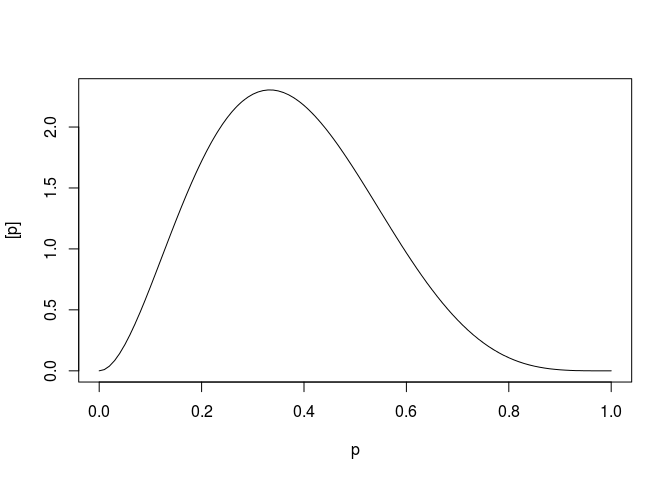 

```r
pbeta(.9, 3, 5)
```

```
## [1] 0.9998235
```

These priors would complete our specification of our Bayesian hierarchical model. 

$$y_i \sim Poisson(\lambda)$$

$$z_i \sim Binomial(y_i, p)$$

$$\lambda \sim gamma(2.5, 1.1)$$

$$p \sim beta(3, 5)$$

Suppose we have data from 100 females, and we'd like to update our priors given this new information. 
First, visualizing the data a bit:


```r
library(dplyr)
library(ggplot2)
d <- read.csv('eggs.csv')

# calculate proportion of eggs surviving
d <- d %>%
  mutate(p_survive = fledglings / eggs)
tbl_df(d)
```

```
## Source: local data frame [200 x 5]
## 
##     eggs fledglings bird_mass population p_survive
##    (int)      (int)     (dbl)     (fctr)     (dbl)
## 1      1          0 0.2278972          A      0.00
## 2      2          1 0.7182951          A      0.50
## 3      2          2 1.4752230          A      1.00
## 4      3          3 0.7623340          A      1.00
## 5      4          3 2.7034917          A      0.75
## 6      4          3 3.7814117          A      0.75
## 7      2          1 8.4822438          A      0.50
## 8      0          0 0.1786772          A       NaN
## 9      3          0 4.6517436          A      0.00
## 10     0          0 4.9095815          A       NaN
## ..   ...        ...       ...        ...       ...
```

```r
ggplot(d, aes(x=eggs)) + 
  geom_histogram()
```

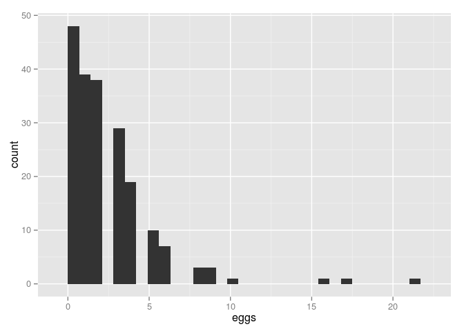 

```r
ggplot(d, aes(x=p_survive)) + 
  geom_histogram()
```

 

Notice that for birds that did not lay eggs, we have NA values in the proportion of eggs surviving. 
As a result, these individuals will not provide information on $p$ in the above model, because they cannot contribute to a binomial likelihood with $k=0$.

We can translate the model outlined above to Stan as follows to produce the file `eggs.stan`:

```
data {
  // poisson data
  int n;
  int y[n];
  
  // binomial data
  int n_b;
  int k[n_b];
  int z[n_b];
}

parameters {
  real<lower=0> lambda;
  real<lower=0, upper=1> p;
}

model {
  // priors
  lambda ~ gamma(2.5, 1.1);
  p ~ beta(3, 5);
  
  // likelihood
  y ~ poisson(lambda);
  z ~ binomial(k, p);
}
```

Now we can bundle our data to work with the model and estimate the parameters:


```r
stan_d <- list(
  n = nrow(d), 
  y = d$eggs, 
  n_b = sum(d$eggs > 0), 
  k = d$eggs[d$eggs > 0], 
  z = d$fledglings[d$eggs > 0]
)

library(rstan)
m <- stan('eggs.stan', data=stan_d)
```


```r
m
```

```
## Inference for Stan model: eggs.
## 4 chains, each with iter=2000; warmup=1000; thin=1; 
## post-warmup draws per chain=1000, total post-warmup draws=4000.
## 
##           mean se_mean   sd    2.5%     25%     50%     75%   97.5% n_eff
## lambda    2.43    0.00 0.11    2.22    2.35    2.42    2.50    2.65  2403
## p         0.62    0.00 0.02    0.58    0.60    0.62    0.63    0.66  2042
## lp__   -384.53    0.03 1.01 -387.32 -384.91 -384.20 -383.81 -383.55  1173
##        Rhat
## lambda    1
## p         1
## lp__      1
## 
## Samples were drawn using NUTS(diag_e) at Sat Nov 28 21:18:35 2015.
## For each parameter, n_eff is a crude measure of effective sample size,
## and Rhat is the potential scale reduction factor on split chains (at 
## convergence, Rhat=1).
```

```r
traceplot(m)
```

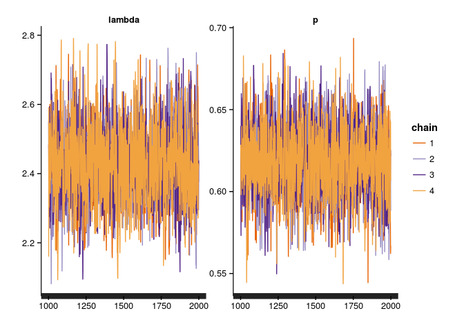 

## Non-centered parameterizations for random effects

The previous model is fairly unsatisfactory in that it assumes that all individuals have the same fecundity and egg to fledgling survival. 
Expecting that this assumption is probably false, we may wish to allow individuals to vary in these quantities. 
One way to do this would be with a normal (on the link scale) random effect, exactly like log-normal overdispersion and logit-normal overdispersion for the Poisson and binomial examples covered earlier. 
For instance, we might write such a model as:

$$y_i \sim Poisson(\lambda)$$

$$z_i \sim Binomial(y_i, p)$$

$$log(\lambda) \sim N(\mu_\lambda, \sigma_\lambda)$$

$$logit(p) \sim N(\mu_p, \sigma_p)$$

$$\mu_\lambda \sim N(0, 1)$$

$$\sigma_\lambda \sim halfNormal(0, 2)$$

$$\mu_p \sim N(0, 2)$$

$$\sigma_p \sim halfNormal(0, 1.5)$$

For the purposes of illustration, we've provided somewhat vague priors, but one could adapt these to reflect the priors that we expressed in the simpler model. 
Much has been written on how to choose priors for hierarchical variance parameters.
The main take home is to avoid hard upper limits and instead to use priors that reflect your previous beliefs with soft constraints, such as half-Cauchy, half-t, or half-normal.
See the further reading section for a good reference on selecting good priors for these hyperparameters. 
In this model, the log fecundity and logit survival probabilities are drawn from independent normal distributions, allowing for individual variation around the population means. 

Updating our model and calling it `egg_ranef.stan`, we might get:

```
data {
  // poisson data
  int n;
  int y[n];
  
  // binomial data
  int n_b;
  int k[n_b];
  int z[n_b];
}

parameters {
  vector[n] log_lambda;
  vector[n_b] logit_p;
  real mu_lambda;
  real mu_p;
  real<lower=0> sigma_lambda;
  real<lower=0> sigma_p;
}

model {
  // priors
  mu_lambda ~ normal(0, 1);
  mu_p ~ normal(0, 2);
  sigma_lambda ~ normal(0, 2);
  sigma_p ~ normal(0, 1.5);
  
  log_lambda ~ normal(mu_lambda, sigma_lambda);
  logit_p ~ normal(mu_p, sigma_p);
  
  // likelihood
  y ~ poisson_log(log_lambda);
  z ~ binomial_logit(k, logit_p);
}
```

Fitting the new model:


```r
m <- stan('egg_ranef.stan', data=stan_d, 
          pars=c('mu_lambda', 'mu_p', 'sigma_lambda', 'sigma_p', 'lp__'))
```

```
## The following numerical problems occured the indicated number of times on chain 1
## If this warning occurs sporadically, such as for highly constrained variable types like covariance matrices, then the sampler is fine,but if this warning occurs often then your model may be either severely ill-conditioned or misspecified.
## The following numerical problems occured the indicated number of times on chain 2
## If this warning occurs sporadically, such as for highly constrained variable types like covariance matrices, then the sampler is fine,but if this warning occurs often then your model may be either severely ill-conditioned or misspecified.
```


```r
traceplot(m)
```

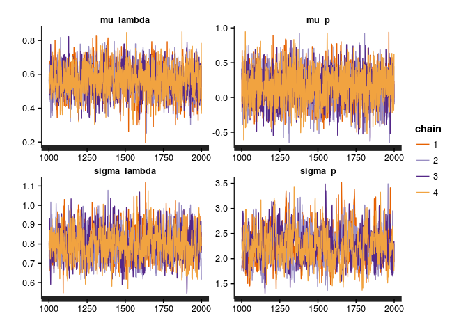 

```r
m
```

```
## Inference for Stan model: egg_ranef.
## 4 chains, each with iter=2000; warmup=1000; thin=1; 
## post-warmup draws per chain=1000, total post-warmup draws=4000.
## 
##                 mean se_mean    sd    2.5%     25%     50%     75%   97.5%
## mu_lambda       0.56    0.00  0.09    0.39    0.51    0.56    0.62    0.73
## mu_p            0.15    0.00  0.23   -0.32    0.00    0.15    0.31    0.62
## sigma_lambda    0.80    0.00  0.08    0.66    0.75    0.80    0.85    0.95
## sigma_p         2.25    0.01  0.33    1.66    2.02    2.23    2.46    2.95
## lp__         -346.32    0.99 21.36 -389.40 -360.40 -345.82 -331.97 -305.10
##              n_eff Rhat
## mu_lambda     1599 1.00
## mu_p          3131 1.00
## sigma_lambda   985 1.00
## sigma_p        523 1.00
## lp__           462 1.01
## 
## Samples were drawn using NUTS(diag_e) at Sat Nov 28 21:19:12 2015.
## For each parameter, n_eff is a crude measure of effective sample size,
## and Rhat is the potential scale reduction factor on split chains (at 
## convergence, Rhat=1).
```

It turns out that this parameterization is not optimal. 
We can greatly increase the efficiency of our model by using a "non-centered" parameterization for the normal random effects. 
The basis for this lies in the fact that we can recover a random vector $y \sim N(\mu, \sigma)$ by first generating a vector of standard normal variates: $y_{raw} \sim N(0, 1)$, and then translating the sample to the mean and rescaling all values by $\sigma$: 

$$ y = \mu + y_{raw} \sigma $$

This is more efficient because the MCMC algorithm used with Stan is highly optimized to sample from posteriors with geometry corresponding to N(0, 1) distributions. 
This trick is incredibly useful for nearly all hierarchical models in Stan that use normal random effects.
We can do this translation and scaling in the transformed parameters block, generating the following file called `egg_ncp.Stan`:

```
data {
  // poisson data
  int n;
  int y[n];

  // binomial data
  int n_b;
  int k[n_b];
  int z[n_b];
}

parameters {
  vector[n] log_lambdaR;
  vector[n_b] logit_pR;
  real mu_lambda;
  real mu_p;
  real<lower=0> sigma_lambda;
  real<lower=0> sigma_p;
}

transformed parameters {
  vector[n] log_lambda;
  vector[n_b] logit_p;
  
  log_lambda <- mu_lambda + log_lambdaR * sigma_lambda;
  logit_p <- mu_p + logit_pR * sigma_p;
}

model {
  // priors
  mu_lambda ~ normal(0, 1);
  mu_p ~ normal(0, 2);
  sigma_lambda ~ normal(0, 2);
  sigma_p ~ normal(0, 1.5);

  log_lambdaR ~ normal(0, 1);
  logit_pR ~ normal(0, 1);

  // likelihood
  y ~ poisson_log(log_lambda);
  z ~ binomial_logit(k, logit_p);
}
```

Fitting our new model:


```r
m <- stan('egg_ncp.stan', data=stan_d)
```


```r
traceplot(m, pars=c('mu_lambda', 'mu_p', 'sigma_lambda', 'sigma_p', 'lp__'))
```

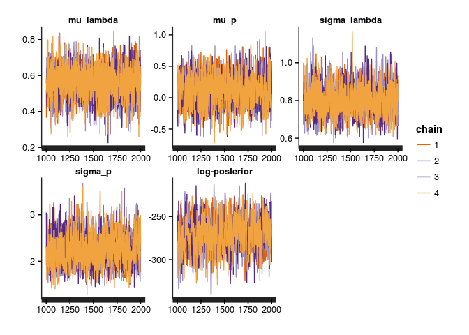 

```r
print(m, pars=c('mu_lambda', 'mu_p', 'sigma_lambda', 'sigma_p', 'lp__'))
```

```
## Inference for Stan model: egg_ncp.
## 4 chains, each with iter=2000; warmup=1000; thin=1; 
## post-warmup draws per chain=1000, total post-warmup draws=4000.
## 
##                 mean se_mean    sd    2.5%     25%     50%     75%   97.5%
## mu_lambda       0.56    0.00  0.08    0.40    0.51    0.56    0.62    0.72
## mu_p            0.14    0.01  0.24   -0.34   -0.02    0.14    0.30    0.60
## sigma_lambda    0.80    0.00  0.08    0.66    0.75    0.80    0.85    0.97
## sigma_p         2.25    0.01  0.32    1.66    2.01    2.22    2.45    2.94
## lp__         -269.64    0.72 18.05 -307.36 -281.21 -269.37 -257.65 -234.77
##              n_eff Rhat
## mu_lambda     2282 1.00
## mu_p          1626 1.00
## sigma_lambda   960 1.00
## sigma_p       1037 1.00
## lp__           627 1.01
## 
## Samples were drawn using NUTS(diag_e) at Sat Nov 28 21:19:51 2015.
## For each parameter, n_eff is a crude measure of effective sample size,
## and Rhat is the potential scale reduction factor on split chains (at 
## convergence, Rhat=1).
```

We might be interested in whether there is any correlation between egg output and egg survival. 
To explore this, we can plot the random effects on the link scale:


```r
post <- extract(m)
ll_meds <- apply(post$log_lambda, 2, median)
lp_meds <- apply(post$logit_p, 2, median)
plot(exp(ll_meds[d$eggs > 0]), plogis(lp_meds))
```

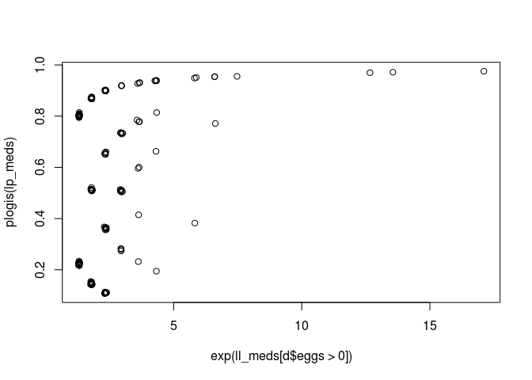 

That plot is not so informative, but if we are interested in the correlation, we can simply calculate the correlation for each draw to get the posterior distribution for the correlation. 
This is one of the huge advantages of Bayesian inference: we can calculate the posterior distribution for any derived parameters using posterior draws. 


```r
n_iter <- length(post$lp__)
cor_post <- rep(NA, n_iter)
for (i in 1:n_iter){
  cor_post[i] <- cor(post$log_lambda[i, d$eggs > 0], 
                     post$logit_p[i, ])
}
hist(cor_post, breaks=seq(-1, 1, .02))
```

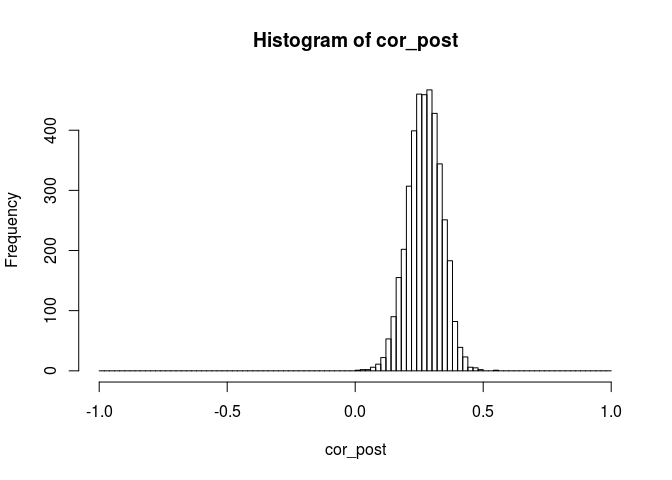 

It appears that birds that produce many eggs tend to have higher per-egg survival. 
But, we haven't included this correlation in the model explicitly. 
Generally speaking correlations between two random variables A and B can result from three causal scenarios: 

- A or B have a causal effect on eachother, directly or indirectly
- A and B are both affected by some other quantity or quantities
- we have conditioned on a variable that is influence by A and B (also known as Berkson's paradox)

In this case, we can model correlation between these two latent quantities by way of multivariate normal random effects rather than two independent univariate normal random effects. 

## Multivariate normal random effects

In many cases, we have multiple random effects which may be correlated. 
In these instances, many turn to the multivariate normal distribution, which generalizes the univariate normal distribution to N dimensions. 
The multivariate normal distribution has two parameters: $\mu$, which is a vector with $N$ elements, each describing the mean of the distribution in each dimension, and $\Sigma$, an $N$ by $N$ covariance matrix that encodes the variance in each dimension and correlation among dimensions. 
Any multivariate normal random vector will be a point in $N$ dimensional space. 

Consider the bivariate normal distribution, a multivariate normal with $N=2$ dimensions. 
The mean vector will have two elements $\mu_1$ and $\mu_2$, that provide the center of mass in the first and second dimension. 
The covariance matrix will have two rows and columns. 
We might write these parameters as follows: 

$\boldsymbol{\mu} = \begin{bmatrix}
\mu_1 \\
\mu_2
\end{bmatrix},$
$\boldsymbol{\Sigma} = \begin{bmatrix}
Cov[X_1, X_1] & Cov[X_1, X_2] \\
Cov[X_2, X_1] & Cov[X_2, X_2]
\end{bmatrix}$

The element of $Sigma$ in the $i^{th}$ row and $j^{th}$ column describes the covariance between the $i^{th}$ and $j^{th}$ dimension. 
By definition, the covariance between one random variable and itself (e.g., $Cov[X_1, X_1]$ and $Cov[X_2, X_2]$) is the variance of the random variable, $\sigma^2_{X_1}$ and $\sigma^2_{X_2}$.

For concreteness, suppose that we're considering the following multivariate normal distribution: 

$\boldsymbol{\mu} = \begin{bmatrix}
0 \\
0
\end{bmatrix},$
$\boldsymbol{\Sigma} = \begin{bmatrix}
1 & 0.5 \\
0.5 & 1
\end{bmatrix}$

We can visualize the density of this bivariate normal as with a heatmap: 

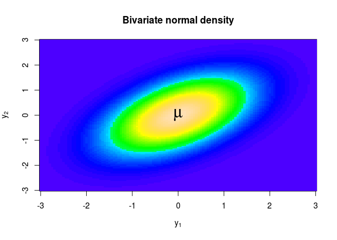 

### Non-centered parameterization: multivariate normal

As with univariate normal random effects, a noncentered parameterization can greatly improve MCMC convergence and efficiency. 
To acheive this, we first define the Cholesky factor of a matrix $L$, which is lower triangular, and which equals sigma when multiplied by it's own transpose: $\Sigma = L L^{T}$. 
Given $L$, which is a lower triangular $d$ by $d$ matrix, $\mu$, which is the mean vector with length $d$, and $z$, which is a vector of $d$ standard normal N(0, 1) deviates, we can generate a draw from $d$ dimensional multivariate normal distribution $MvN(\mu, \Sigma)$ as follows: 

$$y = \mu + L z$$

Sometimes, it is convenient to parameterize the multivariate normal in terms of a Cholesky decomposed correlation matrix $L_R$ such that $L_R L_R^T = R$ and a vector of standard deviations $\sigma$, which can be coerced into a diagonal matrix that has the same dimensions as the desired covariance matrix. 
If we have these, then we can adapt the above equation to obtain:

$$y = \mu + diag(\sigma) L_R z$$

This parameterization is most useful for hierarchical models, because we can place separate priors on correlation matrices and on the standard deviations. 
For correlation matrices, it is currently recommended to use LKJ priors, which can be specified on the cholesky decomposed matrix (obviating the need for Cholesky decompositions at each MCMC iteration). 
The LKJ correlation distribution has one parameter that specifies how concentrated the correlations are around a uniform distribution $\eta = 1$, or the identity matrix with all correlations (non-diagonal elements) equal to zero when $\eta$ is very large. 
An LKJ correlation with $\eta=2$ implies a prior in which correlations are somewhat concentrated on zero. 
Below are the LKJ prior correlations implied by different values of $\eta$.

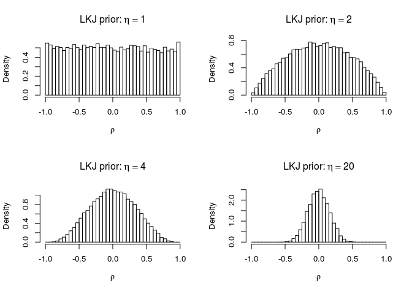 

Let's expand the above model to explicitly allow for correlation between egg survival and egg output. 
This tends to be useful computationally when parameters are correlated, but it also may be of practical use if egg output or survival are incompletely observed and we'd like to predict the missing data using information on correlated quantities. 
The main difference will be that instead of two separate univariate normal random effects, we instead have one bivariate normal distribution, and we're modeling correlation between the two dimensions. 

$$y_i \sim Poisson(\lambda)$$

$$z_i \sim Binomial(y_i, p)$$

$$log(\lambda_i) = \alpha_{1i}$$

$$logit(p) = \alpha_{2i}$$

$$\alpha_i \sim N(\mu, \Sigma)$$

$$\mu \sim N(0, 2)$$

$$\Sigma = (diag(\sigma) L_R) (diag(\sigma) L_R)^T$$

$$\sigma \sim halfNormal(0, 2)$$

$$L_R \sim LKJcorr(2)$$

With this new parameterization, we can estimate a random effect vector $\alpha_i$ of length 2 for each individual $i=1, ..., N$, with elements corresponding to the log expected number of eggs and logit probability of survival for each egg. 
However, recall that not all individual contribute to the likelihood for egg survival. 
In particular, we have no survival data from birds that laid zero eggs. 
This bivariate approach allows us to combine information so that the number of eggs laid informs our estimates of survival probabilities. 
In this way, we will be able to predict the survival probability of eggs from individuals that did not lay eggs. 
Here is a Stan model statement, saved in the file `egg_lkj.stan`:

```
data {
  // poisson data
  int n;
  int y[n];

  // binomial data
  int n_b;
  int p_index[n_b];
  int k[n_b];
  int x[n_b];
}

parameters {
  matrix[2, n] z;
  vector[2] mu;
  cholesky_factor_corr[2] L;
  vector<lower=0>[2] sigma;
}

transformed parameters {
  matrix[n, 2] alpha;
  vector[n] log_lambda;
  vector[n_b] logit_p;
  alpha <- (diag_pre_multiply(sigma, L) * z)';
  
  for (i in 1:n) log_lambda[i] <- alpha[i, 1];
  log_lambda <- log_lambda + mu[1];
  
  for (i in 1:n_b){
    logit_p[i] <- alpha[p_index[i], 2];
  }
  logit_p <- logit_p + mu[2];
}

model {
  // priors
  mu ~ normal(0, 2);
  sigma ~ normal(0, 2);
  L ~ lkj_corr_cholesky(2);
  to_vector(z) ~ normal(0, 1);

  // likelihood
  y ~ poisson_log(log_lambda);
  x ~ binomial_logit(k, logit_p);
}

generated quantities {
  // recover the correlation matrix
  matrix[2, 2] Rho;
  
  Rho <- multiply_lower_tri_self_transpose(L);
}
```

Again, here the idea is to not directly sample from the multivariate normal distribution, but instead to sample from a simpler distribution (univariate standard normal), and transform these values using the cholesky factor of the correlation matrix, vector of standard deviations, and vector of means to generate multivariate normal parameters. 
It is possible to sample directly from the multivariate normal distribution, but this approach is much more computationally efficient.
We have to generate the indexes for the survival observations, bundle the data, and then we can fit the model:


```r
p_ind <- which(d$eggs > 0)
stan_d <- list(
  n = nrow(d), 
  y = d$eggs, 
  n_b = sum(d$eggs > 0), 
  p_index = p_ind,
  k = d$eggs[d$eggs > 0], 
  x = d$fledglings[d$eggs > 0]
)
m <- stan('egg_lkj.stan', data=stan_d, 
          pars=c('Rho', 'alpha', 'sigma', 'mu'))
```

Let's check convergence for the hyperparameters, which usually implies convergence of the child parameters:


```r
print(m, pars=c('Rho', 'sigma', 'mu', 'lp__'))
```

```
## Inference for Stan model: egg_lkj.
## 4 chains, each with iter=2000; warmup=1000; thin=1; 
## post-warmup draws per chain=1000, total post-warmup draws=4000.
## 
##             mean se_mean    sd    2.5%     25%     50%     75%   97.5%
## Rho[1,1]    1.00    0.00  0.00    1.00    1.00    1.00    1.00    1.00
## Rho[1,2]    0.85    0.00  0.08    0.68    0.81    0.86    0.91    0.97
## Rho[2,1]    0.85    0.00  0.08    0.68    0.81    0.86    0.91    0.97
## Rho[2,2]    1.00    0.00  0.00    1.00    1.00    1.00    1.00    1.00
## sigma[1]    0.78    0.00  0.07    0.64    0.73    0.78    0.83    0.92
## sigma[2]    2.33    0.01  0.34    1.74    2.10    2.31    2.55    3.06
## mu[1]       0.57    0.00  0.08    0.40    0.52    0.58    0.63    0.74
## mu[2]      -0.63    0.01  0.28   -1.21   -0.80   -0.61   -0.44   -0.12
## lp__     -298.09    0.73 19.06 -335.80 -310.88 -297.73 -284.60 -262.07
##          n_eff Rhat
## Rho[1,1]  4000  NaN
## Rho[1,2]   462 1.02
## Rho[2,1]   462 1.02
## Rho[2,2]  3137 1.00
## sigma[1]  1001 1.00
## sigma[2]  1119 1.00
## mu[1]      983 1.00
## mu[2]      933 1.00
## lp__       681 1.01
## 
## Samples were drawn using NUTS(diag_e) at Sat Nov 28 21:21:18 2015.
## For each parameter, n_eff is a crude measure of effective sample size,
## and Rhat is the potential scale reduction factor on split chains (at 
## convergence, Rhat=1).
```

```r
traceplot(m, pars=c('Rho', 'sigma', 'mu', 'lp__'))
```

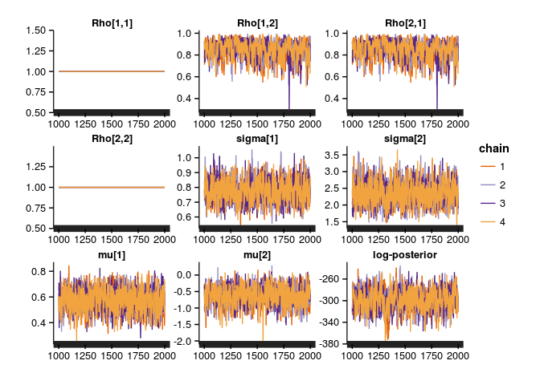 

In this example, we might proceed by adding "fixed" effects of body mass, so that we can evaluate how much of the correlation between clutch size and survival may be related to body size. 
We leave this as an exercise, but point out that this can be accomplished using design matrices or for-loops in the Stan file. 

## Varying intercepts and slopes

Some of the most common applications of Bayesian hierarchical models involve intercept and slope parameters that vary among groups. 
In these cases, it is often wise to allow the intercepts and slopes to correlate, and this is mostly accomplished via multivariate normal random effects, where one dimension corresponds to intercepts, and the other to slopes. 
To demonstrate this, we will use a classic example from a sleep study in which the reaction times of 18 subjects was measured daily with increasing levels of sleep deprivation. 


```r
library(lme4)
ggplot(sleepstudy, aes(x=Days, y=Reaction)) + 
  geom_point() + 
  stat_smooth(method='lm') +
  facet_wrap(~ Subject)
```

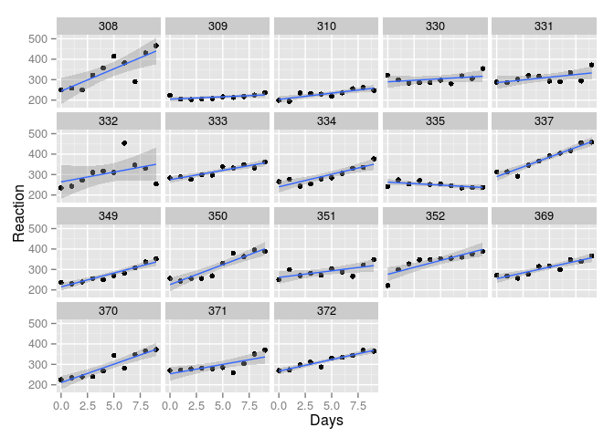 

We might envision the following model that allows the intercepts (reaction on day 0) and slope (daily change in expected reaction time) to vary among subjects, with normally distributed error, indexing subjects by $i$ and days by $t$:

$$y_{it} \sim N(\mu_{it}, \sigma_y)$$

$$\mu_{it} = \alpha_i + \beta_i t$$

$$\begin{bmatrix} 
\alpha_i \\
\beta_i
\end{bmatrix} \sim N \bigg(
\begin{bmatrix} 
\mu_\alpha \\
\mu_\beta
\end{bmatrix}, 
\Sigma \bigg)$$

We can implement this model in `lme4` if we want:


```r
mle <- lmer(Reaction ~ Days + (Days | Subject), data=sleepstudy)
```

Or, we could translate the model to Stan:

```
data {
  int n;
  vector[n] y;
  int n_subject;
  int n_t;
  
  // indices
  int<lower=1, upper=n_subject> subject[n];
  int<lower=1, upper=n_t> t[n];
}

parameters {
  matrix[2, n_subject] z;
  vector[2] mu;
  cholesky_factor_corr[2] L;
  vector<lower=0>[2] sigma;
  real<lower=0> sigma_y;
}

model {
  to_vector(z) ~ normal(0, 1);
}
```


```r
stan_d <- list(n = nrow(sleepstudy), 
               y = sleepstudy$Reaction, 
               tmax = max(sleepstudy$Days), 
               t = sleepstudy$Days, 
               n_subject = max(as.numeric(sleepstudy$Subject)), 
               subject = as.numeric(sleepstudy$Subject))
m <- stan('sleep.stan', data=stan_d, 
          pars = c('mu', 'sigma', 'sigma_y', 'alpha', 'Rho'))
```

Checking convergence:


```r
traceplot(m, pars = c('mu', 'sigma', 'sigma_y', 'Rho'))
```

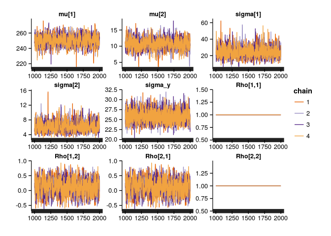 

```r
print(m, pars = c('mu', 'sigma', 'sigma_y', 'Rho'))
```

```
## Inference for Stan model: sleep.
## 4 chains, each with iter=2000; warmup=1000; thin=1; 
## post-warmup draws per chain=1000, total post-warmup draws=4000.
## 
##            mean se_mean   sd   2.5%    25%    50%    75%  97.5% n_eff Rhat
## mu[1]    250.52    0.17 6.63 237.34 246.24 250.62 254.83 263.80  1440    1
## mu[2]     10.76    0.05 1.68   7.44   9.72  10.78  11.85  14.08  1180    1
## sigma[1]  24.04    0.17 6.54  13.10  19.62  23.37  27.65  38.46  1561    1
## sigma[2]   6.20    0.04 1.36   4.01   5.23   6.04   6.99   9.26  1390    1
## sigma_y   25.88    0.03 1.59  23.01  24.78  25.80  26.91  29.18  4000    1
## Rho[1,1]   1.00    0.00 0.00   1.00   1.00   1.00   1.00   1.00  4000  NaN
## Rho[1,2]   0.13    0.01 0.27  -0.39  -0.06   0.13   0.32   0.64   752    1
## Rho[2,1]   0.13    0.01 0.27  -0.39  -0.06   0.13   0.32   0.64   752    1
## Rho[2,2]   1.00    0.00 0.00   1.00   1.00   1.00   1.00   1.00  3930    1
## 
## Samples were drawn using NUTS(diag_e) at Sat Nov 28 21:21:59 2015.
## For each parameter, n_eff is a crude measure of effective sample size,
## and Rhat is the potential scale reduction factor on split chains (at 
## convergence, Rhat=1).
```

These results are not very different than those of the `lmer` implementation, but with a Bayesian implementation we immediately have the full posterior distribution for every parameter, which is a huge advantage. 

## Further reading

Hobbs and Hooten. 2015. *Bayesian models: a statistical primer for ecologists*. Chapter 6. 

Gelman and Hill. 2009. *Data analysis using regression and multilevel/hierarchical models*. Chapter 12-15.

Gelman, A., J. Hill, and M. Yajima. 2012. Why We (Usually) Don’t Have to Worry About Multiple Comparisons. Journal of Research on Educational Effectiveness 5:189–211.  

Gelman, Andrew. Prior distributions for variance parameters in hierarchical models (comment on article by Browne and Draper). Bayesian Anal. 1 (2006), no. 3, 515--534.


Chapter 8: Hierarchical model construction
===============================

This is where I think we will have the greatest impact on students future work. Translating problems to models is a key skill, and it may take a fair bit of practice. Tools to implement include graphical skills (e.g. drawing DAGs), and familiarity with probability distributions.

- parameter, process, and observation models
- building complexity from simple pieces
- translating biological problems and observations to models
- example: what method works best for detecting a species?
- example: error in variables models
- more practice in developing models (don't necessarily have to implement)


Chapter 9: Model comparison
================

I envisions this as occuring a bit more ad hoc during the second half as students start to build their own models

- start with simpler models and build (may be counterintuitive for those used to step-down procedures)
- posterior prediction
- DIC, wAIC
- cross-checking
- simulated data

#### Reading

Hooten, M. B., and N. T. Hobbs. 2015. A guide to Bayesian model selection for ecologists. Ecological Monographs 85:3–28.  
