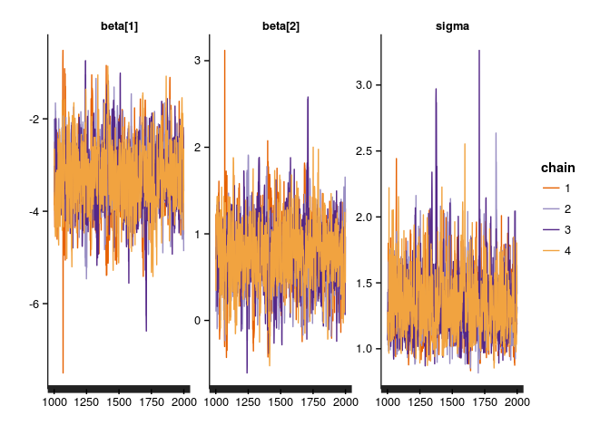

# Hierarchical modeling course notes
Max Joseph  
November 16, 2015  


Chapter 1: Linear models
========================

## Big picture

This course builds on an understanding of the mechanics of linear models. 
Here we introduce some key topics that will facilitate future understanding hierarchical models.

#### Learning goals

<!---
I haven't added anything about interaction effects or centering covariates yet. 
Maybe this would fit well in the general linear model section?
Centering covariates might also be good in the linear regression section. 
Or, maybe it's worth deferring to Gelman and Hill on centering and streamlining the notes?
I also was not sure what we were thinking about varying structure and standard errors. 
Did you have something in mind here?
I have avoided talking much about standard errors yet because it's a fairly 
frequentist notion (sd of the sampling distribution)
-->

- linear regression with `lm`
- intercepts, "categorical" effects
- varying model structure to estimate effects and standard errors
- interactions as variation in slope estimates for different groups
- centering input variables and intepreting resulting parameters
- assumptions and unarticulated priors
- understanding residual variance (Gaussian)
- understanding all of the above graphically
- understanding and plotting output of lm
- notation and linear algebra review: $X\beta$

Linear regression, ANOVA, ANCOVA, and multiple regression models are all species cases of general linear models (hereafter "linear models"). 
In all of these cases, we have observed some response variable $y$, which is potentially modeled as a function of some covariate(s) $x_1, x_2, ..., x_p$.

## Model of the mean

If we have no covariates of interest, then we may be interested in estimating the population mean and variance of the random variable $Y$ based on $n$ observations, corresponding to the values $y_1, ..., y_n$. 
Here, capital letters indicate the random variable, and lowercase corresponds to realizations of that variable. 
This model is sometimes referred to as the "model of the mean". 


```r
# simulating a sample of y values from a normal distribution
y <- rnorm(20)
plot(y)
```

 

We have two parameters to estimate: the mean of $Y$, which we'll refer to as $\mu$, and the variance of $Y$, which we'll refer to as $\sigma^2$. 
Here, and in general, we will use greek letters to refer to parameters. 
If $Y$ is normally distributed, then we can assume that the realizations or samples $y$ that we observe are also normally distributed: $y \sim N(\mu, \sigma^2)$. 
Here and elsewhere, the $\sim$ symbol represents that some quantity "is distributed as" something else (usually a probability distribution). 
You can also think of $\sim$ as meaning "is sampled from".
A key concept here is that we are performing statistical inference, meaning we are trying to learn about (estimate) population-level parameters with sample data. 
In other words, we are not trying to learn about the sample mean $\bar{y}$ or sample variance of $y$. 
These can be calculated and treated as known once we have observed a particular collection of $y$ values. 
The unknown quantities $\mu$ and $\sigma^2$ are the targets of inference. 

Fitting this model (and linear models in general) is possible in R with the `lm` function. 
For this rather simple model, we can estimate the parameters as follows:


```r
# fitting a model of the mean with lm
m <- lm(y ~ 1)
summary(m)
```

```
## 
## Call:
## lm(formula = y ~ 1)
## 
## Residuals:
##     Min      1Q  Median      3Q     Max 
## -1.6291 -0.5263 -0.1141  0.8091  1.6353 
## 
## Coefficients:
##             Estimate Std. Error t value Pr(>|t|)
## (Intercept)   0.3617     0.2108   1.716    0.102
## 
## Residual standard error: 0.9426 on 19 degrees of freedom
```

The summary of our model object `m` provides a lot of information. 
For reasons that will become clear shortly, the estimated population mean is referred to as the "Intercept". 
Here, we get a point estimate for the population mean $\mu$: 0.362 and an estimate of the residual standard deviation $\sigma$: 0.943, which we can square to get an estimate of the residual variance $\sigma^2$: 0.888.

## Linear regression

Often, we are interested in estimating the mean of $Y$ as a function of some other variable, say $X$. 
Simple linear regression assumes that $y$ is again sampled from a normal distribution, but this time the mean or expected value of $y$ is a function of $x$:

$$y_i \sim N(\mu_i, \sigma^2)$$

$$\mu_i = \alpha + \beta x_i$$

Here, subscripts indicate which particular value of $y$ and $x$ we're talking about. 
Specifically, we observe $n$ pairs of values: $(y_i, x_i), ..., (y_n, x_n)$, with all $x$ values known exactly.
Linear regression models can equivalently be written as follows:

$$y_i = \alpha + \beta x_i + \epsilon_i$$

$$\epsilon_i \sim N(0, \sigma^2)$$

Key assumptions here are that each of the error terms $\epsilon_1, ..., \epsilon_n$ are normally distributed around zero with some variance (i.e., the error terms are identically distributed), and that the value of $\epsilon_1$ does not affect the value of any other $\epsilon$ (i.e., the errors are independent).
This combination of assumptions is often referred to as "independent and identically distributed" or i.i.d. 
Equivalently, given some particular $x_i$ and a set of linear regression parameters, the distribution of $y_i$ is normal. 
A common misconception is that linear regression assumes the distribution of $y$ is normal. 
This is wrong - linear regression assumes that the error terms are normally distributed. 
The assumption that the variance $\sigma^2$ is constant for all values of $x$ is referred to as homoskedasticity. 
Rural readers may find it useful to think of skedasticity as the amount of "skedaddle" away from the regression line in the $y$ values. 
If the variance is changing across values of $x$, then the assumption of homoskedasticity is violated and you've got a heteroskedasticity problem. 


```r
# simulate and plot x and y values
n <- 50
x <- runif(n)
alpha <- -2
beta <- 3
sigma <- .4
y <- rnorm(n, mean = alpha + beta * x, sd = sigma)
plot(x, y)

# add known mean function 
lines(x = x, y = alpha + beta * x, col='blue')
legend('topleft', 
       pch = c(1, NA), lty = c(NA, 1), 
       col = c('black', 'blue'), 
       legend = c('Observed data', 'E(y | x)'), 
       bty = 'n')
```

 

The normality assumption means that the probability density of $y$ is highest at the value $\alpha + \beta x$, where the regression line is, and falls off away from the line according to the normal probablity density. 
This graphically looks like a bell 'tube' along the regression line, adding a dimension along $x$ to the classic bell 'curve'.

 

### Model fitting

Linear regression parameters $\alpha$, $\beta$, and $\sigma^2$ can be estimated with `lm`.
The syntax is very similar to the previous model, except now we need to include our covariate `x` in the formula (the first argument to the `lm` function). 


```r
m <- lm(y ~ x)
summary(m)
```

```
## 
## Call:
## lm(formula = y ~ x)
## 
## Residuals:
##      Min       1Q   Median       3Q      Max 
## -0.83406 -0.17346  0.03494  0.23322  0.63511 
## 
## Coefficients:
##             Estimate Std. Error t value Pr(>|t|)    
## (Intercept) -2.03298    0.08625  -23.57   <2e-16 ***
## x            3.16746    0.15594   20.31   <2e-16 ***
## ---
## Signif. codes:  0 '***' 0.001 '**' 0.01 '*' 0.05 '.' 0.1 ' ' 1
## 
## Residual standard error: 0.3403 on 48 degrees of freedom
## Multiple R-squared:  0.8958,	Adjusted R-squared:  0.8936 
## F-statistic: 412.6 on 1 and 48 DF,  p-value: < 2.2e-16
```

The point estimate for the parameter $\alpha$ is called "(Intercept)". 
This is because our estimate for $\alpha$ is the y-intercept of the estimated regression line when $x=0$ (recall that $y_i = \alpha + \beta x_i + \epsilon_i$).
The estimate for $\beta$ is called "x", because it is a coefficient associated with the variable "x" in this model. 
This parameter is often referred to as the "slope", because it represents the increase in the expected value of $y$ for a one unit increase in $x$ (the rise in y over run in x).
Point estimates for the standard deviation and variance of $\epsilon$ can be extracted as before (`summary(m)$sigma` and `summary(m)$sigma^2`).

### Centering and scaling covariates

Often, it's a good idea to "center" covariates so that they have a mean of zero ($\bar{x} = 0$). 
This is achieved by subtracting the sample mean of a covariate from the vector of covariate values ($x - \bar{x}$).
It's also useful to additionally scale covariates so that they are all on a common and unitless scale. 
While many will divide each covariate by its standard deviation, Gelman and Hill (pg. 57) recommend dividing by twice the standard deviation ($s_x$) so that binary covariates are transformed from $x \in \{0, 1\}$ to $x_t \in \{-0.5, 0.5\}$, where $x_t$ is the transformed covariate: $x_t = \frac{x - \bar{x}}{2 s_x}$. 
If covariates are not centered and scaled, then it is common to observe correlations between estimated slopes and intercepts. 

 

So, we expect that in this case, the estimates for the intercept and slope must be negatively correlated.
This is bourne out in the confidence region for our estimates of $\alpha$ and $\beta$. 
Usually, people inspect univariate confidence intervals for parameters, e.g.,


```r
confint(m)
```

```
##                 2.5 %    97.5 %
## (Intercept) -3.872117 -2.693003
## x            0.903557  1.241512
```

This is misleading because our estimates for these parameters are correlated. 
For any given value of the intercept, there are only certain values of the slope that are supported.
To assess this possibility, we might also be interested in the bivariate confidence ellipse for these two parameters. 
We can evaluate this quantity graphically as follows with some help from the `car` package:


```r
library(car)
confidenceEllipse(m)
```

 

This is not great. 
We want to be able to directly use the univariate confidence intervals. 
Our problem can be solved by centering $x$:

 

Now there is no serious correlation in the estimates and we are free to use the univariate confidence intervals without needing to consider the joint distribution of the slope and intercept. 
This trick helps with interpretation, but it will also prove useful later in the course in the context of Markov chain Monte Carlo (MCMC) sampling. 

### Checking assumptions

We have assumed that the distribution of error terms is normally distributed, and this assumption is worth checking. 
Below, we plot a histogram of the residuals (another name for the $\epsilon$ parameters) along with a superimposed normal probability density so that we can check normality. 


```r
hist(resid(m), breaks = 20, freq = F, 
     main = 'Histogram of model residuals')
curve_x <- seq(min(resid(m)), max(resid(m)), .01)
lines(curve_x, dnorm(curve_x, 0, summary(m)$sigma))
```

 

Even when the assumption of normality is correct, it is not always obvious that the residuals are normally distributed. 
Another useful plot for assessing normality of errors is a quantile-quantile or Q-Q plot. 
If the residuals do not deviate much from normality, then the points in a Q-Q plot won't deviate much from the dashed one-to-one line. 
If points lie above or below the line, then the residual is larger or smaller, respectively, than expected based on a normal distribution. 


```r
plot(m, 2)
```

 

To assess heteroskedasticity, it is useful to inspect a plot of the residuals vs. fitted values, e.g. `plot(m, 1)`. 
If it seems as though the spread or variance of residuals varies across the range of fitted values, then it may be worth worrying about homoskedasticity and trying some transformations to fix the problem. 

## Analysis of variance

Sometimes, the covariate of interest is not continuous but instead categorical (e.g., "chocolate", "strawberry", or "vanilla"). 
We might again wonder whether the mean of a random variable $Y$ depends on the value of this covariate. 
However, we cannot really estimate a meaningful "slope" parameter, because in this case $x$ is not continuous. 
Instead, we might formulate the model as follows:

$$y_i \sim N(\alpha_{j[i]}, \sigma^2)$$

Where $\alpha_j$ is the mean of group $j$, and we have $J$ groups total. 
The notation $\alpha_{j[i]}$ represents the notion that the $i^{th}$ observation corresponds to group $j$, and we are going to assume that all observations in the $j^{th}$ group have the same mean, $\alpha_j$. 
The above model is perfectly legitimate, and our parameters to estimate are the group means $\alpha_1, ..., \alpha_J$ and the residual variance $\sigma^2$. 
This parameterization is called the "means" parameterization, and though it is perhaps easier to understand than the following alternative, it is less often used. 

This model is usually parameterized not in terms of the group means, but rather in terms of an intercept (corresponding to the mean of one "reference" group), and deviations from the intercept (differences between a group of interest and the intercept). 
For instance, in R, the group whose mean is the intercept (the "reference" group) will be the group whose name comes first alphabetically. 
Either way, we will estimate the same number of parameters. 
So if our groups are "chocolate", "strawberry", and "vanilla", R will assign the group "chocolate" to be the intercept, and provide 2 more coefficient estimates for the difference between the estimated group mean of strawberry vs. chocoloate, and vanilla vs. chocolate. 

This parameterization can be written as

$$y_i \stackrel{iid}{\sim} N(\mu_0 + \beta_{j[i]}, \sigma^2)$$

where $\mu_0$ is the "intercept" or mean of the reference group, and $\beta_j$ represents the difference in the population mean of group $j$ compared to the reference group (if $j$ is the reference group, the $\beta_j = 0$). 
Traditionally this model is called simple one-way analysis of variance, but we view it simply as another special case of a linear model.

The following example illustrates some data simulation, visualization, and parameter estimation in this context. 
Specifically, we assess 60 humans for their taste response to three flavors of iced cream. 
We want to extrapolate from our sample to the broader population of all ice cream eating humans to learn whether in general people think ice cream tastiness varies as a function of flavor. 


```r
# simulate and visualize data
n <- 60
x <- rep(c("chocolate", "strawberry", "vanilla"), length.out = n)
x <- factor(x)
sigma <- 1
mu_y <- c(chocolate = 3.352, strawberry = .93, vanilla = 1.5)
y <- rnorm(n, mu_y[x], sigma)

library(ggplot2)
ggplot(data.frame(x, y), aes(x, y)) + 
  geom_jitter(position = position_jitter(width=.1)) + 
  xlab('Group') + 
  ylab('Tastiness')
```

 

### Model fitting

We can estimate our parameters with the `lm` function (this should be a strong hint that there are not huge differences between linear regression and ANOVA). 
The syntax is exactly the same as with linear regression. 
The only difference is that our input `x` is not numeric, it's a character vector. 


```r
m <- lm(y ~ x)
summary(m)
```

```
## 
## Call:
## lm(formula = y ~ x)
## 
## Residuals:
##      Min       1Q   Median       3Q      Max 
## -2.01885 -0.53330 -0.08907  0.60145  2.57251 
## 
## Coefficients:
##             Estimate Std. Error t value Pr(>|t|)    
## (Intercept)   2.9887     0.2162  13.823  < 2e-16 ***
## xstrawberry  -1.9144     0.3058  -6.261 5.36e-08 ***
## xvanilla     -1.4427     0.3058  -4.718 1.59e-05 ***
## ---
## Signif. codes:  0 '***' 0.001 '**' 0.01 '*' 0.05 '.' 0.1 ' ' 1
## 
## Residual standard error: 0.967 on 57 degrees of freedom
## Multiple R-squared:  0.4275,	Adjusted R-squared:  0.4074 
## F-statistic: 21.28 on 2 and 57 DF,  p-value: 1.251e-07
```

Because chocolate comes first alphabetically, it is the reference group and the "(Intercept)" estimate corresponds to the estimate of the group-level mean for chocolate. 
The other two estimates are contrasts between the other groups and this reference group, i.e.  "xstrawberry" is the estimated difference between the group mean for strawberry and the reference group. 

If we wish instead to use a means paramaterization, we need to supress the intercept term in our model as follows:


```r
m <- lm(y ~ 0 + x)
summary(m)
```

```
## 
## Call:
## lm(formula = y ~ 0 + x)
## 
## Residuals:
##      Min       1Q   Median       3Q      Max 
## -2.01885 -0.53330 -0.08907  0.60145  2.57251 
## 
## Coefficients:
##             Estimate Std. Error t value Pr(>|t|)    
## xchocolate    2.9887     0.2162  13.823  < 2e-16 ***
## xstrawberry   1.0743     0.2162   4.969 6.49e-06 ***
## xvanilla      1.5461     0.2162   7.151 1.78e-09 ***
## ---
## Signif. codes:  0 '***' 0.001 '**' 0.01 '*' 0.05 '.' 0.1 ' ' 1
## 
## Residual standard error: 0.967 on 57 degrees of freedom
## Multiple R-squared:  0.824,	Adjusted R-squared:  0.8148 
## F-statistic: 88.96 on 3 and 57 DF,  p-value: < 2.2e-16
```

Arguably, this approach is more useful because it simplifies the construction of confidence intervals for the group means:


```r
confint(m)
```

```
##                2.5 %   97.5 %
## xchocolate  2.555779 3.421713
## xstrawberry 0.641367 1.507301
## xvanilla    1.113126 1.979061
```

### Checking assumptions

Our assumptions in this simple one way ANOVA context are identical to our assumptions with linear regression. 
Specifically, we assumed that our errors are independently and identically distributed, and that the variance is constant for each group (homoskedasticity). 
The built in `plot` method for `lm` objects is designed to return diagnostic plots that help to check these assumptions. 


```r
par(mfrow=c(2, 2))
plot(m)
```

 

## General linear models

We have covered a few special cases of general linear models, which are usually written as follows:

$$y \stackrel{iid}{\sim} N(X \beta, \sigma^2)$$

Where $y$ is a vector consisting of $n$ observations, $X$ is a "design" matrix with $n$ rows and $p$ columns, and $\beta$ is a vector of $p$ parameters. 
There are multivariate general linear models (e.g., MANOVA) where the response variable is a matrix and a covariance matrix is used in place of a scalar variance parameter, but we'll stick to univariate models for simplicity.
The key point here is that the producct of $X$ and $\beta$ provides the mean of the normal distribution from which $y$ is drawn. 
From this perspective, the difference between the model of the mean, linear regression, ANOVA, etc., lies in the structure of $X$ and subsequent interpretation of the parameters $\beta$. 
This is a very powerful idea that unites many superficially disparate approaches. 
It also is the reason that these models are considered "linear", even though a regression line might by quite non-linear (e.g., polynomial regression). 
These models are linear in their parameters, meaning that our expected value for the response $y$ is a **linear combination** (formal notion) of the parameters. 
If a vector of expected values for $y$ in some model cannot be represented as $X \beta$, then it is not a linear model. 

In the model of the mean, $X$ is an $n$ by $1$ matrix, with each element equal to $1$ (i.e. a vector of ones). 
With linear regression, $X$'s first column is all ones (corresponding to the intercept parameter), and the second column contains the values of the covariate $x$. 
In ANOVA, the design matrix $X$ will differ between the means and effects parameterizations. 
With a means parameterization, the entries in column $j$ will equal one if observation (row) $i$ is in group $j$, and entries are zero otherwise. 
If you are not comfortable with matrix multiplication, it's worth investing some effort so that you can understand why $X\beta$ is such a powerful construct. 

>Can you figure out the structure of $X$ with R's default effects parameterization?
>You can check your work with `model.matrix(m)`, where `m` is a model that you've fitted with `lm`.

## Interactions between covariates

Often, the effect of one covariate depends on the value of another covariate. 
This is referred to as "interaction" between the covariates. 
Interactions can exist between two or more continuous and/or nominal covariates. 
These situations have special names in the classical statistics literature. 
For example, models with interactions between nominal covariates fall under "factorial ANOVA", those with interactions between a continuous and a nominal covariate are referred to as "analysis of covariance (ANCOVA)". 
Here we prefer to consider these all as special cases of general linear models. 

### Interactions between two continuous covariates

Here we demonstrate simulation and estimation for a model with an interaction between two continuous covariates. 
Notice that in the simulation, we have exploited the $X \beta$ construct to generate a vector of expected values for $y$. 


```r
n <- 50
x1 <- rnorm(n)
x2 <- rnorm(n)
beta <- c(.5, 1, -1, 2)
sigma <- 1
X <- matrix(c(rep(1, n), x1, x2, x1 * x2), nrow=n)
mu_y <- X %*% beta
y <- rnorm(n, mu_y, sigma)
m <- lm(y ~ x1 * x2)
summary(m)
```

```
## 
## Call:
## lm(formula = y ~ x1 * x2)
## 
## Residuals:
##     Min      1Q  Median      3Q     Max 
## -2.9114 -0.5290  0.2147  0.7333  1.7652 
## 
## Coefficients:
##             Estimate Std. Error t value Pr(>|t|)    
## (Intercept)   0.4046     0.1714   2.360   0.0226 *  
## x1            1.0458     0.1933   5.411 2.19e-06 ***
## x2           -0.7238     0.1555  -4.655 2.77e-05 ***
## x1:x2         2.2430     0.1732  12.950  < 2e-16 ***
## ---
## Signif. codes:  0 '***' 0.001 '**' 0.01 '*' 0.05 '.' 0.1 ' ' 1
## 
## Residual standard error: 1.145 on 46 degrees of freedom
## Multiple R-squared:  0.8295,	Adjusted R-squared:  0.8184 
## F-statistic:  74.6 on 3 and 46 DF,  p-value: < 2.2e-16
```

Visualizing these models is tricky, because we are in 3d space (with dimensions $x_1$, $x_2$, and $y$), but contour plots can be effective and leverage peoples' understanding of topographic maps. 


```r
# visualizing the results in terms of the linear predictor
lo <- 40
x1seq <- seq(min(x1), max(x1), length.out = lo)
x2seq <- seq(min(x2), max(x2), length.out = lo)
g <- expand.grid(x1=x1seq, x2=x2seq)
g$e_y <- beta[1] + beta[2] * g$x1 + beta[3] * g$x2 + beta[4] * g$x1 * g$x2
ggplot(g, aes(x=x1, y=x2)) + 
  geom_tile(aes(fill=e_y)) + 
  stat_contour(aes(z=e_y), col='grey') + 
  scale_fill_gradient2() + 
  geom_point(data=data.frame(x1, x2))
```

 

Alternatively, you might check out the `effects` package:


```r
library(effects)
plot(allEffects(m))
```

 

### Interactions between two categorical covariates

Here we demonstrate interaction between two categorical covariates, using the `diamonds` dataset which is in the `ggplot2` package.t
We are interested in the relationship between diamond price, cut quality, and color.


```r
str(ToothGrowth)
```

```
## 'data.frame':	60 obs. of  3 variables:
##  $ len : num  4.2 11.5 7.3 5.8 6.4 10 11.2 11.2 5.2 7 ...
##  $ supp: Factor w/ 2 levels "OJ","VC": 2 2 2 2 2 2 2 2 2 2 ...
##  $ dose: num  0.5 0.5 0.5 0.5 0.5 0.5 0.5 0.5 0.5 0.5 ...
```

```r
ToothGrowth$dose <- factor(ToothGrowth$dose)
ggplot(ToothGrowth, aes(x=interaction(dose, supp), y=len)) + 
  geom_point()
```

 

In general, visualizing the raw data is a good idea. 
However, we might also be interested in a table with group-wise summaries, such as the sample means, standard deviations, and sample sizes. 


```r
library(dplyr)
ToothGrowth %>%
  group_by(dose, supp) %>%
  summarize(mean = mean(len), 
            sd = sd(len), 
            n = n())
```

```
## Source: local data frame [6 x 5]
## Groups: dose [?]
## 
##     dose   supp  mean       sd     n
##   (fctr) (fctr) (dbl)    (dbl) (int)
## 1    0.5     OJ 13.23 4.459709    10
## 2    0.5     VC  7.98 2.746634    10
## 3      1     OJ 22.70 3.910953    10
## 4      1     VC 16.77 2.515309    10
## 5      2     OJ 26.06 2.655058    10
## 6      2     VC 26.14 4.797731    10
```

We can construct a model to estimate the effect of dose, supplement, and their interaction. 


```r
m <- lm(len ~ dose * supp, data = ToothGrowth)
summary(m)
```

```
## 
## Call:
## lm(formula = len ~ dose * supp, data = ToothGrowth)
## 
## Residuals:
##    Min     1Q Median     3Q    Max 
##  -8.20  -2.72  -0.27   2.65   8.27 
## 
## Coefficients:
##              Estimate Std. Error t value Pr(>|t|)    
## (Intercept)    13.230      1.148  11.521 3.60e-16 ***
## dose1           9.470      1.624   5.831 3.18e-07 ***
## dose2          12.830      1.624   7.900 1.43e-10 ***
## suppVC         -5.250      1.624  -3.233  0.00209 ** 
## dose1:suppVC   -0.680      2.297  -0.296  0.76831    
## dose2:suppVC    5.330      2.297   2.321  0.02411 *  
## ---
## Signif. codes:  0 '***' 0.001 '**' 0.01 '*' 0.05 '.' 0.1 ' ' 1
## 
## Residual standard error: 3.631 on 54 degrees of freedom
## Multiple R-squared:  0.7937,	Adjusted R-squared:  0.7746 
## F-statistic: 41.56 on 5 and 54 DF,  p-value: < 2.2e-16
```

This summary gives the effects-parameterization version of the summary. 
The "(Intercept)" refers to the combination of factor levels that occur first alphabetically: in this case, a dose of 0.5 with the "OJ" supplement. 
The coefficients for `dose1` and `dose2` represent estimated contrasts for these two groups relative to the intercept. 
The coefficient for `suppVC` represents the contrast between the "VC" and "OJ" levels of supplement when the dose is 0.5.
The interaction terms represent the difference in the effect of VC for `dose1` and `dose2` relative to a dose of 0.5. 
None of this is particularly intuitive, but this information can be gleaned by inspecting the design matrix $X$ produced by `lm` in the process of fitting the model. 
Inspecting the design matrix along with the dataset to gives a better sense for how $X$ relates to the factor levels:


```r
cbind(model.matrix(m), ToothGrowth)
```

```
##    (Intercept) dose1 dose2 suppVC dose1:suppVC dose2:suppVC  len supp dose
## 1            1     0     0      1            0            0  4.2   VC  0.5
## 2            1     0     0      1            0            0 11.5   VC  0.5
## 3            1     0     0      1            0            0  7.3   VC  0.5
## 4            1     0     0      1            0            0  5.8   VC  0.5
## 5            1     0     0      1            0            0  6.4   VC  0.5
## 6            1     0     0      1            0            0 10.0   VC  0.5
## 7            1     0     0      1            0            0 11.2   VC  0.5
## 8            1     0     0      1            0            0 11.2   VC  0.5
## 9            1     0     0      1            0            0  5.2   VC  0.5
## 10           1     0     0      1            0            0  7.0   VC  0.5
## 11           1     1     0      1            1            0 16.5   VC    1
## 12           1     1     0      1            1            0 16.5   VC    1
## 13           1     1     0      1            1            0 15.2   VC    1
## 14           1     1     0      1            1            0 17.3   VC    1
## 15           1     1     0      1            1            0 22.5   VC    1
## 16           1     1     0      1            1            0 17.3   VC    1
## 17           1     1     0      1            1            0 13.6   VC    1
## 18           1     1     0      1            1            0 14.5   VC    1
## 19           1     1     0      1            1            0 18.8   VC    1
## 20           1     1     0      1            1            0 15.5   VC    1
## 21           1     0     1      1            0            1 23.6   VC    2
## 22           1     0     1      1            0            1 18.5   VC    2
## 23           1     0     1      1            0            1 33.9   VC    2
## 24           1     0     1      1            0            1 25.5   VC    2
## 25           1     0     1      1            0            1 26.4   VC    2
## 26           1     0     1      1            0            1 32.5   VC    2
## 27           1     0     1      1            0            1 26.7   VC    2
## 28           1     0     1      1            0            1 21.5   VC    2
## 29           1     0     1      1            0            1 23.3   VC    2
## 30           1     0     1      1            0            1 29.5   VC    2
## 31           1     0     0      0            0            0 15.2   OJ  0.5
## 32           1     0     0      0            0            0 21.5   OJ  0.5
## 33           1     0     0      0            0            0 17.6   OJ  0.5
## 34           1     0     0      0            0            0  9.7   OJ  0.5
## 35           1     0     0      0            0            0 14.5   OJ  0.5
## 36           1     0     0      0            0            0 10.0   OJ  0.5
## 37           1     0     0      0            0            0  8.2   OJ  0.5
## 38           1     0     0      0            0            0  9.4   OJ  0.5
## 39           1     0     0      0            0            0 16.5   OJ  0.5
## 40           1     0     0      0            0            0  9.7   OJ  0.5
## 41           1     1     0      0            0            0 19.7   OJ    1
## 42           1     1     0      0            0            0 23.3   OJ    1
## 43           1     1     0      0            0            0 23.6   OJ    1
## 44           1     1     0      0            0            0 26.4   OJ    1
## 45           1     1     0      0            0            0 20.0   OJ    1
## 46           1     1     0      0            0            0 25.2   OJ    1
## 47           1     1     0      0            0            0 25.8   OJ    1
## 48           1     1     0      0            0            0 21.2   OJ    1
## 49           1     1     0      0            0            0 14.5   OJ    1
## 50           1     1     0      0            0            0 27.3   OJ    1
## 51           1     0     1      0            0            0 25.5   OJ    2
## 52           1     0     1      0            0            0 26.4   OJ    2
## 53           1     0     1      0            0            0 22.4   OJ    2
## 54           1     0     1      0            0            0 24.5   OJ    2
## 55           1     0     1      0            0            0 24.8   OJ    2
## 56           1     0     1      0            0            0 30.9   OJ    2
## 57           1     0     1      0            0            0 26.4   OJ    2
## 58           1     0     1      0            0            0 27.3   OJ    2
## 59           1     0     1      0            0            0 29.4   OJ    2
## 60           1     0     1      0            0            0 23.0   OJ    2
```

Often, researchers want to know if interactions need to be included in the model. 
From a null hypothesis significance testing perspective, we can evaluate the 'significance' of the interaction term as follows: 


```r
anova(m)
```

```
## Analysis of Variance Table
## 
## Response: len
##           Df  Sum Sq Mean Sq F value    Pr(>F)    
## dose       2 2426.43 1213.22  92.000 < 2.2e-16 ***
## supp       1  205.35  205.35  15.572 0.0002312 ***
## dose:supp  2  108.32   54.16   4.107 0.0218603 *  
## Residuals 54  712.11   13.19                      
## ---
## Signif. codes:  0 '***' 0.001 '**' 0.01 '*' 0.05 '.' 0.1 ' ' 1
```

We find that the interaction between dose and supplement is statistically significant, meaning that if we assume that there is no interaction, it is unlikely to observe data that are as or more extreme as what we have observed over the course of infinitely many replicated experiments that will probably never occur.
Although this is far from intuitive, this approach has been widely used.
We will introduce a more streamlined procedure in chapter 3 that 1) does not assume that the effect is zero to begin with, and 2) does not necessarily invoke a hypothetical infinite number of replicated realizations of the data, conditional on one particular parameter value. 
An alternative approach would be to use information theoretics to decide whether the interaction is warranted:


```r
m2 <- lm(len ~ dose + supp, data = ToothGrowth)
AIC(m, m2)
```

```
##    df      AIC
## m   7 332.7056
## m2  5 337.2013
```

In the past decade following Burnham and Anderson's book on the topic, ecologists have leaned heavily on Akaike's information criterion (AIC), which is a relative measure of model quality (balancing goodness of fit with model complexity). 
Here we see that the original model `m` with interaction has a lower AIC value, and is therefore better supported. 
AIC can be considered to be similar to cross validation, approximating the ability of a model to predict future data.

Being somewhat lazy, we might again choose to plot the results of this model using the `effects` package. 


```r
plot(allEffects(m))
```

 

This is less than satisfying, as it does not show any data. 
All we see is model output. 
If the model is crap, then the output and these plots are also crap. 
But, evaluating the crappiness of the model is difficult when there are no data shown.
Ideally, the data can be shown along with the estimated group means and some indication of uncertainty. 
If we weren't quite so lazy, we could use the `predict` function to obtain confidence intervals for the means of each group. 


```r
# construct a new data frame for predictions
g <- expand.grid(supp = levels(ToothGrowth$supp), 
                 dose = levels(ToothGrowth$dose))
p <- predict(m, g, interval = 'confidence', type='response')
predictions <- cbind(g, data.frame(p))

ggplot(ToothGrowth, aes(x=interaction(dose, supp), y=len)) + 
  geom_segment(data=predictions, 
               aes(y=lwr, yend=upr, 
                   xend=interaction(dose, supp)), col='red') + 
  geom_point(data=predictions, aes(y=fit), color='red', size=2, shape=2) + 
  geom_jitter(position = position_jitter(width=.1), shape=1) + 
  ylab("Length")
```

 

This plot is nice because we can observe the data along with the model output. 
This makes it easier for readers to understand how the model relates to, fits, and does not fit the data.
If you wish to obscure the data, you could make a bar plot with error pars to represent the standard errors. 
Although "dynamite" plots are common, we shall not include one here and we strongly recommend that you never produce such a plot ([more here](http://biostat.mc.vanderbilt.edu/wiki/pub/Main/TatsukiRcode/Poster3.pdf)). 

### Interactions between continuous and categorical covariates

Sometimes, we're interested in interactions between continuous or numeric covariates and another covariates with discrete categorical levels. 
Again, this falls under the broad class of models used in analysis of covariance (ANCOVA). 


```r
x1 <- rnorm(n)
x2 <- factor(sample(c('A', 'B'), n, replace=TRUE))

# generate slopes and intercepts for the first and second groups
a <- rnorm(2)
b <- rnorm(2)
sigma <- .4

X <- matrix(c(ifelse(x2 == 'A', 1, 0), 
              ifelse(x2 == 'B', 1, 0), 
              ifelse(x2 == 'A', x1, 0), 
              ifelse(x2 == 'B', x1, 0)
            ), nrow=n)

mu_y <- X %*% c(a, b)
y <- rnorm(n, mu_y, sigma)
plot(x1, y, col=x2, pch=19)
legend('topright', col=1:2, legend=c('Group A', 'Group B'), pch=19)
```

 

Here the intercepts and slopes are allowed to vary for two groups. 
We can fit a model with an interaction between these covariates. 
The intercepts and slopes are estimated separately for the two groups. 


```r
m <- lm(y ~ x1 * x2)
summary(m)
```

```
## 
## Call:
## lm(formula = y ~ x1 * x2)
## 
## Residuals:
##      Min       1Q   Median       3Q      Max 
## -0.98741 -0.20117  0.00791  0.20823  0.66992 
## 
## Coefficients:
##             Estimate Std. Error t value Pr(>|t|)    
## (Intercept) -0.12712    0.07493  -1.696   0.0966 .  
## x1          -0.53550    0.09122  -5.871 4.52e-07 ***
## x2B         -0.17747    0.11014  -1.611   0.1139    
## x1:x2B      -0.47428    0.13849  -3.425   0.0013 ** 
## ---
## Signif. codes:  0 '***' 0.001 '**' 0.01 '*' 0.05 '.' 0.1 ' ' 1
## 
## Residual standard error: 0.3852 on 46 degrees of freedom
## Multiple R-squared:  0.7395,	Adjusted R-squared:  0.7226 
## F-statistic: 43.54 on 3 and 46 DF,  p-value: 1.737e-13
```

Let's plot the lines of best fit along with the data. 


```r
plot(x1, y, col=x2, pch=19)
legend('topright', col=1:2, legend=c('Group A', 'Group B'), pch=19)
abline(coef(m)[1], coef(m)[2])
abline(coef(m)[1] + coef(m)[3], coef(m)[2] + coef(m)[4], col='red')
```

 

The `abline` function, used above, adds lines to plots based on a y-intercept (first argument) and a slope (second argument). 
Do you understand why the particular coefficients that we used as inputs provide the desired intercepts and slopes for each group? 

## Further reading

Schielzeth, H. 2010. Simple means to improve the interpretability of regression coefficients. Methods in Ecology and Evolution 1:103–113.  

Enqvist, L. 2005. The mistreatment of covariate interaction terms in linear model analyses of behavioural and evolutionary ecology studies. Animal Behaviour 70:967–971.  

Gelman and Hill. 2009. *Data analysis using regression and multilevel/hierarchical models*. Chapter 3-4.


Chapter 2: Maximum likelihood estimation
=============================

## Big picture

The likelihood is defined as the probability of the data, conditional on some parameter(s). 
Having observed some data, we often want to know which particular parameter values maximize the probability of those data. 
These parameter values are referred to as the maximum likelihood estimates. 

The goal here is to connect the notion of a likelihood to probability distributions and models. 
We can obtain maximum likelihood estimates (MLEs) in a few ways: analytically, with brute force (direct search), and via optimization (e.g., the `optim` function).

#### Learning goals

- definition of likelihood
- single parameter models: obtaining a MLE with optim
- model of the mean with unknown variance 
- fitting simple linear models with likelihood
- assumptions (especially related to independence)
- inference (what probability does the likelihood function represent?)

## What is likelihood?

The likelihood function represents the probability of the data $y$, conditioned on the parameter(s) $\theta$.
Mathematically, the likelihood is $p(\pmb{y}|\theta) = \mathcal{L}(\theta | \pmb{y})$, where $\pmb{y}$ is a (possibly) vector-valued sample of observations from the random variable $\pmb{Y} = (Y_1, Y_2, ..., Y_n)$. 
More casually, the likelihood function tells us the probability of having observed the sample that we did under different values of the parameter(s) $\theta$.
It is important to recognize that $\theta$ is not treated as a random variable in the likelihood function (the data are treated as random variables).
The likelihood is not the probability of $\theta$ conditional on the data $\pmb{y}$; $p(y | \theta) \neq p(\theta | y)$. 
To calculate $p(\theta | y)$, we'll need to invert the above logic, and we can do so later with Bayes' theorem (also known as the law of inverse probability).

### Joint probabilities of independent events

You may recall that if we have two events $A$ and $B$, and we want to know the joint probability that both events $A$ and $B$ occur, we can generally obtain the joint probability as: $P(A, B) = P(A|B)P(B)$ or $P(A, B) = P(B|A)P(A)$. 
However, if the events $A$ and $B$ are independent, then $P(A|B) = P(A)$ and $P(B|A) = P(B)$. 
In other words, having observed that one event has happened, the probability of the other event is unchanged. 
In this case, we obtain the joint probability of two independent events as $P(A, B)=P(A)P(B)$. 
This logic extends to more than two independent events: $P(E_1, E_2, ..., E_n) = \prod_{i=1}^{n} E_i$, where $E_i$ is the $i^{th}$ event.

Why does this matter? 
Recall the independence assumption that we made in the construction of our linear models in the previous chapters: the error terms $\epsilon_i \sim N(0, \sigma^2)$, or equivalently the conditional distribution of y values $y_i$, $[y_i | \beta, \sigma^2] \sim N(X \beta, \sigma^2)$ are independent. 
Here the square brackets are used as a more compact version of probability notation, we could have also written $P(Y_i = y_i | \beta, \sigma^2)$, the probability that the random variable $Y_i$ equals a particular value $y_i$ conditional on the parameters.
The residual error term of observation $i=1$ tells us nothing about the error term for $i=2$, and conditional on a particular $\beta$ and $\sigma^2$, $y_{1}$ tells us nothing about $y_2$. 
If we assume that our observations are conditionally independent (conditioning on our parameter vector $\theta = (\beta, \sigma^2)$), then we can simply multiply all of the point-wise likelihoods together to find the joint probability of our sample $\pmb{y}$ conditional on the parameters (the likelihood of our sample):

$$p(y_1, y_2, ..., y_n |\theta) = p(y_1 | \theta) p(y_2 | \theta) ... p(y_n | \theta)$$
$$p(\pmb{y} | \theta) = \prod_{i=1}^{n} p(y_i | \theta)$$
$$\mathcal{L}(\theta | \pmb{y}) = \prod_{i=1}^{n} p(y_i | \theta)$$

If the observations $y_1, ..., y_n$ are not conditionally independent (or if you like, if the error terms are not independent), then a likelihood function that multiplies the point-wise probabilities together as if they are independent events is no longer valid. 
This is the problem underlying many discussions of non-independence, psuedoreplication, and autocorrelation (spatial, temporal, phylogenetic): all of these lead to violations of this independence assumption, meaning that it is not correct to work with the product of all the point-wise likelihoods unless terms are added to the model (e.g., blocking factors, autoregressive terms, spatial random effects) so that the observations are conditionally indepenent.

## Obtaining maximum likelihood estimates

We have already obtained quite a few maximum likelihood estimates (MLEs) in the previous chapter with the `lm()` function. 
Here, we provide a more general treatment of estimation.

Assuming that we have a valid likelihood function $\mathcal{L}(\theta | \pmb{y})$, we often seek to find the parameter values that maximize the probability of having observed our sample $\pmb{y}$. 
We can proceed in a few different ways, analytically, by direct search, and by optimization for example. 
Usually the likelihood function is computationally and analytically more tractable on a log scale, so that we often end up working with the log-likelihood rather than the likelihood directly.
This is fine, because any parameter(s) $\theta$ that maximize the likelihood will also maximize the log-likelihood and vice versa, because the log function is strictly increasing. 
Mathematically, we might refer to a maximum likelihood estimate as the value of $\theta$ that maximizes $p(\pmb{y} | \theta)$.
Recalling some calculus, it is reasonable to think that we might attempt to differentiate $p(\pmb{y} | \theta)$ with respect to $\theta$, and find the points at which the derivative equal zero to identify candidate maxima. 
The first derivative will be zero at a maximum, but also at any minima or inflection points, so in practice first-order differentiation alone is not sufficient to identify MLEs. 
In this class, we won't worry about analytically deriving MLEs, but for those who are interested and have some multivariate calculus chops, see Casella and Berger's 2002 book *Statistical Inference*. 

So, we've established that the likelihood is: $p(y | \theta) = \prod_{i=1}^n p(y_i | \theta)$. 
Computationally, this is challenging because we are working with really small numbers (products of small numbers) - so small that our computers have a hard time keeping track of them with much precision. 
Summing logs of small numbers is more computationally stable than multiplying many small numbers together. 
So, let's instead work with the log likelihood by taking the log of both sides of the previous equation. 

$$log(p(y|\theta)) = log \big(\prod_{i=1}^n p(y_i | \theta) \big)$$

Because $log(ab) = log(a) + log(b)$, we can sum up the log likelihoods on the right side of the equation: 

$$log(p(y|\theta)) = \sum_{i=1}^n log(p(y_i | \theta))$$

### Direct search

Here we'll illustrate two methods to find MLEs for normal models: direct search and optimization. 
Returning to our simplest normal model (the model of the mean), we have two parameters: $\theta = (\mu, \sigma^2)$ and $y \sim N(\mu, \sigma^2)$. 
As an aside, maximizing the likelihood is equivalent to minimizing the sum of squared error with the normal distribution. 
Below, we simulate a small dataset with known parameters, and then use a direct search over a bivariate grid of parameters ($\mu$ and $\sigma$). 


```r
# set parameters
mu <- 6
sigma <- 3

# simulate observations
n <- 50
y <- rnorm(n, mu, sigma)

# generate a grid of parameter values to search over
g <- expand.grid(mu = seq(4, 8, length.out=100), 
                 sigma=seq(2, 6, length.out=100))

# evaluate the log-likelihood of the data for each parameter combination
g$loglik <- rep(NA, nrow(g))
for (i in 1:nrow(g)){
  g$loglik[i] <- sum(dnorm(y, g$mu[i], g$sigma[i], log = TRUE))
}

# plot results
library(ggplot2)
ggplot(g, aes(x = mu, y = sigma)) + 
  geom_tile(aes(fill = loglik)) + 
  stat_contour(aes(z = loglik), bins=40) + 
  scale_fill_gradient(low="white", high="red")
```

 

This is a contour plot of the log-likelihood surface. 
The black lines are log-likelihood isoclines, corresponding to particular values of the log-likelihood.
If we are lucky, there is only one global maximum on the surface (this can be assessed analytically), and we've found it. 
If the contour plot is hard to understand, here is a 3d representation of the surface (or, at least the points that we evaluated). 


```r
cols <- colorRampPalette(c('purple', 'blue', 'red', 'yellow'))
g$color <- cols(30)[as.numeric(cut(g$loglik, breaks = 30))]
plot3d(x = g$mu, y = g$sigma, z = g$loglik, col = g$color, 
       xlab = 'mu', ylab = 'sigma', zlab = 'loglik')
```

<script src="CanvasMatrix.js" type="text/javascript"></script>
<canvas id="unnamed_chunk_41textureCanvas" style="display: none;" width="256" height="256">
<br>
Your browser does not support the HTML5 canvas element.</canvas>
<script type="text/javascript">
var min = Math.min,
max = Math.max,
sqrt = Math.sqrt,
sin = Math.sin,
acos = Math.acos,
tan = Math.tan,
SQRT2 = Math.SQRT2,
PI = Math.PI,
log = Math.log,
exp = Math.exp,
vshader, fshader,
rglClass = function() {
this.zoom = [];
this.FOV  = [];
this.userMatrix = [];
this.viewport = [];
this.listeners = [];
this.clipplanes = [];
this.opaque = [];
this.transparent = [];
this.subscenes = [];
this.vshaders = [];
this.fshaders = [];
this.flags = [];
this.prog = [];
this.ofsLoc = [];
this.origLoc = [];
this.sizeLoc = [];
this.usermatLoc = [];
this.vClipplane = [];
this.texture = [];
this.texLoc = [];
this.sampler = [];
this.origsize = [];
this.values = [];
this.offsets = [];
this.normLoc = [];
this.clipLoc = [];
this.centers = [];
this.f = [];
this.buf = [];
this.ibuf = [];
this.mvMatLoc = [];
this.prMatLoc = [];
this.textScaleLoc = [];
this.normMatLoc = [];
this.IMVClip = [];
this.drawFns = [];
this.clipFns = [];
this.prMatrix = new CanvasMatrix4();
this.mvMatrix = new CanvasMatrix4();
this.vp = null;
this.prmvMatrix = null;
this.origs = null;
this.gl = null;
};
(function() {
this.getShader = function( gl, shaderType, code ){
var shader;
shader = gl.createShader ( shaderType );
gl.shaderSource(shader, code);
gl.compileShader(shader);
if (gl.getShaderParameter(shader, gl.COMPILE_STATUS) === 0)
alert(gl.getShaderInfoLog(shader));
return shader;
};
this.multMV = function(M, v) {
return [M.m11*v[0] + M.m12*v[1] + M.m13*v[2] + M.m14*v[3],
M.m21*v[0] + M.m22*v[1] + M.m23*v[2] + M.m24*v[3],
M.m31*v[0] + M.m32*v[1] + M.m33*v[2] + M.m34*v[3],
M.m41*v[0] + M.m42*v[1] + M.m43*v[2] + M.m44*v[3]];
};
this.f_is_lit = 1;
this.f_is_smooth = 2;
this.f_has_texture = 4;
this.f_is_indexed = 8;
this.f_depth_sort = 16;
this.f_fixed_quads = 32;
this.f_is_transparent = 64;
this.f_is_lines = 128;
this.f_sprites_3d = 256;
this.f_sprite_3d = 512;
this.f_is_subscene = 1024;
this.f_is_clipplanes = 2048;
this.f_reuse = 4096;
this.whichList = function(id) {
if (this.flags[id] & this.f_is_subscene)
return "subscenes";
else if (this.flags[id] & this.f_is_clipplanes)
return "clipplanes";
else if (this.flags[id] & this.f_is_transparent)
return "transparent";
else
return "opaque";
};
this.inSubscene = function(id, subscene) {
var thelist = this.whichList(id);
return this[thelist][subscene].indexOf(id) > -1;
};
this.addToSubscene = function(id, subscene) {
var thelist = this.whichList(id);
if (this[thelist][subscene].indexOf(id) == -1)
this[thelist][subscene].push(id);
};
this.delFromSubscene = function(id, subscene) {
var thelist = this.whichList(id),
i = this[thelist][subscene].indexOf(id);
if (i > -1)
this[thelist][subscene].splice(i, 1);
};
this.setSubsceneEntries = function(ids, subscene) {
this.subscenes[subscene] = [];
this.clipplanes[subscene] = [];
this.transparent[subscene] = [];
this.opaque[subscene] = [];
for (var i = 0; i < ids.length; i++)
this.addToSubscene(ids[i], subscene);
};
this.getSubsceneEntries = function(subscene) {
return(this.subscenes[subscene].concat(this.clipplanes[subscene]).
concat(this.transparent[subscene]).concat(this.opaque[subscene]));
};
this.getPowerOfTwo = function(value) {
var pow = 1;
while(pow<value) {
pow *= 2;
}
return pow;
};
this.handleLoadedTexture = function(id) {
var gl = this.gl, textureCanvas = this.textureCanvas;
gl.pixelStorei(gl.UNPACK_FLIP_Y_WEBGL, true);
gl.bindTexture(gl.TEXTURE_2D, this.texture[id]);
gl.texImage2D(gl.TEXTURE_2D, 0, gl.RGBA, gl.RGBA, gl.UNSIGNED_BYTE, textureCanvas);
gl.generateMipmap(gl.TEXTURE_2D);
gl.texParameteri(gl.TEXTURE_2D, gl.TEXTURE_MAG_FILTER, gl.LINEAR);
gl.texParameteri(gl.TEXTURE_2D, gl.TEXTURE_MIN_FILTER, gl.LINEAR_MIPMAP_NEAREST);
gl.bindTexture(gl.TEXTURE_2D, null);
};
this.loadImageNowOrLater = function(name, id) {
var image = document.getElementById(name),
self = this;
if (image.rglTextureLoaded) {
this.loadImageToTexture(image, id);
} else {
image.addEventListener("load", 
function() {
self.loadImageToTexture(this, id);
}); 
}
};
this.loadImageToTexture = function(image, id) {
var canvas = this.textureCanvas,
ctx = canvas.getContext("2d"),
w = image.width,
h = image.height,
canvasX = this.getPowerOfTwo(w),
canvasY = this.getPowerOfTwo(h),
gl = this.gl,
maxTexSize = gl.getParameter(gl.MAX_TEXTURE_SIZE);
image.rglTextureLoaded = true;
while (canvasX > 1 && (canvasX > maxTexSize || canvasY > maxTexSize)) {
canvasX /= 2;
canvasY /= 2;
}
canvas.width = canvasX;
canvas.height = canvasY;
ctx.imageSmoothingEnabled = true;
ctx.drawImage(image, 0, 0, canvasX, canvasY);
image.style.display = "none";
this.handleLoadedTexture(id);
this.drawScene();
};
}).call(rglClass.prototype);
var unnamed_chunk_41rgl = new rglClass();
unnamed_chunk_41rgl.start = function() {
var i, j, v, ind, texts, f, texinfo, canvas;
var debug = function(msg) {
document.getElementById("unnamed_chunk_41debug").innerHTML = msg;
};
debug("");
canvas = this.canvas = document.getElementById("unnamed_chunk_41canvas");
this.textureCanvas = document.getElementById("unnamed_chunk_41textureCanvas");
if (!window.WebGLRenderingContext){
debug("<br> Your browser does not support WebGL. See <a href=\"http://get.webgl.org\">http://get.webgl.org</a>");
return;
}
try {
// Try to grab the standard context. If it fails, fallback to experimental.
this.gl = canvas.getContext("webgl") ||
canvas.getContext("experimental-webgl");
}
catch(e) {}
if ( !this.gl ) {
debug("<br> Your browser appears to support WebGL, but did not create a WebGL context.  See <a href=\"http://get.webgl.org\">http://get.webgl.org</a>");
return;
}
var gl = this.gl,
width = 673, height = 481;
canvas.width = width;   canvas.height = height;
var normMatrix = new CanvasMatrix4(),
saveMat = {},
distance,
posLoc = 0,
colLoc = 1;
var activeSubscene = 1;
this.flags[1] = 1192;
this.zoom[1] = 1;
this.FOV[1] = 30;
this.viewport[1] = [0, 0, 672, 480];
this.userMatrix[1] = new CanvasMatrix4();
this.userMatrix[1].load([
1, 0, 0, 0,
0, 0.3420201, -0.9396926, 0,
0, 0.9396926, 0.3420201, 0,
0, 0, 0, 1
]);
this.clipplanes[1] = [];
this.opaque[1] = [7,9,10,11,12,13,14,15,16,17,18];
this.transparent[1] = [];
this.subscenes[1] = [];
function drawTextToCanvas(text, cex) {
var canvasX, canvasY,
textX, textY,
textHeight = 20 * cex,
textColour = "white",
fontFamily = "Arial",
backgroundColour = "rgba(0,0,0,0)",
canvas = document.getElementById("unnamed_chunk_41textureCanvas"),
ctx = canvas.getContext("2d"),
i;
ctx.font = textHeight+"px "+fontFamily;
canvasX = 1;
var widths = [];
for (i = 0; i < text.length; i++)  {
widths[i] = ctx.measureText(text[i]).width;
canvasX = (widths[i] > canvasX) ? widths[i] : canvasX;
}
canvasX = unnamed_chunk_41rgl.getPowerOfTwo(canvasX);
var offset = 2*textHeight, // offset to first baseline
skip = 2*textHeight;   // skip between baselines
canvasY = unnamed_chunk_41rgl.getPowerOfTwo(offset + text.length*skip);
canvas.width = canvasX;
canvas.height = canvasY;
ctx.fillStyle = backgroundColour;
ctx.fillRect(0, 0, ctx.canvas.width, ctx.canvas.height);
ctx.fillStyle = textColour;
ctx.textAlign = "left";
ctx.textBaseline = "alphabetic";
ctx.font = textHeight+"px "+fontFamily;
for(i = 0; i < text.length; i++) {
textY = i*skip + offset;
ctx.fillText(text[i], 0,  textY);
}
return {canvasX:canvasX, canvasY:canvasY,
widths:widths, textHeight:textHeight,
offset:offset, skip:skip};
}
// ****** points object 7 ******
this.flags[7] = 0;
this.vshaders[7] = "	/* ****** points object 7 vertex shader ****** */\n	attribute vec3 aPos;\n	attribute vec4 aCol;\n	uniform mat4 mvMatrix;\n	uniform mat4 prMatrix;\n	varying vec4 vCol;\n	varying vec4 vPosition;\n	void main(void) {\n	  vPosition = mvMatrix * vec4(aPos, 1.);\n	  gl_Position = prMatrix * vPosition;\n	  gl_PointSize = 3.;\n	  vCol = aCol;\n	}";
this.fshaders[7] = "	/* ****** points object 7 fragment shader ****** */\n	#ifdef GL_ES\n	precision highp float;\n	#endif\n	varying vec4 vCol; // carries alpha\n	varying vec4 vPosition;\n	void main(void) {\n      vec4 colDiff = vCol;\n	  vec4 lighteffect = colDiff;\n	  gl_FragColor = lighteffect;\n	}";
this.prog[7]  = gl.createProgram();
gl.attachShader(this.prog[7], this.getShader( gl, gl.VERTEX_SHADER, this.vshaders[7] ));
gl.attachShader(this.prog[7], this.getShader( gl, gl.FRAGMENT_SHADER, this.fshaders[7] ));
//  Force aPos to location 0, aCol to location 1
gl.bindAttribLocation(this.prog[7], 0, "aPos");
gl.bindAttribLocation(this.prog[7], 1, "aCol");
gl.linkProgram(this.prog[7]);
this.offsets[7]={vofs:0, cofs:3, nofs:-1, radofs:-1, oofs:-1, tofs:-1, stride:7};
v=new Float32Array([
4, 2, -197.3966, 0.627451, 0.1254902, 0.9411765, 1,
4.040404, 2, -195.9248, 0.627451, 0.1254902, 0.9411765, 1,
4.080808, 2, -194.4734, 0.5607843, 0.1098039, 0.945098, 1,
4.121212, 2, -193.0424, 0.5607843, 0.1098039, 0.945098, 1,
4.161616, 2, -191.6319, 0.4941176, 0.09803922, 0.9529412, 1,
4.20202, 2, -190.2417, 0.4313726, 0.08627451, 0.9568627, 1,
4.242424, 2, -188.8719, 0.4313726, 0.08627451, 0.9568627, 1,
4.282828, 2, -187.5226, 0.3647059, 0.07058824, 0.9647059, 1,
4.323232, 2, -186.1936, 0.3647059, 0.07058824, 0.9647059, 1,
4.363636, 2, -184.8851, 0.3019608, 0.05882353, 0.9686275, 1,
4.40404, 2, -183.597, 0.2352941, 0.04705882, 0.9764706, 1,
4.444445, 2, -182.3293, 0.2352941, 0.04705882, 0.9764706, 1,
4.484848, 2, -181.0819, 0.172549, 0.03137255, 0.9803922, 1,
4.525252, 2, -179.855, 0.172549, 0.03137255, 0.9803922, 1,
4.565657, 2, -178.6485, 0.1058824, 0.01960784, 0.9882353, 1,
4.606061, 2, -177.4624, 0.1058824, 0.01960784, 0.9882353, 1,
4.646465, 2, -176.2967, 0.04313726, 0.007843138, 0.9921569, 1,
4.686869, 2, -175.1514, 0.04313726, 0.007843138, 0.9921569, 1,
4.727273, 2, -174.0265, 0.03137255, 0, 0.9647059, 1,
4.767677, 2, -172.9221, 0.03137255, 0, 0.9647059, 1,
4.808081, 2, -171.838, 0.1372549, 0, 0.8588235, 1,
4.848485, 2, -170.7743, 0.1372549, 0, 0.8588235, 1,
4.888889, 2, -169.731, 0.2392157, 0, 0.7568628, 1,
4.929293, 2, -168.7082, 0.2392157, 0, 0.7568628, 1,
4.969697, 2, -167.7057, 0.2392157, 0, 0.7568628, 1,
5.010101, 2, -166.7237, 0.3411765, 0, 0.654902, 1,
5.050505, 2, -165.7621, 0.3411765, 0, 0.654902, 1,
5.090909, 2, -164.8208, 0.4470588, 0, 0.5490196, 1,
5.131313, 2, -163.9, 0.4470588, 0, 0.5490196, 1,
5.171717, 2, -162.9996, 0.5490196, 0, 0.4470588, 1,
5.212121, 2, -162.1196, 0.5490196, 0, 0.4470588, 1,
5.252525, 2, -161.26, 0.5490196, 0, 0.4470588, 1,
5.292929, 2, -160.4208, 0.654902, 0, 0.3411765, 1,
5.333333, 2, -159.602, 0.654902, 0, 0.3411765, 1,
5.373737, 2, -158.8036, 0.654902, 0, 0.3411765, 1,
5.414141, 2, -158.0256, 0.7568628, 0, 0.2392157, 1,
5.454545, 2, -157.2681, 0.7568628, 0, 0.2392157, 1,
5.494949, 2, -156.5309, 0.7568628, 0, 0.2392157, 1,
5.535354, 2, -155.8141, 0.8588235, 0, 0.1372549, 1,
5.575758, 2, -155.1178, 0.8588235, 0, 0.1372549, 1,
5.616162, 2, -154.4418, 0.8588235, 0, 0.1372549, 1,
5.656566, 2, -153.7863, 0.9647059, 0, 0.03137255, 1,
5.69697, 2, -153.1511, 0.9647059, 0, 0.03137255, 1,
5.737374, 2, -152.5364, 0.9647059, 0, 0.03137255, 1,
5.777778, 2, -151.9421, 0.9647059, 0, 0.03137255, 1,
5.818182, 2, -151.3681, 1, 0.06666667, 0, 1,
5.858586, 2, -150.8146, 1, 0.06666667, 0, 1,
5.89899, 2, -150.2815, 1, 0.06666667, 0, 1,
5.939394, 2, -149.7688, 1, 0.06666667, 0, 1,
5.979798, 2, -149.2765, 1, 0.1686275, 0, 1,
6.020202, 2, -148.8046, 1, 0.1686275, 0, 1,
6.060606, 2, -148.3531, 1, 0.1686275, 0, 1,
6.10101, 2, -147.9221, 1, 0.1686275, 0, 1,
6.141414, 2, -147.5114, 1, 0.1686275, 0, 1,
6.181818, 2, -147.1211, 1, 0.1686275, 0, 1,
6.222222, 2, -146.7513, 1, 0.2745098, 0, 1,
6.262626, 2, -146.4018, 1, 0.2745098, 0, 1,
6.30303, 2, -146.0728, 1, 0.2745098, 0, 1,
6.343434, 2, -145.7641, 1, 0.2745098, 0, 1,
6.383838, 2, -145.4759, 1, 0.2745098, 0, 1,
6.424242, 2, -145.2081, 1, 0.2745098, 0, 1,
6.464646, 2, -144.9606, 1, 0.2745098, 0, 1,
6.505051, 2, -144.7336, 1, 0.2745098, 0, 1,
6.545455, 2, -144.527, 1, 0.3764706, 0, 1,
6.585859, 2, -144.3408, 1, 0.3764706, 0, 1,
6.626263, 2, -144.175, 1, 0.3764706, 0, 1,
6.666667, 2, -144.0296, 1, 0.3764706, 0, 1,
6.707071, 2, -143.9046, 1, 0.3764706, 0, 1,
6.747475, 2, -143.8, 1, 0.3764706, 0, 1,
6.787879, 2, -143.7159, 1, 0.3764706, 0, 1,
6.828283, 2, -143.6521, 1, 0.3764706, 0, 1,
6.868687, 2, -143.6087, 1, 0.3764706, 0, 1,
6.909091, 2, -143.5858, 1, 0.3764706, 0, 1,
6.949495, 2, -143.5832, 1, 0.3764706, 0, 1,
6.989899, 2, -143.6011, 1, 0.3764706, 0, 1,
7.030303, 2, -143.6394, 1, 0.3764706, 0, 1,
7.070707, 2, -143.698, 1, 0.3764706, 0, 1,
7.111111, 2, -143.7771, 1, 0.3764706, 0, 1,
7.151515, 2, -143.8766, 1, 0.3764706, 0, 1,
7.191919, 2, -143.9965, 1, 0.3764706, 0, 1,
7.232323, 2, -144.1367, 1, 0.3764706, 0, 1,
7.272727, 2, -144.2975, 1, 0.3764706, 0, 1,
7.313131, 2, -144.4786, 1, 0.3764706, 0, 1,
7.353535, 2, -144.6801, 1, 0.3764706, 0, 1,
7.393939, 2, -144.902, 1, 0.2745098, 0, 1,
7.434343, 2, -145.1443, 1, 0.2745098, 0, 1,
7.474748, 2, -145.407, 1, 0.2745098, 0, 1,
7.515152, 2, -145.6902, 1, 0.2745098, 0, 1,
7.555555, 2, -145.9937, 1, 0.2745098, 0, 1,
7.59596, 2, -146.3177, 1, 0.2745098, 0, 1,
7.636364, 2, -146.662, 1, 0.2745098, 0, 1,
7.676768, 2, -147.0268, 1, 0.1686275, 0, 1,
7.717172, 2, -147.4119, 1, 0.1686275, 0, 1,
7.757576, 2, -147.8175, 1, 0.1686275, 0, 1,
7.79798, 2, -148.2435, 1, 0.1686275, 0, 1,
7.838384, 2, -148.6899, 1, 0.1686275, 0, 1,
7.878788, 2, -149.1567, 1, 0.1686275, 0, 1,
7.919192, 2, -149.6439, 1, 0.06666667, 0, 1,
7.959596, 2, -150.1515, 1, 0.06666667, 0, 1,
8, 2, -150.6795, 1, 0.06666667, 0, 1,
4, 2.040404, -193.817, 0.5607843, 0.1098039, 0.945098, 1,
4.040404, 2.040404, -192.4029, 0.4941176, 0.09803922, 0.9529412, 1,
4.080808, 2.040404, -191.0084, 0.4941176, 0.09803922, 0.9529412, 1,
4.121212, 2.040404, -189.6336, 0.4313726, 0.08627451, 0.9568627, 1,
4.161616, 2.040404, -188.2783, 0.4313726, 0.08627451, 0.9568627, 1,
4.20202, 2.040404, -186.9427, 0.3647059, 0.07058824, 0.9647059, 1,
4.242424, 2.040404, -185.6266, 0.3019608, 0.05882353, 0.9686275, 1,
4.282828, 2.040404, -184.3302, 0.3019608, 0.05882353, 0.9686275, 1,
4.323232, 2.040404, -183.0533, 0.2352941, 0.04705882, 0.9764706, 1,
4.363636, 2.040404, -181.7961, 0.2352941, 0.04705882, 0.9764706, 1,
4.40404, 2.040404, -180.5585, 0.172549, 0.03137255, 0.9803922, 1,
4.444445, 2.040404, -179.3405, 0.172549, 0.03137255, 0.9803922, 1,
4.484848, 2.040404, -178.142, 0.1058824, 0.01960784, 0.9882353, 1,
4.525252, 2.040404, -176.9632, 0.1058824, 0.01960784, 0.9882353, 1,
4.565657, 2.040404, -175.804, 0.04313726, 0.007843138, 0.9921569, 1,
4.606061, 2.040404, -174.6645, 0.04313726, 0.007843138, 0.9921569, 1,
4.646465, 2.040404, -173.5445, 0.03137255, 0, 0.9647059, 1,
4.686869, 2.040404, -172.4441, 0.03137255, 0, 0.9647059, 1,
4.727273, 2.040404, -171.3633, 0.1372549, 0, 0.8588235, 1,
4.767677, 2.040404, -170.3021, 0.1372549, 0, 0.8588235, 1,
4.808081, 2.040404, -169.2606, 0.2392157, 0, 0.7568628, 1,
4.848485, 2.040404, -168.2386, 0.2392157, 0, 0.7568628, 1,
4.888889, 2.040404, -167.2363, 0.3411765, 0, 0.654902, 1,
4.929293, 2.040404, -166.2535, 0.3411765, 0, 0.654902, 1,
4.969697, 2.040404, -165.2904, 0.4470588, 0, 0.5490196, 1,
5.010101, 2.040404, -164.3468, 0.4470588, 0, 0.5490196, 1,
5.050505, 2.040404, -163.4229, 0.4470588, 0, 0.5490196, 1,
5.090909, 2.040404, -162.5186, 0.5490196, 0, 0.4470588, 1,
5.131313, 2.040404, -161.6339, 0.5490196, 0, 0.4470588, 1,
5.171717, 2.040404, -160.7688, 0.5490196, 0, 0.4470588, 1,
5.212121, 2.040404, -159.9233, 0.654902, 0, 0.3411765, 1,
5.252525, 2.040404, -159.0974, 0.654902, 0, 0.3411765, 1,
5.292929, 2.040404, -158.2911, 0.7568628, 0, 0.2392157, 1,
5.333333, 2.040404, -157.5044, 0.7568628, 0, 0.2392157, 1,
5.373737, 2.040404, -156.7373, 0.7568628, 0, 0.2392157, 1,
5.414141, 2.040404, -155.9898, 0.8588235, 0, 0.1372549, 1,
5.454545, 2.040404, -155.2619, 0.8588235, 0, 0.1372549, 1,
5.494949, 2.040404, -154.5537, 0.8588235, 0, 0.1372549, 1,
5.535354, 2.040404, -153.865, 0.9647059, 0, 0.03137255, 1,
5.575758, 2.040404, -153.196, 0.9647059, 0, 0.03137255, 1,
5.616162, 2.040404, -152.5465, 0.9647059, 0, 0.03137255, 1,
5.656566, 2.040404, -151.9167, 0.9647059, 0, 0.03137255, 1,
5.69697, 2.040404, -151.3065, 1, 0.06666667, 0, 1,
5.737374, 2.040404, -150.7158, 1, 0.06666667, 0, 1,
5.777778, 2.040404, -150.1448, 1, 0.06666667, 0, 1,
5.818182, 2.040404, -149.5934, 1, 0.06666667, 0, 1,
5.858586, 2.040404, -149.0616, 1, 0.1686275, 0, 1,
5.89899, 2.040404, -148.5494, 1, 0.1686275, 0, 1,
5.939394, 2.040404, -148.0568, 1, 0.1686275, 0, 1,
5.979798, 2.040404, -147.5838, 1, 0.1686275, 0, 1,
6.020202, 2.040404, -147.1304, 1, 0.1686275, 0, 1,
6.060606, 2.040404, -146.6966, 1, 0.2745098, 0, 1,
6.10101, 2.040404, -146.2825, 1, 0.2745098, 0, 1,
6.141414, 2.040404, -145.8879, 1, 0.2745098, 0, 1,
6.181818, 2.040404, -145.5129, 1, 0.2745098, 0, 1,
6.222222, 2.040404, -145.1576, 1, 0.2745098, 0, 1,
6.262626, 2.040404, -144.8218, 1, 0.2745098, 0, 1,
6.30303, 2.040404, -144.5057, 1, 0.3764706, 0, 1,
6.343434, 2.040404, -144.2091, 1, 0.3764706, 0, 1,
6.383838, 2.040404, -143.9322, 1, 0.3764706, 0, 1,
6.424242, 2.040404, -143.6749, 1, 0.3764706, 0, 1,
6.464646, 2.040404, -143.4371, 1, 0.3764706, 0, 1,
6.505051, 2.040404, -143.219, 1, 0.3764706, 0, 1,
6.545455, 2.040404, -143.0205, 1, 0.3764706, 0, 1,
6.585859, 2.040404, -142.8416, 1, 0.3764706, 0, 1,
6.626263, 2.040404, -142.6823, 1, 0.3764706, 0, 1,
6.666667, 2.040404, -142.5426, 1, 0.3764706, 0, 1,
6.707071, 2.040404, -142.4225, 1, 0.4823529, 0, 1,
6.747475, 2.040404, -142.3221, 1, 0.4823529, 0, 1,
6.787879, 2.040404, -142.2412, 1, 0.4823529, 0, 1,
6.828283, 2.040404, -142.1799, 1, 0.4823529, 0, 1,
6.868687, 2.040404, -142.1383, 1, 0.4823529, 0, 1,
6.909091, 2.040404, -142.1162, 1, 0.4823529, 0, 1,
6.949495, 2.040404, -142.1138, 1, 0.4823529, 0, 1,
6.989899, 2.040404, -142.1309, 1, 0.4823529, 0, 1,
7.030303, 2.040404, -142.1677, 1, 0.4823529, 0, 1,
7.070707, 2.040404, -142.224, 1, 0.4823529, 0, 1,
7.111111, 2.040404, -142.3, 1, 0.4823529, 0, 1,
7.151515, 2.040404, -142.3956, 1, 0.4823529, 0, 1,
7.191919, 2.040404, -142.5108, 1, 0.3764706, 0, 1,
7.232323, 2.040404, -142.6456, 1, 0.3764706, 0, 1,
7.272727, 2.040404, -142.8, 1, 0.3764706, 0, 1,
7.313131, 2.040404, -142.974, 1, 0.3764706, 0, 1,
7.353535, 2.040404, -143.1676, 1, 0.3764706, 0, 1,
7.393939, 2.040404, -143.3808, 1, 0.3764706, 0, 1,
7.434343, 2.040404, -143.6136, 1, 0.3764706, 0, 1,
7.474748, 2.040404, -143.866, 1, 0.3764706, 0, 1,
7.515152, 2.040404, -144.1381, 1, 0.3764706, 0, 1,
7.555555, 2.040404, -144.4297, 1, 0.3764706, 0, 1,
7.59596, 2.040404, -144.741, 1, 0.2745098, 0, 1,
7.636364, 2.040404, -145.0718, 1, 0.2745098, 0, 1,
7.676768, 2.040404, -145.4223, 1, 0.2745098, 0, 1,
7.717172, 2.040404, -145.7923, 1, 0.2745098, 0, 1,
7.757576, 2.040404, -146.182, 1, 0.2745098, 0, 1,
7.79798, 2.040404, -146.5913, 1, 0.2745098, 0, 1,
7.838384, 2.040404, -147.0201, 1, 0.2745098, 0, 1,
7.878788, 2.040404, -147.4686, 1, 0.1686275, 0, 1,
7.919192, 2.040404, -147.9367, 1, 0.1686275, 0, 1,
7.959596, 2.040404, -148.4244, 1, 0.1686275, 0, 1,
8, 2.040404, -148.9317, 1, 0.1686275, 0, 1,
4, 2.080808, -190.4819, 0.4313726, 0.08627451, 0.9568627, 1,
4.040404, 2.080808, -189.1222, 0.4313726, 0.08627451, 0.9568627, 1,
4.080808, 2.080808, -187.7814, 0.3647059, 0.07058824, 0.9647059, 1,
4.121212, 2.080808, -186.4594, 0.3647059, 0.07058824, 0.9647059, 1,
4.161616, 2.080808, -185.1563, 0.3019608, 0.05882353, 0.9686275, 1,
4.20202, 2.080808, -183.872, 0.3019608, 0.05882353, 0.9686275, 1,
4.242424, 2.080808, -182.6066, 0.2352941, 0.04705882, 0.9764706, 1,
4.282828, 2.080808, -181.36, 0.172549, 0.03137255, 0.9803922, 1,
4.323232, 2.080808, -180.1322, 0.172549, 0.03137255, 0.9803922, 1,
4.363636, 2.080808, -178.9234, 0.1058824, 0.01960784, 0.9882353, 1,
4.40404, 2.080808, -177.7333, 0.1058824, 0.01960784, 0.9882353, 1,
4.444445, 2.080808, -176.5622, 0.04313726, 0.007843138, 0.9921569, 1,
4.484848, 2.080808, -175.4098, 0.04313726, 0.007843138, 0.9921569, 1,
4.525252, 2.080808, -174.2764, 0.03137255, 0, 0.9647059, 1,
4.565657, 2.080808, -173.1617, 0.03137255, 0, 0.9647059, 1,
4.606061, 2.080808, -172.066, 0.1372549, 0, 0.8588235, 1,
4.646465, 2.080808, -170.9891, 0.1372549, 0, 0.8588235, 1,
4.686869, 2.080808, -169.931, 0.1372549, 0, 0.8588235, 1,
4.727273, 2.080808, -168.8918, 0.2392157, 0, 0.7568628, 1,
4.767677, 2.080808, -167.8714, 0.2392157, 0, 0.7568628, 1,
4.808081, 2.080808, -166.8699, 0.3411765, 0, 0.654902, 1,
4.848485, 2.080808, -165.8873, 0.3411765, 0, 0.654902, 1,
4.888889, 2.080808, -164.9235, 0.4470588, 0, 0.5490196, 1,
4.929293, 2.080808, -163.9785, 0.4470588, 0, 0.5490196, 1,
4.969697, 2.080808, -163.0524, 0.4470588, 0, 0.5490196, 1,
5.010101, 2.080808, -162.1452, 0.5490196, 0, 0.4470588, 1,
5.050505, 2.080808, -161.2568, 0.5490196, 0, 0.4470588, 1,
5.090909, 2.080808, -160.3872, 0.654902, 0, 0.3411765, 1,
5.131313, 2.080808, -159.5365, 0.654902, 0, 0.3411765, 1,
5.171717, 2.080808, -158.7047, 0.654902, 0, 0.3411765, 1,
5.212121, 2.080808, -157.8917, 0.7568628, 0, 0.2392157, 1,
5.252525, 2.080808, -157.0976, 0.7568628, 0, 0.2392157, 1,
5.292929, 2.080808, -156.3223, 0.7568628, 0, 0.2392157, 1,
5.333333, 2.080808, -155.5658, 0.8588235, 0, 0.1372549, 1,
5.373737, 2.080808, -154.8283, 0.8588235, 0, 0.1372549, 1,
5.414141, 2.080808, -154.1095, 0.8588235, 0, 0.1372549, 1,
5.454545, 2.080808, -153.4097, 0.9647059, 0, 0.03137255, 1,
5.494949, 2.080808, -152.7286, 0.9647059, 0, 0.03137255, 1,
5.535354, 2.080808, -152.0665, 0.9647059, 0, 0.03137255, 1,
5.575758, 2.080808, -151.4231, 1, 0.06666667, 0, 1,
5.616162, 2.080808, -150.7987, 1, 0.06666667, 0, 1,
5.656566, 2.080808, -150.1931, 1, 0.06666667, 0, 1,
5.69697, 2.080808, -149.6063, 1, 0.06666667, 0, 1,
5.737374, 2.080808, -149.0384, 1, 0.1686275, 0, 1,
5.777778, 2.080808, -148.4893, 1, 0.1686275, 0, 1,
5.818182, 2.080808, -147.9591, 1, 0.1686275, 0, 1,
5.858586, 2.080808, -147.4477, 1, 0.1686275, 0, 1,
5.89899, 2.080808, -146.9552, 1, 0.2745098, 0, 1,
5.939394, 2.080808, -146.4816, 1, 0.2745098, 0, 1,
5.979798, 2.080808, -146.0268, 1, 0.2745098, 0, 1,
6.020202, 2.080808, -145.5908, 1, 0.2745098, 0, 1,
6.060606, 2.080808, -145.1737, 1, 0.2745098, 0, 1,
6.10101, 2.080808, -144.7755, 1, 0.2745098, 0, 1,
6.141414, 2.080808, -144.3961, 1, 0.3764706, 0, 1,
6.181818, 2.080808, -144.0356, 1, 0.3764706, 0, 1,
6.222222, 2.080808, -143.6939, 1, 0.3764706, 0, 1,
6.262626, 2.080808, -143.371, 1, 0.3764706, 0, 1,
6.30303, 2.080808, -143.067, 1, 0.3764706, 0, 1,
6.343434, 2.080808, -142.7819, 1, 0.3764706, 0, 1,
6.383838, 2.080808, -142.5156, 1, 0.3764706, 0, 1,
6.424242, 2.080808, -142.2682, 1, 0.4823529, 0, 1,
6.464646, 2.080808, -142.0396, 1, 0.4823529, 0, 1,
6.505051, 2.080808, -141.8299, 1, 0.4823529, 0, 1,
6.545455, 2.080808, -141.639, 1, 0.4823529, 0, 1,
6.585859, 2.080808, -141.467, 1, 0.4823529, 0, 1,
6.626263, 2.080808, -141.3138, 1, 0.4823529, 0, 1,
6.666667, 2.080808, -141.1795, 1, 0.4823529, 0, 1,
6.707071, 2.080808, -141.064, 1, 0.4823529, 0, 1,
6.747475, 2.080808, -140.9674, 1, 0.4823529, 0, 1,
6.787879, 2.080808, -140.8896, 1, 0.4823529, 0, 1,
6.828283, 2.080808, -140.8307, 1, 0.4823529, 0, 1,
6.868687, 2.080808, -140.7907, 1, 0.4823529, 0, 1,
6.909091, 2.080808, -140.7695, 1, 0.4823529, 0, 1,
6.949495, 2.080808, -140.7671, 1, 0.4823529, 0, 1,
6.989899, 2.080808, -140.7836, 1, 0.4823529, 0, 1,
7.030303, 2.080808, -140.819, 1, 0.4823529, 0, 1,
7.070707, 2.080808, -140.8732, 1, 0.4823529, 0, 1,
7.111111, 2.080808, -140.9462, 1, 0.4823529, 0, 1,
7.151515, 2.080808, -141.0381, 1, 0.4823529, 0, 1,
7.191919, 2.080808, -141.1489, 1, 0.4823529, 0, 1,
7.232323, 2.080808, -141.2785, 1, 0.4823529, 0, 1,
7.272727, 2.080808, -141.4269, 1, 0.4823529, 0, 1,
7.313131, 2.080808, -141.5942, 1, 0.4823529, 0, 1,
7.353535, 2.080808, -141.7804, 1, 0.4823529, 0, 1,
7.393939, 2.080808, -141.9854, 1, 0.4823529, 0, 1,
7.434343, 2.080808, -142.2093, 1, 0.4823529, 0, 1,
7.474748, 2.080808, -142.452, 1, 0.3764706, 0, 1,
7.515152, 2.080808, -142.7136, 1, 0.3764706, 0, 1,
7.555555, 2.080808, -142.994, 1, 0.3764706, 0, 1,
7.59596, 2.080808, -143.2933, 1, 0.3764706, 0, 1,
7.636364, 2.080808, -143.6114, 1, 0.3764706, 0, 1,
7.676768, 2.080808, -143.9484, 1, 0.3764706, 0, 1,
7.717172, 2.080808, -144.3042, 1, 0.3764706, 0, 1,
7.757576, 2.080808, -144.6789, 1, 0.3764706, 0, 1,
7.79798, 2.080808, -145.0724, 1, 0.2745098, 0, 1,
7.838384, 2.080808, -145.4848, 1, 0.2745098, 0, 1,
7.878788, 2.080808, -145.916, 1, 0.2745098, 0, 1,
7.919192, 2.080808, -146.3661, 1, 0.2745098, 0, 1,
7.959596, 2.080808, -146.8351, 1, 0.2745098, 0, 1,
8, 2.080808, -147.3229, 1, 0.1686275, 0, 1,
4, 2.121212, -187.3723, 0.3647059, 0.07058824, 0.9647059, 1,
4.040404, 2.121212, -186.0639, 0.3647059, 0.07058824, 0.9647059, 1,
4.080808, 2.121212, -184.7737, 0.3019608, 0.05882353, 0.9686275, 1,
4.121212, 2.121212, -183.5015, 0.2352941, 0.04705882, 0.9764706, 1,
4.161616, 2.121212, -182.2476, 0.2352941, 0.04705882, 0.9764706, 1,
4.20202, 2.121212, -181.0117, 0.172549, 0.03137255, 0.9803922, 1,
4.242424, 2.121212, -179.7941, 0.172549, 0.03137255, 0.9803922, 1,
4.282828, 2.121212, -178.5945, 0.1058824, 0.01960784, 0.9882353, 1,
4.323232, 2.121212, -177.4131, 0.1058824, 0.01960784, 0.9882353, 1,
4.363636, 2.121212, -176.2498, 0.04313726, 0.007843138, 0.9921569, 1,
4.40404, 2.121212, -175.1047, 0.04313726, 0.007843138, 0.9921569, 1,
4.444445, 2.121212, -173.9777, 0.03137255, 0, 0.9647059, 1,
4.484848, 2.121212, -172.8689, 0.03137255, 0, 0.9647059, 1,
4.525252, 2.121212, -171.7782, 0.1372549, 0, 0.8588235, 1,
4.565657, 2.121212, -170.7056, 0.1372549, 0, 0.8588235, 1,
4.606061, 2.121212, -169.6512, 0.2392157, 0, 0.7568628, 1,
4.646465, 2.121212, -168.6149, 0.2392157, 0, 0.7568628, 1,
4.686869, 2.121212, -167.5968, 0.3411765, 0, 0.654902, 1,
4.727273, 2.121212, -166.5968, 0.3411765, 0, 0.654902, 1,
4.767677, 2.121212, -165.6149, 0.3411765, 0, 0.654902, 1,
4.808081, 2.121212, -164.6512, 0.4470588, 0, 0.5490196, 1,
4.848485, 2.121212, -163.7056, 0.4470588, 0, 0.5490196, 1,
4.888889, 2.121212, -162.7782, 0.5490196, 0, 0.4470588, 1,
4.929293, 2.121212, -161.8689, 0.5490196, 0, 0.4470588, 1,
4.969697, 2.121212, -160.9777, 0.5490196, 0, 0.4470588, 1,
5.010101, 2.121212, -160.1047, 0.654902, 0, 0.3411765, 1,
5.050505, 2.121212, -159.2498, 0.654902, 0, 0.3411765, 1,
5.090909, 2.121212, -158.4131, 0.7568628, 0, 0.2392157, 1,
5.131313, 2.121212, -157.5945, 0.7568628, 0, 0.2392157, 1,
5.171717, 2.121212, -156.7941, 0.7568628, 0, 0.2392157, 1,
5.212121, 2.121212, -156.0117, 0.8588235, 0, 0.1372549, 1,
5.252525, 2.121212, -155.2476, 0.8588235, 0, 0.1372549, 1,
5.292929, 2.121212, -154.5016, 0.8588235, 0, 0.1372549, 1,
5.333333, 2.121212, -153.7737, 0.9647059, 0, 0.03137255, 1,
5.373737, 2.121212, -153.0639, 0.9647059, 0, 0.03137255, 1,
5.414141, 2.121212, -152.3723, 0.9647059, 0, 0.03137255, 1,
5.454545, 2.121212, -151.6988, 0.9647059, 0, 0.03137255, 1,
5.494949, 2.121212, -151.0435, 1, 0.06666667, 0, 1,
5.535354, 2.121212, -150.4063, 1, 0.06666667, 0, 1,
5.575758, 2.121212, -149.7873, 1, 0.06666667, 0, 1,
5.616162, 2.121212, -149.1864, 1, 0.1686275, 0, 1,
5.656566, 2.121212, -148.6036, 1, 0.1686275, 0, 1,
5.69697, 2.121212, -148.039, 1, 0.1686275, 0, 1,
5.737374, 2.121212, -147.4925, 1, 0.1686275, 0, 1,
5.777778, 2.121212, -146.9641, 1, 0.2745098, 0, 1,
5.818182, 2.121212, -146.4539, 1, 0.2745098, 0, 1,
5.858586, 2.121212, -145.9619, 1, 0.2745098, 0, 1,
5.89899, 2.121212, -145.4879, 1, 0.2745098, 0, 1,
5.939394, 2.121212, -145.0322, 1, 0.2745098, 0, 1,
5.979798, 2.121212, -144.5945, 1, 0.3764706, 0, 1,
6.020202, 2.121212, -144.175, 1, 0.3764706, 0, 1,
6.060606, 2.121212, -143.7737, 1, 0.3764706, 0, 1,
6.10101, 2.121212, -143.3904, 1, 0.3764706, 0, 1,
6.141414, 2.121212, -143.0254, 1, 0.3764706, 0, 1,
6.181818, 2.121212, -142.6784, 1, 0.3764706, 0, 1,
6.222222, 2.121212, -142.3496, 1, 0.4823529, 0, 1,
6.262626, 2.121212, -142.039, 1, 0.4823529, 0, 1,
6.30303, 2.121212, -141.7465, 1, 0.4823529, 0, 1,
6.343434, 2.121212, -141.4721, 1, 0.4823529, 0, 1,
6.383838, 2.121212, -141.2159, 1, 0.4823529, 0, 1,
6.424242, 2.121212, -140.9778, 1, 0.4823529, 0, 1,
6.464646, 2.121212, -140.7578, 1, 0.4823529, 0, 1,
6.505051, 2.121212, -140.556, 1, 0.4823529, 0, 1,
6.545455, 2.121212, -140.3723, 1, 0.4823529, 0, 1,
6.585859, 2.121212, -140.2068, 1, 0.4823529, 0, 1,
6.626263, 2.121212, -140.0594, 1, 0.5843138, 0, 1,
6.666667, 2.121212, -139.9301, 1, 0.5843138, 0, 1,
6.707071, 2.121212, -139.819, 1, 0.5843138, 0, 1,
6.747475, 2.121212, -139.7261, 1, 0.5843138, 0, 1,
6.787879, 2.121212, -139.6512, 1, 0.5843138, 0, 1,
6.828283, 2.121212, -139.5945, 1, 0.5843138, 0, 1,
6.868687, 2.121212, -139.556, 1, 0.5843138, 0, 1,
6.909091, 2.121212, -139.5356, 1, 0.5843138, 0, 1,
6.949495, 2.121212, -139.5333, 1, 0.5843138, 0, 1,
6.989899, 2.121212, -139.5492, 1, 0.5843138, 0, 1,
7.030303, 2.121212, -139.5832, 1, 0.5843138, 0, 1,
7.070707, 2.121212, -139.6354, 1, 0.5843138, 0, 1,
7.111111, 2.121212, -139.7057, 1, 0.5843138, 0, 1,
7.151515, 2.121212, -139.7941, 1, 0.5843138, 0, 1,
7.191919, 2.121212, -139.9007, 1, 0.5843138, 0, 1,
7.232323, 2.121212, -140.0254, 1, 0.5843138, 0, 1,
7.272727, 2.121212, -140.1682, 1, 0.4823529, 0, 1,
7.313131, 2.121212, -140.3292, 1, 0.4823529, 0, 1,
7.353535, 2.121212, -140.5084, 1, 0.4823529, 0, 1,
7.393939, 2.121212, -140.7057, 1, 0.4823529, 0, 1,
7.434343, 2.121212, -140.9211, 1, 0.4823529, 0, 1,
7.474748, 2.121212, -141.1546, 1, 0.4823529, 0, 1,
7.515152, 2.121212, -141.4063, 1, 0.4823529, 0, 1,
7.555555, 2.121212, -141.6762, 1, 0.4823529, 0, 1,
7.59596, 2.121212, -141.9642, 1, 0.4823529, 0, 1,
7.636364, 2.121212, -142.2703, 1, 0.4823529, 0, 1,
7.676768, 2.121212, -142.5945, 1, 0.3764706, 0, 1,
7.717172, 2.121212, -142.937, 1, 0.3764706, 0, 1,
7.757576, 2.121212, -143.2975, 1, 0.3764706, 0, 1,
7.79798, 2.121212, -143.6762, 1, 0.3764706, 0, 1,
7.838384, 2.121212, -144.073, 1, 0.3764706, 0, 1,
7.878788, 2.121212, -144.488, 1, 0.3764706, 0, 1,
7.919192, 2.121212, -144.9211, 1, 0.2745098, 0, 1,
7.959596, 2.121212, -145.3723, 1, 0.2745098, 0, 1,
8, 2.121212, -145.8417, 1, 0.2745098, 0, 1,
4, 2.161616, -184.4706, 0.3019608, 0.05882353, 0.9686275, 1,
4.040404, 2.161616, -183.2107, 0.2352941, 0.04705882, 0.9764706, 1,
4.080808, 2.161616, -181.9682, 0.2352941, 0.04705882, 0.9764706, 1,
4.121212, 2.161616, -180.7432, 0.172549, 0.03137255, 0.9803922, 1,
4.161616, 2.161616, -179.5357, 0.172549, 0.03137255, 0.9803922, 1,
4.20202, 2.161616, -178.3457, 0.1058824, 0.01960784, 0.9882353, 1,
4.242424, 2.161616, -177.1731, 0.1058824, 0.01960784, 0.9882353, 1,
4.282828, 2.161616, -176.0179, 0.04313726, 0.007843138, 0.9921569, 1,
4.323232, 2.161616, -174.8803, 0.04313726, 0.007843138, 0.9921569, 1,
4.363636, 2.161616, -173.7601, 0.03137255, 0, 0.9647059, 1,
4.40404, 2.161616, -172.6574, 0.03137255, 0, 0.9647059, 1,
4.444445, 2.161616, -171.5721, 0.1372549, 0, 0.8588235, 1,
4.484848, 2.161616, -170.5044, 0.1372549, 0, 0.8588235, 1,
4.525252, 2.161616, -169.454, 0.2392157, 0, 0.7568628, 1,
4.565657, 2.161616, -168.4212, 0.2392157, 0, 0.7568628, 1,
4.606061, 2.161616, -167.4058, 0.3411765, 0, 0.654902, 1,
4.646465, 2.161616, -166.4079, 0.3411765, 0, 0.654902, 1,
4.686869, 2.161616, -165.4275, 0.3411765, 0, 0.654902, 1,
4.727273, 2.161616, -164.4645, 0.4470588, 0, 0.5490196, 1,
4.767677, 2.161616, -163.519, 0.4470588, 0, 0.5490196, 1,
4.808081, 2.161616, -162.591, 0.5490196, 0, 0.4470588, 1,
4.848485, 2.161616, -161.6805, 0.5490196, 0, 0.4470588, 1,
4.888889, 2.161616, -160.7874, 0.5490196, 0, 0.4470588, 1,
4.929293, 2.161616, -159.9117, 0.654902, 0, 0.3411765, 1,
4.969697, 2.161616, -159.0536, 0.654902, 0, 0.3411765, 1,
5.010101, 2.161616, -158.2129, 0.7568628, 0, 0.2392157, 1,
5.050505, 2.161616, -157.3897, 0.7568628, 0, 0.2392157, 1,
5.090909, 2.161616, -156.5839, 0.7568628, 0, 0.2392157, 1,
5.131313, 2.161616, -155.7957, 0.8588235, 0, 0.1372549, 1,
5.171717, 2.161616, -155.0248, 0.8588235, 0, 0.1372549, 1,
5.212121, 2.161616, -154.2715, 0.8588235, 0, 0.1372549, 1,
5.252525, 2.161616, -153.5356, 0.9647059, 0, 0.03137255, 1,
5.292929, 2.161616, -152.8172, 0.9647059, 0, 0.03137255, 1,
5.333333, 2.161616, -152.1163, 0.9647059, 0, 0.03137255, 1,
5.373737, 2.161616, -151.4328, 1, 0.06666667, 0, 1,
5.414141, 2.161616, -150.7668, 1, 0.06666667, 0, 1,
5.454545, 2.161616, -150.1183, 1, 0.06666667, 0, 1,
5.494949, 2.161616, -149.4872, 1, 0.06666667, 0, 1,
5.535354, 2.161616, -148.8737, 1, 0.1686275, 0, 1,
5.575758, 2.161616, -148.2775, 1, 0.1686275, 0, 1,
5.616162, 2.161616, -147.6989, 1, 0.1686275, 0, 1,
5.656566, 2.161616, -147.1377, 1, 0.1686275, 0, 1,
5.69697, 2.161616, -146.594, 1, 0.2745098, 0, 1,
5.737374, 2.161616, -146.0677, 1, 0.2745098, 0, 1,
5.777778, 2.161616, -145.559, 1, 0.2745098, 0, 1,
5.818182, 2.161616, -145.0677, 1, 0.2745098, 0, 1,
5.858586, 2.161616, -144.5938, 1, 0.3764706, 0, 1,
5.89899, 2.161616, -144.1374, 1, 0.3764706, 0, 1,
5.939394, 2.161616, -143.6985, 1, 0.3764706, 0, 1,
5.979798, 2.161616, -143.2771, 1, 0.3764706, 0, 1,
6.020202, 2.161616, -142.8731, 1, 0.3764706, 0, 1,
6.060606, 2.161616, -142.4866, 1, 0.3764706, 0, 1,
6.10101, 2.161616, -142.1176, 1, 0.4823529, 0, 1,
6.141414, 2.161616, -141.7661, 1, 0.4823529, 0, 1,
6.181818, 2.161616, -141.432, 1, 0.4823529, 0, 1,
6.222222, 2.161616, -141.1153, 1, 0.4823529, 0, 1,
6.262626, 2.161616, -140.8162, 1, 0.4823529, 0, 1,
6.30303, 2.161616, -140.5345, 1, 0.4823529, 0, 1,
6.343434, 2.161616, -140.2703, 1, 0.4823529, 0, 1,
6.383838, 2.161616, -140.0235, 1, 0.5843138, 0, 1,
6.424242, 2.161616, -139.7943, 1, 0.5843138, 0, 1,
6.464646, 2.161616, -139.5825, 1, 0.5843138, 0, 1,
6.505051, 2.161616, -139.3881, 1, 0.5843138, 0, 1,
6.545455, 2.161616, -139.2113, 1, 0.5843138, 0, 1,
6.585859, 2.161616, -139.0518, 1, 0.5843138, 0, 1,
6.626263, 2.161616, -138.9099, 1, 0.5843138, 0, 1,
6.666667, 2.161616, -138.7854, 1, 0.5843138, 0, 1,
6.707071, 2.161616, -138.6785, 1, 0.5843138, 0, 1,
6.747475, 2.161616, -138.5889, 1, 0.5843138, 0, 1,
6.787879, 2.161616, -138.5169, 1, 0.5843138, 0, 1,
6.828283, 2.161616, -138.4623, 1, 0.5843138, 0, 1,
6.868687, 2.161616, -138.4252, 1, 0.5843138, 0, 1,
6.909091, 2.161616, -138.4055, 1, 0.5843138, 0, 1,
6.949495, 2.161616, -138.4033, 1, 0.5843138, 0, 1,
6.989899, 2.161616, -138.4186, 1, 0.5843138, 0, 1,
7.030303, 2.161616, -138.4514, 1, 0.5843138, 0, 1,
7.070707, 2.161616, -138.5016, 1, 0.5843138, 0, 1,
7.111111, 2.161616, -138.5693, 1, 0.5843138, 0, 1,
7.151515, 2.161616, -138.6544, 1, 0.5843138, 0, 1,
7.191919, 2.161616, -138.7571, 1, 0.5843138, 0, 1,
7.232323, 2.161616, -138.8772, 1, 0.5843138, 0, 1,
7.272727, 2.161616, -139.0147, 1, 0.5843138, 0, 1,
7.313131, 2.161616, -139.1698, 1, 0.5843138, 0, 1,
7.353535, 2.161616, -139.3423, 1, 0.5843138, 0, 1,
7.393939, 2.161616, -139.5323, 1, 0.5843138, 0, 1,
7.434343, 2.161616, -139.7397, 1, 0.5843138, 0, 1,
7.474748, 2.161616, -139.9646, 1, 0.5843138, 0, 1,
7.515152, 2.161616, -140.207, 1, 0.4823529, 0, 1,
7.555555, 2.161616, -140.4668, 1, 0.4823529, 0, 1,
7.59596, 2.161616, -140.7442, 1, 0.4823529, 0, 1,
7.636364, 2.161616, -141.0389, 1, 0.4823529, 0, 1,
7.676768, 2.161616, -141.3512, 1, 0.4823529, 0, 1,
7.717172, 2.161616, -141.6809, 1, 0.4823529, 0, 1,
7.757576, 2.161616, -142.0281, 1, 0.4823529, 0, 1,
7.79798, 2.161616, -142.3928, 1, 0.4823529, 0, 1,
7.838384, 2.161616, -142.7749, 1, 0.3764706, 0, 1,
7.878788, 2.161616, -143.1745, 1, 0.3764706, 0, 1,
7.919192, 2.161616, -143.5916, 1, 0.3764706, 0, 1,
7.959596, 2.161616, -144.0261, 1, 0.3764706, 0, 1,
8, 2.161616, -144.4781, 1, 0.3764706, 0, 1,
4, 2.20202, -181.7612, 0.2352941, 0.04705882, 0.9764706, 1,
4.040404, 2.20202, -180.5471, 0.172549, 0.03137255, 0.9803922, 1,
4.080808, 2.20202, -179.3498, 0.172549, 0.03137255, 0.9803922, 1,
4.121212, 2.20202, -178.1694, 0.1058824, 0.01960784, 0.9882353, 1,
4.161616, 2.20202, -177.0057, 0.1058824, 0.01960784, 0.9882353, 1,
4.20202, 2.20202, -175.8589, 0.04313726, 0.007843138, 0.9921569, 1,
4.242424, 2.20202, -174.729, 0.04313726, 0.007843138, 0.9921569, 1,
4.282828, 2.20202, -173.6159, 0.03137255, 0, 0.9647059, 1,
4.323232, 2.20202, -172.5196, 0.03137255, 0, 0.9647059, 1,
4.363636, 2.20202, -171.4401, 0.1372549, 0, 0.8588235, 1,
4.40404, 2.20202, -170.3775, 0.1372549, 0, 0.8588235, 1,
4.444445, 2.20202, -169.3317, 0.2392157, 0, 0.7568628, 1,
4.484848, 2.20202, -168.3028, 0.2392157, 0, 0.7568628, 1,
4.525252, 2.20202, -167.2906, 0.3411765, 0, 0.654902, 1,
4.565657, 2.20202, -166.2954, 0.3411765, 0, 0.654902, 1,
4.606061, 2.20202, -165.3169, 0.4470588, 0, 0.5490196, 1,
4.646465, 2.20202, -164.3553, 0.4470588, 0, 0.5490196, 1,
4.686869, 2.20202, -163.4105, 0.4470588, 0, 0.5490196, 1,
4.727273, 2.20202, -162.4826, 0.5490196, 0, 0.4470588, 1,
4.767677, 2.20202, -161.5714, 0.5490196, 0, 0.4470588, 1,
4.808081, 2.20202, -160.6772, 0.654902, 0, 0.3411765, 1,
4.848485, 2.20202, -159.7997, 0.654902, 0, 0.3411765, 1,
4.888889, 2.20202, -158.9391, 0.654902, 0, 0.3411765, 1,
4.929293, 2.20202, -158.0953, 0.7568628, 0, 0.2392157, 1,
4.969697, 2.20202, -157.2683, 0.7568628, 0, 0.2392157, 1,
5.010101, 2.20202, -156.4582, 0.7568628, 0, 0.2392157, 1,
5.050505, 2.20202, -155.6649, 0.8588235, 0, 0.1372549, 1,
5.090909, 2.20202, -154.8885, 0.8588235, 0, 0.1372549, 1,
5.131313, 2.20202, -154.1289, 0.8588235, 0, 0.1372549, 1,
5.171717, 2.20202, -153.3861, 0.9647059, 0, 0.03137255, 1,
5.212121, 2.20202, -152.6602, 0.9647059, 0, 0.03137255, 1,
5.252525, 2.20202, -151.951, 0.9647059, 0, 0.03137255, 1,
5.292929, 2.20202, -151.2588, 1, 0.06666667, 0, 1,
5.333333, 2.20202, -150.5833, 1, 0.06666667, 0, 1,
5.373737, 2.20202, -149.9247, 1, 0.06666667, 0, 1,
5.414141, 2.20202, -149.2829, 1, 0.1686275, 0, 1,
5.454545, 2.20202, -148.658, 1, 0.1686275, 0, 1,
5.494949, 2.20202, -148.0499, 1, 0.1686275, 0, 1,
5.535354, 2.20202, -147.4586, 1, 0.1686275, 0, 1,
5.575758, 2.20202, -146.8841, 1, 0.2745098, 0, 1,
5.616162, 2.20202, -146.3265, 1, 0.2745098, 0, 1,
5.656566, 2.20202, -145.7857, 1, 0.2745098, 0, 1,
5.69697, 2.20202, -145.2618, 1, 0.2745098, 0, 1,
5.737374, 2.20202, -144.7547, 1, 0.2745098, 0, 1,
5.777778, 2.20202, -144.2644, 1, 0.3764706, 0, 1,
5.818182, 2.20202, -143.791, 1, 0.3764706, 0, 1,
5.858586, 2.20202, -143.3344, 1, 0.3764706, 0, 1,
5.89899, 2.20202, -142.8946, 1, 0.3764706, 0, 1,
5.939394, 2.20202, -142.4716, 1, 0.3764706, 0, 1,
5.979798, 2.20202, -142.0655, 1, 0.4823529, 0, 1,
6.020202, 2.20202, -141.6762, 1, 0.4823529, 0, 1,
6.060606, 2.20202, -141.3038, 1, 0.4823529, 0, 1,
6.10101, 2.20202, -140.9482, 1, 0.4823529, 0, 1,
6.141414, 2.20202, -140.6094, 1, 0.4823529, 0, 1,
6.181818, 2.20202, -140.2875, 1, 0.4823529, 0, 1,
6.222222, 2.20202, -139.9824, 1, 0.5843138, 0, 1,
6.262626, 2.20202, -139.6941, 1, 0.5843138, 0, 1,
6.30303, 2.20202, -139.4226, 1, 0.5843138, 0, 1,
6.343434, 2.20202, -139.168, 1, 0.5843138, 0, 1,
6.383838, 2.20202, -138.9303, 1, 0.5843138, 0, 1,
6.424242, 2.20202, -138.7093, 1, 0.5843138, 0, 1,
6.464646, 2.20202, -138.5052, 1, 0.5843138, 0, 1,
6.505051, 2.20202, -138.3179, 1, 0.5843138, 0, 1,
6.545455, 2.20202, -138.1475, 1, 0.5843138, 0, 1,
6.585859, 2.20202, -137.9939, 1, 0.5843138, 0, 1,
6.626263, 2.20202, -137.8571, 1, 0.6862745, 0, 1,
6.666667, 2.20202, -137.7372, 1, 0.6862745, 0, 1,
6.707071, 2.20202, -137.6341, 1, 0.6862745, 0, 1,
6.747475, 2.20202, -137.5478, 1, 0.6862745, 0, 1,
6.787879, 2.20202, -137.4784, 1, 0.6862745, 0, 1,
6.828283, 2.20202, -137.4258, 1, 0.6862745, 0, 1,
6.868687, 2.20202, -137.39, 1, 0.6862745, 0, 1,
6.909091, 2.20202, -137.371, 1, 0.6862745, 0, 1,
6.949495, 2.20202, -137.3689, 1, 0.6862745, 0, 1,
6.989899, 2.20202, -137.3837, 1, 0.6862745, 0, 1,
7.030303, 2.20202, -137.4152, 1, 0.6862745, 0, 1,
7.070707, 2.20202, -137.4636, 1, 0.6862745, 0, 1,
7.111111, 2.20202, -137.5289, 1, 0.6862745, 0, 1,
7.151515, 2.20202, -137.6109, 1, 0.6862745, 0, 1,
7.191919, 2.20202, -137.7098, 1, 0.6862745, 0, 1,
7.232323, 2.20202, -137.8256, 1, 0.6862745, 0, 1,
7.272727, 2.20202, -137.9581, 1, 0.5843138, 0, 1,
7.313131, 2.20202, -138.1075, 1, 0.5843138, 0, 1,
7.353535, 2.20202, -138.2738, 1, 0.5843138, 0, 1,
7.393939, 2.20202, -138.4568, 1, 0.5843138, 0, 1,
7.434343, 2.20202, -138.6567, 1, 0.5843138, 0, 1,
7.474748, 2.20202, -138.8735, 1, 0.5843138, 0, 1,
7.515152, 2.20202, -139.107, 1, 0.5843138, 0, 1,
7.555555, 2.20202, -139.3574, 1, 0.5843138, 0, 1,
7.59596, 2.20202, -139.6247, 1, 0.5843138, 0, 1,
7.636364, 2.20202, -139.9087, 1, 0.5843138, 0, 1,
7.676768, 2.20202, -140.2096, 1, 0.4823529, 0, 1,
7.717172, 2.20202, -140.5274, 1, 0.4823529, 0, 1,
7.757576, 2.20202, -140.8619, 1, 0.4823529, 0, 1,
7.79798, 2.20202, -141.2133, 1, 0.4823529, 0, 1,
7.838384, 2.20202, -141.5816, 1, 0.4823529, 0, 1,
7.878788, 2.20202, -141.9666, 1, 0.4823529, 0, 1,
7.919192, 2.20202, -142.3685, 1, 0.4823529, 0, 1,
7.959596, 2.20202, -142.7873, 1, 0.3764706, 0, 1,
8, 2.20202, -143.2228, 1, 0.3764706, 0, 1,
4, 2.242424, -179.2297, 0.172549, 0.03137255, 0.9803922, 1,
4.040404, 2.242424, -178.0589, 0.1058824, 0.01960784, 0.9882353, 1,
4.080808, 2.242424, -176.9044, 0.1058824, 0.01960784, 0.9882353, 1,
4.121212, 2.242424, -175.7661, 0.04313726, 0.007843138, 0.9921569, 1,
4.161616, 2.242424, -174.644, 0.04313726, 0.007843138, 0.9921569, 1,
4.20202, 2.242424, -173.5382, 0.03137255, 0, 0.9647059, 1,
4.242424, 2.242424, -172.4486, 0.03137255, 0, 0.9647059, 1,
4.282828, 2.242424, -171.3752, 0.1372549, 0, 0.8588235, 1,
4.323232, 2.242424, -170.3181, 0.1372549, 0, 0.8588235, 1,
4.363636, 2.242424, -169.2772, 0.2392157, 0, 0.7568628, 1,
4.40404, 2.242424, -168.2525, 0.2392157, 0, 0.7568628, 1,
4.444445, 2.242424, -167.2441, 0.3411765, 0, 0.654902, 1,
4.484848, 2.242424, -166.2519, 0.3411765, 0, 0.654902, 1,
4.525252, 2.242424, -165.2759, 0.4470588, 0, 0.5490196, 1,
4.565657, 2.242424, -164.3161, 0.4470588, 0, 0.5490196, 1,
4.606061, 2.242424, -163.3726, 0.4470588, 0, 0.5490196, 1,
4.646465, 2.242424, -162.4454, 0.5490196, 0, 0.4470588, 1,
4.686869, 2.242424, -161.5343, 0.5490196, 0, 0.4470588, 1,
4.727273, 2.242424, -160.6395, 0.654902, 0, 0.3411765, 1,
4.767677, 2.242424, -159.7609, 0.654902, 0, 0.3411765, 1,
4.808081, 2.242424, -158.8986, 0.654902, 0, 0.3411765, 1,
4.848485, 2.242424, -158.0525, 0.7568628, 0, 0.2392157, 1,
4.888889, 2.242424, -157.2226, 0.7568628, 0, 0.2392157, 1,
4.929293, 2.242424, -156.4089, 0.7568628, 0, 0.2392157, 1,
4.969697, 2.242424, -155.6115, 0.8588235, 0, 0.1372549, 1,
5.010101, 2.242424, -154.8303, 0.8588235, 0, 0.1372549, 1,
5.050505, 2.242424, -154.0654, 0.8588235, 0, 0.1372549, 1,
5.090909, 2.242424, -153.3167, 0.9647059, 0, 0.03137255, 1,
5.131313, 2.242424, -152.5842, 0.9647059, 0, 0.03137255, 1,
5.171717, 2.242424, -151.8679, 0.9647059, 0, 0.03137255, 1,
5.212121, 2.242424, -151.1679, 1, 0.06666667, 0, 1,
5.252525, 2.242424, -150.4841, 1, 0.06666667, 0, 1,
5.292929, 2.242424, -149.8165, 1, 0.06666667, 0, 1,
5.333333, 2.242424, -149.1652, 1, 0.1686275, 0, 1,
5.373737, 2.242424, -148.5301, 1, 0.1686275, 0, 1,
5.414141, 2.242424, -147.9112, 1, 0.1686275, 0, 1,
5.454545, 2.242424, -147.3086, 1, 0.1686275, 0, 1,
5.494949, 2.242424, -146.7222, 1, 0.2745098, 0, 1,
5.535354, 2.242424, -146.1521, 1, 0.2745098, 0, 1,
5.575758, 2.242424, -145.5981, 1, 0.2745098, 0, 1,
5.616162, 2.242424, -145.0604, 1, 0.2745098, 0, 1,
5.656566, 2.242424, -144.539, 1, 0.3764706, 0, 1,
5.69697, 2.242424, -144.0337, 1, 0.3764706, 0, 1,
5.737374, 2.242424, -143.5447, 1, 0.3764706, 0, 1,
5.777778, 2.242424, -143.0719, 1, 0.3764706, 0, 1,
5.818182, 2.242424, -142.6154, 1, 0.3764706, 0, 1,
5.858586, 2.242424, -142.1751, 1, 0.4823529, 0, 1,
5.89899, 2.242424, -141.751, 1, 0.4823529, 0, 1,
5.939394, 2.242424, -141.3432, 1, 0.4823529, 0, 1,
5.979798, 2.242424, -140.9516, 1, 0.4823529, 0, 1,
6.020202, 2.242424, -140.5762, 1, 0.4823529, 0, 1,
6.060606, 2.242424, -140.2171, 1, 0.4823529, 0, 1,
6.10101, 2.242424, -139.8742, 1, 0.5843138, 0, 1,
6.141414, 2.242424, -139.5475, 1, 0.5843138, 0, 1,
6.181818, 2.242424, -139.237, 1, 0.5843138, 0, 1,
6.222222, 2.242424, -138.9428, 1, 0.5843138, 0, 1,
6.262626, 2.242424, -138.6648, 1, 0.5843138, 0, 1,
6.30303, 2.242424, -138.4031, 1, 0.5843138, 0, 1,
6.343434, 2.242424, -138.1576, 1, 0.5843138, 0, 1,
6.383838, 2.242424, -137.9283, 1, 0.5843138, 0, 1,
6.424242, 2.242424, -137.7152, 1, 0.6862745, 0, 1,
6.464646, 2.242424, -137.5184, 1, 0.6862745, 0, 1,
6.505051, 2.242424, -137.3378, 1, 0.6862745, 0, 1,
6.545455, 2.242424, -137.1735, 1, 0.6862745, 0, 1,
6.585859, 2.242424, -137.0254, 1, 0.6862745, 0, 1,
6.626263, 2.242424, -136.8935, 1, 0.6862745, 0, 1,
6.666667, 2.242424, -136.7778, 1, 0.6862745, 0, 1,
6.707071, 2.242424, -136.6784, 1, 0.6862745, 0, 1,
6.747475, 2.242424, -136.5952, 1, 0.6862745, 0, 1,
6.787879, 2.242424, -136.5283, 1, 0.6862745, 0, 1,
6.828283, 2.242424, -136.4775, 1, 0.6862745, 0, 1,
6.868687, 2.242424, -136.443, 1, 0.6862745, 0, 1,
6.909091, 2.242424, -136.4248, 1, 0.6862745, 0, 1,
6.949495, 2.242424, -136.4227, 1, 0.6862745, 0, 1,
6.989899, 2.242424, -136.437, 1, 0.6862745, 0, 1,
7.030303, 2.242424, -136.4674, 1, 0.6862745, 0, 1,
7.070707, 2.242424, -136.5141, 1, 0.6862745, 0, 1,
7.111111, 2.242424, -136.577, 1, 0.6862745, 0, 1,
7.151515, 2.242424, -136.6561, 1, 0.6862745, 0, 1,
7.191919, 2.242424, -136.7514, 1, 0.6862745, 0, 1,
7.232323, 2.242424, -136.8631, 1, 0.6862745, 0, 1,
7.272727, 2.242424, -136.9909, 1, 0.6862745, 0, 1,
7.313131, 2.242424, -137.1349, 1, 0.6862745, 0, 1,
7.353535, 2.242424, -137.2952, 1, 0.6862745, 0, 1,
7.393939, 2.242424, -137.4718, 1, 0.6862745, 0, 1,
7.434343, 2.242424, -137.6645, 1, 0.6862745, 0, 1,
7.474748, 2.242424, -137.8735, 1, 0.5843138, 0, 1,
7.515152, 2.242424, -138.0988, 1, 0.5843138, 0, 1,
7.555555, 2.242424, -138.3402, 1, 0.5843138, 0, 1,
7.59596, 2.242424, -138.5979, 1, 0.5843138, 0, 1,
7.636364, 2.242424, -138.8718, 1, 0.5843138, 0, 1,
7.676768, 2.242424, -139.162, 1, 0.5843138, 0, 1,
7.717172, 2.242424, -139.4684, 1, 0.5843138, 0, 1,
7.757576, 2.242424, -139.791, 1, 0.5843138, 0, 1,
7.79798, 2.242424, -140.1298, 1, 0.5843138, 0, 1,
7.838384, 2.242424, -140.4849, 1, 0.4823529, 0, 1,
7.878788, 2.242424, -140.8562, 1, 0.4823529, 0, 1,
7.919192, 2.242424, -141.2438, 1, 0.4823529, 0, 1,
7.959596, 2.242424, -141.6476, 1, 0.4823529, 0, 1,
8, 2.242424, -142.0676, 1, 0.4823529, 0, 1,
4, 2.282828, -176.863, 0.1058824, 0.01960784, 0.9882353, 1,
4.040404, 2.282828, -175.7333, 0.04313726, 0.007843138, 0.9921569, 1,
4.080808, 2.282828, -174.6193, 0.04313726, 0.007843138, 0.9921569, 1,
4.121212, 2.282828, -173.521, 0.03137255, 0, 0.9647059, 1,
4.161616, 2.282828, -172.4382, 0.03137255, 0, 0.9647059, 1,
4.20202, 2.282828, -171.3712, 0.1372549, 0, 0.8588235, 1,
4.242424, 2.282828, -170.3198, 0.1372549, 0, 0.8588235, 1,
4.282828, 2.282828, -169.2841, 0.2392157, 0, 0.7568628, 1,
4.323232, 2.282828, -168.2641, 0.2392157, 0, 0.7568628, 1,
4.363636, 2.282828, -167.2597, 0.3411765, 0, 0.654902, 1,
4.40404, 2.282828, -166.271, 0.3411765, 0, 0.654902, 1,
4.444445, 2.282828, -165.2979, 0.4470588, 0, 0.5490196, 1,
4.484848, 2.282828, -164.3405, 0.4470588, 0, 0.5490196, 1,
4.525252, 2.282828, -163.3988, 0.4470588, 0, 0.5490196, 1,
4.565657, 2.282828, -162.4727, 0.5490196, 0, 0.4470588, 1,
4.606061, 2.282828, -161.5623, 0.5490196, 0, 0.4470588, 1,
4.646465, 2.282828, -160.6676, 0.654902, 0, 0.3411765, 1,
4.686869, 2.282828, -159.7885, 0.654902, 0, 0.3411765, 1,
4.727273, 2.282828, -158.9251, 0.654902, 0, 0.3411765, 1,
4.767677, 2.282828, -158.0773, 0.7568628, 0, 0.2392157, 1,
4.808081, 2.282828, -157.2452, 0.7568628, 0, 0.2392157, 1,
4.848485, 2.282828, -156.4288, 0.7568628, 0, 0.2392157, 1,
4.888889, 2.282828, -155.628, 0.8588235, 0, 0.1372549, 1,
4.929293, 2.282828, -154.8429, 0.8588235, 0, 0.1372549, 1,
4.969697, 2.282828, -154.0735, 0.8588235, 0, 0.1372549, 1,
5.010101, 2.282828, -153.3197, 0.9647059, 0, 0.03137255, 1,
5.050505, 2.282828, -152.5816, 0.9647059, 0, 0.03137255, 1,
5.090909, 2.282828, -151.8591, 0.9647059, 0, 0.03137255, 1,
5.131313, 2.282828, -151.1523, 1, 0.06666667, 0, 1,
5.171717, 2.282828, -150.4612, 1, 0.06666667, 0, 1,
5.212121, 2.282828, -149.7857, 1, 0.06666667, 0, 1,
5.252525, 2.282828, -149.1259, 1, 0.1686275, 0, 1,
5.292929, 2.282828, -148.4818, 1, 0.1686275, 0, 1,
5.333333, 2.282828, -147.8533, 1, 0.1686275, 0, 1,
5.373737, 2.282828, -147.2405, 1, 0.1686275, 0, 1,
5.414141, 2.282828, -146.6434, 1, 0.2745098, 0, 1,
5.454545, 2.282828, -146.0619, 1, 0.2745098, 0, 1,
5.494949, 2.282828, -145.4961, 1, 0.2745098, 0, 1,
5.535354, 2.282828, -144.9459, 1, 0.2745098, 0, 1,
5.575758, 2.282828, -144.4114, 1, 0.3764706, 0, 1,
5.616162, 2.282828, -143.8926, 1, 0.3764706, 0, 1,
5.656566, 2.282828, -143.3894, 1, 0.3764706, 0, 1,
5.69697, 2.282828, -142.9019, 1, 0.3764706, 0, 1,
5.737374, 2.282828, -142.43, 1, 0.4823529, 0, 1,
5.777778, 2.282828, -141.9739, 1, 0.4823529, 0, 1,
5.818182, 2.282828, -141.5333, 1, 0.4823529, 0, 1,
5.858586, 2.282828, -141.1085, 1, 0.4823529, 0, 1,
5.89899, 2.282828, -140.6993, 1, 0.4823529, 0, 1,
5.939394, 2.282828, -140.3058, 1, 0.4823529, 0, 1,
5.979798, 2.282828, -139.9279, 1, 0.5843138, 0, 1,
6.020202, 2.282828, -139.5657, 1, 0.5843138, 0, 1,
6.060606, 2.282828, -139.2191, 1, 0.5843138, 0, 1,
6.10101, 2.282828, -138.8883, 1, 0.5843138, 0, 1,
6.141414, 2.282828, -138.573, 1, 0.5843138, 0, 1,
6.181818, 2.282828, -138.2735, 1, 0.5843138, 0, 1,
6.222222, 2.282828, -137.9896, 1, 0.5843138, 0, 1,
6.262626, 2.282828, -137.7214, 1, 0.6862745, 0, 1,
6.30303, 2.282828, -137.4688, 1, 0.6862745, 0, 1,
6.343434, 2.282828, -137.2319, 1, 0.6862745, 0, 1,
6.383838, 2.282828, -137.0107, 1, 0.6862745, 0, 1,
6.424242, 2.282828, -136.8051, 1, 0.6862745, 0, 1,
6.464646, 2.282828, -136.6152, 1, 0.6862745, 0, 1,
6.505051, 2.282828, -136.4409, 1, 0.6862745, 0, 1,
6.545455, 2.282828, -136.2823, 1, 0.6862745, 0, 1,
6.585859, 2.282828, -136.1394, 1, 0.6862745, 0, 1,
6.626263, 2.282828, -136.0122, 1, 0.6862745, 0, 1,
6.666667, 2.282828, -135.9006, 1, 0.6862745, 0, 1,
6.707071, 2.282828, -135.8046, 1, 0.6862745, 0, 1,
6.747475, 2.282828, -135.7243, 1, 0.6862745, 0, 1,
6.787879, 2.282828, -135.6597, 1, 0.6862745, 0, 1,
6.828283, 2.282828, -135.6108, 1, 0.6862745, 0, 1,
6.868687, 2.282828, -135.5775, 1, 0.6862745, 0, 1,
6.909091, 2.282828, -135.5599, 1, 0.7921569, 0, 1,
6.949495, 2.282828, -135.5579, 1, 0.7921569, 0, 1,
6.989899, 2.282828, -135.5716, 1, 0.7921569, 0, 1,
7.030303, 2.282828, -135.601, 1, 0.6862745, 0, 1,
7.070707, 2.282828, -135.646, 1, 0.6862745, 0, 1,
7.111111, 2.282828, -135.7067, 1, 0.6862745, 0, 1,
7.151515, 2.282828, -135.7831, 1, 0.6862745, 0, 1,
7.191919, 2.282828, -135.8751, 1, 0.6862745, 0, 1,
7.232323, 2.282828, -135.9828, 1, 0.6862745, 0, 1,
7.272727, 2.282828, -136.1061, 1, 0.6862745, 0, 1,
7.313131, 2.282828, -136.2451, 1, 0.6862745, 0, 1,
7.353535, 2.282828, -136.3998, 1, 0.6862745, 0, 1,
7.393939, 2.282828, -136.5702, 1, 0.6862745, 0, 1,
7.434343, 2.282828, -136.7562, 1, 0.6862745, 0, 1,
7.474748, 2.282828, -136.9578, 1, 0.6862745, 0, 1,
7.515152, 2.282828, -137.1751, 1, 0.6862745, 0, 1,
7.555555, 2.282828, -137.4081, 1, 0.6862745, 0, 1,
7.59596, 2.282828, -137.6568, 1, 0.6862745, 0, 1,
7.636364, 2.282828, -137.9211, 1, 0.5843138, 0, 1,
7.676768, 2.282828, -138.2011, 1, 0.5843138, 0, 1,
7.717172, 2.282828, -138.4967, 1, 0.5843138, 0, 1,
7.757576, 2.282828, -138.808, 1, 0.5843138, 0, 1,
7.79798, 2.282828, -139.135, 1, 0.5843138, 0, 1,
7.838384, 2.282828, -139.4776, 1, 0.5843138, 0, 1,
7.878788, 2.282828, -139.8359, 1, 0.5843138, 0, 1,
7.919192, 2.282828, -140.2098, 1, 0.4823529, 0, 1,
7.959596, 2.282828, -140.5995, 1, 0.4823529, 0, 1,
8, 2.282828, -141.0047, 1, 0.4823529, 0, 1,
4, 2.323232, -174.6493, 0.04313726, 0.007843138, 0.9921569, 1,
4.040404, 2.323232, -173.5585, 0.03137255, 0, 0.9647059, 1,
4.080808, 2.323232, -172.4829, 0.03137255, 0, 0.9647059, 1,
4.121212, 2.323232, -171.4224, 0.1372549, 0, 0.8588235, 1,
4.161616, 2.323232, -170.377, 0.1372549, 0, 0.8588235, 1,
4.20202, 2.323232, -169.3468, 0.2392157, 0, 0.7568628, 1,
4.242424, 2.323232, -168.3317, 0.2392157, 0, 0.7568628, 1,
4.282828, 2.323232, -167.3317, 0.3411765, 0, 0.654902, 1,
4.323232, 2.323232, -166.3468, 0.3411765, 0, 0.654902, 1,
4.363636, 2.323232, -165.377, 0.3411765, 0, 0.654902, 1,
4.40404, 2.323232, -164.4224, 0.4470588, 0, 0.5490196, 1,
4.444445, 2.323232, -163.4829, 0.4470588, 0, 0.5490196, 1,
4.484848, 2.323232, -162.5585, 0.5490196, 0, 0.4470588, 1,
4.525252, 2.323232, -161.6493, 0.5490196, 0, 0.4470588, 1,
4.565657, 2.323232, -160.7551, 0.654902, 0, 0.3411765, 1,
4.606061, 2.323232, -159.8761, 0.654902, 0, 0.3411765, 1,
4.646465, 2.323232, -159.0122, 0.654902, 0, 0.3411765, 1,
4.686869, 2.323232, -158.1634, 0.7568628, 0, 0.2392157, 1,
4.727273, 2.323232, -157.3298, 0.7568628, 0, 0.2392157, 1,
4.767677, 2.323232, -156.5113, 0.7568628, 0, 0.2392157, 1,
4.808081, 2.323232, -155.7079, 0.8588235, 0, 0.1372549, 1,
4.848485, 2.323232, -154.9196, 0.8588235, 0, 0.1372549, 1,
4.888889, 2.323232, -154.1464, 0.8588235, 0, 0.1372549, 1,
4.929293, 2.323232, -153.3884, 0.9647059, 0, 0.03137255, 1,
4.969697, 2.323232, -152.6455, 0.9647059, 0, 0.03137255, 1,
5.010101, 2.323232, -151.9177, 0.9647059, 0, 0.03137255, 1,
5.050505, 2.323232, -151.205, 1, 0.06666667, 0, 1,
5.090909, 2.323232, -150.5075, 1, 0.06666667, 0, 1,
5.131313, 2.323232, -149.8251, 1, 0.06666667, 0, 1,
5.171717, 2.323232, -149.1578, 1, 0.1686275, 0, 1,
5.212121, 2.323232, -148.5056, 1, 0.1686275, 0, 1,
5.252525, 2.323232, -147.8685, 1, 0.1686275, 0, 1,
5.292929, 2.323232, -147.2466, 1, 0.1686275, 0, 1,
5.333333, 2.323232, -146.6398, 1, 0.2745098, 0, 1,
5.373737, 2.323232, -146.0481, 1, 0.2745098, 0, 1,
5.414141, 2.323232, -145.4716, 1, 0.2745098, 0, 1,
5.454545, 2.323232, -144.9101, 1, 0.2745098, 0, 1,
5.494949, 2.323232, -144.3638, 1, 0.3764706, 0, 1,
5.535354, 2.323232, -143.8326, 1, 0.3764706, 0, 1,
5.575758, 2.323232, -143.3166, 1, 0.3764706, 0, 1,
5.616162, 2.323232, -142.8156, 1, 0.3764706, 0, 1,
5.656566, 2.323232, -142.3298, 1, 0.4823529, 0, 1,
5.69697, 2.323232, -141.8591, 1, 0.4823529, 0, 1,
5.737374, 2.323232, -141.4035, 1, 0.4823529, 0, 1,
5.777778, 2.323232, -140.9631, 1, 0.4823529, 0, 1,
5.818182, 2.323232, -140.5377, 1, 0.4823529, 0, 1,
5.858586, 2.323232, -140.1275, 1, 0.5843138, 0, 1,
5.89899, 2.323232, -139.7325, 1, 0.5843138, 0, 1,
5.939394, 2.323232, -139.3525, 1, 0.5843138, 0, 1,
5.979798, 2.323232, -138.9876, 1, 0.5843138, 0, 1,
6.020202, 2.323232, -138.6379, 1, 0.5843138, 0, 1,
6.060606, 2.323232, -138.3033, 1, 0.5843138, 0, 1,
6.10101, 2.323232, -137.9839, 1, 0.5843138, 0, 1,
6.141414, 2.323232, -137.6795, 1, 0.6862745, 0, 1,
6.181818, 2.323232, -137.3903, 1, 0.6862745, 0, 1,
6.222222, 2.323232, -137.1162, 1, 0.6862745, 0, 1,
6.262626, 2.323232, -136.8572, 1, 0.6862745, 0, 1,
6.30303, 2.323232, -136.6134, 1, 0.6862745, 0, 1,
6.343434, 2.323232, -136.3846, 1, 0.6862745, 0, 1,
6.383838, 2.323232, -136.171, 1, 0.6862745, 0, 1,
6.424242, 2.323232, -135.9725, 1, 0.6862745, 0, 1,
6.464646, 2.323232, -135.7892, 1, 0.6862745, 0, 1,
6.505051, 2.323232, -135.6209, 1, 0.6862745, 0, 1,
6.545455, 2.323232, -135.4678, 1, 0.7921569, 0, 1,
6.585859, 2.323232, -135.3298, 1, 0.7921569, 0, 1,
6.626263, 2.323232, -135.2069, 1, 0.7921569, 0, 1,
6.666667, 2.323232, -135.0992, 1, 0.7921569, 0, 1,
6.707071, 2.323232, -135.0066, 1, 0.7921569, 0, 1,
6.747475, 2.323232, -134.929, 1, 0.7921569, 0, 1,
6.787879, 2.323232, -134.8667, 1, 0.7921569, 0, 1,
6.828283, 2.323232, -134.8194, 1, 0.7921569, 0, 1,
6.868687, 2.323232, -134.7873, 1, 0.7921569, 0, 1,
6.909091, 2.323232, -134.7703, 1, 0.7921569, 0, 1,
6.949495, 2.323232, -134.7684, 1, 0.7921569, 0, 1,
6.989899, 2.323232, -134.7816, 1, 0.7921569, 0, 1,
7.030303, 2.323232, -134.81, 1, 0.7921569, 0, 1,
7.070707, 2.323232, -134.8534, 1, 0.7921569, 0, 1,
7.111111, 2.323232, -134.912, 1, 0.7921569, 0, 1,
7.151515, 2.323232, -134.9858, 1, 0.7921569, 0, 1,
7.191919, 2.323232, -135.0746, 1, 0.7921569, 0, 1,
7.232323, 2.323232, -135.1786, 1, 0.7921569, 0, 1,
7.272727, 2.323232, -135.2977, 1, 0.7921569, 0, 1,
7.313131, 2.323232, -135.4319, 1, 0.7921569, 0, 1,
7.353535, 2.323232, -135.5812, 1, 0.6862745, 0, 1,
7.393939, 2.323232, -135.7457, 1, 0.6862745, 0, 1,
7.434343, 2.323232, -135.9253, 1, 0.6862745, 0, 1,
7.474748, 2.323232, -136.12, 1, 0.6862745, 0, 1,
7.515152, 2.323232, -136.3298, 1, 0.6862745, 0, 1,
7.555555, 2.323232, -136.5548, 1, 0.6862745, 0, 1,
7.59596, 2.323232, -136.7948, 1, 0.6862745, 0, 1,
7.636364, 2.323232, -137.05, 1, 0.6862745, 0, 1,
7.676768, 2.323232, -137.3204, 1, 0.6862745, 0, 1,
7.717172, 2.323232, -137.6058, 1, 0.6862745, 0, 1,
7.757576, 2.323232, -137.9064, 1, 0.5843138, 0, 1,
7.79798, 2.323232, -138.2221, 1, 0.5843138, 0, 1,
7.838384, 2.323232, -138.5529, 1, 0.5843138, 0, 1,
7.878788, 2.323232, -138.8988, 1, 0.5843138, 0, 1,
7.919192, 2.323232, -139.2599, 1, 0.5843138, 0, 1,
7.959596, 2.323232, -139.6361, 1, 0.5843138, 0, 1,
8, 2.323232, -140.0274, 1, 0.5843138, 0, 1,
4, 2.363636, -172.5775, 0.03137255, 0, 0.9647059, 1,
4.040404, 2.363636, -171.5237, 0.1372549, 0, 0.8588235, 1,
4.080808, 2.363636, -170.4846, 0.1372549, 0, 0.8588235, 1,
4.121212, 2.363636, -169.4601, 0.2392157, 0, 0.7568628, 1,
4.161616, 2.363636, -168.4501, 0.2392157, 0, 0.7568628, 1,
4.20202, 2.363636, -167.4548, 0.3411765, 0, 0.654902, 1,
4.242424, 2.363636, -166.4741, 0.3411765, 0, 0.654902, 1,
4.282828, 2.363636, -165.508, 0.3411765, 0, 0.654902, 1,
4.323232, 2.363636, -164.5565, 0.4470588, 0, 0.5490196, 1,
4.363636, 2.363636, -163.6196, 0.4470588, 0, 0.5490196, 1,
4.40404, 2.363636, -162.6973, 0.5490196, 0, 0.4470588, 1,
4.444445, 2.363636, -161.7897, 0.5490196, 0, 0.4470588, 1,
4.484848, 2.363636, -160.8966, 0.5490196, 0, 0.4470588, 1,
4.525252, 2.363636, -160.0182, 0.654902, 0, 0.3411765, 1,
4.565657, 2.363636, -159.1543, 0.654902, 0, 0.3411765, 1,
4.606061, 2.363636, -158.3051, 0.7568628, 0, 0.2392157, 1,
4.646465, 2.363636, -157.4705, 0.7568628, 0, 0.2392157, 1,
4.686869, 2.363636, -156.6505, 0.7568628, 0, 0.2392157, 1,
4.727273, 2.363636, -155.8451, 0.8588235, 0, 0.1372549, 1,
4.767677, 2.363636, -155.0543, 0.8588235, 0, 0.1372549, 1,
4.808081, 2.363636, -154.2782, 0.8588235, 0, 0.1372549, 1,
4.848485, 2.363636, -153.5166, 0.9647059, 0, 0.03137255, 1,
4.888889, 2.363636, -152.7697, 0.9647059, 0, 0.03137255, 1,
4.929293, 2.363636, -152.0373, 0.9647059, 0, 0.03137255, 1,
4.969697, 2.363636, -151.3196, 1, 0.06666667, 0, 1,
5.010101, 2.363636, -150.6165, 1, 0.06666667, 0, 1,
5.050505, 2.363636, -149.9279, 1, 0.06666667, 0, 1,
5.090909, 2.363636, -149.2541, 1, 0.1686275, 0, 1,
5.131313, 2.363636, -148.5948, 1, 0.1686275, 0, 1,
5.171717, 2.363636, -147.9501, 1, 0.1686275, 0, 1,
5.212121, 2.363636, -147.32, 1, 0.1686275, 0, 1,
5.252525, 2.363636, -146.7046, 1, 0.2745098, 0, 1,
5.292929, 2.363636, -146.1037, 1, 0.2745098, 0, 1,
5.333333, 2.363636, -145.5175, 1, 0.2745098, 0, 1,
5.373737, 2.363636, -144.9458, 1, 0.2745098, 0, 1,
5.414141, 2.363636, -144.3888, 1, 0.3764706, 0, 1,
5.454545, 2.363636, -143.8464, 1, 0.3764706, 0, 1,
5.494949, 2.363636, -143.3186, 1, 0.3764706, 0, 1,
5.535354, 2.363636, -142.8055, 1, 0.3764706, 0, 1,
5.575758, 2.363636, -142.3069, 1, 0.4823529, 0, 1,
5.616162, 2.363636, -141.8229, 1, 0.4823529, 0, 1,
5.656566, 2.363636, -141.3535, 1, 0.4823529, 0, 1,
5.69697, 2.363636, -140.8988, 1, 0.4823529, 0, 1,
5.737374, 2.363636, -140.4587, 1, 0.4823529, 0, 1,
5.777778, 2.363636, -140.0332, 1, 0.5843138, 0, 1,
5.818182, 2.363636, -139.6222, 1, 0.5843138, 0, 1,
5.858586, 2.363636, -139.2259, 1, 0.5843138, 0, 1,
5.89899, 2.363636, -138.8442, 1, 0.5843138, 0, 1,
5.939394, 2.363636, -138.4772, 1, 0.5843138, 0, 1,
5.979798, 2.363636, -138.1247, 1, 0.5843138, 0, 1,
6.020202, 2.363636, -137.7868, 1, 0.6862745, 0, 1,
6.060606, 2.363636, -137.4636, 1, 0.6862745, 0, 1,
6.10101, 2.363636, -137.1549, 1, 0.6862745, 0, 1,
6.141414, 2.363636, -136.8609, 1, 0.6862745, 0, 1,
6.181818, 2.363636, -136.5815, 1, 0.6862745, 0, 1,
6.222222, 2.363636, -136.3167, 1, 0.6862745, 0, 1,
6.262626, 2.363636, -136.0665, 1, 0.6862745, 0, 1,
6.30303, 2.363636, -135.8309, 1, 0.6862745, 0, 1,
6.343434, 2.363636, -135.6099, 1, 0.6862745, 0, 1,
6.383838, 2.363636, -135.4035, 1, 0.7921569, 0, 1,
6.424242, 2.363636, -135.2118, 1, 0.7921569, 0, 1,
6.464646, 2.363636, -135.0346, 1, 0.7921569, 0, 1,
6.505051, 2.363636, -134.8721, 1, 0.7921569, 0, 1,
6.545455, 2.363636, -134.7242, 1, 0.7921569, 0, 1,
6.585859, 2.363636, -134.5908, 1, 0.7921569, 0, 1,
6.626263, 2.363636, -134.4721, 1, 0.7921569, 0, 1,
6.666667, 2.363636, -134.368, 1, 0.7921569, 0, 1,
6.707071, 2.363636, -134.2785, 1, 0.7921569, 0, 1,
6.747475, 2.363636, -134.2037, 1, 0.7921569, 0, 1,
6.787879, 2.363636, -134.1434, 1, 0.7921569, 0, 1,
6.828283, 2.363636, -134.0977, 1, 0.7921569, 0, 1,
6.868687, 2.363636, -134.0667, 1, 0.7921569, 0, 1,
6.909091, 2.363636, -134.0503, 1, 0.7921569, 0, 1,
6.949495, 2.363636, -134.0484, 1, 0.7921569, 0, 1,
6.989899, 2.363636, -134.0612, 1, 0.7921569, 0, 1,
7.030303, 2.363636, -134.0886, 1, 0.7921569, 0, 1,
7.070707, 2.363636, -134.1306, 1, 0.7921569, 0, 1,
7.111111, 2.363636, -134.1872, 1, 0.7921569, 0, 1,
7.151515, 2.363636, -134.2585, 1, 0.7921569, 0, 1,
7.191919, 2.363636, -134.3443, 1, 0.7921569, 0, 1,
7.232323, 2.363636, -134.4447, 1, 0.7921569, 0, 1,
7.272727, 2.363636, -134.5598, 1, 0.7921569, 0, 1,
7.313131, 2.363636, -134.6895, 1, 0.7921569, 0, 1,
7.353535, 2.363636, -134.8337, 1, 0.7921569, 0, 1,
7.393939, 2.363636, -134.9926, 1, 0.7921569, 0, 1,
7.434343, 2.363636, -135.1661, 1, 0.7921569, 0, 1,
7.474748, 2.363636, -135.3542, 1, 0.7921569, 0, 1,
7.515152, 2.363636, -135.5569, 1, 0.7921569, 0, 1,
7.555555, 2.363636, -135.7743, 1, 0.6862745, 0, 1,
7.59596, 2.363636, -136.0062, 1, 0.6862745, 0, 1,
7.636364, 2.363636, -136.2528, 1, 0.6862745, 0, 1,
7.676768, 2.363636, -136.5139, 1, 0.6862745, 0, 1,
7.717172, 2.363636, -136.7897, 1, 0.6862745, 0, 1,
7.757576, 2.363636, -137.0801, 1, 0.6862745, 0, 1,
7.79798, 2.363636, -137.3851, 1, 0.6862745, 0, 1,
7.838384, 2.363636, -137.7047, 1, 0.6862745, 0, 1,
7.878788, 2.363636, -138.0389, 1, 0.5843138, 0, 1,
7.919192, 2.363636, -138.3877, 1, 0.5843138, 0, 1,
7.959596, 2.363636, -138.7511, 1, 0.5843138, 0, 1,
8, 2.363636, -139.1292, 1, 0.5843138, 0, 1,
4, 2.40404, -170.6378, 0.1372549, 0, 0.8588235, 1,
4.040404, 2.40404, -169.6192, 0.2392157, 0, 0.7568628, 1,
4.080808, 2.40404, -168.6147, 0.2392157, 0, 0.7568628, 1,
4.121212, 2.40404, -167.6243, 0.3411765, 0, 0.654902, 1,
4.161616, 2.40404, -166.648, 0.3411765, 0, 0.654902, 1,
4.20202, 2.40404, -165.6859, 0.3411765, 0, 0.654902, 1,
4.242424, 2.40404, -164.7378, 0.4470588, 0, 0.5490196, 1,
4.282828, 2.40404, -163.8039, 0.4470588, 0, 0.5490196, 1,
4.323232, 2.40404, -162.8842, 0.5490196, 0, 0.4470588, 1,
4.363636, 2.40404, -161.9785, 0.5490196, 0, 0.4470588, 1,
4.40404, 2.40404, -161.087, 0.5490196, 0, 0.4470588, 1,
4.444445, 2.40404, -160.2095, 0.654902, 0, 0.3411765, 1,
4.484848, 2.40404, -159.3463, 0.654902, 0, 0.3411765, 1,
4.525252, 2.40404, -158.4971, 0.654902, 0, 0.3411765, 1,
4.565657, 2.40404, -157.6621, 0.7568628, 0, 0.2392157, 1,
4.606061, 2.40404, -156.8411, 0.7568628, 0, 0.2392157, 1,
4.646465, 2.40404, -156.0343, 0.8588235, 0, 0.1372549, 1,
4.686869, 2.40404, -155.2417, 0.8588235, 0, 0.1372549, 1,
4.727273, 2.40404, -154.4631, 0.8588235, 0, 0.1372549, 1,
4.767677, 2.40404, -153.6987, 0.9647059, 0, 0.03137255, 1,
4.808081, 2.40404, -152.9484, 0.9647059, 0, 0.03137255, 1,
4.848485, 2.40404, -152.2122, 0.9647059, 0, 0.03137255, 1,
4.888889, 2.40404, -151.4902, 1, 0.06666667, 0, 1,
4.929293, 2.40404, -150.7823, 1, 0.06666667, 0, 1,
4.969697, 2.40404, -150.0885, 1, 0.06666667, 0, 1,
5.010101, 2.40404, -149.4088, 1, 0.06666667, 0, 1,
5.050505, 2.40404, -148.7432, 1, 0.1686275, 0, 1,
5.090909, 2.40404, -148.0918, 1, 0.1686275, 0, 1,
5.131313, 2.40404, -147.4545, 1, 0.1686275, 0, 1,
5.171717, 2.40404, -146.8313, 1, 0.2745098, 0, 1,
5.212121, 2.40404, -146.2222, 1, 0.2745098, 0, 1,
5.252525, 2.40404, -145.6273, 1, 0.2745098, 0, 1,
5.292929, 2.40404, -145.0464, 1, 0.2745098, 0, 1,
5.333333, 2.40404, -144.4797, 1, 0.3764706, 0, 1,
5.373737, 2.40404, -143.9272, 1, 0.3764706, 0, 1,
5.414141, 2.40404, -143.3887, 1, 0.3764706, 0, 1,
5.454545, 2.40404, -142.8644, 1, 0.3764706, 0, 1,
5.494949, 2.40404, -142.3542, 1, 0.4823529, 0, 1,
5.535354, 2.40404, -141.8581, 1, 0.4823529, 0, 1,
5.575758, 2.40404, -141.3761, 1, 0.4823529, 0, 1,
5.616162, 2.40404, -140.9083, 1, 0.4823529, 0, 1,
5.656566, 2.40404, -140.4546, 1, 0.4823529, 0, 1,
5.69697, 2.40404, -140.015, 1, 0.5843138, 0, 1,
5.737374, 2.40404, -139.5896, 1, 0.5843138, 0, 1,
5.777778, 2.40404, -139.1782, 1, 0.5843138, 0, 1,
5.818182, 2.40404, -138.781, 1, 0.5843138, 0, 1,
5.858586, 2.40404, -138.3979, 1, 0.5843138, 0, 1,
5.89899, 2.40404, -138.0289, 1, 0.5843138, 0, 1,
5.939394, 2.40404, -137.6741, 1, 0.6862745, 0, 1,
5.979798, 2.40404, -137.3334, 1, 0.6862745, 0, 1,
6.020202, 2.40404, -137.0068, 1, 0.6862745, 0, 1,
6.060606, 2.40404, -136.6943, 1, 0.6862745, 0, 1,
6.10101, 2.40404, -136.3959, 1, 0.6862745, 0, 1,
6.141414, 2.40404, -136.1117, 1, 0.6862745, 0, 1,
6.181818, 2.40404, -135.8416, 1, 0.6862745, 0, 1,
6.222222, 2.40404, -135.5856, 1, 0.6862745, 0, 1,
6.262626, 2.40404, -135.3437, 1, 0.7921569, 0, 1,
6.30303, 2.40404, -135.116, 1, 0.7921569, 0, 1,
6.343434, 2.40404, -134.9024, 1, 0.7921569, 0, 1,
6.383838, 2.40404, -134.7029, 1, 0.7921569, 0, 1,
6.424242, 2.40404, -134.5175, 1, 0.7921569, 0, 1,
6.464646, 2.40404, -134.3463, 1, 0.7921569, 0, 1,
6.505051, 2.40404, -134.1892, 1, 0.7921569, 0, 1,
6.545455, 2.40404, -134.0462, 1, 0.7921569, 0, 1,
6.585859, 2.40404, -133.9173, 1, 0.7921569, 0, 1,
6.626263, 2.40404, -133.8025, 1, 0.7921569, 0, 1,
6.666667, 2.40404, -133.7019, 1, 0.7921569, 0, 1,
6.707071, 2.40404, -133.6154, 1, 0.7921569, 0, 1,
6.747475, 2.40404, -133.543, 1, 0.7921569, 0, 1,
6.787879, 2.40404, -133.4848, 1, 0.7921569, 0, 1,
6.828283, 2.40404, -133.4406, 1, 0.7921569, 0, 1,
6.868687, 2.40404, -133.4106, 1, 0.7921569, 0, 1,
6.909091, 2.40404, -133.3947, 1, 0.7921569, 0, 1,
6.949495, 2.40404, -133.393, 1, 0.7921569, 0, 1,
6.989899, 2.40404, -133.4053, 1, 0.7921569, 0, 1,
7.030303, 2.40404, -133.4318, 1, 0.7921569, 0, 1,
7.070707, 2.40404, -133.4724, 1, 0.7921569, 0, 1,
7.111111, 2.40404, -133.5271, 1, 0.7921569, 0, 1,
7.151515, 2.40404, -133.596, 1, 0.7921569, 0, 1,
7.191919, 2.40404, -133.679, 1, 0.7921569, 0, 1,
7.232323, 2.40404, -133.7761, 1, 0.7921569, 0, 1,
7.272727, 2.40404, -133.8873, 1, 0.7921569, 0, 1,
7.313131, 2.40404, -134.0126, 1, 0.7921569, 0, 1,
7.353535, 2.40404, -134.1521, 1, 0.7921569, 0, 1,
7.393939, 2.40404, -134.3057, 1, 0.7921569, 0, 1,
7.434343, 2.40404, -134.4734, 1, 0.7921569, 0, 1,
7.474748, 2.40404, -134.6552, 1, 0.7921569, 0, 1,
7.515152, 2.40404, -134.8512, 1, 0.7921569, 0, 1,
7.555555, 2.40404, -135.0613, 1, 0.7921569, 0, 1,
7.59596, 2.40404, -135.2855, 1, 0.7921569, 0, 1,
7.636364, 2.40404, -135.5238, 1, 0.7921569, 0, 1,
7.676768, 2.40404, -135.7763, 1, 0.6862745, 0, 1,
7.717172, 2.40404, -136.0429, 1, 0.6862745, 0, 1,
7.757576, 2.40404, -136.3236, 1, 0.6862745, 0, 1,
7.79798, 2.40404, -136.6184, 1, 0.6862745, 0, 1,
7.838384, 2.40404, -136.9273, 1, 0.6862745, 0, 1,
7.878788, 2.40404, -137.2504, 1, 0.6862745, 0, 1,
7.919192, 2.40404, -137.5876, 1, 0.6862745, 0, 1,
7.959596, 2.40404, -137.9389, 1, 0.5843138, 0, 1,
8, 2.40404, -138.3044, 1, 0.5843138, 0, 1,
4, 2.444444, -168.8211, 0.2392157, 0, 0.7568628, 1,
4.040404, 2.444444, -167.8358, 0.2392157, 0, 0.7568628, 1,
4.080808, 2.444444, -166.8643, 0.3411765, 0, 0.654902, 1,
4.121212, 2.444444, -165.9063, 0.3411765, 0, 0.654902, 1,
4.161616, 2.444444, -164.9621, 0.4470588, 0, 0.5490196, 1,
4.20202, 2.444444, -164.0315, 0.4470588, 0, 0.5490196, 1,
4.242424, 2.444444, -163.1145, 0.4470588, 0, 0.5490196, 1,
4.282828, 2.444444, -162.2112, 0.5490196, 0, 0.4470588, 1,
4.323232, 2.444444, -161.3216, 0.5490196, 0, 0.4470588, 1,
4.363636, 2.444444, -160.4456, 0.654902, 0, 0.3411765, 1,
4.40404, 2.444444, -159.5833, 0.654902, 0, 0.3411765, 1,
4.444445, 2.444444, -158.7347, 0.654902, 0, 0.3411765, 1,
4.484848, 2.444444, -157.8997, 0.7568628, 0, 0.2392157, 1,
4.525252, 2.444444, -157.0784, 0.7568628, 0, 0.2392157, 1,
4.565657, 2.444444, -156.2707, 0.7568628, 0, 0.2392157, 1,
4.606061, 2.444444, -155.4767, 0.8588235, 0, 0.1372549, 1,
4.646465, 2.444444, -154.6964, 0.8588235, 0, 0.1372549, 1,
4.686869, 2.444444, -153.9297, 0.8588235, 0, 0.1372549, 1,
4.727273, 2.444444, -153.1767, 0.9647059, 0, 0.03137255, 1,
4.767677, 2.444444, -152.4373, 0.9647059, 0, 0.03137255, 1,
4.808081, 2.444444, -151.7116, 0.9647059, 0, 0.03137255, 1,
4.848485, 2.444444, -150.9996, 1, 0.06666667, 0, 1,
4.888889, 2.444444, -150.3012, 1, 0.06666667, 0, 1,
4.929293, 2.444444, -149.6165, 1, 0.06666667, 0, 1,
4.969697, 2.444444, -148.9454, 1, 0.1686275, 0, 1,
5.010101, 2.444444, -148.288, 1, 0.1686275, 0, 1,
5.050505, 2.444444, -147.6443, 1, 0.1686275, 0, 1,
5.090909, 2.444444, -147.0142, 1, 0.2745098, 0, 1,
5.131313, 2.444444, -146.3978, 1, 0.2745098, 0, 1,
5.171717, 2.444444, -145.795, 1, 0.2745098, 0, 1,
5.212121, 2.444444, -145.2059, 1, 0.2745098, 0, 1,
5.252525, 2.444444, -144.6305, 1, 0.3764706, 0, 1,
5.292929, 2.444444, -144.0687, 1, 0.3764706, 0, 1,
5.333333, 2.444444, -143.5206, 1, 0.3764706, 0, 1,
5.373737, 2.444444, -142.9861, 1, 0.3764706, 0, 1,
5.414141, 2.444444, -142.4653, 1, 0.3764706, 0, 1,
5.454545, 2.444444, -141.9582, 1, 0.4823529, 0, 1,
5.494949, 2.444444, -141.4647, 1, 0.4823529, 0, 1,
5.535354, 2.444444, -140.9849, 1, 0.4823529, 0, 1,
5.575758, 2.444444, -140.5187, 1, 0.4823529, 0, 1,
5.616162, 2.444444, -140.0662, 1, 0.5843138, 0, 1,
5.656566, 2.444444, -139.6274, 1, 0.5843138, 0, 1,
5.69697, 2.444444, -139.2022, 1, 0.5843138, 0, 1,
5.737374, 2.444444, -138.7907, 1, 0.5843138, 0, 1,
5.777778, 2.444444, -138.3929, 1, 0.5843138, 0, 1,
5.818182, 2.444444, -138.0087, 1, 0.5843138, 0, 1,
5.858586, 2.444444, -137.6381, 1, 0.6862745, 0, 1,
5.89899, 2.444444, -137.2813, 1, 0.6862745, 0, 1,
5.939394, 2.444444, -136.938, 1, 0.6862745, 0, 1,
5.979798, 2.444444, -136.6085, 1, 0.6862745, 0, 1,
6.020202, 2.444444, -136.2926, 1, 0.6862745, 0, 1,
6.060606, 2.444444, -135.9904, 1, 0.6862745, 0, 1,
6.10101, 2.444444, -135.7018, 1, 0.6862745, 0, 1,
6.141414, 2.444444, -135.4269, 1, 0.7921569, 0, 1,
6.181818, 2.444444, -135.1656, 1, 0.7921569, 0, 1,
6.222222, 2.444444, -134.918, 1, 0.7921569, 0, 1,
6.262626, 2.444444, -134.6841, 1, 0.7921569, 0, 1,
6.30303, 2.444444, -134.4638, 1, 0.7921569, 0, 1,
6.343434, 2.444444, -134.2572, 1, 0.7921569, 0, 1,
6.383838, 2.444444, -134.0643, 1, 0.7921569, 0, 1,
6.424242, 2.444444, -133.885, 1, 0.7921569, 0, 1,
6.464646, 2.444444, -133.7193, 1, 0.7921569, 0, 1,
6.505051, 2.444444, -133.5674, 1, 0.7921569, 0, 1,
6.545455, 2.444444, -133.4291, 1, 0.7921569, 0, 1,
6.585859, 2.444444, -133.3044, 1, 0.7921569, 0, 1,
6.626263, 2.444444, -133.1934, 1, 0.8941177, 0, 1,
6.666667, 2.444444, -133.0961, 1, 0.8941177, 0, 1,
6.707071, 2.444444, -133.0124, 1, 0.8941177, 0, 1,
6.747475, 2.444444, -132.9424, 1, 0.8941177, 0, 1,
6.787879, 2.444444, -132.8861, 1, 0.8941177, 0, 1,
6.828283, 2.444444, -132.8434, 1, 0.8941177, 0, 1,
6.868687, 2.444444, -132.8144, 1, 0.8941177, 0, 1,
6.909091, 2.444444, -132.799, 1, 0.8941177, 0, 1,
6.949495, 2.444444, -132.7973, 1, 0.8941177, 0, 1,
6.989899, 2.444444, -132.8092, 1, 0.8941177, 0, 1,
7.030303, 2.444444, -132.8349, 1, 0.8941177, 0, 1,
7.070707, 2.444444, -132.8741, 1, 0.8941177, 0, 1,
7.111111, 2.444444, -132.9271, 1, 0.8941177, 0, 1,
7.151515, 2.444444, -132.9937, 1, 0.8941177, 0, 1,
7.191919, 2.444444, -133.0739, 1, 0.8941177, 0, 1,
7.232323, 2.444444, -133.1678, 1, 0.8941177, 0, 1,
7.272727, 2.444444, -133.2754, 1, 0.8941177, 0, 1,
7.313131, 2.444444, -133.3966, 1, 0.7921569, 0, 1,
7.353535, 2.444444, -133.5315, 1, 0.7921569, 0, 1,
7.393939, 2.444444, -133.6801, 1, 0.7921569, 0, 1,
7.434343, 2.444444, -133.8423, 1, 0.7921569, 0, 1,
7.474748, 2.444444, -134.0182, 1, 0.7921569, 0, 1,
7.515152, 2.444444, -134.2077, 1, 0.7921569, 0, 1,
7.555555, 2.444444, -134.4109, 1, 0.7921569, 0, 1,
7.59596, 2.444444, -134.6278, 1, 0.7921569, 0, 1,
7.636364, 2.444444, -134.8583, 1, 0.7921569, 0, 1,
7.676768, 2.444444, -135.1025, 1, 0.7921569, 0, 1,
7.717172, 2.444444, -135.3603, 1, 0.7921569, 0, 1,
7.757576, 2.444444, -135.6318, 1, 0.6862745, 0, 1,
7.79798, 2.444444, -135.917, 1, 0.6862745, 0, 1,
7.838384, 2.444444, -136.2158, 1, 0.6862745, 0, 1,
7.878788, 2.444444, -136.5283, 1, 0.6862745, 0, 1,
7.919192, 2.444444, -136.8544, 1, 0.6862745, 0, 1,
7.959596, 2.444444, -137.1942, 1, 0.6862745, 0, 1,
8, 2.444444, -137.5477, 1, 0.6862745, 0, 1,
4, 2.484848, -167.1189, 0.3411765, 0, 0.654902, 1,
4.040404, 2.484848, -166.1655, 0.3411765, 0, 0.654902, 1,
4.080808, 2.484848, -165.2252, 0.4470588, 0, 0.5490196, 1,
4.121212, 2.484848, -164.2982, 0.4470588, 0, 0.5490196, 1,
4.161616, 2.484848, -163.3844, 0.4470588, 0, 0.5490196, 1,
4.20202, 2.484848, -162.4838, 0.5490196, 0, 0.4470588, 1,
4.242424, 2.484848, -161.5964, 0.5490196, 0, 0.4470588, 1,
4.282828, 2.484848, -160.7223, 0.654902, 0, 0.3411765, 1,
4.323232, 2.484848, -159.8613, 0.654902, 0, 0.3411765, 1,
4.363636, 2.484848, -159.0136, 0.654902, 0, 0.3411765, 1,
4.40404, 2.484848, -158.1791, 0.7568628, 0, 0.2392157, 1,
4.444445, 2.484848, -157.3579, 0.7568628, 0, 0.2392157, 1,
4.484848, 2.484848, -156.5498, 0.7568628, 0, 0.2392157, 1,
4.525252, 2.484848, -155.755, 0.8588235, 0, 0.1372549, 1,
4.565657, 2.484848, -154.9734, 0.8588235, 0, 0.1372549, 1,
4.606061, 2.484848, -154.205, 0.8588235, 0, 0.1372549, 1,
4.646465, 2.484848, -153.4498, 0.9647059, 0, 0.03137255, 1,
4.686869, 2.484848, -152.7079, 0.9647059, 0, 0.03137255, 1,
4.727273, 2.484848, -151.9791, 0.9647059, 0, 0.03137255, 1,
4.767677, 2.484848, -151.2636, 1, 0.06666667, 0, 1,
4.808081, 2.484848, -150.5613, 1, 0.06666667, 0, 1,
4.848485, 2.484848, -149.8722, 1, 0.06666667, 0, 1,
4.888889, 2.484848, -149.1964, 1, 0.1686275, 0, 1,
4.929293, 2.484848, -148.5338, 1, 0.1686275, 0, 1,
4.969697, 2.484848, -147.8843, 1, 0.1686275, 0, 1,
5.010101, 2.484848, -147.2481, 1, 0.1686275, 0, 1,
5.050505, 2.484848, -146.6252, 1, 0.2745098, 0, 1,
5.090909, 2.484848, -146.0154, 1, 0.2745098, 0, 1,
5.131313, 2.484848, -145.4189, 1, 0.2745098, 0, 1,
5.171717, 2.484848, -144.8356, 1, 0.2745098, 0, 1,
5.212121, 2.484848, -144.2655, 1, 0.3764706, 0, 1,
5.252525, 2.484848, -143.7086, 1, 0.3764706, 0, 1,
5.292929, 2.484848, -143.1649, 1, 0.3764706, 0, 1,
5.333333, 2.484848, -142.6345, 1, 0.3764706, 0, 1,
5.373737, 2.484848, -142.1173, 1, 0.4823529, 0, 1,
5.414141, 2.484848, -141.6133, 1, 0.4823529, 0, 1,
5.454545, 2.484848, -141.1225, 1, 0.4823529, 0, 1,
5.494949, 2.484848, -140.6449, 1, 0.4823529, 0, 1,
5.535354, 2.484848, -140.1806, 1, 0.4823529, 0, 1,
5.575758, 2.484848, -139.7295, 1, 0.5843138, 0, 1,
5.616162, 2.484848, -139.2916, 1, 0.5843138, 0, 1,
5.656566, 2.484848, -138.8669, 1, 0.5843138, 0, 1,
5.69697, 2.484848, -138.4554, 1, 0.5843138, 0, 1,
5.737374, 2.484848, -138.0572, 1, 0.5843138, 0, 1,
5.777778, 2.484848, -137.6722, 1, 0.6862745, 0, 1,
5.818182, 2.484848, -137.3004, 1, 0.6862745, 0, 1,
5.858586, 2.484848, -136.9418, 1, 0.6862745, 0, 1,
5.89899, 2.484848, -136.5964, 1, 0.6862745, 0, 1,
5.939394, 2.484848, -136.2643, 1, 0.6862745, 0, 1,
5.979798, 2.484848, -135.9454, 1, 0.6862745, 0, 1,
6.020202, 2.484848, -135.6396, 1, 0.6862745, 0, 1,
6.060606, 2.484848, -135.3472, 1, 0.7921569, 0, 1,
6.10101, 2.484848, -135.0679, 1, 0.7921569, 0, 1,
6.141414, 2.484848, -134.8019, 1, 0.7921569, 0, 1,
6.181818, 2.484848, -134.549, 1, 0.7921569, 0, 1,
6.222222, 2.484848, -134.3094, 1, 0.7921569, 0, 1,
6.262626, 2.484848, -134.083, 1, 0.7921569, 0, 1,
6.30303, 2.484848, -133.8699, 1, 0.7921569, 0, 1,
6.343434, 2.484848, -133.6699, 1, 0.7921569, 0, 1,
6.383838, 2.484848, -133.4832, 1, 0.7921569, 0, 1,
6.424242, 2.484848, -133.3097, 1, 0.7921569, 0, 1,
6.464646, 2.484848, -133.1494, 1, 0.8941177, 0, 1,
6.505051, 2.484848, -133.0023, 1, 0.8941177, 0, 1,
6.545455, 2.484848, -132.8685, 1, 0.8941177, 0, 1,
6.585859, 2.484848, -132.7479, 1, 0.8941177, 0, 1,
6.626263, 2.484848, -132.6404, 1, 0.8941177, 0, 1,
6.666667, 2.484848, -132.5463, 1, 0.8941177, 0, 1,
6.707071, 2.484848, -132.4653, 1, 0.8941177, 0, 1,
6.747475, 2.484848, -132.3975, 1, 0.8941177, 0, 1,
6.787879, 2.484848, -132.343, 1, 0.8941177, 0, 1,
6.828283, 2.484848, -132.3017, 1, 0.8941177, 0, 1,
6.868687, 2.484848, -132.2736, 1, 0.8941177, 0, 1,
6.909091, 2.484848, -132.2587, 1, 0.8941177, 0, 1,
6.949495, 2.484848, -132.2571, 1, 0.8941177, 0, 1,
6.989899, 2.484848, -132.2686, 1, 0.8941177, 0, 1,
7.030303, 2.484848, -132.2934, 1, 0.8941177, 0, 1,
7.070707, 2.484848, -132.3314, 1, 0.8941177, 0, 1,
7.111111, 2.484848, -132.3827, 1, 0.8941177, 0, 1,
7.151515, 2.484848, -132.4471, 1, 0.8941177, 0, 1,
7.191919, 2.484848, -132.5248, 1, 0.8941177, 0, 1,
7.232323, 2.484848, -132.6157, 1, 0.8941177, 0, 1,
7.272727, 2.484848, -132.7198, 1, 0.8941177, 0, 1,
7.313131, 2.484848, -132.8371, 1, 0.8941177, 0, 1,
7.353535, 2.484848, -132.9676, 1, 0.8941177, 0, 1,
7.393939, 2.484848, -133.1114, 1, 0.8941177, 0, 1,
7.434343, 2.484848, -133.2684, 1, 0.8941177, 0, 1,
7.474748, 2.484848, -133.4386, 1, 0.7921569, 0, 1,
7.515152, 2.484848, -133.622, 1, 0.7921569, 0, 1,
7.555555, 2.484848, -133.8187, 1, 0.7921569, 0, 1,
7.59596, 2.484848, -134.0285, 1, 0.7921569, 0, 1,
7.636364, 2.484848, -134.2516, 1, 0.7921569, 0, 1,
7.676768, 2.484848, -134.4879, 1, 0.7921569, 0, 1,
7.717172, 2.484848, -134.7374, 1, 0.7921569, 0, 1,
7.757576, 2.484848, -135.0002, 1, 0.7921569, 0, 1,
7.79798, 2.484848, -135.2761, 1, 0.7921569, 0, 1,
7.838384, 2.484848, -135.5653, 1, 0.7921569, 0, 1,
7.878788, 2.484848, -135.8677, 1, 0.6862745, 0, 1,
7.919192, 2.484848, -136.1833, 1, 0.6862745, 0, 1,
7.959596, 2.484848, -136.5122, 1, 0.6862745, 0, 1,
8, 2.484848, -136.8542, 1, 0.6862745, 0, 1,
4, 2.525253, -165.5236, 0.3411765, 0, 0.654902, 1,
4.040404, 2.525253, -164.6004, 0.4470588, 0, 0.5490196, 1,
4.080808, 2.525253, -163.69, 0.4470588, 0, 0.5490196, 1,
4.121212, 2.525253, -162.7924, 0.5490196, 0, 0.4470588, 1,
4.161616, 2.525253, -161.9076, 0.5490196, 0, 0.4470588, 1,
4.20202, 2.525253, -161.0356, 0.5490196, 0, 0.4470588, 1,
4.242424, 2.525253, -160.1764, 0.654902, 0, 0.3411765, 1,
4.282828, 2.525253, -159.33, 0.654902, 0, 0.3411765, 1,
4.323232, 2.525253, -158.4964, 0.654902, 0, 0.3411765, 1,
4.363636, 2.525253, -157.6756, 0.7568628, 0, 0.2392157, 1,
4.40404, 2.525253, -156.8676, 0.7568628, 0, 0.2392157, 1,
4.444445, 2.525253, -156.0724, 0.8588235, 0, 0.1372549, 1,
4.484848, 2.525253, -155.29, 0.8588235, 0, 0.1372549, 1,
4.525252, 2.525253, -154.5204, 0.8588235, 0, 0.1372549, 1,
4.565657, 2.525253, -153.7636, 0.9647059, 0, 0.03137255, 1,
4.606061, 2.525253, -153.0196, 0.9647059, 0, 0.03137255, 1,
4.646465, 2.525253, -152.2884, 0.9647059, 0, 0.03137255, 1,
4.686869, 2.525253, -151.57, 1, 0.06666667, 0, 1,
4.727273, 2.525253, -150.8644, 1, 0.06666667, 0, 1,
4.767677, 2.525253, -150.1716, 1, 0.06666667, 0, 1,
4.808081, 2.525253, -149.4916, 1, 0.06666667, 0, 1,
4.848485, 2.525253, -148.8244, 1, 0.1686275, 0, 1,
4.888889, 2.525253, -148.17, 1, 0.1686275, 0, 1,
4.929293, 2.525253, -147.5284, 1, 0.1686275, 0, 1,
4.969697, 2.525253, -146.8996, 1, 0.2745098, 0, 1,
5.010101, 2.525253, -146.2836, 1, 0.2745098, 0, 1,
5.050505, 2.525253, -145.6804, 1, 0.2745098, 0, 1,
5.090909, 2.525253, -145.09, 1, 0.2745098, 0, 1,
5.131313, 2.525253, -144.5124, 1, 0.3764706, 0, 1,
5.171717, 2.525253, -143.9476, 1, 0.3764706, 0, 1,
5.212121, 2.525253, -143.3956, 1, 0.3764706, 0, 1,
5.252525, 2.525253, -142.8564, 1, 0.3764706, 0, 1,
5.292929, 2.525253, -142.33, 1, 0.4823529, 0, 1,
5.333333, 2.525253, -141.8164, 1, 0.4823529, 0, 1,
5.373737, 2.525253, -141.3156, 1, 0.4823529, 0, 1,
5.414141, 2.525253, -140.8276, 1, 0.4823529, 0, 1,
5.454545, 2.525253, -140.3524, 1, 0.4823529, 0, 1,
5.494949, 2.525253, -139.89, 1, 0.5843138, 0, 1,
5.535354, 2.525253, -139.4404, 1, 0.5843138, 0, 1,
5.575758, 2.525253, -139.0036, 1, 0.5843138, 0, 1,
5.616162, 2.525253, -138.5796, 1, 0.5843138, 0, 1,
5.656566, 2.525253, -138.1684, 1, 0.5843138, 0, 1,
5.69697, 2.525253, -137.77, 1, 0.6862745, 0, 1,
5.737374, 2.525253, -137.3844, 1, 0.6862745, 0, 1,
5.777778, 2.525253, -137.0116, 1, 0.6862745, 0, 1,
5.818182, 2.525253, -136.6516, 1, 0.6862745, 0, 1,
5.858586, 2.525253, -136.3044, 1, 0.6862745, 0, 1,
5.89899, 2.525253, -135.97, 1, 0.6862745, 0, 1,
5.939394, 2.525253, -135.6484, 1, 0.6862745, 0, 1,
5.979798, 2.525253, -135.3396, 1, 0.7921569, 0, 1,
6.020202, 2.525253, -135.0436, 1, 0.7921569, 0, 1,
6.060606, 2.525253, -134.7604, 1, 0.7921569, 0, 1,
6.10101, 2.525253, -134.49, 1, 0.7921569, 0, 1,
6.141414, 2.525253, -134.2324, 1, 0.7921569, 0, 1,
6.181818, 2.525253, -133.9876, 1, 0.7921569, 0, 1,
6.222222, 2.525253, -133.7556, 1, 0.7921569, 0, 1,
6.262626, 2.525253, -133.5364, 1, 0.7921569, 0, 1,
6.30303, 2.525253, -133.33, 1, 0.7921569, 0, 1,
6.343434, 2.525253, -133.1364, 1, 0.8941177, 0, 1,
6.383838, 2.525253, -132.9556, 1, 0.8941177, 0, 1,
6.424242, 2.525253, -132.7876, 1, 0.8941177, 0, 1,
6.464646, 2.525253, -132.6324, 1, 0.8941177, 0, 1,
6.505051, 2.525253, -132.49, 1, 0.8941177, 0, 1,
6.545455, 2.525253, -132.3604, 1, 0.8941177, 0, 1,
6.585859, 2.525253, -132.2436, 1, 0.8941177, 0, 1,
6.626263, 2.525253, -132.1396, 1, 0.8941177, 0, 1,
6.666667, 2.525253, -132.0484, 1, 0.8941177, 0, 1,
6.707071, 2.525253, -131.97, 1, 0.8941177, 0, 1,
6.747475, 2.525253, -131.9044, 1, 0.8941177, 0, 1,
6.787879, 2.525253, -131.8516, 1, 0.8941177, 0, 1,
6.828283, 2.525253, -131.8116, 1, 0.8941177, 0, 1,
6.868687, 2.525253, -131.7844, 1, 0.8941177, 0, 1,
6.909091, 2.525253, -131.77, 1, 0.8941177, 0, 1,
6.949495, 2.525253, -131.7684, 1, 0.8941177, 0, 1,
6.989899, 2.525253, -131.7796, 1, 0.8941177, 0, 1,
7.030303, 2.525253, -131.8036, 1, 0.8941177, 0, 1,
7.070707, 2.525253, -131.8404, 1, 0.8941177, 0, 1,
7.111111, 2.525253, -131.89, 1, 0.8941177, 0, 1,
7.151515, 2.525253, -131.9524, 1, 0.8941177, 0, 1,
7.191919, 2.525253, -132.0276, 1, 0.8941177, 0, 1,
7.232323, 2.525253, -132.1156, 1, 0.8941177, 0, 1,
7.272727, 2.525253, -132.2164, 1, 0.8941177, 0, 1,
7.313131, 2.525253, -132.33, 1, 0.8941177, 0, 1,
7.353535, 2.525253, -132.4564, 1, 0.8941177, 0, 1,
7.393939, 2.525253, -132.5956, 1, 0.8941177, 0, 1,
7.434343, 2.525253, -132.7476, 1, 0.8941177, 0, 1,
7.474748, 2.525253, -132.9124, 1, 0.8941177, 0, 1,
7.515152, 2.525253, -133.09, 1, 0.8941177, 0, 1,
7.555555, 2.525253, -133.2804, 1, 0.8941177, 0, 1,
7.59596, 2.525253, -133.4836, 1, 0.7921569, 0, 1,
7.636364, 2.525253, -133.6996, 1, 0.7921569, 0, 1,
7.676768, 2.525253, -133.9284, 1, 0.7921569, 0, 1,
7.717172, 2.525253, -134.17, 1, 0.7921569, 0, 1,
7.757576, 2.525253, -134.4244, 1, 0.7921569, 0, 1,
7.79798, 2.525253, -134.6916, 1, 0.7921569, 0, 1,
7.838384, 2.525253, -134.9716, 1, 0.7921569, 0, 1,
7.878788, 2.525253, -135.2644, 1, 0.7921569, 0, 1,
7.919192, 2.525253, -135.57, 1, 0.7921569, 0, 1,
7.959596, 2.525253, -135.8884, 1, 0.6862745, 0, 1,
8, 2.525253, -136.2196, 1, 0.6862745, 0, 1,
4, 2.565657, -164.028, 0.4470588, 0, 0.5490196, 1,
4.040404, 2.565657, -163.1337, 0.4470588, 0, 0.5490196, 1,
4.080808, 2.565657, -162.2517, 0.5490196, 0, 0.4470588, 1,
4.121212, 2.565657, -161.3822, 0.5490196, 0, 0.4470588, 1,
4.161616, 2.565657, -160.525, 0.654902, 0, 0.3411765, 1,
4.20202, 2.565657, -159.6803, 0.654902, 0, 0.3411765, 1,
4.242424, 2.565657, -158.8479, 0.654902, 0, 0.3411765, 1,
4.282828, 2.565657, -158.028, 0.7568628, 0, 0.2392157, 1,
4.323232, 2.565657, -157.2204, 0.7568628, 0, 0.2392157, 1,
4.363636, 2.565657, -156.4253, 0.7568628, 0, 0.2392157, 1,
4.40404, 2.565657, -155.6425, 0.8588235, 0, 0.1372549, 1,
4.444445, 2.565657, -154.8722, 0.8588235, 0, 0.1372549, 1,
4.484848, 2.565657, -154.1142, 0.8588235, 0, 0.1372549, 1,
4.525252, 2.565657, -153.3687, 0.9647059, 0, 0.03137255, 1,
4.565657, 2.565657, -152.6355, 0.9647059, 0, 0.03137255, 1,
4.606061, 2.565657, -151.9148, 0.9647059, 0, 0.03137255, 1,
4.646465, 2.565657, -151.2064, 1, 0.06666667, 0, 1,
4.686869, 2.565657, -150.5105, 1, 0.06666667, 0, 1,
4.727273, 2.565657, -149.8269, 1, 0.06666667, 0, 1,
4.767677, 2.565657, -149.1558, 1, 0.1686275, 0, 1,
4.808081, 2.565657, -148.497, 1, 0.1686275, 0, 1,
4.848485, 2.565657, -147.8507, 1, 0.1686275, 0, 1,
4.888889, 2.565657, -147.2167, 1, 0.1686275, 0, 1,
4.929293, 2.565657, -146.5952, 1, 0.2745098, 0, 1,
4.969697, 2.565657, -145.986, 1, 0.2745098, 0, 1,
5.010101, 2.565657, -145.3893, 1, 0.2745098, 0, 1,
5.050505, 2.565657, -144.8049, 1, 0.2745098, 0, 1,
5.090909, 2.565657, -144.233, 1, 0.3764706, 0, 1,
5.131313, 2.565657, -143.6734, 1, 0.3764706, 0, 1,
5.171717, 2.565657, -143.1263, 1, 0.3764706, 0, 1,
5.212121, 2.565657, -142.5915, 1, 0.3764706, 0, 1,
5.252525, 2.565657, -142.0692, 1, 0.4823529, 0, 1,
5.292929, 2.565657, -141.5592, 1, 0.4823529, 0, 1,
5.333333, 2.565657, -141.0616, 1, 0.4823529, 0, 1,
5.373737, 2.565657, -140.5765, 1, 0.4823529, 0, 1,
5.414141, 2.565657, -140.1037, 1, 0.5843138, 0, 1,
5.454545, 2.565657, -139.6434, 1, 0.5843138, 0, 1,
5.494949, 2.565657, -139.1954, 1, 0.5843138, 0, 1,
5.535354, 2.565657, -138.7599, 1, 0.5843138, 0, 1,
5.575758, 2.565657, -138.3367, 1, 0.5843138, 0, 1,
5.616162, 2.565657, -137.926, 1, 0.5843138, 0, 1,
5.656566, 2.565657, -137.5276, 1, 0.6862745, 0, 1,
5.69697, 2.565657, -137.1417, 1, 0.6862745, 0, 1,
5.737374, 2.565657, -136.7681, 1, 0.6862745, 0, 1,
5.777778, 2.565657, -136.407, 1, 0.6862745, 0, 1,
5.818182, 2.565657, -136.0582, 1, 0.6862745, 0, 1,
5.858586, 2.565657, -135.7219, 1, 0.6862745, 0, 1,
5.89899, 2.565657, -135.3979, 1, 0.7921569, 0, 1,
5.939394, 2.565657, -135.0864, 1, 0.7921569, 0, 1,
5.979798, 2.565657, -134.7872, 1, 0.7921569, 0, 1,
6.020202, 2.565657, -134.5005, 1, 0.7921569, 0, 1,
6.060606, 2.565657, -134.2261, 1, 0.7921569, 0, 1,
6.10101, 2.565657, -133.9642, 1, 0.7921569, 0, 1,
6.141414, 2.565657, -133.7146, 1, 0.7921569, 0, 1,
6.181818, 2.565657, -133.4775, 1, 0.7921569, 0, 1,
6.222222, 2.565657, -133.2527, 1, 0.8941177, 0, 1,
6.262626, 2.565657, -133.0404, 1, 0.8941177, 0, 1,
6.30303, 2.565657, -132.8404, 1, 0.8941177, 0, 1,
6.343434, 2.565657, -132.6529, 1, 0.8941177, 0, 1,
6.383838, 2.565657, -132.4777, 1, 0.8941177, 0, 1,
6.424242, 2.565657, -132.315, 1, 0.8941177, 0, 1,
6.464646, 2.565657, -132.1646, 1, 0.8941177, 0, 1,
6.505051, 2.565657, -132.0267, 1, 0.8941177, 0, 1,
6.545455, 2.565657, -131.9011, 1, 0.8941177, 0, 1,
6.585859, 2.565657, -131.788, 1, 0.8941177, 0, 1,
6.626263, 2.565657, -131.6872, 1, 0.8941177, 0, 1,
6.666667, 2.565657, -131.5989, 1, 0.8941177, 0, 1,
6.707071, 2.565657, -131.5229, 1, 0.8941177, 0, 1,
6.747475, 2.565657, -131.4594, 1, 0.8941177, 0, 1,
6.787879, 2.565657, -131.4082, 1, 0.8941177, 0, 1,
6.828283, 2.565657, -131.3695, 1, 0.8941177, 0, 1,
6.868687, 2.565657, -131.3431, 1, 0.8941177, 0, 1,
6.909091, 2.565657, -131.3292, 1, 0.8941177, 0, 1,
6.949495, 2.565657, -131.3276, 1, 0.8941177, 0, 1,
6.989899, 2.565657, -131.3385, 1, 0.8941177, 0, 1,
7.030303, 2.565657, -131.3617, 1, 0.8941177, 0, 1,
7.070707, 2.565657, -131.3974, 1, 0.8941177, 0, 1,
7.111111, 2.565657, -131.4454, 1, 0.8941177, 0, 1,
7.151515, 2.565657, -131.5059, 1, 0.8941177, 0, 1,
7.191919, 2.565657, -131.5787, 1, 0.8941177, 0, 1,
7.232323, 2.565657, -131.664, 1, 0.8941177, 0, 1,
7.272727, 2.565657, -131.7616, 1, 0.8941177, 0, 1,
7.313131, 2.565657, -131.8717, 1, 0.8941177, 0, 1,
7.353535, 2.565657, -131.9941, 1, 0.8941177, 0, 1,
7.393939, 2.565657, -132.129, 1, 0.8941177, 0, 1,
7.434343, 2.565657, -132.2762, 1, 0.8941177, 0, 1,
7.474748, 2.565657, -132.4359, 1, 0.8941177, 0, 1,
7.515152, 2.565657, -132.6079, 1, 0.8941177, 0, 1,
7.555555, 2.565657, -132.7924, 1, 0.8941177, 0, 1,
7.59596, 2.565657, -132.9892, 1, 0.8941177, 0, 1,
7.636364, 2.565657, -133.1985, 1, 0.8941177, 0, 1,
7.676768, 2.565657, -133.4202, 1, 0.7921569, 0, 1,
7.717172, 2.565657, -133.6542, 1, 0.7921569, 0, 1,
7.757576, 2.565657, -133.9007, 1, 0.7921569, 0, 1,
7.79798, 2.565657, -134.1595, 1, 0.7921569, 0, 1,
7.838384, 2.565657, -134.4308, 1, 0.7921569, 0, 1,
7.878788, 2.565657, -134.7144, 1, 0.7921569, 0, 1,
7.919192, 2.565657, -135.0105, 1, 0.7921569, 0, 1,
7.959596, 2.565657, -135.3189, 1, 0.7921569, 0, 1,
8, 2.565657, -135.6398, 1, 0.6862745, 0, 1,
4, 2.606061, -162.6257, 0.5490196, 0, 0.4470588, 1,
4.040404, 2.606061, -161.7589, 0.5490196, 0, 0.4470588, 1,
4.080808, 2.606061, -160.9041, 0.5490196, 0, 0.4470588, 1,
4.121212, 2.606061, -160.0613, 0.654902, 0, 0.3411765, 1,
4.161616, 2.606061, -159.2305, 0.654902, 0, 0.3411765, 1,
4.20202, 2.606061, -158.4117, 0.7568628, 0, 0.2392157, 1,
4.242424, 2.606061, -157.605, 0.7568628, 0, 0.2392157, 1,
4.282828, 2.606061, -156.8103, 0.7568628, 0, 0.2392157, 1,
4.323232, 2.606061, -156.0276, 0.8588235, 0, 0.1372549, 1,
4.363636, 2.606061, -155.2569, 0.8588235, 0, 0.1372549, 1,
4.40404, 2.606061, -154.4982, 0.8588235, 0, 0.1372549, 1,
4.444445, 2.606061, -153.7516, 0.9647059, 0, 0.03137255, 1,
4.484848, 2.606061, -153.0169, 0.9647059, 0, 0.03137255, 1,
4.525252, 2.606061, -152.2943, 0.9647059, 0, 0.03137255, 1,
4.565657, 2.606061, -151.5837, 1, 0.06666667, 0, 1,
4.606061, 2.606061, -150.8851, 1, 0.06666667, 0, 1,
4.646465, 2.606061, -150.1986, 1, 0.06666667, 0, 1,
4.686869, 2.606061, -149.524, 1, 0.06666667, 0, 1,
4.727273, 2.606061, -148.8615, 1, 0.1686275, 0, 1,
4.767677, 2.606061, -148.211, 1, 0.1686275, 0, 1,
4.808081, 2.606061, -147.5726, 1, 0.1686275, 0, 1,
4.848485, 2.606061, -146.9461, 1, 0.2745098, 0, 1,
4.888889, 2.606061, -146.3316, 1, 0.2745098, 0, 1,
4.929293, 2.606061, -145.7292, 1, 0.2745098, 0, 1,
4.969697, 2.606061, -145.1388, 1, 0.2745098, 0, 1,
5.010101, 2.606061, -144.5604, 1, 0.3764706, 0, 1,
5.050505, 2.606061, -143.994, 1, 0.3764706, 0, 1,
5.090909, 2.606061, -143.4397, 1, 0.3764706, 0, 1,
5.131313, 2.606061, -142.8974, 1, 0.3764706, 0, 1,
5.171717, 2.606061, -142.367, 1, 0.4823529, 0, 1,
5.212121, 2.606061, -141.8487, 1, 0.4823529, 0, 1,
5.252525, 2.606061, -141.3425, 1, 0.4823529, 0, 1,
5.292929, 2.606061, -140.8482, 1, 0.4823529, 0, 1,
5.333333, 2.606061, -140.366, 1, 0.4823529, 0, 1,
5.373737, 2.606061, -139.8957, 1, 0.5843138, 0, 1,
5.414141, 2.606061, -139.4375, 1, 0.5843138, 0, 1,
5.454545, 2.606061, -138.9913, 1, 0.5843138, 0, 1,
5.494949, 2.606061, -138.5572, 1, 0.5843138, 0, 1,
5.535354, 2.606061, -138.135, 1, 0.5843138, 0, 1,
5.575758, 2.606061, -137.7249, 1, 0.6862745, 0, 1,
5.616162, 2.606061, -137.3268, 1, 0.6862745, 0, 1,
5.656566, 2.606061, -136.9407, 1, 0.6862745, 0, 1,
5.69697, 2.606061, -136.5666, 1, 0.6862745, 0, 1,
5.737374, 2.606061, -136.2045, 1, 0.6862745, 0, 1,
5.777778, 2.606061, -135.8545, 1, 0.6862745, 0, 1,
5.818182, 2.606061, -135.5165, 1, 0.7921569, 0, 1,
5.858586, 2.606061, -135.1905, 1, 0.7921569, 0, 1,
5.89899, 2.606061, -134.8765, 1, 0.7921569, 0, 1,
5.939394, 2.606061, -134.5745, 1, 0.7921569, 0, 1,
5.979798, 2.606061, -134.2846, 1, 0.7921569, 0, 1,
6.020202, 2.606061, -134.0067, 1, 0.7921569, 0, 1,
6.060606, 2.606061, -133.7408, 1, 0.7921569, 0, 1,
6.10101, 2.606061, -133.4869, 1, 0.7921569, 0, 1,
6.141414, 2.606061, -133.245, 1, 0.8941177, 0, 1,
6.181818, 2.606061, -133.0151, 1, 0.8941177, 0, 1,
6.222222, 2.606061, -132.7973, 1, 0.8941177, 0, 1,
6.262626, 2.606061, -132.5915, 1, 0.8941177, 0, 1,
6.30303, 2.606061, -132.3977, 1, 0.8941177, 0, 1,
6.343434, 2.606061, -132.2159, 1, 0.8941177, 0, 1,
6.383838, 2.606061, -132.0462, 1, 0.8941177, 0, 1,
6.424242, 2.606061, -131.8884, 1, 0.8941177, 0, 1,
6.464646, 2.606061, -131.7427, 1, 0.8941177, 0, 1,
6.505051, 2.606061, -131.609, 1, 0.8941177, 0, 1,
6.545455, 2.606061, -131.4873, 1, 0.8941177, 0, 1,
6.585859, 2.606061, -131.3776, 1, 0.8941177, 0, 1,
6.626263, 2.606061, -131.28, 1, 0.8941177, 0, 1,
6.666667, 2.606061, -131.1943, 1, 0.8941177, 0, 1,
6.707071, 2.606061, -131.1207, 1, 0.8941177, 0, 1,
6.747475, 2.606061, -131.0591, 1, 0.8941177, 0, 1,
6.787879, 2.606061, -131.0096, 1, 0.8941177, 0, 1,
6.828283, 2.606061, -130.972, 1, 1, 0, 1,
6.868687, 2.606061, -130.9465, 1, 1, 0, 1,
6.909091, 2.606061, -130.9329, 1, 1, 0, 1,
6.949495, 2.606061, -130.9314, 1, 1, 0, 1,
6.989899, 2.606061, -130.942, 1, 1, 0, 1,
7.030303, 2.606061, -130.9645, 1, 1, 0, 1,
7.070707, 2.606061, -130.999, 1, 0.8941177, 0, 1,
7.111111, 2.606061, -131.0456, 1, 0.8941177, 0, 1,
7.151515, 2.606061, -131.1042, 1, 0.8941177, 0, 1,
7.191919, 2.606061, -131.1748, 1, 0.8941177, 0, 1,
7.232323, 2.606061, -131.2574, 1, 0.8941177, 0, 1,
7.272727, 2.606061, -131.3521, 1, 0.8941177, 0, 1,
7.313131, 2.606061, -131.4588, 1, 0.8941177, 0, 1,
7.353535, 2.606061, -131.5774, 1, 0.8941177, 0, 1,
7.393939, 2.606061, -131.7081, 1, 0.8941177, 0, 1,
7.434343, 2.606061, -131.8509, 1, 0.8941177, 0, 1,
7.474748, 2.606061, -132.0056, 1, 0.8941177, 0, 1,
7.515152, 2.606061, -132.1723, 1, 0.8941177, 0, 1,
7.555555, 2.606061, -132.3511, 1, 0.8941177, 0, 1,
7.59596, 2.606061, -132.5419, 1, 0.8941177, 0, 1,
7.636364, 2.606061, -132.7447, 1, 0.8941177, 0, 1,
7.676768, 2.606061, -132.9596, 1, 0.8941177, 0, 1,
7.717172, 2.606061, -133.1864, 1, 0.8941177, 0, 1,
7.757576, 2.606061, -133.4253, 1, 0.7921569, 0, 1,
7.79798, 2.606061, -133.6762, 1, 0.7921569, 0, 1,
7.838384, 2.606061, -133.9391, 1, 0.7921569, 0, 1,
7.878788, 2.606061, -134.214, 1, 0.7921569, 0, 1,
7.919192, 2.606061, -134.5009, 1, 0.7921569, 0, 1,
7.959596, 2.606061, -134.7999, 1, 0.7921569, 0, 1,
8, 2.606061, -135.1109, 1, 0.7921569, 0, 1,
4, 2.646465, -161.3106, 0.5490196, 0, 0.4470588, 1,
4.040404, 2.646465, -160.4701, 0.654902, 0, 0.3411765, 1,
4.080808, 2.646465, -159.6412, 0.654902, 0, 0.3411765, 1,
4.121212, 2.646465, -158.8239, 0.654902, 0, 0.3411765, 1,
4.161616, 2.646465, -158.0183, 0.7568628, 0, 0.2392157, 1,
4.20202, 2.646465, -157.2243, 0.7568628, 0, 0.2392157, 1,
4.242424, 2.646465, -156.442, 0.7568628, 0, 0.2392157, 1,
4.282828, 2.646465, -155.6714, 0.8588235, 0, 0.1372549, 1,
4.323232, 2.646465, -154.9124, 0.8588235, 0, 0.1372549, 1,
4.363636, 2.646465, -154.1651, 0.8588235, 0, 0.1372549, 1,
4.40404, 2.646465, -153.4294, 0.9647059, 0, 0.03137255, 1,
4.444445, 2.646465, -152.7054, 0.9647059, 0, 0.03137255, 1,
4.484848, 2.646465, -151.993, 0.9647059, 0, 0.03137255, 1,
4.525252, 2.646465, -151.2923, 1, 0.06666667, 0, 1,
4.565657, 2.646465, -150.6032, 1, 0.06666667, 0, 1,
4.606061, 2.646465, -149.9258, 1, 0.06666667, 0, 1,
4.646465, 2.646465, -149.2601, 1, 0.1686275, 0, 1,
4.686869, 2.646465, -148.606, 1, 0.1686275, 0, 1,
4.727273, 2.646465, -147.9635, 1, 0.1686275, 0, 1,
4.767677, 2.646465, -147.3327, 1, 0.1686275, 0, 1,
4.808081, 2.646465, -146.7136, 1, 0.2745098, 0, 1,
4.848485, 2.646465, -146.1061, 1, 0.2745098, 0, 1,
4.888889, 2.646465, -145.5103, 1, 0.2745098, 0, 1,
4.929293, 2.646465, -144.9261, 1, 0.2745098, 0, 1,
4.969697, 2.646465, -144.3536, 1, 0.3764706, 0, 1,
5.010101, 2.646465, -143.7927, 1, 0.3764706, 0, 1,
5.050505, 2.646465, -143.2435, 1, 0.3764706, 0, 1,
5.090909, 2.646465, -142.706, 1, 0.3764706, 0, 1,
5.131313, 2.646465, -142.1801, 1, 0.4823529, 0, 1,
5.171717, 2.646465, -141.6658, 1, 0.4823529, 0, 1,
5.212121, 2.646465, -141.1632, 1, 0.4823529, 0, 1,
5.252525, 2.646465, -140.6723, 1, 0.4823529, 0, 1,
5.292929, 2.646465, -140.193, 1, 0.4823529, 0, 1,
5.333333, 2.646465, -139.7254, 1, 0.5843138, 0, 1,
5.373737, 2.646465, -139.2694, 1, 0.5843138, 0, 1,
5.414141, 2.646465, -138.8251, 1, 0.5843138, 0, 1,
5.454545, 2.646465, -138.3924, 1, 0.5843138, 0, 1,
5.494949, 2.646465, -137.9714, 1, 0.5843138, 0, 1,
5.535354, 2.646465, -137.562, 1, 0.6862745, 0, 1,
5.575758, 2.646465, -137.1643, 1, 0.6862745, 0, 1,
5.616162, 2.646465, -136.7783, 1, 0.6862745, 0, 1,
5.656566, 2.646465, -136.4039, 1, 0.6862745, 0, 1,
5.69697, 2.646465, -136.0412, 1, 0.6862745, 0, 1,
5.737374, 2.646465, -135.6901, 1, 0.6862745, 0, 1,
5.777778, 2.646465, -135.3506, 1, 0.7921569, 0, 1,
5.818182, 2.646465, -135.0229, 1, 0.7921569, 0, 1,
5.858586, 2.646465, -134.7067, 1, 0.7921569, 0, 1,
5.89899, 2.646465, -134.4023, 1, 0.7921569, 0, 1,
5.939394, 2.646465, -134.1095, 1, 0.7921569, 0, 1,
5.979798, 2.646465, -133.8283, 1, 0.7921569, 0, 1,
6.020202, 2.646465, -133.5588, 1, 0.7921569, 0, 1,
6.060606, 2.646465, -133.3009, 1, 0.7921569, 0, 1,
6.10101, 2.646465, -133.0547, 1, 0.8941177, 0, 1,
6.141414, 2.646465, -132.8202, 1, 0.8941177, 0, 1,
6.181818, 2.646465, -132.5973, 1, 0.8941177, 0, 1,
6.222222, 2.646465, -132.3861, 1, 0.8941177, 0, 1,
6.262626, 2.646465, -132.1865, 1, 0.8941177, 0, 1,
6.30303, 2.646465, -131.9986, 1, 0.8941177, 0, 1,
6.343434, 2.646465, -131.8223, 1, 0.8941177, 0, 1,
6.383838, 2.646465, -131.6577, 1, 0.8941177, 0, 1,
6.424242, 2.646465, -131.5047, 1, 0.8941177, 0, 1,
6.464646, 2.646465, -131.3634, 1, 0.8941177, 0, 1,
6.505051, 2.646465, -131.2337, 1, 0.8941177, 0, 1,
6.545455, 2.646465, -131.1157, 1, 0.8941177, 0, 1,
6.585859, 2.646465, -131.0094, 1, 0.8941177, 0, 1,
6.626263, 2.646465, -130.9147, 1, 1, 0, 1,
6.666667, 2.646465, -130.8317, 1, 1, 0, 1,
6.707071, 2.646465, -130.7603, 1, 1, 0, 1,
6.747475, 2.646465, -130.7006, 1, 1, 0, 1,
6.787879, 2.646465, -130.6525, 1, 1, 0, 1,
6.828283, 2.646465, -130.6161, 1, 1, 0, 1,
6.868687, 2.646465, -130.5913, 1, 1, 0, 1,
6.909091, 2.646465, -130.5782, 1, 1, 0, 1,
6.949495, 2.646465, -130.5767, 1, 1, 0, 1,
6.989899, 2.646465, -130.5869, 1, 1, 0, 1,
7.030303, 2.646465, -130.6088, 1, 1, 0, 1,
7.070707, 2.646465, -130.6423, 1, 1, 0, 1,
7.111111, 2.646465, -130.6875, 1, 1, 0, 1,
7.151515, 2.646465, -130.7443, 1, 1, 0, 1,
7.191919, 2.646465, -130.8127, 1, 1, 0, 1,
7.232323, 2.646465, -130.8929, 1, 1, 0, 1,
7.272727, 2.646465, -130.9846, 1, 1, 0, 1,
7.313131, 2.646465, -131.0881, 1, 0.8941177, 0, 1,
7.353535, 2.646465, -131.2032, 1, 0.8941177, 0, 1,
7.393939, 2.646465, -131.3299, 1, 0.8941177, 0, 1,
7.434343, 2.646465, -131.4683, 1, 0.8941177, 0, 1,
7.474748, 2.646465, -131.6183, 1, 0.8941177, 0, 1,
7.515152, 2.646465, -131.78, 1, 0.8941177, 0, 1,
7.555555, 2.646465, -131.9534, 1, 0.8941177, 0, 1,
7.59596, 2.646465, -132.1384, 1, 0.8941177, 0, 1,
7.636364, 2.646465, -132.3351, 1, 0.8941177, 0, 1,
7.676768, 2.646465, -132.5434, 1, 0.8941177, 0, 1,
7.717172, 2.646465, -132.7634, 1, 0.8941177, 0, 1,
7.757576, 2.646465, -132.995, 1, 0.8941177, 0, 1,
7.79798, 2.646465, -133.2383, 1, 0.8941177, 0, 1,
7.838384, 2.646465, -133.4932, 1, 0.7921569, 0, 1,
7.878788, 2.646465, -133.7598, 1, 0.7921569, 0, 1,
7.919192, 2.646465, -134.0381, 1, 0.7921569, 0, 1,
7.959596, 2.646465, -134.328, 1, 0.7921569, 0, 1,
8, 2.646465, -134.6295, 1, 0.7921569, 0, 1,
4, 2.686869, -160.0772, 0.654902, 0, 0.3411765, 1,
4.040404, 2.686869, -159.2617, 0.654902, 0, 0.3411765, 1,
4.080808, 2.686869, -158.4576, 0.7568628, 0, 0.2392157, 1,
4.121212, 2.686869, -157.6647, 0.7568628, 0, 0.2392157, 1,
4.161616, 2.686869, -156.8831, 0.7568628, 0, 0.2392157, 1,
4.20202, 2.686869, -156.1129, 0.8588235, 0, 0.1372549, 1,
4.242424, 2.686869, -155.354, 0.8588235, 0, 0.1372549, 1,
4.282828, 2.686869, -154.6063, 0.8588235, 0, 0.1372549, 1,
4.323232, 2.686869, -153.87, 0.9647059, 0, 0.03137255, 1,
4.363636, 2.686869, -153.145, 0.9647059, 0, 0.03137255, 1,
4.40404, 2.686869, -152.4312, 0.9647059, 0, 0.03137255, 1,
4.444445, 2.686869, -151.7288, 0.9647059, 0, 0.03137255, 1,
4.484848, 2.686869, -151.0377, 1, 0.06666667, 0, 1,
4.525252, 2.686869, -150.3579, 1, 0.06666667, 0, 1,
4.565657, 2.686869, -149.6894, 1, 0.06666667, 0, 1,
4.606061, 2.686869, -149.0322, 1, 0.1686275, 0, 1,
4.646465, 2.686869, -148.3864, 1, 0.1686275, 0, 1,
4.686869, 2.686869, -147.7518, 1, 0.1686275, 0, 1,
4.727273, 2.686869, -147.1285, 1, 0.1686275, 0, 1,
4.767677, 2.686869, -146.5165, 1, 0.2745098, 0, 1,
4.808081, 2.686869, -145.9159, 1, 0.2745098, 0, 1,
4.848485, 2.686869, -145.3265, 1, 0.2745098, 0, 1,
4.888889, 2.686869, -144.7485, 1, 0.2745098, 0, 1,
4.929293, 2.686869, -144.1818, 1, 0.3764706, 0, 1,
4.969697, 2.686869, -143.6263, 1, 0.3764706, 0, 1,
5.010101, 2.686869, -143.0822, 1, 0.3764706, 0, 1,
5.050505, 2.686869, -142.5494, 1, 0.3764706, 0, 1,
5.090909, 2.686869, -142.0279, 1, 0.4823529, 0, 1,
5.131313, 2.686869, -141.5177, 1, 0.4823529, 0, 1,
5.171717, 2.686869, -141.0188, 1, 0.4823529, 0, 1,
5.212121, 2.686869, -140.5312, 1, 0.4823529, 0, 1,
5.252525, 2.686869, -140.0549, 1, 0.5843138, 0, 1,
5.292929, 2.686869, -139.5899, 1, 0.5843138, 0, 1,
5.333333, 2.686869, -139.1363, 1, 0.5843138, 0, 1,
5.373737, 2.686869, -138.6939, 1, 0.5843138, 0, 1,
5.414141, 2.686869, -138.2628, 1, 0.5843138, 0, 1,
5.454545, 2.686869, -137.8431, 1, 0.6862745, 0, 1,
5.494949, 2.686869, -137.4346, 1, 0.6862745, 0, 1,
5.535354, 2.686869, -137.0375, 1, 0.6862745, 0, 1,
5.575758, 2.686869, -136.6517, 1, 0.6862745, 0, 1,
5.616162, 2.686869, -136.2771, 1, 0.6862745, 0, 1,
5.656566, 2.686869, -135.9139, 1, 0.6862745, 0, 1,
5.69697, 2.686869, -135.562, 1, 0.7921569, 0, 1,
5.737374, 2.686869, -135.2214, 1, 0.7921569, 0, 1,
5.777778, 2.686869, -134.8921, 1, 0.7921569, 0, 1,
5.818182, 2.686869, -134.5741, 1, 0.7921569, 0, 1,
5.858586, 2.686869, -134.2674, 1, 0.7921569, 0, 1,
5.89899, 2.686869, -133.972, 1, 0.7921569, 0, 1,
5.939394, 2.686869, -133.688, 1, 0.7921569, 0, 1,
5.979798, 2.686869, -133.4152, 1, 0.7921569, 0, 1,
6.020202, 2.686869, -133.1537, 1, 0.8941177, 0, 1,
6.060606, 2.686869, -132.9036, 1, 0.8941177, 0, 1,
6.10101, 2.686869, -132.6647, 1, 0.8941177, 0, 1,
6.141414, 2.686869, -132.4372, 1, 0.8941177, 0, 1,
6.181818, 2.686869, -132.2209, 1, 0.8941177, 0, 1,
6.222222, 2.686869, -132.016, 1, 0.8941177, 0, 1,
6.262626, 2.686869, -131.8224, 1, 0.8941177, 0, 1,
6.30303, 2.686869, -131.6401, 1, 0.8941177, 0, 1,
6.343434, 2.686869, -131.4691, 1, 0.8941177, 0, 1,
6.383838, 2.686869, -131.3094, 1, 0.8941177, 0, 1,
6.424242, 2.686869, -131.161, 1, 0.8941177, 0, 1,
6.464646, 2.686869, -131.0239, 1, 0.8941177, 0, 1,
6.505051, 2.686869, -130.8981, 1, 1, 0, 1,
6.545455, 2.686869, -130.7836, 1, 1, 0, 1,
6.585859, 2.686869, -130.6805, 1, 1, 0, 1,
6.626263, 2.686869, -130.5886, 1, 1, 0, 1,
6.666667, 2.686869, -130.508, 1, 1, 0, 1,
6.707071, 2.686869, -130.4388, 1, 1, 0, 1,
6.747475, 2.686869, -130.3808, 1, 1, 0, 1,
6.787879, 2.686869, -130.3342, 1, 1, 0, 1,
6.828283, 2.686869, -130.2989, 1, 1, 0, 1,
6.868687, 2.686869, -130.2748, 1, 1, 0, 1,
6.909091, 2.686869, -130.2621, 1, 1, 0, 1,
6.949495, 2.686869, -130.2607, 1, 1, 0, 1,
6.989899, 2.686869, -130.2706, 1, 1, 0, 1,
7.030303, 2.686869, -130.2918, 1, 1, 0, 1,
7.070707, 2.686869, -130.3243, 1, 1, 0, 1,
7.111111, 2.686869, -130.3681, 1, 1, 0, 1,
7.151515, 2.686869, -130.4232, 1, 1, 0, 1,
7.191919, 2.686869, -130.4897, 1, 1, 0, 1,
7.232323, 2.686869, -130.5674, 1, 1, 0, 1,
7.272727, 2.686869, -130.6564, 1, 1, 0, 1,
7.313131, 2.686869, -130.7568, 1, 1, 0, 1,
7.353535, 2.686869, -130.8684, 1, 1, 0, 1,
7.393939, 2.686869, -130.9914, 1, 1, 0, 1,
7.434343, 2.686869, -131.1256, 1, 0.8941177, 0, 1,
7.474748, 2.686869, -131.2712, 1, 0.8941177, 0, 1,
7.515152, 2.686869, -131.4281, 1, 0.8941177, 0, 1,
7.555555, 2.686869, -131.5963, 1, 0.8941177, 0, 1,
7.59596, 2.686869, -131.7758, 1, 0.8941177, 0, 1,
7.636364, 2.686869, -131.9666, 1, 0.8941177, 0, 1,
7.676768, 2.686869, -132.1687, 1, 0.8941177, 0, 1,
7.717172, 2.686869, -132.3821, 1, 0.8941177, 0, 1,
7.757576, 2.686869, -132.6068, 1, 0.8941177, 0, 1,
7.79798, 2.686869, -132.8428, 1, 0.8941177, 0, 1,
7.838384, 2.686869, -133.0901, 1, 0.8941177, 0, 1,
7.878788, 2.686869, -133.3488, 1, 0.7921569, 0, 1,
7.919192, 2.686869, -133.6187, 1, 0.7921569, 0, 1,
7.959596, 2.686869, -133.9, 1, 0.7921569, 0, 1,
8, 2.686869, -134.1925, 1, 0.7921569, 0, 1,
4, 2.727273, -158.9203, 0.654902, 0, 0.3411765, 1,
4.040404, 2.727273, -158.1288, 0.7568628, 0, 0.2392157, 1,
4.080808, 2.727273, -157.3483, 0.7568628, 0, 0.2392157, 1,
4.121212, 2.727273, -156.5788, 0.7568628, 0, 0.2392157, 1,
4.161616, 2.727273, -155.8202, 0.8588235, 0, 0.1372549, 1,
4.20202, 2.727273, -155.0726, 0.8588235, 0, 0.1372549, 1,
4.242424, 2.727273, -154.336, 0.8588235, 0, 0.1372549, 1,
4.282828, 2.727273, -153.6103, 0.9647059, 0, 0.03137255, 1,
4.323232, 2.727273, -152.8956, 0.9647059, 0, 0.03137255, 1,
4.363636, 2.727273, -152.1919, 0.9647059, 0, 0.03137255, 1,
4.40404, 2.727273, -151.4992, 1, 0.06666667, 0, 1,
4.444445, 2.727273, -150.8175, 1, 0.06666667, 0, 1,
4.484848, 2.727273, -150.1467, 1, 0.06666667, 0, 1,
4.525252, 2.727273, -149.4869, 1, 0.06666667, 0, 1,
4.565657, 2.727273, -148.838, 1, 0.1686275, 0, 1,
4.606061, 2.727273, -148.2002, 1, 0.1686275, 0, 1,
4.646465, 2.727273, -147.5733, 1, 0.1686275, 0, 1,
4.686869, 2.727273, -146.9574, 1, 0.2745098, 0, 1,
4.727273, 2.727273, -146.3524, 1, 0.2745098, 0, 1,
4.767677, 2.727273, -145.7585, 1, 0.2745098, 0, 1,
4.808081, 2.727273, -145.1755, 1, 0.2745098, 0, 1,
4.848485, 2.727273, -144.6035, 1, 0.3764706, 0, 1,
4.888889, 2.727273, -144.0424, 1, 0.3764706, 0, 1,
4.929293, 2.727273, -143.4924, 1, 0.3764706, 0, 1,
4.969697, 2.727273, -142.9533, 1, 0.3764706, 0, 1,
5.010101, 2.727273, -142.4251, 1, 0.4823529, 0, 1,
5.050505, 2.727273, -141.908, 1, 0.4823529, 0, 1,
5.090909, 2.727273, -141.4018, 1, 0.4823529, 0, 1,
5.131313, 2.727273, -140.9066, 1, 0.4823529, 0, 1,
5.171717, 2.727273, -140.4224, 1, 0.4823529, 0, 1,
5.212121, 2.727273, -139.9492, 1, 0.5843138, 0, 1,
5.252525, 2.727273, -139.4869, 1, 0.5843138, 0, 1,
5.292929, 2.727273, -139.0356, 1, 0.5843138, 0, 1,
5.333333, 2.727273, -138.5952, 1, 0.5843138, 0, 1,
5.373737, 2.727273, -138.1659, 1, 0.5843138, 0, 1,
5.414141, 2.727273, -137.7475, 1, 0.6862745, 0, 1,
5.454545, 2.727273, -137.3401, 1, 0.6862745, 0, 1,
5.494949, 2.727273, -136.9437, 1, 0.6862745, 0, 1,
5.535354, 2.727273, -136.5582, 1, 0.6862745, 0, 1,
5.575758, 2.727273, -136.1837, 1, 0.6862745, 0, 1,
5.616162, 2.727273, -135.8202, 1, 0.6862745, 0, 1,
5.656566, 2.727273, -135.4677, 1, 0.7921569, 0, 1,
5.69697, 2.727273, -135.1261, 1, 0.7921569, 0, 1,
5.737374, 2.727273, -134.7955, 1, 0.7921569, 0, 1,
5.777778, 2.727273, -134.4759, 1, 0.7921569, 0, 1,
5.818182, 2.727273, -134.1673, 1, 0.7921569, 0, 1,
5.858586, 2.727273, -133.8696, 1, 0.7921569, 0, 1,
5.89899, 2.727273, -133.5829, 1, 0.7921569, 0, 1,
5.939394, 2.727273, -133.3072, 1, 0.7921569, 0, 1,
5.979798, 2.727273, -133.0424, 1, 0.8941177, 0, 1,
6.020202, 2.727273, -132.7887, 1, 0.8941177, 0, 1,
6.060606, 2.727273, -132.5459, 1, 0.8941177, 0, 1,
6.10101, 2.727273, -132.314, 1, 0.8941177, 0, 1,
6.141414, 2.727273, -132.0932, 1, 0.8941177, 0, 1,
6.181818, 2.727273, -131.8833, 1, 0.8941177, 0, 1,
6.222222, 2.727273, -131.6844, 1, 0.8941177, 0, 1,
6.262626, 2.727273, -131.4965, 1, 0.8941177, 0, 1,
6.30303, 2.727273, -131.3195, 1, 0.8941177, 0, 1,
6.343434, 2.727273, -131.1535, 1, 0.8941177, 0, 1,
6.383838, 2.727273, -130.9985, 1, 0.8941177, 0, 1,
6.424242, 2.727273, -130.8545, 1, 1, 0, 1,
6.464646, 2.727273, -130.7215, 1, 1, 0, 1,
6.505051, 2.727273, -130.5994, 1, 1, 0, 1,
6.545455, 2.727273, -130.4883, 1, 1, 0, 1,
6.585859, 2.727273, -130.3881, 1, 1, 0, 1,
6.626263, 2.727273, -130.299, 1, 1, 0, 1,
6.666667, 2.727273, -130.2208, 1, 1, 0, 1,
6.707071, 2.727273, -130.1535, 1, 1, 0, 1,
6.747475, 2.727273, -130.0973, 1, 1, 0, 1,
6.787879, 2.727273, -130.052, 1, 1, 0, 1,
6.828283, 2.727273, -130.0177, 1, 1, 0, 1,
6.868687, 2.727273, -129.9944, 1, 1, 0, 1,
6.909091, 2.727273, -129.9821, 1, 1, 0, 1,
6.949495, 2.727273, -129.9807, 1, 1, 0, 1,
6.989899, 2.727273, -129.9903, 1, 1, 0, 1,
7.030303, 2.727273, -130.0109, 1, 1, 0, 1,
7.070707, 2.727273, -130.0424, 1, 1, 0, 1,
7.111111, 2.727273, -130.085, 1, 1, 0, 1,
7.151515, 2.727273, -130.1385, 1, 1, 0, 1,
7.191919, 2.727273, -130.2029, 1, 1, 0, 1,
7.232323, 2.727273, -130.2784, 1, 1, 0, 1,
7.272727, 2.727273, -130.3648, 1, 1, 0, 1,
7.313131, 2.727273, -130.4622, 1, 1, 0, 1,
7.353535, 2.727273, -130.5706, 1, 1, 0, 1,
7.393939, 2.727273, -130.6899, 1, 1, 0, 1,
7.434343, 2.727273, -130.8202, 1, 1, 0, 1,
7.474748, 2.727273, -130.9615, 1, 1, 0, 1,
7.515152, 2.727273, -131.1138, 1, 0.8941177, 0, 1,
7.555555, 2.727273, -131.277, 1, 0.8941177, 0, 1,
7.59596, 2.727273, -131.4512, 1, 0.8941177, 0, 1,
7.636364, 2.727273, -131.6364, 1, 0.8941177, 0, 1,
7.676768, 2.727273, -131.8326, 1, 0.8941177, 0, 1,
7.717172, 2.727273, -132.0397, 1, 0.8941177, 0, 1,
7.757576, 2.727273, -132.2578, 1, 0.8941177, 0, 1,
7.79798, 2.727273, -132.4869, 1, 0.8941177, 0, 1,
7.838384, 2.727273, -132.7269, 1, 0.8941177, 0, 1,
7.878788, 2.727273, -132.978, 1, 0.8941177, 0, 1,
7.919192, 2.727273, -133.24, 1, 0.8941177, 0, 1,
7.959596, 2.727273, -133.513, 1, 0.7921569, 0, 1,
8, 2.727273, -133.7969, 1, 0.7921569, 0, 1,
4, 2.767677, -157.8352, 0.7568628, 0, 0.2392157, 1,
4.040404, 2.767677, -157.0667, 0.7568628, 0, 0.2392157, 1,
4.080808, 2.767677, -156.3088, 0.7568628, 0, 0.2392157, 1,
4.121212, 2.767677, -155.5615, 0.8588235, 0, 0.1372549, 1,
4.161616, 2.767677, -154.8249, 0.8588235, 0, 0.1372549, 1,
4.20202, 2.767677, -154.099, 0.8588235, 0, 0.1372549, 1,
4.242424, 2.767677, -153.3837, 0.9647059, 0, 0.03137255, 1,
4.282828, 2.767677, -152.6791, 0.9647059, 0, 0.03137255, 1,
4.323232, 2.767677, -151.9851, 0.9647059, 0, 0.03137255, 1,
4.363636, 2.767677, -151.3018, 1, 0.06666667, 0, 1,
4.40404, 2.767677, -150.6292, 1, 0.06666667, 0, 1,
4.444445, 2.767677, -149.9672, 1, 0.06666667, 0, 1,
4.484848, 2.767677, -149.3158, 1, 0.06666667, 0, 1,
4.525252, 2.767677, -148.6752, 1, 0.1686275, 0, 1,
4.565657, 2.767677, -148.0451, 1, 0.1686275, 0, 1,
4.606061, 2.767677, -147.4258, 1, 0.1686275, 0, 1,
4.646465, 2.767677, -146.817, 1, 0.2745098, 0, 1,
4.686869, 2.767677, -146.219, 1, 0.2745098, 0, 1,
4.727273, 2.767677, -145.6316, 1, 0.2745098, 0, 1,
4.767677, 2.767677, -145.0548, 1, 0.2745098, 0, 1,
4.808081, 2.767677, -144.4887, 1, 0.3764706, 0, 1,
4.848485, 2.767677, -143.9333, 1, 0.3764706, 0, 1,
4.888889, 2.767677, -143.3885, 1, 0.3764706, 0, 1,
4.929293, 2.767677, -142.8544, 1, 0.3764706, 0, 1,
4.969697, 2.767677, -142.3309, 1, 0.4823529, 0, 1,
5.010101, 2.767677, -141.8181, 1, 0.4823529, 0, 1,
5.050505, 2.767677, -141.316, 1, 0.4823529, 0, 1,
5.090909, 2.767677, -140.8244, 1, 0.4823529, 0, 1,
5.131313, 2.767677, -140.3436, 1, 0.4823529, 0, 1,
5.171717, 2.767677, -139.8734, 1, 0.5843138, 0, 1,
5.212121, 2.767677, -139.4139, 1, 0.5843138, 0, 1,
5.252525, 2.767677, -138.965, 1, 0.5843138, 0, 1,
5.292929, 2.767677, -138.5268, 1, 0.5843138, 0, 1,
5.333333, 2.767677, -138.0992, 1, 0.5843138, 0, 1,
5.373737, 2.767677, -137.6823, 1, 0.6862745, 0, 1,
5.414141, 2.767677, -137.276, 1, 0.6862745, 0, 1,
5.454545, 2.767677, -136.8804, 1, 0.6862745, 0, 1,
5.494949, 2.767677, -136.4955, 1, 0.6862745, 0, 1,
5.535354, 2.767677, -136.1212, 1, 0.6862745, 0, 1,
5.575758, 2.767677, -135.7576, 1, 0.6862745, 0, 1,
5.616162, 2.767677, -135.4046, 1, 0.7921569, 0, 1,
5.656566, 2.767677, -135.0623, 1, 0.7921569, 0, 1,
5.69697, 2.767677, -134.7306, 1, 0.7921569, 0, 1,
5.737374, 2.767677, -134.4096, 1, 0.7921569, 0, 1,
5.777778, 2.767677, -134.0993, 1, 0.7921569, 0, 1,
5.818182, 2.767677, -133.7996, 1, 0.7921569, 0, 1,
5.858586, 2.767677, -133.5105, 1, 0.7921569, 0, 1,
5.89899, 2.767677, -133.2321, 1, 0.8941177, 0, 1,
5.939394, 2.767677, -132.9644, 1, 0.8941177, 0, 1,
5.979798, 2.767677, -132.7074, 1, 0.8941177, 0, 1,
6.020202, 2.767677, -132.4609, 1, 0.8941177, 0, 1,
6.060606, 2.767677, -132.2252, 1, 0.8941177, 0, 1,
6.10101, 2.767677, -132.0001, 1, 0.8941177, 0, 1,
6.141414, 2.767677, -131.7856, 1, 0.8941177, 0, 1,
6.181818, 2.767677, -131.5818, 1, 0.8941177, 0, 1,
6.222222, 2.767677, -131.3887, 1, 0.8941177, 0, 1,
6.262626, 2.767677, -131.2062, 1, 0.8941177, 0, 1,
6.30303, 2.767677, -131.0344, 1, 0.8941177, 0, 1,
6.343434, 2.767677, -130.8732, 1, 1, 0, 1,
6.383838, 2.767677, -130.7227, 1, 1, 0, 1,
6.424242, 2.767677, -130.5828, 1, 1, 0, 1,
6.464646, 2.767677, -130.4536, 1, 1, 0, 1,
6.505051, 2.767677, -130.3351, 1, 1, 0, 1,
6.545455, 2.767677, -130.2272, 1, 1, 0, 1,
6.585859, 2.767677, -130.13, 1, 1, 0, 1,
6.626263, 2.767677, -130.0434, 1, 1, 0, 1,
6.666667, 2.767677, -129.9675, 1, 1, 0, 1,
6.707071, 2.767677, -129.9022, 1, 1, 0, 1,
6.747475, 2.767677, -129.8476, 1, 1, 0, 1,
6.787879, 2.767677, -129.8036, 1, 1, 0, 1,
6.828283, 2.767677, -129.7703, 1, 1, 0, 1,
6.868687, 2.767677, -129.7477, 1, 1, 0, 1,
6.909091, 2.767677, -129.7357, 1, 1, 0, 1,
6.949495, 2.767677, -129.7344, 1, 1, 0, 1,
6.989899, 2.767677, -129.7437, 1, 1, 0, 1,
7.030303, 2.767677, -129.7637, 1, 1, 0, 1,
7.070707, 2.767677, -129.7943, 1, 1, 0, 1,
7.111111, 2.767677, -129.8356, 1, 1, 0, 1,
7.151515, 2.767677, -129.8876, 1, 1, 0, 1,
7.191919, 2.767677, -129.9501, 1, 1, 0, 1,
7.232323, 2.767677, -130.0234, 1, 1, 0, 1,
7.272727, 2.767677, -130.1073, 1, 1, 0, 1,
7.313131, 2.767677, -130.2019, 1, 1, 0, 1,
7.353535, 2.767677, -130.3071, 1, 1, 0, 1,
7.393939, 2.767677, -130.423, 1, 1, 0, 1,
7.434343, 2.767677, -130.5495, 1, 1, 0, 1,
7.474748, 2.767677, -130.6867, 1, 1, 0, 1,
7.515152, 2.767677, -130.8346, 1, 1, 0, 1,
7.555555, 2.767677, -130.9931, 1, 0.8941177, 0, 1,
7.59596, 2.767677, -131.1623, 1, 0.8941177, 0, 1,
7.636364, 2.767677, -131.3421, 1, 0.8941177, 0, 1,
7.676768, 2.767677, -131.5325, 1, 0.8941177, 0, 1,
7.717172, 2.767677, -131.7337, 1, 0.8941177, 0, 1,
7.757576, 2.767677, -131.9455, 1, 0.8941177, 0, 1,
7.79798, 2.767677, -132.1679, 1, 0.8941177, 0, 1,
7.838384, 2.767677, -132.401, 1, 0.8941177, 0, 1,
7.878788, 2.767677, -132.6448, 1, 0.8941177, 0, 1,
7.919192, 2.767677, -132.8992, 1, 0.8941177, 0, 1,
7.959596, 2.767677, -133.1642, 1, 0.8941177, 0, 1,
8, 2.767677, -133.44, 1, 0.7921569, 0, 1,
4, 2.808081, -156.8174, 0.7568628, 0, 0.2392157, 1,
4.040404, 2.808081, -156.0708, 0.8588235, 0, 0.1372549, 1,
4.080808, 2.808081, -155.3346, 0.8588235, 0, 0.1372549, 1,
4.121212, 2.808081, -154.6087, 0.8588235, 0, 0.1372549, 1,
4.161616, 2.808081, -153.8932, 0.8588235, 0, 0.1372549, 1,
4.20202, 2.808081, -153.188, 0.9647059, 0, 0.03137255, 1,
4.242424, 2.808081, -152.4931, 0.9647059, 0, 0.03137255, 1,
4.282828, 2.808081, -151.8086, 0.9647059, 0, 0.03137255, 1,
4.323232, 2.808081, -151.1345, 1, 0.06666667, 0, 1,
4.363636, 2.808081, -150.4707, 1, 0.06666667, 0, 1,
4.40404, 2.808081, -149.8173, 1, 0.06666667, 0, 1,
4.444445, 2.808081, -149.1742, 1, 0.1686275, 0, 1,
4.484848, 2.808081, -148.5415, 1, 0.1686275, 0, 1,
4.525252, 2.808081, -147.9191, 1, 0.1686275, 0, 1,
4.565657, 2.808081, -147.3071, 1, 0.1686275, 0, 1,
4.606061, 2.808081, -146.7054, 1, 0.2745098, 0, 1,
4.646465, 2.808081, -146.1141, 1, 0.2745098, 0, 1,
4.686869, 2.808081, -145.5331, 1, 0.2745098, 0, 1,
4.727273, 2.808081, -144.9625, 1, 0.2745098, 0, 1,
4.767677, 2.808081, -144.4022, 1, 0.3764706, 0, 1,
4.808081, 2.808081, -143.8523, 1, 0.3764706, 0, 1,
4.848485, 2.808081, -143.3127, 1, 0.3764706, 0, 1,
4.888889, 2.808081, -142.7835, 1, 0.3764706, 0, 1,
4.929293, 2.808081, -142.2646, 1, 0.4823529, 0, 1,
4.969697, 2.808081, -141.7561, 1, 0.4823529, 0, 1,
5.010101, 2.808081, -141.2579, 1, 0.4823529, 0, 1,
5.050505, 2.808081, -140.7701, 1, 0.4823529, 0, 1,
5.090909, 2.808081, -140.2927, 1, 0.4823529, 0, 1,
5.131313, 2.808081, -139.8256, 1, 0.5843138, 0, 1,
5.171717, 2.808081, -139.3688, 1, 0.5843138, 0, 1,
5.212121, 2.808081, -138.9224, 1, 0.5843138, 0, 1,
5.252525, 2.808081, -138.4864, 1, 0.5843138, 0, 1,
5.292929, 2.808081, -138.0607, 1, 0.5843138, 0, 1,
5.333333, 2.808081, -137.6453, 1, 0.6862745, 0, 1,
5.373737, 2.808081, -137.2403, 1, 0.6862745, 0, 1,
5.414141, 2.808081, -136.8457, 1, 0.6862745, 0, 1,
5.454545, 2.808081, -136.4614, 1, 0.6862745, 0, 1,
5.494949, 2.808081, -136.0874, 1, 0.6862745, 0, 1,
5.535354, 2.808081, -135.7238, 1, 0.6862745, 0, 1,
5.575758, 2.808081, -135.3706, 1, 0.7921569, 0, 1,
5.616162, 2.808081, -135.0277, 1, 0.7921569, 0, 1,
5.656566, 2.808081, -134.6951, 1, 0.7921569, 0, 1,
5.69697, 2.808081, -134.373, 1, 0.7921569, 0, 1,
5.737374, 2.808081, -134.0611, 1, 0.7921569, 0, 1,
5.777778, 2.808081, -133.7596, 1, 0.7921569, 0, 1,
5.818182, 2.808081, -133.4685, 1, 0.7921569, 0, 1,
5.858586, 2.808081, -133.1877, 1, 0.8941177, 0, 1,
5.89899, 2.808081, -132.9173, 1, 0.8941177, 0, 1,
5.939394, 2.808081, -132.6572, 1, 0.8941177, 0, 1,
5.979798, 2.808081, -132.4075, 1, 0.8941177, 0, 1,
6.020202, 2.808081, -132.1681, 1, 0.8941177, 0, 1,
6.060606, 2.808081, -131.9391, 1, 0.8941177, 0, 1,
6.10101, 2.808081, -131.7204, 1, 0.8941177, 0, 1,
6.141414, 2.808081, -131.5121, 1, 0.8941177, 0, 1,
6.181818, 2.808081, -131.3141, 1, 0.8941177, 0, 1,
6.222222, 2.808081, -131.1265, 1, 0.8941177, 0, 1,
6.262626, 2.808081, -130.9492, 1, 1, 0, 1,
6.30303, 2.808081, -130.7823, 1, 1, 0, 1,
6.343434, 2.808081, -130.6257, 1, 1, 0, 1,
6.383838, 2.808081, -130.4795, 1, 1, 0, 1,
6.424242, 2.808081, -130.3437, 1, 1, 0, 1,
6.464646, 2.808081, -130.2182, 1, 1, 0, 1,
6.505051, 2.808081, -130.103, 1, 1, 0, 1,
6.545455, 2.808081, -129.9982, 1, 1, 0, 1,
6.585859, 2.808081, -129.9037, 1, 1, 0, 1,
6.626263, 2.808081, -129.8196, 1, 1, 0, 1,
6.666667, 2.808081, -129.7459, 1, 1, 0, 1,
6.707071, 2.808081, -129.6825, 1, 1, 0, 1,
6.747475, 2.808081, -129.6294, 1, 1, 0, 1,
6.787879, 2.808081, -129.5867, 1, 1, 0, 1,
6.828283, 2.808081, -129.5544, 1, 1, 0, 1,
6.868687, 2.808081, -129.5324, 1, 1, 0, 1,
6.909091, 2.808081, -129.5207, 1, 1, 0, 1,
6.949495, 2.808081, -129.5194, 1, 1, 0, 1,
6.989899, 2.808081, -129.5285, 1, 1, 0, 1,
7.030303, 2.808081, -129.5479, 1, 1, 0, 1,
7.070707, 2.808081, -129.5777, 1, 1, 0, 1,
7.111111, 2.808081, -129.6178, 1, 1, 0, 1,
7.151515, 2.808081, -129.6682, 1, 1, 0, 1,
7.191919, 2.808081, -129.7291, 1, 1, 0, 1,
7.232323, 2.808081, -129.8002, 1, 1, 0, 1,
7.272727, 2.808081, -129.8817, 1, 1, 0, 1,
7.313131, 2.808081, -129.9736, 1, 1, 0, 1,
7.353535, 2.808081, -130.0758, 1, 1, 0, 1,
7.393939, 2.808081, -130.1884, 1, 1, 0, 1,
7.434343, 2.808081, -130.3113, 1, 1, 0, 1,
7.474748, 2.808081, -130.4446, 1, 1, 0, 1,
7.515152, 2.808081, -130.5882, 1, 1, 0, 1,
7.555555, 2.808081, -130.7422, 1, 1, 0, 1,
7.59596, 2.808081, -130.9065, 1, 1, 0, 1,
7.636364, 2.808081, -131.0812, 1, 0.8941177, 0, 1,
7.676768, 2.808081, -131.2663, 1, 0.8941177, 0, 1,
7.717172, 2.808081, -131.4616, 1, 0.8941177, 0, 1,
7.757576, 2.808081, -131.6674, 1, 0.8941177, 0, 1,
7.79798, 2.808081, -131.8835, 1, 0.8941177, 0, 1,
7.838384, 2.808081, -132.1099, 1, 0.8941177, 0, 1,
7.878788, 2.808081, -132.3467, 1, 0.8941177, 0, 1,
7.919192, 2.808081, -132.5938, 1, 0.8941177, 0, 1,
7.959596, 2.808081, -132.8513, 1, 0.8941177, 0, 1,
8, 2.808081, -133.1192, 1, 0.8941177, 0, 1,
4, 2.848485, -155.8629, 0.8588235, 0, 0.1372549, 1,
4.040404, 2.848485, -155.1374, 0.8588235, 0, 0.1372549, 1,
4.080808, 2.848485, -154.4219, 0.8588235, 0, 0.1372549, 1,
4.121212, 2.848485, -153.7164, 0.9647059, 0, 0.03137255, 1,
4.161616, 2.848485, -153.021, 0.9647059, 0, 0.03137255, 1,
4.20202, 2.848485, -152.3357, 0.9647059, 0, 0.03137255, 1,
4.242424, 2.848485, -151.6604, 0.9647059, 0, 0.03137255, 1,
4.282828, 2.848485, -150.9952, 1, 0.06666667, 0, 1,
4.323232, 2.848485, -150.3401, 1, 0.06666667, 0, 1,
4.363636, 2.848485, -149.695, 1, 0.06666667, 0, 1,
4.40404, 2.848485, -149.06, 1, 0.1686275, 0, 1,
4.444445, 2.848485, -148.435, 1, 0.1686275, 0, 1,
4.484848, 2.848485, -147.8201, 1, 0.1686275, 0, 1,
4.525252, 2.848485, -147.2152, 1, 0.1686275, 0, 1,
4.565657, 2.848485, -146.6205, 1, 0.2745098, 0, 1,
4.606061, 2.848485, -146.0357, 1, 0.2745098, 0, 1,
4.646465, 2.848485, -145.461, 1, 0.2745098, 0, 1,
4.686869, 2.848485, -144.8964, 1, 0.2745098, 0, 1,
4.727273, 2.848485, -144.3419, 1, 0.3764706, 0, 1,
4.767677, 2.848485, -143.7974, 1, 0.3764706, 0, 1,
4.808081, 2.848485, -143.263, 1, 0.3764706, 0, 1,
4.848485, 2.848485, -142.7386, 1, 0.3764706, 0, 1,
4.888889, 2.848485, -142.2243, 1, 0.4823529, 0, 1,
4.929293, 2.848485, -141.72, 1, 0.4823529, 0, 1,
4.969697, 2.848485, -141.2258, 1, 0.4823529, 0, 1,
5.010101, 2.848485, -140.7417, 1, 0.4823529, 0, 1,
5.050505, 2.848485, -140.2677, 1, 0.4823529, 0, 1,
5.090909, 2.848485, -139.8036, 1, 0.5843138, 0, 1,
5.131313, 2.848485, -139.3497, 1, 0.5843138, 0, 1,
5.171717, 2.848485, -138.9058, 1, 0.5843138, 0, 1,
5.212121, 2.848485, -138.472, 1, 0.5843138, 0, 1,
5.252525, 2.848485, -138.0482, 1, 0.5843138, 0, 1,
5.292929, 2.848485, -137.6345, 1, 0.6862745, 0, 1,
5.333333, 2.848485, -137.2308, 1, 0.6862745, 0, 1,
5.373737, 2.848485, -136.8372, 1, 0.6862745, 0, 1,
5.414141, 2.848485, -136.4537, 1, 0.6862745, 0, 1,
5.454545, 2.848485, -136.0802, 1, 0.6862745, 0, 1,
5.494949, 2.848485, -135.7168, 1, 0.6862745, 0, 1,
5.535354, 2.848485, -135.3635, 1, 0.7921569, 0, 1,
5.575758, 2.848485, -135.0202, 1, 0.7921569, 0, 1,
5.616162, 2.848485, -134.687, 1, 0.7921569, 0, 1,
5.656566, 2.848485, -134.3638, 1, 0.7921569, 0, 1,
5.69697, 2.848485, -134.0507, 1, 0.7921569, 0, 1,
5.737374, 2.848485, -133.7476, 1, 0.7921569, 0, 1,
5.777778, 2.848485, -133.4546, 1, 0.7921569, 0, 1,
5.818182, 2.848485, -133.1717, 1, 0.8941177, 0, 1,
5.858586, 2.848485, -132.8988, 1, 0.8941177, 0, 1,
5.89899, 2.848485, -132.636, 1, 0.8941177, 0, 1,
5.939394, 2.848485, -132.3832, 1, 0.8941177, 0, 1,
5.979798, 2.848485, -132.1405, 1, 0.8941177, 0, 1,
6.020202, 2.848485, -131.9079, 1, 0.8941177, 0, 1,
6.060606, 2.848485, -131.6853, 1, 0.8941177, 0, 1,
6.10101, 2.848485, -131.4728, 1, 0.8941177, 0, 1,
6.141414, 2.848485, -131.2704, 1, 0.8941177, 0, 1,
6.181818, 2.848485, -131.078, 1, 0.8941177, 0, 1,
6.222222, 2.848485, -130.8956, 1, 1, 0, 1,
6.262626, 2.848485, -130.7234, 1, 1, 0, 1,
6.30303, 2.848485, -130.5612, 1, 1, 0, 1,
6.343434, 2.848485, -130.409, 1, 1, 0, 1,
6.383838, 2.848485, -130.2669, 1, 1, 0, 1,
6.424242, 2.848485, -130.1349, 1, 1, 0, 1,
6.464646, 2.848485, -130.0129, 1, 1, 0, 1,
6.505051, 2.848485, -129.901, 1, 1, 0, 1,
6.545455, 2.848485, -129.7991, 1, 1, 0, 1,
6.585859, 2.848485, -129.7073, 1, 1, 0, 1,
6.626263, 2.848485, -129.6256, 1, 1, 0, 1,
6.666667, 2.848485, -129.5539, 1, 1, 0, 1,
6.707071, 2.848485, -129.4923, 1, 1, 0, 1,
6.747475, 2.848485, -129.4407, 1, 1, 0, 1,
6.787879, 2.848485, -129.3992, 1, 1, 0, 1,
6.828283, 2.848485, -129.3678, 1, 1, 0, 1,
6.868687, 2.848485, -129.3464, 1, 1, 0, 1,
6.909091, 2.848485, -129.3351, 1, 1, 0, 1,
6.949495, 2.848485, -129.3339, 1, 1, 0, 1,
6.989899, 2.848485, -129.3427, 1, 1, 0, 1,
7.030303, 2.848485, -129.3615, 1, 1, 0, 1,
7.070707, 2.848485, -129.3904, 1, 1, 0, 1,
7.111111, 2.848485, -129.4294, 1, 1, 0, 1,
7.151515, 2.848485, -129.4785, 1, 1, 0, 1,
7.191919, 2.848485, -129.5376, 1, 1, 0, 1,
7.232323, 2.848485, -129.6067, 1, 1, 0, 1,
7.272727, 2.848485, -129.686, 1, 1, 0, 1,
7.313131, 2.848485, -129.7752, 1, 1, 0, 1,
7.353535, 2.848485, -129.8746, 1, 1, 0, 1,
7.393939, 2.848485, -129.984, 1, 1, 0, 1,
7.434343, 2.848485, -130.1034, 1, 1, 0, 1,
7.474748, 2.848485, -130.233, 1, 1, 0, 1,
7.515152, 2.848485, -130.3725, 1, 1, 0, 1,
7.555555, 2.848485, -130.5222, 1, 1, 0, 1,
7.59596, 2.848485, -130.6819, 1, 1, 0, 1,
7.636364, 2.848485, -130.8516, 1, 1, 0, 1,
7.676768, 2.848485, -131.0315, 1, 0.8941177, 0, 1,
7.717172, 2.848485, -131.2213, 1, 0.8941177, 0, 1,
7.757576, 2.848485, -131.4213, 1, 0.8941177, 0, 1,
7.79798, 2.848485, -131.6313, 1, 0.8941177, 0, 1,
7.838384, 2.848485, -131.8513, 1, 0.8941177, 0, 1,
7.878788, 2.848485, -132.0815, 1, 0.8941177, 0, 1,
7.919192, 2.848485, -132.3216, 1, 0.8941177, 0, 1,
7.959596, 2.848485, -132.5719, 1, 0.8941177, 0, 1,
8, 2.848485, -132.8322, 1, 0.8941177, 0, 1,
4, 2.888889, -154.9679, 0.8588235, 0, 0.1372549, 1,
4.040404, 2.888889, -154.2625, 0.8588235, 0, 0.1372549, 1,
4.080808, 2.888889, -153.5668, 0.9647059, 0, 0.03137255, 1,
4.121212, 2.888889, -152.881, 0.9647059, 0, 0.03137255, 1,
4.161616, 2.888889, -152.2049, 0.9647059, 0, 0.03137255, 1,
4.20202, 2.888889, -151.5386, 1, 0.06666667, 0, 1,
4.242424, 2.888889, -150.8821, 1, 0.06666667, 0, 1,
4.282828, 2.888889, -150.2354, 1, 0.06666667, 0, 1,
4.323232, 2.888889, -149.5984, 1, 0.06666667, 0, 1,
4.363636, 2.888889, -148.9713, 1, 0.1686275, 0, 1,
4.40404, 2.888889, -148.3539, 1, 0.1686275, 0, 1,
4.444445, 2.888889, -147.7463, 1, 0.1686275, 0, 1,
4.484848, 2.888889, -147.1485, 1, 0.1686275, 0, 1,
4.525252, 2.888889, -146.5604, 1, 0.2745098, 0, 1,
4.565657, 2.888889, -145.9821, 1, 0.2745098, 0, 1,
4.606061, 2.888889, -145.4137, 1, 0.2745098, 0, 1,
4.646465, 2.888889, -144.8549, 1, 0.2745098, 0, 1,
4.686869, 2.888889, -144.306, 1, 0.3764706, 0, 1,
4.727273, 2.888889, -143.7669, 1, 0.3764706, 0, 1,
4.767677, 2.888889, -143.2375, 1, 0.3764706, 0, 1,
4.808081, 2.888889, -142.7179, 1, 0.3764706, 0, 1,
4.848485, 2.888889, -142.2081, 1, 0.4823529, 0, 1,
4.888889, 2.888889, -141.7081, 1, 0.4823529, 0, 1,
4.929293, 2.888889, -141.2178, 1, 0.4823529, 0, 1,
4.969697, 2.888889, -140.7374, 1, 0.4823529, 0, 1,
5.010101, 2.888889, -140.2667, 1, 0.4823529, 0, 1,
5.050505, 2.888889, -139.8058, 1, 0.5843138, 0, 1,
5.090909, 2.888889, -139.3547, 1, 0.5843138, 0, 1,
5.131313, 2.888889, -138.9133, 1, 0.5843138, 0, 1,
5.171717, 2.888889, -138.4818, 1, 0.5843138, 0, 1,
5.212121, 2.888889, -138.06, 1, 0.5843138, 0, 1,
5.252525, 2.888889, -137.648, 1, 0.6862745, 0, 1,
5.292929, 2.888889, -137.2458, 1, 0.6862745, 0, 1,
5.333333, 2.888889, -136.8533, 1, 0.6862745, 0, 1,
5.373737, 2.888889, -136.4707, 1, 0.6862745, 0, 1,
5.414141, 2.888889, -136.0978, 1, 0.6862745, 0, 1,
5.454545, 2.888889, -135.7347, 1, 0.6862745, 0, 1,
5.494949, 2.888889, -135.3814, 1, 0.7921569, 0, 1,
5.535354, 2.888889, -135.0378, 1, 0.7921569, 0, 1,
5.575758, 2.888889, -134.7041, 1, 0.7921569, 0, 1,
5.616162, 2.888889, -134.3801, 1, 0.7921569, 0, 1,
5.656566, 2.888889, -134.0659, 1, 0.7921569, 0, 1,
5.69697, 2.888889, -133.7615, 1, 0.7921569, 0, 1,
5.737374, 2.888889, -133.4669, 1, 0.7921569, 0, 1,
5.777778, 2.888889, -133.182, 1, 0.8941177, 0, 1,
5.818182, 2.888889, -132.9069, 1, 0.8941177, 0, 1,
5.858586, 2.888889, -132.6416, 1, 0.8941177, 0, 1,
5.89899, 2.888889, -132.3861, 1, 0.8941177, 0, 1,
5.939394, 2.888889, -132.1404, 1, 0.8941177, 0, 1,
5.979798, 2.888889, -131.9044, 1, 0.8941177, 0, 1,
6.020202, 2.888889, -131.6783, 1, 0.8941177, 0, 1,
6.060606, 2.888889, -131.4619, 1, 0.8941177, 0, 1,
6.10101, 2.888889, -131.2553, 1, 0.8941177, 0, 1,
6.141414, 2.888889, -131.0584, 1, 0.8941177, 0, 1,
6.181818, 2.888889, -130.8714, 1, 1, 0, 1,
6.222222, 2.888889, -130.6941, 1, 1, 0, 1,
6.262626, 2.888889, -130.5266, 1, 1, 0, 1,
6.30303, 2.888889, -130.3689, 1, 1, 0, 1,
6.343434, 2.888889, -130.221, 1, 1, 0, 1,
6.383838, 2.888889, -130.0828, 1, 1, 0, 1,
6.424242, 2.888889, -129.9545, 1, 1, 0, 1,
6.464646, 2.888889, -129.8359, 1, 1, 0, 1,
6.505051, 2.888889, -129.7271, 1, 1, 0, 1,
6.545455, 2.888889, -129.6281, 1, 1, 0, 1,
6.585859, 2.888889, -129.5388, 1, 1, 0, 1,
6.626263, 2.888889, -129.4593, 1, 1, 0, 1,
6.666667, 2.888889, -129.3896, 1, 1, 0, 1,
6.707071, 2.888889, -129.3297, 1, 1, 0, 1,
6.747475, 2.888889, -129.2796, 1, 1, 0, 1,
6.787879, 2.888889, -129.2393, 1, 1, 0, 1,
6.828283, 2.888889, -129.2087, 1, 1, 0, 1,
6.868687, 2.888889, -129.1879, 1, 1, 0, 1,
6.909091, 2.888889, -129.1769, 1, 1, 0, 1,
6.949495, 2.888889, -129.1757, 1, 1, 0, 1,
6.989899, 2.888889, -129.1843, 1, 1, 0, 1,
7.030303, 2.888889, -129.2026, 1, 1, 0, 1,
7.070707, 2.888889, -129.2307, 1, 1, 0, 1,
7.111111, 2.888889, -129.2686, 1, 1, 0, 1,
7.151515, 2.888889, -129.3163, 1, 1, 0, 1,
7.191919, 2.888889, -129.3738, 1, 1, 0, 1,
7.232323, 2.888889, -129.441, 1, 1, 0, 1,
7.272727, 2.888889, -129.518, 1, 1, 0, 1,
7.313131, 2.888889, -129.6048, 1, 1, 0, 1,
7.353535, 2.888889, -129.7014, 1, 1, 0, 1,
7.393939, 2.888889, -129.8078, 1, 1, 0, 1,
7.434343, 2.888889, -129.9239, 1, 1, 0, 1,
7.474748, 2.888889, -130.0498, 1, 1, 0, 1,
7.515152, 2.888889, -130.1855, 1, 1, 0, 1,
7.555555, 2.888889, -130.331, 1, 1, 0, 1,
7.59596, 2.888889, -130.4863, 1, 1, 0, 1,
7.636364, 2.888889, -130.6513, 1, 1, 0, 1,
7.676768, 2.888889, -130.8262, 1, 1, 0, 1,
7.717172, 2.888889, -131.0108, 1, 0.8941177, 0, 1,
7.757576, 2.888889, -131.2052, 1, 0.8941177, 0, 1,
7.79798, 2.888889, -131.4093, 1, 0.8941177, 0, 1,
7.838384, 2.888889, -131.6233, 1, 0.8941177, 0, 1,
7.878788, 2.888889, -131.847, 1, 0.8941177, 0, 1,
7.919192, 2.888889, -132.0805, 1, 0.8941177, 0, 1,
7.959596, 2.888889, -132.3238, 1, 0.8941177, 0, 1,
8, 2.888889, -132.5769, 1, 0.8941177, 0, 1,
4, 2.929293, -154.1288, 0.8588235, 0, 0.1372549, 1,
4.040404, 2.929293, -153.4427, 0.9647059, 0, 0.03137255, 1,
4.080808, 2.929293, -152.7661, 0.9647059, 0, 0.03137255, 1,
4.121212, 2.929293, -152.0991, 0.9647059, 0, 0.03137255, 1,
4.161616, 2.929293, -151.4415, 1, 0.06666667, 0, 1,
4.20202, 2.929293, -150.7935, 1, 0.06666667, 0, 1,
4.242424, 2.929293, -150.155, 1, 0.06666667, 0, 1,
4.282828, 2.929293, -149.526, 1, 0.06666667, 0, 1,
4.323232, 2.929293, -148.9064, 1, 0.1686275, 0, 1,
4.363636, 2.929293, -148.2965, 1, 0.1686275, 0, 1,
4.40404, 2.929293, -147.696, 1, 0.1686275, 0, 1,
4.444445, 2.929293, -147.105, 1, 0.1686275, 0, 1,
4.484848, 2.929293, -146.5236, 1, 0.2745098, 0, 1,
4.525252, 2.929293, -145.9516, 1, 0.2745098, 0, 1,
4.565657, 2.929293, -145.3892, 1, 0.2745098, 0, 1,
4.606061, 2.929293, -144.8363, 1, 0.2745098, 0, 1,
4.646465, 2.929293, -144.2929, 1, 0.3764706, 0, 1,
4.686869, 2.929293, -143.759, 1, 0.3764706, 0, 1,
4.727273, 2.929293, -143.2346, 1, 0.3764706, 0, 1,
4.767677, 2.929293, -142.7198, 1, 0.3764706, 0, 1,
4.808081, 2.929293, -142.2144, 1, 0.4823529, 0, 1,
4.848485, 2.929293, -141.7186, 1, 0.4823529, 0, 1,
4.888889, 2.929293, -141.2323, 1, 0.4823529, 0, 1,
4.929293, 2.929293, -140.7554, 1, 0.4823529, 0, 1,
4.969697, 2.929293, -140.2881, 1, 0.4823529, 0, 1,
5.010101, 2.929293, -139.8304, 1, 0.5843138, 0, 1,
5.050505, 2.929293, -139.3821, 1, 0.5843138, 0, 1,
5.090909, 2.929293, -138.9433, 1, 0.5843138, 0, 1,
5.131313, 2.929293, -138.5141, 1, 0.5843138, 0, 1,
5.171717, 2.929293, -138.0943, 1, 0.5843138, 0, 1,
5.212121, 2.929293, -137.6841, 1, 0.6862745, 0, 1,
5.252525, 2.929293, -137.2834, 1, 0.6862745, 0, 1,
5.292929, 2.929293, -136.8922, 1, 0.6862745, 0, 1,
5.333333, 2.929293, -136.5105, 1, 0.6862745, 0, 1,
5.373737, 2.929293, -136.1383, 1, 0.6862745, 0, 1,
5.414141, 2.929293, -135.7757, 1, 0.6862745, 0, 1,
5.454545, 2.929293, -135.4225, 1, 0.7921569, 0, 1,
5.494949, 2.929293, -135.0789, 1, 0.7921569, 0, 1,
5.535354, 2.929293, -134.7448, 1, 0.7921569, 0, 1,
5.575758, 2.929293, -134.4201, 1, 0.7921569, 0, 1,
5.616162, 2.929293, -134.105, 1, 0.7921569, 0, 1,
5.656566, 2.929293, -133.7994, 1, 0.7921569, 0, 1,
5.69697, 2.929293, -133.5034, 1, 0.7921569, 0, 1,
5.737374, 2.929293, -133.2168, 1, 0.8941177, 0, 1,
5.777778, 2.929293, -132.9398, 1, 0.8941177, 0, 1,
5.818182, 2.929293, -132.6722, 1, 0.8941177, 0, 1,
5.858586, 2.929293, -132.4142, 1, 0.8941177, 0, 1,
5.89899, 2.929293, -132.1657, 1, 0.8941177, 0, 1,
5.939394, 2.929293, -131.9267, 1, 0.8941177, 0, 1,
5.979798, 2.929293, -131.6972, 1, 0.8941177, 0, 1,
6.020202, 2.929293, -131.4772, 1, 0.8941177, 0, 1,
6.060606, 2.929293, -131.2667, 1, 0.8941177, 0, 1,
6.10101, 2.929293, -131.0658, 1, 0.8941177, 0, 1,
6.141414, 2.929293, -130.8744, 1, 1, 0, 1,
6.181818, 2.929293, -130.6924, 1, 1, 0, 1,
6.222222, 2.929293, -130.52, 1, 1, 0, 1,
6.262626, 2.929293, -130.3571, 1, 1, 0, 1,
6.30303, 2.929293, -130.2037, 1, 1, 0, 1,
6.343434, 2.929293, -130.0598, 1, 1, 0, 1,
6.383838, 2.929293, -129.9255, 1, 1, 0, 1,
6.424242, 2.929293, -129.8006, 1, 1, 0, 1,
6.464646, 2.929293, -129.6853, 1, 1, 0, 1,
6.505051, 2.929293, -129.5795, 1, 1, 0, 1,
6.545455, 2.929293, -129.4832, 1, 1, 0, 1,
6.585859, 2.929293, -129.3964, 1, 1, 0, 1,
6.626263, 2.929293, -129.3191, 1, 1, 0, 1,
6.666667, 2.929293, -129.2513, 1, 1, 0, 1,
6.707071, 2.929293, -129.193, 1, 1, 0, 1,
6.747475, 2.929293, -129.1443, 1, 1, 0, 1,
6.787879, 2.929293, -129.105, 1, 1, 0, 1,
6.828283, 2.929293, -129.0753, 1, 1, 0, 1,
6.868687, 2.929293, -129.0551, 1, 1, 0, 1,
6.909091, 2.929293, -129.0444, 1, 1, 0, 1,
6.949495, 2.929293, -129.0432, 1, 1, 0, 1,
6.989899, 2.929293, -129.0515, 1, 1, 0, 1,
7.030303, 2.929293, -129.0694, 1, 1, 0, 1,
7.070707, 2.929293, -129.0967, 1, 1, 0, 1,
7.111111, 2.929293, -129.1336, 1, 1, 0, 1,
7.151515, 2.929293, -129.1799, 1, 1, 0, 1,
7.191919, 2.929293, -129.2358, 1, 1, 0, 1,
7.232323, 2.929293, -129.3012, 1, 1, 0, 1,
7.272727, 2.929293, -129.3761, 1, 1, 0, 1,
7.313131, 2.929293, -129.4606, 1, 1, 0, 1,
7.353535, 2.929293, -129.5545, 1, 1, 0, 1,
7.393939, 2.929293, -129.658, 1, 1, 0, 1,
7.434343, 2.929293, -129.7709, 1, 1, 0, 1,
7.474748, 2.929293, -129.8934, 1, 1, 0, 1,
7.515152, 2.929293, -130.0254, 1, 1, 0, 1,
7.555555, 2.929293, -130.1669, 1, 1, 0, 1,
7.59596, 2.929293, -130.3179, 1, 1, 0, 1,
7.636364, 2.929293, -130.4784, 1, 1, 0, 1,
7.676768, 2.929293, -130.6484, 1, 1, 0, 1,
7.717172, 2.929293, -130.828, 1, 1, 0, 1,
7.757576, 2.929293, -131.0171, 1, 0.8941177, 0, 1,
7.79798, 2.929293, -131.2156, 1, 0.8941177, 0, 1,
7.838384, 2.929293, -131.4237, 1, 0.8941177, 0, 1,
7.878788, 2.929293, -131.6413, 1, 0.8941177, 0, 1,
7.919192, 2.929293, -131.8684, 1, 0.8941177, 0, 1,
7.959596, 2.929293, -132.105, 1, 0.8941177, 0, 1,
8, 2.929293, -132.3512, 1, 0.8941177, 0, 1,
4, 2.969697, -153.3424, 0.9647059, 0, 0.03137255, 1,
4.040404, 2.969697, -152.6748, 0.9647059, 0, 0.03137255, 1,
4.080808, 2.969697, -152.0165, 0.9647059, 0, 0.03137255, 1,
4.121212, 2.969697, -151.3675, 1, 0.06666667, 0, 1,
4.161616, 2.969697, -150.7277, 1, 0.06666667, 0, 1,
4.20202, 2.969697, -150.0972, 1, 0.06666667, 0, 1,
4.242424, 2.969697, -149.4759, 1, 0.06666667, 0, 1,
4.282828, 2.969697, -148.8639, 1, 0.1686275, 0, 1,
4.323232, 2.969697, -148.2611, 1, 0.1686275, 0, 1,
4.363636, 2.969697, -147.6676, 1, 0.1686275, 0, 1,
4.40404, 2.969697, -147.0834, 1, 0.1686275, 0, 1,
4.444445, 2.969697, -146.5084, 1, 0.2745098, 0, 1,
4.484848, 2.969697, -145.9427, 1, 0.2745098, 0, 1,
4.525252, 2.969697, -145.3862, 1, 0.2745098, 0, 1,
4.565657, 2.969697, -144.839, 1, 0.2745098, 0, 1,
4.606061, 2.969697, -144.301, 1, 0.3764706, 0, 1,
4.646465, 2.969697, -143.7723, 1, 0.3764706, 0, 1,
4.686869, 2.969697, -143.2528, 1, 0.3764706, 0, 1,
4.727273, 2.969697, -142.7426, 1, 0.3764706, 0, 1,
4.767677, 2.969697, -142.2417, 1, 0.4823529, 0, 1,
4.808081, 2.969697, -141.75, 1, 0.4823529, 0, 1,
4.848485, 2.969697, -141.2675, 1, 0.4823529, 0, 1,
4.888889, 2.969697, -140.7944, 1, 0.4823529, 0, 1,
4.929293, 2.969697, -140.3304, 1, 0.4823529, 0, 1,
4.969697, 2.969697, -139.8757, 1, 0.5843138, 0, 1,
5.010101, 2.969697, -139.4303, 1, 0.5843138, 0, 1,
5.050505, 2.969697, -138.9942, 1, 0.5843138, 0, 1,
5.090909, 2.969697, -138.5673, 1, 0.5843138, 0, 1,
5.131313, 2.969697, -138.1496, 1, 0.5843138, 0, 1,
5.171717, 2.969697, -137.7412, 1, 0.6862745, 0, 1,
5.212121, 2.969697, -137.3421, 1, 0.6862745, 0, 1,
5.252525, 2.969697, -136.9522, 1, 0.6862745, 0, 1,
5.292929, 2.969697, -136.5716, 1, 0.6862745, 0, 1,
5.333333, 2.969697, -136.2002, 1, 0.6862745, 0, 1,
5.373737, 2.969697, -135.8381, 1, 0.6862745, 0, 1,
5.414141, 2.969697, -135.4852, 1, 0.7921569, 0, 1,
5.454545, 2.969697, -135.1416, 1, 0.7921569, 0, 1,
5.494949, 2.969697, -134.8073, 1, 0.7921569, 0, 1,
5.535354, 2.969697, -134.4822, 1, 0.7921569, 0, 1,
5.575758, 2.969697, -134.1663, 1, 0.7921569, 0, 1,
5.616162, 2.969697, -133.8597, 1, 0.7921569, 0, 1,
5.656566, 2.969697, -133.5624, 1, 0.7921569, 0, 1,
5.69697, 2.969697, -133.2743, 1, 0.8941177, 0, 1,
5.737374, 2.969697, -132.9955, 1, 0.8941177, 0, 1,
5.777778, 2.969697, -132.726, 1, 0.8941177, 0, 1,
5.818182, 2.969697, -132.4657, 1, 0.8941177, 0, 1,
5.858586, 2.969697, -132.2146, 1, 0.8941177, 0, 1,
5.89899, 2.969697, -131.9728, 1, 0.8941177, 0, 1,
5.939394, 2.969697, -131.7403, 1, 0.8941177, 0, 1,
5.979798, 2.969697, -131.517, 1, 0.8941177, 0, 1,
6.020202, 2.969697, -131.3029, 1, 0.8941177, 0, 1,
6.060606, 2.969697, -131.0982, 1, 0.8941177, 0, 1,
6.10101, 2.969697, -130.9026, 1, 1, 0, 1,
6.141414, 2.969697, -130.7164, 1, 1, 0, 1,
6.181818, 2.969697, -130.5394, 1, 1, 0, 1,
6.222222, 2.969697, -130.3716, 1, 1, 0, 1,
6.262626, 2.969697, -130.2131, 1, 1, 0, 1,
6.30303, 2.969697, -130.0639, 1, 1, 0, 1,
6.343434, 2.969697, -129.9239, 1, 1, 0, 1,
6.383838, 2.969697, -129.7932, 1, 1, 0, 1,
6.424242, 2.969697, -129.6717, 1, 1, 0, 1,
6.464646, 2.969697, -129.5595, 1, 1, 0, 1,
6.505051, 2.969697, -129.4565, 1, 1, 0, 1,
6.545455, 2.969697, -129.3628, 1, 1, 0, 1,
6.585859, 2.969697, -129.2783, 1, 1, 0, 1,
6.626263, 2.969697, -129.2031, 1, 1, 0, 1,
6.666667, 2.969697, -129.1372, 1, 1, 0, 1,
6.707071, 2.969697, -129.0805, 1, 1, 0, 1,
6.747475, 2.969697, -129.0331, 1, 1, 0, 1,
6.787879, 2.969697, -128.9949, 1, 1, 0, 1,
6.828283, 2.969697, -128.966, 1, 1, 0, 1,
6.868687, 2.969697, -128.9463, 1, 1, 0, 1,
6.909091, 2.969697, -128.9359, 1, 1, 0, 1,
6.949495, 2.969697, -128.9347, 1, 1, 0, 1,
6.989899, 2.969697, -128.9428, 1, 1, 0, 1,
7.030303, 2.969697, -128.9602, 1, 1, 0, 1,
7.070707, 2.969697, -128.9868, 1, 1, 0, 1,
7.111111, 2.969697, -129.0226, 1, 1, 0, 1,
7.151515, 2.969697, -129.0678, 1, 1, 0, 1,
7.191919, 2.969697, -129.1221, 1, 1, 0, 1,
7.232323, 2.969697, -129.1858, 1, 1, 0, 1,
7.272727, 2.969697, -129.2587, 1, 1, 0, 1,
7.313131, 2.969697, -129.3408, 1, 1, 0, 1,
7.353535, 2.969697, -129.4322, 1, 1, 0, 1,
7.393939, 2.969697, -129.5329, 1, 1, 0, 1,
7.434343, 2.969697, -129.6428, 1, 1, 0, 1,
7.474748, 2.969697, -129.7619, 1, 1, 0, 1,
7.515152, 2.969697, -129.8904, 1, 1, 0, 1,
7.555555, 2.969697, -130.028, 1, 1, 0, 1,
7.59596, 2.969697, -130.1749, 1, 1, 0, 1,
7.636364, 2.969697, -130.3311, 1, 1, 0, 1,
7.676768, 2.969697, -130.4966, 1, 1, 0, 1,
7.717172, 2.969697, -130.6713, 1, 1, 0, 1,
7.757576, 2.969697, -130.8552, 1, 1, 0, 1,
7.79798, 2.969697, -131.0484, 1, 0.8941177, 0, 1,
7.838384, 2.969697, -131.2509, 1, 0.8941177, 0, 1,
7.878788, 2.969697, -131.4626, 1, 0.8941177, 0, 1,
7.919192, 2.969697, -131.6836, 1, 0.8941177, 0, 1,
7.959596, 2.969697, -131.9138, 1, 0.8941177, 0, 1,
8, 2.969697, -132.1533, 1, 0.8941177, 0, 1,
4, 3.010101, -152.6055, 0.9647059, 0, 0.03137255, 1,
4.040404, 3.010101, -151.9558, 0.9647059, 0, 0.03137255, 1,
4.080808, 3.010101, -151.315, 1, 0.06666667, 0, 1,
4.121212, 3.010101, -150.6833, 1, 0.06666667, 0, 1,
4.161616, 3.010101, -150.0606, 1, 0.06666667, 0, 1,
4.20202, 3.010101, -149.4469, 1, 0.06666667, 0, 1,
4.242424, 3.010101, -148.8422, 1, 0.1686275, 0, 1,
4.282828, 3.010101, -148.2465, 1, 0.1686275, 0, 1,
4.323232, 3.010101, -147.6598, 1, 0.1686275, 0, 1,
4.363636, 3.010101, -147.0821, 1, 0.1686275, 0, 1,
4.40404, 3.010101, -146.5134, 1, 0.2745098, 0, 1,
4.444445, 3.010101, -145.9538, 1, 0.2745098, 0, 1,
4.484848, 3.010101, -145.4031, 1, 0.2745098, 0, 1,
4.525252, 3.010101, -144.8615, 1, 0.2745098, 0, 1,
4.565657, 3.010101, -144.3289, 1, 0.3764706, 0, 1,
4.606061, 3.010101, -143.8052, 1, 0.3764706, 0, 1,
4.646465, 3.010101, -143.2906, 1, 0.3764706, 0, 1,
4.686869, 3.010101, -142.785, 1, 0.3764706, 0, 1,
4.727273, 3.010101, -142.2884, 1, 0.4823529, 0, 1,
4.767677, 3.010101, -141.8008, 1, 0.4823529, 0, 1,
4.808081, 3.010101, -141.3222, 1, 0.4823529, 0, 1,
4.848485, 3.010101, -140.8527, 1, 0.4823529, 0, 1,
4.888889, 3.010101, -140.3921, 1, 0.4823529, 0, 1,
4.929293, 3.010101, -139.9405, 1, 0.5843138, 0, 1,
4.969697, 3.010101, -139.498, 1, 0.5843138, 0, 1,
5.010101, 3.010101, -139.0645, 1, 0.5843138, 0, 1,
5.050505, 3.010101, -138.6399, 1, 0.5843138, 0, 1,
5.090909, 3.010101, -138.2244, 1, 0.5843138, 0, 1,
5.131313, 3.010101, -137.8179, 1, 0.6862745, 0, 1,
5.171717, 3.010101, -137.4204, 1, 0.6862745, 0, 1,
5.212121, 3.010101, -137.0319, 1, 0.6862745, 0, 1,
5.252525, 3.010101, -136.6524, 1, 0.6862745, 0, 1,
5.292929, 3.010101, -136.2819, 1, 0.6862745, 0, 1,
5.333333, 3.010101, -135.9205, 1, 0.6862745, 0, 1,
5.373737, 3.010101, -135.568, 1, 0.7921569, 0, 1,
5.414141, 3.010101, -135.2245, 1, 0.7921569, 0, 1,
5.454545, 3.010101, -134.8901, 1, 0.7921569, 0, 1,
5.494949, 3.010101, -134.5647, 1, 0.7921569, 0, 1,
5.535354, 3.010101, -134.2482, 1, 0.7921569, 0, 1,
5.575758, 3.010101, -133.9408, 1, 0.7921569, 0, 1,
5.616162, 3.010101, -133.6424, 1, 0.7921569, 0, 1,
5.656566, 3.010101, -133.353, 1, 0.7921569, 0, 1,
5.69697, 3.010101, -133.0726, 1, 0.8941177, 0, 1,
5.737374, 3.010101, -132.8012, 1, 0.8941177, 0, 1,
5.777778, 3.010101, -132.5388, 1, 0.8941177, 0, 1,
5.818182, 3.010101, -132.2855, 1, 0.8941177, 0, 1,
5.858586, 3.010101, -132.0411, 1, 0.8941177, 0, 1,
5.89899, 3.010101, -131.8058, 1, 0.8941177, 0, 1,
5.939394, 3.010101, -131.5794, 1, 0.8941177, 0, 1,
5.979798, 3.010101, -131.3621, 1, 0.8941177, 0, 1,
6.020202, 3.010101, -131.1538, 1, 0.8941177, 0, 1,
6.060606, 3.010101, -130.9545, 1, 1, 0, 1,
6.10101, 3.010101, -130.7642, 1, 1, 0, 1,
6.141414, 3.010101, -130.5829, 1, 1, 0, 1,
6.181818, 3.010101, -130.4106, 1, 1, 0, 1,
6.222222, 3.010101, -130.2473, 1, 1, 0, 1,
6.262626, 3.010101, -130.093, 1, 1, 0, 1,
6.30303, 3.010101, -129.9478, 1, 1, 0, 1,
6.343434, 3.010101, -129.8115, 1, 1, 0, 1,
6.383838, 3.010101, -129.6842, 1, 1, 0, 1,
6.424242, 3.010101, -129.566, 1, 1, 0, 1,
6.464646, 3.010101, -129.4568, 1, 1, 0, 1,
6.505051, 3.010101, -129.3566, 1, 1, 0, 1,
6.545455, 3.010101, -129.2654, 1, 1, 0, 1,
6.585859, 3.010101, -129.1832, 1, 1, 0, 1,
6.626263, 3.010101, -129.11, 1, 1, 0, 1,
6.666667, 3.010101, -129.0458, 1, 1, 0, 1,
6.707071, 3.010101, -128.9906, 1, 1, 0, 1,
6.747475, 3.010101, -128.9444, 1, 1, 0, 1,
6.787879, 3.010101, -128.9073, 1, 1, 0, 1,
6.828283, 3.010101, -128.8791, 1, 1, 0, 1,
6.868687, 3.010101, -128.86, 1, 1, 0, 1,
6.909091, 3.010101, -128.8498, 1, 1, 0, 1,
6.949495, 3.010101, -128.8487, 1, 1, 0, 1,
6.989899, 3.010101, -128.8566, 1, 1, 0, 1,
7.030303, 3.010101, -128.8735, 1, 1, 0, 1,
7.070707, 3.010101, -128.8994, 1, 1, 0, 1,
7.111111, 3.010101, -128.9343, 1, 1, 0, 1,
7.151515, 3.010101, -128.9782, 1, 1, 0, 1,
7.191919, 3.010101, -129.0311, 1, 1, 0, 1,
7.232323, 3.010101, -129.0931, 1, 1, 0, 1,
7.272727, 3.010101, -129.164, 1, 1, 0, 1,
7.313131, 3.010101, -129.244, 1, 1, 0, 1,
7.353535, 3.010101, -129.3329, 1, 1, 0, 1,
7.393939, 3.010101, -129.4309, 1, 1, 0, 1,
7.434343, 3.010101, -129.5379, 1, 1, 0, 1,
7.474748, 3.010101, -129.6539, 1, 1, 0, 1,
7.515152, 3.010101, -129.7789, 1, 1, 0, 1,
7.555555, 3.010101, -129.9129, 1, 1, 0, 1,
7.59596, 3.010101, -130.0559, 1, 1, 0, 1,
7.636364, 3.010101, -130.2079, 1, 1, 0, 1,
7.676768, 3.010101, -130.3689, 1, 1, 0, 1,
7.717172, 3.010101, -130.539, 1, 1, 0, 1,
7.757576, 3.010101, -130.718, 1, 1, 0, 1,
7.79798, 3.010101, -130.9061, 1, 1, 0, 1,
7.838384, 3.010101, -131.1031, 1, 0.8941177, 0, 1,
7.878788, 3.010101, -131.3092, 1, 0.8941177, 0, 1,
7.919192, 3.010101, -131.5243, 1, 0.8941177, 0, 1,
7.959596, 3.010101, -131.7484, 1, 0.8941177, 0, 1,
8, 3.010101, -131.9815, 1, 0.8941177, 0, 1,
4, 3.050505, -151.9154, 0.9647059, 0, 0.03137255, 1,
4.040404, 3.050505, -151.2828, 1, 0.06666667, 0, 1,
4.080808, 3.050505, -150.6589, 1, 0.06666667, 0, 1,
4.121212, 3.050505, -150.0438, 1, 0.06666667, 0, 1,
4.161616, 3.050505, -149.4374, 1, 0.06666667, 0, 1,
4.20202, 3.050505, -148.8399, 1, 0.1686275, 0, 1,
4.242424, 3.050505, -148.2511, 1, 0.1686275, 0, 1,
4.282828, 3.050505, -147.6711, 1, 0.1686275, 0, 1,
4.323232, 3.050505, -147.0998, 1, 0.1686275, 0, 1,
4.363636, 3.050505, -146.5374, 1, 0.2745098, 0, 1,
4.40404, 3.050505, -145.9837, 1, 0.2745098, 0, 1,
4.444445, 3.050505, -145.4387, 1, 0.2745098, 0, 1,
4.484848, 3.050505, -144.9026, 1, 0.2745098, 0, 1,
4.525252, 3.050505, -144.3752, 1, 0.3764706, 0, 1,
4.565657, 3.050505, -143.8566, 1, 0.3764706, 0, 1,
4.606061, 3.050505, -143.3467, 1, 0.3764706, 0, 1,
4.646465, 3.050505, -142.8456, 1, 0.3764706, 0, 1,
4.686869, 3.050505, -142.3533, 1, 0.4823529, 0, 1,
4.727273, 3.050505, -141.8698, 1, 0.4823529, 0, 1,
4.767677, 3.050505, -141.395, 1, 0.4823529, 0, 1,
4.808081, 3.050505, -140.929, 1, 0.4823529, 0, 1,
4.848485, 3.050505, -140.4718, 1, 0.4823529, 0, 1,
4.888889, 3.050505, -140.0234, 1, 0.5843138, 0, 1,
4.929293, 3.050505, -139.5837, 1, 0.5843138, 0, 1,
4.969697, 3.050505, -139.1528, 1, 0.5843138, 0, 1,
5.010101, 3.050505, -138.7307, 1, 0.5843138, 0, 1,
5.050505, 3.050505, -138.3173, 1, 0.5843138, 0, 1,
5.090909, 3.050505, -137.9127, 1, 0.5843138, 0, 1,
5.131313, 3.050505, -137.5169, 1, 0.6862745, 0, 1,
5.171717, 3.050505, -137.1299, 1, 0.6862745, 0, 1,
5.212121, 3.050505, -136.7516, 1, 0.6862745, 0, 1,
5.252525, 3.050505, -136.3821, 1, 0.6862745, 0, 1,
5.292929, 3.050505, -136.0214, 1, 0.6862745, 0, 1,
5.333333, 3.050505, -135.6694, 1, 0.6862745, 0, 1,
5.373737, 3.050505, -135.3262, 1, 0.7921569, 0, 1,
5.414141, 3.050505, -134.9918, 1, 0.7921569, 0, 1,
5.454545, 3.050505, -134.6662, 1, 0.7921569, 0, 1,
5.494949, 3.050505, -134.3493, 1, 0.7921569, 0, 1,
5.535354, 3.050505, -134.0412, 1, 0.7921569, 0, 1,
5.575758, 3.050505, -133.7419, 1, 0.7921569, 0, 1,
5.616162, 3.050505, -133.4513, 1, 0.7921569, 0, 1,
5.656566, 3.050505, -133.1695, 1, 0.8941177, 0, 1,
5.69697, 3.050505, -132.8965, 1, 0.8941177, 0, 1,
5.737374, 3.050505, -132.6323, 1, 0.8941177, 0, 1,
5.777778, 3.050505, -132.3768, 1, 0.8941177, 0, 1,
5.818182, 3.050505, -132.1301, 1, 0.8941177, 0, 1,
5.858586, 3.050505, -131.8922, 1, 0.8941177, 0, 1,
5.89899, 3.050505, -131.663, 1, 0.8941177, 0, 1,
5.939394, 3.050505, -131.4426, 1, 0.8941177, 0, 1,
5.979798, 3.050505, -131.231, 1, 0.8941177, 0, 1,
6.020202, 3.050505, -131.0282, 1, 0.8941177, 0, 1,
6.060606, 3.050505, -130.8341, 1, 1, 0, 1,
6.10101, 3.050505, -130.6488, 1, 1, 0, 1,
6.141414, 3.050505, -130.4723, 1, 1, 0, 1,
6.181818, 3.050505, -130.3045, 1, 1, 0, 1,
6.222222, 3.050505, -130.1455, 1, 1, 0, 1,
6.262626, 3.050505, -129.9953, 1, 1, 0, 1,
6.30303, 3.050505, -129.8539, 1, 1, 0, 1,
6.343434, 3.050505, -129.7212, 1, 1, 0, 1,
6.383838, 3.050505, -129.5973, 1, 1, 0, 1,
6.424242, 3.050505, -129.4822, 1, 1, 0, 1,
6.464646, 3.050505, -129.3758, 1, 1, 0, 1,
6.505051, 3.050505, -129.2783, 1, 1, 0, 1,
6.545455, 3.050505, -129.1894, 1, 1, 0, 1,
6.585859, 3.050505, -129.1094, 1, 1, 0, 1,
6.626263, 3.050505, -129.0381, 1, 1, 0, 1,
6.666667, 3.050505, -128.9756, 1, 1, 0, 1,
6.707071, 3.050505, -128.9219, 1, 1, 0, 1,
6.747475, 3.050505, -128.877, 1, 1, 0, 1,
6.787879, 3.050505, -128.8408, 1, 1, 0, 1,
6.828283, 3.050505, -128.8134, 1, 1, 0, 1,
6.868687, 3.050505, -128.7947, 1, 1, 0, 1,
6.909091, 3.050505, -128.7849, 1, 1, 0, 1,
6.949495, 3.050505, -128.7838, 1, 1, 0, 1,
6.989899, 3.050505, -128.7914, 1, 1, 0, 1,
7.030303, 3.050505, -128.8079, 1, 1, 0, 1,
7.070707, 3.050505, -128.8331, 1, 1, 0, 1,
7.111111, 3.050505, -128.8671, 1, 1, 0, 1,
7.151515, 3.050505, -128.9099, 1, 1, 0, 1,
7.191919, 3.050505, -128.9614, 1, 1, 0, 1,
7.232323, 3.050505, -129.0217, 1, 1, 0, 1,
7.272727, 3.050505, -129.0908, 1, 1, 0, 1,
7.313131, 3.050505, -129.1686, 1, 1, 0, 1,
7.353535, 3.050505, -129.2552, 1, 1, 0, 1,
7.393939, 3.050505, -129.3506, 1, 1, 0, 1,
7.434343, 3.050505, -129.4548, 1, 1, 0, 1,
7.474748, 3.050505, -129.5677, 1, 1, 0, 1,
7.515152, 3.050505, -129.6894, 1, 1, 0, 1,
7.555555, 3.050505, -129.8199, 1, 1, 0, 1,
7.59596, 3.050505, -129.9592, 1, 1, 0, 1,
7.636364, 3.050505, -130.1072, 1, 1, 0, 1,
7.676768, 3.050505, -130.264, 1, 1, 0, 1,
7.717172, 3.050505, -130.4295, 1, 1, 0, 1,
7.757576, 3.050505, -130.6039, 1, 1, 0, 1,
7.79798, 3.050505, -130.787, 1, 1, 0, 1,
7.838384, 3.050505, -130.9789, 1, 1, 0, 1,
7.878788, 3.050505, -131.1795, 1, 0.8941177, 0, 1,
7.919192, 3.050505, -131.3889, 1, 0.8941177, 0, 1,
7.959596, 3.050505, -131.6071, 1, 0.8941177, 0, 1,
8, 3.050505, -131.8341, 1, 0.8941177, 0, 1,
4, 3.090909, -151.2694, 1, 0.06666667, 0, 1,
4.040404, 3.090909, -150.6532, 1, 0.06666667, 0, 1,
4.080808, 3.090909, -150.0455, 1, 0.06666667, 0, 1,
4.121212, 3.090909, -149.4464, 1, 0.06666667, 0, 1,
4.161616, 3.090909, -148.8558, 1, 0.1686275, 0, 1,
4.20202, 3.090909, -148.2737, 1, 0.1686275, 0, 1,
4.242424, 3.090909, -147.7003, 1, 0.1686275, 0, 1,
4.282828, 3.090909, -147.1353, 1, 0.1686275, 0, 1,
4.323232, 3.090909, -146.5789, 1, 0.2745098, 0, 1,
4.363636, 3.090909, -146.031, 1, 0.2745098, 0, 1,
4.40404, 3.090909, -145.4917, 1, 0.2745098, 0, 1,
4.444445, 3.090909, -144.9609, 1, 0.2745098, 0, 1,
4.484848, 3.090909, -144.4387, 1, 0.3764706, 0, 1,
4.525252, 3.090909, -143.925, 1, 0.3764706, 0, 1,
4.565657, 3.090909, -143.4198, 1, 0.3764706, 0, 1,
4.606061, 3.090909, -142.9232, 1, 0.3764706, 0, 1,
4.646465, 3.090909, -142.4352, 1, 0.4823529, 0, 1,
4.686869, 3.090909, -141.9557, 1, 0.4823529, 0, 1,
4.727273, 3.090909, -141.4847, 1, 0.4823529, 0, 1,
4.767677, 3.090909, -141.0223, 1, 0.4823529, 0, 1,
4.808081, 3.090909, -140.5684, 1, 0.4823529, 0, 1,
4.848485, 3.090909, -140.123, 1, 0.5843138, 0, 1,
4.888889, 3.090909, -139.6862, 1, 0.5843138, 0, 1,
4.929293, 3.090909, -139.258, 1, 0.5843138, 0, 1,
4.969697, 3.090909, -138.8383, 1, 0.5843138, 0, 1,
5.010101, 3.090909, -138.4271, 1, 0.5843138, 0, 1,
5.050505, 3.090909, -138.0245, 1, 0.5843138, 0, 1,
5.090909, 3.090909, -137.6304, 1, 0.6862745, 0, 1,
5.131313, 3.090909, -137.2449, 1, 0.6862745, 0, 1,
5.171717, 3.090909, -136.8679, 1, 0.6862745, 0, 1,
5.212121, 3.090909, -136.4994, 1, 0.6862745, 0, 1,
5.252525, 3.090909, -136.1395, 1, 0.6862745, 0, 1,
5.292929, 3.090909, -135.7882, 1, 0.6862745, 0, 1,
5.333333, 3.090909, -135.4454, 1, 0.7921569, 0, 1,
5.373737, 3.090909, -135.1111, 1, 0.7921569, 0, 1,
5.414141, 3.090909, -134.7854, 1, 0.7921569, 0, 1,
5.454545, 3.090909, -134.4682, 1, 0.7921569, 0, 1,
5.494949, 3.090909, -134.1595, 1, 0.7921569, 0, 1,
5.535354, 3.090909, -133.8594, 1, 0.7921569, 0, 1,
5.575758, 3.090909, -133.5679, 1, 0.7921569, 0, 1,
5.616162, 3.090909, -133.2849, 1, 0.7921569, 0, 1,
5.656566, 3.090909, -133.0104, 1, 0.8941177, 0, 1,
5.69697, 3.090909, -132.7445, 1, 0.8941177, 0, 1,
5.737374, 3.090909, -132.4871, 1, 0.8941177, 0, 1,
5.777778, 3.090909, -132.2383, 1, 0.8941177, 0, 1,
5.818182, 3.090909, -131.998, 1, 0.8941177, 0, 1,
5.858586, 3.090909, -131.7662, 1, 0.8941177, 0, 1,
5.89899, 3.090909, -131.543, 1, 0.8941177, 0, 1,
5.939394, 3.090909, -131.3284, 1, 0.8941177, 0, 1,
5.979798, 3.090909, -131.1222, 1, 0.8941177, 0, 1,
6.020202, 3.090909, -130.9247, 1, 1, 0, 1,
6.060606, 3.090909, -130.7356, 1, 1, 0, 1,
6.10101, 3.090909, -130.5551, 1, 1, 0, 1,
6.141414, 3.090909, -130.3832, 1, 1, 0, 1,
6.181818, 3.090909, -130.2198, 1, 1, 0, 1,
6.222222, 3.090909, -130.0649, 1, 1, 0, 1,
6.262626, 3.090909, -129.9186, 1, 1, 0, 1,
6.30303, 3.090909, -129.7809, 1, 1, 0, 1,
6.343434, 3.090909, -129.6516, 1, 1, 0, 1,
6.383838, 3.090909, -129.531, 1, 1, 0, 1,
6.424242, 3.090909, -129.4188, 1, 1, 0, 1,
6.464646, 3.090909, -129.3152, 1, 1, 0, 1,
6.505051, 3.090909, -129.2202, 1, 1, 0, 1,
6.545455, 3.090909, -129.1337, 1, 1, 0, 1,
6.585859, 3.090909, -129.0557, 1, 1, 0, 1,
6.626263, 3.090909, -128.9863, 1, 1, 0, 1,
6.666667, 3.090909, -128.9254, 1, 1, 0, 1,
6.707071, 3.090909, -128.8731, 1, 1, 0, 1,
6.747475, 3.090909, -128.8293, 1, 1, 0, 1,
6.787879, 3.090909, -128.7941, 1, 1, 0, 1,
6.828283, 3.090909, -128.7674, 1, 1, 0, 1,
6.868687, 3.090909, -128.7492, 1, 1, 0, 1,
6.909091, 3.090909, -128.7396, 1, 1, 0, 1,
6.949495, 3.090909, -128.7385, 1, 1, 0, 1,
6.989899, 3.090909, -128.746, 1, 1, 0, 1,
7.030303, 3.090909, -128.762, 1, 1, 0, 1,
7.070707, 3.090909, -128.7866, 1, 1, 0, 1,
7.111111, 3.090909, -128.8197, 1, 1, 0, 1,
7.151515, 3.090909, -128.8614, 1, 1, 0, 1,
7.191919, 3.090909, -128.9115, 1, 1, 0, 1,
7.232323, 3.090909, -128.9703, 1, 1, 0, 1,
7.272727, 3.090909, -129.0376, 1, 1, 0, 1,
7.313131, 3.090909, -129.1134, 1, 1, 0, 1,
7.353535, 3.090909, -129.1978, 1, 1, 0, 1,
7.393939, 3.090909, -129.2907, 1, 1, 0, 1,
7.434343, 3.090909, -129.3921, 1, 1, 0, 1,
7.474748, 3.090909, -129.5021, 1, 1, 0, 1,
7.515152, 3.090909, -129.6207, 1, 1, 0, 1,
7.555555, 3.090909, -129.7478, 1, 1, 0, 1,
7.59596, 3.090909, -129.8834, 1, 1, 0, 1,
7.636364, 3.090909, -130.0276, 1, 1, 0, 1,
7.676768, 3.090909, -130.1803, 1, 1, 0, 1,
7.717172, 3.090909, -130.3416, 1, 1, 0, 1,
7.757576, 3.090909, -130.5114, 1, 1, 0, 1,
7.79798, 3.090909, -130.6897, 1, 1, 0, 1,
7.838384, 3.090909, -130.8766, 1, 1, 0, 1,
7.878788, 3.090909, -131.0721, 1, 0.8941177, 0, 1,
7.919192, 3.090909, -131.276, 1, 0.8941177, 0, 1,
7.959596, 3.090909, -131.4886, 1, 0.8941177, 0, 1,
8, 3.090909, -131.7096, 1, 0.8941177, 0, 1,
4, 3.131313, -150.665, 1, 0.06666667, 0, 1,
4.040404, 3.131313, -150.0646, 1, 0.06666667, 0, 1,
4.080808, 3.131313, -149.4725, 1, 0.06666667, 0, 1,
4.121212, 3.131313, -148.8887, 1, 0.1686275, 0, 1,
4.161616, 3.131313, -148.3133, 1, 0.1686275, 0, 1,
4.20202, 3.131313, -147.7461, 1, 0.1686275, 0, 1,
4.242424, 3.131313, -147.1873, 1, 0.1686275, 0, 1,
4.282828, 3.131313, -146.6369, 1, 0.2745098, 0, 1,
4.323232, 3.131313, -146.0947, 1, 0.2745098, 0, 1,
4.363636, 3.131313, -145.5609, 1, 0.2745098, 0, 1,
4.40404, 3.131313, -145.0354, 1, 0.2745098, 0, 1,
4.444445, 3.131313, -144.5182, 1, 0.3764706, 0, 1,
4.484848, 3.131313, -144.0094, 1, 0.3764706, 0, 1,
4.525252, 3.131313, -143.5089, 1, 0.3764706, 0, 1,
4.565657, 3.131313, -143.0167, 1, 0.3764706, 0, 1,
4.606061, 3.131313, -142.5328, 1, 0.3764706, 0, 1,
4.646465, 3.131313, -142.0573, 1, 0.4823529, 0, 1,
4.686869, 3.131313, -141.5901, 1, 0.4823529, 0, 1,
4.727273, 3.131313, -141.1312, 1, 0.4823529, 0, 1,
4.767677, 3.131313, -140.6806, 1, 0.4823529, 0, 1,
4.808081, 3.131313, -140.2383, 1, 0.4823529, 0, 1,
4.848485, 3.131313, -139.8044, 1, 0.5843138, 0, 1,
4.888889, 3.131313, -139.3788, 1, 0.5843138, 0, 1,
4.929293, 3.131313, -138.9615, 1, 0.5843138, 0, 1,
4.969697, 3.131313, -138.5526, 1, 0.5843138, 0, 1,
5.010101, 3.131313, -138.152, 1, 0.5843138, 0, 1,
5.050505, 3.131313, -137.7597, 1, 0.6862745, 0, 1,
5.090909, 3.131313, -137.3757, 1, 0.6862745, 0, 1,
5.131313, 3.131313, -137, 1, 0.6862745, 0, 1,
5.171717, 3.131313, -136.6327, 1, 0.6862745, 0, 1,
5.212121, 3.131313, -136.2737, 1, 0.6862745, 0, 1,
5.252525, 3.131313, -135.923, 1, 0.6862745, 0, 1,
5.292929, 3.131313, -135.5807, 1, 0.6862745, 0, 1,
5.333333, 3.131313, -135.2467, 1, 0.7921569, 0, 1,
5.373737, 3.131313, -134.921, 1, 0.7921569, 0, 1,
5.414141, 3.131313, -134.6036, 1, 0.7921569, 0, 1,
5.454545, 3.131313, -134.2945, 1, 0.7921569, 0, 1,
5.494949, 3.131313, -133.9938, 1, 0.7921569, 0, 1,
5.535354, 3.131313, -133.7014, 1, 0.7921569, 0, 1,
5.575758, 3.131313, -133.4173, 1, 0.7921569, 0, 1,
5.616162, 3.131313, -133.1416, 1, 0.8941177, 0, 1,
5.656566, 3.131313, -132.8741, 1, 0.8941177, 0, 1,
5.69697, 3.131313, -132.615, 1, 0.8941177, 0, 1,
5.737374, 3.131313, -132.3643, 1, 0.8941177, 0, 1,
5.777778, 3.131313, -132.1218, 1, 0.8941177, 0, 1,
5.818182, 3.131313, -131.8877, 1, 0.8941177, 0, 1,
5.858586, 3.131313, -131.6619, 1, 0.8941177, 0, 1,
5.89899, 3.131313, -131.4444, 1, 0.8941177, 0, 1,
5.939394, 3.131313, -131.2352, 1, 0.8941177, 0, 1,
5.979798, 3.131313, -131.0344, 1, 0.8941177, 0, 1,
6.020202, 3.131313, -130.8419, 1, 1, 0, 1,
6.060606, 3.131313, -130.6577, 1, 1, 0, 1,
6.10101, 3.131313, -130.4818, 1, 1, 0, 1,
6.141414, 3.131313, -130.3143, 1, 1, 0, 1,
6.181818, 3.131313, -130.1551, 1, 1, 0, 1,
6.222222, 3.131313, -130.0042, 1, 1, 0, 1,
6.262626, 3.131313, -129.8617, 1, 1, 0, 1,
6.30303, 3.131313, -129.7274, 1, 1, 0, 1,
6.343434, 3.131313, -129.6015, 1, 1, 0, 1,
6.383838, 3.131313, -129.4839, 1, 1, 0, 1,
6.424242, 3.131313, -129.3747, 1, 1, 0, 1,
6.464646, 3.131313, -129.2737, 1, 1, 0, 1,
6.505051, 3.131313, -129.1811, 1, 1, 0, 1,
6.545455, 3.131313, -129.0968, 1, 1, 0, 1,
6.585859, 3.131313, -129.0209, 1, 1, 0, 1,
6.626263, 3.131313, -128.9532, 1, 1, 0, 1,
6.666667, 3.131313, -128.8939, 1, 1, 0, 1,
6.707071, 3.131313, -128.8429, 1, 1, 0, 1,
6.747475, 3.131313, -128.8003, 1, 1, 0, 1,
6.787879, 3.131313, -128.7659, 1, 1, 0, 1,
6.828283, 3.131313, -128.7399, 1, 1, 0, 1,
6.868687, 3.131313, -128.7222, 1, 1, 0, 1,
6.909091, 3.131313, -128.7129, 1, 1, 0, 1,
6.949495, 3.131313, -128.7118, 1, 1, 0, 1,
6.989899, 3.131313, -128.7191, 1, 1, 0, 1,
7.030303, 3.131313, -128.7347, 1, 1, 0, 1,
7.070707, 3.131313, -128.7586, 1, 1, 0, 1,
7.111111, 3.131313, -128.7909, 1, 1, 0, 1,
7.151515, 3.131313, -128.8315, 1, 1, 0, 1,
7.191919, 3.131313, -128.8804, 1, 1, 0, 1,
7.232323, 3.131313, -128.9376, 1, 1, 0, 1,
7.272727, 3.131313, -129.0032, 1, 1, 0, 1,
7.313131, 3.131313, -129.0771, 1, 1, 0, 1,
7.353535, 3.131313, -129.1593, 1, 1, 0, 1,
7.393939, 3.131313, -129.2498, 1, 1, 0, 1,
7.434343, 3.131313, -129.3486, 1, 1, 0, 1,
7.474748, 3.131313, -129.4558, 1, 1, 0, 1,
7.515152, 3.131313, -129.5713, 1, 1, 0, 1,
7.555555, 3.131313, -129.6952, 1, 1, 0, 1,
7.59596, 3.131313, -129.8273, 1, 1, 0, 1,
7.636364, 3.131313, -129.9678, 1, 1, 0, 1,
7.676768, 3.131313, -130.1166, 1, 1, 0, 1,
7.717172, 3.131313, -130.2737, 1, 1, 0, 1,
7.757576, 3.131313, -130.4392, 1, 1, 0, 1,
7.79798, 3.131313, -130.613, 1, 1, 0, 1,
7.838384, 3.131313, -130.7951, 1, 1, 0, 1,
7.878788, 3.131313, -130.9855, 1, 1, 0, 1,
7.919192, 3.131313, -131.1842, 1, 0.8941177, 0, 1,
7.959596, 3.131313, -131.3913, 1, 0.8941177, 0, 1,
8, 3.131313, -131.6067, 1, 0.8941177, 0, 1,
4, 3.171717, -150.0998, 1, 0.06666667, 0, 1,
4.040404, 3.171717, -149.5146, 1, 0.06666667, 0, 1,
4.080808, 3.171717, -148.9375, 1, 0.1686275, 0, 1,
4.121212, 3.171717, -148.3685, 1, 0.1686275, 0, 1,
4.161616, 3.171717, -147.8077, 1, 0.1686275, 0, 1,
4.20202, 3.171717, -147.2549, 1, 0.1686275, 0, 1,
4.242424, 3.171717, -146.7103, 1, 0.2745098, 0, 1,
4.282828, 3.171717, -146.1737, 1, 0.2745098, 0, 1,
4.323232, 3.171717, -145.6453, 1, 0.2745098, 0, 1,
4.363636, 3.171717, -145.125, 1, 0.2745098, 0, 1,
4.40404, 3.171717, -144.6128, 1, 0.3764706, 0, 1,
4.444445, 3.171717, -144.1087, 1, 0.3764706, 0, 1,
4.484848, 3.171717, -143.6128, 1, 0.3764706, 0, 1,
4.525252, 3.171717, -143.1249, 1, 0.3764706, 0, 1,
4.565657, 3.171717, -142.6452, 1, 0.3764706, 0, 1,
4.606061, 3.171717, -142.1736, 1, 0.4823529, 0, 1,
4.646465, 3.171717, -141.7101, 1, 0.4823529, 0, 1,
4.686869, 3.171717, -141.2547, 1, 0.4823529, 0, 1,
4.727273, 3.171717, -140.8074, 1, 0.4823529, 0, 1,
4.767677, 3.171717, -140.3682, 1, 0.4823529, 0, 1,
4.808081, 3.171717, -139.9372, 1, 0.5843138, 0, 1,
4.848485, 3.171717, -139.5142, 1, 0.5843138, 0, 1,
4.888889, 3.171717, -139.0994, 1, 0.5843138, 0, 1,
4.929293, 3.171717, -138.6927, 1, 0.5843138, 0, 1,
4.969697, 3.171717, -138.2941, 1, 0.5843138, 0, 1,
5.010101, 3.171717, -137.9036, 1, 0.5843138, 0, 1,
5.050505, 3.171717, -137.5212, 1, 0.6862745, 0, 1,
5.090909, 3.171717, -137.147, 1, 0.6862745, 0, 1,
5.131313, 3.171717, -136.7809, 1, 0.6862745, 0, 1,
5.171717, 3.171717, -136.4228, 1, 0.6862745, 0, 1,
5.212121, 3.171717, -136.0729, 1, 0.6862745, 0, 1,
5.252525, 3.171717, -135.7311, 1, 0.6862745, 0, 1,
5.292929, 3.171717, -135.3974, 1, 0.7921569, 0, 1,
5.333333, 3.171717, -135.0719, 1, 0.7921569, 0, 1,
5.373737, 3.171717, -134.7544, 1, 0.7921569, 0, 1,
5.414141, 3.171717, -134.4451, 1, 0.7921569, 0, 1,
5.454545, 3.171717, -134.1438, 1, 0.7921569, 0, 1,
5.494949, 3.171717, -133.8507, 1, 0.7921569, 0, 1,
5.535354, 3.171717, -133.5657, 1, 0.7921569, 0, 1,
5.575758, 3.171717, -133.2888, 1, 0.7921569, 0, 1,
5.616162, 3.171717, -133.0201, 1, 0.8941177, 0, 1,
5.656566, 3.171717, -132.7594, 1, 0.8941177, 0, 1,
5.69697, 3.171717, -132.5069, 1, 0.8941177, 0, 1,
5.737374, 3.171717, -132.2624, 1, 0.8941177, 0, 1,
5.777778, 3.171717, -132.0261, 1, 0.8941177, 0, 1,
5.818182, 3.171717, -131.7979, 1, 0.8941177, 0, 1,
5.858586, 3.171717, -131.5778, 1, 0.8941177, 0, 1,
5.89899, 3.171717, -131.3658, 1, 0.8941177, 0, 1,
5.939394, 3.171717, -131.162, 1, 0.8941177, 0, 1,
5.979798, 3.171717, -130.9662, 1, 1, 0, 1,
6.020202, 3.171717, -130.7786, 1, 1, 0, 1,
6.060606, 3.171717, -130.5991, 1, 1, 0, 1,
6.10101, 3.171717, -130.4277, 1, 1, 0, 1,
6.141414, 3.171717, -130.2644, 1, 1, 0, 1,
6.181818, 3.171717, -130.1092, 1, 1, 0, 1,
6.222222, 3.171717, -129.9621, 1, 1, 0, 1,
6.262626, 3.171717, -129.8232, 1, 1, 0, 1,
6.30303, 3.171717, -129.6923, 1, 1, 0, 1,
6.343434, 3.171717, -129.5696, 1, 1, 0, 1,
6.383838, 3.171717, -129.455, 1, 1, 0, 1,
6.424242, 3.171717, -129.3485, 1, 1, 0, 1,
6.464646, 3.171717, -129.2501, 1, 1, 0, 1,
6.505051, 3.171717, -129.1599, 1, 1, 0, 1,
6.545455, 3.171717, -129.0777, 1, 1, 0, 1,
6.585859, 3.171717, -129.0037, 1, 1, 0, 1,
6.626263, 3.171717, -128.9377, 1, 1, 0, 1,
6.666667, 3.171717, -128.8799, 1, 1, 0, 1,
6.707071, 3.171717, -128.8302, 1, 1, 0, 1,
6.747475, 3.171717, -128.7887, 1, 1, 0, 1,
6.787879, 3.171717, -128.7552, 1, 1, 0, 1,
6.828283, 3.171717, -128.7298, 1, 1, 0, 1,
6.868687, 3.171717, -128.7126, 1, 1, 0, 1,
6.909091, 3.171717, -128.7035, 1, 1, 0, 1,
6.949495, 3.171717, -128.7024, 1, 1, 0, 1,
6.989899, 3.171717, -128.7095, 1, 1, 0, 1,
7.030303, 3.171717, -128.7247, 1, 1, 0, 1,
7.070707, 3.171717, -128.7481, 1, 1, 0, 1,
7.111111, 3.171717, -128.7795, 1, 1, 0, 1,
7.151515, 3.171717, -128.8191, 1, 1, 0, 1,
7.191919, 3.171717, -128.8667, 1, 1, 0, 1,
7.232323, 3.171717, -128.9225, 1, 1, 0, 1,
7.272727, 3.171717, -128.9864, 1, 1, 0, 1,
7.313131, 3.171717, -129.0584, 1, 1, 0, 1,
7.353535, 3.171717, -129.1386, 1, 1, 0, 1,
7.393939, 3.171717, -129.2268, 1, 1, 0, 1,
7.434343, 3.171717, -129.3232, 1, 1, 0, 1,
7.474748, 3.171717, -129.4276, 1, 1, 0, 1,
7.515152, 3.171717, -129.5402, 1, 1, 0, 1,
7.555555, 3.171717, -129.6609, 1, 1, 0, 1,
7.59596, 3.171717, -129.7897, 1, 1, 0, 1,
7.636364, 3.171717, -129.9266, 1, 1, 0, 1,
7.676768, 3.171717, -130.0717, 1, 1, 0, 1,
7.717172, 3.171717, -130.2248, 1, 1, 0, 1,
7.757576, 3.171717, -130.3861, 1, 1, 0, 1,
7.79798, 3.171717, -130.5555, 1, 1, 0, 1,
7.838384, 3.171717, -130.733, 1, 1, 0, 1,
7.878788, 3.171717, -130.9186, 1, 1, 0, 1,
7.919192, 3.171717, -131.1123, 1, 0.8941177, 0, 1,
7.959596, 3.171717, -131.3141, 1, 0.8941177, 0, 1,
8, 3.171717, -131.5241, 1, 0.8941177, 0, 1,
4, 3.212121, -149.5718, 1, 0.06666667, 0, 1,
4.040404, 3.212121, -149.0012, 1, 0.1686275, 0, 1,
4.080808, 3.212121, -148.4386, 1, 0.1686275, 0, 1,
4.121212, 3.212121, -147.8838, 1, 0.1686275, 0, 1,
4.161616, 3.212121, -147.3369, 1, 0.1686275, 0, 1,
4.20202, 3.212121, -146.798, 1, 0.2745098, 0, 1,
4.242424, 3.212121, -146.267, 1, 0.2745098, 0, 1,
4.282828, 3.212121, -145.7439, 1, 0.2745098, 0, 1,
4.323232, 3.212121, -145.2287, 1, 0.2745098, 0, 1,
4.363636, 3.212121, -144.7213, 1, 0.3764706, 0, 1,
4.40404, 3.212121, -144.222, 1, 0.3764706, 0, 1,
4.444445, 3.212121, -143.7305, 1, 0.3764706, 0, 1,
4.484848, 3.212121, -143.2469, 1, 0.3764706, 0, 1,
4.525252, 3.212121, -142.7713, 1, 0.3764706, 0, 1,
4.565657, 3.212121, -142.3035, 1, 0.4823529, 0, 1,
4.606061, 3.212121, -141.8437, 1, 0.4823529, 0, 1,
4.646465, 3.212121, -141.3918, 1, 0.4823529, 0, 1,
4.686869, 3.212121, -140.9478, 1, 0.4823529, 0, 1,
4.727273, 3.212121, -140.5117, 1, 0.4823529, 0, 1,
4.767677, 3.212121, -140.0835, 1, 0.5843138, 0, 1,
4.808081, 3.212121, -139.6632, 1, 0.5843138, 0, 1,
4.848485, 3.212121, -139.2508, 1, 0.5843138, 0, 1,
4.888889, 3.212121, -138.8464, 1, 0.5843138, 0, 1,
4.929293, 3.212121, -138.4498, 1, 0.5843138, 0, 1,
4.969697, 3.212121, -138.0612, 1, 0.5843138, 0, 1,
5.010101, 3.212121, -137.6805, 1, 0.6862745, 0, 1,
5.050505, 3.212121, -137.3077, 1, 0.6862745, 0, 1,
5.090909, 3.212121, -136.9428, 1, 0.6862745, 0, 1,
5.131313, 3.212121, -136.5858, 1, 0.6862745, 0, 1,
5.171717, 3.212121, -136.2367, 1, 0.6862745, 0, 1,
5.212121, 3.212121, -135.8956, 1, 0.6862745, 0, 1,
5.252525, 3.212121, -135.5623, 1, 0.7921569, 0, 1,
5.292929, 3.212121, -135.237, 1, 0.7921569, 0, 1,
5.333333, 3.212121, -134.9195, 1, 0.7921569, 0, 1,
5.373737, 3.212121, -134.61, 1, 0.7921569, 0, 1,
5.414141, 3.212121, -134.3084, 1, 0.7921569, 0, 1,
5.454545, 3.212121, -134.0147, 1, 0.7921569, 0, 1,
5.494949, 3.212121, -133.7289, 1, 0.7921569, 0, 1,
5.535354, 3.212121, -133.451, 1, 0.7921569, 0, 1,
5.575758, 3.212121, -133.1811, 1, 0.8941177, 0, 1,
5.616162, 3.212121, -132.919, 1, 0.8941177, 0, 1,
5.656566, 3.212121, -132.6649, 1, 0.8941177, 0, 1,
5.69697, 3.212121, -132.4186, 1, 0.8941177, 0, 1,
5.737374, 3.212121, -132.1803, 1, 0.8941177, 0, 1,
5.777778, 3.212121, -131.9499, 1, 0.8941177, 0, 1,
5.818182, 3.212121, -131.7274, 1, 0.8941177, 0, 1,
5.858586, 3.212121, -131.5128, 1, 0.8941177, 0, 1,
5.89899, 3.212121, -131.3061, 1, 0.8941177, 0, 1,
5.939394, 3.212121, -131.1074, 1, 0.8941177, 0, 1,
5.979798, 3.212121, -130.9165, 1, 1, 0, 1,
6.020202, 3.212121, -130.7336, 1, 1, 0, 1,
6.060606, 3.212121, -130.5585, 1, 1, 0, 1,
6.10101, 3.212121, -130.3914, 1, 1, 0, 1,
6.141414, 3.212121, -130.2322, 1, 1, 0, 1,
6.181818, 3.212121, -130.0809, 1, 1, 0, 1,
6.222222, 3.212121, -129.9375, 1, 1, 0, 1,
6.262626, 3.212121, -129.802, 1, 1, 0, 1,
6.30303, 3.212121, -129.6745, 1, 1, 0, 1,
6.343434, 3.212121, -129.5548, 1, 1, 0, 1,
6.383838, 3.212121, -129.4431, 1, 1, 0, 1,
6.424242, 3.212121, -129.3392, 1, 1, 0, 1,
6.464646, 3.212121, -129.2433, 1, 1, 0, 1,
6.505051, 3.212121, -129.1553, 1, 1, 0, 1,
6.545455, 3.212121, -129.0752, 1, 1, 0, 1,
6.585859, 3.212121, -129.003, 1, 1, 0, 1,
6.626263, 3.212121, -128.9388, 1, 1, 0, 1,
6.666667, 3.212121, -128.8824, 1, 1, 0, 1,
6.707071, 3.212121, -128.8339, 1, 1, 0, 1,
6.747475, 3.212121, -128.7934, 1, 1, 0, 1,
6.787879, 3.212121, -128.7608, 1, 1, 0, 1,
6.828283, 3.212121, -128.736, 1, 1, 0, 1,
6.868687, 3.212121, -128.7192, 1, 1, 0, 1,
6.909091, 3.212121, -128.7103, 1, 1, 0, 1,
6.949495, 3.212121, -128.7093, 1, 1, 0, 1,
6.989899, 3.212121, -128.7163, 1, 1, 0, 1,
7.030303, 3.212121, -128.7311, 1, 1, 0, 1,
7.070707, 3.212121, -128.7538, 1, 1, 0, 1,
7.111111, 3.212121, -128.7845, 1, 1, 0, 1,
7.151515, 3.212121, -128.8231, 1, 1, 0, 1,
7.191919, 3.212121, -128.8695, 1, 1, 0, 1,
7.232323, 3.212121, -128.9239, 1, 1, 0, 1,
7.272727, 3.212121, -128.9862, 1, 1, 0, 1,
7.313131, 3.212121, -129.0564, 1, 1, 0, 1,
7.353535, 3.212121, -129.1346, 1, 1, 0, 1,
7.393939, 3.212121, -129.2206, 1, 1, 0, 1,
7.434343, 3.212121, -129.3145, 1, 1, 0, 1,
7.474748, 3.212121, -129.4164, 1, 1, 0, 1,
7.515152, 3.212121, -129.5262, 1, 1, 0, 1,
7.555555, 3.212121, -129.6438, 1, 1, 0, 1,
7.59596, 3.212121, -129.7694, 1, 1, 0, 1,
7.636364, 3.212121, -129.9029, 1, 1, 0, 1,
7.676768, 3.212121, -130.0443, 1, 1, 0, 1,
7.717172, 3.212121, -130.1937, 1, 1, 0, 1,
7.757576, 3.212121, -130.3509, 1, 1, 0, 1,
7.79798, 3.212121, -130.516, 1, 1, 0, 1,
7.838384, 3.212121, -130.6891, 1, 1, 0, 1,
7.878788, 3.212121, -130.8701, 1, 1, 0, 1,
7.919192, 3.212121, -131.0589, 1, 0.8941177, 0, 1,
7.959596, 3.212121, -131.2557, 1, 0.8941177, 0, 1,
8, 3.212121, -131.4604, 1, 0.8941177, 0, 1,
4, 3.252525, -149.0789, 1, 0.1686275, 0, 1,
4.040404, 3.252525, -148.5224, 1, 0.1686275, 0, 1,
4.080808, 3.252525, -147.9736, 1, 0.1686275, 0, 1,
4.121212, 3.252525, -147.4326, 1, 0.1686275, 0, 1,
4.161616, 3.252525, -146.8992, 1, 0.2745098, 0, 1,
4.20202, 3.252525, -146.3736, 1, 0.2745098, 0, 1,
4.242424, 3.252525, -145.8556, 1, 0.2745098, 0, 1,
4.282828, 3.252525, -145.3454, 1, 0.2745098, 0, 1,
4.323232, 3.252525, -144.843, 1, 0.2745098, 0, 1,
4.363636, 3.252525, -144.3482, 1, 0.3764706, 0, 1,
4.40404, 3.252525, -143.8611, 1, 0.3764706, 0, 1,
4.444445, 3.252525, -143.3818, 1, 0.3764706, 0, 1,
4.484848, 3.252525, -142.9102, 1, 0.3764706, 0, 1,
4.525252, 3.252525, -142.4462, 1, 0.3764706, 0, 1,
4.565657, 3.252525, -141.9901, 1, 0.4823529, 0, 1,
4.606061, 3.252525, -141.5416, 1, 0.4823529, 0, 1,
4.646465, 3.252525, -141.1008, 1, 0.4823529, 0, 1,
4.686869, 3.252525, -140.6678, 1, 0.4823529, 0, 1,
4.727273, 3.252525, -140.2424, 1, 0.4823529, 0, 1,
4.767677, 3.252525, -139.8248, 1, 0.5843138, 0, 1,
4.808081, 3.252525, -139.4149, 1, 0.5843138, 0, 1,
4.848485, 3.252525, -139.0127, 1, 0.5843138, 0, 1,
4.888889, 3.252525, -138.6183, 1, 0.5843138, 0, 1,
4.929293, 3.252525, -138.2315, 1, 0.5843138, 0, 1,
4.969697, 3.252525, -137.8525, 1, 0.6862745, 0, 1,
5.010101, 3.252525, -137.4812, 1, 0.6862745, 0, 1,
5.050505, 3.252525, -137.1176, 1, 0.6862745, 0, 1,
5.090909, 3.252525, -136.7617, 1, 0.6862745, 0, 1,
5.131313, 3.252525, -136.4135, 1, 0.6862745, 0, 1,
5.171717, 3.252525, -136.073, 1, 0.6862745, 0, 1,
5.212121, 3.252525, -135.7403, 1, 0.6862745, 0, 1,
5.252525, 3.252525, -135.4153, 1, 0.7921569, 0, 1,
5.292929, 3.252525, -135.098, 1, 0.7921569, 0, 1,
5.333333, 3.252525, -134.7884, 1, 0.7921569, 0, 1,
5.373737, 3.252525, -134.4865, 1, 0.7921569, 0, 1,
5.414141, 3.252525, -134.1923, 1, 0.7921569, 0, 1,
5.454545, 3.252525, -133.9059, 1, 0.7921569, 0, 1,
5.494949, 3.252525, -133.6272, 1, 0.7921569, 0, 1,
5.535354, 3.252525, -133.3561, 1, 0.7921569, 0, 1,
5.575758, 3.252525, -133.0928, 1, 0.8941177, 0, 1,
5.616162, 3.252525, -132.8372, 1, 0.8941177, 0, 1,
5.656566, 3.252525, -132.5894, 1, 0.8941177, 0, 1,
5.69697, 3.252525, -132.3492, 1, 0.8941177, 0, 1,
5.737374, 3.252525, -132.1168, 1, 0.8941177, 0, 1,
5.777778, 3.252525, -131.8921, 1, 0.8941177, 0, 1,
5.818182, 3.252525, -131.6751, 1, 0.8941177, 0, 1,
5.858586, 3.252525, -131.4658, 1, 0.8941177, 0, 1,
5.89899, 3.252525, -131.2642, 1, 0.8941177, 0, 1,
5.939394, 3.252525, -131.0703, 1, 0.8941177, 0, 1,
5.979798, 3.252525, -130.8842, 1, 1, 0, 1,
6.020202, 3.252525, -130.7058, 1, 1, 0, 1,
6.060606, 3.252525, -130.5351, 1, 1, 0, 1,
6.10101, 3.252525, -130.3721, 1, 1, 0, 1,
6.141414, 3.252525, -130.2168, 1, 1, 0, 1,
6.181818, 3.252525, -130.0692, 1, 1, 0, 1,
6.222222, 3.252525, -129.9294, 1, 1, 0, 1,
6.262626, 3.252525, -129.7972, 1, 1, 0, 1,
6.30303, 3.252525, -129.6728, 1, 1, 0, 1,
6.343434, 3.252525, -129.5561, 1, 1, 0, 1,
6.383838, 3.252525, -129.4471, 1, 1, 0, 1,
6.424242, 3.252525, -129.3459, 1, 1, 0, 1,
6.464646, 3.252525, -129.2523, 1, 1, 0, 1,
6.505051, 3.252525, -129.1665, 1, 1, 0, 1,
6.545455, 3.252525, -129.0884, 1, 1, 0, 1,
6.585859, 3.252525, -129.018, 1, 1, 0, 1,
6.626263, 3.252525, -128.9553, 1, 1, 0, 1,
6.666667, 3.252525, -128.9003, 1, 1, 0, 1,
6.707071, 3.252525, -128.853, 1, 1, 0, 1,
6.747475, 3.252525, -128.8135, 1, 1, 0, 1,
6.787879, 3.252525, -128.7817, 1, 1, 0, 1,
6.828283, 3.252525, -128.7576, 1, 1, 0, 1,
6.868687, 3.252525, -128.7411, 1, 1, 0, 1,
6.909091, 3.252525, -128.7325, 1, 1, 0, 1,
6.949495, 3.252525, -128.7315, 1, 1, 0, 1,
6.989899, 3.252525, -128.7383, 1, 1, 0, 1,
7.030303, 3.252525, -128.7527, 1, 1, 0, 1,
7.070707, 3.252525, -128.7749, 1, 1, 0, 1,
7.111111, 3.252525, -128.8048, 1, 1, 0, 1,
7.151515, 3.252525, -128.8424, 1, 1, 0, 1,
7.191919, 3.252525, -128.8878, 1, 1, 0, 1,
7.232323, 3.252525, -128.9408, 1, 1, 0, 1,
7.272727, 3.252525, -129.0016, 1, 1, 0, 1,
7.313131, 3.252525, -129.07, 1, 1, 0, 1,
7.353535, 3.252525, -129.1462, 1, 1, 0, 1,
7.393939, 3.252525, -129.2301, 1, 1, 0, 1,
7.434343, 3.252525, -129.3218, 1, 1, 0, 1,
7.474748, 3.252525, -129.4211, 1, 1, 0, 1,
7.515152, 3.252525, -129.5282, 1, 1, 0, 1,
7.555555, 3.252525, -129.6429, 1, 1, 0, 1,
7.59596, 3.252525, -129.7654, 1, 1, 0, 1,
7.636364, 3.252525, -129.8956, 1, 1, 0, 1,
7.676768, 3.252525, -130.0335, 1, 1, 0, 1,
7.717172, 3.252525, -130.1792, 1, 1, 0, 1,
7.757576, 3.252525, -130.3325, 1, 1, 0, 1,
7.79798, 3.252525, -130.4936, 1, 1, 0, 1,
7.838384, 3.252525, -130.6624, 1, 1, 0, 1,
7.878788, 3.252525, -130.8389, 1, 1, 0, 1,
7.919192, 3.252525, -131.0231, 1, 0.8941177, 0, 1,
7.959596, 3.252525, -131.215, 1, 0.8941177, 0, 1,
8, 3.252525, -131.4147, 1, 0.8941177, 0, 1,
4, 3.292929, -148.6191, 1, 0.1686275, 0, 1,
4.040404, 3.292929, -148.0762, 1, 0.1686275, 0, 1,
4.080808, 3.292929, -147.5408, 1, 0.1686275, 0, 1,
4.121212, 3.292929, -147.013, 1, 0.2745098, 0, 1,
4.161616, 3.292929, -146.4926, 1, 0.2745098, 0, 1,
4.20202, 3.292929, -145.9798, 1, 0.2745098, 0, 1,
4.242424, 3.292929, -145.4745, 1, 0.2745098, 0, 1,
4.282828, 3.292929, -144.9767, 1, 0.2745098, 0, 1,
4.323232, 3.292929, -144.4865, 1, 0.3764706, 0, 1,
4.363636, 3.292929, -144.0038, 1, 0.3764706, 0, 1,
4.40404, 3.292929, -143.5286, 1, 0.3764706, 0, 1,
4.444445, 3.292929, -143.061, 1, 0.3764706, 0, 1,
4.484848, 3.292929, -142.6009, 1, 0.3764706, 0, 1,
4.525252, 3.292929, -142.1483, 1, 0.4823529, 0, 1,
4.565657, 3.292929, -141.7032, 1, 0.4823529, 0, 1,
4.606061, 3.292929, -141.2657, 1, 0.4823529, 0, 1,
4.646465, 3.292929, -140.8356, 1, 0.4823529, 0, 1,
4.686869, 3.292929, -140.4132, 1, 0.4823529, 0, 1,
4.727273, 3.292929, -139.9982, 1, 0.5843138, 0, 1,
4.767677, 3.292929, -139.5908, 1, 0.5843138, 0, 1,
4.808081, 3.292929, -139.1909, 1, 0.5843138, 0, 1,
4.848485, 3.292929, -138.7985, 1, 0.5843138, 0, 1,
4.888889, 3.292929, -138.4137, 1, 0.5843138, 0, 1,
4.929293, 3.292929, -138.0363, 1, 0.5843138, 0, 1,
4.969697, 3.292929, -137.6665, 1, 0.6862745, 0, 1,
5.010101, 3.292929, -137.3043, 1, 0.6862745, 0, 1,
5.050505, 3.292929, -136.9495, 1, 0.6862745, 0, 1,
5.090909, 3.292929, -136.6023, 1, 0.6862745, 0, 1,
5.131313, 3.292929, -136.2626, 1, 0.6862745, 0, 1,
5.171717, 3.292929, -135.9305, 1, 0.6862745, 0, 1,
5.212121, 3.292929, -135.6059, 1, 0.6862745, 0, 1,
5.252525, 3.292929, -135.2888, 1, 0.7921569, 0, 1,
5.292929, 3.292929, -134.9792, 1, 0.7921569, 0, 1,
5.333333, 3.292929, -134.6772, 1, 0.7921569, 0, 1,
5.373737, 3.292929, -134.3826, 1, 0.7921569, 0, 1,
5.414141, 3.292929, -134.0956, 1, 0.7921569, 0, 1,
5.454545, 3.292929, -133.8162, 1, 0.7921569, 0, 1,
5.494949, 3.292929, -133.5443, 1, 0.7921569, 0, 1,
5.535354, 3.292929, -133.2798, 1, 0.8941177, 0, 1,
5.575758, 3.292929, -133.023, 1, 0.8941177, 0, 1,
5.616162, 3.292929, -132.7736, 1, 0.8941177, 0, 1,
5.656566, 3.292929, -132.5318, 1, 0.8941177, 0, 1,
5.69697, 3.292929, -132.2975, 1, 0.8941177, 0, 1,
5.737374, 3.292929, -132.0707, 1, 0.8941177, 0, 1,
5.777778, 3.292929, -131.8515, 1, 0.8941177, 0, 1,
5.818182, 3.292929, -131.6398, 1, 0.8941177, 0, 1,
5.858586, 3.292929, -131.4356, 1, 0.8941177, 0, 1,
5.89899, 3.292929, -131.2389, 1, 0.8941177, 0, 1,
5.939394, 3.292929, -131.0498, 1, 0.8941177, 0, 1,
5.979798, 3.292929, -130.8682, 1, 1, 0, 1,
6.020202, 3.292929, -130.6941, 1, 1, 0, 1,
6.060606, 3.292929, -130.5276, 1, 1, 0, 1,
6.10101, 3.292929, -130.3686, 1, 1, 0, 1,
6.141414, 3.292929, -130.2171, 1, 1, 0, 1,
6.181818, 3.292929, -130.0731, 1, 1, 0, 1,
6.222222, 3.292929, -129.9367, 1, 1, 0, 1,
6.262626, 3.292929, -129.8078, 1, 1, 0, 1,
6.30303, 3.292929, -129.6864, 1, 1, 0, 1,
6.343434, 3.292929, -129.5725, 1, 1, 0, 1,
6.383838, 3.292929, -129.4662, 1, 1, 0, 1,
6.424242, 3.292929, -129.3674, 1, 1, 0, 1,
6.464646, 3.292929, -129.2761, 1, 1, 0, 1,
6.505051, 3.292929, -129.1924, 1, 1, 0, 1,
6.545455, 3.292929, -129.1162, 1, 1, 0, 1,
6.585859, 3.292929, -129.0475, 1, 1, 0, 1,
6.626263, 3.292929, -128.9863, 1, 1, 0, 1,
6.666667, 3.292929, -128.9327, 1, 1, 0, 1,
6.707071, 3.292929, -128.8866, 1, 1, 0, 1,
6.747475, 3.292929, -128.848, 1, 1, 0, 1,
6.787879, 3.292929, -128.8169, 1, 1, 0, 1,
6.828283, 3.292929, -128.7934, 1, 1, 0, 1,
6.868687, 3.292929, -128.7774, 1, 1, 0, 1,
6.909091, 3.292929, -128.769, 1, 1, 0, 1,
6.949495, 3.292929, -128.768, 1, 1, 0, 1,
6.989899, 3.292929, -128.7746, 1, 1, 0, 1,
7.030303, 3.292929, -128.7887, 1, 1, 0, 1,
7.070707, 3.292929, -128.8104, 1, 1, 0, 1,
7.111111, 3.292929, -128.8395, 1, 1, 0, 1,
7.151515, 3.292929, -128.8762, 1, 1, 0, 1,
7.191919, 3.292929, -128.9205, 1, 1, 0, 1,
7.232323, 3.292929, -128.9722, 1, 1, 0, 1,
7.272727, 3.292929, -129.0315, 1, 1, 0, 1,
7.313131, 3.292929, -129.0983, 1, 1, 0, 1,
7.353535, 3.292929, -129.1726, 1, 1, 0, 1,
7.393939, 3.292929, -129.2545, 1, 1, 0, 1,
7.434343, 3.292929, -129.3439, 1, 1, 0, 1,
7.474748, 3.292929, -129.4408, 1, 1, 0, 1,
7.515152, 3.292929, -129.5452, 1, 1, 0, 1,
7.555555, 3.292929, -129.6572, 1, 1, 0, 1,
7.59596, 3.292929, -129.7767, 1, 1, 0, 1,
7.636364, 3.292929, -129.9037, 1, 1, 0, 1,
7.676768, 3.292929, -130.0383, 1, 1, 0, 1,
7.717172, 3.292929, -130.1804, 1, 1, 0, 1,
7.757576, 3.292929, -130.33, 1, 1, 0, 1,
7.79798, 3.292929, -130.4871, 1, 1, 0, 1,
7.838384, 3.292929, -130.6518, 1, 1, 0, 1,
7.878788, 3.292929, -130.824, 1, 1, 0, 1,
7.919192, 3.292929, -131.0037, 1, 0.8941177, 0, 1,
7.959596, 3.292929, -131.191, 1, 0.8941177, 0, 1,
8, 3.292929, -131.3857, 1, 0.8941177, 0, 1,
4, 3.333333, -148.1908, 1, 0.1686275, 0, 1,
4.040404, 3.333333, -147.6609, 1, 0.1686275, 0, 1,
4.080808, 3.333333, -147.1385, 1, 0.1686275, 0, 1,
4.121212, 3.333333, -146.6233, 1, 0.2745098, 0, 1,
4.161616, 3.333333, -146.1155, 1, 0.2745098, 0, 1,
4.20202, 3.333333, -145.615, 1, 0.2745098, 0, 1,
4.242424, 3.333333, -145.1219, 1, 0.2745098, 0, 1,
4.282828, 3.333333, -144.6362, 1, 0.3764706, 0, 1,
4.323232, 3.333333, -144.1577, 1, 0.3764706, 0, 1,
4.363636, 3.333333, -143.6867, 1, 0.3764706, 0, 1,
4.40404, 3.333333, -143.2229, 1, 0.3764706, 0, 1,
4.444445, 3.333333, -142.7666, 1, 0.3764706, 0, 1,
4.484848, 3.333333, -142.3175, 1, 0.4823529, 0, 1,
4.525252, 3.333333, -141.8758, 1, 0.4823529, 0, 1,
4.565657, 3.333333, -141.4415, 1, 0.4823529, 0, 1,
4.606061, 3.333333, -141.0145, 1, 0.4823529, 0, 1,
4.646465, 3.333333, -140.5948, 1, 0.4823529, 0, 1,
4.686869, 3.333333, -140.1825, 1, 0.4823529, 0, 1,
4.727273, 3.333333, -139.7776, 1, 0.5843138, 0, 1,
4.767677, 3.333333, -139.38, 1, 0.5843138, 0, 1,
4.808081, 3.333333, -138.9897, 1, 0.5843138, 0, 1,
4.848485, 3.333333, -138.6068, 1, 0.5843138, 0, 1,
4.888889, 3.333333, -138.2312, 1, 0.5843138, 0, 1,
4.929293, 3.333333, -137.863, 1, 0.5843138, 0, 1,
4.969697, 3.333333, -137.5021, 1, 0.6862745, 0, 1,
5.010101, 3.333333, -137.1486, 1, 0.6862745, 0, 1,
5.050505, 3.333333, -136.8024, 1, 0.6862745, 0, 1,
5.090909, 3.333333, -136.4635, 1, 0.6862745, 0, 1,
5.131313, 3.333333, -136.132, 1, 0.6862745, 0, 1,
5.171717, 3.333333, -135.8079, 1, 0.6862745, 0, 1,
5.212121, 3.333333, -135.4911, 1, 0.7921569, 0, 1,
5.252525, 3.333333, -135.1816, 1, 0.7921569, 0, 1,
5.292929, 3.333333, -134.8795, 1, 0.7921569, 0, 1,
5.333333, 3.333333, -134.5847, 1, 0.7921569, 0, 1,
5.373737, 3.333333, -134.2973, 1, 0.7921569, 0, 1,
5.414141, 3.333333, -134.0172, 1, 0.7921569, 0, 1,
5.454545, 3.333333, -133.7445, 1, 0.7921569, 0, 1,
5.494949, 3.333333, -133.4791, 1, 0.7921569, 0, 1,
5.535354, 3.333333, -133.2211, 1, 0.8941177, 0, 1,
5.575758, 3.333333, -132.9704, 1, 0.8941177, 0, 1,
5.616162, 3.333333, -132.7271, 1, 0.8941177, 0, 1,
5.656566, 3.333333, -132.4911, 1, 0.8941177, 0, 1,
5.69697, 3.333333, -132.2624, 1, 0.8941177, 0, 1,
5.737374, 3.333333, -132.0411, 1, 0.8941177, 0, 1,
5.777778, 3.333333, -131.8272, 1, 0.8941177, 0, 1,
5.818182, 3.333333, -131.6206, 1, 0.8941177, 0, 1,
5.858586, 3.333333, -131.4213, 1, 0.8941177, 0, 1,
5.89899, 3.333333, -131.2294, 1, 0.8941177, 0, 1,
5.939394, 3.333333, -131.0448, 1, 0.8941177, 0, 1,
5.979798, 3.333333, -130.8676, 1, 1, 0, 1,
6.020202, 3.333333, -130.6977, 1, 1, 0, 1,
6.060606, 3.333333, -130.5352, 1, 1, 0, 1,
6.10101, 3.333333, -130.38, 1, 1, 0, 1,
6.141414, 3.333333, -130.2321, 1, 1, 0, 1,
6.181818, 3.333333, -130.0916, 1, 1, 0, 1,
6.222222, 3.333333, -129.9585, 1, 1, 0, 1,
6.262626, 3.333333, -129.8327, 1, 1, 0, 1,
6.30303, 3.333333, -129.7142, 1, 1, 0, 1,
6.343434, 3.333333, -129.6031, 1, 1, 0, 1,
6.383838, 3.333333, -129.4993, 1, 1, 0, 1,
6.424242, 3.333333, -129.4029, 1, 1, 0, 1,
6.464646, 3.333333, -129.3139, 1, 1, 0, 1,
6.505051, 3.333333, -129.2321, 1, 1, 0, 1,
6.545455, 3.333333, -129.1577, 1, 1, 0, 1,
6.585859, 3.333333, -129.0907, 1, 1, 0, 1,
6.626263, 3.333333, -129.031, 1, 1, 0, 1,
6.666667, 3.333333, -128.9787, 1, 1, 0, 1,
6.707071, 3.333333, -128.9337, 1, 1, 0, 1,
6.747475, 3.333333, -128.896, 1, 1, 0, 1,
6.787879, 3.333333, -128.8657, 1, 1, 0, 1,
6.828283, 3.333333, -128.8428, 1, 1, 0, 1,
6.868687, 3.333333, -128.8272, 1, 1, 0, 1,
6.909091, 3.333333, -128.8189, 1, 1, 0, 1,
6.949495, 3.333333, -128.818, 1, 1, 0, 1,
6.989899, 3.333333, -128.8244, 1, 1, 0, 1,
7.030303, 3.333333, -128.8382, 1, 1, 0, 1,
7.070707, 3.333333, -128.8593, 1, 1, 0, 1,
7.111111, 3.333333, -128.8878, 1, 1, 0, 1,
7.151515, 3.333333, -128.9236, 1, 1, 0, 1,
7.191919, 3.333333, -128.9668, 1, 1, 0, 1,
7.232323, 3.333333, -129.0173, 1, 1, 0, 1,
7.272727, 3.333333, -129.0751, 1, 1, 0, 1,
7.313131, 3.333333, -129.1403, 1, 1, 0, 1,
7.353535, 3.333333, -129.2128, 1, 1, 0, 1,
7.393939, 3.333333, -129.2927, 1, 1, 0, 1,
7.434343, 3.333333, -129.38, 1, 1, 0, 1,
7.474748, 3.333333, -129.4746, 1, 1, 0, 1,
7.515152, 3.333333, -129.5765, 1, 1, 0, 1,
7.555555, 3.333333, -129.6858, 1, 1, 0, 1,
7.59596, 3.333333, -129.8024, 1, 1, 0, 1,
7.636364, 3.333333, -129.9263, 1, 1, 0, 1,
7.676768, 3.333333, -130.0577, 1, 1, 0, 1,
7.717172, 3.333333, -130.1963, 1, 1, 0, 1,
7.757576, 3.333333, -130.3423, 1, 1, 0, 1,
7.79798, 3.333333, -130.4957, 1, 1, 0, 1,
7.838384, 3.333333, -130.6564, 1, 1, 0, 1,
7.878788, 3.333333, -130.8244, 1, 1, 0, 1,
7.919192, 3.333333, -130.9998, 1, 0.8941177, 0, 1,
7.959596, 3.333333, -131.1826, 1, 0.8941177, 0, 1,
8, 3.333333, -131.3726, 1, 0.8941177, 0, 1,
4, 3.373737, -147.7922, 1, 0.1686275, 0, 1,
4.040404, 3.373737, -147.2749, 1, 0.1686275, 0, 1,
4.080808, 3.373737, -146.7649, 1, 0.2745098, 0, 1,
4.121212, 3.373737, -146.262, 1, 0.2745098, 0, 1,
4.161616, 3.373737, -145.7663, 1, 0.2745098, 0, 1,
4.20202, 3.373737, -145.2777, 1, 0.2745098, 0, 1,
4.242424, 3.373737, -144.7964, 1, 0.2745098, 0, 1,
4.282828, 3.373737, -144.3222, 1, 0.3764706, 0, 1,
4.323232, 3.373737, -143.8551, 1, 0.3764706, 0, 1,
4.363636, 3.373737, -143.3953, 1, 0.3764706, 0, 1,
4.40404, 3.373737, -142.9426, 1, 0.3764706, 0, 1,
4.444445, 3.373737, -142.4971, 1, 0.3764706, 0, 1,
4.484848, 3.373737, -142.0587, 1, 0.4823529, 0, 1,
4.525252, 3.373737, -141.6276, 1, 0.4823529, 0, 1,
4.565657, 3.373737, -141.2036, 1, 0.4823529, 0, 1,
4.606061, 3.373737, -140.7867, 1, 0.4823529, 0, 1,
4.646465, 3.373737, -140.3771, 1, 0.4823529, 0, 1,
4.686869, 3.373737, -139.9746, 1, 0.5843138, 0, 1,
4.727273, 3.373737, -139.5793, 1, 0.5843138, 0, 1,
4.767677, 3.373737, -139.1911, 1, 0.5843138, 0, 1,
4.808081, 3.373737, -138.8101, 1, 0.5843138, 0, 1,
4.848485, 3.373737, -138.4363, 1, 0.5843138, 0, 1,
4.888889, 3.373737, -138.0697, 1, 0.5843138, 0, 1,
4.929293, 3.373737, -137.7103, 1, 0.6862745, 0, 1,
4.969697, 3.373737, -137.358, 1, 0.6862745, 0, 1,
5.010101, 3.373737, -137.0128, 1, 0.6862745, 0, 1,
5.050505, 3.373737, -136.6749, 1, 0.6862745, 0, 1,
5.090909, 3.373737, -136.3441, 1, 0.6862745, 0, 1,
5.131313, 3.373737, -136.0205, 1, 0.6862745, 0, 1,
5.171717, 3.373737, -135.7041, 1, 0.6862745, 0, 1,
5.212121, 3.373737, -135.3948, 1, 0.7921569, 0, 1,
5.252525, 3.373737, -135.0927, 1, 0.7921569, 0, 1,
5.292929, 3.373737, -134.7978, 1, 0.7921569, 0, 1,
5.333333, 3.373737, -134.5101, 1, 0.7921569, 0, 1,
5.373737, 3.373737, -134.2295, 1, 0.7921569, 0, 1,
5.414141, 3.373737, -133.9561, 1, 0.7921569, 0, 1,
5.454545, 3.373737, -133.6898, 1, 0.7921569, 0, 1,
5.494949, 3.373737, -133.4308, 1, 0.7921569, 0, 1,
5.535354, 3.373737, -133.1789, 1, 0.8941177, 0, 1,
5.575758, 3.373737, -132.9342, 1, 0.8941177, 0, 1,
5.616162, 3.373737, -132.6966, 1, 0.8941177, 0, 1,
5.656566, 3.373737, -132.4662, 1, 0.8941177, 0, 1,
5.69697, 3.373737, -132.243, 1, 0.8941177, 0, 1,
5.737374, 3.373737, -132.027, 1, 0.8941177, 0, 1,
5.777778, 3.373737, -131.8181, 1, 0.8941177, 0, 1,
5.818182, 3.373737, -131.6164, 1, 0.8941177, 0, 1,
5.858586, 3.373737, -131.4219, 1, 0.8941177, 0, 1,
5.89899, 3.373737, -131.2346, 1, 0.8941177, 0, 1,
5.939394, 3.373737, -131.0544, 1, 0.8941177, 0, 1,
5.979798, 3.373737, -130.8814, 1, 1, 0, 1,
6.020202, 3.373737, -130.7156, 1, 1, 0, 1,
6.060606, 3.373737, -130.5569, 1, 1, 0, 1,
6.10101, 3.373737, -130.4054, 1, 1, 0, 1,
6.141414, 3.373737, -130.2611, 1, 1, 0, 1,
6.181818, 3.373737, -130.1239, 1, 1, 0, 1,
6.222222, 3.373737, -129.9939, 1, 1, 0, 1,
6.262626, 3.373737, -129.8711, 1, 1, 0, 1,
6.30303, 3.373737, -129.7555, 1, 1, 0, 1,
6.343434, 3.373737, -129.647, 1, 1, 0, 1,
6.383838, 3.373737, -129.5457, 1, 1, 0, 1,
6.424242, 3.373737, -129.4516, 1, 1, 0, 1,
6.464646, 3.373737, -129.3647, 1, 1, 0, 1,
6.505051, 3.373737, -129.2849, 1, 1, 0, 1,
6.545455, 3.373737, -129.2123, 1, 1, 0, 1,
6.585859, 3.373737, -129.1468, 1, 1, 0, 1,
6.626263, 3.373737, -129.0886, 1, 1, 0, 1,
6.666667, 3.373737, -129.0375, 1, 1, 0, 1,
6.707071, 3.373737, -128.9935, 1, 1, 0, 1,
6.747475, 3.373737, -128.9568, 1, 1, 0, 1,
6.787879, 3.373737, -128.9272, 1, 1, 0, 1,
6.828283, 3.373737, -128.9048, 1, 1, 0, 1,
6.868687, 3.373737, -128.8896, 1, 1, 0, 1,
6.909091, 3.373737, -128.8815, 1, 1, 0, 1,
6.949495, 3.373737, -128.8806, 1, 1, 0, 1,
6.989899, 3.373737, -128.8869, 1, 1, 0, 1,
7.030303, 3.373737, -128.9003, 1, 1, 0, 1,
7.070707, 3.373737, -128.9209, 1, 1, 0, 1,
7.111111, 3.373737, -128.9487, 1, 1, 0, 1,
7.151515, 3.373737, -128.9837, 1, 1, 0, 1,
7.191919, 3.373737, -129.0258, 1, 1, 0, 1,
7.232323, 3.373737, -129.0751, 1, 1, 0, 1,
7.272727, 3.373737, -129.1316, 1, 1, 0, 1,
7.313131, 3.373737, -129.1953, 1, 1, 0, 1,
7.353535, 3.373737, -129.2661, 1, 1, 0, 1,
7.393939, 3.373737, -129.3441, 1, 1, 0, 1,
7.434343, 3.373737, -129.4292, 1, 1, 0, 1,
7.474748, 3.373737, -129.5215, 1, 1, 0, 1,
7.515152, 3.373737, -129.621, 1, 1, 0, 1,
7.555555, 3.373737, -129.7277, 1, 1, 0, 1,
7.59596, 3.373737, -129.8416, 1, 1, 0, 1,
7.636364, 3.373737, -129.9626, 1, 1, 0, 1,
7.676768, 3.373737, -130.0908, 1, 1, 0, 1,
7.717172, 3.373737, -130.2261, 1, 1, 0, 1,
7.757576, 3.373737, -130.3687, 1, 1, 0, 1,
7.79798, 3.373737, -130.5184, 1, 1, 0, 1,
7.838384, 3.373737, -130.6752, 1, 1, 0, 1,
7.878788, 3.373737, -130.8393, 1, 1, 0, 1,
7.919192, 3.373737, -131.0105, 1, 0.8941177, 0, 1,
7.959596, 3.373737, -131.1889, 1, 0.8941177, 0, 1,
8, 3.373737, -131.3744, 1, 0.8941177, 0, 1,
4, 3.414141, -147.4217, 1, 0.1686275, 0, 1,
4.040404, 3.414141, -146.9166, 1, 0.2745098, 0, 1,
4.080808, 3.414141, -146.4186, 1, 0.2745098, 0, 1,
4.121212, 3.414141, -145.9275, 1, 0.2745098, 0, 1,
4.161616, 3.414141, -145.4435, 1, 0.2745098, 0, 1,
4.20202, 3.414141, -144.9664, 1, 0.2745098, 0, 1,
4.242424, 3.414141, -144.4964, 1, 0.3764706, 0, 1,
4.282828, 3.414141, -144.0333, 1, 0.3764706, 0, 1,
4.323232, 3.414141, -143.5773, 1, 0.3764706, 0, 1,
4.363636, 3.414141, -143.1283, 1, 0.3764706, 0, 1,
4.40404, 3.414141, -142.6862, 1, 0.3764706, 0, 1,
4.444445, 3.414141, -142.2512, 1, 0.4823529, 0, 1,
4.484848, 3.414141, -141.8232, 1, 0.4823529, 0, 1,
4.525252, 3.414141, -141.4021, 1, 0.4823529, 0, 1,
4.565657, 3.414141, -140.9881, 1, 0.4823529, 0, 1,
4.606061, 3.414141, -140.5811, 1, 0.4823529, 0, 1,
4.646465, 3.414141, -140.1811, 1, 0.4823529, 0, 1,
4.686869, 3.414141, -139.788, 1, 0.5843138, 0, 1,
4.727273, 3.414141, -139.402, 1, 0.5843138, 0, 1,
4.767677, 3.414141, -139.023, 1, 0.5843138, 0, 1,
4.808081, 3.414141, -138.651, 1, 0.5843138, 0, 1,
4.848485, 3.414141, -138.286, 1, 0.5843138, 0, 1,
4.888889, 3.414141, -137.928, 1, 0.5843138, 0, 1,
4.929293, 3.414141, -137.577, 1, 0.6862745, 0, 1,
4.969697, 3.414141, -137.233, 1, 0.6862745, 0, 1,
5.010101, 3.414141, -136.896, 1, 0.6862745, 0, 1,
5.050505, 3.414141, -136.566, 1, 0.6862745, 0, 1,
5.090909, 3.414141, -136.243, 1, 0.6862745, 0, 1,
5.131313, 3.414141, -135.927, 1, 0.6862745, 0, 1,
5.171717, 3.414141, -135.618, 1, 0.6862745, 0, 1,
5.212121, 3.414141, -135.316, 1, 0.7921569, 0, 1,
5.252525, 3.414141, -135.0211, 1, 0.7921569, 0, 1,
5.292929, 3.414141, -134.7331, 1, 0.7921569, 0, 1,
5.333333, 3.414141, -134.4521, 1, 0.7921569, 0, 1,
5.373737, 3.414141, -134.1781, 1, 0.7921569, 0, 1,
5.414141, 3.414141, -133.9111, 1, 0.7921569, 0, 1,
5.454545, 3.414141, -133.6512, 1, 0.7921569, 0, 1,
5.494949, 3.414141, -133.3982, 1, 0.7921569, 0, 1,
5.535354, 3.414141, -133.1523, 1, 0.8941177, 0, 1,
5.575758, 3.414141, -132.9133, 1, 0.8941177, 0, 1,
5.616162, 3.414141, -132.6813, 1, 0.8941177, 0, 1,
5.656566, 3.414141, -132.4564, 1, 0.8941177, 0, 1,
5.69697, 3.414141, -132.2384, 1, 0.8941177, 0, 1,
5.737374, 3.414141, -132.0275, 1, 0.8941177, 0, 1,
5.777778, 3.414141, -131.8235, 1, 0.8941177, 0, 1,
5.818182, 3.414141, -131.6266, 1, 0.8941177, 0, 1,
5.858586, 3.414141, -131.4366, 1, 0.8941177, 0, 1,
5.89899, 3.414141, -131.2537, 1, 0.8941177, 0, 1,
5.939394, 3.414141, -131.0777, 1, 0.8941177, 0, 1,
5.979798, 3.414141, -130.9088, 1, 1, 0, 1,
6.020202, 3.414141, -130.7469, 1, 1, 0, 1,
6.060606, 3.414141, -130.5919, 1, 1, 0, 1,
6.10101, 3.414141, -130.444, 1, 1, 0, 1,
6.141414, 3.414141, -130.3031, 1, 1, 0, 1,
6.181818, 3.414141, -130.1692, 1, 1, 0, 1,
6.222222, 3.414141, -130.0423, 1, 1, 0, 1,
6.262626, 3.414141, -129.9223, 1, 1, 0, 1,
6.30303, 3.414141, -129.8094, 1, 1, 0, 1,
6.343434, 3.414141, -129.7035, 1, 1, 0, 1,
6.383838, 3.414141, -129.6046, 1, 1, 0, 1,
6.424242, 3.414141, -129.5127, 1, 1, 0, 1,
6.464646, 3.414141, -129.4278, 1, 1, 0, 1,
6.505051, 3.414141, -129.3499, 1, 1, 0, 1,
6.545455, 3.414141, -129.279, 1, 1, 0, 1,
6.585859, 3.414141, -129.2151, 1, 1, 0, 1,
6.626263, 3.414141, -129.1582, 1, 1, 0, 1,
6.666667, 3.414141, -129.1083, 1, 1, 0, 1,
6.707071, 3.414141, -129.0654, 1, 1, 0, 1,
6.747475, 3.414141, -129.0295, 1, 1, 0, 1,
6.787879, 3.414141, -129.0006, 1, 1, 0, 1,
6.828283, 3.414141, -128.9787, 1, 1, 0, 1,
6.868687, 3.414141, -128.9639, 1, 1, 0, 1,
6.909091, 3.414141, -128.956, 1, 1, 0, 1,
6.949495, 3.414141, -128.9551, 1, 1, 0, 1,
6.989899, 3.414141, -128.9612, 1, 1, 0, 1,
7.030303, 3.414141, -128.9744, 1, 1, 0, 1,
7.070707, 3.414141, -128.9945, 1, 1, 0, 1,
7.111111, 3.414141, -129.0216, 1, 1, 0, 1,
7.151515, 3.414141, -129.0558, 1, 1, 0, 1,
7.191919, 3.414141, -129.0969, 1, 1, 0, 1,
7.232323, 3.414141, -129.1451, 1, 1, 0, 1,
7.272727, 3.414141, -129.2002, 1, 1, 0, 1,
7.313131, 3.414141, -129.2623, 1, 1, 0, 1,
7.353535, 3.414141, -129.3315, 1, 1, 0, 1,
7.393939, 3.414141, -129.4076, 1, 1, 0, 1,
7.434343, 3.414141, -129.4908, 1, 1, 0, 1,
7.474748, 3.414141, -129.581, 1, 1, 0, 1,
7.515152, 3.414141, -129.6781, 1, 1, 0, 1,
7.555555, 3.414141, -129.7823, 1, 1, 0, 1,
7.59596, 3.414141, -129.8934, 1, 1, 0, 1,
7.636364, 3.414141, -130.0116, 1, 1, 0, 1,
7.676768, 3.414141, -130.1368, 1, 1, 0, 1,
7.717172, 3.414141, -130.269, 1, 1, 0, 1,
7.757576, 3.414141, -130.4081, 1, 1, 0, 1,
7.79798, 3.414141, -130.5543, 1, 1, 0, 1,
7.838384, 3.414141, -130.7075, 1, 1, 0, 1,
7.878788, 3.414141, -130.8677, 1, 1, 0, 1,
7.919192, 3.414141, -131.0349, 1, 0.8941177, 0, 1,
7.959596, 3.414141, -131.2091, 1, 0.8941177, 0, 1,
8, 3.414141, -131.3902, 1, 0.8941177, 0, 1,
4, 3.454545, -147.0779, 1, 0.1686275, 0, 1,
4.040404, 3.454545, -146.5846, 1, 0.2745098, 0, 1,
4.080808, 3.454545, -146.0981, 1, 0.2745098, 0, 1,
4.121212, 3.454545, -145.6185, 1, 0.2745098, 0, 1,
4.161616, 3.454545, -145.1457, 1, 0.2745098, 0, 1,
4.20202, 3.454545, -144.6797, 1, 0.3764706, 0, 1,
4.242424, 3.454545, -144.2206, 1, 0.3764706, 0, 1,
4.282828, 3.454545, -143.7684, 1, 0.3764706, 0, 1,
4.323232, 3.454545, -143.3229, 1, 0.3764706, 0, 1,
4.363636, 3.454545, -142.8843, 1, 0.3764706, 0, 1,
4.40404, 3.454545, -142.4526, 1, 0.3764706, 0, 1,
4.444445, 3.454545, -142.0276, 1, 0.4823529, 0, 1,
4.484848, 3.454545, -141.6096, 1, 0.4823529, 0, 1,
4.525252, 3.454545, -141.1983, 1, 0.4823529, 0, 1,
4.565657, 3.454545, -140.7939, 1, 0.4823529, 0, 1,
4.606061, 3.454545, -140.3964, 1, 0.4823529, 0, 1,
4.646465, 3.454545, -140.0057, 1, 0.5843138, 0, 1,
4.686869, 3.454545, -139.6218, 1, 0.5843138, 0, 1,
4.727273, 3.454545, -139.2448, 1, 0.5843138, 0, 1,
4.767677, 3.454545, -138.8745, 1, 0.5843138, 0, 1,
4.808081, 3.454545, -138.5112, 1, 0.5843138, 0, 1,
4.848485, 3.454545, -138.1547, 1, 0.5843138, 0, 1,
4.888889, 3.454545, -137.805, 1, 0.6862745, 0, 1,
4.929293, 3.454545, -137.4621, 1, 0.6862745, 0, 1,
4.969697, 3.454545, -137.1261, 1, 0.6862745, 0, 1,
5.010101, 3.454545, -136.797, 1, 0.6862745, 0, 1,
5.050505, 3.454545, -136.4747, 1, 0.6862745, 0, 1,
5.090909, 3.454545, -136.1592, 1, 0.6862745, 0, 1,
5.131313, 3.454545, -135.8505, 1, 0.6862745, 0, 1,
5.171717, 3.454545, -135.5487, 1, 0.7921569, 0, 1,
5.212121, 3.454545, -135.2538, 1, 0.7921569, 0, 1,
5.252525, 3.454545, -134.9657, 1, 0.7921569, 0, 1,
5.292929, 3.454545, -134.6844, 1, 0.7921569, 0, 1,
5.333333, 3.454545, -134.4099, 1, 0.7921569, 0, 1,
5.373737, 3.454545, -134.1423, 1, 0.7921569, 0, 1,
5.414141, 3.454545, -133.8816, 1, 0.7921569, 0, 1,
5.454545, 3.454545, -133.6276, 1, 0.7921569, 0, 1,
5.494949, 3.454545, -133.3806, 1, 0.7921569, 0, 1,
5.535354, 3.454545, -133.1403, 1, 0.8941177, 0, 1,
5.575758, 3.454545, -132.9069, 1, 0.8941177, 0, 1,
5.616162, 3.454545, -132.6803, 1, 0.8941177, 0, 1,
5.656566, 3.454545, -132.4606, 1, 0.8941177, 0, 1,
5.69697, 3.454545, -132.2477, 1, 0.8941177, 0, 1,
5.737374, 3.454545, -132.0417, 1, 0.8941177, 0, 1,
5.777778, 3.454545, -131.8425, 1, 0.8941177, 0, 1,
5.818182, 3.454545, -131.6501, 1, 0.8941177, 0, 1,
5.858586, 3.454545, -131.4646, 1, 0.8941177, 0, 1,
5.89899, 3.454545, -131.2859, 1, 0.8941177, 0, 1,
5.939394, 3.454545, -131.114, 1, 0.8941177, 0, 1,
5.979798, 3.454545, -130.949, 1, 1, 0, 1,
6.020202, 3.454545, -130.7909, 1, 1, 0, 1,
6.060606, 3.454545, -130.6395, 1, 1, 0, 1,
6.10101, 3.454545, -130.4951, 1, 1, 0, 1,
6.141414, 3.454545, -130.3574, 1, 1, 0, 1,
6.181818, 3.454545, -130.2266, 1, 1, 0, 1,
6.222222, 3.454545, -130.1026, 1, 1, 0, 1,
6.262626, 3.454545, -129.9855, 1, 1, 0, 1,
6.30303, 3.454545, -129.8752, 1, 1, 0, 1,
6.343434, 3.454545, -129.7717, 1, 1, 0, 1,
6.383838, 3.454545, -129.6751, 1, 1, 0, 1,
6.424242, 3.454545, -129.5854, 1, 1, 0, 1,
6.464646, 3.454545, -129.5024, 1, 1, 0, 1,
6.505051, 3.454545, -129.4263, 1, 1, 0, 1,
6.545455, 3.454545, -129.3571, 1, 1, 0, 1,
6.585859, 3.454545, -129.2947, 1, 1, 0, 1,
6.626263, 3.454545, -129.2391, 1, 1, 0, 1,
6.666667, 3.454545, -129.1904, 1, 1, 0, 1,
6.707071, 3.454545, -129.1485, 1, 1, 0, 1,
6.747475, 3.454545, -129.1134, 1, 1, 0, 1,
6.787879, 3.454545, -129.0852, 1, 1, 0, 1,
6.828283, 3.454545, -129.0638, 1, 1, 0, 1,
6.868687, 3.454545, -129.0493, 1, 1, 0, 1,
6.909091, 3.454545, -129.0416, 1, 1, 0, 1,
6.949495, 3.454545, -129.0408, 1, 1, 0, 1,
6.989899, 3.454545, -129.0467, 1, 1, 0, 1,
7.030303, 3.454545, -129.0596, 1, 1, 0, 1,
7.070707, 3.454545, -129.0792, 1, 1, 0, 1,
7.111111, 3.454545, -129.1057, 1, 1, 0, 1,
7.151515, 3.454545, -129.1391, 1, 1, 0, 1,
7.191919, 3.454545, -129.1793, 1, 1, 0, 1,
7.232323, 3.454545, -129.2263, 1, 1, 0, 1,
7.272727, 3.454545, -129.2802, 1, 1, 0, 1,
7.313131, 3.454545, -129.3409, 1, 1, 0, 1,
7.353535, 3.454545, -129.4084, 1, 1, 0, 1,
7.393939, 3.454545, -129.4828, 1, 1, 0, 1,
7.434343, 3.454545, -129.564, 1, 1, 0, 1,
7.474748, 3.454545, -129.6521, 1, 1, 0, 1,
7.515152, 3.454545, -129.747, 1, 1, 0, 1,
7.555555, 3.454545, -129.8487, 1, 1, 0, 1,
7.59596, 3.454545, -129.9573, 1, 1, 0, 1,
7.636364, 3.454545, -130.0727, 1, 1, 0, 1,
7.676768, 3.454545, -130.195, 1, 1, 0, 1,
7.717172, 3.454545, -130.3241, 1, 1, 0, 1,
7.757576, 3.454545, -130.46, 1, 1, 0, 1,
7.79798, 3.454545, -130.6028, 1, 1, 0, 1,
7.838384, 3.454545, -130.7524, 1, 1, 0, 1,
7.878788, 3.454545, -130.9089, 1, 1, 0, 1,
7.919192, 3.454545, -131.0722, 1, 0.8941177, 0, 1,
7.959596, 3.454545, -131.2423, 1, 0.8941177, 0, 1,
8, 3.454545, -131.4193, 1, 0.8941177, 0, 1,
4, 3.49495, -146.7594, 1, 0.2745098, 0, 1,
4.040404, 3.49495, -146.2775, 1, 0.2745098, 0, 1,
4.080808, 3.49495, -145.8022, 1, 0.2745098, 0, 1,
4.121212, 3.49495, -145.3336, 1, 0.2745098, 0, 1,
4.161616, 3.49495, -144.8716, 1, 0.2745098, 0, 1,
4.20202, 3.49495, -144.4164, 1, 0.3764706, 0, 1,
4.242424, 3.49495, -143.9678, 1, 0.3764706, 0, 1,
4.282828, 3.49495, -143.526, 1, 0.3764706, 0, 1,
4.323232, 3.49495, -143.0908, 1, 0.3764706, 0, 1,
4.363636, 3.49495, -142.6622, 1, 0.3764706, 0, 1,
4.40404, 3.49495, -142.2404, 1, 0.4823529, 0, 1,
4.444445, 3.49495, -141.8253, 1, 0.4823529, 0, 1,
4.484848, 3.49495, -141.4168, 1, 0.4823529, 0, 1,
4.525252, 3.49495, -141.015, 1, 0.4823529, 0, 1,
4.565657, 3.49495, -140.6199, 1, 0.4823529, 0, 1,
4.606061, 3.49495, -140.2315, 1, 0.4823529, 0, 1,
4.646465, 3.49495, -139.8497, 1, 0.5843138, 0, 1,
4.686869, 3.49495, -139.4747, 1, 0.5843138, 0, 1,
4.727273, 3.49495, -139.1063, 1, 0.5843138, 0, 1,
4.767677, 3.49495, -138.7446, 1, 0.5843138, 0, 1,
4.808081, 3.49495, -138.3896, 1, 0.5843138, 0, 1,
4.848485, 3.49495, -138.0413, 1, 0.5843138, 0, 1,
4.888889, 3.49495, -137.6997, 1, 0.6862745, 0, 1,
4.929293, 3.49495, -137.3647, 1, 0.6862745, 0, 1,
4.969697, 3.49495, -137.0364, 1, 0.6862745, 0, 1,
5.010101, 3.49495, -136.7148, 1, 0.6862745, 0, 1,
5.050505, 3.49495, -136.3999, 1, 0.6862745, 0, 1,
5.090909, 3.49495, -136.0917, 1, 0.6862745, 0, 1,
5.131313, 3.49495, -135.7901, 1, 0.6862745, 0, 1,
5.171717, 3.49495, -135.4953, 1, 0.7921569, 0, 1,
5.212121, 3.49495, -135.2071, 1, 0.7921569, 0, 1,
5.252525, 3.49495, -134.9256, 1, 0.7921569, 0, 1,
5.292929, 3.49495, -134.6508, 1, 0.7921569, 0, 1,
5.333333, 3.49495, -134.3826, 1, 0.7921569, 0, 1,
5.373737, 3.49495, -134.1212, 1, 0.7921569, 0, 1,
5.414141, 3.49495, -133.8664, 1, 0.7921569, 0, 1,
5.454545, 3.49495, -133.6183, 1, 0.7921569, 0, 1,
5.494949, 3.49495, -133.3769, 1, 0.7921569, 0, 1,
5.535354, 3.49495, -133.1422, 1, 0.8941177, 0, 1,
5.575758, 3.49495, -132.9142, 1, 0.8941177, 0, 1,
5.616162, 3.49495, -132.6928, 1, 0.8941177, 0, 1,
5.656566, 3.49495, -132.4781, 1, 0.8941177, 0, 1,
5.69697, 3.49495, -132.2702, 1, 0.8941177, 0, 1,
5.737374, 3.49495, -132.0688, 1, 0.8941177, 0, 1,
5.777778, 3.49495, -131.8742, 1, 0.8941177, 0, 1,
5.818182, 3.49495, -131.6863, 1, 0.8941177, 0, 1,
5.858586, 3.49495, -131.505, 1, 0.8941177, 0, 1,
5.89899, 3.49495, -131.3304, 1, 0.8941177, 0, 1,
5.939394, 3.49495, -131.1625, 1, 0.8941177, 0, 1,
5.979798, 3.49495, -131.0013, 1, 0.8941177, 0, 1,
6.020202, 3.49495, -130.8468, 1, 1, 0, 1,
6.060606, 3.49495, -130.6989, 1, 1, 0, 1,
6.10101, 3.49495, -130.5578, 1, 1, 0, 1,
6.141414, 3.49495, -130.4233, 1, 1, 0, 1,
6.181818, 3.49495, -130.2955, 1, 1, 0, 1,
6.222222, 3.49495, -130.1744, 1, 1, 0, 1,
6.262626, 3.49495, -130.0599, 1, 1, 0, 1,
6.30303, 3.49495, -129.9522, 1, 1, 0, 1,
6.343434, 3.49495, -129.8511, 1, 1, 0, 1,
6.383838, 3.49495, -129.7567, 1, 1, 0, 1,
6.424242, 3.49495, -129.669, 1, 1, 0, 1,
6.464646, 3.49495, -129.588, 1, 1, 0, 1,
6.505051, 3.49495, -129.5136, 1, 1, 0, 1,
6.545455, 3.49495, -129.446, 1, 1, 0, 1,
6.585859, 3.49495, -129.385, 1, 1, 0, 1,
6.626263, 3.49495, -129.3307, 1, 1, 0, 1,
6.666667, 3.49495, -129.2831, 1, 1, 0, 1,
6.707071, 3.49495, -129.2422, 1, 1, 0, 1,
6.747475, 3.49495, -129.2079, 1, 1, 0, 1,
6.787879, 3.49495, -129.1803, 1, 1, 0, 1,
6.828283, 3.49495, -129.1595, 1, 1, 0, 1,
6.868687, 3.49495, -129.1453, 1, 1, 0, 1,
6.909091, 3.49495, -129.1377, 1, 1, 0, 1,
6.949495, 3.49495, -129.1369, 1, 1, 0, 1,
6.989899, 3.49495, -129.1428, 1, 1, 0, 1,
7.030303, 3.49495, -129.1553, 1, 1, 0, 1,
7.070707, 3.49495, -129.1745, 1, 1, 0, 1,
7.111111, 3.49495, -129.2004, 1, 1, 0, 1,
7.151515, 3.49495, -129.233, 1, 1, 0, 1,
7.191919, 3.49495, -129.2722, 1, 1, 0, 1,
7.232323, 3.49495, -129.3182, 1, 1, 0, 1,
7.272727, 3.49495, -129.3708, 1, 1, 0, 1,
7.313131, 3.49495, -129.4301, 1, 1, 0, 1,
7.353535, 3.49495, -129.4961, 1, 1, 0, 1,
7.393939, 3.49495, -129.5688, 1, 1, 0, 1,
7.434343, 3.49495, -129.6481, 1, 1, 0, 1,
7.474748, 3.49495, -129.7342, 1, 1, 0, 1,
7.515152, 3.49495, -129.8269, 1, 1, 0, 1,
7.555555, 3.49495, -129.9263, 1, 1, 0, 1,
7.59596, 3.49495, -130.0324, 1, 1, 0, 1,
7.636364, 3.49495, -130.1451, 1, 1, 0, 1,
7.676768, 3.49495, -130.2646, 1, 1, 0, 1,
7.717172, 3.49495, -130.3907, 1, 1, 0, 1,
7.757576, 3.49495, -130.5235, 1, 1, 0, 1,
7.79798, 3.49495, -130.663, 1, 1, 0, 1,
7.838384, 3.49495, -130.8092, 1, 1, 0, 1,
7.878788, 3.49495, -130.9621, 1, 1, 0, 1,
7.919192, 3.49495, -131.1216, 1, 0.8941177, 0, 1,
7.959596, 3.49495, -131.2878, 1, 0.8941177, 0, 1,
8, 3.49495, -131.4607, 1, 0.8941177, 0, 1,
4, 3.535353, -146.4649, 1, 0.2745098, 0, 1,
4.040404, 3.535353, -145.9939, 1, 0.2745098, 0, 1,
4.080808, 3.535353, -145.5294, 1, 0.2745098, 0, 1,
4.121212, 3.535353, -145.0715, 1, 0.2745098, 0, 1,
4.161616, 3.535353, -144.62, 1, 0.3764706, 0, 1,
4.20202, 3.535353, -144.1751, 1, 0.3764706, 0, 1,
4.242424, 3.535353, -143.7368, 1, 0.3764706, 0, 1,
4.282828, 3.535353, -143.3049, 1, 0.3764706, 0, 1,
4.323232, 3.535353, -142.8796, 1, 0.3764706, 0, 1,
4.363636, 3.535353, -142.4609, 1, 0.3764706, 0, 1,
4.40404, 3.535353, -142.0486, 1, 0.4823529, 0, 1,
4.444445, 3.535353, -141.6429, 1, 0.4823529, 0, 1,
4.484848, 3.535353, -141.2437, 1, 0.4823529, 0, 1,
4.525252, 3.535353, -140.8511, 1, 0.4823529, 0, 1,
4.565657, 3.535353, -140.465, 1, 0.4823529, 0, 1,
4.606061, 3.535353, -140.0854, 1, 0.5843138, 0, 1,
4.646465, 3.535353, -139.7123, 1, 0.5843138, 0, 1,
4.686869, 3.535353, -139.3458, 1, 0.5843138, 0, 1,
4.727273, 3.535353, -138.9858, 1, 0.5843138, 0, 1,
4.767677, 3.535353, -138.6323, 1, 0.5843138, 0, 1,
4.808081, 3.535353, -138.2854, 1, 0.5843138, 0, 1,
4.848485, 3.535353, -137.9449, 1, 0.5843138, 0, 1,
4.888889, 3.535353, -137.6111, 1, 0.6862745, 0, 1,
4.929293, 3.535353, -137.2837, 1, 0.6862745, 0, 1,
4.969697, 3.535353, -136.9629, 1, 0.6862745, 0, 1,
5.010101, 3.535353, -136.6486, 1, 0.6862745, 0, 1,
5.050505, 3.535353, -136.3409, 1, 0.6862745, 0, 1,
5.090909, 3.535353, -136.0396, 1, 0.6862745, 0, 1,
5.131313, 3.535353, -135.7449, 1, 0.6862745, 0, 1,
5.171717, 3.535353, -135.4568, 1, 0.7921569, 0, 1,
5.212121, 3.535353, -135.1752, 1, 0.7921569, 0, 1,
5.252525, 3.535353, -134.9001, 1, 0.7921569, 0, 1,
5.292929, 3.535353, -134.6315, 1, 0.7921569, 0, 1,
5.333333, 3.535353, -134.3694, 1, 0.7921569, 0, 1,
5.373737, 3.535353, -134.1139, 1, 0.7921569, 0, 1,
5.414141, 3.535353, -133.8649, 1, 0.7921569, 0, 1,
5.454545, 3.535353, -133.6225, 1, 0.7921569, 0, 1,
5.494949, 3.535353, -133.3866, 1, 0.7921569, 0, 1,
5.535354, 3.535353, -133.1572, 1, 0.8941177, 0, 1,
5.575758, 3.535353, -132.9343, 1, 0.8941177, 0, 1,
5.616162, 3.535353, -132.718, 1, 0.8941177, 0, 1,
5.656566, 3.535353, -132.5082, 1, 0.8941177, 0, 1,
5.69697, 3.535353, -132.3049, 1, 0.8941177, 0, 1,
5.737374, 3.535353, -132.1082, 1, 0.8941177, 0, 1,
5.777778, 3.535353, -131.918, 1, 0.8941177, 0, 1,
5.818182, 3.535353, -131.7343, 1, 0.8941177, 0, 1,
5.858586, 3.535353, -131.5572, 1, 0.8941177, 0, 1,
5.89899, 3.535353, -131.3866, 1, 0.8941177, 0, 1,
5.939394, 3.535353, -131.2225, 1, 0.8941177, 0, 1,
5.979798, 3.535353, -131.065, 1, 0.8941177, 0, 1,
6.020202, 3.535353, -130.9139, 1, 1, 0, 1,
6.060606, 3.535353, -130.7694, 1, 1, 0, 1,
6.10101, 3.535353, -130.6315, 1, 1, 0, 1,
6.141414, 3.535353, -130.5, 1, 1, 0, 1,
6.181818, 3.535353, -130.3752, 1, 1, 0, 1,
6.222222, 3.535353, -130.2568, 1, 1, 0, 1,
6.262626, 3.535353, -130.145, 1, 1, 0, 1,
6.30303, 3.535353, -130.0396, 1, 1, 0, 1,
6.343434, 3.535353, -129.9409, 1, 1, 0, 1,
6.383838, 3.535353, -129.8486, 1, 1, 0, 1,
6.424242, 3.535353, -129.7629, 1, 1, 0, 1,
6.464646, 3.535353, -129.6837, 1, 1, 0, 1,
6.505051, 3.535353, -129.6111, 1, 1, 0, 1,
6.545455, 3.535353, -129.545, 1, 1, 0, 1,
6.585859, 3.535353, -129.4854, 1, 1, 0, 1,
6.626263, 3.535353, -129.4323, 1, 1, 0, 1,
6.666667, 3.535353, -129.3858, 1, 1, 0, 1,
6.707071, 3.535353, -129.3458, 1, 1, 0, 1,
6.747475, 3.535353, -129.3123, 1, 1, 0, 1,
6.787879, 3.535353, -129.2854, 1, 1, 0, 1,
6.828283, 3.535353, -129.265, 1, 1, 0, 1,
6.868687, 3.535353, -129.2511, 1, 1, 0, 1,
6.909091, 3.535353, -129.2437, 1, 1, 0, 1,
6.949495, 3.535353, -129.2429, 1, 1, 0, 1,
6.989899, 3.535353, -129.2486, 1, 1, 0, 1,
7.030303, 3.535353, -129.2609, 1, 1, 0, 1,
7.070707, 3.535353, -129.2796, 1, 1, 0, 1,
7.111111, 3.535353, -129.305, 1, 1, 0, 1,
7.151515, 3.535353, -129.3368, 1, 1, 0, 1,
7.191919, 3.535353, -129.3752, 1, 1, 0, 1,
7.232323, 3.535353, -129.4201, 1, 1, 0, 1,
7.272727, 3.535353, -129.4715, 1, 1, 0, 1,
7.313131, 3.535353, -129.5294, 1, 1, 0, 1,
7.353535, 3.535353, -129.5939, 1, 1, 0, 1,
7.393939, 3.535353, -129.665, 1, 1, 0, 1,
7.434343, 3.535353, -129.7425, 1, 1, 0, 1,
7.474748, 3.535353, -129.8266, 1, 1, 0, 1,
7.515152, 3.535353, -129.9172, 1, 1, 0, 1,
7.555555, 3.535353, -130.0143, 1, 1, 0, 1,
7.59596, 3.535353, -130.118, 1, 1, 0, 1,
7.636364, 3.535353, -130.2282, 1, 1, 0, 1,
7.676768, 3.535353, -130.345, 1, 1, 0, 1,
7.717172, 3.535353, -130.4682, 1, 1, 0, 1,
7.757576, 3.535353, -130.598, 1, 1, 0, 1,
7.79798, 3.535353, -130.7343, 1, 1, 0, 1,
7.838384, 3.535353, -130.8772, 1, 1, 0, 1,
7.878788, 3.535353, -131.0266, 1, 0.8941177, 0, 1,
7.919192, 3.535353, -131.1825, 1, 0.8941177, 0, 1,
7.959596, 3.535353, -131.345, 1, 0.8941177, 0, 1,
8, 3.535353, -131.5139, 1, 0.8941177, 0, 1,
4, 3.575758, -146.1932, 1, 0.2745098, 0, 1,
4.040404, 3.575758, -145.7328, 1, 0.2745098, 0, 1,
4.080808, 3.575758, -145.2787, 1, 0.2745098, 0, 1,
4.121212, 3.575758, -144.8311, 1, 0.2745098, 0, 1,
4.161616, 3.575758, -144.3898, 1, 0.3764706, 0, 1,
4.20202, 3.575758, -143.9549, 1, 0.3764706, 0, 1,
4.242424, 3.575758, -143.5264, 1, 0.3764706, 0, 1,
4.282828, 3.575758, -143.1042, 1, 0.3764706, 0, 1,
4.323232, 3.575758, -142.6885, 1, 0.3764706, 0, 1,
4.363636, 3.575758, -142.2791, 1, 0.4823529, 0, 1,
4.40404, 3.575758, -141.8761, 1, 0.4823529, 0, 1,
4.444445, 3.575758, -141.4795, 1, 0.4823529, 0, 1,
4.484848, 3.575758, -141.0893, 1, 0.4823529, 0, 1,
4.525252, 3.575758, -140.7055, 1, 0.4823529, 0, 1,
4.565657, 3.575758, -140.328, 1, 0.4823529, 0, 1,
4.606061, 3.575758, -139.957, 1, 0.5843138, 0, 1,
4.646465, 3.575758, -139.5923, 1, 0.5843138, 0, 1,
4.686869, 3.575758, -139.234, 1, 0.5843138, 0, 1,
4.727273, 3.575758, -138.8821, 1, 0.5843138, 0, 1,
4.767677, 3.575758, -138.5366, 1, 0.5843138, 0, 1,
4.808081, 3.575758, -138.1974, 1, 0.5843138, 0, 1,
4.848485, 3.575758, -137.8647, 1, 0.5843138, 0, 1,
4.888889, 3.575758, -137.5383, 1, 0.6862745, 0, 1,
4.929293, 3.575758, -137.2183, 1, 0.6862745, 0, 1,
4.969697, 3.575758, -136.9047, 1, 0.6862745, 0, 1,
5.010101, 3.575758, -136.5975, 1, 0.6862745, 0, 1,
5.050505, 3.575758, -136.2966, 1, 0.6862745, 0, 1,
5.090909, 3.575758, -136.0022, 1, 0.6862745, 0, 1,
5.131313, 3.575758, -135.7141, 1, 0.6862745, 0, 1,
5.171717, 3.575758, -135.4324, 1, 0.7921569, 0, 1,
5.212121, 3.575758, -135.1571, 1, 0.7921569, 0, 1,
5.252525, 3.575758, -134.8882, 1, 0.7921569, 0, 1,
5.292929, 3.575758, -134.6257, 1, 0.7921569, 0, 1,
5.333333, 3.575758, -134.3695, 1, 0.7921569, 0, 1,
5.373737, 3.575758, -134.1198, 1, 0.7921569, 0, 1,
5.414141, 3.575758, -133.8764, 1, 0.7921569, 0, 1,
5.454545, 3.575758, -133.6394, 1, 0.7921569, 0, 1,
5.494949, 3.575758, -133.4087, 1, 0.7921569, 0, 1,
5.535354, 3.575758, -133.1845, 1, 0.8941177, 0, 1,
5.575758, 3.575758, -132.9667, 1, 0.8941177, 0, 1,
5.616162, 3.575758, -132.7552, 1, 0.8941177, 0, 1,
5.656566, 3.575758, -132.5501, 1, 0.8941177, 0, 1,
5.69697, 3.575758, -132.3514, 1, 0.8941177, 0, 1,
5.737374, 3.575758, -132.1591, 1, 0.8941177, 0, 1,
5.777778, 3.575758, -131.9732, 1, 0.8941177, 0, 1,
5.818182, 3.575758, -131.7936, 1, 0.8941177, 0, 1,
5.858586, 3.575758, -131.6205, 1, 0.8941177, 0, 1,
5.89899, 3.575758, -131.4537, 1, 0.8941177, 0, 1,
5.939394, 3.575758, -131.2933, 1, 0.8941177, 0, 1,
5.979798, 3.575758, -131.1393, 1, 0.8941177, 0, 1,
6.020202, 3.575758, -130.9917, 1, 1, 0, 1,
6.060606, 3.575758, -130.8504, 1, 1, 0, 1,
6.10101, 3.575758, -130.7155, 1, 1, 0, 1,
6.141414, 3.575758, -130.5871, 1, 1, 0, 1,
6.181818, 3.575758, -130.465, 1, 1, 0, 1,
6.222222, 3.575758, -130.3493, 1, 1, 0, 1,
6.262626, 3.575758, -130.24, 1, 1, 0, 1,
6.30303, 3.575758, -130.137, 1, 1, 0, 1,
6.343434, 3.575758, -130.0405, 1, 1, 0, 1,
6.383838, 3.575758, -129.9503, 1, 1, 0, 1,
6.424242, 3.575758, -129.8665, 1, 1, 0, 1,
6.464646, 3.575758, -129.7891, 1, 1, 0, 1,
6.505051, 3.575758, -129.7181, 1, 1, 0, 1,
6.545455, 3.575758, -129.6534, 1, 1, 0, 1,
6.585859, 3.575758, -129.5952, 1, 1, 0, 1,
6.626263, 3.575758, -129.5433, 1, 1, 0, 1,
6.666667, 3.575758, -129.4978, 1, 1, 0, 1,
6.707071, 3.575758, -129.4587, 1, 1, 0, 1,
6.747475, 3.575758, -129.426, 1, 1, 0, 1,
6.787879, 3.575758, -129.3997, 1, 1, 0, 1,
6.828283, 3.575758, -129.3797, 1, 1, 0, 1,
6.868687, 3.575758, -129.3662, 1, 1, 0, 1,
6.909091, 3.575758, -129.359, 1, 1, 0, 1,
6.949495, 3.575758, -129.3582, 1, 1, 0, 1,
6.989899, 3.575758, -129.3638, 1, 1, 0, 1,
7.030303, 3.575758, -129.3757, 1, 1, 0, 1,
7.070707, 3.575758, -129.3941, 1, 1, 0, 1,
7.111111, 3.575758, -129.4188, 1, 1, 0, 1,
7.151515, 3.575758, -129.45, 1, 1, 0, 1,
7.191919, 3.575758, -129.4875, 1, 1, 0, 1,
7.232323, 3.575758, -129.5314, 1, 1, 0, 1,
7.272727, 3.575758, -129.5816, 1, 1, 0, 1,
7.313131, 3.575758, -129.6383, 1, 1, 0, 1,
7.353535, 3.575758, -129.7013, 1, 1, 0, 1,
7.393939, 3.575758, -129.7708, 1, 1, 0, 1,
7.434343, 3.575758, -129.8466, 1, 1, 0, 1,
7.474748, 3.575758, -129.9287, 1, 1, 0, 1,
7.515152, 3.575758, -130.0173, 1, 1, 0, 1,
7.555555, 3.575758, -130.1123, 1, 1, 0, 1,
7.59596, 3.575758, -130.2136, 1, 1, 0, 1,
7.636364, 3.575758, -130.3214, 1, 1, 0, 1,
7.676768, 3.575758, -130.4355, 1, 1, 0, 1,
7.717172, 3.575758, -130.556, 1, 1, 0, 1,
7.757576, 3.575758, -130.6828, 1, 1, 0, 1,
7.79798, 3.575758, -130.8161, 1, 1, 0, 1,
7.838384, 3.575758, -130.9557, 1, 1, 0, 1,
7.878788, 3.575758, -131.1018, 1, 0.8941177, 0, 1,
7.919192, 3.575758, -131.2542, 1, 0.8941177, 0, 1,
7.959596, 3.575758, -131.413, 1, 0.8941177, 0, 1,
8, 3.575758, -131.5782, 1, 0.8941177, 0, 1,
4, 3.616162, -145.9431, 1, 0.2745098, 0, 1,
4.040404, 3.616162, -145.4929, 1, 0.2745098, 0, 1,
4.080808, 3.616162, -145.0489, 1, 0.2745098, 0, 1,
4.121212, 3.616162, -144.6112, 1, 0.3764706, 0, 1,
4.161616, 3.616162, -144.1797, 1, 0.3764706, 0, 1,
4.20202, 3.616162, -143.7545, 1, 0.3764706, 0, 1,
4.242424, 3.616162, -143.3355, 1, 0.3764706, 0, 1,
4.282828, 3.616162, -142.9228, 1, 0.3764706, 0, 1,
4.323232, 3.616162, -142.5163, 1, 0.3764706, 0, 1,
4.363636, 3.616162, -142.116, 1, 0.4823529, 0, 1,
4.40404, 3.616162, -141.722, 1, 0.4823529, 0, 1,
4.444445, 3.616162, -141.3342, 1, 0.4823529, 0, 1,
4.484848, 3.616162, -140.9526, 1, 0.4823529, 0, 1,
4.525252, 3.616162, -140.5773, 1, 0.4823529, 0, 1,
4.565657, 3.616162, -140.2083, 1, 0.4823529, 0, 1,
4.606061, 3.616162, -139.8454, 1, 0.5843138, 0, 1,
4.646465, 3.616162, -139.4889, 1, 0.5843138, 0, 1,
4.686869, 3.616162, -139.1385, 1, 0.5843138, 0, 1,
4.727273, 3.616162, -138.7944, 1, 0.5843138, 0, 1,
4.767677, 3.616162, -138.4566, 1, 0.5843138, 0, 1,
4.808081, 3.616162, -138.125, 1, 0.5843138, 0, 1,
4.848485, 3.616162, -137.7996, 1, 0.6862745, 0, 1,
4.888889, 3.616162, -137.4805, 1, 0.6862745, 0, 1,
4.929293, 3.616162, -137.1676, 1, 0.6862745, 0, 1,
4.969697, 3.616162, -136.861, 1, 0.6862745, 0, 1,
5.010101, 3.616162, -136.5606, 1, 0.6862745, 0, 1,
5.050505, 3.616162, -136.2664, 1, 0.6862745, 0, 1,
5.090909, 3.616162, -135.9785, 1, 0.6862745, 0, 1,
5.131313, 3.616162, -135.6969, 1, 0.6862745, 0, 1,
5.171717, 3.616162, -135.4214, 1, 0.7921569, 0, 1,
5.212121, 3.616162, -135.1523, 1, 0.7921569, 0, 1,
5.252525, 3.616162, -134.8893, 1, 0.7921569, 0, 1,
5.292929, 3.616162, -134.6326, 1, 0.7921569, 0, 1,
5.333333, 3.616162, -134.3821, 1, 0.7921569, 0, 1,
5.373737, 3.616162, -134.1379, 1, 0.7921569, 0, 1,
5.414141, 3.616162, -133.8999, 1, 0.7921569, 0, 1,
5.454545, 3.616162, -133.6682, 1, 0.7921569, 0, 1,
5.494949, 3.616162, -133.4427, 1, 0.7921569, 0, 1,
5.535354, 3.616162, -133.2235, 1, 0.8941177, 0, 1,
5.575758, 3.616162, -133.0105, 1, 0.8941177, 0, 1,
5.616162, 3.616162, -132.8037, 1, 0.8941177, 0, 1,
5.656566, 3.616162, -132.6032, 1, 0.8941177, 0, 1,
5.69697, 3.616162, -132.4089, 1, 0.8941177, 0, 1,
5.737374, 3.616162, -132.2208, 1, 0.8941177, 0, 1,
5.777778, 3.616162, -132.039, 1, 0.8941177, 0, 1,
5.818182, 3.616162, -131.8635, 1, 0.8941177, 0, 1,
5.858586, 3.616162, -131.6942, 1, 0.8941177, 0, 1,
5.89899, 3.616162, -131.5311, 1, 0.8941177, 0, 1,
5.939394, 3.616162, -131.3743, 1, 0.8941177, 0, 1,
5.979798, 3.616162, -131.2237, 1, 0.8941177, 0, 1,
6.020202, 3.616162, -131.0793, 1, 0.8941177, 0, 1,
6.060606, 3.616162, -130.9412, 1, 1, 0, 1,
6.10101, 3.616162, -130.8094, 1, 1, 0, 1,
6.141414, 3.616162, -130.6838, 1, 1, 0, 1,
6.181818, 3.616162, -130.5644, 1, 1, 0, 1,
6.222222, 3.616162, -130.4512, 1, 1, 0, 1,
6.262626, 3.616162, -130.3443, 1, 1, 0, 1,
6.30303, 3.616162, -130.2437, 1, 1, 0, 1,
6.343434, 3.616162, -130.1493, 1, 1, 0, 1,
6.383838, 3.616162, -130.0611, 1, 1, 0, 1,
6.424242, 3.616162, -129.9792, 1, 1, 0, 1,
6.464646, 3.616162, -129.9035, 1, 1, 0, 1,
6.505051, 3.616162, -129.8341, 1, 1, 0, 1,
6.545455, 3.616162, -129.7709, 1, 1, 0, 1,
6.585859, 3.616162, -129.7139, 1, 1, 0, 1,
6.626263, 3.616162, -129.6632, 1, 1, 0, 1,
6.666667, 3.616162, -129.6187, 1, 1, 0, 1,
6.707071, 3.616162, -129.5805, 1, 1, 0, 1,
6.747475, 3.616162, -129.5485, 1, 1, 0, 1,
6.787879, 3.616162, -129.5228, 1, 1, 0, 1,
6.828283, 3.616162, -129.5032, 1, 1, 0, 1,
6.868687, 3.616162, -129.49, 1, 1, 0, 1,
6.909091, 3.616162, -129.483, 1, 1, 0, 1,
6.949495, 3.616162, -129.4822, 1, 1, 0, 1,
6.989899, 3.616162, -129.4876, 1, 1, 0, 1,
7.030303, 3.616162, -129.4993, 1, 1, 0, 1,
7.070707, 3.616162, -129.5173, 1, 1, 0, 1,
7.111111, 3.616162, -129.5415, 1, 1, 0, 1,
7.151515, 3.616162, -129.5719, 1, 1, 0, 1,
7.191919, 3.616162, -129.6086, 1, 1, 0, 1,
7.232323, 3.616162, -129.6515, 1, 1, 0, 1,
7.272727, 3.616162, -129.7006, 1, 1, 0, 1,
7.313131, 3.616162, -129.756, 1, 1, 0, 1,
7.353535, 3.616162, -129.8177, 1, 1, 0, 1,
7.393939, 3.616162, -129.8856, 1, 1, 0, 1,
7.434343, 3.616162, -129.9597, 1, 1, 0, 1,
7.474748, 3.616162, -130.0401, 1, 1, 0, 1,
7.515152, 3.616162, -130.1267, 1, 1, 0, 1,
7.555555, 3.616162, -130.2195, 1, 1, 0, 1,
7.59596, 3.616162, -130.3186, 1, 1, 0, 1,
7.636364, 3.616162, -130.4239, 1, 1, 0, 1,
7.676768, 3.616162, -130.5355, 1, 1, 0, 1,
7.717172, 3.616162, -130.6533, 1, 1, 0, 1,
7.757576, 3.616162, -130.7774, 1, 1, 0, 1,
7.79798, 3.616162, -130.9077, 1, 1, 0, 1,
7.838384, 3.616162, -131.0442, 1, 0.8941177, 0, 1,
7.878788, 3.616162, -131.187, 1, 0.8941177, 0, 1,
7.919192, 3.616162, -131.336, 1, 0.8941177, 0, 1,
7.959596, 3.616162, -131.4913, 1, 0.8941177, 0, 1,
8, 3.616162, -131.6528, 1, 0.8941177, 0, 1,
4, 3.656566, -145.7135, 1, 0.2745098, 0, 1,
4.040404, 3.656566, -145.2732, 1, 0.2745098, 0, 1,
4.080808, 3.656566, -144.839, 1, 0.2745098, 0, 1,
4.121212, 3.656566, -144.4109, 1, 0.3764706, 0, 1,
4.161616, 3.656566, -143.9889, 1, 0.3764706, 0, 1,
4.20202, 3.656566, -143.573, 1, 0.3764706, 0, 1,
4.242424, 3.656566, -143.1632, 1, 0.3764706, 0, 1,
4.282828, 3.656566, -142.7595, 1, 0.3764706, 0, 1,
4.323232, 3.656566, -142.362, 1, 0.4823529, 0, 1,
4.363636, 3.656566, -141.9705, 1, 0.4823529, 0, 1,
4.40404, 3.656566, -141.5851, 1, 0.4823529, 0, 1,
4.444445, 3.656566, -141.2059, 1, 0.4823529, 0, 1,
4.484848, 3.656566, -140.8327, 1, 0.4823529, 0, 1,
4.525252, 3.656566, -140.4657, 1, 0.4823529, 0, 1,
4.565657, 3.656566, -140.1047, 1, 0.5843138, 0, 1,
4.606061, 3.656566, -139.7499, 1, 0.5843138, 0, 1,
4.646465, 3.656566, -139.4011, 1, 0.5843138, 0, 1,
4.686869, 3.656566, -139.0585, 1, 0.5843138, 0, 1,
4.727273, 3.656566, -138.722, 1, 0.5843138, 0, 1,
4.767677, 3.656566, -138.3915, 1, 0.5843138, 0, 1,
4.808081, 3.656566, -138.0672, 1, 0.5843138, 0, 1,
4.848485, 3.656566, -137.749, 1, 0.6862745, 0, 1,
4.888889, 3.656566, -137.4369, 1, 0.6862745, 0, 1,
4.929293, 3.656566, -137.1309, 1, 0.6862745, 0, 1,
4.969697, 3.656566, -136.831, 1, 0.6862745, 0, 1,
5.010101, 3.656566, -136.5372, 1, 0.6862745, 0, 1,
5.050505, 3.656566, -136.2495, 1, 0.6862745, 0, 1,
5.090909, 3.656566, -135.9679, 1, 0.6862745, 0, 1,
5.131313, 3.656566, -135.6925, 1, 0.6862745, 0, 1,
5.171717, 3.656566, -135.4231, 1, 0.7921569, 0, 1,
5.212121, 3.656566, -135.1598, 1, 0.7921569, 0, 1,
5.252525, 3.656566, -134.9026, 1, 0.7921569, 0, 1,
5.292929, 3.656566, -134.6516, 1, 0.7921569, 0, 1,
5.333333, 3.656566, -134.4066, 1, 0.7921569, 0, 1,
5.373737, 3.656566, -134.1678, 1, 0.7921569, 0, 1,
5.414141, 3.656566, -133.935, 1, 0.7921569, 0, 1,
5.454545, 3.656566, -133.7084, 1, 0.7921569, 0, 1,
5.494949, 3.656566, -133.4879, 1, 0.7921569, 0, 1,
5.535354, 3.656566, -133.2734, 1, 0.8941177, 0, 1,
5.575758, 3.656566, -133.0651, 1, 0.8941177, 0, 1,
5.616162, 3.656566, -132.8629, 1, 0.8941177, 0, 1,
5.656566, 3.656566, -132.6667, 1, 0.8941177, 0, 1,
5.69697, 3.656566, -132.4767, 1, 0.8941177, 0, 1,
5.737374, 3.656566, -132.2928, 1, 0.8941177, 0, 1,
5.777778, 3.656566, -132.115, 1, 0.8941177, 0, 1,
5.818182, 3.656566, -131.9433, 1, 0.8941177, 0, 1,
5.858586, 3.656566, -131.7777, 1, 0.8941177, 0, 1,
5.89899, 3.656566, -131.6183, 1, 0.8941177, 0, 1,
5.939394, 3.656566, -131.4649, 1, 0.8941177, 0, 1,
5.979798, 3.656566, -131.3176, 1, 0.8941177, 0, 1,
6.020202, 3.656566, -131.1764, 1, 0.8941177, 0, 1,
6.060606, 3.656566, -131.0414, 1, 0.8941177, 0, 1,
6.10101, 3.656566, -130.9124, 1, 1, 0, 1,
6.141414, 3.656566, -130.7895, 1, 1, 0, 1,
6.181818, 3.656566, -130.6728, 1, 1, 0, 1,
6.222222, 3.656566, -130.5621, 1, 1, 0, 1,
6.262626, 3.656566, -130.4576, 1, 1, 0, 1,
6.30303, 3.656566, -130.3591, 1, 1, 0, 1,
6.343434, 3.656566, -130.2668, 1, 1, 0, 1,
6.383838, 3.656566, -130.1806, 1, 1, 0, 1,
6.424242, 3.656566, -130.1004, 1, 1, 0, 1,
6.464646, 3.656566, -130.0264, 1, 1, 0, 1,
6.505051, 3.656566, -129.9585, 1, 1, 0, 1,
6.545455, 3.656566, -129.8967, 1, 1, 0, 1,
6.585859, 3.656566, -129.841, 1, 1, 0, 1,
6.626263, 3.656566, -129.7914, 1, 1, 0, 1,
6.666667, 3.656566, -129.7479, 1, 1, 0, 1,
6.707071, 3.656566, -129.7105, 1, 1, 0, 1,
6.747475, 3.656566, -129.6792, 1, 1, 0, 1,
6.787879, 3.656566, -129.654, 1, 1, 0, 1,
6.828283, 3.656566, -129.6349, 1, 1, 0, 1,
6.868687, 3.656566, -129.622, 1, 1, 0, 1,
6.909091, 3.656566, -129.6151, 1, 1, 0, 1,
6.949495, 3.656566, -129.6143, 1, 1, 0, 1,
6.989899, 3.656566, -129.6197, 1, 1, 0, 1,
7.030303, 3.656566, -129.6311, 1, 1, 0, 1,
7.070707, 3.656566, -129.6487, 1, 1, 0, 1,
7.111111, 3.656566, -129.6723, 1, 1, 0, 1,
7.151515, 3.656566, -129.7021, 1, 1, 0, 1,
7.191919, 3.656566, -129.738, 1, 1, 0, 1,
7.232323, 3.656566, -129.7799, 1, 1, 0, 1,
7.272727, 3.656566, -129.828, 1, 1, 0, 1,
7.313131, 3.656566, -129.8822, 1, 1, 0, 1,
7.353535, 3.656566, -129.9425, 1, 1, 0, 1,
7.393939, 3.656566, -130.0089, 1, 1, 0, 1,
7.434343, 3.656566, -130.0814, 1, 1, 0, 1,
7.474748, 3.656566, -130.16, 1, 1, 0, 1,
7.515152, 3.656566, -130.2447, 1, 1, 0, 1,
7.555555, 3.656566, -130.3355, 1, 1, 0, 1,
7.59596, 3.656566, -130.4324, 1, 1, 0, 1,
7.636364, 3.656566, -130.5354, 1, 1, 0, 1,
7.676768, 3.656566, -130.6445, 1, 1, 0, 1,
7.717172, 3.656566, -130.7598, 1, 1, 0, 1,
7.757576, 3.656566, -130.8811, 1, 1, 0, 1,
7.79798, 3.656566, -131.0085, 1, 0.8941177, 0, 1,
7.838384, 3.656566, -131.1421, 1, 0.8941177, 0, 1,
7.878788, 3.656566, -131.2817, 1, 0.8941177, 0, 1,
7.919192, 3.656566, -131.4275, 1, 0.8941177, 0, 1,
7.959596, 3.656566, -131.5793, 1, 0.8941177, 0, 1,
8, 3.656566, -131.7373, 1, 0.8941177, 0, 1,
4, 3.69697, -145.5034, 1, 0.2745098, 0, 1,
4.040404, 3.69697, -145.0727, 1, 0.2745098, 0, 1,
4.080808, 3.69697, -144.6479, 1, 0.3764706, 0, 1,
4.121212, 3.69697, -144.2291, 1, 0.3764706, 0, 1,
4.161616, 3.69697, -143.8163, 1, 0.3764706, 0, 1,
4.20202, 3.69697, -143.4094, 1, 0.3764706, 0, 1,
4.242424, 3.69697, -143.0086, 1, 0.3764706, 0, 1,
4.282828, 3.69697, -142.6137, 1, 0.3764706, 0, 1,
4.323232, 3.69697, -142.2247, 1, 0.4823529, 0, 1,
4.363636, 3.69697, -141.8418, 1, 0.4823529, 0, 1,
4.40404, 3.69697, -141.4648, 1, 0.4823529, 0, 1,
4.444445, 3.69697, -141.0938, 1, 0.4823529, 0, 1,
4.484848, 3.69697, -140.7287, 1, 0.4823529, 0, 1,
4.525252, 3.69697, -140.3696, 1, 0.4823529, 0, 1,
4.565657, 3.69697, -140.0165, 1, 0.5843138, 0, 1,
4.606061, 3.69697, -139.6694, 1, 0.5843138, 0, 1,
4.646465, 3.69697, -139.3283, 1, 0.5843138, 0, 1,
4.686869, 3.69697, -138.9931, 1, 0.5843138, 0, 1,
4.727273, 3.69697, -138.6639, 1, 0.5843138, 0, 1,
4.767677, 3.69697, -138.3406, 1, 0.5843138, 0, 1,
4.808081, 3.69697, -138.0233, 1, 0.5843138, 0, 1,
4.848485, 3.69697, -137.7121, 1, 0.6862745, 0, 1,
4.888889, 3.69697, -137.4067, 1, 0.6862745, 0, 1,
4.929293, 3.69697, -137.1074, 1, 0.6862745, 0, 1,
4.969697, 3.69697, -136.814, 1, 0.6862745, 0, 1,
5.010101, 3.69697, -136.5266, 1, 0.6862745, 0, 1,
5.050505, 3.69697, -136.2452, 1, 0.6862745, 0, 1,
5.090909, 3.69697, -135.9697, 1, 0.6862745, 0, 1,
5.131313, 3.69697, -135.7002, 1, 0.6862745, 0, 1,
5.171717, 3.69697, -135.4367, 1, 0.7921569, 0, 1,
5.212121, 3.69697, -135.1791, 1, 0.7921569, 0, 1,
5.252525, 3.69697, -134.9276, 1, 0.7921569, 0, 1,
5.292929, 3.69697, -134.682, 1, 0.7921569, 0, 1,
5.333333, 3.69697, -134.4423, 1, 0.7921569, 0, 1,
5.373737, 3.69697, -134.2087, 1, 0.7921569, 0, 1,
5.414141, 3.69697, -133.981, 1, 0.7921569, 0, 1,
5.454545, 3.69697, -133.7593, 1, 0.7921569, 0, 1,
5.494949, 3.69697, -133.5435, 1, 0.7921569, 0, 1,
5.535354, 3.69697, -133.3338, 1, 0.7921569, 0, 1,
5.575758, 3.69697, -133.13, 1, 0.8941177, 0, 1,
5.616162, 3.69697, -132.9321, 1, 0.8941177, 0, 1,
5.656566, 3.69697, -132.7403, 1, 0.8941177, 0, 1,
5.69697, 3.69697, -132.5544, 1, 0.8941177, 0, 1,
5.737374, 3.69697, -132.3745, 1, 0.8941177, 0, 1,
5.777778, 3.69697, -132.2005, 1, 0.8941177, 0, 1,
5.818182, 3.69697, -132.0326, 1, 0.8941177, 0, 1,
5.858586, 3.69697, -131.8706, 1, 0.8941177, 0, 1,
5.89899, 3.69697, -131.7146, 1, 0.8941177, 0, 1,
5.939394, 3.69697, -131.5645, 1, 0.8941177, 0, 1,
5.979798, 3.69697, -131.4204, 1, 0.8941177, 0, 1,
6.020202, 3.69697, -131.2823, 1, 0.8941177, 0, 1,
6.060606, 3.69697, -131.1502, 1, 0.8941177, 0, 1,
6.10101, 3.69697, -131.024, 1, 0.8941177, 0, 1,
6.141414, 3.69697, -130.9039, 1, 1, 0, 1,
6.181818, 3.69697, -130.7896, 1, 1, 0, 1,
6.222222, 3.69697, -130.6814, 1, 1, 0, 1,
6.262626, 3.69697, -130.5791, 1, 1, 0, 1,
6.30303, 3.69697, -130.4828, 1, 1, 0, 1,
6.343434, 3.69697, -130.3925, 1, 1, 0, 1,
6.383838, 3.69697, -130.3081, 1, 1, 0, 1,
6.424242, 3.69697, -130.2298, 1, 1, 0, 1,
6.464646, 3.69697, -130.1573, 1, 1, 0, 1,
6.505051, 3.69697, -130.0909, 1, 1, 0, 1,
6.545455, 3.69697, -130.0304, 1, 1, 0, 1,
6.585859, 3.69697, -129.9759, 1, 1, 0, 1,
6.626263, 3.69697, -129.9274, 1, 1, 0, 1,
6.666667, 3.69697, -129.8849, 1, 1, 0, 1,
6.707071, 3.69697, -129.8483, 1, 1, 0, 1,
6.747475, 3.69697, -129.8177, 1, 1, 0, 1,
6.787879, 3.69697, -129.793, 1, 1, 0, 1,
6.828283, 3.69697, -129.7744, 1, 1, 0, 1,
6.868687, 3.69697, -129.7617, 1, 1, 0, 1,
6.909091, 3.69697, -129.755, 1, 1, 0, 1,
6.949495, 3.69697, -129.7542, 1, 1, 0, 1,
6.989899, 3.69697, -129.7594, 1, 1, 0, 1,
7.030303, 3.69697, -129.7706, 1, 1, 0, 1,
7.070707, 3.69697, -129.7878, 1, 1, 0, 1,
7.111111, 3.69697, -129.811, 1, 1, 0, 1,
7.151515, 3.69697, -129.8401, 1, 1, 0, 1,
7.191919, 3.69697, -129.8752, 1, 1, 0, 1,
7.232323, 3.69697, -129.9162, 1, 1, 0, 1,
7.272727, 3.69697, -129.9633, 1, 1, 0, 1,
7.313131, 3.69697, -130.0163, 1, 1, 0, 1,
7.353535, 3.69697, -130.0752, 1, 1, 0, 1,
7.393939, 3.69697, -130.1402, 1, 1, 0, 1,
7.434343, 3.69697, -130.2111, 1, 1, 0, 1,
7.474748, 3.69697, -130.288, 1, 1, 0, 1,
7.515152, 3.69697, -130.3708, 1, 1, 0, 1,
7.555555, 3.69697, -130.4597, 1, 1, 0, 1,
7.59596, 3.69697, -130.5545, 1, 1, 0, 1,
7.636364, 3.69697, -130.6553, 1, 1, 0, 1,
7.676768, 3.69697, -130.762, 1, 1, 0, 1,
7.717172, 3.69697, -130.8747, 1, 1, 0, 1,
7.757576, 3.69697, -130.9934, 1, 0.8941177, 0, 1,
7.79798, 3.69697, -131.1181, 1, 0.8941177, 0, 1,
7.838384, 3.69697, -131.2487, 1, 0.8941177, 0, 1,
7.878788, 3.69697, -131.3854, 1, 0.8941177, 0, 1,
7.919192, 3.69697, -131.528, 1, 0.8941177, 0, 1,
7.959596, 3.69697, -131.6765, 1, 0.8941177, 0, 1,
8, 3.69697, -131.831, 1, 0.8941177, 0, 1,
4, 3.737374, -145.3118, 1, 0.2745098, 0, 1,
4.040404, 3.737374, -144.8904, 1, 0.2745098, 0, 1,
4.080808, 3.737374, -144.4747, 1, 0.3764706, 0, 1,
4.121212, 3.737374, -144.065, 1, 0.3764706, 0, 1,
4.161616, 3.737374, -143.661, 1, 0.3764706, 0, 1,
4.20202, 3.737374, -143.2629, 1, 0.3764706, 0, 1,
4.242424, 3.737374, -142.8707, 1, 0.3764706, 0, 1,
4.282828, 3.737374, -142.4842, 1, 0.3764706, 0, 1,
4.323232, 3.737374, -142.1037, 1, 0.4823529, 0, 1,
4.363636, 3.737374, -141.7289, 1, 0.4823529, 0, 1,
4.40404, 3.737374, -141.3601, 1, 0.4823529, 0, 1,
4.444445, 3.737374, -140.997, 1, 0.4823529, 0, 1,
4.484848, 3.737374, -140.6398, 1, 0.4823529, 0, 1,
4.525252, 3.737374, -140.2885, 1, 0.4823529, 0, 1,
4.565657, 3.737374, -139.943, 1, 0.5843138, 0, 1,
4.606061, 3.737374, -139.6033, 1, 0.5843138, 0, 1,
4.646465, 3.737374, -139.2695, 1, 0.5843138, 0, 1,
4.686869, 3.737374, -138.9415, 1, 0.5843138, 0, 1,
4.727273, 3.737374, -138.6194, 1, 0.5843138, 0, 1,
4.767677, 3.737374, -138.3031, 1, 0.5843138, 0, 1,
4.808081, 3.737374, -137.9926, 1, 0.5843138, 0, 1,
4.848485, 3.737374, -137.688, 1, 0.6862745, 0, 1,
4.888889, 3.737374, -137.3893, 1, 0.6862745, 0, 1,
4.929293, 3.737374, -137.0964, 1, 0.6862745, 0, 1,
4.969697, 3.737374, -136.8093, 1, 0.6862745, 0, 1,
5.010101, 3.737374, -136.5281, 1, 0.6862745, 0, 1,
5.050505, 3.737374, -136.2527, 1, 0.6862745, 0, 1,
5.090909, 3.737374, -135.9832, 1, 0.6862745, 0, 1,
5.131313, 3.737374, -135.7195, 1, 0.6862745, 0, 1,
5.171717, 3.737374, -135.4616, 1, 0.7921569, 0, 1,
5.212121, 3.737374, -135.2096, 1, 0.7921569, 0, 1,
5.252525, 3.737374, -134.9634, 1, 0.7921569, 0, 1,
5.292929, 3.737374, -134.7231, 1, 0.7921569, 0, 1,
5.333333, 3.737374, -134.4886, 1, 0.7921569, 0, 1,
5.373737, 3.737374, -134.26, 1, 0.7921569, 0, 1,
5.414141, 3.737374, -134.0372, 1, 0.7921569, 0, 1,
5.454545, 3.737374, -133.8203, 1, 0.7921569, 0, 1,
5.494949, 3.737374, -133.6091, 1, 0.7921569, 0, 1,
5.535354, 3.737374, -133.4039, 1, 0.7921569, 0, 1,
5.575758, 3.737374, -133.2045, 1, 0.8941177, 0, 1,
5.616162, 3.737374, -133.0109, 1, 0.8941177, 0, 1,
5.656566, 3.737374, -132.8232, 1, 0.8941177, 0, 1,
5.69697, 3.737374, -132.6413, 1, 0.8941177, 0, 1,
5.737374, 3.737374, -132.4653, 1, 0.8941177, 0, 1,
5.777778, 3.737374, -132.2951, 1, 0.8941177, 0, 1,
5.818182, 3.737374, -132.1307, 1, 0.8941177, 0, 1,
5.858586, 3.737374, -131.9722, 1, 0.8941177, 0, 1,
5.89899, 3.737374, -131.8195, 1, 0.8941177, 0, 1,
5.939394, 3.737374, -131.6727, 1, 0.8941177, 0, 1,
5.979798, 3.737374, -131.5317, 1, 0.8941177, 0, 1,
6.020202, 3.737374, -131.3966, 1, 0.8941177, 0, 1,
6.060606, 3.737374, -131.2673, 1, 0.8941177, 0, 1,
6.10101, 3.737374, -131.1439, 1, 0.8941177, 0, 1,
6.141414, 3.737374, -131.0262, 1, 0.8941177, 0, 1,
6.181818, 3.737374, -130.9145, 1, 1, 0, 1,
6.222222, 3.737374, -130.8086, 1, 1, 0, 1,
6.262626, 3.737374, -130.7085, 1, 1, 0, 1,
6.30303, 3.737374, -130.6143, 1, 1, 0, 1,
6.343434, 3.737374, -130.5259, 1, 1, 0, 1,
6.383838, 3.737374, -130.4433, 1, 1, 0, 1,
6.424242, 3.737374, -130.3666, 1, 1, 0, 1,
6.464646, 3.737374, -130.2958, 1, 1, 0, 1,
6.505051, 3.737374, -130.2308, 1, 1, 0, 1,
6.545455, 3.737374, -130.1716, 1, 1, 0, 1,
6.585859, 3.737374, -130.1183, 1, 1, 0, 1,
6.626263, 3.737374, -130.0708, 1, 1, 0, 1,
6.666667, 3.737374, -130.0292, 1, 1, 0, 1,
6.707071, 3.737374, -129.9934, 1, 1, 0, 1,
6.747475, 3.737374, -129.9634, 1, 1, 0, 1,
6.787879, 3.737374, -129.9393, 1, 1, 0, 1,
6.828283, 3.737374, -129.9211, 1, 1, 0, 1,
6.868687, 3.737374, -129.9086, 1, 1, 0, 1,
6.909091, 3.737374, -129.9021, 1, 1, 0, 1,
6.949495, 3.737374, -129.9013, 1, 1, 0, 1,
6.989899, 3.737374, -129.9065, 1, 1, 0, 1,
7.030303, 3.737374, -129.9174, 1, 1, 0, 1,
7.070707, 3.737374, -129.9342, 1, 1, 0, 1,
7.111111, 3.737374, -129.9569, 1, 1, 0, 1,
7.151515, 3.737374, -129.9854, 1, 1, 0, 1,
7.191919, 3.737374, -130.0197, 1, 1, 0, 1,
7.232323, 3.737374, -130.0599, 1, 1, 0, 1,
7.272727, 3.737374, -130.1059, 1, 1, 0, 1,
7.313131, 3.737374, -130.1577, 1, 1, 0, 1,
7.353535, 3.737374, -130.2154, 1, 1, 0, 1,
7.393939, 3.737374, -130.279, 1, 1, 0, 1,
7.434343, 3.737374, -130.3484, 1, 1, 0, 1,
7.474748, 3.737374, -130.4236, 1, 1, 0, 1,
7.515152, 3.737374, -130.5047, 1, 1, 0, 1,
7.555555, 3.737374, -130.5916, 1, 1, 0, 1,
7.59596, 3.737374, -130.6844, 1, 1, 0, 1,
7.636364, 3.737374, -130.783, 1, 1, 0, 1,
7.676768, 3.737374, -130.8875, 1, 1, 0, 1,
7.717172, 3.737374, -130.9978, 1, 0.8941177, 0, 1,
7.757576, 3.737374, -131.1139, 1, 0.8941177, 0, 1,
7.79798, 3.737374, -131.2359, 1, 0.8941177, 0, 1,
7.838384, 3.737374, -131.3637, 1, 0.8941177, 0, 1,
7.878788, 3.737374, -131.4974, 1, 0.8941177, 0, 1,
7.919192, 3.737374, -131.6369, 1, 0.8941177, 0, 1,
7.959596, 3.737374, -131.7823, 1, 0.8941177, 0, 1,
8, 3.737374, -131.9335, 1, 0.8941177, 0, 1,
4, 3.777778, -145.1379, 1, 0.2745098, 0, 1,
4.040404, 3.777778, -144.7254, 1, 0.3764706, 0, 1,
4.080808, 3.777778, -144.3186, 1, 0.3764706, 0, 1,
4.121212, 3.777778, -143.9175, 1, 0.3764706, 0, 1,
4.161616, 3.777778, -143.5222, 1, 0.3764706, 0, 1,
4.20202, 3.777778, -143.1326, 1, 0.3764706, 0, 1,
4.242424, 3.777778, -142.7486, 1, 0.3764706, 0, 1,
4.282828, 3.777778, -142.3705, 1, 0.4823529, 0, 1,
4.323232, 3.777778, -141.998, 1, 0.4823529, 0, 1,
4.363636, 3.777778, -141.6312, 1, 0.4823529, 0, 1,
4.40404, 3.777778, -141.2702, 1, 0.4823529, 0, 1,
4.444445, 3.777778, -140.9149, 1, 0.4823529, 0, 1,
4.484848, 3.777778, -140.5653, 1, 0.4823529, 0, 1,
4.525252, 3.777778, -140.2214, 1, 0.4823529, 0, 1,
4.565657, 3.777778, -139.8832, 1, 0.5843138, 0, 1,
4.606061, 3.777778, -139.5508, 1, 0.5843138, 0, 1,
4.646465, 3.777778, -139.2241, 1, 0.5843138, 0, 1,
4.686869, 3.777778, -138.9031, 1, 0.5843138, 0, 1,
4.727273, 3.777778, -138.5878, 1, 0.5843138, 0, 1,
4.767677, 3.777778, -138.2783, 1, 0.5843138, 0, 1,
4.808081, 3.777778, -137.9744, 1, 0.5843138, 0, 1,
4.848485, 3.777778, -137.6763, 1, 0.6862745, 0, 1,
4.888889, 3.777778, -137.3839, 1, 0.6862745, 0, 1,
4.929293, 3.777778, -137.0972, 1, 0.6862745, 0, 1,
4.969697, 3.777778, -136.8162, 1, 0.6862745, 0, 1,
5.010101, 3.777778, -136.541, 1, 0.6862745, 0, 1,
5.050505, 3.777778, -136.2715, 1, 0.6862745, 0, 1,
5.090909, 3.777778, -136.0077, 1, 0.6862745, 0, 1,
5.131313, 3.777778, -135.7496, 1, 0.6862745, 0, 1,
5.171717, 3.777778, -135.4972, 1, 0.7921569, 0, 1,
5.212121, 3.777778, -135.2506, 1, 0.7921569, 0, 1,
5.252525, 3.777778, -135.0096, 1, 0.7921569, 0, 1,
5.292929, 3.777778, -134.7744, 1, 0.7921569, 0, 1,
5.333333, 3.777778, -134.545, 1, 0.7921569, 0, 1,
5.373737, 3.777778, -134.3212, 1, 0.7921569, 0, 1,
5.414141, 3.777778, -134.1031, 1, 0.7921569, 0, 1,
5.454545, 3.777778, -133.8908, 1, 0.7921569, 0, 1,
5.494949, 3.777778, -133.6842, 1, 0.7921569, 0, 1,
5.535354, 3.777778, -133.4833, 1, 0.7921569, 0, 1,
5.575758, 3.777778, -133.2881, 1, 0.7921569, 0, 1,
5.616162, 3.777778, -133.0987, 1, 0.8941177, 0, 1,
5.656566, 3.777778, -132.9149, 1, 0.8941177, 0, 1,
5.69697, 3.777778, -132.7369, 1, 0.8941177, 0, 1,
5.737374, 3.777778, -132.5646, 1, 0.8941177, 0, 1,
5.777778, 3.777778, -132.3981, 1, 0.8941177, 0, 1,
5.818182, 3.777778, -132.2372, 1, 0.8941177, 0, 1,
5.858586, 3.777778, -132.0821, 1, 0.8941177, 0, 1,
5.89899, 3.777778, -131.9326, 1, 0.8941177, 0, 1,
5.939394, 3.777778, -131.7889, 1, 0.8941177, 0, 1,
5.979798, 3.777778, -131.651, 1, 0.8941177, 0, 1,
6.020202, 3.777778, -131.5187, 1, 0.8941177, 0, 1,
6.060606, 3.777778, -131.3922, 1, 0.8941177, 0, 1,
6.10101, 3.777778, -131.2713, 1, 0.8941177, 0, 1,
6.141414, 3.777778, -131.1562, 1, 0.8941177, 0, 1,
6.181818, 3.777778, -131.0469, 1, 0.8941177, 0, 1,
6.222222, 3.777778, -130.9432, 1, 1, 0, 1,
6.262626, 3.777778, -130.8452, 1, 1, 0, 1,
6.30303, 3.777778, -130.753, 1, 1, 0, 1,
6.343434, 3.777778, -130.6665, 1, 1, 0, 1,
6.383838, 3.777778, -130.5857, 1, 1, 0, 1,
6.424242, 3.777778, -130.5107, 1, 1, 0, 1,
6.464646, 3.777778, -130.4413, 1, 1, 0, 1,
6.505051, 3.777778, -130.3777, 1, 1, 0, 1,
6.545455, 3.777778, -130.3198, 1, 1, 0, 1,
6.585859, 3.777778, -130.2676, 1, 1, 0, 1,
6.626263, 3.777778, -130.2211, 1, 1, 0, 1,
6.666667, 3.777778, -130.1804, 1, 1, 0, 1,
6.707071, 3.777778, -130.1453, 1, 1, 0, 1,
6.747475, 3.777778, -130.116, 1, 1, 0, 1,
6.787879, 3.777778, -130.0924, 1, 1, 0, 1,
6.828283, 3.777778, -130.0746, 1, 1, 0, 1,
6.868687, 3.777778, -130.0624, 1, 1, 0, 1,
6.909091, 3.777778, -130.056, 1, 1, 0, 1,
6.949495, 3.777778, -130.0553, 1, 1, 0, 1,
6.989899, 3.777778, -130.0603, 1, 1, 0, 1,
7.030303, 3.777778, -130.071, 1, 1, 0, 1,
7.070707, 3.777778, -130.0874, 1, 1, 0, 1,
7.111111, 3.777778, -130.1096, 1, 1, 0, 1,
7.151515, 3.777778, -130.1375, 1, 1, 0, 1,
7.191919, 3.777778, -130.1711, 1, 1, 0, 1,
7.232323, 3.777778, -130.2104, 1, 1, 0, 1,
7.272727, 3.777778, -130.2554, 1, 1, 0, 1,
7.313131, 3.777778, -130.3062, 1, 1, 0, 1,
7.353535, 3.777778, -130.3627, 1, 1, 0, 1,
7.393939, 3.777778, -130.4249, 1, 1, 0, 1,
7.434343, 3.777778, -130.4928, 1, 1, 0, 1,
7.474748, 3.777778, -130.5664, 1, 1, 0, 1,
7.515152, 3.777778, -130.6458, 1, 1, 0, 1,
7.555555, 3.777778, -130.7309, 1, 1, 0, 1,
7.59596, 3.777778, -130.8217, 1, 1, 0, 1,
7.636364, 3.777778, -130.9182, 1, 1, 0, 1,
7.676768, 3.777778, -131.0204, 1, 0.8941177, 0, 1,
7.717172, 3.777778, -131.1284, 1, 0.8941177, 0, 1,
7.757576, 3.777778, -131.242, 1, 0.8941177, 0, 1,
7.79798, 3.777778, -131.3614, 1, 0.8941177, 0, 1,
7.838384, 3.777778, -131.4865, 1, 0.8941177, 0, 1,
7.878788, 3.777778, -131.6174, 1, 0.8941177, 0, 1,
7.919192, 3.777778, -131.7539, 1, 0.8941177, 0, 1,
7.959596, 3.777778, -131.8962, 1, 0.8941177, 0, 1,
8, 3.777778, -132.0442, 1, 0.8941177, 0, 1,
4, 3.818182, -144.9807, 1, 0.2745098, 0, 1,
4.040404, 3.818182, -144.5769, 1, 0.3764706, 0, 1,
4.080808, 3.818182, -144.1786, 1, 0.3764706, 0, 1,
4.121212, 3.818182, -143.786, 1, 0.3764706, 0, 1,
4.161616, 3.818182, -143.399, 1, 0.3764706, 0, 1,
4.20202, 3.818182, -143.0176, 1, 0.3764706, 0, 1,
4.242424, 3.818182, -142.6417, 1, 0.3764706, 0, 1,
4.282828, 3.818182, -142.2715, 1, 0.4823529, 0, 1,
4.323232, 3.818182, -141.9069, 1, 0.4823529, 0, 1,
4.363636, 3.818182, -141.5478, 1, 0.4823529, 0, 1,
4.40404, 3.818182, -141.1944, 1, 0.4823529, 0, 1,
4.444445, 3.818182, -140.8466, 1, 0.4823529, 0, 1,
4.484848, 3.818182, -140.5043, 1, 0.4823529, 0, 1,
4.525252, 3.818182, -140.1677, 1, 0.4823529, 0, 1,
4.565657, 3.818182, -139.8367, 1, 0.5843138, 0, 1,
4.606061, 3.818182, -139.5112, 1, 0.5843138, 0, 1,
4.646465, 3.818182, -139.1914, 1, 0.5843138, 0, 1,
4.686869, 3.818182, -138.8772, 1, 0.5843138, 0, 1,
4.727273, 3.818182, -138.5685, 1, 0.5843138, 0, 1,
4.767677, 3.818182, -138.2655, 1, 0.5843138, 0, 1,
4.808081, 3.818182, -137.968, 1, 0.5843138, 0, 1,
4.848485, 3.818182, -137.6762, 1, 0.6862745, 0, 1,
4.888889, 3.818182, -137.3899, 1, 0.6862745, 0, 1,
4.929293, 3.818182, -137.1093, 1, 0.6862745, 0, 1,
4.969697, 3.818182, -136.8342, 1, 0.6862745, 0, 1,
5.010101, 3.818182, -136.5648, 1, 0.6862745, 0, 1,
5.050505, 3.818182, -136.3009, 1, 0.6862745, 0, 1,
5.090909, 3.818182, -136.0427, 1, 0.6862745, 0, 1,
5.131313, 3.818182, -135.79, 1, 0.6862745, 0, 1,
5.171717, 3.818182, -135.543, 1, 0.7921569, 0, 1,
5.212121, 3.818182, -135.3015, 1, 0.7921569, 0, 1,
5.252525, 3.818182, -135.0657, 1, 0.7921569, 0, 1,
5.292929, 3.818182, -134.8354, 1, 0.7921569, 0, 1,
5.333333, 3.818182, -134.6107, 1, 0.7921569, 0, 1,
5.373737, 3.818182, -134.3917, 1, 0.7921569, 0, 1,
5.414141, 3.818182, -134.1782, 1, 0.7921569, 0, 1,
5.454545, 3.818182, -133.9704, 1, 0.7921569, 0, 1,
5.494949, 3.818182, -133.7681, 1, 0.7921569, 0, 1,
5.535354, 3.818182, -133.5714, 1, 0.7921569, 0, 1,
5.575758, 3.818182, -133.3804, 1, 0.7921569, 0, 1,
5.616162, 3.818182, -133.1949, 1, 0.8941177, 0, 1,
5.656566, 3.818182, -133.015, 1, 0.8941177, 0, 1,
5.69697, 3.818182, -132.8408, 1, 0.8941177, 0, 1,
5.737374, 3.818182, -132.6721, 1, 0.8941177, 0, 1,
5.777778, 3.818182, -132.509, 1, 0.8941177, 0, 1,
5.818182, 3.818182, -132.3516, 1, 0.8941177, 0, 1,
5.858586, 3.818182, -132.1997, 1, 0.8941177, 0, 1,
5.89899, 3.818182, -132.0534, 1, 0.8941177, 0, 1,
5.939394, 3.818182, -131.9128, 1, 0.8941177, 0, 1,
5.979798, 3.818182, -131.7777, 1, 0.8941177, 0, 1,
6.020202, 3.818182, -131.6482, 1, 0.8941177, 0, 1,
6.060606, 3.818182, -131.5243, 1, 0.8941177, 0, 1,
6.10101, 3.818182, -131.4061, 1, 0.8941177, 0, 1,
6.141414, 3.818182, -131.2934, 1, 0.8941177, 0, 1,
6.181818, 3.818182, -131.1863, 1, 0.8941177, 0, 1,
6.222222, 3.818182, -131.0848, 1, 0.8941177, 0, 1,
6.262626, 3.818182, -130.9889, 1, 1, 0, 1,
6.30303, 3.818182, -130.8987, 1, 1, 0, 1,
6.343434, 3.818182, -130.814, 1, 1, 0, 1,
6.383838, 3.818182, -130.7349, 1, 1, 0, 1,
6.424242, 3.818182, -130.6614, 1, 1, 0, 1,
6.464646, 3.818182, -130.5935, 1, 1, 0, 1,
6.505051, 3.818182, -130.5312, 1, 1, 0, 1,
6.545455, 3.818182, -130.4745, 1, 1, 0, 1,
6.585859, 3.818182, -130.4234, 1, 1, 0, 1,
6.626263, 3.818182, -130.3779, 1, 1, 0, 1,
6.666667, 3.818182, -130.3381, 1, 1, 0, 1,
6.707071, 3.818182, -130.3038, 1, 1, 0, 1,
6.747475, 3.818182, -130.2751, 1, 1, 0, 1,
6.787879, 3.818182, -130.252, 1, 1, 0, 1,
6.828283, 3.818182, -130.2345, 1, 1, 0, 1,
6.868687, 3.818182, -130.2226, 1, 1, 0, 1,
6.909091, 3.818182, -130.2163, 1, 1, 0, 1,
6.949495, 3.818182, -130.2156, 1, 1, 0, 1,
6.989899, 3.818182, -130.2205, 1, 1, 0, 1,
7.030303, 3.818182, -130.231, 1, 1, 0, 1,
7.070707, 3.818182, -130.2471, 1, 1, 0, 1,
7.111111, 3.818182, -130.2688, 1, 1, 0, 1,
7.151515, 3.818182, -130.2961, 1, 1, 0, 1,
7.191919, 3.818182, -130.329, 1, 1, 0, 1,
7.232323, 3.818182, -130.3675, 1, 1, 0, 1,
7.272727, 3.818182, -130.4115, 1, 1, 0, 1,
7.313131, 3.818182, -130.4612, 1, 1, 0, 1,
7.353535, 3.818182, -130.5165, 1, 1, 0, 1,
7.393939, 3.818182, -130.5774, 1, 1, 0, 1,
7.434343, 3.818182, -130.6439, 1, 1, 0, 1,
7.474748, 3.818182, -130.716, 1, 1, 0, 1,
7.515152, 3.818182, -130.7937, 1, 1, 0, 1,
7.555555, 3.818182, -130.877, 1, 1, 0, 1,
7.59596, 3.818182, -130.9659, 1, 1, 0, 1,
7.636364, 3.818182, -131.0603, 1, 0.8941177, 0, 1,
7.676768, 3.818182, -131.1604, 1, 0.8941177, 0, 1,
7.717172, 3.818182, -131.2661, 1, 0.8941177, 0, 1,
7.757576, 3.818182, -131.3774, 1, 0.8941177, 0, 1,
7.79798, 3.818182, -131.4942, 1, 0.8941177, 0, 1,
7.838384, 3.818182, -131.6167, 1, 0.8941177, 0, 1,
7.878788, 3.818182, -131.7448, 1, 0.8941177, 0, 1,
7.919192, 3.818182, -131.8785, 1, 0.8941177, 0, 1,
7.959596, 3.818182, -132.0177, 1, 0.8941177, 0, 1,
8, 3.818182, -132.1626, 1, 0.8941177, 0, 1,
4, 3.858586, -144.8394, 1, 0.2745098, 0, 1,
4.040404, 3.858586, -144.444, 1, 0.3764706, 0, 1,
4.080808, 3.858586, -144.0541, 1, 0.3764706, 0, 1,
4.121212, 3.858586, -143.6696, 1, 0.3764706, 0, 1,
4.161616, 3.858586, -143.2907, 1, 0.3764706, 0, 1,
4.20202, 3.858586, -142.9172, 1, 0.3764706, 0, 1,
4.242424, 3.858586, -142.5492, 1, 0.3764706, 0, 1,
4.282828, 3.858586, -142.1867, 1, 0.4823529, 0, 1,
4.323232, 3.858586, -141.8297, 1, 0.4823529, 0, 1,
4.363636, 3.858586, -141.4781, 1, 0.4823529, 0, 1,
4.40404, 3.858586, -141.132, 1, 0.4823529, 0, 1,
4.444445, 3.858586, -140.7914, 1, 0.4823529, 0, 1,
4.484848, 3.858586, -140.4563, 1, 0.4823529, 0, 1,
4.525252, 3.858586, -140.1267, 1, 0.5843138, 0, 1,
4.565657, 3.858586, -139.8026, 1, 0.5843138, 0, 1,
4.606061, 3.858586, -139.4839, 1, 0.5843138, 0, 1,
4.646465, 3.858586, -139.1707, 1, 0.5843138, 0, 1,
4.686869, 3.858586, -138.863, 1, 0.5843138, 0, 1,
4.727273, 3.858586, -138.5608, 1, 0.5843138, 0, 1,
4.767677, 3.858586, -138.2641, 1, 0.5843138, 0, 1,
4.808081, 3.858586, -137.9728, 1, 0.5843138, 0, 1,
4.848485, 3.858586, -137.6871, 1, 0.6862745, 0, 1,
4.888889, 3.858586, -137.4068, 1, 0.6862745, 0, 1,
4.929293, 3.858586, -137.132, 1, 0.6862745, 0, 1,
4.969697, 3.858586, -136.8627, 1, 0.6862745, 0, 1,
5.010101, 3.858586, -136.5988, 1, 0.6862745, 0, 1,
5.050505, 3.858586, -136.3405, 1, 0.6862745, 0, 1,
5.090909, 3.858586, -136.0876, 1, 0.6862745, 0, 1,
5.131313, 3.858586, -135.8402, 1, 0.6862745, 0, 1,
5.171717, 3.858586, -135.5983, 1, 0.6862745, 0, 1,
5.212121, 3.858586, -135.3619, 1, 0.7921569, 0, 1,
5.252525, 3.858586, -135.131, 1, 0.7921569, 0, 1,
5.292929, 3.858586, -134.9055, 1, 0.7921569, 0, 1,
5.333333, 3.858586, -134.6855, 1, 0.7921569, 0, 1,
5.373737, 3.858586, -134.471, 1, 0.7921569, 0, 1,
5.414141, 3.858586, -134.262, 1, 0.7921569, 0, 1,
5.454545, 3.858586, -134.0585, 1, 0.7921569, 0, 1,
5.494949, 3.858586, -133.8604, 1, 0.7921569, 0, 1,
5.535354, 3.858586, -133.6679, 1, 0.7921569, 0, 1,
5.575758, 3.858586, -133.4808, 1, 0.7921569, 0, 1,
5.616162, 3.858586, -133.2992, 1, 0.7921569, 0, 1,
5.656566, 3.858586, -133.1231, 1, 0.8941177, 0, 1,
5.69697, 3.858586, -132.9524, 1, 0.8941177, 0, 1,
5.737374, 3.858586, -132.7873, 1, 0.8941177, 0, 1,
5.777778, 3.858586, -132.6276, 1, 0.8941177, 0, 1,
5.818182, 3.858586, -132.4734, 1, 0.8941177, 0, 1,
5.858586, 3.858586, -132.3247, 1, 0.8941177, 0, 1,
5.89899, 3.858586, -132.1815, 1, 0.8941177, 0, 1,
5.939394, 3.858586, -132.0437, 1, 0.8941177, 0, 1,
5.979798, 3.858586, -131.9115, 1, 0.8941177, 0, 1,
6.020202, 3.858586, -131.7847, 1, 0.8941177, 0, 1,
6.060606, 3.858586, -131.6634, 1, 0.8941177, 0, 1,
6.10101, 3.858586, -131.5476, 1, 0.8941177, 0, 1,
6.141414, 3.858586, -131.4373, 1, 0.8941177, 0, 1,
6.181818, 3.858586, -131.3324, 1, 0.8941177, 0, 1,
6.222222, 3.858586, -131.233, 1, 0.8941177, 0, 1,
6.262626, 3.858586, -131.1392, 1, 0.8941177, 0, 1,
6.30303, 3.858586, -131.0508, 1, 0.8941177, 0, 1,
6.343434, 3.858586, -130.9678, 1, 1, 0, 1,
6.383838, 3.858586, -130.8904, 1, 1, 0, 1,
6.424242, 3.858586, -130.8184, 1, 1, 0, 1,
6.464646, 3.858586, -130.752, 1, 1, 0, 1,
6.505051, 3.858586, -130.691, 1, 1, 0, 1,
6.545455, 3.858586, -130.6355, 1, 1, 0, 1,
6.585859, 3.858586, -130.5854, 1, 1, 0, 1,
6.626263, 3.858586, -130.5409, 1, 1, 0, 1,
6.666667, 3.858586, -130.5018, 1, 1, 0, 1,
6.707071, 3.858586, -130.4683, 1, 1, 0, 1,
6.747475, 3.858586, -130.4402, 1, 1, 0, 1,
6.787879, 3.858586, -130.4176, 1, 1, 0, 1,
6.828283, 3.858586, -130.4004, 1, 1, 0, 1,
6.868687, 3.858586, -130.3888, 1, 1, 0, 1,
6.909091, 3.858586, -130.3826, 1, 1, 0, 1,
6.949495, 3.858586, -130.3819, 1, 1, 0, 1,
6.989899, 3.858586, -130.3867, 1, 1, 0, 1,
7.030303, 3.858586, -130.397, 1, 1, 0, 1,
7.070707, 3.858586, -130.4128, 1, 1, 0, 1,
7.111111, 3.858586, -130.434, 1, 1, 0, 1,
7.151515, 3.858586, -130.4607, 1, 1, 0, 1,
7.191919, 3.858586, -130.4929, 1, 1, 0, 1,
7.232323, 3.858586, -130.5306, 1, 1, 0, 1,
7.272727, 3.858586, -130.5738, 1, 1, 0, 1,
7.313131, 3.858586, -130.6225, 1, 1, 0, 1,
7.353535, 3.858586, -130.6766, 1, 1, 0, 1,
7.393939, 3.858586, -130.7362, 1, 1, 0, 1,
7.434343, 3.858586, -130.8013, 1, 1, 0, 1,
7.474748, 3.858586, -130.8719, 1, 1, 0, 1,
7.515152, 3.858586, -130.948, 1, 1, 0, 1,
7.555555, 3.858586, -131.0295, 1, 0.8941177, 0, 1,
7.59596, 3.858586, -131.1165, 1, 0.8941177, 0, 1,
7.636364, 3.858586, -131.2091, 1, 0.8941177, 0, 1,
7.676768, 3.858586, -131.3071, 1, 0.8941177, 0, 1,
7.717172, 3.858586, -131.4105, 1, 0.8941177, 0, 1,
7.757576, 3.858586, -131.5195, 1, 0.8941177, 0, 1,
7.79798, 3.858586, -131.6339, 1, 0.8941177, 0, 1,
7.838384, 3.858586, -131.7539, 1, 0.8941177, 0, 1,
7.878788, 3.858586, -131.8793, 1, 0.8941177, 0, 1,
7.919192, 3.858586, -132.0102, 1, 0.8941177, 0, 1,
7.959596, 3.858586, -132.1465, 1, 0.8941177, 0, 1,
8, 3.858586, -132.2884, 1, 0.8941177, 0, 1,
4, 3.89899, -144.7133, 1, 0.3764706, 0, 1,
4.040404, 3.89899, -144.3261, 1, 0.3764706, 0, 1,
4.080808, 3.89899, -143.9442, 1, 0.3764706, 0, 1,
4.121212, 3.89899, -143.5677, 1, 0.3764706, 0, 1,
4.161616, 3.89899, -143.1965, 1, 0.3764706, 0, 1,
4.20202, 3.89899, -142.8307, 1, 0.3764706, 0, 1,
4.242424, 3.89899, -142.4703, 1, 0.3764706, 0, 1,
4.282828, 3.89899, -142.1153, 1, 0.4823529, 0, 1,
4.323232, 3.89899, -141.7656, 1, 0.4823529, 0, 1,
4.363636, 3.89899, -141.4213, 1, 0.4823529, 0, 1,
4.40404, 3.89899, -141.0824, 1, 0.4823529, 0, 1,
4.444445, 3.89899, -140.7488, 1, 0.4823529, 0, 1,
4.484848, 3.89899, -140.4206, 1, 0.4823529, 0, 1,
4.525252, 3.89899, -140.0978, 1, 0.5843138, 0, 1,
4.565657, 3.89899, -139.7803, 1, 0.5843138, 0, 1,
4.606061, 3.89899, -139.4682, 1, 0.5843138, 0, 1,
4.646465, 3.89899, -139.1615, 1, 0.5843138, 0, 1,
4.686869, 3.89899, -138.8602, 1, 0.5843138, 0, 1,
4.727273, 3.89899, -138.5642, 1, 0.5843138, 0, 1,
4.767677, 3.89899, -138.2736, 1, 0.5843138, 0, 1,
4.808081, 3.89899, -137.9883, 1, 0.5843138, 0, 1,
4.848485, 3.89899, -137.7085, 1, 0.6862745, 0, 1,
4.888889, 3.89899, -137.4339, 1, 0.6862745, 0, 1,
4.929293, 3.89899, -137.1648, 1, 0.6862745, 0, 1,
4.969697, 3.89899, -136.901, 1, 0.6862745, 0, 1,
5.010101, 3.89899, -136.6426, 1, 0.6862745, 0, 1,
5.050505, 3.89899, -136.3896, 1, 0.6862745, 0, 1,
5.090909, 3.89899, -136.142, 1, 0.6862745, 0, 1,
5.131313, 3.89899, -135.8997, 1, 0.6862745, 0, 1,
5.171717, 3.89899, -135.6628, 1, 0.6862745, 0, 1,
5.212121, 3.89899, -135.4312, 1, 0.7921569, 0, 1,
5.252525, 3.89899, -135.205, 1, 0.7921569, 0, 1,
5.292929, 3.89899, -134.9842, 1, 0.7921569, 0, 1,
5.333333, 3.89899, -134.7688, 1, 0.7921569, 0, 1,
5.373737, 3.89899, -134.5587, 1, 0.7921569, 0, 1,
5.414141, 3.89899, -134.354, 1, 0.7921569, 0, 1,
5.454545, 3.89899, -134.1547, 1, 0.7921569, 0, 1,
5.494949, 3.89899, -133.9607, 1, 0.7921569, 0, 1,
5.535354, 3.89899, -133.7721, 1, 0.7921569, 0, 1,
5.575758, 3.89899, -133.5889, 1, 0.7921569, 0, 1,
5.616162, 3.89899, -133.411, 1, 0.7921569, 0, 1,
5.656566, 3.89899, -133.2385, 1, 0.8941177, 0, 1,
5.69697, 3.89899, -133.0714, 1, 0.8941177, 0, 1,
5.737374, 3.89899, -132.9097, 1, 0.8941177, 0, 1,
5.777778, 3.89899, -132.7533, 1, 0.8941177, 0, 1,
5.818182, 3.89899, -132.6023, 1, 0.8941177, 0, 1,
5.858586, 3.89899, -132.4566, 1, 0.8941177, 0, 1,
5.89899, 3.89899, -132.3164, 1, 0.8941177, 0, 1,
5.939394, 3.89899, -132.1815, 1, 0.8941177, 0, 1,
5.979798, 3.89899, -132.0519, 1, 0.8941177, 0, 1,
6.020202, 3.89899, -131.9277, 1, 0.8941177, 0, 1,
6.060606, 3.89899, -131.809, 1, 0.8941177, 0, 1,
6.10101, 3.89899, -131.6955, 1, 0.8941177, 0, 1,
6.141414, 3.89899, -131.5875, 1, 0.8941177, 0, 1,
6.181818, 3.89899, -131.4848, 1, 0.8941177, 0, 1,
6.222222, 3.89899, -131.3875, 1, 0.8941177, 0, 1,
6.262626, 3.89899, -131.2955, 1, 0.8941177, 0, 1,
6.30303, 3.89899, -131.209, 1, 0.8941177, 0, 1,
6.343434, 3.89899, -131.1277, 1, 0.8941177, 0, 1,
6.383838, 3.89899, -131.0519, 1, 0.8941177, 0, 1,
6.424242, 3.89899, -130.9814, 1, 1, 0, 1,
6.464646, 3.89899, -130.9163, 1, 1, 0, 1,
6.505051, 3.89899, -130.8566, 1, 1, 0, 1,
6.545455, 3.89899, -130.8022, 1, 1, 0, 1,
6.585859, 3.89899, -130.7532, 1, 1, 0, 1,
6.626263, 3.89899, -130.7096, 1, 1, 0, 1,
6.666667, 3.89899, -130.6714, 1, 1, 0, 1,
6.707071, 3.89899, -130.6385, 1, 1, 0, 1,
6.747475, 3.89899, -130.6109, 1, 1, 0, 1,
6.787879, 3.89899, -130.5888, 1, 1, 0, 1,
6.828283, 3.89899, -130.572, 1, 1, 0, 1,
6.868687, 3.89899, -130.5606, 1, 1, 0, 1,
6.909091, 3.89899, -130.5546, 1, 1, 0, 1,
6.949495, 3.89899, -130.5539, 1, 1, 0, 1,
6.989899, 3.89899, -130.5586, 1, 1, 0, 1,
7.030303, 3.89899, -130.5687, 1, 1, 0, 1,
7.070707, 3.89899, -130.5841, 1, 1, 0, 1,
7.111111, 3.89899, -130.6049, 1, 1, 0, 1,
7.151515, 3.89899, -130.6311, 1, 1, 0, 1,
7.191919, 3.89899, -130.6626, 1, 1, 0, 1,
7.232323, 3.89899, -130.6995, 1, 1, 0, 1,
7.272727, 3.89899, -130.7418, 1, 1, 0, 1,
7.313131, 3.89899, -130.7895, 1, 1, 0, 1,
7.353535, 3.89899, -130.8425, 1, 1, 0, 1,
7.393939, 3.89899, -130.9009, 1, 1, 0, 1,
7.434343, 3.89899, -130.9646, 1, 1, 0, 1,
7.474748, 3.89899, -131.0338, 1, 0.8941177, 0, 1,
7.515152, 3.89899, -131.1083, 1, 0.8941177, 0, 1,
7.555555, 3.89899, -131.1881, 1, 0.8941177, 0, 1,
7.59596, 3.89899, -131.2734, 1, 0.8941177, 0, 1,
7.636364, 3.89899, -131.364, 1, 0.8941177, 0, 1,
7.676768, 3.89899, -131.46, 1, 0.8941177, 0, 1,
7.717172, 3.89899, -131.5613, 1, 0.8941177, 0, 1,
7.757576, 3.89899, -131.668, 1, 0.8941177, 0, 1,
7.79798, 3.89899, -131.7801, 1, 0.8941177, 0, 1,
7.838384, 3.89899, -131.8976, 1, 0.8941177, 0, 1,
7.878788, 3.89899, -132.0204, 1, 0.8941177, 0, 1,
7.919192, 3.89899, -132.1486, 1, 0.8941177, 0, 1,
7.959596, 3.89899, -132.2821, 1, 0.8941177, 0, 1,
8, 3.89899, -132.4211, 1, 0.8941177, 0, 1,
4, 3.939394, -144.6017, 1, 0.3764706, 0, 1,
4.040404, 3.939394, -144.2223, 1, 0.3764706, 0, 1,
4.080808, 3.939394, -143.8482, 1, 0.3764706, 0, 1,
4.121212, 3.939394, -143.4794, 1, 0.3764706, 0, 1,
4.161616, 3.939394, -143.1158, 1, 0.3764706, 0, 1,
4.20202, 3.939394, -142.7575, 1, 0.3764706, 0, 1,
4.242424, 3.939394, -142.4044, 1, 0.4823529, 0, 1,
4.282828, 3.939394, -142.0566, 1, 0.4823529, 0, 1,
4.323232, 3.939394, -141.7141, 1, 0.4823529, 0, 1,
4.363636, 3.939394, -141.3768, 1, 0.4823529, 0, 1,
4.40404, 3.939394, -141.0448, 1, 0.4823529, 0, 1,
4.444445, 3.939394, -140.718, 1, 0.4823529, 0, 1,
4.484848, 3.939394, -140.3965, 1, 0.4823529, 0, 1,
4.525252, 3.939394, -140.0803, 1, 0.5843138, 0, 1,
4.565657, 3.939394, -139.7693, 1, 0.5843138, 0, 1,
4.606061, 3.939394, -139.4636, 1, 0.5843138, 0, 1,
4.646465, 3.939394, -139.1631, 1, 0.5843138, 0, 1,
4.686869, 3.939394, -138.8679, 1, 0.5843138, 0, 1,
4.727273, 3.939394, -138.578, 1, 0.5843138, 0, 1,
4.767677, 3.939394, -138.2933, 1, 0.5843138, 0, 1,
4.808081, 3.939394, -138.0139, 1, 0.5843138, 0, 1,
4.848485, 3.939394, -137.7397, 1, 0.6862745, 0, 1,
4.888889, 3.939394, -137.4708, 1, 0.6862745, 0, 1,
4.929293, 3.939394, -137.2072, 1, 0.6862745, 0, 1,
4.969697, 3.939394, -136.9488, 1, 0.6862745, 0, 1,
5.010101, 3.939394, -136.6957, 1, 0.6862745, 0, 1,
5.050505, 3.939394, -136.4478, 1, 0.6862745, 0, 1,
5.090909, 3.939394, -136.2052, 1, 0.6862745, 0, 1,
5.131313, 3.939394, -135.9679, 1, 0.6862745, 0, 1,
5.171717, 3.939394, -135.7358, 1, 0.6862745, 0, 1,
5.212121, 3.939394, -135.509, 1, 0.7921569, 0, 1,
5.252525, 3.939394, -135.2874, 1, 0.7921569, 0, 1,
5.292929, 3.939394, -135.0711, 1, 0.7921569, 0, 1,
5.333333, 3.939394, -134.86, 1, 0.7921569, 0, 1,
5.373737, 3.939394, -134.6543, 1, 0.7921569, 0, 1,
5.414141, 3.939394, -134.4537, 1, 0.7921569, 0, 1,
5.454545, 3.939394, -134.2585, 1, 0.7921569, 0, 1,
5.494949, 3.939394, -134.0685, 1, 0.7921569, 0, 1,
5.535354, 3.939394, -133.8837, 1, 0.7921569, 0, 1,
5.575758, 3.939394, -133.7042, 1, 0.7921569, 0, 1,
5.616162, 3.939394, -133.53, 1, 0.7921569, 0, 1,
5.656566, 3.939394, -133.361, 1, 0.7921569, 0, 1,
5.69697, 3.939394, -133.1973, 1, 0.8941177, 0, 1,
5.737374, 3.939394, -133.0389, 1, 0.8941177, 0, 1,
5.777778, 3.939394, -132.8857, 1, 0.8941177, 0, 1,
5.818182, 3.939394, -132.7378, 1, 0.8941177, 0, 1,
5.858586, 3.939394, -132.5951, 1, 0.8941177, 0, 1,
5.89899, 3.939394, -132.4577, 1, 0.8941177, 0, 1,
5.939394, 3.939394, -132.3255, 1, 0.8941177, 0, 1,
5.979798, 3.939394, -132.1986, 1, 0.8941177, 0, 1,
6.020202, 3.939394, -132.077, 1, 0.8941177, 0, 1,
6.060606, 3.939394, -131.9606, 1, 0.8941177, 0, 1,
6.10101, 3.939394, -131.8495, 1, 0.8941177, 0, 1,
6.141414, 3.939394, -131.7437, 1, 0.8941177, 0, 1,
6.181818, 3.939394, -131.6431, 1, 0.8941177, 0, 1,
6.222222, 3.939394, -131.5478, 1, 0.8941177, 0, 1,
6.262626, 3.939394, -131.4577, 1, 0.8941177, 0, 1,
6.30303, 3.939394, -131.3729, 1, 0.8941177, 0, 1,
6.343434, 3.939394, -131.2933, 1, 0.8941177, 0, 1,
6.383838, 3.939394, -131.219, 1, 0.8941177, 0, 1,
6.424242, 3.939394, -131.15, 1, 0.8941177, 0, 1,
6.464646, 3.939394, -131.0862, 1, 0.8941177, 0, 1,
6.505051, 3.939394, -131.0277, 1, 0.8941177, 0, 1,
6.545455, 3.939394, -130.9744, 1, 1, 0, 1,
6.585859, 3.939394, -130.9265, 1, 1, 0, 1,
6.626263, 3.939394, -130.8837, 1, 1, 0, 1,
6.666667, 3.939394, -130.8462, 1, 1, 0, 1,
6.707071, 3.939394, -130.814, 1, 1, 0, 1,
6.747475, 3.939394, -130.7871, 1, 1, 0, 1,
6.787879, 3.939394, -130.7654, 1, 1, 0, 1,
6.828283, 3.939394, -130.7489, 1, 1, 0, 1,
6.868687, 3.939394, -130.7378, 1, 1, 0, 1,
6.909091, 3.939394, -130.7318, 1, 1, 0, 1,
6.949495, 3.939394, -130.7312, 1, 1, 0, 1,
6.989899, 3.939394, -130.7358, 1, 1, 0, 1,
7.030303, 3.939394, -130.7457, 1, 1, 0, 1,
7.070707, 3.939394, -130.7608, 1, 1, 0, 1,
7.111111, 3.939394, -130.7812, 1, 1, 0, 1,
7.151515, 3.939394, -130.8068, 1, 1, 0, 1,
7.191919, 3.939394, -130.8377, 1, 1, 0, 1,
7.232323, 3.939394, -130.8739, 1, 1, 0, 1,
7.272727, 3.939394, -130.9153, 1, 1, 0, 1,
7.313131, 3.939394, -130.962, 1, 1, 0, 1,
7.353535, 3.939394, -131.0139, 1, 0.8941177, 0, 1,
7.393939, 3.939394, -131.0711, 1, 0.8941177, 0, 1,
7.434343, 3.939394, -131.1336, 1, 0.8941177, 0, 1,
7.474748, 3.939394, -131.2013, 1, 0.8941177, 0, 1,
7.515152, 3.939394, -131.2743, 1, 0.8941177, 0, 1,
7.555555, 3.939394, -131.3525, 1, 0.8941177, 0, 1,
7.59596, 3.939394, -131.436, 1, 0.8941177, 0, 1,
7.636364, 3.939394, -131.5247, 1, 0.8941177, 0, 1,
7.676768, 3.939394, -131.6188, 1, 0.8941177, 0, 1,
7.717172, 3.939394, -131.718, 1, 0.8941177, 0, 1,
7.757576, 3.939394, -131.8226, 1, 0.8941177, 0, 1,
7.79798, 3.939394, -131.9324, 1, 0.8941177, 0, 1,
7.838384, 3.939394, -132.0474, 1, 0.8941177, 0, 1,
7.878788, 3.939394, -132.1677, 1, 0.8941177, 0, 1,
7.919192, 3.939394, -132.2933, 1, 0.8941177, 0, 1,
7.959596, 3.939394, -132.4242, 1, 0.8941177, 0, 1,
8, 3.939394, -132.5603, 1, 0.8941177, 0, 1,
4, 3.979798, -144.5037, 1, 0.3764706, 0, 1,
4.040404, 3.979798, -144.132, 1, 0.3764706, 0, 1,
4.080808, 3.979798, -143.7655, 1, 0.3764706, 0, 1,
4.121212, 3.979798, -143.4041, 1, 0.3764706, 0, 1,
4.161616, 3.979798, -143.0479, 1, 0.3764706, 0, 1,
4.20202, 3.979798, -142.6968, 1, 0.3764706, 0, 1,
4.242424, 3.979798, -142.3509, 1, 0.4823529, 0, 1,
4.282828, 3.979798, -142.0101, 1, 0.4823529, 0, 1,
4.323232, 3.979798, -141.6745, 1, 0.4823529, 0, 1,
4.363636, 3.979798, -141.344, 1, 0.4823529, 0, 1,
4.40404, 3.979798, -141.0187, 1, 0.4823529, 0, 1,
4.444445, 3.979798, -140.6986, 1, 0.4823529, 0, 1,
4.484848, 3.979798, -140.3836, 1, 0.4823529, 0, 1,
4.525252, 3.979798, -140.0737, 1, 0.5843138, 0, 1,
4.565657, 3.979798, -139.769, 1, 0.5843138, 0, 1,
4.606061, 3.979798, -139.4695, 1, 0.5843138, 0, 1,
4.646465, 3.979798, -139.1751, 1, 0.5843138, 0, 1,
4.686869, 3.979798, -138.8858, 1, 0.5843138, 0, 1,
4.727273, 3.979798, -138.6018, 1, 0.5843138, 0, 1,
4.767677, 3.979798, -138.3228, 1, 0.5843138, 0, 1,
4.808081, 3.979798, -138.049, 1, 0.5843138, 0, 1,
4.848485, 3.979798, -137.7804, 1, 0.6862745, 0, 1,
4.888889, 3.979798, -137.517, 1, 0.6862745, 0, 1,
4.929293, 3.979798, -137.2586, 1, 0.6862745, 0, 1,
4.969697, 3.979798, -137.0055, 1, 0.6862745, 0, 1,
5.010101, 3.979798, -136.7575, 1, 0.6862745, 0, 1,
5.050505, 3.979798, -136.5146, 1, 0.6862745, 0, 1,
5.090909, 3.979798, -136.2769, 1, 0.6862745, 0, 1,
5.131313, 3.979798, -136.0444, 1, 0.6862745, 0, 1,
5.171717, 3.979798, -135.817, 1, 0.6862745, 0, 1,
5.212121, 3.979798, -135.5947, 1, 0.6862745, 0, 1,
5.252525, 3.979798, -135.3776, 1, 0.7921569, 0, 1,
5.292929, 3.979798, -135.1657, 1, 0.7921569, 0, 1,
5.333333, 3.979798, -134.9589, 1, 0.7921569, 0, 1,
5.373737, 3.979798, -134.7573, 1, 0.7921569, 0, 1,
5.414141, 3.979798, -134.5608, 1, 0.7921569, 0, 1,
5.454545, 3.979798, -134.3695, 1, 0.7921569, 0, 1,
5.494949, 3.979798, -134.1833, 1, 0.7921569, 0, 1,
5.535354, 3.979798, -134.0023, 1, 0.7921569, 0, 1,
5.575758, 3.979798, -133.8264, 1, 0.7921569, 0, 1,
5.616162, 3.979798, -133.6557, 1, 0.7921569, 0, 1,
5.656566, 3.979798, -133.4902, 1, 0.7921569, 0, 1,
5.69697, 3.979798, -133.3298, 1, 0.7921569, 0, 1,
5.737374, 3.979798, -133.1745, 1, 0.8941177, 0, 1,
5.777778, 3.979798, -133.0244, 1, 0.8941177, 0, 1,
5.818182, 3.979798, -132.8795, 1, 0.8941177, 0, 1,
5.858586, 3.979798, -132.7397, 1, 0.8941177, 0, 1,
5.89899, 3.979798, -132.6051, 1, 0.8941177, 0, 1,
5.939394, 3.979798, -132.4756, 1, 0.8941177, 0, 1,
5.979798, 3.979798, -132.3513, 1, 0.8941177, 0, 1,
6.020202, 3.979798, -132.2321, 1, 0.8941177, 0, 1,
6.060606, 3.979798, -132.1181, 1, 0.8941177, 0, 1,
6.10101, 3.979798, -132.0092, 1, 0.8941177, 0, 1,
6.141414, 3.979798, -131.9055, 1, 0.8941177, 0, 1,
6.181818, 3.979798, -131.8069, 1, 0.8941177, 0, 1,
6.222222, 3.979798, -131.7135, 1, 0.8941177, 0, 1,
6.262626, 3.979798, -131.6253, 1, 0.8941177, 0, 1,
6.30303, 3.979798, -131.5422, 1, 0.8941177, 0, 1,
6.343434, 3.979798, -131.4642, 1, 0.8941177, 0, 1,
6.383838, 3.979798, -131.3914, 1, 0.8941177, 0, 1,
6.424242, 3.979798, -131.3238, 1, 0.8941177, 0, 1,
6.464646, 3.979798, -131.2613, 1, 0.8941177, 0, 1,
6.505051, 3.979798, -131.204, 1, 0.8941177, 0, 1,
6.545455, 3.979798, -131.1518, 1, 0.8941177, 0, 1,
6.585859, 3.979798, -131.1048, 1, 0.8941177, 0, 1,
6.626263, 3.979798, -131.0629, 1, 0.8941177, 0, 1,
6.666667, 3.979798, -131.0262, 1, 0.8941177, 0, 1,
6.707071, 3.979798, -130.9946, 1, 0.8941177, 0, 1,
6.747475, 3.979798, -130.9682, 1, 1, 0, 1,
6.787879, 3.979798, -130.947, 1, 1, 0, 1,
6.828283, 3.979798, -130.9309, 1, 1, 0, 1,
6.868687, 3.979798, -130.9199, 1, 1, 0, 1,
6.909091, 3.979798, -130.9141, 1, 1, 0, 1,
6.949495, 3.979798, -130.9135, 1, 1, 0, 1,
6.989899, 3.979798, -130.918, 1, 1, 0, 1,
7.030303, 3.979798, -130.9276, 1, 1, 0, 1,
7.070707, 3.979798, -130.9425, 1, 1, 0, 1,
7.111111, 3.979798, -130.9624, 1, 1, 0, 1,
7.151515, 3.979798, -130.9875, 1, 1, 0, 1,
7.191919, 3.979798, -131.0178, 1, 0.8941177, 0, 1,
7.232323, 3.979798, -131.0533, 1, 0.8941177, 0, 1,
7.272727, 3.979798, -131.0938, 1, 0.8941177, 0, 1,
7.313131, 3.979798, -131.1396, 1, 0.8941177, 0, 1,
7.353535, 3.979798, -131.1905, 1, 0.8941177, 0, 1,
7.393939, 3.979798, -131.2465, 1, 0.8941177, 0, 1,
7.434343, 3.979798, -131.3077, 1, 0.8941177, 0, 1,
7.474748, 3.979798, -131.3741, 1, 0.8941177, 0, 1,
7.515152, 3.979798, -131.4456, 1, 0.8941177, 0, 1,
7.555555, 3.979798, -131.5222, 1, 0.8941177, 0, 1,
7.59596, 3.979798, -131.604, 1, 0.8941177, 0, 1,
7.636364, 3.979798, -131.691, 1, 0.8941177, 0, 1,
7.676768, 3.979798, -131.7831, 1, 0.8941177, 0, 1,
7.717172, 3.979798, -131.8804, 1, 0.8941177, 0, 1,
7.757576, 3.979798, -131.9828, 1, 0.8941177, 0, 1,
7.79798, 3.979798, -132.0904, 1, 0.8941177, 0, 1,
7.838384, 3.979798, -132.2031, 1, 0.8941177, 0, 1,
7.878788, 3.979798, -132.321, 1, 0.8941177, 0, 1,
7.919192, 3.979798, -132.444, 1, 0.8941177, 0, 1,
7.959596, 3.979798, -132.5722, 1, 0.8941177, 0, 1,
8, 3.979798, -132.7056, 1, 0.8941177, 0, 1,
4, 4.020202, -144.4189, 1, 0.3764706, 0, 1,
4.040404, 4.020202, -144.0546, 1, 0.3764706, 0, 1,
4.080808, 4.020202, -143.6954, 1, 0.3764706, 0, 1,
4.121212, 4.020202, -143.3413, 1, 0.3764706, 0, 1,
4.161616, 4.020202, -142.9922, 1, 0.3764706, 0, 1,
4.20202, 4.020202, -142.6481, 1, 0.3764706, 0, 1,
4.242424, 4.020202, -142.3091, 1, 0.4823529, 0, 1,
4.282828, 4.020202, -141.9751, 1, 0.4823529, 0, 1,
4.323232, 4.020202, -141.6462, 1, 0.4823529, 0, 1,
4.363636, 4.020202, -141.3224, 1, 0.4823529, 0, 1,
4.40404, 4.020202, -141.0036, 1, 0.4823529, 0, 1,
4.444445, 4.020202, -140.6898, 1, 0.4823529, 0, 1,
4.484848, 4.020202, -140.3811, 1, 0.4823529, 0, 1,
4.525252, 4.020202, -140.0775, 1, 0.5843138, 0, 1,
4.565657, 4.020202, -139.7789, 1, 0.5843138, 0, 1,
4.606061, 4.020202, -139.4853, 1, 0.5843138, 0, 1,
4.646465, 4.020202, -139.1968, 1, 0.5843138, 0, 1,
4.686869, 4.020202, -138.9134, 1, 0.5843138, 0, 1,
4.727273, 4.020202, -138.635, 1, 0.5843138, 0, 1,
4.767677, 4.020202, -138.3616, 1, 0.5843138, 0, 1,
4.808081, 4.020202, -138.0933, 1, 0.5843138, 0, 1,
4.848485, 4.020202, -137.83, 1, 0.6862745, 0, 1,
4.888889, 4.020202, -137.5719, 1, 0.6862745, 0, 1,
4.929293, 4.020202, -137.3187, 1, 0.6862745, 0, 1,
4.969697, 4.020202, -137.0706, 1, 0.6862745, 0, 1,
5.010101, 4.020202, -136.8276, 1, 0.6862745, 0, 1,
5.050505, 4.020202, -136.5896, 1, 0.6862745, 0, 1,
5.090909, 4.020202, -136.3566, 1, 0.6862745, 0, 1,
5.131313, 4.020202, -136.1287, 1, 0.6862745, 0, 1,
5.171717, 4.020202, -135.9059, 1, 0.6862745, 0, 1,
5.212121, 4.020202, -135.6881, 1, 0.6862745, 0, 1,
5.252525, 4.020202, -135.4753, 1, 0.7921569, 0, 1,
5.292929, 4.020202, -135.2676, 1, 0.7921569, 0, 1,
5.333333, 4.020202, -135.065, 1, 0.7921569, 0, 1,
5.373737, 4.020202, -134.8674, 1, 0.7921569, 0, 1,
5.414141, 4.020202, -134.6748, 1, 0.7921569, 0, 1,
5.454545, 4.020202, -134.4873, 1, 0.7921569, 0, 1,
5.494949, 4.020202, -134.3049, 1, 0.7921569, 0, 1,
5.535354, 4.020202, -134.1275, 1, 0.7921569, 0, 1,
5.575758, 4.020202, -133.9552, 1, 0.7921569, 0, 1,
5.616162, 4.020202, -133.7879, 1, 0.7921569, 0, 1,
5.656566, 4.020202, -133.6256, 1, 0.7921569, 0, 1,
5.69697, 4.020202, -133.4684, 1, 0.7921569, 0, 1,
5.737374, 4.020202, -133.3163, 1, 0.7921569, 0, 1,
5.777778, 4.020202, -133.1692, 1, 0.8941177, 0, 1,
5.818182, 4.020202, -133.0271, 1, 0.8941177, 0, 1,
5.858586, 4.020202, -132.8902, 1, 0.8941177, 0, 1,
5.89899, 4.020202, -132.7582, 1, 0.8941177, 0, 1,
5.939394, 4.020202, -132.6313, 1, 0.8941177, 0, 1,
5.979798, 4.020202, -132.5095, 1, 0.8941177, 0, 1,
6.020202, 4.020202, -132.3927, 1, 0.8941177, 0, 1,
6.060606, 4.020202, -132.281, 1, 0.8941177, 0, 1,
6.10101, 4.020202, -132.1743, 1, 0.8941177, 0, 1,
6.141414, 4.020202, -132.0726, 1, 0.8941177, 0, 1,
6.181818, 4.020202, -131.976, 1, 0.8941177, 0, 1,
6.222222, 4.020202, -131.8845, 1, 0.8941177, 0, 1,
6.262626, 4.020202, -131.798, 1, 0.8941177, 0, 1,
6.30303, 4.020202, -131.7166, 1, 0.8941177, 0, 1,
6.343434, 4.020202, -131.6402, 1, 0.8941177, 0, 1,
6.383838, 4.020202, -131.5688, 1, 0.8941177, 0, 1,
6.424242, 4.020202, -131.5026, 1, 0.8941177, 0, 1,
6.464646, 4.020202, -131.4413, 1, 0.8941177, 0, 1,
6.505051, 4.020202, -131.3851, 1, 0.8941177, 0, 1,
6.545455, 4.020202, -131.334, 1, 0.8941177, 0, 1,
6.585859, 4.020202, -131.2879, 1, 0.8941177, 0, 1,
6.626263, 4.020202, -131.2469, 1, 0.8941177, 0, 1,
6.666667, 4.020202, -131.2109, 1, 0.8941177, 0, 1,
6.707071, 4.020202, -131.18, 1, 0.8941177, 0, 1,
6.747475, 4.020202, -131.1541, 1, 0.8941177, 0, 1,
6.787879, 4.020202, -131.1333, 1, 0.8941177, 0, 1,
6.828283, 4.020202, -131.1175, 1, 0.8941177, 0, 1,
6.868687, 4.020202, -131.1068, 1, 0.8941177, 0, 1,
6.909091, 4.020202, -131.1011, 1, 0.8941177, 0, 1,
6.949495, 4.020202, -131.1004, 1, 0.8941177, 0, 1,
6.989899, 4.020202, -131.1048, 1, 0.8941177, 0, 1,
7.030303, 4.020202, -131.1143, 1, 0.8941177, 0, 1,
7.070707, 4.020202, -131.1288, 1, 0.8941177, 0, 1,
7.111111, 4.020202, -131.1484, 1, 0.8941177, 0, 1,
7.151515, 4.020202, -131.173, 1, 0.8941177, 0, 1,
7.191919, 4.020202, -131.2027, 1, 0.8941177, 0, 1,
7.232323, 4.020202, -131.2374, 1, 0.8941177, 0, 1,
7.272727, 4.020202, -131.2772, 1, 0.8941177, 0, 1,
7.313131, 4.020202, -131.322, 1, 0.8941177, 0, 1,
7.353535, 4.020202, -131.3719, 1, 0.8941177, 0, 1,
7.393939, 4.020202, -131.4268, 1, 0.8941177, 0, 1,
7.434343, 4.020202, -131.4868, 1, 0.8941177, 0, 1,
7.474748, 4.020202, -131.5518, 1, 0.8941177, 0, 1,
7.515152, 4.020202, -131.6219, 1, 0.8941177, 0, 1,
7.555555, 4.020202, -131.697, 1, 0.8941177, 0, 1,
7.59596, 4.020202, -131.7772, 1, 0.8941177, 0, 1,
7.636364, 4.020202, -131.8624, 1, 0.8941177, 0, 1,
7.676768, 4.020202, -131.9527, 1, 0.8941177, 0, 1,
7.717172, 4.020202, -132.048, 1, 0.8941177, 0, 1,
7.757576, 4.020202, -132.1484, 1, 0.8941177, 0, 1,
7.79798, 4.020202, -132.2538, 1, 0.8941177, 0, 1,
7.838384, 4.020202, -132.3643, 1, 0.8941177, 0, 1,
7.878788, 4.020202, -132.4798, 1, 0.8941177, 0, 1,
7.919192, 4.020202, -132.6004, 1, 0.8941177, 0, 1,
7.959596, 4.020202, -132.726, 1, 0.8941177, 0, 1,
8, 4.020202, -132.8567, 1, 0.8941177, 0, 1,
4, 4.060606, -144.3465, 1, 0.3764706, 0, 1,
4.040404, 4.060606, -143.9895, 1, 0.3764706, 0, 1,
4.080808, 4.060606, -143.6374, 1, 0.3764706, 0, 1,
4.121212, 4.060606, -143.2903, 1, 0.3764706, 0, 1,
4.161616, 4.060606, -142.9481, 1, 0.3764706, 0, 1,
4.20202, 4.060606, -142.6108, 1, 0.3764706, 0, 1,
4.242424, 4.060606, -142.2785, 1, 0.4823529, 0, 1,
4.282828, 4.060606, -141.9512, 1, 0.4823529, 0, 1,
4.323232, 4.060606, -141.6288, 1, 0.4823529, 0, 1,
4.363636, 4.060606, -141.3113, 1, 0.4823529, 0, 1,
4.40404, 4.060606, -140.9988, 1, 0.4823529, 0, 1,
4.444445, 4.060606, -140.6913, 1, 0.4823529, 0, 1,
4.484848, 4.060606, -140.3887, 1, 0.4823529, 0, 1,
4.525252, 4.060606, -140.0911, 1, 0.5843138, 0, 1,
4.565657, 4.060606, -139.7984, 1, 0.5843138, 0, 1,
4.606061, 4.060606, -139.5106, 1, 0.5843138, 0, 1,
4.646465, 4.060606, -139.2278, 1, 0.5843138, 0, 1,
4.686869, 4.060606, -138.95, 1, 0.5843138, 0, 1,
4.727273, 4.060606, -138.6771, 1, 0.5843138, 0, 1,
4.767677, 4.060606, -138.4092, 1, 0.5843138, 0, 1,
4.808081, 4.060606, -138.1462, 1, 0.5843138, 0, 1,
4.848485, 4.060606, -137.8882, 1, 0.5843138, 0, 1,
4.888889, 4.060606, -137.6351, 1, 0.6862745, 0, 1,
4.929293, 4.060606, -137.3869, 1, 0.6862745, 0, 1,
4.969697, 4.060606, -137.1437, 1, 0.6862745, 0, 1,
5.010101, 4.060606, -136.9055, 1, 0.6862745, 0, 1,
5.050505, 4.060606, -136.6722, 1, 0.6862745, 0, 1,
5.090909, 4.060606, -136.4439, 1, 0.6862745, 0, 1,
5.131313, 4.060606, -136.2205, 1, 0.6862745, 0, 1,
5.171717, 4.060606, -136.0021, 1, 0.6862745, 0, 1,
5.212121, 4.060606, -135.7886, 1, 0.6862745, 0, 1,
5.252525, 4.060606, -135.58, 1, 0.6862745, 0, 1,
5.292929, 4.060606, -135.3765, 1, 0.7921569, 0, 1,
5.333333, 4.060606, -135.1778, 1, 0.7921569, 0, 1,
5.373737, 4.060606, -134.9841, 1, 0.7921569, 0, 1,
5.414141, 4.060606, -134.7954, 1, 0.7921569, 0, 1,
5.454545, 4.060606, -134.6116, 1, 0.7921569, 0, 1,
5.494949, 4.060606, -134.4328, 1, 0.7921569, 0, 1,
5.535354, 4.060606, -134.2589, 1, 0.7921569, 0, 1,
5.575758, 4.060606, -134.09, 1, 0.7921569, 0, 1,
5.616162, 4.060606, -133.926, 1, 0.7921569, 0, 1,
5.656566, 4.060606, -133.767, 1, 0.7921569, 0, 1,
5.69697, 4.060606, -133.6129, 1, 0.7921569, 0, 1,
5.737374, 4.060606, -133.4638, 1, 0.7921569, 0, 1,
5.777778, 4.060606, -133.3196, 1, 0.7921569, 0, 1,
5.818182, 4.060606, -133.1804, 1, 0.8941177, 0, 1,
5.858586, 4.060606, -133.0461, 1, 0.8941177, 0, 1,
5.89899, 4.060606, -132.9167, 1, 0.8941177, 0, 1,
5.939394, 4.060606, -132.7924, 1, 0.8941177, 0, 1,
5.979798, 4.060606, -132.6729, 1, 0.8941177, 0, 1,
6.020202, 4.060606, -132.5585, 1, 0.8941177, 0, 1,
6.060606, 4.060606, -132.4489, 1, 0.8941177, 0, 1,
6.10101, 4.060606, -132.3444, 1, 0.8941177, 0, 1,
6.141414, 4.060606, -132.2447, 1, 0.8941177, 0, 1,
6.181818, 4.060606, -132.1501, 1, 0.8941177, 0, 1,
6.222222, 4.060606, -132.0603, 1, 0.8941177, 0, 1,
6.262626, 4.060606, -131.9756, 1, 0.8941177, 0, 1,
6.30303, 4.060606, -131.8957, 1, 0.8941177, 0, 1,
6.343434, 4.060606, -131.8209, 1, 0.8941177, 0, 1,
6.383838, 4.060606, -131.7509, 1, 0.8941177, 0, 1,
6.424242, 4.060606, -131.686, 1, 0.8941177, 0, 1,
6.464646, 4.060606, -131.6259, 1, 0.8941177, 0, 1,
6.505051, 4.060606, -131.5709, 1, 0.8941177, 0, 1,
6.545455, 4.060606, -131.5208, 1, 0.8941177, 0, 1,
6.585859, 4.060606, -131.4756, 1, 0.8941177, 0, 1,
6.626263, 4.060606, -131.4353, 1, 0.8941177, 0, 1,
6.666667, 4.060606, -131.4001, 1, 0.8941177, 0, 1,
6.707071, 4.060606, -131.3698, 1, 0.8941177, 0, 1,
6.747475, 4.060606, -131.3444, 1, 0.8941177, 0, 1,
6.787879, 4.060606, -131.324, 1, 0.8941177, 0, 1,
6.828283, 4.060606, -131.3085, 1, 0.8941177, 0, 1,
6.868687, 4.060606, -131.298, 1, 0.8941177, 0, 1,
6.909091, 4.060606, -131.2924, 1, 0.8941177, 0, 1,
6.949495, 4.060606, -131.2918, 1, 0.8941177, 0, 1,
6.989899, 4.060606, -131.2961, 1, 0.8941177, 0, 1,
7.030303, 4.060606, -131.3054, 1, 0.8941177, 0, 1,
7.070707, 4.060606, -131.3196, 1, 0.8941177, 0, 1,
7.111111, 4.060606, -131.3388, 1, 0.8941177, 0, 1,
7.151515, 4.060606, -131.363, 1, 0.8941177, 0, 1,
7.191919, 4.060606, -131.392, 1, 0.8941177, 0, 1,
7.232323, 4.060606, -131.4261, 1, 0.8941177, 0, 1,
7.272727, 4.060606, -131.4651, 1, 0.8941177, 0, 1,
7.313131, 4.060606, -131.509, 1, 0.8941177, 0, 1,
7.353535, 4.060606, -131.5579, 1, 0.8941177, 0, 1,
7.393939, 4.060606, -131.6117, 1, 0.8941177, 0, 1,
7.434343, 4.060606, -131.6705, 1, 0.8941177, 0, 1,
7.474748, 4.060606, -131.7342, 1, 0.8941177, 0, 1,
7.515152, 4.060606, -131.8029, 1, 0.8941177, 0, 1,
7.555555, 4.060606, -131.8766, 1, 0.8941177, 0, 1,
7.59596, 4.060606, -131.9551, 1, 0.8941177, 0, 1,
7.636364, 4.060606, -132.0387, 1, 0.8941177, 0, 1,
7.676768, 4.060606, -132.1272, 1, 0.8941177, 0, 1,
7.717172, 4.060606, -132.2206, 1, 0.8941177, 0, 1,
7.757576, 4.060606, -132.319, 1, 0.8941177, 0, 1,
7.79798, 4.060606, -132.4223, 1, 0.8941177, 0, 1,
7.838384, 4.060606, -132.5306, 1, 0.8941177, 0, 1,
7.878788, 4.060606, -132.6439, 1, 0.8941177, 0, 1,
7.919192, 4.060606, -132.7621, 1, 0.8941177, 0, 1,
7.959596, 4.060606, -132.8852, 1, 0.8941177, 0, 1,
8, 4.060606, -133.0133, 1, 0.8941177, 0, 1,
4, 4.10101, -144.2861, 1, 0.3764706, 0, 1,
4.040404, 4.10101, -143.936, 1, 0.3764706, 0, 1,
4.080808, 4.10101, -143.5908, 1, 0.3764706, 0, 1,
4.121212, 4.10101, -143.2505, 1, 0.3764706, 0, 1,
4.161616, 4.10101, -142.915, 1, 0.3764706, 0, 1,
4.20202, 4.10101, -142.5844, 1, 0.3764706, 0, 1,
4.242424, 4.10101, -142.2586, 1, 0.4823529, 0, 1,
4.282828, 4.10101, -141.9377, 1, 0.4823529, 0, 1,
4.323232, 4.10101, -141.6216, 1, 0.4823529, 0, 1,
4.363636, 4.10101, -141.3104, 1, 0.4823529, 0, 1,
4.40404, 4.10101, -141.004, 1, 0.4823529, 0, 1,
4.444445, 4.10101, -140.7025, 1, 0.4823529, 0, 1,
4.484848, 4.10101, -140.4058, 1, 0.4823529, 0, 1,
4.525252, 4.10101, -140.114, 1, 0.5843138, 0, 1,
4.565657, 4.10101, -139.8271, 1, 0.5843138, 0, 1,
4.606061, 4.10101, -139.545, 1, 0.5843138, 0, 1,
4.646465, 4.10101, -139.2677, 1, 0.5843138, 0, 1,
4.686869, 4.10101, -138.9953, 1, 0.5843138, 0, 1,
4.727273, 4.10101, -138.7278, 1, 0.5843138, 0, 1,
4.767677, 4.10101, -138.4651, 1, 0.5843138, 0, 1,
4.808081, 4.10101, -138.2073, 1, 0.5843138, 0, 1,
4.848485, 4.10101, -137.9543, 1, 0.5843138, 0, 1,
4.888889, 4.10101, -137.7062, 1, 0.6862745, 0, 1,
4.929293, 4.10101, -137.4629, 1, 0.6862745, 0, 1,
4.969697, 4.10101, -137.2245, 1, 0.6862745, 0, 1,
5.010101, 4.10101, -136.9909, 1, 0.6862745, 0, 1,
5.050505, 4.10101, -136.7622, 1, 0.6862745, 0, 1,
5.090909, 4.10101, -136.5384, 1, 0.6862745, 0, 1,
5.131313, 4.10101, -136.3194, 1, 0.6862745, 0, 1,
5.171717, 4.10101, -136.1052, 1, 0.6862745, 0, 1,
5.212121, 4.10101, -135.8959, 1, 0.6862745, 0, 1,
5.252525, 4.10101, -135.6915, 1, 0.6862745, 0, 1,
5.292929, 4.10101, -135.4919, 1, 0.7921569, 0, 1,
5.333333, 4.10101, -135.2971, 1, 0.7921569, 0, 1,
5.373737, 4.10101, -135.1072, 1, 0.7921569, 0, 1,
5.414141, 4.10101, -134.9222, 1, 0.7921569, 0, 1,
5.454545, 4.10101, -134.742, 1, 0.7921569, 0, 1,
5.494949, 4.10101, -134.5667, 1, 0.7921569, 0, 1,
5.535354, 4.10101, -134.3962, 1, 0.7921569, 0, 1,
5.575758, 4.10101, -134.2306, 1, 0.7921569, 0, 1,
5.616162, 4.10101, -134.0698, 1, 0.7921569, 0, 1,
5.656566, 4.10101, -133.9139, 1, 0.7921569, 0, 1,
5.69697, 4.10101, -133.7629, 1, 0.7921569, 0, 1,
5.737374, 4.10101, -133.6167, 1, 0.7921569, 0, 1,
5.777778, 4.10101, -133.4753, 1, 0.7921569, 0, 1,
5.818182, 4.10101, -133.3388, 1, 0.7921569, 0, 1,
5.858586, 4.10101, -133.2072, 1, 0.8941177, 0, 1,
5.89899, 4.10101, -133.0804, 1, 0.8941177, 0, 1,
5.939394, 4.10101, -132.9584, 1, 0.8941177, 0, 1,
5.979798, 4.10101, -132.8414, 1, 0.8941177, 0, 1,
6.020202, 4.10101, -132.7291, 1, 0.8941177, 0, 1,
6.060606, 4.10101, -132.6217, 1, 0.8941177, 0, 1,
6.10101, 4.10101, -132.5192, 1, 0.8941177, 0, 1,
6.141414, 4.10101, -132.4215, 1, 0.8941177, 0, 1,
6.181818, 4.10101, -132.3287, 1, 0.8941177, 0, 1,
6.222222, 4.10101, -132.2408, 1, 0.8941177, 0, 1,
6.262626, 4.10101, -132.1576, 1, 0.8941177, 0, 1,
6.30303, 4.10101, -132.0794, 1, 0.8941177, 0, 1,
6.343434, 4.10101, -132.006, 1, 0.8941177, 0, 1,
6.383838, 4.10101, -131.9374, 1, 0.8941177, 0, 1,
6.424242, 4.10101, -131.8737, 1, 0.8941177, 0, 1,
6.464646, 4.10101, -131.8149, 1, 0.8941177, 0, 1,
6.505051, 4.10101, -131.7609, 1, 0.8941177, 0, 1,
6.545455, 4.10101, -131.7117, 1, 0.8941177, 0, 1,
6.585859, 4.10101, -131.6674, 1, 0.8941177, 0, 1,
6.626263, 4.10101, -131.628, 1, 0.8941177, 0, 1,
6.666667, 4.10101, -131.5934, 1, 0.8941177, 0, 1,
6.707071, 4.10101, -131.5637, 1, 0.8941177, 0, 1,
6.747475, 4.10101, -131.5388, 1, 0.8941177, 0, 1,
6.787879, 4.10101, -131.5188, 1, 0.8941177, 0, 1,
6.828283, 4.10101, -131.5037, 1, 0.8941177, 0, 1,
6.868687, 4.10101, -131.4933, 1, 0.8941177, 0, 1,
6.909091, 4.10101, -131.4879, 1, 0.8941177, 0, 1,
6.949495, 4.10101, -131.4873, 1, 0.8941177, 0, 1,
6.989899, 4.10101, -131.4915, 1, 0.8941177, 0, 1,
7.030303, 4.10101, -131.5006, 1, 0.8941177, 0, 1,
7.070707, 4.10101, -131.5146, 1, 0.8941177, 0, 1,
7.111111, 4.10101, -131.5334, 1, 0.8941177, 0, 1,
7.151515, 4.10101, -131.5571, 1, 0.8941177, 0, 1,
7.191919, 4.10101, -131.5856, 1, 0.8941177, 0, 1,
7.232323, 4.10101, -131.6189, 1, 0.8941177, 0, 1,
7.272727, 4.10101, -131.6572, 1, 0.8941177, 0, 1,
7.313131, 4.10101, -131.7002, 1, 0.8941177, 0, 1,
7.353535, 4.10101, -131.7481, 1, 0.8941177, 0, 1,
7.393939, 4.10101, -131.8009, 1, 0.8941177, 0, 1,
7.434343, 4.10101, -131.8586, 1, 0.8941177, 0, 1,
7.474748, 4.10101, -131.9211, 1, 0.8941177, 0, 1,
7.515152, 4.10101, -131.9884, 1, 0.8941177, 0, 1,
7.555555, 4.10101, -132.0606, 1, 0.8941177, 0, 1,
7.59596, 4.10101, -132.1376, 1, 0.8941177, 0, 1,
7.636364, 4.10101, -132.2195, 1, 0.8941177, 0, 1,
7.676768, 4.10101, -132.3063, 1, 0.8941177, 0, 1,
7.717172, 4.10101, -132.3979, 1, 0.8941177, 0, 1,
7.757576, 4.10101, -132.4943, 1, 0.8941177, 0, 1,
7.79798, 4.10101, -132.5957, 1, 0.8941177, 0, 1,
7.838384, 4.10101, -132.7018, 1, 0.8941177, 0, 1,
7.878788, 4.10101, -132.8128, 1, 0.8941177, 0, 1,
7.919192, 4.10101, -132.9287, 1, 0.8941177, 0, 1,
7.959596, 4.10101, -133.0494, 1, 0.8941177, 0, 1,
8, 4.10101, -133.175, 1, 0.8941177, 0, 1,
4, 4.141414, -144.2369, 1, 0.3764706, 0, 1,
4.040404, 4.141414, -143.8936, 1, 0.3764706, 0, 1,
4.080808, 4.141414, -143.5552, 1, 0.3764706, 0, 1,
4.121212, 4.141414, -143.2214, 1, 0.3764706, 0, 1,
4.161616, 4.141414, -142.8925, 1, 0.3764706, 0, 1,
4.20202, 4.141414, -142.5683, 1, 0.3764706, 0, 1,
4.242424, 4.141414, -142.2488, 1, 0.4823529, 0, 1,
4.282828, 4.141414, -141.9341, 1, 0.4823529, 0, 1,
4.323232, 4.141414, -141.6242, 1, 0.4823529, 0, 1,
4.363636, 4.141414, -141.319, 1, 0.4823529, 0, 1,
4.40404, 4.141414, -141.0186, 1, 0.4823529, 0, 1,
4.444445, 4.141414, -140.7229, 1, 0.4823529, 0, 1,
4.484848, 4.141414, -140.432, 1, 0.4823529, 0, 1,
4.525252, 4.141414, -140.1459, 1, 0.5843138, 0, 1,
4.565657, 4.141414, -139.8645, 1, 0.5843138, 0, 1,
4.606061, 4.141414, -139.5879, 1, 0.5843138, 0, 1,
4.646465, 4.141414, -139.316, 1, 0.5843138, 0, 1,
4.686869, 4.141414, -139.0489, 1, 0.5843138, 0, 1,
4.727273, 4.141414, -138.7866, 1, 0.5843138, 0, 1,
4.767677, 4.141414, -138.529, 1, 0.5843138, 0, 1,
4.808081, 4.141414, -138.2762, 1, 0.5843138, 0, 1,
4.848485, 4.141414, -138.0281, 1, 0.5843138, 0, 1,
4.888889, 4.141414, -137.7848, 1, 0.6862745, 0, 1,
4.929293, 4.141414, -137.5462, 1, 0.6862745, 0, 1,
4.969697, 4.141414, -137.3125, 1, 0.6862745, 0, 1,
5.010101, 4.141414, -137.0834, 1, 0.6862745, 0, 1,
5.050505, 4.141414, -136.8591, 1, 0.6862745, 0, 1,
5.090909, 4.141414, -136.6396, 1, 0.6862745, 0, 1,
5.131313, 4.141414, -136.4249, 1, 0.6862745, 0, 1,
5.171717, 4.141414, -136.2149, 1, 0.6862745, 0, 1,
5.212121, 4.141414, -136.0097, 1, 0.6862745, 0, 1,
5.252525, 4.141414, -135.8092, 1, 0.6862745, 0, 1,
5.292929, 4.141414, -135.6135, 1, 0.6862745, 0, 1,
5.333333, 4.141414, -135.4225, 1, 0.7921569, 0, 1,
5.373737, 4.141414, -135.2363, 1, 0.7921569, 0, 1,
5.414141, 4.141414, -135.0549, 1, 0.7921569, 0, 1,
5.454545, 4.141414, -134.8782, 1, 0.7921569, 0, 1,
5.494949, 4.141414, -134.7063, 1, 0.7921569, 0, 1,
5.535354, 4.141414, -134.5391, 1, 0.7921569, 0, 1,
5.575758, 4.141414, -134.3767, 1, 0.7921569, 0, 1,
5.616162, 4.141414, -134.2191, 1, 0.7921569, 0, 1,
5.656566, 4.141414, -134.0662, 1, 0.7921569, 0, 1,
5.69697, 4.141414, -133.918, 1, 0.7921569, 0, 1,
5.737374, 4.141414, -133.7747, 1, 0.7921569, 0, 1,
5.777778, 4.141414, -133.6361, 1, 0.7921569, 0, 1,
5.818182, 4.141414, -133.5022, 1, 0.7921569, 0, 1,
5.858586, 4.141414, -133.3731, 1, 0.7921569, 0, 1,
5.89899, 4.141414, -133.2488, 1, 0.8941177, 0, 1,
5.939394, 4.141414, -133.1292, 1, 0.8941177, 0, 1,
5.979798, 4.141414, -133.0144, 1, 0.8941177, 0, 1,
6.020202, 4.141414, -132.9044, 1, 0.8941177, 0, 1,
6.060606, 4.141414, -132.7991, 1, 0.8941177, 0, 1,
6.10101, 4.141414, -132.6985, 1, 0.8941177, 0, 1,
6.141414, 4.141414, -132.6028, 1, 0.8941177, 0, 1,
6.181818, 4.141414, -132.5117, 1, 0.8941177, 0, 1,
6.222222, 4.141414, -132.4255, 1, 0.8941177, 0, 1,
6.262626, 4.141414, -132.344, 1, 0.8941177, 0, 1,
6.30303, 4.141414, -132.2672, 1, 0.8941177, 0, 1,
6.343434, 4.141414, -132.1953, 1, 0.8941177, 0, 1,
6.383838, 4.141414, -132.128, 1, 0.8941177, 0, 1,
6.424242, 4.141414, -132.0656, 1, 0.8941177, 0, 1,
6.464646, 4.141414, -132.0079, 1, 0.8941177, 0, 1,
6.505051, 4.141414, -131.9549, 1, 0.8941177, 0, 1,
6.545455, 4.141414, -131.9067, 1, 0.8941177, 0, 1,
6.585859, 4.141414, -131.8633, 1, 0.8941177, 0, 1,
6.626263, 4.141414, -131.8246, 1, 0.8941177, 0, 1,
6.666667, 4.141414, -131.7907, 1, 0.8941177, 0, 1,
6.707071, 4.141414, -131.7616, 1, 0.8941177, 0, 1,
6.747475, 4.141414, -131.7372, 1, 0.8941177, 0, 1,
6.787879, 4.141414, -131.7176, 1, 0.8941177, 0, 1,
6.828283, 4.141414, -131.7027, 1, 0.8941177, 0, 1,
6.868687, 4.141414, -131.6926, 1, 0.8941177, 0, 1,
6.909091, 4.141414, -131.6872, 1, 0.8941177, 0, 1,
6.949495, 4.141414, -131.6866, 1, 0.8941177, 0, 1,
6.989899, 4.141414, -131.6908, 1, 0.8941177, 0, 1,
7.030303, 4.141414, -131.6997, 1, 0.8941177, 0, 1,
7.070707, 4.141414, -131.7134, 1, 0.8941177, 0, 1,
7.111111, 4.141414, -131.7318, 1, 0.8941177, 0, 1,
7.151515, 4.141414, -131.7551, 1, 0.8941177, 0, 1,
7.191919, 4.141414, -131.783, 1, 0.8941177, 0, 1,
7.232323, 4.141414, -131.8157, 1, 0.8941177, 0, 1,
7.272727, 4.141414, -131.8532, 1, 0.8941177, 0, 1,
7.313131, 4.141414, -131.8954, 1, 0.8941177, 0, 1,
7.353535, 4.141414, -131.9424, 1, 0.8941177, 0, 1,
7.393939, 4.141414, -131.9942, 1, 0.8941177, 0, 1,
7.434343, 4.141414, -132.0507, 1, 0.8941177, 0, 1,
7.474748, 4.141414, -132.112, 1, 0.8941177, 0, 1,
7.515152, 4.141414, -132.178, 1, 0.8941177, 0, 1,
7.555555, 4.141414, -132.2488, 1, 0.8941177, 0, 1,
7.59596, 4.141414, -132.3244, 1, 0.8941177, 0, 1,
7.636364, 4.141414, -132.4047, 1, 0.8941177, 0, 1,
7.676768, 4.141414, -132.4897, 1, 0.8941177, 0, 1,
7.717172, 4.141414, -132.5796, 1, 0.8941177, 0, 1,
7.757576, 4.141414, -132.6741, 1, 0.8941177, 0, 1,
7.79798, 4.141414, -132.7735, 1, 0.8941177, 0, 1,
7.838384, 4.141414, -132.8776, 1, 0.8941177, 0, 1,
7.878788, 4.141414, -132.9865, 1, 0.8941177, 0, 1,
7.919192, 4.141414, -133.1001, 1, 0.8941177, 0, 1,
7.959596, 4.141414, -133.2185, 1, 0.8941177, 0, 1,
8, 4.141414, -133.3416, 1, 0.7921569, 0, 1,
4, 4.181818, -144.1985, 1, 0.3764706, 0, 1,
4.040404, 4.181818, -143.8619, 1, 0.3764706, 0, 1,
4.080808, 4.181818, -143.5299, 1, 0.3764706, 0, 1,
4.121212, 4.181818, -143.2026, 1, 0.3764706, 0, 1,
4.161616, 4.181818, -142.88, 1, 0.3764706, 0, 1,
4.20202, 4.181818, -142.562, 1, 0.3764706, 0, 1,
4.242424, 4.181818, -142.2487, 1, 0.4823529, 0, 1,
4.282828, 4.181818, -141.94, 1, 0.4823529, 0, 1,
4.323232, 4.181818, -141.636, 1, 0.4823529, 0, 1,
4.363636, 4.181818, -141.3367, 1, 0.4823529, 0, 1,
4.40404, 4.181818, -141.0421, 1, 0.4823529, 0, 1,
4.444445, 4.181818, -140.7521, 1, 0.4823529, 0, 1,
4.484848, 4.181818, -140.4668, 1, 0.4823529, 0, 1,
4.525252, 4.181818, -140.1862, 1, 0.4823529, 0, 1,
4.565657, 4.181818, -139.9102, 1, 0.5843138, 0, 1,
4.606061, 4.181818, -139.6389, 1, 0.5843138, 0, 1,
4.646465, 4.181818, -139.3723, 1, 0.5843138, 0, 1,
4.686869, 4.181818, -139.1103, 1, 0.5843138, 0, 1,
4.727273, 4.181818, -138.853, 1, 0.5843138, 0, 1,
4.767677, 4.181818, -138.6004, 1, 0.5843138, 0, 1,
4.808081, 4.181818, -138.3524, 1, 0.5843138, 0, 1,
4.848485, 4.181818, -138.1091, 1, 0.5843138, 0, 1,
4.888889, 4.181818, -137.8705, 1, 0.5843138, 0, 1,
4.929293, 4.181818, -137.6366, 1, 0.6862745, 0, 1,
4.969697, 4.181818, -137.4073, 1, 0.6862745, 0, 1,
5.010101, 4.181818, -137.1826, 1, 0.6862745, 0, 1,
5.050505, 4.181818, -136.9627, 1, 0.6862745, 0, 1,
5.090909, 4.181818, -136.7474, 1, 0.6862745, 0, 1,
5.131313, 4.181818, -136.5368, 1, 0.6862745, 0, 1,
5.171717, 4.181818, -136.3308, 1, 0.6862745, 0, 1,
5.212121, 4.181818, -136.1295, 1, 0.6862745, 0, 1,
5.252525, 4.181818, -135.9329, 1, 0.6862745, 0, 1,
5.292929, 4.181818, -135.7409, 1, 0.6862745, 0, 1,
5.333333, 4.181818, -135.5536, 1, 0.7921569, 0, 1,
5.373737, 4.181818, -135.371, 1, 0.7921569, 0, 1,
5.414141, 4.181818, -135.1931, 1, 0.7921569, 0, 1,
5.454545, 4.181818, -135.0198, 1, 0.7921569, 0, 1,
5.494949, 4.181818, -134.8512, 1, 0.7921569, 0, 1,
5.535354, 4.181818, -134.6872, 1, 0.7921569, 0, 1,
5.575758, 4.181818, -134.528, 1, 0.7921569, 0, 1,
5.616162, 4.181818, -134.3734, 1, 0.7921569, 0, 1,
5.656566, 4.181818, -134.2234, 1, 0.7921569, 0, 1,
5.69697, 4.181818, -134.0781, 1, 0.7921569, 0, 1,
5.737374, 4.181818, -133.9375, 1, 0.7921569, 0, 1,
5.777778, 4.181818, -133.8016, 1, 0.7921569, 0, 1,
5.818182, 4.181818, -133.6703, 1, 0.7921569, 0, 1,
5.858586, 4.181818, -133.5437, 1, 0.7921569, 0, 1,
5.89899, 4.181818, -133.4218, 1, 0.7921569, 0, 1,
5.939394, 4.181818, -133.3045, 1, 0.7921569, 0, 1,
5.979798, 4.181818, -133.1919, 1, 0.8941177, 0, 1,
6.020202, 4.181818, -133.0839, 1, 0.8941177, 0, 1,
6.060606, 4.181818, -132.9807, 1, 0.8941177, 0, 1,
6.10101, 4.181818, -132.8821, 1, 0.8941177, 0, 1,
6.141414, 4.181818, -132.7881, 1, 0.8941177, 0, 1,
6.181818, 4.181818, -132.6989, 1, 0.8941177, 0, 1,
6.222222, 4.181818, -132.6143, 1, 0.8941177, 0, 1,
6.262626, 4.181818, -132.5343, 1, 0.8941177, 0, 1,
6.30303, 4.181818, -132.4591, 1, 0.8941177, 0, 1,
6.343434, 4.181818, -132.3885, 1, 0.8941177, 0, 1,
6.383838, 4.181818, -132.3225, 1, 0.8941177, 0, 1,
6.424242, 4.181818, -132.2613, 1, 0.8941177, 0, 1,
6.464646, 4.181818, -132.2047, 1, 0.8941177, 0, 1,
6.505051, 4.181818, -132.1528, 1, 0.8941177, 0, 1,
6.545455, 4.181818, -132.1055, 1, 0.8941177, 0, 1,
6.585859, 4.181818, -132.0629, 1, 0.8941177, 0, 1,
6.626263, 4.181818, -132.025, 1, 0.8941177, 0, 1,
6.666667, 4.181818, -131.9917, 1, 0.8941177, 0, 1,
6.707071, 4.181818, -131.9631, 1, 0.8941177, 0, 1,
6.747475, 4.181818, -131.9392, 1, 0.8941177, 0, 1,
6.787879, 4.181818, -131.92, 1, 0.8941177, 0, 1,
6.828283, 4.181818, -131.9054, 1, 0.8941177, 0, 1,
6.868687, 4.181818, -131.8955, 1, 0.8941177, 0, 1,
6.909091, 4.181818, -131.8902, 1, 0.8941177, 0, 1,
6.949495, 4.181818, -131.8896, 1, 0.8941177, 0, 1,
6.989899, 4.181818, -131.8937, 1, 0.8941177, 0, 1,
7.030303, 4.181818, -131.9025, 1, 0.8941177, 0, 1,
7.070707, 4.181818, -131.9159, 1, 0.8941177, 0, 1,
7.111111, 4.181818, -131.934, 1, 0.8941177, 0, 1,
7.151515, 4.181818, -131.9567, 1, 0.8941177, 0, 1,
7.191919, 4.181818, -131.9841, 1, 0.8941177, 0, 1,
7.232323, 4.181818, -132.0162, 1, 0.8941177, 0, 1,
7.272727, 4.181818, -132.053, 1, 0.8941177, 0, 1,
7.313131, 4.181818, -132.0944, 1, 0.8941177, 0, 1,
7.353535, 4.181818, -132.1405, 1, 0.8941177, 0, 1,
7.393939, 4.181818, -132.1913, 1, 0.8941177, 0, 1,
7.434343, 4.181818, -132.2467, 1, 0.8941177, 0, 1,
7.474748, 4.181818, -132.3068, 1, 0.8941177, 0, 1,
7.515152, 4.181818, -132.3716, 1, 0.8941177, 0, 1,
7.555555, 4.181818, -132.441, 1, 0.8941177, 0, 1,
7.59596, 4.181818, -132.5151, 1, 0.8941177, 0, 1,
7.636364, 4.181818, -132.5938, 1, 0.8941177, 0, 1,
7.676768, 4.181818, -132.6773, 1, 0.8941177, 0, 1,
7.717172, 4.181818, -132.7654, 1, 0.8941177, 0, 1,
7.757576, 4.181818, -132.8581, 1, 0.8941177, 0, 1,
7.79798, 4.181818, -132.9556, 1, 0.8941177, 0, 1,
7.838384, 4.181818, -133.0577, 1, 0.8941177, 0, 1,
7.878788, 4.181818, -133.1645, 1, 0.8941177, 0, 1,
7.919192, 4.181818, -133.2759, 1, 0.8941177, 0, 1,
7.959596, 4.181818, -133.392, 1, 0.7921569, 0, 1,
8, 4.181818, -133.5128, 1, 0.7921569, 0, 1,
4, 4.222222, -144.1705, 1, 0.3764706, 0, 1,
4.040404, 4.222222, -143.8402, 1, 0.3764706, 0, 1,
4.080808, 4.222222, -143.5146, 1, 0.3764706, 0, 1,
4.121212, 4.222222, -143.1935, 1, 0.3764706, 0, 1,
4.161616, 4.222222, -142.877, 1, 0.3764706, 0, 1,
4.20202, 4.222222, -142.5651, 1, 0.3764706, 0, 1,
4.242424, 4.222222, -142.2578, 1, 0.4823529, 0, 1,
4.282828, 4.222222, -141.955, 1, 0.4823529, 0, 1,
4.323232, 4.222222, -141.6568, 1, 0.4823529, 0, 1,
4.363636, 4.222222, -141.3632, 1, 0.4823529, 0, 1,
4.40404, 4.222222, -141.0742, 1, 0.4823529, 0, 1,
4.444445, 4.222222, -140.7897, 1, 0.4823529, 0, 1,
4.484848, 4.222222, -140.5099, 1, 0.4823529, 0, 1,
4.525252, 4.222222, -140.2346, 1, 0.4823529, 0, 1,
4.565657, 4.222222, -139.9639, 1, 0.5843138, 0, 1,
4.606061, 4.222222, -139.6977, 1, 0.5843138, 0, 1,
4.646465, 4.222222, -139.4362, 1, 0.5843138, 0, 1,
4.686869, 4.222222, -139.1792, 1, 0.5843138, 0, 1,
4.727273, 4.222222, -138.9268, 1, 0.5843138, 0, 1,
4.767677, 4.222222, -138.679, 1, 0.5843138, 0, 1,
4.808081, 4.222222, -138.4357, 1, 0.5843138, 0, 1,
4.848485, 4.222222, -138.1971, 1, 0.5843138, 0, 1,
4.888889, 4.222222, -137.963, 1, 0.5843138, 0, 1,
4.929293, 4.222222, -137.7335, 1, 0.6862745, 0, 1,
4.969697, 4.222222, -137.5085, 1, 0.6862745, 0, 1,
5.010101, 4.222222, -137.2882, 1, 0.6862745, 0, 1,
5.050505, 4.222222, -137.0724, 1, 0.6862745, 0, 1,
5.090909, 4.222222, -136.8612, 1, 0.6862745, 0, 1,
5.131313, 4.222222, -136.6546, 1, 0.6862745, 0, 1,
5.171717, 4.222222, -136.4526, 1, 0.6862745, 0, 1,
5.212121, 4.222222, -136.2551, 1, 0.6862745, 0, 1,
5.252525, 4.222222, -136.0623, 1, 0.6862745, 0, 1,
5.292929, 4.222222, -135.874, 1, 0.6862745, 0, 1,
5.333333, 4.222222, -135.6902, 1, 0.6862745, 0, 1,
5.373737, 4.222222, -135.5111, 1, 0.7921569, 0, 1,
5.414141, 4.222222, -135.3365, 1, 0.7921569, 0, 1,
5.454545, 4.222222, -135.1666, 1, 0.7921569, 0, 1,
5.494949, 4.222222, -135.0012, 1, 0.7921569, 0, 1,
5.535354, 4.222222, -134.8403, 1, 0.7921569, 0, 1,
5.575758, 4.222222, -134.6841, 1, 0.7921569, 0, 1,
5.616162, 4.222222, -134.5324, 1, 0.7921569, 0, 1,
5.656566, 4.222222, -134.3853, 1, 0.7921569, 0, 1,
5.69697, 4.222222, -134.2428, 1, 0.7921569, 0, 1,
5.737374, 4.222222, -134.1049, 1, 0.7921569, 0, 1,
5.777778, 4.222222, -133.9715, 1, 0.7921569, 0, 1,
5.818182, 4.222222, -133.8428, 1, 0.7921569, 0, 1,
5.858586, 4.222222, -133.7186, 1, 0.7921569, 0, 1,
5.89899, 4.222222, -133.599, 1, 0.7921569, 0, 1,
5.939394, 4.222222, -133.4839, 1, 0.7921569, 0, 1,
5.979798, 4.222222, -133.3735, 1, 0.7921569, 0, 1,
6.020202, 4.222222, -133.2676, 1, 0.8941177, 0, 1,
6.060606, 4.222222, -133.1663, 1, 0.8941177, 0, 1,
6.10101, 4.222222, -133.0695, 1, 0.8941177, 0, 1,
6.141414, 4.222222, -132.9774, 1, 0.8941177, 0, 1,
6.181818, 4.222222, -132.8898, 1, 0.8941177, 0, 1,
6.222222, 4.222222, -132.8069, 1, 0.8941177, 0, 1,
6.262626, 4.222222, -132.7284, 1, 0.8941177, 0, 1,
6.30303, 4.222222, -132.6546, 1, 0.8941177, 0, 1,
6.343434, 4.222222, -132.5854, 1, 0.8941177, 0, 1,
6.383838, 4.222222, -132.5207, 1, 0.8941177, 0, 1,
6.424242, 4.222222, -132.4606, 1, 0.8941177, 0, 1,
6.464646, 4.222222, -132.4051, 1, 0.8941177, 0, 1,
6.505051, 4.222222, -132.3541, 1, 0.8941177, 0, 1,
6.545455, 4.222222, -132.3078, 1, 0.8941177, 0, 1,
6.585859, 4.222222, -132.266, 1, 0.8941177, 0, 1,
6.626263, 4.222222, -132.2288, 1, 0.8941177, 0, 1,
6.666667, 4.222222, -132.1962, 1, 0.8941177, 0, 1,
6.707071, 4.222222, -132.1681, 1, 0.8941177, 0, 1,
6.747475, 4.222222, -132.1447, 1, 0.8941177, 0, 1,
6.787879, 4.222222, -132.1258, 1, 0.8941177, 0, 1,
6.828283, 4.222222, -132.1115, 1, 0.8941177, 0, 1,
6.868687, 4.222222, -132.1017, 1, 0.8941177, 0, 1,
6.909091, 4.222222, -132.0966, 1, 0.8941177, 0, 1,
6.949495, 4.222222, -132.096, 1, 0.8941177, 0, 1,
6.989899, 4.222222, -132.1, 1, 0.8941177, 0, 1,
7.030303, 4.222222, -132.1086, 1, 0.8941177, 0, 1,
7.070707, 4.222222, -132.1218, 1, 0.8941177, 0, 1,
7.111111, 4.222222, -132.1395, 1, 0.8941177, 0, 1,
7.151515, 4.222222, -132.1618, 1, 0.8941177, 0, 1,
7.191919, 4.222222, -132.1887, 1, 0.8941177, 0, 1,
7.232323, 4.222222, -132.2202, 1, 0.8941177, 0, 1,
7.272727, 4.222222, -132.2563, 1, 0.8941177, 0, 1,
7.313131, 4.222222, -132.2969, 1, 0.8941177, 0, 1,
7.353535, 4.222222, -132.3421, 1, 0.8941177, 0, 1,
7.393939, 4.222222, -132.3919, 1, 0.8941177, 0, 1,
7.434343, 4.222222, -132.4463, 1, 0.8941177, 0, 1,
7.474748, 4.222222, -132.5052, 1, 0.8941177, 0, 1,
7.515152, 4.222222, -132.5688, 1, 0.8941177, 0, 1,
7.555555, 4.222222, -132.6369, 1, 0.8941177, 0, 1,
7.59596, 4.222222, -132.7096, 1, 0.8941177, 0, 1,
7.636364, 4.222222, -132.7868, 1, 0.8941177, 0, 1,
7.676768, 4.222222, -132.8687, 1, 0.8941177, 0, 1,
7.717172, 4.222222, -132.9551, 1, 0.8941177, 0, 1,
7.757576, 4.222222, -133.0461, 1, 0.8941177, 0, 1,
7.79798, 4.222222, -133.1417, 1, 0.8941177, 0, 1,
7.838384, 4.222222, -133.2418, 1, 0.8941177, 0, 1,
7.878788, 4.222222, -133.3466, 1, 0.7921569, 0, 1,
7.919192, 4.222222, -133.4559, 1, 0.7921569, 0, 1,
7.959596, 4.222222, -133.5698, 1, 0.7921569, 0, 1,
8, 4.222222, -133.6882, 1, 0.7921569, 0, 1,
4, 4.262626, -144.1522, 1, 0.3764706, 0, 1,
4.040404, 4.262626, -143.8282, 1, 0.3764706, 0, 1,
4.080808, 4.262626, -143.5087, 1, 0.3764706, 0, 1,
4.121212, 4.262626, -143.1937, 1, 0.3764706, 0, 1,
4.161616, 4.262626, -142.8832, 1, 0.3764706, 0, 1,
4.20202, 4.262626, -142.5771, 1, 0.3764706, 0, 1,
4.242424, 4.262626, -142.2756, 1, 0.4823529, 0, 1,
4.282828, 4.262626, -141.9785, 1, 0.4823529, 0, 1,
4.323232, 4.262626, -141.686, 1, 0.4823529, 0, 1,
4.363636, 4.262626, -141.3979, 1, 0.4823529, 0, 1,
4.40404, 4.262626, -141.1143, 1, 0.4823529, 0, 1,
4.444445, 4.262626, -140.8353, 1, 0.4823529, 0, 1,
4.484848, 4.262626, -140.5607, 1, 0.4823529, 0, 1,
4.525252, 4.262626, -140.2906, 1, 0.4823529, 0, 1,
4.565657, 4.262626, -140.025, 1, 0.5843138, 0, 1,
4.606061, 4.262626, -139.7639, 1, 0.5843138, 0, 1,
4.646465, 4.262626, -139.5072, 1, 0.5843138, 0, 1,
4.686869, 4.262626, -139.2551, 1, 0.5843138, 0, 1,
4.727273, 4.262626, -139.0075, 1, 0.5843138, 0, 1,
4.767677, 4.262626, -138.7643, 1, 0.5843138, 0, 1,
4.808081, 4.262626, -138.5257, 1, 0.5843138, 0, 1,
4.848485, 4.262626, -138.2915, 1, 0.5843138, 0, 1,
4.888889, 4.262626, -138.0619, 1, 0.5843138, 0, 1,
4.929293, 4.262626, -137.8367, 1, 0.6862745, 0, 1,
4.969697, 4.262626, -137.616, 1, 0.6862745, 0, 1,
5.010101, 4.262626, -137.3998, 1, 0.6862745, 0, 1,
5.050505, 4.262626, -137.1881, 1, 0.6862745, 0, 1,
5.090909, 4.262626, -136.9809, 1, 0.6862745, 0, 1,
5.131313, 4.262626, -136.7782, 1, 0.6862745, 0, 1,
5.171717, 4.262626, -136.58, 1, 0.6862745, 0, 1,
5.212121, 4.262626, -136.3862, 1, 0.6862745, 0, 1,
5.252525, 4.262626, -136.197, 1, 0.6862745, 0, 1,
5.292929, 4.262626, -136.0123, 1, 0.6862745, 0, 1,
5.333333, 4.262626, -135.832, 1, 0.6862745, 0, 1,
5.373737, 4.262626, -135.6562, 1, 0.6862745, 0, 1,
5.414141, 4.262626, -135.485, 1, 0.7921569, 0, 1,
5.454545, 4.262626, -135.3182, 1, 0.7921569, 0, 1,
5.494949, 4.262626, -135.1559, 1, 0.7921569, 0, 1,
5.535354, 4.262626, -134.9981, 1, 0.7921569, 0, 1,
5.575758, 4.262626, -134.8448, 1, 0.7921569, 0, 1,
5.616162, 4.262626, -134.696, 1, 0.7921569, 0, 1,
5.656566, 4.262626, -134.5517, 1, 0.7921569, 0, 1,
5.69697, 4.262626, -134.4119, 1, 0.7921569, 0, 1,
5.737374, 4.262626, -134.2766, 1, 0.7921569, 0, 1,
5.777778, 4.262626, -134.1457, 1, 0.7921569, 0, 1,
5.818182, 4.262626, -134.0194, 1, 0.7921569, 0, 1,
5.858586, 4.262626, -133.8975, 1, 0.7921569, 0, 1,
5.89899, 4.262626, -133.7802, 1, 0.7921569, 0, 1,
5.939394, 4.262626, -133.6673, 1, 0.7921569, 0, 1,
5.979798, 4.262626, -133.5589, 1, 0.7921569, 0, 1,
6.020202, 4.262626, -133.455, 1, 0.7921569, 0, 1,
6.060606, 4.262626, -133.3557, 1, 0.7921569, 0, 1,
6.10101, 4.262626, -133.2608, 1, 0.8941177, 0, 1,
6.141414, 4.262626, -133.1703, 1, 0.8941177, 0, 1,
6.181818, 4.262626, -133.0844, 1, 0.8941177, 0, 1,
6.222222, 4.262626, -133.003, 1, 0.8941177, 0, 1,
6.262626, 4.262626, -132.9261, 1, 0.8941177, 0, 1,
6.30303, 4.262626, -132.8537, 1, 0.8941177, 0, 1,
6.343434, 4.262626, -132.7857, 1, 0.8941177, 0, 1,
6.383838, 4.262626, -132.7222, 1, 0.8941177, 0, 1,
6.424242, 4.262626, -132.6633, 1, 0.8941177, 0, 1,
6.464646, 4.262626, -132.6088, 1, 0.8941177, 0, 1,
6.505051, 4.262626, -132.5588, 1, 0.8941177, 0, 1,
6.545455, 4.262626, -132.5134, 1, 0.8941177, 0, 1,
6.585859, 4.262626, -132.4724, 1, 0.8941177, 0, 1,
6.626263, 4.262626, -132.4359, 1, 0.8941177, 0, 1,
6.666667, 4.262626, -132.4039, 1, 0.8941177, 0, 1,
6.707071, 4.262626, -132.3763, 1, 0.8941177, 0, 1,
6.747475, 4.262626, -132.3533, 1, 0.8941177, 0, 1,
6.787879, 4.262626, -132.3348, 1, 0.8941177, 0, 1,
6.828283, 4.262626, -132.3208, 1, 0.8941177, 0, 1,
6.868687, 4.262626, -132.3112, 1, 0.8941177, 0, 1,
6.909091, 4.262626, -132.3062, 1, 0.8941177, 0, 1,
6.949495, 4.262626, -132.3056, 1, 0.8941177, 0, 1,
6.989899, 4.262626, -132.3095, 1, 0.8941177, 0, 1,
7.030303, 4.262626, -132.3179, 1, 0.8941177, 0, 1,
7.070707, 4.262626, -132.3309, 1, 0.8941177, 0, 1,
7.111111, 4.262626, -132.3483, 1, 0.8941177, 0, 1,
7.151515, 4.262626, -132.3702, 1, 0.8941177, 0, 1,
7.191919, 4.262626, -132.3966, 1, 0.8941177, 0, 1,
7.232323, 4.262626, -132.4274, 1, 0.8941177, 0, 1,
7.272727, 4.262626, -132.4628, 1, 0.8941177, 0, 1,
7.313131, 4.262626, -132.5027, 1, 0.8941177, 0, 1,
7.353535, 4.262626, -132.5471, 1, 0.8941177, 0, 1,
7.393939, 4.262626, -132.5959, 1, 0.8941177, 0, 1,
7.434343, 4.262626, -132.6493, 1, 0.8941177, 0, 1,
7.474748, 4.262626, -132.7071, 1, 0.8941177, 0, 1,
7.515152, 4.262626, -132.7694, 1, 0.8941177, 0, 1,
7.555555, 4.262626, -132.8362, 1, 0.8941177, 0, 1,
7.59596, 4.262626, -132.9076, 1, 0.8941177, 0, 1,
7.636364, 4.262626, -132.9834, 1, 0.8941177, 0, 1,
7.676768, 4.262626, -133.0637, 1, 0.8941177, 0, 1,
7.717172, 4.262626, -133.1485, 1, 0.8941177, 0, 1,
7.757576, 4.262626, -133.2377, 1, 0.8941177, 0, 1,
7.79798, 4.262626, -133.3315, 1, 0.7921569, 0, 1,
7.838384, 4.262626, -133.4298, 1, 0.7921569, 0, 1,
7.878788, 4.262626, -133.5325, 1, 0.7921569, 0, 1,
7.919192, 4.262626, -133.6398, 1, 0.7921569, 0, 1,
7.959596, 4.262626, -133.7515, 1, 0.7921569, 0, 1,
8, 4.262626, -133.8678, 1, 0.7921569, 0, 1,
4, 4.30303, -144.1434, 1, 0.3764706, 0, 1,
4.040404, 4.30303, -143.8254, 1, 0.3764706, 0, 1,
4.080808, 4.30303, -143.5119, 1, 0.3764706, 0, 1,
4.121212, 4.30303, -143.2028, 1, 0.3764706, 0, 1,
4.161616, 4.30303, -142.898, 1, 0.3764706, 0, 1,
4.20202, 4.30303, -142.5977, 1, 0.3764706, 0, 1,
4.242424, 4.30303, -142.3018, 1, 0.4823529, 0, 1,
4.282828, 4.30303, -142.0103, 1, 0.4823529, 0, 1,
4.323232, 4.30303, -141.7232, 1, 0.4823529, 0, 1,
4.363636, 4.30303, -141.4405, 1, 0.4823529, 0, 1,
4.40404, 4.30303, -141.1623, 1, 0.4823529, 0, 1,
4.444445, 4.30303, -140.8884, 1, 0.4823529, 0, 1,
4.484848, 4.30303, -140.6189, 1, 0.4823529, 0, 1,
4.525252, 4.30303, -140.3539, 1, 0.4823529, 0, 1,
4.565657, 4.30303, -140.0933, 1, 0.5843138, 0, 1,
4.606061, 4.30303, -139.837, 1, 0.5843138, 0, 1,
4.646465, 4.30303, -139.5852, 1, 0.5843138, 0, 1,
4.686869, 4.30303, -139.3378, 1, 0.5843138, 0, 1,
4.727273, 4.30303, -139.0948, 1, 0.5843138, 0, 1,
4.767677, 4.30303, -138.8562, 1, 0.5843138, 0, 1,
4.808081, 4.30303, -138.622, 1, 0.5843138, 0, 1,
4.848485, 4.30303, -138.3922, 1, 0.5843138, 0, 1,
4.888889, 4.30303, -138.1668, 1, 0.5843138, 0, 1,
4.929293, 4.30303, -137.9459, 1, 0.5843138, 0, 1,
4.969697, 4.30303, -137.7293, 1, 0.6862745, 0, 1,
5.010101, 4.30303, -137.5172, 1, 0.6862745, 0, 1,
5.050505, 4.30303, -137.3094, 1, 0.6862745, 0, 1,
5.090909, 4.30303, -137.1061, 1, 0.6862745, 0, 1,
5.131313, 4.30303, -136.9072, 1, 0.6862745, 0, 1,
5.171717, 4.30303, -136.7126, 1, 0.6862745, 0, 1,
5.212121, 4.30303, -136.5225, 1, 0.6862745, 0, 1,
5.252525, 4.30303, -136.3368, 1, 0.6862745, 0, 1,
5.292929, 4.30303, -136.1555, 1, 0.6862745, 0, 1,
5.333333, 4.30303, -135.9787, 1, 0.6862745, 0, 1,
5.373737, 4.30303, -135.8062, 1, 0.6862745, 0, 1,
5.414141, 4.30303, -135.6381, 1, 0.6862745, 0, 1,
5.454545, 4.30303, -135.4745, 1, 0.7921569, 0, 1,
5.494949, 4.30303, -135.3152, 1, 0.7921569, 0, 1,
5.535354, 4.30303, -135.1604, 1, 0.7921569, 0, 1,
5.575758, 4.30303, -135.0099, 1, 0.7921569, 0, 1,
5.616162, 4.30303, -134.8639, 1, 0.7921569, 0, 1,
5.656566, 4.30303, -134.7223, 1, 0.7921569, 0, 1,
5.69697, 4.30303, -134.5851, 1, 0.7921569, 0, 1,
5.737374, 4.30303, -134.4523, 1, 0.7921569, 0, 1,
5.777778, 4.30303, -134.3239, 1, 0.7921569, 0, 1,
5.818182, 4.30303, -134.1999, 1, 0.7921569, 0, 1,
5.858586, 4.30303, -134.0803, 1, 0.7921569, 0, 1,
5.89899, 4.30303, -133.9652, 1, 0.7921569, 0, 1,
5.939394, 4.30303, -133.8544, 1, 0.7921569, 0, 1,
5.979798, 4.30303, -133.7481, 1, 0.7921569, 0, 1,
6.020202, 4.30303, -133.6461, 1, 0.7921569, 0, 1,
6.060606, 4.30303, -133.5486, 1, 0.7921569, 0, 1,
6.10101, 4.30303, -133.4555, 1, 0.7921569, 0, 1,
6.141414, 4.30303, -133.3667, 1, 0.7921569, 0, 1,
6.181818, 4.30303, -133.2824, 1, 0.7921569, 0, 1,
6.222222, 4.30303, -133.2025, 1, 0.8941177, 0, 1,
6.262626, 4.30303, -133.127, 1, 0.8941177, 0, 1,
6.30303, 4.30303, -133.056, 1, 0.8941177, 0, 1,
6.343434, 4.30303, -132.9893, 1, 0.8941177, 0, 1,
6.383838, 4.30303, -132.927, 1, 0.8941177, 0, 1,
6.424242, 4.30303, -132.8692, 1, 0.8941177, 0, 1,
6.464646, 4.30303, -132.8157, 1, 0.8941177, 0, 1,
6.505051, 4.30303, -132.7667, 1, 0.8941177, 0, 1,
6.545455, 4.30303, -132.722, 1, 0.8941177, 0, 1,
6.585859, 4.30303, -132.6818, 1, 0.8941177, 0, 1,
6.626263, 4.30303, -132.646, 1, 0.8941177, 0, 1,
6.666667, 4.30303, -132.6146, 1, 0.8941177, 0, 1,
6.707071, 4.30303, -132.5876, 1, 0.8941177, 0, 1,
6.747475, 4.30303, -132.565, 1, 0.8941177, 0, 1,
6.787879, 4.30303, -132.5468, 1, 0.8941177, 0, 1,
6.828283, 4.30303, -132.533, 1, 0.8941177, 0, 1,
6.868687, 4.30303, -132.5237, 1, 0.8941177, 0, 1,
6.909091, 4.30303, -132.5187, 1, 0.8941177, 0, 1,
6.949495, 4.30303, -132.5182, 1, 0.8941177, 0, 1,
6.989899, 4.30303, -132.522, 1, 0.8941177, 0, 1,
7.030303, 4.30303, -132.5303, 1, 0.8941177, 0, 1,
7.070707, 4.30303, -132.543, 1, 0.8941177, 0, 1,
7.111111, 4.30303, -132.56, 1, 0.8941177, 0, 1,
7.151515, 4.30303, -132.5815, 1, 0.8941177, 0, 1,
7.191919, 4.30303, -132.6074, 1, 0.8941177, 0, 1,
7.232323, 4.30303, -132.6377, 1, 0.8941177, 0, 1,
7.272727, 4.30303, -132.6724, 1, 0.8941177, 0, 1,
7.313131, 4.30303, -132.7116, 1, 0.8941177, 0, 1,
7.353535, 4.30303, -132.7551, 1, 0.8941177, 0, 1,
7.393939, 4.30303, -132.803, 1, 0.8941177, 0, 1,
7.434343, 4.30303, -132.8554, 1, 0.8941177, 0, 1,
7.474748, 4.30303, -132.9121, 1, 0.8941177, 0, 1,
7.515152, 4.30303, -132.9733, 1, 0.8941177, 0, 1,
7.555555, 4.30303, -133.0389, 1, 0.8941177, 0, 1,
7.59596, 4.30303, -133.1089, 1, 0.8941177, 0, 1,
7.636364, 4.30303, -133.1833, 1, 0.8941177, 0, 1,
7.676768, 4.30303, -133.2621, 1, 0.8941177, 0, 1,
7.717172, 4.30303, -133.3453, 1, 0.7921569, 0, 1,
7.757576, 4.30303, -133.4329, 1, 0.7921569, 0, 1,
7.79798, 4.30303, -133.5249, 1, 0.7921569, 0, 1,
7.838384, 4.30303, -133.6213, 1, 0.7921569, 0, 1,
7.878788, 4.30303, -133.7222, 1, 0.7921569, 0, 1,
7.919192, 4.30303, -133.8274, 1, 0.7921569, 0, 1,
7.959596, 4.30303, -133.9371, 1, 0.7921569, 0, 1,
8, 4.30303, -134.0511, 1, 0.7921569, 0, 1,
4, 4.343434, -144.1434, 1, 0.3764706, 0, 1,
4.040404, 4.343434, -143.8314, 1, 0.3764706, 0, 1,
4.080808, 4.343434, -143.5237, 1, 0.3764706, 0, 1,
4.121212, 4.343434, -143.2202, 1, 0.3764706, 0, 1,
4.161616, 4.343434, -142.9212, 1, 0.3764706, 0, 1,
4.20202, 4.343434, -142.6264, 1, 0.3764706, 0, 1,
4.242424, 4.343434, -142.336, 1, 0.4823529, 0, 1,
4.282828, 4.343434, -142.0499, 1, 0.4823529, 0, 1,
4.323232, 4.343434, -141.7681, 1, 0.4823529, 0, 1,
4.363636, 4.343434, -141.4907, 1, 0.4823529, 0, 1,
4.40404, 4.343434, -141.2175, 1, 0.4823529, 0, 1,
4.444445, 4.343434, -140.9487, 1, 0.4823529, 0, 1,
4.484848, 4.343434, -140.6843, 1, 0.4823529, 0, 1,
4.525252, 4.343434, -140.4241, 1, 0.4823529, 0, 1,
4.565657, 4.343434, -140.1683, 1, 0.4823529, 0, 1,
4.606061, 4.343434, -139.9168, 1, 0.5843138, 0, 1,
4.646465, 4.343434, -139.6697, 1, 0.5843138, 0, 1,
4.686869, 4.343434, -139.4268, 1, 0.5843138, 0, 1,
4.727273, 4.343434, -139.1883, 1, 0.5843138, 0, 1,
4.767677, 4.343434, -138.9542, 1, 0.5843138, 0, 1,
4.808081, 4.343434, -138.7243, 1, 0.5843138, 0, 1,
4.848485, 4.343434, -138.4988, 1, 0.5843138, 0, 1,
4.888889, 4.343434, -138.2776, 1, 0.5843138, 0, 1,
4.929293, 4.343434, -138.0607, 1, 0.5843138, 0, 1,
4.969697, 4.343434, -137.8482, 1, 0.6862745, 0, 1,
5.010101, 4.343434, -137.6399, 1, 0.6862745, 0, 1,
5.050505, 4.343434, -137.436, 1, 0.6862745, 0, 1,
5.090909, 4.343434, -137.2365, 1, 0.6862745, 0, 1,
5.131313, 4.343434, -137.0412, 1, 0.6862745, 0, 1,
5.171717, 4.343434, -136.8503, 1, 0.6862745, 0, 1,
5.212121, 4.343434, -136.6637, 1, 0.6862745, 0, 1,
5.252525, 4.343434, -136.4815, 1, 0.6862745, 0, 1,
5.292929, 4.343434, -136.3035, 1, 0.6862745, 0, 1,
5.333333, 4.343434, -136.1299, 1, 0.6862745, 0, 1,
5.373737, 4.343434, -135.9606, 1, 0.6862745, 0, 1,
5.414141, 4.343434, -135.7957, 1, 0.6862745, 0, 1,
5.454545, 4.343434, -135.6351, 1, 0.6862745, 0, 1,
5.494949, 4.343434, -135.4788, 1, 0.7921569, 0, 1,
5.535354, 4.343434, -135.3268, 1, 0.7921569, 0, 1,
5.575758, 4.343434, -135.1792, 1, 0.7921569, 0, 1,
5.616162, 4.343434, -135.0358, 1, 0.7921569, 0, 1,
5.656566, 4.343434, -134.8968, 1, 0.7921569, 0, 1,
5.69697, 4.343434, -134.7622, 1, 0.7921569, 0, 1,
5.737374, 4.343434, -134.6318, 1, 0.7921569, 0, 1,
5.777778, 4.343434, -134.5058, 1, 0.7921569, 0, 1,
5.818182, 4.343434, -134.3841, 1, 0.7921569, 0, 1,
5.858586, 4.343434, -134.2668, 1, 0.7921569, 0, 1,
5.89899, 4.343434, -134.1537, 1, 0.7921569, 0, 1,
5.939394, 4.343434, -134.045, 1, 0.7921569, 0, 1,
5.979798, 4.343434, -133.9406, 1, 0.7921569, 0, 1,
6.020202, 4.343434, -133.8406, 1, 0.7921569, 0, 1,
6.060606, 4.343434, -133.7449, 1, 0.7921569, 0, 1,
6.10101, 4.343434, -133.6535, 1, 0.7921569, 0, 1,
6.141414, 4.343434, -133.5664, 1, 0.7921569, 0, 1,
6.181818, 4.343434, -133.4836, 1, 0.7921569, 0, 1,
6.222222, 4.343434, -133.4052, 1, 0.7921569, 0, 1,
6.262626, 4.343434, -133.3311, 1, 0.7921569, 0, 1,
6.30303, 4.343434, -133.2614, 1, 0.8941177, 0, 1,
6.343434, 4.343434, -133.1959, 1, 0.8941177, 0, 1,
6.383838, 4.343434, -133.1348, 1, 0.8941177, 0, 1,
6.424242, 4.343434, -133.078, 1, 0.8941177, 0, 1,
6.464646, 4.343434, -133.0256, 1, 0.8941177, 0, 1,
6.505051, 4.343434, -132.9774, 1, 0.8941177, 0, 1,
6.545455, 4.343434, -132.9336, 1, 0.8941177, 0, 1,
6.585859, 4.343434, -132.8941, 1, 0.8941177, 0, 1,
6.626263, 4.343434, -132.859, 1, 0.8941177, 0, 1,
6.666667, 4.343434, -132.8282, 1, 0.8941177, 0, 1,
6.707071, 4.343434, -132.8017, 1, 0.8941177, 0, 1,
6.747475, 4.343434, -132.7795, 1, 0.8941177, 0, 1,
6.787879, 4.343434, -132.7616, 1, 0.8941177, 0, 1,
6.828283, 4.343434, -132.7481, 1, 0.8941177, 0, 1,
6.868687, 4.343434, -132.7389, 1, 0.8941177, 0, 1,
6.909091, 4.343434, -132.734, 1, 0.8941177, 0, 1,
6.949495, 4.343434, -132.7335, 1, 0.8941177, 0, 1,
6.989899, 4.343434, -132.7373, 1, 0.8941177, 0, 1,
7.030303, 4.343434, -132.7454, 1, 0.8941177, 0, 1,
7.070707, 4.343434, -132.7578, 1, 0.8941177, 0, 1,
7.111111, 4.343434, -132.7746, 1, 0.8941177, 0, 1,
7.151515, 4.343434, -132.7957, 1, 0.8941177, 0, 1,
7.191919, 4.343434, -132.8211, 1, 0.8941177, 0, 1,
7.232323, 4.343434, -132.8509, 1, 0.8941177, 0, 1,
7.272727, 4.343434, -132.8849, 1, 0.8941177, 0, 1,
7.313131, 4.343434, -132.9233, 1, 0.8941177, 0, 1,
7.353535, 4.343434, -132.9661, 1, 0.8941177, 0, 1,
7.393939, 4.343434, -133.0131, 1, 0.8941177, 0, 1,
7.434343, 4.343434, -133.0645, 1, 0.8941177, 0, 1,
7.474748, 4.343434, -133.1202, 1, 0.8941177, 0, 1,
7.515152, 4.343434, -133.1802, 1, 0.8941177, 0, 1,
7.555555, 4.343434, -133.2446, 1, 0.8941177, 0, 1,
7.59596, 4.343434, -133.3133, 1, 0.7921569, 0, 1,
7.636364, 4.343434, -133.3863, 1, 0.7921569, 0, 1,
7.676768, 4.343434, -133.4636, 1, 0.7921569, 0, 1,
7.717172, 4.343434, -133.5453, 1, 0.7921569, 0, 1,
7.757576, 4.343434, -133.6313, 1, 0.7921569, 0, 1,
7.79798, 4.343434, -133.7216, 1, 0.7921569, 0, 1,
7.838384, 4.343434, -133.8163, 1, 0.7921569, 0, 1,
7.878788, 4.343434, -133.9152, 1, 0.7921569, 0, 1,
7.919192, 4.343434, -134.0185, 1, 0.7921569, 0, 1,
7.959596, 4.343434, -134.1261, 1, 0.7921569, 0, 1,
8, 4.343434, -134.2381, 1, 0.7921569, 0, 1,
4, 4.383838, -144.1521, 1, 0.3764706, 0, 1,
4.040404, 4.383838, -143.8457, 1, 0.3764706, 0, 1,
4.080808, 4.383838, -143.5436, 1, 0.3764706, 0, 1,
4.121212, 4.383838, -143.2458, 1, 0.3764706, 0, 1,
4.161616, 4.383838, -142.9522, 1, 0.3764706, 0, 1,
4.20202, 4.383838, -142.6629, 1, 0.3764706, 0, 1,
4.242424, 4.383838, -142.3777, 1, 0.4823529, 0, 1,
4.282828, 4.383838, -142.0969, 1, 0.4823529, 0, 1,
4.323232, 4.383838, -141.8203, 1, 0.4823529, 0, 1,
4.363636, 4.383838, -141.5479, 1, 0.4823529, 0, 1,
4.40404, 4.383838, -141.2798, 1, 0.4823529, 0, 1,
4.444445, 4.383838, -141.016, 1, 0.4823529, 0, 1,
4.484848, 4.383838, -140.7563, 1, 0.4823529, 0, 1,
4.525252, 4.383838, -140.501, 1, 0.4823529, 0, 1,
4.565657, 4.383838, -140.2499, 1, 0.4823529, 0, 1,
4.606061, 4.383838, -140.003, 1, 0.5843138, 0, 1,
4.646465, 4.383838, -139.7604, 1, 0.5843138, 0, 1,
4.686869, 4.383838, -139.522, 1, 0.5843138, 0, 1,
4.727273, 4.383838, -139.2879, 1, 0.5843138, 0, 1,
4.767677, 4.383838, -139.058, 1, 0.5843138, 0, 1,
4.808081, 4.383838, -138.8323, 1, 0.5843138, 0, 1,
4.848485, 4.383838, -138.6109, 1, 0.5843138, 0, 1,
4.888889, 4.383838, -138.3938, 1, 0.5843138, 0, 1,
4.929293, 4.383838, -138.1809, 1, 0.5843138, 0, 1,
4.969697, 4.383838, -137.9723, 1, 0.5843138, 0, 1,
5.010101, 4.383838, -137.7679, 1, 0.6862745, 0, 1,
5.050505, 4.383838, -137.5677, 1, 0.6862745, 0, 1,
5.090909, 4.383838, -137.3718, 1, 0.6862745, 0, 1,
5.131313, 4.383838, -137.1801, 1, 0.6862745, 0, 1,
5.171717, 4.383838, -136.9927, 1, 0.6862745, 0, 1,
5.212121, 4.383838, -136.8096, 1, 0.6862745, 0, 1,
5.252525, 4.383838, -136.6307, 1, 0.6862745, 0, 1,
5.292929, 4.383838, -136.456, 1, 0.6862745, 0, 1,
5.333333, 4.383838, -136.2856, 1, 0.6862745, 0, 1,
5.373737, 4.383838, -136.1194, 1, 0.6862745, 0, 1,
5.414141, 4.383838, -135.9575, 1, 0.6862745, 0, 1,
5.454545, 4.383838, -135.7998, 1, 0.6862745, 0, 1,
5.494949, 4.383838, -135.6463, 1, 0.6862745, 0, 1,
5.535354, 4.383838, -135.4972, 1, 0.7921569, 0, 1,
5.575758, 4.383838, -135.3522, 1, 0.7921569, 0, 1,
5.616162, 4.383838, -135.2115, 1, 0.7921569, 0, 1,
5.656566, 4.383838, -135.0751, 1, 0.7921569, 0, 1,
5.69697, 4.383838, -134.9429, 1, 0.7921569, 0, 1,
5.737374, 4.383838, -134.815, 1, 0.7921569, 0, 1,
5.777778, 4.383838, -134.6913, 1, 0.7921569, 0, 1,
5.818182, 4.383838, -134.5718, 1, 0.7921569, 0, 1,
5.858586, 4.383838, -134.4566, 1, 0.7921569, 0, 1,
5.89899, 4.383838, -134.3456, 1, 0.7921569, 0, 1,
5.939394, 4.383838, -134.2389, 1, 0.7921569, 0, 1,
5.979798, 4.383838, -134.1364, 1, 0.7921569, 0, 1,
6.020202, 4.383838, -134.0382, 1, 0.7921569, 0, 1,
6.060606, 4.383838, -133.9443, 1, 0.7921569, 0, 1,
6.10101, 4.383838, -133.8545, 1, 0.7921569, 0, 1,
6.141414, 4.383838, -133.7691, 1, 0.7921569, 0, 1,
6.181818, 4.383838, -133.6878, 1, 0.7921569, 0, 1,
6.222222, 4.383838, -133.6109, 1, 0.7921569, 0, 1,
6.262626, 4.383838, -133.5381, 1, 0.7921569, 0, 1,
6.30303, 4.383838, -133.4696, 1, 0.7921569, 0, 1,
6.343434, 4.383838, -133.4054, 1, 0.7921569, 0, 1,
6.383838, 4.383838, -133.3454, 1, 0.7921569, 0, 1,
6.424242, 4.383838, -133.2896, 1, 0.7921569, 0, 1,
6.464646, 4.383838, -133.2381, 1, 0.8941177, 0, 1,
6.505051, 4.383838, -133.1909, 1, 0.8941177, 0, 1,
6.545455, 4.383838, -133.1479, 1, 0.8941177, 0, 1,
6.585859, 4.383838, -133.1091, 1, 0.8941177, 0, 1,
6.626263, 4.383838, -133.0746, 1, 0.8941177, 0, 1,
6.666667, 4.383838, -133.0444, 1, 0.8941177, 0, 1,
6.707071, 4.383838, -133.0184, 1, 0.8941177, 0, 1,
6.747475, 4.383838, -132.9966, 1, 0.8941177, 0, 1,
6.787879, 4.383838, -132.9791, 1, 0.8941177, 0, 1,
6.828283, 4.383838, -132.9658, 1, 0.8941177, 0, 1,
6.868687, 4.383838, -132.9568, 1, 0.8941177, 0, 1,
6.909091, 4.383838, -132.952, 1, 0.8941177, 0, 1,
6.949495, 4.383838, -132.9515, 1, 0.8941177, 0, 1,
6.989899, 4.383838, -132.9552, 1, 0.8941177, 0, 1,
7.030303, 4.383838, -132.9631, 1, 0.8941177, 0, 1,
7.070707, 4.383838, -132.9754, 1, 0.8941177, 0, 1,
7.111111, 4.383838, -132.9918, 1, 0.8941177, 0, 1,
7.151515, 4.383838, -133.0125, 1, 0.8941177, 0, 1,
7.191919, 4.383838, -133.0375, 1, 0.8941177, 0, 1,
7.232323, 4.383838, -133.0667, 1, 0.8941177, 0, 1,
7.272727, 4.383838, -133.1001, 1, 0.8941177, 0, 1,
7.313131, 4.383838, -133.1378, 1, 0.8941177, 0, 1,
7.353535, 4.383838, -133.1797, 1, 0.8941177, 0, 1,
7.393939, 4.383838, -133.2259, 1, 0.8941177, 0, 1,
7.434343, 4.383838, -133.2764, 1, 0.8941177, 0, 1,
7.474748, 4.383838, -133.3311, 1, 0.7921569, 0, 1,
7.515152, 4.383838, -133.39, 1, 0.7921569, 0, 1,
7.555555, 4.383838, -133.4532, 1, 0.7921569, 0, 1,
7.59596, 4.383838, -133.5206, 1, 0.7921569, 0, 1,
7.636364, 4.383838, -133.5923, 1, 0.7921569, 0, 1,
7.676768, 4.383838, -133.6682, 1, 0.7921569, 0, 1,
7.717172, 4.383838, -133.7484, 1, 0.7921569, 0, 1,
7.757576, 4.383838, -133.8328, 1, 0.7921569, 0, 1,
7.79798, 4.383838, -133.9214, 1, 0.7921569, 0, 1,
7.838384, 4.383838, -134.0143, 1, 0.7921569, 0, 1,
7.878788, 4.383838, -134.1115, 1, 0.7921569, 0, 1,
7.919192, 4.383838, -134.2129, 1, 0.7921569, 0, 1,
7.959596, 4.383838, -134.3186, 1, 0.7921569, 0, 1,
8, 4.383838, -134.4285, 1, 0.7921569, 0, 1,
4, 4.424242, -144.1688, 1, 0.3764706, 0, 1,
4.040404, 4.424242, -143.868, 1, 0.3764706, 0, 1,
4.080808, 4.424242, -143.5714, 1, 0.3764706, 0, 1,
4.121212, 4.424242, -143.279, 1, 0.3764706, 0, 1,
4.161616, 4.424242, -142.9908, 1, 0.3764706, 0, 1,
4.20202, 4.424242, -142.7067, 1, 0.3764706, 0, 1,
4.242424, 4.424242, -142.4268, 1, 0.4823529, 0, 1,
4.282828, 4.424242, -142.151, 1, 0.4823529, 0, 1,
4.323232, 4.424242, -141.8794, 1, 0.4823529, 0, 1,
4.363636, 4.424242, -141.612, 1, 0.4823529, 0, 1,
4.40404, 4.424242, -141.3488, 1, 0.4823529, 0, 1,
4.444445, 4.424242, -141.0897, 1, 0.4823529, 0, 1,
4.484848, 4.424242, -140.8348, 1, 0.4823529, 0, 1,
4.525252, 4.424242, -140.5841, 1, 0.4823529, 0, 1,
4.565657, 4.424242, -140.3376, 1, 0.4823529, 0, 1,
4.606061, 4.424242, -140.0952, 1, 0.5843138, 0, 1,
4.646465, 4.424242, -139.857, 1, 0.5843138, 0, 1,
4.686869, 4.424242, -139.6229, 1, 0.5843138, 0, 1,
4.727273, 4.424242, -139.3931, 1, 0.5843138, 0, 1,
4.767677, 4.424242, -139.1673, 1, 0.5843138, 0, 1,
4.808081, 4.424242, -138.9458, 1, 0.5843138, 0, 1,
4.848485, 4.424242, -138.7284, 1, 0.5843138, 0, 1,
4.888889, 4.424242, -138.5152, 1, 0.5843138, 0, 1,
4.929293, 4.424242, -138.3062, 1, 0.5843138, 0, 1,
4.969697, 4.424242, -138.1014, 1, 0.5843138, 0, 1,
5.010101, 4.424242, -137.9007, 1, 0.5843138, 0, 1,
5.050505, 4.424242, -137.7042, 1, 0.6862745, 0, 1,
5.090909, 4.424242, -137.5118, 1, 0.6862745, 0, 1,
5.131313, 4.424242, -137.3237, 1, 0.6862745, 0, 1,
5.171717, 4.424242, -137.1396, 1, 0.6862745, 0, 1,
5.212121, 4.424242, -136.9598, 1, 0.6862745, 0, 1,
5.252525, 4.424242, -136.7842, 1, 0.6862745, 0, 1,
5.292929, 4.424242, -136.6127, 1, 0.6862745, 0, 1,
5.333333, 4.424242, -136.4453, 1, 0.6862745, 0, 1,
5.373737, 4.424242, -136.2822, 1, 0.6862745, 0, 1,
5.414141, 4.424242, -136.1232, 1, 0.6862745, 0, 1,
5.454545, 4.424242, -135.9684, 1, 0.6862745, 0, 1,
5.494949, 4.424242, -135.8177, 1, 0.6862745, 0, 1,
5.535354, 4.424242, -135.6713, 1, 0.6862745, 0, 1,
5.575758, 4.424242, -135.529, 1, 0.7921569, 0, 1,
5.616162, 4.424242, -135.3908, 1, 0.7921569, 0, 1,
5.656566, 4.424242, -135.2569, 1, 0.7921569, 0, 1,
5.69697, 4.424242, -135.1271, 1, 0.7921569, 0, 1,
5.737374, 4.424242, -135.0015, 1, 0.7921569, 0, 1,
5.777778, 4.424242, -134.88, 1, 0.7921569, 0, 1,
5.818182, 4.424242, -134.7627, 1, 0.7921569, 0, 1,
5.858586, 4.424242, -134.6496, 1, 0.7921569, 0, 1,
5.89899, 4.424242, -134.5407, 1, 0.7921569, 0, 1,
5.939394, 4.424242, -134.4359, 1, 0.7921569, 0, 1,
5.979798, 4.424242, -134.3353, 1, 0.7921569, 0, 1,
6.020202, 4.424242, -134.2389, 1, 0.7921569, 0, 1,
6.060606, 4.424242, -134.1466, 1, 0.7921569, 0, 1,
6.10101, 4.424242, -134.0585, 1, 0.7921569, 0, 1,
6.141414, 4.424242, -133.9746, 1, 0.7921569, 0, 1,
6.181818, 4.424242, -133.8948, 1, 0.7921569, 0, 1,
6.222222, 4.424242, -133.8192, 1, 0.7921569, 0, 1,
6.262626, 4.424242, -133.7478, 1, 0.7921569, 0, 1,
6.30303, 4.424242, -133.6806, 1, 0.7921569, 0, 1,
6.343434, 4.424242, -133.6175, 1, 0.7921569, 0, 1,
6.383838, 4.424242, -133.5586, 1, 0.7921569, 0, 1,
6.424242, 4.424242, -133.5039, 1, 0.7921569, 0, 1,
6.464646, 4.424242, -133.4533, 1, 0.7921569, 0, 1,
6.505051, 4.424242, -133.4069, 1, 0.7921569, 0, 1,
6.545455, 4.424242, -133.3647, 1, 0.7921569, 0, 1,
6.585859, 4.424242, -133.3267, 1, 0.7921569, 0, 1,
6.626263, 4.424242, -133.2928, 1, 0.7921569, 0, 1,
6.666667, 4.424242, -133.2631, 1, 0.8941177, 0, 1,
6.707071, 4.424242, -133.2375, 1, 0.8941177, 0, 1,
6.747475, 4.424242, -133.2162, 1, 0.8941177, 0, 1,
6.787879, 4.424242, -133.199, 1, 0.8941177, 0, 1,
6.828283, 4.424242, -133.1859, 1, 0.8941177, 0, 1,
6.868687, 4.424242, -133.1771, 1, 0.8941177, 0, 1,
6.909091, 4.424242, -133.1724, 1, 0.8941177, 0, 1,
6.949495, 4.424242, -133.1718, 1, 0.8941177, 0, 1,
6.989899, 4.424242, -133.1755, 1, 0.8941177, 0, 1,
7.030303, 4.424242, -133.1833, 1, 0.8941177, 0, 1,
7.070707, 4.424242, -133.1953, 1, 0.8941177, 0, 1,
7.111111, 4.424242, -133.2115, 1, 0.8941177, 0, 1,
7.151515, 4.424242, -133.2318, 1, 0.8941177, 0, 1,
7.191919, 4.424242, -133.2563, 1, 0.8941177, 0, 1,
7.232323, 4.424242, -133.285, 1, 0.7921569, 0, 1,
7.272727, 4.424242, -133.3178, 1, 0.7921569, 0, 1,
7.313131, 4.424242, -133.3548, 1, 0.7921569, 0, 1,
7.353535, 4.424242, -133.396, 1, 0.7921569, 0, 1,
7.393939, 4.424242, -133.4413, 1, 0.7921569, 0, 1,
7.434343, 4.424242, -133.4909, 1, 0.7921569, 0, 1,
7.474748, 4.424242, -133.5446, 1, 0.7921569, 0, 1,
7.515152, 4.424242, -133.6024, 1, 0.7921569, 0, 1,
7.555555, 4.424242, -133.6644, 1, 0.7921569, 0, 1,
7.59596, 4.424242, -133.7306, 1, 0.7921569, 0, 1,
7.636364, 4.424242, -133.801, 1, 0.7921569, 0, 1,
7.676768, 4.424242, -133.8755, 1, 0.7921569, 0, 1,
7.717172, 4.424242, -133.9543, 1, 0.7921569, 0, 1,
7.757576, 4.424242, -134.0371, 1, 0.7921569, 0, 1,
7.79798, 4.424242, -134.1242, 1, 0.7921569, 0, 1,
7.838384, 4.424242, -134.2154, 1, 0.7921569, 0, 1,
7.878788, 4.424242, -134.3108, 1, 0.7921569, 0, 1,
7.919192, 4.424242, -134.4104, 1, 0.7921569, 0, 1,
7.959596, 4.424242, -134.5141, 1, 0.7921569, 0, 1,
8, 4.424242, -134.622, 1, 0.7921569, 0, 1,
4, 4.464646, -144.1933, 1, 0.3764706, 0, 1,
4.040404, 4.464646, -143.898, 1, 0.3764706, 0, 1,
4.080808, 4.464646, -143.6067, 1, 0.3764706, 0, 1,
4.121212, 4.464646, -143.3196, 1, 0.3764706, 0, 1,
4.161616, 4.464646, -143.0365, 1, 0.3764706, 0, 1,
4.20202, 4.464646, -142.7575, 1, 0.3764706, 0, 1,
4.242424, 4.464646, -142.4827, 1, 0.3764706, 0, 1,
4.282828, 4.464646, -142.2119, 1, 0.4823529, 0, 1,
4.323232, 4.464646, -141.9452, 1, 0.4823529, 0, 1,
4.363636, 4.464646, -141.6826, 1, 0.4823529, 0, 1,
4.40404, 4.464646, -141.4241, 1, 0.4823529, 0, 1,
4.444445, 4.464646, -141.1697, 1, 0.4823529, 0, 1,
4.484848, 4.464646, -140.9194, 1, 0.4823529, 0, 1,
4.525252, 4.464646, -140.6732, 1, 0.4823529, 0, 1,
4.565657, 4.464646, -140.4311, 1, 0.4823529, 0, 1,
4.606061, 4.464646, -140.1931, 1, 0.4823529, 0, 1,
4.646465, 4.464646, -139.9592, 1, 0.5843138, 0, 1,
4.686869, 4.464646, -139.7294, 1, 0.5843138, 0, 1,
4.727273, 4.464646, -139.5036, 1, 0.5843138, 0, 1,
4.767677, 4.464646, -139.282, 1, 0.5843138, 0, 1,
4.808081, 4.464646, -139.0644, 1, 0.5843138, 0, 1,
4.848485, 4.464646, -138.851, 1, 0.5843138, 0, 1,
4.888889, 4.464646, -138.6416, 1, 0.5843138, 0, 1,
4.929293, 4.464646, -138.4364, 1, 0.5843138, 0, 1,
4.969697, 4.464646, -138.2352, 1, 0.5843138, 0, 1,
5.010101, 4.464646, -138.0381, 1, 0.5843138, 0, 1,
5.050505, 4.464646, -137.8452, 1, 0.6862745, 0, 1,
5.090909, 4.464646, -137.6563, 1, 0.6862745, 0, 1,
5.131313, 4.464646, -137.4715, 1, 0.6862745, 0, 1,
5.171717, 4.464646, -137.2908, 1, 0.6862745, 0, 1,
5.212121, 4.464646, -137.1142, 1, 0.6862745, 0, 1,
5.252525, 4.464646, -136.9417, 1, 0.6862745, 0, 1,
5.292929, 4.464646, -136.7733, 1, 0.6862745, 0, 1,
5.333333, 4.464646, -136.609, 1, 0.6862745, 0, 1,
5.373737, 4.464646, -136.4488, 1, 0.6862745, 0, 1,
5.414141, 4.464646, -136.2927, 1, 0.6862745, 0, 1,
5.454545, 4.464646, -136.1407, 1, 0.6862745, 0, 1,
5.494949, 4.464646, -135.9927, 1, 0.6862745, 0, 1,
5.535354, 4.464646, -135.8489, 1, 0.6862745, 0, 1,
5.575758, 4.464646, -135.7092, 1, 0.6862745, 0, 1,
5.616162, 4.464646, -135.5735, 1, 0.6862745, 0, 1,
5.656566, 4.464646, -135.442, 1, 0.7921569, 0, 1,
5.69697, 4.464646, -135.3145, 1, 0.7921569, 0, 1,
5.737374, 4.464646, -135.1912, 1, 0.7921569, 0, 1,
5.777778, 4.464646, -135.0719, 1, 0.7921569, 0, 1,
5.818182, 4.464646, -134.9567, 1, 0.7921569, 0, 1,
5.858586, 4.464646, -134.8456, 1, 0.7921569, 0, 1,
5.89899, 4.464646, -134.7387, 1, 0.7921569, 0, 1,
5.939394, 4.464646, -134.6358, 1, 0.7921569, 0, 1,
5.979798, 4.464646, -134.537, 1, 0.7921569, 0, 1,
6.020202, 4.464646, -134.4423, 1, 0.7921569, 0, 1,
6.060606, 4.464646, -134.3517, 1, 0.7921569, 0, 1,
6.10101, 4.464646, -134.2652, 1, 0.7921569, 0, 1,
6.141414, 4.464646, -134.1828, 1, 0.7921569, 0, 1,
6.181818, 4.464646, -134.1045, 1, 0.7921569, 0, 1,
6.222222, 4.464646, -134.0302, 1, 0.7921569, 0, 1,
6.262626, 4.464646, -133.9601, 1, 0.7921569, 0, 1,
6.30303, 4.464646, -133.8941, 1, 0.7921569, 0, 1,
6.343434, 4.464646, -133.8322, 1, 0.7921569, 0, 1,
6.383838, 4.464646, -133.7743, 1, 0.7921569, 0, 1,
6.424242, 4.464646, -133.7206, 1, 0.7921569, 0, 1,
6.464646, 4.464646, -133.6709, 1, 0.7921569, 0, 1,
6.505051, 4.464646, -133.6254, 1, 0.7921569, 0, 1,
6.545455, 4.464646, -133.5839, 1, 0.7921569, 0, 1,
6.585859, 4.464646, -133.5465, 1, 0.7921569, 0, 1,
6.626263, 4.464646, -133.5133, 1, 0.7921569, 0, 1,
6.666667, 4.464646, -133.4841, 1, 0.7921569, 0, 1,
6.707071, 4.464646, -133.459, 1, 0.7921569, 0, 1,
6.747475, 4.464646, -133.438, 1, 0.7921569, 0, 1,
6.787879, 4.464646, -133.4211, 1, 0.7921569, 0, 1,
6.828283, 4.464646, -133.4083, 1, 0.7921569, 0, 1,
6.868687, 4.464646, -133.3996, 1, 0.7921569, 0, 1,
6.909091, 4.464646, -133.395, 1, 0.7921569, 0, 1,
6.949495, 4.464646, -133.3945, 1, 0.7921569, 0, 1,
6.989899, 4.464646, -133.3981, 1, 0.7921569, 0, 1,
7.030303, 4.464646, -133.4058, 1, 0.7921569, 0, 1,
7.070707, 4.464646, -133.4175, 1, 0.7921569, 0, 1,
7.111111, 4.464646, -133.4334, 1, 0.7921569, 0, 1,
7.151515, 4.464646, -133.4534, 1, 0.7921569, 0, 1,
7.191919, 4.464646, -133.4774, 1, 0.7921569, 0, 1,
7.232323, 4.464646, -133.5056, 1, 0.7921569, 0, 1,
7.272727, 4.464646, -133.5378, 1, 0.7921569, 0, 1,
7.313131, 4.464646, -133.5742, 1, 0.7921569, 0, 1,
7.353535, 4.464646, -133.6146, 1, 0.7921569, 0, 1,
7.393939, 4.464646, -133.6591, 1, 0.7921569, 0, 1,
7.434343, 4.464646, -133.7078, 1, 0.7921569, 0, 1,
7.474748, 4.464646, -133.7605, 1, 0.7921569, 0, 1,
7.515152, 4.464646, -133.8173, 1, 0.7921569, 0, 1,
7.555555, 4.464646, -133.8782, 1, 0.7921569, 0, 1,
7.59596, 4.464646, -133.9432, 1, 0.7921569, 0, 1,
7.636364, 4.464646, -134.0123, 1, 0.7921569, 0, 1,
7.676768, 4.464646, -134.0855, 1, 0.7921569, 0, 1,
7.717172, 4.464646, -134.1628, 1, 0.7921569, 0, 1,
7.757576, 4.464646, -134.2442, 1, 0.7921569, 0, 1,
7.79798, 4.464646, -134.3297, 1, 0.7921569, 0, 1,
7.838384, 4.464646, -134.4193, 1, 0.7921569, 0, 1,
7.878788, 4.464646, -134.5129, 1, 0.7921569, 0, 1,
7.919192, 4.464646, -134.6107, 1, 0.7921569, 0, 1,
7.959596, 4.464646, -134.7126, 1, 0.7921569, 0, 1,
8, 4.464646, -134.8185, 1, 0.7921569, 0, 1,
4, 4.505051, -144.2253, 1, 0.3764706, 0, 1,
4.040404, 4.505051, -143.9352, 1, 0.3764706, 0, 1,
4.080808, 4.505051, -143.6491, 1, 0.3764706, 0, 1,
4.121212, 4.505051, -143.3671, 1, 0.3764706, 0, 1,
4.161616, 4.505051, -143.0891, 1, 0.3764706, 0, 1,
4.20202, 4.505051, -142.8151, 1, 0.3764706, 0, 1,
4.242424, 4.505051, -142.5452, 1, 0.3764706, 0, 1,
4.282828, 4.505051, -142.2792, 1, 0.4823529, 0, 1,
4.323232, 4.505051, -142.0173, 1, 0.4823529, 0, 1,
4.363636, 4.505051, -141.7594, 1, 0.4823529, 0, 1,
4.40404, 4.505051, -141.5055, 1, 0.4823529, 0, 1,
4.444445, 4.505051, -141.2557, 1, 0.4823529, 0, 1,
4.484848, 4.505051, -141.0098, 1, 0.4823529, 0, 1,
4.525252, 4.505051, -140.768, 1, 0.4823529, 0, 1,
4.565657, 4.505051, -140.5302, 1, 0.4823529, 0, 1,
4.606061, 4.505051, -140.2965, 1, 0.4823529, 0, 1,
4.646465, 4.505051, -140.0667, 1, 0.5843138, 0, 1,
4.686869, 4.505051, -139.841, 1, 0.5843138, 0, 1,
4.727273, 4.505051, -139.6193, 1, 0.5843138, 0, 1,
4.767677, 4.505051, -139.4016, 1, 0.5843138, 0, 1,
4.808081, 4.505051, -139.188, 1, 0.5843138, 0, 1,
4.848485, 4.505051, -138.9783, 1, 0.5843138, 0, 1,
4.888889, 4.505051, -138.7727, 1, 0.5843138, 0, 1,
4.929293, 4.505051, -138.5711, 1, 0.5843138, 0, 1,
4.969697, 4.505051, -138.3736, 1, 0.5843138, 0, 1,
5.010101, 4.505051, -138.18, 1, 0.5843138, 0, 1,
5.050505, 4.505051, -137.9905, 1, 0.5843138, 0, 1,
5.090909, 4.505051, -137.805, 1, 0.6862745, 0, 1,
5.131313, 4.505051, -137.6235, 1, 0.6862745, 0, 1,
5.171717, 4.505051, -137.446, 1, 0.6862745, 0, 1,
5.212121, 4.505051, -137.2726, 1, 0.6862745, 0, 1,
5.252525, 4.505051, -137.1032, 1, 0.6862745, 0, 1,
5.292929, 4.505051, -136.9378, 1, 0.6862745, 0, 1,
5.333333, 4.505051, -136.7764, 1, 0.6862745, 0, 1,
5.373737, 4.505051, -136.619, 1, 0.6862745, 0, 1,
5.414141, 4.505051, -136.4657, 1, 0.6862745, 0, 1,
5.454545, 4.505051, -136.3164, 1, 0.6862745, 0, 1,
5.494949, 4.505051, -136.1711, 1, 0.6862745, 0, 1,
5.535354, 4.505051, -136.0298, 1, 0.6862745, 0, 1,
5.575758, 4.505051, -135.8926, 1, 0.6862745, 0, 1,
5.616162, 4.505051, -135.7594, 1, 0.6862745, 0, 1,
5.656566, 4.505051, -135.6302, 1, 0.6862745, 0, 1,
5.69697, 4.505051, -135.505, 1, 0.7921569, 0, 1,
5.737374, 4.505051, -135.3839, 1, 0.7921569, 0, 1,
5.777778, 4.505051, -135.2667, 1, 0.7921569, 0, 1,
5.818182, 4.505051, -135.1536, 1, 0.7921569, 0, 1,
5.858586, 4.505051, -135.0445, 1, 0.7921569, 0, 1,
5.89899, 4.505051, -134.9394, 1, 0.7921569, 0, 1,
5.939394, 4.505051, -134.8384, 1, 0.7921569, 0, 1,
5.979798, 4.505051, -134.7414, 1, 0.7921569, 0, 1,
6.020202, 4.505051, -134.6484, 1, 0.7921569, 0, 1,
6.060606, 4.505051, -134.5594, 1, 0.7921569, 0, 1,
6.10101, 4.505051, -134.4744, 1, 0.7921569, 0, 1,
6.141414, 4.505051, -134.3935, 1, 0.7921569, 0, 1,
6.181818, 4.505051, -134.3166, 1, 0.7921569, 0, 1,
6.222222, 4.505051, -134.2437, 1, 0.7921569, 0, 1,
6.262626, 4.505051, -134.1748, 1, 0.7921569, 0, 1,
6.30303, 4.505051, -134.11, 1, 0.7921569, 0, 1,
6.343434, 4.505051, -134.0491, 1, 0.7921569, 0, 1,
6.383838, 4.505051, -133.9923, 1, 0.7921569, 0, 1,
6.424242, 4.505051, -133.9395, 1, 0.7921569, 0, 1,
6.464646, 4.505051, -133.8908, 1, 0.7921569, 0, 1,
6.505051, 4.505051, -133.846, 1, 0.7921569, 0, 1,
6.545455, 4.505051, -133.8053, 1, 0.7921569, 0, 1,
6.585859, 4.505051, -133.7686, 1, 0.7921569, 0, 1,
6.626263, 4.505051, -133.7359, 1, 0.7921569, 0, 1,
6.666667, 4.505051, -133.7073, 1, 0.7921569, 0, 1,
6.707071, 4.505051, -133.6826, 1, 0.7921569, 0, 1,
6.747475, 4.505051, -133.662, 1, 0.7921569, 0, 1,
6.787879, 4.505051, -133.6454, 1, 0.7921569, 0, 1,
6.828283, 4.505051, -133.6329, 1, 0.7921569, 0, 1,
6.868687, 4.505051, -133.6243, 1, 0.7921569, 0, 1,
6.909091, 4.505051, -133.6198, 1, 0.7921569, 0, 1,
6.949495, 4.505051, -133.6193, 1, 0.7921569, 0, 1,
6.989899, 4.505051, -133.6228, 1, 0.7921569, 0, 1,
7.030303, 4.505051, -133.6304, 1, 0.7921569, 0, 1,
7.070707, 4.505051, -133.6419, 1, 0.7921569, 0, 1,
7.111111, 4.505051, -133.6575, 1, 0.7921569, 0, 1,
7.151515, 4.505051, -133.6771, 1, 0.7921569, 0, 1,
7.191919, 4.505051, -133.7007, 1, 0.7921569, 0, 1,
7.232323, 4.505051, -133.7284, 1, 0.7921569, 0, 1,
7.272727, 4.505051, -133.7601, 1, 0.7921569, 0, 1,
7.313131, 4.505051, -133.7957, 1, 0.7921569, 0, 1,
7.353535, 4.505051, -133.8355, 1, 0.7921569, 0, 1,
7.393939, 4.505051, -133.8792, 1, 0.7921569, 0, 1,
7.434343, 4.505051, -133.927, 1, 0.7921569, 0, 1,
7.474748, 4.505051, -133.9787, 1, 0.7921569, 0, 1,
7.515152, 4.505051, -134.0345, 1, 0.7921569, 0, 1,
7.555555, 4.505051, -134.0944, 1, 0.7921569, 0, 1,
7.59596, 4.505051, -134.1582, 1, 0.7921569, 0, 1,
7.636364, 4.505051, -134.2261, 1, 0.7921569, 0, 1,
7.676768, 4.505051, -134.298, 1, 0.7921569, 0, 1,
7.717172, 4.505051, -134.3739, 1, 0.7921569, 0, 1,
7.757576, 4.505051, -134.4538, 1, 0.7921569, 0, 1,
7.79798, 4.505051, -134.5378, 1, 0.7921569, 0, 1,
7.838384, 4.505051, -134.6257, 1, 0.7921569, 0, 1,
7.878788, 4.505051, -134.7177, 1, 0.7921569, 0, 1,
7.919192, 4.505051, -134.8138, 1, 0.7921569, 0, 1,
7.959596, 4.505051, -134.9138, 1, 0.7921569, 0, 1,
8, 4.505051, -135.0179, 1, 0.7921569, 0, 1,
4, 4.545455, -144.2643, 1, 0.3764706, 0, 1,
4.040404, 4.545455, -143.9794, 1, 0.3764706, 0, 1,
4.080808, 4.545455, -143.6984, 1, 0.3764706, 0, 1,
4.121212, 4.545455, -143.4213, 1, 0.3764706, 0, 1,
4.161616, 4.545455, -143.1483, 1, 0.3764706, 0, 1,
4.20202, 4.545455, -142.8791, 1, 0.3764706, 0, 1,
4.242424, 4.545455, -142.6139, 1, 0.3764706, 0, 1,
4.282828, 4.545455, -142.3527, 1, 0.4823529, 0, 1,
4.323232, 4.545455, -142.0954, 1, 0.4823529, 0, 1,
4.363636, 4.545455, -141.8421, 1, 0.4823529, 0, 1,
4.40404, 4.545455, -141.5927, 1, 0.4823529, 0, 1,
4.444445, 4.545455, -141.3473, 1, 0.4823529, 0, 1,
4.484848, 4.545455, -141.1058, 1, 0.4823529, 0, 1,
4.525252, 4.545455, -140.8683, 1, 0.4823529, 0, 1,
4.565657, 4.545455, -140.6347, 1, 0.4823529, 0, 1,
4.606061, 4.545455, -140.405, 1, 0.4823529, 0, 1,
4.646465, 4.545455, -140.1794, 1, 0.4823529, 0, 1,
4.686869, 4.545455, -139.9576, 1, 0.5843138, 0, 1,
4.727273, 4.545455, -139.7399, 1, 0.5843138, 0, 1,
4.767677, 4.545455, -139.526, 1, 0.5843138, 0, 1,
4.808081, 4.545455, -139.3162, 1, 0.5843138, 0, 1,
4.848485, 4.545455, -139.1102, 1, 0.5843138, 0, 1,
4.888889, 4.545455, -138.9082, 1, 0.5843138, 0, 1,
4.929293, 4.545455, -138.7102, 1, 0.5843138, 0, 1,
4.969697, 4.545455, -138.5162, 1, 0.5843138, 0, 1,
5.010101, 4.545455, -138.326, 1, 0.5843138, 0, 1,
5.050505, 4.545455, -138.1399, 1, 0.5843138, 0, 1,
5.090909, 4.545455, -137.9576, 1, 0.5843138, 0, 1,
5.131313, 4.545455, -137.7794, 1, 0.6862745, 0, 1,
5.171717, 4.545455, -137.605, 1, 0.6862745, 0, 1,
5.212121, 4.545455, -137.4347, 1, 0.6862745, 0, 1,
5.252525, 4.545455, -137.2682, 1, 0.6862745, 0, 1,
5.292929, 4.545455, -137.1058, 1, 0.6862745, 0, 1,
5.333333, 4.545455, -136.9473, 1, 0.6862745, 0, 1,
5.373737, 4.545455, -136.7927, 1, 0.6862745, 0, 1,
5.414141, 4.545455, -136.6421, 1, 0.6862745, 0, 1,
5.454545, 4.545455, -136.4954, 1, 0.6862745, 0, 1,
5.494949, 4.545455, -136.3527, 1, 0.6862745, 0, 1,
5.535354, 4.545455, -136.2139, 1, 0.6862745, 0, 1,
5.575758, 4.545455, -136.0791, 1, 0.6862745, 0, 1,
5.616162, 4.545455, -135.9483, 1, 0.6862745, 0, 1,
5.656566, 4.545455, -135.8214, 1, 0.6862745, 0, 1,
5.69697, 4.545455, -135.6984, 1, 0.6862745, 0, 1,
5.737374, 4.545455, -135.5794, 1, 0.6862745, 0, 1,
5.777778, 4.545455, -135.4643, 1, 0.7921569, 0, 1,
5.818182, 4.545455, -135.3532, 1, 0.7921569, 0, 1,
5.858586, 4.545455, -135.246, 1, 0.7921569, 0, 1,
5.89899, 4.545455, -135.1428, 1, 0.7921569, 0, 1,
5.939394, 4.545455, -135.0436, 1, 0.7921569, 0, 1,
5.979798, 4.545455, -134.9483, 1, 0.7921569, 0, 1,
6.020202, 4.545455, -134.8569, 1, 0.7921569, 0, 1,
6.060606, 4.545455, -134.7695, 1, 0.7921569, 0, 1,
6.10101, 4.545455, -134.686, 1, 0.7921569, 0, 1,
6.141414, 4.545455, -134.6065, 1, 0.7921569, 0, 1,
6.181818, 4.545455, -134.531, 1, 0.7921569, 0, 1,
6.222222, 4.545455, -134.4594, 1, 0.7921569, 0, 1,
6.262626, 4.545455, -134.3917, 1, 0.7921569, 0, 1,
6.30303, 4.545455, -134.328, 1, 0.7921569, 0, 1,
6.343434, 4.545455, -134.2683, 1, 0.7921569, 0, 1,
6.383838, 4.545455, -134.2125, 1, 0.7921569, 0, 1,
6.424242, 4.545455, -134.1606, 1, 0.7921569, 0, 1,
6.464646, 4.545455, -134.1127, 1, 0.7921569, 0, 1,
6.505051, 4.545455, -134.0688, 1, 0.7921569, 0, 1,
6.545455, 4.545455, -134.0287, 1, 0.7921569, 0, 1,
6.585859, 4.545455, -133.9927, 1, 0.7921569, 0, 1,
6.626263, 4.545455, -133.9606, 1, 0.7921569, 0, 1,
6.666667, 4.545455, -133.9325, 1, 0.7921569, 0, 1,
6.707071, 4.545455, -133.9083, 1, 0.7921569, 0, 1,
6.747475, 4.545455, -133.888, 1, 0.7921569, 0, 1,
6.787879, 4.545455, -133.8717, 1, 0.7921569, 0, 1,
6.828283, 4.545455, -133.8594, 1, 0.7921569, 0, 1,
6.868687, 4.545455, -133.851, 1, 0.7921569, 0, 1,
6.909091, 4.545455, -133.8465, 1, 0.7921569, 0, 1,
6.949495, 4.545455, -133.846, 1, 0.7921569, 0, 1,
6.989899, 4.545455, -133.8495, 1, 0.7921569, 0, 1,
7.030303, 4.545455, -133.8569, 1, 0.7921569, 0, 1,
7.070707, 4.545455, -133.8683, 1, 0.7921569, 0, 1,
7.111111, 4.545455, -133.8836, 1, 0.7921569, 0, 1,
7.151515, 4.545455, -133.9028, 1, 0.7921569, 0, 1,
7.191919, 4.545455, -133.926, 1, 0.7921569, 0, 1,
7.232323, 4.545455, -133.9532, 1, 0.7921569, 0, 1,
7.272727, 4.545455, -133.9843, 1, 0.7921569, 0, 1,
7.313131, 4.545455, -134.0194, 1, 0.7921569, 0, 1,
7.353535, 4.545455, -134.0584, 1, 0.7921569, 0, 1,
7.393939, 4.545455, -134.1013, 1, 0.7921569, 0, 1,
7.434343, 4.545455, -134.1483, 1, 0.7921569, 0, 1,
7.474748, 4.545455, -134.1991, 1, 0.7921569, 0, 1,
7.515152, 4.545455, -134.2539, 1, 0.7921569, 0, 1,
7.555555, 4.545455, -134.3127, 1, 0.7921569, 0, 1,
7.59596, 4.545455, -134.3754, 1, 0.7921569, 0, 1,
7.636364, 4.545455, -134.4421, 1, 0.7921569, 0, 1,
7.676768, 4.545455, -134.5127, 1, 0.7921569, 0, 1,
7.717172, 4.545455, -134.5873, 1, 0.7921569, 0, 1,
7.757576, 4.545455, -134.6658, 1, 0.7921569, 0, 1,
7.79798, 4.545455, -134.7483, 1, 0.7921569, 0, 1,
7.838384, 4.545455, -134.8347, 1, 0.7921569, 0, 1,
7.878788, 4.545455, -134.925, 1, 0.7921569, 0, 1,
7.919192, 4.545455, -135.0194, 1, 0.7921569, 0, 1,
7.959596, 4.545455, -135.1176, 1, 0.7921569, 0, 1,
8, 4.545455, -135.2199, 1, 0.7921569, 0, 1,
4, 4.585859, -144.3101, 1, 0.3764706, 0, 1,
4.040404, 4.585859, -144.0302, 1, 0.3764706, 0, 1,
4.080808, 4.585859, -143.7541, 1, 0.3764706, 0, 1,
4.121212, 4.585859, -143.4819, 1, 0.3764706, 0, 1,
4.161616, 4.585859, -143.2136, 1, 0.3764706, 0, 1,
4.20202, 4.585859, -142.9492, 1, 0.3764706, 0, 1,
4.242424, 4.585859, -142.6887, 1, 0.3764706, 0, 1,
4.282828, 4.585859, -142.432, 1, 0.4823529, 0, 1,
4.323232, 4.585859, -142.1793, 1, 0.4823529, 0, 1,
4.363636, 4.585859, -141.9304, 1, 0.4823529, 0, 1,
4.40404, 4.585859, -141.6854, 1, 0.4823529, 0, 1,
4.444445, 4.585859, -141.4442, 1, 0.4823529, 0, 1,
4.484848, 4.585859, -141.207, 1, 0.4823529, 0, 1,
4.525252, 4.585859, -140.9736, 1, 0.4823529, 0, 1,
4.565657, 4.585859, -140.7442, 1, 0.4823529, 0, 1,
4.606061, 4.585859, -140.5186, 1, 0.4823529, 0, 1,
4.646465, 4.585859, -140.2968, 1, 0.4823529, 0, 1,
4.686869, 4.585859, -140.079, 1, 0.5843138, 0, 1,
4.727273, 4.585859, -139.865, 1, 0.5843138, 0, 1,
4.767677, 4.585859, -139.655, 1, 0.5843138, 0, 1,
4.808081, 4.585859, -139.4488, 1, 0.5843138, 0, 1,
4.848485, 4.585859, -139.2465, 1, 0.5843138, 0, 1,
4.888889, 4.585859, -139.048, 1, 0.5843138, 0, 1,
4.929293, 4.585859, -138.8535, 1, 0.5843138, 0, 1,
4.969697, 4.585859, -138.6628, 1, 0.5843138, 0, 1,
5.010101, 4.585859, -138.476, 1, 0.5843138, 0, 1,
5.050505, 4.585859, -138.2931, 1, 0.5843138, 0, 1,
5.090909, 4.585859, -138.1141, 1, 0.5843138, 0, 1,
5.131313, 4.585859, -137.9389, 1, 0.5843138, 0, 1,
5.171717, 4.585859, -137.7677, 1, 0.6862745, 0, 1,
5.212121, 4.585859, -137.6003, 1, 0.6862745, 0, 1,
5.252525, 4.585859, -137.4368, 1, 0.6862745, 0, 1,
5.292929, 4.585859, -137.2772, 1, 0.6862745, 0, 1,
5.333333, 4.585859, -137.1214, 1, 0.6862745, 0, 1,
5.373737, 4.585859, -136.9696, 1, 0.6862745, 0, 1,
5.414141, 4.585859, -136.8216, 1, 0.6862745, 0, 1,
5.454545, 4.585859, -136.6775, 1, 0.6862745, 0, 1,
5.494949, 4.585859, -136.5373, 1, 0.6862745, 0, 1,
5.535354, 4.585859, -136.401, 1, 0.6862745, 0, 1,
5.575758, 4.585859, -136.2685, 1, 0.6862745, 0, 1,
5.616162, 4.585859, -136.14, 1, 0.6862745, 0, 1,
5.656566, 4.585859, -136.0153, 1, 0.6862745, 0, 1,
5.69697, 4.585859, -135.8945, 1, 0.6862745, 0, 1,
5.737374, 4.585859, -135.7775, 1, 0.6862745, 0, 1,
5.777778, 4.585859, -135.6645, 1, 0.6862745, 0, 1,
5.818182, 4.585859, -135.5553, 1, 0.7921569, 0, 1,
5.858586, 4.585859, -135.4501, 1, 0.7921569, 0, 1,
5.89899, 4.585859, -135.3486, 1, 0.7921569, 0, 1,
5.939394, 4.585859, -135.2511, 1, 0.7921569, 0, 1,
5.979798, 4.585859, -135.1575, 1, 0.7921569, 0, 1,
6.020202, 4.585859, -135.0677, 1, 0.7921569, 0, 1,
6.060606, 4.585859, -134.9819, 1, 0.7921569, 0, 1,
6.10101, 4.585859, -134.8999, 1, 0.7921569, 0, 1,
6.141414, 4.585859, -134.8218, 1, 0.7921569, 0, 1,
6.181818, 4.585859, -134.7475, 1, 0.7921569, 0, 1,
6.222222, 4.585859, -134.6772, 1, 0.7921569, 0, 1,
6.262626, 4.585859, -134.6107, 1, 0.7921569, 0, 1,
6.30303, 4.585859, -134.5481, 1, 0.7921569, 0, 1,
6.343434, 4.585859, -134.4894, 1, 0.7921569, 0, 1,
6.383838, 4.585859, -134.4346, 1, 0.7921569, 0, 1,
6.424242, 4.585859, -134.3837, 1, 0.7921569, 0, 1,
6.464646, 4.585859, -134.3366, 1, 0.7921569, 0, 1,
6.505051, 4.585859, -134.2934, 1, 0.7921569, 0, 1,
6.545455, 4.585859, -134.2541, 1, 0.7921569, 0, 1,
6.585859, 4.585859, -134.2187, 1, 0.7921569, 0, 1,
6.626263, 4.585859, -134.1872, 1, 0.7921569, 0, 1,
6.666667, 4.585859, -134.1595, 1, 0.7921569, 0, 1,
6.707071, 4.585859, -134.1357, 1, 0.7921569, 0, 1,
6.747475, 4.585859, -134.1159, 1, 0.7921569, 0, 1,
6.787879, 4.585859, -134.0998, 1, 0.7921569, 0, 1,
6.828283, 4.585859, -134.0877, 1, 0.7921569, 0, 1,
6.868687, 4.585859, -134.0795, 1, 0.7921569, 0, 1,
6.909091, 4.585859, -134.0751, 1, 0.7921569, 0, 1,
6.949495, 4.585859, -134.0746, 1, 0.7921569, 0, 1,
6.989899, 4.585859, -134.078, 1, 0.7921569, 0, 1,
7.030303, 4.585859, -134.0853, 1, 0.7921569, 0, 1,
7.070707, 4.585859, -134.0965, 1, 0.7921569, 0, 1,
7.111111, 4.585859, -134.1115, 1, 0.7921569, 0, 1,
7.151515, 4.585859, -134.1304, 1, 0.7921569, 0, 1,
7.191919, 4.585859, -134.1532, 1, 0.7921569, 0, 1,
7.232323, 4.585859, -134.1799, 1, 0.7921569, 0, 1,
7.272727, 4.585859, -134.2105, 1, 0.7921569, 0, 1,
7.313131, 4.585859, -134.2449, 1, 0.7921569, 0, 1,
7.353535, 4.585859, -134.2832, 1, 0.7921569, 0, 1,
7.393939, 4.585859, -134.3254, 1, 0.7921569, 0, 1,
7.434343, 4.585859, -134.3715, 1, 0.7921569, 0, 1,
7.474748, 4.585859, -134.4215, 1, 0.7921569, 0, 1,
7.515152, 4.585859, -134.4754, 1, 0.7921569, 0, 1,
7.555555, 4.585859, -134.5331, 1, 0.7921569, 0, 1,
7.59596, 4.585859, -134.5947, 1, 0.7921569, 0, 1,
7.636364, 4.585859, -134.6602, 1, 0.7921569, 0, 1,
7.676768, 4.585859, -134.7296, 1, 0.7921569, 0, 1,
7.717172, 4.585859, -134.8028, 1, 0.7921569, 0, 1,
7.757576, 4.585859, -134.88, 1, 0.7921569, 0, 1,
7.79798, 4.585859, -134.961, 1, 0.7921569, 0, 1,
7.838384, 4.585859, -135.0459, 1, 0.7921569, 0, 1,
7.878788, 4.585859, -135.1347, 1, 0.7921569, 0, 1,
7.919192, 4.585859, -135.2274, 1, 0.7921569, 0, 1,
7.959596, 4.585859, -135.3239, 1, 0.7921569, 0, 1,
8, 4.585859, -135.4243, 1, 0.7921569, 0, 1,
4, 4.626263, -144.3624, 1, 0.3764706, 0, 1,
4.040404, 4.626263, -144.0873, 1, 0.3764706, 0, 1,
4.080808, 4.626263, -143.8161, 1, 0.3764706, 0, 1,
4.121212, 4.626263, -143.5486, 1, 0.3764706, 0, 1,
4.161616, 4.626263, -143.285, 1, 0.3764706, 0, 1,
4.20202, 4.626263, -143.0252, 1, 0.3764706, 0, 1,
4.242424, 4.626263, -142.7692, 1, 0.3764706, 0, 1,
4.282828, 4.626263, -142.517, 1, 0.3764706, 0, 1,
4.323232, 4.626263, -142.2686, 1, 0.4823529, 0, 1,
4.363636, 4.626263, -142.024, 1, 0.4823529, 0, 1,
4.40404, 4.626263, -141.7833, 1, 0.4823529, 0, 1,
4.444445, 4.626263, -141.5464, 1, 0.4823529, 0, 1,
4.484848, 4.626263, -141.3132, 1, 0.4823529, 0, 1,
4.525252, 4.626263, -141.0839, 1, 0.4823529, 0, 1,
4.565657, 4.626263, -140.8584, 1, 0.4823529, 0, 1,
4.606061, 4.626263, -140.6368, 1, 0.4823529, 0, 1,
4.646465, 4.626263, -140.4189, 1, 0.4823529, 0, 1,
4.686869, 4.626263, -140.2048, 1, 0.4823529, 0, 1,
4.727273, 4.626263, -139.9946, 1, 0.5843138, 0, 1,
4.767677, 4.626263, -139.7882, 1, 0.5843138, 0, 1,
4.808081, 4.626263, -139.5856, 1, 0.5843138, 0, 1,
4.848485, 4.626263, -139.3868, 1, 0.5843138, 0, 1,
4.888889, 4.626263, -139.1918, 1, 0.5843138, 0, 1,
4.929293, 4.626263, -139.0006, 1, 0.5843138, 0, 1,
4.969697, 4.626263, -138.8133, 1, 0.5843138, 0, 1,
5.010101, 4.626263, -138.6297, 1, 0.5843138, 0, 1,
5.050505, 4.626263, -138.45, 1, 0.5843138, 0, 1,
5.090909, 4.626263, -138.2741, 1, 0.5843138, 0, 1,
5.131313, 4.626263, -138.102, 1, 0.5843138, 0, 1,
5.171717, 4.626263, -137.9337, 1, 0.5843138, 0, 1,
5.212121, 4.626263, -137.7693, 1, 0.6862745, 0, 1,
5.252525, 4.626263, -137.6086, 1, 0.6862745, 0, 1,
5.292929, 4.626263, -137.4518, 1, 0.6862745, 0, 1,
5.333333, 4.626263, -137.2987, 1, 0.6862745, 0, 1,
5.373737, 4.626263, -137.1495, 1, 0.6862745, 0, 1,
5.414141, 4.626263, -137.0041, 1, 0.6862745, 0, 1,
5.454545, 4.626263, -136.8625, 1, 0.6862745, 0, 1,
5.494949, 4.626263, -136.7247, 1, 0.6862745, 0, 1,
5.535354, 4.626263, -136.5908, 1, 0.6862745, 0, 1,
5.575758, 4.626263, -136.4606, 1, 0.6862745, 0, 1,
5.616162, 4.626263, -136.3343, 1, 0.6862745, 0, 1,
5.656566, 4.626263, -136.2118, 1, 0.6862745, 0, 1,
5.69697, 4.626263, -136.0931, 1, 0.6862745, 0, 1,
5.737374, 4.626263, -135.9782, 1, 0.6862745, 0, 1,
5.777778, 4.626263, -135.8671, 1, 0.6862745, 0, 1,
5.818182, 4.626263, -135.7599, 1, 0.6862745, 0, 1,
5.858586, 4.626263, -135.6564, 1, 0.6862745, 0, 1,
5.89899, 4.626263, -135.5568, 1, 0.7921569, 0, 1,
5.939394, 4.626263, -135.461, 1, 0.7921569, 0, 1,
5.979798, 4.626263, -135.3689, 1, 0.7921569, 0, 1,
6.020202, 4.626263, -135.2807, 1, 0.7921569, 0, 1,
6.060606, 4.626263, -135.1964, 1, 0.7921569, 0, 1,
6.10101, 4.626263, -135.1158, 1, 0.7921569, 0, 1,
6.141414, 4.626263, -135.039, 1, 0.7921569, 0, 1,
6.181818, 4.626263, -134.9661, 1, 0.7921569, 0, 1,
6.222222, 4.626263, -134.897, 1, 0.7921569, 0, 1,
6.262626, 4.626263, -134.8317, 1, 0.7921569, 0, 1,
6.30303, 4.626263, -134.7702, 1, 0.7921569, 0, 1,
6.343434, 4.626263, -134.7125, 1, 0.7921569, 0, 1,
6.383838, 4.626263, -134.6586, 1, 0.7921569, 0, 1,
6.424242, 4.626263, -134.6086, 1, 0.7921569, 0, 1,
6.464646, 4.626263, -134.5623, 1, 0.7921569, 0, 1,
6.505051, 4.626263, -134.5199, 1, 0.7921569, 0, 1,
6.545455, 4.626263, -134.4813, 1, 0.7921569, 0, 1,
6.585859, 4.626263, -134.4465, 1, 0.7921569, 0, 1,
6.626263, 4.626263, -134.4155, 1, 0.7921569, 0, 1,
6.666667, 4.626263, -134.3883, 1, 0.7921569, 0, 1,
6.707071, 4.626263, -134.365, 1, 0.7921569, 0, 1,
6.747475, 4.626263, -134.3454, 1, 0.7921569, 0, 1,
6.787879, 4.626263, -134.3297, 1, 0.7921569, 0, 1,
6.828283, 4.626263, -134.3178, 1, 0.7921569, 0, 1,
6.868687, 4.626263, -134.3097, 1, 0.7921569, 0, 1,
6.909091, 4.626263, -134.3054, 1, 0.7921569, 0, 1,
6.949495, 4.626263, -134.3049, 1, 0.7921569, 0, 1,
6.989899, 4.626263, -134.3082, 1, 0.7921569, 0, 1,
7.030303, 4.626263, -134.3154, 1, 0.7921569, 0, 1,
7.070707, 4.626263, -134.3263, 1, 0.7921569, 0, 1,
7.111111, 4.626263, -134.3411, 1, 0.7921569, 0, 1,
7.151515, 4.626263, -134.3597, 1, 0.7921569, 0, 1,
7.191919, 4.626263, -134.3821, 1, 0.7921569, 0, 1,
7.232323, 4.626263, -134.4083, 1, 0.7921569, 0, 1,
7.272727, 4.626263, -134.4384, 1, 0.7921569, 0, 1,
7.313131, 4.626263, -134.4722, 1, 0.7921569, 0, 1,
7.353535, 4.626263, -134.5099, 1, 0.7921569, 0, 1,
7.393939, 4.626263, -134.5514, 1, 0.7921569, 0, 1,
7.434343, 4.626263, -134.5966, 1, 0.7921569, 0, 1,
7.474748, 4.626263, -134.6458, 1, 0.7921569, 0, 1,
7.515152, 4.626263, -134.6987, 1, 0.7921569, 0, 1,
7.555555, 4.626263, -134.7554, 1, 0.7921569, 0, 1,
7.59596, 4.626263, -134.8159, 1, 0.7921569, 0, 1,
7.636364, 4.626263, -134.8803, 1, 0.7921569, 0, 1,
7.676768, 4.626263, -134.9485, 1, 0.7921569, 0, 1,
7.717172, 4.626263, -135.0205, 1, 0.7921569, 0, 1,
7.757576, 4.626263, -135.0963, 1, 0.7921569, 0, 1,
7.79798, 4.626263, -135.1759, 1, 0.7921569, 0, 1,
7.838384, 4.626263, -135.2593, 1, 0.7921569, 0, 1,
7.878788, 4.626263, -135.3465, 1, 0.7921569, 0, 1,
7.919192, 4.626263, -135.4376, 1, 0.7921569, 0, 1,
7.959596, 4.626263, -135.5325, 1, 0.7921569, 0, 1,
8, 4.626263, -135.6311, 1, 0.6862745, 0, 1,
4, 4.666667, -144.4208, 1, 0.3764706, 0, 1,
4.040404, 4.666667, -144.1505, 1, 0.3764706, 0, 1,
4.080808, 4.666667, -143.8839, 1, 0.3764706, 0, 1,
4.121212, 4.666667, -143.6211, 1, 0.3764706, 0, 1,
4.161616, 4.666667, -143.362, 1, 0.3764706, 0, 1,
4.20202, 4.666667, -143.1067, 1, 0.3764706, 0, 1,
4.242424, 4.666667, -142.8551, 1, 0.3764706, 0, 1,
4.282828, 4.666667, -142.6072, 1, 0.3764706, 0, 1,
4.323232, 4.666667, -142.3631, 1, 0.4823529, 0, 1,
4.363636, 4.666667, -142.1228, 1, 0.4823529, 0, 1,
4.40404, 4.666667, -141.8862, 1, 0.4823529, 0, 1,
4.444445, 4.666667, -141.6534, 1, 0.4823529, 0, 1,
4.484848, 4.666667, -141.4243, 1, 0.4823529, 0, 1,
4.525252, 4.666667, -141.1989, 1, 0.4823529, 0, 1,
4.565657, 4.666667, -140.9773, 1, 0.4823529, 0, 1,
4.606061, 4.666667, -140.7594, 1, 0.4823529, 0, 1,
4.646465, 4.666667, -140.5453, 1, 0.4823529, 0, 1,
4.686869, 4.666667, -140.335, 1, 0.4823529, 0, 1,
4.727273, 4.666667, -140.1284, 1, 0.5843138, 0, 1,
4.767677, 4.666667, -139.9255, 1, 0.5843138, 0, 1,
4.808081, 4.666667, -139.7264, 1, 0.5843138, 0, 1,
4.848485, 4.666667, -139.531, 1, 0.5843138, 0, 1,
4.888889, 4.666667, -139.3394, 1, 0.5843138, 0, 1,
4.929293, 4.666667, -139.1515, 1, 0.5843138, 0, 1,
4.969697, 4.666667, -138.9674, 1, 0.5843138, 0, 1,
5.010101, 4.666667, -138.787, 1, 0.5843138, 0, 1,
5.050505, 4.666667, -138.6104, 1, 0.5843138, 0, 1,
5.090909, 4.666667, -138.4375, 1, 0.5843138, 0, 1,
5.131313, 4.666667, -138.2684, 1, 0.5843138, 0, 1,
5.171717, 4.666667, -138.103, 1, 0.5843138, 0, 1,
5.212121, 4.666667, -137.9414, 1, 0.5843138, 0, 1,
5.252525, 4.666667, -137.7835, 1, 0.6862745, 0, 1,
5.292929, 4.666667, -137.6293, 1, 0.6862745, 0, 1,
5.333333, 4.666667, -137.479, 1, 0.6862745, 0, 1,
5.373737, 4.666667, -137.3323, 1, 0.6862745, 0, 1,
5.414141, 4.666667, -137.1894, 1, 0.6862745, 0, 1,
5.454545, 4.666667, -137.0503, 1, 0.6862745, 0, 1,
5.494949, 4.666667, -136.9149, 1, 0.6862745, 0, 1,
5.535354, 4.666667, -136.7832, 1, 0.6862745, 0, 1,
5.575758, 4.666667, -136.6553, 1, 0.6862745, 0, 1,
5.616162, 4.666667, -136.5312, 1, 0.6862745, 0, 1,
5.656566, 4.666667, -136.4108, 1, 0.6862745, 0, 1,
5.69697, 4.666667, -136.2941, 1, 0.6862745, 0, 1,
5.737374, 4.666667, -136.1812, 1, 0.6862745, 0, 1,
5.777778, 4.666667, -136.072, 1, 0.6862745, 0, 1,
5.818182, 4.666667, -135.9666, 1, 0.6862745, 0, 1,
5.858586, 4.666667, -135.865, 1, 0.6862745, 0, 1,
5.89899, 4.666667, -135.767, 1, 0.6862745, 0, 1,
5.939394, 4.666667, -135.6729, 1, 0.6862745, 0, 1,
5.979798, 4.666667, -135.5824, 1, 0.6862745, 0, 1,
6.020202, 4.666667, -135.4958, 1, 0.7921569, 0, 1,
6.060606, 4.666667, -135.4128, 1, 0.7921569, 0, 1,
6.10101, 4.666667, -135.3337, 1, 0.7921569, 0, 1,
6.141414, 4.666667, -135.2582, 1, 0.7921569, 0, 1,
6.181818, 4.666667, -135.1866, 1, 0.7921569, 0, 1,
6.222222, 4.666667, -135.1186, 1, 0.7921569, 0, 1,
6.262626, 4.666667, -135.0544, 1, 0.7921569, 0, 1,
6.30303, 4.666667, -134.994, 1, 0.7921569, 0, 1,
6.343434, 4.666667, -134.9373, 1, 0.7921569, 0, 1,
6.383838, 4.666667, -134.8844, 1, 0.7921569, 0, 1,
6.424242, 4.666667, -134.8352, 1, 0.7921569, 0, 1,
6.464646, 4.666667, -134.7897, 1, 0.7921569, 0, 1,
6.505051, 4.666667, -134.748, 1, 0.7921569, 0, 1,
6.545455, 4.666667, -134.7101, 1, 0.7921569, 0, 1,
6.585859, 4.666667, -134.6759, 1, 0.7921569, 0, 1,
6.626263, 4.666667, -134.6454, 1, 0.7921569, 0, 1,
6.666667, 4.666667, -134.6187, 1, 0.7921569, 0, 1,
6.707071, 4.666667, -134.5958, 1, 0.7921569, 0, 1,
6.747475, 4.666667, -134.5766, 1, 0.7921569, 0, 1,
6.787879, 4.666667, -134.5611, 1, 0.7921569, 0, 1,
6.828283, 4.666667, -134.5494, 1, 0.7921569, 0, 1,
6.868687, 4.666667, -134.5414, 1, 0.7921569, 0, 1,
6.909091, 4.666667, -134.5372, 1, 0.7921569, 0, 1,
6.949495, 4.666667, -134.5367, 1, 0.7921569, 0, 1,
6.989899, 4.666667, -134.54, 1, 0.7921569, 0, 1,
7.030303, 4.666667, -134.547, 1, 0.7921569, 0, 1,
7.070707, 4.666667, -134.5578, 1, 0.7921569, 0, 1,
7.111111, 4.666667, -134.5723, 1, 0.7921569, 0, 1,
7.151515, 4.666667, -134.5906, 1, 0.7921569, 0, 1,
7.191919, 4.666667, -134.6126, 1, 0.7921569, 0, 1,
7.232323, 4.666667, -134.6384, 1, 0.7921569, 0, 1,
7.272727, 4.666667, -134.6679, 1, 0.7921569, 0, 1,
7.313131, 4.666667, -134.7012, 1, 0.7921569, 0, 1,
7.353535, 4.666667, -134.7382, 1, 0.7921569, 0, 1,
7.393939, 4.666667, -134.779, 1, 0.7921569, 0, 1,
7.434343, 4.666667, -134.8235, 1, 0.7921569, 0, 1,
7.474748, 4.666667, -134.8717, 1, 0.7921569, 0, 1,
7.515152, 4.666667, -134.9237, 1, 0.7921569, 0, 1,
7.555555, 4.666667, -134.9795, 1, 0.7921569, 0, 1,
7.59596, 4.666667, -135.039, 1, 0.7921569, 0, 1,
7.636364, 4.666667, -135.1022, 1, 0.7921569, 0, 1,
7.676768, 4.666667, -135.1692, 1, 0.7921569, 0, 1,
7.717172, 4.666667, -135.24, 1, 0.7921569, 0, 1,
7.757576, 4.666667, -135.3145, 1, 0.7921569, 0, 1,
7.79798, 4.666667, -135.3927, 1, 0.7921569, 0, 1,
7.838384, 4.666667, -135.4747, 1, 0.7921569, 0, 1,
7.878788, 4.666667, -135.5604, 1, 0.7921569, 0, 1,
7.919192, 4.666667, -135.6499, 1, 0.6862745, 0, 1,
7.959596, 4.666667, -135.7431, 1, 0.6862745, 0, 1,
8, 4.666667, -135.8401, 1, 0.6862745, 0, 1,
4, 4.707071, -144.4852, 1, 0.3764706, 0, 1,
4.040404, 4.707071, -144.2195, 1, 0.3764706, 0, 1,
4.080808, 4.707071, -143.9574, 1, 0.3764706, 0, 1,
4.121212, 4.707071, -143.6991, 1, 0.3764706, 0, 1,
4.161616, 4.707071, -143.4444, 1, 0.3764706, 0, 1,
4.20202, 4.707071, -143.1935, 1, 0.3764706, 0, 1,
4.242424, 4.707071, -142.9462, 1, 0.3764706, 0, 1,
4.282828, 4.707071, -142.7026, 1, 0.3764706, 0, 1,
4.323232, 4.707071, -142.4627, 1, 0.3764706, 0, 1,
4.363636, 4.707071, -142.2264, 1, 0.4823529, 0, 1,
4.40404, 4.707071, -141.9939, 1, 0.4823529, 0, 1,
4.444445, 4.707071, -141.765, 1, 0.4823529, 0, 1,
4.484848, 4.707071, -141.5398, 1, 0.4823529, 0, 1,
4.525252, 4.707071, -141.3183, 1, 0.4823529, 0, 1,
4.565657, 4.707071, -141.1005, 1, 0.4823529, 0, 1,
4.606061, 4.707071, -140.8864, 1, 0.4823529, 0, 1,
4.646465, 4.707071, -140.6759, 1, 0.4823529, 0, 1,
4.686869, 4.707071, -140.4692, 1, 0.4823529, 0, 1,
4.727273, 4.707071, -140.2661, 1, 0.4823529, 0, 1,
4.767677, 4.707071, -140.0667, 1, 0.5843138, 0, 1,
4.808081, 4.707071, -139.871, 1, 0.5843138, 0, 1,
4.848485, 4.707071, -139.679, 1, 0.5843138, 0, 1,
4.888889, 4.707071, -139.4906, 1, 0.5843138, 0, 1,
4.929293, 4.707071, -139.306, 1, 0.5843138, 0, 1,
4.969697, 4.707071, -139.125, 1, 0.5843138, 0, 1,
5.010101, 4.707071, -138.9477, 1, 0.5843138, 0, 1,
5.050505, 4.707071, -138.7741, 1, 0.5843138, 0, 1,
5.090909, 4.707071, -138.6042, 1, 0.5843138, 0, 1,
5.131313, 4.707071, -138.4379, 1, 0.5843138, 0, 1,
5.171717, 4.707071, -138.2754, 1, 0.5843138, 0, 1,
5.212121, 4.707071, -138.1165, 1, 0.5843138, 0, 1,
5.252525, 4.707071, -137.9613, 1, 0.5843138, 0, 1,
5.292929, 4.707071, -137.8098, 1, 0.6862745, 0, 1,
5.333333, 4.707071, -137.662, 1, 0.6862745, 0, 1,
5.373737, 4.707071, -137.5178, 1, 0.6862745, 0, 1,
5.414141, 4.707071, -137.3774, 1, 0.6862745, 0, 1,
5.454545, 4.707071, -137.2406, 1, 0.6862745, 0, 1,
5.494949, 4.707071, -137.1075, 1, 0.6862745, 0, 1,
5.535354, 4.707071, -136.9781, 1, 0.6862745, 0, 1,
5.575758, 4.707071, -136.8524, 1, 0.6862745, 0, 1,
5.616162, 4.707071, -136.7304, 1, 0.6862745, 0, 1,
5.656566, 4.707071, -136.612, 1, 0.6862745, 0, 1,
5.69697, 4.707071, -136.4974, 1, 0.6862745, 0, 1,
5.737374, 4.707071, -136.3864, 1, 0.6862745, 0, 1,
5.777778, 4.707071, -136.2791, 1, 0.6862745, 0, 1,
5.818182, 4.707071, -136.1755, 1, 0.6862745, 0, 1,
5.858586, 4.707071, -136.0756, 1, 0.6862745, 0, 1,
5.89899, 4.707071, -135.9793, 1, 0.6862745, 0, 1,
5.939394, 4.707071, -135.8867, 1, 0.6862745, 0, 1,
5.979798, 4.707071, -135.7979, 1, 0.6862745, 0, 1,
6.020202, 4.707071, -135.7127, 1, 0.6862745, 0, 1,
6.060606, 4.707071, -135.6312, 1, 0.6862745, 0, 1,
6.10101, 4.707071, -135.5533, 1, 0.7921569, 0, 1,
6.141414, 4.707071, -135.4792, 1, 0.7921569, 0, 1,
6.181818, 4.707071, -135.4088, 1, 0.7921569, 0, 1,
6.222222, 4.707071, -135.342, 1, 0.7921569, 0, 1,
6.262626, 4.707071, -135.2789, 1, 0.7921569, 0, 1,
6.30303, 4.707071, -135.2195, 1, 0.7921569, 0, 1,
6.343434, 4.707071, -135.1638, 1, 0.7921569, 0, 1,
6.383838, 4.707071, -135.1117, 1, 0.7921569, 0, 1,
6.424242, 4.707071, -135.0634, 1, 0.7921569, 0, 1,
6.464646, 4.707071, -135.0187, 1, 0.7921569, 0, 1,
6.505051, 4.707071, -134.9777, 1, 0.7921569, 0, 1,
6.545455, 4.707071, -134.9404, 1, 0.7921569, 0, 1,
6.585859, 4.707071, -134.9068, 1, 0.7921569, 0, 1,
6.626263, 4.707071, -134.8769, 1, 0.7921569, 0, 1,
6.666667, 4.707071, -134.8506, 1, 0.7921569, 0, 1,
6.707071, 4.707071, -134.8281, 1, 0.7921569, 0, 1,
6.747475, 4.707071, -134.8092, 1, 0.7921569, 0, 1,
6.787879, 4.707071, -134.794, 1, 0.7921569, 0, 1,
6.828283, 4.707071, -134.7825, 1, 0.7921569, 0, 1,
6.868687, 4.707071, -134.7747, 1, 0.7921569, 0, 1,
6.909091, 4.707071, -134.7705, 1, 0.7921569, 0, 1,
6.949495, 4.707071, -134.7701, 1, 0.7921569, 0, 1,
6.989899, 4.707071, -134.7733, 1, 0.7921569, 0, 1,
7.030303, 4.707071, -134.7802, 1, 0.7921569, 0, 1,
7.070707, 4.707071, -134.7908, 1, 0.7921569, 0, 1,
7.111111, 4.707071, -134.805, 1, 0.7921569, 0, 1,
7.151515, 4.707071, -134.823, 1, 0.7921569, 0, 1,
7.191919, 4.707071, -134.8447, 1, 0.7921569, 0, 1,
7.232323, 4.707071, -134.87, 1, 0.7921569, 0, 1,
7.272727, 4.707071, -134.899, 1, 0.7921569, 0, 1,
7.313131, 4.707071, -134.9317, 1, 0.7921569, 0, 1,
7.353535, 4.707071, -134.9681, 1, 0.7921569, 0, 1,
7.393939, 4.707071, -135.0081, 1, 0.7921569, 0, 1,
7.434343, 4.707071, -135.0519, 1, 0.7921569, 0, 1,
7.474748, 4.707071, -135.0993, 1, 0.7921569, 0, 1,
7.515152, 4.707071, -135.1504, 1, 0.7921569, 0, 1,
7.555555, 4.707071, -135.2052, 1, 0.7921569, 0, 1,
7.59596, 4.707071, -135.2637, 1, 0.7921569, 0, 1,
7.636364, 4.707071, -135.3259, 1, 0.7921569, 0, 1,
7.676768, 4.707071, -135.3917, 1, 0.7921569, 0, 1,
7.717172, 4.707071, -135.4613, 1, 0.7921569, 0, 1,
7.757576, 4.707071, -135.5345, 1, 0.7921569, 0, 1,
7.79798, 4.707071, -135.6114, 1, 0.6862745, 0, 1,
7.838384, 4.707071, -135.692, 1, 0.6862745, 0, 1,
7.878788, 4.707071, -135.7762, 1, 0.6862745, 0, 1,
7.919192, 4.707071, -135.8642, 1, 0.6862745, 0, 1,
7.959596, 4.707071, -135.9558, 1, 0.6862745, 0, 1,
8, 4.707071, -136.0512, 1, 0.6862745, 0, 1,
4, 4.747475, -144.5552, 1, 0.3764706, 0, 1,
4.040404, 4.747475, -144.294, 1, 0.3764706, 0, 1,
4.080808, 4.747475, -144.0364, 1, 0.3764706, 0, 1,
4.121212, 4.747475, -143.7824, 1, 0.3764706, 0, 1,
4.161616, 4.747475, -143.5321, 1, 0.3764706, 0, 1,
4.20202, 4.747475, -143.2854, 1, 0.3764706, 0, 1,
4.242424, 4.747475, -143.0423, 1, 0.3764706, 0, 1,
4.282828, 4.747475, -142.8028, 1, 0.3764706, 0, 1,
4.323232, 4.747475, -142.5669, 1, 0.3764706, 0, 1,
4.363636, 4.747475, -142.3347, 1, 0.4823529, 0, 1,
4.40404, 4.747475, -142.1061, 1, 0.4823529, 0, 1,
4.444445, 4.747475, -141.8811, 1, 0.4823529, 0, 1,
4.484848, 4.747475, -141.6597, 1, 0.4823529, 0, 1,
4.525252, 4.747475, -141.442, 1, 0.4823529, 0, 1,
4.565657, 4.747475, -141.2279, 1, 0.4823529, 0, 1,
4.606061, 4.747475, -141.0174, 1, 0.4823529, 0, 1,
4.646465, 4.747475, -140.8105, 1, 0.4823529, 0, 1,
4.686869, 4.747475, -140.6072, 1, 0.4823529, 0, 1,
4.727273, 4.747475, -140.4076, 1, 0.4823529, 0, 1,
4.767677, 4.747475, -140.2116, 1, 0.4823529, 0, 1,
4.808081, 4.747475, -140.0192, 1, 0.5843138, 0, 1,
4.848485, 4.747475, -139.8304, 1, 0.5843138, 0, 1,
4.888889, 4.747475, -139.6452, 1, 0.5843138, 0, 1,
4.929293, 4.747475, -139.4637, 1, 0.5843138, 0, 1,
4.969697, 4.747475, -139.2858, 1, 0.5843138, 0, 1,
5.010101, 4.747475, -139.1115, 1, 0.5843138, 0, 1,
5.050505, 4.747475, -138.9409, 1, 0.5843138, 0, 1,
5.090909, 4.747475, -138.7738, 1, 0.5843138, 0, 1,
5.131313, 4.747475, -138.6104, 1, 0.5843138, 0, 1,
5.171717, 4.747475, -138.4506, 1, 0.5843138, 0, 1,
5.212121, 4.747475, -138.2944, 1, 0.5843138, 0, 1,
5.252525, 4.747475, -138.1419, 1, 0.5843138, 0, 1,
5.292929, 4.747475, -137.9929, 1, 0.5843138, 0, 1,
5.333333, 4.747475, -137.8476, 1, 0.6862745, 0, 1,
5.373737, 4.747475, -137.7059, 1, 0.6862745, 0, 1,
5.414141, 4.747475, -137.5678, 1, 0.6862745, 0, 1,
5.454545, 4.747475, -137.4334, 1, 0.6862745, 0, 1,
5.494949, 4.747475, -137.3026, 1, 0.6862745, 0, 1,
5.535354, 4.747475, -137.1754, 1, 0.6862745, 0, 1,
5.575758, 4.747475, -137.0518, 1, 0.6862745, 0, 1,
5.616162, 4.747475, -136.9318, 1, 0.6862745, 0, 1,
5.656566, 4.747475, -136.8155, 1, 0.6862745, 0, 1,
5.69697, 4.747475, -136.7027, 1, 0.6862745, 0, 1,
5.737374, 4.747475, -136.5936, 1, 0.6862745, 0, 1,
5.777778, 4.747475, -136.4882, 1, 0.6862745, 0, 1,
5.818182, 4.747475, -136.3863, 1, 0.6862745, 0, 1,
5.858586, 4.747475, -136.2881, 1, 0.6862745, 0, 1,
5.89899, 4.747475, -136.1935, 1, 0.6862745, 0, 1,
5.939394, 4.747475, -136.1025, 1, 0.6862745, 0, 1,
5.979798, 4.747475, -136.0151, 1, 0.6862745, 0, 1,
6.020202, 4.747475, -135.9314, 1, 0.6862745, 0, 1,
6.060606, 4.747475, -135.8512, 1, 0.6862745, 0, 1,
6.10101, 4.747475, -135.7747, 1, 0.6862745, 0, 1,
6.141414, 4.747475, -135.7018, 1, 0.6862745, 0, 1,
6.181818, 4.747475, -135.6326, 1, 0.6862745, 0, 1,
6.222222, 4.747475, -135.5669, 1, 0.7921569, 0, 1,
6.262626, 4.747475, -135.5049, 1, 0.7921569, 0, 1,
6.30303, 4.747475, -135.4465, 1, 0.7921569, 0, 1,
6.343434, 4.747475, -135.3917, 1, 0.7921569, 0, 1,
6.383838, 4.747475, -135.3406, 1, 0.7921569, 0, 1,
6.424242, 4.747475, -135.2931, 1, 0.7921569, 0, 1,
6.464646, 4.747475, -135.2491, 1, 0.7921569, 0, 1,
6.505051, 4.747475, -135.2089, 1, 0.7921569, 0, 1,
6.545455, 4.747475, -135.1722, 1, 0.7921569, 0, 1,
6.585859, 4.747475, -135.1391, 1, 0.7921569, 0, 1,
6.626263, 4.747475, -135.1097, 1, 0.7921569, 0, 1,
6.666667, 4.747475, -135.0839, 1, 0.7921569, 0, 1,
6.707071, 4.747475, -135.0617, 1, 0.7921569, 0, 1,
6.747475, 4.747475, -135.0432, 1, 0.7921569, 0, 1,
6.787879, 4.747475, -135.0282, 1, 0.7921569, 0, 1,
6.828283, 4.747475, -135.0169, 1, 0.7921569, 0, 1,
6.868687, 4.747475, -135.0092, 1, 0.7921569, 0, 1,
6.909091, 4.747475, -135.0051, 1, 0.7921569, 0, 1,
6.949495, 4.747475, -135.0047, 1, 0.7921569, 0, 1,
6.989899, 4.747475, -135.0079, 1, 0.7921569, 0, 1,
7.030303, 4.747475, -135.0146, 1, 0.7921569, 0, 1,
7.070707, 4.747475, -135.0251, 1, 0.7921569, 0, 1,
7.111111, 4.747475, -135.0391, 1, 0.7921569, 0, 1,
7.151515, 4.747475, -135.0567, 1, 0.7921569, 0, 1,
7.191919, 4.747475, -135.078, 1, 0.7921569, 0, 1,
7.232323, 4.747475, -135.1029, 1, 0.7921569, 0, 1,
7.272727, 4.747475, -135.1315, 1, 0.7921569, 0, 1,
7.313131, 4.747475, -135.1636, 1, 0.7921569, 0, 1,
7.353535, 4.747475, -135.1994, 1, 0.7921569, 0, 1,
7.393939, 4.747475, -135.2387, 1, 0.7921569, 0, 1,
7.434343, 4.747475, -135.2817, 1, 0.7921569, 0, 1,
7.474748, 4.747475, -135.3284, 1, 0.7921569, 0, 1,
7.515152, 4.747475, -135.3786, 1, 0.7921569, 0, 1,
7.555555, 4.747475, -135.4325, 1, 0.7921569, 0, 1,
7.59596, 4.747475, -135.49, 1, 0.7921569, 0, 1,
7.636364, 4.747475, -135.5511, 1, 0.7921569, 0, 1,
7.676768, 4.747475, -135.6158, 1, 0.6862745, 0, 1,
7.717172, 4.747475, -135.6842, 1, 0.6862745, 0, 1,
7.757576, 4.747475, -135.7562, 1, 0.6862745, 0, 1,
7.79798, 4.747475, -135.8318, 1, 0.6862745, 0, 1,
7.838384, 4.747475, -135.911, 1, 0.6862745, 0, 1,
7.878788, 4.747475, -135.9938, 1, 0.6862745, 0, 1,
7.919192, 4.747475, -136.0803, 1, 0.6862745, 0, 1,
7.959596, 4.747475, -136.1704, 1, 0.6862745, 0, 1,
8, 4.747475, -136.2641, 1, 0.6862745, 0, 1,
4, 4.787879, -144.6305, 1, 0.3764706, 0, 1,
4.040404, 4.787879, -144.3737, 1, 0.3764706, 0, 1,
4.080808, 4.787879, -144.1205, 1, 0.3764706, 0, 1,
4.121212, 4.787879, -143.8708, 1, 0.3764706, 0, 1,
4.161616, 4.787879, -143.6246, 1, 0.3764706, 0, 1,
4.20202, 4.787879, -143.3821, 1, 0.3764706, 0, 1,
4.242424, 4.787879, -143.1431, 1, 0.3764706, 0, 1,
4.282828, 4.787879, -142.9076, 1, 0.3764706, 0, 1,
4.323232, 4.787879, -142.6757, 1, 0.3764706, 0, 1,
4.363636, 4.787879, -142.4474, 1, 0.3764706, 0, 1,
4.40404, 4.787879, -142.2226, 1, 0.4823529, 0, 1,
4.444445, 4.787879, -142.0014, 1, 0.4823529, 0, 1,
4.484848, 4.787879, -141.7838, 1, 0.4823529, 0, 1,
4.525252, 4.787879, -141.5697, 1, 0.4823529, 0, 1,
4.565657, 4.787879, -141.3592, 1, 0.4823529, 0, 1,
4.606061, 4.787879, -141.1522, 1, 0.4823529, 0, 1,
4.646465, 4.787879, -140.9488, 1, 0.4823529, 0, 1,
4.686869, 4.787879, -140.7489, 1, 0.4823529, 0, 1,
4.727273, 4.787879, -140.5527, 1, 0.4823529, 0, 1,
4.767677, 4.787879, -140.3599, 1, 0.4823529, 0, 1,
4.808081, 4.787879, -140.1708, 1, 0.4823529, 0, 1,
4.848485, 4.787879, -139.9852, 1, 0.5843138, 0, 1,
4.888889, 4.787879, -139.8031, 1, 0.5843138, 0, 1,
4.929293, 4.787879, -139.6247, 1, 0.5843138, 0, 1,
4.969697, 4.787879, -139.4498, 1, 0.5843138, 0, 1,
5.010101, 4.787879, -139.2784, 1, 0.5843138, 0, 1,
5.050505, 4.787879, -139.1106, 1, 0.5843138, 0, 1,
5.090909, 4.787879, -138.9464, 1, 0.5843138, 0, 1,
5.131313, 4.787879, -138.7857, 1, 0.5843138, 0, 1,
5.171717, 4.787879, -138.6286, 1, 0.5843138, 0, 1,
5.212121, 4.787879, -138.475, 1, 0.5843138, 0, 1,
5.252525, 4.787879, -138.325, 1, 0.5843138, 0, 1,
5.292929, 4.787879, -138.1786, 1, 0.5843138, 0, 1,
5.333333, 4.787879, -138.0357, 1, 0.5843138, 0, 1,
5.373737, 4.787879, -137.8964, 1, 0.5843138, 0, 1,
5.414141, 4.787879, -137.7607, 1, 0.6862745, 0, 1,
5.454545, 4.787879, -137.6285, 1, 0.6862745, 0, 1,
5.494949, 4.787879, -137.4998, 1, 0.6862745, 0, 1,
5.535354, 4.787879, -137.3748, 1, 0.6862745, 0, 1,
5.575758, 4.787879, -137.2533, 1, 0.6862745, 0, 1,
5.616162, 4.787879, -137.1353, 1, 0.6862745, 0, 1,
5.656566, 4.787879, -137.0209, 1, 0.6862745, 0, 1,
5.69697, 4.787879, -136.9101, 1, 0.6862745, 0, 1,
5.737374, 4.787879, -136.8028, 1, 0.6862745, 0, 1,
5.777778, 4.787879, -136.6991, 1, 0.6862745, 0, 1,
5.818182, 4.787879, -136.599, 1, 0.6862745, 0, 1,
5.858586, 4.787879, -136.5024, 1, 0.6862745, 0, 1,
5.89899, 4.787879, -136.4094, 1, 0.6862745, 0, 1,
5.939394, 4.787879, -136.3199, 1, 0.6862745, 0, 1,
5.979798, 4.787879, -136.234, 1, 0.6862745, 0, 1,
6.020202, 4.787879, -136.1517, 1, 0.6862745, 0, 1,
6.060606, 4.787879, -136.0729, 1, 0.6862745, 0, 1,
6.10101, 4.787879, -135.9977, 1, 0.6862745, 0, 1,
6.141414, 4.787879, -135.926, 1, 0.6862745, 0, 1,
6.181818, 4.787879, -135.8579, 1, 0.6862745, 0, 1,
6.222222, 4.787879, -135.7934, 1, 0.6862745, 0, 1,
6.262626, 4.787879, -135.7324, 1, 0.6862745, 0, 1,
6.30303, 4.787879, -135.675, 1, 0.6862745, 0, 1,
6.343434, 4.787879, -135.6211, 1, 0.6862745, 0, 1,
6.383838, 4.787879, -135.5708, 1, 0.7921569, 0, 1,
6.424242, 4.787879, -135.5241, 1, 0.7921569, 0, 1,
6.464646, 4.787879, -135.4809, 1, 0.7921569, 0, 1,
6.505051, 4.787879, -135.4413, 1, 0.7921569, 0, 1,
6.545455, 4.787879, -135.4053, 1, 0.7921569, 0, 1,
6.585859, 4.787879, -135.3728, 1, 0.7921569, 0, 1,
6.626263, 4.787879, -135.3438, 1, 0.7921569, 0, 1,
6.666667, 4.787879, -135.3185, 1, 0.7921569, 0, 1,
6.707071, 4.787879, -135.2967, 1, 0.7921569, 0, 1,
6.747475, 4.787879, -135.2784, 1, 0.7921569, 0, 1,
6.787879, 4.787879, -135.2637, 1, 0.7921569, 0, 1,
6.828283, 4.787879, -135.2526, 1, 0.7921569, 0, 1,
6.868687, 4.787879, -135.245, 1, 0.7921569, 0, 1,
6.909091, 4.787879, -135.241, 1, 0.7921569, 0, 1,
6.949495, 4.787879, -135.2406, 1, 0.7921569, 0, 1,
6.989899, 4.787879, -135.2437, 1, 0.7921569, 0, 1,
7.030303, 4.787879, -135.2504, 1, 0.7921569, 0, 1,
7.070707, 4.787879, -135.2606, 1, 0.7921569, 0, 1,
7.111111, 4.787879, -135.2744, 1, 0.7921569, 0, 1,
7.151515, 4.787879, -135.2918, 1, 0.7921569, 0, 1,
7.191919, 4.787879, -135.3127, 1, 0.7921569, 0, 1,
7.232323, 4.787879, -135.3372, 1, 0.7921569, 0, 1,
7.272727, 4.787879, -135.3652, 1, 0.7921569, 0, 1,
7.313131, 4.787879, -135.3968, 1, 0.7921569, 0, 1,
7.353535, 4.787879, -135.432, 1, 0.7921569, 0, 1,
7.393939, 4.787879, -135.4707, 1, 0.7921569, 0, 1,
7.434343, 4.787879, -135.513, 1, 0.7921569, 0, 1,
7.474748, 4.787879, -135.5588, 1, 0.7921569, 0, 1,
7.515152, 4.787879, -135.6082, 1, 0.6862745, 0, 1,
7.555555, 4.787879, -135.6612, 1, 0.6862745, 0, 1,
7.59596, 4.787879, -135.7177, 1, 0.6862745, 0, 1,
7.636364, 4.787879, -135.7778, 1, 0.6862745, 0, 1,
7.676768, 4.787879, -135.8414, 1, 0.6862745, 0, 1,
7.717172, 4.787879, -135.9086, 1, 0.6862745, 0, 1,
7.757576, 4.787879, -135.9794, 1, 0.6862745, 0, 1,
7.79798, 4.787879, -136.0538, 1, 0.6862745, 0, 1,
7.838384, 4.787879, -136.1316, 1, 0.6862745, 0, 1,
7.878788, 4.787879, -136.2131, 1, 0.6862745, 0, 1,
7.919192, 4.787879, -136.2981, 1, 0.6862745, 0, 1,
7.959596, 4.787879, -136.3867, 1, 0.6862745, 0, 1,
8, 4.787879, -136.4788, 1, 0.6862745, 0, 1,
4, 4.828283, -144.7111, 1, 0.3764706, 0, 1,
4.040404, 4.828283, -144.4585, 1, 0.3764706, 0, 1,
4.080808, 4.828283, -144.2095, 1, 0.3764706, 0, 1,
4.121212, 4.828283, -143.964, 1, 0.3764706, 0, 1,
4.161616, 4.828283, -143.7219, 1, 0.3764706, 0, 1,
4.20202, 4.828283, -143.4834, 1, 0.3764706, 0, 1,
4.242424, 4.828283, -143.2484, 1, 0.3764706, 0, 1,
4.282828, 4.828283, -143.0168, 1, 0.3764706, 0, 1,
4.323232, 4.828283, -142.7888, 1, 0.3764706, 0, 1,
4.363636, 4.828283, -142.5643, 1, 0.3764706, 0, 1,
4.40404, 4.828283, -142.3433, 1, 0.4823529, 0, 1,
4.444445, 4.828283, -142.1258, 1, 0.4823529, 0, 1,
4.484848, 4.828283, -141.9117, 1, 0.4823529, 0, 1,
4.525252, 4.828283, -141.7012, 1, 0.4823529, 0, 1,
4.565657, 4.828283, -141.4942, 1, 0.4823529, 0, 1,
4.606061, 4.828283, -141.2907, 1, 0.4823529, 0, 1,
4.646465, 4.828283, -141.0907, 1, 0.4823529, 0, 1,
4.686869, 4.828283, -140.8942, 1, 0.4823529, 0, 1,
4.727273, 4.828283, -140.7012, 1, 0.4823529, 0, 1,
4.767677, 4.828283, -140.5116, 1, 0.4823529, 0, 1,
4.808081, 4.828283, -140.3256, 1, 0.4823529, 0, 1,
4.848485, 4.828283, -140.1431, 1, 0.5843138, 0, 1,
4.888889, 4.828283, -139.9641, 1, 0.5843138, 0, 1,
4.929293, 4.828283, -139.7886, 1, 0.5843138, 0, 1,
4.969697, 4.828283, -139.6166, 1, 0.5843138, 0, 1,
5.010101, 4.828283, -139.4481, 1, 0.5843138, 0, 1,
5.050505, 4.828283, -139.2831, 1, 0.5843138, 0, 1,
5.090909, 4.828283, -139.1216, 1, 0.5843138, 0, 1,
5.131313, 4.828283, -138.9636, 1, 0.5843138, 0, 1,
5.171717, 4.828283, -138.8091, 1, 0.5843138, 0, 1,
5.212121, 4.828283, -138.6581, 1, 0.5843138, 0, 1,
5.252525, 4.828283, -138.5106, 1, 0.5843138, 0, 1,
5.292929, 4.828283, -138.3666, 1, 0.5843138, 0, 1,
5.333333, 4.828283, -138.2262, 1, 0.5843138, 0, 1,
5.373737, 4.828283, -138.0892, 1, 0.5843138, 0, 1,
5.414141, 4.828283, -137.9557, 1, 0.5843138, 0, 1,
5.454545, 4.828283, -137.8257, 1, 0.6862745, 0, 1,
5.494949, 4.828283, -137.6992, 1, 0.6862745, 0, 1,
5.535354, 4.828283, -137.5762, 1, 0.6862745, 0, 1,
5.575758, 4.828283, -137.4567, 1, 0.6862745, 0, 1,
5.616162, 4.828283, -137.3407, 1, 0.6862745, 0, 1,
5.656566, 4.828283, -137.2283, 1, 0.6862745, 0, 1,
5.69697, 4.828283, -137.1193, 1, 0.6862745, 0, 1,
5.737374, 4.828283, -137.0138, 1, 0.6862745, 0, 1,
5.777778, 4.828283, -136.9118, 1, 0.6862745, 0, 1,
5.818182, 4.828283, -136.8134, 1, 0.6862745, 0, 1,
5.858586, 4.828283, -136.7184, 1, 0.6862745, 0, 1,
5.89899, 4.828283, -136.6269, 1, 0.6862745, 0, 1,
5.939394, 4.828283, -136.5389, 1, 0.6862745, 0, 1,
5.979798, 4.828283, -136.4545, 1, 0.6862745, 0, 1,
6.020202, 4.828283, -136.3735, 1, 0.6862745, 0, 1,
6.060606, 4.828283, -136.296, 1, 0.6862745, 0, 1,
6.10101, 4.828283, -136.2221, 1, 0.6862745, 0, 1,
6.141414, 4.828283, -136.1516, 1, 0.6862745, 0, 1,
6.181818, 4.828283, -136.0846, 1, 0.6862745, 0, 1,
6.222222, 4.828283, -136.0212, 1, 0.6862745, 0, 1,
6.262626, 4.828283, -135.9612, 1, 0.6862745, 0, 1,
6.30303, 4.828283, -135.9048, 1, 0.6862745, 0, 1,
6.343434, 4.828283, -135.8518, 1, 0.6862745, 0, 1,
6.383838, 4.828283, -135.8023, 1, 0.6862745, 0, 1,
6.424242, 4.828283, -135.7564, 1, 0.6862745, 0, 1,
6.464646, 4.828283, -135.7139, 1, 0.6862745, 0, 1,
6.505051, 4.828283, -135.675, 1, 0.6862745, 0, 1,
6.545455, 4.828283, -135.6395, 1, 0.6862745, 0, 1,
6.585859, 4.828283, -135.6076, 1, 0.6862745, 0, 1,
6.626263, 4.828283, -135.5791, 1, 0.6862745, 0, 1,
6.666667, 4.828283, -135.5542, 1, 0.7921569, 0, 1,
6.707071, 4.828283, -135.5327, 1, 0.7921569, 0, 1,
6.747475, 4.828283, -135.5148, 1, 0.7921569, 0, 1,
6.787879, 4.828283, -135.5004, 1, 0.7921569, 0, 1,
6.828283, 4.828283, -135.4894, 1, 0.7921569, 0, 1,
6.868687, 4.828283, -135.482, 1, 0.7921569, 0, 1,
6.909091, 4.828283, -135.478, 1, 0.7921569, 0, 1,
6.949495, 4.828283, -135.4776, 1, 0.7921569, 0, 1,
6.989899, 4.828283, -135.4807, 1, 0.7921569, 0, 1,
7.030303, 4.828283, -135.4872, 1, 0.7921569, 0, 1,
7.070707, 4.828283, -135.4973, 1, 0.7921569, 0, 1,
7.111111, 4.828283, -135.5109, 1, 0.7921569, 0, 1,
7.151515, 4.828283, -135.5279, 1, 0.7921569, 0, 1,
7.191919, 4.828283, -135.5485, 1, 0.7921569, 0, 1,
7.232323, 4.828283, -135.5726, 1, 0.6862745, 0, 1,
7.272727, 4.828283, -135.6001, 1, 0.6862745, 0, 1,
7.313131, 4.828283, -135.6312, 1, 0.6862745, 0, 1,
7.353535, 4.828283, -135.6658, 1, 0.6862745, 0, 1,
7.393939, 4.828283, -135.7039, 1, 0.6862745, 0, 1,
7.434343, 4.828283, -135.7455, 1, 0.6862745, 0, 1,
7.474748, 4.828283, -135.7905, 1, 0.6862745, 0, 1,
7.515152, 4.828283, -135.8391, 1, 0.6862745, 0, 1,
7.555555, 4.828283, -135.8912, 1, 0.6862745, 0, 1,
7.59596, 4.828283, -135.9468, 1, 0.6862745, 0, 1,
7.636364, 4.828283, -136.0059, 1, 0.6862745, 0, 1,
7.676768, 4.828283, -136.0685, 1, 0.6862745, 0, 1,
7.717172, 4.828283, -136.1345, 1, 0.6862745, 0, 1,
7.757576, 4.828283, -136.2041, 1, 0.6862745, 0, 1,
7.79798, 4.828283, -136.2772, 1, 0.6862745, 0, 1,
7.838384, 4.828283, -136.3538, 1, 0.6862745, 0, 1,
7.878788, 4.828283, -136.4339, 1, 0.6862745, 0, 1,
7.919192, 4.828283, -136.5175, 1, 0.6862745, 0, 1,
7.959596, 4.828283, -136.6046, 1, 0.6862745, 0, 1,
8, 4.828283, -136.6952, 1, 0.6862745, 0, 1,
4, 4.868687, -144.7965, 1, 0.2745098, 0, 1,
4.040404, 4.868687, -144.5481, 1, 0.3764706, 0, 1,
4.080808, 4.868687, -144.3032, 1, 0.3764706, 0, 1,
4.121212, 4.868687, -144.0618, 1, 0.3764706, 0, 1,
4.161616, 4.868687, -143.8237, 1, 0.3764706, 0, 1,
4.20202, 4.868687, -143.5891, 1, 0.3764706, 0, 1,
4.242424, 4.868687, -143.358, 1, 0.3764706, 0, 1,
4.282828, 4.868687, -143.1303, 1, 0.3764706, 0, 1,
4.323232, 4.868687, -142.906, 1, 0.3764706, 0, 1,
4.363636, 4.868687, -142.6852, 1, 0.3764706, 0, 1,
4.40404, 4.868687, -142.4679, 1, 0.3764706, 0, 1,
4.444445, 4.868687, -142.2539, 1, 0.4823529, 0, 1,
4.484848, 4.868687, -142.0435, 1, 0.4823529, 0, 1,
4.525252, 4.868687, -141.8364, 1, 0.4823529, 0, 1,
4.565657, 4.868687, -141.6328, 1, 0.4823529, 0, 1,
4.606061, 4.868687, -141.4327, 1, 0.4823529, 0, 1,
4.646465, 4.868687, -141.236, 1, 0.4823529, 0, 1,
4.686869, 4.868687, -141.0427, 1, 0.4823529, 0, 1,
4.727273, 4.868687, -140.8529, 1, 0.4823529, 0, 1,
4.767677, 4.868687, -140.6665, 1, 0.4823529, 0, 1,
4.808081, 4.868687, -140.4836, 1, 0.4823529, 0, 1,
4.848485, 4.868687, -140.3041, 1, 0.4823529, 0, 1,
4.888889, 4.868687, -140.128, 1, 0.5843138, 0, 1,
4.929293, 4.868687, -139.9554, 1, 0.5843138, 0, 1,
4.969697, 4.868687, -139.7863, 1, 0.5843138, 0, 1,
5.010101, 4.868687, -139.6205, 1, 0.5843138, 0, 1,
5.050505, 4.868687, -139.4583, 1, 0.5843138, 0, 1,
5.090909, 4.868687, -139.2994, 1, 0.5843138, 0, 1,
5.131313, 4.868687, -139.1441, 1, 0.5843138, 0, 1,
5.171717, 4.868687, -138.9921, 1, 0.5843138, 0, 1,
5.212121, 4.868687, -138.8436, 1, 0.5843138, 0, 1,
5.252525, 4.868687, -138.6985, 1, 0.5843138, 0, 1,
5.292929, 4.868687, -138.5569, 1, 0.5843138, 0, 1,
5.333333, 4.868687, -138.4188, 1, 0.5843138, 0, 1,
5.373737, 4.868687, -138.284, 1, 0.5843138, 0, 1,
5.414141, 4.868687, -138.1528, 1, 0.5843138, 0, 1,
5.454545, 4.868687, -138.0249, 1, 0.5843138, 0, 1,
5.494949, 4.868687, -137.9005, 1, 0.5843138, 0, 1,
5.535354, 4.868687, -137.7796, 1, 0.6862745, 0, 1,
5.575758, 4.868687, -137.6621, 1, 0.6862745, 0, 1,
5.616162, 4.868687, -137.548, 1, 0.6862745, 0, 1,
5.656566, 4.868687, -137.4374, 1, 0.6862745, 0, 1,
5.69697, 4.868687, -137.3302, 1, 0.6862745, 0, 1,
5.737374, 4.868687, -137.2265, 1, 0.6862745, 0, 1,
5.777778, 4.868687, -137.1262, 1, 0.6862745, 0, 1,
5.818182, 4.868687, -137.0293, 1, 0.6862745, 0, 1,
5.858586, 4.868687, -136.9359, 1, 0.6862745, 0, 1,
5.89899, 4.868687, -136.846, 1, 0.6862745, 0, 1,
5.939394, 4.868687, -136.7595, 1, 0.6862745, 0, 1,
5.979798, 4.868687, -136.6764, 1, 0.6862745, 0, 1,
6.020202, 4.868687, -136.5968, 1, 0.6862745, 0, 1,
6.060606, 4.868687, -136.5206, 1, 0.6862745, 0, 1,
6.10101, 4.868687, -136.4478, 1, 0.6862745, 0, 1,
6.141414, 4.868687, -136.3785, 1, 0.6862745, 0, 1,
6.181818, 4.868687, -136.3127, 1, 0.6862745, 0, 1,
6.222222, 4.868687, -136.2503, 1, 0.6862745, 0, 1,
6.262626, 4.868687, -136.1913, 1, 0.6862745, 0, 1,
6.30303, 4.868687, -136.1358, 1, 0.6862745, 0, 1,
6.343434, 4.868687, -136.0837, 1, 0.6862745, 0, 1,
6.383838, 4.868687, -136.035, 1, 0.6862745, 0, 1,
6.424242, 4.868687, -135.9898, 1, 0.6862745, 0, 1,
6.464646, 4.868687, -135.9481, 1, 0.6862745, 0, 1,
6.505051, 4.868687, -135.9098, 1, 0.6862745, 0, 1,
6.545455, 4.868687, -135.8749, 1, 0.6862745, 0, 1,
6.585859, 4.868687, -135.8435, 1, 0.6862745, 0, 1,
6.626263, 4.868687, -135.8155, 1, 0.6862745, 0, 1,
6.666667, 4.868687, -135.791, 1, 0.6862745, 0, 1,
6.707071, 4.868687, -135.7699, 1, 0.6862745, 0, 1,
6.747475, 4.868687, -135.7522, 1, 0.6862745, 0, 1,
6.787879, 4.868687, -135.738, 1, 0.6862745, 0, 1,
6.828283, 4.868687, -135.7273, 1, 0.6862745, 0, 1,
6.868687, 4.868687, -135.72, 1, 0.6862745, 0, 1,
6.909091, 4.868687, -135.7161, 1, 0.6862745, 0, 1,
6.949495, 4.868687, -135.7157, 1, 0.6862745, 0, 1,
6.989899, 4.868687, -135.7187, 1, 0.6862745, 0, 1,
7.030303, 4.868687, -135.7251, 1, 0.6862745, 0, 1,
7.070707, 4.868687, -135.735, 1, 0.6862745, 0, 1,
7.111111, 4.868687, -135.7484, 1, 0.6862745, 0, 1,
7.151515, 4.868687, -135.7652, 1, 0.6862745, 0, 1,
7.191919, 4.868687, -135.7854, 1, 0.6862745, 0, 1,
7.232323, 4.868687, -135.8091, 1, 0.6862745, 0, 1,
7.272727, 4.868687, -135.8362, 1, 0.6862745, 0, 1,
7.313131, 4.868687, -135.8667, 1, 0.6862745, 0, 1,
7.353535, 4.868687, -135.9007, 1, 0.6862745, 0, 1,
7.393939, 4.868687, -135.9382, 1, 0.6862745, 0, 1,
7.434343, 4.868687, -135.9791, 1, 0.6862745, 0, 1,
7.474748, 4.868687, -136.0234, 1, 0.6862745, 0, 1,
7.515152, 4.868687, -136.0712, 1, 0.6862745, 0, 1,
7.555555, 4.868687, -136.1224, 1, 0.6862745, 0, 1,
7.59596, 4.868687, -136.1771, 1, 0.6862745, 0, 1,
7.636364, 4.868687, -136.2352, 1, 0.6862745, 0, 1,
7.676768, 4.868687, -136.2967, 1, 0.6862745, 0, 1,
7.717172, 4.868687, -136.3617, 1, 0.6862745, 0, 1,
7.757576, 4.868687, -136.4302, 1, 0.6862745, 0, 1,
7.79798, 4.868687, -136.5021, 1, 0.6862745, 0, 1,
7.838384, 4.868687, -136.5774, 1, 0.6862745, 0, 1,
7.878788, 4.868687, -136.6562, 1, 0.6862745, 0, 1,
7.919192, 4.868687, -136.7384, 1, 0.6862745, 0, 1,
7.959596, 4.868687, -136.824, 1, 0.6862745, 0, 1,
8, 4.868687, -136.9131, 1, 0.6862745, 0, 1,
4, 4.909091, -144.8866, 1, 0.2745098, 0, 1,
4.040404, 4.909091, -144.6423, 1, 0.3764706, 0, 1,
4.080808, 4.909091, -144.4015, 1, 0.3764706, 0, 1,
4.121212, 4.909091, -144.1639, 1, 0.3764706, 0, 1,
4.161616, 4.909091, -143.9298, 1, 0.3764706, 0, 1,
4.20202, 4.909091, -143.6991, 1, 0.3764706, 0, 1,
4.242424, 4.909091, -143.4717, 1, 0.3764706, 0, 1,
4.282828, 4.909091, -143.2478, 1, 0.3764706, 0, 1,
4.323232, 4.909091, -143.0272, 1, 0.3764706, 0, 1,
4.363636, 4.909091, -142.81, 1, 0.3764706, 0, 1,
4.40404, 4.909091, -142.5962, 1, 0.3764706, 0, 1,
4.444445, 4.909091, -142.3858, 1, 0.4823529, 0, 1,
4.484848, 4.909091, -142.1787, 1, 0.4823529, 0, 1,
4.525252, 4.909091, -141.9751, 1, 0.4823529, 0, 1,
4.565657, 4.909091, -141.7748, 1, 0.4823529, 0, 1,
4.606061, 4.909091, -141.578, 1, 0.4823529, 0, 1,
4.646465, 4.909091, -141.3845, 1, 0.4823529, 0, 1,
4.686869, 4.909091, -141.1944, 1, 0.4823529, 0, 1,
4.727273, 4.909091, -141.0077, 1, 0.4823529, 0, 1,
4.767677, 4.909091, -140.8243, 1, 0.4823529, 0, 1,
4.808081, 4.909091, -140.6444, 1, 0.4823529, 0, 1,
4.848485, 4.909091, -140.4679, 1, 0.4823529, 0, 1,
4.888889, 4.909091, -140.2947, 1, 0.4823529, 0, 1,
4.929293, 4.909091, -140.1249, 1, 0.5843138, 0, 1,
4.969697, 4.909091, -139.9585, 1, 0.5843138, 0, 1,
5.010101, 4.909091, -139.7955, 1, 0.5843138, 0, 1,
5.050505, 4.909091, -139.6359, 1, 0.5843138, 0, 1,
5.090909, 4.909091, -139.4797, 1, 0.5843138, 0, 1,
5.131313, 4.909091, -139.3269, 1, 0.5843138, 0, 1,
5.171717, 4.909091, -139.1774, 1, 0.5843138, 0, 1,
5.212121, 4.909091, -139.0313, 1, 0.5843138, 0, 1,
5.252525, 4.909091, -138.8887, 1, 0.5843138, 0, 1,
5.292929, 4.909091, -138.7494, 1, 0.5843138, 0, 1,
5.333333, 4.909091, -138.6135, 1, 0.5843138, 0, 1,
5.373737, 4.909091, -138.481, 1, 0.5843138, 0, 1,
5.414141, 4.909091, -138.3518, 1, 0.5843138, 0, 1,
5.454545, 4.909091, -138.2261, 1, 0.5843138, 0, 1,
5.494949, 4.909091, -138.1037, 1, 0.5843138, 0, 1,
5.535354, 4.909091, -137.9848, 1, 0.5843138, 0, 1,
5.575758, 4.909091, -137.8692, 1, 0.5843138, 0, 1,
5.616162, 4.909091, -137.757, 1, 0.6862745, 0, 1,
5.656566, 4.909091, -137.6482, 1, 0.6862745, 0, 1,
5.69697, 4.909091, -137.5427, 1, 0.6862745, 0, 1,
5.737374, 4.909091, -137.4407, 1, 0.6862745, 0, 1,
5.777778, 4.909091, -137.3421, 1, 0.6862745, 0, 1,
5.818182, 4.909091, -137.2468, 1, 0.6862745, 0, 1,
5.858586, 4.909091, -137.1549, 1, 0.6862745, 0, 1,
5.89899, 4.909091, -137.0665, 1, 0.6862745, 0, 1,
5.939394, 4.909091, -136.9814, 1, 0.6862745, 0, 1,
5.979798, 4.909091, -136.8996, 1, 0.6862745, 0, 1,
6.020202, 4.909091, -136.8213, 1, 0.6862745, 0, 1,
6.060606, 4.909091, -136.7464, 1, 0.6862745, 0, 1,
6.10101, 4.909091, -136.6748, 1, 0.6862745, 0, 1,
6.141414, 4.909091, -136.6067, 1, 0.6862745, 0, 1,
6.181818, 4.909091, -136.5419, 1, 0.6862745, 0, 1,
6.222222, 4.909091, -136.4805, 1, 0.6862745, 0, 1,
6.262626, 4.909091, -136.4225, 1, 0.6862745, 0, 1,
6.30303, 4.909091, -136.3679, 1, 0.6862745, 0, 1,
6.343434, 4.909091, -136.3167, 1, 0.6862745, 0, 1,
6.383838, 4.909091, -136.2688, 1, 0.6862745, 0, 1,
6.424242, 4.909091, -136.2243, 1, 0.6862745, 0, 1,
6.464646, 4.909091, -136.1833, 1, 0.6862745, 0, 1,
6.505051, 4.909091, -136.1456, 1, 0.6862745, 0, 1,
6.545455, 4.909091, -136.1113, 1, 0.6862745, 0, 1,
6.585859, 4.909091, -136.0804, 1, 0.6862745, 0, 1,
6.626263, 4.909091, -136.0529, 1, 0.6862745, 0, 1,
6.666667, 4.909091, -136.0287, 1, 0.6862745, 0, 1,
6.707071, 4.909091, -136.008, 1, 0.6862745, 0, 1,
6.747475, 4.909091, -135.9906, 1, 0.6862745, 0, 1,
6.787879, 4.909091, -135.9767, 1, 0.6862745, 0, 1,
6.828283, 4.909091, -135.9661, 1, 0.6862745, 0, 1,
6.868687, 4.909091, -135.9589, 1, 0.6862745, 0, 1,
6.909091, 4.909091, -135.9551, 1, 0.6862745, 0, 1,
6.949495, 4.909091, -135.9547, 1, 0.6862745, 0, 1,
6.989899, 4.909091, -135.9576, 1, 0.6862745, 0, 1,
7.030303, 4.909091, -135.964, 1, 0.6862745, 0, 1,
7.070707, 4.909091, -135.9737, 1, 0.6862745, 0, 1,
7.111111, 4.909091, -135.9868, 1, 0.6862745, 0, 1,
7.151515, 4.909091, -136.0034, 1, 0.6862745, 0, 1,
7.191919, 4.909091, -136.0233, 1, 0.6862745, 0, 1,
7.232323, 4.909091, -136.0465, 1, 0.6862745, 0, 1,
7.272727, 4.909091, -136.0732, 1, 0.6862745, 0, 1,
7.313131, 4.909091, -136.1033, 1, 0.6862745, 0, 1,
7.353535, 4.909091, -136.1367, 1, 0.6862745, 0, 1,
7.393939, 4.909091, -136.1736, 1, 0.6862745, 0, 1,
7.434343, 4.909091, -136.2138, 1, 0.6862745, 0, 1,
7.474748, 4.909091, -136.2574, 1, 0.6862745, 0, 1,
7.515152, 4.909091, -136.3044, 1, 0.6862745, 0, 1,
7.555555, 4.909091, -136.3548, 1, 0.6862745, 0, 1,
7.59596, 4.909091, -136.4085, 1, 0.6862745, 0, 1,
7.636364, 4.909091, -136.4657, 1, 0.6862745, 0, 1,
7.676768, 4.909091, -136.5262, 1, 0.6862745, 0, 1,
7.717172, 4.909091, -136.5901, 1, 0.6862745, 0, 1,
7.757576, 4.909091, -136.6575, 1, 0.6862745, 0, 1,
7.79798, 4.909091, -136.7282, 1, 0.6862745, 0, 1,
7.838384, 4.909091, -136.8023, 1, 0.6862745, 0, 1,
7.878788, 4.909091, -136.8797, 1, 0.6862745, 0, 1,
7.919192, 4.909091, -136.9606, 1, 0.6862745, 0, 1,
7.959596, 4.909091, -137.0449, 1, 0.6862745, 0, 1,
8, 4.909091, -137.1325, 1, 0.6862745, 0, 1,
4, 4.949495, -144.9813, 1, 0.2745098, 0, 1,
4.040404, 4.949495, -144.741, 1, 0.2745098, 0, 1,
4.080808, 4.949495, -144.504, 1, 0.3764706, 0, 1,
4.121212, 4.949495, -144.2703, 1, 0.3764706, 0, 1,
4.161616, 4.949495, -144.04, 1, 0.3764706, 0, 1,
4.20202, 4.949495, -143.813, 1, 0.3764706, 0, 1,
4.242424, 4.949495, -143.5894, 1, 0.3764706, 0, 1,
4.282828, 4.949495, -143.369, 1, 0.3764706, 0, 1,
4.323232, 4.949495, -143.152, 1, 0.3764706, 0, 1,
4.363636, 4.949495, -142.9384, 1, 0.3764706, 0, 1,
4.40404, 4.949495, -142.7281, 1, 0.3764706, 0, 1,
4.444445, 4.949495, -142.5211, 1, 0.3764706, 0, 1,
4.484848, 4.949495, -142.3174, 1, 0.4823529, 0, 1,
4.525252, 4.949495, -142.1171, 1, 0.4823529, 0, 1,
4.565657, 4.949495, -141.9201, 1, 0.4823529, 0, 1,
4.606061, 4.949495, -141.7264, 1, 0.4823529, 0, 1,
4.646465, 4.949495, -141.5361, 1, 0.4823529, 0, 1,
4.686869, 4.949495, -141.349, 1, 0.4823529, 0, 1,
4.727273, 4.949495, -141.1654, 1, 0.4823529, 0, 1,
4.767677, 4.949495, -140.985, 1, 0.4823529, 0, 1,
4.808081, 4.949495, -140.808, 1, 0.4823529, 0, 1,
4.848485, 4.949495, -140.6343, 1, 0.4823529, 0, 1,
4.888889, 4.949495, -140.464, 1, 0.4823529, 0, 1,
4.929293, 4.949495, -140.297, 1, 0.4823529, 0, 1,
4.969697, 4.949495, -140.1333, 1, 0.5843138, 0, 1,
5.010101, 4.949495, -139.9729, 1, 0.5843138, 0, 1,
5.050505, 4.949495, -139.8159, 1, 0.5843138, 0, 1,
5.090909, 4.949495, -139.6622, 1, 0.5843138, 0, 1,
5.131313, 4.949495, -139.5119, 1, 0.5843138, 0, 1,
5.171717, 4.949495, -139.3649, 1, 0.5843138, 0, 1,
5.212121, 4.949495, -139.2212, 1, 0.5843138, 0, 1,
5.252525, 4.949495, -139.0808, 1, 0.5843138, 0, 1,
5.292929, 4.949495, -138.9438, 1, 0.5843138, 0, 1,
5.333333, 4.949495, -138.8101, 1, 0.5843138, 0, 1,
5.373737, 4.949495, -138.6797, 1, 0.5843138, 0, 1,
5.414141, 4.949495, -138.5527, 1, 0.5843138, 0, 1,
5.454545, 4.949495, -138.429, 1, 0.5843138, 0, 1,
5.494949, 4.949495, -138.3086, 1, 0.5843138, 0, 1,
5.535354, 4.949495, -138.1916, 1, 0.5843138, 0, 1,
5.575758, 4.949495, -138.0779, 1, 0.5843138, 0, 1,
5.616162, 4.949495, -137.9675, 1, 0.5843138, 0, 1,
5.656566, 4.949495, -137.8605, 1, 0.6862745, 0, 1,
5.69697, 4.949495, -137.7568, 1, 0.6862745, 0, 1,
5.737374, 4.949495, -137.6564, 1, 0.6862745, 0, 1,
5.777778, 4.949495, -137.5594, 1, 0.6862745, 0, 1,
5.818182, 4.949495, -137.4657, 1, 0.6862745, 0, 1,
5.858586, 4.949495, -137.3753, 1, 0.6862745, 0, 1,
5.89899, 4.949495, -137.2882, 1, 0.6862745, 0, 1,
5.939394, 4.949495, -137.2045, 1, 0.6862745, 0, 1,
5.979798, 4.949495, -137.1241, 1, 0.6862745, 0, 1,
6.020202, 4.949495, -137.0471, 1, 0.6862745, 0, 1,
6.060606, 4.949495, -136.9734, 1, 0.6862745, 0, 1,
6.10101, 4.949495, -136.903, 1, 0.6862745, 0, 1,
6.141414, 4.949495, -136.8359, 1, 0.6862745, 0, 1,
6.181818, 4.949495, -136.7722, 1, 0.6862745, 0, 1,
6.222222, 4.949495, -136.7118, 1, 0.6862745, 0, 1,
6.262626, 4.949495, -136.6548, 1, 0.6862745, 0, 1,
6.30303, 4.949495, -136.601, 1, 0.6862745, 0, 1,
6.343434, 4.949495, -136.5506, 1, 0.6862745, 0, 1,
6.383838, 4.949495, -136.5036, 1, 0.6862745, 0, 1,
6.424242, 4.949495, -136.4598, 1, 0.6862745, 0, 1,
6.464646, 4.949495, -136.4194, 1, 0.6862745, 0, 1,
6.505051, 4.949495, -136.3824, 1, 0.6862745, 0, 1,
6.545455, 4.949495, -136.3486, 1, 0.6862745, 0, 1,
6.585859, 4.949495, -136.3182, 1, 0.6862745, 0, 1,
6.626263, 4.949495, -136.2912, 1, 0.6862745, 0, 1,
6.666667, 4.949495, -136.2674, 1, 0.6862745, 0, 1,
6.707071, 4.949495, -136.247, 1, 0.6862745, 0, 1,
6.747475, 4.949495, -136.2299, 1, 0.6862745, 0, 1,
6.787879, 4.949495, -136.2162, 1, 0.6862745, 0, 1,
6.828283, 4.949495, -136.2058, 1, 0.6862745, 0, 1,
6.868687, 4.949495, -136.1987, 1, 0.6862745, 0, 1,
6.909091, 4.949495, -136.1949, 1, 0.6862745, 0, 1,
6.949495, 4.949495, -136.1945, 1, 0.6862745, 0, 1,
6.989899, 4.949495, -136.1974, 1, 0.6862745, 0, 1,
7.030303, 4.949495, -136.2037, 1, 0.6862745, 0, 1,
7.070707, 4.949495, -136.2133, 1, 0.6862745, 0, 1,
7.111111, 4.949495, -136.2262, 1, 0.6862745, 0, 1,
7.151515, 4.949495, -136.2424, 1, 0.6862745, 0, 1,
7.191919, 4.949495, -136.262, 1, 0.6862745, 0, 1,
7.232323, 4.949495, -136.2849, 1, 0.6862745, 0, 1,
7.272727, 4.949495, -136.3112, 1, 0.6862745, 0, 1,
7.313131, 4.949495, -136.3407, 1, 0.6862745, 0, 1,
7.353535, 4.949495, -136.3736, 1, 0.6862745, 0, 1,
7.393939, 4.949495, -136.4099, 1, 0.6862745, 0, 1,
7.434343, 4.949495, -136.4494, 1, 0.6862745, 0, 1,
7.474748, 4.949495, -136.4923, 1, 0.6862745, 0, 1,
7.515152, 4.949495, -136.5386, 1, 0.6862745, 0, 1,
7.555555, 4.949495, -136.5881, 1, 0.6862745, 0, 1,
7.59596, 4.949495, -136.641, 1, 0.6862745, 0, 1,
7.636364, 4.949495, -136.6972, 1, 0.6862745, 0, 1,
7.676768, 4.949495, -136.7568, 1, 0.6862745, 0, 1,
7.717172, 4.949495, -136.8197, 1, 0.6862745, 0, 1,
7.757576, 4.949495, -136.8859, 1, 0.6862745, 0, 1,
7.79798, 4.949495, -136.9555, 1, 0.6862745, 0, 1,
7.838384, 4.949495, -137.0284, 1, 0.6862745, 0, 1,
7.878788, 4.949495, -137.1046, 1, 0.6862745, 0, 1,
7.919192, 4.949495, -137.1841, 1, 0.6862745, 0, 1,
7.959596, 4.949495, -137.267, 1, 0.6862745, 0, 1,
8, 4.949495, -137.3532, 1, 0.6862745, 0, 1,
4, 4.989899, -145.0802, 1, 0.2745098, 0, 1,
4.040404, 4.989899, -144.8438, 1, 0.2745098, 0, 1,
4.080808, 4.989899, -144.6106, 1, 0.3764706, 0, 1,
4.121212, 4.989899, -144.3807, 1, 0.3764706, 0, 1,
4.161616, 4.989899, -144.1541, 1, 0.3764706, 0, 1,
4.20202, 4.989899, -143.9308, 1, 0.3764706, 0, 1,
4.242424, 4.989899, -143.7107, 1, 0.3764706, 0, 1,
4.282828, 4.989899, -143.494, 1, 0.3764706, 0, 1,
4.323232, 4.989899, -143.2805, 1, 0.3764706, 0, 1,
4.363636, 4.989899, -143.0703, 1, 0.3764706, 0, 1,
4.40404, 4.989899, -142.8633, 1, 0.3764706, 0, 1,
4.444445, 4.989899, -142.6597, 1, 0.3764706, 0, 1,
4.484848, 4.989899, -142.4593, 1, 0.3764706, 0, 1,
4.525252, 4.989899, -142.2622, 1, 0.4823529, 0, 1,
4.565657, 4.989899, -142.0684, 1, 0.4823529, 0, 1,
4.606061, 4.989899, -141.8778, 1, 0.4823529, 0, 1,
4.646465, 4.989899, -141.6906, 1, 0.4823529, 0, 1,
4.686869, 4.989899, -141.5066, 1, 0.4823529, 0, 1,
4.727273, 4.989899, -141.3259, 1, 0.4823529, 0, 1,
4.767677, 4.989899, -141.1484, 1, 0.4823529, 0, 1,
4.808081, 4.989899, -140.9743, 1, 0.4823529, 0, 1,
4.848485, 4.989899, -140.8034, 1, 0.4823529, 0, 1,
4.888889, 4.989899, -140.6358, 1, 0.4823529, 0, 1,
4.929293, 4.989899, -140.4715, 1, 0.4823529, 0, 1,
4.969697, 4.989899, -140.3104, 1, 0.4823529, 0, 1,
5.010101, 4.989899, -140.1527, 1, 0.4823529, 0, 1,
5.050505, 4.989899, -139.9982, 1, 0.5843138, 0, 1,
5.090909, 4.989899, -139.847, 1, 0.5843138, 0, 1,
5.131313, 4.989899, -139.699, 1, 0.5843138, 0, 1,
5.171717, 4.989899, -139.5544, 1, 0.5843138, 0, 1,
5.212121, 4.989899, -139.413, 1, 0.5843138, 0, 1,
5.252525, 4.989899, -139.2749, 1, 0.5843138, 0, 1,
5.292929, 4.989899, -139.1401, 1, 0.5843138, 0, 1,
5.333333, 4.989899, -139.0086, 1, 0.5843138, 0, 1,
5.373737, 4.989899, -138.8803, 1, 0.5843138, 0, 1,
5.414141, 4.989899, -138.7553, 1, 0.5843138, 0, 1,
5.454545, 4.989899, -138.6336, 1, 0.5843138, 0, 1,
5.494949, 4.989899, -138.5152, 1, 0.5843138, 0, 1,
5.535354, 4.989899, -138.4001, 1, 0.5843138, 0, 1,
5.575758, 4.989899, -138.2882, 1, 0.5843138, 0, 1,
5.616162, 4.989899, -138.1796, 1, 0.5843138, 0, 1,
5.656566, 4.989899, -138.0743, 1, 0.5843138, 0, 1,
5.69697, 4.989899, -137.9722, 1, 0.5843138, 0, 1,
5.737374, 4.989899, -137.8735, 1, 0.5843138, 0, 1,
5.777778, 4.989899, -137.778, 1, 0.6862745, 0, 1,
5.818182, 4.989899, -137.6858, 1, 0.6862745, 0, 1,
5.858586, 4.989899, -137.5969, 1, 0.6862745, 0, 1,
5.89899, 4.989899, -137.5112, 1, 0.6862745, 0, 1,
5.939394, 4.989899, -137.4289, 1, 0.6862745, 0, 1,
5.979798, 4.989899, -137.3498, 1, 0.6862745, 0, 1,
6.020202, 4.989899, -137.274, 1, 0.6862745, 0, 1,
6.060606, 4.989899, -137.2015, 1, 0.6862745, 0, 1,
6.10101, 4.989899, -137.1322, 1, 0.6862745, 0, 1,
6.141414, 4.989899, -137.0662, 1, 0.6862745, 0, 1,
6.181818, 4.989899, -137.0035, 1, 0.6862745, 0, 1,
6.222222, 4.989899, -136.9441, 1, 0.6862745, 0, 1,
6.262626, 4.989899, -136.888, 1, 0.6862745, 0, 1,
6.30303, 4.989899, -136.8351, 1, 0.6862745, 0, 1,
6.343434, 4.989899, -136.7855, 1, 0.6862745, 0, 1,
6.383838, 4.989899, -136.7392, 1, 0.6862745, 0, 1,
6.424242, 4.989899, -136.6962, 1, 0.6862745, 0, 1,
6.464646, 4.989899, -136.6565, 1, 0.6862745, 0, 1,
6.505051, 4.989899, -136.62, 1, 0.6862745, 0, 1,
6.545455, 4.989899, -136.5868, 1, 0.6862745, 0, 1,
6.585859, 4.989899, -136.5569, 1, 0.6862745, 0, 1,
6.626263, 4.989899, -136.5302, 1, 0.6862745, 0, 1,
6.666667, 4.989899, -136.5069, 1, 0.6862745, 0, 1,
6.707071, 4.989899, -136.4868, 1, 0.6862745, 0, 1,
6.747475, 4.989899, -136.47, 1, 0.6862745, 0, 1,
6.787879, 4.989899, -136.4565, 1, 0.6862745, 0, 1,
6.828283, 4.989899, -136.4462, 1, 0.6862745, 0, 1,
6.868687, 4.989899, -136.4393, 1, 0.6862745, 0, 1,
6.909091, 4.989899, -136.4356, 1, 0.6862745, 0, 1,
6.949495, 4.989899, -136.4352, 1, 0.6862745, 0, 1,
6.989899, 4.989899, -136.438, 1, 0.6862745, 0, 1,
7.030303, 4.989899, -136.4442, 1, 0.6862745, 0, 1,
7.070707, 4.989899, -136.4536, 1, 0.6862745, 0, 1,
7.111111, 4.989899, -136.4663, 1, 0.6862745, 0, 1,
7.151515, 4.989899, -136.4823, 1, 0.6862745, 0, 1,
7.191919, 4.989899, -136.5016, 1, 0.6862745, 0, 1,
7.232323, 4.989899, -136.5241, 1, 0.6862745, 0, 1,
7.272727, 4.989899, -136.5499, 1, 0.6862745, 0, 1,
7.313131, 4.989899, -136.579, 1, 0.6862745, 0, 1,
7.353535, 4.989899, -136.6114, 1, 0.6862745, 0, 1,
7.393939, 4.989899, -136.647, 1, 0.6862745, 0, 1,
7.434343, 4.989899, -136.686, 1, 0.6862745, 0, 1,
7.474748, 4.989899, -136.7282, 1, 0.6862745, 0, 1,
7.515152, 4.989899, -136.7737, 1, 0.6862745, 0, 1,
7.555555, 4.989899, -136.8224, 1, 0.6862745, 0, 1,
7.59596, 4.989899, -136.8745, 1, 0.6862745, 0, 1,
7.636364, 4.989899, -136.9298, 1, 0.6862745, 0, 1,
7.676768, 4.989899, -136.9884, 1, 0.6862745, 0, 1,
7.717172, 4.989899, -137.0502, 1, 0.6862745, 0, 1,
7.757576, 4.989899, -137.1154, 1, 0.6862745, 0, 1,
7.79798, 4.989899, -137.1838, 1, 0.6862745, 0, 1,
7.838384, 4.989899, -137.2556, 1, 0.6862745, 0, 1,
7.878788, 4.989899, -137.3305, 1, 0.6862745, 0, 1,
7.919192, 4.989899, -137.4088, 1, 0.6862745, 0, 1,
7.959596, 4.989899, -137.4904, 1, 0.6862745, 0, 1,
8, 4.989899, -137.5752, 1, 0.6862745, 0, 1,
4, 5.030303, -145.1832, 1, 0.2745098, 0, 1,
4.040404, 5.030303, -144.9506, 1, 0.2745098, 0, 1,
4.080808, 5.030303, -144.7212, 1, 0.3764706, 0, 1,
4.121212, 5.030303, -144.4949, 1, 0.3764706, 0, 1,
4.161616, 5.030303, -144.272, 1, 0.3764706, 0, 1,
4.20202, 5.030303, -144.0522, 1, 0.3764706, 0, 1,
4.242424, 5.030303, -143.8357, 1, 0.3764706, 0, 1,
4.282828, 5.030303, -143.6224, 1, 0.3764706, 0, 1,
4.323232, 5.030303, -143.4123, 1, 0.3764706, 0, 1,
4.363636, 5.030303, -143.2055, 1, 0.3764706, 0, 1,
4.40404, 5.030303, -143.0018, 1, 0.3764706, 0, 1,
4.444445, 5.030303, -142.8014, 1, 0.3764706, 0, 1,
4.484848, 5.030303, -142.6042, 1, 0.3764706, 0, 1,
4.525252, 5.030303, -142.4103, 1, 0.4823529, 0, 1,
4.565657, 5.030303, -142.2196, 1, 0.4823529, 0, 1,
4.606061, 5.030303, -142.0321, 1, 0.4823529, 0, 1,
4.646465, 5.030303, -141.8478, 1, 0.4823529, 0, 1,
4.686869, 5.030303, -141.6668, 1, 0.4823529, 0, 1,
4.727273, 5.030303, -141.489, 1, 0.4823529, 0, 1,
4.767677, 5.030303, -141.3144, 1, 0.4823529, 0, 1,
4.808081, 5.030303, -141.143, 1, 0.4823529, 0, 1,
4.848485, 5.030303, -140.9748, 1, 0.4823529, 0, 1,
4.888889, 5.030303, -140.8099, 1, 0.4823529, 0, 1,
4.929293, 5.030303, -140.6482, 1, 0.4823529, 0, 1,
4.969697, 5.030303, -140.4898, 1, 0.4823529, 0, 1,
5.010101, 5.030303, -140.3345, 1, 0.4823529, 0, 1,
5.050505, 5.030303, -140.1825, 1, 0.4823529, 0, 1,
5.090909, 5.030303, -140.0337, 1, 0.5843138, 0, 1,
5.131313, 5.030303, -139.8882, 1, 0.5843138, 0, 1,
5.171717, 5.030303, -139.7458, 1, 0.5843138, 0, 1,
5.212121, 5.030303, -139.6067, 1, 0.5843138, 0, 1,
5.252525, 5.030303, -139.4708, 1, 0.5843138, 0, 1,
5.292929, 5.030303, -139.3382, 1, 0.5843138, 0, 1,
5.333333, 5.030303, -139.2087, 1, 0.5843138, 0, 1,
5.373737, 5.030303, -139.0825, 1, 0.5843138, 0, 1,
5.414141, 5.030303, -138.9595, 1, 0.5843138, 0, 1,
5.454545, 5.030303, -138.8398, 1, 0.5843138, 0, 1,
5.494949, 5.030303, -138.7233, 1, 0.5843138, 0, 1,
5.535354, 5.030303, -138.61, 1, 0.5843138, 0, 1,
5.575758, 5.030303, -138.4999, 1, 0.5843138, 0, 1,
5.616162, 5.030303, -138.393, 1, 0.5843138, 0, 1,
5.656566, 5.030303, -138.2894, 1, 0.5843138, 0, 1,
5.69697, 5.030303, -138.189, 1, 0.5843138, 0, 1,
5.737374, 5.030303, -138.0918, 1, 0.5843138, 0, 1,
5.777778, 5.030303, -137.9979, 1, 0.5843138, 0, 1,
5.818182, 5.030303, -137.9072, 1, 0.5843138, 0, 1,
5.858586, 5.030303, -137.8197, 1, 0.6862745, 0, 1,
5.89899, 5.030303, -137.7354, 1, 0.6862745, 0, 1,
5.939394, 5.030303, -137.6543, 1, 0.6862745, 0, 1,
5.979798, 5.030303, -137.5765, 1, 0.6862745, 0, 1,
6.020202, 5.030303, -137.5019, 1, 0.6862745, 0, 1,
6.060606, 5.030303, -137.4305, 1, 0.6862745, 0, 1,
6.10101, 5.030303, -137.3624, 1, 0.6862745, 0, 1,
6.141414, 5.030303, -137.2975, 1, 0.6862745, 0, 1,
6.181818, 5.030303, -137.2358, 1, 0.6862745, 0, 1,
6.222222, 5.030303, -137.1773, 1, 0.6862745, 0, 1,
6.262626, 5.030303, -137.1221, 1, 0.6862745, 0, 1,
6.30303, 5.030303, -137.0701, 1, 0.6862745, 0, 1,
6.343434, 5.030303, -137.0213, 1, 0.6862745, 0, 1,
6.383838, 5.030303, -136.9757, 1, 0.6862745, 0, 1,
6.424242, 5.030303, -136.9334, 1, 0.6862745, 0, 1,
6.464646, 5.030303, -136.8943, 1, 0.6862745, 0, 1,
6.505051, 5.030303, -136.8584, 1, 0.6862745, 0, 1,
6.545455, 5.030303, -136.8257, 1, 0.6862745, 0, 1,
6.585859, 5.030303, -136.7963, 1, 0.6862745, 0, 1,
6.626263, 5.030303, -136.7701, 1, 0.6862745, 0, 1,
6.666667, 5.030303, -136.7471, 1, 0.6862745, 0, 1,
6.707071, 5.030303, -136.7273, 1, 0.6862745, 0, 1,
6.747475, 5.030303, -136.7108, 1, 0.6862745, 0, 1,
6.787879, 5.030303, -136.6975, 1, 0.6862745, 0, 1,
6.828283, 5.030303, -136.6874, 1, 0.6862745, 0, 1,
6.868687, 5.030303, -136.6806, 1, 0.6862745, 0, 1,
6.909091, 5.030303, -136.6769, 1, 0.6862745, 0, 1,
6.949495, 5.030303, -136.6765, 1, 0.6862745, 0, 1,
6.989899, 5.030303, -136.6794, 1, 0.6862745, 0, 1,
7.030303, 5.030303, -136.6854, 1, 0.6862745, 0, 1,
7.070707, 5.030303, -136.6947, 1, 0.6862745, 0, 1,
7.111111, 5.030303, -136.7072, 1, 0.6862745, 0, 1,
7.151515, 5.030303, -136.7229, 1, 0.6862745, 0, 1,
7.191919, 5.030303, -136.7419, 1, 0.6862745, 0, 1,
7.232323, 5.030303, -136.764, 1, 0.6862745, 0, 1,
7.272727, 5.030303, -136.7894, 1, 0.6862745, 0, 1,
7.313131, 5.030303, -136.8181, 1, 0.6862745, 0, 1,
7.353535, 5.030303, -136.8499, 1, 0.6862745, 0, 1,
7.393939, 5.030303, -136.885, 1, 0.6862745, 0, 1,
7.434343, 5.030303, -136.9233, 1, 0.6862745, 0, 1,
7.474748, 5.030303, -136.9648, 1, 0.6862745, 0, 1,
7.515152, 5.030303, -137.0096, 1, 0.6862745, 0, 1,
7.555555, 5.030303, -137.0576, 1, 0.6862745, 0, 1,
7.59596, 5.030303, -137.1088, 1, 0.6862745, 0, 1,
7.636364, 5.030303, -137.1632, 1, 0.6862745, 0, 1,
7.676768, 5.030303, -137.2209, 1, 0.6862745, 0, 1,
7.717172, 5.030303, -137.2818, 1, 0.6862745, 0, 1,
7.757576, 5.030303, -137.3459, 1, 0.6862745, 0, 1,
7.79798, 5.030303, -137.4132, 1, 0.6862745, 0, 1,
7.838384, 5.030303, -137.4838, 1, 0.6862745, 0, 1,
7.878788, 5.030303, -137.5576, 1, 0.6862745, 0, 1,
7.919192, 5.030303, -137.6346, 1, 0.6862745, 0, 1,
7.959596, 5.030303, -137.7148, 1, 0.6862745, 0, 1,
8, 5.030303, -137.7983, 1, 0.6862745, 0, 1,
4, 5.070707, -145.2902, 1, 0.2745098, 0, 1,
4.040404, 5.070707, -145.0612, 1, 0.2745098, 0, 1,
4.080808, 5.070707, -144.8354, 1, 0.2745098, 0, 1,
4.121212, 5.070707, -144.6128, 1, 0.3764706, 0, 1,
4.161616, 5.070707, -144.3934, 1, 0.3764706, 0, 1,
4.20202, 5.070707, -144.1771, 1, 0.3764706, 0, 1,
4.242424, 5.070707, -143.964, 1, 0.3764706, 0, 1,
4.282828, 5.070707, -143.7541, 1, 0.3764706, 0, 1,
4.323232, 5.070707, -143.5474, 1, 0.3764706, 0, 1,
4.363636, 5.070707, -143.3438, 1, 0.3764706, 0, 1,
4.40404, 5.070707, -143.1434, 1, 0.3764706, 0, 1,
4.444445, 5.070707, -142.9462, 1, 0.3764706, 0, 1,
4.484848, 5.070707, -142.7521, 1, 0.3764706, 0, 1,
4.525252, 5.070707, -142.5613, 1, 0.3764706, 0, 1,
4.565657, 5.070707, -142.3736, 1, 0.4823529, 0, 1,
4.606061, 5.070707, -142.1891, 1, 0.4823529, 0, 1,
4.646465, 5.070707, -142.0077, 1, 0.4823529, 0, 1,
4.686869, 5.070707, -141.8295, 1, 0.4823529, 0, 1,
4.727273, 5.070707, -141.6545, 1, 0.4823529, 0, 1,
4.767677, 5.070707, -141.4827, 1, 0.4823529, 0, 1,
4.808081, 5.070707, -141.3141, 1, 0.4823529, 0, 1,
4.848485, 5.070707, -141.1486, 1, 0.4823529, 0, 1,
4.888889, 5.070707, -140.9863, 1, 0.4823529, 0, 1,
4.929293, 5.070707, -140.8272, 1, 0.4823529, 0, 1,
4.969697, 5.070707, -140.6712, 1, 0.4823529, 0, 1,
5.010101, 5.070707, -140.5184, 1, 0.4823529, 0, 1,
5.050505, 5.070707, -140.3689, 1, 0.4823529, 0, 1,
5.090909, 5.070707, -140.2224, 1, 0.4823529, 0, 1,
5.131313, 5.070707, -140.0792, 1, 0.5843138, 0, 1,
5.171717, 5.070707, -139.9391, 1, 0.5843138, 0, 1,
5.212121, 5.070707, -139.8022, 1, 0.5843138, 0, 1,
5.252525, 5.070707, -139.6685, 1, 0.5843138, 0, 1,
5.292929, 5.070707, -139.5379, 1, 0.5843138, 0, 1,
5.333333, 5.070707, -139.4105, 1, 0.5843138, 0, 1,
5.373737, 5.070707, -139.2863, 1, 0.5843138, 0, 1,
5.414141, 5.070707, -139.1653, 1, 0.5843138, 0, 1,
5.454545, 5.070707, -139.0474, 1, 0.5843138, 0, 1,
5.494949, 5.070707, -138.9328, 1, 0.5843138, 0, 1,
5.535354, 5.070707, -138.8213, 1, 0.5843138, 0, 1,
5.575758, 5.070707, -138.7129, 1, 0.5843138, 0, 1,
5.616162, 5.070707, -138.6078, 1, 0.5843138, 0, 1,
5.656566, 5.070707, -138.5058, 1, 0.5843138, 0, 1,
5.69697, 5.070707, -138.407, 1, 0.5843138, 0, 1,
5.737374, 5.070707, -138.3113, 1, 0.5843138, 0, 1,
5.777778, 5.070707, -138.2189, 1, 0.5843138, 0, 1,
5.818182, 5.070707, -138.1296, 1, 0.5843138, 0, 1,
5.858586, 5.070707, -138.0435, 1, 0.5843138, 0, 1,
5.89899, 5.070707, -137.9606, 1, 0.5843138, 0, 1,
5.939394, 5.070707, -137.8808, 1, 0.5843138, 0, 1,
5.979798, 5.070707, -137.8042, 1, 0.6862745, 0, 1,
6.020202, 5.070707, -137.7308, 1, 0.6862745, 0, 1,
6.060606, 5.070707, -137.6606, 1, 0.6862745, 0, 1,
6.10101, 5.070707, -137.5935, 1, 0.6862745, 0, 1,
6.141414, 5.070707, -137.5296, 1, 0.6862745, 0, 1,
6.181818, 5.070707, -137.4689, 1, 0.6862745, 0, 1,
6.222222, 5.070707, -137.4114, 1, 0.6862745, 0, 1,
6.262626, 5.070707, -137.357, 1, 0.6862745, 0, 1,
6.30303, 5.070707, -137.3058, 1, 0.6862745, 0, 1,
6.343434, 5.070707, -137.2578, 1, 0.6862745, 0, 1,
6.383838, 5.070707, -137.213, 1, 0.6862745, 0, 1,
6.424242, 5.070707, -137.1713, 1, 0.6862745, 0, 1,
6.464646, 5.070707, -137.1328, 1, 0.6862745, 0, 1,
6.505051, 5.070707, -137.0975, 1, 0.6862745, 0, 1,
6.545455, 5.070707, -137.0653, 1, 0.6862745, 0, 1,
6.585859, 5.070707, -137.0364, 1, 0.6862745, 0, 1,
6.626263, 5.070707, -137.0106, 1, 0.6862745, 0, 1,
6.666667, 5.070707, -136.9879, 1, 0.6862745, 0, 1,
6.707071, 5.070707, -136.9685, 1, 0.6862745, 0, 1,
6.747475, 5.070707, -136.9522, 1, 0.6862745, 0, 1,
6.787879, 5.070707, -136.9391, 1, 0.6862745, 0, 1,
6.828283, 5.070707, -136.9292, 1, 0.6862745, 0, 1,
6.868687, 5.070707, -136.9225, 1, 0.6862745, 0, 1,
6.909091, 5.070707, -136.9189, 1, 0.6862745, 0, 1,
6.949495, 5.070707, -136.9185, 1, 0.6862745, 0, 1,
6.989899, 5.070707, -136.9213, 1, 0.6862745, 0, 1,
7.030303, 5.070707, -136.9272, 1, 0.6862745, 0, 1,
7.070707, 5.070707, -136.9364, 1, 0.6862745, 0, 1,
7.111111, 5.070707, -136.9487, 1, 0.6862745, 0, 1,
7.151515, 5.070707, -136.9641, 1, 0.6862745, 0, 1,
7.191919, 5.070707, -136.9828, 1, 0.6862745, 0, 1,
7.232323, 5.070707, -137.0046, 1, 0.6862745, 0, 1,
7.272727, 5.070707, -137.0296, 1, 0.6862745, 0, 1,
7.313131, 5.070707, -137.0578, 1, 0.6862745, 0, 1,
7.353535, 5.070707, -137.0891, 1, 0.6862745, 0, 1,
7.393939, 5.070707, -137.1237, 1, 0.6862745, 0, 1,
7.434343, 5.070707, -137.1614, 1, 0.6862745, 0, 1,
7.474748, 5.070707, -137.2022, 1, 0.6862745, 0, 1,
7.515152, 5.070707, -137.2463, 1, 0.6862745, 0, 1,
7.555555, 5.070707, -137.2935, 1, 0.6862745, 0, 1,
7.59596, 5.070707, -137.3439, 1, 0.6862745, 0, 1,
7.636364, 5.070707, -137.3975, 1, 0.6862745, 0, 1,
7.676768, 5.070707, -137.4542, 1, 0.6862745, 0, 1,
7.717172, 5.070707, -137.5141, 1, 0.6862745, 0, 1,
7.757576, 5.070707, -137.5772, 1, 0.6862745, 0, 1,
7.79798, 5.070707, -137.6435, 1, 0.6862745, 0, 1,
7.838384, 5.070707, -137.7129, 1, 0.6862745, 0, 1,
7.878788, 5.070707, -137.7856, 1, 0.6862745, 0, 1,
7.919192, 5.070707, -137.8614, 1, 0.6862745, 0, 1,
7.959596, 5.070707, -137.9403, 1, 0.5843138, 0, 1,
8, 5.070707, -138.0225, 1, 0.5843138, 0, 1,
4, 5.111111, -145.4009, 1, 0.2745098, 0, 1,
4.040404, 5.111111, -145.1755, 1, 0.2745098, 0, 1,
4.080808, 5.111111, -144.9533, 1, 0.2745098, 0, 1,
4.121212, 5.111111, -144.7342, 1, 0.2745098, 0, 1,
4.161616, 5.111111, -144.5182, 1, 0.3764706, 0, 1,
4.20202, 5.111111, -144.3053, 1, 0.3764706, 0, 1,
4.242424, 5.111111, -144.0956, 1, 0.3764706, 0, 1,
4.282828, 5.111111, -143.889, 1, 0.3764706, 0, 1,
4.323232, 5.111111, -143.6855, 1, 0.3764706, 0, 1,
4.363636, 5.111111, -143.4852, 1, 0.3764706, 0, 1,
4.40404, 5.111111, -143.2879, 1, 0.3764706, 0, 1,
4.444445, 5.111111, -143.0938, 1, 0.3764706, 0, 1,
4.484848, 5.111111, -142.9028, 1, 0.3764706, 0, 1,
4.525252, 5.111111, -142.715, 1, 0.3764706, 0, 1,
4.565657, 5.111111, -142.5302, 1, 0.3764706, 0, 1,
4.606061, 5.111111, -142.3486, 1, 0.4823529, 0, 1,
4.646465, 5.111111, -142.1701, 1, 0.4823529, 0, 1,
4.686869, 5.111111, -141.9947, 1, 0.4823529, 0, 1,
4.727273, 5.111111, -141.8225, 1, 0.4823529, 0, 1,
4.767677, 5.111111, -141.6534, 1, 0.4823529, 0, 1,
4.808081, 5.111111, -141.4874, 1, 0.4823529, 0, 1,
4.848485, 5.111111, -141.3245, 1, 0.4823529, 0, 1,
4.888889, 5.111111, -141.1648, 1, 0.4823529, 0, 1,
4.929293, 5.111111, -141.0082, 1, 0.4823529, 0, 1,
4.969697, 5.111111, -140.8547, 1, 0.4823529, 0, 1,
5.010101, 5.111111, -140.7043, 1, 0.4823529, 0, 1,
5.050505, 5.111111, -140.5571, 1, 0.4823529, 0, 1,
5.090909, 5.111111, -140.4129, 1, 0.4823529, 0, 1,
5.131313, 5.111111, -140.2719, 1, 0.4823529, 0, 1,
5.171717, 5.111111, -140.1341, 1, 0.5843138, 0, 1,
5.212121, 5.111111, -139.9993, 1, 0.5843138, 0, 1,
5.252525, 5.111111, -139.8677, 1, 0.5843138, 0, 1,
5.292929, 5.111111, -139.7392, 1, 0.5843138, 0, 1,
5.333333, 5.111111, -139.6138, 1, 0.5843138, 0, 1,
5.373737, 5.111111, -139.4916, 1, 0.5843138, 0, 1,
5.414141, 5.111111, -139.3725, 1, 0.5843138, 0, 1,
5.454545, 5.111111, -139.2565, 1, 0.5843138, 0, 1,
5.494949, 5.111111, -139.1436, 1, 0.5843138, 0, 1,
5.535354, 5.111111, -139.0338, 1, 0.5843138, 0, 1,
5.575758, 5.111111, -138.9272, 1, 0.5843138, 0, 1,
5.616162, 5.111111, -138.8237, 1, 0.5843138, 0, 1,
5.656566, 5.111111, -138.7233, 1, 0.5843138, 0, 1,
5.69697, 5.111111, -138.6261, 1, 0.5843138, 0, 1,
5.737374, 5.111111, -138.532, 1, 0.5843138, 0, 1,
5.777778, 5.111111, -138.4409, 1, 0.5843138, 0, 1,
5.818182, 5.111111, -138.3531, 1, 0.5843138, 0, 1,
5.858586, 5.111111, -138.2683, 1, 0.5843138, 0, 1,
5.89899, 5.111111, -138.1867, 1, 0.5843138, 0, 1,
5.939394, 5.111111, -138.1082, 1, 0.5843138, 0, 1,
5.979798, 5.111111, -138.0328, 1, 0.5843138, 0, 1,
6.020202, 5.111111, -137.9605, 1, 0.5843138, 0, 1,
6.060606, 5.111111, -137.8914, 1, 0.5843138, 0, 1,
6.10101, 5.111111, -137.8254, 1, 0.6862745, 0, 1,
6.141414, 5.111111, -137.7625, 1, 0.6862745, 0, 1,
6.181818, 5.111111, -137.7028, 1, 0.6862745, 0, 1,
6.222222, 5.111111, -137.6461, 1, 0.6862745, 0, 1,
6.262626, 5.111111, -137.5926, 1, 0.6862745, 0, 1,
6.30303, 5.111111, -137.5422, 1, 0.6862745, 0, 1,
6.343434, 5.111111, -137.495, 1, 0.6862745, 0, 1,
6.383838, 5.111111, -137.4509, 1, 0.6862745, 0, 1,
6.424242, 5.111111, -137.4098, 1, 0.6862745, 0, 1,
6.464646, 5.111111, -137.3719, 1, 0.6862745, 0, 1,
6.505051, 5.111111, -137.3372, 1, 0.6862745, 0, 1,
6.545455, 5.111111, -137.3056, 1, 0.6862745, 0, 1,
6.585859, 5.111111, -137.2771, 1, 0.6862745, 0, 1,
6.626263, 5.111111, -137.2517, 1, 0.6862745, 0, 1,
6.666667, 5.111111, -137.2294, 1, 0.6862745, 0, 1,
6.707071, 5.111111, -137.2103, 1, 0.6862745, 0, 1,
6.747475, 5.111111, -137.1942, 1, 0.6862745, 0, 1,
6.787879, 5.111111, -137.1814, 1, 0.6862745, 0, 1,
6.828283, 5.111111, -137.1716, 1, 0.6862745, 0, 1,
6.868687, 5.111111, -137.1649, 1, 0.6862745, 0, 1,
6.909091, 5.111111, -137.1614, 1, 0.6862745, 0, 1,
6.949495, 5.111111, -137.161, 1, 0.6862745, 0, 1,
6.989899, 5.111111, -137.1638, 1, 0.6862745, 0, 1,
7.030303, 5.111111, -137.1696, 1, 0.6862745, 0, 1,
7.070707, 5.111111, -137.1786, 1, 0.6862745, 0, 1,
7.111111, 5.111111, -137.1907, 1, 0.6862745, 0, 1,
7.151515, 5.111111, -137.206, 1, 0.6862745, 0, 1,
7.191919, 5.111111, -137.2243, 1, 0.6862745, 0, 1,
7.232323, 5.111111, -137.2458, 1, 0.6862745, 0, 1,
7.272727, 5.111111, -137.2704, 1, 0.6862745, 0, 1,
7.313131, 5.111111, -137.2981, 1, 0.6862745, 0, 1,
7.353535, 5.111111, -137.329, 1, 0.6862745, 0, 1,
7.393939, 5.111111, -137.363, 1, 0.6862745, 0, 1,
7.434343, 5.111111, -137.4001, 1, 0.6862745, 0, 1,
7.474748, 5.111111, -137.4403, 1, 0.6862745, 0, 1,
7.515152, 5.111111, -137.4837, 1, 0.6862745, 0, 1,
7.555555, 5.111111, -137.5301, 1, 0.6862745, 0, 1,
7.59596, 5.111111, -137.5797, 1, 0.6862745, 0, 1,
7.636364, 5.111111, -137.6325, 1, 0.6862745, 0, 1,
7.676768, 5.111111, -137.6883, 1, 0.6862745, 0, 1,
7.717172, 5.111111, -137.7473, 1, 0.6862745, 0, 1,
7.757576, 5.111111, -137.8094, 1, 0.6862745, 0, 1,
7.79798, 5.111111, -137.8746, 1, 0.5843138, 0, 1,
7.838384, 5.111111, -137.943, 1, 0.5843138, 0, 1,
7.878788, 5.111111, -138.0145, 1, 0.5843138, 0, 1,
7.919192, 5.111111, -138.0891, 1, 0.5843138, 0, 1,
7.959596, 5.111111, -138.1668, 1, 0.5843138, 0, 1,
8, 5.111111, -138.2476, 1, 0.5843138, 0, 1,
4, 5.151515, -145.5152, 1, 0.2745098, 0, 1,
4.040404, 5.151515, -145.2934, 1, 0.2745098, 0, 1,
4.080808, 5.151515, -145.0746, 1, 0.2745098, 0, 1,
4.121212, 5.151515, -144.8589, 1, 0.2745098, 0, 1,
4.161616, 5.151515, -144.6463, 1, 0.3764706, 0, 1,
4.20202, 5.151515, -144.4368, 1, 0.3764706, 0, 1,
4.242424, 5.151515, -144.2303, 1, 0.3764706, 0, 1,
4.282828, 5.151515, -144.0269, 1, 0.3764706, 0, 1,
4.323232, 5.151515, -143.8266, 1, 0.3764706, 0, 1,
4.363636, 5.151515, -143.6294, 1, 0.3764706, 0, 1,
4.40404, 5.151515, -143.4352, 1, 0.3764706, 0, 1,
4.444445, 5.151515, -143.2441, 1, 0.3764706, 0, 1,
4.484848, 5.151515, -143.0561, 1, 0.3764706, 0, 1,
4.525252, 5.151515, -142.8712, 1, 0.3764706, 0, 1,
4.565657, 5.151515, -142.6893, 1, 0.3764706, 0, 1,
4.606061, 5.151515, -142.5106, 1, 0.3764706, 0, 1,
4.646465, 5.151515, -142.3349, 1, 0.4823529, 0, 1,
4.686869, 5.151515, -142.1622, 1, 0.4823529, 0, 1,
4.727273, 5.151515, -141.9927, 1, 0.4823529, 0, 1,
4.767677, 5.151515, -141.8262, 1, 0.4823529, 0, 1,
4.808081, 5.151515, -141.6628, 1, 0.4823529, 0, 1,
4.848485, 5.151515, -141.5025, 1, 0.4823529, 0, 1,
4.888889, 5.151515, -141.3452, 1, 0.4823529, 0, 1,
4.929293, 5.151515, -141.1911, 1, 0.4823529, 0, 1,
4.969697, 5.151515, -141.04, 1, 0.4823529, 0, 1,
5.010101, 5.151515, -140.892, 1, 0.4823529, 0, 1,
5.050505, 5.151515, -140.747, 1, 0.4823529, 0, 1,
5.090909, 5.151515, -140.6051, 1, 0.4823529, 0, 1,
5.131313, 5.151515, -140.4664, 1, 0.4823529, 0, 1,
5.171717, 5.151515, -140.3306, 1, 0.4823529, 0, 1,
5.212121, 5.151515, -140.198, 1, 0.4823529, 0, 1,
5.252525, 5.151515, -140.0684, 1, 0.5843138, 0, 1,
5.292929, 5.151515, -139.9419, 1, 0.5843138, 0, 1,
5.333333, 5.151515, -139.8185, 1, 0.5843138, 0, 1,
5.373737, 5.151515, -139.6982, 1, 0.5843138, 0, 1,
5.414141, 5.151515, -139.5809, 1, 0.5843138, 0, 1,
5.454545, 5.151515, -139.4667, 1, 0.5843138, 0, 1,
5.494949, 5.151515, -139.3556, 1, 0.5843138, 0, 1,
5.535354, 5.151515, -139.2476, 1, 0.5843138, 0, 1,
5.575758, 5.151515, -139.1426, 1, 0.5843138, 0, 1,
5.616162, 5.151515, -139.0408, 1, 0.5843138, 0, 1,
5.656566, 5.151515, -138.9419, 1, 0.5843138, 0, 1,
5.69697, 5.151515, -138.8462, 1, 0.5843138, 0, 1,
5.737374, 5.151515, -138.7536, 1, 0.5843138, 0, 1,
5.777778, 5.151515, -138.664, 1, 0.5843138, 0, 1,
5.818182, 5.151515, -138.5775, 1, 0.5843138, 0, 1,
5.858586, 5.151515, -138.494, 1, 0.5843138, 0, 1,
5.89899, 5.151515, -138.4137, 1, 0.5843138, 0, 1,
5.939394, 5.151515, -138.3364, 1, 0.5843138, 0, 1,
5.979798, 5.151515, -138.2622, 1, 0.5843138, 0, 1,
6.020202, 5.151515, -138.1911, 1, 0.5843138, 0, 1,
6.060606, 5.151515, -138.123, 1, 0.5843138, 0, 1,
6.10101, 5.151515, -138.0581, 1, 0.5843138, 0, 1,
6.141414, 5.151515, -137.9962, 1, 0.5843138, 0, 1,
6.181818, 5.151515, -137.9373, 1, 0.5843138, 0, 1,
6.222222, 5.151515, -137.8816, 1, 0.5843138, 0, 1,
6.262626, 5.151515, -137.8289, 1, 0.6862745, 0, 1,
6.30303, 5.151515, -137.7793, 1, 0.6862745, 0, 1,
6.343434, 5.151515, -137.7328, 1, 0.6862745, 0, 1,
6.383838, 5.151515, -137.6893, 1, 0.6862745, 0, 1,
6.424242, 5.151515, -137.649, 1, 0.6862745, 0, 1,
6.464646, 5.151515, -137.6117, 1, 0.6862745, 0, 1,
6.505051, 5.151515, -137.5775, 1, 0.6862745, 0, 1,
6.545455, 5.151515, -137.5463, 1, 0.6862745, 0, 1,
6.585859, 5.151515, -137.5183, 1, 0.6862745, 0, 1,
6.626263, 5.151515, -137.4933, 1, 0.6862745, 0, 1,
6.666667, 5.151515, -137.4714, 1, 0.6862745, 0, 1,
6.707071, 5.151515, -137.4525, 1, 0.6862745, 0, 1,
6.747475, 5.151515, -137.4368, 1, 0.6862745, 0, 1,
6.787879, 5.151515, -137.4241, 1, 0.6862745, 0, 1,
6.828283, 5.151515, -137.4145, 1, 0.6862745, 0, 1,
6.868687, 5.151515, -137.4079, 1, 0.6862745, 0, 1,
6.909091, 5.151515, -137.4045, 1, 0.6862745, 0, 1,
6.949495, 5.151515, -137.4041, 1, 0.6862745, 0, 1,
6.989899, 5.151515, -137.4068, 1, 0.6862745, 0, 1,
7.030303, 5.151515, -137.4125, 1, 0.6862745, 0, 1,
7.070707, 5.151515, -137.4214, 1, 0.6862745, 0, 1,
7.111111, 5.151515, -137.4333, 1, 0.6862745, 0, 1,
7.151515, 5.151515, -137.4483, 1, 0.6862745, 0, 1,
7.191919, 5.151515, -137.4664, 1, 0.6862745, 0, 1,
7.232323, 5.151515, -137.4875, 1, 0.6862745, 0, 1,
7.272727, 5.151515, -137.5117, 1, 0.6862745, 0, 1,
7.313131, 5.151515, -137.539, 1, 0.6862745, 0, 1,
7.353535, 5.151515, -137.5694, 1, 0.6862745, 0, 1,
7.393939, 5.151515, -137.6028, 1, 0.6862745, 0, 1,
7.434343, 5.151515, -137.6394, 1, 0.6862745, 0, 1,
7.474748, 5.151515, -137.679, 1, 0.6862745, 0, 1,
7.515152, 5.151515, -137.7216, 1, 0.6862745, 0, 1,
7.555555, 5.151515, -137.7674, 1, 0.6862745, 0, 1,
7.59596, 5.151515, -137.8162, 1, 0.6862745, 0, 1,
7.636364, 5.151515, -137.8681, 1, 0.5843138, 0, 1,
7.676768, 5.151515, -137.9231, 1, 0.5843138, 0, 1,
7.717172, 5.151515, -137.9812, 1, 0.5843138, 0, 1,
7.757576, 5.151515, -138.0423, 1, 0.5843138, 0, 1,
7.79798, 5.151515, -138.1065, 1, 0.5843138, 0, 1,
7.838384, 5.151515, -138.1738, 1, 0.5843138, 0, 1,
7.878788, 5.151515, -138.2441, 1, 0.5843138, 0, 1,
7.919192, 5.151515, -138.3176, 1, 0.5843138, 0, 1,
7.959596, 5.151515, -138.3941, 1, 0.5843138, 0, 1,
8, 5.151515, -138.4737, 1, 0.5843138, 0, 1,
4, 5.191919, -145.6329, 1, 0.2745098, 0, 1,
4.040404, 5.191919, -145.4145, 1, 0.2745098, 0, 1,
4.080808, 5.191919, -145.1991, 1, 0.2745098, 0, 1,
4.121212, 5.191919, -144.9868, 1, 0.2745098, 0, 1,
4.161616, 5.191919, -144.7775, 1, 0.2745098, 0, 1,
4.20202, 5.191919, -144.5712, 1, 0.3764706, 0, 1,
4.242424, 5.191919, -144.3679, 1, 0.3764706, 0, 1,
4.282828, 5.191919, -144.1677, 1, 0.3764706, 0, 1,
4.323232, 5.191919, -143.9705, 1, 0.3764706, 0, 1,
4.363636, 5.191919, -143.7763, 1, 0.3764706, 0, 1,
4.40404, 5.191919, -143.5852, 1, 0.3764706, 0, 1,
4.444445, 5.191919, -143.397, 1, 0.3764706, 0, 1,
4.484848, 5.191919, -143.212, 1, 0.3764706, 0, 1,
4.525252, 5.191919, -143.0299, 1, 0.3764706, 0, 1,
4.565657, 5.191919, -142.8509, 1, 0.3764706, 0, 1,
4.606061, 5.191919, -142.6749, 1, 0.3764706, 0, 1,
4.646465, 5.191919, -142.5019, 1, 0.3764706, 0, 1,
4.686869, 5.191919, -142.3319, 1, 0.4823529, 0, 1,
4.727273, 5.191919, -142.165, 1, 0.4823529, 0, 1,
4.767677, 5.191919, -142.0011, 1, 0.4823529, 0, 1,
4.808081, 5.191919, -141.8403, 1, 0.4823529, 0, 1,
4.848485, 5.191919, -141.6824, 1, 0.4823529, 0, 1,
4.888889, 5.191919, -141.5276, 1, 0.4823529, 0, 1,
4.929293, 5.191919, -141.3758, 1, 0.4823529, 0, 1,
4.969697, 5.191919, -141.2271, 1, 0.4823529, 0, 1,
5.010101, 5.191919, -141.0813, 1, 0.4823529, 0, 1,
5.050505, 5.191919, -140.9386, 1, 0.4823529, 0, 1,
5.090909, 5.191919, -140.799, 1, 0.4823529, 0, 1,
5.131313, 5.191919, -140.6623, 1, 0.4823529, 0, 1,
5.171717, 5.191919, -140.5287, 1, 0.4823529, 0, 1,
5.212121, 5.191919, -140.3981, 1, 0.4823529, 0, 1,
5.252525, 5.191919, -140.2706, 1, 0.4823529, 0, 1,
5.292929, 5.191919, -140.1461, 1, 0.5843138, 0, 1,
5.333333, 5.191919, -140.0246, 1, 0.5843138, 0, 1,
5.373737, 5.191919, -139.9061, 1, 0.5843138, 0, 1,
5.414141, 5.191919, -139.7906, 1, 0.5843138, 0, 1,
5.454545, 5.191919, -139.6782, 1, 0.5843138, 0, 1,
5.494949, 5.191919, -139.5688, 1, 0.5843138, 0, 1,
5.535354, 5.191919, -139.4625, 1, 0.5843138, 0, 1,
5.575758, 5.191919, -139.3591, 1, 0.5843138, 0, 1,
5.616162, 5.191919, -139.2588, 1, 0.5843138, 0, 1,
5.656566, 5.191919, -139.1616, 1, 0.5843138, 0, 1,
5.69697, 5.191919, -139.0673, 1, 0.5843138, 0, 1,
5.737374, 5.191919, -138.9761, 1, 0.5843138, 0, 1,
5.777778, 5.191919, -138.8879, 1, 0.5843138, 0, 1,
5.818182, 5.191919, -138.8027, 1, 0.5843138, 0, 1,
5.858586, 5.191919, -138.7206, 1, 0.5843138, 0, 1,
5.89899, 5.191919, -138.6415, 1, 0.5843138, 0, 1,
5.939394, 5.191919, -138.5654, 1, 0.5843138, 0, 1,
5.979798, 5.191919, -138.4924, 1, 0.5843138, 0, 1,
6.020202, 5.191919, -138.4223, 1, 0.5843138, 0, 1,
6.060606, 5.191919, -138.3553, 1, 0.5843138, 0, 1,
6.10101, 5.191919, -138.2914, 1, 0.5843138, 0, 1,
6.141414, 5.191919, -138.2304, 1, 0.5843138, 0, 1,
6.181818, 5.191919, -138.1725, 1, 0.5843138, 0, 1,
6.222222, 5.191919, -138.1176, 1, 0.5843138, 0, 1,
6.262626, 5.191919, -138.0658, 1, 0.5843138, 0, 1,
6.30303, 5.191919, -138.017, 1, 0.5843138, 0, 1,
6.343434, 5.191919, -137.9712, 1, 0.5843138, 0, 1,
6.383838, 5.191919, -137.9284, 1, 0.5843138, 0, 1,
6.424242, 5.191919, -137.8886, 1, 0.5843138, 0, 1,
6.464646, 5.191919, -137.8519, 1, 0.6862745, 0, 1,
6.505051, 5.191919, -137.8182, 1, 0.6862745, 0, 1,
6.545455, 5.191919, -137.7876, 1, 0.6862745, 0, 1,
6.585859, 5.191919, -137.7599, 1, 0.6862745, 0, 1,
6.626263, 5.191919, -137.7354, 1, 0.6862745, 0, 1,
6.666667, 5.191919, -137.7138, 1, 0.6862745, 0, 1,
6.707071, 5.191919, -137.6952, 1, 0.6862745, 0, 1,
6.747475, 5.191919, -137.6797, 1, 0.6862745, 0, 1,
6.787879, 5.191919, -137.6672, 1, 0.6862745, 0, 1,
6.828283, 5.191919, -137.6578, 1, 0.6862745, 0, 1,
6.868687, 5.191919, -137.6513, 1, 0.6862745, 0, 1,
6.909091, 5.191919, -137.6479, 1, 0.6862745, 0, 1,
6.949495, 5.191919, -137.6475, 1, 0.6862745, 0, 1,
6.989899, 5.191919, -137.6502, 1, 0.6862745, 0, 1,
7.030303, 5.191919, -137.6559, 1, 0.6862745, 0, 1,
7.070707, 5.191919, -137.6646, 1, 0.6862745, 0, 1,
7.111111, 5.191919, -137.6763, 1, 0.6862745, 0, 1,
7.151515, 5.191919, -137.6911, 1, 0.6862745, 0, 1,
7.191919, 5.191919, -137.7088, 1, 0.6862745, 0, 1,
7.232323, 5.191919, -137.7297, 1, 0.6862745, 0, 1,
7.272727, 5.191919, -137.7535, 1, 0.6862745, 0, 1,
7.313131, 5.191919, -137.7804, 1, 0.6862745, 0, 1,
7.353535, 5.191919, -137.8103, 1, 0.6862745, 0, 1,
7.393939, 5.191919, -137.8432, 1, 0.6862745, 0, 1,
7.434343, 5.191919, -137.8792, 1, 0.5843138, 0, 1,
7.474748, 5.191919, -137.9182, 1, 0.5843138, 0, 1,
7.515152, 5.191919, -137.9602, 1, 0.5843138, 0, 1,
7.555555, 5.191919, -138.0052, 1, 0.5843138, 0, 1,
7.59596, 5.191919, -138.0533, 1, 0.5843138, 0, 1,
7.636364, 5.191919, -138.1044, 1, 0.5843138, 0, 1,
7.676768, 5.191919, -138.1585, 1, 0.5843138, 0, 1,
7.717172, 5.191919, -138.2157, 1, 0.5843138, 0, 1,
7.757576, 5.191919, -138.2759, 1, 0.5843138, 0, 1,
7.79798, 5.191919, -138.3391, 1, 0.5843138, 0, 1,
7.838384, 5.191919, -138.4053, 1, 0.5843138, 0, 1,
7.878788, 5.191919, -138.4746, 1, 0.5843138, 0, 1,
7.919192, 5.191919, -138.5469, 1, 0.5843138, 0, 1,
7.959596, 5.191919, -138.6222, 1, 0.5843138, 0, 1,
8, 5.191919, -138.7005, 1, 0.5843138, 0, 1,
4, 5.232323, -145.7539, 1, 0.2745098, 0, 1,
4.040404, 5.232323, -145.5388, 1, 0.2745098, 0, 1,
4.080808, 5.232323, -145.3268, 1, 0.2745098, 0, 1,
4.121212, 5.232323, -145.1177, 1, 0.2745098, 0, 1,
4.161616, 5.232323, -144.9116, 1, 0.2745098, 0, 1,
4.20202, 5.232323, -144.7085, 1, 0.3764706, 0, 1,
4.242424, 5.232323, -144.5083, 1, 0.3764706, 0, 1,
4.282828, 5.232323, -144.3112, 1, 0.3764706, 0, 1,
4.323232, 5.232323, -144.117, 1, 0.3764706, 0, 1,
4.363636, 5.232323, -143.9258, 1, 0.3764706, 0, 1,
4.40404, 5.232323, -143.7376, 1, 0.3764706, 0, 1,
4.444445, 5.232323, -143.5524, 1, 0.3764706, 0, 1,
4.484848, 5.232323, -143.3702, 1, 0.3764706, 0, 1,
4.525252, 5.232323, -143.1909, 1, 0.3764706, 0, 1,
4.565657, 5.232323, -143.0146, 1, 0.3764706, 0, 1,
4.606061, 5.232323, -142.8413, 1, 0.3764706, 0, 1,
4.646465, 5.232323, -142.671, 1, 0.3764706, 0, 1,
4.686869, 5.232323, -142.5037, 1, 0.3764706, 0, 1,
4.727273, 5.232323, -142.3393, 1, 0.4823529, 0, 1,
4.767677, 5.232323, -142.178, 1, 0.4823529, 0, 1,
4.808081, 5.232323, -142.0196, 1, 0.4823529, 0, 1,
4.848485, 5.232323, -141.8642, 1, 0.4823529, 0, 1,
4.888889, 5.232323, -141.7117, 1, 0.4823529, 0, 1,
4.929293, 5.232323, -141.5623, 1, 0.4823529, 0, 1,
4.969697, 5.232323, -141.4158, 1, 0.4823529, 0, 1,
5.010101, 5.232323, -141.2723, 1, 0.4823529, 0, 1,
5.050505, 5.232323, -141.1318, 1, 0.4823529, 0, 1,
5.090909, 5.232323, -140.9943, 1, 0.4823529, 0, 1,
5.131313, 5.232323, -140.8598, 1, 0.4823529, 0, 1,
5.171717, 5.232323, -140.7282, 1, 0.4823529, 0, 1,
5.212121, 5.232323, -140.5997, 1, 0.4823529, 0, 1,
5.252525, 5.232323, -140.4741, 1, 0.4823529, 0, 1,
5.292929, 5.232323, -140.3514, 1, 0.4823529, 0, 1,
5.333333, 5.232323, -140.2318, 1, 0.4823529, 0, 1,
5.373737, 5.232323, -140.1152, 1, 0.5843138, 0, 1,
5.414141, 5.232323, -140.0015, 1, 0.5843138, 0, 1,
5.454545, 5.232323, -139.8908, 1, 0.5843138, 0, 1,
5.494949, 5.232323, -139.7831, 1, 0.5843138, 0, 1,
5.535354, 5.232323, -139.6784, 1, 0.5843138, 0, 1,
5.575758, 5.232323, -139.5766, 1, 0.5843138, 0, 1,
5.616162, 5.232323, -139.4779, 1, 0.5843138, 0, 1,
5.656566, 5.232323, -139.3821, 1, 0.5843138, 0, 1,
5.69697, 5.232323, -139.2893, 1, 0.5843138, 0, 1,
5.737374, 5.232323, -139.1995, 1, 0.5843138, 0, 1,
5.777778, 5.232323, -139.1126, 1, 0.5843138, 0, 1,
5.818182, 5.232323, -139.0288, 1, 0.5843138, 0, 1,
5.858586, 5.232323, -138.9479, 1, 0.5843138, 0, 1,
5.89899, 5.232323, -138.87, 1, 0.5843138, 0, 1,
5.939394, 5.232323, -138.7951, 1, 0.5843138, 0, 1,
5.979798, 5.232323, -138.7232, 1, 0.5843138, 0, 1,
6.020202, 5.232323, -138.6542, 1, 0.5843138, 0, 1,
6.060606, 5.232323, -138.5883, 1, 0.5843138, 0, 1,
6.10101, 5.232323, -138.5253, 1, 0.5843138, 0, 1,
6.141414, 5.232323, -138.4653, 1, 0.5843138, 0, 1,
6.181818, 5.232323, -138.4083, 1, 0.5843138, 0, 1,
6.222222, 5.232323, -138.3542, 1, 0.5843138, 0, 1,
6.262626, 5.232323, -138.3032, 1, 0.5843138, 0, 1,
6.30303, 5.232323, -138.2551, 1, 0.5843138, 0, 1,
6.343434, 5.232323, -138.21, 1, 0.5843138, 0, 1,
6.383838, 5.232323, -138.1679, 1, 0.5843138, 0, 1,
6.424242, 5.232323, -138.1288, 1, 0.5843138, 0, 1,
6.464646, 5.232323, -138.0926, 1, 0.5843138, 0, 1,
6.505051, 5.232323, -138.0594, 1, 0.5843138, 0, 1,
6.545455, 5.232323, -138.0293, 1, 0.5843138, 0, 1,
6.585859, 5.232323, -138.002, 1, 0.5843138, 0, 1,
6.626263, 5.232323, -137.9778, 1, 0.5843138, 0, 1,
6.666667, 5.232323, -137.9566, 1, 0.5843138, 0, 1,
6.707071, 5.232323, -137.9383, 1, 0.5843138, 0, 1,
6.747475, 5.232323, -137.923, 1, 0.5843138, 0, 1,
6.787879, 5.232323, -137.9107, 1, 0.5843138, 0, 1,
6.828283, 5.232323, -137.9014, 1, 0.5843138, 0, 1,
6.868687, 5.232323, -137.8951, 1, 0.5843138, 0, 1,
6.909091, 5.232323, -137.8917, 1, 0.5843138, 0, 1,
6.949495, 5.232323, -137.8914, 1, 0.5843138, 0, 1,
6.989899, 5.232323, -137.894, 1, 0.5843138, 0, 1,
7.030303, 5.232323, -137.8996, 1, 0.5843138, 0, 1,
7.070707, 5.232323, -137.9081, 1, 0.5843138, 0, 1,
7.111111, 5.232323, -137.9197, 1, 0.5843138, 0, 1,
7.151515, 5.232323, -137.9342, 1, 0.5843138, 0, 1,
7.191919, 5.232323, -137.9517, 1, 0.5843138, 0, 1,
7.232323, 5.232323, -137.9722, 1, 0.5843138, 0, 1,
7.272727, 5.232323, -137.9957, 1, 0.5843138, 0, 1,
7.313131, 5.232323, -138.0222, 1, 0.5843138, 0, 1,
7.353535, 5.232323, -138.0516, 1, 0.5843138, 0, 1,
7.393939, 5.232323, -138.084, 1, 0.5843138, 0, 1,
7.434343, 5.232323, -138.1194, 1, 0.5843138, 0, 1,
7.474748, 5.232323, -138.1578, 1, 0.5843138, 0, 1,
7.515152, 5.232323, -138.1992, 1, 0.5843138, 0, 1,
7.555555, 5.232323, -138.2435, 1, 0.5843138, 0, 1,
7.59596, 5.232323, -138.2909, 1, 0.5843138, 0, 1,
7.636364, 5.232323, -138.3412, 1, 0.5843138, 0, 1,
7.676768, 5.232323, -138.3945, 1, 0.5843138, 0, 1,
7.717172, 5.232323, -138.4508, 1, 0.5843138, 0, 1,
7.757576, 5.232323, -138.51, 1, 0.5843138, 0, 1,
7.79798, 5.232323, -138.5723, 1, 0.5843138, 0, 1,
7.838384, 5.232323, -138.6375, 1, 0.5843138, 0, 1,
7.878788, 5.232323, -138.7057, 1, 0.5843138, 0, 1,
7.919192, 5.232323, -138.7769, 1, 0.5843138, 0, 1,
7.959596, 5.232323, -138.851, 1, 0.5843138, 0, 1,
8, 5.232323, -138.9282, 1, 0.5843138, 0, 1,
4, 5.272727, -145.878, 1, 0.2745098, 0, 1,
4.040404, 5.272727, -145.6662, 1, 0.2745098, 0, 1,
4.080808, 5.272727, -145.4574, 1, 0.2745098, 0, 1,
4.121212, 5.272727, -145.2515, 1, 0.2745098, 0, 1,
4.161616, 5.272727, -145.0486, 1, 0.2745098, 0, 1,
4.20202, 5.272727, -144.8485, 1, 0.2745098, 0, 1,
4.242424, 5.272727, -144.6515, 1, 0.3764706, 0, 1,
4.282828, 5.272727, -144.4573, 1, 0.3764706, 0, 1,
4.323232, 5.272727, -144.2661, 1, 0.3764706, 0, 1,
4.363636, 5.272727, -144.0779, 1, 0.3764706, 0, 1,
4.40404, 5.272727, -143.8925, 1, 0.3764706, 0, 1,
4.444445, 5.272727, -143.7101, 1, 0.3764706, 0, 1,
4.484848, 5.272727, -143.5307, 1, 0.3764706, 0, 1,
4.525252, 5.272727, -143.3541, 1, 0.3764706, 0, 1,
4.565657, 5.272727, -143.1806, 1, 0.3764706, 0, 1,
4.606061, 5.272727, -143.0099, 1, 0.3764706, 0, 1,
4.646465, 5.272727, -142.8422, 1, 0.3764706, 0, 1,
4.686869, 5.272727, -142.6774, 1, 0.3764706, 0, 1,
4.727273, 5.272727, -142.5156, 1, 0.3764706, 0, 1,
4.767677, 5.272727, -142.3567, 1, 0.4823529, 0, 1,
4.808081, 5.272727, -142.2007, 1, 0.4823529, 0, 1,
4.848485, 5.272727, -142.0477, 1, 0.4823529, 0, 1,
4.888889, 5.272727, -141.8976, 1, 0.4823529, 0, 1,
4.929293, 5.272727, -141.7504, 1, 0.4823529, 0, 1,
4.969697, 5.272727, -141.6062, 1, 0.4823529, 0, 1,
5.010101, 5.272727, -141.4649, 1, 0.4823529, 0, 1,
5.050505, 5.272727, -141.3265, 1, 0.4823529, 0, 1,
5.090909, 5.272727, -141.1911, 1, 0.4823529, 0, 1,
5.131313, 5.272727, -141.0586, 1, 0.4823529, 0, 1,
5.171717, 5.272727, -140.929, 1, 0.4823529, 0, 1,
5.212121, 5.272727, -140.8024, 1, 0.4823529, 0, 1,
5.252525, 5.272727, -140.6788, 1, 0.4823529, 0, 1,
5.292929, 5.272727, -140.558, 1, 0.4823529, 0, 1,
5.333333, 5.272727, -140.4402, 1, 0.4823529, 0, 1,
5.373737, 5.272727, -140.3253, 1, 0.4823529, 0, 1,
5.414141, 5.272727, -140.2134, 1, 0.4823529, 0, 1,
5.454545, 5.272727, -140.1044, 1, 0.5843138, 0, 1,
5.494949, 5.272727, -139.9984, 1, 0.5843138, 0, 1,
5.535354, 5.272727, -139.8952, 1, 0.5843138, 0, 1,
5.575758, 5.272727, -139.795, 1, 0.5843138, 0, 1,
5.616162, 5.272727, -139.6978, 1, 0.5843138, 0, 1,
5.656566, 5.272727, -139.6035, 1, 0.5843138, 0, 1,
5.69697, 5.272727, -139.5121, 1, 0.5843138, 0, 1,
5.737374, 5.272727, -139.4236, 1, 0.5843138, 0, 1,
5.777778, 5.272727, -139.3381, 1, 0.5843138, 0, 1,
5.818182, 5.272727, -139.2556, 1, 0.5843138, 0, 1,
5.858586, 5.272727, -139.1759, 1, 0.5843138, 0, 1,
5.89899, 5.272727, -139.0992, 1, 0.5843138, 0, 1,
5.939394, 5.272727, -139.0255, 1, 0.5843138, 0, 1,
5.979798, 5.272727, -138.9546, 1, 0.5843138, 0, 1,
6.020202, 5.272727, -138.8867, 1, 0.5843138, 0, 1,
6.060606, 5.272727, -138.8218, 1, 0.5843138, 0, 1,
6.10101, 5.272727, -138.7598, 1, 0.5843138, 0, 1,
6.141414, 5.272727, -138.7007, 1, 0.5843138, 0, 1,
6.181818, 5.272727, -138.6445, 1, 0.5843138, 0, 1,
6.222222, 5.272727, -138.5913, 1, 0.5843138, 0, 1,
6.262626, 5.272727, -138.541, 1, 0.5843138, 0, 1,
6.30303, 5.272727, -138.4937, 1, 0.5843138, 0, 1,
6.343434, 5.272727, -138.4493, 1, 0.5843138, 0, 1,
6.383838, 5.272727, -138.4078, 1, 0.5843138, 0, 1,
6.424242, 5.272727, -138.3693, 1, 0.5843138, 0, 1,
6.464646, 5.272727, -138.3337, 1, 0.5843138, 0, 1,
6.505051, 5.272727, -138.301, 1, 0.5843138, 0, 1,
6.545455, 5.272727, -138.2713, 1, 0.5843138, 0, 1,
6.585859, 5.272727, -138.2445, 1, 0.5843138, 0, 1,
6.626263, 5.272727, -138.2206, 1, 0.5843138, 0, 1,
6.666667, 5.272727, -138.1997, 1, 0.5843138, 0, 1,
6.707071, 5.272727, -138.1817, 1, 0.5843138, 0, 1,
6.747475, 5.272727, -138.1667, 1, 0.5843138, 0, 1,
6.787879, 5.272727, -138.1546, 1, 0.5843138, 0, 1,
6.828283, 5.272727, -138.1454, 1, 0.5843138, 0, 1,
6.868687, 5.272727, -138.1392, 1, 0.5843138, 0, 1,
6.909091, 5.272727, -138.1359, 1, 0.5843138, 0, 1,
6.949495, 5.272727, -138.1355, 1, 0.5843138, 0, 1,
6.989899, 5.272727, -138.1381, 1, 0.5843138, 0, 1,
7.030303, 5.272727, -138.1436, 1, 0.5843138, 0, 1,
7.070707, 5.272727, -138.152, 1, 0.5843138, 0, 1,
7.111111, 5.272727, -138.1634, 1, 0.5843138, 0, 1,
7.151515, 5.272727, -138.1777, 1, 0.5843138, 0, 1,
7.191919, 5.272727, -138.1949, 1, 0.5843138, 0, 1,
7.232323, 5.272727, -138.2151, 1, 0.5843138, 0, 1,
7.272727, 5.272727, -138.2383, 1, 0.5843138, 0, 1,
7.313131, 5.272727, -138.2643, 1, 0.5843138, 0, 1,
7.353535, 5.272727, -138.2933, 1, 0.5843138, 0, 1,
7.393939, 5.272727, -138.3252, 1, 0.5843138, 0, 1,
7.434343, 5.272727, -138.3601, 1, 0.5843138, 0, 1,
7.474748, 5.272727, -138.3979, 1, 0.5843138, 0, 1,
7.515152, 5.272727, -138.4386, 1, 0.5843138, 0, 1,
7.555555, 5.272727, -138.4823, 1, 0.5843138, 0, 1,
7.59596, 5.272727, -138.5289, 1, 0.5843138, 0, 1,
7.636364, 5.272727, -138.5785, 1, 0.5843138, 0, 1,
7.676768, 5.272727, -138.6309, 1, 0.5843138, 0, 1,
7.717172, 5.272727, -138.6864, 1, 0.5843138, 0, 1,
7.757576, 5.272727, -138.7447, 1, 0.5843138, 0, 1,
7.79798, 5.272727, -138.806, 1, 0.5843138, 0, 1,
7.838384, 5.272727, -138.8702, 1, 0.5843138, 0, 1,
7.878788, 5.272727, -138.9374, 1, 0.5843138, 0, 1,
7.919192, 5.272727, -139.0075, 1, 0.5843138, 0, 1,
7.959596, 5.272727, -139.0805, 1, 0.5843138, 0, 1,
8, 5.272727, -139.1565, 1, 0.5843138, 0, 1,
4, 5.313131, -146.0051, 1, 0.2745098, 0, 1,
4.040404, 5.313131, -145.7965, 1, 0.2745098, 0, 1,
4.080808, 5.313131, -145.5909, 1, 0.2745098, 0, 1,
4.121212, 5.313131, -145.3881, 1, 0.2745098, 0, 1,
4.161616, 5.313131, -145.1882, 1, 0.2745098, 0, 1,
4.20202, 5.313131, -144.9912, 1, 0.2745098, 0, 1,
4.242424, 5.313131, -144.7971, 1, 0.2745098, 0, 1,
4.282828, 5.313131, -144.6059, 1, 0.3764706, 0, 1,
4.323232, 5.313131, -144.4176, 1, 0.3764706, 0, 1,
4.363636, 5.313131, -144.2322, 1, 0.3764706, 0, 1,
4.40404, 5.313131, -144.0497, 1, 0.3764706, 0, 1,
4.444445, 5.313131, -143.8701, 1, 0.3764706, 0, 1,
4.484848, 5.313131, -143.6933, 1, 0.3764706, 0, 1,
4.525252, 5.313131, -143.5195, 1, 0.3764706, 0, 1,
4.565657, 5.313131, -143.3485, 1, 0.3764706, 0, 1,
4.606061, 5.313131, -143.1805, 1, 0.3764706, 0, 1,
4.646465, 5.313131, -143.0153, 1, 0.3764706, 0, 1,
4.686869, 5.313131, -142.853, 1, 0.3764706, 0, 1,
4.727273, 5.313131, -142.6936, 1, 0.3764706, 0, 1,
4.767677, 5.313131, -142.5371, 1, 0.3764706, 0, 1,
4.808081, 5.313131, -142.3835, 1, 0.4823529, 0, 1,
4.848485, 5.313131, -142.2328, 1, 0.4823529, 0, 1,
4.888889, 5.313131, -142.0849, 1, 0.4823529, 0, 1,
4.929293, 5.313131, -141.94, 1, 0.4823529, 0, 1,
4.969697, 5.313131, -141.798, 1, 0.4823529, 0, 1,
5.010101, 5.313131, -141.6588, 1, 0.4823529, 0, 1,
5.050505, 5.313131, -141.5226, 1, 0.4823529, 0, 1,
5.090909, 5.313131, -141.3892, 1, 0.4823529, 0, 1,
5.131313, 5.313131, -141.2587, 1, 0.4823529, 0, 1,
5.171717, 5.313131, -141.1311, 1, 0.4823529, 0, 1,
5.212121, 5.313131, -141.0064, 1, 0.4823529, 0, 1,
5.252525, 5.313131, -140.8846, 1, 0.4823529, 0, 1,
5.292929, 5.313131, -140.7657, 1, 0.4823529, 0, 1,
5.333333, 5.313131, -140.6497, 1, 0.4823529, 0, 1,
5.373737, 5.313131, -140.5366, 1, 0.4823529, 0, 1,
5.414141, 5.313131, -140.4263, 1, 0.4823529, 0, 1,
5.454545, 5.313131, -140.319, 1, 0.4823529, 0, 1,
5.494949, 5.313131, -140.2145, 1, 0.4823529, 0, 1,
5.535354, 5.313131, -140.113, 1, 0.5843138, 0, 1,
5.575758, 5.313131, -140.0143, 1, 0.5843138, 0, 1,
5.616162, 5.313131, -139.9185, 1, 0.5843138, 0, 1,
5.656566, 5.313131, -139.8256, 1, 0.5843138, 0, 1,
5.69697, 5.313131, -139.7356, 1, 0.5843138, 0, 1,
5.737374, 5.313131, -139.6485, 1, 0.5843138, 0, 1,
5.777778, 5.313131, -139.5643, 1, 0.5843138, 0, 1,
5.818182, 5.313131, -139.483, 1, 0.5843138, 0, 1,
5.858586, 5.313131, -139.4046, 1, 0.5843138, 0, 1,
5.89899, 5.313131, -139.329, 1, 0.5843138, 0, 1,
5.939394, 5.313131, -139.2564, 1, 0.5843138, 0, 1,
5.979798, 5.313131, -139.1866, 1, 0.5843138, 0, 1,
6.020202, 5.313131, -139.1197, 1, 0.5843138, 0, 1,
6.060606, 5.313131, -139.0558, 1, 0.5843138, 0, 1,
6.10101, 5.313131, -138.9947, 1, 0.5843138, 0, 1,
6.141414, 5.313131, -138.9365, 1, 0.5843138, 0, 1,
6.181818, 5.313131, -138.8812, 1, 0.5843138, 0, 1,
6.222222, 5.313131, -138.8288, 1, 0.5843138, 0, 1,
6.262626, 5.313131, -138.7793, 1, 0.5843138, 0, 1,
6.30303, 5.313131, -138.7327, 1, 0.5843138, 0, 1,
6.343434, 5.313131, -138.6889, 1, 0.5843138, 0, 1,
6.383838, 5.313131, -138.6481, 1, 0.5843138, 0, 1,
6.424242, 5.313131, -138.6101, 1, 0.5843138, 0, 1,
6.464646, 5.313131, -138.5751, 1, 0.5843138, 0, 1,
6.505051, 5.313131, -138.5429, 1, 0.5843138, 0, 1,
6.545455, 5.313131, -138.5136, 1, 0.5843138, 0, 1,
6.585859, 5.313131, -138.4872, 1, 0.5843138, 0, 1,
6.626263, 5.313131, -138.4637, 1, 0.5843138, 0, 1,
6.666667, 5.313131, -138.4431, 1, 0.5843138, 0, 1,
6.707071, 5.313131, -138.4254, 1, 0.5843138, 0, 1,
6.747475, 5.313131, -138.4106, 1, 0.5843138, 0, 1,
6.787879, 5.313131, -138.3987, 1, 0.5843138, 0, 1,
6.828283, 5.313131, -138.3896, 1, 0.5843138, 0, 1,
6.868687, 5.313131, -138.3835, 1, 0.5843138, 0, 1,
6.909091, 5.313131, -138.3802, 1, 0.5843138, 0, 1,
6.949495, 5.313131, -138.3799, 1, 0.5843138, 0, 1,
6.989899, 5.313131, -138.3824, 1, 0.5843138, 0, 1,
7.030303, 5.313131, -138.3878, 1, 0.5843138, 0, 1,
7.070707, 5.313131, -138.3961, 1, 0.5843138, 0, 1,
7.111111, 5.313131, -138.4074, 1, 0.5843138, 0, 1,
7.151515, 5.313131, -138.4214, 1, 0.5843138, 0, 1,
7.191919, 5.313131, -138.4384, 1, 0.5843138, 0, 1,
7.232323, 5.313131, -138.4583, 1, 0.5843138, 0, 1,
7.272727, 5.313131, -138.4811, 1, 0.5843138, 0, 1,
7.313131, 5.313131, -138.5067, 1, 0.5843138, 0, 1,
7.353535, 5.313131, -138.5353, 1, 0.5843138, 0, 1,
7.393939, 5.313131, -138.5667, 1, 0.5843138, 0, 1,
7.434343, 5.313131, -138.6011, 1, 0.5843138, 0, 1,
7.474748, 5.313131, -138.6383, 1, 0.5843138, 0, 1,
7.515152, 5.313131, -138.6784, 1, 0.5843138, 0, 1,
7.555555, 5.313131, -138.7214, 1, 0.5843138, 0, 1,
7.59596, 5.313131, -138.7673, 1, 0.5843138, 0, 1,
7.636364, 5.313131, -138.8161, 1, 0.5843138, 0, 1,
7.676768, 5.313131, -138.8678, 1, 0.5843138, 0, 1,
7.717172, 5.313131, -138.9224, 1, 0.5843138, 0, 1,
7.757576, 5.313131, -138.9799, 1, 0.5843138, 0, 1,
7.79798, 5.313131, -139.0402, 1, 0.5843138, 0, 1,
7.838384, 5.313131, -139.1035, 1, 0.5843138, 0, 1,
7.878788, 5.313131, -139.1696, 1, 0.5843138, 0, 1,
7.919192, 5.313131, -139.2387, 1, 0.5843138, 0, 1,
7.959596, 5.313131, -139.3106, 1, 0.5843138, 0, 1,
8, 5.313131, -139.3854, 1, 0.5843138, 0, 1,
4, 5.353535, -146.135, 1, 0.2745098, 0, 1,
4.040404, 5.353535, -145.9296, 1, 0.2745098, 0, 1,
4.080808, 5.353535, -145.727, 1, 0.2745098, 0, 1,
4.121212, 5.353535, -145.5273, 1, 0.2745098, 0, 1,
4.161616, 5.353535, -145.3304, 1, 0.2745098, 0, 1,
4.20202, 5.353535, -145.1364, 1, 0.2745098, 0, 1,
4.242424, 5.353535, -144.9452, 1, 0.2745098, 0, 1,
4.282828, 5.353535, -144.7569, 1, 0.2745098, 0, 1,
4.323232, 5.353535, -144.5714, 1, 0.3764706, 0, 1,
4.363636, 5.353535, -144.3888, 1, 0.3764706, 0, 1,
4.40404, 5.353535, -144.209, 1, 0.3764706, 0, 1,
4.444445, 5.353535, -144.0321, 1, 0.3764706, 0, 1,
4.484848, 5.353535, -143.858, 1, 0.3764706, 0, 1,
4.525252, 5.353535, -143.6868, 1, 0.3764706, 0, 1,
4.565657, 5.353535, -143.5184, 1, 0.3764706, 0, 1,
4.606061, 5.353535, -143.3529, 1, 0.3764706, 0, 1,
4.646465, 5.353535, -143.1902, 1, 0.3764706, 0, 1,
4.686869, 5.353535, -143.0303, 1, 0.3764706, 0, 1,
4.727273, 5.353535, -142.8733, 1, 0.3764706, 0, 1,
4.767677, 5.353535, -142.7192, 1, 0.3764706, 0, 1,
4.808081, 5.353535, -142.5679, 1, 0.3764706, 0, 1,
4.848485, 5.353535, -142.4194, 1, 0.4823529, 0, 1,
4.888889, 5.353535, -142.2738, 1, 0.4823529, 0, 1,
4.929293, 5.353535, -142.1311, 1, 0.4823529, 0, 1,
4.969697, 5.353535, -141.9912, 1, 0.4823529, 0, 1,
5.010101, 5.353535, -141.8541, 1, 0.4823529, 0, 1,
5.050505, 5.353535, -141.7199, 1, 0.4823529, 0, 1,
5.090909, 5.353535, -141.5885, 1, 0.4823529, 0, 1,
5.131313, 5.353535, -141.46, 1, 0.4823529, 0, 1,
5.171717, 5.353535, -141.3344, 1, 0.4823529, 0, 1,
5.212121, 5.353535, -141.2115, 1, 0.4823529, 0, 1,
5.252525, 5.353535, -141.0916, 1, 0.4823529, 0, 1,
5.292929, 5.353535, -140.9744, 1, 0.4823529, 0, 1,
5.333333, 5.353535, -140.8602, 1, 0.4823529, 0, 1,
5.373737, 5.353535, -140.7487, 1, 0.4823529, 0, 1,
5.414141, 5.353535, -140.6402, 1, 0.4823529, 0, 1,
5.454545, 5.353535, -140.5344, 1, 0.4823529, 0, 1,
5.494949, 5.353535, -140.4315, 1, 0.4823529, 0, 1,
5.535354, 5.353535, -140.3315, 1, 0.4823529, 0, 1,
5.575758, 5.353535, -140.2343, 1, 0.4823529, 0, 1,
5.616162, 5.353535, -140.14, 1, 0.5843138, 0, 1,
5.656566, 5.353535, -140.0485, 1, 0.5843138, 0, 1,
5.69697, 5.353535, -139.9598, 1, 0.5843138, 0, 1,
5.737374, 5.353535, -139.874, 1, 0.5843138, 0, 1,
5.777778, 5.353535, -139.7911, 1, 0.5843138, 0, 1,
5.818182, 5.353535, -139.711, 1, 0.5843138, 0, 1,
5.858586, 5.353535, -139.6337, 1, 0.5843138, 0, 1,
5.89899, 5.353535, -139.5593, 1, 0.5843138, 0, 1,
5.939394, 5.353535, -139.4878, 1, 0.5843138, 0, 1,
5.979798, 5.353535, -139.4191, 1, 0.5843138, 0, 1,
6.020202, 5.353535, -139.3532, 1, 0.5843138, 0, 1,
6.060606, 5.353535, -139.2902, 1, 0.5843138, 0, 1,
6.10101, 5.353535, -139.23, 1, 0.5843138, 0, 1,
6.141414, 5.353535, -139.1727, 1, 0.5843138, 0, 1,
6.181818, 5.353535, -139.1183, 1, 0.5843138, 0, 1,
6.222222, 5.353535, -139.0666, 1, 0.5843138, 0, 1,
6.262626, 5.353535, -139.0179, 1, 0.5843138, 0, 1,
6.30303, 5.353535, -138.9719, 1, 0.5843138, 0, 1,
6.343434, 5.353535, -138.9289, 1, 0.5843138, 0, 1,
6.383838, 5.353535, -138.8886, 1, 0.5843138, 0, 1,
6.424242, 5.353535, -138.8513, 1, 0.5843138, 0, 1,
6.464646, 5.353535, -138.8167, 1, 0.5843138, 0, 1,
6.505051, 5.353535, -138.785, 1, 0.5843138, 0, 1,
6.545455, 5.353535, -138.7562, 1, 0.5843138, 0, 1,
6.585859, 5.353535, -138.7302, 1, 0.5843138, 0, 1,
6.626263, 5.353535, -138.7071, 1, 0.5843138, 0, 1,
6.666667, 5.353535, -138.6868, 1, 0.5843138, 0, 1,
6.707071, 5.353535, -138.6693, 1, 0.5843138, 0, 1,
6.747475, 5.353535, -138.6547, 1, 0.5843138, 0, 1,
6.787879, 5.353535, -138.643, 1, 0.5843138, 0, 1,
6.828283, 5.353535, -138.6341, 1, 0.5843138, 0, 1,
6.868687, 5.353535, -138.6281, 1, 0.5843138, 0, 1,
6.909091, 5.353535, -138.6248, 1, 0.5843138, 0, 1,
6.949495, 5.353535, -138.6245, 1, 0.5843138, 0, 1,
6.989899, 5.353535, -138.627, 1, 0.5843138, 0, 1,
7.030303, 5.353535, -138.6323, 1, 0.5843138, 0, 1,
7.070707, 5.353535, -138.6405, 1, 0.5843138, 0, 1,
7.111111, 5.353535, -138.6515, 1, 0.5843138, 0, 1,
7.151515, 5.353535, -138.6654, 1, 0.5843138, 0, 1,
7.191919, 5.353535, -138.6822, 1, 0.5843138, 0, 1,
7.232323, 5.353535, -138.7017, 1, 0.5843138, 0, 1,
7.272727, 5.353535, -138.7242, 1, 0.5843138, 0, 1,
7.313131, 5.353535, -138.7494, 1, 0.5843138, 0, 1,
7.353535, 5.353535, -138.7776, 1, 0.5843138, 0, 1,
7.393939, 5.353535, -138.8085, 1, 0.5843138, 0, 1,
7.434343, 5.353535, -138.8424, 1, 0.5843138, 0, 1,
7.474748, 5.353535, -138.879, 1, 0.5843138, 0, 1,
7.515152, 5.353535, -138.9185, 1, 0.5843138, 0, 1,
7.555555, 5.353535, -138.9609, 1, 0.5843138, 0, 1,
7.59596, 5.353535, -139.0061, 1, 0.5843138, 0, 1,
7.636364, 5.353535, -139.0542, 1, 0.5843138, 0, 1,
7.676768, 5.353535, -139.1051, 1, 0.5843138, 0, 1,
7.717172, 5.353535, -139.1588, 1, 0.5843138, 0, 1,
7.757576, 5.353535, -139.2154, 1, 0.5843138, 0, 1,
7.79798, 5.353535, -139.2749, 1, 0.5843138, 0, 1,
7.838384, 5.353535, -139.3372, 1, 0.5843138, 0, 1,
7.878788, 5.353535, -139.4023, 1, 0.5843138, 0, 1,
7.919192, 5.353535, -139.4703, 1, 0.5843138, 0, 1,
7.959596, 5.353535, -139.5412, 1, 0.5843138, 0, 1,
8, 5.353535, -139.6149, 1, 0.5843138, 0, 1,
4, 5.393939, -146.2676, 1, 0.2745098, 0, 1,
4.040404, 5.393939, -146.0653, 1, 0.2745098, 0, 1,
4.080808, 5.393939, -145.8658, 1, 0.2745098, 0, 1,
4.121212, 5.393939, -145.669, 1, 0.2745098, 0, 1,
4.161616, 5.393939, -145.4751, 1, 0.2745098, 0, 1,
4.20202, 5.393939, -145.284, 1, 0.2745098, 0, 1,
4.242424, 5.393939, -145.0957, 1, 0.2745098, 0, 1,
4.282828, 5.393939, -144.9101, 1, 0.2745098, 0, 1,
4.323232, 5.393939, -144.7274, 1, 0.3764706, 0, 1,
4.363636, 5.393939, -144.5475, 1, 0.3764706, 0, 1,
4.40404, 5.393939, -144.3704, 1, 0.3764706, 0, 1,
4.444445, 5.393939, -144.1961, 1, 0.3764706, 0, 1,
4.484848, 5.393939, -144.0247, 1, 0.3764706, 0, 1,
4.525252, 5.393939, -143.856, 1, 0.3764706, 0, 1,
4.565657, 5.393939, -143.6901, 1, 0.3764706, 0, 1,
4.606061, 5.393939, -143.527, 1, 0.3764706, 0, 1,
4.646465, 5.393939, -143.3668, 1, 0.3764706, 0, 1,
4.686869, 5.393939, -143.2093, 1, 0.3764706, 0, 1,
4.727273, 5.393939, -143.0547, 1, 0.3764706, 0, 1,
4.767677, 5.393939, -142.9028, 1, 0.3764706, 0, 1,
4.808081, 5.393939, -142.7538, 1, 0.3764706, 0, 1,
4.848485, 5.393939, -142.6075, 1, 0.3764706, 0, 1,
4.888889, 5.393939, -142.4641, 1, 0.3764706, 0, 1,
4.929293, 5.393939, -142.3235, 1, 0.4823529, 0, 1,
4.969697, 5.393939, -142.1857, 1, 0.4823529, 0, 1,
5.010101, 5.393939, -142.0507, 1, 0.4823529, 0, 1,
5.050505, 5.393939, -141.9184, 1, 0.4823529, 0, 1,
5.090909, 5.393939, -141.789, 1, 0.4823529, 0, 1,
5.131313, 5.393939, -141.6624, 1, 0.4823529, 0, 1,
5.171717, 5.393939, -141.5387, 1, 0.4823529, 0, 1,
5.212121, 5.393939, -141.4177, 1, 0.4823529, 0, 1,
5.252525, 5.393939, -141.2995, 1, 0.4823529, 0, 1,
5.292929, 5.393939, -141.1841, 1, 0.4823529, 0, 1,
5.333333, 5.393939, -141.0715, 1, 0.4823529, 0, 1,
5.373737, 5.393939, -140.9618, 1, 0.4823529, 0, 1,
5.414141, 5.393939, -140.8548, 1, 0.4823529, 0, 1,
5.454545, 5.393939, -140.7507, 1, 0.4823529, 0, 1,
5.494949, 5.393939, -140.6493, 1, 0.4823529, 0, 1,
5.535354, 5.393939, -140.5508, 1, 0.4823529, 0, 1,
5.575758, 5.393939, -140.455, 1, 0.4823529, 0, 1,
5.616162, 5.393939, -140.3621, 1, 0.4823529, 0, 1,
5.656566, 5.393939, -140.272, 1, 0.4823529, 0, 1,
5.69697, 5.393939, -140.1847, 1, 0.4823529, 0, 1,
5.737374, 5.393939, -140.1001, 1, 0.5843138, 0, 1,
5.777778, 5.393939, -140.0184, 1, 0.5843138, 0, 1,
5.818182, 5.393939, -139.9395, 1, 0.5843138, 0, 1,
5.858586, 5.393939, -139.8634, 1, 0.5843138, 0, 1,
5.89899, 5.393939, -139.7901, 1, 0.5843138, 0, 1,
5.939394, 5.393939, -139.7197, 1, 0.5843138, 0, 1,
5.979798, 5.393939, -139.652, 1, 0.5843138, 0, 1,
6.020202, 5.393939, -139.5871, 1, 0.5843138, 0, 1,
6.060606, 5.393939, -139.525, 1, 0.5843138, 0, 1,
6.10101, 5.393939, -139.4658, 1, 0.5843138, 0, 1,
6.141414, 5.393939, -139.4093, 1, 0.5843138, 0, 1,
6.181818, 5.393939, -139.3556, 1, 0.5843138, 0, 1,
6.222222, 5.393939, -139.3048, 1, 0.5843138, 0, 1,
6.262626, 5.393939, -139.2567, 1, 0.5843138, 0, 1,
6.30303, 5.393939, -139.2115, 1, 0.5843138, 0, 1,
6.343434, 5.393939, -139.1691, 1, 0.5843138, 0, 1,
6.383838, 5.393939, -139.1294, 1, 0.5843138, 0, 1,
6.424242, 5.393939, -139.0926, 1, 0.5843138, 0, 1,
6.464646, 5.393939, -139.0586, 1, 0.5843138, 0, 1,
6.505051, 5.393939, -139.0274, 1, 0.5843138, 0, 1,
6.545455, 5.393939, -138.999, 1, 0.5843138, 0, 1,
6.585859, 5.393939, -138.9734, 1, 0.5843138, 0, 1,
6.626263, 5.393939, -138.9506, 1, 0.5843138, 0, 1,
6.666667, 5.393939, -138.9306, 1, 0.5843138, 0, 1,
6.707071, 5.393939, -138.9134, 1, 0.5843138, 0, 1,
6.747475, 5.393939, -138.899, 1, 0.5843138, 0, 1,
6.787879, 5.393939, -138.8875, 1, 0.5843138, 0, 1,
6.828283, 5.393939, -138.8787, 1, 0.5843138, 0, 1,
6.868687, 5.393939, -138.8727, 1, 0.5843138, 0, 1,
6.909091, 5.393939, -138.8696, 1, 0.5843138, 0, 1,
6.949495, 5.393939, -138.8692, 1, 0.5843138, 0, 1,
6.989899, 5.393939, -138.8717, 1, 0.5843138, 0, 1,
7.030303, 5.393939, -138.877, 1, 0.5843138, 0, 1,
7.070707, 5.393939, -138.885, 1, 0.5843138, 0, 1,
7.111111, 5.393939, -138.8959, 1, 0.5843138, 0, 1,
7.151515, 5.393939, -138.9096, 1, 0.5843138, 0, 1,
7.191919, 5.393939, -138.9261, 1, 0.5843138, 0, 1,
7.232323, 5.393939, -138.9453, 1, 0.5843138, 0, 1,
7.272727, 5.393939, -138.9674, 1, 0.5843138, 0, 1,
7.313131, 5.393939, -138.9923, 1, 0.5843138, 0, 1,
7.353535, 5.393939, -139.02, 1, 0.5843138, 0, 1,
7.393939, 5.393939, -139.0505, 1, 0.5843138, 0, 1,
7.434343, 5.393939, -139.0839, 1, 0.5843138, 0, 1,
7.474748, 5.393939, -139.12, 1, 0.5843138, 0, 1,
7.515152, 5.393939, -139.1589, 1, 0.5843138, 0, 1,
7.555555, 5.393939, -139.2006, 1, 0.5843138, 0, 1,
7.59596, 5.393939, -139.2452, 1, 0.5843138, 0, 1,
7.636364, 5.393939, -139.2925, 1, 0.5843138, 0, 1,
7.676768, 5.393939, -139.3427, 1, 0.5843138, 0, 1,
7.717172, 5.393939, -139.3956, 1, 0.5843138, 0, 1,
7.757576, 5.393939, -139.4514, 1, 0.5843138, 0, 1,
7.79798, 5.393939, -139.5099, 1, 0.5843138, 0, 1,
7.838384, 5.393939, -139.5713, 1, 0.5843138, 0, 1,
7.878788, 5.393939, -139.6355, 1, 0.5843138, 0, 1,
7.919192, 5.393939, -139.7025, 1, 0.5843138, 0, 1,
7.959596, 5.393939, -139.7723, 1, 0.5843138, 0, 1,
8, 5.393939, -139.8448, 1, 0.5843138, 0, 1,
4, 5.434343, -146.4029, 1, 0.2745098, 0, 1,
4.040404, 5.434343, -146.2036, 1, 0.2745098, 0, 1,
4.080808, 5.434343, -146.007, 1, 0.2745098, 0, 1,
4.121212, 5.434343, -145.8131, 1, 0.2745098, 0, 1,
4.161616, 5.434343, -145.6221, 1, 0.2745098, 0, 1,
4.20202, 5.434343, -145.4338, 1, 0.2745098, 0, 1,
4.242424, 5.434343, -145.2483, 1, 0.2745098, 0, 1,
4.282828, 5.434343, -145.0655, 1, 0.2745098, 0, 1,
4.323232, 5.434343, -144.8855, 1, 0.2745098, 0, 1,
4.363636, 5.434343, -144.7083, 1, 0.3764706, 0, 1,
4.40404, 5.434343, -144.5338, 1, 0.3764706, 0, 1,
4.444445, 5.434343, -144.3621, 1, 0.3764706, 0, 1,
4.484848, 5.434343, -144.1931, 1, 0.3764706, 0, 1,
4.525252, 5.434343, -144.027, 1, 0.3764706, 0, 1,
4.565657, 5.434343, -143.8636, 1, 0.3764706, 0, 1,
4.606061, 5.434343, -143.7029, 1, 0.3764706, 0, 1,
4.646465, 5.434343, -143.545, 1, 0.3764706, 0, 1,
4.686869, 5.434343, -143.3899, 1, 0.3764706, 0, 1,
4.727273, 5.434343, -143.2375, 1, 0.3764706, 0, 1,
4.767677, 5.434343, -143.0879, 1, 0.3764706, 0, 1,
4.808081, 5.434343, -142.9411, 1, 0.3764706, 0, 1,
4.848485, 5.434343, -142.797, 1, 0.3764706, 0, 1,
4.888889, 5.434343, -142.6557, 1, 0.3764706, 0, 1,
4.929293, 5.434343, -142.5172, 1, 0.3764706, 0, 1,
4.969697, 5.434343, -142.3814, 1, 0.4823529, 0, 1,
5.010101, 5.434343, -142.2484, 1, 0.4823529, 0, 1,
5.050505, 5.434343, -142.1181, 1, 0.4823529, 0, 1,
5.090909, 5.434343, -141.9906, 1, 0.4823529, 0, 1,
5.131313, 5.434343, -141.8659, 1, 0.4823529, 0, 1,
5.171717, 5.434343, -141.744, 1, 0.4823529, 0, 1,
5.212121, 5.434343, -141.6248, 1, 0.4823529, 0, 1,
5.252525, 5.434343, -141.5083, 1, 0.4823529, 0, 1,
5.292929, 5.434343, -141.3947, 1, 0.4823529, 0, 1,
5.333333, 5.434343, -141.2838, 1, 0.4823529, 0, 1,
5.373737, 5.434343, -141.1756, 1, 0.4823529, 0, 1,
5.414141, 5.434343, -141.0703, 1, 0.4823529, 0, 1,
5.454545, 5.434343, -140.9677, 1, 0.4823529, 0, 1,
5.494949, 5.434343, -140.8678, 1, 0.4823529, 0, 1,
5.535354, 5.434343, -140.7707, 1, 0.4823529, 0, 1,
5.575758, 5.434343, -140.6764, 1, 0.4823529, 0, 1,
5.616162, 5.434343, -140.5849, 1, 0.4823529, 0, 1,
5.656566, 5.434343, -140.4961, 1, 0.4823529, 0, 1,
5.69697, 5.434343, -140.41, 1, 0.4823529, 0, 1,
5.737374, 5.434343, -140.3268, 1, 0.4823529, 0, 1,
5.777778, 5.434343, -140.2463, 1, 0.4823529, 0, 1,
5.818182, 5.434343, -140.1685, 1, 0.4823529, 0, 1,
5.858586, 5.434343, -140.0936, 1, 0.5843138, 0, 1,
5.89899, 5.434343, -140.0214, 1, 0.5843138, 0, 1,
5.939394, 5.434343, -139.9519, 1, 0.5843138, 0, 1,
5.979798, 5.434343, -139.8852, 1, 0.5843138, 0, 1,
6.020202, 5.434343, -139.8213, 1, 0.5843138, 0, 1,
6.060606, 5.434343, -139.7602, 1, 0.5843138, 0, 1,
6.10101, 5.434343, -139.7018, 1, 0.5843138, 0, 1,
6.141414, 5.434343, -139.6461, 1, 0.5843138, 0, 1,
6.181818, 5.434343, -139.5933, 1, 0.5843138, 0, 1,
6.222222, 5.434343, -139.5432, 1, 0.5843138, 0, 1,
6.262626, 5.434343, -139.4959, 1, 0.5843138, 0, 1,
6.30303, 5.434343, -139.4513, 1, 0.5843138, 0, 1,
6.343434, 5.434343, -139.4095, 1, 0.5843138, 0, 1,
6.383838, 5.434343, -139.3705, 1, 0.5843138, 0, 1,
6.424242, 5.434343, -139.3342, 1, 0.5843138, 0, 1,
6.464646, 5.434343, -139.3007, 1, 0.5843138, 0, 1,
6.505051, 5.434343, -139.2699, 1, 0.5843138, 0, 1,
6.545455, 5.434343, -139.2419, 1, 0.5843138, 0, 1,
6.585859, 5.434343, -139.2167, 1, 0.5843138, 0, 1,
6.626263, 5.434343, -139.1943, 1, 0.5843138, 0, 1,
6.666667, 5.434343, -139.1746, 1, 0.5843138, 0, 1,
6.707071, 5.434343, -139.1576, 1, 0.5843138, 0, 1,
6.747475, 5.434343, -139.1435, 1, 0.5843138, 0, 1,
6.787879, 5.434343, -139.1321, 1, 0.5843138, 0, 1,
6.828283, 5.434343, -139.1234, 1, 0.5843138, 0, 1,
6.868687, 5.434343, -139.1176, 1, 0.5843138, 0, 1,
6.909091, 5.434343, -139.1144, 1, 0.5843138, 0, 1,
6.949495, 5.434343, -139.1141, 1, 0.5843138, 0, 1,
6.989899, 5.434343, -139.1165, 1, 0.5843138, 0, 1,
7.030303, 5.434343, -139.1217, 1, 0.5843138, 0, 1,
7.070707, 5.434343, -139.1297, 1, 0.5843138, 0, 1,
7.111111, 5.434343, -139.1404, 1, 0.5843138, 0, 1,
7.151515, 5.434343, -139.1538, 1, 0.5843138, 0, 1,
7.191919, 5.434343, -139.1701, 1, 0.5843138, 0, 1,
7.232323, 5.434343, -139.1891, 1, 0.5843138, 0, 1,
7.272727, 5.434343, -139.2108, 1, 0.5843138, 0, 1,
7.313131, 5.434343, -139.2354, 1, 0.5843138, 0, 1,
7.353535, 5.434343, -139.2627, 1, 0.5843138, 0, 1,
7.393939, 5.434343, -139.2927, 1, 0.5843138, 0, 1,
7.434343, 5.434343, -139.3255, 1, 0.5843138, 0, 1,
7.474748, 5.434343, -139.3611, 1, 0.5843138, 0, 1,
7.515152, 5.434343, -139.3995, 1, 0.5843138, 0, 1,
7.555555, 5.434343, -139.4406, 1, 0.5843138, 0, 1,
7.59596, 5.434343, -139.4845, 1, 0.5843138, 0, 1,
7.636364, 5.434343, -139.5311, 1, 0.5843138, 0, 1,
7.676768, 5.434343, -139.5805, 1, 0.5843138, 0, 1,
7.717172, 5.434343, -139.6327, 1, 0.5843138, 0, 1,
7.757576, 5.434343, -139.6876, 1, 0.5843138, 0, 1,
7.79798, 5.434343, -139.7453, 1, 0.5843138, 0, 1,
7.838384, 5.434343, -139.8058, 1, 0.5843138, 0, 1,
7.878788, 5.434343, -139.869, 1, 0.5843138, 0, 1,
7.919192, 5.434343, -139.935, 1, 0.5843138, 0, 1,
7.959596, 5.434343, -140.0037, 1, 0.5843138, 0, 1,
8, 5.434343, -140.0753, 1, 0.5843138, 0, 1,
4, 5.474748, -146.5406, 1, 0.2745098, 0, 1,
4.040404, 5.474748, -146.3442, 1, 0.2745098, 0, 1,
4.080808, 5.474748, -146.1505, 1, 0.2745098, 0, 1,
4.121212, 5.474748, -145.9596, 1, 0.2745098, 0, 1,
4.161616, 5.474748, -145.7713, 1, 0.2745098, 0, 1,
4.20202, 5.474748, -145.5858, 1, 0.2745098, 0, 1,
4.242424, 5.474748, -145.403, 1, 0.2745098, 0, 1,
4.282828, 5.474748, -145.2229, 1, 0.2745098, 0, 1,
4.323232, 5.474748, -145.0456, 1, 0.2745098, 0, 1,
4.363636, 5.474748, -144.8709, 1, 0.2745098, 0, 1,
4.40404, 5.474748, -144.699, 1, 0.3764706, 0, 1,
4.444445, 5.474748, -144.5298, 1, 0.3764706, 0, 1,
4.484848, 5.474748, -144.3634, 1, 0.3764706, 0, 1,
4.525252, 5.474748, -144.1996, 1, 0.3764706, 0, 1,
4.565657, 5.474748, -144.0386, 1, 0.3764706, 0, 1,
4.606061, 5.474748, -143.8803, 1, 0.3764706, 0, 1,
4.646465, 5.474748, -143.7248, 1, 0.3764706, 0, 1,
4.686869, 5.474748, -143.5719, 1, 0.3764706, 0, 1,
4.727273, 5.474748, -143.4218, 1, 0.3764706, 0, 1,
4.767677, 5.474748, -143.2744, 1, 0.3764706, 0, 1,
4.808081, 5.474748, -143.1297, 1, 0.3764706, 0, 1,
4.848485, 5.474748, -142.9878, 1, 0.3764706, 0, 1,
4.888889, 5.474748, -142.8486, 1, 0.3764706, 0, 1,
4.929293, 5.474748, -142.7121, 1, 0.3764706, 0, 1,
4.969697, 5.474748, -142.5783, 1, 0.3764706, 0, 1,
5.010101, 5.474748, -142.4472, 1, 0.3764706, 0, 1,
5.050505, 5.474748, -142.3189, 1, 0.4823529, 0, 1,
5.090909, 5.474748, -142.1933, 1, 0.4823529, 0, 1,
5.131313, 5.474748, -142.0704, 1, 0.4823529, 0, 1,
5.171717, 5.474748, -141.9502, 1, 0.4823529, 0, 1,
5.212121, 5.474748, -141.8328, 1, 0.4823529, 0, 1,
5.252525, 5.474748, -141.7181, 1, 0.4823529, 0, 1,
5.292929, 5.474748, -141.6061, 1, 0.4823529, 0, 1,
5.333333, 5.474748, -141.4968, 1, 0.4823529, 0, 1,
5.373737, 5.474748, -141.3902, 1, 0.4823529, 0, 1,
5.414141, 5.474748, -141.2864, 1, 0.4823529, 0, 1,
5.454545, 5.474748, -141.1853, 1, 0.4823529, 0, 1,
5.494949, 5.474748, -141.0869, 1, 0.4823529, 0, 1,
5.535354, 5.474748, -140.9913, 1, 0.4823529, 0, 1,
5.575758, 5.474748, -140.8984, 1, 0.4823529, 0, 1,
5.616162, 5.474748, -140.8082, 1, 0.4823529, 0, 1,
5.656566, 5.474748, -140.7207, 1, 0.4823529, 0, 1,
5.69697, 5.474748, -140.6359, 1, 0.4823529, 0, 1,
5.737374, 5.474748, -140.5539, 1, 0.4823529, 0, 1,
5.777778, 5.474748, -140.4745, 1, 0.4823529, 0, 1,
5.818182, 5.474748, -140.398, 1, 0.4823529, 0, 1,
5.858586, 5.474748, -140.3241, 1, 0.4823529, 0, 1,
5.89899, 5.474748, -140.2529, 1, 0.4823529, 0, 1,
5.939394, 5.474748, -140.1845, 1, 0.4823529, 0, 1,
5.979798, 5.474748, -140.1188, 1, 0.5843138, 0, 1,
6.020202, 5.474748, -140.0558, 1, 0.5843138, 0, 1,
6.060606, 5.474748, -139.9956, 1, 0.5843138, 0, 1,
6.10101, 5.474748, -139.9381, 1, 0.5843138, 0, 1,
6.141414, 5.474748, -139.8833, 1, 0.5843138, 0, 1,
6.181818, 5.474748, -139.8312, 1, 0.5843138, 0, 1,
6.222222, 5.474748, -139.7818, 1, 0.5843138, 0, 1,
6.262626, 5.474748, -139.7352, 1, 0.5843138, 0, 1,
6.30303, 5.474748, -139.6913, 1, 0.5843138, 0, 1,
6.343434, 5.474748, -139.6501, 1, 0.5843138, 0, 1,
6.383838, 5.474748, -139.6116, 1, 0.5843138, 0, 1,
6.424242, 5.474748, -139.5759, 1, 0.5843138, 0, 1,
6.464646, 5.474748, -139.5428, 1, 0.5843138, 0, 1,
6.505051, 5.474748, -139.5126, 1, 0.5843138, 0, 1,
6.545455, 5.474748, -139.485, 1, 0.5843138, 0, 1,
6.585859, 5.474748, -139.4601, 1, 0.5843138, 0, 1,
6.626263, 5.474748, -139.438, 1, 0.5843138, 0, 1,
6.666667, 5.474748, -139.4186, 1, 0.5843138, 0, 1,
6.707071, 5.474748, -139.4019, 1, 0.5843138, 0, 1,
6.747475, 5.474748, -139.388, 1, 0.5843138, 0, 1,
6.787879, 5.474748, -139.3767, 1, 0.5843138, 0, 1,
6.828283, 5.474748, -139.3682, 1, 0.5843138, 0, 1,
6.868687, 5.474748, -139.3624, 1, 0.5843138, 0, 1,
6.909091, 5.474748, -139.3594, 1, 0.5843138, 0, 1,
6.949495, 5.474748, -139.359, 1, 0.5843138, 0, 1,
6.989899, 5.474748, -139.3614, 1, 0.5843138, 0, 1,
7.030303, 5.474748, -139.3665, 1, 0.5843138, 0, 1,
7.070707, 5.474748, -139.3743, 1, 0.5843138, 0, 1,
7.111111, 5.474748, -139.3849, 1, 0.5843138, 0, 1,
7.151515, 5.474748, -139.3982, 1, 0.5843138, 0, 1,
7.191919, 5.474748, -139.4142, 1, 0.5843138, 0, 1,
7.232323, 5.474748, -139.4329, 1, 0.5843138, 0, 1,
7.272727, 5.474748, -139.4543, 1, 0.5843138, 0, 1,
7.313131, 5.474748, -139.4785, 1, 0.5843138, 0, 1,
7.353535, 5.474748, -139.5054, 1, 0.5843138, 0, 1,
7.393939, 5.474748, -139.535, 1, 0.5843138, 0, 1,
7.434343, 5.474748, -139.5674, 1, 0.5843138, 0, 1,
7.474748, 5.474748, -139.6024, 1, 0.5843138, 0, 1,
7.515152, 5.474748, -139.6402, 1, 0.5843138, 0, 1,
7.555555, 5.474748, -139.6807, 1, 0.5843138, 0, 1,
7.59596, 5.474748, -139.724, 1, 0.5843138, 0, 1,
7.636364, 5.474748, -139.7699, 1, 0.5843138, 0, 1,
7.676768, 5.474748, -139.8186, 1, 0.5843138, 0, 1,
7.717172, 5.474748, -139.87, 1, 0.5843138, 0, 1,
7.757576, 5.474748, -139.9241, 1, 0.5843138, 0, 1,
7.79798, 5.474748, -139.981, 1, 0.5843138, 0, 1,
7.838384, 5.474748, -140.0405, 1, 0.5843138, 0, 1,
7.878788, 5.474748, -140.1028, 1, 0.5843138, 0, 1,
7.919192, 5.474748, -140.1678, 1, 0.4823529, 0, 1,
7.959596, 5.474748, -140.2356, 1, 0.4823529, 0, 1,
8, 5.474748, -140.306, 1, 0.4823529, 0, 1,
4, 5.515152, -146.6808, 1, 0.2745098, 0, 1,
4.040404, 5.515152, -146.4872, 1, 0.2745098, 0, 1,
4.080808, 5.515152, -146.2963, 1, 0.2745098, 0, 1,
4.121212, 5.515152, -146.1082, 1, 0.2745098, 0, 1,
4.161616, 5.515152, -145.9227, 1, 0.2745098, 0, 1,
4.20202, 5.515152, -145.7399, 1, 0.2745098, 0, 1,
4.242424, 5.515152, -145.5597, 1, 0.2745098, 0, 1,
4.282828, 5.515152, -145.3823, 1, 0.2745098, 0, 1,
4.323232, 5.515152, -145.2075, 1, 0.2745098, 0, 1,
4.363636, 5.515152, -145.0354, 1, 0.2745098, 0, 1,
4.40404, 5.515152, -144.866, 1, 0.2745098, 0, 1,
4.444445, 5.515152, -144.6993, 1, 0.3764706, 0, 1,
4.484848, 5.515152, -144.5353, 1, 0.3764706, 0, 1,
4.525252, 5.515152, -144.3739, 1, 0.3764706, 0, 1,
4.565657, 5.515152, -144.2153, 1, 0.3764706, 0, 1,
4.606061, 5.515152, -144.0593, 1, 0.3764706, 0, 1,
4.646465, 5.515152, -143.906, 1, 0.3764706, 0, 1,
4.686869, 5.515152, -143.7554, 1, 0.3764706, 0, 1,
4.727273, 5.515152, -143.6075, 1, 0.3764706, 0, 1,
4.767677, 5.515152, -143.4622, 1, 0.3764706, 0, 1,
4.808081, 5.515152, -143.3196, 1, 0.3764706, 0, 1,
4.848485, 5.515152, -143.1798, 1, 0.3764706, 0, 1,
4.888889, 5.515152, -143.0426, 1, 0.3764706, 0, 1,
4.929293, 5.515152, -142.9081, 1, 0.3764706, 0, 1,
4.969697, 5.515152, -142.7762, 1, 0.3764706, 0, 1,
5.010101, 5.515152, -142.6471, 1, 0.3764706, 0, 1,
5.050505, 5.515152, -142.5206, 1, 0.3764706, 0, 1,
5.090909, 5.515152, -142.3969, 1, 0.4823529, 0, 1,
5.131313, 5.515152, -142.2758, 1, 0.4823529, 0, 1,
5.171717, 5.515152, -142.1573, 1, 0.4823529, 0, 1,
5.212121, 5.515152, -142.0416, 1, 0.4823529, 0, 1,
5.252525, 5.515152, -141.9286, 1, 0.4823529, 0, 1,
5.292929, 5.515152, -141.8182, 1, 0.4823529, 0, 1,
5.333333, 5.515152, -141.7105, 1, 0.4823529, 0, 1,
5.373737, 5.515152, -141.6055, 1, 0.4823529, 0, 1,
5.414141, 5.515152, -141.5032, 1, 0.4823529, 0, 1,
5.454545, 5.515152, -141.4036, 1, 0.4823529, 0, 1,
5.494949, 5.515152, -141.3067, 1, 0.4823529, 0, 1,
5.535354, 5.515152, -141.2124, 1, 0.4823529, 0, 1,
5.575758, 5.515152, -141.1208, 1, 0.4823529, 0, 1,
5.616162, 5.515152, -141.032, 1, 0.4823529, 0, 1,
5.656566, 5.515152, -140.9457, 1, 0.4823529, 0, 1,
5.69697, 5.515152, -140.8622, 1, 0.4823529, 0, 1,
5.737374, 5.515152, -140.7814, 1, 0.4823529, 0, 1,
5.777778, 5.515152, -140.7032, 1, 0.4823529, 0, 1,
5.818182, 5.515152, -140.6277, 1, 0.4823529, 0, 1,
5.858586, 5.515152, -140.5549, 1, 0.4823529, 0, 1,
5.89899, 5.515152, -140.4848, 1, 0.4823529, 0, 1,
5.939394, 5.515152, -140.4174, 1, 0.4823529, 0, 1,
5.979798, 5.515152, -140.3527, 1, 0.4823529, 0, 1,
6.020202, 5.515152, -140.2906, 1, 0.4823529, 0, 1,
6.060606, 5.515152, -140.2313, 1, 0.4823529, 0, 1,
6.10101, 5.515152, -140.1746, 1, 0.4823529, 0, 1,
6.141414, 5.515152, -140.1206, 1, 0.5843138, 0, 1,
6.181818, 5.515152, -140.0692, 1, 0.5843138, 0, 1,
6.222222, 5.515152, -140.0206, 1, 0.5843138, 0, 1,
6.262626, 5.515152, -139.9746, 1, 0.5843138, 0, 1,
6.30303, 5.515152, -139.9314, 1, 0.5843138, 0, 1,
6.343434, 5.515152, -139.8908, 1, 0.5843138, 0, 1,
6.383838, 5.515152, -139.8529, 1, 0.5843138, 0, 1,
6.424242, 5.515152, -139.8177, 1, 0.5843138, 0, 1,
6.464646, 5.515152, -139.7851, 1, 0.5843138, 0, 1,
6.505051, 5.515152, -139.7553, 1, 0.5843138, 0, 1,
6.545455, 5.515152, -139.7281, 1, 0.5843138, 0, 1,
6.585859, 5.515152, -139.7036, 1, 0.5843138, 0, 1,
6.626263, 5.515152, -139.6818, 1, 0.5843138, 0, 1,
6.666667, 5.515152, -139.6627, 1, 0.5843138, 0, 1,
6.707071, 5.515152, -139.6463, 1, 0.5843138, 0, 1,
6.747475, 5.515152, -139.6325, 1, 0.5843138, 0, 1,
6.787879, 5.515152, -139.6214, 1, 0.5843138, 0, 1,
6.828283, 5.515152, -139.613, 1, 0.5843138, 0, 1,
6.868687, 5.515152, -139.6073, 1, 0.5843138, 0, 1,
6.909091, 5.515152, -139.6043, 1, 0.5843138, 0, 1,
6.949495, 5.515152, -139.604, 1, 0.5843138, 0, 1,
6.989899, 5.515152, -139.6063, 1, 0.5843138, 0, 1,
7.030303, 5.515152, -139.6114, 1, 0.5843138, 0, 1,
7.070707, 5.515152, -139.6191, 1, 0.5843138, 0, 1,
7.111111, 5.515152, -139.6295, 1, 0.5843138, 0, 1,
7.151515, 5.515152, -139.6426, 1, 0.5843138, 0, 1,
7.191919, 5.515152, -139.6583, 1, 0.5843138, 0, 1,
7.232323, 5.515152, -139.6768, 1, 0.5843138, 0, 1,
7.272727, 5.515152, -139.6979, 1, 0.5843138, 0, 1,
7.313131, 5.515152, -139.7217, 1, 0.5843138, 0, 1,
7.353535, 5.515152, -139.7482, 1, 0.5843138, 0, 1,
7.393939, 5.515152, -139.7774, 1, 0.5843138, 0, 1,
7.434343, 5.515152, -139.8093, 1, 0.5843138, 0, 1,
7.474748, 5.515152, -139.8438, 1, 0.5843138, 0, 1,
7.515152, 5.515152, -139.8811, 1, 0.5843138, 0, 1,
7.555555, 5.515152, -139.921, 1, 0.5843138, 0, 1,
7.59596, 5.515152, -139.9636, 1, 0.5843138, 0, 1,
7.636364, 5.515152, -140.0089, 1, 0.5843138, 0, 1,
7.676768, 5.515152, -140.0568, 1, 0.5843138, 0, 1,
7.717172, 5.515152, -140.1075, 1, 0.5843138, 0, 1,
7.757576, 5.515152, -140.1608, 1, 0.4823529, 0, 1,
7.79798, 5.515152, -140.2168, 1, 0.4823529, 0, 1,
7.838384, 5.515152, -140.2755, 1, 0.4823529, 0, 1,
7.878788, 5.515152, -140.3369, 1, 0.4823529, 0, 1,
7.919192, 5.515152, -140.401, 1, 0.4823529, 0, 1,
7.959596, 5.515152, -140.4677, 1, 0.4823529, 0, 1,
8, 5.515152, -140.5372, 1, 0.4823529, 0, 1,
4, 5.555555, -146.8231, 1, 0.2745098, 0, 1,
4.040404, 5.555555, -146.6324, 1, 0.2745098, 0, 1,
4.080808, 5.555555, -146.4443, 1, 0.2745098, 0, 1,
4.121212, 5.555555, -146.2588, 1, 0.2745098, 0, 1,
4.161616, 5.555555, -146.076, 1, 0.2745098, 0, 1,
4.20202, 5.555555, -145.8959, 1, 0.2745098, 0, 1,
4.242424, 5.555555, -145.7183, 1, 0.2745098, 0, 1,
4.282828, 5.555555, -145.5435, 1, 0.2745098, 0, 1,
4.323232, 5.555555, -145.3712, 1, 0.2745098, 0, 1,
4.363636, 5.555555, -145.2016, 1, 0.2745098, 0, 1,
4.40404, 5.555555, -145.0347, 1, 0.2745098, 0, 1,
4.444445, 5.555555, -144.8704, 1, 0.2745098, 0, 1,
4.484848, 5.555555, -144.7088, 1, 0.3764706, 0, 1,
4.525252, 5.555555, -144.5497, 1, 0.3764706, 0, 1,
4.565657, 5.555555, -144.3934, 1, 0.3764706, 0, 1,
4.606061, 5.555555, -144.2397, 1, 0.3764706, 0, 1,
4.646465, 5.555555, -144.0886, 1, 0.3764706, 0, 1,
4.686869, 5.555555, -143.9402, 1, 0.3764706, 0, 1,
4.727273, 5.555555, -143.7944, 1, 0.3764706, 0, 1,
4.767677, 5.555555, -143.6512, 1, 0.3764706, 0, 1,
4.808081, 5.555555, -143.5107, 1, 0.3764706, 0, 1,
4.848485, 5.555555, -143.3729, 1, 0.3764706, 0, 1,
4.888889, 5.555555, -143.2377, 1, 0.3764706, 0, 1,
4.929293, 5.555555, -143.1051, 1, 0.3764706, 0, 1,
4.969697, 5.555555, -142.9752, 1, 0.3764706, 0, 1,
5.010101, 5.555555, -142.8479, 1, 0.3764706, 0, 1,
5.050505, 5.555555, -142.7233, 1, 0.3764706, 0, 1,
5.090909, 5.555555, -142.6013, 1, 0.3764706, 0, 1,
5.131313, 5.555555, -142.482, 1, 0.3764706, 0, 1,
5.171717, 5.555555, -142.3653, 1, 0.4823529, 0, 1,
5.212121, 5.555555, -142.2512, 1, 0.4823529, 0, 1,
5.252525, 5.555555, -142.1398, 1, 0.4823529, 0, 1,
5.292929, 5.555555, -142.0311, 1, 0.4823529, 0, 1,
5.333333, 5.555555, -141.925, 1, 0.4823529, 0, 1,
5.373737, 5.555555, -141.8215, 1, 0.4823529, 0, 1,
5.414141, 5.555555, -141.7207, 1, 0.4823529, 0, 1,
5.454545, 5.555555, -141.6225, 1, 0.4823529, 0, 1,
5.494949, 5.555555, -141.5269, 1, 0.4823529, 0, 1,
5.535354, 5.555555, -141.434, 1, 0.4823529, 0, 1,
5.575758, 5.555555, -141.3438, 1, 0.4823529, 0, 1,
5.616162, 5.555555, -141.2562, 1, 0.4823529, 0, 1,
5.656566, 5.555555, -141.1712, 1, 0.4823529, 0, 1,
5.69697, 5.555555, -141.0889, 1, 0.4823529, 0, 1,
5.737374, 5.555555, -141.0092, 1, 0.4823529, 0, 1,
5.777778, 5.555555, -140.9322, 1, 0.4823529, 0, 1,
5.818182, 5.555555, -140.8578, 1, 0.4823529, 0, 1,
5.858586, 5.555555, -140.7861, 1, 0.4823529, 0, 1,
5.89899, 5.555555, -140.717, 1, 0.4823529, 0, 1,
5.939394, 5.555555, -140.6506, 1, 0.4823529, 0, 1,
5.979798, 5.555555, -140.5868, 1, 0.4823529, 0, 1,
6.020202, 5.555555, -140.5256, 1, 0.4823529, 0, 1,
6.060606, 5.555555, -140.4671, 1, 0.4823529, 0, 1,
6.10101, 5.555555, -140.4112, 1, 0.4823529, 0, 1,
6.141414, 5.555555, -140.358, 1, 0.4823529, 0, 1,
6.181818, 5.555555, -140.3074, 1, 0.4823529, 0, 1,
6.222222, 5.555555, -140.2595, 1, 0.4823529, 0, 1,
6.262626, 5.555555, -140.2142, 1, 0.4823529, 0, 1,
6.30303, 5.555555, -140.1716, 1, 0.4823529, 0, 1,
6.343434, 5.555555, -140.1316, 1, 0.5843138, 0, 1,
6.383838, 5.555555, -140.0942, 1, 0.5843138, 0, 1,
6.424242, 5.555555, -140.0595, 1, 0.5843138, 0, 1,
6.464646, 5.555555, -140.0274, 1, 0.5843138, 0, 1,
6.505051, 5.555555, -139.998, 1, 0.5843138, 0, 1,
6.545455, 5.555555, -139.9712, 1, 0.5843138, 0, 1,
6.585859, 5.555555, -139.9471, 1, 0.5843138, 0, 1,
6.626263, 5.555555, -139.9256, 1, 0.5843138, 0, 1,
6.666667, 5.555555, -139.9068, 1, 0.5843138, 0, 1,
6.707071, 5.555555, -139.8906, 1, 0.5843138, 0, 1,
6.747475, 5.555555, -139.877, 1, 0.5843138, 0, 1,
6.787879, 5.555555, -139.8661, 1, 0.5843138, 0, 1,
6.828283, 5.555555, -139.8578, 1, 0.5843138, 0, 1,
6.868687, 5.555555, -139.8522, 1, 0.5843138, 0, 1,
6.909091, 5.555555, -139.8493, 1, 0.5843138, 0, 1,
6.949495, 5.555555, -139.8489, 1, 0.5843138, 0, 1,
6.989899, 5.555555, -139.8512, 1, 0.5843138, 0, 1,
7.030303, 5.555555, -139.8562, 1, 0.5843138, 0, 1,
7.070707, 5.555555, -139.8638, 1, 0.5843138, 0, 1,
7.111111, 5.555555, -139.874, 1, 0.5843138, 0, 1,
7.151515, 5.555555, -139.8869, 1, 0.5843138, 0, 1,
7.191919, 5.555555, -139.9025, 1, 0.5843138, 0, 1,
7.232323, 5.555555, -139.9207, 1, 0.5843138, 0, 1,
7.272727, 5.555555, -139.9415, 1, 0.5843138, 0, 1,
7.313131, 5.555555, -139.965, 1, 0.5843138, 0, 1,
7.353535, 5.555555, -139.9911, 1, 0.5843138, 0, 1,
7.393939, 5.555555, -140.0198, 1, 0.5843138, 0, 1,
7.434343, 5.555555, -140.0512, 1, 0.5843138, 0, 1,
7.474748, 5.555555, -140.0853, 1, 0.5843138, 0, 1,
7.515152, 5.555555, -140.122, 1, 0.5843138, 0, 1,
7.555555, 5.555555, -140.1613, 1, 0.4823529, 0, 1,
7.59596, 5.555555, -140.2033, 1, 0.4823529, 0, 1,
7.636364, 5.555555, -140.2479, 1, 0.4823529, 0, 1,
7.676768, 5.555555, -140.2952, 1, 0.4823529, 0, 1,
7.717172, 5.555555, -140.3451, 1, 0.4823529, 0, 1,
7.757576, 5.555555, -140.3977, 1, 0.4823529, 0, 1,
7.79798, 5.555555, -140.4529, 1, 0.4823529, 0, 1,
7.838384, 5.555555, -140.5107, 1, 0.4823529, 0, 1,
7.878788, 5.555555, -140.5712, 1, 0.4823529, 0, 1,
7.919192, 5.555555, -140.6344, 1, 0.4823529, 0, 1,
7.959596, 5.555555, -140.7002, 1, 0.4823529, 0, 1,
8, 5.555555, -140.7686, 1, 0.4823529, 0, 1,
4, 5.59596, -146.9677, 1, 0.2745098, 0, 1,
4.040404, 5.59596, -146.7797, 1, 0.2745098, 0, 1,
4.080808, 5.59596, -146.5943, 1, 0.2745098, 0, 1,
4.121212, 5.59596, -146.4115, 1, 0.2745098, 0, 1,
4.161616, 5.59596, -146.2313, 1, 0.2745098, 0, 1,
4.20202, 5.59596, -146.0537, 1, 0.2745098, 0, 1,
4.242424, 5.59596, -145.8788, 1, 0.2745098, 0, 1,
4.282828, 5.59596, -145.7064, 1, 0.2745098, 0, 1,
4.323232, 5.59596, -145.5367, 1, 0.2745098, 0, 1,
4.363636, 5.59596, -145.3695, 1, 0.2745098, 0, 1,
4.40404, 5.59596, -145.205, 1, 0.2745098, 0, 1,
4.444445, 5.59596, -145.043, 1, 0.2745098, 0, 1,
4.484848, 5.59596, -144.8837, 1, 0.2745098, 0, 1,
4.525252, 5.59596, -144.727, 1, 0.3764706, 0, 1,
4.565657, 5.59596, -144.5729, 1, 0.3764706, 0, 1,
4.606061, 5.59596, -144.4214, 1, 0.3764706, 0, 1,
4.646465, 5.59596, -144.2725, 1, 0.3764706, 0, 1,
4.686869, 5.59596, -144.1262, 1, 0.3764706, 0, 1,
4.727273, 5.59596, -143.9825, 1, 0.3764706, 0, 1,
4.767677, 5.59596, -143.8414, 1, 0.3764706, 0, 1,
4.808081, 5.59596, -143.7029, 1, 0.3764706, 0, 1,
4.848485, 5.59596, -143.5671, 1, 0.3764706, 0, 1,
4.888889, 5.59596, -143.4338, 1, 0.3764706, 0, 1,
4.929293, 5.59596, -143.3031, 1, 0.3764706, 0, 1,
4.969697, 5.59596, -143.1751, 1, 0.3764706, 0, 1,
5.010101, 5.59596, -143.0497, 1, 0.3764706, 0, 1,
5.050505, 5.59596, -142.9268, 1, 0.3764706, 0, 1,
5.090909, 5.59596, -142.8066, 1, 0.3764706, 0, 1,
5.131313, 5.59596, -142.689, 1, 0.3764706, 0, 1,
5.171717, 5.59596, -142.574, 1, 0.3764706, 0, 1,
5.212121, 5.59596, -142.4615, 1, 0.3764706, 0, 1,
5.252525, 5.59596, -142.3517, 1, 0.4823529, 0, 1,
5.292929, 5.59596, -142.2446, 1, 0.4823529, 0, 1,
5.333333, 5.59596, -142.14, 1, 0.4823529, 0, 1,
5.373737, 5.59596, -142.038, 1, 0.4823529, 0, 1,
5.414141, 5.59596, -141.9386, 1, 0.4823529, 0, 1,
5.454545, 5.59596, -141.8418, 1, 0.4823529, 0, 1,
5.494949, 5.59596, -141.7477, 1, 0.4823529, 0, 1,
5.535354, 5.59596, -141.6561, 1, 0.4823529, 0, 1,
5.575758, 5.59596, -141.5672, 1, 0.4823529, 0, 1,
5.616162, 5.59596, -141.4808, 1, 0.4823529, 0, 1,
5.656566, 5.59596, -141.3971, 1, 0.4823529, 0, 1,
5.69697, 5.59596, -141.316, 1, 0.4823529, 0, 1,
5.737374, 5.59596, -141.2374, 1, 0.4823529, 0, 1,
5.777778, 5.59596, -141.1615, 1, 0.4823529, 0, 1,
5.818182, 5.59596, -141.0882, 1, 0.4823529, 0, 1,
5.858586, 5.59596, -141.0175, 1, 0.4823529, 0, 1,
5.89899, 5.59596, -140.9494, 1, 0.4823529, 0, 1,
5.939394, 5.59596, -140.8839, 1, 0.4823529, 0, 1,
5.979798, 5.59596, -140.821, 1, 0.4823529, 0, 1,
6.020202, 5.59596, -140.7608, 1, 0.4823529, 0, 1,
6.060606, 5.59596, -140.7031, 1, 0.4823529, 0, 1,
6.10101, 5.59596, -140.648, 1, 0.4823529, 0, 1,
6.141414, 5.59596, -140.5956, 1, 0.4823529, 0, 1,
6.181818, 5.59596, -140.5457, 1, 0.4823529, 0, 1,
6.222222, 5.59596, -140.4985, 1, 0.4823529, 0, 1,
6.262626, 5.59596, -140.4538, 1, 0.4823529, 0, 1,
6.30303, 5.59596, -140.4118, 1, 0.4823529, 0, 1,
6.343434, 5.59596, -140.3724, 1, 0.4823529, 0, 1,
6.383838, 5.59596, -140.3356, 1, 0.4823529, 0, 1,
6.424242, 5.59596, -140.3013, 1, 0.4823529, 0, 1,
6.464646, 5.59596, -140.2697, 1, 0.4823529, 0, 1,
6.505051, 5.59596, -140.2408, 1, 0.4823529, 0, 1,
6.545455, 5.59596, -140.2144, 1, 0.4823529, 0, 1,
6.585859, 5.59596, -140.1906, 1, 0.4823529, 0, 1,
6.626263, 5.59596, -140.1694, 1, 0.4823529, 0, 1,
6.666667, 5.59596, -140.1508, 1, 0.5843138, 0, 1,
6.707071, 5.59596, -140.1349, 1, 0.5843138, 0, 1,
6.747475, 5.59596, -140.1215, 1, 0.5843138, 0, 1,
6.787879, 5.59596, -140.1107, 1, 0.5843138, 0, 1,
6.828283, 5.59596, -140.1026, 1, 0.5843138, 0, 1,
6.868687, 5.59596, -140.0971, 1, 0.5843138, 0, 1,
6.909091, 5.59596, -140.0941, 1, 0.5843138, 0, 1,
6.949495, 5.59596, -140.0938, 1, 0.5843138, 0, 1,
6.989899, 5.59596, -140.0961, 1, 0.5843138, 0, 1,
7.030303, 5.59596, -140.101, 1, 0.5843138, 0, 1,
7.070707, 5.59596, -140.1085, 1, 0.5843138, 0, 1,
7.111111, 5.59596, -140.1186, 1, 0.5843138, 0, 1,
7.151515, 5.59596, -140.1313, 1, 0.5843138, 0, 1,
7.191919, 5.59596, -140.1466, 1, 0.5843138, 0, 1,
7.232323, 5.59596, -140.1645, 1, 0.4823529, 0, 1,
7.272727, 5.59596, -140.185, 1, 0.4823529, 0, 1,
7.313131, 5.59596, -140.2082, 1, 0.4823529, 0, 1,
7.353535, 5.59596, -140.2339, 1, 0.4823529, 0, 1,
7.393939, 5.59596, -140.2623, 1, 0.4823529, 0, 1,
7.434343, 5.59596, -140.2932, 1, 0.4823529, 0, 1,
7.474748, 5.59596, -140.3268, 1, 0.4823529, 0, 1,
7.515152, 5.59596, -140.3629, 1, 0.4823529, 0, 1,
7.555555, 5.59596, -140.4017, 1, 0.4823529, 0, 1,
7.59596, 5.59596, -140.4431, 1, 0.4823529, 0, 1,
7.636364, 5.59596, -140.4871, 1, 0.4823529, 0, 1,
7.676768, 5.59596, -140.5337, 1, 0.4823529, 0, 1,
7.717172, 5.59596, -140.5829, 1, 0.4823529, 0, 1,
7.757576, 5.59596, -140.6347, 1, 0.4823529, 0, 1,
7.79798, 5.59596, -140.6891, 1, 0.4823529, 0, 1,
7.838384, 5.59596, -140.7461, 1, 0.4823529, 0, 1,
7.878788, 5.59596, -140.8057, 1, 0.4823529, 0, 1,
7.919192, 5.59596, -140.868, 1, 0.4823529, 0, 1,
7.959596, 5.59596, -140.9328, 1, 0.4823529, 0, 1,
8, 5.59596, -141.0002, 1, 0.4823529, 0, 1,
4, 5.636364, -147.1143, 1, 0.1686275, 0, 1,
4.040404, 5.636364, -146.9289, 1, 0.2745098, 0, 1,
4.080808, 5.636364, -146.7462, 1, 0.2745098, 0, 1,
4.121212, 5.636364, -146.566, 1, 0.2745098, 0, 1,
4.161616, 5.636364, -146.3884, 1, 0.2745098, 0, 1,
4.20202, 5.636364, -146.2134, 1, 0.2745098, 0, 1,
4.242424, 5.636364, -146.0409, 1, 0.2745098, 0, 1,
4.282828, 5.636364, -145.871, 1, 0.2745098, 0, 1,
4.323232, 5.636364, -145.7037, 1, 0.2745098, 0, 1,
4.363636, 5.636364, -145.5389, 1, 0.2745098, 0, 1,
4.40404, 5.636364, -145.3767, 1, 0.2745098, 0, 1,
4.444445, 5.636364, -145.2171, 1, 0.2745098, 0, 1,
4.484848, 5.636364, -145.0601, 1, 0.2745098, 0, 1,
4.525252, 5.636364, -144.9056, 1, 0.2745098, 0, 1,
4.565657, 5.636364, -144.7537, 1, 0.2745098, 0, 1,
4.606061, 5.636364, -144.6043, 1, 0.3764706, 0, 1,
4.646465, 5.636364, -144.4576, 1, 0.3764706, 0, 1,
4.686869, 5.636364, -144.3134, 1, 0.3764706, 0, 1,
4.727273, 5.636364, -144.1717, 1, 0.3764706, 0, 1,
4.767677, 5.636364, -144.0327, 1, 0.3764706, 0, 1,
4.808081, 5.636364, -143.8962, 1, 0.3764706, 0, 1,
4.848485, 5.636364, -143.7622, 1, 0.3764706, 0, 1,
4.888889, 5.636364, -143.6309, 1, 0.3764706, 0, 1,
4.929293, 5.636364, -143.5021, 1, 0.3764706, 0, 1,
4.969697, 5.636364, -143.3759, 1, 0.3764706, 0, 1,
5.010101, 5.636364, -143.2522, 1, 0.3764706, 0, 1,
5.050505, 5.636364, -143.1311, 1, 0.3764706, 0, 1,
5.090909, 5.636364, -143.0126, 1, 0.3764706, 0, 1,
5.131313, 5.636364, -142.8967, 1, 0.3764706, 0, 1,
5.171717, 5.636364, -142.7833, 1, 0.3764706, 0, 1,
5.212121, 5.636364, -142.6725, 1, 0.3764706, 0, 1,
5.252525, 5.636364, -142.5643, 1, 0.3764706, 0, 1,
5.292929, 5.636364, -142.4586, 1, 0.3764706, 0, 1,
5.333333, 5.636364, -142.3555, 1, 0.4823529, 0, 1,
5.373737, 5.636364, -142.255, 1, 0.4823529, 0, 1,
5.414141, 5.636364, -142.157, 1, 0.4823529, 0, 1,
5.454545, 5.636364, -142.0617, 1, 0.4823529, 0, 1,
5.494949, 5.636364, -141.9688, 1, 0.4823529, 0, 1,
5.535354, 5.636364, -141.8786, 1, 0.4823529, 0, 1,
5.575758, 5.636364, -141.7909, 1, 0.4823529, 0, 1,
5.616162, 5.636364, -141.7058, 1, 0.4823529, 0, 1,
5.656566, 5.636364, -141.6233, 1, 0.4823529, 0, 1,
5.69697, 5.636364, -141.5433, 1, 0.4823529, 0, 1,
5.737374, 5.636364, -141.4659, 1, 0.4823529, 0, 1,
5.777778, 5.636364, -141.3911, 1, 0.4823529, 0, 1,
5.818182, 5.636364, -141.3188, 1, 0.4823529, 0, 1,
5.858586, 5.636364, -141.2491, 1, 0.4823529, 0, 1,
5.89899, 5.636364, -141.182, 1, 0.4823529, 0, 1,
5.939394, 5.636364, -141.1174, 1, 0.4823529, 0, 1,
5.979798, 5.636364, -141.0554, 1, 0.4823529, 0, 1,
6.020202, 5.636364, -140.996, 1, 0.4823529, 0, 1,
6.060606, 5.636364, -140.9392, 1, 0.4823529, 0, 1,
6.10101, 5.636364, -140.8849, 1, 0.4823529, 0, 1,
6.141414, 5.636364, -140.8332, 1, 0.4823529, 0, 1,
6.181818, 5.636364, -140.7841, 1, 0.4823529, 0, 1,
6.222222, 5.636364, -140.7375, 1, 0.4823529, 0, 1,
6.262626, 5.636364, -140.6935, 1, 0.4823529, 0, 1,
6.30303, 5.636364, -140.6521, 1, 0.4823529, 0, 1,
6.343434, 5.636364, -140.6132, 1, 0.4823529, 0, 1,
6.383838, 5.636364, -140.5769, 1, 0.4823529, 0, 1,
6.424242, 5.636364, -140.5432, 1, 0.4823529, 0, 1,
6.464646, 5.636364, -140.512, 1, 0.4823529, 0, 1,
6.505051, 5.636364, -140.4834, 1, 0.4823529, 0, 1,
6.545455, 5.636364, -140.4574, 1, 0.4823529, 0, 1,
6.585859, 5.636364, -140.434, 1, 0.4823529, 0, 1,
6.626263, 5.636364, -140.4131, 1, 0.4823529, 0, 1,
6.666667, 5.636364, -140.3948, 1, 0.4823529, 0, 1,
6.707071, 5.636364, -140.3791, 1, 0.4823529, 0, 1,
6.747475, 5.636364, -140.3659, 1, 0.4823529, 0, 1,
6.787879, 5.636364, -140.3553, 1, 0.4823529, 0, 1,
6.828283, 5.636364, -140.3473, 1, 0.4823529, 0, 1,
6.868687, 5.636364, -140.3418, 1, 0.4823529, 0, 1,
6.909091, 5.636364, -140.3389, 1, 0.4823529, 0, 1,
6.949495, 5.636364, -140.3386, 1, 0.4823529, 0, 1,
6.989899, 5.636364, -140.3408, 1, 0.4823529, 0, 1,
7.030303, 5.636364, -140.3457, 1, 0.4823529, 0, 1,
7.070707, 5.636364, -140.353, 1, 0.4823529, 0, 1,
7.111111, 5.636364, -140.363, 1, 0.4823529, 0, 1,
7.151515, 5.636364, -140.3755, 1, 0.4823529, 0, 1,
7.191919, 5.636364, -140.3906, 1, 0.4823529, 0, 1,
7.232323, 5.636364, -140.4083, 1, 0.4823529, 0, 1,
7.272727, 5.636364, -140.4285, 1, 0.4823529, 0, 1,
7.313131, 5.636364, -140.4513, 1, 0.4823529, 0, 1,
7.353535, 5.636364, -140.4767, 1, 0.4823529, 0, 1,
7.393939, 5.636364, -140.5046, 1, 0.4823529, 0, 1,
7.434343, 5.636364, -140.5352, 1, 0.4823529, 0, 1,
7.474748, 5.636364, -140.5682, 1, 0.4823529, 0, 1,
7.515152, 5.636364, -140.6039, 1, 0.4823529, 0, 1,
7.555555, 5.636364, -140.6421, 1, 0.4823529, 0, 1,
7.59596, 5.636364, -140.6829, 1, 0.4823529, 0, 1,
7.636364, 5.636364, -140.7262, 1, 0.4823529, 0, 1,
7.676768, 5.636364, -140.7722, 1, 0.4823529, 0, 1,
7.717172, 5.636364, -140.8207, 1, 0.4823529, 0, 1,
7.757576, 5.636364, -140.8717, 1, 0.4823529, 0, 1,
7.79798, 5.636364, -140.9254, 1, 0.4823529, 0, 1,
7.838384, 5.636364, -140.9816, 1, 0.4823529, 0, 1,
7.878788, 5.636364, -141.0403, 1, 0.4823529, 0, 1,
7.919192, 5.636364, -141.1017, 1, 0.4823529, 0, 1,
7.959596, 5.636364, -141.1656, 1, 0.4823529, 0, 1,
8, 5.636364, -141.2321, 1, 0.4823529, 0, 1,
4, 5.676768, -147.2628, 1, 0.1686275, 0, 1,
4.040404, 5.676768, -147.0801, 1, 0.1686275, 0, 1,
4.080808, 5.676768, -146.9, 1, 0.2745098, 0, 1,
4.121212, 5.676768, -146.7224, 1, 0.2745098, 0, 1,
4.161616, 5.676768, -146.5473, 1, 0.2745098, 0, 1,
4.20202, 5.676768, -146.3747, 1, 0.2745098, 0, 1,
4.242424, 5.676768, -146.2047, 1, 0.2745098, 0, 1,
4.282828, 5.676768, -146.0372, 1, 0.2745098, 0, 1,
4.323232, 5.676768, -145.8723, 1, 0.2745098, 0, 1,
4.363636, 5.676768, -145.7098, 1, 0.2745098, 0, 1,
4.40404, 5.676768, -145.55, 1, 0.2745098, 0, 1,
4.444445, 5.676768, -145.3926, 1, 0.2745098, 0, 1,
4.484848, 5.676768, -145.2378, 1, 0.2745098, 0, 1,
4.525252, 5.676768, -145.0855, 1, 0.2745098, 0, 1,
4.565657, 5.676768, -144.9357, 1, 0.2745098, 0, 1,
4.606061, 5.676768, -144.7885, 1, 0.2745098, 0, 1,
4.646465, 5.676768, -144.6438, 1, 0.3764706, 0, 1,
4.686869, 5.676768, -144.5016, 1, 0.3764706, 0, 1,
4.727273, 5.676768, -144.362, 1, 0.3764706, 0, 1,
4.767677, 5.676768, -144.2249, 1, 0.3764706, 0, 1,
4.808081, 5.676768, -144.0904, 1, 0.3764706, 0, 1,
4.848485, 5.676768, -143.9583, 1, 0.3764706, 0, 1,
4.888889, 5.676768, -143.8288, 1, 0.3764706, 0, 1,
4.929293, 5.676768, -143.7019, 1, 0.3764706, 0, 1,
4.969697, 5.676768, -143.5775, 1, 0.3764706, 0, 1,
5.010101, 5.676768, -143.4556, 1, 0.3764706, 0, 1,
5.050505, 5.676768, -143.3362, 1, 0.3764706, 0, 1,
5.090909, 5.676768, -143.2194, 1, 0.3764706, 0, 1,
5.131313, 5.676768, -143.1051, 1, 0.3764706, 0, 1,
5.171717, 5.676768, -142.9933, 1, 0.3764706, 0, 1,
5.212121, 5.676768, -142.8841, 1, 0.3764706, 0, 1,
5.252525, 5.676768, -142.7774, 1, 0.3764706, 0, 1,
5.292929, 5.676768, -142.6732, 1, 0.3764706, 0, 1,
5.333333, 5.676768, -142.5716, 1, 0.3764706, 0, 1,
5.373737, 5.676768, -142.4725, 1, 0.3764706, 0, 1,
5.414141, 5.676768, -142.3759, 1, 0.4823529, 0, 1,
5.454545, 5.676768, -142.2819, 1, 0.4823529, 0, 1,
5.494949, 5.676768, -142.1904, 1, 0.4823529, 0, 1,
5.535354, 5.676768, -142.1014, 1, 0.4823529, 0, 1,
5.575758, 5.676768, -142.015, 1, 0.4823529, 0, 1,
5.616162, 5.676768, -141.9311, 1, 0.4823529, 0, 1,
5.656566, 5.676768, -141.8497, 1, 0.4823529, 0, 1,
5.69697, 5.676768, -141.7709, 1, 0.4823529, 0, 1,
5.737374, 5.676768, -141.6946, 1, 0.4823529, 0, 1,
5.777778, 5.676768, -141.6208, 1, 0.4823529, 0, 1,
5.818182, 5.676768, -141.5496, 1, 0.4823529, 0, 1,
5.858586, 5.676768, -141.4809, 1, 0.4823529, 0, 1,
5.89899, 5.676768, -141.4147, 1, 0.4823529, 0, 1,
5.939394, 5.676768, -141.351, 1, 0.4823529, 0, 1,
5.979798, 5.676768, -141.2899, 1, 0.4823529, 0, 1,
6.020202, 5.676768, -141.2314, 1, 0.4823529, 0, 1,
6.060606, 5.676768, -141.1753, 1, 0.4823529, 0, 1,
6.10101, 5.676768, -141.1218, 1, 0.4823529, 0, 1,
6.141414, 5.676768, -141.0708, 1, 0.4823529, 0, 1,
6.181818, 5.676768, -141.0224, 1, 0.4823529, 0, 1,
6.222222, 5.676768, -140.9765, 1, 0.4823529, 0, 1,
6.262626, 5.676768, -140.9331, 1, 0.4823529, 0, 1,
6.30303, 5.676768, -140.8923, 1, 0.4823529, 0, 1,
6.343434, 5.676768, -140.854, 1, 0.4823529, 0, 1,
6.383838, 5.676768, -140.8182, 1, 0.4823529, 0, 1,
6.424242, 5.676768, -140.7849, 1, 0.4823529, 0, 1,
6.464646, 5.676768, -140.7542, 1, 0.4823529, 0, 1,
6.505051, 5.676768, -140.7261, 1, 0.4823529, 0, 1,
6.545455, 5.676768, -140.7004, 1, 0.4823529, 0, 1,
6.585859, 5.676768, -140.6773, 1, 0.4823529, 0, 1,
6.626263, 5.676768, -140.6567, 1, 0.4823529, 0, 1,
6.666667, 5.676768, -140.6387, 1, 0.4823529, 0, 1,
6.707071, 5.676768, -140.6232, 1, 0.4823529, 0, 1,
6.747475, 5.676768, -140.6102, 1, 0.4823529, 0, 1,
6.787879, 5.676768, -140.5997, 1, 0.4823529, 0, 1,
6.828283, 5.676768, -140.5918, 1, 0.4823529, 0, 1,
6.868687, 5.676768, -140.5864, 1, 0.4823529, 0, 1,
6.909091, 5.676768, -140.5836, 1, 0.4823529, 0, 1,
6.949495, 5.676768, -140.5833, 1, 0.4823529, 0, 1,
6.989899, 5.676768, -140.5855, 1, 0.4823529, 0, 1,
7.030303, 5.676768, -140.5902, 1, 0.4823529, 0, 1,
7.070707, 5.676768, -140.5975, 1, 0.4823529, 0, 1,
7.111111, 5.676768, -140.6073, 1, 0.4823529, 0, 1,
7.151515, 5.676768, -140.6197, 1, 0.4823529, 0, 1,
7.191919, 5.676768, -140.6346, 1, 0.4823529, 0, 1,
7.232323, 5.676768, -140.652, 1, 0.4823529, 0, 1,
7.272727, 5.676768, -140.6719, 1, 0.4823529, 0, 1,
7.313131, 5.676768, -140.6944, 1, 0.4823529, 0, 1,
7.353535, 5.676768, -140.7194, 1, 0.4823529, 0, 1,
7.393939, 5.676768, -140.7469, 1, 0.4823529, 0, 1,
7.434343, 5.676768, -140.777, 1, 0.4823529, 0, 1,
7.474748, 5.676768, -140.8096, 1, 0.4823529, 0, 1,
7.515152, 5.676768, -140.8448, 1, 0.4823529, 0, 1,
7.555555, 5.676768, -140.8825, 1, 0.4823529, 0, 1,
7.59596, 5.676768, -140.9227, 1, 0.4823529, 0, 1,
7.636364, 5.676768, -140.9654, 1, 0.4823529, 0, 1,
7.676768, 5.676768, -141.0107, 1, 0.4823529, 0, 1,
7.717172, 5.676768, -141.0585, 1, 0.4823529, 0, 1,
7.757576, 5.676768, -141.1088, 1, 0.4823529, 0, 1,
7.79798, 5.676768, -141.1617, 1, 0.4823529, 0, 1,
7.838384, 5.676768, -141.2171, 1, 0.4823529, 0, 1,
7.878788, 5.676768, -141.2751, 1, 0.4823529, 0, 1,
7.919192, 5.676768, -141.3355, 1, 0.4823529, 0, 1,
7.959596, 5.676768, -141.3985, 1, 0.4823529, 0, 1,
8, 5.676768, -141.4641, 1, 0.4823529, 0, 1,
4, 5.717172, -147.4133, 1, 0.1686275, 0, 1,
4.040404, 5.717172, -147.2331, 1, 0.1686275, 0, 1,
4.080808, 5.717172, -147.0555, 1, 0.1686275, 0, 1,
4.121212, 5.717172, -146.8804, 1, 0.2745098, 0, 1,
4.161616, 5.717172, -146.7078, 1, 0.2745098, 0, 1,
4.20202, 5.717172, -146.5377, 1, 0.2745098, 0, 1,
4.242424, 5.717172, -146.37, 1, 0.2745098, 0, 1,
4.282828, 5.717172, -146.2049, 1, 0.2745098, 0, 1,
4.323232, 5.717172, -146.0423, 1, 0.2745098, 0, 1,
4.363636, 5.717172, -145.8821, 1, 0.2745098, 0, 1,
4.40404, 5.717172, -145.7245, 1, 0.2745098, 0, 1,
4.444445, 5.717172, -145.5694, 1, 0.2745098, 0, 1,
4.484848, 5.717172, -145.4167, 1, 0.2745098, 0, 1,
4.525252, 5.717172, -145.2666, 1, 0.2745098, 0, 1,
4.565657, 5.717172, -145.1189, 1, 0.2745098, 0, 1,
4.606061, 5.717172, -144.9738, 1, 0.2745098, 0, 1,
4.646465, 5.717172, -144.8311, 1, 0.2745098, 0, 1,
4.686869, 5.717172, -144.691, 1, 0.3764706, 0, 1,
4.727273, 5.717172, -144.5533, 1, 0.3764706, 0, 1,
4.767677, 5.717172, -144.4182, 1, 0.3764706, 0, 1,
4.808081, 5.717172, -144.2855, 1, 0.3764706, 0, 1,
4.848485, 5.717172, -144.1553, 1, 0.3764706, 0, 1,
4.888889, 5.717172, -144.0276, 1, 0.3764706, 0, 1,
4.929293, 5.717172, -143.9025, 1, 0.3764706, 0, 1,
4.969697, 5.717172, -143.7798, 1, 0.3764706, 0, 1,
5.010101, 5.717172, -143.6596, 1, 0.3764706, 0, 1,
5.050505, 5.717172, -143.5419, 1, 0.3764706, 0, 1,
5.090909, 5.717172, -143.4268, 1, 0.3764706, 0, 1,
5.131313, 5.717172, -143.3141, 1, 0.3764706, 0, 1,
5.171717, 5.717172, -143.2039, 1, 0.3764706, 0, 1,
5.212121, 5.717172, -143.0962, 1, 0.3764706, 0, 1,
5.252525, 5.717172, -142.991, 1, 0.3764706, 0, 1,
5.292929, 5.717172, -142.8883, 1, 0.3764706, 0, 1,
5.333333, 5.717172, -142.7881, 1, 0.3764706, 0, 1,
5.373737, 5.717172, -142.6904, 1, 0.3764706, 0, 1,
5.414141, 5.717172, -142.5952, 1, 0.3764706, 0, 1,
5.454545, 5.717172, -142.5025, 1, 0.3764706, 0, 1,
5.494949, 5.717172, -142.4123, 1, 0.4823529, 0, 1,
5.535354, 5.717172, -142.3245, 1, 0.4823529, 0, 1,
5.575758, 5.717172, -142.2393, 1, 0.4823529, 0, 1,
5.616162, 5.717172, -142.1566, 1, 0.4823529, 0, 1,
5.656566, 5.717172, -142.0764, 1, 0.4823529, 0, 1,
5.69697, 5.717172, -141.9987, 1, 0.4823529, 0, 1,
5.737374, 5.717172, -141.9234, 1, 0.4823529, 0, 1,
5.777778, 5.717172, -141.8507, 1, 0.4823529, 0, 1,
5.818182, 5.717172, -141.7805, 1, 0.4823529, 0, 1,
5.858586, 5.717172, -141.7127, 1, 0.4823529, 0, 1,
5.89899, 5.717172, -141.6475, 1, 0.4823529, 0, 1,
5.939394, 5.717172, -141.5847, 1, 0.4823529, 0, 1,
5.979798, 5.717172, -141.5245, 1, 0.4823529, 0, 1,
6.020202, 5.717172, -141.4668, 1, 0.4823529, 0, 1,
6.060606, 5.717172, -141.4115, 1, 0.4823529, 0, 1,
6.10101, 5.717172, -141.3587, 1, 0.4823529, 0, 1,
6.141414, 5.717172, -141.3085, 1, 0.4823529, 0, 1,
6.181818, 5.717172, -141.2607, 1, 0.4823529, 0, 1,
6.222222, 5.717172, -141.2155, 1, 0.4823529, 0, 1,
6.262626, 5.717172, -141.1727, 1, 0.4823529, 0, 1,
6.30303, 5.717172, -141.1324, 1, 0.4823529, 0, 1,
6.343434, 5.717172, -141.0947, 1, 0.4823529, 0, 1,
6.383838, 5.717172, -141.0594, 1, 0.4823529, 0, 1,
6.424242, 5.717172, -141.0266, 1, 0.4823529, 0, 1,
6.464646, 5.717172, -140.9963, 1, 0.4823529, 0, 1,
6.505051, 5.717172, -140.9686, 1, 0.4823529, 0, 1,
6.545455, 5.717172, -140.9433, 1, 0.4823529, 0, 1,
6.585859, 5.717172, -140.9205, 1, 0.4823529, 0, 1,
6.626263, 5.717172, -140.9002, 1, 0.4823529, 0, 1,
6.666667, 5.717172, -140.8824, 1, 0.4823529, 0, 1,
6.707071, 5.717172, -140.8671, 1, 0.4823529, 0, 1,
6.747475, 5.717172, -140.8543, 1, 0.4823529, 0, 1,
6.787879, 5.717172, -140.844, 1, 0.4823529, 0, 1,
6.828283, 5.717172, -140.8362, 1, 0.4823529, 0, 1,
6.868687, 5.717172, -140.8309, 1, 0.4823529, 0, 1,
6.909091, 5.717172, -140.8281, 1, 0.4823529, 0, 1,
6.949495, 5.717172, -140.8278, 1, 0.4823529, 0, 1,
6.989899, 5.717172, -140.83, 1, 0.4823529, 0, 1,
7.030303, 5.717172, -140.8346, 1, 0.4823529, 0, 1,
7.070707, 5.717172, -140.8418, 1, 0.4823529, 0, 1,
7.111111, 5.717172, -140.8515, 1, 0.4823529, 0, 1,
7.151515, 5.717172, -140.8637, 1, 0.4823529, 0, 1,
7.191919, 5.717172, -140.8783, 1, 0.4823529, 0, 1,
7.232323, 5.717172, -140.8955, 1, 0.4823529, 0, 1,
7.272727, 5.717172, -140.9152, 1, 0.4823529, 0, 1,
7.313131, 5.717172, -140.9373, 1, 0.4823529, 0, 1,
7.353535, 5.717172, -140.962, 1, 0.4823529, 0, 1,
7.393939, 5.717172, -140.9892, 1, 0.4823529, 0, 1,
7.434343, 5.717172, -141.0188, 1, 0.4823529, 0, 1,
7.474748, 5.717172, -141.051, 1, 0.4823529, 0, 1,
7.515152, 5.717172, -141.0856, 1, 0.4823529, 0, 1,
7.555555, 5.717172, -141.1228, 1, 0.4823529, 0, 1,
7.59596, 5.717172, -141.1624, 1, 0.4823529, 0, 1,
7.636364, 5.717172, -141.2045, 1, 0.4823529, 0, 1,
7.676768, 5.717172, -141.2492, 1, 0.4823529, 0, 1,
7.717172, 5.717172, -141.2963, 1, 0.4823529, 0, 1,
7.757576, 5.717172, -141.3459, 1, 0.4823529, 0, 1,
7.79798, 5.717172, -141.3981, 1, 0.4823529, 0, 1,
7.838384, 5.717172, -141.4527, 1, 0.4823529, 0, 1,
7.878788, 5.717172, -141.5098, 1, 0.4823529, 0, 1,
7.919192, 5.717172, -141.5694, 1, 0.4823529, 0, 1,
7.959596, 5.717172, -141.6316, 1, 0.4823529, 0, 1,
8, 5.717172, -141.6962, 1, 0.4823529, 0, 1,
4, 5.757576, -147.5655, 1, 0.1686275, 0, 1,
4.040404, 5.757576, -147.3879, 1, 0.1686275, 0, 1,
4.080808, 5.757576, -147.2128, 1, 0.1686275, 0, 1,
4.121212, 5.757576, -147.0401, 1, 0.1686275, 0, 1,
4.161616, 5.757576, -146.8699, 1, 0.2745098, 0, 1,
4.20202, 5.757576, -146.7021, 1, 0.2745098, 0, 1,
4.242424, 5.757576, -146.5368, 1, 0.2745098, 0, 1,
4.282828, 5.757576, -146.374, 1, 0.2745098, 0, 1,
4.323232, 5.757576, -146.2137, 1, 0.2745098, 0, 1,
4.363636, 5.757576, -146.0558, 1, 0.2745098, 0, 1,
4.40404, 5.757576, -145.9003, 1, 0.2745098, 0, 1,
4.444445, 5.757576, -145.7474, 1, 0.2745098, 0, 1,
4.484848, 5.757576, -145.5969, 1, 0.2745098, 0, 1,
4.525252, 5.757576, -145.4488, 1, 0.2745098, 0, 1,
4.565657, 5.757576, -145.3032, 1, 0.2745098, 0, 1,
4.606061, 5.757576, -145.1601, 1, 0.2745098, 0, 1,
4.646465, 5.757576, -145.0195, 1, 0.2745098, 0, 1,
4.686869, 5.757576, -144.8813, 1, 0.2745098, 0, 1,
4.727273, 5.757576, -144.7455, 1, 0.2745098, 0, 1,
4.767677, 5.757576, -144.6123, 1, 0.3764706, 0, 1,
4.808081, 5.757576, -144.4814, 1, 0.3764706, 0, 1,
4.848485, 5.757576, -144.3531, 1, 0.3764706, 0, 1,
4.888889, 5.757576, -144.2272, 1, 0.3764706, 0, 1,
4.929293, 5.757576, -144.1038, 1, 0.3764706, 0, 1,
4.969697, 5.757576, -143.9828, 1, 0.3764706, 0, 1,
5.010101, 5.757576, -143.8643, 1, 0.3764706, 0, 1,
5.050505, 5.757576, -143.7483, 1, 0.3764706, 0, 1,
5.090909, 5.757576, -143.6347, 1, 0.3764706, 0, 1,
5.131313, 5.757576, -143.5236, 1, 0.3764706, 0, 1,
5.171717, 5.757576, -143.415, 1, 0.3764706, 0, 1,
5.212121, 5.757576, -143.3088, 1, 0.3764706, 0, 1,
5.252525, 5.757576, -143.2051, 1, 0.3764706, 0, 1,
5.292929, 5.757576, -143.1038, 1, 0.3764706, 0, 1,
5.333333, 5.757576, -143.005, 1, 0.3764706, 0, 1,
5.373737, 5.757576, -142.9087, 1, 0.3764706, 0, 1,
5.414141, 5.757576, -142.8148, 1, 0.3764706, 0, 1,
5.454545, 5.757576, -142.7234, 1, 0.3764706, 0, 1,
5.494949, 5.757576, -142.6344, 1, 0.3764706, 0, 1,
5.535354, 5.757576, -142.5479, 1, 0.3764706, 0, 1,
5.575758, 5.757576, -142.4639, 1, 0.3764706, 0, 1,
5.616162, 5.757576, -142.3823, 1, 0.4823529, 0, 1,
5.656566, 5.757576, -142.3032, 1, 0.4823529, 0, 1,
5.69697, 5.757576, -142.2266, 1, 0.4823529, 0, 1,
5.737374, 5.757576, -142.1524, 1, 0.4823529, 0, 1,
5.777778, 5.757576, -142.0807, 1, 0.4823529, 0, 1,
5.818182, 5.757576, -142.0115, 1, 0.4823529, 0, 1,
5.858586, 5.757576, -141.9447, 1, 0.4823529, 0, 1,
5.89899, 5.757576, -141.8803, 1, 0.4823529, 0, 1,
5.939394, 5.757576, -141.8185, 1, 0.4823529, 0, 1,
5.979798, 5.757576, -141.7591, 1, 0.4823529, 0, 1,
6.020202, 5.757576, -141.7021, 1, 0.4823529, 0, 1,
6.060606, 5.757576, -141.6477, 1, 0.4823529, 0, 1,
6.10101, 5.757576, -141.5956, 1, 0.4823529, 0, 1,
6.141414, 5.757576, -141.5461, 1, 0.4823529, 0, 1,
6.181818, 5.757576, -141.499, 1, 0.4823529, 0, 1,
6.222222, 5.757576, -141.4544, 1, 0.4823529, 0, 1,
6.262626, 5.757576, -141.4122, 1, 0.4823529, 0, 1,
6.30303, 5.757576, -141.3725, 1, 0.4823529, 0, 1,
6.343434, 5.757576, -141.3353, 1, 0.4823529, 0, 1,
6.383838, 5.757576, -141.3005, 1, 0.4823529, 0, 1,
6.424242, 5.757576, -141.2682, 1, 0.4823529, 0, 1,
6.464646, 5.757576, -141.2383, 1, 0.4823529, 0, 1,
6.505051, 5.757576, -141.2109, 1, 0.4823529, 0, 1,
6.545455, 5.757576, -141.186, 1, 0.4823529, 0, 1,
6.585859, 5.757576, -141.1635, 1, 0.4823529, 0, 1,
6.626263, 5.757576, -141.1435, 1, 0.4823529, 0, 1,
6.666667, 5.757576, -141.126, 1, 0.4823529, 0, 1,
6.707071, 5.757576, -141.1109, 1, 0.4823529, 0, 1,
6.747475, 5.757576, -141.0983, 1, 0.4823529, 0, 1,
6.787879, 5.757576, -141.0881, 1, 0.4823529, 0, 1,
6.828283, 5.757576, -141.0804, 1, 0.4823529, 0, 1,
6.868687, 5.757576, -141.0752, 1, 0.4823529, 0, 1,
6.909091, 5.757576, -141.0724, 1, 0.4823529, 0, 1,
6.949495, 5.757576, -141.0721, 1, 0.4823529, 0, 1,
6.989899, 5.757576, -141.0742, 1, 0.4823529, 0, 1,
7.030303, 5.757576, -141.0789, 1, 0.4823529, 0, 1,
7.070707, 5.757576, -141.086, 1, 0.4823529, 0, 1,
7.111111, 5.757576, -141.0955, 1, 0.4823529, 0, 1,
7.151515, 5.757576, -141.1075, 1, 0.4823529, 0, 1,
7.191919, 5.757576, -141.122, 1, 0.4823529, 0, 1,
7.232323, 5.757576, -141.1389, 1, 0.4823529, 0, 1,
7.272727, 5.757576, -141.1583, 1, 0.4823529, 0, 1,
7.313131, 5.757576, -141.1801, 1, 0.4823529, 0, 1,
7.353535, 5.757576, -141.2045, 1, 0.4823529, 0, 1,
7.393939, 5.757576, -141.2312, 1, 0.4823529, 0, 1,
7.434343, 5.757576, -141.2605, 1, 0.4823529, 0, 1,
7.474748, 5.757576, -141.2922, 1, 0.4823529, 0, 1,
7.515152, 5.757576, -141.3263, 1, 0.4823529, 0, 1,
7.555555, 5.757576, -141.363, 1, 0.4823529, 0, 1,
7.59596, 5.757576, -141.402, 1, 0.4823529, 0, 1,
7.636364, 5.757576, -141.4436, 1, 0.4823529, 0, 1,
7.676768, 5.757576, -141.4876, 1, 0.4823529, 0, 1,
7.717172, 5.757576, -141.5341, 1, 0.4823529, 0, 1,
7.757576, 5.757576, -141.583, 1, 0.4823529, 0, 1,
7.79798, 5.757576, -141.6344, 1, 0.4823529, 0, 1,
7.838384, 5.757576, -141.6883, 1, 0.4823529, 0, 1,
7.878788, 5.757576, -141.7446, 1, 0.4823529, 0, 1,
7.919192, 5.757576, -141.8034, 1, 0.4823529, 0, 1,
7.959596, 5.757576, -141.8647, 1, 0.4823529, 0, 1,
8, 5.757576, -141.9284, 1, 0.4823529, 0, 1,
4, 5.79798, -147.7194, 1, 0.1686275, 0, 1,
4.040404, 5.79798, -147.5443, 1, 0.1686275, 0, 1,
4.080808, 5.79798, -147.3716, 1, 0.1686275, 0, 1,
4.121212, 5.79798, -147.2013, 1, 0.1686275, 0, 1,
4.161616, 5.79798, -147.0335, 1, 0.1686275, 0, 1,
4.20202, 5.79798, -146.868, 1, 0.2745098, 0, 1,
4.242424, 5.79798, -146.7051, 1, 0.2745098, 0, 1,
4.282828, 5.79798, -146.5445, 1, 0.2745098, 0, 1,
4.323232, 5.79798, -146.3864, 1, 0.2745098, 0, 1,
4.363636, 5.79798, -146.2307, 1, 0.2745098, 0, 1,
4.40404, 5.79798, -146.0774, 1, 0.2745098, 0, 1,
4.444445, 5.79798, -145.9265, 1, 0.2745098, 0, 1,
4.484848, 5.79798, -145.7781, 1, 0.2745098, 0, 1,
4.525252, 5.79798, -145.6321, 1, 0.2745098, 0, 1,
4.565657, 5.79798, -145.4886, 1, 0.2745098, 0, 1,
4.606061, 5.79798, -145.3474, 1, 0.2745098, 0, 1,
4.646465, 5.79798, -145.2087, 1, 0.2745098, 0, 1,
4.686869, 5.79798, -145.0725, 1, 0.2745098, 0, 1,
4.727273, 5.79798, -144.9386, 1, 0.2745098, 0, 1,
4.767677, 5.79798, -144.8072, 1, 0.2745098, 0, 1,
4.808081, 5.79798, -144.6782, 1, 0.3764706, 0, 1,
4.848485, 5.79798, -144.5516, 1, 0.3764706, 0, 1,
4.888889, 5.79798, -144.4275, 1, 0.3764706, 0, 1,
4.929293, 5.79798, -144.3058, 1, 0.3764706, 0, 1,
4.969697, 5.79798, -144.1865, 1, 0.3764706, 0, 1,
5.010101, 5.79798, -144.0697, 1, 0.3764706, 0, 1,
5.050505, 5.79798, -143.9552, 1, 0.3764706, 0, 1,
5.090909, 5.79798, -143.8432, 1, 0.3764706, 0, 1,
5.131313, 5.79798, -143.7337, 1, 0.3764706, 0, 1,
5.171717, 5.79798, -143.6265, 1, 0.3764706, 0, 1,
5.212121, 5.79798, -143.5218, 1, 0.3764706, 0, 1,
5.252525, 5.79798, -143.4195, 1, 0.3764706, 0, 1,
5.292929, 5.79798, -143.3197, 1, 0.3764706, 0, 1,
5.333333, 5.79798, -143.2223, 1, 0.3764706, 0, 1,
5.373737, 5.79798, -143.1273, 1, 0.3764706, 0, 1,
5.414141, 5.79798, -143.0347, 1, 0.3764706, 0, 1,
5.454545, 5.79798, -142.9445, 1, 0.3764706, 0, 1,
5.494949, 5.79798, -142.8568, 1, 0.3764706, 0, 1,
5.535354, 5.79798, -142.7715, 1, 0.3764706, 0, 1,
5.575758, 5.79798, -142.6887, 1, 0.3764706, 0, 1,
5.616162, 5.79798, -142.6082, 1, 0.3764706, 0, 1,
5.656566, 5.79798, -142.5302, 1, 0.3764706, 0, 1,
5.69697, 5.79798, -142.4547, 1, 0.3764706, 0, 1,
5.737374, 5.79798, -142.3815, 1, 0.4823529, 0, 1,
5.777778, 5.79798, -142.3108, 1, 0.4823529, 0, 1,
5.818182, 5.79798, -142.2425, 1, 0.4823529, 0, 1,
5.858586, 5.79798, -142.1767, 1, 0.4823529, 0, 1,
5.89899, 5.79798, -142.1132, 1, 0.4823529, 0, 1,
5.939394, 5.79798, -142.0522, 1, 0.4823529, 0, 1,
5.979798, 5.79798, -141.9936, 1, 0.4823529, 0, 1,
6.020202, 5.79798, -141.9375, 1, 0.4823529, 0, 1,
6.060606, 5.79798, -141.8838, 1, 0.4823529, 0, 1,
6.10101, 5.79798, -141.8325, 1, 0.4823529, 0, 1,
6.141414, 5.79798, -141.7836, 1, 0.4823529, 0, 1,
6.181818, 5.79798, -141.7372, 1, 0.4823529, 0, 1,
6.222222, 5.79798, -141.6932, 1, 0.4823529, 0, 1,
6.262626, 5.79798, -141.6516, 1, 0.4823529, 0, 1,
6.30303, 5.79798, -141.6124, 1, 0.4823529, 0, 1,
6.343434, 5.79798, -141.5757, 1, 0.4823529, 0, 1,
6.383838, 5.79798, -141.5414, 1, 0.4823529, 0, 1,
6.424242, 5.79798, -141.5095, 1, 0.4823529, 0, 1,
6.464646, 5.79798, -141.4801, 1, 0.4823529, 0, 1,
6.505051, 5.79798, -141.4531, 1, 0.4823529, 0, 1,
6.545455, 5.79798, -141.4285, 1, 0.4823529, 0, 1,
6.585859, 5.79798, -141.4063, 1, 0.4823529, 0, 1,
6.626263, 5.79798, -141.3866, 1, 0.4823529, 0, 1,
6.666667, 5.79798, -141.3693, 1, 0.4823529, 0, 1,
6.707071, 5.79798, -141.3544, 1, 0.4823529, 0, 1,
6.747475, 5.79798, -141.342, 1, 0.4823529, 0, 1,
6.787879, 5.79798, -141.332, 1, 0.4823529, 0, 1,
6.828283, 5.79798, -141.3244, 1, 0.4823529, 0, 1,
6.868687, 5.79798, -141.3192, 1, 0.4823529, 0, 1,
6.909091, 5.79798, -141.3165, 1, 0.4823529, 0, 1,
6.949495, 5.79798, -141.3162, 1, 0.4823529, 0, 1,
6.989899, 5.79798, -141.3183, 1, 0.4823529, 0, 1,
7.030303, 5.79798, -141.3229, 1, 0.4823529, 0, 1,
7.070707, 5.79798, -141.3299, 1, 0.4823529, 0, 1,
7.111111, 5.79798, -141.3393, 1, 0.4823529, 0, 1,
7.151515, 5.79798, -141.3511, 1, 0.4823529, 0, 1,
7.191919, 5.79798, -141.3654, 1, 0.4823529, 0, 1,
7.232323, 5.79798, -141.3821, 1, 0.4823529, 0, 1,
7.272727, 5.79798, -141.4012, 1, 0.4823529, 0, 1,
7.313131, 5.79798, -141.4227, 1, 0.4823529, 0, 1,
7.353535, 5.79798, -141.4467, 1, 0.4823529, 0, 1,
7.393939, 5.79798, -141.4731, 1, 0.4823529, 0, 1,
7.434343, 5.79798, -141.502, 1, 0.4823529, 0, 1,
7.474748, 5.79798, -141.5332, 1, 0.4823529, 0, 1,
7.515152, 5.79798, -141.5669, 1, 0.4823529, 0, 1,
7.555555, 5.79798, -141.603, 1, 0.4823529, 0, 1,
7.59596, 5.79798, -141.6416, 1, 0.4823529, 0, 1,
7.636364, 5.79798, -141.6825, 1, 0.4823529, 0, 1,
7.676768, 5.79798, -141.726, 1, 0.4823529, 0, 1,
7.717172, 5.79798, -141.7718, 1, 0.4823529, 0, 1,
7.757576, 5.79798, -141.82, 1, 0.4823529, 0, 1,
7.79798, 5.79798, -141.8707, 1, 0.4823529, 0, 1,
7.838384, 5.79798, -141.9238, 1, 0.4823529, 0, 1,
7.878788, 5.79798, -141.9794, 1, 0.4823529, 0, 1,
7.919192, 5.79798, -142.0374, 1, 0.4823529, 0, 1,
7.959596, 5.79798, -142.0977, 1, 0.4823529, 0, 1,
8, 5.79798, -142.1606, 1, 0.4823529, 0, 1,
4, 5.838384, -147.8749, 1, 0.1686275, 0, 1,
4.040404, 5.838384, -147.7022, 1, 0.1686275, 0, 1,
4.080808, 5.838384, -147.5319, 1, 0.1686275, 0, 1,
4.121212, 5.838384, -147.364, 1, 0.1686275, 0, 1,
4.161616, 5.838384, -147.1985, 1, 0.1686275, 0, 1,
4.20202, 5.838384, -147.0353, 1, 0.1686275, 0, 1,
4.242424, 5.838384, -146.8746, 1, 0.2745098, 0, 1,
4.282828, 5.838384, -146.7162, 1, 0.2745098, 0, 1,
4.323232, 5.838384, -146.5603, 1, 0.2745098, 0, 1,
4.363636, 5.838384, -146.4068, 1, 0.2745098, 0, 1,
4.40404, 5.838384, -146.2556, 1, 0.2745098, 0, 1,
4.444445, 5.838384, -146.1068, 1, 0.2745098, 0, 1,
4.484848, 5.838384, -145.9604, 1, 0.2745098, 0, 1,
4.525252, 5.838384, -145.8165, 1, 0.2745098, 0, 1,
4.565657, 5.838384, -145.6749, 1, 0.2745098, 0, 1,
4.606061, 5.838384, -145.5357, 1, 0.2745098, 0, 1,
4.646465, 5.838384, -145.3989, 1, 0.2745098, 0, 1,
4.686869, 5.838384, -145.2645, 1, 0.2745098, 0, 1,
4.727273, 5.838384, -145.1325, 1, 0.2745098, 0, 1,
4.767677, 5.838384, -145.0029, 1, 0.2745098, 0, 1,
4.808081, 5.838384, -144.8757, 1, 0.2745098, 0, 1,
4.848485, 5.838384, -144.7509, 1, 0.2745098, 0, 1,
4.888889, 5.838384, -144.6284, 1, 0.3764706, 0, 1,
4.929293, 5.838384, -144.5084, 1, 0.3764706, 0, 1,
4.969697, 5.838384, -144.3908, 1, 0.3764706, 0, 1,
5.010101, 5.838384, -144.2755, 1, 0.3764706, 0, 1,
5.050505, 5.838384, -144.1627, 1, 0.3764706, 0, 1,
5.090909, 5.838384, -144.0522, 1, 0.3764706, 0, 1,
5.131313, 5.838384, -143.9442, 1, 0.3764706, 0, 1,
5.171717, 5.838384, -143.8385, 1, 0.3764706, 0, 1,
5.212121, 5.838384, -143.7353, 1, 0.3764706, 0, 1,
5.252525, 5.838384, -143.6344, 1, 0.3764706, 0, 1,
5.292929, 5.838384, -143.5359, 1, 0.3764706, 0, 1,
5.333333, 5.838384, -143.4398, 1, 0.3764706, 0, 1,
5.373737, 5.838384, -143.3461, 1, 0.3764706, 0, 1,
5.414141, 5.838384, -143.2549, 1, 0.3764706, 0, 1,
5.454545, 5.838384, -143.1659, 1, 0.3764706, 0, 1,
5.494949, 5.838384, -143.0794, 1, 0.3764706, 0, 1,
5.535354, 5.838384, -142.9953, 1, 0.3764706, 0, 1,
5.575758, 5.838384, -142.9136, 1, 0.3764706, 0, 1,
5.616162, 5.838384, -142.8343, 1, 0.3764706, 0, 1,
5.656566, 5.838384, -142.7574, 1, 0.3764706, 0, 1,
5.69697, 5.838384, -142.6828, 1, 0.3764706, 0, 1,
5.737374, 5.838384, -142.6107, 1, 0.3764706, 0, 1,
5.777778, 5.838384, -142.541, 1, 0.3764706, 0, 1,
5.818182, 5.838384, -142.4736, 1, 0.3764706, 0, 1,
5.858586, 5.838384, -142.4086, 1, 0.4823529, 0, 1,
5.89899, 5.838384, -142.3461, 1, 0.4823529, 0, 1,
5.939394, 5.838384, -142.2859, 1, 0.4823529, 0, 1,
5.979798, 5.838384, -142.2282, 1, 0.4823529, 0, 1,
6.020202, 5.838384, -142.1728, 1, 0.4823529, 0, 1,
6.060606, 5.838384, -142.1198, 1, 0.4823529, 0, 1,
6.10101, 5.838384, -142.0692, 1, 0.4823529, 0, 1,
6.141414, 5.838384, -142.021, 1, 0.4823529, 0, 1,
6.181818, 5.838384, -141.9752, 1, 0.4823529, 0, 1,
6.222222, 5.838384, -141.9318, 1, 0.4823529, 0, 1,
6.262626, 5.838384, -141.8908, 1, 0.4823529, 0, 1,
6.30303, 5.838384, -141.8522, 1, 0.4823529, 0, 1,
6.343434, 5.838384, -141.816, 1, 0.4823529, 0, 1,
6.383838, 5.838384, -141.7822, 1, 0.4823529, 0, 1,
6.424242, 5.838384, -141.7507, 1, 0.4823529, 0, 1,
6.464646, 5.838384, -141.7217, 1, 0.4823529, 0, 1,
6.505051, 5.838384, -141.6951, 1, 0.4823529, 0, 1,
6.545455, 5.838384, -141.6708, 1, 0.4823529, 0, 1,
6.585859, 5.838384, -141.649, 1, 0.4823529, 0, 1,
6.626263, 5.838384, -141.6295, 1, 0.4823529, 0, 1,
6.666667, 5.838384, -141.6124, 1, 0.4823529, 0, 1,
6.707071, 5.838384, -141.5978, 1, 0.4823529, 0, 1,
6.747475, 5.838384, -141.5855, 1, 0.4823529, 0, 1,
6.787879, 5.838384, -141.5756, 1, 0.4823529, 0, 1,
6.828283, 5.838384, -141.5681, 1, 0.4823529, 0, 1,
6.868687, 5.838384, -141.5631, 1, 0.4823529, 0, 1,
6.909091, 5.838384, -141.5604, 1, 0.4823529, 0, 1,
6.949495, 5.838384, -141.5601, 1, 0.4823529, 0, 1,
6.989899, 5.838384, -141.5622, 1, 0.4823529, 0, 1,
7.030303, 5.838384, -141.5667, 1, 0.4823529, 0, 1,
7.070707, 5.838384, -141.5735, 1, 0.4823529, 0, 1,
7.111111, 5.838384, -141.5828, 1, 0.4823529, 0, 1,
7.151515, 5.838384, -141.5945, 1, 0.4823529, 0, 1,
7.191919, 5.838384, -141.6086, 1, 0.4823529, 0, 1,
7.232323, 5.838384, -141.625, 1, 0.4823529, 0, 1,
7.272727, 5.838384, -141.6439, 1, 0.4823529, 0, 1,
7.313131, 5.838384, -141.6651, 1, 0.4823529, 0, 1,
7.353535, 5.838384, -141.6888, 1, 0.4823529, 0, 1,
7.393939, 5.838384, -141.7148, 1, 0.4823529, 0, 1,
7.434343, 5.838384, -141.7433, 1, 0.4823529, 0, 1,
7.474748, 5.838384, -141.7741, 1, 0.4823529, 0, 1,
7.515152, 5.838384, -141.8073, 1, 0.4823529, 0, 1,
7.555555, 5.838384, -141.8429, 1, 0.4823529, 0, 1,
7.59596, 5.838384, -141.8809, 1, 0.4823529, 0, 1,
7.636364, 5.838384, -141.9214, 1, 0.4823529, 0, 1,
7.676768, 5.838384, -141.9642, 1, 0.4823529, 0, 1,
7.717172, 5.838384, -142.0094, 1, 0.4823529, 0, 1,
7.757576, 5.838384, -142.0569, 1, 0.4823529, 0, 1,
7.79798, 5.838384, -142.1069, 1, 0.4823529, 0, 1,
7.838384, 5.838384, -142.1593, 1, 0.4823529, 0, 1,
7.878788, 5.838384, -142.2141, 1, 0.4823529, 0, 1,
7.919192, 5.838384, -142.2713, 1, 0.4823529, 0, 1,
7.959596, 5.838384, -142.3308, 1, 0.4823529, 0, 1,
8, 5.838384, -142.3928, 1, 0.4823529, 0, 1,
4, 5.878788, -148.032, 1, 0.1686275, 0, 1,
4.040404, 5.878788, -147.8617, 1, 0.1686275, 0, 1,
4.080808, 5.878788, -147.6937, 1, 0.1686275, 0, 1,
4.121212, 5.878788, -147.5281, 1, 0.1686275, 0, 1,
4.161616, 5.878788, -147.3648, 1, 0.1686275, 0, 1,
4.20202, 5.878788, -147.2039, 1, 0.1686275, 0, 1,
4.242424, 5.878788, -147.0454, 1, 0.1686275, 0, 1,
4.282828, 5.878788, -146.8892, 1, 0.2745098, 0, 1,
4.323232, 5.878788, -146.7354, 1, 0.2745098, 0, 1,
4.363636, 5.878788, -146.5839, 1, 0.2745098, 0, 1,
4.40404, 5.878788, -146.4349, 1, 0.2745098, 0, 1,
4.444445, 5.878788, -146.2881, 1, 0.2745098, 0, 1,
4.484848, 5.878788, -146.1438, 1, 0.2745098, 0, 1,
4.525252, 5.878788, -146.0018, 1, 0.2745098, 0, 1,
4.565657, 5.878788, -145.8621, 1, 0.2745098, 0, 1,
4.606061, 5.878788, -145.7248, 1, 0.2745098, 0, 1,
4.646465, 5.878788, -145.5899, 1, 0.2745098, 0, 1,
4.686869, 5.878788, -145.4574, 1, 0.2745098, 0, 1,
4.727273, 5.878788, -145.3272, 1, 0.2745098, 0, 1,
4.767677, 5.878788, -145.1993, 1, 0.2745098, 0, 1,
4.808081, 5.878788, -145.0739, 1, 0.2745098, 0, 1,
4.848485, 5.878788, -144.9508, 1, 0.2745098, 0, 1,
4.888889, 5.878788, -144.83, 1, 0.2745098, 0, 1,
4.929293, 5.878788, -144.7116, 1, 0.3764706, 0, 1,
4.969697, 5.878788, -144.5956, 1, 0.3764706, 0, 1,
5.010101, 5.878788, -144.4819, 1, 0.3764706, 0, 1,
5.050505, 5.878788, -144.3706, 1, 0.3764706, 0, 1,
5.090909, 5.878788, -144.2617, 1, 0.3764706, 0, 1,
5.131313, 5.878788, -144.1551, 1, 0.3764706, 0, 1,
5.171717, 5.878788, -144.0509, 1, 0.3764706, 0, 1,
5.212121, 5.878788, -143.9491, 1, 0.3764706, 0, 1,
5.252525, 5.878788, -143.8496, 1, 0.3764706, 0, 1,
5.292929, 5.878788, -143.7524, 1, 0.3764706, 0, 1,
5.333333, 5.878788, -143.6577, 1, 0.3764706, 0, 1,
5.373737, 5.878788, -143.5653, 1, 0.3764706, 0, 1,
5.414141, 5.878788, -143.4752, 1, 0.3764706, 0, 1,
5.454545, 5.878788, -143.3875, 1, 0.3764706, 0, 1,
5.494949, 5.878788, -143.3022, 1, 0.3764706, 0, 1,
5.535354, 5.878788, -143.2193, 1, 0.3764706, 0, 1,
5.575758, 5.878788, -143.1387, 1, 0.3764706, 0, 1,
5.616162, 5.878788, -143.0604, 1, 0.3764706, 0, 1,
5.656566, 5.878788, -142.9846, 1, 0.3764706, 0, 1,
5.69697, 5.878788, -142.911, 1, 0.3764706, 0, 1,
5.737374, 5.878788, -142.8399, 1, 0.3764706, 0, 1,
5.777778, 5.878788, -142.7711, 1, 0.3764706, 0, 1,
5.818182, 5.878788, -142.7047, 1, 0.3764706, 0, 1,
5.858586, 5.878788, -142.6406, 1, 0.3764706, 0, 1,
5.89899, 5.878788, -142.5789, 1, 0.3764706, 0, 1,
5.939394, 5.878788, -142.5196, 1, 0.3764706, 0, 1,
5.979798, 5.878788, -142.4626, 1, 0.3764706, 0, 1,
6.020202, 5.878788, -142.408, 1, 0.4823529, 0, 1,
6.060606, 5.878788, -142.3557, 1, 0.4823529, 0, 1,
6.10101, 5.878788, -142.3058, 1, 0.4823529, 0, 1,
6.141414, 5.878788, -142.2583, 1, 0.4823529, 0, 1,
6.181818, 5.878788, -142.2131, 1, 0.4823529, 0, 1,
6.222222, 5.878788, -142.1703, 1, 0.4823529, 0, 1,
6.262626, 5.878788, -142.1299, 1, 0.4823529, 0, 1,
6.30303, 5.878788, -142.0918, 1, 0.4823529, 0, 1,
6.343434, 5.878788, -142.0561, 1, 0.4823529, 0, 1,
6.383838, 5.878788, -142.0227, 1, 0.4823529, 0, 1,
6.424242, 5.878788, -141.9917, 1, 0.4823529, 0, 1,
6.464646, 5.878788, -141.9631, 1, 0.4823529, 0, 1,
6.505051, 5.878788, -141.9368, 1, 0.4823529, 0, 1,
6.545455, 5.878788, -141.9129, 1, 0.4823529, 0, 1,
6.585859, 5.878788, -141.8913, 1, 0.4823529, 0, 1,
6.626263, 5.878788, -141.8721, 1, 0.4823529, 0, 1,
6.666667, 5.878788, -141.8553, 1, 0.4823529, 0, 1,
6.707071, 5.878788, -141.8409, 1, 0.4823529, 0, 1,
6.747475, 5.878788, -141.8288, 1, 0.4823529, 0, 1,
6.787879, 5.878788, -141.819, 1, 0.4823529, 0, 1,
6.828283, 5.878788, -141.8116, 1, 0.4823529, 0, 1,
6.868687, 5.878788, -141.8066, 1, 0.4823529, 0, 1,
6.909091, 5.878788, -141.804, 1, 0.4823529, 0, 1,
6.949495, 5.878788, -141.8036, 1, 0.4823529, 0, 1,
6.989899, 5.878788, -141.8057, 1, 0.4823529, 0, 1,
7.030303, 5.878788, -141.8102, 1, 0.4823529, 0, 1,
7.070707, 5.878788, -141.8169, 1, 0.4823529, 0, 1,
7.111111, 5.878788, -141.8261, 1, 0.4823529, 0, 1,
7.151515, 5.878788, -141.8376, 1, 0.4823529, 0, 1,
7.191919, 5.878788, -141.8515, 1, 0.4823529, 0, 1,
7.232323, 5.878788, -141.8677, 1, 0.4823529, 0, 1,
7.272727, 5.878788, -141.8863, 1, 0.4823529, 0, 1,
7.313131, 5.878788, -141.9073, 1, 0.4823529, 0, 1,
7.353535, 5.878788, -141.9306, 1, 0.4823529, 0, 1,
7.393939, 5.878788, -141.9563, 1, 0.4823529, 0, 1,
7.434343, 5.878788, -141.9843, 1, 0.4823529, 0, 1,
7.474748, 5.878788, -142.0147, 1, 0.4823529, 0, 1,
7.515152, 5.878788, -142.0475, 1, 0.4823529, 0, 1,
7.555555, 5.878788, -142.0826, 1, 0.4823529, 0, 1,
7.59596, 5.878788, -142.1201, 1, 0.4823529, 0, 1,
7.636364, 5.878788, -142.16, 1, 0.4823529, 0, 1,
7.676768, 5.878788, -142.2022, 1, 0.4823529, 0, 1,
7.717172, 5.878788, -142.2468, 1, 0.4823529, 0, 1,
7.757576, 5.878788, -142.2937, 1, 0.4823529, 0, 1,
7.79798, 5.878788, -142.343, 1, 0.4823529, 0, 1,
7.838384, 5.878788, -142.3947, 1, 0.4823529, 0, 1,
7.878788, 5.878788, -142.4487, 1, 0.3764706, 0, 1,
7.919192, 5.878788, -142.5051, 1, 0.3764706, 0, 1,
7.959596, 5.878788, -142.5639, 1, 0.3764706, 0, 1,
8, 5.878788, -142.625, 1, 0.3764706, 0, 1,
4, 5.919192, -148.1906, 1, 0.1686275, 0, 1,
4.040404, 5.919192, -148.0226, 1, 0.1686275, 0, 1,
4.080808, 5.919192, -147.8569, 1, 0.1686275, 0, 1,
4.121212, 5.919192, -147.6935, 1, 0.1686275, 0, 1,
4.161616, 5.919192, -147.5325, 1, 0.1686275, 0, 1,
4.20202, 5.919192, -147.3737, 1, 0.1686275, 0, 1,
4.242424, 5.919192, -147.2174, 1, 0.1686275, 0, 1,
4.282828, 5.919192, -147.0633, 1, 0.1686275, 0, 1,
4.323232, 5.919192, -146.9116, 1, 0.2745098, 0, 1,
4.363636, 5.919192, -146.7622, 1, 0.2745098, 0, 1,
4.40404, 5.919192, -146.6151, 1, 0.2745098, 0, 1,
4.444445, 5.919192, -146.4704, 1, 0.2745098, 0, 1,
4.484848, 5.919192, -146.328, 1, 0.2745098, 0, 1,
4.525252, 5.919192, -146.1879, 1, 0.2745098, 0, 1,
4.565657, 5.919192, -146.0502, 1, 0.2745098, 0, 1,
4.606061, 5.919192, -145.9148, 1, 0.2745098, 0, 1,
4.646465, 5.919192, -145.7817, 1, 0.2745098, 0, 1,
4.686869, 5.919192, -145.651, 1, 0.2745098, 0, 1,
4.727273, 5.919192, -145.5225, 1, 0.2745098, 0, 1,
4.767677, 5.919192, -145.3964, 1, 0.2745098, 0, 1,
4.808081, 5.919192, -145.2727, 1, 0.2745098, 0, 1,
4.848485, 5.919192, -145.1512, 1, 0.2745098, 0, 1,
4.888889, 5.919192, -145.0321, 1, 0.2745098, 0, 1,
4.929293, 5.919192, -144.9154, 1, 0.2745098, 0, 1,
4.969697, 5.919192, -144.8009, 1, 0.2745098, 0, 1,
5.010101, 5.919192, -144.6888, 1, 0.3764706, 0, 1,
5.050505, 5.919192, -144.579, 1, 0.3764706, 0, 1,
5.090909, 5.919192, -144.4716, 1, 0.3764706, 0, 1,
5.131313, 5.919192, -144.3664, 1, 0.3764706, 0, 1,
5.171717, 5.919192, -144.2636, 1, 0.3764706, 0, 1,
5.212121, 5.919192, -144.1632, 1, 0.3764706, 0, 1,
5.252525, 5.919192, -144.065, 1, 0.3764706, 0, 1,
5.292929, 5.919192, -143.9692, 1, 0.3764706, 0, 1,
5.333333, 5.919192, -143.8757, 1, 0.3764706, 0, 1,
5.373737, 5.919192, -143.7846, 1, 0.3764706, 0, 1,
5.414141, 5.919192, -143.6958, 1, 0.3764706, 0, 1,
5.454545, 5.919192, -143.6093, 1, 0.3764706, 0, 1,
5.494949, 5.919192, -143.5251, 1, 0.3764706, 0, 1,
5.535354, 5.919192, -143.4433, 1, 0.3764706, 0, 1,
5.575758, 5.919192, -143.3638, 1, 0.3764706, 0, 1,
5.616162, 5.919192, -143.2866, 1, 0.3764706, 0, 1,
5.656566, 5.919192, -143.2118, 1, 0.3764706, 0, 1,
5.69697, 5.919192, -143.1393, 1, 0.3764706, 0, 1,
5.737374, 5.919192, -143.0691, 1, 0.3764706, 0, 1,
5.777778, 5.919192, -143.0012, 1, 0.3764706, 0, 1,
5.818182, 5.919192, -142.9357, 1, 0.3764706, 0, 1,
5.858586, 5.919192, -142.8725, 1, 0.3764706, 0, 1,
5.89899, 5.919192, -142.8117, 1, 0.3764706, 0, 1,
5.939394, 5.919192, -142.7531, 1, 0.3764706, 0, 1,
5.979798, 5.919192, -142.6969, 1, 0.3764706, 0, 1,
6.020202, 5.919192, -142.6431, 1, 0.3764706, 0, 1,
6.060606, 5.919192, -142.5915, 1, 0.3764706, 0, 1,
6.10101, 5.919192, -142.5423, 1, 0.3764706, 0, 1,
6.141414, 5.919192, -142.4954, 1, 0.3764706, 0, 1,
6.181818, 5.919192, -142.4509, 1, 0.3764706, 0, 1,
6.222222, 5.919192, -142.4086, 1, 0.4823529, 0, 1,
6.262626, 5.919192, -142.3687, 1, 0.4823529, 0, 1,
6.30303, 5.919192, -142.3312, 1, 0.4823529, 0, 1,
6.343434, 5.919192, -142.2959, 1, 0.4823529, 0, 1,
6.383838, 5.919192, -142.263, 1, 0.4823529, 0, 1,
6.424242, 5.919192, -142.2325, 1, 0.4823529, 0, 1,
6.464646, 5.919192, -142.2042, 1, 0.4823529, 0, 1,
6.505051, 5.919192, -142.1783, 1, 0.4823529, 0, 1,
6.545455, 5.919192, -142.1547, 1, 0.4823529, 0, 1,
6.585859, 5.919192, -142.1334, 1, 0.4823529, 0, 1,
6.626263, 5.919192, -142.1145, 1, 0.4823529, 0, 1,
6.666667, 5.919192, -142.0979, 1, 0.4823529, 0, 1,
6.707071, 5.919192, -142.0836, 1, 0.4823529, 0, 1,
6.747475, 5.919192, -142.0717, 1, 0.4823529, 0, 1,
6.787879, 5.919192, -142.0621, 1, 0.4823529, 0, 1,
6.828283, 5.919192, -142.0548, 1, 0.4823529, 0, 1,
6.868687, 5.919192, -142.0499, 1, 0.4823529, 0, 1,
6.909091, 5.919192, -142.0472, 1, 0.4823529, 0, 1,
6.949495, 5.919192, -142.047, 1, 0.4823529, 0, 1,
6.989899, 5.919192, -142.049, 1, 0.4823529, 0, 1,
7.030303, 5.919192, -142.0534, 1, 0.4823529, 0, 1,
7.070707, 5.919192, -142.0601, 1, 0.4823529, 0, 1,
7.111111, 5.919192, -142.0691, 1, 0.4823529, 0, 1,
7.151515, 5.919192, -142.0804, 1, 0.4823529, 0, 1,
7.191919, 5.919192, -142.0941, 1, 0.4823529, 0, 1,
7.232323, 5.919192, -142.1101, 1, 0.4823529, 0, 1,
7.272727, 5.919192, -142.1285, 1, 0.4823529, 0, 1,
7.313131, 5.919192, -142.1492, 1, 0.4823529, 0, 1,
7.353535, 5.919192, -142.1722, 1, 0.4823529, 0, 1,
7.393939, 5.919192, -142.1975, 1, 0.4823529, 0, 1,
7.434343, 5.919192, -142.2252, 1, 0.4823529, 0, 1,
7.474748, 5.919192, -142.2552, 1, 0.4823529, 0, 1,
7.515152, 5.919192, -142.2875, 1, 0.4823529, 0, 1,
7.555555, 5.919192, -142.3221, 1, 0.4823529, 0, 1,
7.59596, 5.919192, -142.3591, 1, 0.4823529, 0, 1,
7.636364, 5.919192, -142.3984, 1, 0.4823529, 0, 1,
7.676768, 5.919192, -142.4401, 1, 0.4823529, 0, 1,
7.717172, 5.919192, -142.4841, 1, 0.3764706, 0, 1,
7.757576, 5.919192, -142.5304, 1, 0.3764706, 0, 1,
7.79798, 5.919192, -142.579, 1, 0.3764706, 0, 1,
7.838384, 5.919192, -142.63, 1, 0.3764706, 0, 1,
7.878788, 5.919192, -142.6832, 1, 0.3764706, 0, 1,
7.919192, 5.919192, -142.7389, 1, 0.3764706, 0, 1,
7.959596, 5.919192, -142.7968, 1, 0.3764706, 0, 1,
8, 5.919192, -142.8571, 1, 0.3764706, 0, 1,
4, 5.959596, -148.3505, 1, 0.1686275, 0, 1,
4.040404, 5.959596, -148.1848, 1, 0.1686275, 0, 1,
4.080808, 5.959596, -148.0213, 1, 0.1686275, 0, 1,
4.121212, 5.959596, -147.8602, 1, 0.1686275, 0, 1,
4.161616, 5.959596, -147.7013, 1, 0.1686275, 0, 1,
4.20202, 5.959596, -147.5447, 1, 0.1686275, 0, 1,
4.242424, 5.959596, -147.3905, 1, 0.1686275, 0, 1,
4.282828, 5.959596, -147.2385, 1, 0.1686275, 0, 1,
4.323232, 5.959596, -147.0888, 1, 0.1686275, 0, 1,
4.363636, 5.959596, -146.9415, 1, 0.2745098, 0, 1,
4.40404, 5.959596, -146.7964, 1, 0.2745098, 0, 1,
4.444445, 5.959596, -146.6536, 1, 0.2745098, 0, 1,
4.484848, 5.959596, -146.5131, 1, 0.2745098, 0, 1,
4.525252, 5.959596, -146.375, 1, 0.2745098, 0, 1,
4.565657, 5.959596, -146.2391, 1, 0.2745098, 0, 1,
4.606061, 5.959596, -146.1055, 1, 0.2745098, 0, 1,
4.646465, 5.959596, -145.9742, 1, 0.2745098, 0, 1,
4.686869, 5.959596, -145.8452, 1, 0.2745098, 0, 1,
4.727273, 5.959596, -145.7185, 1, 0.2745098, 0, 1,
4.767677, 5.959596, -145.5941, 1, 0.2745098, 0, 1,
4.808081, 5.959596, -145.4721, 1, 0.2745098, 0, 1,
4.848485, 5.959596, -145.3523, 1, 0.2745098, 0, 1,
4.888889, 5.959596, -145.2348, 1, 0.2745098, 0, 1,
4.929293, 5.959596, -145.1196, 1, 0.2745098, 0, 1,
4.969697, 5.959596, -145.0067, 1, 0.2745098, 0, 1,
5.010101, 5.959596, -144.8961, 1, 0.2745098, 0, 1,
5.050505, 5.959596, -144.7878, 1, 0.2745098, 0, 1,
5.090909, 5.959596, -144.6818, 1, 0.3764706, 0, 1,
5.131313, 5.959596, -144.5781, 1, 0.3764706, 0, 1,
5.171717, 5.959596, -144.4767, 1, 0.3764706, 0, 1,
5.212121, 5.959596, -144.3775, 1, 0.3764706, 0, 1,
5.252525, 5.959596, -144.2807, 1, 0.3764706, 0, 1,
5.292929, 5.959596, -144.1862, 1, 0.3764706, 0, 1,
5.333333, 5.959596, -144.094, 1, 0.3764706, 0, 1,
5.373737, 5.959596, -144.0041, 1, 0.3764706, 0, 1,
5.414141, 5.959596, -143.9165, 1, 0.3764706, 0, 1,
5.454545, 5.959596, -143.8311, 1, 0.3764706, 0, 1,
5.494949, 5.959596, -143.7481, 1, 0.3764706, 0, 1,
5.535354, 5.959596, -143.6674, 1, 0.3764706, 0, 1,
5.575758, 5.959596, -143.589, 1, 0.3764706, 0, 1,
5.616162, 5.959596, -143.5128, 1, 0.3764706, 0, 1,
5.656566, 5.959596, -143.439, 1, 0.3764706, 0, 1,
5.69697, 5.959596, -143.3675, 1, 0.3764706, 0, 1,
5.737374, 5.959596, -143.2983, 1, 0.3764706, 0, 1,
5.777778, 5.959596, -143.2313, 1, 0.3764706, 0, 1,
5.818182, 5.959596, -143.1667, 1, 0.3764706, 0, 1,
5.858586, 5.959596, -143.1043, 1, 0.3764706, 0, 1,
5.89899, 5.959596, -143.0443, 1, 0.3764706, 0, 1,
5.939394, 5.959596, -142.9866, 1, 0.3764706, 0, 1,
5.979798, 5.959596, -142.9311, 1, 0.3764706, 0, 1,
6.020202, 5.959596, -142.878, 1, 0.3764706, 0, 1,
6.060606, 5.959596, -142.8271, 1, 0.3764706, 0, 1,
6.10101, 5.959596, -142.7786, 1, 0.3764706, 0, 1,
6.141414, 5.959596, -142.7323, 1, 0.3764706, 0, 1,
6.181818, 5.959596, -142.6884, 1, 0.3764706, 0, 1,
6.222222, 5.959596, -142.6467, 1, 0.3764706, 0, 1,
6.262626, 5.959596, -142.6074, 1, 0.3764706, 0, 1,
6.30303, 5.959596, -142.5703, 1, 0.3764706, 0, 1,
6.343434, 5.959596, -142.5356, 1, 0.3764706, 0, 1,
6.383838, 5.959596, -142.5031, 1, 0.3764706, 0, 1,
6.424242, 5.959596, -142.4729, 1, 0.3764706, 0, 1,
6.464646, 5.959596, -142.4451, 1, 0.3764706, 0, 1,
6.505051, 5.959596, -142.4195, 1, 0.4823529, 0, 1,
6.545455, 5.959596, -142.3962, 1, 0.4823529, 0, 1,
6.585859, 5.959596, -142.3752, 1, 0.4823529, 0, 1,
6.626263, 5.959596, -142.3566, 1, 0.4823529, 0, 1,
6.666667, 5.959596, -142.3402, 1, 0.4823529, 0, 1,
6.707071, 5.959596, -142.3261, 1, 0.4823529, 0, 1,
6.747475, 5.959596, -142.3143, 1, 0.4823529, 0, 1,
6.787879, 5.959596, -142.3049, 1, 0.4823529, 0, 1,
6.828283, 5.959596, -142.2977, 1, 0.4823529, 0, 1,
6.868687, 5.959596, -142.2928, 1, 0.4823529, 0, 1,
6.909091, 5.959596, -142.2902, 1, 0.4823529, 0, 1,
6.949495, 5.959596, -142.2899, 1, 0.4823529, 0, 1,
6.989899, 5.959596, -142.2919, 1, 0.4823529, 0, 1,
7.030303, 5.959596, -142.2962, 1, 0.4823529, 0, 1,
7.070707, 5.959596, -142.3029, 1, 0.4823529, 0, 1,
7.111111, 5.959596, -142.3118, 1, 0.4823529, 0, 1,
7.151515, 5.959596, -142.323, 1, 0.4823529, 0, 1,
7.191919, 5.959596, -142.3365, 1, 0.4823529, 0, 1,
7.232323, 5.959596, -142.3523, 1, 0.4823529, 0, 1,
7.272727, 5.959596, -142.3704, 1, 0.4823529, 0, 1,
7.313131, 5.959596, -142.3908, 1, 0.4823529, 0, 1,
7.353535, 5.959596, -142.4135, 1, 0.4823529, 0, 1,
7.393939, 5.959596, -142.4384, 1, 0.4823529, 0, 1,
7.434343, 5.959596, -142.4657, 1, 0.3764706, 0, 1,
7.474748, 5.959596, -142.4953, 1, 0.3764706, 0, 1,
7.515152, 5.959596, -142.5272, 1, 0.3764706, 0, 1,
7.555555, 5.959596, -142.5614, 1, 0.3764706, 0, 1,
7.59596, 5.959596, -142.5979, 1, 0.3764706, 0, 1,
7.636364, 5.959596, -142.6367, 1, 0.3764706, 0, 1,
7.676768, 5.959596, -142.6777, 1, 0.3764706, 0, 1,
7.717172, 5.959596, -142.7211, 1, 0.3764706, 0, 1,
7.757576, 5.959596, -142.7668, 1, 0.3764706, 0, 1,
7.79798, 5.959596, -142.8148, 1, 0.3764706, 0, 1,
7.838384, 5.959596, -142.8651, 1, 0.3764706, 0, 1,
7.878788, 5.959596, -142.9176, 1, 0.3764706, 0, 1,
7.919192, 5.959596, -142.9725, 1, 0.3764706, 0, 1,
7.959596, 5.959596, -143.0297, 1, 0.3764706, 0, 1,
8, 5.959596, -143.0891, 1, 0.3764706, 0, 1,
4, 6, -148.5118, 1, 0.1686275, 0, 1,
4.040404, 6, -148.3483, 1, 0.1686275, 0, 1,
4.080808, 6, -148.187, 1, 0.1686275, 0, 1,
4.121212, 6, -148.028, 1, 0.1686275, 0, 1,
4.161616, 6, -147.8713, 1, 0.1686275, 0, 1,
4.20202, 6, -147.7168, 1, 0.1686275, 0, 1,
4.242424, 6, -147.5646, 1, 0.1686275, 0, 1,
4.282828, 6, -147.4147, 1, 0.1686275, 0, 1,
4.323232, 6, -147.2671, 1, 0.1686275, 0, 1,
4.363636, 6, -147.1217, 1, 0.1686275, 0, 1,
4.40404, 6, -146.9785, 1, 0.2745098, 0, 1,
4.444445, 6, -146.8377, 1, 0.2745098, 0, 1,
4.484848, 6, -146.6991, 1, 0.2745098, 0, 1,
4.525252, 6, -146.5628, 1, 0.2745098, 0, 1,
4.565657, 6, -146.4287, 1, 0.2745098, 0, 1,
4.606061, 6, -146.2969, 1, 0.2745098, 0, 1,
4.646465, 6, -146.1674, 1, 0.2745098, 0, 1,
4.686869, 6, -146.0401, 1, 0.2745098, 0, 1,
4.727273, 6, -145.9151, 1, 0.2745098, 0, 1,
4.767677, 6, -145.7924, 1, 0.2745098, 0, 1,
4.808081, 6, -145.672, 1, 0.2745098, 0, 1,
4.848485, 6, -145.5538, 1, 0.2745098, 0, 1,
4.888889, 6, -145.4379, 1, 0.2745098, 0, 1,
4.929293, 6, -145.3242, 1, 0.2745098, 0, 1,
4.969697, 6, -145.2128, 1, 0.2745098, 0, 1,
5.010101, 6, -145.1037, 1, 0.2745098, 0, 1,
5.050505, 6, -144.9969, 1, 0.2745098, 0, 1,
5.090909, 6, -144.8923, 1, 0.2745098, 0, 1,
5.131313, 6, -144.79, 1, 0.2745098, 0, 1,
5.171717, 6, -144.6899, 1, 0.3764706, 0, 1,
5.212121, 6, -144.5922, 1, 0.3764706, 0, 1,
5.252525, 6, -144.4966, 1, 0.3764706, 0, 1,
5.292929, 6, -144.4034, 1, 0.3764706, 0, 1,
5.333333, 6, -144.3124, 1, 0.3764706, 0, 1,
5.373737, 6, -144.2237, 1, 0.3764706, 0, 1,
5.414141, 6, -144.1373, 1, 0.3764706, 0, 1,
5.454545, 6, -144.0531, 1, 0.3764706, 0, 1,
5.494949, 6, -143.9712, 1, 0.3764706, 0, 1,
5.535354, 6, -143.8915, 1, 0.3764706, 0, 1,
5.575758, 6, -143.8142, 1, 0.3764706, 0, 1,
5.616162, 6, -143.7391, 1, 0.3764706, 0, 1,
5.656566, 6, -143.6662, 1, 0.3764706, 0, 1,
5.69697, 6, -143.5957, 1, 0.3764706, 0, 1,
5.737374, 6, -143.5274, 1, 0.3764706, 0, 1,
5.777778, 6, -143.4613, 1, 0.3764706, 0, 1,
5.818182, 6, -143.3976, 1, 0.3764706, 0, 1,
5.858586, 6, -143.336, 1, 0.3764706, 0, 1,
5.89899, 6, -143.2768, 1, 0.3764706, 0, 1,
5.939394, 6, -143.2198, 1, 0.3764706, 0, 1,
5.979798, 6, -143.1651, 1, 0.3764706, 0, 1,
6.020202, 6, -143.1127, 1, 0.3764706, 0, 1,
6.060606, 6, -143.0625, 1, 0.3764706, 0, 1,
6.10101, 6, -143.0146, 1, 0.3764706, 0, 1,
6.141414, 6, -142.969, 1, 0.3764706, 0, 1,
6.181818, 6, -142.9257, 1, 0.3764706, 0, 1,
6.222222, 6, -142.8846, 1, 0.3764706, 0, 1,
6.262626, 6, -142.8457, 1, 0.3764706, 0, 1,
6.30303, 6, -142.8092, 1, 0.3764706, 0, 1,
6.343434, 6, -142.7749, 1, 0.3764706, 0, 1,
6.383838, 6, -142.7429, 1, 0.3764706, 0, 1,
6.424242, 6, -142.7131, 1, 0.3764706, 0, 1,
6.464646, 6, -142.6856, 1, 0.3764706, 0, 1,
6.505051, 6, -142.6604, 1, 0.3764706, 0, 1,
6.545455, 6, -142.6374, 1, 0.3764706, 0, 1,
6.585859, 6, -142.6167, 1, 0.3764706, 0, 1,
6.626263, 6, -142.5983, 1, 0.3764706, 0, 1,
6.666667, 6, -142.5822, 1, 0.3764706, 0, 1,
6.707071, 6, -142.5683, 1, 0.3764706, 0, 1,
6.747475, 6, -142.5567, 1, 0.3764706, 0, 1,
6.787879, 6, -142.5473, 1, 0.3764706, 0, 1,
6.828283, 6, -142.5402, 1, 0.3764706, 0, 1,
6.868687, 6, -142.5354, 1, 0.3764706, 0, 1,
6.909091, 6, -142.5329, 1, 0.3764706, 0, 1,
6.949495, 6, -142.5326, 1, 0.3764706, 0, 1,
6.989899, 6, -142.5345, 1, 0.3764706, 0, 1,
7.030303, 6, -142.5388, 1, 0.3764706, 0, 1,
7.070707, 6, -142.5453, 1, 0.3764706, 0, 1,
7.111111, 6, -142.5541, 1, 0.3764706, 0, 1,
7.151515, 6, -142.5652, 1, 0.3764706, 0, 1,
7.191919, 6, -142.5785, 1, 0.3764706, 0, 1,
7.232323, 6, -142.5941, 1, 0.3764706, 0, 1,
7.272727, 6, -142.6119, 1, 0.3764706, 0, 1,
7.313131, 6, -142.632, 1, 0.3764706, 0, 1,
7.353535, 6, -142.6544, 1, 0.3764706, 0, 1,
7.393939, 6, -142.6791, 1, 0.3764706, 0, 1,
7.434343, 6, -142.706, 1, 0.3764706, 0, 1,
7.474748, 6, -142.7352, 1, 0.3764706, 0, 1,
7.515152, 6, -142.7667, 1, 0.3764706, 0, 1,
7.555555, 6, -142.8004, 1, 0.3764706, 0, 1,
7.59596, 6, -142.8364, 1, 0.3764706, 0, 1,
7.636364, 6, -142.8746, 1, 0.3764706, 0, 1,
7.676768, 6, -142.9152, 1, 0.3764706, 0, 1,
7.717172, 6, -142.958, 1, 0.3764706, 0, 1,
7.757576, 6, -143.003, 1, 0.3764706, 0, 1,
7.79798, 6, -143.0504, 1, 0.3764706, 0, 1,
7.838384, 6, -143.1, 1, 0.3764706, 0, 1,
7.878788, 6, -143.1518, 1, 0.3764706, 0, 1,
7.919192, 6, -143.206, 1, 0.3764706, 0, 1,
7.959596, 6, -143.2624, 1, 0.3764706, 0, 1,
8, 6, -143.321, 1, 0.3764706, 0, 1
]);
this.values[7] = v;
this.buf[7] = gl.createBuffer();
gl.bindBuffer(gl.ARRAY_BUFFER, this.buf[7]);
gl.bufferData(gl.ARRAY_BUFFER, this.values[7], gl.STATIC_DRAW);
this.mvMatLoc[7] = gl.getUniformLocation(this.prog[7],"mvMatrix");
this.prMatLoc[7] = gl.getUniformLocation(this.prog[7],"prMatrix");
// ****** text object 9 ******
this.flags[9] = 40;
this.vshaders[9] = "	/* ****** text object 9 vertex shader ****** */\n	attribute vec3 aPos;\n	attribute vec4 aCol;\n	uniform mat4 mvMatrix;\n	uniform mat4 prMatrix;\n	varying vec4 vCol;\n	varying vec4 vPosition;\n	attribute vec2 aTexcoord;\n	varying vec2 vTexcoord;\n	uniform vec2 textScale;\n	attribute vec2 aOfs;\n	void main(void) {\n	  vCol = aCol;\n	  vTexcoord = aTexcoord;\n	  vec4 pos = prMatrix * mvMatrix * vec4(aPos, 1.);\n	  pos = pos/pos.w;\n	  gl_Position = pos + vec4(aOfs*textScale, 0.,0.);\n	}";
this.fshaders[9] = "	/* ****** text object 9 fragment shader ****** */\n	#ifdef GL_ES\n	precision highp float;\n	#endif\n	varying vec4 vCol; // carries alpha\n	varying vec4 vPosition;\n	varying vec2 vTexcoord;\n	uniform sampler2D uSampler;\n	void main(void) {\n      vec4 colDiff = vCol;\n	  vec4 lighteffect = colDiff;\n	  vec4 textureColor = lighteffect*texture2D(uSampler, vTexcoord);\n	  if (textureColor.a < 0.1)\n	    discard;\n	  else\n	    gl_FragColor = textureColor;\n	}";
this.prog[9]  = gl.createProgram();
gl.attachShader(this.prog[9], this.getShader( gl, gl.VERTEX_SHADER, this.vshaders[9] ));
gl.attachShader(this.prog[9], this.getShader( gl, gl.FRAGMENT_SHADER, this.fshaders[9] ));
//  Force aPos to location 0, aCol to location 1
gl.bindAttribLocation(this.prog[9], 0, "aPos");
gl.bindAttribLocation(this.prog[9], 1, "aCol");
gl.linkProgram(this.prog[9]);
texts = [
"mu"
];
texinfo = drawTextToCanvas(texts, 1);
this.ofsLoc[9] = gl.getAttribLocation(this.prog[9], "aOfs");
this.texture[9] = gl.createTexture();
this.texLoc[9] = gl.getAttribLocation(this.prog[9], "aTexcoord");
this.sampler[9] = gl.getUniformLocation(this.prog[9],"uSampler");
this.handleLoadedTexture(9);
this.offsets[9]={vofs:0, cofs:-1, nofs:-1, radofs:-1, oofs:5, tofs:3, stride:7};
v=new Float32Array([
6, 1.322, -209.0403, 0, -0.5, 0.5, 0.5,
6, 1.322, -209.0403, 1, -0.5, 0.5, 0.5,
6, 1.322, -209.0403, 1, 1.5, 0.5, 0.5,
6, 1.322, -209.0403, 0, 1.5, 0.5, 0.5
]);
for (i=0; i<1; i++)
for (j=0; j<4; j++) {
ind = this.offsets[9].stride*(4*i + j) + this.offsets[9].tofs;
v[ind+2] = 2*(v[ind]-v[ind+2])*texinfo.widths[i];
v[ind+3] = 2*(v[ind+1]-v[ind+3])*texinfo.textHeight;
v[ind] *= texinfo.widths[i]/texinfo.canvasX;
v[ind+1] = 1.0-(texinfo.offset + i*texinfo.skip -
v[ind+1]*texinfo.textHeight)/texinfo.canvasY;
}
this.values[9] = v;
f=new Uint16Array([
0, 1, 2, 0, 2, 3
]);
this.buf[9] = gl.createBuffer();
gl.bindBuffer(gl.ARRAY_BUFFER, this.buf[9]);
gl.bufferData(gl.ARRAY_BUFFER, this.values[9], gl.STATIC_DRAW);
this.ibuf[9] = gl.createBuffer();
gl.bindBuffer(gl.ELEMENT_ARRAY_BUFFER, this.ibuf[9]);
gl.bufferData(gl.ELEMENT_ARRAY_BUFFER, f, gl.STATIC_DRAW);
this.mvMatLoc[9] = gl.getUniformLocation(this.prog[9],"mvMatrix");
this.prMatLoc[9] = gl.getUniformLocation(this.prog[9],"prMatrix");
this.textScaleLoc[9] = gl.getUniformLocation(this.prog[9],"textScale");
// ****** text object 10 ******
this.flags[10] = 40;
this.vshaders[10] = "	/* ****** text object 10 vertex shader ****** */\n	attribute vec3 aPos;\n	attribute vec4 aCol;\n	uniform mat4 mvMatrix;\n	uniform mat4 prMatrix;\n	varying vec4 vCol;\n	varying vec4 vPosition;\n	attribute vec2 aTexcoord;\n	varying vec2 vTexcoord;\n	uniform vec2 textScale;\n	attribute vec2 aOfs;\n	void main(void) {\n	  vCol = aCol;\n	  vTexcoord = aTexcoord;\n	  vec4 pos = prMatrix * mvMatrix * vec4(aPos, 1.);\n	  pos = pos/pos.w;\n	  gl_Position = pos + vec4(aOfs*textScale, 0.,0.);\n	}";
this.fshaders[10] = "	/* ****** text object 10 fragment shader ****** */\n	#ifdef GL_ES\n	precision highp float;\n	#endif\n	varying vec4 vCol; // carries alpha\n	varying vec4 vPosition;\n	varying vec2 vTexcoord;\n	uniform sampler2D uSampler;\n	void main(void) {\n      vec4 colDiff = vCol;\n	  vec4 lighteffect = colDiff;\n	  vec4 textureColor = lighteffect*texture2D(uSampler, vTexcoord);\n	  if (textureColor.a < 0.1)\n	    discard;\n	  else\n	    gl_FragColor = textureColor;\n	}";
this.prog[10]  = gl.createProgram();
gl.attachShader(this.prog[10], this.getShader( gl, gl.VERTEX_SHADER, this.vshaders[10] ));
gl.attachShader(this.prog[10], this.getShader( gl, gl.FRAGMENT_SHADER, this.fshaders[10] ));
//  Force aPos to location 0, aCol to location 1
gl.bindAttribLocation(this.prog[10], 0, "aPos");
gl.bindAttribLocation(this.prog[10], 1, "aCol");
gl.linkProgram(this.prog[10]);
texts = [
"sigma"
];
texinfo = drawTextToCanvas(texts, 1);
this.ofsLoc[10] = gl.getAttribLocation(this.prog[10], "aOfs");
this.texture[10] = gl.createTexture();
this.texLoc[10] = gl.getAttribLocation(this.prog[10], "aTexcoord");
this.sampler[10] = gl.getUniformLocation(this.prog[10],"uSampler");
this.handleLoadedTexture(10);
this.offsets[10]={vofs:0, cofs:-1, nofs:-1, radofs:-1, oofs:5, tofs:3, stride:7};
v=new Float32Array([
3.322, 4, -209.0403, 0, -0.5, 0.5, 0.5,
3.322, 4, -209.0403, 1, -0.5, 0.5, 0.5,
3.322, 4, -209.0403, 1, 1.5, 0.5, 0.5,
3.322, 4, -209.0403, 0, 1.5, 0.5, 0.5
]);
for (i=0; i<1; i++)
for (j=0; j<4; j++) {
ind = this.offsets[10].stride*(4*i + j) + this.offsets[10].tofs;
v[ind+2] = 2*(v[ind]-v[ind+2])*texinfo.widths[i];
v[ind+3] = 2*(v[ind+1]-v[ind+3])*texinfo.textHeight;
v[ind] *= texinfo.widths[i]/texinfo.canvasX;
v[ind+1] = 1.0-(texinfo.offset + i*texinfo.skip -
v[ind+1]*texinfo.textHeight)/texinfo.canvasY;
}
this.values[10] = v;
f=new Uint16Array([
0, 1, 2, 0, 2, 3
]);
this.buf[10] = gl.createBuffer();
gl.bindBuffer(gl.ARRAY_BUFFER, this.buf[10]);
gl.bufferData(gl.ARRAY_BUFFER, this.values[10], gl.STATIC_DRAW);
this.ibuf[10] = gl.createBuffer();
gl.bindBuffer(gl.ELEMENT_ARRAY_BUFFER, this.ibuf[10]);
gl.bufferData(gl.ELEMENT_ARRAY_BUFFER, f, gl.STATIC_DRAW);
this.mvMatLoc[10] = gl.getUniformLocation(this.prog[10],"mvMatrix");
this.prMatLoc[10] = gl.getUniformLocation(this.prog[10],"prMatrix");
this.textScaleLoc[10] = gl.getUniformLocation(this.prog[10],"textScale");
// ****** text object 11 ******
this.flags[11] = 40;
this.vshaders[11] = "	/* ****** text object 11 vertex shader ****** */\n	attribute vec3 aPos;\n	attribute vec4 aCol;\n	uniform mat4 mvMatrix;\n	uniform mat4 prMatrix;\n	varying vec4 vCol;\n	varying vec4 vPosition;\n	attribute vec2 aTexcoord;\n	varying vec2 vTexcoord;\n	uniform vec2 textScale;\n	attribute vec2 aOfs;\n	void main(void) {\n	  vCol = aCol;\n	  vTexcoord = aTexcoord;\n	  vec4 pos = prMatrix * mvMatrix * vec4(aPos, 1.);\n	  pos = pos/pos.w;\n	  gl_Position = pos + vec4(aOfs*textScale, 0.,0.);\n	}";
this.fshaders[11] = "	/* ****** text object 11 fragment shader ****** */\n	#ifdef GL_ES\n	precision highp float;\n	#endif\n	varying vec4 vCol; // carries alpha\n	varying vec4 vPosition;\n	varying vec2 vTexcoord;\n	uniform sampler2D uSampler;\n	void main(void) {\n      vec4 colDiff = vCol;\n	  vec4 lighteffect = colDiff;\n	  vec4 textureColor = lighteffect*texture2D(uSampler, vTexcoord);\n	  if (textureColor.a < 0.1)\n	    discard;\n	  else\n	    gl_FragColor = textureColor;\n	}";
this.prog[11]  = gl.createProgram();
gl.attachShader(this.prog[11], this.getShader( gl, gl.VERTEX_SHADER, this.vshaders[11] ));
gl.attachShader(this.prog[11], this.getShader( gl, gl.FRAGMENT_SHADER, this.fshaders[11] ));
//  Force aPos to location 0, aCol to location 1
gl.bindAttribLocation(this.prog[11], 0, "aPos");
gl.bindAttribLocation(this.prog[11], 1, "aCol");
gl.linkProgram(this.prog[11]);
texts = [
"loglik"
];
texinfo = drawTextToCanvas(texts, 1);
this.ofsLoc[11] = gl.getAttribLocation(this.prog[11], "aOfs");
this.texture[11] = gl.createTexture();
this.texLoc[11] = gl.getAttribLocation(this.prog[11], "aTexcoord");
this.sampler[11] = gl.getUniformLocation(this.prog[11],"uSampler");
this.handleLoadedTexture(11);
this.offsets[11]={vofs:0, cofs:-1, nofs:-1, radofs:-1, oofs:5, tofs:3, stride:7};
v=new Float32Array([
3.322, 1.322, -163.0495, 0, -0.5, 0.5, 0.5,
3.322, 1.322, -163.0495, 1, -0.5, 0.5, 0.5,
3.322, 1.322, -163.0495, 1, 1.5, 0.5, 0.5,
3.322, 1.322, -163.0495, 0, 1.5, 0.5, 0.5
]);
for (i=0; i<1; i++)
for (j=0; j<4; j++) {
ind = this.offsets[11].stride*(4*i + j) + this.offsets[11].tofs;
v[ind+2] = 2*(v[ind]-v[ind+2])*texinfo.widths[i];
v[ind+3] = 2*(v[ind+1]-v[ind+3])*texinfo.textHeight;
v[ind] *= texinfo.widths[i]/texinfo.canvasX;
v[ind+1] = 1.0-(texinfo.offset + i*texinfo.skip -
v[ind+1]*texinfo.textHeight)/texinfo.canvasY;
}
this.values[11] = v;
f=new Uint16Array([
0, 1, 2, 0, 2, 3
]);
this.buf[11] = gl.createBuffer();
gl.bindBuffer(gl.ARRAY_BUFFER, this.buf[11]);
gl.bufferData(gl.ARRAY_BUFFER, this.values[11], gl.STATIC_DRAW);
this.ibuf[11] = gl.createBuffer();
gl.bindBuffer(gl.ELEMENT_ARRAY_BUFFER, this.ibuf[11]);
gl.bufferData(gl.ELEMENT_ARRAY_BUFFER, f, gl.STATIC_DRAW);
this.mvMatLoc[11] = gl.getUniformLocation(this.prog[11],"mvMatrix");
this.prMatLoc[11] = gl.getUniformLocation(this.prog[11],"prMatrix");
this.textScaleLoc[11] = gl.getUniformLocation(this.prog[11],"textScale");
// ****** lines object 12 ******
this.flags[12] = 128;
this.vshaders[12] = "	/* ****** lines object 12 vertex shader ****** */\n	attribute vec3 aPos;\n	attribute vec4 aCol;\n	uniform mat4 mvMatrix;\n	uniform mat4 prMatrix;\n	varying vec4 vCol;\n	varying vec4 vPosition;\n	void main(void) {\n	  vPosition = mvMatrix * vec4(aPos, 1.);\n	  gl_Position = prMatrix * vPosition;\n	  vCol = aCol;\n	}";
this.fshaders[12] = "	/* ****** lines object 12 fragment shader ****** */\n	#ifdef GL_ES\n	precision highp float;\n	#endif\n	varying vec4 vCol; // carries alpha\n	varying vec4 vPosition;\n	void main(void) {\n      vec4 colDiff = vCol;\n	  vec4 lighteffect = colDiff;\n	  gl_FragColor = lighteffect;\n	}";
this.prog[12]  = gl.createProgram();
gl.attachShader(this.prog[12], this.getShader( gl, gl.VERTEX_SHADER, this.vshaders[12] ));
gl.attachShader(this.prog[12], this.getShader( gl, gl.FRAGMENT_SHADER, this.fshaders[12] ));
//  Force aPos to location 0, aCol to location 1
gl.bindAttribLocation(this.prog[12], 0, "aPos");
gl.bindAttribLocation(this.prog[12], 1, "aCol");
gl.linkProgram(this.prog[12]);
this.offsets[12]={vofs:0, cofs:-1, nofs:-1, radofs:-1, oofs:-1, tofs:-1, stride:3};
v=new Float32Array([
4, 1.94, -198.427,
8, 1.94, -198.427,
4, 1.94, -198.427,
4, 1.837, -200.1959,
5, 1.94, -198.427,
5, 1.837, -200.1959,
6, 1.94, -198.427,
6, 1.837, -200.1959,
7, 1.94, -198.427,
7, 1.837, -200.1959,
8, 1.94, -198.427,
8, 1.837, -200.1959
]);
this.values[12] = v;
this.buf[12] = gl.createBuffer();
gl.bindBuffer(gl.ARRAY_BUFFER, this.buf[12]);
gl.bufferData(gl.ARRAY_BUFFER, this.values[12], gl.STATIC_DRAW);
this.mvMatLoc[12] = gl.getUniformLocation(this.prog[12],"mvMatrix");
this.prMatLoc[12] = gl.getUniformLocation(this.prog[12],"prMatrix");
// ****** text object 13 ******
this.flags[13] = 40;
this.vshaders[13] = "	/* ****** text object 13 vertex shader ****** */\n	attribute vec3 aPos;\n	attribute vec4 aCol;\n	uniform mat4 mvMatrix;\n	uniform mat4 prMatrix;\n	varying vec4 vCol;\n	varying vec4 vPosition;\n	attribute vec2 aTexcoord;\n	varying vec2 vTexcoord;\n	uniform vec2 textScale;\n	attribute vec2 aOfs;\n	void main(void) {\n	  vCol = aCol;\n	  vTexcoord = aTexcoord;\n	  vec4 pos = prMatrix * mvMatrix * vec4(aPos, 1.);\n	  pos = pos/pos.w;\n	  gl_Position = pos + vec4(aOfs*textScale, 0.,0.);\n	}";
this.fshaders[13] = "	/* ****** text object 13 fragment shader ****** */\n	#ifdef GL_ES\n	precision highp float;\n	#endif\n	varying vec4 vCol; // carries alpha\n	varying vec4 vPosition;\n	varying vec2 vTexcoord;\n	uniform sampler2D uSampler;\n	void main(void) {\n      vec4 colDiff = vCol;\n	  vec4 lighteffect = colDiff;\n	  vec4 textureColor = lighteffect*texture2D(uSampler, vTexcoord);\n	  if (textureColor.a < 0.1)\n	    discard;\n	  else\n	    gl_FragColor = textureColor;\n	}";
this.prog[13]  = gl.createProgram();
gl.attachShader(this.prog[13], this.getShader( gl, gl.VERTEX_SHADER, this.vshaders[13] ));
gl.attachShader(this.prog[13], this.getShader( gl, gl.FRAGMENT_SHADER, this.fshaders[13] ));
//  Force aPos to location 0, aCol to location 1
gl.bindAttribLocation(this.prog[13], 0, "aPos");
gl.bindAttribLocation(this.prog[13], 1, "aCol");
gl.linkProgram(this.prog[13]);
texts = [
"4",
"5",
"6",
"7",
"8"
];
texinfo = drawTextToCanvas(texts, 1);
this.ofsLoc[13] = gl.getAttribLocation(this.prog[13], "aOfs");
this.texture[13] = gl.createTexture();
this.texLoc[13] = gl.getAttribLocation(this.prog[13], "aTexcoord");
this.sampler[13] = gl.getUniformLocation(this.prog[13],"uSampler");
this.handleLoadedTexture(13);
this.offsets[13]={vofs:0, cofs:-1, nofs:-1, radofs:-1, oofs:5, tofs:3, stride:7};
v=new Float32Array([
4, 1.631, -203.7336, 0, -0.5, 0.5, 0.5,
4, 1.631, -203.7336, 1, -0.5, 0.5, 0.5,
4, 1.631, -203.7336, 1, 1.5, 0.5, 0.5,
4, 1.631, -203.7336, 0, 1.5, 0.5, 0.5,
5, 1.631, -203.7336, 0, -0.5, 0.5, 0.5,
5, 1.631, -203.7336, 1, -0.5, 0.5, 0.5,
5, 1.631, -203.7336, 1, 1.5, 0.5, 0.5,
5, 1.631, -203.7336, 0, 1.5, 0.5, 0.5,
6, 1.631, -203.7336, 0, -0.5, 0.5, 0.5,
6, 1.631, -203.7336, 1, -0.5, 0.5, 0.5,
6, 1.631, -203.7336, 1, 1.5, 0.5, 0.5,
6, 1.631, -203.7336, 0, 1.5, 0.5, 0.5,
7, 1.631, -203.7336, 0, -0.5, 0.5, 0.5,
7, 1.631, -203.7336, 1, -0.5, 0.5, 0.5,
7, 1.631, -203.7336, 1, 1.5, 0.5, 0.5,
7, 1.631, -203.7336, 0, 1.5, 0.5, 0.5,
8, 1.631, -203.7336, 0, -0.5, 0.5, 0.5,
8, 1.631, -203.7336, 1, -0.5, 0.5, 0.5,
8, 1.631, -203.7336, 1, 1.5, 0.5, 0.5,
8, 1.631, -203.7336, 0, 1.5, 0.5, 0.5
]);
for (i=0; i<5; i++)
for (j=0; j<4; j++) {
ind = this.offsets[13].stride*(4*i + j) + this.offsets[13].tofs;
v[ind+2] = 2*(v[ind]-v[ind+2])*texinfo.widths[i];
v[ind+3] = 2*(v[ind+1]-v[ind+3])*texinfo.textHeight;
v[ind] *= texinfo.widths[i]/texinfo.canvasX;
v[ind+1] = 1.0-(texinfo.offset + i*texinfo.skip -
v[ind+1]*texinfo.textHeight)/texinfo.canvasY;
}
this.values[13] = v;
f=new Uint16Array([
0, 1, 2, 0, 2, 3,
4, 5, 6, 4, 6, 7,
8, 9, 10, 8, 10, 11,
12, 13, 14, 12, 14, 15,
16, 17, 18, 16, 18, 19
]);
this.buf[13] = gl.createBuffer();
gl.bindBuffer(gl.ARRAY_BUFFER, this.buf[13]);
gl.bufferData(gl.ARRAY_BUFFER, this.values[13], gl.STATIC_DRAW);
this.ibuf[13] = gl.createBuffer();
gl.bindBuffer(gl.ELEMENT_ARRAY_BUFFER, this.ibuf[13]);
gl.bufferData(gl.ELEMENT_ARRAY_BUFFER, f, gl.STATIC_DRAW);
this.mvMatLoc[13] = gl.getUniformLocation(this.prog[13],"mvMatrix");
this.prMatLoc[13] = gl.getUniformLocation(this.prog[13],"prMatrix");
this.textScaleLoc[13] = gl.getUniformLocation(this.prog[13],"textScale");
// ****** lines object 14 ******
this.flags[14] = 128;
this.vshaders[14] = "	/* ****** lines object 14 vertex shader ****** */\n	attribute vec3 aPos;\n	attribute vec4 aCol;\n	uniform mat4 mvMatrix;\n	uniform mat4 prMatrix;\n	varying vec4 vCol;\n	varying vec4 vPosition;\n	void main(void) {\n	  vPosition = mvMatrix * vec4(aPos, 1.);\n	  gl_Position = prMatrix * vPosition;\n	  vCol = aCol;\n	}";
this.fshaders[14] = "	/* ****** lines object 14 fragment shader ****** */\n	#ifdef GL_ES\n	precision highp float;\n	#endif\n	varying vec4 vCol; // carries alpha\n	varying vec4 vPosition;\n	void main(void) {\n      vec4 colDiff = vCol;\n	  vec4 lighteffect = colDiff;\n	  gl_FragColor = lighteffect;\n	}";
this.prog[14]  = gl.createProgram();
gl.attachShader(this.prog[14], this.getShader( gl, gl.VERTEX_SHADER, this.vshaders[14] ));
gl.attachShader(this.prog[14], this.getShader( gl, gl.FRAGMENT_SHADER, this.fshaders[14] ));
//  Force aPos to location 0, aCol to location 1
gl.bindAttribLocation(this.prog[14], 0, "aPos");
gl.bindAttribLocation(this.prog[14], 1, "aCol");
gl.linkProgram(this.prog[14]);
this.offsets[14]={vofs:0, cofs:-1, nofs:-1, radofs:-1, oofs:-1, tofs:-1, stride:3};
v=new Float32Array([
3.94, 2, -198.427,
3.94, 6, -198.427,
3.94, 2, -198.427,
3.837, 2, -200.1959,
3.94, 3, -198.427,
3.837, 3, -200.1959,
3.94, 4, -198.427,
3.837, 4, -200.1959,
3.94, 5, -198.427,
3.837, 5, -200.1959,
3.94, 6, -198.427,
3.837, 6, -200.1959
]);
this.values[14] = v;
this.buf[14] = gl.createBuffer();
gl.bindBuffer(gl.ARRAY_BUFFER, this.buf[14]);
gl.bufferData(gl.ARRAY_BUFFER, this.values[14], gl.STATIC_DRAW);
this.mvMatLoc[14] = gl.getUniformLocation(this.prog[14],"mvMatrix");
this.prMatLoc[14] = gl.getUniformLocation(this.prog[14],"prMatrix");
// ****** text object 15 ******
this.flags[15] = 40;
this.vshaders[15] = "	/* ****** text object 15 vertex shader ****** */\n	attribute vec3 aPos;\n	attribute vec4 aCol;\n	uniform mat4 mvMatrix;\n	uniform mat4 prMatrix;\n	varying vec4 vCol;\n	varying vec4 vPosition;\n	attribute vec2 aTexcoord;\n	varying vec2 vTexcoord;\n	uniform vec2 textScale;\n	attribute vec2 aOfs;\n	void main(void) {\n	  vCol = aCol;\n	  vTexcoord = aTexcoord;\n	  vec4 pos = prMatrix * mvMatrix * vec4(aPos, 1.);\n	  pos = pos/pos.w;\n	  gl_Position = pos + vec4(aOfs*textScale, 0.,0.);\n	}";
this.fshaders[15] = "	/* ****** text object 15 fragment shader ****** */\n	#ifdef GL_ES\n	precision highp float;\n	#endif\n	varying vec4 vCol; // carries alpha\n	varying vec4 vPosition;\n	varying vec2 vTexcoord;\n	uniform sampler2D uSampler;\n	void main(void) {\n      vec4 colDiff = vCol;\n	  vec4 lighteffect = colDiff;\n	  vec4 textureColor = lighteffect*texture2D(uSampler, vTexcoord);\n	  if (textureColor.a < 0.1)\n	    discard;\n	  else\n	    gl_FragColor = textureColor;\n	}";
this.prog[15]  = gl.createProgram();
gl.attachShader(this.prog[15], this.getShader( gl, gl.VERTEX_SHADER, this.vshaders[15] ));
gl.attachShader(this.prog[15], this.getShader( gl, gl.FRAGMENT_SHADER, this.fshaders[15] ));
//  Force aPos to location 0, aCol to location 1
gl.bindAttribLocation(this.prog[15], 0, "aPos");
gl.bindAttribLocation(this.prog[15], 1, "aCol");
gl.linkProgram(this.prog[15]);
texts = [
"2",
"3",
"4",
"5",
"6"
];
texinfo = drawTextToCanvas(texts, 1);
this.ofsLoc[15] = gl.getAttribLocation(this.prog[15], "aOfs");
this.texture[15] = gl.createTexture();
this.texLoc[15] = gl.getAttribLocation(this.prog[15], "aTexcoord");
this.sampler[15] = gl.getUniformLocation(this.prog[15],"uSampler");
this.handleLoadedTexture(15);
this.offsets[15]={vofs:0, cofs:-1, nofs:-1, radofs:-1, oofs:5, tofs:3, stride:7};
v=new Float32Array([
3.631, 2, -203.7336, 0, -0.5, 0.5, 0.5,
3.631, 2, -203.7336, 1, -0.5, 0.5, 0.5,
3.631, 2, -203.7336, 1, 1.5, 0.5, 0.5,
3.631, 2, -203.7336, 0, 1.5, 0.5, 0.5,
3.631, 3, -203.7336, 0, -0.5, 0.5, 0.5,
3.631, 3, -203.7336, 1, -0.5, 0.5, 0.5,
3.631, 3, -203.7336, 1, 1.5, 0.5, 0.5,
3.631, 3, -203.7336, 0, 1.5, 0.5, 0.5,
3.631, 4, -203.7336, 0, -0.5, 0.5, 0.5,
3.631, 4, -203.7336, 1, -0.5, 0.5, 0.5,
3.631, 4, -203.7336, 1, 1.5, 0.5, 0.5,
3.631, 4, -203.7336, 0, 1.5, 0.5, 0.5,
3.631, 5, -203.7336, 0, -0.5, 0.5, 0.5,
3.631, 5, -203.7336, 1, -0.5, 0.5, 0.5,
3.631, 5, -203.7336, 1, 1.5, 0.5, 0.5,
3.631, 5, -203.7336, 0, 1.5, 0.5, 0.5,
3.631, 6, -203.7336, 0, -0.5, 0.5, 0.5,
3.631, 6, -203.7336, 1, -0.5, 0.5, 0.5,
3.631, 6, -203.7336, 1, 1.5, 0.5, 0.5,
3.631, 6, -203.7336, 0, 1.5, 0.5, 0.5
]);
for (i=0; i<5; i++)
for (j=0; j<4; j++) {
ind = this.offsets[15].stride*(4*i + j) + this.offsets[15].tofs;
v[ind+2] = 2*(v[ind]-v[ind+2])*texinfo.widths[i];
v[ind+3] = 2*(v[ind+1]-v[ind+3])*texinfo.textHeight;
v[ind] *= texinfo.widths[i]/texinfo.canvasX;
v[ind+1] = 1.0-(texinfo.offset + i*texinfo.skip -
v[ind+1]*texinfo.textHeight)/texinfo.canvasY;
}
this.values[15] = v;
f=new Uint16Array([
0, 1, 2, 0, 2, 3,
4, 5, 6, 4, 6, 7,
8, 9, 10, 8, 10, 11,
12, 13, 14, 12, 14, 15,
16, 17, 18, 16, 18, 19
]);
this.buf[15] = gl.createBuffer();
gl.bindBuffer(gl.ARRAY_BUFFER, this.buf[15]);
gl.bufferData(gl.ARRAY_BUFFER, this.values[15], gl.STATIC_DRAW);
this.ibuf[15] = gl.createBuffer();
gl.bindBuffer(gl.ELEMENT_ARRAY_BUFFER, this.ibuf[15]);
gl.bufferData(gl.ELEMENT_ARRAY_BUFFER, f, gl.STATIC_DRAW);
this.mvMatLoc[15] = gl.getUniformLocation(this.prog[15],"mvMatrix");
this.prMatLoc[15] = gl.getUniformLocation(this.prog[15],"prMatrix");
this.textScaleLoc[15] = gl.getUniformLocation(this.prog[15],"textScale");
// ****** lines object 16 ******
this.flags[16] = 128;
this.vshaders[16] = "	/* ****** lines object 16 vertex shader ****** */\n	attribute vec3 aPos;\n	attribute vec4 aCol;\n	uniform mat4 mvMatrix;\n	uniform mat4 prMatrix;\n	varying vec4 vCol;\n	varying vec4 vPosition;\n	void main(void) {\n	  vPosition = mvMatrix * vec4(aPos, 1.);\n	  gl_Position = prMatrix * vPosition;\n	  vCol = aCol;\n	}";
this.fshaders[16] = "	/* ****** lines object 16 fragment shader ****** */\n	#ifdef GL_ES\n	precision highp float;\n	#endif\n	varying vec4 vCol; // carries alpha\n	varying vec4 vPosition;\n	void main(void) {\n      vec4 colDiff = vCol;\n	  vec4 lighteffect = colDiff;\n	  gl_FragColor = lighteffect;\n	}";
this.prog[16]  = gl.createProgram();
gl.attachShader(this.prog[16], this.getShader( gl, gl.VERTEX_SHADER, this.vshaders[16] ));
gl.attachShader(this.prog[16], this.getShader( gl, gl.FRAGMENT_SHADER, this.fshaders[16] ));
//  Force aPos to location 0, aCol to location 1
gl.bindAttribLocation(this.prog[16], 0, "aPos");
gl.bindAttribLocation(this.prog[16], 1, "aCol");
gl.linkProgram(this.prog[16]);
this.offsets[16]={vofs:0, cofs:-1, nofs:-1, radofs:-1, oofs:-1, tofs:-1, stride:3};
v=new Float32Array([
3.94, 1.94, -190,
3.94, 1.94, -130,
3.94, 1.94, -190,
3.837, 1.837, -190,
3.94, 1.94, -180,
3.837, 1.837, -180,
3.94, 1.94, -170,
3.837, 1.837, -170,
3.94, 1.94, -160,
3.837, 1.837, -160,
3.94, 1.94, -150,
3.837, 1.837, -150,
3.94, 1.94, -140,
3.837, 1.837, -140,
3.94, 1.94, -130,
3.837, 1.837, -130
]);
this.values[16] = v;
this.buf[16] = gl.createBuffer();
gl.bindBuffer(gl.ARRAY_BUFFER, this.buf[16]);
gl.bufferData(gl.ARRAY_BUFFER, this.values[16], gl.STATIC_DRAW);
this.mvMatLoc[16] = gl.getUniformLocation(this.prog[16],"mvMatrix");
this.prMatLoc[16] = gl.getUniformLocation(this.prog[16],"prMatrix");
// ****** text object 17 ******
this.flags[17] = 40;
this.vshaders[17] = "	/* ****** text object 17 vertex shader ****** */\n	attribute vec3 aPos;\n	attribute vec4 aCol;\n	uniform mat4 mvMatrix;\n	uniform mat4 prMatrix;\n	varying vec4 vCol;\n	varying vec4 vPosition;\n	attribute vec2 aTexcoord;\n	varying vec2 vTexcoord;\n	uniform vec2 textScale;\n	attribute vec2 aOfs;\n	void main(void) {\n	  vCol = aCol;\n	  vTexcoord = aTexcoord;\n	  vec4 pos = prMatrix * mvMatrix * vec4(aPos, 1.);\n	  pos = pos/pos.w;\n	  gl_Position = pos + vec4(aOfs*textScale, 0.,0.);\n	}";
this.fshaders[17] = "	/* ****** text object 17 fragment shader ****** */\n	#ifdef GL_ES\n	precision highp float;\n	#endif\n	varying vec4 vCol; // carries alpha\n	varying vec4 vPosition;\n	varying vec2 vTexcoord;\n	uniform sampler2D uSampler;\n	void main(void) {\n      vec4 colDiff = vCol;\n	  vec4 lighteffect = colDiff;\n	  vec4 textureColor = lighteffect*texture2D(uSampler, vTexcoord);\n	  if (textureColor.a < 0.1)\n	    discard;\n	  else\n	    gl_FragColor = textureColor;\n	}";
this.prog[17]  = gl.createProgram();
gl.attachShader(this.prog[17], this.getShader( gl, gl.VERTEX_SHADER, this.vshaders[17] ));
gl.attachShader(this.prog[17], this.getShader( gl, gl.FRAGMENT_SHADER, this.fshaders[17] ));
//  Force aPos to location 0, aCol to location 1
gl.bindAttribLocation(this.prog[17], 0, "aPos");
gl.bindAttribLocation(this.prog[17], 1, "aCol");
gl.linkProgram(this.prog[17]);
texts = [
"-190",
"-180",
"-170",
"-160",
"-150",
"-140",
"-130"
];
texinfo = drawTextToCanvas(texts, 1);
this.ofsLoc[17] = gl.getAttribLocation(this.prog[17], "aOfs");
this.texture[17] = gl.createTexture();
this.texLoc[17] = gl.getAttribLocation(this.prog[17], "aTexcoord");
this.sampler[17] = gl.getUniformLocation(this.prog[17],"uSampler");
this.handleLoadedTexture(17);
this.offsets[17]={vofs:0, cofs:-1, nofs:-1, radofs:-1, oofs:5, tofs:3, stride:7};
v=new Float32Array([
3.631, 1.631, -190, 0, -0.5, 0.5, 0.5,
3.631, 1.631, -190, 1, -0.5, 0.5, 0.5,
3.631, 1.631, -190, 1, 1.5, 0.5, 0.5,
3.631, 1.631, -190, 0, 1.5, 0.5, 0.5,
3.631, 1.631, -180, 0, -0.5, 0.5, 0.5,
3.631, 1.631, -180, 1, -0.5, 0.5, 0.5,
3.631, 1.631, -180, 1, 1.5, 0.5, 0.5,
3.631, 1.631, -180, 0, 1.5, 0.5, 0.5,
3.631, 1.631, -170, 0, -0.5, 0.5, 0.5,
3.631, 1.631, -170, 1, -0.5, 0.5, 0.5,
3.631, 1.631, -170, 1, 1.5, 0.5, 0.5,
3.631, 1.631, -170, 0, 1.5, 0.5, 0.5,
3.631, 1.631, -160, 0, -0.5, 0.5, 0.5,
3.631, 1.631, -160, 1, -0.5, 0.5, 0.5,
3.631, 1.631, -160, 1, 1.5, 0.5, 0.5,
3.631, 1.631, -160, 0, 1.5, 0.5, 0.5,
3.631, 1.631, -150, 0, -0.5, 0.5, 0.5,
3.631, 1.631, -150, 1, -0.5, 0.5, 0.5,
3.631, 1.631, -150, 1, 1.5, 0.5, 0.5,
3.631, 1.631, -150, 0, 1.5, 0.5, 0.5,
3.631, 1.631, -140, 0, -0.5, 0.5, 0.5,
3.631, 1.631, -140, 1, -0.5, 0.5, 0.5,
3.631, 1.631, -140, 1, 1.5, 0.5, 0.5,
3.631, 1.631, -140, 0, 1.5, 0.5, 0.5,
3.631, 1.631, -130, 0, -0.5, 0.5, 0.5,
3.631, 1.631, -130, 1, -0.5, 0.5, 0.5,
3.631, 1.631, -130, 1, 1.5, 0.5, 0.5,
3.631, 1.631, -130, 0, 1.5, 0.5, 0.5
]);
for (i=0; i<7; i++)
for (j=0; j<4; j++) {
ind = this.offsets[17].stride*(4*i + j) + this.offsets[17].tofs;
v[ind+2] = 2*(v[ind]-v[ind+2])*texinfo.widths[i];
v[ind+3] = 2*(v[ind+1]-v[ind+3])*texinfo.textHeight;
v[ind] *= texinfo.widths[i]/texinfo.canvasX;
v[ind+1] = 1.0-(texinfo.offset + i*texinfo.skip -
v[ind+1]*texinfo.textHeight)/texinfo.canvasY;
}
this.values[17] = v;
f=new Uint16Array([
0, 1, 2, 0, 2, 3,
4, 5, 6, 4, 6, 7,
8, 9, 10, 8, 10, 11,
12, 13, 14, 12, 14, 15,
16, 17, 18, 16, 18, 19,
20, 21, 22, 20, 22, 23,
24, 25, 26, 24, 26, 27
]);
this.buf[17] = gl.createBuffer();
gl.bindBuffer(gl.ARRAY_BUFFER, this.buf[17]);
gl.bufferData(gl.ARRAY_BUFFER, this.values[17], gl.STATIC_DRAW);
this.ibuf[17] = gl.createBuffer();
gl.bindBuffer(gl.ELEMENT_ARRAY_BUFFER, this.ibuf[17]);
gl.bufferData(gl.ELEMENT_ARRAY_BUFFER, f, gl.STATIC_DRAW);
this.mvMatLoc[17] = gl.getUniformLocation(this.prog[17],"mvMatrix");
this.prMatLoc[17] = gl.getUniformLocation(this.prog[17],"prMatrix");
this.textScaleLoc[17] = gl.getUniformLocation(this.prog[17],"textScale");
// ****** lines object 18 ******
this.flags[18] = 128;
this.vshaders[18] = "	/* ****** lines object 18 vertex shader ****** */\n	attribute vec3 aPos;\n	attribute vec4 aCol;\n	uniform mat4 mvMatrix;\n	uniform mat4 prMatrix;\n	varying vec4 vCol;\n	varying vec4 vPosition;\n	void main(void) {\n	  vPosition = mvMatrix * vec4(aPos, 1.);\n	  gl_Position = prMatrix * vPosition;\n	  vCol = aCol;\n	}";
this.fshaders[18] = "	/* ****** lines object 18 fragment shader ****** */\n	#ifdef GL_ES\n	precision highp float;\n	#endif\n	varying vec4 vCol; // carries alpha\n	varying vec4 vPosition;\n	void main(void) {\n      vec4 colDiff = vCol;\n	  vec4 lighteffect = colDiff;\n	  gl_FragColor = lighteffect;\n	}";
this.prog[18]  = gl.createProgram();
gl.attachShader(this.prog[18], this.getShader( gl, gl.VERTEX_SHADER, this.vshaders[18] ));
gl.attachShader(this.prog[18], this.getShader( gl, gl.FRAGMENT_SHADER, this.fshaders[18] ));
//  Force aPos to location 0, aCol to location 1
gl.bindAttribLocation(this.prog[18], 0, "aPos");
gl.bindAttribLocation(this.prog[18], 1, "aCol");
gl.linkProgram(this.prog[18]);
this.offsets[18]={vofs:0, cofs:-1, nofs:-1, radofs:-1, oofs:-1, tofs:-1, stride:3};
v=new Float32Array([
3.94, 1.94, -198.427,
3.94, 6.06, -198.427,
3.94, 1.94, -127.672,
3.94, 6.06, -127.672,
3.94, 1.94, -198.427,
3.94, 1.94, -127.672,
3.94, 6.06, -198.427,
3.94, 6.06, -127.672,
3.94, 1.94, -198.427,
8.06, 1.94, -198.427,
3.94, 1.94, -127.672,
8.06, 1.94, -127.672,
3.94, 6.06, -198.427,
8.06, 6.06, -198.427,
3.94, 6.06, -127.672,
8.06, 6.06, -127.672,
8.06, 1.94, -198.427,
8.06, 6.06, -198.427,
8.06, 1.94, -127.672,
8.06, 6.06, -127.672,
8.06, 1.94, -198.427,
8.06, 1.94, -127.672,
8.06, 6.06, -198.427,
8.06, 6.06, -127.672
]);
this.values[18] = v;
this.buf[18] = gl.createBuffer();
gl.bindBuffer(gl.ARRAY_BUFFER, this.buf[18]);
gl.bufferData(gl.ARRAY_BUFFER, this.values[18], gl.STATIC_DRAW);
this.mvMatLoc[18] = gl.getUniformLocation(this.prog[18],"mvMatrix");
this.prMatLoc[18] = gl.getUniformLocation(this.prog[18],"prMatrix");
gl.enable(gl.DEPTH_TEST);
gl.depthFunc(gl.LEQUAL);
gl.clearDepth(1.0);
gl.clearColor(1,1,1,1);
var drag  = 0;
this.drawScene = function() {
gl.depthMask(true);
gl.disable(gl.BLEND);
gl.clear(gl.COLOR_BUFFER_BIT | gl.DEPTH_BUFFER_BIT);
this.drawFns[1].call(this, 1);
gl.flush();
};
// ****** points object 7 *******
this.drawFns[7] = function(id, clipplanes) {
var i;
gl.useProgram(this.prog[id]);
gl.bindBuffer(gl.ARRAY_BUFFER, this.buf[id]);
gl.uniformMatrix4fv( this.prMatLoc[id], false, new Float32Array(this.prMatrix.getAsArray()) );
gl.uniformMatrix4fv( this.mvMatLoc[id], false, new Float32Array(this.mvMatrix.getAsArray()) );
var clipcheck = 0;
for (i=0; i < clipplanes.length; i++)
clipcheck = this.clipFns[clipplanes[i]].call(this, clipplanes[i], id, clipcheck);
gl.enableVertexAttribArray( posLoc );
gl.enableVertexAttribArray( colLoc );
gl.vertexAttribPointer(colLoc, 4, gl.FLOAT, false, 4*this.offsets[id].stride, 4*this.offsets[id].cofs);
gl.vertexAttribPointer(posLoc,  3, gl.FLOAT, false, 4*this.offsets[id].stride,  4*this.offsets[id].vofs);
gl.drawArrays(gl.POINTS, 0, 10000);
};
// ****** text object 9 *******
this.drawFns[9] = function(id, clipplanes) {
var i;
gl.useProgram(this.prog[id]);
gl.bindBuffer(gl.ARRAY_BUFFER, this.buf[id]);
gl.bindBuffer(gl.ELEMENT_ARRAY_BUFFER, this.ibuf[id]);
gl.uniformMatrix4fv( this.prMatLoc[id], false, new Float32Array(this.prMatrix.getAsArray()) );
gl.uniformMatrix4fv( this.mvMatLoc[id], false, new Float32Array(this.mvMatrix.getAsArray()) );
var clipcheck = 0;
for (i=0; i < clipplanes.length; i++)
clipcheck = this.clipFns[clipplanes[i]].call(this, clipplanes[i], id, clipcheck);
gl.uniform2f( this.textScaleLoc[id], 0.75/this.vp[2], 0.75/this.vp[3]);
gl.enableVertexAttribArray( posLoc );
gl.disableVertexAttribArray( colLoc );
gl.vertexAttrib4f( colLoc, 0, 0, 0, 1 );
gl.enableVertexAttribArray( this.texLoc[id] );
gl.vertexAttribPointer(this.texLoc[id], 2, gl.FLOAT, false, 4*this.offsets[id].stride, 4*this.offsets[id].tofs);
gl.activeTexture(gl.TEXTURE0);
gl.bindTexture(gl.TEXTURE_2D, this.texture[id]);
gl.uniform1i( this.sampler[id], 0);
gl.enableVertexAttribArray( this.ofsLoc[id] );
gl.vertexAttribPointer(this.ofsLoc[id], 2, gl.FLOAT, false, 4*this.offsets[id].stride, 4*this.offsets[id].oofs);
gl.vertexAttribPointer(posLoc,  3, gl.FLOAT, false, 4*this.offsets[id].stride,  4*this.offsets[id].vofs);
gl.drawElements(gl.TRIANGLES, 6, gl.UNSIGNED_SHORT, 0);
};
// ****** text object 10 *******
this.drawFns[10] = function(id, clipplanes) {
var i;
gl.useProgram(this.prog[id]);
gl.bindBuffer(gl.ARRAY_BUFFER, this.buf[id]);
gl.bindBuffer(gl.ELEMENT_ARRAY_BUFFER, this.ibuf[id]);
gl.uniformMatrix4fv( this.prMatLoc[id], false, new Float32Array(this.prMatrix.getAsArray()) );
gl.uniformMatrix4fv( this.mvMatLoc[id], false, new Float32Array(this.mvMatrix.getAsArray()) );
var clipcheck = 0;
for (i=0; i < clipplanes.length; i++)
clipcheck = this.clipFns[clipplanes[i]].call(this, clipplanes[i], id, clipcheck);
gl.uniform2f( this.textScaleLoc[id], 0.75/this.vp[2], 0.75/this.vp[3]);
gl.enableVertexAttribArray( posLoc );
gl.disableVertexAttribArray( colLoc );
gl.vertexAttrib4f( colLoc, 0, 0, 0, 1 );
gl.enableVertexAttribArray( this.texLoc[id] );
gl.vertexAttribPointer(this.texLoc[id], 2, gl.FLOAT, false, 4*this.offsets[id].stride, 4*this.offsets[id].tofs);
gl.activeTexture(gl.TEXTURE0);
gl.bindTexture(gl.TEXTURE_2D, this.texture[id]);
gl.uniform1i( this.sampler[id], 0);
gl.enableVertexAttribArray( this.ofsLoc[id] );
gl.vertexAttribPointer(this.ofsLoc[id], 2, gl.FLOAT, false, 4*this.offsets[id].stride, 4*this.offsets[id].oofs);
gl.vertexAttribPointer(posLoc,  3, gl.FLOAT, false, 4*this.offsets[id].stride,  4*this.offsets[id].vofs);
gl.drawElements(gl.TRIANGLES, 6, gl.UNSIGNED_SHORT, 0);
};
// ****** text object 11 *******
this.drawFns[11] = function(id, clipplanes) {
var i;
gl.useProgram(this.prog[id]);
gl.bindBuffer(gl.ARRAY_BUFFER, this.buf[id]);
gl.bindBuffer(gl.ELEMENT_ARRAY_BUFFER, this.ibuf[id]);
gl.uniformMatrix4fv( this.prMatLoc[id], false, new Float32Array(this.prMatrix.getAsArray()) );
gl.uniformMatrix4fv( this.mvMatLoc[id], false, new Float32Array(this.mvMatrix.getAsArray()) );
var clipcheck = 0;
for (i=0; i < clipplanes.length; i++)
clipcheck = this.clipFns[clipplanes[i]].call(this, clipplanes[i], id, clipcheck);
gl.uniform2f( this.textScaleLoc[id], 0.75/this.vp[2], 0.75/this.vp[3]);
gl.enableVertexAttribArray( posLoc );
gl.disableVertexAttribArray( colLoc );
gl.vertexAttrib4f( colLoc, 0, 0, 0, 1 );
gl.enableVertexAttribArray( this.texLoc[id] );
gl.vertexAttribPointer(this.texLoc[id], 2, gl.FLOAT, false, 4*this.offsets[id].stride, 4*this.offsets[id].tofs);
gl.activeTexture(gl.TEXTURE0);
gl.bindTexture(gl.TEXTURE_2D, this.texture[id]);
gl.uniform1i( this.sampler[id], 0);
gl.enableVertexAttribArray( this.ofsLoc[id] );
gl.vertexAttribPointer(this.ofsLoc[id], 2, gl.FLOAT, false, 4*this.offsets[id].stride, 4*this.offsets[id].oofs);
gl.vertexAttribPointer(posLoc,  3, gl.FLOAT, false, 4*this.offsets[id].stride,  4*this.offsets[id].vofs);
gl.drawElements(gl.TRIANGLES, 6, gl.UNSIGNED_SHORT, 0);
};
// ****** lines object 12 *******
this.drawFns[12] = function(id, clipplanes) {
var i;
gl.useProgram(this.prog[id]);
gl.bindBuffer(gl.ARRAY_BUFFER, this.buf[id]);
gl.uniformMatrix4fv( this.prMatLoc[id], false, new Float32Array(this.prMatrix.getAsArray()) );
gl.uniformMatrix4fv( this.mvMatLoc[id], false, new Float32Array(this.mvMatrix.getAsArray()) );
var clipcheck = 0;
for (i=0; i < clipplanes.length; i++)
clipcheck = this.clipFns[clipplanes[i]].call(this, clipplanes[i], id, clipcheck);
gl.enableVertexAttribArray( posLoc );
gl.disableVertexAttribArray( colLoc );
gl.vertexAttrib4f( colLoc, 0, 0, 0, 1 );
gl.lineWidth( 1 );
gl.vertexAttribPointer(posLoc,  3, gl.FLOAT, false, 4*this.offsets[id].stride,  4*this.offsets[id].vofs);
gl.drawArrays(gl.LINES, 0, 12);
};
// ****** text object 13 *******
this.drawFns[13] = function(id, clipplanes) {
var i;
gl.useProgram(this.prog[id]);
gl.bindBuffer(gl.ARRAY_BUFFER, this.buf[id]);
gl.bindBuffer(gl.ELEMENT_ARRAY_BUFFER, this.ibuf[id]);
gl.uniformMatrix4fv( this.prMatLoc[id], false, new Float32Array(this.prMatrix.getAsArray()) );
gl.uniformMatrix4fv( this.mvMatLoc[id], false, new Float32Array(this.mvMatrix.getAsArray()) );
var clipcheck = 0;
for (i=0; i < clipplanes.length; i++)
clipcheck = this.clipFns[clipplanes[i]].call(this, clipplanes[i], id, clipcheck);
gl.uniform2f( this.textScaleLoc[id], 0.75/this.vp[2], 0.75/this.vp[3]);
gl.enableVertexAttribArray( posLoc );
gl.disableVertexAttribArray( colLoc );
gl.vertexAttrib4f( colLoc, 0, 0, 0, 1 );
gl.enableVertexAttribArray( this.texLoc[id] );
gl.vertexAttribPointer(this.texLoc[id], 2, gl.FLOAT, false, 4*this.offsets[id].stride, 4*this.offsets[id].tofs);
gl.activeTexture(gl.TEXTURE0);
gl.bindTexture(gl.TEXTURE_2D, this.texture[id]);
gl.uniform1i( this.sampler[id], 0);
gl.enableVertexAttribArray( this.ofsLoc[id] );
gl.vertexAttribPointer(this.ofsLoc[id], 2, gl.FLOAT, false, 4*this.offsets[id].stride, 4*this.offsets[id].oofs);
gl.vertexAttribPointer(posLoc,  3, gl.FLOAT, false, 4*this.offsets[id].stride,  4*this.offsets[id].vofs);
gl.drawElements(gl.TRIANGLES, 30, gl.UNSIGNED_SHORT, 0);
};
// ****** lines object 14 *******
this.drawFns[14] = function(id, clipplanes) {
var i;
gl.useProgram(this.prog[id]);
gl.bindBuffer(gl.ARRAY_BUFFER, this.buf[id]);
gl.uniformMatrix4fv( this.prMatLoc[id], false, new Float32Array(this.prMatrix.getAsArray()) );
gl.uniformMatrix4fv( this.mvMatLoc[id], false, new Float32Array(this.mvMatrix.getAsArray()) );
var clipcheck = 0;
for (i=0; i < clipplanes.length; i++)
clipcheck = this.clipFns[clipplanes[i]].call(this, clipplanes[i], id, clipcheck);
gl.enableVertexAttribArray( posLoc );
gl.disableVertexAttribArray( colLoc );
gl.vertexAttrib4f( colLoc, 0, 0, 0, 1 );
gl.lineWidth( 1 );
gl.vertexAttribPointer(posLoc,  3, gl.FLOAT, false, 4*this.offsets[id].stride,  4*this.offsets[id].vofs);
gl.drawArrays(gl.LINES, 0, 12);
};
// ****** text object 15 *******
this.drawFns[15] = function(id, clipplanes) {
var i;
gl.useProgram(this.prog[id]);
gl.bindBuffer(gl.ARRAY_BUFFER, this.buf[id]);
gl.bindBuffer(gl.ELEMENT_ARRAY_BUFFER, this.ibuf[id]);
gl.uniformMatrix4fv( this.prMatLoc[id], false, new Float32Array(this.prMatrix.getAsArray()) );
gl.uniformMatrix4fv( this.mvMatLoc[id], false, new Float32Array(this.mvMatrix.getAsArray()) );
var clipcheck = 0;
for (i=0; i < clipplanes.length; i++)
clipcheck = this.clipFns[clipplanes[i]].call(this, clipplanes[i], id, clipcheck);
gl.uniform2f( this.textScaleLoc[id], 0.75/this.vp[2], 0.75/this.vp[3]);
gl.enableVertexAttribArray( posLoc );
gl.disableVertexAttribArray( colLoc );
gl.vertexAttrib4f( colLoc, 0, 0, 0, 1 );
gl.enableVertexAttribArray( this.texLoc[id] );
gl.vertexAttribPointer(this.texLoc[id], 2, gl.FLOAT, false, 4*this.offsets[id].stride, 4*this.offsets[id].tofs);
gl.activeTexture(gl.TEXTURE0);
gl.bindTexture(gl.TEXTURE_2D, this.texture[id]);
gl.uniform1i( this.sampler[id], 0);
gl.enableVertexAttribArray( this.ofsLoc[id] );
gl.vertexAttribPointer(this.ofsLoc[id], 2, gl.FLOAT, false, 4*this.offsets[id].stride, 4*this.offsets[id].oofs);
gl.vertexAttribPointer(posLoc,  3, gl.FLOAT, false, 4*this.offsets[id].stride,  4*this.offsets[id].vofs);
gl.drawElements(gl.TRIANGLES, 30, gl.UNSIGNED_SHORT, 0);
};
// ****** lines object 16 *******
this.drawFns[16] = function(id, clipplanes) {
var i;
gl.useProgram(this.prog[id]);
gl.bindBuffer(gl.ARRAY_BUFFER, this.buf[id]);
gl.uniformMatrix4fv( this.prMatLoc[id], false, new Float32Array(this.prMatrix.getAsArray()) );
gl.uniformMatrix4fv( this.mvMatLoc[id], false, new Float32Array(this.mvMatrix.getAsArray()) );
var clipcheck = 0;
for (i=0; i < clipplanes.length; i++)
clipcheck = this.clipFns[clipplanes[i]].call(this, clipplanes[i], id, clipcheck);
gl.enableVertexAttribArray( posLoc );
gl.disableVertexAttribArray( colLoc );
gl.vertexAttrib4f( colLoc, 0, 0, 0, 1 );
gl.lineWidth( 1 );
gl.vertexAttribPointer(posLoc,  3, gl.FLOAT, false, 4*this.offsets[id].stride,  4*this.offsets[id].vofs);
gl.drawArrays(gl.LINES, 0, 16);
};
// ****** text object 17 *******
this.drawFns[17] = function(id, clipplanes) {
var i;
gl.useProgram(this.prog[id]);
gl.bindBuffer(gl.ARRAY_BUFFER, this.buf[id]);
gl.bindBuffer(gl.ELEMENT_ARRAY_BUFFER, this.ibuf[id]);
gl.uniformMatrix4fv( this.prMatLoc[id], false, new Float32Array(this.prMatrix.getAsArray()) );
gl.uniformMatrix4fv( this.mvMatLoc[id], false, new Float32Array(this.mvMatrix.getAsArray()) );
var clipcheck = 0;
for (i=0; i < clipplanes.length; i++)
clipcheck = this.clipFns[clipplanes[i]].call(this, clipplanes[i], id, clipcheck);
gl.uniform2f( this.textScaleLoc[id], 0.75/this.vp[2], 0.75/this.vp[3]);
gl.enableVertexAttribArray( posLoc );
gl.disableVertexAttribArray( colLoc );
gl.vertexAttrib4f( colLoc, 0, 0, 0, 1 );
gl.enableVertexAttribArray( this.texLoc[id] );
gl.vertexAttribPointer(this.texLoc[id], 2, gl.FLOAT, false, 4*this.offsets[id].stride, 4*this.offsets[id].tofs);
gl.activeTexture(gl.TEXTURE0);
gl.bindTexture(gl.TEXTURE_2D, this.texture[id]);
gl.uniform1i( this.sampler[id], 0);
gl.enableVertexAttribArray( this.ofsLoc[id] );
gl.vertexAttribPointer(this.ofsLoc[id], 2, gl.FLOAT, false, 4*this.offsets[id].stride, 4*this.offsets[id].oofs);
gl.vertexAttribPointer(posLoc,  3, gl.FLOAT, false, 4*this.offsets[id].stride,  4*this.offsets[id].vofs);
gl.drawElements(gl.TRIANGLES, 42, gl.UNSIGNED_SHORT, 0);
};
// ****** lines object 18 *******
this.drawFns[18] = function(id, clipplanes) {
var i;
gl.useProgram(this.prog[id]);
gl.bindBuffer(gl.ARRAY_BUFFER, this.buf[id]);
gl.uniformMatrix4fv( this.prMatLoc[id], false, new Float32Array(this.prMatrix.getAsArray()) );
gl.uniformMatrix4fv( this.mvMatLoc[id], false, new Float32Array(this.mvMatrix.getAsArray()) );
var clipcheck = 0;
for (i=0; i < clipplanes.length; i++)
clipcheck = this.clipFns[clipplanes[i]].call(this, clipplanes[i], id, clipcheck);
gl.enableVertexAttribArray( posLoc );
gl.disableVertexAttribArray( colLoc );
gl.vertexAttrib4f( colLoc, 0, 0, 0, 1 );
gl.lineWidth( 1 );
gl.vertexAttribPointer(posLoc,  3, gl.FLOAT, false, 4*this.offsets[id].stride,  4*this.offsets[id].vofs);
gl.drawArrays(gl.LINES, 0, 24);
};
// ***** subscene 1 ****
this.drawFns[1] = function(id) {
var i;
this.vp = this.viewport[id];
gl.viewport(this.vp[0], this.vp[1], this.vp[2], this.vp[3]);
gl.scissor(this.vp[0], this.vp[1], this.vp[2], this.vp[3]);
gl.clearColor(1, 1, 1, 1);
gl.clear(gl.COLOR_BUFFER_BIT | gl.DEPTH_BUFFER_BIT);
this.prMatrix.makeIdentity();
var radius = 37.90967,
distance = 168.6644,
t = tan(this.FOV[1]*PI/360),
near = distance - radius,
far = distance + radius,
hlen = t*near,
aspect = this.vp[2]/this.vp[3],
z = this.zoom[1];
if (aspect > 1)
this.prMatrix.frustum(-hlen*aspect*z, hlen*aspect*z,
-hlen*z, hlen*z, near, far);
else
this.prMatrix.frustum(-hlen*z, hlen*z,
-hlen*z/aspect, hlen*z/aspect,
near, far);
this.mvMatrix.makeIdentity();
this.mvMatrix.translate( -6, -4, 163.0495 );
this.mvMatrix.scale( 9.948709, 9.948709, 0.5793045 );
this.mvMatrix.multRight( unnamed_chunk_41rgl.userMatrix[1] );
this.mvMatrix.translate(-0, -0, -168.6644);
var clipids = this.clipplanes[id];
if (clipids.length > 0) {
this.invMatrix = new CanvasMatrix4(this.mvMatrix);
this.invMatrix.invert();
for (i = 0; i < this.clipplanes[id].length; i++)
this.drawFns[clipids[i]].call(this, clipids[i]);
}
var subids = this.opaque[id];
for (i = 0; i < subids.length; i++)
this.drawFns[subids[i]].call(this, subids[i], clipids);
subids = this.transparent[id];
if (subids.length > 0) {
gl.depthMask(false);
gl.blendFuncSeparate(gl.SRC_ALPHA, gl.ONE_MINUS_SRC_ALPHA,
gl.ONE, gl.ONE);
gl.enable(gl.BLEND);
for (i = 0; i < subids.length; i++)
this.drawFns[subids[i]].call(this, subids[i], clipids);
}
subids = this.subscenes[id];
for (i = 0; i < subids.length; i++)
this.drawFns[subids[i]].call(this, subids[i]);
};
this.drawScene();
var vpx0 = {
1: 0
};
var vpy0 = {
1: 0
};
var vpWidths = {
1: 672
};
var vpHeights = {
1: 480
};
var activeModel = {
1: 1
};
var activeProjection = {
1: 1
};
unnamed_chunk_41rgl.listeners = {
1: [ 1 ]
};
var whichSubscene = function(coords){
if (0 <= coords.x && coords.x <= 672 && 0 <= coords.y && coords.y <= 480) return(1);
return(1);
};
var translateCoords = function(subsceneid, coords){
return {x:coords.x - vpx0[subsceneid], y:coords.y - vpy0[subsceneid]};
};
var vlen = function(v) {
return sqrt(v[0]*v[0] + v[1]*v[1] + v[2]*v[2]);
};
var xprod = function(a, b) {
return [a[1]*b[2] - a[2]*b[1],
a[2]*b[0] - a[0]*b[2],
a[0]*b[1] - a[1]*b[0]];
};
var screenToVector = function(x, y) {
var width = vpWidths[activeSubscene],
height = vpHeights[activeSubscene],
radius = max(width, height)/2.0,
cx = width/2.0,
cy = height/2.0,
px = (x-cx)/radius,
py = (y-cy)/radius,
plen = sqrt(px*px+py*py);
if (plen > 1.e-6) {
px = px/plen;
py = py/plen;
}
var angle = (SQRT2 - plen)/SQRT2*PI/2,
z = sin(angle),
zlen = sqrt(1.0 - z*z);
px = px * zlen;
py = py * zlen;
return [px, py, z];
};
var rotBase;
var trackballdown = function(x,y) {
rotBase = screenToVector(x, y);
var l = unnamed_chunk_41rgl.listeners[activeModel[activeSubscene]];
saveMat = {};
for (var i = 0; i < l.length; i++)
saveMat[l[i]] = new CanvasMatrix4(unnamed_chunk_41rgl.userMatrix[l[i]]);
};
var trackballmove = function(x,y) {
var rotCurrent = screenToVector(x,y),
dot = rotBase[0]*rotCurrent[0] +
rotBase[1]*rotCurrent[1] +
rotBase[2]*rotCurrent[2],
angle = acos( dot/vlen(rotBase)/vlen(rotCurrent) )*180.0/PI,
axis = xprod(rotBase, rotCurrent),
l = unnamed_chunk_41rgl.listeners[activeModel[activeSubscene]],
i;
for (i = 0; i < l.length; i++) {
unnamed_chunk_41rgl.userMatrix[l[i]].load(saveMat[l[i]]);
unnamed_chunk_41rgl.userMatrix[l[i]].rotate(angle, axis[0], axis[1], axis[2]);
}
unnamed_chunk_41rgl.drawScene();
};
var trackballend = 0;
var y0zoom = 0;
var zoom0 = 0;
var zoomdown = function(x, y) {
y0zoom = y;
zoom0 = {};
l = unnamed_chunk_41rgl.listeners[activeProjection[activeSubscene]];
for (var i = 0; i < l.length; i++)
zoom0[l[i]] = log(unnamed_chunk_41rgl.zoom[l[i]]);
};
var zoommove = function(x, y) {
l = unnamed_chunk_41rgl.listeners[activeProjection[activeSubscene]];
for (var i = 0; i < l.length; i++)
unnamed_chunk_41rgl.zoom[l[i]] = exp(zoom0[l[i]] + (y-y0zoom)/height);
unnamed_chunk_41rgl.drawScene();
};
var zoomend = 0;
var y0fov = 0;
var fov0 = 0;
var fovdown = function(x, y) {
y0fov = y;
fov0 = {};
l = unnamed_chunk_41rgl.listeners[activeProjection[activeSubscene]];
for (i = 0; i < l.length; i++)
fov0[l[i]] = unnamed_chunk_41rgl.FOV[l[i]];
};
var fovmove = function(x, y) {
l = unnamed_chunk_41rgl.listeners[activeProjection[activeSubscene]];
for (i = 0; i < l.length; i++)
unnamed_chunk_41rgl.FOV[l[i]] = max(1, min(179, fov0[l[i]] + 180*(y-y0fov)/height));
unnamed_chunk_41rgl.drawScene();
};
var fovend = 0;
var mousedown = [trackballdown, zoomdown, fovdown];
var mousemove = [trackballmove, zoommove, fovmove];
var mouseend = [trackballend, zoomend, fovend];
function relMouseCoords(event){
var totalOffsetX = 0,
totalOffsetY = 0,
currentElement = canvas;
do{
totalOffsetX += currentElement.offsetLeft;
totalOffsetY += currentElement.offsetTop;
currentElement = currentElement.offsetParent;
}
while(currentElement);
var canvasX = event.pageX - totalOffsetX,
canvasY = event.pageY - totalOffsetY;
return {x:canvasX, y:canvasY};
}
canvas.onmousedown = function ( ev ){
if (!ev.which) // Use w3c defns in preference to MS
switch (ev.button) {
case 0: ev.which = 1; break;
case 1:
case 4: ev.which = 2; break;
case 2: ev.which = 3;
}
drag = ev.which;
var f = mousedown[drag-1];
if (f) {
var coords = relMouseCoords(ev);
coords.y = height-coords.y;
activeSubscene = whichSubscene(coords);
coords = translateCoords(activeSubscene, coords);
f(coords.x, coords.y);
ev.preventDefault();
}
};
canvas.onmouseup = function ( ev ){
if ( drag === 0 ) return;
var f = mouseend[drag-1];
if (f)
f();
drag = 0;
};
canvas.onmouseout = canvas.onmouseup;
canvas.onmousemove = function ( ev ){
if ( drag === 0 ) return;
var f = mousemove[drag-1];
if (f) {
var coords = relMouseCoords(ev);
coords.y = height - coords.y;
coords = translateCoords(activeSubscene, coords);
f(coords.x, coords.y);
}
};
var wheelHandler = function(ev) {
var del = 1.1;
if (ev.shiftKey) del = 1.01;
var ds = ((ev.detail || ev.wheelDelta) > 0) ? del : (1 / del);
l = unnamed_chunk_41rgl.listeners[activeProjection[activeSubscene]];
for (var i = 0; i < l.length; i++)
unnamed_chunk_41rgl.zoom[l[i]] *= ds;
unnamed_chunk_41rgl.drawScene();
ev.preventDefault();
};
canvas.addEventListener("DOMMouseScroll", wheelHandler, false);
canvas.addEventListener("mousewheel", wheelHandler, false);
};
</script>
<canvas id="unnamed_chunk_41canvas" class="rglWebGL" width="1" height="1"></canvas>
<p id="unnamed_chunk_41debug">
<br>
You must enable Javascript to view this page properly.</p>
<script>unnamed_chunk_41rgl.start();</script>

Here our best estimate for our parameters $\theta = (\mu, \sigma^2)$ will be the pair of paramters that has the greatest log-likelihood:


```r
# find the approximate MLE
MLE_dsearch <- g[which.max(g$loglik), ]
MLE_dsearch
```

```
##            mu    sigma    loglik   color
## 2974 6.949495 3.171717 -128.7024 #FFFF00
```

### Optimization

Finding maxima and minima of functions is a common operation, and there are many algorithms that have been developed to accomplish these tasks. 
Some of these algorithms are included in the base R function `optim()`. 
We need to provide some initial values for the parameters and a function to minimize (if we find the minimum of the negative log-likelihood, then we have found the MLE). 


```r
# writing a negative log-likelihood function
nll <- function(theta, y){
  mu <- theta[1]
  sigma <- exp(theta[2]) 
  # theta[2] is the log of sigma, which is unconstrained
  # this simplifies optimization because we have no boundaries
  -sum(dnorm(y, mu, sigma, log=TRUE))
}

# initial guesses
theta_init <- c(mu = 4, log_sigma = 1)

# optimize
res <- optim(theta_init, nll, y=y)
res
```

```
## $par
##        mu log_sigma 
##  6.934133  1.155004 
## 
## $value
## [1] 128.7018
## 
## $counts
## function gradient 
##       65       NA 
## 
## $convergence
## [1] 0
## 
## $message
## NULL
```

If the algorithm has converged (check to see if `res$convergence` is zero), and if there is only one minimum in the negative log-likelihood surface (we know this is true based on analytical results in this case), then we have identified the MLEs of $\mu$ and $ln(\sigma)$.
How do these estimates compare to our first estimates found via direct search? 


```r
MLE_optim <- c(res$par[1], exp(res$par[2]))
rbind(unlist(MLE_dsearch[c('mu', 'sigma')]), 
      unlist(MLE_optim))
```

```
##            mu    sigma
## [1,] 6.949495 3.171717
## [2,] 6.934133 3.174036
```

This approach is quite general, and can be modified to be used for instance in a linear regression context: 


```r
n <- 20
x <- runif(n)
y <- rnorm(n, 3 + 10 * x, sd = 1)

nll <- function(theta, y, x){
  alpha <- theta[1]
  beta <- theta[2]
  sigma <- exp(theta[3]) 
  mu <- alpha + beta * x
  -sum(dnorm(y, mu, sigma, log=TRUE))
}

# initial guesses
theta_init <- c(alpha = 4, beta = 1, log_sigma = 1)

# optimize
res <- optim(theta_init, nll, y = y, x = x)
res
```

```
## $par
##      alpha       beta  log_sigma 
##  3.8302509  9.8125532 -0.1694532 
## 
## $value
## [1] 24.99241
## 
## $counts
## function gradient 
##      148       NA 
## 
## $convergence
## [1] 0
## 
## $message
## NULL
```

```r
plot(x, y)
abline(a = res$par['alpha'], b = res$par['beta'])
```

 

Direct search and optimization approaches for maximum likelihood estimation can be useful, but in this class we will rarely make use of direct search and optimization. 
However, the likelihood function and maximum likelihood estimation will continue to play a central role. 

## Further reading

Casella and Berger. 2002. *Statistical Inference*, Chapter 7.

Scholz FW. 2004. Maximum likelihood estimation, in *Encyclopedia of Statistical Sciences*.

Gelman and Hill. 2009. *Data analysis using regression and multilevel/hierarchical models*. Chapter 18.


Chapter 3: Bayesian inference
==============================

## Big picture

In recent decades Bayesian inference has increasingly been used in ecology. 
A key difference between Bayesian and maximum likelihood approaches lies in which quantities are treated as random variables. 
For any likelihood function, the parameters $\theta$ are not random variables because there are no probability distributions associated with $\theta$. 
In contrast, Bayesian approaches treat parameters and future data (actually all unobserved quantities) as random variables, meaning that each unknown is associated with a probability distribution $p(\theta)$.
In both Bayesian and maximum likelihood approaches, the observations $y$ are treated as a random variable, and the probability distribution for this random variable $p(y \mid \theta)$ plays a central role in both approaches. 
See Hobbs and Hooten (Ch. 5) for a more detailed treatment on differences between Bayesian and maximum likelihood based inferential approaches.
Some authors also point out differences between Bayesian and frequentist definitions of probability. 
In a frequentist framework, probabilities are defined in term of long run frequencies of events, often relying on hypothetical realizations. 
Bayesian probability definitions do not rely on the long-run frequency of events. 

Philosophy aside, Bayesian approaches have become more popular because of intuitive appeal and practical advantages. 
Intuitively, it can seem backwards to focus on the probability of the data given the parameters $p(y \mid \theta)$. 
What we really want to know is the probability of the parameters, having observed some data $p(\theta \mid y)$. 
As we will see, Bayes' theorem allows us to calculate this probability. 
Second, Bayesian approaches are often easier to implement than maximum likelihood or frequentist approaches, particularly for complex models. 
Finally, we find that in many applications, Bayesian approaches facilitate a better understanding of model structure and assumptions.

#### Learning goals

- Bayes' theorem and Bayesian probability
- relationsihp between likelihood and Bayesian inference
- priors (generally, informative vs. non-informative)
- proper vs. improper priors 
- intro to Bayesian computation and MCMC
- posterior summaries and comparisons
- single parameter models: MLE vs. Bayesian treatments
- Bayesian linear regression: intro to Stan

## Bayes' theorem

Bayes' theorem is an incredibly powerful theorem that follows from the rules of probability. 
To prove the theorem, we need only a few ingredients: 1) the definition of joint probabilities $p(A, B) = p(A \mid B) p(B)$ or $p(A, B) = p(B \mid A)p(A)$ (both are valid) and 2) a bit of algebra.

$$p(A, B) = p(A \mid B) p(B)$$

$$p(B \mid A)p(A) = p(A \mid B) p(B)$$

$$p(B \mid A) = \dfrac{p(A \mid B) p(B)}{p(A)}$$

This is Bayes' theorem. 
In modern applications, we typically substitute unknown parameters $\theta$ for $B$, and data $y$ for $A$:

$$p(\theta \mid y) = \dfrac{p(y \mid \theta) p(\theta)}{p(y)}$$

The terms can verbally be described as follows: 

- $p(\theta \mid y)$: the *posterior* distribution of the parameters. This tells us what the parameters probably are (and are not), conditioned on having observed some data $y$. 
- $p(y \mid \theta)$: the likelihood of the data $y$.
- $p(\theta)$: the *prior* distribution of the parameters. This should represent our prior knowledge about the values of the parameters. Prior knowledge comes from similar studies and/or first principles. 
- $p(y)$: the marginal distribution of the data. This quantity can be difficult or even impossible to compute, will always be a constant after the data have been observed, and is often ignored. 

Because $p(y)$ is a constant, it is valid and common to consider the posterior distribution up to this proportionality constant: 

$$p(\theta \mid y) \propto p(y \mid \theta) p(\theta)$$

## Prior distributions

We have already learned about likelihood, but the introduction of a prior distribution for the parameters requires some attention. 
The inclusion of prior information is not unique to Bayesian inference. 
When selecting study systems, designing experiements, cleaning or subsetting data, and choosing a likelihood function, we inevitably draw upon our previous knowledge of a system. 

From a Bayesian perspective, prior distributions $p(\theta)$ represent our knowledge/beliefs about parameters before having observed the data $y$, and the posterior distribution represents our updated knowledge/beliefs about parameters after having observed our data. 
This is similar to the way many scientists operate: we think we know something about a system, and then we do experiments and conduct surveys to update our knowledge about the system. 
But, the observations generated from the experiments and surveys are not considered in isolation. 
They are considered in the context of our previous knowledge.
In this way, the posterior distribution represents a compromise between our prior beliefs and the likelihood. 

### Analytical posterior with conjugate priors: Bernoulli case*

\* *this section is a bit math-heavy for illustration, but most of the time we won't find the posterior analytically*

The Bernoulli distribution is a probability distribution for binary random variables (e.g., those that take one of two values: dead or alive, male or female, heads or tails, 0 or 1, success or failure, and so on). 
The Bernoulli distribution has one parameter, $p:$ the probability of "success" (or more generally, the probability of one of the two outcomes) in one particular event. 
A Bernoulli random variable takes one of these two values.
The choice of which of the two possible outcomes is considered "success" is often arbitrary - we could consider either "heads" or "tails" to be a success if we wanted to. 
If $p$ is the probability of success in one particular trial, then the probability of failure is just the complement of $p:$ $1 - p$, sometimes referred to as $q$, such that $p + q = 1$.
For those familiar with the Binomial distribution, the Bernoulli distribution is a special case of the Binomial, with one trial $k=1$. 
We can use the Bernoulli distribution as a likelihood function, where $y$ is either zero or one: $y \in \{0, 1\}$, and $p$ is our only parameter. 
Because p is a probability, we know that $0 \leq p \leq 1$.

We can express the likelihood for a Bernoulli random variable as follows. 

$$p(y \mid p) = \begin{cases} p &\mbox{if } y = 1 \\ 
1-p & \mbox{if } y = 0 \end{cases}$$

Equivalently and more generally:

$$[y \mid p] = p^y (1-p)^{1-y}$$

If we have $n$ independent Bernoulli random variables, $y_1, ..., y_n$, each with probability $p$, then the joint likelihood can be written as the product of the point-wise likelihoods:

$$[y_1, ..., y_n \mid p] = p^{y_1} (1-p)^{1 - y_1} ... p^{y_n} (1 - p)^{1 - y_n}$$

$$[\pmb{y} \mid p] = \prod_{i = 1}^{n} p^{y_i} (1 - p)^{1 - y_1}$$

Recalling from algebra that $x^a x^b = x^{a + b}$, this implies:

$$[\pmb{y} \mid p] = p^{\sum_i y_i} (1 - p)^{n - \sum_i y_i}$$

Having obtained the likelihood, we now must specify a prior to complete our specification of the joint distribution of data and parameters $[y \mid p][p]$, the numerator in Bayes' theorem. 
A natural choice is the Beta distribution, which has two parameters $\alpha$ and $\beta$, with support on the interval $(0, 1)$. 
This is a good choice because its bounds are similar to those for probabilities, and the posterior induced by the prior is also a Beta distribution.
When a prior distribution for a parameter induces a posterior distribution that is of the same form (same probability distribution) as the prior, the prior is said to be a "conjugate prior" for the likelihood. 
The density of the beta distribution for parameter $p$ has two parameters $\alpha$ and $\beta$ and is defined as: 

$$[p] = c p^{\alpha - 1} (1 - p)^{\beta - 1}$$

Where $c$ is a constant that ensures that $[p \mid \alpha, \beta]$ integrates to one over the interval $(0, 1)$ (i.e., it is a true probability distribution), with $c=\dfrac{\Gamma(\alpha + \beta)}{\Gamma(\alpha)\Gamma(\beta)}$, and $\Gamma(x) = (x - 1)!$
That's a factorial symbol ($!$), not a puncutation mark!
To give a bit of intuition for what the beta distribution looks like, here are some plots of the beta density with different values of $\alpha$ and $\beta$:


```r
alpha <- rep(c(1, 5, 10))
beta <- rep(c(1, 5, 10))
g <- expand.grid(alpha=alpha, beta=beta)
x <- seq(0, 1, .005)

par(mfrow=c(3, 3))
for (i in 1:nrow(g)){
  plot(x, dbeta(x, g$alpha[i], g$beta[i]), 
       type='l', ylim=c(0, 10), 
       ylab="[x]", lwd=3)
  title(bquote(alpha == .(g$alpha[i]) ~ ", " ~ beta == .(g$beta[i])))
}
```

 

One commonly used prior is the beta(1, 1), because it corresponds to a uniform prior for $p$ (shown in the top left corner).
Now we have all of the ingredients to embark on our first Bayesian analysis for a Bernoulli random variable. 
We'll proceed by finding the posterior distribution up to some proportionality constant, then we'll use our knowledge of the beta distribution to recover the correct proportionality constant:

$$[p | y] = \dfrac{[y \mid p] [p]}{[y]}$$

$$[p | y] \propto [y \mid p] [p]$$

Plugging in the likelihood and prior that we described above:

$$[p | y] \propto p^{\sum_i y_i} (1 - p)^{n - \sum_i y_i} [p]$$

$$[p | y] \propto p^{\sum_i y_i} (1 - p)^{n - \sum_i y_i} c p^{\alpha - 1} (1 - p)^{\beta - 1}$$

Dropping $c$, because we're only working up to some proportionality constant:

$$[p | y] \propto p^{\sum_i y_i} (1 - p)^{n - \sum_i y_i} p^{\alpha - 1} (1 - p)^{\beta - 1}$$

Then, again recalling that $x^a x^b = x^{a + b}$, we find that

$$[p | y] \propto p^{\alpha -1 + \sum_i y_i} (1 - p)^{\beta - 1 +n - \sum_i y_i}$$

Notice that this is of the same form as the beta prior for $p$, with updated parameters: $\alpha_{post} = \alpha + \sum_i y_i$ and $\beta_{post} = \beta + n - \sum_i y_i$. 
In this sense, the parameters of the beta prior $\alpha$ and $\beta$ can be interpreted as the previous number of successes and failures, respectively. 
Future studies can simply use the updated values $\alpha_{post}$ and $\beta_{post}$ as priors.
We have found a quantity that is proportional to the posterior distribution, which often is enough, but here we can easily derive the proportionality constant that will ensure that the posterior integrates to one (i.e., it is a true probablity distribution).

Recall the proportionality constant $c$ from the beta distribution prior that we used, which is $c=\dfrac{\Gamma(\alpha + \beta)}{\Gamma(\alpha)\Gamma(\beta)}$. 
Updating this proportionality constant gives us the correct value for our posterior distribution, ensuring that it integrates to one, so that we now can write down the posterior distribution in closed form:

$$[p | y] = \frac{\Gamma(\alpha_{post} + \beta_{post})}{\Gamma(\alpha_{post})\Gamma(\beta_{post})} p^{\alpha_{post} -1} (1 - p)^{\beta_{post} - 1}$$

Now we can explore the effect of our prior distributions on the posterior. 
Suppose that we have observed $n=8$ data points, $y_1, y_2, ..., y_{10}$, with $y_i \in \{0, 1\}$ and 2 successes, $\sum_i y_i = 2$. 
Let's graph the posterior distributions that are implied by the priors plotted above and the likelihood resulting from these observations.


```r
g$alpha_post <- g$alpha + 2
g$beta_post <- g$beta + 6
  
par(mfrow=c(3, 3))
for (i in 1:nrow(g)){
  plot(x, dbeta(x, g$alpha[i], g$beta[i]), 
       type='l', ylim=c(0, 10), 
       xlab="p", ylab="[p | y]", lwd=3, col='grey')
  lines(x, dbeta(x, g$alpha_post[i], g$beta_post[i]), 
        lwd=3, col='blue')
  lines(x, 8 * dbinom(x=2, size=8, prob=x), col='red')
  title(bquote(alpha == .(g$alpha[i]) ~ ", " ~ beta == .(g$beta[i])))
}
```

 

Here the prior is shown in grey, the likelihood is shown in red, and the posterior distribution is shown in blue.
Notice how strong priors pull the posterior distribution toward them, and weak priors result in posteriors that are mostly affected by the data. 
The majority of Bayesian statisticians nowadays advocate for the inclusion of reasonable prior distributions rather than prior distributions that feign ignorance. 
One nice feature of Bayesian approaches is that, given enough data, the prior tends to have less of an influence on the posterior. 
This is consistent with the notion that when reasonable people are presented with strong evidence, they tend to more or less agree even if they may have disagreed ahead of time (though at times the empirical evidence for this phenomenon may seem somewhat equivocal).
To show this, let's increase the amount of information in our data, so that we have $n=800$ and $\sum y = 200$ successes. 


```r
g$alpha_post <- g$alpha + 200
g$beta_post <- g$beta + 600
  
par(mfrow=c(3, 3))
for (i in 1:nrow(g)){
  plot(x, dbeta(x, g$alpha[i], g$beta[i]), 
       type='l', ylim=c(0, 32), 
       xlab="p", ylab="[p | y]", col='grey', lwd=2)
  lines(x, dbeta(x, g$alpha_post[i], g$beta_post[i]), 
        col='blue', lwd=2)
    lines(x, 800 * dbinom(x=200, size=800, prob=x), col='red')
  title(bquote(alpha == .(g$alpha[i]) ~ ", " ~ beta == .(g$beta[i])))
}
```

 

Here again the prior is shown in grey, the likelihood is shown in red, and the posterior distribution is shown in blue.
The posterior distribution has essentially the same shape as the likelihood because we have much more information in this larger data set relative to our priors. 

### Improper priors

Improper priors do not integrate to one (they do not define proper probability distributions). 
For instance, a normal distribution with infinite variance will not integrate to one. 
Sometimes improper priors can still lead to proper posteriors, but this must be checked analytically. 
Unless you're willing to prove that an improper prior leads to a proper posterior distribution, we recommend using proper priors. 

## Posterior computation the easy way

In reality, most of the time we don't analytically derive posterior distributions. 
Mostly, we can express our models in specialized programming languages that are designed to make Bayesian inference easier. 
Here is a Stan model statement from the above example. 

```
data {
  int n;
  int<lower=0, upper=1> y[n];
}

parameters {
  real<lower=0, upper=1> p;
}

model {
  p ~ beta(1, 1);
  y ~ bernoulli(p);
}
```

The above model statement has three "blocks". 
The data block specifies that we have two fixed inputs: the sample size $n$ and a vector of integer values with $n$ elements, and these have to be either zero or one. 
The parameter block specifies that we have one parameter $p$, which is a real number between 0 and 1. 
Last, the model block contains our beta prior for $p$ and our Bernoulli likelihood for the data $y$. 

Stan does not find the analytical expression for the posterior.
Rather, Stan translates the above program into a Markov chain Monte Carlo (MCMC) algorithm to simulate samples from the posterior distribution. 
In practice, this is sufficient to learn about the model parameters. 

### What is MCMC? 

MCMC is used to sample from probability distributions generally, and from posterior probability distributions in the context of Bayesian inference. 
This is a huge topic, and involves a fair bit of theory that we will not dwell on here, but it is worth reading Chapter 18 in Gelman and Hill for a taste of some of the algorithms that are used. 
In this class, we will rely on specialized software to conduct MCMC simulations, so that many of the details are left "under the hood". 
However, it is still important to know what MCMC is (supposed to be) doing, and how to identify when MCMC algorithms fail. 

In a Bayesian context, we often run multiple Markov chain simulations, where we iteratively update our parameter vector $\theta$. 
If all goes well, then eventually each Markov chain converges to the posterior distribution of the parameters, so that every draw can be considered a simulated sample from the posterior distribution. 
Typically, we initialize the chains at different (often random) points in parameter space. 
If all goes well, then after some number of iterations, every chain has converged to the posterior distribution, and we run the chains a bit longer to generate a representatitve sample from the posterior, then perform inference on our sample. 
Here is what this looks like in a 2-d (two parameter) model of the mean situation.


Notice that the chains start dispersed in parameter space and eventually all converge to the same region and stay there. 
After some large number of iterations, the estimated posterior density stabilizes. 
At this point, usually the early draws from the Markov chains are discarded as "warmup" or "burnin", as these do not represent draws from the posterior, because the chains had not coverged.

It is always necessary to run diagnostics on MCMC output to ensure convergence. 
Some of these are graphical. 
Traceplots show the parameter values that a Markov chain has taken on the y-axis, and iteration number on the x-axis. 
For instance, if we run our Stan model from before:


```r
library(rstan)
m <- '
data {
  int n;
  int<lower=0, upper=1> y[n];
}

parameters {
  real<lower=0, upper=1> p;
}

model {
  p ~ beta(1, 1);
  y ~ bernoulli(p);
}
'

y <- c(1, 1, 0, 0, 0, 0, 0, 0)
n <- length(y)

out <- stan(model_code=m)
```

```
## 
## SAMPLING FOR MODEL '8dbabac1e0f3c5dfe4a2c8e37a6f8ed1' NOW (CHAIN 1).
## 
## Chain 1, Iteration:    1 / 2000 [  0%]  (Warmup)
## Chain 1, Iteration:  200 / 2000 [ 10%]  (Warmup)
## Chain 1, Iteration:  400 / 2000 [ 20%]  (Warmup)
## Chain 1, Iteration:  600 / 2000 [ 30%]  (Warmup)
## Chain 1, Iteration:  800 / 2000 [ 40%]  (Warmup)
## Chain 1, Iteration: 1000 / 2000 [ 50%]  (Warmup)
## Chain 1, Iteration: 1001 / 2000 [ 50%]  (Sampling)
## Chain 1, Iteration: 1200 / 2000 [ 60%]  (Sampling)
## Chain 1, Iteration: 1400 / 2000 [ 70%]  (Sampling)
## Chain 1, Iteration: 1600 / 2000 [ 80%]  (Sampling)
## Chain 1, Iteration: 1800 / 2000 [ 90%]  (Sampling)
## Chain 1, Iteration: 2000 / 2000 [100%]  (Sampling)
## #  Elapsed Time: 0.00543 seconds (Warm-up)
## #                0.005428 seconds (Sampling)
## #                0.010858 seconds (Total)
## 
## 
## SAMPLING FOR MODEL '8dbabac1e0f3c5dfe4a2c8e37a6f8ed1' NOW (CHAIN 2).
## 
## Chain 2, Iteration:    1 / 2000 [  0%]  (Warmup)
## Chain 2, Iteration:  200 / 2000 [ 10%]  (Warmup)
## Chain 2, Iteration:  400 / 2000 [ 20%]  (Warmup)
## Chain 2, Iteration:  600 / 2000 [ 30%]  (Warmup)
## Chain 2, Iteration:  800 / 2000 [ 40%]  (Warmup)
## Chain 2, Iteration: 1000 / 2000 [ 50%]  (Warmup)
## Chain 2, Iteration: 1001 / 2000 [ 50%]  (Sampling)
## Chain 2, Iteration: 1200 / 2000 [ 60%]  (Sampling)
## Chain 2, Iteration: 1400 / 2000 [ 70%]  (Sampling)
## Chain 2, Iteration: 1600 / 2000 [ 80%]  (Sampling)
## Chain 2, Iteration: 1800 / 2000 [ 90%]  (Sampling)
## Chain 2, Iteration: 2000 / 2000 [100%]  (Sampling)
## #  Elapsed Time: 0.005528 seconds (Warm-up)
## #                0.004968 seconds (Sampling)
## #                0.010496 seconds (Total)
## 
## 
## SAMPLING FOR MODEL '8dbabac1e0f3c5dfe4a2c8e37a6f8ed1' NOW (CHAIN 3).
## 
## Chain 3, Iteration:    1 / 2000 [  0%]  (Warmup)
## Chain 3, Iteration:  200 / 2000 [ 10%]  (Warmup)
## Chain 3, Iteration:  400 / 2000 [ 20%]  (Warmup)
## Chain 3, Iteration:  600 / 2000 [ 30%]  (Warmup)
## Chain 3, Iteration:  800 / 2000 [ 40%]  (Warmup)
## Chain 3, Iteration: 1000 / 2000 [ 50%]  (Warmup)
## Chain 3, Iteration: 1001 / 2000 [ 50%]  (Sampling)
## Chain 3, Iteration: 1200 / 2000 [ 60%]  (Sampling)
## Chain 3, Iteration: 1400 / 2000 [ 70%]  (Sampling)
## Chain 3, Iteration: 1600 / 2000 [ 80%]  (Sampling)
## Chain 3, Iteration: 1800 / 2000 [ 90%]  (Sampling)
## Chain 3, Iteration: 2000 / 2000 [100%]  (Sampling)
## #  Elapsed Time: 0.005624 seconds (Warm-up)
## #                0.004917 seconds (Sampling)
## #                0.010541 seconds (Total)
## 
## 
## SAMPLING FOR MODEL '8dbabac1e0f3c5dfe4a2c8e37a6f8ed1' NOW (CHAIN 4).
## 
## Chain 4, Iteration:    1 / 2000 [  0%]  (Warmup)
## Chain 4, Iteration:  200 / 2000 [ 10%]  (Warmup)
## Chain 4, Iteration:  400 / 2000 [ 20%]  (Warmup)
## Chain 4, Iteration:  600 / 2000 [ 30%]  (Warmup)
## Chain 4, Iteration:  800 / 2000 [ 40%]  (Warmup)
## Chain 4, Iteration: 1000 / 2000 [ 50%]  (Warmup)
## Chain 4, Iteration: 1001 / 2000 [ 50%]  (Sampling)
## Chain 4, Iteration: 1200 / 2000 [ 60%]  (Sampling)
## Chain 4, Iteration: 1400 / 2000 [ 70%]  (Sampling)
## Chain 4, Iteration: 1600 / 2000 [ 80%]  (Sampling)
## Chain 4, Iteration: 1800 / 2000 [ 90%]  (Sampling)
## Chain 4, Iteration: 2000 / 2000 [100%]  (Sampling)
## #  Elapsed Time: 0.005566 seconds (Warm-up)
## #                0.004941 seconds (Sampling)
## #                0.010507 seconds (Total)
```

```r
traceplot(out, inc_warmup=TRUE)
```

 

This traceplot is useful for verifying convergence: all of the chains appear to be sampling from the same region. 
We can also inspect some numerical summaries that are used to detect non-convergence. 
Specifically, we can look at the $\hat{R}$ statistic.
If $\hat{R} > 1.1$, then we ought to be worried about convergence of our chains. 
Printing our model output returns this statistic as well as some other summary statistics for the posterior draws.


```r
out
```

```
## Inference for Stan model: 8dbabac1e0f3c5dfe4a2c8e37a6f8ed1.
## 4 chains, each with iter=2000; warmup=1000; thin=1; 
## post-warmup draws per chain=1000, total post-warmup draws=4000.
## 
##       mean se_mean   sd  2.5%   25%   50%   75% 97.5% n_eff Rhat
## p     0.29    0.00 0.14  0.07  0.18  0.27  0.38  0.60  1253    1
## lp__ -6.68    0.03 0.81 -9.16 -6.87 -6.37 -6.17 -6.11   944    1
## 
## Samples were drawn using NUTS(diag_e) at Sun Nov 22 12:51:12 2015.
## For each parameter, n_eff is a crude measure of effective sample size,
## and Rhat is the potential scale reduction factor on split chains (at 
## convergence, Rhat=1).
```

This output also tells us that we ran four MCMC chains, each for 2000 iterations, and the first 1000 iterations were discarded as warmup (the shaded region in the traceplot). 
For each parameter (and for the log probability up to a proportionality constant `lp__`), we get the posterior mean, the MCMC standard error of the mean, the posterior standard deviation, some quantiles, and an estimate for the number of effective samples from the posterior `n_eff`, which should typically be at least in the hundreds.

### Example: normal linear models

Recall that all normal linear models can be expressed as: 

$$y \sim N(X \beta, \sigma^2)$$

To complete a Bayesian analysis, we need to select prior distributions for the unknown parameters $\beta$ and $\sigma^2$. 
For instance:

$$\beta \sim N(0, 5)$$

$$\sigma \sim halfNormal(0, 5)$$,

where the half-Normal with mean zero is a folded Gaussian probability density function with only positive mass:

 

Let's do a quick linear regression model and summarize/plot the results.


```r
n <- 20
x <- runif(n, 0, 3)
y <- rnorm(n, -3 + .75 * x, 1)
plot(x, y)
```

 

We'll use Stan again, but this time instead of specifying an object (`m` above) that is a character string containing our model statement, we'll save the model file somewhere else with a `.stan` file extension.
For instance, maybe we have a general purpose Stan model that can be used for linear models called `lm.stan`:


```c
data {
  int n; // sample size
  int p; // number of coefficients
  matrix[n, p] X;
  vector[n] y;
}

parameters {
  vector[p] beta;
  real<lower=0> sigma;
}

model {
  beta ~ normal(0, 5);
  sigma ~ normal(0, 5);
  y ~ normal(X * beta, sigma);
}
```

So we have this file saved somewhere as `lm.stan`, and it can fit any of the linear models that we covered in Chapter 1 by changing the design matrix, but now we can include information to improve our estimates. 
Because this is a simulated example, we'll use somewhat vague priors. 
Fitting the model:


```r
library(rstan)
X <- matrix(c(rep(1, n), x), ncol = 2)
stan_d <- list(n = nrow(X), p = ncol(X), X = X, y = y)
out <- stan('lm.stan', data = stan_d)
```

```
## 
## SAMPLING FOR MODEL 'lm' NOW (CHAIN 1).
## 
## Chain 1, Iteration:    1 / 2000 [  0%]  (Warmup)
## Chain 1, Iteration:  200 / 2000 [ 10%]  (Warmup)
## Chain 1, Iteration:  400 / 2000 [ 20%]  (Warmup)
## Chain 1, Iteration:  600 / 2000 [ 30%]  (Warmup)
## Chain 1, Iteration:  800 / 2000 [ 40%]  (Warmup)
## Chain 1, Iteration: 1000 / 2000 [ 50%]  (Warmup)
## Chain 1, Iteration: 1001 / 2000 [ 50%]  (Sampling)
## Chain 1, Iteration: 1200 / 2000 [ 60%]  (Sampling)
## Chain 1, Iteration: 1400 / 2000 [ 70%]  (Sampling)
## Chain 1, Iteration: 1600 / 2000 [ 80%]  (Sampling)
## Chain 1, Iteration: 1800 / 2000 [ 90%]  (Sampling)
## Chain 1, Iteration: 2000 / 2000 [100%]  (Sampling)
## #  Elapsed Time: 0.038592 seconds (Warm-up)
## #                0.042849 seconds (Sampling)
## #                0.081441 seconds (Total)
## 
## 
## SAMPLING FOR MODEL 'lm' NOW (CHAIN 2).
## 
## Chain 2, Iteration:    1 / 2000 [  0%]  (Warmup)
## Chain 2, Iteration:  200 / 2000 [ 10%]  (Warmup)
## Chain 2, Iteration:  400 / 2000 [ 20%]  (Warmup)
## Chain 2, Iteration:  600 / 2000 [ 30%]  (Warmup)
## Chain 2, Iteration:  800 / 2000 [ 40%]  (Warmup)
## Chain 2, Iteration: 1000 / 2000 [ 50%]  (Warmup)
## Chain 2, Iteration: 1001 / 2000 [ 50%]  (Sampling)
## Chain 2, Iteration: 1200 / 2000 [ 60%]  (Sampling)
## Chain 2, Iteration: 1400 / 2000 [ 70%]  (Sampling)
## Chain 2, Iteration: 1600 / 2000 [ 80%]  (Sampling)
## Chain 2, Iteration: 1800 / 2000 [ 90%]  (Sampling)
## Chain 2, Iteration: 2000 / 2000 [100%]  (Sampling)
## #  Elapsed Time: 0.035292 seconds (Warm-up)
## #                0.036954 seconds (Sampling)
## #                0.072246 seconds (Total)
## 
## 
## SAMPLING FOR MODEL 'lm' NOW (CHAIN 3).
## 
## Chain 3, Iteration:    1 / 2000 [  0%]  (Warmup)
## Chain 3, Iteration:  200 / 2000 [ 10%]  (Warmup)
## Chain 3, Iteration:  400 / 2000 [ 20%]  (Warmup)
## Chain 3, Iteration:  600 / 2000 [ 30%]  (Warmup)
## Chain 3, Iteration:  800 / 2000 [ 40%]  (Warmup)
## Chain 3, Iteration: 1000 / 2000 [ 50%]  (Warmup)
## Chain 3, Iteration: 1001 / 2000 [ 50%]  (Sampling)
## Chain 3, Iteration: 1200 / 2000 [ 60%]  (Sampling)
## Chain 3, Iteration: 1400 / 2000 [ 70%]  (Sampling)
## Chain 3, Iteration: 1600 / 2000 [ 80%]  (Sampling)
## Chain 3, Iteration: 1800 / 2000 [ 90%]  (Sampling)
## Chain 3, Iteration: 2000 / 2000 [100%]  (Sampling)
## #  Elapsed Time: 0.035088 seconds (Warm-up)
## #                0.038331 seconds (Sampling)
## #                0.073419 seconds (Total)
## 
## 
## SAMPLING FOR MODEL 'lm' NOW (CHAIN 4).
## 
## Chain 4, Iteration:    1 / 2000 [  0%]  (Warmup)
## Chain 4, Iteration:  200 / 2000 [ 10%]  (Warmup)
## Chain 4, Iteration:  400 / 2000 [ 20%]  (Warmup)
## Chain 4, Iteration:  600 / 2000 [ 30%]  (Warmup)
## Chain 4, Iteration:  800 / 2000 [ 40%]  (Warmup)
## Chain 4, Iteration: 1000 / 2000 [ 50%]  (Warmup)
## Chain 4, Iteration: 1001 / 2000 [ 50%]  (Sampling)
## Chain 4, Iteration: 1200 / 2000 [ 60%]  (Sampling)
## Chain 4, Iteration: 1400 / 2000 [ 70%]  (Sampling)
## Chain 4, Iteration: 1600 / 2000 [ 80%]  (Sampling)
## Chain 4, Iteration: 1800 / 2000 [ 90%]  (Sampling)
## Chain 4, Iteration: 2000 / 2000 [100%]  (Sampling)
## #  Elapsed Time: 0.040755 seconds (Warm-up)
## #                0.040418 seconds (Sampling)
## #                0.081173 seconds (Total)
```

```r
traceplot(out)
```

 

There are also some other default plots which are nice:


```r
plot(out)
```

```
## Showing 80% intervals
```

 

```r
pairs(out)
```

 

Notice that the slopes and intercepts are correlated in the posterior (do you recall why?). 
Also, `lp__` is tracked automamatically, and this is proportional to the log probability of the posterior distribution. 

Let's inspect the output in table form:


```r
out
```

```
## Inference for Stan model: lm.
## 4 chains, each with iter=2000; warmup=1000; thin=1; 
## post-warmup draws per chain=1000, total post-warmup draws=4000.
## 
##           mean se_mean   sd   2.5%    25%    50%    75%  97.5% n_eff Rhat
## beta[1]  -3.23    0.02 0.73  -4.66  -3.70  -3.23  -2.76  -1.80   853    1
## beta[2]   0.76    0.01 0.39  -0.03   0.51   0.76   1.00   1.53   662    1
## sigma     1.34    0.01 0.25   0.96   1.16   1.30   1.48   1.90  1107    1
## lp__    -15.08    0.05 1.34 -18.45 -15.64 -14.73 -14.13 -13.59   886    1
## 
## Samples were drawn using NUTS(diag_e) at Sun Nov 22 12:51:41 2015.
## For each parameter, n_eff is a crude measure of effective sample size,
## and Rhat is the potential scale reduction factor on split chains (at 
## convergence, Rhat=1).
```

And finally, let's extract our samples from the posterior and plot our estimated line of best fit. 


```r
library(scales)
post <- extract(out)

# draw points
plot(x, y)

# add a line for each draw from the posterior
n_iter <- length(post$lp__)
for (i in 1:n_iter){
  abline(post$beta[i, 1], post$beta[i, 2], col=alpha('dodgerblue', .05))
}

# add points again so that they are visible over the line
points(x, y, pch=19)
```

 

We might be particularly interested in the effect of x on y. 
If we have abandoned frequentism, then how might we think about this? 
One way **not** to think of it is asking what the probability is that the slope is exactly equal to zero. 
If we think of a posterior probability density of our slope, then the true probability of any one particular value is zero because this is a probability density function, not a probability mass function (this is true for $\beta=0$ and for $\beta = .0112351351$, for instance). 


```r
plot(density(post$beta[, 2]))
```

 

A better question (answerable with a probability density function) might be: given the data, what is the probability that $x$ has a positive effect on $y$?
This is equivalent to asking about the area to the right of zero in the posterior distribution of $\beta$, and the number is approximated simply the proportion of posterior draws greater than zero. 


```r
mean(post$beta[, 2] > 0)
```

```
## [1] 0.97075
```

```r
ord <- order(post$beta[, 2])
plot(post$beta[ord, 2], 
     col=ifelse(post$beta[ord, 2] > 0, 'red', 'black'), 
     ylab='Sorted posterior draws for the slope')
```

 

We might also construct a 95% credible interval for our estimate to communicate uncertainty in our estimate of $\beta$.


```r
quantile(post$beta[, 2], probs=c(0.025, 0.975))
```

```
##        2.5%       97.5% 
## -0.02518672  1.52906633
```

Conditional on the data, there is a 95% probability that the true parameter value is in the credible interval. 
This is different from the interpretation of frequentist confidence intervals, which relies on long-run frequencies for imaginary realizations of the data collection and interval estimation procedure. 
Our confidence in confidence intervals is in the procedure of creating confidence intervals - in the hypothetical long run, 95% of the intervals that we construct will contain the true value. 
As pointed out [here](http://jakevdp.github.io/blog/2014/06/12/frequentism-and-bayesianism-3-confidence-credibility/), this is the right answer to the wrong question. 

The credible interval constructed above has equal probability density on either side of the interval because we based our interval end-points on quantiles. 
Sometimes, we may wish to instead construct an interval that is as narrow as possible while encapsulating some proportion of the probability mass. 
These intervals are called highest density posterior intervals, and can be constructed using the following function:


```r
HDI <- function(values, percent=0.95){
  sorted <- sort(values)
  index <- floor(percent * length(sorted))
  nCI <- length(sorted) - index
  
  width <- rep(0, nCI)
  for (i in 1:nCI){
    width[i] <- sorted[i + index] - sorted[i]
  }
  
  HDImin <- sorted[which.min(width)]
  HDImax <- sorted[which.min(width) + index]
  HDIlim <- c(HDImin, HDImax)
  return(HDIlim)
}

HDI(post$beta[, 2])
```

```
## [1] -0.0537326  1.4818406
```

In this instance, our posterior is fairly symmetric and the two types of credible intervals will not be much different. 


Chapter 4: Poisson models
==============

Here is my preference for teaching Poisson models first. I (personally) prefer to start with poisson because (1) IMO log links are more intuitive than logit (probit etc) links (2) latent variables remain between zero and infinity (3) IMO overdispersion is easier to understand than in binomial models

#### Priorties

- non-gaussian data (counts, proportions, binary, exponential)
- link functions and latent variables
- Poisson distribution
- log link as a map (what are we actually estimating -- mean or rate)
- understanding effects sizes in Poisson models
- dependence of mean and variance in non-Gaussian models 
- overdispersion : quasi-Poisson and negative-binomial
- overdispersion as unaccounted for variation (maybe a simple example -- sex effects)
- implementation with `glm`, Stan, JAGS
- graphical displays 
- model checking


#### Optional
- simulation of data & parameter recovery


Chapter 5: Binomial models
===============

Here, the students will continue to use a combination of methods for implementation. Key points to take away from this section include the properties/behavior of bionomial models, ways to check binomial modles, and a hint that Bayesian approaches are going to be more flexible.  The binomial-Poisson hierarchical model is a classic that should reinforce the notion that Bayesian approaches will generally be easier for more complex examples.

#### Priorities

- binomial distribution (relationship between mean and variance)
- logit link as a map
- proportion vs. binary models (will help with understanding hierarchical models later)
- implementation with `glm`
- overdispersion in proportion models and understanding the difference between individual and group level probabilities
- implementation with  Stan, JAGS
- separation
- hierarchical model number 1: occupancy model (a classic) (maybe, or we could do it later)
  - review marginalization 
- graphical displays
- model checking

#### Optional

- simulation of data & parameter recovery


Chapter 6: Partial pooling and likelihood
==============================

The main dish. I'd like to avoid a recipe-based approach where we discuss varying intercept and varying slope models as primary objectives. Instead, I think it's important to cover these topics as special cases of the general approach of hierarchical modeling as a means to impose probabilistic structures on parameters. From that perspective, students should be able to better extend these methods for their own work.

#### Priorities

- definition
- review previous examples
- hyperparameters (they've always been there even when we don't acknowledge them)
- varying intercepts (NBA freethrow example) with `lme4`
- partial pooling
- clearing up confusion about nestedness
- simple hierarchical models with likelihood
- continous predictors for multiple levels

#### Optional

- plotting estimates for different levels from lme4 models


Chapter 7: Bayesian hierarchical models
============================

#### Priorities

- varying intercepts (NBA freethrow example) with `Stan`
- hierarchical models in Stan
- highlight Bayesian connection to priors
- classic examples: 
    - hierarchical model number 1: occupancy model (a classic)
    - hierarchical model: binomial-Poisson hierarchy (e.g. # eggs laid & survival)
- introduction to the multivariate normal distribution
- parameters for hierarchical variance parameters
- prediction (new vs. observed groups)
- priors 
- note crossing of the 'ease' threshold (?)


#### Optional

- posterior prediction
- basic Bayesian models in MCMCglmm
- random effects, fixed effects, mixed effects models as special instances of hierarchical linear models

#### Reading

Gelman, A., J. Hill, and M. Yajima. 2012. Why We (Usually) Don’t Have to Worry About Multiple Comparisons. Journal of Research on Educational Effectiveness 5:189–211.  
Gelman and Hill discussion of random effects terminology (very good)


Chapter 8: Hierarchical model construction
===============================

This is where I think we will have the greatest impact on students future work. Translating problems to models is a key skill, and it may take a fair bit of practice. Tools to implement include graphical skills (e.g. drawing DAGs), and familiarity with probability distributions.

- parameter, process, and observation models
- building complexity from simple pieces
- translating biological problems and observations to models
- example: what method works best for detecting a species?
- example: error in variables models
- more practice in developing models (don't necessarily have to implement)


Chapter 9: Model comparison
================

I envisions this as occuring a bit more ad hoc during the second half as students start to build their own models

- start with simpler models and build (may be counterintuitive for those used to step-down procedures)
- posterior prediction
- DIC, wAIC
- cross-checking
- simulated data

#### Reading

Hooten, M. B., and N. T. Hobbs. 2015. A guide to Bayesian model selection for ecologists. Ecological Monographs 85:3–28.  
