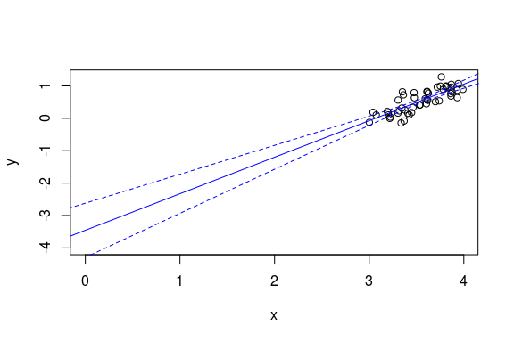
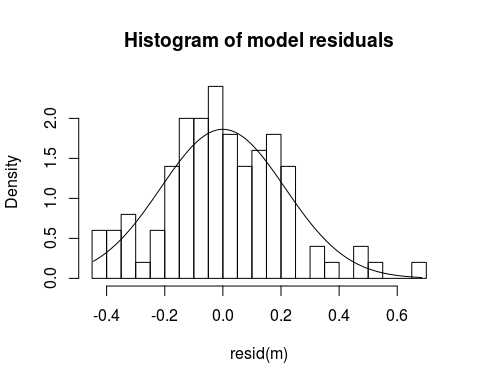

# Hierarchical modeling course notes
Max Joseph  
November 16, 2015  


Chapter 1: Linear models
========================

## Big picture & learning goals

This course builds on an understanding of the mechanics of linear models. 
Here we introduce some key topics that will facilitate future understanding hierarchical models.

#### Learning goals

<!---
I haven't added anything about interaction effects or centering covariates yet. 
Maybe this would fit well in the general linear model section?
Centering covariates might also be good in the linear regression section. 
Or, maybe it's worth deferring to Gelman and Hill on centering and streamlining the notes?
I also was not sure what we were thinking about varying structure and standard errors. 
Did you have something in mind here?
I have avoided talking much about standard errors yet because it's a fairly 
frequentist notion (sd of the sampling distribution)
-->

- linear regression with `lm`
- intercepts, "categorical" effects
- varying model structure to estimate effects and standard errors
- interactions as variation in slope estimates for different groups
- centering input variables and intepreting resulting parameters
- assumptions and unarticulated priors
- understanding residual variance (Gaussian)
- understanding all of the above graphically
- understanding and plotting output of lm
- notation and linear algebra review: $X\beta$

Linear regression, ANOVA, ANCOVA, and multiple regression models are all species cases of general linear models (hereafter "linear models"). 
In all of these cases, we have observed some response variable $y$, which is potentially modeled as a function of some covariate(s) $x_1, x_2, ..., x_p$.

## Model of the mean

If we have no covariates of interest, then we may be interested in estimating the population mean and variance of the random variable $Y$ based on $n$ observations, corresponding to the values $y_1, ..., y_n$. 
Here, capital letters indicate the random variable, and lowercase corresponds to realizations of that variable. 
This model is sometimes referred to as the "model of the mean". 


```r
# simulating a sample of y values from a normal distribution
y <- rnorm(20)
plot(y)
```

 

We have two parameters to estimate: the mean of $Y$, which we'll refer to as $\mu$, and the variance of $Y$, which we'll refer to as $\sigma^2$. 
Here, and in general, we will use greek letters to refer to parameters. 
If $Y$ is normally distributed, then we can assume that the realizations or samples $y$ that we observe are also normally distributed: $y \sim N(\mu, \sigma^2)$. 
Here and elsewhere, the $\sim$ symbol represents that some quantity "is distributed as" something else (usually a probability distribution). 
You can also think of $\sim$ as meaning "is sampled from".
A key concept here is that we are performing statistical inference, meaning we are trying to learn about (estimate) population-level parameters with sample data. 
In other words, we are not trying to learn about the sample mean $\bar{y}$ or sample variance of $y$. 
These can be calculated and treated as known once we have observed a particular collection of $y$ values. 
The unknown quantities $\mu$ and $\sigma^2$ are the targets of inference. 

Fitting this model (and linear models in general) is possible in R with the `lm` function. 
For this rather simple model, we can estimate the parameters as follows:


```r
# fitting a model of the mean with lm
m <- lm(y ~ 1)
summary(m)
```

```
## 
## Call:
## lm(formula = y ~ 1)
## 
## Residuals:
##      Min       1Q   Median       3Q      Max 
## -2.84320 -0.52613  0.04519  0.66155  1.83992 
## 
## Coefficients:
##             Estimate Std. Error t value Pr(>|t|)
## (Intercept)  -0.1676     0.2565  -0.653    0.521
## 
## Residual standard error: 1.147 on 19 degrees of freedom
```

The summary of our model object `m` provides a lot of information. 
For reasons that will become clear shortly, the estimated population mean is referred to as the "Intercept". 
Here, we get a point estimate for the population mean $\mu$: -0.168 and an estimate of the residual standard deviation $\sigma$: 1.147, which we can square to get an estimate of the residual variance $\sigma^2$: 1.316.

## Linear regression

Often, we are interested in estimating the mean of $Y$ as a function of some other variable, say $X$. 
Simple linear regression assumes that $y$ is again sampled from a normal distribution, but this time the mean or expected value of $y$ is a function of $x$:

$$y_i \sim N(\mu_i, \sigma^2)$$

$$\mu_i = \alpha + \beta x_i$$

Here, subscripts indicate which particular value of $y$ and $x$ we're talking about. 
Specifically, we observe $n$ pairs of values: $(y_i, x_i), ..., (y_n, x_n)$, with all $x$ values known exactly.
Linear regression models can equivalently be written as follows:

$$y_i = \alpha + \beta x_i + \epsilon_i$$

$$\epsilon_i \sim N(0, \sigma^2)$$

Key assumptions here are that each of the error terms $\epsilon_1, ..., \epsilon_n$ are normally distributed around zero with some variance (i.e., the error terms are identically distributed), and that the value of $\epsilon_1$ does not affect the value of any other $\epsilon$ (i.e., the errors are independent).
This combination of assumptions is often referred to as "independent and identically distributed" or i.i.d. 
Equivalently, given some particular $x_i$ and a set of linear regression parameters, the distribution of $y_i$ is normal. 
A common misconception is that linear regression assumes the distribution of $y$ is normal. 
This is wrong - linear regression assumes that the error terms are normally distributed. 
The assumption that the variance $\sigma^2$ is constant for all values of $x$ is referred to as homoskedasticity. 
Rural readers may find it useful to think of skedasticity as the amount of "skedaddle" away from the regression line in the $y$ values. 
If the variance is changing across values of $x$, then the assumption of homoskedasticity is violated and you've got a heteroskedasticity problem. 


```r
# simulate and plot x and y values
n <- 100
x <- runif(n)
alpha <- -2
beta <- 3
sigma <- .4
y <- rnorm(n, mean = alpha + beta * x, sd = sigma)
plot(x, y)

# add known mean function 
lines(x = x, y = alpha + beta * x, col='blue')
legend('topleft', 
       pch = c(1, NA), lty = c(NA, 1), 
       col = c('black', 'blue'), 
       legend = c('Observed data', 'E(y | x)'), 
       bty = 'n')
```

 

The normality assumption means that the probability density of $y$ is highest at the value $\alpha + \beta x$, where the regression line is, and falls off away from the line according to the normal probablity density. 
This graphically looks like a bell 'tube' along the regression line, adding a dimension along $x$ to the classic bell 'curve'.

 

### Model fitting

Linear regression parameters $\alpha$, $\beta$, and $\sigma^2$ can be estimated with `lm`.
The syntax is very similar to the previous model, except now we need to include our covariate `x` in the formula (the first argument to the `lm` function). 


```r
m <- lm(y ~ x)
summary(m)
```

```
## 
## Call:
## lm(formula = y ~ x)
## 
## Residuals:
##      Min       1Q   Median       3Q      Max 
## -0.93645 -0.25374 -0.02761  0.26883  0.95335 
## 
## Coefficients:
##             Estimate Std. Error t value Pr(>|t|)    
## (Intercept) -1.99918    0.07833  -25.52   <2e-16 ***
## x            2.91961    0.12600   23.17   <2e-16 ***
## ---
## Signif. codes:  0 '***' 0.001 '**' 0.01 '*' 0.05 '.' 0.1 ' ' 1
## 
## Residual standard error: 0.372 on 98 degrees of freedom
## Multiple R-squared:  0.8456,	Adjusted R-squared:  0.8441 
## F-statistic: 536.9 on 1 and 98 DF,  p-value: < 2.2e-16
```

The point estimate for the parameter $\alpha$ is called "(Intercept)". 
This is because our estimate for $\alpha$ is the y-intercept of the estimated regression line when $x=0$ (recall that $y_i = \alpha + \beta x_i + \epsilon_i$).
The estimate for $\beta$ is called "x", because it is a coefficient associated with the variable "x" in this model. 
This parameter is often referred to as the "slope", because it represents the increase in the expected value of $y$ for a one unit increase in $x$ (the rise in y over run in x).
Point estimates for the standard deviation and variance of $\epsilon$ can be extracted as before (`summary(m)$sigma` and `summary(m)$sigma^2`).

### Checking assumptions

We have assumed that the distribution of error terms is normally distributed, and this assumption is worth checking. 
Below, we plot a histogram of the residuals (another name for the $\epsilon$ parameters) along with a superimposed normal probability density so that we can check normality. 


```r
hist(resid(m), breaks = 20, freq = F, 
     main = 'Histogram of model residuals')
curve_x <- seq(min(resid(m)), max(resid(m)), .01)
lines(curve_x, dnorm(curve_x, 0, summary(m)$sigma))
```

 

Even when the assumption of normality is correct, it is not always obvious that the residuals are normally distributed. 
Another useful plot for assessing normality of errors is a quantile-quantile or Q-Q plot. 
If the residuals do not deviate much from normality, then the points in a Q-Q plot won't deviate much from the dashed one-to-one line. 
If points lie above or below the line, then the residual is larger or smaller, respectively, than expected based on a normal distribution. 


```r
plot(m, 2)
```

 

To assess heteroskedasticity, it is useful to inspect a plot of the residuals vs. fitted values, e.g. `plot(m, 1)`. 
If it seems as though the spread or variance of residuals varies across the range of fitted values, then it may be worth worrying about homoskedasticity and trying some transformations to fix the problem. 

## Analysis of variance

Sometimes, the covariate of interest is not continuous but instead categorical (e.g., "chocolate", "strawberry", or "vanilla"). 
We might again wonder whether the mean of a random variable $Y$ depends on the value of this covariate. 
However, we cannot really estimate a meaningful "slope" parameter, because in this case $x$ is not continuous. 
Instead, we might formulate the model as follows:

$$y_i \sim N(\alpha_{j[i]}, \sigma^2)$$

Where $\alpha_j$ is the mean of group $j$, and we have $J$ groups total. 
The notation $\alpha_{j[i]}$ represents the notion that the $i^{th}$ observation corresponds to group $j$, and we are going to assume that all observations in the $j^{th}$ group have the same mean, $\alpha_j$. 
The above model is perfectly legitimate, and our parameters to estimate are the group means $\alpha_1, ..., \alpha_J$ and the residual variance $\sigma^2$. 
This parameterization is called the "means" parameterization, and though it is perhaps easier to understand than the following alternative, it is less often used. 

This model is usually parameterized not in terms of the group means, but rather in terms of an intercept (corresponding to the mean of one "reference" group), and deviations from the intercept (differences between a group of interest and the intercept). 
For instance, in R, the group whose mean is the intercept (the "reference" group) will be the group whose name comes first alphabetically. 
Either way, we will estimate the same number of parameters. 
So if our groups are "chocolate", "strawberry", and "vanilla", R will assign the group "chocolate" to be the intercept, and provide 2 more coefficient estimates for the difference between the estimated group mean of strawberry vs. chocoloate, and vanilla vs. chocolate. 

This parameterization can be written as

$$y_i \stackrel{iid}{\sim} N(\mu_0 + \beta_{j[i]}, \sigma^2)$$

where $\mu_0$ is the "intercept" or mean of the reference group, and $\beta_j$ represents the difference in the population mean of group $j$ compared to the reference group (if $j$ is the reference group, the $\beta_j = 0$). 
Traditionally this model is called simple one-way analysis of variance, but we view it simply as another special case of a linear model.

The following example illustrates some data simulation, visualization, and parameter estimation in this context. 
Specifically, we assess 60 humans for their taste response to three flavors of iced cream. 
We want to extrapolate from our sample to the broader population of all ice cream eating humans to learn whether in general people think ice cream tastiness varies as a function of flavor. 


```r
# simulate and visualize data
n <- 60
x <- rep(c("chocolate", "strawberry", "vanilla"), length.out = n)
x <- factor(x)
sigma <- 1
mu_y <- c(chocolate = 3.352, strawberry = .93, vanilla = 1.5)
y <- rnorm(n, mu_y[x], sigma)

library(ggplot2)
ggplot(data.frame(x, y), aes(x, y)) + 
  geom_jitter(position = position_jitter(width=.1)) + 
  xlab('Group') + 
  ylab('Tastiness')
```

 

### Model fitting

We can estimate our parameters with the `lm` function (this should be a strong hint that there are not huge differences between linear regression and ANOVA). 
The syntax is exactly the same as with linear regression. 
The only difference is that our input `x` is not numeric, it's a character vector. 


```r
m <- lm(y ~ x)
summary(m)
```

```
## 
## Call:
## lm(formula = y ~ x)
## 
## Residuals:
##      Min       1Q   Median       3Q      Max 
## -2.18371 -0.58098  0.00273  0.39306  2.11466 
## 
## Coefficients:
##             Estimate Std. Error t value Pr(>|t|)    
## (Intercept)   3.0613     0.2036  15.037  < 2e-16 ***
## xstrawberry  -2.1978     0.2879  -7.634 2.80e-10 ***
## xvanilla     -1.7080     0.2879  -5.932 1.86e-07 ***
## ---
## Signif. codes:  0 '***' 0.001 '**' 0.01 '*' 0.05 '.' 0.1 ' ' 1
## 
## Residual standard error: 0.9105 on 57 degrees of freedom
## Multiple R-squared:  0.5299,	Adjusted R-squared:  0.5134 
## F-statistic: 32.12 on 2 and 57 DF,  p-value: 4.555e-10
```

Because chocolate comes first alphabetically, it is the reference group and the "(Intercept)" estimate corresponds to the estimate of the group-level mean for chocolate. 
The other two estimates are contrasts between the other groups and this reference group, i.e.  "xstrawberry" is the estimated difference between the group mean for strawberry and the reference group. 

### Checking assumptions

Our assumptions in this simple one way ANOVA context are identical to our assumptions with linear regression. 
Specifically, we assumed that our errors are independently and identically distributed, and that the variance is constant for each group (homoskedasticity). 
The built in `plot` method for `lm` objects is designed to return diagnostic plots that help to check these assumptions. 


```r
par(mfrow=c(2, 2))
plot(m)
```

 

## General linear models

We have covered a few special cases of general linear models, which are usually written as follows:

$$y \stackrel{iid}{\sim} N(X \beta, \sigma^2)$$

Where $y$ is a vector consisting of $n$ observations, $X$ is a "design" matrix with $n$ rows and $p$ columns, and $\beta$ is a vector of $p$ parameters. 
There are multivariate general linear models (e.g., MANOVA) where the response variable is a matrix and a covariance matrix is used in place of a scalar variance parameter, but we'll stick to univariate models for simplicity.
The key point here is that the producct of $X$ and $\beta$ provides the mean of the normal distribution from which $y$ is drawn. 
From this perspective, the difference between the model of the mean, linear regression, ANOVA, etc., lies in the structure of $X$ and subsequent interpretation of the parameters $\beta$. 
This is a very powerful idea that unites many superficially disparate approaches. 

For instance, in the model of the mean, $X$ is an $n$ by $1$ matrix, with each element equal to $1$ (i.e. a vector of ones). 
With linear regression, $X$'s first column is all ones (corresponding to the intercept parameter), and the second column contains the values of the covariate $x$. 
In ANOVA, the design matrix $X$ will differ between the means and effects parameterizations. 
With a means parameterization, the entries in column $j$ will equal one if observation (row) $i$ is in group $j$, and entries are zero otherwise. 
Can you figure out the structure of $X$ with R's default effects parameterization?
You can check your work with `model.matrix(m)`, where `m` is a model that you've fitted with `lm`.
If you are not comfortable with matrix multiplication, it's worth investing some effort so that you can understand why $X\beta$ is such a powerful construct. 

## Further reading

Schielzeth, H. 2010. Simple means to improve the interpretability of regression coefficients. Methods in Ecology and Evolution 1:103–113.  

Enqvist, L. 2005. The mistreatment of covariate interaction terms in linear model analyses of behavioural and evolutionary ecology studies. Animal Behaviour 70:967–971.  

Gelman and Hill, Ch. 3 & 4.


Chapter 2: Maximum likelihood estimation
=============================

My thought here is to combine the probability and likelihood functions directly with simple model fitting. May or may not be too much for one class, but I worry that a classes just on probability distributions and likilhood wouldn't be practical enough for a short course. 

Hopefully students have used `lm` before, and we can get more into depth by approaching this problem from two new angles: optimization of the likelihood function and Bayesian approaches. I suspect this will be a good place to introduce Bayesian inference because the problem of regression should be familiar to most students.

#### Priorities

- definition of likelihood
- single parameter models: MLE and optim
- model of the mean with unknown variance 
- fitting simple linear models with liklihood (glm with gaussian link?)
- assumptions and inference
- separation (as a preview of why priors are nice...)

#### Optional

- restricted maximum likelihood vs. maximum likelihood


Chapter 3: Fitting Bayesian linear models
==============================

#### Priorities

- Bayes' theorem and Bayesian probability
- relationsihp between likelihood and Bayesian inference
- priors (generally, informative vs. non-informative)
- interpreting posterior disributions (mean, mode, intervals)
- intro to Bayesian computation and MCMC
- single parameter models: MLE vs. Bayesian treatments
- Bayesian linear regression: intro to Stan & JAGS

#### Optional

- comparing posterior distributions for different parameter estimates (i.e. are they "significantly" different)
- proper vs. improper priors 


Chapter 4: Poisson models
==============

Here is my preference for teaching Poisson models first. I (personally) prefer to start with poisson because (1) IMO log links are more intuitive than logit (probit etc) links (2) latent variables remain between zero and infinity (3) IMO overdispersion is easier to understand than in binomial models

#### Priorties

- non-gaussian data (counts, proportions, binary, exponential)
- link functions and latent variables
- Poisson distribution
- log link as a map (what are we actually estimating -- mean or rate)
- understanding effects sizes in Poisson models
- dependence of mean and variance in non-Gaussian models 
- overdispersion : quasi-Poisson and negative-binomial
- overdispersion as unaccounted for variation (maybe a simple example -- sex effects)
- implementation with `glm`, Stan, JAGS
- graphical displays 
- model checking


#### Optional
- simulation of data & parameter recovery


Chapter 5: Binomial models
===============

Here, the students will continue to use a combination of methods for implementation. Key points to take away from this section include the properties/behavior of bionomial models, ways to check binomial modles, and a hint that Bayesian approaches are going to be more flexible.  The binomial-Poisson hierarchical model is a classic that should reinforce the notion that Bayesian approaches will generally be easier for more complex examples.

#### Priorities

- binomial distribution (relationship between mean and variance)
- logit link as a map
- proportion vs. binary models (will help with understanding hierarchical models later)
- implementation with `glm`
- overdispersion in proportion models and understanding the difference between individual and group level probabilities
- implementation with  Stan, JAGS
- hierarchical model number 1: occupancy model (a classic) (maybe, or we could do it later)
  - review marginalization 
- graphical displays
- model checking

#### Optional

- simulation of data & parameter recovery


Chapter 6: Partial pooling and likelihood
==============================

The main dish. I'd like to avoid a recipe-based approach where we discuss varying intercept and varying slope models as primary objectives. Instead, I think it's important to cover these topics as special cases of the general approach of hierarchical modeling as a means to impose probabilistic structures on parameters. From that perspective, students should be able to better extend these methods for their own work.

#### Priorities

- definition
- review previous examples
- hyperparameters (they've always been there even when we don't acknowledge them)
- varying intercepts (NBA freethrow example) with `lme4`
- partial pooling
- clearing up confusion about nestedness
- simple hierarchical models with likelihood
- continous predictors for multiple levels

#### Optional

- plotting estimates for different levels from lme4 models


Chapter 7: Bayesian hierarchical models
============================

#### Priorities

- varying intercepts (NBA freethrow example) with `Stan`
- hierarchical models in Stan
- highlight Bayesian connection to priors
- classic examples: 
    - hierarchical model number 1: occupancy model (a classic)
    - hierarchical model: binomial-Poisson hierarchy (e.g. # eggs laid & survival)
- introduction to the multivariate normal distribution
- parameters for hierarchical variance parameters
- prediction (new vs. observed groups)
- priors 
- note crossing of the 'ease' threshold (?)


#### Optional

- posterior prediction
- basic Bayesian models in MCMCglmm
- random effects, fixed effects, mixed effects models as special instances of hierarchical linear models

#### Reading

Gelman, A., J. Hill, and M. Yajima. 2012. Why We (Usually) Don’t Have to Worry About Multiple Comparisons. Journal of Research on Educational Effectiveness 5:189–211.  
Gelman and Hill discussion of random effects terminology (very good)


Chapter 8: Hierarchical model construction
===============================

This is where I think we will have the greatest impact on students future work. Translating problems to models is a key skill, and it may take a fair bit of practice. Tools to implement include graphical skills (e.g. drawing DAGs), and familiarity with probability distributions.

- parameter, process, and observation models
- building complexity from simple pieces
- translating biological problems and observations to models
- example: what method works best for detecting a species?
- example: error in variables models
- more practice in developing models (don't necessarily have to implement)


Chapter 9: Model comparison
================

I envisions this as occuring a bit more ad hoc during the second half as students start to build their own models

- start with simpler models and build (may be counterintuitive for those used to step-down procedures)
- posterior prediction
- DIC, wAIC
- cross-checking
- simulated data

#### Reading

Hooten, M. B., and N. T. Hobbs. 2015. A guide to Bayesian model selection for ecologists. Ecological Monographs 85:3–28.  
