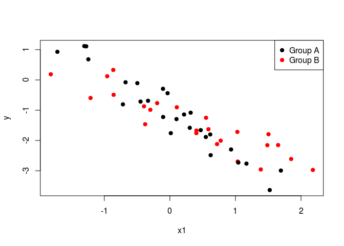
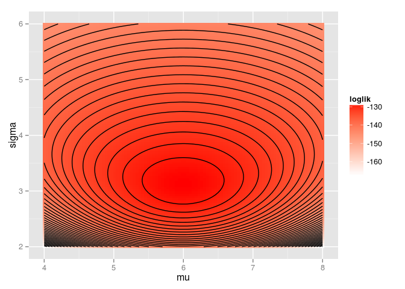
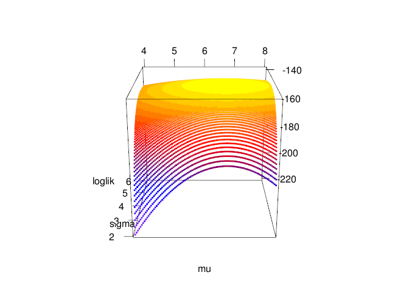

# Hierarchical modeling course notes
Max Joseph  
November 16, 2015  


Chapter 1: Linear models
========================

## Big picture

This course builds on an understanding of the mechanics of linear models. 
Here we introduce some key topics that will facilitate future understanding hierarchical models.

#### Learning goals

<!---
I haven't added anything about interaction effects or centering covariates yet. 
Maybe this would fit well in the general linear model section?
Centering covariates might also be good in the linear regression section. 
Or, maybe it's worth deferring to Gelman and Hill on centering and streamlining the notes?
I also was not sure what we were thinking about varying structure and standard errors. 
Did you have something in mind here?
I have avoided talking much about standard errors yet because it's a fairly 
frequentist notion (sd of the sampling distribution)
-->

- linear regression with `lm`
- intercepts, "categorical" effects
- varying model structure to estimate effects and standard errors
- interactions as variation in slope estimates for different groups
- centering input variables and intepreting resulting parameters
- assumptions and unarticulated priors
- understanding residual variance (Gaussian)
- understanding all of the above graphically
- understanding and plotting output of lm
- notation and linear algebra review: $X\beta$

Linear regression, ANOVA, ANCOVA, and multiple regression models are all species cases of general linear models (hereafter "linear models"). 
In all of these cases, we have observed some response variable $y$, which is potentially modeled as a function of some covariate(s) $x_1, x_2, ..., x_p$.

## Model of the mean

If we have no covariates of interest, then we may be interested in estimating the population mean and variance of the random variable $Y$ based on $n$ observations, corresponding to the values $y_1, ..., y_n$. 
Here, capital letters indicate the random variable, and lowercase corresponds to realizations of that variable. 
This model is sometimes referred to as the "model of the mean". 


```r
# simulating a sample of y values from a normal distribution
y <- rnorm(20)
plot(y)
```

 

We have two parameters to estimate: the mean of $Y$, which we'll refer to as $\mu$, and the variance of $Y$, which we'll refer to as $\sigma^2$. 
Here, and in general, we will use greek letters to refer to parameters. 
If $Y$ is normally distributed, then we can assume that the realizations or samples $y$ that we observe are also normally distributed: $y \sim N(\mu, \sigma^2)$. 
Here and elsewhere, the $\sim$ symbol represents that some quantity "is distributed as" something else (usually a probability distribution). 
You can also think of $\sim$ as meaning "is sampled from".
A key concept here is that we are performing statistical inference, meaning we are trying to learn about (estimate) population-level parameters with sample data. 
In other words, we are not trying to learn about the sample mean $\bar{y}$ or sample variance of $y$. 
These can be calculated and treated as known once we have observed a particular collection of $y$ values. 
The unknown quantities $\mu$ and $\sigma^2$ are the targets of inference. 

Fitting this model (and linear models in general) is possible in R with the `lm` function. 
For this rather simple model, we can estimate the parameters as follows:


```r
# fitting a model of the mean with lm
m <- lm(y ~ 1)
summary(m)
```

```
## 
## Call:
## lm(formula = y ~ 1)
## 
## Residuals:
##     Min      1Q  Median      3Q     Max 
## -3.4497 -0.6039 -0.0717  0.8497  1.6972 
## 
## Coefficients:
##             Estimate Std. Error t value Pr(>|t|)  
## (Intercept)   0.7133     0.2819    2.53   0.0204 *
## ---
## Signif. codes:  0 '***' 0.001 '**' 0.01 '*' 0.05 '.' 0.1 ' ' 1
## 
## Residual standard error: 1.261 on 19 degrees of freedom
```

The summary of our model object `m` provides a lot of information. 
For reasons that will become clear shortly, the estimated population mean is referred to as the "Intercept". 
Here, we get a point estimate for the population mean $\mu$: 0.713 and an estimate of the residual standard deviation $\sigma$: 1.261, which we can square to get an estimate of the residual variance $\sigma^2$: 1.589.

## Linear regression

Often, we are interested in estimating the mean of $Y$ as a function of some other variable, say $X$. 
Simple linear regression assumes that $y$ is again sampled from a normal distribution, but this time the mean or expected value of $y$ is a function of $x$:

$$y_i \sim N(\mu_i, \sigma^2)$$

$$\mu_i = \alpha + \beta x_i$$

Here, subscripts indicate which particular value of $y$ and $x$ we're talking about. 
Specifically, we observe $n$ pairs of values: $(y_i, x_i), ..., (y_n, x_n)$, with all $x$ values known exactly.
Linear regression models can equivalently be written as follows:

$$y_i = \alpha + \beta x_i + \epsilon_i$$

$$\epsilon_i \sim N(0, \sigma^2)$$

Key assumptions here are that each of the error terms $\epsilon_1, ..., \epsilon_n$ are normally distributed around zero with some variance (i.e., the error terms are identically distributed), and that the value of $\epsilon_1$ does not affect the value of any other $\epsilon$ (i.e., the errors are independent).
This combination of assumptions is often referred to as "independent and identically distributed" or i.i.d. 
Equivalently, given some particular $x_i$ and a set of linear regression parameters, the distribution of $y_i$ is normal. 
A common misconception is that linear regression assumes the distribution of $y$ is normal. 
This is wrong - linear regression assumes that the error terms are normally distributed. 
The assumption that the variance $\sigma^2$ is constant for all values of $x$ is referred to as homoskedasticity. 
Rural readers may find it useful to think of skedasticity as the amount of "skedaddle" away from the regression line in the $y$ values. 
If the variance is changing across values of $x$, then the assumption of homoskedasticity is violated and you've got a heteroskedasticity problem. 


```r
# simulate and plot x and y values
n <- 50
x <- runif(n)
alpha <- -2
beta <- 3
sigma <- .4
y <- rnorm(n, mean = alpha + beta * x, sd = sigma)
plot(x, y)

# add known mean function 
lines(x = x, y = alpha + beta * x, col='blue')
legend('topleft', 
       pch = c(1, NA), lty = c(NA, 1), 
       col = c('black', 'blue'), 
       legend = c('Observed data', 'E(y | x)'), 
       bty = 'n')
```

 

The normality assumption means that the probability density of $y$ is highest at the value $\alpha + \beta x$, where the regression line is, and falls off away from the line according to the normal probablity density. 
This graphically looks like a bell 'tube' along the regression line, adding a dimension along $x$ to the classic bell 'curve'.

 

### Model fitting

Linear regression parameters $\alpha$, $\beta$, and $\sigma^2$ can be estimated with `lm`.
The syntax is very similar to the previous model, except now we need to include our covariate `x` in the formula (the first argument to the `lm` function). 


```r
m <- lm(y ~ x)
summary(m)
```

```
## 
## Call:
## lm(formula = y ~ x)
## 
## Residuals:
##      Min       1Q   Median       3Q      Max 
## -0.93291 -0.22614  0.04102  0.27383  0.68660 
## 
## Coefficients:
##             Estimate Std. Error t value Pr(>|t|)    
## (Intercept)  -1.9690     0.1069  -18.42   <2e-16 ***
## x             3.0821     0.1993   15.46   <2e-16 ***
## ---
## Signif. codes:  0 '***' 0.001 '**' 0.01 '*' 0.05 '.' 0.1 ' ' 1
## 
## Residual standard error: 0.403 on 48 degrees of freedom
## Multiple R-squared:  0.8328,	Adjusted R-squared:  0.8293 
## F-statistic: 239.1 on 1 and 48 DF,  p-value: < 2.2e-16
```

The point estimate for the parameter $\alpha$ is called "(Intercept)". 
This is because our estimate for $\alpha$ is the y-intercept of the estimated regression line when $x=0$ (recall that $y_i = \alpha + \beta x_i + \epsilon_i$).
The estimate for $\beta$ is called "x", because it is a coefficient associated with the variable "x" in this model. 
This parameter is often referred to as the "slope", because it represents the increase in the expected value of $y$ for a one unit increase in $x$ (the rise in y over run in x).
Point estimates for the standard deviation and variance of $\epsilon$ can be extracted as before (`summary(m)$sigma` and `summary(m)$sigma^2`).

### Centering and scaling covariates

Often, it's a good idea to "center" covariates so that they have a mean of zero ($\bar{x} = 0$). 
This is achieved by subtracting the sample mean of a covariate from the vector of covariate values ($x - \bar{x}$).
It's also useful to additionally scale covariates so that they are all on a common and unitless scale. 
While many will divide each covariate by its standard deviation, Gelman and Hill (pg. 57) recommend dividing by twice the standard deviation ($s_x$) so that binary covariates are transformed from $x \in \{0, 1\}$ to $x_t \in \{-0.5, 0.5\}$, where $x_t$ is the transformed covariate: $x_t = \frac{x - \bar{x}}{2 s_x}$. 
If covariates are not centered and scaled, then it is common to observe correlations between estimated slopes and intercepts. 

 

So, we expect that in this case, the estimates for the intercept and slope must be negatively correlated.
This is bourne out in the confidence region for our estimates of $\alpha$ and $\beta$. 
Usually, people inspect univariate confidence intervals for parameters, e.g.,


```r
confint(m)
```

```
##                 2.5 %    97.5 %
## (Intercept) -3.968447 -2.565089
## x            0.862224  1.253425
```

This is misleading because our estimates for these parameters are correlated. 
For any given value of the intercept, there are only certain values of the slope that are supported.
To assess this possibility, we might also be interested in the bivariate confidence ellipse for these two parameters. 
We can evaluate this quantity graphically as follows with some help from the `car` package:


```r
library(car)
confidenceEllipse(m)
```

 

This is not great. 
We want to be able to directly use the univariate confidence intervals. 
Our problem can be solved by centering $x$:

 

Now there is no serious correlation in the estimates and we are free to use the univariate confidence intervals without needing to consider the joint distribution of the slope and intercept. 
This trick helps with interpretation, but it will also prove useful later in the course in the context of Markov chain Monte Carlo (MCMC) sampling. 

### Checking assumptions

We have assumed that the distribution of error terms is normally distributed, and this assumption is worth checking. 
Below, we plot a histogram of the residuals (another name for the $\epsilon$ parameters) along with a superimposed normal probability density so that we can check normality. 


```r
hist(resid(m), breaks = 20, freq = F, 
     main = 'Histogram of model residuals')
curve_x <- seq(min(resid(m)), max(resid(m)), .01)
lines(curve_x, dnorm(curve_x, 0, summary(m)$sigma))
```

 

Even when the assumption of normality is correct, it is not always obvious that the residuals are normally distributed. 
Another useful plot for assessing normality of errors is a quantile-quantile or Q-Q plot. 
If the residuals do not deviate much from normality, then the points in a Q-Q plot won't deviate much from the dashed one-to-one line. 
If points lie above or below the line, then the residual is larger or smaller, respectively, than expected based on a normal distribution. 


```r
plot(m, 2)
```

 

To assess heteroskedasticity, it is useful to inspect a plot of the residuals vs. fitted values, e.g. `plot(m, 1)`. 
If it seems as though the spread or variance of residuals varies across the range of fitted values, then it may be worth worrying about homoskedasticity and trying some transformations to fix the problem. 

## Analysis of variance

Sometimes, the covariate of interest is not continuous but instead categorical (e.g., "chocolate", "strawberry", or "vanilla"). 
We might again wonder whether the mean of a random variable $Y$ depends on the value of this covariate. 
However, we cannot really estimate a meaningful "slope" parameter, because in this case $x$ is not continuous. 
Instead, we might formulate the model as follows:

$$y_i \sim N(\alpha_{j[i]}, \sigma^2)$$

Where $\alpha_j$ is the mean of group $j$, and we have $J$ groups total. 
The notation $\alpha_{j[i]}$ represents the notion that the $i^{th}$ observation corresponds to group $j$, and we are going to assume that all observations in the $j^{th}$ group have the same mean, $\alpha_j$. 
The above model is perfectly legitimate, and our parameters to estimate are the group means $\alpha_1, ..., \alpha_J$ and the residual variance $\sigma^2$. 
This parameterization is called the "means" parameterization, and though it is perhaps easier to understand than the following alternative, it is less often used. 

This model is usually parameterized not in terms of the group means, but rather in terms of an intercept (corresponding to the mean of one "reference" group), and deviations from the intercept (differences between a group of interest and the intercept). 
For instance, in R, the group whose mean is the intercept (the "reference" group) will be the group whose name comes first alphabetically. 
Either way, we will estimate the same number of parameters. 
So if our groups are "chocolate", "strawberry", and "vanilla", R will assign the group "chocolate" to be the intercept, and provide 2 more coefficient estimates for the difference between the estimated group mean of strawberry vs. chocoloate, and vanilla vs. chocolate. 

This parameterization can be written as

$$y_i \stackrel{iid}{\sim} N(\mu_0 + \beta_{j[i]}, \sigma^2)$$

where $\mu_0$ is the "intercept" or mean of the reference group, and $\beta_j$ represents the difference in the population mean of group $j$ compared to the reference group (if $j$ is the reference group, the $\beta_j = 0$). 
Traditionally this model is called simple one-way analysis of variance, but we view it simply as another special case of a linear model.

The following example illustrates some data simulation, visualization, and parameter estimation in this context. 
Specifically, we assess 60 humans for their taste response to three flavors of iced cream. 
We want to extrapolate from our sample to the broader population of all ice cream eating humans to learn whether in general people think ice cream tastiness varies as a function of flavor. 


```r
# simulate and visualize data
n <- 60
x <- rep(c("chocolate", "strawberry", "vanilla"), length.out = n)
x <- factor(x)
sigma <- 1
mu_y <- c(chocolate = 3.352, strawberry = .93, vanilla = 1.5)
y <- rnorm(n, mu_y[x], sigma)

library(ggplot2)
ggplot(data.frame(x, y), aes(x, y)) + 
  geom_jitter(position = position_jitter(width=.1)) + 
  xlab('Group') + 
  ylab('Tastiness')
```

 

### Model fitting

We can estimate our parameters with the `lm` function (this should be a strong hint that there are not huge differences between linear regression and ANOVA). 
The syntax is exactly the same as with linear regression. 
The only difference is that our input `x` is not numeric, it's a character vector. 


```r
m <- lm(y ~ x)
summary(m)
```

```
## 
## Call:
## lm(formula = y ~ x)
## 
## Residuals:
##      Min       1Q   Median       3Q      Max 
## -1.98854 -0.59392 -0.08151  0.50951  2.35488 
## 
## Coefficients:
##             Estimate Std. Error t value Pr(>|t|)    
## (Intercept)   3.2884     0.2027  16.226  < 2e-16 ***
## xstrawberry  -2.3497     0.2866  -8.198 3.22e-11 ***
## xvanilla     -1.6826     0.2866  -5.871 2.34e-07 ***
## ---
## Signif. codes:  0 '***' 0.001 '**' 0.01 '*' 0.05 '.' 0.1 ' ' 1
## 
## Residual standard error: 0.9063 on 57 degrees of freedom
## Multiple R-squared:  0.5561,	Adjusted R-squared:  0.5405 
## F-statistic:  35.7 on 2 and 57 DF,  p-value: 8.883e-11
```

Because chocolate comes first alphabetically, it is the reference group and the "(Intercept)" estimate corresponds to the estimate of the group-level mean for chocolate. 
The other two estimates are contrasts between the other groups and this reference group, i.e.  "xstrawberry" is the estimated difference between the group mean for strawberry and the reference group. 

If we wish instead to use a means paramaterization, we need to supress the intercept term in our model as follows:


```r
m <- lm(y ~ 0 + x)
summary(m)
```

```
## 
## Call:
## lm(formula = y ~ 0 + x)
## 
## Residuals:
##      Min       1Q   Median       3Q      Max 
## -1.98854 -0.59392 -0.08151  0.50951  2.35488 
## 
## Coefficients:
##             Estimate Std. Error t value Pr(>|t|)    
## xchocolate    3.2884     0.2027  16.226  < 2e-16 ***
## xstrawberry   0.9387     0.2027   4.632 2.15e-05 ***
## xvanilla      1.6058     0.2027   7.923 9.21e-11 ***
## ---
## Signif. codes:  0 '***' 0.001 '**' 0.01 '*' 0.05 '.' 0.1 ' ' 1
## 
## Residual standard error: 0.9063 on 57 degrees of freedom
## Multiple R-squared:  0.8591,	Adjusted R-squared:  0.8517 
## F-statistic: 115.8 on 3 and 57 DF,  p-value: < 2.2e-16
```

Arguably, this approach is more useful because it simplifies the construction of confidence intervals for the group means:


```r
confint(m)
```

```
##                 2.5 %   97.5 %
## xchocolate  2.8826011 3.694253
## xstrawberry 0.5328898 1.344542
## xvanilla    1.1999710 2.011623
```

### Checking assumptions

Our assumptions in this simple one way ANOVA context are identical to our assumptions with linear regression. 
Specifically, we assumed that our errors are independently and identically distributed, and that the variance is constant for each group (homoskedasticity). 
The built in `plot` method for `lm` objects is designed to return diagnostic plots that help to check these assumptions. 


```r
par(mfrow=c(2, 2))
plot(m)
```

 

## General linear models

We have covered a few special cases of general linear models, which are usually written as follows:

$$y \stackrel{iid}{\sim} N(X \beta, \sigma^2)$$

Where $y$ is a vector consisting of $n$ observations, $X$ is a "design" matrix with $n$ rows and $p$ columns, and $\beta$ is a vector of $p$ parameters. 
There are multivariate general linear models (e.g., MANOVA) where the response variable is a matrix and a covariance matrix is used in place of a scalar variance parameter, but we'll stick to univariate models for simplicity.
The key point here is that the producct of $X$ and $\beta$ provides the mean of the normal distribution from which $y$ is drawn. 
From this perspective, the difference between the model of the mean, linear regression, ANOVA, etc., lies in the structure of $X$ and subsequent interpretation of the parameters $\beta$. 
This is a very powerful idea that unites many superficially disparate approaches. 
It also is the reason that these models are considered "linear", even though a regression line might by quite non-linear (e.g., polynomial regression). 
These models are linear in their parameters, meaning that our expected value for the response $y$ is a **linear combination** (formal notion) of the parameters. 
If a vector of expected values for $y$ in some model cannot be represented as $X \beta$, then it is not a linear model. 

In the model of the mean, $X$ is an $n$ by $1$ matrix, with each element equal to $1$ (i.e. a vector of ones). 
With linear regression, $X$'s first column is all ones (corresponding to the intercept parameter), and the second column contains the values of the covariate $x$. 
In ANOVA, the design matrix $X$ will differ between the means and effects parameterizations. 
With a means parameterization, the entries in column $j$ will equal one if observation (row) $i$ is in group $j$, and entries are zero otherwise. 
If you are not comfortable with matrix multiplication, it's worth investing some effort so that you can understand why $X\beta$ is such a powerful construct. 

>Can you figure out the structure of $X$ with R's default effects parameterization?
>You can check your work with `model.matrix(m)`, where `m` is a model that you've fitted with `lm`.

## Interactions between covariates

Often, the effect of one covariate depends on the value of another covariate. 
This is referred to as "interaction" between the covariates. 
Interactions can exist between two or more continuous and/or nominal covariates. 
These situations have special names in the classical statistics literature. 
For example, models with interactions between nominal covariates fall under "factorial ANOVA", those with interactions between a continuous and a nominal covariate are referred to as "analysis of covariance (ANCOVA)". 
Here we prefer to consider these all as special cases of general linear models. 

### Interactions between two continuous covariates

Here we demonstrate simulation and estimation for a model with an interaction between two continuous covariates. 
Notice that in the simulation, we have exploited the $X \beta$ construct to generate a vector of expected values for $y$. 


```r
n <- 50
x1 <- rnorm(n)
x2 <- rnorm(n)
beta <- c(.5, 1, -1, 2)
sigma <- 1
X <- matrix(c(rep(1, n), x1, x2, x1 * x2), nrow=n)
mu_y <- X %*% beta
y <- rnorm(n, mu_y, sigma)
m <- lm(y ~ x1 * x2)
summary(m)
```

```
## 
## Call:
## lm(formula = y ~ x1 * x2)
## 
## Residuals:
##      Min       1Q   Median       3Q      Max 
## -2.94001 -0.63577  0.04692  0.53906  2.85594 
## 
## Coefficients:
##             Estimate Std. Error t value Pr(>|t|)    
## (Intercept)   0.7154     0.1685   4.245 0.000105 ***
## x1            1.3537     0.1980   6.838 1.60e-08 ***
## x2           -0.8463     0.1570  -5.389 2.36e-06 ***
## x1:x2         1.7180     0.2201   7.804 5.75e-10 ***
## ---
## Signif. codes:  0 '***' 0.001 '**' 0.01 '*' 0.05 '.' 0.1 ' ' 1
## 
## Residual standard error: 1.168 on 46 degrees of freedom
## Multiple R-squared:  0.799,	Adjusted R-squared:  0.7859 
## F-statistic: 60.95 on 3 and 46 DF,  p-value: 4.65e-16
```

Visualizing these models is tricky, because we are in 3d space (with dimensions $x_1$, $x_2$, and $y$), but contour plots can be effective and leverage peoples' understanding of topographic maps. 


```r
# visualizing the results in terms of the linear predictor
lo <- 40
x1seq <- seq(min(x1), max(x1), length.out = lo)
x2seq <- seq(min(x2), max(x2), length.out = lo)
g <- expand.grid(x1=x1seq, x2=x2seq)
g$e_y <- beta[1] + beta[2] * g$x1 + beta[3] * g$x2 + beta[4] * g$x1 * g$x2
ggplot(g, aes(x=x1, y=x2)) + 
  geom_tile(aes(fill=e_y)) + 
  stat_contour(aes(z=e_y), col='grey') + 
  scale_fill_gradient2() + 
  geom_point(data=data.frame(x1, x2))
```

 

Alternatively, you might check out the `effects` package:


```r
library(effects)
plot(allEffects(m))
```

 

### Interactions between two categorical covariates

Here we demonstrate interaction between two categorical covariates, using the `diamonds` dataset which is in the `ggplot2` package.t
We are interested in the relationship between diamond price, cut quality, and color.


```r
str(ToothGrowth)
```

```
## 'data.frame':	60 obs. of  3 variables:
##  $ len : num  4.2 11.5 7.3 5.8 6.4 10 11.2 11.2 5.2 7 ...
##  $ supp: Factor w/ 2 levels "OJ","VC": 2 2 2 2 2 2 2 2 2 2 ...
##  $ dose: num  0.5 0.5 0.5 0.5 0.5 0.5 0.5 0.5 0.5 0.5 ...
```

```r
ToothGrowth$dose <- factor(ToothGrowth$dose)
ggplot(ToothGrowth, aes(x=interaction(dose, supp), y=len)) + 
  geom_point()
```

 

In general, visualizing the raw data is a good idea. 
However, we might also be interested in a table with group-wise summaries, such as the sample means, standard deviations, and sample sizes. 


```r
library(dplyr)
ToothGrowth %>%
  group_by(dose, supp) %>%
  summarize(mean = mean(len), 
            sd = sd(len), 
            n = n())
```

```
## Source: local data frame [6 x 5]
## Groups: dose [?]
## 
##     dose   supp  mean       sd     n
##   (fctr) (fctr) (dbl)    (dbl) (int)
## 1    0.5     OJ 13.23 4.459709    10
## 2    0.5     VC  7.98 2.746634    10
## 3      1     OJ 22.70 3.910953    10
## 4      1     VC 16.77 2.515309    10
## 5      2     OJ 26.06 2.655058    10
## 6      2     VC 26.14 4.797731    10
```

We can construct a model to estimate the effect of dose, supplement, and their interaction. 


```r
m <- lm(len ~ dose * supp, data = ToothGrowth)
summary(m)
```

```
## 
## Call:
## lm(formula = len ~ dose * supp, data = ToothGrowth)
## 
## Residuals:
##    Min     1Q Median     3Q    Max 
##  -8.20  -2.72  -0.27   2.65   8.27 
## 
## Coefficients:
##              Estimate Std. Error t value Pr(>|t|)    
## (Intercept)    13.230      1.148  11.521 3.60e-16 ***
## dose1           9.470      1.624   5.831 3.18e-07 ***
## dose2          12.830      1.624   7.900 1.43e-10 ***
## suppVC         -5.250      1.624  -3.233  0.00209 ** 
## dose1:suppVC   -0.680      2.297  -0.296  0.76831    
## dose2:suppVC    5.330      2.297   2.321  0.02411 *  
## ---
## Signif. codes:  0 '***' 0.001 '**' 0.01 '*' 0.05 '.' 0.1 ' ' 1
## 
## Residual standard error: 3.631 on 54 degrees of freedom
## Multiple R-squared:  0.7937,	Adjusted R-squared:  0.7746 
## F-statistic: 41.56 on 5 and 54 DF,  p-value: < 2.2e-16
```

This summary gives the effects-parameterization version of the summary. 
The "(Intercept)" refers to the combination of factor levels that occur first alphabetically: in this case, a dose of 0.5 with the "OJ" supplement. 
The coefficients for `dose1` and `dose2` represent estimated contrasts for these two groups relative to the intercept. 
The coefficient for `suppVC` represents the contrast between the "VC" and "OJ" levels of supplement when the dose is 0.5.
The interaction terms represent the difference in the effect of VC for `dose1` and `dose2` relative to a dose of 0.5. 
None of this is particularly intuitive, but this information can be gleaned by inspecting the design matrix $X$ produced by `lm` in the process of fitting the model. 


```r
model.matrix(m)
```

```
##    (Intercept) dose1 dose2 suppVC dose1:suppVC dose2:suppVC
## 1            1     0     0      1            0            0
## 2            1     0     0      1            0            0
## 3            1     0     0      1            0            0
## 4            1     0     0      1            0            0
## 5            1     0     0      1            0            0
## 6            1     0     0      1            0            0
## 7            1     0     0      1            0            0
## 8            1     0     0      1            0            0
## 9            1     0     0      1            0            0
## 10           1     0     0      1            0            0
## 11           1     1     0      1            1            0
## 12           1     1     0      1            1            0
## 13           1     1     0      1            1            0
## 14           1     1     0      1            1            0
## 15           1     1     0      1            1            0
## 16           1     1     0      1            1            0
## 17           1     1     0      1            1            0
## 18           1     1     0      1            1            0
## 19           1     1     0      1            1            0
## 20           1     1     0      1            1            0
## 21           1     0     1      1            0            1
## 22           1     0     1      1            0            1
## 23           1     0     1      1            0            1
## 24           1     0     1      1            0            1
## 25           1     0     1      1            0            1
## 26           1     0     1      1            0            1
## 27           1     0     1      1            0            1
## 28           1     0     1      1            0            1
## 29           1     0     1      1            0            1
## 30           1     0     1      1            0            1
## 31           1     0     0      0            0            0
## 32           1     0     0      0            0            0
## 33           1     0     0      0            0            0
## 34           1     0     0      0            0            0
## 35           1     0     0      0            0            0
## 36           1     0     0      0            0            0
## 37           1     0     0      0            0            0
## 38           1     0     0      0            0            0
## 39           1     0     0      0            0            0
## 40           1     0     0      0            0            0
## 41           1     1     0      0            0            0
## 42           1     1     0      0            0            0
## 43           1     1     0      0            0            0
## 44           1     1     0      0            0            0
## 45           1     1     0      0            0            0
## 46           1     1     0      0            0            0
## 47           1     1     0      0            0            0
## 48           1     1     0      0            0            0
## 49           1     1     0      0            0            0
## 50           1     1     0      0            0            0
## 51           1     0     1      0            0            0
## 52           1     0     1      0            0            0
## 53           1     0     1      0            0            0
## 54           1     0     1      0            0            0
## 55           1     0     1      0            0            0
## 56           1     0     1      0            0            0
## 57           1     0     1      0            0            0
## 58           1     0     1      0            0            0
## 59           1     0     1      0            0            0
## 60           1     0     1      0            0            0
## attr(,"assign")
## [1] 0 1 1 2 3 3
## attr(,"contrasts")
## attr(,"contrasts")$dose
## [1] "contr.treatment"
## 
## attr(,"contrasts")$supp
## [1] "contr.treatment"
```

Or, if you like, inspecting the design matrix along with the dataset to get a better sense for how it relates to the factor levels:


```r
cbind(model.matrix(m), ToothGrowth)
```

```
##    (Intercept) dose1 dose2 suppVC dose1:suppVC dose2:suppVC  len supp dose
## 1            1     0     0      1            0            0  4.2   VC  0.5
## 2            1     0     0      1            0            0 11.5   VC  0.5
## 3            1     0     0      1            0            0  7.3   VC  0.5
## 4            1     0     0      1            0            0  5.8   VC  0.5
## 5            1     0     0      1            0            0  6.4   VC  0.5
## 6            1     0     0      1            0            0 10.0   VC  0.5
## 7            1     0     0      1            0            0 11.2   VC  0.5
## 8            1     0     0      1            0            0 11.2   VC  0.5
## 9            1     0     0      1            0            0  5.2   VC  0.5
## 10           1     0     0      1            0            0  7.0   VC  0.5
## 11           1     1     0      1            1            0 16.5   VC    1
## 12           1     1     0      1            1            0 16.5   VC    1
## 13           1     1     0      1            1            0 15.2   VC    1
## 14           1     1     0      1            1            0 17.3   VC    1
## 15           1     1     0      1            1            0 22.5   VC    1
## 16           1     1     0      1            1            0 17.3   VC    1
## 17           1     1     0      1            1            0 13.6   VC    1
## 18           1     1     0      1            1            0 14.5   VC    1
## 19           1     1     0      1            1            0 18.8   VC    1
## 20           1     1     0      1            1            0 15.5   VC    1
## 21           1     0     1      1            0            1 23.6   VC    2
## 22           1     0     1      1            0            1 18.5   VC    2
## 23           1     0     1      1            0            1 33.9   VC    2
## 24           1     0     1      1            0            1 25.5   VC    2
## 25           1     0     1      1            0            1 26.4   VC    2
## 26           1     0     1      1            0            1 32.5   VC    2
## 27           1     0     1      1            0            1 26.7   VC    2
## 28           1     0     1      1            0            1 21.5   VC    2
## 29           1     0     1      1            0            1 23.3   VC    2
## 30           1     0     1      1            0            1 29.5   VC    2
## 31           1     0     0      0            0            0 15.2   OJ  0.5
## 32           1     0     0      0            0            0 21.5   OJ  0.5
## 33           1     0     0      0            0            0 17.6   OJ  0.5
## 34           1     0     0      0            0            0  9.7   OJ  0.5
## 35           1     0     0      0            0            0 14.5   OJ  0.5
## 36           1     0     0      0            0            0 10.0   OJ  0.5
## 37           1     0     0      0            0            0  8.2   OJ  0.5
## 38           1     0     0      0            0            0  9.4   OJ  0.5
## 39           1     0     0      0            0            0 16.5   OJ  0.5
## 40           1     0     0      0            0            0  9.7   OJ  0.5
## 41           1     1     0      0            0            0 19.7   OJ    1
## 42           1     1     0      0            0            0 23.3   OJ    1
## 43           1     1     0      0            0            0 23.6   OJ    1
## 44           1     1     0      0            0            0 26.4   OJ    1
## 45           1     1     0      0            0            0 20.0   OJ    1
## 46           1     1     0      0            0            0 25.2   OJ    1
## 47           1     1     0      0            0            0 25.8   OJ    1
## 48           1     1     0      0            0            0 21.2   OJ    1
## 49           1     1     0      0            0            0 14.5   OJ    1
## 50           1     1     0      0            0            0 27.3   OJ    1
## 51           1     0     1      0            0            0 25.5   OJ    2
## 52           1     0     1      0            0            0 26.4   OJ    2
## 53           1     0     1      0            0            0 22.4   OJ    2
## 54           1     0     1      0            0            0 24.5   OJ    2
## 55           1     0     1      0            0            0 24.8   OJ    2
## 56           1     0     1      0            0            0 30.9   OJ    2
## 57           1     0     1      0            0            0 26.4   OJ    2
## 58           1     0     1      0            0            0 27.3   OJ    2
## 59           1     0     1      0            0            0 29.4   OJ    2
## 60           1     0     1      0            0            0 23.0   OJ    2
```

Often, researchers want to know if interactions need to be included in the model. 
From a null hypothesis significance testing perspective, we can evaluate the 'significance' of the interaction term as follows: 


```r
anova(m)
```

```
## Analysis of Variance Table
## 
## Response: len
##           Df  Sum Sq Mean Sq F value    Pr(>F)    
## dose       2 2426.43 1213.22  92.000 < 2.2e-16 ***
## supp       1  205.35  205.35  15.572 0.0002312 ***
## dose:supp  2  108.32   54.16   4.107 0.0218603 *  
## Residuals 54  712.11   13.19                      
## ---
## Signif. codes:  0 '***' 0.001 '**' 0.01 '*' 0.05 '.' 0.1 ' ' 1
```

We find that the interaction between dose and supplement is statistically significant, meaning that if we assume that there is no interaction, it is unlikely to observe data that are as or more extreme as what we have observed over the course of infinitely many replicated experiments that will probably never occur.
Although this is far from intuitive, this approach has been widely used.
We will introduce a more streamlined procedure in chapter 3 that 1) does not assume that the effect is zero to begin with, and 2) does not necessarily invoke a hypothetical infinite number of replicated realizations of the data, conditional on one particular parameter value. 
An alternative approach would be to use information theoretics to decide whether the interaction is warranted:


```r
m2 <- lm(len ~ dose + supp, data = ToothGrowth)
AIC(m, m2)
```

```
##    df      AIC
## m   7 332.7056
## m2  5 337.2013
```

In the past decade following Burnham and Anderson's book on the topic, ecologists have leaned heavily on Akaike's information criterion (AIC), which is a relative measure of model quality (balancing goodness of fit with model complexity). 
Here we see that the original model `m` with interaction has a lower AIC value, and is therefore better supported. 
AIC can be considered to be similar to cross validation, approximating the ability of a model to predict future data.

Being somewhat lazy, we might again choose to plot the results of this model using the `effects` package. 


```r
plot(allEffects(m))
```

 

This is less than satisfying, as it does not show any data. 
All we see is model output. 
If the model is crap, then the output and these plots are also crap. 
But, evaluating the crappiness of the model is difficult when there are no data shown.
Ideally, the data can be shown along with the estimated group means and some indication of uncertainty. 
If we weren't quite so lazy, we could use the `predict` function to obtain confidence intervals for the means of each group. 


```r
# construct a new data frame for predictions
g <- expand.grid(supp = levels(ToothGrowth$supp), 
                 dose = levels(ToothGrowth$dose))
p <- predict(m, g, interval = 'confidence', type='response')
predictions <- cbind(g, data.frame(p))

ggplot(ToothGrowth, aes(x=interaction(dose, supp), y=len)) + 
  geom_segment(data=predictions, 
               aes(y=lwr, yend=upr, 
                   xend=interaction(dose, supp)), col='red') + 
  geom_point(data=predictions, aes(y=fit), color='red', size=2, shape=2) + 
  geom_jitter(position = position_jitter(width=.1), shape=1) + 
  ylab("Length")
```

 

This plot is nice because we can observe the data along with the model output. 
This makes it easier for readers to understand how the model relates to, fits, and does not fit the data.
If you wish to obscure the data, you could make a bar plot with error pars to represent the standard errors. 
Although "dynamite" plots are common, we shall not include one here and we strongly recommend that you never produce such a plot ([more here](http://biostat.mc.vanderbilt.edu/wiki/pub/Main/TatsukiRcode/Poster3.pdf)). 

### Interactions between continuous and categorical covariates

Sometimes, we're interested in interactions between continuous or numeric covariates and another covariates with discrete categorical levels. 
Again, this falls under the broad class of models used in analysis of covariance (ANCOVA). 


```r
x1 <- rnorm(n)
x2 <- factor(sample(c('A', 'B'), n, replace=TRUE))

# generate slopes and intercepts for the first and second groups
a <- rnorm(2)
b <- rnorm(2)
sigma <- .4

X <- matrix(c(ifelse(x2 == 'A', 1, 0), 
              ifelse(x2 == 'B', 1, 0), 
              ifelse(x2 == 'A', x1, 0), 
              ifelse(x2 == 'B', x1, 0)
            ), nrow=n)

mu_y <- X %*% c(a, b)
y <- rnorm(n, mu_y, sigma)
plot(x1, y, col=x2, pch=19)
legend('topright', col=1:2, legend=c('Group A', 'Group B'), pch=19)
```

 

Here the intercepts and slopes are allowed to vary for two groups. 
We can fit a model with an interaction between these covariates. 
The intercepts and slopes are estimated separately for the two groups. 


```r
m <- lm(y ~ x1 * x2)
summary(m)
```

```
## 
## Call:
## lm(formula = y ~ x1 * x2)
## 
## Residuals:
##      Min       1Q   Median       3Q      Max 
## -0.73187 -0.25141 -0.03299  0.28189  0.78356 
## 
## Coefficients:
##             Estimate Std. Error t value Pr(>|t|)    
## (Intercept) -1.07892    0.07663 -14.079  < 2e-16 ***
## x1          -1.40257    0.08869 -15.815  < 2e-16 ***
## x2B         -0.07964    0.11398  -0.699    0.488    
## x1:x2B       0.58478    0.11719   4.990 9.09e-06 ***
## ---
## Signif. codes:  0 '***' 0.001 '**' 0.01 '*' 0.05 '.' 0.1 ' ' 1
## 
## Residual standard error: 0.3903 on 46 degrees of freedom
## Multiple R-squared:   0.89,	Adjusted R-squared:  0.8828 
## F-statistic: 124.1 on 3 and 46 DF,  p-value: < 2.2e-16
```

Let's plot the lines of best fit along with the data. 


```r
plot(x1, y, col=x2, pch=19)
legend('topright', col=1:2, legend=c('Group A', 'Group B'), pch=19)
abline(coef(m)[1], coef(m)[2])
abline(coef(m)[1] + coef(m)[3], coef(m)[2] + coef(m)[4], col='red')
```

 

The `abline` function, used above, adds lines to plots based on a y-intercept (first argument) and a slope (second argument). 
Do you understand why the particular coefficients that we used as inputs provide the desired intercepts and slopes for each group? 

## Further reading

Schielzeth, H. 2010. Simple means to improve the interpretability of regression coefficients. Methods in Ecology and Evolution 1:103–113.  

Enqvist, L. 2005. The mistreatment of covariate interaction terms in linear model analyses of behavioural and evolutionary ecology studies. Animal Behaviour 70:967–971.  

Gelman and Hill. 2009. *Data analysis using regression and multilevel/hierarchical models*. Chapter 3-4.


Chapter 2: Maximum likelihood estimation
=============================

## Big picture

The likelihood is defined as the probability of the data, conditional on some parameter(s). 
Having observed some data, we often want to know which particular parameter values maximize the probability of those data. 
These parameter values are referred to as the maximum likelihood estimates. 

The goal here is to connect the notion of a likelihood to probability distributions and models. 
We can obtain maximum likelihood estimates (MLEs) in a few ways: analytically, with brute force (direct search), and via optimization (e.g., the `optim` function).

#### Learning goals

- definition of likelihood
- single parameter models: obtaining a MLE with optim
- model of the mean with unknown variance 
- fitting simple linear models with likelihood
- assumptions (especially related to independence)
- inference (what probability does the likelihood function represent?)

## What is likelihood?

The likelihood is a function which represents the probability of the data $y$, conditioned on the parameter(s) $\theta$.
Mathematically, the likelihood is $p(\pmb{y}|\theta) = \mathcal{L}(\theta | \pmb{y})$, where $\pmb{y}$ is a (possibly) vector-valued sample of observations from the random variable $\pmb{Y} = (Y_1, Y_2, ..., Y_n)$. 
More casually, the likelihood function tells us the probability of having observed the sample that we did under different values of the parameter(s) $\theta$.
This is different than the probability of $\theta$ conditional on the data $\pmb{y}$; $p(y | \theta) \neq p(\theta | y)$. 
To calculate $p(\theta | y)$, we'll need to invert the above logic, and we can do so later with Bayes' theorem (also known as the law of inverse probability).

### Joint probabilities of independent events

You may recall that if we have two events $A$ and $B$, and we want to know the joint probability that both events $A$ and $B$ occur, we can generally obtain the joint probability as: $P(A, B) = P(A|B)P(B)$ or $P(A, B) = P(B|A)P(A)$. 
However, if the events $A$ and $B$ are independent, then $P(A|B) = P(A)$ and $P(B|A) = P(B)$. 
In other words, having observed that one event has happened, the probability of the other event is unchanged. 
In this case, we obtain the joint probability of two independent events as $P(A, B)=P(A)P(B)$. 
This logic extends to more than two independent events: $P(E_1, E_2, ..., E_n) = \prod_{i=1}^{n} E_i$, where $E_i$ is the $i^{th}$ event.

Why does this matter? 
Recall the independence assumption that we made in the construction of our linear models in the previous chapters: the error terms $\epsilon_i \sim N(0, \sigma^2)$, or equivalently the conditional distribution of y values $y_i$, $[y_i | \beta, \sigma^2] \sim N(X \beta, \sigma^2)$ are independent. 
Here the square brackets are used as a more compact version of probability notation, we could have also written $P(Y_i = y_i | \beta, \sigma^2)$, the probability that the random variable $Y_i$ equals a particular value $y_i$ conditional on the parameters.
The residual error term of observation $i=1$ tells us nothing about the error term for $i=2$, and conditional on a particular $\beta$ and $\sigma^2$, $y_{1}$ tells us nothing about $y_2$. 
If we assume that our observations are conditionally independent (conditioning on our parameter vector $\theta = (\beta, \sigma^2)$), then we can simply multiply all of the point-wise likelihoods together to find the joint probability of our sample $\pmb{y}$ conditional on the parameters (the likelihood of our sample):

$$p(y_1, y_2, ..., y_n |\theta) = p(y_1 | \theta) p(y_2 | \theta) ... p(y_n | \theta)$$
$$p(\pmb{y} | \theta) = \prod_{i=1}^{n} p(y_i | \theta)$$
$$\mathcal{L}(\theta | \pmb{y}) = \prod_{i=1}^{n} p(y_i | \theta)$$

If the observations $y_1, ..., y_n$ are not conditionally independent (or if you like, if the error terms are not independent), then a likelihood function that multiplies the point-wise probabilities together as if they are independent events is no longer valid. 
This is the problem underlying many discussions of non-independence, psuedoreplication, and autocorrelation (spatial, temporal, phylogenetic): all of these lead to violations of this independence assumption, meaning that it is not correct to work with the product of all the point-wise likelihoods unless terms are added to the model (e.g., blocking factors, autoregressive terms, spatial random effects) so that the observations are conditionally indepenent.

## Obtaining maximum likelihood estimates

We have already obtained quite a few maximum likelihood estimates (MLEs) in the previous chapter with the `lm()` function. 
Here, we provide a more general treatment of estimation.

Assuming that we have a valid likelihood function $\mathcal{L}(\theta | \pmb{y})$, we often seek to find the parameter values that maximize the probability of having observed our sample $\pmb{y}$. 
We can proceed in a few different ways, analytically, by direct search, and by optimization for example. 
Usually the likelihood function is computationally and analytically more tractable on a log scale, so that we often end up working with the log-likelihood rather than the likelihood directly.
This is fine, because any parameter(s) $\theta$ that maximize the likelihood will also maximize the log-likelihood and vice versa, because the log function is strictly increasing. 
Mathematically, we might refer to a maximum likelihood estimate as the value of $\theta$ that maximizes $p(\pmb{y} | \theta)$.
Recalling some calculus, it is reasonable to think that we might attempt to differentiate $p(\pmb{y} | \theta)$ with respect to $\theta$, and find the points at which the derivative equal zero to identify candidate maxima. 
The first derivative will be zero at a maximum, but also at any minima or inflection points, so in practice first-order differentiation alone is not sufficient to identify MLEs. 
In this class, we won't worry about analytically deriving MLEs, but for those who are interested and have some multivariate calculus chops, see Casella and Berger's 2002 book *Statistical Inference*. 

So, we've established that the likelihood is: $p(y | \theta) = \prod_{i=1}^n p(y_i | \theta)$. 
Computationally, this is challenging because we are working with really small numbers (products of small numbers) - so small that our computers have a hard time keeping track of them with much precision. 
Summing logs of small numbers is more computationally stable than multiplying many small numbers together. 
So, let's instead work with the log likelihood by taking the log of both sides of the previous equation. 

$$log(p(y|\theta)) = log \big(\prod_{i=1}^n p(y_i | \theta) \big)$$

Because $log(ab) = log(a) + log(b)$, we can sum up the log likelihoods on the right side of the equation: 

$$log(p(y|\theta)) = \sum_{i=1}^n log(p(y_i | \theta))$$

### Direct search

Here we'll illustrate two methods to find MLEs for normal models: direct search and optimization. 
Returning to our simplest normal model (the model of the mean), we have two parameters: $\theta = (\mu, \sigma^2)$ and $y \sim N(\mu, \sigma^2)$. 
As an aside, maximizing the likelihood is equivalent to minimizing the sum of squared error with the normal distribution. 
Below, we simulate a small dataset with known parameters, and then use a direct search over a bivariate grid of parameters ($\mu$ and $\sigma$). 


```r
# set parameters
mu <- 6
sigma <- 3

# simulate observations
n <- 50
y <- rnorm(n, mu, sigma)

# generate a grid of parameter values to search over
g <- expand.grid(mu = seq(4, 8, length.out=100), 
                 sigma=seq(2, 6, length.out=100))

# evaluate the log-likelihood of the data for each parameter combination
g$loglik <- rep(NA, nrow(g))
for (i in 1:nrow(g)){
  g$loglik[i] <- sum(dnorm(y, g$mu[i], g$sigma[i], log = TRUE))
}

# plot results
library(ggplot2)
ggplot(g, aes(x = mu, y = sigma)) + 
  geom_tile(aes(fill = loglik)) + 
  stat_contour(aes(z = loglik), bins=40) + 
  scale_fill_gradient(low="white", high="red")
```

 

This is a contour plot of the log-likelihood surface. 
The black lines are log-likelihood isoclines, corresponding to particular values of the log-likelihood.
If we are lucky, there is only one global maximum on the surface (this can be assessed analytically), and we've found it. 
If the contour plot is hard to understand, here is a 3d representation of the surface (or, at least the points that we evaluated). 


```r
cols <- colorRampPalette(c('purple', 'blue', 'red', 'yellow'))
g$color <- cols(30)[as.numeric(cut(g$loglik, breaks = 30))]
plot3d(x = g$mu, y = g$sigma, z = g$loglik, col = g$color, 
       xlab = 'mu', ylab = 'sigma', zlab = 'loglik')
```

<script src="CanvasMatrix.js" type="text/javascript"></script>
<canvas id="unnamed_chunk_42textureCanvas" style="display: none;" width="256" height="256">
<br>
Your browser does not support the HTML5 canvas element.</canvas>
<script type="text/javascript">
var min = Math.min,
max = Math.max,
sqrt = Math.sqrt,
sin = Math.sin,
acos = Math.acos,
tan = Math.tan,
SQRT2 = Math.SQRT2,
PI = Math.PI,
log = Math.log,
exp = Math.exp,
vshader, fshader,
rglClass = function() {
this.zoom = [];
this.FOV  = [];
this.userMatrix = [];
this.viewport = [];
this.listeners = [];
this.clipplanes = [];
this.opaque = [];
this.transparent = [];
this.subscenes = [];
this.vshaders = [];
this.fshaders = [];
this.flags = [];
this.prog = [];
this.ofsLoc = [];
this.origLoc = [];
this.sizeLoc = [];
this.usermatLoc = [];
this.vClipplane = [];
this.texture = [];
this.texLoc = [];
this.sampler = [];
this.origsize = [];
this.values = [];
this.offsets = [];
this.normLoc = [];
this.clipLoc = [];
this.centers = [];
this.f = [];
this.buf = [];
this.ibuf = [];
this.mvMatLoc = [];
this.prMatLoc = [];
this.textScaleLoc = [];
this.normMatLoc = [];
this.IMVClip = [];
this.drawFns = [];
this.clipFns = [];
this.prMatrix = new CanvasMatrix4();
this.mvMatrix = new CanvasMatrix4();
this.vp = null;
this.prmvMatrix = null;
this.origs = null;
this.gl = null;
};
(function() {
this.getShader = function( gl, shaderType, code ){
var shader;
shader = gl.createShader ( shaderType );
gl.shaderSource(shader, code);
gl.compileShader(shader);
if (gl.getShaderParameter(shader, gl.COMPILE_STATUS) === 0)
alert(gl.getShaderInfoLog(shader));
return shader;
};
this.multMV = function(M, v) {
return [M.m11*v[0] + M.m12*v[1] + M.m13*v[2] + M.m14*v[3],
M.m21*v[0] + M.m22*v[1] + M.m23*v[2] + M.m24*v[3],
M.m31*v[0] + M.m32*v[1] + M.m33*v[2] + M.m34*v[3],
M.m41*v[0] + M.m42*v[1] + M.m43*v[2] + M.m44*v[3]];
};
this.f_is_lit = 1;
this.f_is_smooth = 2;
this.f_has_texture = 4;
this.f_is_indexed = 8;
this.f_depth_sort = 16;
this.f_fixed_quads = 32;
this.f_is_transparent = 64;
this.f_is_lines = 128;
this.f_sprites_3d = 256;
this.f_sprite_3d = 512;
this.f_is_subscene = 1024;
this.f_is_clipplanes = 2048;
this.f_reuse = 4096;
this.whichList = function(id) {
if (this.flags[id] & this.f_is_subscene)
return "subscenes";
else if (this.flags[id] & this.f_is_clipplanes)
return "clipplanes";
else if (this.flags[id] & this.f_is_transparent)
return "transparent";
else
return "opaque";
};
this.inSubscene = function(id, subscene) {
var thelist = this.whichList(id);
return this[thelist][subscene].indexOf(id) > -1;
};
this.addToSubscene = function(id, subscene) {
var thelist = this.whichList(id);
if (this[thelist][subscene].indexOf(id) == -1)
this[thelist][subscene].push(id);
};
this.delFromSubscene = function(id, subscene) {
var thelist = this.whichList(id),
i = this[thelist][subscene].indexOf(id);
if (i > -1)
this[thelist][subscene].splice(i, 1);
};
this.setSubsceneEntries = function(ids, subscene) {
this.subscenes[subscene] = [];
this.clipplanes[subscene] = [];
this.transparent[subscene] = [];
this.opaque[subscene] = [];
for (var i = 0; i < ids.length; i++)
this.addToSubscene(ids[i], subscene);
};
this.getSubsceneEntries = function(subscene) {
return(this.subscenes[subscene].concat(this.clipplanes[subscene]).
concat(this.transparent[subscene]).concat(this.opaque[subscene]));
};
this.getPowerOfTwo = function(value) {
var pow = 1;
while(pow<value) {
pow *= 2;
}
return pow;
};
this.handleLoadedTexture = function(id) {
var gl = this.gl, textureCanvas = this.textureCanvas;
gl.pixelStorei(gl.UNPACK_FLIP_Y_WEBGL, true);
gl.bindTexture(gl.TEXTURE_2D, this.texture[id]);
gl.texImage2D(gl.TEXTURE_2D, 0, gl.RGBA, gl.RGBA, gl.UNSIGNED_BYTE, textureCanvas);
gl.generateMipmap(gl.TEXTURE_2D);
gl.texParameteri(gl.TEXTURE_2D, gl.TEXTURE_MAG_FILTER, gl.LINEAR);
gl.texParameteri(gl.TEXTURE_2D, gl.TEXTURE_MIN_FILTER, gl.LINEAR_MIPMAP_NEAREST);
gl.bindTexture(gl.TEXTURE_2D, null);
};
this.loadImageNowOrLater = function(name, id) {
var image = document.getElementById(name),
self = this;
if (image.rglTextureLoaded) {
this.loadImageToTexture(image, id);
} else {
image.addEventListener("load", 
function() {
self.loadImageToTexture(this, id);
}); 
}
};
this.loadImageToTexture = function(image, id) {
var canvas = this.textureCanvas,
ctx = canvas.getContext("2d"),
w = image.width,
h = image.height,
canvasX = this.getPowerOfTwo(w),
canvasY = this.getPowerOfTwo(h),
gl = this.gl,
maxTexSize = gl.getParameter(gl.MAX_TEXTURE_SIZE);
image.rglTextureLoaded = true;
while (canvasX > 1 && (canvasX > maxTexSize || canvasY > maxTexSize)) {
canvasX /= 2;
canvasY /= 2;
}
canvas.width = canvasX;
canvas.height = canvasY;
ctx.imageSmoothingEnabled = true;
ctx.drawImage(image, 0, 0, canvasX, canvasY);
image.style.display = "none";
this.handleLoadedTexture(id);
this.drawScene();
};
}).call(rglClass.prototype);
var unnamed_chunk_42rgl = new rglClass();
unnamed_chunk_42rgl.start = function() {
var i, j, v, ind, texts, f, texinfo, canvas;
var debug = function(msg) {
document.getElementById("unnamed_chunk_42debug").innerHTML = msg;
};
debug("");
canvas = this.canvas = document.getElementById("unnamed_chunk_42canvas");
this.textureCanvas = document.getElementById("unnamed_chunk_42textureCanvas");
if (!window.WebGLRenderingContext){
debug("<br> Your browser does not support WebGL. See <a href=\"http://get.webgl.org\">http://get.webgl.org</a>");
return;
}
try {
// Try to grab the standard context. If it fails, fallback to experimental.
this.gl = canvas.getContext("webgl") ||
canvas.getContext("experimental-webgl");
}
catch(e) {}
if ( !this.gl ) {
debug("<br> Your browser appears to support WebGL, but did not create a WebGL context.  See <a href=\"http://get.webgl.org\">http://get.webgl.org</a>");
return;
}
var gl = this.gl,
width = 673, height = 481;
canvas.width = width;   canvas.height = height;
var normMatrix = new CanvasMatrix4(),
saveMat = {},
distance,
posLoc = 0,
colLoc = 1;
var activeSubscene = 1;
this.flags[1] = 1192;
this.zoom[1] = 1;
this.FOV[1] = 30;
this.viewport[1] = [0, 0, 672, 480];
this.userMatrix[1] = new CanvasMatrix4();
this.userMatrix[1].load([
1, 0, 0, 0,
0, 0.3420201, -0.9396926, 0,
0, 0.9396926, 0.3420201, 0,
0, 0, 0, 1
]);
this.clipplanes[1] = [];
this.opaque[1] = [7,9,10,11,12,13,14,15,16,17,18];
this.transparent[1] = [];
this.subscenes[1] = [];
function drawTextToCanvas(text, cex) {
var canvasX, canvasY,
textX, textY,
textHeight = 20 * cex,
textColour = "white",
fontFamily = "Arial",
backgroundColour = "rgba(0,0,0,0)",
canvas = document.getElementById("unnamed_chunk_42textureCanvas"),
ctx = canvas.getContext("2d"),
i;
ctx.font = textHeight+"px "+fontFamily;
canvasX = 1;
var widths = [];
for (i = 0; i < text.length; i++)  {
widths[i] = ctx.measureText(text[i]).width;
canvasX = (widths[i] > canvasX) ? widths[i] : canvasX;
}
canvasX = unnamed_chunk_42rgl.getPowerOfTwo(canvasX);
var offset = 2*textHeight, // offset to first baseline
skip = 2*textHeight;   // skip between baselines
canvasY = unnamed_chunk_42rgl.getPowerOfTwo(offset + text.length*skip);
canvas.width = canvasX;
canvas.height = canvasY;
ctx.fillStyle = backgroundColour;
ctx.fillRect(0, 0, ctx.canvas.width, ctx.canvas.height);
ctx.fillStyle = textColour;
ctx.textAlign = "left";
ctx.textBaseline = "alphabetic";
ctx.font = textHeight+"px "+fontFamily;
for(i = 0; i < text.length; i++) {
textY = i*skip + offset;
ctx.fillText(text[i], 0,  textY);
}
return {canvasX:canvasX, canvasY:canvasY,
widths:widths, textHeight:textHeight,
offset:offset, skip:skip};
}
// ****** points object 7 ******
this.flags[7] = 0;
this.vshaders[7] = "	/* ****** points object 7 vertex shader ****** */\n	attribute vec3 aPos;\n	attribute vec4 aCol;\n	uniform mat4 mvMatrix;\n	uniform mat4 prMatrix;\n	varying vec4 vCol;\n	varying vec4 vPosition;\n	void main(void) {\n	  vPosition = mvMatrix * vec4(aPos, 1.);\n	  gl_Position = prMatrix * vPosition;\n	  gl_PointSize = 3.;\n	  vCol = aCol;\n	}";
this.fshaders[7] = "	/* ****** points object 7 fragment shader ****** */\n	#ifdef GL_ES\n	precision highp float;\n	#endif\n	varying vec4 vCol; // carries alpha\n	varying vec4 vPosition;\n	void main(void) {\n      vec4 colDiff = vCol;\n	  vec4 lighteffect = colDiff;\n	  gl_FragColor = lighteffect;\n	}";
this.prog[7]  = gl.createProgram();
gl.attachShader(this.prog[7], this.getShader( gl, gl.VERTEX_SHADER, this.vshaders[7] ));
gl.attachShader(this.prog[7], this.getShader( gl, gl.FRAGMENT_SHADER, this.fshaders[7] ));
//  Force aPos to location 0, aCol to location 1
gl.bindAttribLocation(this.prog[7], 0, "aPos");
gl.bindAttribLocation(this.prog[7], 1, "aCol");
gl.linkProgram(this.prog[7]);
this.offsets[7]={vofs:0, cofs:3, nofs:-1, radofs:-1, oofs:-1, tofs:-1, stride:7};
v=new Float32Array([
4, 2, -167.0276, 0.627451, 0.1254902, 0.9411765, 1,
4.040404, 2, -166.0294, 0.627451, 0.1254902, 0.9411765, 1,
4.080808, 2, -165.0516, 0.5607843, 0.1098039, 0.945098, 1,
4.121212, 2, -164.0943, 0.4941176, 0.09803922, 0.9529412, 1,
4.161616, 2, -163.1573, 0.4313726, 0.08627451, 0.9568627, 1,
4.20202, 2, -162.2407, 0.4313726, 0.08627451, 0.9568627, 1,
4.242424, 2, -161.3446, 0.3647059, 0.07058824, 0.9647059, 1,
4.282828, 2, -160.4688, 0.3019608, 0.05882353, 0.9686275, 1,
4.323232, 2, -159.6135, 0.3019608, 0.05882353, 0.9686275, 1,
4.363636, 2, -158.7785, 0.2352941, 0.04705882, 0.9764706, 1,
4.40404, 2, -157.964, 0.172549, 0.03137255, 0.9803922, 1,
4.444445, 2, -157.1698, 0.172549, 0.03137255, 0.9803922, 1,
4.484848, 2, -156.3961, 0.1058824, 0.01960784, 0.9882353, 1,
4.525252, 2, -155.6428, 0.1058824, 0.01960784, 0.9882353, 1,
4.565657, 2, -154.9099, 0.04313726, 0.007843138, 0.9921569, 1,
4.606061, 2, -154.1974, 0.04313726, 0.007843138, 0.9921569, 1,
4.646465, 2, -153.5053, 0.03137255, 0, 0.9647059, 1,
4.686869, 2, -152.8336, 0.1372549, 0, 0.8588235, 1,
4.727273, 2, -152.1823, 0.1372549, 0, 0.8588235, 1,
4.767677, 2, -151.5514, 0.2392157, 0, 0.7568628, 1,
4.808081, 2, -150.9409, 0.2392157, 0, 0.7568628, 1,
4.848485, 2, -150.3509, 0.2392157, 0, 0.7568628, 1,
4.888889, 2, -149.7812, 0.3411765, 0, 0.654902, 1,
4.929293, 2, -149.2319, 0.3411765, 0, 0.654902, 1,
4.969697, 2, -148.7031, 0.4470588, 0, 0.5490196, 1,
5.010101, 2, -148.1947, 0.4470588, 0, 0.5490196, 1,
5.050505, 2, -147.7066, 0.4470588, 0, 0.5490196, 1,
5.090909, 2, -147.239, 0.5490196, 0, 0.4470588, 1,
5.131313, 2, -146.7917, 0.5490196, 0, 0.4470588, 1,
5.171717, 2, -146.3649, 0.5490196, 0, 0.4470588, 1,
5.212121, 2, -145.9585, 0.654902, 0, 0.3411765, 1,
5.252525, 2, -145.5725, 0.654902, 0, 0.3411765, 1,
5.292929, 2, -145.2069, 0.654902, 0, 0.3411765, 1,
5.333333, 2, -144.8617, 0.7568628, 0, 0.2392157, 1,
5.373737, 2, -144.5369, 0.7568628, 0, 0.2392157, 1,
5.414141, 2, -144.2325, 0.7568628, 0, 0.2392157, 1,
5.454545, 2, -143.9486, 0.7568628, 0, 0.2392157, 1,
5.494949, 2, -143.685, 0.8588235, 0, 0.1372549, 1,
5.535354, 2, -143.4418, 0.8588235, 0, 0.1372549, 1,
5.575758, 2, -143.2191, 0.8588235, 0, 0.1372549, 1,
5.616162, 2, -143.0167, 0.8588235, 0, 0.1372549, 1,
5.656566, 2, -142.8347, 0.8588235, 0, 0.1372549, 1,
5.69697, 2, -142.6732, 0.8588235, 0, 0.1372549, 1,
5.737374, 2, -142.5321, 0.8588235, 0, 0.1372549, 1,
5.777778, 2, -142.4113, 0.9647059, 0, 0.03137255, 1,
5.818182, 2, -142.311, 0.9647059, 0, 0.03137255, 1,
5.858586, 2, -142.2311, 0.9647059, 0, 0.03137255, 1,
5.89899, 2, -142.1716, 0.9647059, 0, 0.03137255, 1,
5.939394, 2, -142.1325, 0.9647059, 0, 0.03137255, 1,
5.979798, 2, -142.1138, 0.9647059, 0, 0.03137255, 1,
6.020202, 2, -142.1155, 0.9647059, 0, 0.03137255, 1,
6.060606, 2, -142.1376, 0.9647059, 0, 0.03137255, 1,
6.10101, 2, -142.1801, 0.9647059, 0, 0.03137255, 1,
6.141414, 2, -142.243, 0.9647059, 0, 0.03137255, 1,
6.181818, 2, -142.3264, 0.9647059, 0, 0.03137255, 1,
6.222222, 2, -142.4301, 0.9647059, 0, 0.03137255, 1,
6.262626, 2, -142.5543, 0.8588235, 0, 0.1372549, 1,
6.30303, 2, -142.6988, 0.8588235, 0, 0.1372549, 1,
6.343434, 2, -142.8638, 0.8588235, 0, 0.1372549, 1,
6.383838, 2, -143.0491, 0.8588235, 0, 0.1372549, 1,
6.424242, 2, -143.2549, 0.8588235, 0, 0.1372549, 1,
6.464646, 2, -143.4811, 0.8588235, 0, 0.1372549, 1,
6.505051, 2, -143.7276, 0.8588235, 0, 0.1372549, 1,
6.545455, 2, -143.9946, 0.7568628, 0, 0.2392157, 1,
6.585859, 2, -144.282, 0.7568628, 0, 0.2392157, 1,
6.626263, 2, -144.5898, 0.7568628, 0, 0.2392157, 1,
6.666667, 2, -144.918, 0.7568628, 0, 0.2392157, 1,
6.707071, 2, -145.2666, 0.654902, 0, 0.3411765, 1,
6.747475, 2, -145.6357, 0.654902, 0, 0.3411765, 1,
6.787879, 2, -146.0251, 0.654902, 0, 0.3411765, 1,
6.828283, 2, -146.4349, 0.5490196, 0, 0.4470588, 1,
6.868687, 2, -146.8651, 0.5490196, 0, 0.4470588, 1,
6.909091, 2, -147.3158, 0.5490196, 0, 0.4470588, 1,
6.949495, 2, -147.7868, 0.4470588, 0, 0.5490196, 1,
6.989899, 2, -148.2783, 0.4470588, 0, 0.5490196, 1,
7.030303, 2, -148.7901, 0.4470588, 0, 0.5490196, 1,
7.070707, 2, -149.3224, 0.3411765, 0, 0.654902, 1,
7.111111, 2, -149.8751, 0.3411765, 0, 0.654902, 1,
7.151515, 2, -150.4481, 0.2392157, 0, 0.7568628, 1,
7.191919, 2, -151.0416, 0.2392157, 0, 0.7568628, 1,
7.232323, 2, -151.6555, 0.1372549, 0, 0.8588235, 1,
7.272727, 2, -152.2898, 0.1372549, 0, 0.8588235, 1,
7.313131, 2, -152.9445, 0.03137255, 0, 0.9647059, 1,
7.353535, 2, -153.6196, 0.03137255, 0, 0.9647059, 1,
7.393939, 2, -154.3151, 0.04313726, 0.007843138, 0.9921569, 1,
7.434343, 2, -155.0311, 0.04313726, 0.007843138, 0.9921569, 1,
7.474748, 2, -155.7674, 0.1058824, 0.01960784, 0.9882353, 1,
7.515152, 2, -156.5241, 0.1058824, 0.01960784, 0.9882353, 1,
7.555555, 2, -157.3012, 0.172549, 0.03137255, 0.9803922, 1,
7.59596, 2, -158.0988, 0.2352941, 0.04705882, 0.9764706, 1,
7.636364, 2, -158.9167, 0.2352941, 0.04705882, 0.9764706, 1,
7.676768, 2, -159.7551, 0.3019608, 0.05882353, 0.9686275, 1,
7.717172, 2, -160.6139, 0.3019608, 0.05882353, 0.9686275, 1,
7.757576, 2, -161.493, 0.3647059, 0.07058824, 0.9647059, 1,
7.79798, 2, -162.3926, 0.4313726, 0.08627451, 0.9568627, 1,
7.838384, 2, -163.3126, 0.4941176, 0.09803922, 0.9529412, 1,
7.878788, 2, -164.253, 0.4941176, 0.09803922, 0.9529412, 1,
7.919192, 2, -165.2138, 0.5607843, 0.1098039, 0.945098, 1,
7.959596, 2, -166.1949, 0.627451, 0.1254902, 0.9411765, 1,
8, 2, -167.1966, 0.627451, 0.1254902, 0.9411765, 1,
4, 2.040404, -164.6388, 0.5607843, 0.1098039, 0.945098, 1,
4.040404, 2.040404, -163.6798, 0.4941176, 0.09803922, 0.9529412, 1,
4.080808, 2.040404, -162.7403, 0.4313726, 0.08627451, 0.9568627, 1,
4.121212, 2.040404, -161.8205, 0.3647059, 0.07058824, 0.9647059, 1,
4.161616, 2.040404, -160.9203, 0.3647059, 0.07058824, 0.9647059, 1,
4.20202, 2.040404, -160.0396, 0.3019608, 0.05882353, 0.9686275, 1,
4.242424, 2.040404, -159.1786, 0.2352941, 0.04705882, 0.9764706, 1,
4.282828, 2.040404, -158.3372, 0.2352941, 0.04705882, 0.9764706, 1,
4.323232, 2.040404, -157.5154, 0.172549, 0.03137255, 0.9803922, 1,
4.363636, 2.040404, -156.7132, 0.1058824, 0.01960784, 0.9882353, 1,
4.40404, 2.040404, -155.9306, 0.1058824, 0.01960784, 0.9882353, 1,
4.444445, 2.040404, -155.1676, 0.04313726, 0.007843138, 0.9921569, 1,
4.484848, 2.040404, -154.4242, 0.04313726, 0.007843138, 0.9921569, 1,
4.525252, 2.040404, -153.7004, 0.03137255, 0, 0.9647059, 1,
4.565657, 2.040404, -152.9963, 0.03137255, 0, 0.9647059, 1,
4.606061, 2.040404, -152.3117, 0.1372549, 0, 0.8588235, 1,
4.646465, 2.040404, -151.6467, 0.1372549, 0, 0.8588235, 1,
4.686869, 2.040404, -151.0014, 0.2392157, 0, 0.7568628, 1,
4.727273, 2.040404, -150.3756, 0.2392157, 0, 0.7568628, 1,
4.767677, 2.040404, -149.7695, 0.3411765, 0, 0.654902, 1,
4.808081, 2.040404, -149.183, 0.3411765, 0, 0.654902, 1,
4.848485, 2.040404, -148.616, 0.4470588, 0, 0.5490196, 1,
4.888889, 2.040404, -148.0687, 0.4470588, 0, 0.5490196, 1,
4.929293, 2.040404, -147.541, 0.5490196, 0, 0.4470588, 1,
4.969697, 2.040404, -147.0329, 0.5490196, 0, 0.4470588, 1,
5.010101, 2.040404, -146.5443, 0.5490196, 0, 0.4470588, 1,
5.050505, 2.040404, -146.0754, 0.654902, 0, 0.3411765, 1,
5.090909, 2.040404, -145.6261, 0.654902, 0, 0.3411765, 1,
5.131313, 2.040404, -145.1965, 0.654902, 0, 0.3411765, 1,
5.171717, 2.040404, -144.7864, 0.7568628, 0, 0.2392157, 1,
5.212121, 2.040404, -144.3959, 0.7568628, 0, 0.2392157, 1,
5.252525, 2.040404, -144.025, 0.7568628, 0, 0.2392157, 1,
5.292929, 2.040404, -143.6738, 0.8588235, 0, 0.1372549, 1,
5.333333, 2.040404, -143.3421, 0.8588235, 0, 0.1372549, 1,
5.373737, 2.040404, -143.03, 0.8588235, 0, 0.1372549, 1,
5.414141, 2.040404, -142.7376, 0.8588235, 0, 0.1372549, 1,
5.454545, 2.040404, -142.4647, 0.8588235, 0, 0.1372549, 1,
5.494949, 2.040404, -142.2115, 0.9647059, 0, 0.03137255, 1,
5.535354, 2.040404, -141.9779, 0.9647059, 0, 0.03137255, 1,
5.575758, 2.040404, -141.7639, 0.9647059, 0, 0.03137255, 1,
5.616162, 2.040404, -141.5694, 0.9647059, 0, 0.03137255, 1,
5.656566, 2.040404, -141.3946, 0.9647059, 0, 0.03137255, 1,
5.69697, 2.040404, -141.2394, 0.9647059, 0, 0.03137255, 1,
5.737374, 2.040404, -141.1038, 1, 0.06666667, 0, 1,
5.777778, 2.040404, -140.9878, 1, 0.06666667, 0, 1,
5.818182, 2.040404, -140.8914, 1, 0.06666667, 0, 1,
5.858586, 2.040404, -140.8146, 1, 0.06666667, 0, 1,
5.89899, 2.040404, -140.7575, 1, 0.06666667, 0, 1,
5.939394, 2.040404, -140.7199, 1, 0.06666667, 0, 1,
5.979798, 2.040404, -140.7019, 1, 0.06666667, 0, 1,
6.020202, 2.040404, -140.7036, 1, 0.06666667, 0, 1,
6.060606, 2.040404, -140.7248, 1, 0.06666667, 0, 1,
6.10101, 2.040404, -140.7657, 1, 0.06666667, 0, 1,
6.141414, 2.040404, -140.8261, 1, 0.06666667, 0, 1,
6.181818, 2.040404, -140.9062, 1, 0.06666667, 0, 1,
6.222222, 2.040404, -141.0058, 1, 0.06666667, 0, 1,
6.262626, 2.040404, -141.1251, 1, 0.06666667, 0, 1,
6.30303, 2.040404, -141.264, 0.9647059, 0, 0.03137255, 1,
6.343434, 2.040404, -141.4225, 0.9647059, 0, 0.03137255, 1,
6.383838, 2.040404, -141.6006, 0.9647059, 0, 0.03137255, 1,
6.424242, 2.040404, -141.7983, 0.9647059, 0, 0.03137255, 1,
6.464646, 2.040404, -142.0156, 0.9647059, 0, 0.03137255, 1,
6.505051, 2.040404, -142.2525, 0.9647059, 0, 0.03137255, 1,
6.545455, 2.040404, -142.509, 0.8588235, 0, 0.1372549, 1,
6.585859, 2.040404, -142.7851, 0.8588235, 0, 0.1372549, 1,
6.626263, 2.040404, -143.0809, 0.8588235, 0, 0.1372549, 1,
6.666667, 2.040404, -143.3962, 0.8588235, 0, 0.1372549, 1,
6.707071, 2.040404, -143.7311, 0.8588235, 0, 0.1372549, 1,
6.747475, 2.040404, -144.0857, 0.7568628, 0, 0.2392157, 1,
6.787879, 2.040404, -144.4598, 0.7568628, 0, 0.2392157, 1,
6.828283, 2.040404, -144.8536, 0.7568628, 0, 0.2392157, 1,
6.868687, 2.040404, -145.267, 0.654902, 0, 0.3411765, 1,
6.909091, 2.040404, -145.6999, 0.654902, 0, 0.3411765, 1,
6.949495, 2.040404, -146.1525, 0.654902, 0, 0.3411765, 1,
6.989899, 2.040404, -146.6247, 0.5490196, 0, 0.4470588, 1,
7.030303, 2.040404, -147.1165, 0.5490196, 0, 0.4470588, 1,
7.070707, 2.040404, -147.6279, 0.5490196, 0, 0.4470588, 1,
7.111111, 2.040404, -148.1589, 0.4470588, 0, 0.5490196, 1,
7.151515, 2.040404, -148.7095, 0.4470588, 0, 0.5490196, 1,
7.191919, 2.040404, -149.2797, 0.3411765, 0, 0.654902, 1,
7.232323, 2.040404, -149.8695, 0.3411765, 0, 0.654902, 1,
7.272727, 2.040404, -150.4789, 0.2392157, 0, 0.7568628, 1,
7.313131, 2.040404, -151.108, 0.2392157, 0, 0.7568628, 1,
7.353535, 2.040404, -151.7566, 0.1372549, 0, 0.8588235, 1,
7.393939, 2.040404, -152.4248, 0.1372549, 0, 0.8588235, 1,
7.434343, 2.040404, -153.1127, 0.03137255, 0, 0.9647059, 1,
7.474748, 2.040404, -153.8201, 0.03137255, 0, 0.9647059, 1,
7.515152, 2.040404, -154.5472, 0.04313726, 0.007843138, 0.9921569, 1,
7.555555, 2.040404, -155.2939, 0.04313726, 0.007843138, 0.9921569, 1,
7.59596, 2.040404, -156.0601, 0.1058824, 0.01960784, 0.9882353, 1,
7.636364, 2.040404, -156.846, 0.172549, 0.03137255, 0.9803922, 1,
7.676768, 2.040404, -157.6515, 0.172549, 0.03137255, 0.9803922, 1,
7.717172, 2.040404, -158.4766, 0.2352941, 0.04705882, 0.9764706, 1,
7.757576, 2.040404, -159.3213, 0.2352941, 0.04705882, 0.9764706, 1,
7.79798, 2.040404, -160.1856, 0.3019608, 0.05882353, 0.9686275, 1,
7.838384, 2.040404, -161.0695, 0.3647059, 0.07058824, 0.9647059, 1,
7.878788, 2.040404, -161.973, 0.3647059, 0.07058824, 0.9647059, 1,
7.919192, 2.040404, -162.8961, 0.4313726, 0.08627451, 0.9568627, 1,
7.959596, 2.040404, -163.8388, 0.4941176, 0.09803922, 0.9529412, 1,
8, 2.040404, -164.8011, 0.5607843, 0.1098039, 0.945098, 1,
4, 2.080808, -162.4259, 0.4313726, 0.08627451, 0.9568627, 1,
4.040404, 2.080808, -161.5038, 0.3647059, 0.07058824, 0.9647059, 1,
4.080808, 2.080808, -160.6004, 0.3019608, 0.05882353, 0.9686275, 1,
4.121212, 2.080808, -159.716, 0.3019608, 0.05882353, 0.9686275, 1,
4.161616, 2.080808, -158.8504, 0.2352941, 0.04705882, 0.9764706, 1,
4.20202, 2.080808, -158.0036, 0.172549, 0.03137255, 0.9803922, 1,
4.242424, 2.080808, -157.1757, 0.172549, 0.03137255, 0.9803922, 1,
4.282828, 2.080808, -156.3666, 0.1058824, 0.01960784, 0.9882353, 1,
4.323232, 2.080808, -155.5764, 0.1058824, 0.01960784, 0.9882353, 1,
4.363636, 2.080808, -154.8051, 0.04313726, 0.007843138, 0.9921569, 1,
4.40404, 2.080808, -154.0526, 0.03137255, 0, 0.9647059, 1,
4.444445, 2.080808, -153.3189, 0.03137255, 0, 0.9647059, 1,
4.484848, 2.080808, -152.6041, 0.1372549, 0, 0.8588235, 1,
4.525252, 2.080808, -151.9082, 0.1372549, 0, 0.8588235, 1,
4.565657, 2.080808, -151.2311, 0.2392157, 0, 0.7568628, 1,
4.606061, 2.080808, -150.5729, 0.2392157, 0, 0.7568628, 1,
4.646465, 2.080808, -149.9335, 0.3411765, 0, 0.654902, 1,
4.686869, 2.080808, -149.3129, 0.3411765, 0, 0.654902, 1,
4.727273, 2.080808, -148.7113, 0.4470588, 0, 0.5490196, 1,
4.767677, 2.080808, -148.1284, 0.4470588, 0, 0.5490196, 1,
4.808081, 2.080808, -147.5644, 0.5490196, 0, 0.4470588, 1,
4.848485, 2.080808, -147.0193, 0.5490196, 0, 0.4470588, 1,
4.888889, 2.080808, -146.493, 0.5490196, 0, 0.4470588, 1,
4.929293, 2.080808, -145.9856, 0.654902, 0, 0.3411765, 1,
4.969697, 2.080808, -145.497, 0.654902, 0, 0.3411765, 1,
5.010101, 2.080808, -145.0273, 0.7568628, 0, 0.2392157, 1,
5.050505, 2.080808, -144.5764, 0.7568628, 0, 0.2392157, 1,
5.090909, 2.080808, -144.1444, 0.7568628, 0, 0.2392157, 1,
5.131313, 2.080808, -143.7313, 0.8588235, 0, 0.1372549, 1,
5.171717, 2.080808, -143.3369, 0.8588235, 0, 0.1372549, 1,
5.212121, 2.080808, -142.9615, 0.8588235, 0, 0.1372549, 1,
5.252525, 2.080808, -142.6049, 0.8588235, 0, 0.1372549, 1,
5.292929, 2.080808, -142.2671, 0.9647059, 0, 0.03137255, 1,
5.333333, 2.080808, -141.9482, 0.9647059, 0, 0.03137255, 1,
5.373737, 2.080808, -141.6481, 0.9647059, 0, 0.03137255, 1,
5.414141, 2.080808, -141.367, 0.9647059, 0, 0.03137255, 1,
5.454545, 2.080808, -141.1046, 1, 0.06666667, 0, 1,
5.494949, 2.080808, -140.8611, 1, 0.06666667, 0, 1,
5.535354, 2.080808, -140.6365, 1, 0.06666667, 0, 1,
5.575758, 2.080808, -140.4307, 1, 0.06666667, 0, 1,
5.616162, 2.080808, -140.2437, 1, 0.06666667, 0, 1,
5.656566, 2.080808, -140.0756, 1, 0.06666667, 0, 1,
5.69697, 2.080808, -139.9264, 1, 0.06666667, 0, 1,
5.737374, 2.080808, -139.796, 1, 0.1686275, 0, 1,
5.777778, 2.080808, -139.6845, 1, 0.1686275, 0, 1,
5.818182, 2.080808, -139.5918, 1, 0.1686275, 0, 1,
5.858586, 2.080808, -139.518, 1, 0.1686275, 0, 1,
5.89899, 2.080808, -139.463, 1, 0.1686275, 0, 1,
5.939394, 2.080808, -139.4268, 1, 0.1686275, 0, 1,
5.979798, 2.080808, -139.4096, 1, 0.1686275, 0, 1,
6.020202, 2.080808, -139.4111, 1, 0.1686275, 0, 1,
6.060606, 2.080808, -139.4316, 1, 0.1686275, 0, 1,
6.10101, 2.080808, -139.4709, 1, 0.1686275, 0, 1,
6.141414, 2.080808, -139.529, 1, 0.1686275, 0, 1,
6.181818, 2.080808, -139.606, 1, 0.1686275, 0, 1,
6.222222, 2.080808, -139.7018, 1, 0.1686275, 0, 1,
6.262626, 2.080808, -139.8165, 1, 0.1686275, 0, 1,
6.30303, 2.080808, -139.95, 1, 0.06666667, 0, 1,
6.343434, 2.080808, -140.1024, 1, 0.06666667, 0, 1,
6.383838, 2.080808, -140.2737, 1, 0.06666667, 0, 1,
6.424242, 2.080808, -140.4638, 1, 0.06666667, 0, 1,
6.464646, 2.080808, -140.6727, 1, 0.06666667, 0, 1,
6.505051, 2.080808, -140.9005, 1, 0.06666667, 0, 1,
6.545455, 2.080808, -141.1472, 0.9647059, 0, 0.03137255, 1,
6.585859, 2.080808, -141.4127, 0.9647059, 0, 0.03137255, 1,
6.626263, 2.080808, -141.697, 0.9647059, 0, 0.03137255, 1,
6.666667, 2.080808, -142.0002, 0.9647059, 0, 0.03137255, 1,
6.707071, 2.080808, -142.3223, 0.9647059, 0, 0.03137255, 1,
6.747475, 2.080808, -142.6632, 0.8588235, 0, 0.1372549, 1,
6.787879, 2.080808, -143.023, 0.8588235, 0, 0.1372549, 1,
6.828283, 2.080808, -143.4016, 0.8588235, 0, 0.1372549, 1,
6.868687, 2.080808, -143.799, 0.7568628, 0, 0.2392157, 1,
6.909091, 2.080808, -144.2154, 0.7568628, 0, 0.2392157, 1,
6.949495, 2.080808, -144.6505, 0.7568628, 0, 0.2392157, 1,
6.989899, 2.080808, -145.1046, 0.654902, 0, 0.3411765, 1,
7.030303, 2.080808, -145.5774, 0.654902, 0, 0.3411765, 1,
7.070707, 2.080808, -146.0692, 0.654902, 0, 0.3411765, 1,
7.111111, 2.080808, -146.5797, 0.5490196, 0, 0.4470588, 1,
7.151515, 2.080808, -147.1092, 0.5490196, 0, 0.4470588, 1,
7.191919, 2.080808, -147.6575, 0.4470588, 0, 0.5490196, 1,
7.232323, 2.080808, -148.2246, 0.4470588, 0, 0.5490196, 1,
7.272727, 2.080808, -148.8106, 0.4470588, 0, 0.5490196, 1,
7.313131, 2.080808, -149.4154, 0.3411765, 0, 0.654902, 1,
7.353535, 2.080808, -150.0391, 0.3411765, 0, 0.654902, 1,
7.393939, 2.080808, -150.6816, 0.2392157, 0, 0.7568628, 1,
7.434343, 2.080808, -151.343, 0.2392157, 0, 0.7568628, 1,
7.474748, 2.080808, -152.0233, 0.1372549, 0, 0.8588235, 1,
7.515152, 2.080808, -152.7224, 0.1372549, 0, 0.8588235, 1,
7.555555, 2.080808, -153.4403, 0.03137255, 0, 0.9647059, 1,
7.59596, 2.080808, -154.1771, 0.04313726, 0.007843138, 0.9921569, 1,
7.636364, 2.080808, -154.9328, 0.04313726, 0.007843138, 0.9921569, 1,
7.676768, 2.080808, -155.7073, 0.1058824, 0.01960784, 0.9882353, 1,
7.717172, 2.080808, -156.5006, 0.1058824, 0.01960784, 0.9882353, 1,
7.757576, 2.080808, -157.3129, 0.172549, 0.03137255, 0.9803922, 1,
7.79798, 2.080808, -158.1439, 0.2352941, 0.04705882, 0.9764706, 1,
7.838384, 2.080808, -158.9938, 0.2352941, 0.04705882, 0.9764706, 1,
7.878788, 2.080808, -159.8626, 0.3019608, 0.05882353, 0.9686275, 1,
7.919192, 2.080808, -160.7502, 0.3647059, 0.07058824, 0.9647059, 1,
7.959596, 2.080808, -161.6567, 0.3647059, 0.07058824, 0.9647059, 1,
8, 2.080808, -162.582, 0.4313726, 0.08627451, 0.9568627, 1,
4, 2.121212, -160.3749, 0.3019608, 0.05882353, 0.9686275, 1,
4.040404, 2.121212, -159.4875, 0.3019608, 0.05882353, 0.9686275, 1,
4.080808, 2.121212, -158.6183, 0.2352941, 0.04705882, 0.9764706, 1,
4.121212, 2.121212, -157.7672, 0.172549, 0.03137255, 0.9803922, 1,
4.161616, 2.121212, -156.9342, 0.172549, 0.03137255, 0.9803922, 1,
4.20202, 2.121212, -156.1194, 0.1058824, 0.01960784, 0.9882353, 1,
4.242424, 2.121212, -155.3228, 0.04313726, 0.007843138, 0.9921569, 1,
4.282828, 2.121212, -154.5442, 0.04313726, 0.007843138, 0.9921569, 1,
4.323232, 2.121212, -153.7839, 0.03137255, 0, 0.9647059, 1,
4.363636, 2.121212, -153.0416, 0.03137255, 0, 0.9647059, 1,
4.40404, 2.121212, -152.3175, 0.1372549, 0, 0.8588235, 1,
4.444445, 2.121212, -151.6115, 0.1372549, 0, 0.8588235, 1,
4.484848, 2.121212, -150.9237, 0.2392157, 0, 0.7568628, 1,
4.525252, 2.121212, -150.254, 0.3411765, 0, 0.654902, 1,
4.565657, 2.121212, -149.6025, 0.3411765, 0, 0.654902, 1,
4.606061, 2.121212, -148.9691, 0.3411765, 0, 0.654902, 1,
4.646465, 2.121212, -148.3538, 0.4470588, 0, 0.5490196, 1,
4.686869, 2.121212, -147.7567, 0.4470588, 0, 0.5490196, 1,
4.727273, 2.121212, -147.1777, 0.5490196, 0, 0.4470588, 1,
4.767677, 2.121212, -146.6169, 0.5490196, 0, 0.4470588, 1,
4.808081, 2.121212, -146.0742, 0.654902, 0, 0.3411765, 1,
4.848485, 2.121212, -145.5496, 0.654902, 0, 0.3411765, 1,
4.888889, 2.121212, -145.0432, 0.7568628, 0, 0.2392157, 1,
4.929293, 2.121212, -144.5549, 0.7568628, 0, 0.2392157, 1,
4.969697, 2.121212, -144.0848, 0.7568628, 0, 0.2392157, 1,
5.010101, 2.121212, -143.6328, 0.8588235, 0, 0.1372549, 1,
5.050505, 2.121212, -143.1989, 0.8588235, 0, 0.1372549, 1,
5.090909, 2.121212, -142.7832, 0.8588235, 0, 0.1372549, 1,
5.131313, 2.121212, -142.3856, 0.9647059, 0, 0.03137255, 1,
5.171717, 2.121212, -142.0062, 0.9647059, 0, 0.03137255, 1,
5.212121, 2.121212, -141.6449, 0.9647059, 0, 0.03137255, 1,
5.252525, 2.121212, -141.3017, 0.9647059, 0, 0.03137255, 1,
5.292929, 2.121212, -140.9767, 1, 0.06666667, 0, 1,
5.333333, 2.121212, -140.6698, 1, 0.06666667, 0, 1,
5.373737, 2.121212, -140.3811, 1, 0.06666667, 0, 1,
5.414141, 2.121212, -140.1105, 1, 0.06666667, 0, 1,
5.454545, 2.121212, -139.8581, 1, 0.06666667, 0, 1,
5.494949, 2.121212, -139.6238, 1, 0.1686275, 0, 1,
5.535354, 2.121212, -139.4076, 1, 0.1686275, 0, 1,
5.575758, 2.121212, -139.2096, 1, 0.1686275, 0, 1,
5.616162, 2.121212, -139.0297, 1, 0.1686275, 0, 1,
5.656566, 2.121212, -138.8679, 1, 0.1686275, 0, 1,
5.69697, 2.121212, -138.7243, 1, 0.1686275, 0, 1,
5.737374, 2.121212, -138.5988, 1, 0.1686275, 0, 1,
5.777778, 2.121212, -138.4915, 1, 0.2745098, 0, 1,
5.818182, 2.121212, -138.4023, 1, 0.2745098, 0, 1,
5.858586, 2.121212, -138.3313, 1, 0.2745098, 0, 1,
5.89899, 2.121212, -138.2784, 1, 0.2745098, 0, 1,
5.939394, 2.121212, -138.2436, 1, 0.2745098, 0, 1,
5.979798, 2.121212, -138.227, 1, 0.2745098, 0, 1,
6.020202, 2.121212, -138.2285, 1, 0.2745098, 0, 1,
6.060606, 2.121212, -138.2482, 1, 0.2745098, 0, 1,
6.10101, 2.121212, -138.286, 1, 0.2745098, 0, 1,
6.141414, 2.121212, -138.3419, 1, 0.2745098, 0, 1,
6.181818, 2.121212, -138.416, 1, 0.2745098, 0, 1,
6.222222, 2.121212, -138.5082, 1, 0.2745098, 0, 1,
6.262626, 2.121212, -138.6186, 1, 0.1686275, 0, 1,
6.30303, 2.121212, -138.7471, 1, 0.1686275, 0, 1,
6.343434, 2.121212, -138.8937, 1, 0.1686275, 0, 1,
6.383838, 2.121212, -139.0585, 1, 0.1686275, 0, 1,
6.424242, 2.121212, -139.2414, 1, 0.1686275, 0, 1,
6.464646, 2.121212, -139.4425, 1, 0.1686275, 0, 1,
6.505051, 2.121212, -139.6617, 1, 0.1686275, 0, 1,
6.545455, 2.121212, -139.899, 1, 0.06666667, 0, 1,
6.585859, 2.121212, -140.1545, 1, 0.06666667, 0, 1,
6.626263, 2.121212, -140.4281, 1, 0.06666667, 0, 1,
6.666667, 2.121212, -140.7199, 1, 0.06666667, 0, 1,
6.707071, 2.121212, -141.0298, 1, 0.06666667, 0, 1,
6.747475, 2.121212, -141.3579, 0.9647059, 0, 0.03137255, 1,
6.787879, 2.121212, -141.7041, 0.9647059, 0, 0.03137255, 1,
6.828283, 2.121212, -142.0684, 0.9647059, 0, 0.03137255, 1,
6.868687, 2.121212, -142.4509, 0.8588235, 0, 0.1372549, 1,
6.909091, 2.121212, -142.8515, 0.8588235, 0, 0.1372549, 1,
6.949495, 2.121212, -143.2702, 0.8588235, 0, 0.1372549, 1,
6.989899, 2.121212, -143.7071, 0.8588235, 0, 0.1372549, 1,
7.030303, 2.121212, -144.1621, 0.7568628, 0, 0.2392157, 1,
7.070707, 2.121212, -144.6353, 0.7568628, 0, 0.2392157, 1,
7.111111, 2.121212, -145.1266, 0.654902, 0, 0.3411765, 1,
7.151515, 2.121212, -145.6361, 0.654902, 0, 0.3411765, 1,
7.191919, 2.121212, -146.1637, 0.654902, 0, 0.3411765, 1,
7.232323, 2.121212, -146.7094, 0.5490196, 0, 0.4470588, 1,
7.272727, 2.121212, -147.2733, 0.5490196, 0, 0.4470588, 1,
7.313131, 2.121212, -147.8553, 0.4470588, 0, 0.5490196, 1,
7.353535, 2.121212, -148.4554, 0.4470588, 0, 0.5490196, 1,
7.393939, 2.121212, -149.0737, 0.3411765, 0, 0.654902, 1,
7.434343, 2.121212, -149.7102, 0.3411765, 0, 0.654902, 1,
7.474748, 2.121212, -150.3648, 0.2392157, 0, 0.7568628, 1,
7.515152, 2.121212, -151.0375, 0.2392157, 0, 0.7568628, 1,
7.555555, 2.121212, -151.7283, 0.1372549, 0, 0.8588235, 1,
7.59596, 2.121212, -152.4373, 0.1372549, 0, 0.8588235, 1,
7.636364, 2.121212, -153.1645, 0.03137255, 0, 0.9647059, 1,
7.676768, 2.121212, -153.9098, 0.03137255, 0, 0.9647059, 1,
7.717172, 2.121212, -154.6732, 0.04313726, 0.007843138, 0.9921569, 1,
7.757576, 2.121212, -155.4547, 0.04313726, 0.007843138, 0.9921569, 1,
7.79798, 2.121212, -156.2545, 0.1058824, 0.01960784, 0.9882353, 1,
7.838384, 2.121212, -157.0723, 0.172549, 0.03137255, 0.9803922, 1,
7.878788, 2.121212, -157.9083, 0.172549, 0.03137255, 0.9803922, 1,
7.919192, 2.121212, -158.7624, 0.2352941, 0.04705882, 0.9764706, 1,
7.959596, 2.121212, -159.6347, 0.3019608, 0.05882353, 0.9686275, 1,
8, 2.121212, -160.5251, 0.3019608, 0.05882353, 0.9686275, 1,
4, 2.161616, -158.4731, 0.2352941, 0.04705882, 0.9764706, 1,
4.040404, 2.161616, -157.6185, 0.172549, 0.03137255, 0.9803922, 1,
4.080808, 2.161616, -156.7815, 0.172549, 0.03137255, 0.9803922, 1,
4.121212, 2.161616, -155.9619, 0.1058824, 0.01960784, 0.9882353, 1,
4.161616, 2.161616, -155.1598, 0.04313726, 0.007843138, 0.9921569, 1,
4.20202, 2.161616, -154.3752, 0.04313726, 0.007843138, 0.9921569, 1,
4.242424, 2.161616, -153.608, 0.03137255, 0, 0.9647059, 1,
4.282828, 2.161616, -152.8583, 0.1372549, 0, 0.8588235, 1,
4.323232, 2.161616, -152.1261, 0.1372549, 0, 0.8588235, 1,
4.363636, 2.161616, -151.4114, 0.2392157, 0, 0.7568628, 1,
4.40404, 2.161616, -150.7141, 0.2392157, 0, 0.7568628, 1,
4.444445, 2.161616, -150.0342, 0.3411765, 0, 0.654902, 1,
4.484848, 2.161616, -149.3719, 0.3411765, 0, 0.654902, 1,
4.525252, 2.161616, -148.727, 0.4470588, 0, 0.5490196, 1,
4.565657, 2.161616, -148.0996, 0.4470588, 0, 0.5490196, 1,
4.606061, 2.161616, -147.4896, 0.5490196, 0, 0.4470588, 1,
4.646465, 2.161616, -146.8972, 0.5490196, 0, 0.4470588, 1,
4.686869, 2.161616, -146.3222, 0.654902, 0, 0.3411765, 1,
4.727273, 2.161616, -145.7646, 0.654902, 0, 0.3411765, 1,
4.767677, 2.161616, -145.2245, 0.654902, 0, 0.3411765, 1,
4.808081, 2.161616, -144.702, 0.7568628, 0, 0.2392157, 1,
4.848485, 2.161616, -144.1968, 0.7568628, 0, 0.2392157, 1,
4.888889, 2.161616, -143.7092, 0.8588235, 0, 0.1372549, 1,
4.929293, 2.161616, -143.239, 0.8588235, 0, 0.1372549, 1,
4.969697, 2.161616, -142.7862, 0.8588235, 0, 0.1372549, 1,
5.010101, 2.161616, -142.351, 0.9647059, 0, 0.03137255, 1,
5.050505, 2.161616, -141.9332, 0.9647059, 0, 0.03137255, 1,
5.090909, 2.161616, -141.5329, 0.9647059, 0, 0.03137255, 1,
5.131313, 2.161616, -141.15, 0.9647059, 0, 0.03137255, 1,
5.171717, 2.161616, -140.7846, 1, 0.06666667, 0, 1,
5.212121, 2.161616, -140.4367, 1, 0.06666667, 0, 1,
5.252525, 2.161616, -140.1063, 1, 0.06666667, 0, 1,
5.292929, 2.161616, -139.7933, 1, 0.1686275, 0, 1,
5.333333, 2.161616, -139.4978, 1, 0.1686275, 0, 1,
5.373737, 2.161616, -139.2197, 1, 0.1686275, 0, 1,
5.414141, 2.161616, -138.9592, 1, 0.1686275, 0, 1,
5.454545, 2.161616, -138.7161, 1, 0.1686275, 0, 1,
5.494949, 2.161616, -138.4904, 1, 0.2745098, 0, 1,
5.535354, 2.161616, -138.2823, 1, 0.2745098, 0, 1,
5.575758, 2.161616, -138.0916, 1, 0.2745098, 0, 1,
5.616162, 2.161616, -137.9183, 1, 0.2745098, 0, 1,
5.656566, 2.161616, -137.7626, 1, 0.2745098, 0, 1,
5.69697, 2.161616, -137.6243, 1, 0.2745098, 0, 1,
5.737374, 2.161616, -137.5035, 1, 0.2745098, 0, 1,
5.777778, 2.161616, -137.4001, 1, 0.2745098, 0, 1,
5.818182, 2.161616, -137.3142, 1, 0.2745098, 0, 1,
5.858586, 2.161616, -137.2458, 1, 0.2745098, 0, 1,
5.89899, 2.161616, -137.1949, 1, 0.3764706, 0, 1,
5.939394, 2.161616, -137.1614, 1, 0.3764706, 0, 1,
5.979798, 2.161616, -137.1454, 1, 0.3764706, 0, 1,
6.020202, 2.161616, -137.1469, 1, 0.3764706, 0, 1,
6.060606, 2.161616, -137.1658, 1, 0.3764706, 0, 1,
6.10101, 2.161616, -137.2022, 1, 0.3764706, 0, 1,
6.141414, 2.161616, -137.256, 1, 0.2745098, 0, 1,
6.181818, 2.161616, -137.3274, 1, 0.2745098, 0, 1,
6.222222, 2.161616, -137.4162, 1, 0.2745098, 0, 1,
6.262626, 2.161616, -137.5225, 1, 0.2745098, 0, 1,
6.30303, 2.161616, -137.6462, 1, 0.2745098, 0, 1,
6.343434, 2.161616, -137.7874, 1, 0.2745098, 0, 1,
6.383838, 2.161616, -137.9461, 1, 0.2745098, 0, 1,
6.424242, 2.161616, -138.1222, 1, 0.2745098, 0, 1,
6.464646, 2.161616, -138.3159, 1, 0.2745098, 0, 1,
6.505051, 2.161616, -138.5269, 1, 0.2745098, 0, 1,
6.545455, 2.161616, -138.7555, 1, 0.1686275, 0, 1,
6.585859, 2.161616, -139.0015, 1, 0.1686275, 0, 1,
6.626263, 2.161616, -139.265, 1, 0.1686275, 0, 1,
6.666667, 2.161616, -139.546, 1, 0.1686275, 0, 1,
6.707071, 2.161616, -139.8444, 1, 0.06666667, 0, 1,
6.747475, 2.161616, -140.1603, 1, 0.06666667, 0, 1,
6.787879, 2.161616, -140.4937, 1, 0.06666667, 0, 1,
6.828283, 2.161616, -140.8445, 1, 0.06666667, 0, 1,
6.868687, 2.161616, -141.2128, 0.9647059, 0, 0.03137255, 1,
6.909091, 2.161616, -141.5986, 0.9647059, 0, 0.03137255, 1,
6.949495, 2.161616, -142.0018, 0.9647059, 0, 0.03137255, 1,
6.989899, 2.161616, -142.4225, 0.9647059, 0, 0.03137255, 1,
7.030303, 2.161616, -142.8607, 0.8588235, 0, 0.1372549, 1,
7.070707, 2.161616, -143.3164, 0.8588235, 0, 0.1372549, 1,
7.111111, 2.161616, -143.7895, 0.7568628, 0, 0.2392157, 1,
7.151515, 2.161616, -144.2801, 0.7568628, 0, 0.2392157, 1,
7.191919, 2.161616, -144.7881, 0.7568628, 0, 0.2392157, 1,
7.232323, 2.161616, -145.3137, 0.654902, 0, 0.3411765, 1,
7.272727, 2.161616, -145.8566, 0.654902, 0, 0.3411765, 1,
7.313131, 2.161616, -146.4171, 0.5490196, 0, 0.4470588, 1,
7.353535, 2.161616, -146.995, 0.5490196, 0, 0.4470588, 1,
7.393939, 2.161616, -147.5904, 0.5490196, 0, 0.4470588, 1,
7.434343, 2.161616, -148.2033, 0.4470588, 0, 0.5490196, 1,
7.474748, 2.161616, -148.8336, 0.4470588, 0, 0.5490196, 1,
7.515152, 2.161616, -149.4814, 0.3411765, 0, 0.654902, 1,
7.555555, 2.161616, -150.1467, 0.3411765, 0, 0.654902, 1,
7.59596, 2.161616, -150.8295, 0.2392157, 0, 0.7568628, 1,
7.636364, 2.161616, -151.5297, 0.2392157, 0, 0.7568628, 1,
7.676768, 2.161616, -152.2474, 0.1372549, 0, 0.8588235, 1,
7.717172, 2.161616, -152.9825, 0.03137255, 0, 0.9647059, 1,
7.757576, 2.161616, -153.7351, 0.03137255, 0, 0.9647059, 1,
7.79798, 2.161616, -154.5052, 0.04313726, 0.007843138, 0.9921569, 1,
7.838384, 2.161616, -155.2928, 0.04313726, 0.007843138, 0.9921569, 1,
7.878788, 2.161616, -156.0978, 0.1058824, 0.01960784, 0.9882353, 1,
7.919192, 2.161616, -156.9203, 0.172549, 0.03137255, 0.9803922, 1,
7.959596, 2.161616, -157.7603, 0.172549, 0.03137255, 0.9803922, 1,
8, 2.161616, -158.6177, 0.2352941, 0.04705882, 0.9764706, 1,
4, 2.20202, -156.7089, 0.1058824, 0.01960784, 0.9882353, 1,
4.040404, 2.20202, -155.8855, 0.1058824, 0.01960784, 0.9882353, 1,
4.080808, 2.20202, -155.0789, 0.04313726, 0.007843138, 0.9921569, 1,
4.121212, 2.20202, -154.2891, 0.04313726, 0.007843138, 0.9921569, 1,
4.161616, 2.20202, -153.5162, 0.03137255, 0, 0.9647059, 1,
4.20202, 2.20202, -152.7601, 0.1372549, 0, 0.8588235, 1,
4.242424, 2.20202, -152.0208, 0.1372549, 0, 0.8588235, 1,
4.282828, 2.20202, -151.2984, 0.2392157, 0, 0.7568628, 1,
4.323232, 2.20202, -150.5928, 0.2392157, 0, 0.7568628, 1,
4.363636, 2.20202, -149.904, 0.3411765, 0, 0.654902, 1,
4.40404, 2.20202, -149.2321, 0.3411765, 0, 0.654902, 1,
4.444445, 2.20202, -148.577, 0.4470588, 0, 0.5490196, 1,
4.484848, 2.20202, -147.9387, 0.4470588, 0, 0.5490196, 1,
4.525252, 2.20202, -147.3173, 0.5490196, 0, 0.4470588, 1,
4.565657, 2.20202, -146.7126, 0.5490196, 0, 0.4470588, 1,
4.606061, 2.20202, -146.1249, 0.654902, 0, 0.3411765, 1,
4.646465, 2.20202, -145.554, 0.654902, 0, 0.3411765, 1,
4.686869, 2.20202, -144.9998, 0.7568628, 0, 0.2392157, 1,
4.727273, 2.20202, -144.4626, 0.7568628, 0, 0.2392157, 1,
4.767677, 2.20202, -143.9422, 0.7568628, 0, 0.2392157, 1,
4.808081, 2.20202, -143.4386, 0.8588235, 0, 0.1372549, 1,
4.848485, 2.20202, -142.9518, 0.8588235, 0, 0.1372549, 1,
4.888889, 2.20202, -142.4818, 0.8588235, 0, 0.1372549, 1,
4.929293, 2.20202, -142.0287, 0.9647059, 0, 0.03137255, 1,
4.969697, 2.20202, -141.5925, 0.9647059, 0, 0.03137255, 1,
5.010101, 2.20202, -141.173, 0.9647059, 0, 0.03137255, 1,
5.050505, 2.20202, -140.7704, 1, 0.06666667, 0, 1,
5.090909, 2.20202, -140.3847, 1, 0.06666667, 0, 1,
5.131313, 2.20202, -140.0157, 1, 0.06666667, 0, 1,
5.171717, 2.20202, -139.6637, 1, 0.1686275, 0, 1,
5.212121, 2.20202, -139.3284, 1, 0.1686275, 0, 1,
5.252525, 2.20202, -139.01, 1, 0.1686275, 0, 1,
5.292929, 2.20202, -138.7084, 1, 0.1686275, 0, 1,
5.333333, 2.20202, -138.4236, 1, 0.2745098, 0, 1,
5.373737, 2.20202, -138.1557, 1, 0.2745098, 0, 1,
5.414141, 2.20202, -137.9046, 1, 0.2745098, 0, 1,
5.454545, 2.20202, -137.6703, 1, 0.2745098, 0, 1,
5.494949, 2.20202, -137.4529, 1, 0.2745098, 0, 1,
5.535354, 2.20202, -137.2523, 1, 0.2745098, 0, 1,
5.575758, 2.20202, -137.0685, 1, 0.3764706, 0, 1,
5.616162, 2.20202, -136.9016, 1, 0.3764706, 0, 1,
5.656566, 2.20202, -136.7515, 1, 0.3764706, 0, 1,
5.69697, 2.20202, -136.6182, 1, 0.3764706, 0, 1,
5.737374, 2.20202, -136.5018, 1, 0.3764706, 0, 1,
5.777778, 2.20202, -136.4022, 1, 0.3764706, 0, 1,
5.818182, 2.20202, -136.3195, 1, 0.3764706, 0, 1,
5.858586, 2.20202, -136.2535, 1, 0.3764706, 0, 1,
5.89899, 2.20202, -136.2044, 1, 0.3764706, 0, 1,
5.939394, 2.20202, -136.1722, 1, 0.3764706, 0, 1,
5.979798, 2.20202, -136.1568, 1, 0.3764706, 0, 1,
6.020202, 2.20202, -136.1582, 1, 0.3764706, 0, 1,
6.060606, 2.20202, -136.1764, 1, 0.3764706, 0, 1,
6.10101, 2.20202, -136.2115, 1, 0.3764706, 0, 1,
6.141414, 2.20202, -136.2634, 1, 0.3764706, 0, 1,
6.181818, 2.20202, -136.3321, 1, 0.3764706, 0, 1,
6.222222, 2.20202, -136.4177, 1, 0.3764706, 0, 1,
6.262626, 2.20202, -136.5201, 1, 0.3764706, 0, 1,
6.30303, 2.20202, -136.6394, 1, 0.3764706, 0, 1,
6.343434, 2.20202, -136.7754, 1, 0.3764706, 0, 1,
6.383838, 2.20202, -136.9283, 1, 0.3764706, 0, 1,
6.424242, 2.20202, -137.0981, 1, 0.3764706, 0, 1,
6.464646, 2.20202, -137.2847, 1, 0.2745098, 0, 1,
6.505051, 2.20202, -137.4881, 1, 0.2745098, 0, 1,
6.545455, 2.20202, -137.7083, 1, 0.2745098, 0, 1,
6.585859, 2.20202, -137.9454, 1, 0.2745098, 0, 1,
6.626263, 2.20202, -138.1993, 1, 0.2745098, 0, 1,
6.666667, 2.20202, -138.47, 1, 0.2745098, 0, 1,
6.707071, 2.20202, -138.7576, 1, 0.1686275, 0, 1,
6.747475, 2.20202, -139.062, 1, 0.1686275, 0, 1,
6.787879, 2.20202, -139.3833, 1, 0.1686275, 0, 1,
6.828283, 2.20202, -139.7214, 1, 0.1686275, 0, 1,
6.868687, 2.20202, -140.0763, 1, 0.06666667, 0, 1,
6.909091, 2.20202, -140.448, 1, 0.06666667, 0, 1,
6.949495, 2.20202, -140.8366, 1, 0.06666667, 0, 1,
6.989899, 2.20202, -141.242, 0.9647059, 0, 0.03137255, 1,
7.030303, 2.20202, -141.6643, 0.9647059, 0, 0.03137255, 1,
7.070707, 2.20202, -142.1034, 0.9647059, 0, 0.03137255, 1,
7.111111, 2.20202, -142.5593, 0.8588235, 0, 0.1372549, 1,
7.151515, 2.20202, -143.032, 0.8588235, 0, 0.1372549, 1,
7.191919, 2.20202, -143.5216, 0.8588235, 0, 0.1372549, 1,
7.232323, 2.20202, -144.028, 0.7568628, 0, 0.2392157, 1,
7.272727, 2.20202, -144.5513, 0.7568628, 0, 0.2392157, 1,
7.313131, 2.20202, -145.0914, 0.654902, 0, 0.3411765, 1,
7.353535, 2.20202, -145.6483, 0.654902, 0, 0.3411765, 1,
7.393939, 2.20202, -146.222, 0.654902, 0, 0.3411765, 1,
7.434343, 2.20202, -146.8126, 0.5490196, 0, 0.4470588, 1,
7.474748, 2.20202, -147.42, 0.5490196, 0, 0.4470588, 1,
7.515152, 2.20202, -148.0443, 0.4470588, 0, 0.5490196, 1,
7.555555, 2.20202, -148.6853, 0.4470588, 0, 0.5490196, 1,
7.59596, 2.20202, -149.3433, 0.3411765, 0, 0.654902, 1,
7.636364, 2.20202, -150.018, 0.3411765, 0, 0.654902, 1,
7.676768, 2.20202, -150.7096, 0.2392157, 0, 0.7568628, 1,
7.717172, 2.20202, -151.418, 0.2392157, 0, 0.7568628, 1,
7.757576, 2.20202, -152.1433, 0.1372549, 0, 0.8588235, 1,
7.79798, 2.20202, -152.8854, 0.03137255, 0, 0.9647059, 1,
7.838384, 2.20202, -153.6443, 0.03137255, 0, 0.9647059, 1,
7.878788, 2.20202, -154.42, 0.04313726, 0.007843138, 0.9921569, 1,
7.919192, 2.20202, -155.2126, 0.04313726, 0.007843138, 0.9921569, 1,
7.959596, 2.20202, -156.022, 0.1058824, 0.01960784, 0.9882353, 1,
8, 2.20202, -156.8483, 0.172549, 0.03137255, 0.9803922, 1,
4, 2.242424, -155.0721, 0.04313726, 0.007843138, 0.9921569, 1,
4.040404, 2.242424, -154.278, 0.04313726, 0.007843138, 0.9921569, 1,
4.080808, 2.242424, -153.5002, 0.03137255, 0, 0.9647059, 1,
4.121212, 2.242424, -152.7387, 0.1372549, 0, 0.8588235, 1,
4.161616, 2.242424, -151.9933, 0.1372549, 0, 0.8588235, 1,
4.20202, 2.242424, -151.2642, 0.2392157, 0, 0.7568628, 1,
4.242424, 2.242424, -150.5514, 0.2392157, 0, 0.7568628, 1,
4.282828, 2.242424, -149.8547, 0.3411765, 0, 0.654902, 1,
4.323232, 2.242424, -149.1743, 0.3411765, 0, 0.654902, 1,
4.363636, 2.242424, -148.5101, 0.4470588, 0, 0.5490196, 1,
4.40404, 2.242424, -147.8622, 0.4470588, 0, 0.5490196, 1,
4.444445, 2.242424, -147.2305, 0.5490196, 0, 0.4470588, 1,
4.484848, 2.242424, -146.615, 0.5490196, 0, 0.4470588, 1,
4.525252, 2.242424, -146.0158, 0.654902, 0, 0.3411765, 1,
4.565657, 2.242424, -145.4328, 0.654902, 0, 0.3411765, 1,
4.606061, 2.242424, -144.866, 0.7568628, 0, 0.2392157, 1,
4.646465, 2.242424, -144.3154, 0.7568628, 0, 0.2392157, 1,
4.686869, 2.242424, -143.7811, 0.7568628, 0, 0.2392157, 1,
4.727273, 2.242424, -143.263, 0.8588235, 0, 0.1372549, 1,
4.767677, 2.242424, -142.7612, 0.8588235, 0, 0.1372549, 1,
4.808081, 2.242424, -142.2756, 0.9647059, 0, 0.03137255, 1,
4.848485, 2.242424, -141.8062, 0.9647059, 0, 0.03137255, 1,
4.888889, 2.242424, -141.3531, 0.9647059, 0, 0.03137255, 1,
4.929293, 2.242424, -140.9161, 1, 0.06666667, 0, 1,
4.969697, 2.242424, -140.4955, 1, 0.06666667, 0, 1,
5.010101, 2.242424, -140.091, 1, 0.06666667, 0, 1,
5.050505, 2.242424, -139.7028, 1, 0.1686275, 0, 1,
5.090909, 2.242424, -139.3308, 1, 0.1686275, 0, 1,
5.131313, 2.242424, -138.975, 1, 0.1686275, 0, 1,
5.171717, 2.242424, -138.6355, 1, 0.1686275, 0, 1,
5.212121, 2.242424, -138.3122, 1, 0.2745098, 0, 1,
5.252525, 2.242424, -138.0052, 1, 0.2745098, 0, 1,
5.292929, 2.242424, -137.7143, 1, 0.2745098, 0, 1,
5.333333, 2.242424, -137.4397, 1, 0.2745098, 0, 1,
5.373737, 2.242424, -137.1814, 1, 0.3764706, 0, 1,
5.414141, 2.242424, -136.9392, 1, 0.3764706, 0, 1,
5.454545, 2.242424, -136.7133, 1, 0.3764706, 0, 1,
5.494949, 2.242424, -136.5037, 1, 0.3764706, 0, 1,
5.535354, 2.242424, -136.3102, 1, 0.3764706, 0, 1,
5.575758, 2.242424, -136.133, 1, 0.3764706, 0, 1,
5.616162, 2.242424, -135.9721, 1, 0.3764706, 0, 1,
5.656566, 2.242424, -135.8273, 1, 0.4823529, 0, 1,
5.69697, 2.242424, -135.6988, 1, 0.4823529, 0, 1,
5.737374, 2.242424, -135.5866, 1, 0.4823529, 0, 1,
5.777778, 2.242424, -135.4905, 1, 0.4823529, 0, 1,
5.818182, 2.242424, -135.4107, 1, 0.4823529, 0, 1,
5.858586, 2.242424, -135.3472, 1, 0.4823529, 0, 1,
5.89899, 2.242424, -135.2998, 1, 0.4823529, 0, 1,
5.939394, 2.242424, -135.2687, 1, 0.4823529, 0, 1,
5.979798, 2.242424, -135.2538, 1, 0.4823529, 0, 1,
6.020202, 2.242424, -135.2552, 1, 0.4823529, 0, 1,
6.060606, 2.242424, -135.2728, 1, 0.4823529, 0, 1,
6.10101, 2.242424, -135.3066, 1, 0.4823529, 0, 1,
6.141414, 2.242424, -135.3567, 1, 0.4823529, 0, 1,
6.181818, 2.242424, -135.4229, 1, 0.4823529, 0, 1,
6.222222, 2.242424, -135.5055, 1, 0.4823529, 0, 1,
6.262626, 2.242424, -135.6042, 1, 0.4823529, 0, 1,
6.30303, 2.242424, -135.7192, 1, 0.4823529, 0, 1,
6.343434, 2.242424, -135.8504, 1, 0.4823529, 0, 1,
6.383838, 2.242424, -135.9979, 1, 0.3764706, 0, 1,
6.424242, 2.242424, -136.1616, 1, 0.3764706, 0, 1,
6.464646, 2.242424, -136.3415, 1, 0.3764706, 0, 1,
6.505051, 2.242424, -136.5376, 1, 0.3764706, 0, 1,
6.545455, 2.242424, -136.75, 1, 0.3764706, 0, 1,
6.585859, 2.242424, -136.9786, 1, 0.3764706, 0, 1,
6.626263, 2.242424, -137.2234, 1, 0.3764706, 0, 1,
6.666667, 2.242424, -137.4845, 1, 0.2745098, 0, 1,
6.707071, 2.242424, -137.7618, 1, 0.2745098, 0, 1,
6.747475, 2.242424, -138.0554, 1, 0.2745098, 0, 1,
6.787879, 2.242424, -138.3651, 1, 0.2745098, 0, 1,
6.828283, 2.242424, -138.6912, 1, 0.1686275, 0, 1,
6.868687, 2.242424, -139.0334, 1, 0.1686275, 0, 1,
6.909091, 2.242424, -139.3919, 1, 0.1686275, 0, 1,
6.949495, 2.242424, -139.7666, 1, 0.1686275, 0, 1,
6.989899, 2.242424, -140.1575, 1, 0.06666667, 0, 1,
7.030303, 2.242424, -140.5647, 1, 0.06666667, 0, 1,
7.070707, 2.242424, -140.9881, 1, 0.06666667, 0, 1,
7.111111, 2.242424, -141.4277, 0.9647059, 0, 0.03137255, 1,
7.151515, 2.242424, -141.8836, 0.9647059, 0, 0.03137255, 1,
7.191919, 2.242424, -142.3557, 0.9647059, 0, 0.03137255, 1,
7.232323, 2.242424, -142.844, 0.8588235, 0, 0.1372549, 1,
7.272727, 2.242424, -143.3486, 0.8588235, 0, 0.1372549, 1,
7.313131, 2.242424, -143.8694, 0.7568628, 0, 0.2392157, 1,
7.353535, 2.242424, -144.4064, 0.7568628, 0, 0.2392157, 1,
7.393939, 2.242424, -144.9597, 0.7568628, 0, 0.2392157, 1,
7.434343, 2.242424, -145.5291, 0.654902, 0, 0.3411765, 1,
7.474748, 2.242424, -146.1149, 0.654902, 0, 0.3411765, 1,
7.515152, 2.242424, -146.7168, 0.5490196, 0, 0.4470588, 1,
7.555555, 2.242424, -147.335, 0.5490196, 0, 0.4470588, 1,
7.59596, 2.242424, -147.9694, 0.4470588, 0, 0.5490196, 1,
7.636364, 2.242424, -148.6201, 0.4470588, 0, 0.5490196, 1,
7.676768, 2.242424, -149.287, 0.3411765, 0, 0.654902, 1,
7.717172, 2.242424, -149.9701, 0.3411765, 0, 0.654902, 1,
7.757576, 2.242424, -150.6695, 0.2392157, 0, 0.7568628, 1,
7.79798, 2.242424, -151.385, 0.2392157, 0, 0.7568628, 1,
7.838384, 2.242424, -152.1169, 0.1372549, 0, 0.8588235, 1,
7.878788, 2.242424, -152.8649, 0.1372549, 0, 0.8588235, 1,
7.919192, 2.242424, -153.6292, 0.03137255, 0, 0.9647059, 1,
7.959596, 2.242424, -154.4097, 0.04313726, 0.007843138, 0.9921569, 1,
8, 2.242424, -155.2065, 0.04313726, 0.007843138, 0.9921569, 1,
4, 2.282828, -153.553, 0.03137255, 0, 0.9647059, 1,
4.040404, 2.282828, -152.7868, 0.1372549, 0, 0.8588235, 1,
4.080808, 2.282828, -152.0363, 0.1372549, 0, 0.8588235, 1,
4.121212, 2.282828, -151.3014, 0.2392157, 0, 0.7568628, 1,
4.161616, 2.282828, -150.5822, 0.2392157, 0, 0.7568628, 1,
4.20202, 2.282828, -149.8787, 0.3411765, 0, 0.654902, 1,
4.242424, 2.282828, -149.1909, 0.3411765, 0, 0.654902, 1,
4.282828, 2.282828, -148.5187, 0.4470588, 0, 0.5490196, 1,
4.323232, 2.282828, -147.8621, 0.4470588, 0, 0.5490196, 1,
4.363636, 2.282828, -147.2213, 0.5490196, 0, 0.4470588, 1,
4.40404, 2.282828, -146.5961, 0.5490196, 0, 0.4470588, 1,
4.444445, 2.282828, -145.9865, 0.654902, 0, 0.3411765, 1,
4.484848, 2.282828, -145.3926, 0.654902, 0, 0.3411765, 1,
4.525252, 2.282828, -144.8144, 0.7568628, 0, 0.2392157, 1,
4.565657, 2.282828, -144.2518, 0.7568628, 0, 0.2392157, 1,
4.606061, 2.282828, -143.705, 0.8588235, 0, 0.1372549, 1,
4.646465, 2.282828, -143.1737, 0.8588235, 0, 0.1372549, 1,
4.686869, 2.282828, -142.6582, 0.8588235, 0, 0.1372549, 1,
4.727273, 2.282828, -142.1582, 0.9647059, 0, 0.03137255, 1,
4.767677, 2.282828, -141.674, 0.9647059, 0, 0.03137255, 1,
4.808081, 2.282828, -141.2054, 0.9647059, 0, 0.03137255, 1,
4.848485, 2.282828, -140.7525, 1, 0.06666667, 0, 1,
4.888889, 2.282828, -140.3153, 1, 0.06666667, 0, 1,
4.929293, 2.282828, -139.8937, 1, 0.06666667, 0, 1,
4.969697, 2.282828, -139.4877, 1, 0.1686275, 0, 1,
5.010101, 2.282828, -139.0975, 1, 0.1686275, 0, 1,
5.050505, 2.282828, -138.7229, 1, 0.1686275, 0, 1,
5.090909, 2.282828, -138.364, 1, 0.2745098, 0, 1,
5.131313, 2.282828, -138.0207, 1, 0.2745098, 0, 1,
5.171717, 2.282828, -137.6931, 1, 0.2745098, 0, 1,
5.212121, 2.282828, -137.3811, 1, 0.2745098, 0, 1,
5.252525, 2.282828, -137.0848, 1, 0.3764706, 0, 1,
5.292929, 2.282828, -136.8042, 1, 0.3764706, 0, 1,
5.333333, 2.282828, -136.5392, 1, 0.3764706, 0, 1,
5.373737, 2.282828, -136.2899, 1, 0.3764706, 0, 1,
5.414141, 2.282828, -136.0563, 1, 0.3764706, 0, 1,
5.454545, 2.282828, -135.8383, 1, 0.4823529, 0, 1,
5.494949, 2.282828, -135.636, 1, 0.4823529, 0, 1,
5.535354, 2.282828, -135.4494, 1, 0.4823529, 0, 1,
5.575758, 2.282828, -135.2784, 1, 0.4823529, 0, 1,
5.616162, 2.282828, -135.1231, 1, 0.4823529, 0, 1,
5.656566, 2.282828, -134.9834, 1, 0.4823529, 0, 1,
5.69697, 2.282828, -134.8594, 1, 0.4823529, 0, 1,
5.737374, 2.282828, -134.7511, 1, 0.4823529, 0, 1,
5.777778, 2.282828, -134.6584, 1, 0.4823529, 0, 1,
5.818182, 2.282828, -134.5814, 1, 0.5843138, 0, 1,
5.858586, 2.282828, -134.5201, 1, 0.5843138, 0, 1,
5.89899, 2.282828, -134.4744, 1, 0.5843138, 0, 1,
5.939394, 2.282828, -134.4444, 1, 0.5843138, 0, 1,
5.979798, 2.282828, -134.43, 1, 0.5843138, 0, 1,
6.020202, 2.282828, -134.4314, 1, 0.5843138, 0, 1,
6.060606, 2.282828, -134.4483, 1, 0.5843138, 0, 1,
6.10101, 2.282828, -134.481, 1, 0.5843138, 0, 1,
6.141414, 2.282828, -134.5293, 1, 0.5843138, 0, 1,
6.181818, 2.282828, -134.5932, 1, 0.5843138, 0, 1,
6.222222, 2.282828, -134.6729, 1, 0.4823529, 0, 1,
6.262626, 2.282828, -134.7681, 1, 0.4823529, 0, 1,
6.30303, 2.282828, -134.8791, 1, 0.4823529, 0, 1,
6.343434, 2.282828, -135.0057, 1, 0.4823529, 0, 1,
6.383838, 2.282828, -135.148, 1, 0.4823529, 0, 1,
6.424242, 2.282828, -135.3059, 1, 0.4823529, 0, 1,
6.464646, 2.282828, -135.4795, 1, 0.4823529, 0, 1,
6.505051, 2.282828, -135.6688, 1, 0.4823529, 0, 1,
6.545455, 2.282828, -135.8737, 1, 0.4823529, 0, 1,
6.585859, 2.282828, -136.0943, 1, 0.3764706, 0, 1,
6.626263, 2.282828, -136.3306, 1, 0.3764706, 0, 1,
6.666667, 2.282828, -136.5825, 1, 0.3764706, 0, 1,
6.707071, 2.282828, -136.8501, 1, 0.3764706, 0, 1,
6.747475, 2.282828, -137.1333, 1, 0.3764706, 0, 1,
6.787879, 2.282828, -137.4322, 1, 0.2745098, 0, 1,
6.828283, 2.282828, -137.7468, 1, 0.2745098, 0, 1,
6.868687, 2.282828, -138.077, 1, 0.2745098, 0, 1,
6.909091, 2.282828, -138.4229, 1, 0.2745098, 0, 1,
6.949495, 2.282828, -138.7845, 1, 0.1686275, 0, 1,
6.989899, 2.282828, -139.1617, 1, 0.1686275, 0, 1,
7.030303, 2.282828, -139.5546, 1, 0.1686275, 0, 1,
7.070707, 2.282828, -139.9631, 1, 0.06666667, 0, 1,
7.111111, 2.282828, -140.3873, 1, 0.06666667, 0, 1,
7.151515, 2.282828, -140.8272, 1, 0.06666667, 0, 1,
7.191919, 2.282828, -141.2827, 0.9647059, 0, 0.03137255, 1,
7.232323, 2.282828, -141.7539, 0.9647059, 0, 0.03137255, 1,
7.272727, 2.282828, -142.2408, 0.9647059, 0, 0.03137255, 1,
7.313131, 2.282828, -142.7433, 0.8588235, 0, 0.1372549, 1,
7.353535, 2.282828, -143.2615, 0.8588235, 0, 0.1372549, 1,
7.393939, 2.282828, -143.7953, 0.7568628, 0, 0.2392157, 1,
7.434343, 2.282828, -144.3448, 0.7568628, 0, 0.2392157, 1,
7.474748, 2.282828, -144.91, 0.7568628, 0, 0.2392157, 1,
7.515152, 2.282828, -145.4909, 0.654902, 0, 0.3411765, 1,
7.555555, 2.282828, -146.0874, 0.654902, 0, 0.3411765, 1,
7.59596, 2.282828, -146.6995, 0.5490196, 0, 0.4470588, 1,
7.636364, 2.282828, -147.3273, 0.5490196, 0, 0.4470588, 1,
7.676768, 2.282828, -147.9708, 0.4470588, 0, 0.5490196, 1,
7.717172, 2.282828, -148.63, 0.4470588, 0, 0.5490196, 1,
7.757576, 2.282828, -149.3048, 0.3411765, 0, 0.654902, 1,
7.79798, 2.282828, -149.9953, 0.3411765, 0, 0.654902, 1,
7.838384, 2.282828, -150.7014, 0.2392157, 0, 0.7568628, 1,
7.878788, 2.282828, -151.4232, 0.2392157, 0, 0.7568628, 1,
7.919192, 2.282828, -152.1607, 0.1372549, 0, 0.8588235, 1,
7.959596, 2.282828, -152.9138, 0.03137255, 0, 0.9647059, 1,
8, 2.282828, -153.6826, 0.03137255, 0, 0.9647059, 1,
4, 2.323232, -152.1429, 0.1372549, 0, 0.8588235, 1,
4.040404, 2.323232, -151.4032, 0.2392157, 0, 0.7568628, 1,
4.080808, 2.323232, -150.6785, 0.2392157, 0, 0.7568628, 1,
4.121212, 2.323232, -149.969, 0.3411765, 0, 0.654902, 1,
4.161616, 2.323232, -149.2746, 0.3411765, 0, 0.654902, 1,
4.20202, 2.323232, -148.5954, 0.4470588, 0, 0.5490196, 1,
4.242424, 2.323232, -147.9312, 0.4470588, 0, 0.5490196, 1,
4.282828, 2.323232, -147.2822, 0.5490196, 0, 0.4470588, 1,
4.323232, 2.323232, -146.6483, 0.5490196, 0, 0.4470588, 1,
4.363636, 2.323232, -146.0295, 0.654902, 0, 0.3411765, 1,
4.40404, 2.323232, -145.4259, 0.654902, 0, 0.3411765, 1,
4.444445, 2.323232, -144.8374, 0.7568628, 0, 0.2392157, 1,
4.484848, 2.323232, -144.264, 0.7568628, 0, 0.2392157, 1,
4.525252, 2.323232, -143.7057, 0.8588235, 0, 0.1372549, 1,
4.565657, 2.323232, -143.1625, 0.8588235, 0, 0.1372549, 1,
4.606061, 2.323232, -142.6345, 0.8588235, 0, 0.1372549, 1,
4.646465, 2.323232, -142.1216, 0.9647059, 0, 0.03137255, 1,
4.686869, 2.323232, -141.6238, 0.9647059, 0, 0.03137255, 1,
4.727273, 2.323232, -141.1411, 0.9647059, 0, 0.03137255, 1,
4.767677, 2.323232, -140.6736, 1, 0.06666667, 0, 1,
4.808081, 2.323232, -140.2211, 1, 0.06666667, 0, 1,
4.848485, 2.323232, -139.7838, 1, 0.1686275, 0, 1,
4.888889, 2.323232, -139.3617, 1, 0.1686275, 0, 1,
4.929293, 2.323232, -138.9546, 1, 0.1686275, 0, 1,
4.969697, 2.323232, -138.5627, 1, 0.1686275, 0, 1,
5.010101, 2.323232, -138.1859, 1, 0.2745098, 0, 1,
5.050505, 2.323232, -137.8242, 1, 0.2745098, 0, 1,
5.090909, 2.323232, -137.4776, 1, 0.2745098, 0, 1,
5.131313, 2.323232, -137.1462, 1, 0.3764706, 0, 1,
5.171717, 2.323232, -136.8299, 1, 0.3764706, 0, 1,
5.212121, 2.323232, -136.5287, 1, 0.3764706, 0, 1,
5.252525, 2.323232, -136.2426, 1, 0.3764706, 0, 1,
5.292929, 2.323232, -135.9717, 1, 0.3764706, 0, 1,
5.333333, 2.323232, -135.7159, 1, 0.4823529, 0, 1,
5.373737, 2.323232, -135.4751, 1, 0.4823529, 0, 1,
5.414141, 2.323232, -135.2496, 1, 0.4823529, 0, 1,
5.454545, 2.323232, -135.0391, 1, 0.4823529, 0, 1,
5.494949, 2.323232, -134.8438, 1, 0.4823529, 0, 1,
5.535354, 2.323232, -134.6636, 1, 0.4823529, 0, 1,
5.575758, 2.323232, -134.4985, 1, 0.5843138, 0, 1,
5.616162, 2.323232, -134.3485, 1, 0.5843138, 0, 1,
5.656566, 2.323232, -134.2137, 1, 0.5843138, 0, 1,
5.69697, 2.323232, -134.094, 1, 0.5843138, 0, 1,
5.737374, 2.323232, -133.9894, 1, 0.5843138, 0, 1,
5.777778, 2.323232, -133.8999, 1, 0.5843138, 0, 1,
5.818182, 2.323232, -133.8255, 1, 0.5843138, 0, 1,
5.858586, 2.323232, -133.7663, 1, 0.5843138, 0, 1,
5.89899, 2.323232, -133.7222, 1, 0.5843138, 0, 1,
5.939394, 2.323232, -133.6932, 1, 0.5843138, 0, 1,
5.979798, 2.323232, -133.6794, 1, 0.5843138, 0, 1,
6.020202, 2.323232, -133.6806, 1, 0.5843138, 0, 1,
6.060606, 2.323232, -133.697, 1, 0.5843138, 0, 1,
6.10101, 2.323232, -133.7285, 1, 0.5843138, 0, 1,
6.141414, 2.323232, -133.7752, 1, 0.5843138, 0, 1,
6.181818, 2.323232, -133.8369, 1, 0.5843138, 0, 1,
6.222222, 2.323232, -133.9138, 1, 0.5843138, 0, 1,
6.262626, 2.323232, -134.0058, 1, 0.5843138, 0, 1,
6.30303, 2.323232, -134.1129, 1, 0.5843138, 0, 1,
6.343434, 2.323232, -134.2352, 1, 0.5843138, 0, 1,
6.383838, 2.323232, -134.3725, 1, 0.5843138, 0, 1,
6.424242, 2.323232, -134.525, 1, 0.5843138, 0, 1,
6.464646, 2.323232, -134.6927, 1, 0.4823529, 0, 1,
6.505051, 2.323232, -134.8754, 1, 0.4823529, 0, 1,
6.545455, 2.323232, -135.0733, 1, 0.4823529, 0, 1,
6.585859, 2.323232, -135.2862, 1, 0.4823529, 0, 1,
6.626263, 2.323232, -135.5143, 1, 0.4823529, 0, 1,
6.666667, 2.323232, -135.7576, 1, 0.4823529, 0, 1,
6.707071, 2.323232, -136.0159, 1, 0.3764706, 0, 1,
6.747475, 2.323232, -136.2894, 1, 0.3764706, 0, 1,
6.787879, 2.323232, -136.578, 1, 0.3764706, 0, 1,
6.828283, 2.323232, -136.8817, 1, 0.3764706, 0, 1,
6.868687, 2.323232, -137.2006, 1, 0.3764706, 0, 1,
6.909091, 2.323232, -137.5345, 1, 0.2745098, 0, 1,
6.949495, 2.323232, -137.8836, 1, 0.2745098, 0, 1,
6.989899, 2.323232, -138.2478, 1, 0.2745098, 0, 1,
7.030303, 2.323232, -138.6272, 1, 0.1686275, 0, 1,
7.070707, 2.323232, -139.0216, 1, 0.1686275, 0, 1,
7.111111, 2.323232, -139.4312, 1, 0.1686275, 0, 1,
7.151515, 2.323232, -139.8559, 1, 0.06666667, 0, 1,
7.191919, 2.323232, -140.2958, 1, 0.06666667, 0, 1,
7.232323, 2.323232, -140.7507, 1, 0.06666667, 0, 1,
7.272727, 2.323232, -141.2208, 0.9647059, 0, 0.03137255, 1,
7.313131, 2.323232, -141.706, 0.9647059, 0, 0.03137255, 1,
7.353535, 2.323232, -142.2063, 0.9647059, 0, 0.03137255, 1,
7.393939, 2.323232, -142.7217, 0.8588235, 0, 0.1372549, 1,
7.434343, 2.323232, -143.2523, 0.8588235, 0, 0.1372549, 1,
7.474748, 2.323232, -143.798, 0.7568628, 0, 0.2392157, 1,
7.515152, 2.323232, -144.3588, 0.7568628, 0, 0.2392157, 1,
7.555555, 2.323232, -144.9347, 0.7568628, 0, 0.2392157, 1,
7.59596, 2.323232, -145.5258, 0.654902, 0, 0.3411765, 1,
7.636364, 2.323232, -146.132, 0.654902, 0, 0.3411765, 1,
7.676768, 2.323232, -146.7533, 0.5490196, 0, 0.4470588, 1,
7.717172, 2.323232, -147.3897, 0.5490196, 0, 0.4470588, 1,
7.757576, 2.323232, -148.0412, 0.4470588, 0, 0.5490196, 1,
7.79798, 2.323232, -148.7079, 0.4470588, 0, 0.5490196, 1,
7.838384, 2.323232, -149.3897, 0.3411765, 0, 0.654902, 1,
7.878788, 2.323232, -150.0866, 0.3411765, 0, 0.654902, 1,
7.919192, 2.323232, -150.7987, 0.2392157, 0, 0.7568628, 1,
7.959596, 2.323232, -151.5258, 0.2392157, 0, 0.7568628, 1,
8, 2.323232, -152.2681, 0.1372549, 0, 0.8588235, 1,
4, 2.363636, -150.834, 0.2392157, 0, 0.7568628, 1,
4.040404, 2.363636, -150.1194, 0.3411765, 0, 0.654902, 1,
4.080808, 2.363636, -149.4193, 0.3411765, 0, 0.654902, 1,
4.121212, 2.363636, -148.7338, 0.4470588, 0, 0.5490196, 1,
4.161616, 2.363636, -148.063, 0.4470588, 0, 0.5490196, 1,
4.20202, 2.363636, -147.4068, 0.5490196, 0, 0.4470588, 1,
4.242424, 2.363636, -146.7651, 0.5490196, 0, 0.4470588, 1,
4.282828, 2.363636, -146.1381, 0.654902, 0, 0.3411765, 1,
4.323232, 2.363636, -145.5257, 0.654902, 0, 0.3411765, 1,
4.363636, 2.363636, -144.9279, 0.7568628, 0, 0.2392157, 1,
4.40404, 2.363636, -144.3447, 0.7568628, 0, 0.2392157, 1,
4.444445, 2.363636, -143.7761, 0.7568628, 0, 0.2392157, 1,
4.484848, 2.363636, -143.2222, 0.8588235, 0, 0.1372549, 1,
4.525252, 2.363636, -142.6828, 0.8588235, 0, 0.1372549, 1,
4.565657, 2.363636, -142.1581, 0.9647059, 0, 0.03137255, 1,
4.606061, 2.363636, -141.6479, 0.9647059, 0, 0.03137255, 1,
4.646465, 2.363636, -141.1524, 0.9647059, 0, 0.03137255, 1,
4.686869, 2.363636, -140.6715, 1, 0.06666667, 0, 1,
4.727273, 2.363636, -140.2052, 1, 0.06666667, 0, 1,
4.767677, 2.363636, -139.7535, 1, 0.1686275, 0, 1,
4.808081, 2.363636, -139.3164, 1, 0.1686275, 0, 1,
4.848485, 2.363636, -138.8939, 1, 0.1686275, 0, 1,
4.888889, 2.363636, -138.486, 1, 0.2745098, 0, 1,
4.929293, 2.363636, -138.0928, 1, 0.2745098, 0, 1,
4.969697, 2.363636, -137.7141, 1, 0.2745098, 0, 1,
5.010101, 2.363636, -137.3501, 1, 0.2745098, 0, 1,
5.050505, 2.363636, -137.0007, 1, 0.3764706, 0, 1,
5.090909, 2.363636, -136.6659, 1, 0.3764706, 0, 1,
5.131313, 2.363636, -136.3457, 1, 0.3764706, 0, 1,
5.171717, 2.363636, -136.0401, 1, 0.3764706, 0, 1,
5.212121, 2.363636, -135.7491, 1, 0.4823529, 0, 1,
5.252525, 2.363636, -135.4727, 1, 0.4823529, 0, 1,
5.292929, 2.363636, -135.2109, 1, 0.4823529, 0, 1,
5.333333, 2.363636, -134.9638, 1, 0.4823529, 0, 1,
5.373737, 2.363636, -134.7312, 1, 0.4823529, 0, 1,
5.414141, 2.363636, -134.5133, 1, 0.5843138, 0, 1,
5.454545, 2.363636, -134.31, 1, 0.5843138, 0, 1,
5.494949, 2.363636, -134.1213, 1, 0.5843138, 0, 1,
5.535354, 2.363636, -133.9472, 1, 0.5843138, 0, 1,
5.575758, 2.363636, -133.7877, 1, 0.5843138, 0, 1,
5.616162, 2.363636, -133.6428, 1, 0.5843138, 0, 1,
5.656566, 2.363636, -133.5125, 1, 0.5843138, 0, 1,
5.69697, 2.363636, -133.3969, 1, 0.5843138, 0, 1,
5.737374, 2.363636, -133.2958, 1, 0.6862745, 0, 1,
5.777778, 2.363636, -133.2094, 1, 0.6862745, 0, 1,
5.818182, 2.363636, -133.1376, 1, 0.6862745, 0, 1,
5.858586, 2.363636, -133.0803, 1, 0.6862745, 0, 1,
5.89899, 2.363636, -133.0377, 1, 0.6862745, 0, 1,
5.939394, 2.363636, -133.0097, 1, 0.6862745, 0, 1,
5.979798, 2.363636, -132.9963, 1, 0.6862745, 0, 1,
6.020202, 2.363636, -132.9976, 1, 0.6862745, 0, 1,
6.060606, 2.363636, -133.0134, 1, 0.6862745, 0, 1,
6.10101, 2.363636, -133.0438, 1, 0.6862745, 0, 1,
6.141414, 2.363636, -133.0889, 1, 0.6862745, 0, 1,
6.181818, 2.363636, -133.1485, 1, 0.6862745, 0, 1,
6.222222, 2.363636, -133.2228, 1, 0.6862745, 0, 1,
6.262626, 2.363636, -133.3117, 1, 0.6862745, 0, 1,
6.30303, 2.363636, -133.4152, 1, 0.5843138, 0, 1,
6.343434, 2.363636, -133.5333, 1, 0.5843138, 0, 1,
6.383838, 2.363636, -133.666, 1, 0.5843138, 0, 1,
6.424242, 2.363636, -133.8133, 1, 0.5843138, 0, 1,
6.464646, 2.363636, -133.9753, 1, 0.5843138, 0, 1,
6.505051, 2.363636, -134.1518, 1, 0.5843138, 0, 1,
6.545455, 2.363636, -134.343, 1, 0.5843138, 0, 1,
6.585859, 2.363636, -134.5487, 1, 0.5843138, 0, 1,
6.626263, 2.363636, -134.7691, 1, 0.4823529, 0, 1,
6.666667, 2.363636, -135.0041, 1, 0.4823529, 0, 1,
6.707071, 2.363636, -135.2537, 1, 0.4823529, 0, 1,
6.747475, 2.363636, -135.5179, 1, 0.4823529, 0, 1,
6.787879, 2.363636, -135.7967, 1, 0.4823529, 0, 1,
6.828283, 2.363636, -136.0901, 1, 0.3764706, 0, 1,
6.868687, 2.363636, -136.3982, 1, 0.3764706, 0, 1,
6.909091, 2.363636, -136.7208, 1, 0.3764706, 0, 1,
6.949495, 2.363636, -137.0581, 1, 0.3764706, 0, 1,
6.989899, 2.363636, -137.41, 1, 0.2745098, 0, 1,
7.030303, 2.363636, -137.7764, 1, 0.2745098, 0, 1,
7.070707, 2.363636, -138.1575, 1, 0.2745098, 0, 1,
7.111111, 2.363636, -138.5532, 1, 0.1686275, 0, 1,
7.151515, 2.363636, -138.9635, 1, 0.1686275, 0, 1,
7.191919, 2.363636, -139.3885, 1, 0.1686275, 0, 1,
7.232323, 2.363636, -139.828, 1, 0.1686275, 0, 1,
7.272727, 2.363636, -140.2821, 1, 0.06666667, 0, 1,
7.313131, 2.363636, -140.7509, 1, 0.06666667, 0, 1,
7.353535, 2.363636, -141.2342, 0.9647059, 0, 0.03137255, 1,
7.393939, 2.363636, -141.7322, 0.9647059, 0, 0.03137255, 1,
7.434343, 2.363636, -142.2448, 0.9647059, 0, 0.03137255, 1,
7.474748, 2.363636, -142.772, 0.8588235, 0, 0.1372549, 1,
7.515152, 2.363636, -143.3138, 0.8588235, 0, 0.1372549, 1,
7.555555, 2.363636, -143.8702, 0.7568628, 0, 0.2392157, 1,
7.59596, 2.363636, -144.4412, 0.7568628, 0, 0.2392157, 1,
7.636364, 2.363636, -145.0269, 0.7568628, 0, 0.2392157, 1,
7.676768, 2.363636, -145.6271, 0.654902, 0, 0.3411765, 1,
7.717172, 2.363636, -146.2419, 0.654902, 0, 0.3411765, 1,
7.757576, 2.363636, -146.8714, 0.5490196, 0, 0.4470588, 1,
7.79798, 2.363636, -147.5155, 0.5490196, 0, 0.4470588, 1,
7.838384, 2.363636, -148.1742, 0.4470588, 0, 0.5490196, 1,
7.878788, 2.363636, -148.8475, 0.4470588, 0, 0.5490196, 1,
7.919192, 2.363636, -149.5354, 0.3411765, 0, 0.654902, 1,
7.959596, 2.363636, -150.2379, 0.3411765, 0, 0.654902, 1,
8, 2.363636, -150.955, 0.2392157, 0, 0.7568628, 1,
4, 2.40404, -149.6191, 0.3411765, 0, 0.654902, 1,
4.040404, 2.40404, -148.9283, 0.4470588, 0, 0.5490196, 1,
4.080808, 2.40404, -148.2515, 0.4470588, 0, 0.5490196, 1,
4.121212, 2.40404, -147.5889, 0.5490196, 0, 0.4470588, 1,
4.161616, 2.40404, -146.9404, 0.5490196, 0, 0.4470588, 1,
4.20202, 2.40404, -146.306, 0.654902, 0, 0.3411765, 1,
4.242424, 2.40404, -145.6858, 0.654902, 0, 0.3411765, 1,
4.282828, 2.40404, -145.0797, 0.654902, 0, 0.3411765, 1,
4.323232, 2.40404, -144.4877, 0.7568628, 0, 0.2392157, 1,
4.363636, 2.40404, -143.9098, 0.7568628, 0, 0.2392157, 1,
4.40404, 2.40404, -143.3461, 0.8588235, 0, 0.1372549, 1,
4.444445, 2.40404, -142.7964, 0.8588235, 0, 0.1372549, 1,
4.484848, 2.40404, -142.2609, 0.9647059, 0, 0.03137255, 1,
4.525252, 2.40404, -141.7395, 0.9647059, 0, 0.03137255, 1,
4.565657, 2.40404, -141.2323, 0.9647059, 0, 0.03137255, 1,
4.606061, 2.40404, -140.7392, 1, 0.06666667, 0, 1,
4.646465, 2.40404, -140.2601, 1, 0.06666667, 0, 1,
4.686869, 2.40404, -139.7952, 1, 0.1686275, 0, 1,
4.727273, 2.40404, -139.3445, 1, 0.1686275, 0, 1,
4.767677, 2.40404, -138.9078, 1, 0.1686275, 0, 1,
4.808081, 2.40404, -138.4853, 1, 0.2745098, 0, 1,
4.848485, 2.40404, -138.0769, 1, 0.2745098, 0, 1,
4.888889, 2.40404, -137.6827, 1, 0.2745098, 0, 1,
4.929293, 2.40404, -137.3025, 1, 0.2745098, 0, 1,
4.969697, 2.40404, -136.9365, 1, 0.3764706, 0, 1,
5.010101, 2.40404, -136.5846, 1, 0.3764706, 0, 1,
5.050505, 2.40404, -136.2468, 1, 0.3764706, 0, 1,
5.090909, 2.40404, -135.9232, 1, 0.4823529, 0, 1,
5.131313, 2.40404, -135.6136, 1, 0.4823529, 0, 1,
5.171717, 2.40404, -135.3182, 1, 0.4823529, 0, 1,
5.212121, 2.40404, -135.0369, 1, 0.4823529, 0, 1,
5.252525, 2.40404, -134.7698, 1, 0.4823529, 0, 1,
5.292929, 2.40404, -134.5167, 1, 0.5843138, 0, 1,
5.333333, 2.40404, -134.2778, 1, 0.5843138, 0, 1,
5.373737, 2.40404, -134.053, 1, 0.5843138, 0, 1,
5.414141, 2.40404, -133.8423, 1, 0.5843138, 0, 1,
5.454545, 2.40404, -133.6458, 1, 0.5843138, 0, 1,
5.494949, 2.40404, -133.4634, 1, 0.5843138, 0, 1,
5.535354, 2.40404, -133.2951, 1, 0.6862745, 0, 1,
5.575758, 2.40404, -133.1409, 1, 0.6862745, 0, 1,
5.616162, 2.40404, -133.0009, 1, 0.6862745, 0, 1,
5.656566, 2.40404, -132.8749, 1, 0.6862745, 0, 1,
5.69697, 2.40404, -132.7631, 1, 0.6862745, 0, 1,
5.737374, 2.40404, -132.6654, 1, 0.6862745, 0, 1,
5.777778, 2.40404, -132.5819, 1, 0.6862745, 0, 1,
5.818182, 2.40404, -132.5125, 1, 0.6862745, 0, 1,
5.858586, 2.40404, -132.4571, 1, 0.6862745, 0, 1,
5.89899, 2.40404, -132.416, 1, 0.6862745, 0, 1,
5.939394, 2.40404, -132.3889, 1, 0.6862745, 0, 1,
5.979798, 2.40404, -132.3759, 1, 0.6862745, 0, 1,
6.020202, 2.40404, -132.3771, 1, 0.6862745, 0, 1,
6.060606, 2.40404, -132.3924, 1, 0.6862745, 0, 1,
6.10101, 2.40404, -132.4219, 1, 0.6862745, 0, 1,
6.141414, 2.40404, -132.4654, 1, 0.6862745, 0, 1,
6.181818, 2.40404, -132.5231, 1, 0.6862745, 0, 1,
6.222222, 2.40404, -132.5949, 1, 0.6862745, 0, 1,
6.262626, 2.40404, -132.6808, 1, 0.6862745, 0, 1,
6.30303, 2.40404, -132.7808, 1, 0.6862745, 0, 1,
6.343434, 2.40404, -132.895, 1, 0.6862745, 0, 1,
6.383838, 2.40404, -133.0233, 1, 0.6862745, 0, 1,
6.424242, 2.40404, -133.1657, 1, 0.6862745, 0, 1,
6.464646, 2.40404, -133.3223, 1, 0.6862745, 0, 1,
6.505051, 2.40404, -133.4929, 1, 0.5843138, 0, 1,
6.545455, 2.40404, -133.6777, 1, 0.5843138, 0, 1,
6.585859, 2.40404, -133.8766, 1, 0.5843138, 0, 1,
6.626263, 2.40404, -134.0896, 1, 0.5843138, 0, 1,
6.666667, 2.40404, -134.3168, 1, 0.5843138, 0, 1,
6.707071, 2.40404, -134.5581, 1, 0.5843138, 0, 1,
6.747475, 2.40404, -134.8135, 1, 0.4823529, 0, 1,
6.787879, 2.40404, -135.083, 1, 0.4823529, 0, 1,
6.828283, 2.40404, -135.3666, 1, 0.4823529, 0, 1,
6.868687, 2.40404, -135.6644, 1, 0.4823529, 0, 1,
6.909091, 2.40404, -135.9763, 1, 0.3764706, 0, 1,
6.949495, 2.40404, -136.3023, 1, 0.3764706, 0, 1,
6.989899, 2.40404, -136.6425, 1, 0.3764706, 0, 1,
7.030303, 2.40404, -136.9967, 1, 0.3764706, 0, 1,
7.070707, 2.40404, -137.3651, 1, 0.2745098, 0, 1,
7.111111, 2.40404, -137.7476, 1, 0.2745098, 0, 1,
7.151515, 2.40404, -138.1442, 1, 0.2745098, 0, 1,
7.191919, 2.40404, -138.555, 1, 0.1686275, 0, 1,
7.232323, 2.40404, -138.9799, 1, 0.1686275, 0, 1,
7.272727, 2.40404, -139.4189, 1, 0.1686275, 0, 1,
7.313131, 2.40404, -139.872, 1, 0.06666667, 0, 1,
7.353535, 2.40404, -140.3393, 1, 0.06666667, 0, 1,
7.393939, 2.40404, -140.8206, 1, 0.06666667, 0, 1,
7.434343, 2.40404, -141.3161, 0.9647059, 0, 0.03137255, 1,
7.474748, 2.40404, -141.8258, 0.9647059, 0, 0.03137255, 1,
7.515152, 2.40404, -142.3495, 0.9647059, 0, 0.03137255, 1,
7.555555, 2.40404, -142.8874, 0.8588235, 0, 0.1372549, 1,
7.59596, 2.40404, -143.4393, 0.8588235, 0, 0.1372549, 1,
7.636364, 2.40404, -144.0055, 0.7568628, 0, 0.2392157, 1,
7.676768, 2.40404, -144.5857, 0.7568628, 0, 0.2392157, 1,
7.717172, 2.40404, -145.1801, 0.654902, 0, 0.3411765, 1,
7.757576, 2.40404, -145.7885, 0.654902, 0, 0.3411765, 1,
7.79798, 2.40404, -146.4111, 0.5490196, 0, 0.4470588, 1,
7.838384, 2.40404, -147.0479, 0.5490196, 0, 0.4470588, 1,
7.878788, 2.40404, -147.6987, 0.4470588, 0, 0.5490196, 1,
7.919192, 2.40404, -148.3637, 0.4470588, 0, 0.5490196, 1,
7.959596, 2.40404, -149.0428, 0.3411765, 0, 0.654902, 1,
8, 2.40404, -149.736, 0.3411765, 0, 0.654902, 1,
4, 2.444444, -148.4915, 0.4470588, 0, 0.5490196, 1,
4.040404, 2.444444, -147.8232, 0.4470588, 0, 0.5490196, 1,
4.080808, 2.444444, -147.1687, 0.5490196, 0, 0.4470588, 1,
4.121212, 2.444444, -146.5278, 0.5490196, 0, 0.4470588, 1,
4.161616, 2.444444, -145.9006, 0.654902, 0, 0.3411765, 1,
4.20202, 2.444444, -145.287, 0.654902, 0, 0.3411765, 1,
4.242424, 2.444444, -144.6871, 0.7568628, 0, 0.2392157, 1,
4.282828, 2.444444, -144.1008, 0.7568628, 0, 0.2392157, 1,
4.323232, 2.444444, -143.5283, 0.8588235, 0, 0.1372549, 1,
4.363636, 2.444444, -142.9693, 0.8588235, 0, 0.1372549, 1,
4.40404, 2.444444, -142.4241, 0.9647059, 0, 0.03137255, 1,
4.444445, 2.444444, -141.8925, 0.9647059, 0, 0.03137255, 1,
4.484848, 2.444444, -141.3745, 0.9647059, 0, 0.03137255, 1,
4.525252, 2.444444, -140.8702, 1, 0.06666667, 0, 1,
4.565657, 2.444444, -140.3796, 1, 0.06666667, 0, 1,
4.606061, 2.444444, -139.9026, 1, 0.06666667, 0, 1,
4.646465, 2.444444, -139.4393, 1, 0.1686275, 0, 1,
4.686869, 2.444444, -138.9897, 1, 0.1686275, 0, 1,
4.727273, 2.444444, -138.5537, 1, 0.1686275, 0, 1,
4.767677, 2.444444, -138.1314, 1, 0.2745098, 0, 1,
4.808081, 2.444444, -137.7227, 1, 0.2745098, 0, 1,
4.848485, 2.444444, -137.3277, 1, 0.2745098, 0, 1,
4.888889, 2.444444, -136.9463, 1, 0.3764706, 0, 1,
4.929293, 2.444444, -136.5787, 1, 0.3764706, 0, 1,
4.969697, 2.444444, -136.2246, 1, 0.3764706, 0, 1,
5.010101, 2.444444, -135.8843, 1, 0.4823529, 0, 1,
5.050505, 2.444444, -135.5576, 1, 0.4823529, 0, 1,
5.090909, 2.444444, -135.2445, 1, 0.4823529, 0, 1,
5.131313, 2.444444, -134.9451, 1, 0.4823529, 0, 1,
5.171717, 2.444444, -134.6594, 1, 0.4823529, 0, 1,
5.212121, 2.444444, -134.3873, 1, 0.5843138, 0, 1,
5.252525, 2.444444, -134.129, 1, 0.5843138, 0, 1,
5.292929, 2.444444, -133.8842, 1, 0.5843138, 0, 1,
5.333333, 2.444444, -133.6531, 1, 0.5843138, 0, 1,
5.373737, 2.444444, -133.4357, 1, 0.5843138, 0, 1,
5.414141, 2.444444, -133.2319, 1, 0.6862745, 0, 1,
5.454545, 2.444444, -133.0418, 1, 0.6862745, 0, 1,
5.494949, 2.444444, -132.8654, 1, 0.6862745, 0, 1,
5.535354, 2.444444, -132.7026, 1, 0.6862745, 0, 1,
5.575758, 2.444444, -132.5535, 1, 0.6862745, 0, 1,
5.616162, 2.444444, -132.418, 1, 0.6862745, 0, 1,
5.656566, 2.444444, -132.2962, 1, 0.6862745, 0, 1,
5.69697, 2.444444, -132.1881, 1, 0.6862745, 0, 1,
5.737374, 2.444444, -132.0936, 1, 0.6862745, 0, 1,
5.777778, 2.444444, -132.0128, 1, 0.7921569, 0, 1,
5.818182, 2.444444, -131.9456, 1, 0.7921569, 0, 1,
5.858586, 2.444444, -131.8921, 1, 0.7921569, 0, 1,
5.89899, 2.444444, -131.8523, 1, 0.7921569, 0, 1,
5.939394, 2.444444, -131.8261, 1, 0.7921569, 0, 1,
5.979798, 2.444444, -131.8136, 1, 0.7921569, 0, 1,
6.020202, 2.444444, -131.8147, 1, 0.7921569, 0, 1,
6.060606, 2.444444, -131.8295, 1, 0.7921569, 0, 1,
6.10101, 2.444444, -131.858, 1, 0.7921569, 0, 1,
6.141414, 2.444444, -131.9001, 1, 0.7921569, 0, 1,
6.181818, 2.444444, -131.9559, 1, 0.7921569, 0, 1,
6.222222, 2.444444, -132.0254, 1, 0.6862745, 0, 1,
6.262626, 2.444444, -132.1085, 1, 0.6862745, 0, 1,
6.30303, 2.444444, -132.2052, 1, 0.6862745, 0, 1,
6.343434, 2.444444, -132.3157, 1, 0.6862745, 0, 1,
6.383838, 2.444444, -132.4397, 1, 0.6862745, 0, 1,
6.424242, 2.444444, -132.5775, 1, 0.6862745, 0, 1,
6.464646, 2.444444, -132.7289, 1, 0.6862745, 0, 1,
6.505051, 2.444444, -132.894, 1, 0.6862745, 0, 1,
6.545455, 2.444444, -133.0727, 1, 0.6862745, 0, 1,
6.585859, 2.444444, -133.2651, 1, 0.6862745, 0, 1,
6.626263, 2.444444, -133.4711, 1, 0.5843138, 0, 1,
6.666667, 2.444444, -133.6908, 1, 0.5843138, 0, 1,
6.707071, 2.444444, -133.9242, 1, 0.5843138, 0, 1,
6.747475, 2.444444, -134.1712, 1, 0.5843138, 0, 1,
6.787879, 2.444444, -134.4319, 1, 0.5843138, 0, 1,
6.828283, 2.444444, -134.7063, 1, 0.4823529, 0, 1,
6.868687, 2.444444, -134.9943, 1, 0.4823529, 0, 1,
6.909091, 2.444444, -135.2959, 1, 0.4823529, 0, 1,
6.949495, 2.444444, -135.6113, 1, 0.4823529, 0, 1,
6.989899, 2.444444, -135.9402, 1, 0.3764706, 0, 1,
7.030303, 2.444444, -136.2829, 1, 0.3764706, 0, 1,
7.070707, 2.444444, -136.6392, 1, 0.3764706, 0, 1,
7.111111, 2.444444, -137.0092, 1, 0.3764706, 0, 1,
7.151515, 2.444444, -137.3928, 1, 0.2745098, 0, 1,
7.191919, 2.444444, -137.7901, 1, 0.2745098, 0, 1,
7.232323, 2.444444, -138.201, 1, 0.2745098, 0, 1,
7.272727, 2.444444, -138.6257, 1, 0.1686275, 0, 1,
7.313131, 2.444444, -139.0639, 1, 0.1686275, 0, 1,
7.353535, 2.444444, -139.5159, 1, 0.1686275, 0, 1,
7.393939, 2.444444, -139.9814, 1, 0.06666667, 0, 1,
7.434343, 2.444444, -140.4607, 1, 0.06666667, 0, 1,
7.474748, 2.444444, -140.9536, 1, 0.06666667, 0, 1,
7.515152, 2.444444, -141.4602, 0.9647059, 0, 0.03137255, 1,
7.555555, 2.444444, -141.9804, 0.9647059, 0, 0.03137255, 1,
7.59596, 2.444444, -142.5143, 0.8588235, 0, 0.1372549, 1,
7.636364, 2.444444, -143.0619, 0.8588235, 0, 0.1372549, 1,
7.676768, 2.444444, -143.6231, 0.8588235, 0, 0.1372549, 1,
7.717172, 2.444444, -144.198, 0.7568628, 0, 0.2392157, 1,
7.757576, 2.444444, -144.7865, 0.7568628, 0, 0.2392157, 1,
7.79798, 2.444444, -145.3887, 0.654902, 0, 0.3411765, 1,
7.838384, 2.444444, -146.0045, 0.654902, 0, 0.3411765, 1,
7.878788, 2.444444, -146.634, 0.5490196, 0, 0.4470588, 1,
7.919192, 2.444444, -147.2772, 0.5490196, 0, 0.4470588, 1,
7.959596, 2.444444, -147.9341, 0.4470588, 0, 0.5490196, 1,
8, 2.444444, -148.6046, 0.4470588, 0, 0.5490196, 1,
4, 2.484848, -147.445, 0.5490196, 0, 0.4470588, 1,
4.040404, 2.484848, -146.7984, 0.5490196, 0, 0.4470588, 1,
4.080808, 2.484848, -146.1649, 0.654902, 0, 0.3411765, 1,
4.121212, 2.484848, -145.5447, 0.654902, 0, 0.3411765, 1,
4.161616, 2.484848, -144.9377, 0.7568628, 0, 0.2392157, 1,
4.20202, 2.484848, -144.3439, 0.7568628, 0, 0.2392157, 1,
4.242424, 2.484848, -143.7634, 0.7568628, 0, 0.2392157, 1,
4.282828, 2.484848, -143.196, 0.8588235, 0, 0.1372549, 1,
4.323232, 2.484848, -142.6419, 0.8588235, 0, 0.1372549, 1,
4.363636, 2.484848, -142.101, 0.9647059, 0, 0.03137255, 1,
4.40404, 2.484848, -141.5733, 0.9647059, 0, 0.03137255, 1,
4.444445, 2.484848, -141.0589, 1, 0.06666667, 0, 1,
4.484848, 2.484848, -140.5576, 1, 0.06666667, 0, 1,
4.525252, 2.484848, -140.0696, 1, 0.06666667, 0, 1,
4.565657, 2.484848, -139.5948, 1, 0.1686275, 0, 1,
4.606061, 2.484848, -139.1332, 1, 0.1686275, 0, 1,
4.646465, 2.484848, -138.6849, 1, 0.1686275, 0, 1,
4.686869, 2.484848, -138.2497, 1, 0.2745098, 0, 1,
4.727273, 2.484848, -137.8278, 1, 0.2745098, 0, 1,
4.767677, 2.484848, -137.4191, 1, 0.2745098, 0, 1,
4.808081, 2.484848, -137.0236, 1, 0.3764706, 0, 1,
4.848485, 2.484848, -136.6414, 1, 0.3764706, 0, 1,
4.888889, 2.484848, -136.2723, 1, 0.3764706, 0, 1,
4.929293, 2.484848, -135.9165, 1, 0.4823529, 0, 1,
4.969697, 2.484848, -135.5739, 1, 0.4823529, 0, 1,
5.010101, 2.484848, -135.2445, 1, 0.4823529, 0, 1,
5.050505, 2.484848, -134.9283, 1, 0.4823529, 0, 1,
5.090909, 2.484848, -134.6254, 1, 0.5843138, 0, 1,
5.131313, 2.484848, -134.3356, 1, 0.5843138, 0, 1,
5.171717, 2.484848, -134.0591, 1, 0.5843138, 0, 1,
5.212121, 2.484848, -133.7959, 1, 0.5843138, 0, 1,
5.252525, 2.484848, -133.5458, 1, 0.5843138, 0, 1,
5.292929, 2.484848, -133.3089, 1, 0.6862745, 0, 1,
5.333333, 2.484848, -133.0853, 1, 0.6862745, 0, 1,
5.373737, 2.484848, -132.8749, 1, 0.6862745, 0, 1,
5.414141, 2.484848, -132.6777, 1, 0.6862745, 0, 1,
5.454545, 2.484848, -132.4937, 1, 0.6862745, 0, 1,
5.494949, 2.484848, -132.323, 1, 0.6862745, 0, 1,
5.535354, 2.484848, -132.1655, 1, 0.6862745, 0, 1,
5.575758, 2.484848, -132.0211, 1, 0.6862745, 0, 1,
5.616162, 2.484848, -131.8901, 1, 0.7921569, 0, 1,
5.656566, 2.484848, -131.7722, 1, 0.7921569, 0, 1,
5.69697, 2.484848, -131.6675, 1, 0.7921569, 0, 1,
5.737374, 2.484848, -131.5761, 1, 0.7921569, 0, 1,
5.777778, 2.484848, -131.4979, 1, 0.7921569, 0, 1,
5.818182, 2.484848, -131.4329, 1, 0.7921569, 0, 1,
5.858586, 2.484848, -131.3811, 1, 0.7921569, 0, 1,
5.89899, 2.484848, -131.3426, 1, 0.7921569, 0, 1,
5.939394, 2.484848, -131.3172, 1, 0.7921569, 0, 1,
5.979798, 2.484848, -131.3051, 1, 0.7921569, 0, 1,
6.020202, 2.484848, -131.3062, 1, 0.7921569, 0, 1,
6.060606, 2.484848, -131.3206, 1, 0.7921569, 0, 1,
6.10101, 2.484848, -131.3481, 1, 0.7921569, 0, 1,
6.141414, 2.484848, -131.3889, 1, 0.7921569, 0, 1,
6.181818, 2.484848, -131.4429, 1, 0.7921569, 0, 1,
6.222222, 2.484848, -131.5101, 1, 0.7921569, 0, 1,
6.262626, 2.484848, -131.5905, 1, 0.7921569, 0, 1,
6.30303, 2.484848, -131.6841, 1, 0.7921569, 0, 1,
6.343434, 2.484848, -131.791, 1, 0.7921569, 0, 1,
6.383838, 2.484848, -131.9111, 1, 0.7921569, 0, 1,
6.424242, 2.484848, -132.0444, 1, 0.6862745, 0, 1,
6.464646, 2.484848, -132.1909, 1, 0.6862745, 0, 1,
6.505051, 2.484848, -132.3506, 1, 0.6862745, 0, 1,
6.545455, 2.484848, -132.5236, 1, 0.6862745, 0, 1,
6.585859, 2.484848, -132.7098, 1, 0.6862745, 0, 1,
6.626263, 2.484848, -132.9092, 1, 0.6862745, 0, 1,
6.666667, 2.484848, -133.1218, 1, 0.6862745, 0, 1,
6.707071, 2.484848, -133.3476, 1, 0.5843138, 0, 1,
6.747475, 2.484848, -133.5867, 1, 0.5843138, 0, 1,
6.787879, 2.484848, -133.839, 1, 0.5843138, 0, 1,
6.828283, 2.484848, -134.1045, 1, 0.5843138, 0, 1,
6.868687, 2.484848, -134.3832, 1, 0.5843138, 0, 1,
6.909091, 2.484848, -134.6751, 1, 0.4823529, 0, 1,
6.949495, 2.484848, -134.9803, 1, 0.4823529, 0, 1,
6.989899, 2.484848, -135.2987, 1, 0.4823529, 0, 1,
7.030303, 2.484848, -135.6302, 1, 0.4823529, 0, 1,
7.070707, 2.484848, -135.9751, 1, 0.3764706, 0, 1,
7.111111, 2.484848, -136.3331, 1, 0.3764706, 0, 1,
7.151515, 2.484848, -136.7044, 1, 0.3764706, 0, 1,
7.191919, 2.484848, -137.0888, 1, 0.3764706, 0, 1,
7.232323, 2.484848, -137.4865, 1, 0.2745098, 0, 1,
7.272727, 2.484848, -137.8974, 1, 0.2745098, 0, 1,
7.313131, 2.484848, -138.3216, 1, 0.2745098, 0, 1,
7.353535, 2.484848, -138.7589, 1, 0.1686275, 0, 1,
7.393939, 2.484848, -139.2095, 1, 0.1686275, 0, 1,
7.434343, 2.484848, -139.6733, 1, 0.1686275, 0, 1,
7.474748, 2.484848, -140.1503, 1, 0.06666667, 0, 1,
7.515152, 2.484848, -140.6405, 1, 0.06666667, 0, 1,
7.555555, 2.484848, -141.144, 0.9647059, 0, 0.03137255, 1,
7.59596, 2.484848, -141.6607, 0.9647059, 0, 0.03137255, 1,
7.636364, 2.484848, -142.1906, 0.9647059, 0, 0.03137255, 1,
7.676768, 2.484848, -142.7337, 0.8588235, 0, 0.1372549, 1,
7.717172, 2.484848, -143.29, 0.8588235, 0, 0.1372549, 1,
7.757576, 2.484848, -143.8596, 0.7568628, 0, 0.2392157, 1,
7.79798, 2.484848, -144.4423, 0.7568628, 0, 0.2392157, 1,
7.838384, 2.484848, -145.0383, 0.7568628, 0, 0.2392157, 1,
7.878788, 2.484848, -145.6475, 0.654902, 0, 0.3411765, 1,
7.919192, 2.484848, -146.27, 0.654902, 0, 0.3411765, 1,
7.959596, 2.484848, -146.9056, 0.5490196, 0, 0.4470588, 1,
8, 2.484848, -147.5545, 0.5490196, 0, 0.4470588, 1,
4, 2.525253, -146.4742, 0.5490196, 0, 0.4470588, 1,
4.040404, 2.525253, -145.8481, 0.654902, 0, 0.3411765, 1,
4.080808, 2.525253, -145.2348, 0.654902, 0, 0.3411765, 1,
4.121212, 2.525253, -144.6342, 0.7568628, 0, 0.2392157, 1,
4.161616, 2.525253, -144.0465, 0.7568628, 0, 0.2392157, 1,
4.20202, 2.525253, -143.4716, 0.8588235, 0, 0.1372549, 1,
4.242424, 2.525253, -142.9095, 0.8588235, 0, 0.1372549, 1,
4.282828, 2.525253, -142.3601, 0.9647059, 0, 0.03137255, 1,
4.323232, 2.525253, -141.8236, 0.9647059, 0, 0.03137255, 1,
4.363636, 2.525253, -141.2999, 0.9647059, 0, 0.03137255, 1,
4.40404, 2.525253, -140.7889, 1, 0.06666667, 0, 1,
4.444445, 2.525253, -140.2908, 1, 0.06666667, 0, 1,
4.484848, 2.525253, -139.8055, 1, 0.1686275, 0, 1,
4.525252, 2.525253, -139.3329, 1, 0.1686275, 0, 1,
4.565657, 2.525253, -138.8732, 1, 0.1686275, 0, 1,
4.606061, 2.525253, -138.4263, 1, 0.2745098, 0, 1,
4.646465, 2.525253, -137.9922, 1, 0.2745098, 0, 1,
4.686869, 2.525253, -137.5708, 1, 0.2745098, 0, 1,
4.727273, 2.525253, -137.1623, 1, 0.3764706, 0, 1,
4.767677, 2.525253, -136.7666, 1, 0.3764706, 0, 1,
4.808081, 2.525253, -136.3836, 1, 0.3764706, 0, 1,
4.848485, 2.525253, -136.0135, 1, 0.3764706, 0, 1,
4.888889, 2.525253, -135.6562, 1, 0.4823529, 0, 1,
4.929293, 2.525253, -135.3116, 1, 0.4823529, 0, 1,
4.969697, 2.525253, -134.9799, 1, 0.4823529, 0, 1,
5.010101, 2.525253, -134.661, 1, 0.4823529, 0, 1,
5.050505, 2.525253, -134.3549, 1, 0.5843138, 0, 1,
5.090909, 2.525253, -134.0615, 1, 0.5843138, 0, 1,
5.131313, 2.525253, -133.781, 1, 0.5843138, 0, 1,
5.171717, 2.525253, -133.5133, 1, 0.5843138, 0, 1,
5.212121, 2.525253, -133.2583, 1, 0.6862745, 0, 1,
5.252525, 2.525253, -133.0162, 1, 0.6862745, 0, 1,
5.292929, 2.525253, -132.7869, 1, 0.6862745, 0, 1,
5.333333, 2.525253, -132.5703, 1, 0.6862745, 0, 1,
5.373737, 2.525253, -132.3666, 1, 0.6862745, 0, 1,
5.414141, 2.525253, -132.1757, 1, 0.6862745, 0, 1,
5.454545, 2.525253, -131.9976, 1, 0.7921569, 0, 1,
5.494949, 2.525253, -131.8322, 1, 0.7921569, 0, 1,
5.535354, 2.525253, -131.6797, 1, 0.7921569, 0, 1,
5.575758, 2.525253, -131.54, 1, 0.7921569, 0, 1,
5.616162, 2.525253, -131.413, 1, 0.7921569, 0, 1,
5.656566, 2.525253, -131.2989, 1, 0.7921569, 0, 1,
5.69697, 2.525253, -131.1976, 1, 0.7921569, 0, 1,
5.737374, 2.525253, -131.1091, 1, 0.7921569, 0, 1,
5.777778, 2.525253, -131.0333, 1, 0.7921569, 0, 1,
5.818182, 2.525253, -130.9704, 1, 0.7921569, 0, 1,
5.858586, 2.525253, -130.9203, 1, 0.7921569, 0, 1,
5.89899, 2.525253, -130.8829, 1, 0.7921569, 0, 1,
5.939394, 2.525253, -130.8584, 1, 0.7921569, 0, 1,
5.979798, 2.525253, -130.8467, 1, 0.7921569, 0, 1,
6.020202, 2.525253, -130.8477, 1, 0.7921569, 0, 1,
6.060606, 2.525253, -130.8616, 1, 0.7921569, 0, 1,
6.10101, 2.525253, -130.8883, 1, 0.7921569, 0, 1,
6.141414, 2.525253, -130.9277, 1, 0.7921569, 0, 1,
6.181818, 2.525253, -130.98, 1, 0.7921569, 0, 1,
6.222222, 2.525253, -131.0451, 1, 0.7921569, 0, 1,
6.262626, 2.525253, -131.123, 1, 0.7921569, 0, 1,
6.30303, 2.525253, -131.2136, 1, 0.7921569, 0, 1,
6.343434, 2.525253, -131.3171, 1, 0.7921569, 0, 1,
6.383838, 2.525253, -131.4334, 1, 0.7921569, 0, 1,
6.424242, 2.525253, -131.5625, 1, 0.7921569, 0, 1,
6.464646, 2.525253, -131.7043, 1, 0.7921569, 0, 1,
6.505051, 2.525253, -131.859, 1, 0.7921569, 0, 1,
6.545455, 2.525253, -132.0265, 1, 0.6862745, 0, 1,
6.585859, 2.525253, -132.2067, 1, 0.6862745, 0, 1,
6.626263, 2.525253, -132.3998, 1, 0.6862745, 0, 1,
6.666667, 2.525253, -132.6057, 1, 0.6862745, 0, 1,
6.707071, 2.525253, -132.8243, 1, 0.6862745, 0, 1,
6.747475, 2.525253, -133.0558, 1, 0.6862745, 0, 1,
6.787879, 2.525253, -133.3001, 1, 0.6862745, 0, 1,
6.828283, 2.525253, -133.5572, 1, 0.5843138, 0, 1,
6.868687, 2.525253, -133.827, 1, 0.5843138, 0, 1,
6.909091, 2.525253, -134.1097, 1, 0.5843138, 0, 1,
6.949495, 2.525253, -134.4052, 1, 0.5843138, 0, 1,
6.989899, 2.525253, -134.7134, 1, 0.4823529, 0, 1,
7.030303, 2.525253, -135.0345, 1, 0.4823529, 0, 1,
7.070707, 2.525253, -135.3684, 1, 0.4823529, 0, 1,
7.111111, 2.525253, -135.715, 1, 0.4823529, 0, 1,
7.151515, 2.525253, -136.0745, 1, 0.3764706, 0, 1,
7.191919, 2.525253, -136.4468, 1, 0.3764706, 0, 1,
7.232323, 2.525253, -136.8319, 1, 0.3764706, 0, 1,
7.272727, 2.525253, -137.2297, 1, 0.3764706, 0, 1,
7.313131, 2.525253, -137.6404, 1, 0.2745098, 0, 1,
7.353535, 2.525253, -138.0639, 1, 0.2745098, 0, 1,
7.393939, 2.525253, -138.5001, 1, 0.2745098, 0, 1,
7.434343, 2.525253, -138.9492, 1, 0.1686275, 0, 1,
7.474748, 2.525253, -139.4111, 1, 0.1686275, 0, 1,
7.515152, 2.525253, -139.8858, 1, 0.06666667, 0, 1,
7.555555, 2.525253, -140.3732, 1, 0.06666667, 0, 1,
7.59596, 2.525253, -140.8735, 1, 0.06666667, 0, 1,
7.636364, 2.525253, -141.3866, 0.9647059, 0, 0.03137255, 1,
7.676768, 2.525253, -141.9124, 0.9647059, 0, 0.03137255, 1,
7.717172, 2.525253, -142.4511, 0.8588235, 0, 0.1372549, 1,
7.757576, 2.525253, -143.0026, 0.8588235, 0, 0.1372549, 1,
7.79798, 2.525253, -143.5668, 0.8588235, 0, 0.1372549, 1,
7.838384, 2.525253, -144.1439, 0.7568628, 0, 0.2392157, 1,
7.878788, 2.525253, -144.7338, 0.7568628, 0, 0.2392157, 1,
7.919192, 2.525253, -145.3365, 0.654902, 0, 0.3411765, 1,
7.959596, 2.525253, -145.9519, 0.654902, 0, 0.3411765, 1,
8, 2.525253, -146.5802, 0.5490196, 0, 0.4470588, 1,
4, 2.565657, -145.5739, 0.654902, 0, 0.3411765, 1,
4.040404, 2.565657, -144.9674, 0.7568628, 0, 0.2392157, 1,
4.080808, 2.565657, -144.3732, 0.7568628, 0, 0.2392157, 1,
4.121212, 2.565657, -143.7914, 0.7568628, 0, 0.2392157, 1,
4.161616, 2.565657, -143.2221, 0.8588235, 0, 0.1372549, 1,
4.20202, 2.565657, -142.6651, 0.8588235, 0, 0.1372549, 1,
4.242424, 2.565657, -142.1205, 0.9647059, 0, 0.03137255, 1,
4.282828, 2.565657, -141.5884, 0.9647059, 0, 0.03137255, 1,
4.323232, 2.565657, -141.0686, 1, 0.06666667, 0, 1,
4.363636, 2.565657, -140.5612, 1, 0.06666667, 0, 1,
4.40404, 2.565657, -140.0663, 1, 0.06666667, 0, 1,
4.444445, 2.565657, -139.5837, 1, 0.1686275, 0, 1,
4.484848, 2.565657, -139.1136, 1, 0.1686275, 0, 1,
4.525252, 2.565657, -138.6558, 1, 0.1686275, 0, 1,
4.565657, 2.565657, -138.2104, 1, 0.2745098, 0, 1,
4.606061, 2.565657, -137.7775, 1, 0.2745098, 0, 1,
4.646465, 2.565657, -137.3569, 1, 0.2745098, 0, 1,
4.686869, 2.565657, -136.9487, 1, 0.3764706, 0, 1,
4.727273, 2.565657, -136.553, 1, 0.3764706, 0, 1,
4.767677, 2.565657, -136.1696, 1, 0.3764706, 0, 1,
4.808081, 2.565657, -135.7986, 1, 0.4823529, 0, 1,
4.848485, 2.565657, -135.4401, 1, 0.4823529, 0, 1,
4.888889, 2.565657, -135.0939, 1, 0.4823529, 0, 1,
4.929293, 2.565657, -134.7602, 1, 0.4823529, 0, 1,
4.969697, 2.565657, -134.4388, 1, 0.5843138, 0, 1,
5.010101, 2.565657, -134.1298, 1, 0.5843138, 0, 1,
5.050505, 2.565657, -133.8333, 1, 0.5843138, 0, 1,
5.090909, 2.565657, -133.5491, 1, 0.5843138, 0, 1,
5.131313, 2.565657, -133.2773, 1, 0.6862745, 0, 1,
5.171717, 2.565657, -133.018, 1, 0.6862745, 0, 1,
5.212121, 2.565657, -132.771, 1, 0.6862745, 0, 1,
5.252525, 2.565657, -132.5365, 1, 0.6862745, 0, 1,
5.292929, 2.565657, -132.3143, 1, 0.6862745, 0, 1,
5.333333, 2.565657, -132.1045, 1, 0.6862745, 0, 1,
5.373737, 2.565657, -131.9072, 1, 0.7921569, 0, 1,
5.414141, 2.565657, -131.7222, 1, 0.7921569, 0, 1,
5.454545, 2.565657, -131.5496, 1, 0.7921569, 0, 1,
5.494949, 2.565657, -131.3895, 1, 0.7921569, 0, 1,
5.535354, 2.565657, -131.2417, 1, 0.7921569, 0, 1,
5.575758, 2.565657, -131.1063, 1, 0.7921569, 0, 1,
5.616162, 2.565657, -130.9834, 1, 0.7921569, 0, 1,
5.656566, 2.565657, -130.8728, 1, 0.7921569, 0, 1,
5.69697, 2.565657, -130.7746, 1, 0.7921569, 0, 1,
5.737374, 2.565657, -130.6889, 1, 0.8941177, 0, 1,
5.777778, 2.565657, -130.6155, 1, 0.8941177, 0, 1,
5.818182, 2.565657, -130.5546, 1, 0.8941177, 0, 1,
5.858586, 2.565657, -130.506, 1, 0.8941177, 0, 1,
5.89899, 2.565657, -130.4698, 1, 0.8941177, 0, 1,
5.939394, 2.565657, -130.4461, 1, 0.8941177, 0, 1,
5.979798, 2.565657, -130.4347, 1, 0.8941177, 0, 1,
6.020202, 2.565657, -130.4357, 1, 0.8941177, 0, 1,
6.060606, 2.565657, -130.4492, 1, 0.8941177, 0, 1,
6.10101, 2.565657, -130.475, 1, 0.8941177, 0, 1,
6.141414, 2.565657, -130.5133, 1, 0.8941177, 0, 1,
6.181818, 2.565657, -130.5639, 1, 0.8941177, 0, 1,
6.222222, 2.565657, -130.6269, 1, 0.8941177, 0, 1,
6.262626, 2.565657, -130.7024, 1, 0.8941177, 0, 1,
6.30303, 2.565657, -130.7902, 1, 0.7921569, 0, 1,
6.343434, 2.565657, -130.8904, 1, 0.7921569, 0, 1,
6.383838, 2.565657, -131.0031, 1, 0.7921569, 0, 1,
6.424242, 2.565657, -131.1281, 1, 0.7921569, 0, 1,
6.464646, 2.565657, -131.2655, 1, 0.7921569, 0, 1,
6.505051, 2.565657, -131.4154, 1, 0.7921569, 0, 1,
6.545455, 2.565657, -131.5776, 1, 0.7921569, 0, 1,
6.585859, 2.565657, -131.7523, 1, 0.7921569, 0, 1,
6.626263, 2.565657, -131.9393, 1, 0.7921569, 0, 1,
6.666667, 2.565657, -132.1387, 1, 0.6862745, 0, 1,
6.707071, 2.565657, -132.3506, 1, 0.6862745, 0, 1,
6.747475, 2.565657, -132.5748, 1, 0.6862745, 0, 1,
6.787879, 2.565657, -132.8114, 1, 0.6862745, 0, 1,
6.828283, 2.565657, -133.0605, 1, 0.6862745, 0, 1,
6.868687, 2.565657, -133.3219, 1, 0.6862745, 0, 1,
6.909091, 2.565657, -133.5958, 1, 0.5843138, 0, 1,
6.949495, 2.565657, -133.882, 1, 0.5843138, 0, 1,
6.989899, 2.565657, -134.1806, 1, 0.5843138, 0, 1,
7.030303, 2.565657, -134.4917, 1, 0.5843138, 0, 1,
7.070707, 2.565657, -134.8151, 1, 0.4823529, 0, 1,
7.111111, 2.565657, -135.151, 1, 0.4823529, 0, 1,
7.151515, 2.565657, -135.4992, 1, 0.4823529, 0, 1,
7.191919, 2.565657, -135.8598, 1, 0.4823529, 0, 1,
7.232323, 2.565657, -136.2329, 1, 0.3764706, 0, 1,
7.272727, 2.565657, -136.6183, 1, 0.3764706, 0, 1,
7.313131, 2.565657, -137.0161, 1, 0.3764706, 0, 1,
7.353535, 2.565657, -137.4264, 1, 0.2745098, 0, 1,
7.393939, 2.565657, -137.849, 1, 0.2745098, 0, 1,
7.434343, 2.565657, -138.2841, 1, 0.2745098, 0, 1,
7.474748, 2.565657, -138.7315, 1, 0.1686275, 0, 1,
7.515152, 2.565657, -139.1913, 1, 0.1686275, 0, 1,
7.555555, 2.565657, -139.6636, 1, 0.1686275, 0, 1,
7.59596, 2.565657, -140.1482, 1, 0.06666667, 0, 1,
7.636364, 2.565657, -140.6452, 1, 0.06666667, 0, 1,
7.676768, 2.565657, -141.1547, 0.9647059, 0, 0.03137255, 1,
7.717172, 2.565657, -141.6765, 0.9647059, 0, 0.03137255, 1,
7.757576, 2.565657, -142.2108, 0.9647059, 0, 0.03137255, 1,
7.79798, 2.565657, -142.7574, 0.8588235, 0, 0.1372549, 1,
7.838384, 2.565657, -143.3164, 0.8588235, 0, 0.1372549, 1,
7.878788, 2.565657, -143.8879, 0.7568628, 0, 0.2392157, 1,
7.919192, 2.565657, -144.4717, 0.7568628, 0, 0.2392157, 1,
7.959596, 2.565657, -145.0679, 0.654902, 0, 0.3411765, 1,
8, 2.565657, -145.6766, 0.654902, 0, 0.3411765, 1,
4, 2.606061, -144.7394, 0.7568628, 0, 0.2392157, 1,
4.040404, 2.606061, -144.1515, 0.7568628, 0, 0.2392157, 1,
4.080808, 2.606061, -143.5756, 0.8588235, 0, 0.1372549, 1,
4.121212, 2.606061, -143.0117, 0.8588235, 0, 0.1372549, 1,
4.161616, 2.606061, -142.4599, 0.8588235, 0, 0.1372549, 1,
4.20202, 2.606061, -141.9201, 0.9647059, 0, 0.03137255, 1,
4.242424, 2.606061, -141.3923, 0.9647059, 0, 0.03137255, 1,
4.282828, 2.606061, -140.8765, 1, 0.06666667, 0, 1,
4.323232, 2.606061, -140.3727, 1, 0.06666667, 0, 1,
4.363636, 2.606061, -139.881, 1, 0.06666667, 0, 1,
4.40404, 2.606061, -139.4012, 1, 0.1686275, 0, 1,
4.444445, 2.606061, -138.9335, 1, 0.1686275, 0, 1,
4.484848, 2.606061, -138.4778, 1, 0.2745098, 0, 1,
4.525252, 2.606061, -138.0341, 1, 0.2745098, 0, 1,
4.565657, 2.606061, -137.6025, 1, 0.2745098, 0, 1,
4.606061, 2.606061, -137.1828, 1, 0.3764706, 0, 1,
4.646465, 2.606061, -136.7752, 1, 0.3764706, 0, 1,
4.686869, 2.606061, -136.3796, 1, 0.3764706, 0, 1,
4.727273, 2.606061, -135.996, 1, 0.3764706, 0, 1,
4.767677, 2.606061, -135.6244, 1, 0.4823529, 0, 1,
4.808081, 2.606061, -135.2649, 1, 0.4823529, 0, 1,
4.848485, 2.606061, -134.9174, 1, 0.4823529, 0, 1,
4.888889, 2.606061, -134.5818, 1, 0.5843138, 0, 1,
4.929293, 2.606061, -134.2583, 1, 0.5843138, 0, 1,
4.969697, 2.606061, -133.9469, 1, 0.5843138, 0, 1,
5.010101, 2.606061, -133.6474, 1, 0.5843138, 0, 1,
5.050505, 2.606061, -133.36, 1, 0.5843138, 0, 1,
5.090909, 2.606061, -133.0845, 1, 0.6862745, 0, 1,
5.131313, 2.606061, -132.8212, 1, 0.6862745, 0, 1,
5.171717, 2.606061, -132.5698, 1, 0.6862745, 0, 1,
5.212121, 2.606061, -132.3304, 1, 0.6862745, 0, 1,
5.252525, 2.606061, -132.1031, 1, 0.6862745, 0, 1,
5.292929, 2.606061, -131.8877, 1, 0.7921569, 0, 1,
5.333333, 2.606061, -131.6844, 1, 0.7921569, 0, 1,
5.373737, 2.606061, -131.4931, 1, 0.7921569, 0, 1,
5.414141, 2.606061, -131.3139, 1, 0.7921569, 0, 1,
5.454545, 2.606061, -131.1466, 1, 0.7921569, 0, 1,
5.494949, 2.606061, -130.9914, 1, 0.7921569, 0, 1,
5.535354, 2.606061, -130.8481, 1, 0.7921569, 0, 1,
5.575758, 2.606061, -130.7169, 1, 0.8941177, 0, 1,
5.616162, 2.606061, -130.5978, 1, 0.8941177, 0, 1,
5.656566, 2.606061, -130.4906, 1, 0.8941177, 0, 1,
5.69697, 2.606061, -130.3955, 1, 0.8941177, 0, 1,
5.737374, 2.606061, -130.3123, 1, 0.8941177, 0, 1,
5.777778, 2.606061, -130.2412, 1, 0.8941177, 0, 1,
5.818182, 2.606061, -130.1821, 1, 0.8941177, 0, 1,
5.858586, 2.606061, -130.1351, 1, 0.8941177, 0, 1,
5.89899, 2.606061, -130.1, 1, 0.8941177, 0, 1,
5.939394, 2.606061, -130.077, 1, 0.8941177, 0, 1,
5.979798, 2.606061, -130.066, 1, 0.8941177, 0, 1,
6.020202, 2.606061, -130.067, 1, 0.8941177, 0, 1,
6.060606, 2.606061, -130.08, 1, 0.8941177, 0, 1,
6.10101, 2.606061, -130.1051, 1, 0.8941177, 0, 1,
6.141414, 2.606061, -130.1421, 1, 0.8941177, 0, 1,
6.181818, 2.606061, -130.1912, 1, 0.8941177, 0, 1,
6.222222, 2.606061, -130.2523, 1, 0.8941177, 0, 1,
6.262626, 2.606061, -130.3254, 1, 0.8941177, 0, 1,
6.30303, 2.606061, -130.4105, 1, 0.8941177, 0, 1,
6.343434, 2.606061, -130.5077, 1, 0.8941177, 0, 1,
6.383838, 2.606061, -130.6169, 1, 0.8941177, 0, 1,
6.424242, 2.606061, -130.7381, 1, 0.7921569, 0, 1,
6.464646, 2.606061, -130.8713, 1, 0.7921569, 0, 1,
6.505051, 2.606061, -131.0165, 1, 0.7921569, 0, 1,
6.545455, 2.606061, -131.1737, 1, 0.7921569, 0, 1,
6.585859, 2.606061, -131.343, 1, 0.7921569, 0, 1,
6.626263, 2.606061, -131.5243, 1, 0.7921569, 0, 1,
6.666667, 2.606061, -131.7176, 1, 0.7921569, 0, 1,
6.707071, 2.606061, -131.9229, 1, 0.7921569, 0, 1,
6.747475, 2.606061, -132.1402, 1, 0.6862745, 0, 1,
6.787879, 2.606061, -132.3696, 1, 0.6862745, 0, 1,
6.828283, 2.606061, -132.611, 1, 0.6862745, 0, 1,
6.868687, 2.606061, -132.8644, 1, 0.6862745, 0, 1,
6.909091, 2.606061, -133.1298, 1, 0.6862745, 0, 1,
6.949495, 2.606061, -133.4072, 1, 0.5843138, 0, 1,
6.989899, 2.606061, -133.6967, 1, 0.5843138, 0, 1,
7.030303, 2.606061, -133.9981, 1, 0.5843138, 0, 1,
7.070707, 2.606061, -134.3116, 1, 0.5843138, 0, 1,
7.111111, 2.606061, -134.6371, 1, 0.4823529, 0, 1,
7.151515, 2.606061, -134.9746, 1, 0.4823529, 0, 1,
7.191919, 2.606061, -135.3242, 1, 0.4823529, 0, 1,
7.232323, 2.606061, -135.6857, 1, 0.4823529, 0, 1,
7.272727, 2.606061, -136.0593, 1, 0.3764706, 0, 1,
7.313131, 2.606061, -136.4449, 1, 0.3764706, 0, 1,
7.353535, 2.606061, -136.8425, 1, 0.3764706, 0, 1,
7.393939, 2.606061, -137.2522, 1, 0.2745098, 0, 1,
7.434343, 2.606061, -137.6738, 1, 0.2745098, 0, 1,
7.474748, 2.606061, -138.1075, 1, 0.2745098, 0, 1,
7.515152, 2.606061, -138.5532, 1, 0.1686275, 0, 1,
7.555555, 2.606061, -139.0109, 1, 0.1686275, 0, 1,
7.59596, 2.606061, -139.4806, 1, 0.1686275, 0, 1,
7.636364, 2.606061, -139.9624, 1, 0.06666667, 0, 1,
7.676768, 2.606061, -140.4561, 1, 0.06666667, 0, 1,
7.717172, 2.606061, -140.9619, 1, 0.06666667, 0, 1,
7.757576, 2.606061, -141.4797, 0.9647059, 0, 0.03137255, 1,
7.79798, 2.606061, -142.0095, 0.9647059, 0, 0.03137255, 1,
7.838384, 2.606061, -142.5514, 0.8588235, 0, 0.1372549, 1,
7.878788, 2.606061, -143.1052, 0.8588235, 0, 0.1372549, 1,
7.919192, 2.606061, -143.6711, 0.8588235, 0, 0.1372549, 1,
7.959596, 2.606061, -144.249, 0.7568628, 0, 0.2392157, 1,
8, 2.606061, -144.8389, 0.7568628, 0, 0.2392157, 1,
4, 2.646465, -143.9663, 0.7568628, 0, 0.2392157, 1,
4.040404, 2.646465, -143.3962, 0.8588235, 0, 0.1372549, 1,
4.080808, 2.646465, -142.8378, 0.8588235, 0, 0.1372549, 1,
4.121212, 2.646465, -142.291, 0.9647059, 0, 0.03137255, 1,
4.161616, 2.646465, -141.7559, 0.9647059, 0, 0.03137255, 1,
4.20202, 2.646465, -141.2324, 0.9647059, 0, 0.03137255, 1,
4.242424, 2.646465, -140.7206, 1, 0.06666667, 0, 1,
4.282828, 2.646465, -140.2204, 1, 0.06666667, 0, 1,
4.323232, 2.646465, -139.7319, 1, 0.1686275, 0, 1,
4.363636, 2.646465, -139.2551, 1, 0.1686275, 0, 1,
4.40404, 2.646465, -138.7899, 1, 0.1686275, 0, 1,
4.444445, 2.646465, -138.3363, 1, 0.2745098, 0, 1,
4.484848, 2.646465, -137.8944, 1, 0.2745098, 0, 1,
4.525252, 2.646465, -137.4642, 1, 0.2745098, 0, 1,
4.565657, 2.646465, -137.0456, 1, 0.3764706, 0, 1,
4.606061, 2.646465, -136.6387, 1, 0.3764706, 0, 1,
4.646465, 2.646465, -136.2434, 1, 0.3764706, 0, 1,
4.686869, 2.646465, -135.8598, 1, 0.4823529, 0, 1,
4.727273, 2.646465, -135.4878, 1, 0.4823529, 0, 1,
4.767677, 2.646465, -135.1275, 1, 0.4823529, 0, 1,
4.808081, 2.646465, -134.7789, 1, 0.4823529, 0, 1,
4.848485, 2.646465, -134.4419, 1, 0.5843138, 0, 1,
4.888889, 2.646465, -134.1165, 1, 0.5843138, 0, 1,
4.929293, 2.646465, -133.8028, 1, 0.5843138, 0, 1,
4.969697, 2.646465, -133.5008, 1, 0.5843138, 0, 1,
5.010101, 2.646465, -133.2104, 1, 0.6862745, 0, 1,
5.050505, 2.646465, -132.9317, 1, 0.6862745, 0, 1,
5.090909, 2.646465, -132.6646, 1, 0.6862745, 0, 1,
5.131313, 2.646465, -132.4092, 1, 0.6862745, 0, 1,
5.171717, 2.646465, -132.1654, 1, 0.6862745, 0, 1,
5.212121, 2.646465, -131.9333, 1, 0.7921569, 0, 1,
5.252525, 2.646465, -131.7128, 1, 0.7921569, 0, 1,
5.292929, 2.646465, -131.504, 1, 0.7921569, 0, 1,
5.333333, 2.646465, -131.3069, 1, 0.7921569, 0, 1,
5.373737, 2.646465, -131.1214, 1, 0.7921569, 0, 1,
5.414141, 2.646465, -130.9476, 1, 0.7921569, 0, 1,
5.454545, 2.646465, -130.7854, 1, 0.7921569, 0, 1,
5.494949, 2.646465, -130.6348, 1, 0.8941177, 0, 1,
5.535354, 2.646465, -130.496, 1, 0.8941177, 0, 1,
5.575758, 2.646465, -130.3687, 1, 0.8941177, 0, 1,
5.616162, 2.646465, -130.2532, 1, 0.8941177, 0, 1,
5.656566, 2.646465, -130.1493, 1, 0.8941177, 0, 1,
5.69697, 2.646465, -130.057, 1, 0.8941177, 0, 1,
5.737374, 2.646465, -129.9764, 1, 0.8941177, 0, 1,
5.777778, 2.646465, -129.9074, 1, 0.8941177, 0, 1,
5.818182, 2.646465, -129.8501, 1, 0.8941177, 0, 1,
5.858586, 2.646465, -129.8045, 1, 0.8941177, 0, 1,
5.89899, 2.646465, -129.7705, 1, 0.8941177, 0, 1,
5.939394, 2.646465, -129.7482, 1, 0.8941177, 0, 1,
5.979798, 2.646465, -129.7375, 1, 0.8941177, 0, 1,
6.020202, 2.646465, -129.7385, 1, 0.8941177, 0, 1,
6.060606, 2.646465, -129.7511, 1, 0.8941177, 0, 1,
6.10101, 2.646465, -129.7754, 1, 0.8941177, 0, 1,
6.141414, 2.646465, -129.8113, 1, 0.8941177, 0, 1,
6.181818, 2.646465, -129.8589, 1, 0.8941177, 0, 1,
6.222222, 2.646465, -129.9182, 1, 0.8941177, 0, 1,
6.262626, 2.646465, -129.9891, 1, 0.8941177, 0, 1,
6.30303, 2.646465, -130.0716, 1, 0.8941177, 0, 1,
6.343434, 2.646465, -130.1658, 1, 0.8941177, 0, 1,
6.383838, 2.646465, -130.2717, 1, 0.8941177, 0, 1,
6.424242, 2.646465, -130.3892, 1, 0.8941177, 0, 1,
6.464646, 2.646465, -130.5184, 1, 0.8941177, 0, 1,
6.505051, 2.646465, -130.6592, 1, 0.8941177, 0, 1,
6.545455, 2.646465, -130.8117, 1, 0.7921569, 0, 1,
6.585859, 2.646465, -130.9758, 1, 0.7921569, 0, 1,
6.626263, 2.646465, -131.1516, 1, 0.7921569, 0, 1,
6.666667, 2.646465, -131.3391, 1, 0.7921569, 0, 1,
6.707071, 2.646465, -131.5382, 1, 0.7921569, 0, 1,
6.747475, 2.646465, -131.7489, 1, 0.7921569, 0, 1,
6.787879, 2.646465, -131.9713, 1, 0.7921569, 0, 1,
6.828283, 2.646465, -132.2054, 1, 0.6862745, 0, 1,
6.868687, 2.646465, -132.4511, 1, 0.6862745, 0, 1,
6.909091, 2.646465, -132.7085, 1, 0.6862745, 0, 1,
6.949495, 2.646465, -132.9775, 1, 0.6862745, 0, 1,
6.989899, 2.646465, -133.2582, 1, 0.6862745, 0, 1,
7.030303, 2.646465, -133.5505, 1, 0.5843138, 0, 1,
7.070707, 2.646465, -133.8545, 1, 0.5843138, 0, 1,
7.111111, 2.646465, -134.1701, 1, 0.5843138, 0, 1,
7.151515, 2.646465, -134.4974, 1, 0.5843138, 0, 1,
7.191919, 2.646465, -134.8364, 1, 0.4823529, 0, 1,
7.232323, 2.646465, -135.187, 1, 0.4823529, 0, 1,
7.272727, 2.646465, -135.5492, 1, 0.4823529, 0, 1,
7.313131, 2.646465, -135.9231, 1, 0.4823529, 0, 1,
7.353535, 2.646465, -136.3087, 1, 0.3764706, 0, 1,
7.393939, 2.646465, -136.7059, 1, 0.3764706, 0, 1,
7.434343, 2.646465, -137.1148, 1, 0.3764706, 0, 1,
7.474748, 2.646465, -137.5353, 1, 0.2745098, 0, 1,
7.515152, 2.646465, -137.9675, 1, 0.2745098, 0, 1,
7.555555, 2.646465, -138.4114, 1, 0.2745098, 0, 1,
7.59596, 2.646465, -138.8669, 1, 0.1686275, 0, 1,
7.636364, 2.646465, -139.334, 1, 0.1686275, 0, 1,
7.676768, 2.646465, -139.8128, 1, 0.1686275, 0, 1,
7.717172, 2.646465, -140.3033, 1, 0.06666667, 0, 1,
7.757576, 2.646465, -140.8054, 1, 0.06666667, 0, 1,
7.79798, 2.646465, -141.3192, 0.9647059, 0, 0.03137255, 1,
7.838384, 2.646465, -141.8446, 0.9647059, 0, 0.03137255, 1,
7.878788, 2.646465, -142.3816, 0.9647059, 0, 0.03137255, 1,
7.919192, 2.646465, -142.9304, 0.8588235, 0, 0.1372549, 1,
7.959596, 2.646465, -143.4908, 0.8588235, 0, 0.1372549, 1,
8, 2.646465, -144.0628, 0.7568628, 0, 0.2392157, 1,
4, 2.686869, -143.2506, 0.8588235, 0, 0.1372549, 1,
4.040404, 2.686869, -142.6975, 0.8588235, 0, 0.1372549, 1,
4.080808, 2.686869, -142.1558, 0.9647059, 0, 0.03137255, 1,
4.121212, 2.686869, -141.6253, 0.9647059, 0, 0.03137255, 1,
4.161616, 2.686869, -141.1062, 1, 0.06666667, 0, 1,
4.20202, 2.686869, -140.5983, 1, 0.06666667, 0, 1,
4.242424, 2.686869, -140.1018, 1, 0.06666667, 0, 1,
4.282828, 2.686869, -139.6165, 1, 0.1686275, 0, 1,
4.323232, 2.686869, -139.1426, 1, 0.1686275, 0, 1,
4.363636, 2.686869, -138.68, 1, 0.1686275, 0, 1,
4.40404, 2.686869, -138.2287, 1, 0.2745098, 0, 1,
4.444445, 2.686869, -137.7887, 1, 0.2745098, 0, 1,
4.484848, 2.686869, -137.36, 1, 0.2745098, 0, 1,
4.525252, 2.686869, -136.9426, 1, 0.3764706, 0, 1,
4.565657, 2.686869, -136.5365, 1, 0.3764706, 0, 1,
4.606061, 2.686869, -136.1417, 1, 0.3764706, 0, 1,
4.646465, 2.686869, -135.7582, 1, 0.4823529, 0, 1,
4.686869, 2.686869, -135.3861, 1, 0.4823529, 0, 1,
4.727273, 2.686869, -135.0252, 1, 0.4823529, 0, 1,
4.767677, 2.686869, -134.6757, 1, 0.4823529, 0, 1,
4.808081, 2.686869, -134.3374, 1, 0.5843138, 0, 1,
4.848485, 2.686869, -134.0105, 1, 0.5843138, 0, 1,
4.888889, 2.686869, -133.6948, 1, 0.5843138, 0, 1,
4.929293, 2.686869, -133.3905, 1, 0.5843138, 0, 1,
4.969697, 2.686869, -133.0975, 1, 0.6862745, 0, 1,
5.010101, 2.686869, -132.8158, 1, 0.6862745, 0, 1,
5.050505, 2.686869, -132.5453, 1, 0.6862745, 0, 1,
5.090909, 2.686869, -132.2862, 1, 0.6862745, 0, 1,
5.131313, 2.686869, -132.0385, 1, 0.6862745, 0, 1,
5.171717, 2.686869, -131.802, 1, 0.7921569, 0, 1,
5.212121, 2.686869, -131.5768, 1, 0.7921569, 0, 1,
5.252525, 2.686869, -131.3629, 1, 0.7921569, 0, 1,
5.292929, 2.686869, -131.1603, 1, 0.7921569, 0, 1,
5.333333, 2.686869, -130.9691, 1, 0.7921569, 0, 1,
5.373737, 2.686869, -130.7891, 1, 0.7921569, 0, 1,
5.414141, 2.686869, -130.6205, 1, 0.8941177, 0, 1,
5.454545, 2.686869, -130.4631, 1, 0.8941177, 0, 1,
5.494949, 2.686869, -130.3171, 1, 0.8941177, 0, 1,
5.535354, 2.686869, -130.1823, 1, 0.8941177, 0, 1,
5.575758, 2.686869, -130.0589, 1, 0.8941177, 0, 1,
5.616162, 2.686869, -129.9468, 1, 0.8941177, 0, 1,
5.656566, 2.686869, -129.846, 1, 0.8941177, 0, 1,
5.69697, 2.686869, -129.7565, 1, 0.8941177, 0, 1,
5.737374, 2.686869, -129.6783, 1, 0.8941177, 0, 1,
5.777778, 2.686869, -129.6114, 1, 0.8941177, 0, 1,
5.818182, 2.686869, -129.5558, 1, 0.8941177, 0, 1,
5.858586, 2.686869, -129.5115, 1, 0.8941177, 0, 1,
5.89899, 2.686869, -129.4785, 1, 0.8941177, 0, 1,
5.939394, 2.686869, -129.4569, 1, 0.8941177, 0, 1,
5.979798, 2.686869, -129.4465, 1, 0.8941177, 0, 1,
6.020202, 2.686869, -129.4475, 1, 0.8941177, 0, 1,
6.060606, 2.686869, -129.4597, 1, 0.8941177, 0, 1,
6.10101, 2.686869, -129.4833, 1, 0.8941177, 0, 1,
6.141414, 2.686869, -129.5181, 1, 0.8941177, 0, 1,
6.181818, 2.686869, -129.5643, 1, 0.8941177, 0, 1,
6.222222, 2.686869, -129.6218, 1, 0.8941177, 0, 1,
6.262626, 2.686869, -129.6906, 1, 0.8941177, 0, 1,
6.30303, 2.686869, -129.7707, 1, 0.8941177, 0, 1,
6.343434, 2.686869, -129.8621, 1, 0.8941177, 0, 1,
6.383838, 2.686869, -129.9648, 1, 0.8941177, 0, 1,
6.424242, 2.686869, -130.0788, 1, 0.8941177, 0, 1,
6.464646, 2.686869, -130.2041, 1, 0.8941177, 0, 1,
6.505051, 2.686869, -130.3407, 1, 0.8941177, 0, 1,
6.545455, 2.686869, -130.4886, 1, 0.8941177, 0, 1,
6.585859, 2.686869, -130.6479, 1, 0.8941177, 0, 1,
6.626263, 2.686869, -130.8184, 1, 0.7921569, 0, 1,
6.666667, 2.686869, -131.0003, 1, 0.7921569, 0, 1,
6.707071, 2.686869, -131.1934, 1, 0.7921569, 0, 1,
6.747475, 2.686869, -131.3979, 1, 0.7921569, 0, 1,
6.787879, 2.686869, -131.6136, 1, 0.7921569, 0, 1,
6.828283, 2.686869, -131.8407, 1, 0.7921569, 0, 1,
6.868687, 2.686869, -132.0791, 1, 0.6862745, 0, 1,
6.909091, 2.686869, -132.3288, 1, 0.6862745, 0, 1,
6.949495, 2.686869, -132.5898, 1, 0.6862745, 0, 1,
6.989899, 2.686869, -132.8621, 1, 0.6862745, 0, 1,
7.030303, 2.686869, -133.1457, 1, 0.6862745, 0, 1,
7.070707, 2.686869, -133.4406, 1, 0.5843138, 0, 1,
7.111111, 2.686869, -133.7468, 1, 0.5843138, 0, 1,
7.151515, 2.686869, -134.0644, 1, 0.5843138, 0, 1,
7.191919, 2.686869, -134.3932, 1, 0.5843138, 0, 1,
7.232323, 2.686869, -134.7333, 1, 0.4823529, 0, 1,
7.272727, 2.686869, -135.0848, 1, 0.4823529, 0, 1,
7.313131, 2.686869, -135.4475, 1, 0.4823529, 0, 1,
7.353535, 2.686869, -135.8216, 1, 0.4823529, 0, 1,
7.393939, 2.686869, -136.207, 1, 0.3764706, 0, 1,
7.434343, 2.686869, -136.6036, 1, 0.3764706, 0, 1,
7.474748, 2.686869, -137.0116, 1, 0.3764706, 0, 1,
7.515152, 2.686869, -137.4309, 1, 0.2745098, 0, 1,
7.555555, 2.686869, -137.8615, 1, 0.2745098, 0, 1,
7.59596, 2.686869, -138.3034, 1, 0.2745098, 0, 1,
7.636364, 2.686869, -138.7566, 1, 0.1686275, 0, 1,
7.676768, 2.686869, -139.2211, 1, 0.1686275, 0, 1,
7.717172, 2.686869, -139.6969, 1, 0.1686275, 0, 1,
7.757576, 2.686869, -140.184, 1, 0.06666667, 0, 1,
7.79798, 2.686869, -140.6824, 1, 0.06666667, 0, 1,
7.838384, 2.686869, -141.1922, 0.9647059, 0, 0.03137255, 1,
7.878788, 2.686869, -141.7132, 0.9647059, 0, 0.03137255, 1,
7.919192, 2.686869, -142.2456, 0.9647059, 0, 0.03137255, 1,
7.959596, 2.686869, -142.7892, 0.8588235, 0, 0.1372549, 1,
8, 2.686869, -143.3442, 0.8588235, 0, 0.1372549, 1,
4, 2.727273, -142.5886, 0.8588235, 0, 0.1372549, 1,
4.040404, 2.727273, -142.0518, 0.9647059, 0, 0.03137255, 1,
4.080808, 2.727273, -141.5259, 0.9647059, 0, 0.03137255, 1,
4.121212, 2.727273, -141.0111, 1, 0.06666667, 0, 1,
4.161616, 2.727273, -140.5072, 1, 0.06666667, 0, 1,
4.20202, 2.727273, -140.0143, 1, 0.06666667, 0, 1,
4.242424, 2.727273, -139.5324, 1, 0.1686275, 0, 1,
4.282828, 2.727273, -139.0614, 1, 0.1686275, 0, 1,
4.323232, 2.727273, -138.6014, 1, 0.1686275, 0, 1,
4.363636, 2.727273, -138.1524, 1, 0.2745098, 0, 1,
4.40404, 2.727273, -137.7144, 1, 0.2745098, 0, 1,
4.444445, 2.727273, -137.2873, 1, 0.2745098, 0, 1,
4.484848, 2.727273, -136.8712, 1, 0.3764706, 0, 1,
4.525252, 2.727273, -136.4661, 1, 0.3764706, 0, 1,
4.565657, 2.727273, -136.0719, 1, 0.3764706, 0, 1,
4.606061, 2.727273, -135.6888, 1, 0.4823529, 0, 1,
4.646465, 2.727273, -135.3166, 1, 0.4823529, 0, 1,
4.686869, 2.727273, -134.9554, 1, 0.4823529, 0, 1,
4.727273, 2.727273, -134.6051, 1, 0.5843138, 0, 1,
4.767677, 2.727273, -134.2658, 1, 0.5843138, 0, 1,
4.808081, 2.727273, -133.9375, 1, 0.5843138, 0, 1,
4.848485, 2.727273, -133.6202, 1, 0.5843138, 0, 1,
4.888889, 2.727273, -133.3138, 1, 0.6862745, 0, 1,
4.929293, 2.727273, -133.0185, 1, 0.6862745, 0, 1,
4.969697, 2.727273, -132.7341, 1, 0.6862745, 0, 1,
5.010101, 2.727273, -132.4606, 1, 0.6862745, 0, 1,
5.050505, 2.727273, -132.1982, 1, 0.6862745, 0, 1,
5.090909, 2.727273, -131.9467, 1, 0.7921569, 0, 1,
5.131313, 2.727273, -131.7062, 1, 0.7921569, 0, 1,
5.171717, 2.727273, -131.4767, 1, 0.7921569, 0, 1,
5.212121, 2.727273, -131.2581, 1, 0.7921569, 0, 1,
5.252525, 2.727273, -131.0505, 1, 0.7921569, 0, 1,
5.292929, 2.727273, -130.8539, 1, 0.7921569, 0, 1,
5.333333, 2.727273, -130.6682, 1, 0.8941177, 0, 1,
5.373737, 2.727273, -130.4936, 1, 0.8941177, 0, 1,
5.414141, 2.727273, -130.3299, 1, 0.8941177, 0, 1,
5.454545, 2.727273, -130.1772, 1, 0.8941177, 0, 1,
5.494949, 2.727273, -130.0354, 1, 0.8941177, 0, 1,
5.535354, 2.727273, -129.9047, 1, 0.8941177, 0, 1,
5.575758, 2.727273, -129.7849, 1, 0.8941177, 0, 1,
5.616162, 2.727273, -129.676, 1, 0.8941177, 0, 1,
5.656566, 2.727273, -129.5782, 1, 0.8941177, 0, 1,
5.69697, 2.727273, -129.4913, 1, 0.8941177, 0, 1,
5.737374, 2.727273, -129.4154, 1, 0.8941177, 0, 1,
5.777778, 2.727273, -129.3505, 1, 1, 0, 1,
5.818182, 2.727273, -129.2965, 1, 1, 0, 1,
5.858586, 2.727273, -129.2536, 1, 1, 0, 1,
5.89899, 2.727273, -129.2216, 1, 1, 0, 1,
5.939394, 2.727273, -129.2005, 1, 1, 0, 1,
5.979798, 2.727273, -129.1905, 1, 1, 0, 1,
6.020202, 2.727273, -129.1914, 1, 1, 0, 1,
6.060606, 2.727273, -129.2033, 1, 1, 0, 1,
6.10101, 2.727273, -129.2262, 1, 1, 0, 1,
6.141414, 2.727273, -129.26, 1, 1, 0, 1,
6.181818, 2.727273, -129.3048, 1, 1, 0, 1,
6.222222, 2.727273, -129.3606, 1, 1, 0, 1,
6.262626, 2.727273, -129.4274, 1, 0.8941177, 0, 1,
6.30303, 2.727273, -129.5051, 1, 0.8941177, 0, 1,
6.343434, 2.727273, -129.5938, 1, 0.8941177, 0, 1,
6.383838, 2.727273, -129.6935, 1, 0.8941177, 0, 1,
6.424242, 2.727273, -129.8041, 1, 0.8941177, 0, 1,
6.464646, 2.727273, -129.9258, 1, 0.8941177, 0, 1,
6.505051, 2.727273, -130.0584, 1, 0.8941177, 0, 1,
6.545455, 2.727273, -130.202, 1, 0.8941177, 0, 1,
6.585859, 2.727273, -130.3565, 1, 0.8941177, 0, 1,
6.626263, 2.727273, -130.522, 1, 0.8941177, 0, 1,
6.666667, 2.727273, -130.6985, 1, 0.8941177, 0, 1,
6.707071, 2.727273, -130.886, 1, 0.7921569, 0, 1,
6.747475, 2.727273, -131.0845, 1, 0.7921569, 0, 1,
6.787879, 2.727273, -131.2939, 1, 0.7921569, 0, 1,
6.828283, 2.727273, -131.5143, 1, 0.7921569, 0, 1,
6.868687, 2.727273, -131.7456, 1, 0.7921569, 0, 1,
6.909091, 2.727273, -131.988, 1, 0.7921569, 0, 1,
6.949495, 2.727273, -132.2413, 1, 0.6862745, 0, 1,
6.989899, 2.727273, -132.5056, 1, 0.6862745, 0, 1,
7.030303, 2.727273, -132.7809, 1, 0.6862745, 0, 1,
7.070707, 2.727273, -133.0671, 1, 0.6862745, 0, 1,
7.111111, 2.727273, -133.3643, 1, 0.5843138, 0, 1,
7.151515, 2.727273, -133.6725, 1, 0.5843138, 0, 1,
7.191919, 2.727273, -133.9917, 1, 0.5843138, 0, 1,
7.232323, 2.727273, -134.3218, 1, 0.5843138, 0, 1,
7.272727, 2.727273, -134.6629, 1, 0.4823529, 0, 1,
7.313131, 2.727273, -135.015, 1, 0.4823529, 0, 1,
7.353535, 2.727273, -135.3781, 1, 0.4823529, 0, 1,
7.393939, 2.727273, -135.7521, 1, 0.4823529, 0, 1,
7.434343, 2.727273, -136.1371, 1, 0.3764706, 0, 1,
7.474748, 2.727273, -136.5331, 1, 0.3764706, 0, 1,
7.515152, 2.727273, -136.94, 1, 0.3764706, 0, 1,
7.555555, 2.727273, -137.358, 1, 0.2745098, 0, 1,
7.59596, 2.727273, -137.7868, 1, 0.2745098, 0, 1,
7.636364, 2.727273, -138.2267, 1, 0.2745098, 0, 1,
7.676768, 2.727273, -138.6776, 1, 0.1686275, 0, 1,
7.717172, 2.727273, -139.1394, 1, 0.1686275, 0, 1,
7.757576, 2.727273, -139.6122, 1, 0.1686275, 0, 1,
7.79798, 2.727273, -140.096, 1, 0.06666667, 0, 1,
7.838384, 2.727273, -140.5907, 1, 0.06666667, 0, 1,
7.878788, 2.727273, -141.0964, 1, 0.06666667, 0, 1,
7.919192, 2.727273, -141.6131, 0.9647059, 0, 0.03137255, 1,
7.959596, 2.727273, -142.1408, 0.9647059, 0, 0.03137255, 1,
8, 2.727273, -142.6794, 0.8588235, 0, 0.1372549, 1,
4, 2.767677, -141.9768, 0.9647059, 0, 0.03137255, 1,
4.040404, 2.767677, -141.4556, 0.9647059, 0, 0.03137255, 1,
4.080808, 2.767677, -140.945, 1, 0.06666667, 0, 1,
4.121212, 2.767677, -140.445, 1, 0.06666667, 0, 1,
4.161616, 2.767677, -139.9558, 1, 0.06666667, 0, 1,
4.20202, 2.767677, -139.4771, 1, 0.1686275, 0, 1,
4.242424, 2.767677, -139.0092, 1, 0.1686275, 0, 1,
4.282828, 2.767677, -138.5519, 1, 0.1686275, 0, 1,
4.323232, 2.767677, -138.1052, 1, 0.2745098, 0, 1,
4.363636, 2.767677, -137.6692, 1, 0.2745098, 0, 1,
4.40404, 2.767677, -137.2439, 1, 0.2745098, 0, 1,
4.444445, 2.767677, -136.8292, 1, 0.3764706, 0, 1,
4.484848, 2.767677, -136.4251, 1, 0.3764706, 0, 1,
4.525252, 2.767677, -136.0318, 1, 0.3764706, 0, 1,
4.565657, 2.767677, -135.649, 1, 0.4823529, 0, 1,
4.606061, 2.767677, -135.277, 1, 0.4823529, 0, 1,
4.646465, 2.767677, -134.9156, 1, 0.4823529, 0, 1,
4.686869, 2.767677, -134.5648, 1, 0.5843138, 0, 1,
4.727273, 2.767677, -134.2247, 1, 0.5843138, 0, 1,
4.767677, 2.767677, -133.8953, 1, 0.5843138, 0, 1,
4.808081, 2.767677, -133.5765, 1, 0.5843138, 0, 1,
4.848485, 2.767677, -133.2684, 1, 0.6862745, 0, 1,
4.888889, 2.767677, -132.9709, 1, 0.6862745, 0, 1,
4.929293, 2.767677, -132.6841, 1, 0.6862745, 0, 1,
4.969697, 2.767677, -132.4079, 1, 0.6862745, 0, 1,
5.010101, 2.767677, -132.1424, 1, 0.6862745, 0, 1,
5.050505, 2.767677, -131.8876, 1, 0.7921569, 0, 1,
5.090909, 2.767677, -131.6434, 1, 0.7921569, 0, 1,
5.131313, 2.767677, -131.4098, 1, 0.7921569, 0, 1,
5.171717, 2.767677, -131.187, 1, 0.7921569, 0, 1,
5.212121, 2.767677, -130.9747, 1, 0.7921569, 0, 1,
5.252525, 2.767677, -130.7731, 1, 0.7921569, 0, 1,
5.292929, 2.767677, -130.5822, 1, 0.8941177, 0, 1,
5.333333, 2.767677, -130.402, 1, 0.8941177, 0, 1,
5.373737, 2.767677, -130.2324, 1, 0.8941177, 0, 1,
5.414141, 2.767677, -130.0734, 1, 0.8941177, 0, 1,
5.454545, 2.767677, -129.9251, 1, 0.8941177, 0, 1,
5.494949, 2.767677, -129.7875, 1, 0.8941177, 0, 1,
5.535354, 2.767677, -129.6605, 1, 0.8941177, 0, 1,
5.575758, 2.767677, -129.5442, 1, 0.8941177, 0, 1,
5.616162, 2.767677, -129.4385, 1, 0.8941177, 0, 1,
5.656566, 2.767677, -129.3435, 1, 1, 0, 1,
5.69697, 2.767677, -129.2592, 1, 1, 0, 1,
5.737374, 2.767677, -129.1855, 1, 1, 0, 1,
5.777778, 2.767677, -129.1224, 1, 1, 0, 1,
5.818182, 2.767677, -129.07, 1, 1, 0, 1,
5.858586, 2.767677, -129.0283, 1, 1, 0, 1,
5.89899, 2.767677, -128.9972, 1, 1, 0, 1,
5.939394, 2.767677, -128.9768, 1, 1, 0, 1,
5.979798, 2.767677, -128.967, 1, 1, 0, 1,
6.020202, 2.767677, -128.9679, 1, 1, 0, 1,
6.060606, 2.767677, -128.9795, 1, 1, 0, 1,
6.10101, 2.767677, -129.0017, 1, 1, 0, 1,
6.141414, 2.767677, -129.0345, 1, 1, 0, 1,
6.181818, 2.767677, -129.078, 1, 1, 0, 1,
6.222222, 2.767677, -129.1322, 1, 1, 0, 1,
6.262626, 2.767677, -129.1971, 1, 1, 0, 1,
6.30303, 2.767677, -129.2725, 1, 1, 0, 1,
6.343434, 2.767677, -129.3587, 1, 1, 0, 1,
6.383838, 2.767677, -129.4555, 1, 0.8941177, 0, 1,
6.424242, 2.767677, -129.5629, 1, 0.8941177, 0, 1,
6.464646, 2.767677, -129.681, 1, 0.8941177, 0, 1,
6.505051, 2.767677, -129.8098, 1, 0.8941177, 0, 1,
6.545455, 2.767677, -129.9492, 1, 0.8941177, 0, 1,
6.585859, 2.767677, -130.0993, 1, 0.8941177, 0, 1,
6.626263, 2.767677, -130.26, 1, 0.8941177, 0, 1,
6.666667, 2.767677, -130.4314, 1, 0.8941177, 0, 1,
6.707071, 2.767677, -130.6134, 1, 0.8941177, 0, 1,
6.747475, 2.767677, -130.8061, 1, 0.7921569, 0, 1,
6.787879, 2.767677, -131.0095, 1, 0.7921569, 0, 1,
6.828283, 2.767677, -131.2235, 1, 0.7921569, 0, 1,
6.868687, 2.767677, -131.4482, 1, 0.7921569, 0, 1,
6.909091, 2.767677, -131.6835, 1, 0.7921569, 0, 1,
6.949495, 2.767677, -131.9294, 1, 0.7921569, 0, 1,
6.989899, 2.767677, -132.1861, 1, 0.6862745, 0, 1,
7.030303, 2.767677, -132.4534, 1, 0.6862745, 0, 1,
7.070707, 2.767677, -132.7313, 1, 0.6862745, 0, 1,
7.111111, 2.767677, -133.0199, 1, 0.6862745, 0, 1,
7.151515, 2.767677, -133.3192, 1, 0.6862745, 0, 1,
7.191919, 2.767677, -133.6291, 1, 0.5843138, 0, 1,
7.232323, 2.767677, -133.9496, 1, 0.5843138, 0, 1,
7.272727, 2.767677, -134.2809, 1, 0.5843138, 0, 1,
7.313131, 2.767677, -134.6227, 1, 0.5843138, 0, 1,
7.353535, 2.767677, -134.9753, 1, 0.4823529, 0, 1,
7.393939, 2.767677, -135.3385, 1, 0.4823529, 0, 1,
7.434343, 2.767677, -135.7123, 1, 0.4823529, 0, 1,
7.474748, 2.767677, -136.0968, 1, 0.3764706, 0, 1,
7.515152, 2.767677, -136.492, 1, 0.3764706, 0, 1,
7.555555, 2.767677, -136.8978, 1, 0.3764706, 0, 1,
7.59596, 2.767677, -137.3143, 1, 0.2745098, 0, 1,
7.636364, 2.767677, -137.7414, 1, 0.2745098, 0, 1,
7.676768, 2.767677, -138.1792, 1, 0.2745098, 0, 1,
7.717172, 2.767677, -138.6276, 1, 0.1686275, 0, 1,
7.757576, 2.767677, -139.0867, 1, 0.1686275, 0, 1,
7.79798, 2.767677, -139.5564, 1, 0.1686275, 0, 1,
7.838384, 2.767677, -140.0368, 1, 0.06666667, 0, 1,
7.878788, 2.767677, -140.5279, 1, 0.06666667, 0, 1,
7.919192, 2.767677, -141.0296, 1, 0.06666667, 0, 1,
7.959596, 2.767677, -141.542, 0.9647059, 0, 0.03137255, 1,
8, 2.767677, -142.065, 0.9647059, 0, 0.03137255, 1,
4, 2.808081, -141.4121, 0.9647059, 0, 0.03137255, 1,
4.040404, 2.808081, -140.9058, 1, 0.06666667, 0, 1,
4.080808, 2.808081, -140.4098, 1, 0.06666667, 0, 1,
4.121212, 2.808081, -139.9241, 1, 0.06666667, 0, 1,
4.161616, 2.808081, -139.4488, 1, 0.1686275, 0, 1,
4.20202, 2.808081, -138.9839, 1, 0.1686275, 0, 1,
4.242424, 2.808081, -138.5293, 1, 0.2745098, 0, 1,
4.282828, 2.808081, -138.085, 1, 0.2745098, 0, 1,
4.323232, 2.808081, -137.6511, 1, 0.2745098, 0, 1,
4.363636, 2.808081, -137.2276, 1, 0.3764706, 0, 1,
4.40404, 2.808081, -136.8144, 1, 0.3764706, 0, 1,
4.444445, 2.808081, -136.4115, 1, 0.3764706, 0, 1,
4.484848, 2.808081, -136.0191, 1, 0.3764706, 0, 1,
4.525252, 2.808081, -135.6369, 1, 0.4823529, 0, 1,
4.565657, 2.808081, -135.2651, 1, 0.4823529, 0, 1,
4.606061, 2.808081, -134.9037, 1, 0.4823529, 0, 1,
4.646465, 2.808081, -134.5526, 1, 0.5843138, 0, 1,
4.686869, 2.808081, -134.2119, 1, 0.5843138, 0, 1,
4.727273, 2.808081, -133.8815, 1, 0.5843138, 0, 1,
4.767677, 2.808081, -133.5615, 1, 0.5843138, 0, 1,
4.808081, 2.808081, -133.2518, 1, 0.6862745, 0, 1,
4.848485, 2.808081, -132.9525, 1, 0.6862745, 0, 1,
4.888889, 2.808081, -132.6635, 1, 0.6862745, 0, 1,
4.929293, 2.808081, -132.3849, 1, 0.6862745, 0, 1,
4.969697, 2.808081, -132.1166, 1, 0.6862745, 0, 1,
5.010101, 2.808081, -131.8587, 1, 0.7921569, 0, 1,
5.050505, 2.808081, -131.6111, 1, 0.7921569, 0, 1,
5.090909, 2.808081, -131.3739, 1, 0.7921569, 0, 1,
5.131313, 2.808081, -131.147, 1, 0.7921569, 0, 1,
5.171717, 2.808081, -130.9305, 1, 0.7921569, 0, 1,
5.212121, 2.808081, -130.7243, 1, 0.7921569, 0, 1,
5.252525, 2.808081, -130.5285, 1, 0.8941177, 0, 1,
5.292929, 2.808081, -130.3431, 1, 0.8941177, 0, 1,
5.333333, 2.808081, -130.168, 1, 0.8941177, 0, 1,
5.373737, 2.808081, -130.0032, 1, 0.8941177, 0, 1,
5.414141, 2.808081, -129.8488, 1, 0.8941177, 0, 1,
5.454545, 2.808081, -129.7048, 1, 0.8941177, 0, 1,
5.494949, 2.808081, -129.5711, 1, 0.8941177, 0, 1,
5.535354, 2.808081, -129.4477, 1, 0.8941177, 0, 1,
5.575758, 2.808081, -129.3347, 1, 1, 0, 1,
5.616162, 2.808081, -129.2321, 1, 1, 0, 1,
5.656566, 2.808081, -129.1398, 1, 1, 0, 1,
5.69697, 2.808081, -129.0578, 1, 1, 0, 1,
5.737374, 2.808081, -128.9862, 1, 1, 0, 1,
5.777778, 2.808081, -128.925, 1, 1, 0, 1,
5.818182, 2.808081, -128.8741, 1, 1, 0, 1,
5.858586, 2.808081, -128.8335, 1, 1, 0, 1,
5.89899, 2.808081, -128.8034, 1, 1, 0, 1,
5.939394, 2.808081, -128.7835, 1, 1, 0, 1,
5.979798, 2.808081, -128.774, 1, 1, 0, 1,
6.020202, 2.808081, -128.7749, 1, 1, 0, 1,
6.060606, 2.808081, -128.7861, 1, 1, 0, 1,
6.10101, 2.808081, -128.8077, 1, 1, 0, 1,
6.141414, 2.808081, -128.8396, 1, 1, 0, 1,
6.181818, 2.808081, -128.8819, 1, 1, 0, 1,
6.222222, 2.808081, -128.9345, 1, 1, 0, 1,
6.262626, 2.808081, -128.9975, 1, 1, 0, 1,
6.30303, 2.808081, -129.0708, 1, 1, 0, 1,
6.343434, 2.808081, -129.1545, 1, 1, 0, 1,
6.383838, 2.808081, -129.2485, 1, 1, 0, 1,
6.424242, 2.808081, -129.3529, 1, 1, 0, 1,
6.464646, 2.808081, -129.4676, 1, 0.8941177, 0, 1,
6.505051, 2.808081, -129.5927, 1, 0.8941177, 0, 1,
6.545455, 2.808081, -129.7281, 1, 0.8941177, 0, 1,
6.585859, 2.808081, -129.8739, 1, 0.8941177, 0, 1,
6.626263, 2.808081, -130.03, 1, 0.8941177, 0, 1,
6.666667, 2.808081, -130.1965, 1, 0.8941177, 0, 1,
6.707071, 2.808081, -130.3734, 1, 0.8941177, 0, 1,
6.747475, 2.808081, -130.5606, 1, 0.8941177, 0, 1,
6.787879, 2.808081, -130.7581, 1, 0.7921569, 0, 1,
6.828283, 2.808081, -130.966, 1, 0.7921569, 0, 1,
6.868687, 2.808081, -131.1842, 1, 0.7921569, 0, 1,
6.909091, 2.808081, -131.4129, 1, 0.7921569, 0, 1,
6.949495, 2.808081, -131.6518, 1, 0.7921569, 0, 1,
6.989899, 2.808081, -131.9011, 1, 0.7921569, 0, 1,
7.030303, 2.808081, -132.1608, 1, 0.6862745, 0, 1,
7.070707, 2.808081, -132.4308, 1, 0.6862745, 0, 1,
7.111111, 2.808081, -132.7111, 1, 0.6862745, 0, 1,
7.151515, 2.808081, -133.0018, 1, 0.6862745, 0, 1,
7.191919, 2.808081, -133.3029, 1, 0.6862745, 0, 1,
7.232323, 2.808081, -133.6143, 1, 0.5843138, 0, 1,
7.272727, 2.808081, -133.936, 1, 0.5843138, 0, 1,
7.313131, 2.808081, -134.2682, 1, 0.5843138, 0, 1,
7.353535, 2.808081, -134.6106, 1, 0.5843138, 0, 1,
7.393939, 2.808081, -134.9634, 1, 0.4823529, 0, 1,
7.434343, 2.808081, -135.3266, 1, 0.4823529, 0, 1,
7.474748, 2.808081, -135.7001, 1, 0.4823529, 0, 1,
7.515152, 2.808081, -136.084, 1, 0.3764706, 0, 1,
7.555555, 2.808081, -136.4782, 1, 0.3764706, 0, 1,
7.59596, 2.808081, -136.8828, 1, 0.3764706, 0, 1,
7.636364, 2.808081, -137.2977, 1, 0.2745098, 0, 1,
7.676768, 2.808081, -137.723, 1, 0.2745098, 0, 1,
7.717172, 2.808081, -138.1586, 1, 0.2745098, 0, 1,
7.757576, 2.808081, -138.6046, 1, 0.1686275, 0, 1,
7.79798, 2.808081, -139.0609, 1, 0.1686275, 0, 1,
7.838384, 2.808081, -139.5276, 1, 0.1686275, 0, 1,
7.878788, 2.808081, -140.0046, 1, 0.06666667, 0, 1,
7.919192, 2.808081, -140.492, 1, 0.06666667, 0, 1,
7.959596, 2.808081, -140.9897, 1, 0.06666667, 0, 1,
8, 2.808081, -141.4978, 0.9647059, 0, 0.03137255, 1,
4, 2.848485, -140.8915, 1, 0.06666667, 0, 1,
4.040404, 2.848485, -140.3994, 1, 0.06666667, 0, 1,
4.080808, 2.848485, -139.9174, 1, 0.06666667, 0, 1,
4.121212, 2.848485, -139.4454, 1, 0.1686275, 0, 1,
4.161616, 2.848485, -138.9835, 1, 0.1686275, 0, 1,
4.20202, 2.848485, -138.5317, 1, 0.2745098, 0, 1,
4.242424, 2.848485, -138.0899, 1, 0.2745098, 0, 1,
4.282828, 2.848485, -137.6582, 1, 0.2745098, 0, 1,
4.323232, 2.848485, -137.2365, 1, 0.2745098, 0, 1,
4.363636, 2.848485, -136.8249, 1, 0.3764706, 0, 1,
4.40404, 2.848485, -136.4233, 1, 0.3764706, 0, 1,
4.444445, 2.848485, -136.0318, 1, 0.3764706, 0, 1,
4.484848, 2.848485, -135.6504, 1, 0.4823529, 0, 1,
4.525252, 2.848485, -135.279, 1, 0.4823529, 0, 1,
4.565657, 2.848485, -134.9177, 1, 0.4823529, 0, 1,
4.606061, 2.848485, -134.5665, 1, 0.5843138, 0, 1,
4.646465, 2.848485, -134.2253, 1, 0.5843138, 0, 1,
4.686869, 2.848485, -133.8941, 1, 0.5843138, 0, 1,
4.727273, 2.848485, -133.573, 1, 0.5843138, 0, 1,
4.767677, 2.848485, -133.262, 1, 0.6862745, 0, 1,
4.808081, 2.848485, -132.9611, 1, 0.6862745, 0, 1,
4.848485, 2.848485, -132.6702, 1, 0.6862745, 0, 1,
4.888889, 2.848485, -132.3894, 1, 0.6862745, 0, 1,
4.929293, 2.848485, -132.1186, 1, 0.6862745, 0, 1,
4.969697, 2.848485, -131.8579, 1, 0.7921569, 0, 1,
5.010101, 2.848485, -131.6072, 1, 0.7921569, 0, 1,
5.050505, 2.848485, -131.3666, 1, 0.7921569, 0, 1,
5.090909, 2.848485, -131.1361, 1, 0.7921569, 0, 1,
5.131313, 2.848485, -130.9156, 1, 0.7921569, 0, 1,
5.171717, 2.848485, -130.7052, 1, 0.8941177, 0, 1,
5.212121, 2.848485, -130.5048, 1, 0.8941177, 0, 1,
5.252525, 2.848485, -130.3145, 1, 0.8941177, 0, 1,
5.292929, 2.848485, -130.1343, 1, 0.8941177, 0, 1,
5.333333, 2.848485, -129.9641, 1, 0.8941177, 0, 1,
5.373737, 2.848485, -129.804, 1, 0.8941177, 0, 1,
5.414141, 2.848485, -129.6539, 1, 0.8941177, 0, 1,
5.454545, 2.848485, -129.5139, 1, 0.8941177, 0, 1,
5.494949, 2.848485, -129.384, 1, 1, 0, 1,
5.535354, 2.848485, -129.2641, 1, 1, 0, 1,
5.575758, 2.848485, -129.1543, 1, 1, 0, 1,
5.616162, 2.848485, -129.0546, 1, 1, 0, 1,
5.656566, 2.848485, -128.9649, 1, 1, 0, 1,
5.69697, 2.848485, -128.8852, 1, 1, 0, 1,
5.737374, 2.848485, -128.8156, 1, 1, 0, 1,
5.777778, 2.848485, -128.7561, 1, 1, 0, 1,
5.818182, 2.848485, -128.7067, 1, 1, 0, 1,
5.858586, 2.848485, -128.6673, 1, 1, 0, 1,
5.89899, 2.848485, -128.6379, 1, 1, 0, 1,
5.939394, 2.848485, -128.6187, 1, 1, 0, 1,
5.979798, 2.848485, -128.6094, 1, 1, 0, 1,
6.020202, 2.848485, -128.6103, 1, 1, 0, 1,
6.060606, 2.848485, -128.6212, 1, 1, 0, 1,
6.10101, 2.848485, -128.6422, 1, 1, 0, 1,
6.141414, 2.848485, -128.6732, 1, 1, 0, 1,
6.181818, 2.848485, -128.7142, 1, 1, 0, 1,
6.222222, 2.848485, -128.7654, 1, 1, 0, 1,
6.262626, 2.848485, -128.8266, 1, 1, 0, 1,
6.30303, 2.848485, -128.8978, 1, 1, 0, 1,
6.343434, 2.848485, -128.9792, 1, 1, 0, 1,
6.383838, 2.848485, -129.0705, 1, 1, 0, 1,
6.424242, 2.848485, -129.172, 1, 1, 0, 1,
6.464646, 2.848485, -129.2835, 1, 1, 0, 1,
6.505051, 2.848485, -129.405, 1, 1, 0, 1,
6.545455, 2.848485, -129.5367, 1, 0.8941177, 0, 1,
6.585859, 2.848485, -129.6783, 1, 0.8941177, 0, 1,
6.626263, 2.848485, -129.8301, 1, 0.8941177, 0, 1,
6.666667, 2.848485, -129.9919, 1, 0.8941177, 0, 1,
6.707071, 2.848485, -130.1637, 1, 0.8941177, 0, 1,
6.747475, 2.848485, -130.3457, 1, 0.8941177, 0, 1,
6.787879, 2.848485, -130.5376, 1, 0.8941177, 0, 1,
6.828283, 2.848485, -130.7397, 1, 0.7921569, 0, 1,
6.868687, 2.848485, -130.9518, 1, 0.7921569, 0, 1,
6.909091, 2.848485, -131.1739, 1, 0.7921569, 0, 1,
6.949495, 2.848485, -131.4062, 1, 0.7921569, 0, 1,
6.989899, 2.848485, -131.6484, 1, 0.7921569, 0, 1,
7.030303, 2.848485, -131.9008, 1, 0.7921569, 0, 1,
7.070707, 2.848485, -132.1632, 1, 0.6862745, 0, 1,
7.111111, 2.848485, -132.4356, 1, 0.6862745, 0, 1,
7.151515, 2.848485, -132.7181, 1, 0.6862745, 0, 1,
7.191919, 2.848485, -133.0107, 1, 0.6862745, 0, 1,
7.232323, 2.848485, -133.3134, 1, 0.6862745, 0, 1,
7.272727, 2.848485, -133.6261, 1, 0.5843138, 0, 1,
7.313131, 2.848485, -133.9488, 1, 0.5843138, 0, 1,
7.353535, 2.848485, -134.2816, 1, 0.5843138, 0, 1,
7.393939, 2.848485, -134.6245, 1, 0.5843138, 0, 1,
7.434343, 2.848485, -134.9774, 1, 0.4823529, 0, 1,
7.474748, 2.848485, -135.3404, 1, 0.4823529, 0, 1,
7.515152, 2.848485, -135.7135, 1, 0.4823529, 0, 1,
7.555555, 2.848485, -136.0966, 1, 0.3764706, 0, 1,
7.59596, 2.848485, -136.4898, 1, 0.3764706, 0, 1,
7.636364, 2.848485, -136.893, 1, 0.3764706, 0, 1,
7.676768, 2.848485, -137.3063, 1, 0.2745098, 0, 1,
7.717172, 2.848485, -137.7297, 1, 0.2745098, 0, 1,
7.757576, 2.848485, -138.1631, 1, 0.2745098, 0, 1,
7.79798, 2.848485, -138.6066, 1, 0.1686275, 0, 1,
7.838384, 2.848485, -139.0601, 1, 0.1686275, 0, 1,
7.878788, 2.848485, -139.5237, 1, 0.1686275, 0, 1,
7.919192, 2.848485, -139.9973, 1, 0.06666667, 0, 1,
7.959596, 2.848485, -140.481, 1, 0.06666667, 0, 1,
8, 2.848485, -140.9748, 1, 0.06666667, 0, 1,
4, 2.888889, -140.4124, 1, 0.06666667, 0, 1,
4.040404, 2.888889, -139.9339, 1, 0.06666667, 0, 1,
4.080808, 2.888889, -139.4653, 1, 0.1686275, 0, 1,
4.121212, 2.888889, -139.0064, 1, 0.1686275, 0, 1,
4.161616, 2.888889, -138.5573, 1, 0.1686275, 0, 1,
4.20202, 2.888889, -138.118, 1, 0.2745098, 0, 1,
4.242424, 2.888889, -137.6885, 1, 0.2745098, 0, 1,
4.282828, 2.888889, -137.2688, 1, 0.2745098, 0, 1,
4.323232, 2.888889, -136.8588, 1, 0.3764706, 0, 1,
4.363636, 2.888889, -136.4586, 1, 0.3764706, 0, 1,
4.40404, 2.888889, -136.0683, 1, 0.3764706, 0, 1,
4.444445, 2.888889, -135.6876, 1, 0.4823529, 0, 1,
4.484848, 2.888889, -135.3168, 1, 0.4823529, 0, 1,
4.525252, 2.888889, -134.9557, 1, 0.4823529, 0, 1,
4.565657, 2.888889, -134.6045, 1, 0.5843138, 0, 1,
4.606061, 2.888889, -134.263, 1, 0.5843138, 0, 1,
4.646465, 2.888889, -133.9312, 1, 0.5843138, 0, 1,
4.686869, 2.888889, -133.6093, 1, 0.5843138, 0, 1,
4.727273, 2.888889, -133.2971, 1, 0.6862745, 0, 1,
4.767677, 2.888889, -132.9948, 1, 0.6862745, 0, 1,
4.808081, 2.888889, -132.7022, 1, 0.6862745, 0, 1,
4.848485, 2.888889, -132.4194, 1, 0.6862745, 0, 1,
4.888889, 2.888889, -132.1463, 1, 0.6862745, 0, 1,
4.929293, 2.888889, -131.8831, 1, 0.7921569, 0, 1,
4.969697, 2.888889, -131.6296, 1, 0.7921569, 0, 1,
5.010101, 2.888889, -131.3859, 1, 0.7921569, 0, 1,
5.050505, 2.888889, -131.152, 1, 0.7921569, 0, 1,
5.090909, 2.888889, -130.9279, 1, 0.7921569, 0, 1,
5.131313, 2.888889, -130.7135, 1, 0.8941177, 0, 1,
5.171717, 2.888889, -130.5089, 1, 0.8941177, 0, 1,
5.212121, 2.888889, -130.3141, 1, 0.8941177, 0, 1,
5.252525, 2.888889, -130.1291, 1, 0.8941177, 0, 1,
5.292929, 2.888889, -129.9539, 1, 0.8941177, 0, 1,
5.333333, 2.888889, -129.7885, 1, 0.8941177, 0, 1,
5.373737, 2.888889, -129.6328, 1, 0.8941177, 0, 1,
5.414141, 2.888889, -129.4869, 1, 0.8941177, 0, 1,
5.454545, 2.888889, -129.3508, 1, 1, 0, 1,
5.494949, 2.888889, -129.2245, 1, 1, 0, 1,
5.535354, 2.888889, -129.1079, 1, 1, 0, 1,
5.575758, 2.888889, -129.0012, 1, 1, 0, 1,
5.616162, 2.888889, -128.9042, 1, 1, 0, 1,
5.656566, 2.888889, -128.817, 1, 1, 0, 1,
5.69697, 2.888889, -128.7395, 1, 1, 0, 1,
5.737374, 2.888889, -128.6719, 1, 1, 0, 1,
5.777778, 2.888889, -128.614, 1, 1, 0, 1,
5.818182, 2.888889, -128.5659, 1, 1, 0, 1,
5.858586, 2.888889, -128.5276, 1, 1, 0, 1,
5.89899, 2.888889, -128.4991, 1, 1, 0, 1,
5.939394, 2.888889, -128.4804, 1, 1, 0, 1,
5.979798, 2.888889, -128.4714, 1, 1, 0, 1,
6.020202, 2.888889, -128.4722, 1, 1, 0, 1,
6.060606, 2.888889, -128.4828, 1, 1, 0, 1,
6.10101, 2.888889, -128.5032, 1, 1, 0, 1,
6.141414, 2.888889, -128.5334, 1, 1, 0, 1,
6.181818, 2.888889, -128.5733, 1, 1, 0, 1,
6.222222, 2.888889, -128.623, 1, 1, 0, 1,
6.262626, 2.888889, -128.6825, 1, 1, 0, 1,
6.30303, 2.888889, -128.7518, 1, 1, 0, 1,
6.343434, 2.888889, -128.8309, 1, 1, 0, 1,
6.383838, 2.888889, -128.9197, 1, 1, 0, 1,
6.424242, 2.888889, -129.0183, 1, 1, 0, 1,
6.464646, 2.888889, -129.1267, 1, 1, 0, 1,
6.505051, 2.888889, -129.2449, 1, 1, 0, 1,
6.545455, 2.888889, -129.3729, 1, 1, 0, 1,
6.585859, 2.888889, -129.5106, 1, 0.8941177, 0, 1,
6.626263, 2.888889, -129.6581, 1, 0.8941177, 0, 1,
6.666667, 2.888889, -129.8154, 1, 0.8941177, 0, 1,
6.707071, 2.888889, -129.9825, 1, 0.8941177, 0, 1,
6.747475, 2.888889, -130.1594, 1, 0.8941177, 0, 1,
6.787879, 2.888889, -130.3461, 1, 0.8941177, 0, 1,
6.828283, 2.888889, -130.5425, 1, 0.8941177, 0, 1,
6.868687, 2.888889, -130.7487, 1, 0.7921569, 0, 1,
6.909091, 2.888889, -130.9647, 1, 0.7921569, 0, 1,
6.949495, 2.888889, -131.1904, 1, 0.7921569, 0, 1,
6.989899, 2.888889, -131.426, 1, 0.7921569, 0, 1,
7.030303, 2.888889, -131.6713, 1, 0.7921569, 0, 1,
7.070707, 2.888889, -131.9264, 1, 0.7921569, 0, 1,
7.111111, 2.888889, -132.1913, 1, 0.6862745, 0, 1,
7.151515, 2.888889, -132.466, 1, 0.6862745, 0, 1,
7.191919, 2.888889, -132.7504, 1, 0.6862745, 0, 1,
7.232323, 2.888889, -133.0447, 1, 0.6862745, 0, 1,
7.272727, 2.888889, -133.3487, 1, 0.5843138, 0, 1,
7.313131, 2.888889, -133.6625, 1, 0.5843138, 0, 1,
7.353535, 2.888889, -133.986, 1, 0.5843138, 0, 1,
7.393939, 2.888889, -134.3194, 1, 0.5843138, 0, 1,
7.434343, 2.888889, -134.6625, 1, 0.4823529, 0, 1,
7.474748, 2.888889, -135.0154, 1, 0.4823529, 0, 1,
7.515152, 2.888889, -135.3781, 1, 0.4823529, 0, 1,
7.555555, 2.888889, -135.7506, 1, 0.4823529, 0, 1,
7.59596, 2.888889, -136.1329, 1, 0.3764706, 0, 1,
7.636364, 2.888889, -136.5249, 1, 0.3764706, 0, 1,
7.676768, 2.888889, -136.9267, 1, 0.3764706, 0, 1,
7.717172, 2.888889, -137.3383, 1, 0.2745098, 0, 1,
7.757576, 2.888889, -137.7597, 1, 0.2745098, 0, 1,
7.79798, 2.888889, -138.1908, 1, 0.2745098, 0, 1,
7.838384, 2.888889, -138.6318, 1, 0.1686275, 0, 1,
7.878788, 2.888889, -139.0825, 1, 0.1686275, 0, 1,
7.919192, 2.888889, -139.543, 1, 0.1686275, 0, 1,
7.959596, 2.888889, -140.0133, 1, 0.06666667, 0, 1,
8, 2.888889, -140.4933, 1, 0.06666667, 0, 1,
4, 2.929293, -139.972, 1, 0.06666667, 0, 1,
4.040404, 2.929293, -139.5067, 1, 0.1686275, 0, 1,
4.080808, 2.929293, -139.0509, 1, 0.1686275, 0, 1,
4.121212, 2.929293, -138.6046, 1, 0.1686275, 0, 1,
4.161616, 2.929293, -138.1678, 1, 0.2745098, 0, 1,
4.20202, 2.929293, -137.7406, 1, 0.2745098, 0, 1,
4.242424, 2.929293, -137.3228, 1, 0.2745098, 0, 1,
4.282828, 2.929293, -136.9146, 1, 0.3764706, 0, 1,
4.323232, 2.929293, -136.5158, 1, 0.3764706, 0, 1,
4.363636, 2.929293, -136.1266, 1, 0.3764706, 0, 1,
4.40404, 2.929293, -135.7469, 1, 0.4823529, 0, 1,
4.444445, 2.929293, -135.3767, 1, 0.4823529, 0, 1,
4.484848, 2.929293, -135.0161, 1, 0.4823529, 0, 1,
4.525252, 2.929293, -134.6649, 1, 0.4823529, 0, 1,
4.565657, 2.929293, -134.3232, 1, 0.5843138, 0, 1,
4.606061, 2.929293, -133.9911, 1, 0.5843138, 0, 1,
4.646465, 2.929293, -133.6685, 1, 0.5843138, 0, 1,
4.686869, 2.929293, -133.3553, 1, 0.5843138, 0, 1,
4.727273, 2.929293, -133.0517, 1, 0.6862745, 0, 1,
4.767677, 2.929293, -132.7576, 1, 0.6862745, 0, 1,
4.808081, 2.929293, -132.4731, 1, 0.6862745, 0, 1,
4.848485, 2.929293, -132.198, 1, 0.6862745, 0, 1,
4.888889, 2.929293, -131.9324, 1, 0.7921569, 0, 1,
4.929293, 2.929293, -131.6764, 1, 0.7921569, 0, 1,
4.969697, 2.929293, -131.4299, 1, 0.7921569, 0, 1,
5.010101, 2.929293, -131.1929, 1, 0.7921569, 0, 1,
5.050505, 2.929293, -130.9654, 1, 0.7921569, 0, 1,
5.090909, 2.929293, -130.7474, 1, 0.7921569, 0, 1,
5.131313, 2.929293, -130.5389, 1, 0.8941177, 0, 1,
5.171717, 2.929293, -130.3399, 1, 0.8941177, 0, 1,
5.212121, 2.929293, -130.1505, 1, 0.8941177, 0, 1,
5.252525, 2.929293, -129.9705, 1, 0.8941177, 0, 1,
5.292929, 2.929293, -129.8001, 1, 0.8941177, 0, 1,
5.333333, 2.929293, -129.6392, 1, 0.8941177, 0, 1,
5.373737, 2.929293, -129.4878, 1, 0.8941177, 0, 1,
5.414141, 2.929293, -129.3459, 1, 1, 0, 1,
5.454545, 2.929293, -129.2135, 1, 1, 0, 1,
5.494949, 2.929293, -129.0906, 1, 1, 0, 1,
5.535354, 2.929293, -128.9773, 1, 1, 0, 1,
5.575758, 2.929293, -128.8734, 1, 1, 0, 1,
5.616162, 2.929293, -128.7791, 1, 1, 0, 1,
5.656566, 2.929293, -128.6943, 1, 1, 0, 1,
5.69697, 2.929293, -128.619, 1, 1, 0, 1,
5.737374, 2.929293, -128.5532, 1, 1, 0, 1,
5.777778, 2.929293, -128.4969, 1, 1, 0, 1,
5.818182, 2.929293, -128.4501, 1, 1, 0, 1,
5.858586, 2.929293, -128.4129, 1, 1, 0, 1,
5.89899, 2.929293, -128.3851, 1, 1, 0, 1,
5.939394, 2.929293, -128.3669, 1, 1, 0, 1,
5.979798, 2.929293, -128.3582, 1, 1, 0, 1,
6.020202, 2.929293, -128.359, 1, 1, 0, 1,
6.060606, 2.929293, -128.3693, 1, 1, 0, 1,
6.10101, 2.929293, -128.3891, 1, 1, 0, 1,
6.141414, 2.929293, -128.4185, 1, 1, 0, 1,
6.181818, 2.929293, -128.4573, 1, 1, 0, 1,
6.222222, 2.929293, -128.5057, 1, 1, 0, 1,
6.262626, 2.929293, -128.5635, 1, 1, 0, 1,
6.30303, 2.929293, -128.6309, 1, 1, 0, 1,
6.343434, 2.929293, -128.7078, 1, 1, 0, 1,
6.383838, 2.929293, -128.7942, 1, 1, 0, 1,
6.424242, 2.929293, -128.8902, 1, 1, 0, 1,
6.464646, 2.929293, -128.9956, 1, 1, 0, 1,
6.505051, 2.929293, -129.1105, 1, 1, 0, 1,
6.545455, 2.929293, -129.235, 1, 1, 0, 1,
6.585859, 2.929293, -129.369, 1, 1, 0, 1,
6.626263, 2.929293, -129.5124, 1, 0.8941177, 0, 1,
6.666667, 2.929293, -129.6654, 1, 0.8941177, 0, 1,
6.707071, 2.929293, -129.8279, 1, 0.8941177, 0, 1,
6.747475, 2.929293, -130, 1, 0.8941177, 0, 1,
6.787879, 2.929293, -130.1815, 1, 0.8941177, 0, 1,
6.828283, 2.929293, -130.3725, 1, 0.8941177, 0, 1,
6.868687, 2.929293, -130.5731, 1, 0.8941177, 0, 1,
6.909091, 2.929293, -130.7832, 1, 0.7921569, 0, 1,
6.949495, 2.929293, -131.0027, 1, 0.7921569, 0, 1,
6.989899, 2.929293, -131.2318, 1, 0.7921569, 0, 1,
7.030303, 2.929293, -131.4704, 1, 0.7921569, 0, 1,
7.070707, 2.929293, -131.7186, 1, 0.7921569, 0, 1,
7.111111, 2.929293, -131.9762, 1, 0.7921569, 0, 1,
7.151515, 2.929293, -132.2433, 1, 0.6862745, 0, 1,
7.191919, 2.929293, -132.52, 1, 0.6862745, 0, 1,
7.232323, 2.929293, -132.8062, 1, 0.6862745, 0, 1,
7.272727, 2.929293, -133.1019, 1, 0.6862745, 0, 1,
7.313131, 2.929293, -133.407, 1, 0.5843138, 0, 1,
7.353535, 2.929293, -133.7218, 1, 0.5843138, 0, 1,
7.393939, 2.929293, -134.046, 1, 0.5843138, 0, 1,
7.434343, 2.929293, -134.3797, 1, 0.5843138, 0, 1,
7.474748, 2.929293, -134.723, 1, 0.4823529, 0, 1,
7.515152, 2.929293, -135.0757, 1, 0.4823529, 0, 1,
7.555555, 2.929293, -135.438, 1, 0.4823529, 0, 1,
7.59596, 2.929293, -135.8098, 1, 0.4823529, 0, 1,
7.636364, 2.929293, -136.1911, 1, 0.3764706, 0, 1,
7.676768, 2.929293, -136.5819, 1, 0.3764706, 0, 1,
7.717172, 2.929293, -136.9822, 1, 0.3764706, 0, 1,
7.757576, 2.929293, -137.392, 1, 0.2745098, 0, 1,
7.79798, 2.929293, -137.8114, 1, 0.2745098, 0, 1,
7.838384, 2.929293, -138.2402, 1, 0.2745098, 0, 1,
7.878788, 2.929293, -138.6786, 1, 0.1686275, 0, 1,
7.919192, 2.929293, -139.1265, 1, 0.1686275, 0, 1,
7.959596, 2.929293, -139.5839, 1, 0.1686275, 0, 1,
8, 2.929293, -140.0508, 1, 0.06666667, 0, 1,
4, 2.969697, -139.5682, 1, 0.1686275, 0, 1,
4.040404, 2.969697, -139.1154, 1, 0.1686275, 0, 1,
4.080808, 2.969697, -138.672, 1, 0.1686275, 0, 1,
4.121212, 2.969697, -138.2377, 1, 0.2745098, 0, 1,
4.161616, 2.969697, -137.8127, 1, 0.2745098, 0, 1,
4.20202, 2.969697, -137.397, 1, 0.2745098, 0, 1,
4.242424, 2.969697, -136.9906, 1, 0.3764706, 0, 1,
4.282828, 2.969697, -136.5934, 1, 0.3764706, 0, 1,
4.323232, 2.969697, -136.2054, 1, 0.3764706, 0, 1,
4.363636, 2.969697, -135.8267, 1, 0.4823529, 0, 1,
4.40404, 2.969697, -135.4573, 1, 0.4823529, 0, 1,
4.444445, 2.969697, -135.0971, 1, 0.4823529, 0, 1,
4.484848, 2.969697, -134.7461, 1, 0.4823529, 0, 1,
4.525252, 2.969697, -134.4045, 1, 0.5843138, 0, 1,
4.565657, 2.969697, -134.0721, 1, 0.5843138, 0, 1,
4.606061, 2.969697, -133.7489, 1, 0.5843138, 0, 1,
4.646465, 2.969697, -133.435, 1, 0.5843138, 0, 1,
4.686869, 2.969697, -133.1303, 1, 0.6862745, 0, 1,
4.727273, 2.969697, -132.8349, 1, 0.6862745, 0, 1,
4.767677, 2.969697, -132.5488, 1, 0.6862745, 0, 1,
4.808081, 2.969697, -132.2719, 1, 0.6862745, 0, 1,
4.848485, 2.969697, -132.0043, 1, 0.7921569, 0, 1,
4.888889, 2.969697, -131.7459, 1, 0.7921569, 0, 1,
4.929293, 2.969697, -131.4967, 1, 0.7921569, 0, 1,
4.969697, 2.969697, -131.2569, 1, 0.7921569, 0, 1,
5.010101, 2.969697, -131.0263, 1, 0.7921569, 0, 1,
5.050505, 2.969697, -130.8049, 1, 0.7921569, 0, 1,
5.090909, 2.969697, -130.5928, 1, 0.8941177, 0, 1,
5.131313, 2.969697, -130.39, 1, 0.8941177, 0, 1,
5.171717, 2.969697, -130.1964, 1, 0.8941177, 0, 1,
5.212121, 2.969697, -130.0121, 1, 0.8941177, 0, 1,
5.252525, 2.969697, -129.837, 1, 0.8941177, 0, 1,
5.292929, 2.969697, -129.6712, 1, 0.8941177, 0, 1,
5.333333, 2.969697, -129.5146, 1, 0.8941177, 0, 1,
5.373737, 2.969697, -129.3673, 1, 1, 0, 1,
5.414141, 2.969697, -129.2292, 1, 1, 0, 1,
5.454545, 2.969697, -129.1004, 1, 1, 0, 1,
5.494949, 2.969697, -128.9809, 1, 1, 0, 1,
5.535354, 2.969697, -128.8706, 1, 1, 0, 1,
5.575758, 2.969697, -128.7695, 1, 1, 0, 1,
5.616162, 2.969697, -128.6778, 1, 1, 0, 1,
5.656566, 2.969697, -128.5952, 1, 1, 0, 1,
5.69697, 2.969697, -128.522, 1, 1, 0, 1,
5.737374, 2.969697, -128.4579, 1, 1, 0, 1,
5.777778, 2.969697, -128.4032, 1, 1, 0, 1,
5.818182, 2.969697, -128.3577, 1, 1, 0, 1,
5.858586, 2.969697, -128.3214, 1, 1, 0, 1,
5.89899, 2.969697, -128.2944, 1, 1, 0, 1,
5.939394, 2.969697, -128.2767, 1, 1, 0, 1,
5.979798, 2.969697, -128.2682, 1, 1, 0, 1,
6.020202, 2.969697, -128.269, 1, 1, 0, 1,
6.060606, 2.969697, -128.279, 1, 1, 0, 1,
6.10101, 2.969697, -128.2983, 1, 1, 0, 1,
6.141414, 2.969697, -128.3269, 1, 1, 0, 1,
6.181818, 2.969697, -128.3647, 1, 1, 0, 1,
6.222222, 2.969697, -128.4117, 1, 1, 0, 1,
6.262626, 2.969697, -128.468, 1, 1, 0, 1,
6.30303, 2.969697, -128.5336, 1, 1, 0, 1,
6.343434, 2.969697, -128.6084, 1, 1, 0, 1,
6.383838, 2.969697, -128.6925, 1, 1, 0, 1,
6.424242, 2.969697, -128.7858, 1, 1, 0, 1,
6.464646, 2.969697, -128.8884, 1, 1, 0, 1,
6.505051, 2.969697, -129.0002, 1, 1, 0, 1,
6.545455, 2.969697, -129.1213, 1, 1, 0, 1,
6.585859, 2.969697, -129.2517, 1, 1, 0, 1,
6.626263, 2.969697, -129.3913, 1, 1, 0, 1,
6.666667, 2.969697, -129.5401, 1, 0.8941177, 0, 1,
6.707071, 2.969697, -129.6982, 1, 0.8941177, 0, 1,
6.747475, 2.969697, -129.8656, 1, 0.8941177, 0, 1,
6.787879, 2.969697, -130.0422, 1, 0.8941177, 0, 1,
6.828283, 2.969697, -130.2281, 1, 0.8941177, 0, 1,
6.868687, 2.969697, -130.4233, 1, 0.8941177, 0, 1,
6.909091, 2.969697, -130.6277, 1, 0.8941177, 0, 1,
6.949495, 2.969697, -130.8413, 1, 0.7921569, 0, 1,
6.989899, 2.969697, -131.0642, 1, 0.7921569, 0, 1,
7.030303, 2.969697, -131.2964, 1, 0.7921569, 0, 1,
7.070707, 2.969697, -131.5378, 1, 0.7921569, 0, 1,
7.111111, 2.969697, -131.7885, 1, 0.7921569, 0, 1,
7.151515, 2.969697, -132.0484, 1, 0.6862745, 0, 1,
7.191919, 2.969697, -132.3176, 1, 0.6862745, 0, 1,
7.232323, 2.969697, -132.596, 1, 0.6862745, 0, 1,
7.272727, 2.969697, -132.8837, 1, 0.6862745, 0, 1,
7.313131, 2.969697, -133.1806, 1, 0.6862745, 0, 1,
7.353535, 2.969697, -133.4868, 1, 0.5843138, 0, 1,
7.393939, 2.969697, -133.8023, 1, 0.5843138, 0, 1,
7.434343, 2.969697, -134.127, 1, 0.5843138, 0, 1,
7.474748, 2.969697, -134.461, 1, 0.5843138, 0, 1,
7.515152, 2.969697, -134.8042, 1, 0.4823529, 0, 1,
7.555555, 2.969697, -135.1567, 1, 0.4823529, 0, 1,
7.59596, 2.969697, -135.5184, 1, 0.4823529, 0, 1,
7.636364, 2.969697, -135.8894, 1, 0.4823529, 0, 1,
7.676768, 2.969697, -136.2696, 1, 0.3764706, 0, 1,
7.717172, 2.969697, -136.6591, 1, 0.3764706, 0, 1,
7.757576, 2.969697, -137.0579, 1, 0.3764706, 0, 1,
7.79798, 2.969697, -137.4659, 1, 0.2745098, 0, 1,
7.838384, 2.969697, -137.8832, 1, 0.2745098, 0, 1,
7.878788, 2.969697, -138.3097, 1, 0.2745098, 0, 1,
7.919192, 2.969697, -138.7455, 1, 0.1686275, 0, 1,
7.959596, 2.969697, -139.1905, 1, 0.1686275, 0, 1,
8, 2.969697, -139.6448, 1, 0.1686275, 0, 1,
4, 3.010101, -139.1986, 1, 0.1686275, 0, 1,
4.040404, 3.010101, -138.7579, 1, 0.1686275, 0, 1,
4.080808, 3.010101, -138.3263, 1, 0.2745098, 0, 1,
4.121212, 3.010101, -137.9036, 1, 0.2745098, 0, 1,
4.161616, 3.010101, -137.49, 1, 0.2745098, 0, 1,
4.20202, 3.010101, -137.0854, 1, 0.3764706, 0, 1,
4.242424, 3.010101, -136.6897, 1, 0.3764706, 0, 1,
4.282828, 3.010101, -136.3031, 1, 0.3764706, 0, 1,
4.323232, 3.010101, -135.9255, 1, 0.4823529, 0, 1,
4.363636, 3.010101, -135.5569, 1, 0.4823529, 0, 1,
4.40404, 3.010101, -135.1973, 1, 0.4823529, 0, 1,
4.444445, 3.010101, -134.8467, 1, 0.4823529, 0, 1,
4.484848, 3.010101, -134.5052, 1, 0.5843138, 0, 1,
4.525252, 3.010101, -134.1726, 1, 0.5843138, 0, 1,
4.565657, 3.010101, -133.849, 1, 0.5843138, 0, 1,
4.606061, 3.010101, -133.5345, 1, 0.5843138, 0, 1,
4.646465, 3.010101, -133.229, 1, 0.6862745, 0, 1,
4.686869, 3.010101, -132.9324, 1, 0.6862745, 0, 1,
4.727273, 3.010101, -132.6449, 1, 0.6862745, 0, 1,
4.767677, 3.010101, -132.3664, 1, 0.6862745, 0, 1,
4.808081, 3.010101, -132.0969, 1, 0.6862745, 0, 1,
4.848485, 3.010101, -131.8364, 1, 0.7921569, 0, 1,
4.888889, 3.010101, -131.5849, 1, 0.7921569, 0, 1,
4.929293, 3.010101, -131.3424, 1, 0.7921569, 0, 1,
4.969697, 3.010101, -131.109, 1, 0.7921569, 0, 1,
5.010101, 3.010101, -130.8845, 1, 0.7921569, 0, 1,
5.050505, 3.010101, -130.6691, 1, 0.8941177, 0, 1,
5.090909, 3.010101, -130.4626, 1, 0.8941177, 0, 1,
5.131313, 3.010101, -130.2652, 1, 0.8941177, 0, 1,
5.171717, 3.010101, -130.0767, 1, 0.8941177, 0, 1,
5.212121, 3.010101, -129.8973, 1, 0.8941177, 0, 1,
5.252525, 3.010101, -129.7269, 1, 0.8941177, 0, 1,
5.292929, 3.010101, -129.5655, 1, 0.8941177, 0, 1,
5.333333, 3.010101, -129.4131, 1, 1, 0, 1,
5.373737, 3.010101, -129.2697, 1, 1, 0, 1,
5.414141, 3.010101, -129.1354, 1, 1, 0, 1,
5.454545, 3.010101, -129.01, 1, 1, 0, 1,
5.494949, 3.010101, -128.8936, 1, 1, 0, 1,
5.535354, 3.010101, -128.7863, 1, 1, 0, 1,
5.575758, 3.010101, -128.6879, 1, 1, 0, 1,
5.616162, 3.010101, -128.5986, 1, 1, 0, 1,
5.656566, 3.010101, -128.5183, 1, 1, 0, 1,
5.69697, 3.010101, -128.447, 1, 1, 0, 1,
5.737374, 3.010101, -128.3847, 1, 1, 0, 1,
5.777778, 3.010101, -128.3314, 1, 1, 0, 1,
5.818182, 3.010101, -128.2871, 1, 1, 0, 1,
5.858586, 3.010101, -128.2518, 1, 1, 0, 1,
5.89899, 3.010101, -128.2255, 1, 1, 0, 1,
5.939394, 3.010101, -128.2083, 1, 1, 0, 1,
5.979798, 3.010101, -128.2, 1, 1, 0, 1,
6.020202, 3.010101, -128.2007, 1, 1, 0, 1,
6.060606, 3.010101, -128.2105, 1, 1, 0, 1,
6.10101, 3.010101, -128.2293, 1, 1, 0, 1,
6.141414, 3.010101, -128.2571, 1, 1, 0, 1,
6.181818, 3.010101, -128.2939, 1, 1, 0, 1,
6.222222, 3.010101, -128.3396, 1, 1, 0, 1,
6.262626, 3.010101, -128.3945, 1, 1, 0, 1,
6.30303, 3.010101, -128.4583, 1, 1, 0, 1,
6.343434, 3.010101, -128.5311, 1, 1, 0, 1,
6.383838, 3.010101, -128.6129, 1, 1, 0, 1,
6.424242, 3.010101, -128.7038, 1, 1, 0, 1,
6.464646, 3.010101, -128.8036, 1, 1, 0, 1,
6.505051, 3.010101, -128.9125, 1, 1, 0, 1,
6.545455, 3.010101, -129.0303, 1, 1, 0, 1,
6.585859, 3.010101, -129.1572, 1, 1, 0, 1,
6.626263, 3.010101, -129.2931, 1, 1, 0, 1,
6.666667, 3.010101, -129.438, 1, 0.8941177, 0, 1,
6.707071, 3.010101, -129.5919, 1, 0.8941177, 0, 1,
6.747475, 3.010101, -129.7548, 1, 0.8941177, 0, 1,
6.787879, 3.010101, -129.9267, 1, 0.8941177, 0, 1,
6.828283, 3.010101, -130.1076, 1, 0.8941177, 0, 1,
6.868687, 3.010101, -130.2976, 1, 0.8941177, 0, 1,
6.909091, 3.010101, -130.4965, 1, 0.8941177, 0, 1,
6.949495, 3.010101, -130.7045, 1, 0.8941177, 0, 1,
6.989899, 3.010101, -130.9214, 1, 0.7921569, 0, 1,
7.030303, 3.010101, -131.1474, 1, 0.7921569, 0, 1,
7.070707, 3.010101, -131.3824, 1, 0.7921569, 0, 1,
7.111111, 3.010101, -131.6263, 1, 0.7921569, 0, 1,
7.151515, 3.010101, -131.8793, 1, 0.7921569, 0, 1,
7.191919, 3.010101, -132.1413, 1, 0.6862745, 0, 1,
7.232323, 3.010101, -132.4124, 1, 0.6862745, 0, 1,
7.272727, 3.010101, -132.6924, 1, 0.6862745, 0, 1,
7.313131, 3.010101, -132.9814, 1, 0.6862745, 0, 1,
7.353535, 3.010101, -133.2794, 1, 0.6862745, 0, 1,
7.393939, 3.010101, -133.5865, 1, 0.5843138, 0, 1,
7.434343, 3.010101, -133.9025, 1, 0.5843138, 0, 1,
7.474748, 3.010101, -134.2276, 1, 0.5843138, 0, 1,
7.515152, 3.010101, -134.5617, 1, 0.5843138, 0, 1,
7.555555, 3.010101, -134.9048, 1, 0.4823529, 0, 1,
7.59596, 3.010101, -135.2568, 1, 0.4823529, 0, 1,
7.636364, 3.010101, -135.6179, 1, 0.4823529, 0, 1,
7.676768, 3.010101, -135.9881, 1, 0.3764706, 0, 1,
7.717172, 3.010101, -136.3672, 1, 0.3764706, 0, 1,
7.757576, 3.010101, -136.7553, 1, 0.3764706, 0, 1,
7.79798, 3.010101, -137.1524, 1, 0.3764706, 0, 1,
7.838384, 3.010101, -137.5586, 1, 0.2745098, 0, 1,
7.878788, 3.010101, -137.9737, 1, 0.2745098, 0, 1,
7.919192, 3.010101, -138.3979, 1, 0.2745098, 0, 1,
7.959596, 3.010101, -138.831, 1, 0.1686275, 0, 1,
8, 3.010101, -139.2732, 1, 0.1686275, 0, 1,
4, 3.050505, -138.8613, 1, 0.1686275, 0, 1,
4.040404, 3.050505, -138.4323, 1, 0.2745098, 0, 1,
4.080808, 3.050505, -138.0119, 1, 0.2745098, 0, 1,
4.121212, 3.050505, -137.6004, 1, 0.2745098, 0, 1,
4.161616, 3.050505, -137.1977, 1, 0.3764706, 0, 1,
4.20202, 3.050505, -136.8037, 1, 0.3764706, 0, 1,
4.242424, 3.050505, -136.4185, 1, 0.3764706, 0, 1,
4.282828, 3.050505, -136.042, 1, 0.3764706, 0, 1,
4.323232, 3.050505, -135.6743, 1, 0.4823529, 0, 1,
4.363636, 3.050505, -135.3154, 1, 0.4823529, 0, 1,
4.40404, 3.050505, -134.9653, 1, 0.4823529, 0, 1,
4.444445, 3.050505, -134.624, 1, 0.5843138, 0, 1,
4.484848, 3.050505, -134.2914, 1, 0.5843138, 0, 1,
4.525252, 3.050505, -133.9676, 1, 0.5843138, 0, 1,
4.565657, 3.050505, -133.6525, 1, 0.5843138, 0, 1,
4.606061, 3.050505, -133.3463, 1, 0.5843138, 0, 1,
4.646465, 3.050505, -133.0488, 1, 0.6862745, 0, 1,
4.686869, 3.050505, -132.76, 1, 0.6862745, 0, 1,
4.727273, 3.050505, -132.4801, 1, 0.6862745, 0, 1,
4.767677, 3.050505, -132.2089, 1, 0.6862745, 0, 1,
4.808081, 3.050505, -131.9465, 1, 0.7921569, 0, 1,
4.848485, 3.050505, -131.6928, 1, 0.7921569, 0, 1,
4.888889, 3.050505, -131.448, 1, 0.7921569, 0, 1,
4.929293, 3.050505, -131.2119, 1, 0.7921569, 0, 1,
4.969697, 3.050505, -130.9845, 1, 0.7921569, 0, 1,
5.010101, 3.050505, -130.766, 1, 0.7921569, 0, 1,
5.050505, 3.050505, -130.5562, 1, 0.8941177, 0, 1,
5.090909, 3.050505, -130.3552, 1, 0.8941177, 0, 1,
5.131313, 3.050505, -130.1629, 1, 0.8941177, 0, 1,
5.171717, 3.050505, -129.9795, 1, 0.8941177, 0, 1,
5.212121, 3.050505, -129.8048, 1, 0.8941177, 0, 1,
5.252525, 3.050505, -129.6389, 1, 0.8941177, 0, 1,
5.292929, 3.050505, -129.4817, 1, 0.8941177, 0, 1,
5.333333, 3.050505, -129.3333, 1, 1, 0, 1,
5.373737, 3.050505, -129.1937, 1, 1, 0, 1,
5.414141, 3.050505, -129.0629, 1, 1, 0, 1,
5.454545, 3.050505, -128.9408, 1, 1, 0, 1,
5.494949, 3.050505, -128.8275, 1, 1, 0, 1,
5.535354, 3.050505, -128.723, 1, 1, 0, 1,
5.575758, 3.050505, -128.6272, 1, 1, 0, 1,
5.616162, 3.050505, -128.5402, 1, 1, 0, 1,
5.656566, 3.050505, -128.462, 1, 1, 0, 1,
5.69697, 3.050505, -128.3926, 1, 1, 0, 1,
5.737374, 3.050505, -128.3319, 1, 1, 0, 1,
5.777778, 3.050505, -128.28, 1, 1, 0, 1,
5.818182, 3.050505, -128.2369, 1, 1, 0, 1,
5.858586, 3.050505, -128.2025, 1, 1, 0, 1,
5.89899, 3.050505, -128.177, 1, 1, 0, 1,
5.939394, 3.050505, -128.1602, 1, 1, 0, 1,
5.979798, 3.050505, -128.1521, 1, 1, 0, 1,
6.020202, 3.050505, -128.1528, 1, 1, 0, 1,
6.060606, 3.050505, -128.1624, 1, 1, 0, 1,
6.10101, 3.050505, -128.1806, 1, 1, 0, 1,
6.141414, 3.050505, -128.2077, 1, 1, 0, 1,
6.181818, 3.050505, -128.2435, 1, 1, 0, 1,
6.222222, 3.050505, -128.2881, 1, 1, 0, 1,
6.262626, 3.050505, -128.3415, 1, 1, 0, 1,
6.30303, 3.050505, -128.4036, 1, 1, 0, 1,
6.343434, 3.050505, -128.4745, 1, 1, 0, 1,
6.383838, 3.050505, -128.5542, 1, 1, 0, 1,
6.424242, 3.050505, -128.6426, 1, 1, 0, 1,
6.464646, 3.050505, -128.7398, 1, 1, 0, 1,
6.505051, 3.050505, -128.8458, 1, 1, 0, 1,
6.545455, 3.050505, -128.9606, 1, 1, 0, 1,
6.585859, 3.050505, -129.0841, 1, 1, 0, 1,
6.626263, 3.050505, -129.2164, 1, 1, 0, 1,
6.666667, 3.050505, -129.3575, 1, 1, 0, 1,
6.707071, 3.050505, -129.5074, 1, 0.8941177, 0, 1,
6.747475, 3.050505, -129.666, 1, 0.8941177, 0, 1,
6.787879, 3.050505, -129.8334, 1, 0.8941177, 0, 1,
6.828283, 3.050505, -130.0096, 1, 0.8941177, 0, 1,
6.868687, 3.050505, -130.1945, 1, 0.8941177, 0, 1,
6.909091, 3.050505, -130.3882, 1, 0.8941177, 0, 1,
6.949495, 3.050505, -130.5907, 1, 0.8941177, 0, 1,
6.989899, 3.050505, -130.8019, 1, 0.7921569, 0, 1,
7.030303, 3.050505, -131.0219, 1, 0.7921569, 0, 1,
7.070707, 3.050505, -131.2507, 1, 0.7921569, 0, 1,
7.111111, 3.050505, -131.4883, 1, 0.7921569, 0, 1,
7.151515, 3.050505, -131.7346, 1, 0.7921569, 0, 1,
7.191919, 3.050505, -131.9897, 1, 0.7921569, 0, 1,
7.232323, 3.050505, -132.2536, 1, 0.6862745, 0, 1,
7.272727, 3.050505, -132.5263, 1, 0.6862745, 0, 1,
7.313131, 3.050505, -132.8077, 1, 0.6862745, 0, 1,
7.353535, 3.050505, -133.0979, 1, 0.6862745, 0, 1,
7.393939, 3.050505, -133.3969, 1, 0.5843138, 0, 1,
7.434343, 3.050505, -133.7046, 1, 0.5843138, 0, 1,
7.474748, 3.050505, -134.0211, 1, 0.5843138, 0, 1,
7.515152, 3.050505, -134.3464, 1, 0.5843138, 0, 1,
7.555555, 3.050505, -134.6804, 1, 0.4823529, 0, 1,
7.59596, 3.050505, -135.0233, 1, 0.4823529, 0, 1,
7.636364, 3.050505, -135.3749, 1, 0.4823529, 0, 1,
7.676768, 3.050505, -135.7352, 1, 0.4823529, 0, 1,
7.717172, 3.050505, -136.1044, 1, 0.3764706, 0, 1,
7.757576, 3.050505, -136.4823, 1, 0.3764706, 0, 1,
7.79798, 3.050505, -136.869, 1, 0.3764706, 0, 1,
7.838384, 3.050505, -137.2644, 1, 0.2745098, 0, 1,
7.878788, 3.050505, -137.6686, 1, 0.2745098, 0, 1,
7.919192, 3.050505, -138.0816, 1, 0.2745098, 0, 1,
7.959596, 3.050505, -138.5034, 1, 0.2745098, 0, 1,
8, 3.050505, -138.9339, 1, 0.1686275, 0, 1,
4, 3.090909, -138.5544, 1, 0.1686275, 0, 1,
4.040404, 3.090909, -138.1364, 1, 0.2745098, 0, 1,
4.080808, 3.090909, -137.727, 1, 0.2745098, 0, 1,
4.121212, 3.090909, -137.3262, 1, 0.2745098, 0, 1,
4.161616, 3.090909, -136.9339, 1, 0.3764706, 0, 1,
4.20202, 3.090909, -136.5502, 1, 0.3764706, 0, 1,
4.242424, 3.090909, -136.1749, 1, 0.3764706, 0, 1,
4.282828, 3.090909, -135.8083, 1, 0.4823529, 0, 1,
4.323232, 3.090909, -135.4501, 1, 0.4823529, 0, 1,
4.363636, 3.090909, -135.1006, 1, 0.4823529, 0, 1,
4.40404, 3.090909, -134.7595, 1, 0.4823529, 0, 1,
4.444445, 3.090909, -134.427, 1, 0.5843138, 0, 1,
4.484848, 3.090909, -134.1031, 1, 0.5843138, 0, 1,
4.525252, 3.090909, -133.7877, 1, 0.5843138, 0, 1,
4.565657, 3.090909, -133.4808, 1, 0.5843138, 0, 1,
4.606061, 3.090909, -133.1825, 1, 0.6862745, 0, 1,
4.646465, 3.090909, -132.8927, 1, 0.6862745, 0, 1,
4.686869, 3.090909, -132.6115, 1, 0.6862745, 0, 1,
4.727273, 3.090909, -132.3388, 1, 0.6862745, 0, 1,
4.767677, 3.090909, -132.0747, 1, 0.6862745, 0, 1,
4.808081, 3.090909, -131.8191, 1, 0.7921569, 0, 1,
4.848485, 3.090909, -131.5721, 1, 0.7921569, 0, 1,
4.888889, 3.090909, -131.3335, 1, 0.7921569, 0, 1,
4.929293, 3.090909, -131.1036, 1, 0.7921569, 0, 1,
4.969697, 3.090909, -130.8822, 1, 0.7921569, 0, 1,
5.010101, 3.090909, -130.6693, 1, 0.8941177, 0, 1,
5.050505, 3.090909, -130.4649, 1, 0.8941177, 0, 1,
5.090909, 3.090909, -130.2691, 1, 0.8941177, 0, 1,
5.131313, 3.090909, -130.0819, 1, 0.8941177, 0, 1,
5.171717, 3.090909, -129.9032, 1, 0.8941177, 0, 1,
5.212121, 3.090909, -129.733, 1, 0.8941177, 0, 1,
5.252525, 3.090909, -129.5714, 1, 0.8941177, 0, 1,
5.292929, 3.090909, -129.4184, 1, 0.8941177, 0, 1,
5.333333, 3.090909, -129.2738, 1, 1, 0, 1,
5.373737, 3.090909, -129.1378, 1, 1, 0, 1,
5.414141, 3.090909, -129.0104, 1, 1, 0, 1,
5.454545, 3.090909, -128.8915, 1, 1, 0, 1,
5.494949, 3.090909, -128.7811, 1, 1, 0, 1,
5.535354, 3.090909, -128.6793, 1, 1, 0, 1,
5.575758, 3.090909, -128.5861, 1, 1, 0, 1,
5.616162, 3.090909, -128.5013, 1, 1, 0, 1,
5.656566, 3.090909, -128.4252, 1, 1, 0, 1,
5.69697, 3.090909, -128.3575, 1, 1, 0, 1,
5.737374, 3.090909, -128.2984, 1, 1, 0, 1,
5.777778, 3.090909, -128.2479, 1, 1, 0, 1,
5.818182, 3.090909, -128.2059, 1, 1, 0, 1,
5.858586, 3.090909, -128.1724, 1, 1, 0, 1,
5.89899, 3.090909, -128.1475, 1, 1, 0, 1,
5.939394, 3.090909, -128.1311, 1, 1, 0, 1,
5.979798, 3.090909, -128.1233, 1, 1, 0, 1,
6.020202, 3.090909, -128.124, 1, 1, 0, 1,
6.060606, 3.090909, -128.1333, 1, 1, 0, 1,
6.10101, 3.090909, -128.1511, 1, 1, 0, 1,
6.141414, 3.090909, -128.1774, 1, 1, 0, 1,
6.181818, 3.090909, -128.2123, 1, 1, 0, 1,
6.222222, 3.090909, -128.2557, 1, 1, 0, 1,
6.262626, 3.090909, -128.3077, 1, 1, 0, 1,
6.30303, 3.090909, -128.3682, 1, 1, 0, 1,
6.343434, 3.090909, -128.4373, 1, 1, 0, 1,
6.383838, 3.090909, -128.5149, 1, 1, 0, 1,
6.424242, 3.090909, -128.6011, 1, 1, 0, 1,
6.464646, 3.090909, -128.6958, 1, 1, 0, 1,
6.505051, 3.090909, -128.799, 1, 1, 0, 1,
6.545455, 3.090909, -128.9108, 1, 1, 0, 1,
6.585859, 3.090909, -129.0311, 1, 1, 0, 1,
6.626263, 3.090909, -129.16, 1, 1, 0, 1,
6.666667, 3.090909, -129.2974, 1, 1, 0, 1,
6.707071, 3.090909, -129.4434, 1, 0.8941177, 0, 1,
6.747475, 3.090909, -129.5979, 1, 0.8941177, 0, 1,
6.787879, 3.090909, -129.7609, 1, 0.8941177, 0, 1,
6.828283, 3.090909, -129.9325, 1, 0.8941177, 0, 1,
6.868687, 3.090909, -130.1126, 1, 0.8941177, 0, 1,
6.909091, 3.090909, -130.3013, 1, 0.8941177, 0, 1,
6.949495, 3.090909, -130.4985, 1, 0.8941177, 0, 1,
6.989899, 3.090909, -130.7043, 1, 0.8941177, 0, 1,
7.030303, 3.090909, -130.9186, 1, 0.7921569, 0, 1,
7.070707, 3.090909, -131.1414, 1, 0.7921569, 0, 1,
7.111111, 3.090909, -131.3728, 1, 0.7921569, 0, 1,
7.151515, 3.090909, -131.6128, 1, 0.7921569, 0, 1,
7.191919, 3.090909, -131.8613, 1, 0.7921569, 0, 1,
7.232323, 3.090909, -132.1183, 1, 0.6862745, 0, 1,
7.272727, 3.090909, -132.3839, 1, 0.6862745, 0, 1,
7.313131, 3.090909, -132.658, 1, 0.6862745, 0, 1,
7.353535, 3.090909, -132.9406, 1, 0.6862745, 0, 1,
7.393939, 3.090909, -133.2318, 1, 0.6862745, 0, 1,
7.434343, 3.090909, -133.5316, 1, 0.5843138, 0, 1,
7.474748, 3.090909, -133.8399, 1, 0.5843138, 0, 1,
7.515152, 3.090909, -134.1567, 1, 0.5843138, 0, 1,
7.555555, 3.090909, -134.4821, 1, 0.5843138, 0, 1,
7.59596, 3.090909, -134.816, 1, 0.4823529, 0, 1,
7.636364, 3.090909, -135.1584, 1, 0.4823529, 0, 1,
7.676768, 3.090909, -135.5095, 1, 0.4823529, 0, 1,
7.717172, 3.090909, -135.869, 1, 0.4823529, 0, 1,
7.757576, 3.090909, -136.2371, 1, 0.3764706, 0, 1,
7.79798, 3.090909, -136.6137, 1, 0.3764706, 0, 1,
7.838384, 3.090909, -136.9989, 1, 0.3764706, 0, 1,
7.878788, 3.090909, -137.3926, 1, 0.2745098, 0, 1,
7.919192, 3.090909, -137.7949, 1, 0.2745098, 0, 1,
7.959596, 3.090909, -138.2057, 1, 0.2745098, 0, 1,
8, 3.090909, -138.6251, 1, 0.1686275, 0, 1,
4, 3.131313, -138.276, 1, 0.2745098, 0, 1,
4.040404, 3.131313, -137.8687, 1, 0.2745098, 0, 1,
4.080808, 3.131313, -137.4698, 1, 0.2745098, 0, 1,
4.121212, 3.131313, -137.0793, 1, 0.3764706, 0, 1,
4.161616, 3.131313, -136.6971, 1, 0.3764706, 0, 1,
4.20202, 3.131313, -136.3231, 1, 0.3764706, 0, 1,
4.242424, 3.131313, -135.9576, 1, 0.3764706, 0, 1,
4.282828, 3.131313, -135.6003, 1, 0.4823529, 0, 1,
4.323232, 3.131313, -135.2513, 1, 0.4823529, 0, 1,
4.363636, 3.131313, -134.9107, 1, 0.4823529, 0, 1,
4.40404, 3.131313, -134.5784, 1, 0.5843138, 0, 1,
4.444445, 3.131313, -134.2545, 1, 0.5843138, 0, 1,
4.484848, 3.131313, -133.9388, 1, 0.5843138, 0, 1,
4.525252, 3.131313, -133.6315, 1, 0.5843138, 0, 1,
4.565657, 3.131313, -133.3325, 1, 0.5843138, 0, 1,
4.606061, 3.131313, -133.0419, 1, 0.6862745, 0, 1,
4.646465, 3.131313, -132.7595, 1, 0.6862745, 0, 1,
4.686869, 3.131313, -132.4855, 1, 0.6862745, 0, 1,
4.727273, 3.131313, -132.2198, 1, 0.6862745, 0, 1,
4.767677, 3.131313, -131.9624, 1, 0.7921569, 0, 1,
4.808081, 3.131313, -131.7134, 1, 0.7921569, 0, 1,
4.848485, 3.131313, -131.4727, 1, 0.7921569, 0, 1,
4.888889, 3.131313, -131.2403, 1, 0.7921569, 0, 1,
4.929293, 3.131313, -131.0162, 1, 0.7921569, 0, 1,
4.969697, 3.131313, -130.8005, 1, 0.7921569, 0, 1,
5.010101, 3.131313, -130.593, 1, 0.8941177, 0, 1,
5.050505, 3.131313, -130.394, 1, 0.8941177, 0, 1,
5.090909, 3.131313, -130.2032, 1, 0.8941177, 0, 1,
5.131313, 3.131313, -130.0207, 1, 0.8941177, 0, 1,
5.171717, 3.131313, -129.8466, 1, 0.8941177, 0, 1,
5.212121, 3.131313, -129.6808, 1, 0.8941177, 0, 1,
5.252525, 3.131313, -129.5233, 1, 0.8941177, 0, 1,
5.292929, 3.131313, -129.3742, 1, 1, 0, 1,
5.333333, 3.131313, -129.2334, 1, 1, 0, 1,
5.373737, 3.131313, -129.1009, 1, 1, 0, 1,
5.414141, 3.131313, -128.9767, 1, 1, 0, 1,
5.454545, 3.131313, -128.8608, 1, 1, 0, 1,
5.494949, 3.131313, -128.7533, 1, 1, 0, 1,
5.535354, 3.131313, -128.6541, 1, 1, 0, 1,
5.575758, 3.131313, -128.5632, 1, 1, 0, 1,
5.616162, 3.131313, -128.4807, 1, 1, 0, 1,
5.656566, 3.131313, -128.4065, 1, 1, 0, 1,
5.69697, 3.131313, -128.3406, 1, 1, 0, 1,
5.737374, 3.131313, -128.283, 1, 1, 0, 1,
5.777778, 3.131313, -128.2337, 1, 1, 0, 1,
5.818182, 3.131313, -128.1928, 1, 1, 0, 1,
5.858586, 3.131313, -128.1602, 1, 1, 0, 1,
5.89899, 3.131313, -128.1359, 1, 1, 0, 1,
5.939394, 3.131313, -128.12, 1, 1, 0, 1,
5.979798, 3.131313, -128.1124, 1, 1, 0, 1,
6.020202, 3.131313, -128.1131, 1, 1, 0, 1,
6.060606, 3.131313, -128.1221, 1, 1, 0, 1,
6.10101, 3.131313, -128.1394, 1, 1, 0, 1,
6.141414, 3.131313, -128.1651, 1, 1, 0, 1,
6.181818, 3.131313, -128.1991, 1, 1, 0, 1,
6.222222, 3.131313, -128.2414, 1, 1, 0, 1,
6.262626, 3.131313, -128.292, 1, 1, 0, 1,
6.30303, 3.131313, -128.351, 1, 1, 0, 1,
6.343434, 3.131313, -128.4183, 1, 1, 0, 1,
6.383838, 3.131313, -128.4939, 1, 1, 0, 1,
6.424242, 3.131313, -128.5779, 1, 1, 0, 1,
6.464646, 3.131313, -128.6701, 1, 1, 0, 1,
6.505051, 3.131313, -128.7707, 1, 1, 0, 1,
6.545455, 3.131313, -128.8796, 1, 1, 0, 1,
6.585859, 3.131313, -128.9969, 1, 1, 0, 1,
6.626263, 3.131313, -129.1225, 1, 1, 0, 1,
6.666667, 3.131313, -129.2563, 1, 1, 0, 1,
6.707071, 3.131313, -129.3986, 1, 1, 0, 1,
6.747475, 3.131313, -129.5491, 1, 0.8941177, 0, 1,
6.787879, 3.131313, -129.708, 1, 0.8941177, 0, 1,
6.828283, 3.131313, -129.8752, 1, 0.8941177, 0, 1,
6.868687, 3.131313, -130.0507, 1, 0.8941177, 0, 1,
6.909091, 3.131313, -130.2345, 1, 0.8941177, 0, 1,
6.949495, 3.131313, -130.4267, 1, 0.8941177, 0, 1,
6.989899, 3.131313, -130.6272, 1, 0.8941177, 0, 1,
7.030303, 3.131313, -130.836, 1, 0.7921569, 0, 1,
7.070707, 3.131313, -131.0531, 1, 0.7921569, 0, 1,
7.111111, 3.131313, -131.2786, 1, 0.7921569, 0, 1,
7.151515, 3.131313, -131.5124, 1, 0.7921569, 0, 1,
7.191919, 3.131313, -131.7545, 1, 0.7921569, 0, 1,
7.232323, 3.131313, -132.0049, 1, 0.7921569, 0, 1,
7.272727, 3.131313, -132.2637, 1, 0.6862745, 0, 1,
7.313131, 3.131313, -132.5307, 1, 0.6862745, 0, 1,
7.353535, 3.131313, -132.8062, 1, 0.6862745, 0, 1,
7.393939, 3.131313, -133.0899, 1, 0.6862745, 0, 1,
7.434343, 3.131313, -133.382, 1, 0.5843138, 0, 1,
7.474748, 3.131313, -133.6823, 1, 0.5843138, 0, 1,
7.515152, 3.131313, -133.991, 1, 0.5843138, 0, 1,
7.555555, 3.131313, -134.3081, 1, 0.5843138, 0, 1,
7.59596, 3.131313, -134.6334, 1, 0.4823529, 0, 1,
7.636364, 3.131313, -134.9671, 1, 0.4823529, 0, 1,
7.676768, 3.131313, -135.3091, 1, 0.4823529, 0, 1,
7.717172, 3.131313, -135.6595, 1, 0.4823529, 0, 1,
7.757576, 3.131313, -136.0181, 1, 0.3764706, 0, 1,
7.79798, 3.131313, -136.3851, 1, 0.3764706, 0, 1,
7.838384, 3.131313, -136.7604, 1, 0.3764706, 0, 1,
7.878788, 3.131313, -137.144, 1, 0.3764706, 0, 1,
7.919192, 3.131313, -137.536, 1, 0.2745098, 0, 1,
7.959596, 3.131313, -137.9363, 1, 0.2745098, 0, 1,
8, 3.131313, -138.3449, 1, 0.2745098, 0, 1,
4, 3.171717, -138.0245, 1, 0.2745098, 0, 1,
4.040404, 3.171717, -137.6275, 1, 0.2745098, 0, 1,
4.080808, 3.171717, -137.2388, 1, 0.2745098, 0, 1,
4.121212, 3.171717, -136.8581, 1, 0.3764706, 0, 1,
4.161616, 3.171717, -136.4855, 1, 0.3764706, 0, 1,
4.20202, 3.171717, -136.1211, 1, 0.3764706, 0, 1,
4.242424, 3.171717, -135.7647, 1, 0.4823529, 0, 1,
4.282828, 3.171717, -135.4165, 1, 0.4823529, 0, 1,
4.323232, 3.171717, -135.0764, 1, 0.4823529, 0, 1,
4.363636, 3.171717, -134.7444, 1, 0.4823529, 0, 1,
4.40404, 3.171717, -134.4205, 1, 0.5843138, 0, 1,
4.444445, 3.171717, -134.1048, 1, 0.5843138, 0, 1,
4.484848, 3.171717, -133.7971, 1, 0.5843138, 0, 1,
4.525252, 3.171717, -133.4976, 1, 0.5843138, 0, 1,
4.565657, 3.171717, -133.2062, 1, 0.6862745, 0, 1,
4.606061, 3.171717, -132.9229, 1, 0.6862745, 0, 1,
4.646465, 3.171717, -132.6477, 1, 0.6862745, 0, 1,
4.686869, 3.171717, -132.3806, 1, 0.6862745, 0, 1,
4.727273, 3.171717, -132.1216, 1, 0.6862745, 0, 1,
4.767677, 3.171717, -131.8708, 1, 0.7921569, 0, 1,
4.808081, 3.171717, -131.628, 1, 0.7921569, 0, 1,
4.848485, 3.171717, -131.3934, 1, 0.7921569, 0, 1,
4.888889, 3.171717, -131.1669, 1, 0.7921569, 0, 1,
4.929293, 3.171717, -130.9485, 1, 0.7921569, 0, 1,
4.969697, 3.171717, -130.7382, 1, 0.7921569, 0, 1,
5.010101, 3.171717, -130.536, 1, 0.8941177, 0, 1,
5.050505, 3.171717, -130.342, 1, 0.8941177, 0, 1,
5.090909, 3.171717, -130.1561, 1, 0.8941177, 0, 1,
5.131313, 3.171717, -129.9782, 1, 0.8941177, 0, 1,
5.171717, 3.171717, -129.8085, 1, 0.8941177, 0, 1,
5.212121, 3.171717, -129.6469, 1, 0.8941177, 0, 1,
5.252525, 3.171717, -129.4934, 1, 0.8941177, 0, 1,
5.292929, 3.171717, -129.3481, 1, 1, 0, 1,
5.333333, 3.171717, -129.2108, 1, 1, 0, 1,
5.373737, 3.171717, -129.0816, 1, 1, 0, 1,
5.414141, 3.171717, -128.9606, 1, 1, 0, 1,
5.454545, 3.171717, -128.8477, 1, 1, 0, 1,
5.494949, 3.171717, -128.7429, 1, 1, 0, 1,
5.535354, 3.171717, -128.6462, 1, 1, 0, 1,
5.575758, 3.171717, -128.5576, 1, 1, 0, 1,
5.616162, 3.171717, -128.4772, 1, 1, 0, 1,
5.656566, 3.171717, -128.4048, 1, 1, 0, 1,
5.69697, 3.171717, -128.3406, 1, 1, 0, 1,
5.737374, 3.171717, -128.2845, 1, 1, 0, 1,
5.777778, 3.171717, -128.2365, 1, 1, 0, 1,
5.818182, 3.171717, -128.1966, 1, 1, 0, 1,
5.858586, 3.171717, -128.1648, 1, 1, 0, 1,
5.89899, 3.171717, -128.1411, 1, 1, 0, 1,
5.939394, 3.171717, -128.1256, 1, 1, 0, 1,
5.979798, 3.171717, -128.1181, 1, 1, 0, 1,
6.020202, 3.171717, -128.1188, 1, 1, 0, 1,
6.060606, 3.171717, -128.1276, 1, 1, 0, 1,
6.10101, 3.171717, -128.1445, 1, 1, 0, 1,
6.141414, 3.171717, -128.1696, 1, 1, 0, 1,
6.181818, 3.171717, -128.2027, 1, 1, 0, 1,
6.222222, 3.171717, -128.2439, 1, 1, 0, 1,
6.262626, 3.171717, -128.2933, 1, 1, 0, 1,
6.30303, 3.171717, -128.3508, 1, 1, 0, 1,
6.343434, 3.171717, -128.4164, 1, 1, 0, 1,
6.383838, 3.171717, -128.4901, 1, 1, 0, 1,
6.424242, 3.171717, -128.5719, 1, 1, 0, 1,
6.464646, 3.171717, -128.6618, 1, 1, 0, 1,
6.505051, 3.171717, -128.7599, 1, 1, 0, 1,
6.545455, 3.171717, -128.866, 1, 1, 0, 1,
6.585859, 3.171717, -128.9803, 1, 1, 0, 1,
6.626263, 3.171717, -129.1027, 1, 1, 0, 1,
6.666667, 3.171717, -129.2332, 1, 1, 0, 1,
6.707071, 3.171717, -129.3718, 1, 1, 0, 1,
6.747475, 3.171717, -129.5185, 1, 0.8941177, 0, 1,
6.787879, 3.171717, -129.6734, 1, 0.8941177, 0, 1,
6.828283, 3.171717, -129.8363, 1, 0.8941177, 0, 1,
6.868687, 3.171717, -130.0074, 1, 0.8941177, 0, 1,
6.909091, 3.171717, -130.1866, 1, 0.8941177, 0, 1,
6.949495, 3.171717, -130.3739, 1, 0.8941177, 0, 1,
6.989899, 3.171717, -130.5693, 1, 0.8941177, 0, 1,
7.030303, 3.171717, -130.7728, 1, 0.7921569, 0, 1,
7.070707, 3.171717, -130.9845, 1, 0.7921569, 0, 1,
7.111111, 3.171717, -131.2042, 1, 0.7921569, 0, 1,
7.151515, 3.171717, -131.4321, 1, 0.7921569, 0, 1,
7.191919, 3.171717, -131.6681, 1, 0.7921569, 0, 1,
7.232323, 3.171717, -131.9122, 1, 0.7921569, 0, 1,
7.272727, 3.171717, -132.1644, 1, 0.6862745, 0, 1,
7.313131, 3.171717, -132.4247, 1, 0.6862745, 0, 1,
7.353535, 3.171717, -132.6931, 1, 0.6862745, 0, 1,
7.393939, 3.171717, -132.9697, 1, 0.6862745, 0, 1,
7.434343, 3.171717, -133.2543, 1, 0.6862745, 0, 1,
7.474748, 3.171717, -133.5471, 1, 0.5843138, 0, 1,
7.515152, 3.171717, -133.848, 1, 0.5843138, 0, 1,
7.555555, 3.171717, -134.157, 1, 0.5843138, 0, 1,
7.59596, 3.171717, -134.4742, 1, 0.5843138, 0, 1,
7.636364, 3.171717, -134.7994, 1, 0.4823529, 0, 1,
7.676768, 3.171717, -135.1327, 1, 0.4823529, 0, 1,
7.717172, 3.171717, -135.4742, 1, 0.4823529, 0, 1,
7.757576, 3.171717, -135.8238, 1, 0.4823529, 0, 1,
7.79798, 3.171717, -136.1815, 1, 0.3764706, 0, 1,
7.838384, 3.171717, -136.5473, 1, 0.3764706, 0, 1,
7.878788, 3.171717, -136.9212, 1, 0.3764706, 0, 1,
7.919192, 3.171717, -137.3032, 1, 0.2745098, 0, 1,
7.959596, 3.171717, -137.6934, 1, 0.2745098, 0, 1,
8, 3.171717, -138.0916, 1, 0.2745098, 0, 1,
4, 3.212121, -137.7983, 1, 0.2745098, 0, 1,
4.040404, 3.212121, -137.4113, 1, 0.2745098, 0, 1,
4.080808, 3.212121, -137.0323, 1, 0.3764706, 0, 1,
4.121212, 3.212121, -136.6611, 1, 0.3764706, 0, 1,
4.161616, 3.212121, -136.2979, 1, 0.3764706, 0, 1,
4.20202, 3.212121, -135.9425, 1, 0.3764706, 0, 1,
4.242424, 3.212121, -135.5951, 1, 0.4823529, 0, 1,
4.282828, 3.212121, -135.2556, 1, 0.4823529, 0, 1,
4.323232, 3.212121, -134.924, 1, 0.4823529, 0, 1,
4.363636, 3.212121, -134.6003, 1, 0.5843138, 0, 1,
4.40404, 3.212121, -134.2845, 1, 0.5843138, 0, 1,
4.444445, 3.212121, -133.9766, 1, 0.5843138, 0, 1,
4.484848, 3.212121, -133.6767, 1, 0.5843138, 0, 1,
4.525252, 3.212121, -133.3846, 1, 0.5843138, 0, 1,
4.565657, 3.212121, -133.1005, 1, 0.6862745, 0, 1,
4.606061, 3.212121, -132.8242, 1, 0.6862745, 0, 1,
4.646465, 3.212121, -132.5559, 1, 0.6862745, 0, 1,
4.686869, 3.212121, -132.2955, 1, 0.6862745, 0, 1,
4.727273, 3.212121, -132.043, 1, 0.6862745, 0, 1,
4.767677, 3.212121, -131.7985, 1, 0.7921569, 0, 1,
4.808081, 3.212121, -131.5618, 1, 0.7921569, 0, 1,
4.848485, 3.212121, -131.333, 1, 0.7921569, 0, 1,
4.888889, 3.212121, -131.1122, 1, 0.7921569, 0, 1,
4.929293, 3.212121, -130.8992, 1, 0.7921569, 0, 1,
4.969697, 3.212121, -130.6942, 1, 0.8941177, 0, 1,
5.010101, 3.212121, -130.4971, 1, 0.8941177, 0, 1,
5.050505, 3.212121, -130.3079, 1, 0.8941177, 0, 1,
5.090909, 3.212121, -130.1266, 1, 0.8941177, 0, 1,
5.131313, 3.212121, -129.9532, 1, 0.8941177, 0, 1,
5.171717, 3.212121, -129.7878, 1, 0.8941177, 0, 1,
5.212121, 3.212121, -129.6302, 1, 0.8941177, 0, 1,
5.252525, 3.212121, -129.4805, 1, 0.8941177, 0, 1,
5.292929, 3.212121, -129.3388, 1, 1, 0, 1,
5.333333, 3.212121, -129.205, 1, 1, 0, 1,
5.373737, 3.212121, -129.0791, 1, 1, 0, 1,
5.414141, 3.212121, -128.9611, 1, 1, 0, 1,
5.454545, 3.212121, -128.851, 1, 1, 0, 1,
5.494949, 3.212121, -128.7488, 1, 1, 0, 1,
5.535354, 3.212121, -128.6545, 1, 1, 0, 1,
5.575758, 3.212121, -128.5681, 1, 1, 0, 1,
5.616162, 3.212121, -128.4897, 1, 1, 0, 1,
5.656566, 3.212121, -128.4192, 1, 1, 0, 1,
5.69697, 3.212121, -128.3565, 1, 1, 0, 1,
5.737374, 3.212121, -128.3018, 1, 1, 0, 1,
5.777778, 3.212121, -128.255, 1, 1, 0, 1,
5.818182, 3.212121, -128.2161, 1, 1, 0, 1,
5.858586, 3.212121, -128.1851, 1, 1, 0, 1,
5.89899, 3.212121, -128.1621, 1, 1, 0, 1,
5.939394, 3.212121, -128.1469, 1, 1, 0, 1,
5.979798, 3.212121, -128.1397, 1, 1, 0, 1,
6.020202, 3.212121, -128.1403, 1, 1, 0, 1,
6.060606, 3.212121, -128.1489, 1, 1, 0, 1,
6.10101, 3.212121, -128.1654, 1, 1, 0, 1,
6.141414, 3.212121, -128.1898, 1, 1, 0, 1,
6.181818, 3.212121, -128.2221, 1, 1, 0, 1,
6.222222, 3.212121, -128.2623, 1, 1, 0, 1,
6.262626, 3.212121, -128.3104, 1, 1, 0, 1,
6.30303, 3.212121, -128.3665, 1, 1, 0, 1,
6.343434, 3.212121, -128.4304, 1, 1, 0, 1,
6.383838, 3.212121, -128.5023, 1, 1, 0, 1,
6.424242, 3.212121, -128.582, 1, 1, 0, 1,
6.464646, 3.212121, -128.6697, 1, 1, 0, 1,
6.505051, 3.212121, -128.7653, 1, 1, 0, 1,
6.545455, 3.212121, -128.8688, 1, 1, 0, 1,
6.585859, 3.212121, -128.9802, 1, 1, 0, 1,
6.626263, 3.212121, -129.0996, 1, 1, 0, 1,
6.666667, 3.212121, -129.2268, 1, 1, 0, 1,
6.707071, 3.212121, -129.362, 1, 1, 0, 1,
6.747475, 3.212121, -129.505, 1, 0.8941177, 0, 1,
6.787879, 3.212121, -129.656, 1, 0.8941177, 0, 1,
6.828283, 3.212121, -129.8149, 1, 0.8941177, 0, 1,
6.868687, 3.212121, -129.9817, 1, 0.8941177, 0, 1,
6.909091, 3.212121, -130.1564, 1, 0.8941177, 0, 1,
6.949495, 3.212121, -130.339, 1, 0.8941177, 0, 1,
6.989899, 3.212121, -130.5295, 1, 0.8941177, 0, 1,
7.030303, 3.212121, -130.728, 1, 0.7921569, 0, 1,
7.070707, 3.212121, -130.9343, 1, 0.7921569, 0, 1,
7.111111, 3.212121, -131.1486, 1, 0.7921569, 0, 1,
7.151515, 3.212121, -131.3707, 1, 0.7921569, 0, 1,
7.191919, 3.212121, -131.6008, 1, 0.7921569, 0, 1,
7.232323, 3.212121, -131.8388, 1, 0.7921569, 0, 1,
7.272727, 3.212121, -132.0847, 1, 0.6862745, 0, 1,
7.313131, 3.212121, -132.3385, 1, 0.6862745, 0, 1,
7.353535, 3.212121, -132.6003, 1, 0.6862745, 0, 1,
7.393939, 3.212121, -132.8699, 1, 0.6862745, 0, 1,
7.434343, 3.212121, -133.1474, 1, 0.6862745, 0, 1,
7.474748, 3.212121, -133.4329, 1, 0.5843138, 0, 1,
7.515152, 3.212121, -133.7263, 1, 0.5843138, 0, 1,
7.555555, 3.212121, -134.0276, 1, 0.5843138, 0, 1,
7.59596, 3.212121, -134.3368, 1, 0.5843138, 0, 1,
7.636364, 3.212121, -134.6539, 1, 0.4823529, 0, 1,
7.676768, 3.212121, -134.9789, 1, 0.4823529, 0, 1,
7.717172, 3.212121, -135.3118, 1, 0.4823529, 0, 1,
7.757576, 3.212121, -135.6526, 1, 0.4823529, 0, 1,
7.79798, 3.212121, -136.0014, 1, 0.3764706, 0, 1,
7.838384, 3.212121, -136.3581, 1, 0.3764706, 0, 1,
7.878788, 3.212121, -136.7226, 1, 0.3764706, 0, 1,
7.919192, 3.212121, -137.0951, 1, 0.3764706, 0, 1,
7.959596, 3.212121, -137.4755, 1, 0.2745098, 0, 1,
8, 3.212121, -137.8638, 1, 0.2745098, 0, 1,
4, 3.252525, -137.5961, 1, 0.2745098, 0, 1,
4.040404, 3.252525, -137.2186, 1, 0.3764706, 0, 1,
4.080808, 3.252525, -136.8489, 1, 0.3764706, 0, 1,
4.121212, 3.252525, -136.4869, 1, 0.3764706, 0, 1,
4.161616, 3.252525, -136.1327, 1, 0.3764706, 0, 1,
4.20202, 3.252525, -135.7861, 1, 0.4823529, 0, 1,
4.242424, 3.252525, -135.4473, 1, 0.4823529, 0, 1,
4.282828, 3.252525, -135.1161, 1, 0.4823529, 0, 1,
4.323232, 3.252525, -134.7927, 1, 0.4823529, 0, 1,
4.363636, 3.252525, -134.477, 1, 0.5843138, 0, 1,
4.40404, 3.252525, -134.169, 1, 0.5843138, 0, 1,
4.444445, 3.252525, -133.8687, 1, 0.5843138, 0, 1,
4.484848, 3.252525, -133.5762, 1, 0.5843138, 0, 1,
4.525252, 3.252525, -133.2914, 1, 0.6862745, 0, 1,
4.565657, 3.252525, -133.0142, 1, 0.6862745, 0, 1,
4.606061, 3.252525, -132.7448, 1, 0.6862745, 0, 1,
4.646465, 3.252525, -132.4831, 1, 0.6862745, 0, 1,
4.686869, 3.252525, -132.2292, 1, 0.6862745, 0, 1,
4.727273, 3.252525, -131.9829, 1, 0.7921569, 0, 1,
4.767677, 3.252525, -131.7444, 1, 0.7921569, 0, 1,
4.808081, 3.252525, -131.5135, 1, 0.7921569, 0, 1,
4.848485, 3.252525, -131.2904, 1, 0.7921569, 0, 1,
4.888889, 3.252525, -131.075, 1, 0.7921569, 0, 1,
4.929293, 3.252525, -130.8673, 1, 0.7921569, 0, 1,
4.969697, 3.252525, -130.6674, 1, 0.8941177, 0, 1,
5.010101, 3.252525, -130.4751, 1, 0.8941177, 0, 1,
5.050505, 3.252525, -130.2906, 1, 0.8941177, 0, 1,
5.090909, 3.252525, -130.1138, 1, 0.8941177, 0, 1,
5.131313, 3.252525, -129.9447, 1, 0.8941177, 0, 1,
5.171717, 3.252525, -129.7833, 1, 0.8941177, 0, 1,
5.212121, 3.252525, -129.6296, 1, 0.8941177, 0, 1,
5.252525, 3.252525, -129.4837, 1, 0.8941177, 0, 1,
5.292929, 3.252525, -129.3454, 1, 1, 0, 1,
5.333333, 3.252525, -129.2149, 1, 1, 0, 1,
5.373737, 3.252525, -129.0921, 1, 1, 0, 1,
5.414141, 3.252525, -128.977, 1, 1, 0, 1,
5.454545, 3.252525, -128.8696, 1, 1, 0, 1,
5.494949, 3.252525, -128.77, 1, 1, 0, 1,
5.535354, 3.252525, -128.678, 1, 1, 0, 1,
5.575758, 3.252525, -128.5938, 1, 1, 0, 1,
5.616162, 3.252525, -128.5173, 1, 1, 0, 1,
5.656566, 3.252525, -128.4485, 1, 1, 0, 1,
5.69697, 3.252525, -128.3874, 1, 1, 0, 1,
5.737374, 3.252525, -128.3341, 1, 1, 0, 1,
5.777778, 3.252525, -128.2884, 1, 1, 0, 1,
5.818182, 3.252525, -128.2505, 1, 1, 0, 1,
5.858586, 3.252525, -128.2202, 1, 1, 0, 1,
5.89899, 3.252525, -128.1978, 1, 1, 0, 1,
5.939394, 3.252525, -128.183, 1, 1, 0, 1,
5.979798, 3.252525, -128.1759, 1, 1, 0, 1,
6.020202, 3.252525, -128.1765, 1, 1, 0, 1,
6.060606, 3.252525, -128.1849, 1, 1, 0, 1,
6.10101, 3.252525, -128.201, 1, 1, 0, 1,
6.141414, 3.252525, -128.2248, 1, 1, 0, 1,
6.181818, 3.252525, -128.2563, 1, 1, 0, 1,
6.222222, 3.252525, -128.2955, 1, 1, 0, 1,
6.262626, 3.252525, -128.3424, 1, 1, 0, 1,
6.30303, 3.252525, -128.3971, 1, 1, 0, 1,
6.343434, 3.252525, -128.4595, 1, 1, 0, 1,
6.383838, 3.252525, -128.5296, 1, 1, 0, 1,
6.424242, 3.252525, -128.6074, 1, 1, 0, 1,
6.464646, 3.252525, -128.6929, 1, 1, 0, 1,
6.505051, 3.252525, -128.7861, 1, 1, 0, 1,
6.545455, 3.252525, -128.8871, 1, 1, 0, 1,
6.585859, 3.252525, -128.9957, 1, 1, 0, 1,
6.626263, 3.252525, -129.1121, 1, 1, 0, 1,
6.666667, 3.252525, -129.2362, 1, 1, 0, 1,
6.707071, 3.252525, -129.368, 1, 1, 0, 1,
6.747475, 3.252525, -129.5076, 1, 0.8941177, 0, 1,
6.787879, 3.252525, -129.6548, 1, 0.8941177, 0, 1,
6.828283, 3.252525, -129.8098, 1, 0.8941177, 0, 1,
6.868687, 3.252525, -129.9724, 1, 0.8941177, 0, 1,
6.909091, 3.252525, -130.1428, 1, 0.8941177, 0, 1,
6.949495, 3.252525, -130.3209, 1, 0.8941177, 0, 1,
6.989899, 3.252525, -130.5067, 1, 0.8941177, 0, 1,
7.030303, 3.252525, -130.7003, 1, 0.8941177, 0, 1,
7.070707, 3.252525, -130.9016, 1, 0.7921569, 0, 1,
7.111111, 3.252525, -131.1105, 1, 0.7921569, 0, 1,
7.151515, 3.252525, -131.3272, 1, 0.7921569, 0, 1,
7.191919, 3.252525, -131.5516, 1, 0.7921569, 0, 1,
7.232323, 3.252525, -131.7837, 1, 0.7921569, 0, 1,
7.272727, 3.252525, -132.0236, 1, 0.6862745, 0, 1,
7.313131, 3.252525, -132.2711, 1, 0.6862745, 0, 1,
7.353535, 3.252525, -132.5264, 1, 0.6862745, 0, 1,
7.393939, 3.252525, -132.7894, 1, 0.6862745, 0, 1,
7.434343, 3.252525, -133.06, 1, 0.6862745, 0, 1,
7.474748, 3.252525, -133.3385, 1, 0.5843138, 0, 1,
7.515152, 3.252525, -133.6246, 1, 0.5843138, 0, 1,
7.555555, 3.252525, -133.9184, 1, 0.5843138, 0, 1,
7.59596, 3.252525, -134.22, 1, 0.5843138, 0, 1,
7.636364, 3.252525, -134.5293, 1, 0.5843138, 0, 1,
7.676768, 3.252525, -134.8463, 1, 0.4823529, 0, 1,
7.717172, 3.252525, -135.171, 1, 0.4823529, 0, 1,
7.757576, 3.252525, -135.5034, 1, 0.4823529, 0, 1,
7.79798, 3.252525, -135.8435, 1, 0.4823529, 0, 1,
7.838384, 3.252525, -136.1914, 1, 0.3764706, 0, 1,
7.878788, 3.252525, -136.547, 1, 0.3764706, 0, 1,
7.919192, 3.252525, -136.9102, 1, 0.3764706, 0, 1,
7.959596, 3.252525, -137.2812, 1, 0.2745098, 0, 1,
8, 3.252525, -137.66, 1, 0.2745098, 0, 1,
4, 3.292929, -137.4164, 1, 0.2745098, 0, 1,
4.040404, 3.292929, -137.0482, 1, 0.3764706, 0, 1,
4.080808, 3.292929, -136.6875, 1, 0.3764706, 0, 1,
4.121212, 3.292929, -136.3343, 1, 0.3764706, 0, 1,
4.161616, 3.292929, -135.9887, 1, 0.3764706, 0, 1,
4.20202, 3.292929, -135.6505, 1, 0.4823529, 0, 1,
4.242424, 3.292929, -135.32, 1, 0.4823529, 0, 1,
4.282828, 3.292929, -134.9969, 1, 0.4823529, 0, 1,
4.323232, 3.292929, -134.6814, 1, 0.4823529, 0, 1,
4.363636, 3.292929, -134.3734, 1, 0.5843138, 0, 1,
4.40404, 3.292929, -134.0729, 1, 0.5843138, 0, 1,
4.444445, 3.292929, -133.78, 1, 0.5843138, 0, 1,
4.484848, 3.292929, -133.4945, 1, 0.5843138, 0, 1,
4.525252, 3.292929, -133.2167, 1, 0.6862745, 0, 1,
4.565657, 3.292929, -132.9463, 1, 0.6862745, 0, 1,
4.606061, 3.292929, -132.6835, 1, 0.6862745, 0, 1,
4.646465, 3.292929, -132.4281, 1, 0.6862745, 0, 1,
4.686869, 3.292929, -132.1804, 1, 0.6862745, 0, 1,
4.727273, 3.292929, -131.9401, 1, 0.7921569, 0, 1,
4.767677, 3.292929, -131.7074, 1, 0.7921569, 0, 1,
4.808081, 3.292929, -131.4822, 1, 0.7921569, 0, 1,
4.848485, 3.292929, -131.2645, 1, 0.7921569, 0, 1,
4.888889, 3.292929, -131.0544, 1, 0.7921569, 0, 1,
4.929293, 3.292929, -130.8518, 1, 0.7921569, 0, 1,
4.969697, 3.292929, -130.6567, 1, 0.8941177, 0, 1,
5.010101, 3.292929, -130.4691, 1, 0.8941177, 0, 1,
5.050505, 3.292929, -130.2891, 1, 0.8941177, 0, 1,
5.090909, 3.292929, -130.1166, 1, 0.8941177, 0, 1,
5.131313, 3.292929, -129.9516, 1, 0.8941177, 0, 1,
5.171717, 3.292929, -129.7942, 1, 0.8941177, 0, 1,
5.212121, 3.292929, -129.6442, 1, 0.8941177, 0, 1,
5.252525, 3.292929, -129.5018, 1, 0.8941177, 0, 1,
5.292929, 3.292929, -129.367, 1, 1, 0, 1,
5.333333, 3.292929, -129.2396, 1, 1, 0, 1,
5.373737, 3.292929, -129.1198, 1, 1, 0, 1,
5.414141, 3.292929, -129.0075, 1, 1, 0, 1,
5.454545, 3.292929, -128.9028, 1, 1, 0, 1,
5.494949, 3.292929, -128.8056, 1, 1, 0, 1,
5.535354, 3.292929, -128.7159, 1, 1, 0, 1,
5.575758, 3.292929, -128.6337, 1, 1, 0, 1,
5.616162, 3.292929, -128.559, 1, 1, 0, 1,
5.656566, 3.292929, -128.4919, 1, 1, 0, 1,
5.69697, 3.292929, -128.4323, 1, 1, 0, 1,
5.737374, 3.292929, -128.3802, 1, 1, 0, 1,
5.777778, 3.292929, -128.3357, 1, 1, 0, 1,
5.818182, 3.292929, -128.2987, 1, 1, 0, 1,
5.858586, 3.292929, -128.2692, 1, 1, 0, 1,
5.89899, 3.292929, -128.2473, 1, 1, 0, 1,
5.939394, 3.292929, -128.2328, 1, 1, 0, 1,
5.979798, 3.292929, -128.226, 1, 1, 0, 1,
6.020202, 3.292929, -128.2266, 1, 1, 0, 1,
6.060606, 3.292929, -128.2347, 1, 1, 0, 1,
6.10101, 3.292929, -128.2504, 1, 1, 0, 1,
6.141414, 3.292929, -128.2736, 1, 1, 0, 1,
6.181818, 3.292929, -128.3044, 1, 1, 0, 1,
6.222222, 3.292929, -128.3427, 1, 1, 0, 1,
6.262626, 3.292929, -128.3884, 1, 1, 0, 1,
6.30303, 3.292929, -128.4418, 1, 1, 0, 1,
6.343434, 3.292929, -128.5026, 1, 1, 0, 1,
6.383838, 3.292929, -128.571, 1, 1, 0, 1,
6.424242, 3.292929, -128.6469, 1, 1, 0, 1,
6.464646, 3.292929, -128.7303, 1, 1, 0, 1,
6.505051, 3.292929, -128.8213, 1, 1, 0, 1,
6.545455, 3.292929, -128.9198, 1, 1, 0, 1,
6.585859, 3.292929, -129.0258, 1, 1, 0, 1,
6.626263, 3.292929, -129.1393, 1, 1, 0, 1,
6.666667, 3.292929, -129.2604, 1, 1, 0, 1,
6.707071, 3.292929, -129.389, 1, 1, 0, 1,
6.747475, 3.292929, -129.5251, 1, 0.8941177, 0, 1,
6.787879, 3.292929, -129.6688, 1, 0.8941177, 0, 1,
6.828283, 3.292929, -129.82, 1, 0.8941177, 0, 1,
6.868687, 3.292929, -129.9787, 1, 0.8941177, 0, 1,
6.909091, 3.292929, -130.1449, 1, 0.8941177, 0, 1,
6.949495, 3.292929, -130.3187, 1, 0.8941177, 0, 1,
6.989899, 3.292929, -130.5, 1, 0.8941177, 0, 1,
7.030303, 3.292929, -130.6888, 1, 0.8941177, 0, 1,
7.070707, 3.292929, -130.8851, 1, 0.7921569, 0, 1,
7.111111, 3.292929, -131.089, 1, 0.7921569, 0, 1,
7.151515, 3.292929, -131.3004, 1, 0.7921569, 0, 1,
7.191919, 3.292929, -131.5193, 1, 0.7921569, 0, 1,
7.232323, 3.292929, -131.7458, 1, 0.7921569, 0, 1,
7.272727, 3.292929, -131.9798, 1, 0.7921569, 0, 1,
7.313131, 3.292929, -132.2213, 1, 0.6862745, 0, 1,
7.353535, 3.292929, -132.4703, 1, 0.6862745, 0, 1,
7.393939, 3.292929, -132.7269, 1, 0.6862745, 0, 1,
7.434343, 3.292929, -132.991, 1, 0.6862745, 0, 1,
7.474748, 3.292929, -133.2626, 1, 0.6862745, 0, 1,
7.515152, 3.292929, -133.5418, 1, 0.5843138, 0, 1,
7.555555, 3.292929, -133.8284, 1, 0.5843138, 0, 1,
7.59596, 3.292929, -134.1226, 1, 0.5843138, 0, 1,
7.636364, 3.292929, -134.4244, 1, 0.5843138, 0, 1,
7.676768, 3.292929, -134.7336, 1, 0.4823529, 0, 1,
7.717172, 3.292929, -135.0504, 1, 0.4823529, 0, 1,
7.757576, 3.292929, -135.3747, 1, 0.4823529, 0, 1,
7.79798, 3.292929, -135.7066, 1, 0.4823529, 0, 1,
7.838384, 3.292929, -136.0459, 1, 0.3764706, 0, 1,
7.878788, 3.292929, -136.3928, 1, 0.3764706, 0, 1,
7.919192, 3.292929, -136.7473, 1, 0.3764706, 0, 1,
7.959596, 3.292929, -137.1092, 1, 0.3764706, 0, 1,
8, 3.292929, -137.4787, 1, 0.2745098, 0, 1,
4, 3.333333, -137.258, 1, 0.2745098, 0, 1,
4.040404, 3.333333, -136.8986, 1, 0.3764706, 0, 1,
4.080808, 3.333333, -136.5466, 1, 0.3764706, 0, 1,
4.121212, 3.333333, -136.202, 1, 0.3764706, 0, 1,
4.161616, 3.333333, -135.8647, 1, 0.4823529, 0, 1,
4.20202, 3.333333, -135.5347, 1, 0.4823529, 0, 1,
4.242424, 3.333333, -135.2121, 1, 0.4823529, 0, 1,
4.282828, 3.333333, -134.8968, 1, 0.4823529, 0, 1,
4.323232, 3.333333, -134.5889, 1, 0.5843138, 0, 1,
4.363636, 3.333333, -134.2883, 1, 0.5843138, 0, 1,
4.40404, 3.333333, -133.9951, 1, 0.5843138, 0, 1,
4.444445, 3.333333, -133.7092, 1, 0.5843138, 0, 1,
4.484848, 3.333333, -133.4306, 1, 0.5843138, 0, 1,
4.525252, 3.333333, -133.1594, 1, 0.6862745, 0, 1,
4.565657, 3.333333, -132.8956, 1, 0.6862745, 0, 1,
4.606061, 3.333333, -132.6391, 1, 0.6862745, 0, 1,
4.646465, 3.333333, -132.3899, 1, 0.6862745, 0, 1,
4.686869, 3.333333, -132.1481, 1, 0.6862745, 0, 1,
4.727273, 3.333333, -131.9137, 1, 0.7921569, 0, 1,
4.767677, 3.333333, -131.6865, 1, 0.7921569, 0, 1,
4.808081, 3.333333, -131.4668, 1, 0.7921569, 0, 1,
4.848485, 3.333333, -131.2543, 1, 0.7921569, 0, 1,
4.888889, 3.333333, -131.0493, 1, 0.7921569, 0, 1,
4.929293, 3.333333, -130.8515, 1, 0.7921569, 0, 1,
4.969697, 3.333333, -130.6611, 1, 0.8941177, 0, 1,
5.010101, 3.333333, -130.4781, 1, 0.8941177, 0, 1,
5.050505, 3.333333, -130.3024, 1, 0.8941177, 0, 1,
5.090909, 3.333333, -130.1341, 1, 0.8941177, 0, 1,
5.131313, 3.333333, -129.9731, 1, 0.8941177, 0, 1,
5.171717, 3.333333, -129.8194, 1, 0.8941177, 0, 1,
5.212121, 3.333333, -129.6731, 1, 0.8941177, 0, 1,
5.252525, 3.333333, -129.5341, 1, 0.8941177, 0, 1,
5.292929, 3.333333, -129.4025, 1, 1, 0, 1,
5.333333, 3.333333, -129.2782, 1, 1, 0, 1,
5.373737, 3.333333, -129.1613, 1, 1, 0, 1,
5.414141, 3.333333, -129.0517, 1, 1, 0, 1,
5.454545, 3.333333, -128.9495, 1, 1, 0, 1,
5.494949, 3.333333, -128.8546, 1, 1, 0, 1,
5.535354, 3.333333, -128.7671, 1, 1, 0, 1,
5.575758, 3.333333, -128.6869, 1, 1, 0, 1,
5.616162, 3.333333, -128.614, 1, 1, 0, 1,
5.656566, 3.333333, -128.5485, 1, 1, 0, 1,
5.69697, 3.333333, -128.4904, 1, 1, 0, 1,
5.737374, 3.333333, -128.4396, 1, 1, 0, 1,
5.777778, 3.333333, -128.3961, 1, 1, 0, 1,
5.818182, 3.333333, -128.36, 1, 1, 0, 1,
5.858586, 3.333333, -128.3312, 1, 1, 0, 1,
5.89899, 3.333333, -128.3098, 1, 1, 0, 1,
5.939394, 3.333333, -128.2957, 1, 1, 0, 1,
5.979798, 3.333333, -128.289, 1, 1, 0, 1,
6.020202, 3.333333, -128.2896, 1, 1, 0, 1,
6.060606, 3.333333, -128.2976, 1, 1, 0, 1,
6.10101, 3.333333, -128.3129, 1, 1, 0, 1,
6.141414, 3.333333, -128.3355, 1, 1, 0, 1,
6.181818, 3.333333, -128.3655, 1, 1, 0, 1,
6.222222, 3.333333, -128.4029, 1, 1, 0, 1,
6.262626, 3.333333, -128.4476, 1, 1, 0, 1,
6.30303, 3.333333, -128.4996, 1, 1, 0, 1,
6.343434, 3.333333, -128.559, 1, 1, 0, 1,
6.383838, 3.333333, -128.6257, 1, 1, 0, 1,
6.424242, 3.333333, -128.6998, 1, 1, 0, 1,
6.464646, 3.333333, -128.7812, 1, 1, 0, 1,
6.505051, 3.333333, -128.87, 1, 1, 0, 1,
6.545455, 3.333333, -128.9661, 1, 1, 0, 1,
6.585859, 3.333333, -129.0695, 1, 1, 0, 1,
6.626263, 3.333333, -129.1804, 1, 1, 0, 1,
6.666667, 3.333333, -129.2985, 1, 1, 0, 1,
6.707071, 3.333333, -129.424, 1, 0.8941177, 0, 1,
6.747475, 3.333333, -129.5569, 1, 0.8941177, 0, 1,
6.787879, 3.333333, -129.6971, 1, 0.8941177, 0, 1,
6.828283, 3.333333, -129.8446, 1, 0.8941177, 0, 1,
6.868687, 3.333333, -129.9995, 1, 0.8941177, 0, 1,
6.909091, 3.333333, -130.1617, 1, 0.8941177, 0, 1,
6.949495, 3.333333, -130.3313, 1, 0.8941177, 0, 1,
6.989899, 3.333333, -130.5082, 1, 0.8941177, 0, 1,
7.030303, 3.333333, -130.6925, 1, 0.8941177, 0, 1,
7.070707, 3.333333, -130.8841, 1, 0.7921569, 0, 1,
7.111111, 3.333333, -131.0831, 1, 0.7921569, 0, 1,
7.151515, 3.333333, -131.2894, 1, 0.7921569, 0, 1,
7.191919, 3.333333, -131.503, 1, 0.7921569, 0, 1,
7.232323, 3.333333, -131.724, 1, 0.7921569, 0, 1,
7.272727, 3.333333, -131.9524, 1, 0.7921569, 0, 1,
7.313131, 3.333333, -132.188, 1, 0.6862745, 0, 1,
7.353535, 3.333333, -132.4311, 1, 0.6862745, 0, 1,
7.393939, 3.333333, -132.6815, 1, 0.6862745, 0, 1,
7.434343, 3.333333, -132.9392, 1, 0.6862745, 0, 1,
7.474748, 3.333333, -133.2043, 1, 0.6862745, 0, 1,
7.515152, 3.333333, -133.4767, 1, 0.5843138, 0, 1,
7.555555, 3.333333, -133.7565, 1, 0.5843138, 0, 1,
7.59596, 3.333333, -134.0436, 1, 0.5843138, 0, 1,
7.636364, 3.333333, -134.338, 1, 0.5843138, 0, 1,
7.676768, 3.333333, -134.6399, 1, 0.4823529, 0, 1,
7.717172, 3.333333, -134.949, 1, 0.4823529, 0, 1,
7.757576, 3.333333, -135.2655, 1, 0.4823529, 0, 1,
7.79798, 3.333333, -135.5894, 1, 0.4823529, 0, 1,
7.838384, 3.333333, -135.9205, 1, 0.4823529, 0, 1,
7.878788, 3.333333, -136.2591, 1, 0.3764706, 0, 1,
7.919192, 3.333333, -136.605, 1, 0.3764706, 0, 1,
7.959596, 3.333333, -136.9582, 1, 0.3764706, 0, 1,
8, 3.333333, -137.3188, 1, 0.2745098, 0, 1,
4, 3.373737, -137.1196, 1, 0.3764706, 0, 1,
4.040404, 3.373737, -136.7688, 1, 0.3764706, 0, 1,
4.080808, 3.373737, -136.4252, 1, 0.3764706, 0, 1,
4.121212, 3.373737, -136.0888, 1, 0.3764706, 0, 1,
4.161616, 3.373737, -135.7595, 1, 0.4823529, 0, 1,
4.20202, 3.373737, -135.4374, 1, 0.4823529, 0, 1,
4.242424, 3.373737, -135.1225, 1, 0.4823529, 0, 1,
4.282828, 3.373737, -134.8147, 1, 0.4823529, 0, 1,
4.323232, 3.373737, -134.5141, 1, 0.5843138, 0, 1,
4.363636, 3.373737, -134.2207, 1, 0.5843138, 0, 1,
4.40404, 3.373737, -133.9344, 1, 0.5843138, 0, 1,
4.444445, 3.373737, -133.6553, 1, 0.5843138, 0, 1,
4.484848, 3.373737, -133.3834, 1, 0.5843138, 0, 1,
4.525252, 3.373737, -133.1187, 1, 0.6862745, 0, 1,
4.565657, 3.373737, -132.8611, 1, 0.6862745, 0, 1,
4.606061, 3.373737, -132.6107, 1, 0.6862745, 0, 1,
4.646465, 3.373737, -132.3675, 1, 0.6862745, 0, 1,
4.686869, 3.373737, -132.1315, 1, 0.6862745, 0, 1,
4.727273, 3.373737, -131.9026, 1, 0.7921569, 0, 1,
4.767677, 3.373737, -131.6809, 1, 0.7921569, 0, 1,
4.808081, 3.373737, -131.4663, 1, 0.7921569, 0, 1,
4.848485, 3.373737, -131.259, 1, 0.7921569, 0, 1,
4.888889, 3.373737, -131.0587, 1, 0.7921569, 0, 1,
4.929293, 3.373737, -130.8657, 1, 0.7921569, 0, 1,
4.969697, 3.373737, -130.6799, 1, 0.8941177, 0, 1,
5.010101, 3.373737, -130.5012, 1, 0.8941177, 0, 1,
5.050505, 3.373737, -130.3297, 1, 0.8941177, 0, 1,
5.090909, 3.373737, -130.1653, 1, 0.8941177, 0, 1,
5.131313, 3.373737, -130.0082, 1, 0.8941177, 0, 1,
5.171717, 3.373737, -129.8582, 1, 0.8941177, 0, 1,
5.212121, 3.373737, -129.7153, 1, 0.8941177, 0, 1,
5.252525, 3.373737, -129.5797, 1, 0.8941177, 0, 1,
5.292929, 3.373737, -129.4512, 1, 0.8941177, 0, 1,
5.333333, 3.373737, -129.3299, 1, 1, 0, 1,
5.373737, 3.373737, -129.2158, 1, 1, 0, 1,
5.414141, 3.373737, -129.1088, 1, 1, 0, 1,
5.454545, 3.373737, -129.009, 1, 1, 0, 1,
5.494949, 3.373737, -128.9164, 1, 1, 0, 1,
5.535354, 3.373737, -128.8309, 1, 1, 0, 1,
5.575758, 3.373737, -128.7526, 1, 1, 0, 1,
5.616162, 3.373737, -128.6815, 1, 1, 0, 1,
5.656566, 3.373737, -128.6176, 1, 1, 0, 1,
5.69697, 3.373737, -128.5608, 1, 1, 0, 1,
5.737374, 3.373737, -128.5112, 1, 1, 0, 1,
5.777778, 3.373737, -128.4688, 1, 1, 0, 1,
5.818182, 3.373737, -128.4335, 1, 1, 0, 1,
5.858586, 3.373737, -128.4054, 1, 1, 0, 1,
5.89899, 3.373737, -128.3845, 1, 1, 0, 1,
5.939394, 3.373737, -128.3708, 1, 1, 0, 1,
5.979798, 3.373737, -128.3642, 1, 1, 0, 1,
6.020202, 3.373737, -128.3648, 1, 1, 0, 1,
6.060606, 3.373737, -128.3726, 1, 1, 0, 1,
6.10101, 3.373737, -128.3875, 1, 1, 0, 1,
6.141414, 3.373737, -128.4096, 1, 1, 0, 1,
6.181818, 3.373737, -128.4389, 1, 1, 0, 1,
6.222222, 3.373737, -128.4754, 1, 1, 0, 1,
6.262626, 3.373737, -128.519, 1, 1, 0, 1,
6.30303, 3.373737, -128.5698, 1, 1, 0, 1,
6.343434, 3.373737, -128.6278, 1, 1, 0, 1,
6.383838, 3.373737, -128.6929, 1, 1, 0, 1,
6.424242, 3.373737, -128.7652, 1, 1, 0, 1,
6.464646, 3.373737, -128.8447, 1, 1, 0, 1,
6.505051, 3.373737, -128.9314, 1, 1, 0, 1,
6.545455, 3.373737, -129.0252, 1, 1, 0, 1,
6.585859, 3.373737, -129.1262, 1, 1, 0, 1,
6.626263, 3.373737, -129.2343, 1, 1, 0, 1,
6.666667, 3.373737, -129.3497, 1, 1, 0, 1,
6.707071, 3.373737, -129.4722, 1, 0.8941177, 0, 1,
6.747475, 3.373737, -129.6019, 1, 0.8941177, 0, 1,
6.787879, 3.373737, -129.7387, 1, 0.8941177, 0, 1,
6.828283, 3.373737, -129.8828, 1, 0.8941177, 0, 1,
6.868687, 3.373737, -130.034, 1, 0.8941177, 0, 1,
6.909091, 3.373737, -130.1923, 1, 0.8941177, 0, 1,
6.949495, 3.373737, -130.3579, 1, 0.8941177, 0, 1,
6.989899, 3.373737, -130.5306, 1, 0.8941177, 0, 1,
7.030303, 3.373737, -130.7105, 1, 0.8941177, 0, 1,
7.070707, 3.373737, -130.8975, 1, 0.7921569, 0, 1,
7.111111, 3.373737, -131.0917, 1, 0.7921569, 0, 1,
7.151515, 3.373737, -131.2931, 1, 0.7921569, 0, 1,
7.191919, 3.373737, -131.5017, 1, 0.7921569, 0, 1,
7.232323, 3.373737, -131.7174, 1, 0.7921569, 0, 1,
7.272727, 3.373737, -131.9404, 1, 0.7921569, 0, 1,
7.313131, 3.373737, -132.1704, 1, 0.6862745, 0, 1,
7.353535, 3.373737, -132.4077, 1, 0.6862745, 0, 1,
7.393939, 3.373737, -132.6521, 1, 0.6862745, 0, 1,
7.434343, 3.373737, -132.9037, 1, 0.6862745, 0, 1,
7.474748, 3.373737, -133.1625, 1, 0.6862745, 0, 1,
7.515152, 3.373737, -133.4284, 1, 0.5843138, 0, 1,
7.555555, 3.373737, -133.7015, 1, 0.5843138, 0, 1,
7.59596, 3.373737, -133.9818, 1, 0.5843138, 0, 1,
7.636364, 3.373737, -134.2692, 1, 0.5843138, 0, 1,
7.676768, 3.373737, -134.5639, 1, 0.5843138, 0, 1,
7.717172, 3.373737, -134.8657, 1, 0.4823529, 0, 1,
7.757576, 3.373737, -135.1746, 1, 0.4823529, 0, 1,
7.79798, 3.373737, -135.4908, 1, 0.4823529, 0, 1,
7.838384, 3.373737, -135.8141, 1, 0.4823529, 0, 1,
7.878788, 3.373737, -136.1445, 1, 0.3764706, 0, 1,
7.919192, 3.373737, -136.4822, 1, 0.3764706, 0, 1,
7.959596, 3.373737, -136.827, 1, 0.3764706, 0, 1,
8, 3.373737, -137.179, 1, 0.3764706, 0, 1,
4, 3.414141, -137.0003, 1, 0.3764706, 0, 1,
4.040404, 3.414141, -136.6577, 1, 0.3764706, 0, 1,
4.080808, 3.414141, -136.3222, 1, 0.3764706, 0, 1,
4.121212, 3.414141, -135.9937, 1, 0.3764706, 0, 1,
4.161616, 3.414141, -135.6721, 1, 0.4823529, 0, 1,
4.20202, 3.414141, -135.3576, 1, 0.4823529, 0, 1,
4.242424, 3.414141, -135.0501, 1, 0.4823529, 0, 1,
4.282828, 3.414141, -134.7496, 1, 0.4823529, 0, 1,
4.323232, 3.414141, -134.456, 1, 0.5843138, 0, 1,
4.363636, 3.414141, -134.1695, 1, 0.5843138, 0, 1,
4.40404, 3.414141, -133.89, 1, 0.5843138, 0, 1,
4.444445, 3.414141, -133.6175, 1, 0.5843138, 0, 1,
4.484848, 3.414141, -133.352, 1, 0.5843138, 0, 1,
4.525252, 3.414141, -133.0935, 1, 0.6862745, 0, 1,
4.565657, 3.414141, -132.842, 1, 0.6862745, 0, 1,
4.606061, 3.414141, -132.5975, 1, 0.6862745, 0, 1,
4.646465, 3.414141, -132.36, 1, 0.6862745, 0, 1,
4.686869, 3.414141, -132.1295, 1, 0.6862745, 0, 1,
4.727273, 3.414141, -131.906, 1, 0.7921569, 0, 1,
4.767677, 3.414141, -131.6895, 1, 0.7921569, 0, 1,
4.808081, 3.414141, -131.48, 1, 0.7921569, 0, 1,
4.848485, 3.414141, -131.2775, 1, 0.7921569, 0, 1,
4.888889, 3.414141, -131.082, 1, 0.7921569, 0, 1,
4.929293, 3.414141, -130.8935, 1, 0.7921569, 0, 1,
4.969697, 3.414141, -130.712, 1, 0.8941177, 0, 1,
5.010101, 3.414141, -130.5376, 1, 0.8941177, 0, 1,
5.050505, 3.414141, -130.3701, 1, 0.8941177, 0, 1,
5.090909, 3.414141, -130.2096, 1, 0.8941177, 0, 1,
5.131313, 3.414141, -130.0561, 1, 0.8941177, 0, 1,
5.171717, 3.414141, -129.9097, 1, 0.8941177, 0, 1,
5.212121, 3.414141, -129.7702, 1, 0.8941177, 0, 1,
5.252525, 3.414141, -129.6377, 1, 0.8941177, 0, 1,
5.292929, 3.414141, -129.5123, 1, 0.8941177, 0, 1,
5.333333, 3.414141, -129.3938, 1, 1, 0, 1,
5.373737, 3.414141, -129.2824, 1, 1, 0, 1,
5.414141, 3.414141, -129.1779, 1, 1, 0, 1,
5.454545, 3.414141, -129.0805, 1, 1, 0, 1,
5.494949, 3.414141, -128.99, 1, 1, 0, 1,
5.535354, 3.414141, -128.9066, 1, 1, 0, 1,
5.575758, 3.414141, -128.8301, 1, 1, 0, 1,
5.616162, 3.414141, -128.7607, 1, 1, 0, 1,
5.656566, 3.414141, -128.6983, 1, 1, 0, 1,
5.69697, 3.414141, -128.6428, 1, 1, 0, 1,
5.737374, 3.414141, -128.5944, 1, 1, 0, 1,
5.777778, 3.414141, -128.5529, 1, 1, 0, 1,
5.818182, 3.414141, -128.5185, 1, 1, 0, 1,
5.858586, 3.414141, -128.4911, 1, 1, 0, 1,
5.89899, 3.414141, -128.4707, 1, 1, 0, 1,
5.939394, 3.414141, -128.4573, 1, 1, 0, 1,
5.979798, 3.414141, -128.4509, 1, 1, 0, 1,
6.020202, 3.414141, -128.4514, 1, 1, 0, 1,
6.060606, 3.414141, -128.459, 1, 1, 0, 1,
6.10101, 3.414141, -128.4736, 1, 1, 0, 1,
6.141414, 3.414141, -128.4952, 1, 1, 0, 1,
6.181818, 3.414141, -128.5238, 1, 1, 0, 1,
6.222222, 3.414141, -128.5594, 1, 1, 0, 1,
6.262626, 3.414141, -128.602, 1, 1, 0, 1,
6.30303, 3.414141, -128.6516, 1, 1, 0, 1,
6.343434, 3.414141, -128.7082, 1, 1, 0, 1,
6.383838, 3.414141, -128.7718, 1, 1, 0, 1,
6.424242, 3.414141, -128.8424, 1, 1, 0, 1,
6.464646, 3.414141, -128.92, 1, 1, 0, 1,
6.505051, 3.414141, -129.0047, 1, 1, 0, 1,
6.545455, 3.414141, -129.0963, 1, 1, 0, 1,
6.585859, 3.414141, -129.1949, 1, 1, 0, 1,
6.626263, 3.414141, -129.3005, 1, 1, 0, 1,
6.666667, 3.414141, -129.4131, 1, 1, 0, 1,
6.707071, 3.414141, -129.5328, 1, 0.8941177, 0, 1,
6.747475, 3.414141, -129.6594, 1, 0.8941177, 0, 1,
6.787879, 3.414141, -129.793, 1, 0.8941177, 0, 1,
6.828283, 3.414141, -129.9337, 1, 0.8941177, 0, 1,
6.868687, 3.414141, -130.0813, 1, 0.8941177, 0, 1,
6.909091, 3.414141, -130.236, 1, 0.8941177, 0, 1,
6.949495, 3.414141, -130.3976, 1, 0.8941177, 0, 1,
6.989899, 3.414141, -130.5663, 1, 0.8941177, 0, 1,
7.030303, 3.414141, -130.7419, 1, 0.7921569, 0, 1,
7.070707, 3.414141, -130.9245, 1, 0.7921569, 0, 1,
7.111111, 3.414141, -131.1142, 1, 0.7921569, 0, 1,
7.151515, 3.414141, -131.3109, 1, 0.7921569, 0, 1,
7.191919, 3.414141, -131.5145, 1, 0.7921569, 0, 1,
7.232323, 3.414141, -131.7252, 1, 0.7921569, 0, 1,
7.272727, 3.414141, -131.9429, 1, 0.7921569, 0, 1,
7.313131, 3.414141, -132.1675, 1, 0.6862745, 0, 1,
7.353535, 3.414141, -132.3992, 1, 0.6862745, 0, 1,
7.393939, 3.414141, -132.6379, 1, 0.6862745, 0, 1,
7.434343, 3.414141, -132.8835, 1, 0.6862745, 0, 1,
7.474748, 3.414141, -133.1362, 1, 0.6862745, 0, 1,
7.515152, 3.414141, -133.3959, 1, 0.5843138, 0, 1,
7.555555, 3.414141, -133.6626, 1, 0.5843138, 0, 1,
7.59596, 3.414141, -133.9363, 1, 0.5843138, 0, 1,
7.636364, 3.414141, -134.2169, 1, 0.5843138, 0, 1,
7.676768, 3.414141, -134.5046, 1, 0.5843138, 0, 1,
7.717172, 3.414141, -134.7993, 1, 0.4823529, 0, 1,
7.757576, 3.414141, -135.101, 1, 0.4823529, 0, 1,
7.79798, 3.414141, -135.4097, 1, 0.4823529, 0, 1,
7.838384, 3.414141, -135.7254, 1, 0.4823529, 0, 1,
7.878788, 3.414141, -136.0481, 1, 0.3764706, 0, 1,
7.919192, 3.414141, -136.3778, 1, 0.3764706, 0, 1,
7.959596, 3.414141, -136.7145, 1, 0.3764706, 0, 1,
8, 3.414141, -137.0583, 1, 0.3764706, 0, 1,
4, 3.454545, -136.8988, 1, 0.3764706, 0, 1,
4.040404, 3.454545, -136.5643, 1, 0.3764706, 0, 1,
4.080808, 3.454545, -136.2365, 1, 0.3764706, 0, 1,
4.121212, 3.454545, -135.9156, 1, 0.4823529, 0, 1,
4.161616, 3.454545, -135.6016, 1, 0.4823529, 0, 1,
4.20202, 3.454545, -135.2944, 1, 0.4823529, 0, 1,
4.242424, 3.454545, -134.994, 1, 0.4823529, 0, 1,
4.282828, 3.454545, -134.7005, 1, 0.4823529, 0, 1,
4.323232, 3.454545, -134.4138, 1, 0.5843138, 0, 1,
4.363636, 3.454545, -134.1339, 1, 0.5843138, 0, 1,
4.40404, 3.454545, -133.8609, 1, 0.5843138, 0, 1,
4.444445, 3.454545, -133.5947, 1, 0.5843138, 0, 1,
4.484848, 3.454545, -133.3354, 1, 0.5843138, 0, 1,
4.525252, 3.454545, -133.0829, 1, 0.6862745, 0, 1,
4.565657, 3.454545, -132.8372, 1, 0.6862745, 0, 1,
4.606061, 3.454545, -132.5984, 1, 0.6862745, 0, 1,
4.646465, 3.454545, -132.3664, 1, 0.6862745, 0, 1,
4.686869, 3.454545, -132.1413, 1, 0.6862745, 0, 1,
4.727273, 3.454545, -131.923, 1, 0.7921569, 0, 1,
4.767677, 3.454545, -131.7115, 1, 0.7921569, 0, 1,
4.808081, 3.454545, -131.5069, 1, 0.7921569, 0, 1,
4.848485, 3.454545, -131.3091, 1, 0.7921569, 0, 1,
4.888889, 3.454545, -131.1182, 1, 0.7921569, 0, 1,
4.929293, 3.454545, -130.9341, 1, 0.7921569, 0, 1,
4.969697, 3.454545, -130.7568, 1, 0.7921569, 0, 1,
5.010101, 3.454545, -130.5864, 1, 0.8941177, 0, 1,
5.050505, 3.454545, -130.4228, 1, 0.8941177, 0, 1,
5.090909, 3.454545, -130.2661, 1, 0.8941177, 0, 1,
5.131313, 3.454545, -130.1162, 1, 0.8941177, 0, 1,
5.171717, 3.454545, -129.9731, 1, 0.8941177, 0, 1,
5.212121, 3.454545, -129.8369, 1, 0.8941177, 0, 1,
5.252525, 3.454545, -129.7075, 1, 0.8941177, 0, 1,
5.292929, 3.454545, -129.585, 1, 0.8941177, 0, 1,
5.333333, 3.454545, -129.4693, 1, 0.8941177, 0, 1,
5.373737, 3.454545, -129.3604, 1, 1, 0, 1,
5.414141, 3.454545, -129.2584, 1, 1, 0, 1,
5.454545, 3.454545, -129.1632, 1, 1, 0, 1,
5.494949, 3.454545, -129.0749, 1, 1, 0, 1,
5.535354, 3.454545, -128.9934, 1, 1, 0, 1,
5.575758, 3.454545, -128.9187, 1, 1, 0, 1,
5.616162, 3.454545, -128.8509, 1, 1, 0, 1,
5.656566, 3.454545, -128.7899, 1, 1, 0, 1,
5.69697, 3.454545, -128.7357, 1, 1, 0, 1,
5.737374, 3.454545, -128.6884, 1, 1, 0, 1,
5.777778, 3.454545, -128.648, 1, 1, 0, 1,
5.818182, 3.454545, -128.6143, 1, 1, 0, 1,
5.858586, 3.454545, -128.5876, 1, 1, 0, 1,
5.89899, 3.454545, -128.5676, 1, 1, 0, 1,
5.939394, 3.454545, -128.5545, 1, 1, 0, 1,
5.979798, 3.454545, -128.5482, 1, 1, 0, 1,
6.020202, 3.454545, -128.5488, 1, 1, 0, 1,
6.060606, 3.454545, -128.5562, 1, 1, 0, 1,
6.10101, 3.454545, -128.5705, 1, 1, 0, 1,
6.141414, 3.454545, -128.5916, 1, 1, 0, 1,
6.181818, 3.454545, -128.6195, 1, 1, 0, 1,
6.222222, 3.454545, -128.6543, 1, 1, 0, 1,
6.262626, 3.454545, -128.6959, 1, 1, 0, 1,
6.30303, 3.454545, -128.7443, 1, 1, 0, 1,
6.343434, 3.454545, -128.7996, 1, 1, 0, 1,
6.383838, 3.454545, -128.8617, 1, 1, 0, 1,
6.424242, 3.454545, -128.9307, 1, 1, 0, 1,
6.464646, 3.454545, -129.0065, 1, 1, 0, 1,
6.505051, 3.454545, -129.0892, 1, 1, 0, 1,
6.545455, 3.454545, -129.1786, 1, 1, 0, 1,
6.585859, 3.454545, -129.275, 1, 1, 0, 1,
6.626263, 3.454545, -129.3781, 1, 1, 0, 1,
6.666667, 3.454545, -129.4882, 1, 0.8941177, 0, 1,
6.707071, 3.454545, -129.605, 1, 0.8941177, 0, 1,
6.747475, 3.454545, -129.7287, 1, 0.8941177, 0, 1,
6.787879, 3.454545, -129.8592, 1, 0.8941177, 0, 1,
6.828283, 3.454545, -129.9966, 1, 0.8941177, 0, 1,
6.868687, 3.454545, -130.1408, 1, 0.8941177, 0, 1,
6.909091, 3.454545, -130.2918, 1, 0.8941177, 0, 1,
6.949495, 3.454545, -130.4497, 1, 0.8941177, 0, 1,
6.989899, 3.454545, -130.6144, 1, 0.8941177, 0, 1,
7.030303, 3.454545, -130.786, 1, 0.7921569, 0, 1,
7.070707, 3.454545, -130.9644, 1, 0.7921569, 0, 1,
7.111111, 3.454545, -131.1497, 1, 0.7921569, 0, 1,
7.151515, 3.454545, -131.3417, 1, 0.7921569, 0, 1,
7.191919, 3.454545, -131.5407, 1, 0.7921569, 0, 1,
7.232323, 3.454545, -131.7464, 1, 0.7921569, 0, 1,
7.272727, 3.454545, -131.959, 1, 0.7921569, 0, 1,
7.313131, 3.454545, -132.1785, 1, 0.6862745, 0, 1,
7.353535, 3.454545, -132.4048, 1, 0.6862745, 0, 1,
7.393939, 3.454545, -132.6379, 1, 0.6862745, 0, 1,
7.434343, 3.454545, -132.8778, 1, 0.6862745, 0, 1,
7.474748, 3.454545, -133.1246, 1, 0.6862745, 0, 1,
7.515152, 3.454545, -133.3783, 1, 0.5843138, 0, 1,
7.555555, 3.454545, -133.6388, 1, 0.5843138, 0, 1,
7.59596, 3.454545, -133.9061, 1, 0.5843138, 0, 1,
7.636364, 3.454545, -134.1802, 1, 0.5843138, 0, 1,
7.676768, 3.454545, -134.4612, 1, 0.5843138, 0, 1,
7.717172, 3.454545, -134.7491, 1, 0.4823529, 0, 1,
7.757576, 3.454545, -135.0438, 1, 0.4823529, 0, 1,
7.79798, 3.454545, -135.3453, 1, 0.4823529, 0, 1,
7.838384, 3.454545, -135.6536, 1, 0.4823529, 0, 1,
7.878788, 3.454545, -135.9688, 1, 0.3764706, 0, 1,
7.919192, 3.454545, -136.2909, 1, 0.3764706, 0, 1,
7.959596, 3.454545, -136.6198, 1, 0.3764706, 0, 1,
8, 3.454545, -136.9555, 1, 0.3764706, 0, 1,
4, 3.49495, -136.8144, 1, 0.3764706, 0, 1,
4.040404, 3.49495, -136.4875, 1, 0.3764706, 0, 1,
4.080808, 3.49495, -136.1673, 1, 0.3764706, 0, 1,
4.121212, 3.49495, -135.8538, 1, 0.4823529, 0, 1,
4.161616, 3.49495, -135.5469, 1, 0.4823529, 0, 1,
4.20202, 3.49495, -135.2468, 1, 0.4823529, 0, 1,
4.242424, 3.49495, -134.9533, 1, 0.4823529, 0, 1,
4.282828, 3.49495, -134.6665, 1, 0.4823529, 0, 1,
4.323232, 3.49495, -134.3864, 1, 0.5843138, 0, 1,
4.363636, 3.49495, -134.113, 1, 0.5843138, 0, 1,
4.40404, 3.49495, -133.8462, 1, 0.5843138, 0, 1,
4.444445, 3.49495, -133.5862, 1, 0.5843138, 0, 1,
4.484848, 3.49495, -133.3328, 1, 0.5843138, 0, 1,
4.525252, 3.49495, -133.0861, 1, 0.6862745, 0, 1,
4.565657, 3.49495, -132.8461, 1, 0.6862745, 0, 1,
4.606061, 3.49495, -132.6128, 1, 0.6862745, 0, 1,
4.646465, 3.49495, -132.3861, 1, 0.6862745, 0, 1,
4.686869, 3.49495, -132.1662, 1, 0.6862745, 0, 1,
4.727273, 3.49495, -131.9529, 1, 0.7921569, 0, 1,
4.767677, 3.49495, -131.7463, 1, 0.7921569, 0, 1,
4.808081, 3.49495, -131.5464, 1, 0.7921569, 0, 1,
4.848485, 3.49495, -131.3531, 1, 0.7921569, 0, 1,
4.888889, 3.49495, -131.1666, 1, 0.7921569, 0, 1,
4.929293, 3.49495, -130.9867, 1, 0.7921569, 0, 1,
4.969697, 3.49495, -130.8135, 1, 0.7921569, 0, 1,
5.010101, 3.49495, -130.647, 1, 0.8941177, 0, 1,
5.050505, 3.49495, -130.4872, 1, 0.8941177, 0, 1,
5.090909, 3.49495, -130.3341, 1, 0.8941177, 0, 1,
5.131313, 3.49495, -130.1876, 1, 0.8941177, 0, 1,
5.171717, 3.49495, -130.0478, 1, 0.8941177, 0, 1,
5.212121, 3.49495, -129.9147, 1, 0.8941177, 0, 1,
5.252525, 3.49495, -129.7883, 1, 0.8941177, 0, 1,
5.292929, 3.49495, -129.6686, 1, 0.8941177, 0, 1,
5.333333, 3.49495, -129.5556, 1, 0.8941177, 0, 1,
5.373737, 3.49495, -129.4492, 1, 0.8941177, 0, 1,
5.414141, 3.49495, -129.3495, 1, 1, 0, 1,
5.454545, 3.49495, -129.2565, 1, 1, 0, 1,
5.494949, 3.49495, -129.1702, 1, 1, 0, 1,
5.535354, 3.49495, -129.0906, 1, 1, 0, 1,
5.575758, 3.49495, -129.0176, 1, 1, 0, 1,
5.616162, 3.49495, -128.9514, 1, 1, 0, 1,
5.656566, 3.49495, -128.8918, 1, 1, 0, 1,
5.69697, 3.49495, -128.8389, 1, 1, 0, 1,
5.737374, 3.49495, -128.7927, 1, 1, 0, 1,
5.777778, 3.49495, -128.7531, 1, 1, 0, 1,
5.818182, 3.49495, -128.7203, 1, 1, 0, 1,
5.858586, 3.49495, -128.6941, 1, 1, 0, 1,
5.89899, 3.49495, -128.6746, 1, 1, 0, 1,
5.939394, 3.49495, -128.6618, 1, 1, 0, 1,
5.979798, 3.49495, -128.6557, 1, 1, 0, 1,
6.020202, 3.49495, -128.6562, 1, 1, 0, 1,
6.060606, 3.49495, -128.6635, 1, 1, 0, 1,
6.10101, 3.49495, -128.6774, 1, 1, 0, 1,
6.141414, 3.49495, -128.698, 1, 1, 0, 1,
6.181818, 3.49495, -128.7253, 1, 1, 0, 1,
6.222222, 3.49495, -128.7593, 1, 1, 0, 1,
6.262626, 3.49495, -128.7999, 1, 1, 0, 1,
6.30303, 3.49495, -128.8473, 1, 1, 0, 1,
6.343434, 3.49495, -128.9013, 1, 1, 0, 1,
6.383838, 3.49495, -128.962, 1, 1, 0, 1,
6.424242, 3.49495, -129.0294, 1, 1, 0, 1,
6.464646, 3.49495, -129.1035, 1, 1, 0, 1,
6.505051, 3.49495, -129.1842, 1, 1, 0, 1,
6.545455, 3.49495, -129.2716, 1, 1, 0, 1,
6.585859, 3.49495, -129.3657, 1, 1, 0, 1,
6.626263, 3.49495, -129.4665, 1, 0.8941177, 0, 1,
6.666667, 3.49495, -129.574, 1, 0.8941177, 0, 1,
6.707071, 3.49495, -129.6882, 1, 0.8941177, 0, 1,
6.747475, 3.49495, -129.809, 1, 0.8941177, 0, 1,
6.787879, 3.49495, -129.9365, 1, 0.8941177, 0, 1,
6.828283, 3.49495, -130.0708, 1, 0.8941177, 0, 1,
6.868687, 3.49495, -130.2116, 1, 0.8941177, 0, 1,
6.909091, 3.49495, -130.3592, 1, 0.8941177, 0, 1,
6.949495, 3.49495, -130.5135, 1, 0.8941177, 0, 1,
6.989899, 3.49495, -130.6744, 1, 0.8941177, 0, 1,
7.030303, 3.49495, -130.842, 1, 0.7921569, 0, 1,
7.070707, 3.49495, -131.0163, 1, 0.7921569, 0, 1,
7.111111, 3.49495, -131.1973, 1, 0.7921569, 0, 1,
7.151515, 3.49495, -131.385, 1, 0.7921569, 0, 1,
7.191919, 3.49495, -131.5793, 1, 0.7921569, 0, 1,
7.232323, 3.49495, -131.7804, 1, 0.7921569, 0, 1,
7.272727, 3.49495, -131.9881, 1, 0.7921569, 0, 1,
7.313131, 3.49495, -132.2025, 1, 0.6862745, 0, 1,
7.353535, 3.49495, -132.4236, 1, 0.6862745, 0, 1,
7.393939, 3.49495, -132.6513, 1, 0.6862745, 0, 1,
7.434343, 3.49495, -132.8858, 1, 0.6862745, 0, 1,
7.474748, 3.49495, -133.1269, 1, 0.6862745, 0, 1,
7.515152, 3.49495, -133.3747, 1, 0.5843138, 0, 1,
7.555555, 3.49495, -133.6292, 1, 0.5843138, 0, 1,
7.59596, 3.49495, -133.8904, 1, 0.5843138, 0, 1,
7.636364, 3.49495, -134.1582, 1, 0.5843138, 0, 1,
7.676768, 3.49495, -134.4328, 1, 0.5843138, 0, 1,
7.717172, 3.49495, -134.714, 1, 0.4823529, 0, 1,
7.757576, 3.49495, -135.0019, 1, 0.4823529, 0, 1,
7.79798, 3.49495, -135.2965, 1, 0.4823529, 0, 1,
7.838384, 3.49495, -135.5978, 1, 0.4823529, 0, 1,
7.878788, 3.49495, -135.9057, 1, 0.4823529, 0, 1,
7.919192, 3.49495, -136.2204, 1, 0.3764706, 0, 1,
7.959596, 3.49495, -136.5417, 1, 0.3764706, 0, 1,
8, 3.49495, -136.8697, 1, 0.3764706, 0, 1,
4, 3.535353, -136.7459, 1, 0.3764706, 0, 1,
4.040404, 3.535353, -136.4264, 1, 0.3764706, 0, 1,
4.080808, 3.535353, -136.1135, 1, 0.3764706, 0, 1,
4.121212, 3.535353, -135.8071, 1, 0.4823529, 0, 1,
4.161616, 3.535353, -135.5072, 1, 0.4823529, 0, 1,
4.20202, 3.535353, -135.2139, 1, 0.4823529, 0, 1,
4.242424, 3.535353, -134.9271, 1, 0.4823529, 0, 1,
4.282828, 3.535353, -134.6469, 1, 0.4823529, 0, 1,
4.323232, 3.535353, -134.3731, 1, 0.5843138, 0, 1,
4.363636, 3.535353, -134.1059, 1, 0.5843138, 0, 1,
4.40404, 3.535353, -133.8452, 1, 0.5843138, 0, 1,
4.444445, 3.535353, -133.5911, 1, 0.5843138, 0, 1,
4.484848, 3.535353, -133.3435, 1, 0.5843138, 0, 1,
4.525252, 3.535353, -133.1024, 1, 0.6862745, 0, 1,
4.565657, 3.535353, -132.8678, 1, 0.6862745, 0, 1,
4.606061, 3.535353, -132.6398, 1, 0.6862745, 0, 1,
4.646465, 3.535353, -132.4183, 1, 0.6862745, 0, 1,
4.686869, 3.535353, -132.2033, 1, 0.6862745, 0, 1,
4.727273, 3.535353, -131.9949, 1, 0.7921569, 0, 1,
4.767677, 3.535353, -131.793, 1, 0.7921569, 0, 1,
4.808081, 3.535353, -131.5976, 1, 0.7921569, 0, 1,
4.848485, 3.535353, -131.4088, 1, 0.7921569, 0, 1,
4.888889, 3.535353, -131.2265, 1, 0.7921569, 0, 1,
4.929293, 3.535353, -131.0507, 1, 0.7921569, 0, 1,
4.969697, 3.535353, -130.8814, 1, 0.7921569, 0, 1,
5.010101, 3.535353, -130.7187, 1, 0.7921569, 0, 1,
5.050505, 3.535353, -130.5625, 1, 0.8941177, 0, 1,
5.090909, 3.535353, -130.4129, 1, 0.8941177, 0, 1,
5.131313, 3.535353, -130.2697, 1, 0.8941177, 0, 1,
5.171717, 3.535353, -130.1331, 1, 0.8941177, 0, 1,
5.212121, 3.535353, -130.0031, 1, 0.8941177, 0, 1,
5.252525, 3.535353, -129.8795, 1, 0.8941177, 0, 1,
5.292929, 3.535353, -129.7625, 1, 0.8941177, 0, 1,
5.333333, 3.535353, -129.6521, 1, 0.8941177, 0, 1,
5.373737, 3.535353, -129.5481, 1, 0.8941177, 0, 1,
5.414141, 3.535353, -129.4507, 1, 0.8941177, 0, 1,
5.454545, 3.535353, -129.3598, 1, 1, 0, 1,
5.494949, 3.535353, -129.2755, 1, 1, 0, 1,
5.535354, 3.535353, -129.1976, 1, 1, 0, 1,
5.575758, 3.535353, -129.1264, 1, 1, 0, 1,
5.616162, 3.535353, -129.0616, 1, 1, 0, 1,
5.656566, 3.535353, -129.0034, 1, 1, 0, 1,
5.69697, 3.535353, -128.9517, 1, 1, 0, 1,
5.737374, 3.535353, -128.9065, 1, 1, 0, 1,
5.777778, 3.535353, -128.8679, 1, 1, 0, 1,
5.818182, 3.535353, -128.8358, 1, 1, 0, 1,
5.858586, 3.535353, -128.8102, 1, 1, 0, 1,
5.89899, 3.535353, -128.7911, 1, 1, 0, 1,
5.939394, 3.535353, -128.7786, 1, 1, 0, 1,
5.979798, 3.535353, -128.7726, 1, 1, 0, 1,
6.020202, 3.535353, -128.7732, 1, 1, 0, 1,
6.060606, 3.535353, -128.7803, 1, 1, 0, 1,
6.10101, 3.535353, -128.7939, 1, 1, 0, 1,
6.141414, 3.535353, -128.814, 1, 1, 0, 1,
6.181818, 3.535353, -128.8407, 1, 1, 0, 1,
6.222222, 3.535353, -128.8739, 1, 1, 0, 1,
6.262626, 3.535353, -128.9136, 1, 1, 0, 1,
6.30303, 3.535353, -128.9599, 1, 1, 0, 1,
6.343434, 3.535353, -129.0127, 1, 1, 0, 1,
6.383838, 3.535353, -129.072, 1, 1, 0, 1,
6.424242, 3.535353, -129.1378, 1, 1, 0, 1,
6.464646, 3.535353, -129.2102, 1, 1, 0, 1,
6.505051, 3.535353, -129.2891, 1, 1, 0, 1,
6.545455, 3.535353, -129.3746, 1, 1, 0, 1,
6.585859, 3.535353, -129.4666, 1, 0.8941177, 0, 1,
6.626263, 3.535353, -129.565, 1, 0.8941177, 0, 1,
6.666667, 3.535353, -129.6701, 1, 0.8941177, 0, 1,
6.707071, 3.535353, -129.7816, 1, 0.8941177, 0, 1,
6.747475, 3.535353, -129.8997, 1, 0.8941177, 0, 1,
6.787879, 3.535353, -130.0244, 1, 0.8941177, 0, 1,
6.828283, 3.535353, -130.1555, 1, 0.8941177, 0, 1,
6.868687, 3.535353, -130.2932, 1, 0.8941177, 0, 1,
6.909091, 3.535353, -130.4374, 1, 0.8941177, 0, 1,
6.949495, 3.535353, -130.5882, 1, 0.8941177, 0, 1,
6.989899, 3.535353, -130.7455, 1, 0.7921569, 0, 1,
7.030303, 3.535353, -130.9093, 1, 0.7921569, 0, 1,
7.070707, 3.535353, -131.0796, 1, 0.7921569, 0, 1,
7.111111, 3.535353, -131.2565, 1, 0.7921569, 0, 1,
7.151515, 3.535353, -131.4399, 1, 0.7921569, 0, 1,
7.191919, 3.535353, -131.6298, 1, 0.7921569, 0, 1,
7.232323, 3.535353, -131.8263, 1, 0.7921569, 0, 1,
7.272727, 3.535353, -132.0293, 1, 0.6862745, 0, 1,
7.313131, 3.535353, -132.2388, 1, 0.6862745, 0, 1,
7.353535, 3.535353, -132.4549, 1, 0.6862745, 0, 1,
7.393939, 3.535353, -132.6775, 1, 0.6862745, 0, 1,
7.434343, 3.535353, -132.9066, 1, 0.6862745, 0, 1,
7.474748, 3.535353, -133.1422, 1, 0.6862745, 0, 1,
7.515152, 3.535353, -133.3844, 1, 0.5843138, 0, 1,
7.555555, 3.535353, -133.6331, 1, 0.5843138, 0, 1,
7.59596, 3.535353, -133.8884, 1, 0.5843138, 0, 1,
7.636364, 3.535353, -134.1501, 1, 0.5843138, 0, 1,
7.676768, 3.535353, -134.4184, 1, 0.5843138, 0, 1,
7.717172, 3.535353, -134.6933, 1, 0.4823529, 0, 1,
7.757576, 3.535353, -134.9746, 1, 0.4823529, 0, 1,
7.79798, 3.535353, -135.2625, 1, 0.4823529, 0, 1,
7.838384, 3.535353, -135.5569, 1, 0.4823529, 0, 1,
7.878788, 3.535353, -135.8579, 1, 0.4823529, 0, 1,
7.919192, 3.535353, -136.1654, 1, 0.3764706, 0, 1,
7.959596, 3.535353, -136.4794, 1, 0.3764706, 0, 1,
8, 3.535353, -136.7999, 1, 0.3764706, 0, 1,
4, 3.575758, -136.6926, 1, 0.3764706, 0, 1,
4.040404, 3.575758, -136.3803, 1, 0.3764706, 0, 1,
4.080808, 3.575758, -136.0744, 1, 0.3764706, 0, 1,
4.121212, 3.575758, -135.7749, 1, 0.4823529, 0, 1,
4.161616, 3.575758, -135.4818, 1, 0.4823529, 0, 1,
4.20202, 3.575758, -135.195, 1, 0.4823529, 0, 1,
4.242424, 3.575758, -134.9147, 1, 0.4823529, 0, 1,
4.282828, 3.575758, -134.6407, 1, 0.4823529, 0, 1,
4.323232, 3.575758, -134.3731, 1, 0.5843138, 0, 1,
4.363636, 3.575758, -134.1119, 1, 0.5843138, 0, 1,
4.40404, 3.575758, -133.8571, 1, 0.5843138, 0, 1,
4.444445, 3.575758, -133.6086, 1, 0.5843138, 0, 1,
4.484848, 3.575758, -133.3666, 1, 0.5843138, 0, 1,
4.525252, 3.575758, -133.1309, 1, 0.6862745, 0, 1,
4.565657, 3.575758, -132.9016, 1, 0.6862745, 0, 1,
4.606061, 3.575758, -132.6787, 1, 0.6862745, 0, 1,
4.646465, 3.575758, -132.4622, 1, 0.6862745, 0, 1,
4.686869, 3.575758, -132.2521, 1, 0.6862745, 0, 1,
4.727273, 3.575758, -132.0483, 1, 0.6862745, 0, 1,
4.767677, 3.575758, -131.851, 1, 0.7921569, 0, 1,
4.808081, 3.575758, -131.66, 1, 0.7921569, 0, 1,
4.848485, 3.575758, -131.4754, 1, 0.7921569, 0, 1,
4.888889, 3.575758, -131.2972, 1, 0.7921569, 0, 1,
4.929293, 3.575758, -131.1253, 1, 0.7921569, 0, 1,
4.969697, 3.575758, -130.9599, 1, 0.7921569, 0, 1,
5.010101, 3.575758, -130.8008, 1, 0.7921569, 0, 1,
5.050505, 3.575758, -130.6481, 1, 0.8941177, 0, 1,
5.090909, 3.575758, -130.5019, 1, 0.8941177, 0, 1,
5.131313, 3.575758, -130.3619, 1, 0.8941177, 0, 1,
5.171717, 3.575758, -130.2284, 1, 0.8941177, 0, 1,
5.212121, 3.575758, -130.1013, 1, 0.8941177, 0, 1,
5.252525, 3.575758, -129.9805, 1, 0.8941177, 0, 1,
5.292929, 3.575758, -129.8661, 1, 0.8941177, 0, 1,
5.333333, 3.575758, -129.7581, 1, 0.8941177, 0, 1,
5.373737, 3.575758, -129.6565, 1, 0.8941177, 0, 1,
5.414141, 3.575758, -129.5613, 1, 0.8941177, 0, 1,
5.454545, 3.575758, -129.4725, 1, 0.8941177, 0, 1,
5.494949, 3.575758, -129.39, 1, 1, 0, 1,
5.535354, 3.575758, -129.3139, 1, 1, 0, 1,
5.575758, 3.575758, -129.2443, 1, 1, 0, 1,
5.616162, 3.575758, -129.181, 1, 1, 0, 1,
5.656566, 3.575758, -129.124, 1, 1, 0, 1,
5.69697, 3.575758, -129.0735, 1, 1, 0, 1,
5.737374, 3.575758, -129.0293, 1, 1, 0, 1,
5.777778, 3.575758, -128.9916, 1, 1, 0, 1,
5.818182, 3.575758, -128.9602, 1, 1, 0, 1,
5.858586, 3.575758, -128.9352, 1, 1, 0, 1,
5.89899, 3.575758, -128.9166, 1, 1, 0, 1,
5.939394, 3.575758, -128.9043, 1, 1, 0, 1,
5.979798, 3.575758, -128.8985, 1, 1, 0, 1,
6.020202, 3.575758, -128.899, 1, 1, 0, 1,
6.060606, 3.575758, -128.9059, 1, 1, 0, 1,
6.10101, 3.575758, -128.9192, 1, 1, 0, 1,
6.141414, 3.575758, -128.9389, 1, 1, 0, 1,
6.181818, 3.575758, -128.965, 1, 1, 0, 1,
6.222222, 3.575758, -128.9974, 1, 1, 0, 1,
6.262626, 3.575758, -129.0363, 1, 1, 0, 1,
6.30303, 3.575758, -129.0815, 1, 1, 0, 1,
6.343434, 3.575758, -129.1331, 1, 1, 0, 1,
6.383838, 3.575758, -129.1911, 1, 1, 0, 1,
6.424242, 3.575758, -129.2555, 1, 1, 0, 1,
6.464646, 3.575758, -129.3262, 1, 1, 0, 1,
6.505051, 3.575758, -129.4034, 1, 1, 0, 1,
6.545455, 3.575758, -129.4869, 1, 0.8941177, 0, 1,
6.585859, 3.575758, -129.5768, 1, 0.8941177, 0, 1,
6.626263, 3.575758, -129.6731, 1, 0.8941177, 0, 1,
6.666667, 3.575758, -129.7758, 1, 0.8941177, 0, 1,
6.707071, 3.575758, -129.8848, 1, 0.8941177, 0, 1,
6.747475, 3.575758, -130.0003, 1, 0.8941177, 0, 1,
6.787879, 3.575758, -130.1221, 1, 0.8941177, 0, 1,
6.828283, 3.575758, -130.2503, 1, 0.8941177, 0, 1,
6.868687, 3.575758, -130.3849, 1, 0.8941177, 0, 1,
6.909091, 3.575758, -130.5259, 1, 0.8941177, 0, 1,
6.949495, 3.575758, -130.6732, 1, 0.8941177, 0, 1,
6.989899, 3.575758, -130.827, 1, 0.7921569, 0, 1,
7.030303, 3.575758, -130.9871, 1, 0.7921569, 0, 1,
7.070707, 3.575758, -131.1536, 1, 0.7921569, 0, 1,
7.111111, 3.575758, -131.3265, 1, 0.7921569, 0, 1,
7.151515, 3.575758, -131.5058, 1, 0.7921569, 0, 1,
7.191919, 3.575758, -131.6915, 1, 0.7921569, 0, 1,
7.232323, 3.575758, -131.8835, 1, 0.7921569, 0, 1,
7.272727, 3.575758, -132.082, 1, 0.6862745, 0, 1,
7.313131, 3.575758, -132.2868, 1, 0.6862745, 0, 1,
7.353535, 3.575758, -132.498, 1, 0.6862745, 0, 1,
7.393939, 3.575758, -132.7156, 1, 0.6862745, 0, 1,
7.434343, 3.575758, -132.9395, 1, 0.6862745, 0, 1,
7.474748, 3.575758, -133.1699, 1, 0.6862745, 0, 1,
7.515152, 3.575758, -133.4066, 1, 0.5843138, 0, 1,
7.555555, 3.575758, -133.6497, 1, 0.5843138, 0, 1,
7.59596, 3.575758, -133.8992, 1, 0.5843138, 0, 1,
7.636364, 3.575758, -134.1551, 1, 0.5843138, 0, 1,
7.676768, 3.575758, -134.4174, 1, 0.5843138, 0, 1,
7.717172, 3.575758, -134.6861, 1, 0.4823529, 0, 1,
7.757576, 3.575758, -134.9611, 1, 0.4823529, 0, 1,
7.79798, 3.575758, -135.2425, 1, 0.4823529, 0, 1,
7.838384, 3.575758, -135.5303, 1, 0.4823529, 0, 1,
7.878788, 3.575758, -135.8245, 1, 0.4823529, 0, 1,
7.919192, 3.575758, -136.1251, 1, 0.3764706, 0, 1,
7.959596, 3.575758, -136.4321, 1, 0.3764706, 0, 1,
8, 3.575758, -136.7454, 1, 0.3764706, 0, 1,
4, 3.616162, -136.6536, 1, 0.3764706, 0, 1,
4.040404, 3.616162, -136.3482, 1, 0.3764706, 0, 1,
4.080808, 3.616162, -136.0491, 1, 0.3764706, 0, 1,
4.121212, 3.616162, -135.7563, 1, 0.4823529, 0, 1,
4.161616, 3.616162, -135.4697, 1, 0.4823529, 0, 1,
4.20202, 3.616162, -135.1893, 1, 0.4823529, 0, 1,
4.242424, 3.616162, -134.9152, 1, 0.4823529, 0, 1,
4.282828, 3.616162, -134.6473, 1, 0.4823529, 0, 1,
4.323232, 3.616162, -134.3857, 1, 0.5843138, 0, 1,
4.363636, 3.616162, -134.1302, 1, 0.5843138, 0, 1,
4.40404, 3.616162, -133.8811, 1, 0.5843138, 0, 1,
4.444445, 3.616162, -133.6382, 1, 0.5843138, 0, 1,
4.484848, 3.616162, -133.4015, 1, 0.5843138, 0, 1,
4.525252, 3.616162, -133.1711, 1, 0.6862745, 0, 1,
4.565657, 3.616162, -132.9469, 1, 0.6862745, 0, 1,
4.606061, 3.616162, -132.7289, 1, 0.6862745, 0, 1,
4.646465, 3.616162, -132.5172, 1, 0.6862745, 0, 1,
4.686869, 3.616162, -132.3118, 1, 0.6862745, 0, 1,
4.727273, 3.616162, -132.1125, 1, 0.6862745, 0, 1,
4.767677, 3.616162, -131.9196, 1, 0.7921569, 0, 1,
4.808081, 3.616162, -131.7328, 1, 0.7921569, 0, 1,
4.848485, 3.616162, -131.5523, 1, 0.7921569, 0, 1,
4.888889, 3.616162, -131.3781, 1, 0.7921569, 0, 1,
4.929293, 3.616162, -131.2101, 1, 0.7921569, 0, 1,
4.969697, 3.616162, -131.0483, 1, 0.7921569, 0, 1,
5.010101, 3.616162, -130.8928, 1, 0.7921569, 0, 1,
5.050505, 3.616162, -130.7435, 1, 0.7921569, 0, 1,
5.090909, 3.616162, -130.6004, 1, 0.8941177, 0, 1,
5.131313, 3.616162, -130.4636, 1, 0.8941177, 0, 1,
5.171717, 3.616162, -130.3331, 1, 0.8941177, 0, 1,
5.212121, 3.616162, -130.2087, 1, 0.8941177, 0, 1,
5.252525, 3.616162, -130.0907, 1, 0.8941177, 0, 1,
5.292929, 3.616162, -129.9788, 1, 0.8941177, 0, 1,
5.333333, 3.616162, -129.8732, 1, 0.8941177, 0, 1,
5.373737, 3.616162, -129.7739, 1, 0.8941177, 0, 1,
5.414141, 3.616162, -129.6808, 1, 0.8941177, 0, 1,
5.454545, 3.616162, -129.5939, 1, 0.8941177, 0, 1,
5.494949, 3.616162, -129.5133, 1, 0.8941177, 0, 1,
5.535354, 3.616162, -129.4389, 1, 0.8941177, 0, 1,
5.575758, 3.616162, -129.3708, 1, 1, 0, 1,
5.616162, 3.616162, -129.3089, 1, 1, 0, 1,
5.656566, 3.616162, -129.2532, 1, 1, 0, 1,
5.69697, 3.616162, -129.2038, 1, 1, 0, 1,
5.737374, 3.616162, -129.1606, 1, 1, 0, 1,
5.777778, 3.616162, -129.1237, 1, 1, 0, 1,
5.818182, 3.616162, -129.093, 1, 1, 0, 1,
5.858586, 3.616162, -129.0686, 1, 1, 0, 1,
5.89899, 3.616162, -129.0504, 1, 1, 0, 1,
5.939394, 3.616162, -129.0384, 1, 1, 0, 1,
5.979798, 3.616162, -129.0327, 1, 1, 0, 1,
6.020202, 3.616162, -129.0332, 1, 1, 0, 1,
6.060606, 3.616162, -129.04, 1, 1, 0, 1,
6.10101, 3.616162, -129.053, 1, 1, 0, 1,
6.141414, 3.616162, -129.0722, 1, 1, 0, 1,
6.181818, 3.616162, -129.0977, 1, 1, 0, 1,
6.222222, 3.616162, -129.1294, 1, 1, 0, 1,
6.262626, 3.616162, -129.1674, 1, 1, 0, 1,
6.30303, 3.616162, -129.2116, 1, 1, 0, 1,
6.343434, 3.616162, -129.2621, 1, 1, 0, 1,
6.383838, 3.616162, -129.3188, 1, 1, 0, 1,
6.424242, 3.616162, -129.3817, 1, 1, 0, 1,
6.464646, 3.616162, -129.4509, 1, 0.8941177, 0, 1,
6.505051, 3.616162, -129.5264, 1, 0.8941177, 0, 1,
6.545455, 3.616162, -129.608, 1, 0.8941177, 0, 1,
6.585859, 3.616162, -129.6959, 1, 0.8941177, 0, 1,
6.626263, 3.616162, -129.7901, 1, 0.8941177, 0, 1,
6.666667, 3.616162, -129.8905, 1, 0.8941177, 0, 1,
6.707071, 3.616162, -129.9971, 1, 0.8941177, 0, 1,
6.747475, 3.616162, -130.11, 1, 0.8941177, 0, 1,
6.787879, 3.616162, -130.2291, 1, 0.8941177, 0, 1,
6.828283, 3.616162, -130.3545, 1, 0.8941177, 0, 1,
6.868687, 3.616162, -130.4861, 1, 0.8941177, 0, 1,
6.909091, 3.616162, -130.6239, 1, 0.8941177, 0, 1,
6.949495, 3.616162, -130.768, 1, 0.7921569, 0, 1,
6.989899, 3.616162, -130.9183, 1, 0.7921569, 0, 1,
7.030303, 3.616162, -131.0749, 1, 0.7921569, 0, 1,
7.070707, 3.616162, -131.2377, 1, 0.7921569, 0, 1,
7.111111, 3.616162, -131.4068, 1, 0.7921569, 0, 1,
7.151515, 3.616162, -131.5821, 1, 0.7921569, 0, 1,
7.191919, 3.616162, -131.7636, 1, 0.7921569, 0, 1,
7.232323, 3.616162, -131.9514, 1, 0.7921569, 0, 1,
7.272727, 3.616162, -132.1454, 1, 0.6862745, 0, 1,
7.313131, 3.616162, -132.3457, 1, 0.6862745, 0, 1,
7.353535, 3.616162, -132.5522, 1, 0.6862745, 0, 1,
7.393939, 3.616162, -132.7649, 1, 0.6862745, 0, 1,
7.434343, 3.616162, -132.9839, 1, 0.6862745, 0, 1,
7.474748, 3.616162, -133.2092, 1, 0.6862745, 0, 1,
7.515152, 3.616162, -133.4406, 1, 0.5843138, 0, 1,
7.555555, 3.616162, -133.6784, 1, 0.5843138, 0, 1,
7.59596, 3.616162, -133.9223, 1, 0.5843138, 0, 1,
7.636364, 3.616162, -134.1725, 1, 0.5843138, 0, 1,
7.676768, 3.616162, -134.429, 1, 0.5843138, 0, 1,
7.717172, 3.616162, -134.6917, 1, 0.4823529, 0, 1,
7.757576, 3.616162, -134.9606, 1, 0.4823529, 0, 1,
7.79798, 3.616162, -135.2357, 1, 0.4823529, 0, 1,
7.838384, 3.616162, -135.5172, 1, 0.4823529, 0, 1,
7.878788, 3.616162, -135.8048, 1, 0.4823529, 0, 1,
7.919192, 3.616162, -136.0987, 1, 0.3764706, 0, 1,
7.959596, 3.616162, -136.3988, 1, 0.3764706, 0, 1,
8, 3.616162, -136.7052, 1, 0.3764706, 0, 1,
4, 3.656566, -136.6281, 1, 0.3764706, 0, 1,
4.040404, 3.656566, -136.3295, 1, 0.3764706, 0, 1,
4.080808, 3.656566, -136.037, 1, 0.3764706, 0, 1,
4.121212, 3.656566, -135.7506, 1, 0.4823529, 0, 1,
4.161616, 3.656566, -135.4703, 1, 0.4823529, 0, 1,
4.20202, 3.656566, -135.196, 1, 0.4823529, 0, 1,
4.242424, 3.656566, -134.9279, 1, 0.4823529, 0, 1,
4.282828, 3.656566, -134.666, 1, 0.4823529, 0, 1,
4.323232, 3.656566, -134.4101, 1, 0.5843138, 0, 1,
4.363636, 3.656566, -134.1603, 1, 0.5843138, 0, 1,
4.40404, 3.656566, -133.9166, 1, 0.5843138, 0, 1,
4.444445, 3.656566, -133.679, 1, 0.5843138, 0, 1,
4.484848, 3.656566, -133.4475, 1, 0.5843138, 0, 1,
4.525252, 3.656566, -133.2222, 1, 0.6862745, 0, 1,
4.565657, 3.656566, -133.0029, 1, 0.6862745, 0, 1,
4.606061, 3.656566, -132.7897, 1, 0.6862745, 0, 1,
4.646465, 3.656566, -132.5827, 1, 0.6862745, 0, 1,
4.686869, 3.656566, -132.3817, 1, 0.6862745, 0, 1,
4.727273, 3.656566, -132.1869, 1, 0.6862745, 0, 1,
4.767677, 3.656566, -131.9982, 1, 0.7921569, 0, 1,
4.808081, 3.656566, -131.8155, 1, 0.7921569, 0, 1,
4.848485, 3.656566, -131.639, 1, 0.7921569, 0, 1,
4.888889, 3.656566, -131.4686, 1, 0.7921569, 0, 1,
4.929293, 3.656566, -131.3043, 1, 0.7921569, 0, 1,
4.969697, 3.656566, -131.146, 1, 0.7921569, 0, 1,
5.010101, 3.656566, -130.9939, 1, 0.7921569, 0, 1,
5.050505, 3.656566, -130.8479, 1, 0.7921569, 0, 1,
5.090909, 3.656566, -130.708, 1, 0.8941177, 0, 1,
5.131313, 3.656566, -130.5742, 1, 0.8941177, 0, 1,
5.171717, 3.656566, -130.4465, 1, 0.8941177, 0, 1,
5.212121, 3.656566, -130.325, 1, 0.8941177, 0, 1,
5.252525, 3.656566, -130.2095, 1, 0.8941177, 0, 1,
5.292929, 3.656566, -130.1001, 1, 0.8941177, 0, 1,
5.333333, 3.656566, -129.9968, 1, 0.8941177, 0, 1,
5.373737, 3.656566, -129.8997, 1, 0.8941177, 0, 1,
5.414141, 3.656566, -129.8086, 1, 0.8941177, 0, 1,
5.454545, 3.656566, -129.7236, 1, 0.8941177, 0, 1,
5.494949, 3.656566, -129.6448, 1, 0.8941177, 0, 1,
5.535354, 3.656566, -129.572, 1, 0.8941177, 0, 1,
5.575758, 3.656566, -129.5054, 1, 0.8941177, 0, 1,
5.616162, 3.656566, -129.4449, 1, 0.8941177, 0, 1,
5.656566, 3.656566, -129.3904, 1, 1, 0, 1,
5.69697, 3.656566, -129.3421, 1, 1, 0, 1,
5.737374, 3.656566, -129.2999, 1, 1, 0, 1,
5.777778, 3.656566, -129.2638, 1, 1, 0, 1,
5.818182, 3.656566, -129.2337, 1, 1, 0, 1,
5.858586, 3.656566, -129.2098, 1, 1, 0, 1,
5.89899, 3.656566, -129.192, 1, 1, 0, 1,
5.939394, 3.656566, -129.1803, 1, 1, 0, 1,
5.979798, 3.656566, -129.1747, 1, 1, 0, 1,
6.020202, 3.656566, -129.1752, 1, 1, 0, 1,
6.060606, 3.656566, -129.1819, 1, 1, 0, 1,
6.10101, 3.656566, -129.1946, 1, 1, 0, 1,
6.141414, 3.656566, -129.2134, 1, 1, 0, 1,
6.181818, 3.656566, -129.2383, 1, 1, 0, 1,
6.222222, 3.656566, -129.2694, 1, 1, 0, 1,
6.262626, 3.656566, -129.3065, 1, 1, 0, 1,
6.30303, 3.656566, -129.3498, 1, 1, 0, 1,
6.343434, 3.656566, -129.3991, 1, 1, 0, 1,
6.383838, 3.656566, -129.4546, 1, 0.8941177, 0, 1,
6.424242, 3.656566, -129.5161, 1, 0.8941177, 0, 1,
6.464646, 3.656566, -129.5838, 1, 0.8941177, 0, 1,
6.505051, 3.656566, -129.6575, 1, 0.8941177, 0, 1,
6.545455, 3.656566, -129.7374, 1, 0.8941177, 0, 1,
6.585859, 3.656566, -129.8234, 1, 0.8941177, 0, 1,
6.626263, 3.656566, -129.9155, 1, 0.8941177, 0, 1,
6.666667, 3.656566, -130.0137, 1, 0.8941177, 0, 1,
6.707071, 3.656566, -130.118, 1, 0.8941177, 0, 1,
6.747475, 3.656566, -130.2284, 1, 0.8941177, 0, 1,
6.787879, 3.656566, -130.3449, 1, 0.8941177, 0, 1,
6.828283, 3.656566, -130.4675, 1, 0.8941177, 0, 1,
6.868687, 3.656566, -130.5962, 1, 0.8941177, 0, 1,
6.909091, 3.656566, -130.731, 1, 0.7921569, 0, 1,
6.949495, 3.656566, -130.8719, 1, 0.7921569, 0, 1,
6.989899, 3.656566, -131.019, 1, 0.7921569, 0, 1,
7.030303, 3.656566, -131.1721, 1, 0.7921569, 0, 1,
7.070707, 3.656566, -131.3313, 1, 0.7921569, 0, 1,
7.111111, 3.656566, -131.4967, 1, 0.7921569, 0, 1,
7.151515, 3.656566, -131.6681, 1, 0.7921569, 0, 1,
7.191919, 3.656566, -131.8457, 1, 0.7921569, 0, 1,
7.232323, 3.656566, -132.0293, 1, 0.6862745, 0, 1,
7.272727, 3.656566, -132.2191, 1, 0.6862745, 0, 1,
7.313131, 3.656566, -132.4149, 1, 0.6862745, 0, 1,
7.353535, 3.656566, -132.6169, 1, 0.6862745, 0, 1,
7.393939, 3.656566, -132.825, 1, 0.6862745, 0, 1,
7.434343, 3.656566, -133.0392, 1, 0.6862745, 0, 1,
7.474748, 3.656566, -133.2594, 1, 0.6862745, 0, 1,
7.515152, 3.656566, -133.4858, 1, 0.5843138, 0, 1,
7.555555, 3.656566, -133.7183, 1, 0.5843138, 0, 1,
7.59596, 3.656566, -133.9569, 1, 0.5843138, 0, 1,
7.636364, 3.656566, -134.2016, 1, 0.5843138, 0, 1,
7.676768, 3.656566, -134.4524, 1, 0.5843138, 0, 1,
7.717172, 3.656566, -134.7093, 1, 0.4823529, 0, 1,
7.757576, 3.656566, -134.9724, 1, 0.4823529, 0, 1,
7.79798, 3.656566, -135.2415, 1, 0.4823529, 0, 1,
7.838384, 3.656566, -135.5167, 1, 0.4823529, 0, 1,
7.878788, 3.656566, -135.798, 1, 0.4823529, 0, 1,
7.919192, 3.656566, -136.0855, 1, 0.3764706, 0, 1,
7.959596, 3.656566, -136.379, 1, 0.3764706, 0, 1,
8, 3.656566, -136.6787, 1, 0.3764706, 0, 1,
4, 3.69697, -136.6155, 1, 0.3764706, 0, 1,
4.040404, 3.69697, -136.3234, 1, 0.3764706, 0, 1,
4.080808, 3.69697, -136.0372, 1, 0.3764706, 0, 1,
4.121212, 3.69697, -135.757, 1, 0.4823529, 0, 1,
4.161616, 3.69697, -135.4828, 1, 0.4823529, 0, 1,
4.20202, 3.69697, -135.2146, 1, 0.4823529, 0, 1,
4.242424, 3.69697, -134.9523, 1, 0.4823529, 0, 1,
4.282828, 3.69697, -134.696, 1, 0.4823529, 0, 1,
4.323232, 3.69697, -134.4457, 1, 0.5843138, 0, 1,
4.363636, 3.69697, -134.2013, 1, 0.5843138, 0, 1,
4.40404, 3.69697, -133.9629, 1, 0.5843138, 0, 1,
4.444445, 3.69697, -133.7305, 1, 0.5843138, 0, 1,
4.484848, 3.69697, -133.5041, 1, 0.5843138, 0, 1,
4.525252, 3.69697, -133.2836, 1, 0.6862745, 0, 1,
4.565657, 3.69697, -133.0691, 1, 0.6862745, 0, 1,
4.606061, 3.69697, -132.8606, 1, 0.6862745, 0, 1,
4.646465, 3.69697, -132.6581, 1, 0.6862745, 0, 1,
4.686869, 3.69697, -132.4615, 1, 0.6862745, 0, 1,
4.727273, 3.69697, -132.2709, 1, 0.6862745, 0, 1,
4.767677, 3.69697, -132.0862, 1, 0.6862745, 0, 1,
4.808081, 3.69697, -131.9076, 1, 0.7921569, 0, 1,
4.848485, 3.69697, -131.7349, 1, 0.7921569, 0, 1,
4.888889, 3.69697, -131.5681, 1, 0.7921569, 0, 1,
4.929293, 3.69697, -131.4074, 1, 0.7921569, 0, 1,
4.969697, 3.69697, -131.2526, 1, 0.7921569, 0, 1,
5.010101, 3.69697, -131.1038, 1, 0.7921569, 0, 1,
5.050505, 3.69697, -130.961, 1, 0.7921569, 0, 1,
5.090909, 3.69697, -130.8241, 1, 0.7921569, 0, 1,
5.131313, 3.69697, -130.6932, 1, 0.8941177, 0, 1,
5.171717, 3.69697, -130.5683, 1, 0.8941177, 0, 1,
5.212121, 3.69697, -130.4494, 1, 0.8941177, 0, 1,
5.252525, 3.69697, -130.3364, 1, 0.8941177, 0, 1,
5.292929, 3.69697, -130.2294, 1, 0.8941177, 0, 1,
5.333333, 3.69697, -130.1284, 1, 0.8941177, 0, 1,
5.373737, 3.69697, -130.0333, 1, 0.8941177, 0, 1,
5.414141, 3.69697, -129.9442, 1, 0.8941177, 0, 1,
5.454545, 3.69697, -129.8611, 1, 0.8941177, 0, 1,
5.494949, 3.69697, -129.784, 1, 0.8941177, 0, 1,
5.535354, 3.69697, -129.7128, 1, 0.8941177, 0, 1,
5.575758, 3.69697, -129.6476, 1, 0.8941177, 0, 1,
5.616162, 3.69697, -129.5884, 1, 0.8941177, 0, 1,
5.656566, 3.69697, -129.5352, 1, 0.8941177, 0, 1,
5.69697, 3.69697, -129.4879, 1, 0.8941177, 0, 1,
5.737374, 3.69697, -129.4466, 1, 0.8941177, 0, 1,
5.777778, 3.69697, -129.4113, 1, 1, 0, 1,
5.818182, 3.69697, -129.3819, 1, 1, 0, 1,
5.858586, 3.69697, -129.3585, 1, 1, 0, 1,
5.89899, 3.69697, -129.3411, 1, 1, 0, 1,
5.939394, 3.69697, -129.3297, 1, 1, 0, 1,
5.979798, 3.69697, -129.3242, 1, 1, 0, 1,
6.020202, 3.69697, -129.3247, 1, 1, 0, 1,
6.060606, 3.69697, -129.3311, 1, 1, 0, 1,
6.10101, 3.69697, -129.3436, 1, 1, 0, 1,
6.141414, 3.69697, -129.362, 1, 1, 0, 1,
6.181818, 3.69697, -129.3864, 1, 1, 0, 1,
6.222222, 3.69697, -129.4167, 1, 0.8941177, 0, 1,
6.262626, 3.69697, -129.4531, 1, 0.8941177, 0, 1,
6.30303, 3.69697, -129.4954, 1, 0.8941177, 0, 1,
6.343434, 3.69697, -129.5437, 1, 0.8941177, 0, 1,
6.383838, 3.69697, -129.5979, 1, 0.8941177, 0, 1,
6.424242, 3.69697, -129.6581, 1, 0.8941177, 0, 1,
6.464646, 3.69697, -129.7243, 1, 0.8941177, 0, 1,
6.505051, 3.69697, -129.7965, 1, 0.8941177, 0, 1,
6.545455, 3.69697, -129.8746, 1, 0.8941177, 0, 1,
6.585859, 3.69697, -129.9587, 1, 0.8941177, 0, 1,
6.626263, 3.69697, -130.0488, 1, 0.8941177, 0, 1,
6.666667, 3.69697, -130.1449, 1, 0.8941177, 0, 1,
6.707071, 3.69697, -130.2469, 1, 0.8941177, 0, 1,
6.747475, 3.69697, -130.3549, 1, 0.8941177, 0, 1,
6.787879, 3.69697, -130.4689, 1, 0.8941177, 0, 1,
6.828283, 3.69697, -130.5888, 1, 0.8941177, 0, 1,
6.868687, 3.69697, -130.7147, 1, 0.8941177, 0, 1,
6.909091, 3.69697, -130.8466, 1, 0.7921569, 0, 1,
6.949495, 3.69697, -130.9845, 1, 0.7921569, 0, 1,
6.989899, 3.69697, -131.1283, 1, 0.7921569, 0, 1,
7.030303, 3.69697, -131.2781, 1, 0.7921569, 0, 1,
7.070707, 3.69697, -131.4339, 1, 0.7921569, 0, 1,
7.111111, 3.69697, -131.5956, 1, 0.7921569, 0, 1,
7.151515, 3.69697, -131.7633, 1, 0.7921569, 0, 1,
7.191919, 3.69697, -131.937, 1, 0.7921569, 0, 1,
7.232323, 3.69697, -132.1167, 1, 0.6862745, 0, 1,
7.272727, 3.69697, -132.3023, 1, 0.6862745, 0, 1,
7.313131, 3.69697, -132.4939, 1, 0.6862745, 0, 1,
7.353535, 3.69697, -132.6915, 1, 0.6862745, 0, 1,
7.393939, 3.69697, -132.8951, 1, 0.6862745, 0, 1,
7.434343, 3.69697, -133.1046, 1, 0.6862745, 0, 1,
7.474748, 3.69697, -133.3201, 1, 0.6862745, 0, 1,
7.515152, 3.69697, -133.5415, 1, 0.5843138, 0, 1,
7.555555, 3.69697, -133.769, 1, 0.5843138, 0, 1,
7.59596, 3.69697, -134.0024, 1, 0.5843138, 0, 1,
7.636364, 3.69697, -134.2418, 1, 0.5843138, 0, 1,
7.676768, 3.69697, -134.4871, 1, 0.5843138, 0, 1,
7.717172, 3.69697, -134.7385, 1, 0.4823529, 0, 1,
7.757576, 3.69697, -134.9958, 1, 0.4823529, 0, 1,
7.79798, 3.69697, -135.259, 1, 0.4823529, 0, 1,
7.838384, 3.69697, -135.5283, 1, 0.4823529, 0, 1,
7.878788, 3.69697, -135.8035, 1, 0.4823529, 0, 1,
7.919192, 3.69697, -136.0847, 1, 0.3764706, 0, 1,
7.959596, 3.69697, -136.3718, 1, 0.3764706, 0, 1,
8, 3.69697, -136.665, 1, 0.3764706, 0, 1,
4, 3.737374, -136.6151, 1, 0.3764706, 0, 1,
4.040404, 3.737374, -136.3293, 1, 0.3764706, 0, 1,
4.080808, 3.737374, -136.0492, 1, 0.3764706, 0, 1,
4.121212, 3.737374, -135.7751, 1, 0.4823529, 0, 1,
4.161616, 3.737374, -135.5068, 1, 0.4823529, 0, 1,
4.20202, 3.737374, -135.2443, 1, 0.4823529, 0, 1,
4.242424, 3.737374, -134.9876, 1, 0.4823529, 0, 1,
4.282828, 3.737374, -134.7369, 1, 0.4823529, 0, 1,
4.323232, 3.737374, -134.4919, 1, 0.5843138, 0, 1,
4.363636, 3.737374, -134.2528, 1, 0.5843138, 0, 1,
4.40404, 3.737374, -134.0195, 1, 0.5843138, 0, 1,
4.444445, 3.737374, -133.7921, 1, 0.5843138, 0, 1,
4.484848, 3.737374, -133.5706, 1, 0.5843138, 0, 1,
4.525252, 3.737374, -133.3548, 1, 0.5843138, 0, 1,
4.565657, 3.737374, -133.145, 1, 0.6862745, 0, 1,
4.606061, 3.737374, -132.9409, 1, 0.6862745, 0, 1,
4.646465, 3.737374, -132.7427, 1, 0.6862745, 0, 1,
4.686869, 3.737374, -132.5504, 1, 0.6862745, 0, 1,
4.727273, 3.737374, -132.3638, 1, 0.6862745, 0, 1,
4.767677, 3.737374, -132.1832, 1, 0.6862745, 0, 1,
4.808081, 3.737374, -132.0084, 1, 0.7921569, 0, 1,
4.848485, 3.737374, -131.8394, 1, 0.7921569, 0, 1,
4.888889, 3.737374, -131.6763, 1, 0.7921569, 0, 1,
4.929293, 3.737374, -131.519, 1, 0.7921569, 0, 1,
4.969697, 3.737374, -131.3675, 1, 0.7921569, 0, 1,
5.010101, 3.737374, -131.2219, 1, 0.7921569, 0, 1,
5.050505, 3.737374, -131.0822, 1, 0.7921569, 0, 1,
5.090909, 3.737374, -130.9482, 1, 0.7921569, 0, 1,
5.131313, 3.737374, -130.8202, 1, 0.7921569, 0, 1,
5.171717, 3.737374, -130.6979, 1, 0.8941177, 0, 1,
5.212121, 3.737374, -130.5816, 1, 0.8941177, 0, 1,
5.252525, 3.737374, -130.471, 1, 0.8941177, 0, 1,
5.292929, 3.737374, -130.3663, 1, 0.8941177, 0, 1,
5.333333, 3.737374, -130.2675, 1, 0.8941177, 0, 1,
5.373737, 3.737374, -130.1745, 1, 0.8941177, 0, 1,
5.414141, 3.737374, -130.0873, 1, 0.8941177, 0, 1,
5.454545, 3.737374, -130.006, 1, 0.8941177, 0, 1,
5.494949, 3.737374, -129.9305, 1, 0.8941177, 0, 1,
5.535354, 3.737374, -129.8608, 1, 0.8941177, 0, 1,
5.575758, 3.737374, -129.7971, 1, 0.8941177, 0, 1,
5.616162, 3.737374, -129.7391, 1, 0.8941177, 0, 1,
5.656566, 3.737374, -129.687, 1, 0.8941177, 0, 1,
5.69697, 3.737374, -129.6407, 1, 0.8941177, 0, 1,
5.737374, 3.737374, -129.6003, 1, 0.8941177, 0, 1,
5.777778, 3.737374, -129.5658, 1, 0.8941177, 0, 1,
5.818182, 3.737374, -129.537, 1, 0.8941177, 0, 1,
5.858586, 3.737374, -129.5141, 1, 0.8941177, 0, 1,
5.89899, 3.737374, -129.4971, 1, 0.8941177, 0, 1,
5.939394, 3.737374, -129.4859, 1, 0.8941177, 0, 1,
5.979798, 3.737374, -129.4805, 1, 0.8941177, 0, 1,
6.020202, 3.737374, -129.481, 1, 0.8941177, 0, 1,
6.060606, 3.737374, -129.4874, 1, 0.8941177, 0, 1,
6.10101, 3.737374, -129.4995, 1, 0.8941177, 0, 1,
6.141414, 3.737374, -129.5175, 1, 0.8941177, 0, 1,
6.181818, 3.737374, -129.5414, 1, 0.8941177, 0, 1,
6.222222, 3.737374, -129.5711, 1, 0.8941177, 0, 1,
6.262626, 3.737374, -129.6067, 1, 0.8941177, 0, 1,
6.30303, 3.737374, -129.6481, 1, 0.8941177, 0, 1,
6.343434, 3.737374, -129.6953, 1, 0.8941177, 0, 1,
6.383838, 3.737374, -129.7484, 1, 0.8941177, 0, 1,
6.424242, 3.737374, -129.8073, 1, 0.8941177, 0, 1,
6.464646, 3.737374, -129.8721, 1, 0.8941177, 0, 1,
6.505051, 3.737374, -129.9427, 1, 0.8941177, 0, 1,
6.545455, 3.737374, -130.0191, 1, 0.8941177, 0, 1,
6.585859, 3.737374, -130.1015, 1, 0.8941177, 0, 1,
6.626263, 3.737374, -130.1896, 1, 0.8941177, 0, 1,
6.666667, 3.737374, -130.2836, 1, 0.8941177, 0, 1,
6.707071, 3.737374, -130.3834, 1, 0.8941177, 0, 1,
6.747475, 3.737374, -130.4891, 1, 0.8941177, 0, 1,
6.787879, 3.737374, -130.6006, 1, 0.8941177, 0, 1,
6.828283, 3.737374, -130.718, 1, 0.7921569, 0, 1,
6.868687, 3.737374, -130.8412, 1, 0.7921569, 0, 1,
6.909091, 3.737374, -130.9702, 1, 0.7921569, 0, 1,
6.949495, 3.737374, -131.1051, 1, 0.7921569, 0, 1,
6.989899, 3.737374, -131.2459, 1, 0.7921569, 0, 1,
7.030303, 3.737374, -131.3924, 1, 0.7921569, 0, 1,
7.070707, 3.737374, -131.5449, 1, 0.7921569, 0, 1,
7.111111, 3.737374, -131.7031, 1, 0.7921569, 0, 1,
7.151515, 3.737374, -131.8672, 1, 0.7921569, 0, 1,
7.191919, 3.737374, -132.0372, 1, 0.6862745, 0, 1,
7.232323, 3.737374, -132.213, 1, 0.6862745, 0, 1,
7.272727, 3.737374, -132.3946, 1, 0.6862745, 0, 1,
7.313131, 3.737374, -132.5821, 1, 0.6862745, 0, 1,
7.353535, 3.737374, -132.7755, 1, 0.6862745, 0, 1,
7.393939, 3.737374, -132.9746, 1, 0.6862745, 0, 1,
7.434343, 3.737374, -133.1796, 1, 0.6862745, 0, 1,
7.474748, 3.737374, -133.3905, 1, 0.5843138, 0, 1,
7.515152, 3.737374, -133.6072, 1, 0.5843138, 0, 1,
7.555555, 3.737374, -133.8298, 1, 0.5843138, 0, 1,
7.59596, 3.737374, -134.0582, 1, 0.5843138, 0, 1,
7.636364, 3.737374, -134.2924, 1, 0.5843138, 0, 1,
7.676768, 3.737374, -134.5325, 1, 0.5843138, 0, 1,
7.717172, 3.737374, -134.7784, 1, 0.4823529, 0, 1,
7.757576, 3.737374, -135.0302, 1, 0.4823529, 0, 1,
7.79798, 3.737374, -135.2878, 1, 0.4823529, 0, 1,
7.838384, 3.737374, -135.5512, 1, 0.4823529, 0, 1,
7.878788, 3.737374, -135.8205, 1, 0.4823529, 0, 1,
7.919192, 3.737374, -136.0957, 1, 0.3764706, 0, 1,
7.959596, 3.737374, -136.3766, 1, 0.3764706, 0, 1,
8, 3.737374, -136.6635, 1, 0.3764706, 0, 1,
4, 3.777778, -136.6262, 1, 0.3764706, 0, 1,
4.040404, 3.777778, -136.3464, 1, 0.3764706, 0, 1,
4.080808, 3.777778, -136.0724, 1, 0.3764706, 0, 1,
4.121212, 3.777778, -135.804, 1, 0.4823529, 0, 1,
4.161616, 3.777778, -135.5414, 1, 0.4823529, 0, 1,
4.20202, 3.777778, -135.2845, 1, 0.4823529, 0, 1,
4.242424, 3.777778, -135.0334, 1, 0.4823529, 0, 1,
4.282828, 3.777778, -134.7879, 1, 0.4823529, 0, 1,
4.323232, 3.777778, -134.5482, 1, 0.5843138, 0, 1,
4.363636, 3.777778, -134.3141, 1, 0.5843138, 0, 1,
4.40404, 3.777778, -134.0858, 1, 0.5843138, 0, 1,
4.444445, 3.777778, -133.8633, 1, 0.5843138, 0, 1,
4.484848, 3.777778, -133.6464, 1, 0.5843138, 0, 1,
4.525252, 3.777778, -133.4353, 1, 0.5843138, 0, 1,
4.565657, 3.777778, -133.2299, 1, 0.6862745, 0, 1,
4.606061, 3.777778, -133.0302, 1, 0.6862745, 0, 1,
4.646465, 3.777778, -132.8362, 1, 0.6862745, 0, 1,
4.686869, 3.777778, -132.6479, 1, 0.6862745, 0, 1,
4.727273, 3.777778, -132.4654, 1, 0.6862745, 0, 1,
4.767677, 3.777778, -132.2886, 1, 0.6862745, 0, 1,
4.808081, 3.777778, -132.1175, 1, 0.6862745, 0, 1,
4.848485, 3.777778, -131.9521, 1, 0.7921569, 0, 1,
4.888889, 3.777778, -131.7924, 1, 0.7921569, 0, 1,
4.929293, 3.777778, -131.6385, 1, 0.7921569, 0, 1,
4.969697, 3.777778, -131.4902, 1, 0.7921569, 0, 1,
5.010101, 3.777778, -131.3477, 1, 0.7921569, 0, 1,
5.050505, 3.777778, -131.211, 1, 0.7921569, 0, 1,
5.090909, 3.777778, -131.0799, 1, 0.7921569, 0, 1,
5.131313, 3.777778, -130.9545, 1, 0.7921569, 0, 1,
5.171717, 3.777778, -130.8349, 1, 0.7921569, 0, 1,
5.212121, 3.777778, -130.721, 1, 0.7921569, 0, 1,
5.252525, 3.777778, -130.6128, 1, 0.8941177, 0, 1,
5.292929, 3.777778, -130.5103, 1, 0.8941177, 0, 1,
5.333333, 3.777778, -130.4136, 1, 0.8941177, 0, 1,
5.373737, 3.777778, -130.3226, 1, 0.8941177, 0, 1,
5.414141, 3.777778, -130.2372, 1, 0.8941177, 0, 1,
5.454545, 3.777778, -130.1577, 1, 0.8941177, 0, 1,
5.494949, 3.777778, -130.0838, 1, 0.8941177, 0, 1,
5.535354, 3.777778, -130.0156, 1, 0.8941177, 0, 1,
5.575758, 3.777778, -129.9532, 1, 0.8941177, 0, 1,
5.616162, 3.777778, -129.8965, 1, 0.8941177, 0, 1,
5.656566, 3.777778, -129.8455, 1, 0.8941177, 0, 1,
5.69697, 3.777778, -129.8002, 1, 0.8941177, 0, 1,
5.737374, 3.777778, -129.7607, 1, 0.8941177, 0, 1,
5.777778, 3.777778, -129.7268, 1, 0.8941177, 0, 1,
5.818182, 3.777778, -129.6987, 1, 0.8941177, 0, 1,
5.858586, 3.777778, -129.6763, 1, 0.8941177, 0, 1,
5.89899, 3.777778, -129.6596, 1, 0.8941177, 0, 1,
5.939394, 3.777778, -129.6487, 1, 0.8941177, 0, 1,
5.979798, 3.777778, -129.6434, 1, 0.8941177, 0, 1,
6.020202, 3.777778, -129.6439, 1, 0.8941177, 0, 1,
6.060606, 3.777778, -129.6501, 1, 0.8941177, 0, 1,
6.10101, 3.777778, -129.662, 1, 0.8941177, 0, 1,
6.141414, 3.777778, -129.6796, 1, 0.8941177, 0, 1,
6.181818, 3.777778, -129.703, 1, 0.8941177, 0, 1,
6.222222, 3.777778, -129.7321, 1, 0.8941177, 0, 1,
6.262626, 3.777778, -129.7669, 1, 0.8941177, 0, 1,
6.30303, 3.777778, -129.8074, 1, 0.8941177, 0, 1,
6.343434, 3.777778, -129.8536, 1, 0.8941177, 0, 1,
6.383838, 3.777778, -129.9056, 1, 0.8941177, 0, 1,
6.424242, 3.777778, -129.9632, 1, 0.8941177, 0, 1,
6.464646, 3.777778, -130.0266, 1, 0.8941177, 0, 1,
6.505051, 3.777778, -130.0957, 1, 0.8941177, 0, 1,
6.545455, 3.777778, -130.1706, 1, 0.8941177, 0, 1,
6.585859, 3.777778, -130.2511, 1, 0.8941177, 0, 1,
6.626263, 3.777778, -130.3374, 1, 0.8941177, 0, 1,
6.666667, 3.777778, -130.4294, 1, 0.8941177, 0, 1,
6.707071, 3.777778, -130.5271, 1, 0.8941177, 0, 1,
6.747475, 3.777778, -130.6305, 1, 0.8941177, 0, 1,
6.787879, 3.777778, -130.7397, 1, 0.7921569, 0, 1,
6.828283, 3.777778, -130.8545, 1, 0.7921569, 0, 1,
6.868687, 3.777778, -130.9751, 1, 0.7921569, 0, 1,
6.909091, 3.777778, -131.1014, 1, 0.7921569, 0, 1,
6.949495, 3.777778, -131.2334, 1, 0.7921569, 0, 1,
6.989899, 3.777778, -131.3712, 1, 0.7921569, 0, 1,
7.030303, 3.777778, -131.5146, 1, 0.7921569, 0, 1,
7.070707, 3.777778, -131.6638, 1, 0.7921569, 0, 1,
7.111111, 3.777778, -131.8187, 1, 0.7921569, 0, 1,
7.151515, 3.777778, -131.9793, 1, 0.7921569, 0, 1,
7.191919, 3.777778, -132.1457, 1, 0.6862745, 0, 1,
7.232323, 3.777778, -132.3177, 1, 0.6862745, 0, 1,
7.272727, 3.777778, -132.4955, 1, 0.6862745, 0, 1,
7.313131, 3.777778, -132.679, 1, 0.6862745, 0, 1,
7.353535, 3.777778, -132.8682, 1, 0.6862745, 0, 1,
7.393939, 3.777778, -133.0632, 1, 0.6862745, 0, 1,
7.434343, 3.777778, -133.2638, 1, 0.6862745, 0, 1,
7.474748, 3.777778, -133.4702, 1, 0.5843138, 0, 1,
7.515152, 3.777778, -133.6823, 1, 0.5843138, 0, 1,
7.555555, 3.777778, -133.9001, 1, 0.5843138, 0, 1,
7.59596, 3.777778, -134.1236, 1, 0.5843138, 0, 1,
7.636364, 3.777778, -134.3529, 1, 0.5843138, 0, 1,
7.676768, 3.777778, -134.5879, 1, 0.5843138, 0, 1,
7.717172, 3.777778, -134.8286, 1, 0.4823529, 0, 1,
7.757576, 3.777778, -135.075, 1, 0.4823529, 0, 1,
7.79798, 3.777778, -135.3271, 1, 0.4823529, 0, 1,
7.838384, 3.777778, -135.5849, 1, 0.4823529, 0, 1,
7.878788, 3.777778, -135.8485, 1, 0.4823529, 0, 1,
7.919192, 3.777778, -136.1178, 1, 0.3764706, 0, 1,
7.959596, 3.777778, -136.3928, 1, 0.3764706, 0, 1,
8, 3.777778, -136.6735, 1, 0.3764706, 0, 1,
4, 3.818182, -136.6482, 1, 0.3764706, 0, 1,
4.040404, 3.818182, -136.3743, 1, 0.3764706, 0, 1,
4.080808, 3.818182, -136.106, 1, 0.3764706, 0, 1,
4.121212, 3.818182, -135.8433, 1, 0.4823529, 0, 1,
4.161616, 3.818182, -135.5862, 1, 0.4823529, 0, 1,
4.20202, 3.818182, -135.3348, 1, 0.4823529, 0, 1,
4.242424, 3.818182, -135.0889, 1, 0.4823529, 0, 1,
4.282828, 3.818182, -134.8486, 1, 0.4823529, 0, 1,
4.323232, 3.818182, -134.6139, 1, 0.5843138, 0, 1,
4.363636, 3.818182, -134.3848, 1, 0.5843138, 0, 1,
4.40404, 3.818182, -134.1613, 1, 0.5843138, 0, 1,
4.444445, 3.818182, -133.9434, 1, 0.5843138, 0, 1,
4.484848, 3.818182, -133.7311, 1, 0.5843138, 0, 1,
4.525252, 3.818182, -133.5244, 1, 0.5843138, 0, 1,
4.565657, 3.818182, -133.3233, 1, 0.6862745, 0, 1,
4.606061, 3.818182, -133.1279, 1, 0.6862745, 0, 1,
4.646465, 3.818182, -132.938, 1, 0.6862745, 0, 1,
4.686869, 3.818182, -132.7537, 1, 0.6862745, 0, 1,
4.727273, 3.818182, -132.575, 1, 0.6862745, 0, 1,
4.767677, 3.818182, -132.4019, 1, 0.6862745, 0, 1,
4.808081, 3.818182, -132.2344, 1, 0.6862745, 0, 1,
4.848485, 3.818182, -132.0725, 1, 0.6862745, 0, 1,
4.888889, 3.818182, -131.9162, 1, 0.7921569, 0, 1,
4.929293, 3.818182, -131.7655, 1, 0.7921569, 0, 1,
4.969697, 3.818182, -131.6203, 1, 0.7921569, 0, 1,
5.010101, 3.818182, -131.4809, 1, 0.7921569, 0, 1,
5.050505, 3.818182, -131.3469, 1, 0.7921569, 0, 1,
5.090909, 3.818182, -131.2186, 1, 0.7921569, 0, 1,
5.131313, 3.818182, -131.0959, 1, 0.7921569, 0, 1,
5.171717, 3.818182, -130.9788, 1, 0.7921569, 0, 1,
5.212121, 3.818182, -130.8673, 1, 0.7921569, 0, 1,
5.252525, 3.818182, -130.7614, 1, 0.7921569, 0, 1,
5.292929, 3.818182, -130.6611, 1, 0.8941177, 0, 1,
5.333333, 3.818182, -130.5664, 1, 0.8941177, 0, 1,
5.373737, 3.818182, -130.4772, 1, 0.8941177, 0, 1,
5.414141, 3.818182, -130.3937, 1, 0.8941177, 0, 1,
5.454545, 3.818182, -130.3158, 1, 0.8941177, 0, 1,
5.494949, 3.818182, -130.2435, 1, 0.8941177, 0, 1,
5.535354, 3.818182, -130.1768, 1, 0.8941177, 0, 1,
5.575758, 3.818182, -130.1157, 1, 0.8941177, 0, 1,
5.616162, 3.818182, -130.0601, 1, 0.8941177, 0, 1,
5.656566, 3.818182, -130.0102, 1, 0.8941177, 0, 1,
5.69697, 3.818182, -129.9659, 1, 0.8941177, 0, 1,
5.737374, 3.818182, -129.9272, 1, 0.8941177, 0, 1,
5.777778, 3.818182, -129.894, 1, 0.8941177, 0, 1,
5.818182, 3.818182, -129.8665, 1, 0.8941177, 0, 1,
5.858586, 3.818182, -129.8446, 1, 0.8941177, 0, 1,
5.89899, 3.818182, -129.8283, 1, 0.8941177, 0, 1,
5.939394, 3.818182, -129.8175, 1, 0.8941177, 0, 1,
5.979798, 3.818182, -129.8124, 1, 0.8941177, 0, 1,
6.020202, 3.818182, -129.8129, 1, 0.8941177, 0, 1,
6.060606, 3.818182, -129.8189, 1, 0.8941177, 0, 1,
6.10101, 3.818182, -129.8306, 1, 0.8941177, 0, 1,
6.141414, 3.818182, -129.8479, 1, 0.8941177, 0, 1,
6.181818, 3.818182, -129.8707, 1, 0.8941177, 0, 1,
6.222222, 3.818182, -129.8992, 1, 0.8941177, 0, 1,
6.262626, 3.818182, -129.9333, 1, 0.8941177, 0, 1,
6.30303, 3.818182, -129.9729, 1, 0.8941177, 0, 1,
6.343434, 3.818182, -130.0182, 1, 0.8941177, 0, 1,
6.383838, 3.818182, -130.069, 1, 0.8941177, 0, 1,
6.424242, 3.818182, -130.1255, 1, 0.8941177, 0, 1,
6.464646, 3.818182, -130.1875, 1, 0.8941177, 0, 1,
6.505051, 3.818182, -130.2552, 1, 0.8941177, 0, 1,
6.545455, 3.818182, -130.3285, 1, 0.8941177, 0, 1,
6.585859, 3.818182, -130.4073, 1, 0.8941177, 0, 1,
6.626263, 3.818182, -130.4918, 1, 0.8941177, 0, 1,
6.666667, 3.818182, -130.5818, 1, 0.8941177, 0, 1,
6.707071, 3.818182, -130.6775, 1, 0.8941177, 0, 1,
6.747475, 3.818182, -130.7787, 1, 0.7921569, 0, 1,
6.787879, 3.818182, -130.8856, 1, 0.7921569, 0, 1,
6.828283, 3.818182, -130.998, 1, 0.7921569, 0, 1,
6.868687, 3.818182, -131.1161, 1, 0.7921569, 0, 1,
6.909091, 3.818182, -131.2397, 1, 0.7921569, 0, 1,
6.949495, 3.818182, -131.3689, 1, 0.7921569, 0, 1,
6.989899, 3.818182, -131.5038, 1, 0.7921569, 0, 1,
7.030303, 3.818182, -131.6442, 1, 0.7921569, 0, 1,
7.070707, 3.818182, -131.7903, 1, 0.7921569, 0, 1,
7.111111, 3.818182, -131.9419, 1, 0.7921569, 0, 1,
7.151515, 3.818182, -132.0992, 1, 0.6862745, 0, 1,
7.191919, 3.818182, -132.262, 1, 0.6862745, 0, 1,
7.232323, 3.818182, -132.4304, 1, 0.6862745, 0, 1,
7.272727, 3.818182, -132.6045, 1, 0.6862745, 0, 1,
7.313131, 3.818182, -132.7841, 1, 0.6862745, 0, 1,
7.353535, 3.818182, -132.9693, 1, 0.6862745, 0, 1,
7.393939, 3.818182, -133.1602, 1, 0.6862745, 0, 1,
7.434343, 3.818182, -133.3566, 1, 0.5843138, 0, 1,
7.474748, 3.818182, -133.5586, 1, 0.5843138, 0, 1,
7.515152, 3.818182, -133.7663, 1, 0.5843138, 0, 1,
7.555555, 3.818182, -133.9795, 1, 0.5843138, 0, 1,
7.59596, 3.818182, -134.1983, 1, 0.5843138, 0, 1,
7.636364, 3.818182, -134.4227, 1, 0.5843138, 0, 1,
7.676768, 3.818182, -134.6528, 1, 0.4823529, 0, 1,
7.717172, 3.818182, -134.8884, 1, 0.4823529, 0, 1,
7.757576, 3.818182, -135.1296, 1, 0.4823529, 0, 1,
7.79798, 3.818182, -135.3764, 1, 0.4823529, 0, 1,
7.838384, 3.818182, -135.6288, 1, 0.4823529, 0, 1,
7.878788, 3.818182, -135.8869, 1, 0.4823529, 0, 1,
7.919192, 3.818182, -136.1505, 1, 0.3764706, 0, 1,
7.959596, 3.818182, -136.4197, 1, 0.3764706, 0, 1,
8, 3.818182, -136.6945, 1, 0.3764706, 0, 1,
4, 3.858586, -136.6805, 1, 0.3764706, 0, 1,
4.040404, 3.858586, -136.4123, 1, 0.3764706, 0, 1,
4.080808, 3.858586, -136.1496, 1, 0.3764706, 0, 1,
4.121212, 3.858586, -135.8924, 1, 0.4823529, 0, 1,
4.161616, 3.858586, -135.6407, 1, 0.4823529, 0, 1,
4.20202, 3.858586, -135.3944, 1, 0.4823529, 0, 1,
4.242424, 3.858586, -135.1537, 1, 0.4823529, 0, 1,
4.282828, 3.858586, -134.9184, 1, 0.4823529, 0, 1,
4.323232, 3.858586, -134.6886, 1, 0.4823529, 0, 1,
4.363636, 3.858586, -134.4643, 1, 0.5843138, 0, 1,
4.40404, 3.858586, -134.2455, 1, 0.5843138, 0, 1,
4.444445, 3.858586, -134.0321, 1, 0.5843138, 0, 1,
4.484848, 3.858586, -133.8242, 1, 0.5843138, 0, 1,
4.525252, 3.858586, -133.6218, 1, 0.5843138, 0, 1,
4.565657, 3.858586, -133.4249, 1, 0.5843138, 0, 1,
4.606061, 3.858586, -133.2335, 1, 0.6862745, 0, 1,
4.646465, 3.858586, -133.0476, 1, 0.6862745, 0, 1,
4.686869, 3.858586, -132.8671, 1, 0.6862745, 0, 1,
4.727273, 3.858586, -132.6921, 1, 0.6862745, 0, 1,
4.767677, 3.858586, -132.5226, 1, 0.6862745, 0, 1,
4.808081, 3.858586, -132.3586, 1, 0.6862745, 0, 1,
4.848485, 3.858586, -132.2001, 1, 0.6862745, 0, 1,
4.888889, 3.858586, -132.0471, 1, 0.6862745, 0, 1,
4.929293, 3.858586, -131.8995, 1, 0.7921569, 0, 1,
4.969697, 3.858586, -131.7574, 1, 0.7921569, 0, 1,
5.010101, 3.858586, -131.6208, 1, 0.7921569, 0, 1,
5.050505, 3.858586, -131.4897, 1, 0.7921569, 0, 1,
5.090909, 3.858586, -131.3641, 1, 0.7921569, 0, 1,
5.131313, 3.858586, -131.2439, 1, 0.7921569, 0, 1,
5.171717, 3.858586, -131.1292, 1, 0.7921569, 0, 1,
5.212121, 3.858586, -131.0201, 1, 0.7921569, 0, 1,
5.252525, 3.858586, -130.9164, 1, 0.7921569, 0, 1,
5.292929, 3.858586, -130.8181, 1, 0.7921569, 0, 1,
5.333333, 3.858586, -130.7254, 1, 0.7921569, 0, 1,
5.373737, 3.858586, -130.6381, 1, 0.8941177, 0, 1,
5.414141, 3.858586, -130.5564, 1, 0.8941177, 0, 1,
5.454545, 3.858586, -130.4801, 1, 0.8941177, 0, 1,
5.494949, 3.858586, -130.4093, 1, 0.8941177, 0, 1,
5.535354, 3.858586, -130.3439, 1, 0.8941177, 0, 1,
5.575758, 3.858586, -130.2841, 1, 0.8941177, 0, 1,
5.616162, 3.858586, -130.2297, 1, 0.8941177, 0, 1,
5.656566, 3.858586, -130.1808, 1, 0.8941177, 0, 1,
5.69697, 3.858586, -130.1374, 1, 0.8941177, 0, 1,
5.737374, 3.858586, -130.0995, 1, 0.8941177, 0, 1,
5.777778, 3.858586, -130.0671, 1, 0.8941177, 0, 1,
5.818182, 3.858586, -130.0401, 1, 0.8941177, 0, 1,
5.858586, 3.858586, -130.0186, 1, 0.8941177, 0, 1,
5.89899, 3.858586, -130.0027, 1, 0.8941177, 0, 1,
5.939394, 3.858586, -129.9922, 1, 0.8941177, 0, 1,
5.979798, 3.858586, -129.9871, 1, 0.8941177, 0, 1,
6.020202, 3.858586, -129.9876, 1, 0.8941177, 0, 1,
6.060606, 3.858586, -129.9935, 1, 0.8941177, 0, 1,
6.10101, 3.858586, -130.005, 1, 0.8941177, 0, 1,
6.141414, 3.858586, -130.0219, 1, 0.8941177, 0, 1,
6.181818, 3.858586, -130.0443, 1, 0.8941177, 0, 1,
6.222222, 3.858586, -130.0721, 1, 0.8941177, 0, 1,
6.262626, 3.858586, -130.1055, 1, 0.8941177, 0, 1,
6.30303, 3.858586, -130.1443, 1, 0.8941177, 0, 1,
6.343434, 3.858586, -130.1886, 1, 0.8941177, 0, 1,
6.383838, 3.858586, -130.2384, 1, 0.8941177, 0, 1,
6.424242, 3.858586, -130.2937, 1, 0.8941177, 0, 1,
6.464646, 3.858586, -130.3545, 1, 0.8941177, 0, 1,
6.505051, 3.858586, -130.4207, 1, 0.8941177, 0, 1,
6.545455, 3.858586, -130.4924, 1, 0.8941177, 0, 1,
6.585859, 3.858586, -130.5697, 1, 0.8941177, 0, 1,
6.626263, 3.858586, -130.6523, 1, 0.8941177, 0, 1,
6.666667, 3.858586, -130.7405, 1, 0.7921569, 0, 1,
6.707071, 3.858586, -130.8342, 1, 0.7921569, 0, 1,
6.747475, 3.858586, -130.9333, 1, 0.7921569, 0, 1,
6.787879, 3.858586, -131.0379, 1, 0.7921569, 0, 1,
6.828283, 3.858586, -131.148, 1, 0.7921569, 0, 1,
6.868687, 3.858586, -131.2636, 1, 0.7921569, 0, 1,
6.909091, 3.858586, -131.3847, 1, 0.7921569, 0, 1,
6.949495, 3.858586, -131.5112, 1, 0.7921569, 0, 1,
6.989899, 3.858586, -131.6433, 1, 0.7921569, 0, 1,
7.030303, 3.858586, -131.7808, 1, 0.7921569, 0, 1,
7.070707, 3.858586, -131.9238, 1, 0.7921569, 0, 1,
7.111111, 3.858586, -132.0723, 1, 0.6862745, 0, 1,
7.151515, 3.858586, -132.2262, 1, 0.6862745, 0, 1,
7.191919, 3.858586, -132.3857, 1, 0.6862745, 0, 1,
7.232323, 3.858586, -132.5506, 1, 0.6862745, 0, 1,
7.272727, 3.858586, -132.721, 1, 0.6862745, 0, 1,
7.313131, 3.858586, -132.8969, 1, 0.6862745, 0, 1,
7.353535, 3.858586, -133.0783, 1, 0.6862745, 0, 1,
7.393939, 3.858586, -133.2652, 1, 0.6862745, 0, 1,
7.434343, 3.858586, -133.4575, 1, 0.5843138, 0, 1,
7.474748, 3.858586, -133.6553, 1, 0.5843138, 0, 1,
7.515152, 3.858586, -133.8586, 1, 0.5843138, 0, 1,
7.555555, 3.858586, -134.0674, 1, 0.5843138, 0, 1,
7.59596, 3.858586, -134.2817, 1, 0.5843138, 0, 1,
7.636364, 3.858586, -134.5014, 1, 0.5843138, 0, 1,
7.676768, 3.858586, -134.7267, 1, 0.4823529, 0, 1,
7.717172, 3.858586, -134.9574, 1, 0.4823529, 0, 1,
7.757576, 3.858586, -135.1936, 1, 0.4823529, 0, 1,
7.79798, 3.858586, -135.4352, 1, 0.4823529, 0, 1,
7.838384, 3.858586, -135.6824, 1, 0.4823529, 0, 1,
7.878788, 3.858586, -135.9351, 1, 0.3764706, 0, 1,
7.919192, 3.858586, -136.1932, 1, 0.3764706, 0, 1,
7.959596, 3.858586, -136.4568, 1, 0.3764706, 0, 1,
8, 3.858586, -136.7259, 1, 0.3764706, 0, 1,
4, 3.89899, -136.7226, 1, 0.3764706, 0, 1,
4.040404, 3.89899, -136.46, 1, 0.3764706, 0, 1,
4.080808, 3.89899, -136.2027, 1, 0.3764706, 0, 1,
4.121212, 3.89899, -135.9508, 1, 0.3764706, 0, 1,
4.161616, 3.89899, -135.7042, 1, 0.4823529, 0, 1,
4.20202, 3.89899, -135.4631, 1, 0.4823529, 0, 1,
4.242424, 3.89899, -135.2273, 1, 0.4823529, 0, 1,
4.282828, 3.89899, -134.9968, 1, 0.4823529, 0, 1,
4.323232, 3.89899, -134.7718, 1, 0.4823529, 0, 1,
4.363636, 3.89899, -134.5521, 1, 0.5843138, 0, 1,
4.40404, 3.89899, -134.3378, 1, 0.5843138, 0, 1,
4.444445, 3.89899, -134.1288, 1, 0.5843138, 0, 1,
4.484848, 3.89899, -133.9252, 1, 0.5843138, 0, 1,
4.525252, 3.89899, -133.727, 1, 0.5843138, 0, 1,
4.565657, 3.89899, -133.5342, 1, 0.5843138, 0, 1,
4.606061, 3.89899, -133.3467, 1, 0.5843138, 0, 1,
4.646465, 3.89899, -133.1646, 1, 0.6862745, 0, 1,
4.686869, 3.89899, -132.9879, 1, 0.6862745, 0, 1,
4.727273, 3.89899, -132.8165, 1, 0.6862745, 0, 1,
4.767677, 3.89899, -132.6505, 1, 0.6862745, 0, 1,
4.808081, 3.89899, -132.4899, 1, 0.6862745, 0, 1,
4.848485, 3.89899, -132.3346, 1, 0.6862745, 0, 1,
4.888889, 3.89899, -132.1847, 1, 0.6862745, 0, 1,
4.929293, 3.89899, -132.0402, 1, 0.6862745, 0, 1,
4.969697, 3.89899, -131.901, 1, 0.7921569, 0, 1,
5.010101, 3.89899, -131.7673, 1, 0.7921569, 0, 1,
5.050505, 3.89899, -131.6388, 1, 0.7921569, 0, 1,
5.090909, 3.89899, -131.5158, 1, 0.7921569, 0, 1,
5.131313, 3.89899, -131.3981, 1, 0.7921569, 0, 1,
5.171717, 3.89899, -131.2858, 1, 0.7921569, 0, 1,
5.212121, 3.89899, -131.1789, 1, 0.7921569, 0, 1,
5.252525, 3.89899, -131.0773, 1, 0.7921569, 0, 1,
5.292929, 3.89899, -130.9811, 1, 0.7921569, 0, 1,
5.333333, 3.89899, -130.8903, 1, 0.7921569, 0, 1,
5.373737, 3.89899, -130.8048, 1, 0.7921569, 0, 1,
5.414141, 3.89899, -130.7247, 1, 0.7921569, 0, 1,
5.454545, 3.89899, -130.65, 1, 0.8941177, 0, 1,
5.494949, 3.89899, -130.5807, 1, 0.8941177, 0, 1,
5.535354, 3.89899, -130.5167, 1, 0.8941177, 0, 1,
5.575758, 3.89899, -130.4581, 1, 0.8941177, 0, 1,
5.616162, 3.89899, -130.4048, 1, 0.8941177, 0, 1,
5.656566, 3.89899, -130.3569, 1, 0.8941177, 0, 1,
5.69697, 3.89899, -130.3145, 1, 0.8941177, 0, 1,
5.737374, 3.89899, -130.2773, 1, 0.8941177, 0, 1,
5.777778, 3.89899, -130.2455, 1, 0.8941177, 0, 1,
5.818182, 3.89899, -130.2191, 1, 0.8941177, 0, 1,
5.858586, 3.89899, -130.1981, 1, 0.8941177, 0, 1,
5.89899, 3.89899, -130.1825, 1, 0.8941177, 0, 1,
5.939394, 3.89899, -130.1722, 1, 0.8941177, 0, 1,
5.979798, 3.89899, -130.1673, 1, 0.8941177, 0, 1,
6.020202, 3.89899, -130.1677, 1, 0.8941177, 0, 1,
6.060606, 3.89899, -130.1735, 1, 0.8941177, 0, 1,
6.10101, 3.89899, -130.1847, 1, 0.8941177, 0, 1,
6.141414, 3.89899, -130.2013, 1, 0.8941177, 0, 1,
6.181818, 3.89899, -130.2232, 1, 0.8941177, 0, 1,
6.222222, 3.89899, -130.2505, 1, 0.8941177, 0, 1,
6.262626, 3.89899, -130.2832, 1, 0.8941177, 0, 1,
6.30303, 3.89899, -130.3212, 1, 0.8941177, 0, 1,
6.343434, 3.89899, -130.3646, 1, 0.8941177, 0, 1,
6.383838, 3.89899, -130.4134, 1, 0.8941177, 0, 1,
6.424242, 3.89899, -130.4675, 1, 0.8941177, 0, 1,
6.464646, 3.89899, -130.527, 1, 0.8941177, 0, 1,
6.505051, 3.89899, -130.5919, 1, 0.8941177, 0, 1,
6.545455, 3.89899, -130.6621, 1, 0.8941177, 0, 1,
6.585859, 3.89899, -130.7378, 1, 0.7921569, 0, 1,
6.626263, 3.89899, -130.8188, 1, 0.7921569, 0, 1,
6.666667, 3.89899, -130.9051, 1, 0.7921569, 0, 1,
6.707071, 3.89899, -130.9968, 1, 0.7921569, 0, 1,
6.747475, 3.89899, -131.0939, 1, 0.7921569, 0, 1,
6.787879, 3.89899, -131.1964, 1, 0.7921569, 0, 1,
6.828283, 3.89899, -131.3042, 1, 0.7921569, 0, 1,
6.868687, 3.89899, -131.4174, 1, 0.7921569, 0, 1,
6.909091, 3.89899, -131.536, 1, 0.7921569, 0, 1,
6.949495, 3.89899, -131.6599, 1, 0.7921569, 0, 1,
6.989899, 3.89899, -131.7893, 1, 0.7921569, 0, 1,
7.030303, 3.89899, -131.9239, 1, 0.7921569, 0, 1,
7.070707, 3.89899, -132.064, 1, 0.6862745, 0, 1,
7.111111, 3.89899, -132.2094, 1, 0.6862745, 0, 1,
7.151515, 3.89899, -132.3602, 1, 0.6862745, 0, 1,
7.191919, 3.89899, -132.5164, 1, 0.6862745, 0, 1,
7.232323, 3.89899, -132.6779, 1, 0.6862745, 0, 1,
7.272727, 3.89899, -132.8448, 1, 0.6862745, 0, 1,
7.313131, 3.89899, -133.017, 1, 0.6862745, 0, 1,
7.353535, 3.89899, -133.1947, 1, 0.6862745, 0, 1,
7.393939, 3.89899, -133.3777, 1, 0.5843138, 0, 1,
7.434343, 3.89899, -133.5661, 1, 0.5843138, 0, 1,
7.474748, 3.89899, -133.7598, 1, 0.5843138, 0, 1,
7.515152, 3.89899, -133.9589, 1, 0.5843138, 0, 1,
7.555555, 3.89899, -134.1634, 1, 0.5843138, 0, 1,
7.59596, 3.89899, -134.3732, 1, 0.5843138, 0, 1,
7.636364, 3.89899, -134.5885, 1, 0.5843138, 0, 1,
7.676768, 3.89899, -134.8091, 1, 0.4823529, 0, 1,
7.717172, 3.89899, -135.035, 1, 0.4823529, 0, 1,
7.757576, 3.89899, -135.2663, 1, 0.4823529, 0, 1,
7.79798, 3.89899, -135.503, 1, 0.4823529, 0, 1,
7.838384, 3.89899, -135.7451, 1, 0.4823529, 0, 1,
7.878788, 3.89899, -135.9925, 1, 0.3764706, 0, 1,
7.919192, 3.89899, -136.2453, 1, 0.3764706, 0, 1,
7.959596, 3.89899, -136.5035, 1, 0.3764706, 0, 1,
8, 3.89899, -136.7671, 1, 0.3764706, 0, 1,
4, 3.939394, -136.774, 1, 0.3764706, 0, 1,
4.040404, 3.939394, -136.5167, 1, 0.3764706, 0, 1,
4.080808, 3.939394, -136.2647, 1, 0.3764706, 0, 1,
4.121212, 3.939394, -136.0179, 1, 0.3764706, 0, 1,
4.161616, 3.939394, -135.7764, 1, 0.4823529, 0, 1,
4.20202, 3.939394, -135.5402, 1, 0.4823529, 0, 1,
4.242424, 3.939394, -135.3092, 1, 0.4823529, 0, 1,
4.282828, 3.939394, -135.0835, 1, 0.4823529, 0, 1,
4.323232, 3.939394, -134.863, 1, 0.4823529, 0, 1,
4.363636, 3.939394, -134.6478, 1, 0.4823529, 0, 1,
4.40404, 3.939394, -134.4379, 1, 0.5843138, 0, 1,
4.444445, 3.939394, -134.2332, 1, 0.5843138, 0, 1,
4.484848, 3.939394, -134.0337, 1, 0.5843138, 0, 1,
4.525252, 3.939394, -133.8396, 1, 0.5843138, 0, 1,
4.565657, 3.939394, -133.6507, 1, 0.5843138, 0, 1,
4.606061, 3.939394, -133.467, 1, 0.5843138, 0, 1,
4.646465, 3.939394, -133.2886, 1, 0.6862745, 0, 1,
4.686869, 3.939394, -133.1155, 1, 0.6862745, 0, 1,
4.727273, 3.939394, -132.9476, 1, 0.6862745, 0, 1,
4.767677, 3.939394, -132.785, 1, 0.6862745, 0, 1,
4.808081, 3.939394, -132.6277, 1, 0.6862745, 0, 1,
4.848485, 3.939394, -132.4756, 1, 0.6862745, 0, 1,
4.888889, 3.939394, -132.3287, 1, 0.6862745, 0, 1,
4.929293, 3.939394, -132.1871, 1, 0.6862745, 0, 1,
4.969697, 3.939394, -132.0508, 1, 0.6862745, 0, 1,
5.010101, 3.939394, -131.9198, 1, 0.7921569, 0, 1,
5.050505, 3.939394, -131.794, 1, 0.7921569, 0, 1,
5.090909, 3.939394, -131.6735, 1, 0.7921569, 0, 1,
5.131313, 3.939394, -131.5582, 1, 0.7921569, 0, 1,
5.171717, 3.939394, -131.4482, 1, 0.7921569, 0, 1,
5.212121, 3.939394, -131.3434, 1, 0.7921569, 0, 1,
5.252525, 3.939394, -131.2439, 1, 0.7921569, 0, 1,
5.292929, 3.939394, -131.1497, 1, 0.7921569, 0, 1,
5.333333, 3.939394, -131.0607, 1, 0.7921569, 0, 1,
5.373737, 3.939394, -130.977, 1, 0.7921569, 0, 1,
5.414141, 3.939394, -130.8985, 1, 0.7921569, 0, 1,
5.454545, 3.939394, -130.8253, 1, 0.7921569, 0, 1,
5.494949, 3.939394, -130.7574, 1, 0.7921569, 0, 1,
5.535354, 3.939394, -130.6947, 1, 0.8941177, 0, 1,
5.575758, 3.939394, -130.6373, 1, 0.8941177, 0, 1,
5.616162, 3.939394, -130.5852, 1, 0.8941177, 0, 1,
5.656566, 3.939394, -130.5383, 1, 0.8941177, 0, 1,
5.69697, 3.939394, -130.4966, 1, 0.8941177, 0, 1,
5.737374, 3.939394, -130.4603, 1, 0.8941177, 0, 1,
5.777778, 3.939394, -130.4291, 1, 0.8941177, 0, 1,
5.818182, 3.939394, -130.4033, 1, 0.8941177, 0, 1,
5.858586, 3.939394, -130.3827, 1, 0.8941177, 0, 1,
5.89899, 3.939394, -130.3673, 1, 0.8941177, 0, 1,
5.939394, 3.939394, -130.3573, 1, 0.8941177, 0, 1,
5.979798, 3.939394, -130.3524, 1, 0.8941177, 0, 1,
6.020202, 3.939394, -130.3529, 1, 0.8941177, 0, 1,
6.060606, 3.939394, -130.3586, 1, 0.8941177, 0, 1,
6.10101, 3.939394, -130.3695, 1, 0.8941177, 0, 1,
6.141414, 3.939394, -130.3858, 1, 0.8941177, 0, 1,
6.181818, 3.939394, -130.4072, 1, 0.8941177, 0, 1,
6.222222, 3.939394, -130.434, 1, 0.8941177, 0, 1,
6.262626, 3.939394, -130.466, 1, 0.8941177, 0, 1,
6.30303, 3.939394, -130.5032, 1, 0.8941177, 0, 1,
6.343434, 3.939394, -130.5457, 1, 0.8941177, 0, 1,
6.383838, 3.939394, -130.5935, 1, 0.8941177, 0, 1,
6.424242, 3.939394, -130.6466, 1, 0.8941177, 0, 1,
6.464646, 3.939394, -130.7048, 1, 0.8941177, 0, 1,
6.505051, 3.939394, -130.7684, 1, 0.7921569, 0, 1,
6.545455, 3.939394, -130.8372, 1, 0.7921569, 0, 1,
6.585859, 3.939394, -130.9113, 1, 0.7921569, 0, 1,
6.626263, 3.939394, -130.9906, 1, 0.7921569, 0, 1,
6.666667, 3.939394, -131.0752, 1, 0.7921569, 0, 1,
6.707071, 3.939394, -131.1651, 1, 0.7921569, 0, 1,
6.747475, 3.939394, -131.2602, 1, 0.7921569, 0, 1,
6.787879, 3.939394, -131.3606, 1, 0.7921569, 0, 1,
6.828283, 3.939394, -131.4662, 1, 0.7921569, 0, 1,
6.868687, 3.939394, -131.5771, 1, 0.7921569, 0, 1,
6.909091, 3.939394, -131.6933, 1, 0.7921569, 0, 1,
6.949495, 3.939394, -131.8147, 1, 0.7921569, 0, 1,
6.989899, 3.939394, -131.9413, 1, 0.7921569, 0, 1,
7.030303, 3.939394, -132.0733, 1, 0.6862745, 0, 1,
7.070707, 3.939394, -132.2105, 1, 0.6862745, 0, 1,
7.111111, 3.939394, -132.3529, 1, 0.6862745, 0, 1,
7.151515, 3.939394, -132.5006, 1, 0.6862745, 0, 1,
7.191919, 3.939394, -132.6536, 1, 0.6862745, 0, 1,
7.232323, 3.939394, -132.8118, 1, 0.6862745, 0, 1,
7.272727, 3.939394, -132.9753, 1, 0.6862745, 0, 1,
7.313131, 3.939394, -133.1441, 1, 0.6862745, 0, 1,
7.353535, 3.939394, -133.3181, 1, 0.6862745, 0, 1,
7.393939, 3.939394, -133.4973, 1, 0.5843138, 0, 1,
7.434343, 3.939394, -133.6819, 1, 0.5843138, 0, 1,
7.474748, 3.939394, -133.8717, 1, 0.5843138, 0, 1,
7.515152, 3.939394, -134.0667, 1, 0.5843138, 0, 1,
7.555555, 3.939394, -134.267, 1, 0.5843138, 0, 1,
7.59596, 3.939394, -134.4726, 1, 0.5843138, 0, 1,
7.636364, 3.939394, -134.6834, 1, 0.4823529, 0, 1,
7.676768, 3.939394, -134.8995, 1, 0.4823529, 0, 1,
7.717172, 3.939394, -135.1208, 1, 0.4823529, 0, 1,
7.757576, 3.939394, -135.3475, 1, 0.4823529, 0, 1,
7.79798, 3.939394, -135.5793, 1, 0.4823529, 0, 1,
7.838384, 3.939394, -135.8165, 1, 0.4823529, 0, 1,
7.878788, 3.939394, -136.0588, 1, 0.3764706, 0, 1,
7.919192, 3.939394, -136.3065, 1, 0.3764706, 0, 1,
7.959596, 3.939394, -136.5594, 1, 0.3764706, 0, 1,
8, 3.939394, -136.8176, 1, 0.3764706, 0, 1,
4, 3.979798, -136.8342, 1, 0.3764706, 0, 1,
4.040404, 3.979798, -136.5821, 1, 0.3764706, 0, 1,
4.080808, 3.979798, -136.3352, 1, 0.3764706, 0, 1,
4.121212, 3.979798, -136.0934, 1, 0.3764706, 0, 1,
4.161616, 3.979798, -135.8568, 1, 0.4823529, 0, 1,
4.20202, 3.979798, -135.6253, 1, 0.4823529, 0, 1,
4.242424, 3.979798, -135.399, 1, 0.4823529, 0, 1,
4.282828, 3.979798, -135.1778, 1, 0.4823529, 0, 1,
4.323232, 3.979798, -134.9618, 1, 0.4823529, 0, 1,
4.363636, 3.979798, -134.7509, 1, 0.4823529, 0, 1,
4.40404, 3.979798, -134.5452, 1, 0.5843138, 0, 1,
4.444445, 3.979798, -134.3447, 1, 0.5843138, 0, 1,
4.484848, 3.979798, -134.1493, 1, 0.5843138, 0, 1,
4.525252, 3.979798, -133.959, 1, 0.5843138, 0, 1,
4.565657, 3.979798, -133.774, 1, 0.5843138, 0, 1,
4.606061, 3.979798, -133.594, 1, 0.5843138, 0, 1,
4.646465, 3.979798, -133.4192, 1, 0.5843138, 0, 1,
4.686869, 3.979798, -133.2496, 1, 0.6862745, 0, 1,
4.727273, 3.979798, -133.0851, 1, 0.6862745, 0, 1,
4.767677, 3.979798, -132.9258, 1, 0.6862745, 0, 1,
4.808081, 3.979798, -132.7716, 1, 0.6862745, 0, 1,
4.848485, 3.979798, -132.6226, 1, 0.6862745, 0, 1,
4.888889, 3.979798, -132.4787, 1, 0.6862745, 0, 1,
4.929293, 3.979798, -132.34, 1, 0.6862745, 0, 1,
4.969697, 3.979798, -132.2065, 1, 0.6862745, 0, 1,
5.010101, 3.979798, -132.0781, 1, 0.6862745, 0, 1,
5.050505, 3.979798, -131.9548, 1, 0.7921569, 0, 1,
5.090909, 3.979798, -131.8367, 1, 0.7921569, 0, 1,
5.131313, 3.979798, -131.7238, 1, 0.7921569, 0, 1,
5.171717, 3.979798, -131.616, 1, 0.7921569, 0, 1,
5.212121, 3.979798, -131.5133, 1, 0.7921569, 0, 1,
5.252525, 3.979798, -131.4158, 1, 0.7921569, 0, 1,
5.292929, 3.979798, -131.3235, 1, 0.7921569, 0, 1,
5.333333, 3.979798, -131.2363, 1, 0.7921569, 0, 1,
5.373737, 3.979798, -131.1543, 1, 0.7921569, 0, 1,
5.414141, 3.979798, -131.0774, 1, 0.7921569, 0, 1,
5.454545, 3.979798, -131.0057, 1, 0.7921569, 0, 1,
5.494949, 3.979798, -130.9392, 1, 0.7921569, 0, 1,
5.535354, 3.979798, -130.8777, 1, 0.7921569, 0, 1,
5.575758, 3.979798, -130.8215, 1, 0.7921569, 0, 1,
5.616162, 3.979798, -130.7704, 1, 0.7921569, 0, 1,
5.656566, 3.979798, -130.7244, 1, 0.7921569, 0, 1,
5.69697, 3.979798, -130.6836, 1, 0.8941177, 0, 1,
5.737374, 3.979798, -130.648, 1, 0.8941177, 0, 1,
5.777778, 3.979798, -130.6175, 1, 0.8941177, 0, 1,
5.818182, 3.979798, -130.5922, 1, 0.8941177, 0, 1,
5.858586, 3.979798, -130.572, 1, 0.8941177, 0, 1,
5.89899, 3.979798, -130.557, 1, 0.8941177, 0, 1,
5.939394, 3.979798, -130.5471, 1, 0.8941177, 0, 1,
5.979798, 3.979798, -130.5424, 1, 0.8941177, 0, 1,
6.020202, 3.979798, -130.5428, 1, 0.8941177, 0, 1,
6.060606, 3.979798, -130.5484, 1, 0.8941177, 0, 1,
6.10101, 3.979798, -130.5591, 1, 0.8941177, 0, 1,
6.141414, 3.979798, -130.575, 1, 0.8941177, 0, 1,
6.181818, 3.979798, -130.5961, 1, 0.8941177, 0, 1,
6.222222, 3.979798, -130.6223, 1, 0.8941177, 0, 1,
6.262626, 3.979798, -130.6536, 1, 0.8941177, 0, 1,
6.30303, 3.979798, -130.6901, 1, 0.8941177, 0, 1,
6.343434, 3.979798, -130.7318, 1, 0.7921569, 0, 1,
6.383838, 3.979798, -130.7786, 1, 0.7921569, 0, 1,
6.424242, 3.979798, -130.8306, 1, 0.7921569, 0, 1,
6.464646, 3.979798, -130.8877, 1, 0.7921569, 0, 1,
6.505051, 3.979798, -130.9499, 1, 0.7921569, 0, 1,
6.545455, 3.979798, -131.0174, 1, 0.7921569, 0, 1,
6.585859, 3.979798, -131.0899, 1, 0.7921569, 0, 1,
6.626263, 3.979798, -131.1677, 1, 0.7921569, 0, 1,
6.666667, 3.979798, -131.2506, 1, 0.7921569, 0, 1,
6.707071, 3.979798, -131.3386, 1, 0.7921569, 0, 1,
6.747475, 3.979798, -131.4318, 1, 0.7921569, 0, 1,
6.787879, 3.979798, -131.5301, 1, 0.7921569, 0, 1,
6.828283, 3.979798, -131.6336, 1, 0.7921569, 0, 1,
6.868687, 3.979798, -131.7423, 1, 0.7921569, 0, 1,
6.909091, 3.979798, -131.8561, 1, 0.7921569, 0, 1,
6.949495, 3.979798, -131.9751, 1, 0.7921569, 0, 1,
6.989899, 3.979798, -132.0992, 1, 0.6862745, 0, 1,
7.030303, 3.979798, -132.2284, 1, 0.6862745, 0, 1,
7.070707, 3.979798, -132.3629, 1, 0.6862745, 0, 1,
7.111111, 3.979798, -132.5024, 1, 0.6862745, 0, 1,
7.151515, 3.979798, -132.6472, 1, 0.6862745, 0, 1,
7.191919, 3.979798, -132.797, 1, 0.6862745, 0, 1,
7.232323, 3.979798, -132.9521, 1, 0.6862745, 0, 1,
7.272727, 3.979798, -133.1123, 1, 0.6862745, 0, 1,
7.313131, 3.979798, -133.2776, 1, 0.6862745, 0, 1,
7.353535, 3.979798, -133.4481, 1, 0.5843138, 0, 1,
7.393939, 3.979798, -133.6237, 1, 0.5843138, 0, 1,
7.434343, 3.979798, -133.8046, 1, 0.5843138, 0, 1,
7.474748, 3.979798, -133.9905, 1, 0.5843138, 0, 1,
7.515152, 3.979798, -134.1816, 1, 0.5843138, 0, 1,
7.555555, 3.979798, -134.3779, 1, 0.5843138, 0, 1,
7.59596, 3.979798, -134.5793, 1, 0.5843138, 0, 1,
7.636364, 3.979798, -134.7859, 1, 0.4823529, 0, 1,
7.676768, 3.979798, -134.9976, 1, 0.4823529, 0, 1,
7.717172, 3.979798, -135.2145, 1, 0.4823529, 0, 1,
7.757576, 3.979798, -135.4365, 1, 0.4823529, 0, 1,
7.79798, 3.979798, -135.6637, 1, 0.4823529, 0, 1,
7.838384, 3.979798, -135.896, 1, 0.4823529, 0, 1,
7.878788, 3.979798, -136.1335, 1, 0.3764706, 0, 1,
7.919192, 3.979798, -136.3761, 1, 0.3764706, 0, 1,
7.959596, 3.979798, -136.6239, 1, 0.3764706, 0, 1,
8, 3.979798, -136.8769, 1, 0.3764706, 0, 1,
4, 4.020202, -136.9028, 1, 0.3764706, 0, 1,
4.040404, 4.020202, -136.6557, 1, 0.3764706, 0, 1,
4.080808, 4.020202, -136.4137, 1, 0.3764706, 0, 1,
4.121212, 4.020202, -136.1768, 1, 0.3764706, 0, 1,
4.161616, 4.020202, -135.9449, 1, 0.3764706, 0, 1,
4.20202, 4.020202, -135.718, 1, 0.4823529, 0, 1,
4.242424, 4.020202, -135.4962, 1, 0.4823529, 0, 1,
4.282828, 4.020202, -135.2795, 1, 0.4823529, 0, 1,
4.323232, 4.020202, -135.0678, 1, 0.4823529, 0, 1,
4.363636, 4.020202, -134.8612, 1, 0.4823529, 0, 1,
4.40404, 4.020202, -134.6596, 1, 0.4823529, 0, 1,
4.444445, 4.020202, -134.463, 1, 0.5843138, 0, 1,
4.484848, 4.020202, -134.2715, 1, 0.5843138, 0, 1,
4.525252, 4.020202, -134.0851, 1, 0.5843138, 0, 1,
4.565657, 4.020202, -133.9037, 1, 0.5843138, 0, 1,
4.606061, 4.020202, -133.7274, 1, 0.5843138, 0, 1,
4.646465, 4.020202, -133.5561, 1, 0.5843138, 0, 1,
4.686869, 4.020202, -133.3898, 1, 0.5843138, 0, 1,
4.727273, 4.020202, -133.2287, 1, 0.6862745, 0, 1,
4.767677, 4.020202, -133.0725, 1, 0.6862745, 0, 1,
4.808081, 4.020202, -132.9214, 1, 0.6862745, 0, 1,
4.848485, 4.020202, -132.7754, 1, 0.6862745, 0, 1,
4.888889, 4.020202, -132.6344, 1, 0.6862745, 0, 1,
4.929293, 4.020202, -132.4985, 1, 0.6862745, 0, 1,
4.969697, 4.020202, -132.3676, 1, 0.6862745, 0, 1,
5.010101, 4.020202, -132.2417, 1, 0.6862745, 0, 1,
5.050505, 4.020202, -132.1209, 1, 0.6862745, 0, 1,
5.090909, 4.020202, -132.0052, 1, 0.7921569, 0, 1,
5.131313, 4.020202, -131.8945, 1, 0.7921569, 0, 1,
5.171717, 4.020202, -131.7889, 1, 0.7921569, 0, 1,
5.212121, 4.020202, -131.6883, 1, 0.7921569, 0, 1,
5.252525, 4.020202, -131.5928, 1, 0.7921569, 0, 1,
5.292929, 4.020202, -131.5023, 1, 0.7921569, 0, 1,
5.333333, 4.020202, -131.4168, 1, 0.7921569, 0, 1,
5.373737, 4.020202, -131.3365, 1, 0.7921569, 0, 1,
5.414141, 4.020202, -131.2611, 1, 0.7921569, 0, 1,
5.454545, 4.020202, -131.1908, 1, 0.7921569, 0, 1,
5.494949, 4.020202, -131.1256, 1, 0.7921569, 0, 1,
5.535354, 4.020202, -131.0654, 1, 0.7921569, 0, 1,
5.575758, 4.020202, -131.0103, 1, 0.7921569, 0, 1,
5.616162, 4.020202, -130.9602, 1, 0.7921569, 0, 1,
5.656566, 4.020202, -130.9152, 1, 0.7921569, 0, 1,
5.69697, 4.020202, -130.8752, 1, 0.7921569, 0, 1,
5.737374, 4.020202, -130.8403, 1, 0.7921569, 0, 1,
5.777778, 4.020202, -130.8104, 1, 0.7921569, 0, 1,
5.818182, 4.020202, -130.7856, 1, 0.7921569, 0, 1,
5.858586, 4.020202, -130.7658, 1, 0.7921569, 0, 1,
5.89899, 4.020202, -130.7511, 1, 0.7921569, 0, 1,
5.939394, 4.020202, -130.7414, 1, 0.7921569, 0, 1,
5.979798, 4.020202, -130.7368, 1, 0.7921569, 0, 1,
6.020202, 4.020202, -130.7372, 1, 0.7921569, 0, 1,
6.060606, 4.020202, -130.7426, 1, 0.7921569, 0, 1,
6.10101, 4.020202, -130.7532, 1, 0.7921569, 0, 1,
6.141414, 4.020202, -130.7687, 1, 0.7921569, 0, 1,
6.181818, 4.020202, -130.7894, 1, 0.7921569, 0, 1,
6.222222, 4.020202, -130.815, 1, 0.7921569, 0, 1,
6.262626, 4.020202, -130.8458, 1, 0.7921569, 0, 1,
6.30303, 4.020202, -130.8815, 1, 0.7921569, 0, 1,
6.343434, 4.020202, -130.9224, 1, 0.7921569, 0, 1,
6.383838, 4.020202, -130.9682, 1, 0.7921569, 0, 1,
6.424242, 4.020202, -131.0192, 1, 0.7921569, 0, 1,
6.464646, 4.020202, -131.0751, 1, 0.7921569, 0, 1,
6.505051, 4.020202, -131.1362, 1, 0.7921569, 0, 1,
6.545455, 4.020202, -131.2023, 1, 0.7921569, 0, 1,
6.585859, 4.020202, -131.2734, 1, 0.7921569, 0, 1,
6.626263, 4.020202, -131.3495, 1, 0.7921569, 0, 1,
6.666667, 4.020202, -131.4308, 1, 0.7921569, 0, 1,
6.707071, 4.020202, -131.5171, 1, 0.7921569, 0, 1,
6.747475, 4.020202, -131.6084, 1, 0.7921569, 0, 1,
6.787879, 4.020202, -131.7048, 1, 0.7921569, 0, 1,
6.828283, 4.020202, -131.8062, 1, 0.7921569, 0, 1,
6.868687, 4.020202, -131.9127, 1, 0.7921569, 0, 1,
6.909091, 4.020202, -132.0242, 1, 0.6862745, 0, 1,
6.949495, 4.020202, -132.1408, 1, 0.6862745, 0, 1,
6.989899, 4.020202, -132.2624, 1, 0.6862745, 0, 1,
7.030303, 4.020202, -132.3891, 1, 0.6862745, 0, 1,
7.070707, 4.020202, -132.5208, 1, 0.6862745, 0, 1,
7.111111, 4.020202, -132.6576, 1, 0.6862745, 0, 1,
7.151515, 4.020202, -132.7995, 1, 0.6862745, 0, 1,
7.191919, 4.020202, -132.9463, 1, 0.6862745, 0, 1,
7.232323, 4.020202, -133.0983, 1, 0.6862745, 0, 1,
7.272727, 4.020202, -133.2552, 1, 0.6862745, 0, 1,
7.313131, 4.020202, -133.4173, 1, 0.5843138, 0, 1,
7.353535, 4.020202, -133.5844, 1, 0.5843138, 0, 1,
7.393939, 4.020202, -133.7565, 1, 0.5843138, 0, 1,
7.434343, 4.020202, -133.9337, 1, 0.5843138, 0, 1,
7.474748, 4.020202, -134.1159, 1, 0.5843138, 0, 1,
7.515152, 4.020202, -134.3032, 1, 0.5843138, 0, 1,
7.555555, 4.020202, -134.4956, 1, 0.5843138, 0, 1,
7.59596, 4.020202, -134.6929, 1, 0.4823529, 0, 1,
7.636364, 4.020202, -134.8954, 1, 0.4823529, 0, 1,
7.676768, 4.020202, -135.1029, 1, 0.4823529, 0, 1,
7.717172, 4.020202, -135.3154, 1, 0.4823529, 0, 1,
7.757576, 4.020202, -135.533, 1, 0.4823529, 0, 1,
7.79798, 4.020202, -135.7556, 1, 0.4823529, 0, 1,
7.838384, 4.020202, -135.9833, 1, 0.3764706, 0, 1,
7.878788, 4.020202, -136.2161, 1, 0.3764706, 0, 1,
7.919192, 4.020202, -136.4538, 1, 0.3764706, 0, 1,
7.959596, 4.020202, -136.6967, 1, 0.3764706, 0, 1,
8, 4.020202, -136.9446, 1, 0.3764706, 0, 1,
4, 4.060606, -136.9792, 1, 0.3764706, 0, 1,
4.040404, 4.060606, -136.7371, 1, 0.3764706, 0, 1,
4.080808, 4.060606, -136.4999, 1, 0.3764706, 0, 1,
4.121212, 4.060606, -136.2676, 1, 0.3764706, 0, 1,
4.161616, 4.060606, -136.0403, 1, 0.3764706, 0, 1,
4.20202, 4.060606, -135.818, 1, 0.4823529, 0, 1,
4.242424, 4.060606, -135.6006, 1, 0.4823529, 0, 1,
4.282828, 4.060606, -135.3881, 1, 0.4823529, 0, 1,
4.323232, 4.060606, -135.1806, 1, 0.4823529, 0, 1,
4.363636, 4.060606, -134.9781, 1, 0.4823529, 0, 1,
4.40404, 4.060606, -134.7805, 1, 0.4823529, 0, 1,
4.444445, 4.060606, -134.5878, 1, 0.5843138, 0, 1,
4.484848, 4.060606, -134.4001, 1, 0.5843138, 0, 1,
4.525252, 4.060606, -134.2174, 1, 0.5843138, 0, 1,
4.565657, 4.060606, -134.0396, 1, 0.5843138, 0, 1,
4.606061, 4.060606, -133.8667, 1, 0.5843138, 0, 1,
4.646465, 4.060606, -133.6988, 1, 0.5843138, 0, 1,
4.686869, 4.060606, -133.5359, 1, 0.5843138, 0, 1,
4.727273, 4.060606, -133.3779, 1, 0.5843138, 0, 1,
4.767677, 4.060606, -133.2248, 1, 0.6862745, 0, 1,
4.808081, 4.060606, -133.0767, 1, 0.6862745, 0, 1,
4.848485, 4.060606, -132.9336, 1, 0.6862745, 0, 1,
4.888889, 4.060606, -132.7954, 1, 0.6862745, 0, 1,
4.929293, 4.060606, -132.6621, 1, 0.6862745, 0, 1,
4.969697, 4.060606, -132.5338, 1, 0.6862745, 0, 1,
5.010101, 4.060606, -132.4105, 1, 0.6862745, 0, 1,
5.050505, 4.060606, -132.2921, 1, 0.6862745, 0, 1,
5.090909, 4.060606, -132.1786, 1, 0.6862745, 0, 1,
5.131313, 4.060606, -132.0702, 1, 0.6862745, 0, 1,
5.171717, 4.060606, -131.9666, 1, 0.7921569, 0, 1,
5.212121, 4.060606, -131.868, 1, 0.7921569, 0, 1,
5.252525, 4.060606, -131.7744, 1, 0.7921569, 0, 1,
5.292929, 4.060606, -131.6857, 1, 0.7921569, 0, 1,
5.333333, 4.060606, -131.6019, 1, 0.7921569, 0, 1,
5.373737, 4.060606, -131.5231, 1, 0.7921569, 0, 1,
5.414141, 4.060606, -131.4493, 1, 0.7921569, 0, 1,
5.454545, 4.060606, -131.3804, 1, 0.7921569, 0, 1,
5.494949, 4.060606, -131.3165, 1, 0.7921569, 0, 1,
5.535354, 4.060606, -131.2575, 1, 0.7921569, 0, 1,
5.575758, 4.060606, -131.2034, 1, 0.7921569, 0, 1,
5.616162, 4.060606, -131.1544, 1, 0.7921569, 0, 1,
5.656566, 4.060606, -131.1102, 1, 0.7921569, 0, 1,
5.69697, 4.060606, -131.071, 1, 0.7921569, 0, 1,
5.737374, 4.060606, -131.0368, 1, 0.7921569, 0, 1,
5.777778, 4.060606, -131.0075, 1, 0.7921569, 0, 1,
5.818182, 4.060606, -130.9832, 1, 0.7921569, 0, 1,
5.858586, 4.060606, -130.9638, 1, 0.7921569, 0, 1,
5.89899, 4.060606, -130.9493, 1, 0.7921569, 0, 1,
5.939394, 4.060606, -130.9398, 1, 0.7921569, 0, 1,
5.979798, 4.060606, -130.9353, 1, 0.7921569, 0, 1,
6.020202, 4.060606, -130.9357, 1, 0.7921569, 0, 1,
6.060606, 4.060606, -130.9411, 1, 0.7921569, 0, 1,
6.10101, 4.060606, -130.9514, 1, 0.7921569, 0, 1,
6.141414, 4.060606, -130.9667, 1, 0.7921569, 0, 1,
6.181818, 4.060606, -130.9869, 1, 0.7921569, 0, 1,
6.222222, 4.060606, -131.0121, 1, 0.7921569, 0, 1,
6.262626, 4.060606, -131.0422, 1, 0.7921569, 0, 1,
6.30303, 4.060606, -131.0772, 1, 0.7921569, 0, 1,
6.343434, 4.060606, -131.1172, 1, 0.7921569, 0, 1,
6.383838, 4.060606, -131.1622, 1, 0.7921569, 0, 1,
6.424242, 4.060606, -131.2121, 1, 0.7921569, 0, 1,
6.464646, 4.060606, -131.267, 1, 0.7921569, 0, 1,
6.505051, 4.060606, -131.3268, 1, 0.7921569, 0, 1,
6.545455, 4.060606, -131.3916, 1, 0.7921569, 0, 1,
6.585859, 4.060606, -131.4613, 1, 0.7921569, 0, 1,
6.626263, 4.060606, -131.536, 1, 0.7921569, 0, 1,
6.666667, 4.060606, -131.6156, 1, 0.7921569, 0, 1,
6.707071, 4.060606, -131.7002, 1, 0.7921569, 0, 1,
6.747475, 4.060606, -131.7897, 1, 0.7921569, 0, 1,
6.787879, 4.060606, -131.8842, 1, 0.7921569, 0, 1,
6.828283, 4.060606, -131.9836, 1, 0.7921569, 0, 1,
6.868687, 4.060606, -132.088, 1, 0.6862745, 0, 1,
6.909091, 4.060606, -132.1973, 1, 0.6862745, 0, 1,
6.949495, 4.060606, -132.3116, 1, 0.6862745, 0, 1,
6.989899, 4.060606, -132.4308, 1, 0.6862745, 0, 1,
7.030303, 4.060606, -132.5549, 1, 0.6862745, 0, 1,
7.070707, 4.060606, -132.6841, 1, 0.6862745, 0, 1,
7.111111, 4.060606, -132.8181, 1, 0.6862745, 0, 1,
7.151515, 4.060606, -132.9572, 1, 0.6862745, 0, 1,
7.191919, 4.060606, -133.1012, 1, 0.6862745, 0, 1,
7.232323, 4.060606, -133.2501, 1, 0.6862745, 0, 1,
7.272727, 4.060606, -133.4039, 1, 0.5843138, 0, 1,
7.313131, 4.060606, -133.5628, 1, 0.5843138, 0, 1,
7.353535, 4.060606, -133.7265, 1, 0.5843138, 0, 1,
7.393939, 4.060606, -133.8953, 1, 0.5843138, 0, 1,
7.434343, 4.060606, -134.069, 1, 0.5843138, 0, 1,
7.474748, 4.060606, -134.2476, 1, 0.5843138, 0, 1,
7.515152, 4.060606, -134.4312, 1, 0.5843138, 0, 1,
7.555555, 4.060606, -134.6197, 1, 0.5843138, 0, 1,
7.59596, 4.060606, -134.8132, 1, 0.4823529, 0, 1,
7.636364, 4.060606, -135.0116, 1, 0.4823529, 0, 1,
7.676768, 4.060606, -135.215, 1, 0.4823529, 0, 1,
7.717172, 4.060606, -135.4233, 1, 0.4823529, 0, 1,
7.757576, 4.060606, -135.6366, 1, 0.4823529, 0, 1,
7.79798, 4.060606, -135.8548, 1, 0.4823529, 0, 1,
7.838384, 4.060606, -136.078, 1, 0.3764706, 0, 1,
7.878788, 4.060606, -136.3061, 1, 0.3764706, 0, 1,
7.919192, 4.060606, -136.5392, 1, 0.3764706, 0, 1,
7.959596, 4.060606, -136.7772, 1, 0.3764706, 0, 1,
8, 4.060606, -137.0202, 1, 0.3764706, 0, 1,
4, 4.10101, -137.0632, 1, 0.3764706, 0, 1,
4.040404, 4.10101, -136.8258, 1, 0.3764706, 0, 1,
4.080808, 4.10101, -136.5932, 1, 0.3764706, 0, 1,
4.121212, 4.10101, -136.3656, 1, 0.3764706, 0, 1,
4.161616, 4.10101, -136.1427, 1, 0.3764706, 0, 1,
4.20202, 4.10101, -135.9247, 1, 0.4823529, 0, 1,
4.242424, 4.10101, -135.7116, 1, 0.4823529, 0, 1,
4.282828, 4.10101, -135.5033, 1, 0.4823529, 0, 1,
4.323232, 4.10101, -135.2999, 1, 0.4823529, 0, 1,
4.363636, 4.10101, -135.1013, 1, 0.4823529, 0, 1,
4.40404, 4.10101, -134.9075, 1, 0.4823529, 0, 1,
4.444445, 4.10101, -134.7187, 1, 0.4823529, 0, 1,
4.484848, 4.10101, -134.5347, 1, 0.5843138, 0, 1,
4.525252, 4.10101, -134.3555, 1, 0.5843138, 0, 1,
4.565657, 4.10101, -134.1812, 1, 0.5843138, 0, 1,
4.606061, 4.10101, -134.0117, 1, 0.5843138, 0, 1,
4.646465, 4.10101, -133.8471, 1, 0.5843138, 0, 1,
4.686869, 4.10101, -133.6873, 1, 0.5843138, 0, 1,
4.727273, 4.10101, -133.5325, 1, 0.5843138, 0, 1,
4.767677, 4.10101, -133.3824, 1, 0.5843138, 0, 1,
4.808081, 4.10101, -133.2372, 1, 0.6862745, 0, 1,
4.848485, 4.10101, -133.0969, 1, 0.6862745, 0, 1,
4.888889, 4.10101, -132.9614, 1, 0.6862745, 0, 1,
4.929293, 4.10101, -132.8307, 1, 0.6862745, 0, 1,
4.969697, 4.10101, -132.705, 1, 0.6862745, 0, 1,
5.010101, 4.10101, -132.584, 1, 0.6862745, 0, 1,
5.050505, 4.10101, -132.468, 1, 0.6862745, 0, 1,
5.090909, 4.10101, -132.3568, 1, 0.6862745, 0, 1,
5.131313, 4.10101, -132.2504, 1, 0.6862745, 0, 1,
5.171717, 4.10101, -132.1489, 1, 0.6862745, 0, 1,
5.212121, 4.10101, -132.0522, 1, 0.6862745, 0, 1,
5.252525, 4.10101, -131.9604, 1, 0.7921569, 0, 1,
5.292929, 4.10101, -131.8734, 1, 0.7921569, 0, 1,
5.333333, 4.10101, -131.7914, 1, 0.7921569, 0, 1,
5.373737, 4.10101, -131.7141, 1, 0.7921569, 0, 1,
5.414141, 4.10101, -131.6417, 1, 0.7921569, 0, 1,
5.454545, 4.10101, -131.5742, 1, 0.7921569, 0, 1,
5.494949, 4.10101, -131.5115, 1, 0.7921569, 0, 1,
5.535354, 4.10101, -131.4536, 1, 0.7921569, 0, 1,
5.575758, 4.10101, -131.4007, 1, 0.7921569, 0, 1,
5.616162, 4.10101, -131.3525, 1, 0.7921569, 0, 1,
5.656566, 4.10101, -131.3093, 1, 0.7921569, 0, 1,
5.69697, 4.10101, -131.2708, 1, 0.7921569, 0, 1,
5.737374, 4.10101, -131.2373, 1, 0.7921569, 0, 1,
5.777778, 4.10101, -131.2086, 1, 0.7921569, 0, 1,
5.818182, 4.10101, -131.1847, 1, 0.7921569, 0, 1,
5.858586, 4.10101, -131.1657, 1, 0.7921569, 0, 1,
5.89899, 4.10101, -131.1515, 1, 0.7921569, 0, 1,
5.939394, 4.10101, -131.1422, 1, 0.7921569, 0, 1,
5.979798, 4.10101, -131.1378, 1, 0.7921569, 0, 1,
6.020202, 4.10101, -131.1382, 1, 0.7921569, 0, 1,
6.060606, 4.10101, -131.1434, 1, 0.7921569, 0, 1,
6.10101, 4.10101, -131.1536, 1, 0.7921569, 0, 1,
6.141414, 4.10101, -131.1685, 1, 0.7921569, 0, 1,
6.181818, 4.10101, -131.1884, 1, 0.7921569, 0, 1,
6.222222, 4.10101, -131.213, 1, 0.7921569, 0, 1,
6.262626, 4.10101, -131.2426, 1, 0.7921569, 0, 1,
6.30303, 4.10101, -131.2769, 1, 0.7921569, 0, 1,
6.343434, 4.10101, -131.3162, 1, 0.7921569, 0, 1,
6.383838, 4.10101, -131.3602, 1, 0.7921569, 0, 1,
6.424242, 4.10101, -131.4092, 1, 0.7921569, 0, 1,
6.464646, 4.10101, -131.463, 1, 0.7921569, 0, 1,
6.505051, 4.10101, -131.5216, 1, 0.7921569, 0, 1,
6.545455, 4.10101, -131.5851, 1, 0.7921569, 0, 1,
6.585859, 4.10101, -131.6535, 1, 0.7921569, 0, 1,
6.626263, 4.10101, -131.7267, 1, 0.7921569, 0, 1,
6.666667, 4.10101, -131.8047, 1, 0.7921569, 0, 1,
6.707071, 4.10101, -131.8876, 1, 0.7921569, 0, 1,
6.747475, 4.10101, -131.9754, 1, 0.7921569, 0, 1,
6.787879, 4.10101, -132.068, 1, 0.6862745, 0, 1,
6.828283, 4.10101, -132.1655, 1, 0.6862745, 0, 1,
6.868687, 4.10101, -132.2678, 1, 0.6862745, 0, 1,
6.909091, 4.10101, -132.375, 1, 0.6862745, 0, 1,
6.949495, 4.10101, -132.487, 1, 0.6862745, 0, 1,
6.989899, 4.10101, -132.6039, 1, 0.6862745, 0, 1,
7.030303, 4.10101, -132.7257, 1, 0.6862745, 0, 1,
7.070707, 4.10101, -132.8523, 1, 0.6862745, 0, 1,
7.111111, 4.10101, -132.9837, 1, 0.6862745, 0, 1,
7.151515, 4.10101, -133.12, 1, 0.6862745, 0, 1,
7.191919, 4.10101, -133.2612, 1, 0.6862745, 0, 1,
7.232323, 4.10101, -133.4072, 1, 0.5843138, 0, 1,
7.272727, 4.10101, -133.558, 1, 0.5843138, 0, 1,
7.313131, 4.10101, -133.7137, 1, 0.5843138, 0, 1,
7.353535, 4.10101, -133.8743, 1, 0.5843138, 0, 1,
7.393939, 4.10101, -134.0397, 1, 0.5843138, 0, 1,
7.434343, 4.10101, -134.21, 1, 0.5843138, 0, 1,
7.474748, 4.10101, -134.3851, 1, 0.5843138, 0, 1,
7.515152, 4.10101, -134.5651, 1, 0.5843138, 0, 1,
7.555555, 4.10101, -134.7499, 1, 0.4823529, 0, 1,
7.59596, 4.10101, -134.9396, 1, 0.4823529, 0, 1,
7.636364, 4.10101, -135.1341, 1, 0.4823529, 0, 1,
7.676768, 4.10101, -135.3335, 1, 0.4823529, 0, 1,
7.717172, 4.10101, -135.5378, 1, 0.4823529, 0, 1,
7.757576, 4.10101, -135.7469, 1, 0.4823529, 0, 1,
7.79798, 4.10101, -135.9608, 1, 0.3764706, 0, 1,
7.838384, 4.10101, -136.1796, 1, 0.3764706, 0, 1,
7.878788, 4.10101, -136.4033, 1, 0.3764706, 0, 1,
7.919192, 4.10101, -136.6318, 1, 0.3764706, 0, 1,
7.959596, 4.10101, -136.8652, 1, 0.3764706, 0, 1,
8, 4.10101, -137.1034, 1, 0.3764706, 0, 1,
4, 4.141414, -137.1543, 1, 0.3764706, 0, 1,
4.040404, 4.141414, -136.9215, 1, 0.3764706, 0, 1,
4.080808, 4.141414, -136.6935, 1, 0.3764706, 0, 1,
4.121212, 4.141414, -136.4702, 1, 0.3764706, 0, 1,
4.161616, 4.141414, -136.2517, 1, 0.3764706, 0, 1,
4.20202, 4.141414, -136.0379, 1, 0.3764706, 0, 1,
4.242424, 4.141414, -135.8289, 1, 0.4823529, 0, 1,
4.282828, 4.141414, -135.6247, 1, 0.4823529, 0, 1,
4.323232, 4.141414, -135.4252, 1, 0.4823529, 0, 1,
4.363636, 4.141414, -135.2305, 1, 0.4823529, 0, 1,
4.40404, 4.141414, -135.0405, 1, 0.4823529, 0, 1,
4.444445, 4.141414, -134.8553, 1, 0.4823529, 0, 1,
4.484848, 4.141414, -134.6748, 1, 0.4823529, 0, 1,
4.525252, 4.141414, -134.4991, 1, 0.5843138, 0, 1,
4.565657, 4.141414, -134.3282, 1, 0.5843138, 0, 1,
4.606061, 4.141414, -134.162, 1, 0.5843138, 0, 1,
4.646465, 4.141414, -134.0006, 1, 0.5843138, 0, 1,
4.686869, 4.141414, -133.844, 1, 0.5843138, 0, 1,
4.727273, 4.141414, -133.6921, 1, 0.5843138, 0, 1,
4.767677, 4.141414, -133.545, 1, 0.5843138, 0, 1,
4.808081, 4.141414, -133.4026, 1, 0.5843138, 0, 1,
4.848485, 4.141414, -133.265, 1, 0.6862745, 0, 1,
4.888889, 4.141414, -133.1321, 1, 0.6862745, 0, 1,
4.929293, 4.141414, -133.004, 1, 0.6862745, 0, 1,
4.969697, 4.141414, -132.8807, 1, 0.6862745, 0, 1,
5.010101, 4.141414, -132.7621, 1, 0.6862745, 0, 1,
5.050505, 4.141414, -132.6483, 1, 0.6862745, 0, 1,
5.090909, 4.141414, -132.5392, 1, 0.6862745, 0, 1,
5.131313, 4.141414, -132.4349, 1, 0.6862745, 0, 1,
5.171717, 4.141414, -132.3354, 1, 0.6862745, 0, 1,
5.212121, 4.141414, -132.2406, 1, 0.6862745, 0, 1,
5.252525, 4.141414, -132.1506, 1, 0.6862745, 0, 1,
5.292929, 4.141414, -132.0653, 1, 0.6862745, 0, 1,
5.333333, 4.141414, -131.9848, 1, 0.7921569, 0, 1,
5.373737, 4.141414, -131.9091, 1, 0.7921569, 0, 1,
5.414141, 4.141414, -131.8381, 1, 0.7921569, 0, 1,
5.454545, 4.141414, -131.7718, 1, 0.7921569, 0, 1,
5.494949, 4.141414, -131.7104, 1, 0.7921569, 0, 1,
5.535354, 4.141414, -131.6537, 1, 0.7921569, 0, 1,
5.575758, 4.141414, -131.6017, 1, 0.7921569, 0, 1,
5.616162, 4.141414, -131.5545, 1, 0.7921569, 0, 1,
5.656566, 4.141414, -131.5121, 1, 0.7921569, 0, 1,
5.69697, 4.141414, -131.4744, 1, 0.7921569, 0, 1,
5.737374, 4.141414, -131.4415, 1, 0.7921569, 0, 1,
5.777778, 4.141414, -131.4133, 1, 0.7921569, 0, 1,
5.818182, 4.141414, -131.3899, 1, 0.7921569, 0, 1,
5.858586, 4.141414, -131.3713, 1, 0.7921569, 0, 1,
5.89899, 4.141414, -131.3574, 1, 0.7921569, 0, 1,
5.939394, 4.141414, -131.3483, 1, 0.7921569, 0, 1,
5.979798, 4.141414, -131.3439, 1, 0.7921569, 0, 1,
6.020202, 4.141414, -131.3443, 1, 0.7921569, 0, 1,
6.060606, 4.141414, -131.3495, 1, 0.7921569, 0, 1,
6.10101, 4.141414, -131.3594, 1, 0.7921569, 0, 1,
6.141414, 4.141414, -131.3741, 1, 0.7921569, 0, 1,
6.181818, 4.141414, -131.3935, 1, 0.7921569, 0, 1,
6.222222, 4.141414, -131.4177, 1, 0.7921569, 0, 1,
6.262626, 4.141414, -131.4467, 1, 0.7921569, 0, 1,
6.30303, 4.141414, -131.4804, 1, 0.7921569, 0, 1,
6.343434, 4.141414, -131.5188, 1, 0.7921569, 0, 1,
6.383838, 4.141414, -131.5621, 1, 0.7921569, 0, 1,
6.424242, 4.141414, -131.6101, 1, 0.7921569, 0, 1,
6.464646, 4.141414, -131.6628, 1, 0.7921569, 0, 1,
6.505051, 4.141414, -131.7203, 1, 0.7921569, 0, 1,
6.545455, 4.141414, -131.7826, 1, 0.7921569, 0, 1,
6.585859, 4.141414, -131.8496, 1, 0.7921569, 0, 1,
6.626263, 4.141414, -131.9214, 1, 0.7921569, 0, 1,
6.666667, 4.141414, -131.9979, 1, 0.7921569, 0, 1,
6.707071, 4.141414, -132.0792, 1, 0.6862745, 0, 1,
6.747475, 4.141414, -132.1653, 1, 0.6862745, 0, 1,
6.787879, 4.141414, -132.2561, 1, 0.6862745, 0, 1,
6.828283, 4.141414, -132.3517, 1, 0.6862745, 0, 1,
6.868687, 4.141414, -132.452, 1, 0.6862745, 0, 1,
6.909091, 4.141414, -132.5571, 1, 0.6862745, 0, 1,
6.949495, 4.141414, -132.667, 1, 0.6862745, 0, 1,
6.989899, 4.141414, -132.7816, 1, 0.6862745, 0, 1,
7.030303, 4.141414, -132.901, 1, 0.6862745, 0, 1,
7.070707, 4.141414, -133.0251, 1, 0.6862745, 0, 1,
7.111111, 4.141414, -133.154, 1, 0.6862745, 0, 1,
7.151515, 4.141414, -133.2877, 1, 0.6862745, 0, 1,
7.191919, 4.141414, -133.4261, 1, 0.5843138, 0, 1,
7.232323, 4.141414, -133.5692, 1, 0.5843138, 0, 1,
7.272727, 4.141414, -133.7172, 1, 0.5843138, 0, 1,
7.313131, 4.141414, -133.8699, 1, 0.5843138, 0, 1,
7.353535, 4.141414, -134.0273, 1, 0.5843138, 0, 1,
7.393939, 4.141414, -134.1895, 1, 0.5843138, 0, 1,
7.434343, 4.141414, -134.3565, 1, 0.5843138, 0, 1,
7.474748, 4.141414, -134.5282, 1, 0.5843138, 0, 1,
7.515152, 4.141414, -134.7047, 1, 0.4823529, 0, 1,
7.555555, 4.141414, -134.8859, 1, 0.4823529, 0, 1,
7.59596, 4.141414, -135.0719, 1, 0.4823529, 0, 1,
7.636364, 4.141414, -135.2627, 1, 0.4823529, 0, 1,
7.676768, 4.141414, -135.4582, 1, 0.4823529, 0, 1,
7.717172, 4.141414, -135.6585, 1, 0.4823529, 0, 1,
7.757576, 4.141414, -135.8635, 1, 0.4823529, 0, 1,
7.79798, 4.141414, -136.0733, 1, 0.3764706, 0, 1,
7.838384, 4.141414, -136.2879, 1, 0.3764706, 0, 1,
7.878788, 4.141414, -136.5072, 1, 0.3764706, 0, 1,
7.919192, 4.141414, -136.7313, 1, 0.3764706, 0, 1,
7.959596, 4.141414, -136.9601, 1, 0.3764706, 0, 1,
8, 4.141414, -137.1937, 1, 0.3764706, 0, 1,
4, 4.181818, -137.2521, 1, 0.2745098, 0, 1,
4.040404, 4.181818, -137.0238, 1, 0.3764706, 0, 1,
4.080808, 4.181818, -136.8002, 1, 0.3764706, 0, 1,
4.121212, 4.181818, -136.5812, 1, 0.3764706, 0, 1,
4.161616, 4.181818, -136.3669, 1, 0.3764706, 0, 1,
4.20202, 4.181818, -136.1572, 1, 0.3764706, 0, 1,
4.242424, 4.181818, -135.9522, 1, 0.3764706, 0, 1,
4.282828, 4.181818, -135.7519, 1, 0.4823529, 0, 1,
4.323232, 4.181818, -135.5563, 1, 0.4823529, 0, 1,
4.363636, 4.181818, -135.3653, 1, 0.4823529, 0, 1,
4.40404, 4.181818, -135.179, 1, 0.4823529, 0, 1,
4.444445, 4.181818, -134.9973, 1, 0.4823529, 0, 1,
4.484848, 4.181818, -134.8204, 1, 0.4823529, 0, 1,
4.525252, 4.181818, -134.6481, 1, 0.4823529, 0, 1,
4.565657, 4.181818, -134.4804, 1, 0.5843138, 0, 1,
4.606061, 4.181818, -134.3174, 1, 0.5843138, 0, 1,
4.646465, 4.181818, -134.1591, 1, 0.5843138, 0, 1,
4.686869, 4.181818, -134.0055, 1, 0.5843138, 0, 1,
4.727273, 4.181818, -133.8565, 1, 0.5843138, 0, 1,
4.767677, 4.181818, -133.7122, 1, 0.5843138, 0, 1,
4.808081, 4.181818, -133.5726, 1, 0.5843138, 0, 1,
4.848485, 4.181818, -133.4376, 1, 0.5843138, 0, 1,
4.888889, 4.181818, -133.3073, 1, 0.6862745, 0, 1,
4.929293, 4.181818, -133.1817, 1, 0.6862745, 0, 1,
4.969697, 4.181818, -133.0607, 1, 0.6862745, 0, 1,
5.010101, 4.181818, -132.9444, 1, 0.6862745, 0, 1,
5.050505, 4.181818, -132.8328, 1, 0.6862745, 0, 1,
5.090909, 4.181818, -132.7258, 1, 0.6862745, 0, 1,
5.131313, 4.181818, -132.6235, 1, 0.6862745, 0, 1,
5.171717, 4.181818, -132.5259, 1, 0.6862745, 0, 1,
5.212121, 4.181818, -132.4329, 1, 0.6862745, 0, 1,
5.252525, 4.181818, -132.3446, 1, 0.6862745, 0, 1,
5.292929, 4.181818, -132.261, 1, 0.6862745, 0, 1,
5.333333, 4.181818, -132.1821, 1, 0.6862745, 0, 1,
5.373737, 4.181818, -132.1078, 1, 0.6862745, 0, 1,
5.414141, 4.181818, -132.0381, 1, 0.6862745, 0, 1,
5.454545, 4.181818, -131.9732, 1, 0.7921569, 0, 1,
5.494949, 4.181818, -131.9129, 1, 0.7921569, 0, 1,
5.535354, 4.181818, -131.8573, 1, 0.7921569, 0, 1,
5.575758, 4.181818, -131.8063, 1, 0.7921569, 0, 1,
5.616162, 4.181818, -131.76, 1, 0.7921569, 0, 1,
5.656566, 4.181818, -131.7184, 1, 0.7921569, 0, 1,
5.69697, 4.181818, -131.6815, 1, 0.7921569, 0, 1,
5.737374, 4.181818, -131.6492, 1, 0.7921569, 0, 1,
5.777778, 4.181818, -131.6216, 1, 0.7921569, 0, 1,
5.818182, 4.181818, -131.5986, 1, 0.7921569, 0, 1,
5.858586, 4.181818, -131.5804, 1, 0.7921569, 0, 1,
5.89899, 4.181818, -131.5667, 1, 0.7921569, 0, 1,
5.939394, 4.181818, -131.5578, 1, 0.7921569, 0, 1,
5.979798, 4.181818, -131.5535, 1, 0.7921569, 0, 1,
6.020202, 4.181818, -131.5539, 1, 0.7921569, 0, 1,
6.060606, 4.181818, -131.559, 1, 0.7921569, 0, 1,
6.10101, 4.181818, -131.5687, 1, 0.7921569, 0, 1,
6.141414, 4.181818, -131.5831, 1, 0.7921569, 0, 1,
6.181818, 4.181818, -131.6021, 1, 0.7921569, 0, 1,
6.222222, 4.181818, -131.6259, 1, 0.7921569, 0, 1,
6.262626, 4.181818, -131.6543, 1, 0.7921569, 0, 1,
6.30303, 4.181818, -131.6873, 1, 0.7921569, 0, 1,
6.343434, 4.181818, -131.7251, 1, 0.7921569, 0, 1,
6.383838, 4.181818, -131.7675, 1, 0.7921569, 0, 1,
6.424242, 4.181818, -131.8145, 1, 0.7921569, 0, 1,
6.464646, 4.181818, -131.8663, 1, 0.7921569, 0, 1,
6.505051, 4.181818, -131.9227, 1, 0.7921569, 0, 1,
6.545455, 4.181818, -131.9837, 1, 0.7921569, 0, 1,
6.585859, 4.181818, -132.0495, 1, 0.6862745, 0, 1,
6.626263, 4.181818, -132.1199, 1, 0.6862745, 0, 1,
6.666667, 4.181818, -132.1949, 1, 0.6862745, 0, 1,
6.707071, 4.181818, -132.2747, 1, 0.6862745, 0, 1,
6.747475, 4.181818, -132.3591, 1, 0.6862745, 0, 1,
6.787879, 4.181818, -132.4482, 1, 0.6862745, 0, 1,
6.828283, 4.181818, -132.5419, 1, 0.6862745, 0, 1,
6.868687, 4.181818, -132.6403, 1, 0.6862745, 0, 1,
6.909091, 4.181818, -132.7434, 1, 0.6862745, 0, 1,
6.949495, 4.181818, -132.8511, 1, 0.6862745, 0, 1,
6.989899, 4.181818, -132.9635, 1, 0.6862745, 0, 1,
7.030303, 4.181818, -133.0806, 1, 0.6862745, 0, 1,
7.070707, 4.181818, -133.2024, 1, 0.6862745, 0, 1,
7.111111, 4.181818, -133.3288, 1, 0.5843138, 0, 1,
7.151515, 4.181818, -133.4599, 1, 0.5843138, 0, 1,
7.191919, 4.181818, -133.5956, 1, 0.5843138, 0, 1,
7.232323, 4.181818, -133.736, 1, 0.5843138, 0, 1,
7.272727, 4.181818, -133.8811, 1, 0.5843138, 0, 1,
7.313131, 4.181818, -134.0309, 1, 0.5843138, 0, 1,
7.353535, 4.181818, -134.1853, 1, 0.5843138, 0, 1,
7.393939, 4.181818, -134.3444, 1, 0.5843138, 0, 1,
7.434343, 4.181818, -134.5081, 1, 0.5843138, 0, 1,
7.474748, 4.181818, -134.6765, 1, 0.4823529, 0, 1,
7.515152, 4.181818, -134.8496, 1, 0.4823529, 0, 1,
7.555555, 4.181818, -135.0274, 1, 0.4823529, 0, 1,
7.59596, 4.181818, -135.2098, 1, 0.4823529, 0, 1,
7.636364, 4.181818, -135.3969, 1, 0.4823529, 0, 1,
7.676768, 4.181818, -135.5887, 1, 0.4823529, 0, 1,
7.717172, 4.181818, -135.7851, 1, 0.4823529, 0, 1,
7.757576, 4.181818, -135.9862, 1, 0.3764706, 0, 1,
7.79798, 4.181818, -136.192, 1, 0.3764706, 0, 1,
7.838384, 4.181818, -136.4024, 1, 0.3764706, 0, 1,
7.878788, 4.181818, -136.6175, 1, 0.3764706, 0, 1,
7.919192, 4.181818, -136.8372, 1, 0.3764706, 0, 1,
7.959596, 4.181818, -137.0617, 1, 0.3764706, 0, 1,
8, 4.181818, -137.2908, 1, 0.2745098, 0, 1,
4, 4.222222, -137.3564, 1, 0.2745098, 0, 1,
4.040404, 4.222222, -137.1324, 1, 0.3764706, 0, 1,
4.080808, 4.222222, -136.913, 1, 0.3764706, 0, 1,
4.121212, 4.222222, -136.6982, 1, 0.3764706, 0, 1,
4.161616, 4.222222, -136.488, 1, 0.3764706, 0, 1,
4.20202, 4.222222, -136.2823, 1, 0.3764706, 0, 1,
4.242424, 4.222222, -136.0812, 1, 0.3764706, 0, 1,
4.282828, 4.222222, -135.8848, 1, 0.4823529, 0, 1,
4.323232, 4.222222, -135.6928, 1, 0.4823529, 0, 1,
4.363636, 4.222222, -135.5055, 1, 0.4823529, 0, 1,
4.40404, 4.222222, -135.3227, 1, 0.4823529, 0, 1,
4.444445, 4.222222, -135.1445, 1, 0.4823529, 0, 1,
4.484848, 4.222222, -134.9709, 1, 0.4823529, 0, 1,
4.525252, 4.222222, -134.8019, 1, 0.4823529, 0, 1,
4.565657, 4.222222, -134.6375, 1, 0.4823529, 0, 1,
4.606061, 4.222222, -134.4776, 1, 0.5843138, 0, 1,
4.646465, 4.222222, -134.3223, 1, 0.5843138, 0, 1,
4.686869, 4.222222, -134.1716, 1, 0.5843138, 0, 1,
4.727273, 4.222222, -134.0255, 1, 0.5843138, 0, 1,
4.767677, 4.222222, -133.8839, 1, 0.5843138, 0, 1,
4.808081, 4.222222, -133.7469, 1, 0.5843138, 0, 1,
4.848485, 4.222222, -133.6145, 1, 0.5843138, 0, 1,
4.888889, 4.222222, -133.4867, 1, 0.5843138, 0, 1,
4.929293, 4.222222, -133.3635, 1, 0.5843138, 0, 1,
4.969697, 4.222222, -133.2448, 1, 0.6862745, 0, 1,
5.010101, 4.222222, -133.1307, 1, 0.6862745, 0, 1,
5.050505, 4.222222, -133.0212, 1, 0.6862745, 0, 1,
5.090909, 4.222222, -132.9163, 1, 0.6862745, 0, 1,
5.131313, 4.222222, -132.8159, 1, 0.6862745, 0, 1,
5.171717, 4.222222, -132.7202, 1, 0.6862745, 0, 1,
5.212121, 4.222222, -132.629, 1, 0.6862745, 0, 1,
5.252525, 4.222222, -132.5424, 1, 0.6862745, 0, 1,
5.292929, 4.222222, -132.4603, 1, 0.6862745, 0, 1,
5.333333, 4.222222, -132.3829, 1, 0.6862745, 0, 1,
5.373737, 4.222222, -132.31, 1, 0.6862745, 0, 1,
5.414141, 4.222222, -132.2417, 1, 0.6862745, 0, 1,
5.454545, 4.222222, -132.178, 1, 0.6862745, 0, 1,
5.494949, 4.222222, -132.1189, 1, 0.6862745, 0, 1,
5.535354, 4.222222, -132.0643, 1, 0.6862745, 0, 1,
5.575758, 4.222222, -132.0143, 1, 0.7921569, 0, 1,
5.616162, 4.222222, -131.9689, 1, 0.7921569, 0, 1,
5.656566, 4.222222, -131.9281, 1, 0.7921569, 0, 1,
5.69697, 4.222222, -131.8918, 1, 0.7921569, 0, 1,
5.737374, 4.222222, -131.8602, 1, 0.7921569, 0, 1,
5.777778, 4.222222, -131.8331, 1, 0.7921569, 0, 1,
5.818182, 4.222222, -131.8106, 1, 0.7921569, 0, 1,
5.858586, 4.222222, -131.7926, 1, 0.7921569, 0, 1,
5.89899, 4.222222, -131.7793, 1, 0.7921569, 0, 1,
5.939394, 4.222222, -131.7705, 1, 0.7921569, 0, 1,
5.979798, 4.222222, -131.7663, 1, 0.7921569, 0, 1,
6.020202, 4.222222, -131.7667, 1, 0.7921569, 0, 1,
6.060606, 4.222222, -131.7717, 1, 0.7921569, 0, 1,
6.10101, 4.222222, -131.7812, 1, 0.7921569, 0, 1,
6.141414, 4.222222, -131.7953, 1, 0.7921569, 0, 1,
6.181818, 4.222222, -131.814, 1, 0.7921569, 0, 1,
6.222222, 4.222222, -131.8373, 1, 0.7921569, 0, 1,
6.262626, 4.222222, -131.8651, 1, 0.7921569, 0, 1,
6.30303, 4.222222, -131.8976, 1, 0.7921569, 0, 1,
6.343434, 4.222222, -131.9346, 1, 0.7921569, 0, 1,
6.383838, 4.222222, -131.9762, 1, 0.7921569, 0, 1,
6.424242, 4.222222, -132.0223, 1, 0.6862745, 0, 1,
6.464646, 4.222222, -132.0731, 1, 0.6862745, 0, 1,
6.505051, 4.222222, -132.1284, 1, 0.6862745, 0, 1,
6.545455, 4.222222, -132.1883, 1, 0.6862745, 0, 1,
6.585859, 4.222222, -132.2528, 1, 0.6862745, 0, 1,
6.626263, 4.222222, -132.3219, 1, 0.6862745, 0, 1,
6.666667, 4.222222, -132.3955, 1, 0.6862745, 0, 1,
6.707071, 4.222222, -132.4737, 1, 0.6862745, 0, 1,
6.747475, 4.222222, -132.5565, 1, 0.6862745, 0, 1,
6.787879, 4.222222, -132.6439, 1, 0.6862745, 0, 1,
6.828283, 4.222222, -132.7359, 1, 0.6862745, 0, 1,
6.868687, 4.222222, -132.8324, 1, 0.6862745, 0, 1,
6.909091, 4.222222, -132.9335, 1, 0.6862745, 0, 1,
6.949495, 4.222222, -133.0392, 1, 0.6862745, 0, 1,
6.989899, 4.222222, -133.1495, 1, 0.6862745, 0, 1,
7.030303, 4.222222, -133.2643, 1, 0.6862745, 0, 1,
7.070707, 4.222222, -133.3837, 1, 0.5843138, 0, 1,
7.111111, 4.222222, -133.5078, 1, 0.5843138, 0, 1,
7.151515, 4.222222, -133.6363, 1, 0.5843138, 0, 1,
7.191919, 4.222222, -133.7695, 1, 0.5843138, 0, 1,
7.232323, 4.222222, -133.9072, 1, 0.5843138, 0, 1,
7.272727, 4.222222, -134.0496, 1, 0.5843138, 0, 1,
7.313131, 4.222222, -134.1965, 1, 0.5843138, 0, 1,
7.353535, 4.222222, -134.3479, 1, 0.5843138, 0, 1,
7.393939, 4.222222, -134.504, 1, 0.5843138, 0, 1,
7.434343, 4.222222, -134.6646, 1, 0.4823529, 0, 1,
7.474748, 4.222222, -134.8298, 1, 0.4823529, 0, 1,
7.515152, 4.222222, -134.9996, 1, 0.4823529, 0, 1,
7.555555, 4.222222, -135.174, 1, 0.4823529, 0, 1,
7.59596, 4.222222, -135.353, 1, 0.4823529, 0, 1,
7.636364, 4.222222, -135.5365, 1, 0.4823529, 0, 1,
7.676768, 4.222222, -135.7246, 1, 0.4823529, 0, 1,
7.717172, 4.222222, -135.9173, 1, 0.4823529, 0, 1,
7.757576, 4.222222, -136.1146, 1, 0.3764706, 0, 1,
7.79798, 4.222222, -136.3164, 1, 0.3764706, 0, 1,
7.838384, 4.222222, -136.5228, 1, 0.3764706, 0, 1,
7.878788, 4.222222, -136.7338, 1, 0.3764706, 0, 1,
7.919192, 4.222222, -136.9494, 1, 0.3764706, 0, 1,
7.959596, 4.222222, -137.1696, 1, 0.3764706, 0, 1,
8, 4.222222, -137.3943, 1, 0.2745098, 0, 1,
4, 4.262626, -137.4667, 1, 0.2745098, 0, 1,
4.040404, 4.262626, -137.247, 1, 0.2745098, 0, 1,
4.080808, 4.262626, -137.0317, 1, 0.3764706, 0, 1,
4.121212, 4.262626, -136.821, 1, 0.3764706, 0, 1,
4.161616, 4.262626, -136.6147, 1, 0.3764706, 0, 1,
4.20202, 4.262626, -136.4129, 1, 0.3764706, 0, 1,
4.242424, 4.262626, -136.2156, 1, 0.3764706, 0, 1,
4.282828, 4.262626, -136.0228, 1, 0.3764706, 0, 1,
4.323232, 4.262626, -135.8345, 1, 0.4823529, 0, 1,
4.363636, 4.262626, -135.6507, 1, 0.4823529, 0, 1,
4.40404, 4.262626, -135.4714, 1, 0.4823529, 0, 1,
4.444445, 4.262626, -135.2966, 1, 0.4823529, 0, 1,
4.484848, 4.262626, -135.1263, 1, 0.4823529, 0, 1,
4.525252, 4.262626, -134.9604, 1, 0.4823529, 0, 1,
4.565657, 4.262626, -134.7991, 1, 0.4823529, 0, 1,
4.606061, 4.262626, -134.6422, 1, 0.4823529, 0, 1,
4.646465, 4.262626, -134.4899, 1, 0.5843138, 0, 1,
4.686869, 4.262626, -134.342, 1, 0.5843138, 0, 1,
4.727273, 4.262626, -134.1986, 1, 0.5843138, 0, 1,
4.767677, 4.262626, -134.0597, 1, 0.5843138, 0, 1,
4.808081, 4.262626, -133.9253, 1, 0.5843138, 0, 1,
4.848485, 4.262626, -133.7954, 1, 0.5843138, 0, 1,
4.888889, 4.262626, -133.67, 1, 0.5843138, 0, 1,
4.929293, 4.262626, -133.5491, 1, 0.5843138, 0, 1,
4.969697, 4.262626, -133.4327, 1, 0.5843138, 0, 1,
5.010101, 4.262626, -133.3208, 1, 0.6862745, 0, 1,
5.050505, 4.262626, -133.2133, 1, 0.6862745, 0, 1,
5.090909, 4.262626, -133.1104, 1, 0.6862745, 0, 1,
5.131313, 4.262626, -133.0119, 1, 0.6862745, 0, 1,
5.171717, 4.262626, -132.918, 1, 0.6862745, 0, 1,
5.212121, 4.262626, -132.8285, 1, 0.6862745, 0, 1,
5.252525, 4.262626, -132.7435, 1, 0.6862745, 0, 1,
5.292929, 4.262626, -132.663, 1, 0.6862745, 0, 1,
5.333333, 4.262626, -132.587, 1, 0.6862745, 0, 1,
5.373737, 4.262626, -132.5155, 1, 0.6862745, 0, 1,
5.414141, 4.262626, -132.4485, 1, 0.6862745, 0, 1,
5.454545, 4.262626, -132.386, 1, 0.6862745, 0, 1,
5.494949, 4.262626, -132.328, 1, 0.6862745, 0, 1,
5.535354, 4.262626, -132.2745, 1, 0.6862745, 0, 1,
5.575758, 4.262626, -132.2254, 1, 0.6862745, 0, 1,
5.616162, 4.262626, -132.1809, 1, 0.6862745, 0, 1,
5.656566, 4.262626, -132.1408, 1, 0.6862745, 0, 1,
5.69697, 4.262626, -132.1053, 1, 0.6862745, 0, 1,
5.737374, 4.262626, -132.0742, 1, 0.6862745, 0, 1,
5.777778, 4.262626, -132.0476, 1, 0.6862745, 0, 1,
5.818182, 4.262626, -132.0255, 1, 0.6862745, 0, 1,
5.858586, 4.262626, -132.0079, 1, 0.7921569, 0, 1,
5.89899, 4.262626, -131.9948, 1, 0.7921569, 0, 1,
5.939394, 4.262626, -131.9862, 1, 0.7921569, 0, 1,
5.979798, 4.262626, -131.9821, 1, 0.7921569, 0, 1,
6.020202, 4.262626, -131.9825, 1, 0.7921569, 0, 1,
6.060606, 4.262626, -131.9874, 1, 0.7921569, 0, 1,
6.10101, 4.262626, -131.9967, 1, 0.7921569, 0, 1,
6.141414, 4.262626, -132.0106, 1, 0.7921569, 0, 1,
6.181818, 4.262626, -132.0289, 1, 0.6862745, 0, 1,
6.222222, 4.262626, -132.0517, 1, 0.6862745, 0, 1,
6.262626, 4.262626, -132.0791, 1, 0.6862745, 0, 1,
6.30303, 4.262626, -132.1109, 1, 0.6862745, 0, 1,
6.343434, 4.262626, -132.1472, 1, 0.6862745, 0, 1,
6.383838, 4.262626, -132.188, 1, 0.6862745, 0, 1,
6.424242, 4.262626, -132.2333, 1, 0.6862745, 0, 1,
6.464646, 4.262626, -132.2831, 1, 0.6862745, 0, 1,
6.505051, 4.262626, -132.3374, 1, 0.6862745, 0, 1,
6.545455, 4.262626, -132.3962, 1, 0.6862745, 0, 1,
6.585859, 4.262626, -132.4594, 1, 0.6862745, 0, 1,
6.626263, 4.262626, -132.5272, 1, 0.6862745, 0, 1,
6.666667, 4.262626, -132.5994, 1, 0.6862745, 0, 1,
6.707071, 4.262626, -132.6762, 1, 0.6862745, 0, 1,
6.747475, 4.262626, -132.7574, 1, 0.6862745, 0, 1,
6.787879, 4.262626, -132.8432, 1, 0.6862745, 0, 1,
6.828283, 4.262626, -132.9334, 1, 0.6862745, 0, 1,
6.868687, 4.262626, -133.0281, 1, 0.6862745, 0, 1,
6.909091, 4.262626, -133.1273, 1, 0.6862745, 0, 1,
6.949495, 4.262626, -133.231, 1, 0.6862745, 0, 1,
6.989899, 4.262626, -133.3392, 1, 0.5843138, 0, 1,
7.030303, 4.262626, -133.4519, 1, 0.5843138, 0, 1,
7.070707, 4.262626, -133.569, 1, 0.5843138, 0, 1,
7.111111, 4.262626, -133.6907, 1, 0.5843138, 0, 1,
7.151515, 4.262626, -133.8169, 1, 0.5843138, 0, 1,
7.191919, 4.262626, -133.9475, 1, 0.5843138, 0, 1,
7.232323, 4.262626, -134.0827, 1, 0.5843138, 0, 1,
7.272727, 4.262626, -134.2223, 1, 0.5843138, 0, 1,
7.313131, 4.262626, -134.3664, 1, 0.5843138, 0, 1,
7.353535, 4.262626, -134.515, 1, 0.5843138, 0, 1,
7.393939, 4.262626, -134.6682, 1, 0.4823529, 0, 1,
7.434343, 4.262626, -134.8258, 1, 0.4823529, 0, 1,
7.474748, 4.262626, -134.9879, 1, 0.4823529, 0, 1,
7.515152, 4.262626, -135.1544, 1, 0.4823529, 0, 1,
7.555555, 4.262626, -135.3255, 1, 0.4823529, 0, 1,
7.59596, 4.262626, -135.5011, 1, 0.4823529, 0, 1,
7.636364, 4.262626, -135.6812, 1, 0.4823529, 0, 1,
7.676768, 4.262626, -135.8657, 1, 0.4823529, 0, 1,
7.717172, 4.262626, -136.0548, 1, 0.3764706, 0, 1,
7.757576, 4.262626, -136.2483, 1, 0.3764706, 0, 1,
7.79798, 4.262626, -136.4464, 1, 0.3764706, 0, 1,
7.838384, 4.262626, -136.6489, 1, 0.3764706, 0, 1,
7.878788, 4.262626, -136.8559, 1, 0.3764706, 0, 1,
7.919192, 4.262626, -137.0674, 1, 0.3764706, 0, 1,
7.959596, 4.262626, -137.2834, 1, 0.2745098, 0, 1,
8, 4.262626, -137.5039, 1, 0.2745098, 0, 1,
4, 4.30303, -137.5828, 1, 0.2745098, 0, 1,
4.040404, 4.30303, -137.3672, 1, 0.2745098, 0, 1,
4.080808, 4.30303, -137.1559, 1, 0.3764706, 0, 1,
4.121212, 4.30303, -136.9491, 1, 0.3764706, 0, 1,
4.161616, 4.30303, -136.7467, 1, 0.3764706, 0, 1,
4.20202, 4.30303, -136.5487, 1, 0.3764706, 0, 1,
4.242424, 4.30303, -136.3551, 1, 0.3764706, 0, 1,
4.282828, 4.30303, -136.1659, 1, 0.3764706, 0, 1,
4.323232, 4.30303, -135.9811, 1, 0.3764706, 0, 1,
4.363636, 4.30303, -135.8008, 1, 0.4823529, 0, 1,
4.40404, 4.30303, -135.6248, 1, 0.4823529, 0, 1,
4.444445, 4.30303, -135.4532, 1, 0.4823529, 0, 1,
4.484848, 4.30303, -135.2861, 1, 0.4823529, 0, 1,
4.525252, 4.30303, -135.1234, 1, 0.4823529, 0, 1,
4.565657, 4.30303, -134.965, 1, 0.4823529, 0, 1,
4.606061, 4.30303, -134.8111, 1, 0.4823529, 0, 1,
4.646465, 4.30303, -134.6616, 1, 0.4823529, 0, 1,
4.686869, 4.30303, -134.5165, 1, 0.5843138, 0, 1,
4.727273, 4.30303, -134.3758, 1, 0.5843138, 0, 1,
4.767677, 4.30303, -134.2395, 1, 0.5843138, 0, 1,
4.808081, 4.30303, -134.1076, 1, 0.5843138, 0, 1,
4.848485, 4.30303, -133.9802, 1, 0.5843138, 0, 1,
4.888889, 4.30303, -133.8571, 1, 0.5843138, 0, 1,
4.929293, 4.30303, -133.7384, 1, 0.5843138, 0, 1,
4.969697, 4.30303, -133.6242, 1, 0.5843138, 0, 1,
5.010101, 4.30303, -133.5144, 1, 0.5843138, 0, 1,
5.050505, 4.30303, -133.4089, 1, 0.5843138, 0, 1,
5.090909, 4.30303, -133.3079, 1, 0.6862745, 0, 1,
5.131313, 4.30303, -133.2113, 1, 0.6862745, 0, 1,
5.171717, 4.30303, -133.1191, 1, 0.6862745, 0, 1,
5.212121, 4.30303, -133.0313, 1, 0.6862745, 0, 1,
5.252525, 4.30303, -132.9479, 1, 0.6862745, 0, 1,
5.292929, 4.30303, -132.8689, 1, 0.6862745, 0, 1,
5.333333, 4.30303, -132.7943, 1, 0.6862745, 0, 1,
5.373737, 4.30303, -132.7242, 1, 0.6862745, 0, 1,
5.414141, 4.30303, -132.6584, 1, 0.6862745, 0, 1,
5.454545, 4.30303, -132.5971, 1, 0.6862745, 0, 1,
5.494949, 4.30303, -132.5401, 1, 0.6862745, 0, 1,
5.535354, 4.30303, -132.4876, 1, 0.6862745, 0, 1,
5.575758, 4.30303, -132.4395, 1, 0.6862745, 0, 1,
5.616162, 4.30303, -132.3958, 1, 0.6862745, 0, 1,
5.656566, 4.30303, -132.3565, 1, 0.6862745, 0, 1,
5.69697, 4.30303, -132.3216, 1, 0.6862745, 0, 1,
5.737374, 4.30303, -132.2911, 1, 0.6862745, 0, 1,
5.777778, 4.30303, -132.265, 1, 0.6862745, 0, 1,
5.818182, 4.30303, -132.2433, 1, 0.6862745, 0, 1,
5.858586, 4.30303, -132.2261, 1, 0.6862745, 0, 1,
5.89899, 4.30303, -132.2132, 1, 0.6862745, 0, 1,
5.939394, 4.30303, -132.2048, 1, 0.6862745, 0, 1,
5.979798, 4.30303, -132.2007, 1, 0.6862745, 0, 1,
6.020202, 4.30303, -132.2011, 1, 0.6862745, 0, 1,
6.060606, 4.30303, -132.2059, 1, 0.6862745, 0, 1,
6.10101, 4.30303, -132.215, 1, 0.6862745, 0, 1,
6.141414, 4.30303, -132.2286, 1, 0.6862745, 0, 1,
6.181818, 4.30303, -132.2466, 1, 0.6862745, 0, 1,
6.222222, 4.30303, -132.269, 1, 0.6862745, 0, 1,
6.262626, 4.30303, -132.2959, 1, 0.6862745, 0, 1,
6.30303, 4.30303, -132.3271, 1, 0.6862745, 0, 1,
6.343434, 4.30303, -132.3627, 1, 0.6862745, 0, 1,
6.383838, 4.30303, -132.4028, 1, 0.6862745, 0, 1,
6.424242, 4.30303, -132.4472, 1, 0.6862745, 0, 1,
6.464646, 4.30303, -132.4961, 1, 0.6862745, 0, 1,
6.505051, 4.30303, -132.5493, 1, 0.6862745, 0, 1,
6.545455, 4.30303, -132.607, 1, 0.6862745, 0, 1,
6.585859, 4.30303, -132.6691, 1, 0.6862745, 0, 1,
6.626263, 4.30303, -132.7356, 1, 0.6862745, 0, 1,
6.666667, 4.30303, -132.8065, 1, 0.6862745, 0, 1,
6.707071, 4.30303, -132.8818, 1, 0.6862745, 0, 1,
6.747475, 4.30303, -132.9615, 1, 0.6862745, 0, 1,
6.787879, 4.30303, -133.0457, 1, 0.6862745, 0, 1,
6.828283, 4.30303, -133.1342, 1, 0.6862745, 0, 1,
6.868687, 4.30303, -133.2271, 1, 0.6862745, 0, 1,
6.909091, 4.30303, -133.3245, 1, 0.5843138, 0, 1,
6.949495, 4.30303, -133.4263, 1, 0.5843138, 0, 1,
6.989899, 4.30303, -133.5324, 1, 0.5843138, 0, 1,
7.030303, 4.30303, -133.643, 1, 0.5843138, 0, 1,
7.070707, 4.30303, -133.758, 1, 0.5843138, 0, 1,
7.111111, 4.30303, -133.8774, 1, 0.5843138, 0, 1,
7.151515, 4.30303, -134.0012, 1, 0.5843138, 0, 1,
7.191919, 4.30303, -134.1294, 1, 0.5843138, 0, 1,
7.232323, 4.30303, -134.262, 1, 0.5843138, 0, 1,
7.272727, 4.30303, -134.399, 1, 0.5843138, 0, 1,
7.313131, 4.30303, -134.5405, 1, 0.5843138, 0, 1,
7.353535, 4.30303, -134.6863, 1, 0.4823529, 0, 1,
7.393939, 4.30303, -134.8365, 1, 0.4823529, 0, 1,
7.434343, 4.30303, -134.9912, 1, 0.4823529, 0, 1,
7.474748, 4.30303, -135.1503, 1, 0.4823529, 0, 1,
7.515152, 4.30303, -135.3138, 1, 0.4823529, 0, 1,
7.555555, 4.30303, -135.4816, 1, 0.4823529, 0, 1,
7.59596, 4.30303, -135.6539, 1, 0.4823529, 0, 1,
7.636364, 4.30303, -135.8306, 1, 0.4823529, 0, 1,
7.676768, 4.30303, -136.0117, 1, 0.3764706, 0, 1,
7.717172, 4.30303, -136.1973, 1, 0.3764706, 0, 1,
7.757576, 4.30303, -136.3872, 1, 0.3764706, 0, 1,
7.79798, 4.30303, -136.5815, 1, 0.3764706, 0, 1,
7.838384, 4.30303, -136.7803, 1, 0.3764706, 0, 1,
7.878788, 4.30303, -136.9834, 1, 0.3764706, 0, 1,
7.919192, 4.30303, -137.191, 1, 0.3764706, 0, 1,
7.959596, 4.30303, -137.4029, 1, 0.2745098, 0, 1,
8, 4.30303, -137.6193, 1, 0.2745098, 0, 1,
4, 4.343434, -137.7044, 1, 0.2745098, 0, 1,
4.040404, 4.343434, -137.4927, 1, 0.2745098, 0, 1,
4.080808, 4.343434, -137.2854, 1, 0.2745098, 0, 1,
4.121212, 4.343434, -137.0824, 1, 0.3764706, 0, 1,
4.161616, 4.343434, -136.8838, 1, 0.3764706, 0, 1,
4.20202, 4.343434, -136.6894, 1, 0.3764706, 0, 1,
4.242424, 4.343434, -136.4994, 1, 0.3764706, 0, 1,
4.282828, 4.343434, -136.3137, 1, 0.3764706, 0, 1,
4.323232, 4.343434, -136.1324, 1, 0.3764706, 0, 1,
4.363636, 4.343434, -135.9553, 1, 0.3764706, 0, 1,
4.40404, 4.343434, -135.7826, 1, 0.4823529, 0, 1,
4.444445, 4.343434, -135.6142, 1, 0.4823529, 0, 1,
4.484848, 4.343434, -135.4502, 1, 0.4823529, 0, 1,
4.525252, 4.343434, -135.2905, 1, 0.4823529, 0, 1,
4.565657, 4.343434, -135.1351, 1, 0.4823529, 0, 1,
4.606061, 4.343434, -134.984, 1, 0.4823529, 0, 1,
4.646465, 4.343434, -134.8372, 1, 0.4823529, 0, 1,
4.686869, 4.343434, -134.6948, 1, 0.4823529, 0, 1,
4.727273, 4.343434, -134.5567, 1, 0.5843138, 0, 1,
4.767677, 4.343434, -134.423, 1, 0.5843138, 0, 1,
4.808081, 4.343434, -134.2935, 1, 0.5843138, 0, 1,
4.848485, 4.343434, -134.1684, 1, 0.5843138, 0, 1,
4.888889, 4.343434, -134.0477, 1, 0.5843138, 0, 1,
4.929293, 4.343434, -133.9312, 1, 0.5843138, 0, 1,
4.969697, 4.343434, -133.8191, 1, 0.5843138, 0, 1,
5.010101, 4.343434, -133.7113, 1, 0.5843138, 0, 1,
5.050505, 4.343434, -133.6078, 1, 0.5843138, 0, 1,
5.090909, 4.343434, -133.5086, 1, 0.5843138, 0, 1,
5.131313, 4.343434, -133.4138, 1, 0.5843138, 0, 1,
5.171717, 4.343434, -133.3233, 1, 0.6862745, 0, 1,
5.212121, 4.343434, -133.2371, 1, 0.6862745, 0, 1,
5.252525, 4.343434, -133.1553, 1, 0.6862745, 0, 1,
5.292929, 4.343434, -133.0778, 1, 0.6862745, 0, 1,
5.333333, 4.343434, -133.0046, 1, 0.6862745, 0, 1,
5.373737, 4.343434, -132.9357, 1, 0.6862745, 0, 1,
5.414141, 4.343434, -132.8712, 1, 0.6862745, 0, 1,
5.454545, 4.343434, -132.811, 1, 0.6862745, 0, 1,
5.494949, 4.343434, -132.7551, 1, 0.6862745, 0, 1,
5.535354, 4.343434, -132.7035, 1, 0.6862745, 0, 1,
5.575758, 4.343434, -132.6563, 1, 0.6862745, 0, 1,
5.616162, 4.343434, -132.6134, 1, 0.6862745, 0, 1,
5.656566, 4.343434, -132.5748, 1, 0.6862745, 0, 1,
5.69697, 4.343434, -132.5406, 1, 0.6862745, 0, 1,
5.737374, 4.343434, -132.5106, 1, 0.6862745, 0, 1,
5.777778, 4.343434, -132.485, 1, 0.6862745, 0, 1,
5.818182, 4.343434, -132.4638, 1, 0.6862745, 0, 1,
5.858586, 4.343434, -132.4468, 1, 0.6862745, 0, 1,
5.89899, 4.343434, -132.4342, 1, 0.6862745, 0, 1,
5.939394, 4.343434, -132.4259, 1, 0.6862745, 0, 1,
5.979798, 4.343434, -132.4219, 1, 0.6862745, 0, 1,
6.020202, 4.343434, -132.4223, 1, 0.6862745, 0, 1,
6.060606, 4.343434, -132.427, 1, 0.6862745, 0, 1,
6.10101, 4.343434, -132.436, 1, 0.6862745, 0, 1,
6.141414, 4.343434, -132.4493, 1, 0.6862745, 0, 1,
6.181818, 4.343434, -132.467, 1, 0.6862745, 0, 1,
6.222222, 4.343434, -132.489, 1, 0.6862745, 0, 1,
6.262626, 4.343434, -132.5153, 1, 0.6862745, 0, 1,
6.30303, 4.343434, -132.546, 1, 0.6862745, 0, 1,
6.343434, 4.343434, -132.5809, 1, 0.6862745, 0, 1,
6.383838, 4.343434, -132.6203, 1, 0.6862745, 0, 1,
6.424242, 4.343434, -132.6639, 1, 0.6862745, 0, 1,
6.464646, 4.343434, -132.7118, 1, 0.6862745, 0, 1,
6.505051, 4.343434, -132.7641, 1, 0.6862745, 0, 1,
6.545455, 4.343434, -132.8207, 1, 0.6862745, 0, 1,
6.585859, 4.343434, -132.8817, 1, 0.6862745, 0, 1,
6.626263, 4.343434, -132.9469, 1, 0.6862745, 0, 1,
6.666667, 4.343434, -133.0165, 1, 0.6862745, 0, 1,
6.707071, 4.343434, -133.0904, 1, 0.6862745, 0, 1,
6.747475, 4.343434, -133.1687, 1, 0.6862745, 0, 1,
6.787879, 4.343434, -133.2512, 1, 0.6862745, 0, 1,
6.828283, 4.343434, -133.3381, 1, 0.5843138, 0, 1,
6.868687, 4.343434, -133.4294, 1, 0.5843138, 0, 1,
6.909091, 4.343434, -133.5249, 1, 0.5843138, 0, 1,
6.949495, 4.343434, -133.6248, 1, 0.5843138, 0, 1,
6.989899, 4.343434, -133.729, 1, 0.5843138, 0, 1,
7.030303, 4.343434, -133.8375, 1, 0.5843138, 0, 1,
7.070707, 4.343434, -133.9504, 1, 0.5843138, 0, 1,
7.111111, 4.343434, -134.0676, 1, 0.5843138, 0, 1,
7.151515, 4.343434, -134.1891, 1, 0.5843138, 0, 1,
7.191919, 4.343434, -134.3149, 1, 0.5843138, 0, 1,
7.232323, 4.343434, -134.4451, 1, 0.5843138, 0, 1,
7.272727, 4.343434, -134.5795, 1, 0.5843138, 0, 1,
7.313131, 4.343434, -134.7184, 1, 0.4823529, 0, 1,
7.353535, 4.343434, -134.8615, 1, 0.4823529, 0, 1,
7.393939, 4.343434, -135.009, 1, 0.4823529, 0, 1,
7.434343, 4.343434, -135.1608, 1, 0.4823529, 0, 1,
7.474748, 4.343434, -135.3169, 1, 0.4823529, 0, 1,
7.515152, 4.343434, -135.4773, 1, 0.4823529, 0, 1,
7.555555, 4.343434, -135.6421, 1, 0.4823529, 0, 1,
7.59596, 4.343434, -135.8112, 1, 0.4823529, 0, 1,
7.636364, 4.343434, -135.9846, 1, 0.3764706, 0, 1,
7.676768, 4.343434, -136.1624, 1, 0.3764706, 0, 1,
7.717172, 4.343434, -136.3445, 1, 0.3764706, 0, 1,
7.757576, 4.343434, -136.5309, 1, 0.3764706, 0, 1,
7.79798, 4.343434, -136.7216, 1, 0.3764706, 0, 1,
7.838384, 4.343434, -136.9167, 1, 0.3764706, 0, 1,
7.878788, 4.343434, -137.1161, 1, 0.3764706, 0, 1,
7.919192, 4.343434, -137.3198, 1, 0.2745098, 0, 1,
7.959596, 4.343434, -137.5278, 1, 0.2745098, 0, 1,
8, 4.343434, -137.7402, 1, 0.2745098, 0, 1,
4, 4.383838, -137.8311, 1, 0.2745098, 0, 1,
4.040404, 4.383838, -137.6234, 1, 0.2745098, 0, 1,
4.080808, 4.383838, -137.4198, 1, 0.2745098, 0, 1,
4.121212, 4.383838, -137.2206, 1, 0.3764706, 0, 1,
4.161616, 4.383838, -137.0256, 1, 0.3764706, 0, 1,
4.20202, 4.383838, -136.8348, 1, 0.3764706, 0, 1,
4.242424, 4.383838, -136.6483, 1, 0.3764706, 0, 1,
4.282828, 4.383838, -136.466, 1, 0.3764706, 0, 1,
4.323232, 4.383838, -136.2879, 1, 0.3764706, 0, 1,
4.363636, 4.383838, -136.1142, 1, 0.3764706, 0, 1,
4.40404, 4.383838, -135.9446, 1, 0.3764706, 0, 1,
4.444445, 4.383838, -135.7793, 1, 0.4823529, 0, 1,
4.484848, 4.383838, -135.6183, 1, 0.4823529, 0, 1,
4.525252, 4.383838, -135.4615, 1, 0.4823529, 0, 1,
4.565657, 4.383838, -135.309, 1, 0.4823529, 0, 1,
4.606061, 4.383838, -135.1607, 1, 0.4823529, 0, 1,
4.646465, 4.383838, -135.0166, 1, 0.4823529, 0, 1,
4.686869, 4.383838, -134.8768, 1, 0.4823529, 0, 1,
4.727273, 4.383838, -134.7413, 1, 0.4823529, 0, 1,
4.767677, 4.383838, -134.6099, 1, 0.5843138, 0, 1,
4.808081, 4.383838, -134.4829, 1, 0.5843138, 0, 1,
4.848485, 4.383838, -134.3601, 1, 0.5843138, 0, 1,
4.888889, 4.383838, -134.2415, 1, 0.5843138, 0, 1,
4.929293, 4.383838, -134.1272, 1, 0.5843138, 0, 1,
4.969697, 4.383838, -134.0171, 1, 0.5843138, 0, 1,
5.010101, 4.383838, -133.9113, 1, 0.5843138, 0, 1,
5.050505, 4.383838, -133.8097, 1, 0.5843138, 0, 1,
5.090909, 4.383838, -133.7124, 1, 0.5843138, 0, 1,
5.131313, 4.383838, -133.6193, 1, 0.5843138, 0, 1,
5.171717, 4.383838, -133.5304, 1, 0.5843138, 0, 1,
5.212121, 4.383838, -133.4458, 1, 0.5843138, 0, 1,
5.252525, 4.383838, -133.3655, 1, 0.5843138, 0, 1,
5.292929, 4.383838, -133.2894, 1, 0.6862745, 0, 1,
5.333333, 4.383838, -133.2176, 1, 0.6862745, 0, 1,
5.373737, 4.383838, -133.15, 1, 0.6862745, 0, 1,
5.414141, 4.383838, -133.0866, 1, 0.6862745, 0, 1,
5.454545, 4.383838, -133.0275, 1, 0.6862745, 0, 1,
5.494949, 4.383838, -132.9726, 1, 0.6862745, 0, 1,
5.535354, 4.383838, -132.922, 1, 0.6862745, 0, 1,
5.575758, 4.383838, -132.8757, 1, 0.6862745, 0, 1,
5.616162, 4.383838, -132.8335, 1, 0.6862745, 0, 1,
5.656566, 4.383838, -132.7957, 1, 0.6862745, 0, 1,
5.69697, 4.383838, -132.7621, 1, 0.6862745, 0, 1,
5.737374, 4.383838, -132.7327, 1, 0.6862745, 0, 1,
5.777778, 4.383838, -132.7076, 1, 0.6862745, 0, 1,
5.818182, 4.383838, -132.6867, 1, 0.6862745, 0, 1,
5.858586, 4.383838, -132.67, 1, 0.6862745, 0, 1,
5.89899, 4.383838, -132.6576, 1, 0.6862745, 0, 1,
5.939394, 4.383838, -132.6495, 1, 0.6862745, 0, 1,
5.979798, 4.383838, -132.6456, 1, 0.6862745, 0, 1,
6.020202, 4.383838, -132.646, 1, 0.6862745, 0, 1,
6.060606, 4.383838, -132.6506, 1, 0.6862745, 0, 1,
6.10101, 4.383838, -132.6594, 1, 0.6862745, 0, 1,
6.141414, 4.383838, -132.6725, 1, 0.6862745, 0, 1,
6.181818, 4.383838, -132.6899, 1, 0.6862745, 0, 1,
6.222222, 4.383838, -132.7115, 1, 0.6862745, 0, 1,
6.262626, 4.383838, -132.7373, 1, 0.6862745, 0, 1,
6.30303, 4.383838, -132.7674, 1, 0.6862745, 0, 1,
6.343434, 4.383838, -132.8017, 1, 0.6862745, 0, 1,
6.383838, 4.383838, -132.8403, 1, 0.6862745, 0, 1,
6.424242, 4.383838, -132.8831, 1, 0.6862745, 0, 1,
6.464646, 4.383838, -132.9302, 1, 0.6862745, 0, 1,
6.505051, 4.383838, -132.9815, 1, 0.6862745, 0, 1,
6.545455, 4.383838, -133.0371, 1, 0.6862745, 0, 1,
6.585859, 4.383838, -133.0969, 1, 0.6862745, 0, 1,
6.626263, 4.383838, -133.161, 1, 0.6862745, 0, 1,
6.666667, 4.383838, -133.2293, 1, 0.6862745, 0, 1,
6.707071, 4.383838, -133.3018, 1, 0.6862745, 0, 1,
6.747475, 4.383838, -133.3786, 1, 0.5843138, 0, 1,
6.787879, 4.383838, -133.4597, 1, 0.5843138, 0, 1,
6.828283, 4.383838, -133.545, 1, 0.5843138, 0, 1,
6.868687, 4.383838, -133.6346, 1, 0.5843138, 0, 1,
6.909091, 4.383838, -133.7283, 1, 0.5843138, 0, 1,
6.949495, 4.383838, -133.8264, 1, 0.5843138, 0, 1,
6.989899, 4.383838, -133.9287, 1, 0.5843138, 0, 1,
7.030303, 4.383838, -134.0352, 1, 0.5843138, 0, 1,
7.070707, 4.383838, -134.146, 1, 0.5843138, 0, 1,
7.111111, 4.383838, -134.261, 1, 0.5843138, 0, 1,
7.151515, 4.383838, -134.3803, 1, 0.5843138, 0, 1,
7.191919, 4.383838, -134.5038, 1, 0.5843138, 0, 1,
7.232323, 4.383838, -134.6316, 1, 0.4823529, 0, 1,
7.272727, 4.383838, -134.7636, 1, 0.4823529, 0, 1,
7.313131, 4.383838, -134.8999, 1, 0.4823529, 0, 1,
7.353535, 4.383838, -135.0404, 1, 0.4823529, 0, 1,
7.393939, 4.383838, -135.1852, 1, 0.4823529, 0, 1,
7.434343, 4.383838, -135.3342, 1, 0.4823529, 0, 1,
7.474748, 4.383838, -135.4874, 1, 0.4823529, 0, 1,
7.515152, 4.383838, -135.6449, 1, 0.4823529, 0, 1,
7.555555, 4.383838, -135.8067, 1, 0.4823529, 0, 1,
7.59596, 4.383838, -135.9727, 1, 0.3764706, 0, 1,
7.636364, 4.383838, -136.1429, 1, 0.3764706, 0, 1,
7.676768, 4.383838, -136.3174, 1, 0.3764706, 0, 1,
7.717172, 4.383838, -136.4962, 1, 0.3764706, 0, 1,
7.757576, 4.383838, -136.6792, 1, 0.3764706, 0, 1,
7.79798, 4.383838, -136.8664, 1, 0.3764706, 0, 1,
7.838384, 4.383838, -137.0579, 1, 0.3764706, 0, 1,
7.878788, 4.383838, -137.2536, 1, 0.2745098, 0, 1,
7.919192, 4.383838, -137.4536, 1, 0.2745098, 0, 1,
7.959596, 4.383838, -137.6578, 1, 0.2745098, 0, 1,
8, 4.383838, -137.8663, 1, 0.2745098, 0, 1,
4, 4.424242, -137.9628, 1, 0.2745098, 0, 1,
4.040404, 4.424242, -137.7588, 1, 0.2745098, 0, 1,
4.080808, 4.424242, -137.559, 1, 0.2745098, 0, 1,
4.121212, 4.424242, -137.3634, 1, 0.2745098, 0, 1,
4.161616, 4.424242, -137.1719, 1, 0.3764706, 0, 1,
4.20202, 4.424242, -136.9846, 1, 0.3764706, 0, 1,
4.242424, 4.424242, -136.8014, 1, 0.3764706, 0, 1,
4.282828, 4.424242, -136.6225, 1, 0.3764706, 0, 1,
4.323232, 4.424242, -136.4477, 1, 0.3764706, 0, 1,
4.363636, 4.424242, -136.2771, 1, 0.3764706, 0, 1,
4.40404, 4.424242, -136.1106, 1, 0.3764706, 0, 1,
4.444445, 4.424242, -135.9483, 1, 0.3764706, 0, 1,
4.484848, 4.424242, -135.7902, 1, 0.4823529, 0, 1,
4.525252, 4.424242, -135.6363, 1, 0.4823529, 0, 1,
4.565657, 4.424242, -135.4865, 1, 0.4823529, 0, 1,
4.606061, 4.424242, -135.3409, 1, 0.4823529, 0, 1,
4.646465, 4.424242, -135.1995, 1, 0.4823529, 0, 1,
4.686869, 4.424242, -135.0622, 1, 0.4823529, 0, 1,
4.727273, 4.424242, -134.9291, 1, 0.4823529, 0, 1,
4.767677, 4.424242, -134.8002, 1, 0.4823529, 0, 1,
4.808081, 4.424242, -134.6754, 1, 0.4823529, 0, 1,
4.848485, 4.424242, -134.5548, 1, 0.5843138, 0, 1,
4.888889, 4.424242, -134.4384, 1, 0.5843138, 0, 1,
4.929293, 4.424242, -134.3262, 1, 0.5843138, 0, 1,
4.969697, 4.424242, -134.2181, 1, 0.5843138, 0, 1,
5.010101, 4.424242, -134.1142, 1, 0.5843138, 0, 1,
5.050505, 4.424242, -134.0145, 1, 0.5843138, 0, 1,
5.090909, 4.424242, -133.9189, 1, 0.5843138, 0, 1,
5.131313, 4.424242, -133.8275, 1, 0.5843138, 0, 1,
5.171717, 4.424242, -133.7403, 1, 0.5843138, 0, 1,
5.212121, 4.424242, -133.6572, 1, 0.5843138, 0, 1,
5.252525, 4.424242, -133.5784, 1, 0.5843138, 0, 1,
5.292929, 4.424242, -133.5036, 1, 0.5843138, 0, 1,
5.333333, 4.424242, -133.4331, 1, 0.5843138, 0, 1,
5.373737, 4.424242, -133.3667, 1, 0.5843138, 0, 1,
5.414141, 4.424242, -133.3045, 1, 0.6862745, 0, 1,
5.454545, 4.424242, -133.2465, 1, 0.6862745, 0, 1,
5.494949, 4.424242, -133.1926, 1, 0.6862745, 0, 1,
5.535354, 4.424242, -133.1429, 1, 0.6862745, 0, 1,
5.575758, 4.424242, -133.0974, 1, 0.6862745, 0, 1,
5.616162, 4.424242, -133.0561, 1, 0.6862745, 0, 1,
5.656566, 4.424242, -133.0189, 1, 0.6862745, 0, 1,
5.69697, 4.424242, -132.9859, 1, 0.6862745, 0, 1,
5.737374, 4.424242, -132.957, 1, 0.6862745, 0, 1,
5.777778, 4.424242, -132.9324, 1, 0.6862745, 0, 1,
5.818182, 4.424242, -132.9119, 1, 0.6862745, 0, 1,
5.858586, 4.424242, -132.8955, 1, 0.6862745, 0, 1,
5.89899, 4.424242, -132.8834, 1, 0.6862745, 0, 1,
5.939394, 4.424242, -132.8754, 1, 0.6862745, 0, 1,
5.979798, 4.424242, -132.8716, 1, 0.6862745, 0, 1,
6.020202, 4.424242, -132.8719, 1, 0.6862745, 0, 1,
6.060606, 4.424242, -132.8764, 1, 0.6862745, 0, 1,
6.10101, 4.424242, -132.8851, 1, 0.6862745, 0, 1,
6.141414, 4.424242, -132.898, 1, 0.6862745, 0, 1,
6.181818, 4.424242, -132.915, 1, 0.6862745, 0, 1,
6.222222, 4.424242, -132.9362, 1, 0.6862745, 0, 1,
6.262626, 4.424242, -132.9616, 1, 0.6862745, 0, 1,
6.30303, 4.424242, -132.9911, 1, 0.6862745, 0, 1,
6.343434, 4.424242, -133.0248, 1, 0.6862745, 0, 1,
6.383838, 4.424242, -133.0627, 1, 0.6862745, 0, 1,
6.424242, 4.424242, -133.1048, 1, 0.6862745, 0, 1,
6.464646, 4.424242, -133.151, 1, 0.6862745, 0, 1,
6.505051, 4.424242, -133.2014, 1, 0.6862745, 0, 1,
6.545455, 4.424242, -133.2559, 1, 0.6862745, 0, 1,
6.585859, 4.424242, -133.3147, 1, 0.6862745, 0, 1,
6.626263, 4.424242, -133.3775, 1, 0.5843138, 0, 1,
6.666667, 4.424242, -133.4446, 1, 0.5843138, 0, 1,
6.707071, 4.424242, -133.5159, 1, 0.5843138, 0, 1,
6.747475, 4.424242, -133.5913, 1, 0.5843138, 0, 1,
6.787879, 4.424242, -133.6709, 1, 0.5843138, 0, 1,
6.828283, 4.424242, -133.7546, 1, 0.5843138, 0, 1,
6.868687, 4.424242, -133.8425, 1, 0.5843138, 0, 1,
6.909091, 4.424242, -133.9346, 1, 0.5843138, 0, 1,
6.949495, 4.424242, -134.0309, 1, 0.5843138, 0, 1,
6.989899, 4.424242, -134.1313, 1, 0.5843138, 0, 1,
7.030303, 4.424242, -134.2359, 1, 0.5843138, 0, 1,
7.070707, 4.424242, -134.3447, 1, 0.5843138, 0, 1,
7.111111, 4.424242, -134.4576, 1, 0.5843138, 0, 1,
7.151515, 4.424242, -134.5747, 1, 0.5843138, 0, 1,
7.191919, 4.424242, -134.696, 1, 0.4823529, 0, 1,
7.232323, 4.424242, -134.8215, 1, 0.4823529, 0, 1,
7.272727, 4.424242, -134.9511, 1, 0.4823529, 0, 1,
7.313131, 4.424242, -135.0849, 1, 0.4823529, 0, 1,
7.353535, 4.424242, -135.2228, 1, 0.4823529, 0, 1,
7.393939, 4.424242, -135.3649, 1, 0.4823529, 0, 1,
7.434343, 4.424242, -135.5112, 1, 0.4823529, 0, 1,
7.474748, 4.424242, -135.6617, 1, 0.4823529, 0, 1,
7.515152, 4.424242, -135.8164, 1, 0.4823529, 0, 1,
7.555555, 4.424242, -135.9752, 1, 0.3764706, 0, 1,
7.59596, 4.424242, -136.1382, 1, 0.3764706, 0, 1,
7.636364, 4.424242, -136.3053, 1, 0.3764706, 0, 1,
7.676768, 4.424242, -136.4766, 1, 0.3764706, 0, 1,
7.717172, 4.424242, -136.6521, 1, 0.3764706, 0, 1,
7.757576, 4.424242, -136.8318, 1, 0.3764706, 0, 1,
7.79798, 4.424242, -137.0156, 1, 0.3764706, 0, 1,
7.838384, 4.424242, -137.2036, 1, 0.3764706, 0, 1,
7.878788, 4.424242, -137.3958, 1, 0.2745098, 0, 1,
7.919192, 4.424242, -137.5921, 1, 0.2745098, 0, 1,
7.959596, 4.424242, -137.7926, 1, 0.2745098, 0, 1,
8, 4.424242, -137.9973, 1, 0.2745098, 0, 1,
4, 4.464646, -138.0991, 1, 0.2745098, 0, 1,
4.040404, 4.464646, -137.8988, 1, 0.2745098, 0, 1,
4.080808, 4.464646, -137.7026, 1, 0.2745098, 0, 1,
4.121212, 4.464646, -137.5105, 1, 0.2745098, 0, 1,
4.161616, 4.464646, -137.3225, 1, 0.2745098, 0, 1,
4.20202, 4.464646, -137.1385, 1, 0.3764706, 0, 1,
4.242424, 4.464646, -136.9587, 1, 0.3764706, 0, 1,
4.282828, 4.464646, -136.783, 1, 0.3764706, 0, 1,
4.323232, 4.464646, -136.6113, 1, 0.3764706, 0, 1,
4.363636, 4.464646, -136.4438, 1, 0.3764706, 0, 1,
4.40404, 4.464646, -136.2803, 1, 0.3764706, 0, 1,
4.444445, 4.464646, -136.121, 1, 0.3764706, 0, 1,
4.484848, 4.464646, -135.9657, 1, 0.3764706, 0, 1,
4.525252, 4.464646, -135.8145, 1, 0.4823529, 0, 1,
4.565657, 4.464646, -135.6674, 1, 0.4823529, 0, 1,
4.606061, 4.464646, -135.5245, 1, 0.4823529, 0, 1,
4.646465, 4.464646, -135.3856, 1, 0.4823529, 0, 1,
4.686869, 4.464646, -135.2508, 1, 0.4823529, 0, 1,
4.727273, 4.464646, -135.1201, 1, 0.4823529, 0, 1,
4.767677, 4.464646, -134.9935, 1, 0.4823529, 0, 1,
4.808081, 4.464646, -134.871, 1, 0.4823529, 0, 1,
4.848485, 4.464646, -134.7526, 1, 0.4823529, 0, 1,
4.888889, 4.464646, -134.6383, 1, 0.4823529, 0, 1,
4.929293, 4.464646, -134.528, 1, 0.5843138, 0, 1,
4.969697, 4.464646, -134.4219, 1, 0.5843138, 0, 1,
5.010101, 4.464646, -134.3199, 1, 0.5843138, 0, 1,
5.050505, 4.464646, -134.222, 1, 0.5843138, 0, 1,
5.090909, 4.464646, -134.1281, 1, 0.5843138, 0, 1,
5.131313, 4.464646, -134.0384, 1, 0.5843138, 0, 1,
5.171717, 4.464646, -133.9527, 1, 0.5843138, 0, 1,
5.212121, 4.464646, -133.8712, 1, 0.5843138, 0, 1,
5.252525, 4.464646, -133.7937, 1, 0.5843138, 0, 1,
5.292929, 4.464646, -133.7203, 1, 0.5843138, 0, 1,
5.333333, 4.464646, -133.6511, 1, 0.5843138, 0, 1,
5.373737, 4.464646, -133.5859, 1, 0.5843138, 0, 1,
5.414141, 4.464646, -133.5248, 1, 0.5843138, 0, 1,
5.454545, 4.464646, -133.4678, 1, 0.5843138, 0, 1,
5.494949, 4.464646, -133.4149, 1, 0.5843138, 0, 1,
5.535354, 4.464646, -133.3661, 1, 0.5843138, 0, 1,
5.575758, 4.464646, -133.3214, 1, 0.6862745, 0, 1,
5.616162, 4.464646, -133.2808, 1, 0.6862745, 0, 1,
5.656566, 4.464646, -133.2443, 1, 0.6862745, 0, 1,
5.69697, 4.464646, -133.2119, 1, 0.6862745, 0, 1,
5.737374, 4.464646, -133.1836, 1, 0.6862745, 0, 1,
5.777778, 4.464646, -133.1593, 1, 0.6862745, 0, 1,
5.818182, 4.464646, -133.1392, 1, 0.6862745, 0, 1,
5.858586, 4.464646, -133.1232, 1, 0.6862745, 0, 1,
5.89899, 4.464646, -133.1112, 1, 0.6862745, 0, 1,
5.939394, 4.464646, -133.1034, 1, 0.6862745, 0, 1,
5.979798, 4.464646, -133.0996, 1, 0.6862745, 0, 1,
6.020202, 4.464646, -133.1, 1, 0.6862745, 0, 1,
6.060606, 4.464646, -133.1044, 1, 0.6862745, 0, 1,
6.10101, 4.464646, -133.1129, 1, 0.6862745, 0, 1,
6.141414, 4.464646, -133.1256, 1, 0.6862745, 0, 1,
6.181818, 4.464646, -133.1423, 1, 0.6862745, 0, 1,
6.222222, 4.464646, -133.1631, 1, 0.6862745, 0, 1,
6.262626, 4.464646, -133.188, 1, 0.6862745, 0, 1,
6.30303, 4.464646, -133.217, 1, 0.6862745, 0, 1,
6.343434, 4.464646, -133.2501, 1, 0.6862745, 0, 1,
6.383838, 4.464646, -133.2873, 1, 0.6862745, 0, 1,
6.424242, 4.464646, -133.3286, 1, 0.5843138, 0, 1,
6.464646, 4.464646, -133.374, 1, 0.5843138, 0, 1,
6.505051, 4.464646, -133.4235, 1, 0.5843138, 0, 1,
6.545455, 4.464646, -133.4771, 1, 0.5843138, 0, 1,
6.585859, 4.464646, -133.5347, 1, 0.5843138, 0, 1,
6.626263, 4.464646, -133.5965, 1, 0.5843138, 0, 1,
6.666667, 4.464646, -133.6624, 1, 0.5843138, 0, 1,
6.707071, 4.464646, -133.7323, 1, 0.5843138, 0, 1,
6.747475, 4.464646, -133.8064, 1, 0.5843138, 0, 1,
6.787879, 4.464646, -133.8845, 1, 0.5843138, 0, 1,
6.828283, 4.464646, -133.9668, 1, 0.5843138, 0, 1,
6.868687, 4.464646, -134.0531, 1, 0.5843138, 0, 1,
6.909091, 4.464646, -134.1435, 1, 0.5843138, 0, 1,
6.949495, 4.464646, -134.2381, 1, 0.5843138, 0, 1,
6.989899, 4.464646, -134.3367, 1, 0.5843138, 0, 1,
7.030303, 4.464646, -134.4394, 1, 0.5843138, 0, 1,
7.070707, 4.464646, -134.5462, 1, 0.5843138, 0, 1,
7.111111, 4.464646, -134.6571, 1, 0.4823529, 0, 1,
7.151515, 4.464646, -134.7721, 1, 0.4823529, 0, 1,
7.191919, 4.464646, -134.8912, 1, 0.4823529, 0, 1,
7.232323, 4.464646, -135.0144, 1, 0.4823529, 0, 1,
7.272727, 4.464646, -135.1417, 1, 0.4823529, 0, 1,
7.313131, 4.464646, -135.2731, 1, 0.4823529, 0, 1,
7.353535, 4.464646, -135.4085, 1, 0.4823529, 0, 1,
7.393939, 4.464646, -135.5481, 1, 0.4823529, 0, 1,
7.434343, 4.464646, -135.6918, 1, 0.4823529, 0, 1,
7.474748, 4.464646, -135.8395, 1, 0.4823529, 0, 1,
7.515152, 4.464646, -135.9914, 1, 0.3764706, 0, 1,
7.555555, 4.464646, -136.1473, 1, 0.3764706, 0, 1,
7.59596, 4.464646, -136.3074, 1, 0.3764706, 0, 1,
7.636364, 4.464646, -136.4715, 1, 0.3764706, 0, 1,
7.676768, 4.464646, -136.6397, 1, 0.3764706, 0, 1,
7.717172, 4.464646, -136.8121, 1, 0.3764706, 0, 1,
7.757576, 4.464646, -136.9885, 1, 0.3764706, 0, 1,
7.79798, 4.464646, -137.169, 1, 0.3764706, 0, 1,
7.838384, 4.464646, -137.3536, 1, 0.2745098, 0, 1,
7.878788, 4.464646, -137.5423, 1, 0.2745098, 0, 1,
7.919192, 4.464646, -137.7351, 1, 0.2745098, 0, 1,
7.959596, 4.464646, -137.932, 1, 0.2745098, 0, 1,
8, 4.464646, -138.133, 1, 0.2745098, 0, 1,
4, 4.505051, -138.2399, 1, 0.2745098, 0, 1,
4.040404, 4.505051, -138.0432, 1, 0.2745098, 0, 1,
4.080808, 4.505051, -137.8505, 1, 0.2745098, 0, 1,
4.121212, 4.505051, -137.6618, 1, 0.2745098, 0, 1,
4.161616, 4.505051, -137.4771, 1, 0.2745098, 0, 1,
4.20202, 4.505051, -137.2965, 1, 0.2745098, 0, 1,
4.242424, 4.505051, -137.1198, 1, 0.3764706, 0, 1,
4.282828, 4.505051, -136.9472, 1, 0.3764706, 0, 1,
4.323232, 4.505051, -136.7787, 1, 0.3764706, 0, 1,
4.363636, 4.505051, -136.6141, 1, 0.3764706, 0, 1,
4.40404, 4.505051, -136.4536, 1, 0.3764706, 0, 1,
4.444445, 4.505051, -136.2971, 1, 0.3764706, 0, 1,
4.484848, 4.505051, -136.1446, 1, 0.3764706, 0, 1,
4.525252, 4.505051, -135.9961, 1, 0.3764706, 0, 1,
4.565657, 4.505051, -135.8516, 1, 0.4823529, 0, 1,
4.606061, 4.505051, -135.7112, 1, 0.4823529, 0, 1,
4.646465, 4.505051, -135.5748, 1, 0.4823529, 0, 1,
4.686869, 4.505051, -135.4424, 1, 0.4823529, 0, 1,
4.727273, 4.505051, -135.3141, 1, 0.4823529, 0, 1,
4.767677, 4.505051, -135.1897, 1, 0.4823529, 0, 1,
4.808081, 4.505051, -135.0694, 1, 0.4823529, 0, 1,
4.848485, 4.505051, -134.9531, 1, 0.4823529, 0, 1,
4.888889, 4.505051, -134.8408, 1, 0.4823529, 0, 1,
4.929293, 4.505051, -134.7326, 1, 0.4823529, 0, 1,
4.969697, 4.505051, -134.6284, 1, 0.4823529, 0, 1,
5.010101, 4.505051, -134.5282, 1, 0.5843138, 0, 1,
5.050505, 4.505051, -134.432, 1, 0.5843138, 0, 1,
5.090909, 4.505051, -134.3398, 1, 0.5843138, 0, 1,
5.131313, 4.505051, -134.2516, 1, 0.5843138, 0, 1,
5.171717, 4.505051, -134.1675, 1, 0.5843138, 0, 1,
5.212121, 4.505051, -134.0874, 1, 0.5843138, 0, 1,
5.252525, 4.505051, -134.0114, 1, 0.5843138, 0, 1,
5.292929, 4.505051, -133.9393, 1, 0.5843138, 0, 1,
5.333333, 4.505051, -133.8713, 1, 0.5843138, 0, 1,
5.373737, 4.505051, -133.8073, 1, 0.5843138, 0, 1,
5.414141, 4.505051, -133.7473, 1, 0.5843138, 0, 1,
5.454545, 4.505051, -133.6913, 1, 0.5843138, 0, 1,
5.494949, 4.505051, -133.6393, 1, 0.5843138, 0, 1,
5.535354, 4.505051, -133.5914, 1, 0.5843138, 0, 1,
5.575758, 4.505051, -133.5475, 1, 0.5843138, 0, 1,
5.616162, 4.505051, -133.5076, 1, 0.5843138, 0, 1,
5.656566, 4.505051, -133.4718, 1, 0.5843138, 0, 1,
5.69697, 4.505051, -133.4399, 1, 0.5843138, 0, 1,
5.737374, 4.505051, -133.4121, 1, 0.5843138, 0, 1,
5.777778, 4.505051, -133.3883, 1, 0.5843138, 0, 1,
5.818182, 4.505051, -133.3685, 1, 0.5843138, 0, 1,
5.858586, 4.505051, -133.3528, 1, 0.5843138, 0, 1,
5.89899, 4.505051, -133.3411, 1, 0.5843138, 0, 1,
5.939394, 4.505051, -133.3334, 1, 0.5843138, 0, 1,
5.979798, 4.505051, -133.3297, 1, 0.5843138, 0, 1,
6.020202, 4.505051, -133.33, 1, 0.5843138, 0, 1,
6.060606, 4.505051, -133.3344, 1, 0.5843138, 0, 1,
6.10101, 4.505051, -133.3428, 1, 0.5843138, 0, 1,
6.141414, 4.505051, -133.3551, 1, 0.5843138, 0, 1,
6.181818, 4.505051, -133.3716, 1, 0.5843138, 0, 1,
6.222222, 4.505051, -133.392, 1, 0.5843138, 0, 1,
6.262626, 4.505051, -133.4165, 1, 0.5843138, 0, 1,
6.30303, 4.505051, -133.445, 1, 0.5843138, 0, 1,
6.343434, 4.505051, -133.4775, 1, 0.5843138, 0, 1,
6.383838, 4.505051, -133.514, 1, 0.5843138, 0, 1,
6.424242, 4.505051, -133.5546, 1, 0.5843138, 0, 1,
6.464646, 4.505051, -133.5992, 1, 0.5843138, 0, 1,
6.505051, 4.505051, -133.6478, 1, 0.5843138, 0, 1,
6.545455, 4.505051, -133.7004, 1, 0.5843138, 0, 1,
6.585859, 4.505051, -133.757, 1, 0.5843138, 0, 1,
6.626263, 4.505051, -133.8177, 1, 0.5843138, 0, 1,
6.666667, 4.505051, -133.8824, 1, 0.5843138, 0, 1,
6.707071, 4.505051, -133.9511, 1, 0.5843138, 0, 1,
6.747475, 4.505051, -134.0238, 1, 0.5843138, 0, 1,
6.787879, 4.505051, -134.1005, 1, 0.5843138, 0, 1,
6.828283, 4.505051, -134.1813, 1, 0.5843138, 0, 1,
6.868687, 4.505051, -134.2661, 1, 0.5843138, 0, 1,
6.909091, 4.505051, -134.3549, 1, 0.5843138, 0, 1,
6.949495, 4.505051, -134.4478, 1, 0.5843138, 0, 1,
6.989899, 4.505051, -134.5446, 1, 0.5843138, 0, 1,
7.030303, 4.505051, -134.6455, 1, 0.4823529, 0, 1,
7.070707, 4.505051, -134.7504, 1, 0.4823529, 0, 1,
7.111111, 4.505051, -134.8593, 1, 0.4823529, 0, 1,
7.151515, 4.505051, -134.9723, 1, 0.4823529, 0, 1,
7.191919, 4.505051, -135.0892, 1, 0.4823529, 0, 1,
7.232323, 4.505051, -135.2102, 1, 0.4823529, 0, 1,
7.272727, 4.505051, -135.3353, 1, 0.4823529, 0, 1,
7.313131, 4.505051, -135.4643, 1, 0.4823529, 0, 1,
7.353535, 4.505051, -135.5973, 1, 0.4823529, 0, 1,
7.393939, 4.505051, -135.7344, 1, 0.4823529, 0, 1,
7.434343, 4.505051, -135.8755, 1, 0.4823529, 0, 1,
7.474748, 4.505051, -136.0206, 1, 0.3764706, 0, 1,
7.515152, 4.505051, -136.1698, 1, 0.3764706, 0, 1,
7.555555, 4.505051, -136.323, 1, 0.3764706, 0, 1,
7.59596, 4.505051, -136.4801, 1, 0.3764706, 0, 1,
7.636364, 4.505051, -136.6413, 1, 0.3764706, 0, 1,
7.676768, 4.505051, -136.8066, 1, 0.3764706, 0, 1,
7.717172, 4.505051, -136.9758, 1, 0.3764706, 0, 1,
7.757576, 4.505051, -137.1491, 1, 0.3764706, 0, 1,
7.79798, 4.505051, -137.3264, 1, 0.2745098, 0, 1,
7.838384, 4.505051, -137.5077, 1, 0.2745098, 0, 1,
7.878788, 4.505051, -137.6931, 1, 0.2745098, 0, 1,
7.919192, 4.505051, -137.8824, 1, 0.2745098, 0, 1,
7.959596, 4.505051, -138.0758, 1, 0.2745098, 0, 1,
8, 4.505051, -138.2732, 1, 0.2745098, 0, 1,
4, 4.545455, -138.3849, 1, 0.2745098, 0, 1,
4.040404, 4.545455, -138.1916, 1, 0.2745098, 0, 1,
4.080808, 4.545455, -138.0023, 1, 0.2745098, 0, 1,
4.121212, 4.545455, -137.817, 1, 0.2745098, 0, 1,
4.161616, 4.545455, -137.6356, 1, 0.2745098, 0, 1,
4.20202, 4.545455, -137.4581, 1, 0.2745098, 0, 1,
4.242424, 4.545455, -137.2846, 1, 0.2745098, 0, 1,
4.282828, 4.545455, -137.1151, 1, 0.3764706, 0, 1,
4.323232, 4.545455, -136.9495, 1, 0.3764706, 0, 1,
4.363636, 4.545455, -136.7878, 1, 0.3764706, 0, 1,
4.40404, 4.545455, -136.6301, 1, 0.3764706, 0, 1,
4.444445, 4.545455, -136.4764, 1, 0.3764706, 0, 1,
4.484848, 4.545455, -136.3266, 1, 0.3764706, 0, 1,
4.525252, 4.545455, -136.1808, 1, 0.3764706, 0, 1,
4.565657, 4.545455, -136.0389, 1, 0.3764706, 0, 1,
4.606061, 4.545455, -135.9009, 1, 0.4823529, 0, 1,
4.646465, 4.545455, -135.767, 1, 0.4823529, 0, 1,
4.686869, 4.545455, -135.6369, 1, 0.4823529, 0, 1,
4.727273, 4.545455, -135.5108, 1, 0.4823529, 0, 1,
4.767677, 4.545455, -135.3887, 1, 0.4823529, 0, 1,
4.808081, 4.545455, -135.2705, 1, 0.4823529, 0, 1,
4.848485, 4.545455, -135.1562, 1, 0.4823529, 0, 1,
4.888889, 4.545455, -135.046, 1, 0.4823529, 0, 1,
4.929293, 4.545455, -134.9396, 1, 0.4823529, 0, 1,
4.969697, 4.545455, -134.8372, 1, 0.4823529, 0, 1,
5.010101, 4.545455, -134.7388, 1, 0.4823529, 0, 1,
5.050505, 4.545455, -134.6443, 1, 0.4823529, 0, 1,
5.090909, 4.545455, -134.5538, 1, 0.5843138, 0, 1,
5.131313, 4.545455, -134.4672, 1, 0.5843138, 0, 1,
5.171717, 4.545455, -134.3846, 1, 0.5843138, 0, 1,
5.212121, 4.545455, -134.3059, 1, 0.5843138, 0, 1,
5.252525, 4.545455, -134.2312, 1, 0.5843138, 0, 1,
5.292929, 4.545455, -134.1604, 1, 0.5843138, 0, 1,
5.333333, 4.545455, -134.0936, 1, 0.5843138, 0, 1,
5.373737, 4.545455, -134.0307, 1, 0.5843138, 0, 1,
5.414141, 4.545455, -133.9717, 1, 0.5843138, 0, 1,
5.454545, 4.545455, -133.9168, 1, 0.5843138, 0, 1,
5.494949, 4.545455, -133.8657, 1, 0.5843138, 0, 1,
5.535354, 4.545455, -133.8187, 1, 0.5843138, 0, 1,
5.575758, 4.545455, -133.7755, 1, 0.5843138, 0, 1,
5.616162, 4.545455, -133.7364, 1, 0.5843138, 0, 1,
5.656566, 4.545455, -133.7011, 1, 0.5843138, 0, 1,
5.69697, 4.545455, -133.6699, 1, 0.5843138, 0, 1,
5.737374, 4.545455, -133.6425, 1, 0.5843138, 0, 1,
5.777778, 4.545455, -133.6192, 1, 0.5843138, 0, 1,
5.818182, 4.545455, -133.5997, 1, 0.5843138, 0, 1,
5.858586, 4.545455, -133.5843, 1, 0.5843138, 0, 1,
5.89899, 4.545455, -133.5727, 1, 0.5843138, 0, 1,
5.939394, 4.545455, -133.5652, 1, 0.5843138, 0, 1,
5.979798, 4.545455, -133.5616, 1, 0.5843138, 0, 1,
6.020202, 4.545455, -133.5619, 1, 0.5843138, 0, 1,
6.060606, 4.545455, -133.5662, 1, 0.5843138, 0, 1,
6.10101, 4.545455, -133.5744, 1, 0.5843138, 0, 1,
6.141414, 4.545455, -133.5866, 1, 0.5843138, 0, 1,
6.181818, 4.545455, -133.6027, 1, 0.5843138, 0, 1,
6.222222, 4.545455, -133.6228, 1, 0.5843138, 0, 1,
6.262626, 4.545455, -133.6468, 1, 0.5843138, 0, 1,
6.30303, 4.545455, -133.6748, 1, 0.5843138, 0, 1,
6.343434, 4.545455, -133.7067, 1, 0.5843138, 0, 1,
6.383838, 4.545455, -133.7426, 1, 0.5843138, 0, 1,
6.424242, 4.545455, -133.7825, 1, 0.5843138, 0, 1,
6.464646, 4.545455, -133.8263, 1, 0.5843138, 0, 1,
6.505051, 4.545455, -133.874, 1, 0.5843138, 0, 1,
6.545455, 4.545455, -133.9257, 1, 0.5843138, 0, 1,
6.585859, 4.545455, -133.9813, 1, 0.5843138, 0, 1,
6.626263, 4.545455, -134.0409, 1, 0.5843138, 0, 1,
6.666667, 4.545455, -134.1044, 1, 0.5843138, 0, 1,
6.707071, 4.545455, -134.1719, 1, 0.5843138, 0, 1,
6.747475, 4.545455, -134.2434, 1, 0.5843138, 0, 1,
6.787879, 4.545455, -134.3188, 1, 0.5843138, 0, 1,
6.828283, 4.545455, -134.3981, 1, 0.5843138, 0, 1,
6.868687, 4.545455, -134.4814, 1, 0.5843138, 0, 1,
6.909091, 4.545455, -134.5687, 1, 0.5843138, 0, 1,
6.949495, 4.545455, -134.6599, 1, 0.4823529, 0, 1,
6.989899, 4.545455, -134.755, 1, 0.4823529, 0, 1,
7.030303, 4.545455, -134.8541, 1, 0.4823529, 0, 1,
7.070707, 4.545455, -134.9571, 1, 0.4823529, 0, 1,
7.111111, 4.545455, -135.0641, 1, 0.4823529, 0, 1,
7.151515, 4.545455, -135.1751, 1, 0.4823529, 0, 1,
7.191919, 4.545455, -135.29, 1, 0.4823529, 0, 1,
7.232323, 4.545455, -135.4088, 1, 0.4823529, 0, 1,
7.272727, 4.545455, -135.5316, 1, 0.4823529, 0, 1,
7.313131, 4.545455, -135.6584, 1, 0.4823529, 0, 1,
7.353535, 4.545455, -135.7891, 1, 0.4823529, 0, 1,
7.393939, 4.545455, -135.9237, 1, 0.4823529, 0, 1,
7.434343, 4.545455, -136.0623, 1, 0.3764706, 0, 1,
7.474748, 4.545455, -136.2049, 1, 0.3764706, 0, 1,
7.515152, 4.545455, -136.3514, 1, 0.3764706, 0, 1,
7.555555, 4.545455, -136.5018, 1, 0.3764706, 0, 1,
7.59596, 4.545455, -136.6562, 1, 0.3764706, 0, 1,
7.636364, 4.545455, -136.8146, 1, 0.3764706, 0, 1,
7.676768, 4.545455, -136.9769, 1, 0.3764706, 0, 1,
7.717172, 4.545455, -137.1432, 1, 0.3764706, 0, 1,
7.757576, 4.545455, -137.3134, 1, 0.2745098, 0, 1,
7.79798, 4.545455, -137.4875, 1, 0.2745098, 0, 1,
7.838384, 4.545455, -137.6656, 1, 0.2745098, 0, 1,
7.878788, 4.545455, -137.8477, 1, 0.2745098, 0, 1,
7.919192, 4.545455, -138.0337, 1, 0.2745098, 0, 1,
7.959596, 4.545455, -138.2237, 1, 0.2745098, 0, 1,
8, 4.545455, -138.4176, 1, 0.2745098, 0, 1,
4, 4.585859, -138.5338, 1, 0.2745098, 0, 1,
4.040404, 4.585859, -138.344, 1, 0.2745098, 0, 1,
4.080808, 4.585859, -138.158, 1, 0.2745098, 0, 1,
4.121212, 4.585859, -137.9759, 1, 0.2745098, 0, 1,
4.161616, 4.585859, -137.7977, 1, 0.2745098, 0, 1,
4.20202, 4.585859, -137.6233, 1, 0.2745098, 0, 1,
4.242424, 4.585859, -137.4529, 1, 0.2745098, 0, 1,
4.282828, 4.585859, -137.2863, 1, 0.2745098, 0, 1,
4.323232, 4.585859, -137.1236, 1, 0.3764706, 0, 1,
4.363636, 4.585859, -136.9648, 1, 0.3764706, 0, 1,
4.40404, 4.585859, -136.8099, 1, 0.3764706, 0, 1,
4.444445, 4.585859, -136.6588, 1, 0.3764706, 0, 1,
4.484848, 4.585859, -136.5117, 1, 0.3764706, 0, 1,
4.525252, 4.585859, -136.3684, 1, 0.3764706, 0, 1,
4.565657, 4.585859, -136.229, 1, 0.3764706, 0, 1,
4.606061, 4.585859, -136.0935, 1, 0.3764706, 0, 1,
4.646465, 4.585859, -135.9618, 1, 0.3764706, 0, 1,
4.686869, 4.585859, -135.8341, 1, 0.4823529, 0, 1,
4.727273, 4.585859, -135.7102, 1, 0.4823529, 0, 1,
4.767677, 4.585859, -135.5902, 1, 0.4823529, 0, 1,
4.808081, 4.585859, -135.4741, 1, 0.4823529, 0, 1,
4.848485, 4.585859, -135.3618, 1, 0.4823529, 0, 1,
4.888889, 4.585859, -135.2535, 1, 0.4823529, 0, 1,
4.929293, 4.585859, -135.149, 1, 0.4823529, 0, 1,
4.969697, 4.585859, -135.0484, 1, 0.4823529, 0, 1,
5.010101, 4.585859, -134.9517, 1, 0.4823529, 0, 1,
5.050505, 4.585859, -134.8589, 1, 0.4823529, 0, 1,
5.090909, 4.585859, -134.77, 1, 0.4823529, 0, 1,
5.131313, 4.585859, -134.6849, 1, 0.4823529, 0, 1,
5.171717, 4.585859, -134.6037, 1, 0.5843138, 0, 1,
5.212121, 4.585859, -134.5264, 1, 0.5843138, 0, 1,
5.252525, 4.585859, -134.453, 1, 0.5843138, 0, 1,
5.292929, 4.585859, -134.3834, 1, 0.5843138, 0, 1,
5.333333, 4.585859, -134.3178, 1, 0.5843138, 0, 1,
5.373737, 4.585859, -134.256, 1, 0.5843138, 0, 1,
5.414141, 4.585859, -134.1981, 1, 0.5843138, 0, 1,
5.454545, 4.585859, -134.1441, 1, 0.5843138, 0, 1,
5.494949, 4.585859, -134.094, 1, 0.5843138, 0, 1,
5.535354, 4.585859, -134.0477, 1, 0.5843138, 0, 1,
5.575758, 4.585859, -134.0053, 1, 0.5843138, 0, 1,
5.616162, 4.585859, -133.9669, 1, 0.5843138, 0, 1,
5.656566, 4.585859, -133.9323, 1, 0.5843138, 0, 1,
5.69697, 4.585859, -133.9015, 1, 0.5843138, 0, 1,
5.737374, 4.585859, -133.8747, 1, 0.5843138, 0, 1,
5.777778, 4.585859, -133.8517, 1, 0.5843138, 0, 1,
5.818182, 4.585859, -133.8326, 1, 0.5843138, 0, 1,
5.858586, 4.585859, -133.8174, 1, 0.5843138, 0, 1,
5.89899, 4.585859, -133.8061, 1, 0.5843138, 0, 1,
5.939394, 4.585859, -133.7987, 1, 0.5843138, 0, 1,
5.979798, 4.585859, -133.7951, 1, 0.5843138, 0, 1,
6.020202, 4.585859, -133.7954, 1, 0.5843138, 0, 1,
6.060606, 4.585859, -133.7997, 1, 0.5843138, 0, 1,
6.10101, 4.585859, -133.8077, 1, 0.5843138, 0, 1,
6.141414, 4.585859, -133.8197, 1, 0.5843138, 0, 1,
6.181818, 4.585859, -133.8356, 1, 0.5843138, 0, 1,
6.222222, 4.585859, -133.8553, 1, 0.5843138, 0, 1,
6.262626, 4.585859, -133.8789, 1, 0.5843138, 0, 1,
6.30303, 4.585859, -133.9064, 1, 0.5843138, 0, 1,
6.343434, 4.585859, -133.9378, 1, 0.5843138, 0, 1,
6.383838, 4.585859, -133.973, 1, 0.5843138, 0, 1,
6.424242, 4.585859, -134.0122, 1, 0.5843138, 0, 1,
6.464646, 4.585859, -134.0552, 1, 0.5843138, 0, 1,
6.505051, 4.585859, -134.1021, 1, 0.5843138, 0, 1,
6.545455, 4.585859, -134.1529, 1, 0.5843138, 0, 1,
6.585859, 4.585859, -134.2075, 1, 0.5843138, 0, 1,
6.626263, 4.585859, -134.2661, 1, 0.5843138, 0, 1,
6.666667, 4.585859, -134.3285, 1, 0.5843138, 0, 1,
6.707071, 4.585859, -134.3948, 1, 0.5843138, 0, 1,
6.747475, 4.585859, -134.465, 1, 0.5843138, 0, 1,
6.787879, 4.585859, -134.5391, 1, 0.5843138, 0, 1,
6.828283, 4.585859, -134.617, 1, 0.5843138, 0, 1,
6.868687, 4.585859, -134.6988, 1, 0.4823529, 0, 1,
6.909091, 4.585859, -134.7846, 1, 0.4823529, 0, 1,
6.949495, 4.585859, -134.8741, 1, 0.4823529, 0, 1,
6.989899, 4.585859, -134.9676, 1, 0.4823529, 0, 1,
7.030303, 4.585859, -135.065, 1, 0.4823529, 0, 1,
7.070707, 4.585859, -135.1662, 1, 0.4823529, 0, 1,
7.111111, 4.585859, -135.2713, 1, 0.4823529, 0, 1,
7.151515, 4.585859, -135.3803, 1, 0.4823529, 0, 1,
7.191919, 4.585859, -135.4932, 1, 0.4823529, 0, 1,
7.232323, 4.585859, -135.61, 1, 0.4823529, 0, 1,
7.272727, 4.585859, -135.7306, 1, 0.4823529, 0, 1,
7.313131, 4.585859, -135.8552, 1, 0.4823529, 0, 1,
7.353535, 4.585859, -135.9836, 1, 0.3764706, 0, 1,
7.393939, 4.585859, -136.1159, 1, 0.3764706, 0, 1,
7.434343, 4.585859, -136.252, 1, 0.3764706, 0, 1,
7.474748, 4.585859, -136.3921, 1, 0.3764706, 0, 1,
7.515152, 4.585859, -136.536, 1, 0.3764706, 0, 1,
7.555555, 4.585859, -136.6838, 1, 0.3764706, 0, 1,
7.59596, 4.585859, -136.8355, 1, 0.3764706, 0, 1,
7.636364, 4.585859, -136.9911, 1, 0.3764706, 0, 1,
7.676768, 4.585859, -137.1506, 1, 0.3764706, 0, 1,
7.717172, 4.585859, -137.3139, 1, 0.2745098, 0, 1,
7.757576, 4.585859, -137.4811, 1, 0.2745098, 0, 1,
7.79798, 4.585859, -137.6522, 1, 0.2745098, 0, 1,
7.838384, 4.585859, -137.8272, 1, 0.2745098, 0, 1,
7.878788, 4.585859, -138.0061, 1, 0.2745098, 0, 1,
7.919192, 4.585859, -138.1888, 1, 0.2745098, 0, 1,
7.959596, 4.585859, -138.3754, 1, 0.2745098, 0, 1,
8, 4.585859, -138.5659, 1, 0.1686275, 0, 1,
4, 4.626263, -138.6866, 1, 0.1686275, 0, 1,
4.040404, 4.626263, -138.5, 1, 0.2745098, 0, 1,
4.080808, 4.626263, -138.3172, 1, 0.2745098, 0, 1,
4.121212, 4.626263, -138.1383, 1, 0.2745098, 0, 1,
4.161616, 4.626263, -137.9632, 1, 0.2745098, 0, 1,
4.20202, 4.626263, -137.7919, 1, 0.2745098, 0, 1,
4.242424, 4.626263, -137.6244, 1, 0.2745098, 0, 1,
4.282828, 4.626263, -137.4607, 1, 0.2745098, 0, 1,
4.323232, 4.626263, -137.3009, 1, 0.2745098, 0, 1,
4.363636, 4.626263, -137.1448, 1, 0.3764706, 0, 1,
4.40404, 4.626263, -136.9926, 1, 0.3764706, 0, 1,
4.444445, 4.626263, -136.8442, 1, 0.3764706, 0, 1,
4.484848, 4.626263, -136.6996, 1, 0.3764706, 0, 1,
4.525252, 4.626263, -136.5588, 1, 0.3764706, 0, 1,
4.565657, 4.626263, -136.4218, 1, 0.3764706, 0, 1,
4.606061, 4.626263, -136.2886, 1, 0.3764706, 0, 1,
4.646465, 4.626263, -136.1593, 1, 0.3764706, 0, 1,
4.686869, 4.626263, -136.0337, 1, 0.3764706, 0, 1,
4.727273, 4.626263, -135.912, 1, 0.4823529, 0, 1,
4.767677, 4.626263, -135.7941, 1, 0.4823529, 0, 1,
4.808081, 4.626263, -135.68, 1, 0.4823529, 0, 1,
4.848485, 4.626263, -135.5697, 1, 0.4823529, 0, 1,
4.888889, 4.626263, -135.4633, 1, 0.4823529, 0, 1,
4.929293, 4.626263, -135.3606, 1, 0.4823529, 0, 1,
4.969697, 4.626263, -135.2618, 1, 0.4823529, 0, 1,
5.010101, 4.626263, -135.1667, 1, 0.4823529, 0, 1,
5.050505, 4.626263, -135.0755, 1, 0.4823529, 0, 1,
5.090909, 4.626263, -134.9881, 1, 0.4823529, 0, 1,
5.131313, 4.626263, -134.9046, 1, 0.4823529, 0, 1,
5.171717, 4.626263, -134.8248, 1, 0.4823529, 0, 1,
5.212121, 4.626263, -134.7488, 1, 0.4823529, 0, 1,
5.252525, 4.626263, -134.6767, 1, 0.4823529, 0, 1,
5.292929, 4.626263, -134.6084, 1, 0.5843138, 0, 1,
5.333333, 4.626263, -134.5438, 1, 0.5843138, 0, 1,
5.373737, 4.626263, -134.4831, 1, 0.5843138, 0, 1,
5.414141, 4.626263, -134.4262, 1, 0.5843138, 0, 1,
5.454545, 4.626263, -134.3732, 1, 0.5843138, 0, 1,
5.494949, 4.626263, -134.3239, 1, 0.5843138, 0, 1,
5.535354, 4.626263, -134.2785, 1, 0.5843138, 0, 1,
5.575758, 4.626263, -134.2368, 1, 0.5843138, 0, 1,
5.616162, 4.626263, -134.199, 1, 0.5843138, 0, 1,
5.656566, 4.626263, -134.165, 1, 0.5843138, 0, 1,
5.69697, 4.626263, -134.1348, 1, 0.5843138, 0, 1,
5.737374, 4.626263, -134.1084, 1, 0.5843138, 0, 1,
5.777778, 4.626263, -134.0859, 1, 0.5843138, 0, 1,
5.818182, 4.626263, -134.0671, 1, 0.5843138, 0, 1,
5.858586, 4.626263, -134.0522, 1, 0.5843138, 0, 1,
5.89899, 4.626263, -134.0411, 1, 0.5843138, 0, 1,
5.939394, 4.626263, -134.0338, 1, 0.5843138, 0, 1,
5.979798, 4.626263, -134.0303, 1, 0.5843138, 0, 1,
6.020202, 4.626263, -134.0306, 1, 0.5843138, 0, 1,
6.060606, 4.626263, -134.0347, 1, 0.5843138, 0, 1,
6.10101, 4.626263, -134.0426, 1, 0.5843138, 0, 1,
6.141414, 4.626263, -134.0544, 1, 0.5843138, 0, 1,
6.181818, 4.626263, -134.07, 1, 0.5843138, 0, 1,
6.222222, 4.626263, -134.0894, 1, 0.5843138, 0, 1,
6.262626, 4.626263, -134.1126, 1, 0.5843138, 0, 1,
6.30303, 4.626263, -134.1396, 1, 0.5843138, 0, 1,
6.343434, 4.626263, -134.1704, 1, 0.5843138, 0, 1,
6.383838, 4.626263, -134.2051, 1, 0.5843138, 0, 1,
6.424242, 4.626263, -134.2435, 1, 0.5843138, 0, 1,
6.464646, 4.626263, -134.2858, 1, 0.5843138, 0, 1,
6.505051, 4.626263, -134.3319, 1, 0.5843138, 0, 1,
6.545455, 4.626263, -134.3818, 1, 0.5843138, 0, 1,
6.585859, 4.626263, -134.4355, 1, 0.5843138, 0, 1,
6.626263, 4.626263, -134.493, 1, 0.5843138, 0, 1,
6.666667, 4.626263, -134.5544, 1, 0.5843138, 0, 1,
6.707071, 4.626263, -134.6195, 1, 0.5843138, 0, 1,
6.747475, 4.626263, -134.6885, 1, 0.4823529, 0, 1,
6.787879, 4.626263, -134.7613, 1, 0.4823529, 0, 1,
6.828283, 4.626263, -134.8379, 1, 0.4823529, 0, 1,
6.868687, 4.626263, -134.9183, 1, 0.4823529, 0, 1,
6.909091, 4.626263, -135.0025, 1, 0.4823529, 0, 1,
6.949495, 4.626263, -135.0905, 1, 0.4823529, 0, 1,
6.989899, 4.626263, -135.1824, 1, 0.4823529, 0, 1,
7.030303, 4.626263, -135.278, 1, 0.4823529, 0, 1,
7.070707, 4.626263, -135.3775, 1, 0.4823529, 0, 1,
7.111111, 4.626263, -135.4808, 1, 0.4823529, 0, 1,
7.151515, 4.626263, -135.5879, 1, 0.4823529, 0, 1,
7.191919, 4.626263, -135.6988, 1, 0.4823529, 0, 1,
7.232323, 4.626263, -135.8136, 1, 0.4823529, 0, 1,
7.272727, 4.626263, -135.9321, 1, 0.3764706, 0, 1,
7.313131, 4.626263, -136.0545, 1, 0.3764706, 0, 1,
7.353535, 4.626263, -136.1806, 1, 0.3764706, 0, 1,
7.393939, 4.626263, -136.3106, 1, 0.3764706, 0, 1,
7.434343, 4.626263, -136.4444, 1, 0.3764706, 0, 1,
7.474748, 4.626263, -136.5821, 1, 0.3764706, 0, 1,
7.515152, 4.626263, -136.7235, 1, 0.3764706, 0, 1,
7.555555, 4.626263, -136.8687, 1, 0.3764706, 0, 1,
7.59596, 4.626263, -137.0178, 1, 0.3764706, 0, 1,
7.636364, 4.626263, -137.1707, 1, 0.3764706, 0, 1,
7.676768, 4.626263, -137.3273, 1, 0.2745098, 0, 1,
7.717172, 4.626263, -137.4878, 1, 0.2745098, 0, 1,
7.757576, 4.626263, -137.6522, 1, 0.2745098, 0, 1,
7.79798, 4.626263, -137.8203, 1, 0.2745098, 0, 1,
7.838384, 4.626263, -137.9922, 1, 0.2745098, 0, 1,
7.878788, 4.626263, -138.168, 1, 0.2745098, 0, 1,
7.919192, 4.626263, -138.3475, 1, 0.2745098, 0, 1,
7.959596, 4.626263, -138.5309, 1, 0.2745098, 0, 1,
8, 4.626263, -138.7181, 1, 0.1686275, 0, 1,
4, 4.666667, -138.8428, 1, 0.1686275, 0, 1,
4.040404, 4.666667, -138.6595, 1, 0.1686275, 0, 1,
4.080808, 4.666667, -138.4799, 1, 0.2745098, 0, 1,
4.121212, 4.666667, -138.3041, 1, 0.2745098, 0, 1,
4.161616, 4.666667, -138.132, 1, 0.2745098, 0, 1,
4.20202, 4.666667, -137.9636, 1, 0.2745098, 0, 1,
4.242424, 4.666667, -137.799, 1, 0.2745098, 0, 1,
4.282828, 4.666667, -137.6382, 1, 0.2745098, 0, 1,
4.323232, 4.666667, -137.4811, 1, 0.2745098, 0, 1,
4.363636, 4.666667, -137.3277, 1, 0.2745098, 0, 1,
4.40404, 4.666667, -137.1781, 1, 0.3764706, 0, 1,
4.444445, 4.666667, -137.0322, 1, 0.3764706, 0, 1,
4.484848, 4.666667, -136.8901, 1, 0.3764706, 0, 1,
4.525252, 4.666667, -136.7518, 1, 0.3764706, 0, 1,
4.565657, 4.666667, -136.6171, 1, 0.3764706, 0, 1,
4.606061, 4.666667, -136.4863, 1, 0.3764706, 0, 1,
4.646465, 4.666667, -136.3592, 1, 0.3764706, 0, 1,
4.686869, 4.666667, -136.2358, 1, 0.3764706, 0, 1,
4.727273, 4.666667, -136.1162, 1, 0.3764706, 0, 1,
4.767677, 4.666667, -136.0003, 1, 0.3764706, 0, 1,
4.808081, 4.666667, -135.8882, 1, 0.4823529, 0, 1,
4.848485, 4.666667, -135.7798, 1, 0.4823529, 0, 1,
4.888889, 4.666667, -135.6751, 1, 0.4823529, 0, 1,
4.929293, 4.666667, -135.5743, 1, 0.4823529, 0, 1,
4.969697, 4.666667, -135.4771, 1, 0.4823529, 0, 1,
5.010101, 4.666667, -135.3837, 1, 0.4823529, 0, 1,
5.050505, 4.666667, -135.2941, 1, 0.4823529, 0, 1,
5.090909, 4.666667, -135.2082, 1, 0.4823529, 0, 1,
5.131313, 4.666667, -135.1261, 1, 0.4823529, 0, 1,
5.171717, 4.666667, -135.0477, 1, 0.4823529, 0, 1,
5.212121, 4.666667, -134.973, 1, 0.4823529, 0, 1,
5.252525, 4.666667, -134.9021, 1, 0.4823529, 0, 1,
5.292929, 4.666667, -134.835, 1, 0.4823529, 0, 1,
5.333333, 4.666667, -134.7716, 1, 0.4823529, 0, 1,
5.373737, 4.666667, -134.7119, 1, 0.4823529, 0, 1,
5.414141, 4.666667, -134.656, 1, 0.4823529, 0, 1,
5.454545, 4.666667, -134.6038, 1, 0.5843138, 0, 1,
5.494949, 4.666667, -134.5554, 1, 0.5843138, 0, 1,
5.535354, 4.666667, -134.5108, 1, 0.5843138, 0, 1,
5.575758, 4.666667, -134.4698, 1, 0.5843138, 0, 1,
5.616162, 4.666667, -134.4327, 1, 0.5843138, 0, 1,
5.656566, 4.666667, -134.3993, 1, 0.5843138, 0, 1,
5.69697, 4.666667, -134.3696, 1, 0.5843138, 0, 1,
5.737374, 4.666667, -134.3437, 1, 0.5843138, 0, 1,
5.777778, 4.666667, -134.3215, 1, 0.5843138, 0, 1,
5.818182, 4.666667, -134.3031, 1, 0.5843138, 0, 1,
5.858586, 4.666667, -134.2884, 1, 0.5843138, 0, 1,
5.89899, 4.666667, -134.2775, 1, 0.5843138, 0, 1,
5.939394, 4.666667, -134.2703, 1, 0.5843138, 0, 1,
5.979798, 4.666667, -134.2668, 1, 0.5843138, 0, 1,
6.020202, 4.666667, -134.2672, 1, 0.5843138, 0, 1,
6.060606, 4.666667, -134.2712, 1, 0.5843138, 0, 1,
6.10101, 4.666667, -134.279, 1, 0.5843138, 0, 1,
6.141414, 4.666667, -134.2906, 1, 0.5843138, 0, 1,
6.181818, 4.666667, -134.3059, 1, 0.5843138, 0, 1,
6.222222, 4.666667, -134.3249, 1, 0.5843138, 0, 1,
6.262626, 4.666667, -134.3477, 1, 0.5843138, 0, 1,
6.30303, 4.666667, -134.3743, 1, 0.5843138, 0, 1,
6.343434, 4.666667, -134.4046, 1, 0.5843138, 0, 1,
6.383838, 4.666667, -134.4386, 1, 0.5843138, 0, 1,
6.424242, 4.666667, -134.4764, 1, 0.5843138, 0, 1,
6.464646, 4.666667, -134.518, 1, 0.5843138, 0, 1,
6.505051, 4.666667, -134.5633, 1, 0.5843138, 0, 1,
6.545455, 4.666667, -134.6123, 1, 0.5843138, 0, 1,
6.585859, 4.666667, -134.6651, 1, 0.4823529, 0, 1,
6.626263, 4.666667, -134.7216, 1, 0.4823529, 0, 1,
6.666667, 4.666667, -134.7819, 1, 0.4823529, 0, 1,
6.707071, 4.666667, -134.8459, 1, 0.4823529, 0, 1,
6.747475, 4.666667, -134.9137, 1, 0.4823529, 0, 1,
6.787879, 4.666667, -134.9852, 1, 0.4823529, 0, 1,
6.828283, 4.666667, -135.0605, 1, 0.4823529, 0, 1,
6.868687, 4.666667, -135.1395, 1, 0.4823529, 0, 1,
6.909091, 4.666667, -135.2223, 1, 0.4823529, 0, 1,
6.949495, 4.666667, -135.3088, 1, 0.4823529, 0, 1,
6.989899, 4.666667, -135.3991, 1, 0.4823529, 0, 1,
7.030303, 4.666667, -135.4931, 1, 0.4823529, 0, 1,
7.070707, 4.666667, -135.5909, 1, 0.4823529, 0, 1,
7.111111, 4.666667, -135.6924, 1, 0.4823529, 0, 1,
7.151515, 4.666667, -135.7976, 1, 0.4823529, 0, 1,
7.191919, 4.666667, -135.9066, 1, 0.4823529, 0, 1,
7.232323, 4.666667, -136.0194, 1, 0.3764706, 0, 1,
7.272727, 4.666667, -136.1359, 1, 0.3764706, 0, 1,
7.313131, 4.666667, -136.2562, 1, 0.3764706, 0, 1,
7.353535, 4.666667, -136.3802, 1, 0.3764706, 0, 1,
7.393939, 4.666667, -136.5079, 1, 0.3764706, 0, 1,
7.434343, 4.666667, -136.6394, 1, 0.3764706, 0, 1,
7.474748, 4.666667, -136.7746, 1, 0.3764706, 0, 1,
7.515152, 4.666667, -136.9136, 1, 0.3764706, 0, 1,
7.555555, 4.666667, -137.0564, 1, 0.3764706, 0, 1,
7.59596, 4.666667, -137.2029, 1, 0.3764706, 0, 1,
7.636364, 4.666667, -137.3531, 1, 0.2745098, 0, 1,
7.676768, 4.666667, -137.5071, 1, 0.2745098, 0, 1,
7.717172, 4.666667, -137.6648, 1, 0.2745098, 0, 1,
7.757576, 4.666667, -137.8263, 1, 0.2745098, 0, 1,
7.79798, 4.666667, -137.9915, 1, 0.2745098, 0, 1,
7.838384, 4.666667, -138.1605, 1, 0.2745098, 0, 1,
7.878788, 4.666667, -138.3332, 1, 0.2745098, 0, 1,
7.919192, 4.666667, -138.5097, 1, 0.2745098, 0, 1,
7.959596, 4.666667, -138.6899, 1, 0.1686275, 0, 1,
8, 4.666667, -138.8739, 1, 0.1686275, 0, 1,
4, 4.707071, -139.0025, 1, 0.1686275, 0, 1,
4.040404, 4.707071, -138.8223, 1, 0.1686275, 0, 1,
4.080808, 4.707071, -138.6458, 1, 0.1686275, 0, 1,
4.121212, 4.707071, -138.473, 1, 0.2745098, 0, 1,
4.161616, 4.707071, -138.3038, 1, 0.2745098, 0, 1,
4.20202, 4.707071, -138.1384, 1, 0.2745098, 0, 1,
4.242424, 4.707071, -137.9766, 1, 0.2745098, 0, 1,
4.282828, 4.707071, -137.8185, 1, 0.2745098, 0, 1,
4.323232, 4.707071, -137.664, 1, 0.2745098, 0, 1,
4.363636, 4.707071, -137.5133, 1, 0.2745098, 0, 1,
4.40404, 4.707071, -137.3663, 1, 0.2745098, 0, 1,
4.444445, 4.707071, -137.2229, 1, 0.3764706, 0, 1,
4.484848, 4.707071, -137.0832, 1, 0.3764706, 0, 1,
4.525252, 4.707071, -136.9472, 1, 0.3764706, 0, 1,
4.565657, 4.707071, -136.8149, 1, 0.3764706, 0, 1,
4.606061, 4.707071, -136.6863, 1, 0.3764706, 0, 1,
4.646465, 4.707071, -136.5613, 1, 0.3764706, 0, 1,
4.686869, 4.707071, -136.44, 1, 0.3764706, 0, 1,
4.727273, 4.707071, -136.3225, 1, 0.3764706, 0, 1,
4.767677, 4.707071, -136.2086, 1, 0.3764706, 0, 1,
4.808081, 4.707071, -136.0984, 1, 0.3764706, 0, 1,
4.848485, 4.707071, -135.9918, 1, 0.3764706, 0, 1,
4.888889, 4.707071, -135.889, 1, 0.4823529, 0, 1,
4.929293, 4.707071, -135.7898, 1, 0.4823529, 0, 1,
4.969697, 4.707071, -135.6944, 1, 0.4823529, 0, 1,
5.010101, 4.707071, -135.6026, 1, 0.4823529, 0, 1,
5.050505, 4.707071, -135.5145, 1, 0.4823529, 0, 1,
5.090909, 4.707071, -135.43, 1, 0.4823529, 0, 1,
5.131313, 4.707071, -135.3493, 1, 0.4823529, 0, 1,
5.171717, 4.707071, -135.2722, 1, 0.4823529, 0, 1,
5.212121, 4.707071, -135.1989, 1, 0.4823529, 0, 1,
5.252525, 4.707071, -135.1292, 1, 0.4823529, 0, 1,
5.292929, 4.707071, -135.0632, 1, 0.4823529, 0, 1,
5.333333, 4.707071, -135.0009, 1, 0.4823529, 0, 1,
5.373737, 4.707071, -134.9422, 1, 0.4823529, 0, 1,
5.414141, 4.707071, -134.8873, 1, 0.4823529, 0, 1,
5.454545, 4.707071, -134.836, 1, 0.4823529, 0, 1,
5.494949, 4.707071, -134.7884, 1, 0.4823529, 0, 1,
5.535354, 4.707071, -134.7445, 1, 0.4823529, 0, 1,
5.575758, 4.707071, -134.7043, 1, 0.4823529, 0, 1,
5.616162, 4.707071, -134.6678, 1, 0.4823529, 0, 1,
5.656566, 4.707071, -134.6349, 1, 0.4823529, 0, 1,
5.69697, 4.707071, -134.6058, 1, 0.5843138, 0, 1,
5.737374, 4.707071, -134.5803, 1, 0.5843138, 0, 1,
5.777778, 4.707071, -134.5585, 1, 0.5843138, 0, 1,
5.818182, 4.707071, -134.5404, 1, 0.5843138, 0, 1,
5.858586, 4.707071, -134.5259, 1, 0.5843138, 0, 1,
5.89899, 4.707071, -134.5152, 1, 0.5843138, 0, 1,
5.939394, 4.707071, -134.5081, 1, 0.5843138, 0, 1,
5.979798, 4.707071, -134.5048, 1, 0.5843138, 0, 1,
6.020202, 4.707071, -134.5051, 1, 0.5843138, 0, 1,
6.060606, 4.707071, -134.5091, 1, 0.5843138, 0, 1,
6.10101, 4.707071, -134.5167, 1, 0.5843138, 0, 1,
6.141414, 4.707071, -134.5281, 1, 0.5843138, 0, 1,
6.181818, 4.707071, -134.5431, 1, 0.5843138, 0, 1,
6.222222, 4.707071, -134.5619, 1, 0.5843138, 0, 1,
6.262626, 4.707071, -134.5843, 1, 0.5843138, 0, 1,
6.30303, 4.707071, -134.6104, 1, 0.5843138, 0, 1,
6.343434, 4.707071, -134.6402, 1, 0.4823529, 0, 1,
6.383838, 4.707071, -134.6736, 1, 0.4823529, 0, 1,
6.424242, 4.707071, -134.7108, 1, 0.4823529, 0, 1,
6.464646, 4.707071, -134.7516, 1, 0.4823529, 0, 1,
6.505051, 4.707071, -134.7961, 1, 0.4823529, 0, 1,
6.545455, 4.707071, -134.8443, 1, 0.4823529, 0, 1,
6.585859, 4.707071, -134.8962, 1, 0.4823529, 0, 1,
6.626263, 4.707071, -134.9518, 1, 0.4823529, 0, 1,
6.666667, 4.707071, -135.011, 1, 0.4823529, 0, 1,
6.707071, 4.707071, -135.074, 1, 0.4823529, 0, 1,
6.747475, 4.707071, -135.1406, 1, 0.4823529, 0, 1,
6.787879, 4.707071, -135.2109, 1, 0.4823529, 0, 1,
6.828283, 4.707071, -135.2849, 1, 0.4823529, 0, 1,
6.868687, 4.707071, -135.3625, 1, 0.4823529, 0, 1,
6.909091, 4.707071, -135.4439, 1, 0.4823529, 0, 1,
6.949495, 4.707071, -135.5289, 1, 0.4823529, 0, 1,
6.989899, 4.707071, -135.6177, 1, 0.4823529, 0, 1,
7.030303, 4.707071, -135.7101, 1, 0.4823529, 0, 1,
7.070707, 4.707071, -135.8062, 1, 0.4823529, 0, 1,
7.111111, 4.707071, -135.9059, 1, 0.4823529, 0, 1,
7.151515, 4.707071, -136.0094, 1, 0.3764706, 0, 1,
7.191919, 4.707071, -136.1165, 1, 0.3764706, 0, 1,
7.232323, 4.707071, -136.2274, 1, 0.3764706, 0, 1,
7.272727, 4.707071, -136.3419, 1, 0.3764706, 0, 1,
7.313131, 4.707071, -136.4601, 1, 0.3764706, 0, 1,
7.353535, 4.707071, -136.582, 1, 0.3764706, 0, 1,
7.393939, 4.707071, -136.7075, 1, 0.3764706, 0, 1,
7.434343, 4.707071, -136.8368, 1, 0.3764706, 0, 1,
7.474748, 4.707071, -136.9697, 1, 0.3764706, 0, 1,
7.515152, 4.707071, -137.1063, 1, 0.3764706, 0, 1,
7.555555, 4.707071, -137.2466, 1, 0.2745098, 0, 1,
7.59596, 4.707071, -137.3906, 1, 0.2745098, 0, 1,
7.636364, 4.707071, -137.5383, 1, 0.2745098, 0, 1,
7.676768, 4.707071, -137.6896, 1, 0.2745098, 0, 1,
7.717172, 4.707071, -137.8447, 1, 0.2745098, 0, 1,
7.757576, 4.707071, -138.0034, 1, 0.2745098, 0, 1,
7.79798, 4.707071, -138.1658, 1, 0.2745098, 0, 1,
7.838384, 4.707071, -138.3319, 1, 0.2745098, 0, 1,
7.878788, 4.707071, -138.5016, 1, 0.2745098, 0, 1,
7.919192, 4.707071, -138.6751, 1, 0.1686275, 0, 1,
7.959596, 4.707071, -138.8522, 1, 0.1686275, 0, 1,
8, 4.707071, -139.0331, 1, 0.1686275, 0, 1,
4, 4.747475, -139.1655, 1, 0.1686275, 0, 1,
4.040404, 4.747475, -138.9883, 1, 0.1686275, 0, 1,
4.080808, 4.747475, -138.8148, 1, 0.1686275, 0, 1,
4.121212, 4.747475, -138.6449, 1, 0.1686275, 0, 1,
4.161616, 4.747475, -138.4786, 1, 0.2745098, 0, 1,
4.20202, 4.747475, -138.3159, 1, 0.2745098, 0, 1,
4.242424, 4.747475, -138.1569, 1, 0.2745098, 0, 1,
4.282828, 4.747475, -138.0014, 1, 0.2745098, 0, 1,
4.323232, 4.747475, -137.8496, 1, 0.2745098, 0, 1,
4.363636, 4.747475, -137.7015, 1, 0.2745098, 0, 1,
4.40404, 4.747475, -137.5569, 1, 0.2745098, 0, 1,
4.444445, 4.747475, -137.416, 1, 0.2745098, 0, 1,
4.484848, 4.747475, -137.2786, 1, 0.2745098, 0, 1,
4.525252, 4.747475, -137.145, 1, 0.3764706, 0, 1,
4.565657, 4.747475, -137.0149, 1, 0.3764706, 0, 1,
4.606061, 4.747475, -136.8884, 1, 0.3764706, 0, 1,
4.646465, 4.747475, -136.7656, 1, 0.3764706, 0, 1,
4.686869, 4.747475, -136.6464, 1, 0.3764706, 0, 1,
4.727273, 4.747475, -136.5308, 1, 0.3764706, 0, 1,
4.767677, 4.747475, -136.4188, 1, 0.3764706, 0, 1,
4.808081, 4.747475, -136.3105, 1, 0.3764706, 0, 1,
4.848485, 4.747475, -136.2058, 1, 0.3764706, 0, 1,
4.888889, 4.747475, -136.1047, 1, 0.3764706, 0, 1,
4.929293, 4.747475, -136.0072, 1, 0.3764706, 0, 1,
4.969697, 4.747475, -135.9133, 1, 0.4823529, 0, 1,
5.010101, 4.747475, -135.8231, 1, 0.4823529, 0, 1,
5.050505, 4.747475, -135.7365, 1, 0.4823529, 0, 1,
5.090909, 4.747475, -135.6535, 1, 0.4823529, 0, 1,
5.131313, 4.747475, -135.5741, 1, 0.4823529, 0, 1,
5.171717, 4.747475, -135.4984, 1, 0.4823529, 0, 1,
5.212121, 4.747475, -135.4262, 1, 0.4823529, 0, 1,
5.252525, 4.747475, -135.3577, 1, 0.4823529, 0, 1,
5.292929, 4.747475, -135.2928, 1, 0.4823529, 0, 1,
5.333333, 4.747475, -135.2316, 1, 0.4823529, 0, 1,
5.373737, 4.747475, -135.174, 1, 0.4823529, 0, 1,
5.414141, 4.747475, -135.1199, 1, 0.4823529, 0, 1,
5.454545, 4.747475, -135.0695, 1, 0.4823529, 0, 1,
5.494949, 4.747475, -135.0228, 1, 0.4823529, 0, 1,
5.535354, 4.747475, -134.9796, 1, 0.4823529, 0, 1,
5.575758, 4.747475, -134.9401, 1, 0.4823529, 0, 1,
5.616162, 4.747475, -134.9041, 1, 0.4823529, 0, 1,
5.656566, 4.747475, -134.8719, 1, 0.4823529, 0, 1,
5.69697, 4.747475, -134.8432, 1, 0.4823529, 0, 1,
5.737374, 4.747475, -134.8181, 1, 0.4823529, 0, 1,
5.777778, 4.747475, -134.7967, 1, 0.4823529, 0, 1,
5.818182, 4.747475, -134.7789, 1, 0.4823529, 0, 1,
5.858586, 4.747475, -134.7647, 1, 0.4823529, 0, 1,
5.89899, 4.747475, -134.7542, 1, 0.4823529, 0, 1,
5.939394, 4.747475, -134.7472, 1, 0.4823529, 0, 1,
5.979798, 4.747475, -134.7439, 1, 0.4823529, 0, 1,
6.020202, 4.747475, -134.7442, 1, 0.4823529, 0, 1,
6.060606, 4.747475, -134.7481, 1, 0.4823529, 0, 1,
6.10101, 4.747475, -134.7557, 1, 0.4823529, 0, 1,
6.141414, 4.747475, -134.7668, 1, 0.4823529, 0, 1,
6.181818, 4.747475, -134.7816, 1, 0.4823529, 0, 1,
6.222222, 4.747475, -134.8, 1, 0.4823529, 0, 1,
6.262626, 4.747475, -134.8221, 1, 0.4823529, 0, 1,
6.30303, 4.747475, -134.8477, 1, 0.4823529, 0, 1,
6.343434, 4.747475, -134.877, 1, 0.4823529, 0, 1,
6.383838, 4.747475, -134.9099, 1, 0.4823529, 0, 1,
6.424242, 4.747475, -134.9464, 1, 0.4823529, 0, 1,
6.464646, 4.747475, -134.9866, 1, 0.4823529, 0, 1,
6.505051, 4.747475, -135.0303, 1, 0.4823529, 0, 1,
6.545455, 4.747475, -135.0777, 1, 0.4823529, 0, 1,
6.585859, 4.747475, -135.1287, 1, 0.4823529, 0, 1,
6.626263, 4.747475, -135.1833, 1, 0.4823529, 0, 1,
6.666667, 4.747475, -135.2416, 1, 0.4823529, 0, 1,
6.707071, 4.747475, -135.3035, 1, 0.4823529, 0, 1,
6.747475, 4.747475, -135.3689, 1, 0.4823529, 0, 1,
6.787879, 4.747475, -135.438, 1, 0.4823529, 0, 1,
6.828283, 4.747475, -135.5108, 1, 0.4823529, 0, 1,
6.868687, 4.747475, -135.5871, 1, 0.4823529, 0, 1,
6.909091, 4.747475, -135.6671, 1, 0.4823529, 0, 1,
6.949495, 4.747475, -135.7507, 1, 0.4823529, 0, 1,
6.989899, 4.747475, -135.8379, 1, 0.4823529, 0, 1,
7.030303, 4.747475, -135.9288, 1, 0.4823529, 0, 1,
7.070707, 4.747475, -136.0232, 1, 0.3764706, 0, 1,
7.111111, 4.747475, -136.1213, 1, 0.3764706, 0, 1,
7.151515, 4.747475, -136.223, 1, 0.3764706, 0, 1,
7.191919, 4.747475, -136.3284, 1, 0.3764706, 0, 1,
7.232323, 4.747475, -136.4373, 1, 0.3764706, 0, 1,
7.272727, 4.747475, -136.5499, 1, 0.3764706, 0, 1,
7.313131, 4.747475, -136.6661, 1, 0.3764706, 0, 1,
7.353535, 4.747475, -136.7859, 1, 0.3764706, 0, 1,
7.393939, 4.747475, -136.9093, 1, 0.3764706, 0, 1,
7.434343, 4.747475, -137.0364, 1, 0.3764706, 0, 1,
7.474748, 4.747475, -137.1671, 1, 0.3764706, 0, 1,
7.515152, 4.747475, -137.3014, 1, 0.2745098, 0, 1,
7.555555, 4.747475, -137.4393, 1, 0.2745098, 0, 1,
7.59596, 4.747475, -137.5808, 1, 0.2745098, 0, 1,
7.636364, 4.747475, -137.726, 1, 0.2745098, 0, 1,
7.676768, 4.747475, -137.8748, 1, 0.2745098, 0, 1,
7.717172, 4.747475, -138.0272, 1, 0.2745098, 0, 1,
7.757576, 4.747475, -138.1832, 1, 0.2745098, 0, 1,
7.79798, 4.747475, -138.3429, 1, 0.2745098, 0, 1,
7.838384, 4.747475, -138.5061, 1, 0.2745098, 0, 1,
7.878788, 4.747475, -138.673, 1, 0.1686275, 0, 1,
7.919192, 4.747475, -138.8436, 1, 0.1686275, 0, 1,
7.959596, 4.747475, -139.0177, 1, 0.1686275, 0, 1,
8, 4.747475, -139.1954, 1, 0.1686275, 0, 1,
4, 4.787879, -139.3314, 1, 0.1686275, 0, 1,
4.040404, 4.787879, -139.1572, 1, 0.1686275, 0, 1,
4.080808, 4.787879, -138.9866, 1, 0.1686275, 0, 1,
4.121212, 4.787879, -138.8196, 1, 0.1686275, 0, 1,
4.161616, 4.787879, -138.6561, 1, 0.1686275, 0, 1,
4.20202, 4.787879, -138.4961, 1, 0.2745098, 0, 1,
4.242424, 4.787879, -138.3398, 1, 0.2745098, 0, 1,
4.282828, 4.787879, -138.187, 1, 0.2745098, 0, 1,
4.323232, 4.787879, -138.0377, 1, 0.2745098, 0, 1,
4.363636, 4.787879, -137.892, 1, 0.2745098, 0, 1,
4.40404, 4.787879, -137.7499, 1, 0.2745098, 0, 1,
4.444445, 4.787879, -137.6113, 1, 0.2745098, 0, 1,
4.484848, 4.787879, -137.4763, 1, 0.2745098, 0, 1,
4.525252, 4.787879, -137.3449, 1, 0.2745098, 0, 1,
4.565657, 4.787879, -137.217, 1, 0.3764706, 0, 1,
4.606061, 4.787879, -137.0927, 1, 0.3764706, 0, 1,
4.646465, 4.787879, -136.9719, 1, 0.3764706, 0, 1,
4.686869, 4.787879, -136.8547, 1, 0.3764706, 0, 1,
4.727273, 4.787879, -136.741, 1, 0.3764706, 0, 1,
4.767677, 4.787879, -136.631, 1, 0.3764706, 0, 1,
4.808081, 4.787879, -136.5244, 1, 0.3764706, 0, 1,
4.848485, 4.787879, -136.4215, 1, 0.3764706, 0, 1,
4.888889, 4.787879, -136.3221, 1, 0.3764706, 0, 1,
4.929293, 4.787879, -136.2262, 1, 0.3764706, 0, 1,
4.969697, 4.787879, -136.1339, 1, 0.3764706, 0, 1,
5.010101, 4.787879, -136.0452, 1, 0.3764706, 0, 1,
5.050505, 4.787879, -135.9601, 1, 0.3764706, 0, 1,
5.090909, 4.787879, -135.8785, 1, 0.4823529, 0, 1,
5.131313, 4.787879, -135.8004, 1, 0.4823529, 0, 1,
5.171717, 4.787879, -135.726, 1, 0.4823529, 0, 1,
5.212121, 4.787879, -135.655, 1, 0.4823529, 0, 1,
5.252525, 4.787879, -135.5877, 1, 0.4823529, 0, 1,
5.292929, 4.787879, -135.5239, 1, 0.4823529, 0, 1,
5.333333, 4.787879, -135.4637, 1, 0.4823529, 0, 1,
5.373737, 4.787879, -135.407, 1, 0.4823529, 0, 1,
5.414141, 4.787879, -135.3539, 1, 0.4823529, 0, 1,
5.454545, 4.787879, -135.3043, 1, 0.4823529, 0, 1,
5.494949, 4.787879, -135.2583, 1, 0.4823529, 0, 1,
5.535354, 4.787879, -135.2159, 1, 0.4823529, 0, 1,
5.575758, 4.787879, -135.177, 1, 0.4823529, 0, 1,
5.616162, 4.787879, -135.1417, 1, 0.4823529, 0, 1,
5.656566, 4.787879, -135.11, 1, 0.4823529, 0, 1,
5.69697, 4.787879, -135.0818, 1, 0.4823529, 0, 1,
5.737374, 4.787879, -135.0572, 1, 0.4823529, 0, 1,
5.777778, 4.787879, -135.0361, 1, 0.4823529, 0, 1,
5.818182, 4.787879, -135.0186, 1, 0.4823529, 0, 1,
5.858586, 4.787879, -135.0046, 1, 0.4823529, 0, 1,
5.89899, 4.787879, -134.9943, 1, 0.4823529, 0, 1,
5.939394, 4.787879, -134.9874, 1, 0.4823529, 0, 1,
5.979798, 4.787879, -134.9842, 1, 0.4823529, 0, 1,
6.020202, 4.787879, -134.9845, 1, 0.4823529, 0, 1,
6.060606, 4.787879, -134.9883, 1, 0.4823529, 0, 1,
6.10101, 4.787879, -134.9957, 1, 0.4823529, 0, 1,
6.141414, 4.787879, -135.0067, 1, 0.4823529, 0, 1,
6.181818, 4.787879, -135.0213, 1, 0.4823529, 0, 1,
6.222222, 4.787879, -135.0394, 1, 0.4823529, 0, 1,
6.262626, 4.787879, -135.061, 1, 0.4823529, 0, 1,
6.30303, 4.787879, -135.0863, 1, 0.4823529, 0, 1,
6.343434, 4.787879, -135.115, 1, 0.4823529, 0, 1,
6.383838, 4.787879, -135.1474, 1, 0.4823529, 0, 1,
6.424242, 4.787879, -135.1833, 1, 0.4823529, 0, 1,
6.464646, 4.787879, -135.2227, 1, 0.4823529, 0, 1,
6.505051, 4.787879, -135.2658, 1, 0.4823529, 0, 1,
6.545455, 4.787879, -135.3124, 1, 0.4823529, 0, 1,
6.585859, 4.787879, -135.3625, 1, 0.4823529, 0, 1,
6.626263, 4.787879, -135.4162, 1, 0.4823529, 0, 1,
6.666667, 4.787879, -135.4735, 1, 0.4823529, 0, 1,
6.707071, 4.787879, -135.5343, 1, 0.4823529, 0, 1,
6.747475, 4.787879, -135.5987, 1, 0.4823529, 0, 1,
6.787879, 4.787879, -135.6667, 1, 0.4823529, 0, 1,
6.828283, 4.787879, -135.7382, 1, 0.4823529, 0, 1,
6.868687, 4.787879, -135.8132, 1, 0.4823529, 0, 1,
6.909091, 4.787879, -135.8919, 1, 0.4823529, 0, 1,
6.949495, 4.787879, -135.9741, 1, 0.3764706, 0, 1,
6.989899, 4.787879, -136.0598, 1, 0.3764706, 0, 1,
7.030303, 4.787879, -136.1491, 1, 0.3764706, 0, 1,
7.070707, 4.787879, -136.242, 1, 0.3764706, 0, 1,
7.111111, 4.787879, -136.3384, 1, 0.3764706, 0, 1,
7.151515, 4.787879, -136.4384, 1, 0.3764706, 0, 1,
7.191919, 4.787879, -136.542, 1, 0.3764706, 0, 1,
7.232323, 4.787879, -136.6491, 1, 0.3764706, 0, 1,
7.272727, 4.787879, -136.7598, 1, 0.3764706, 0, 1,
7.313131, 4.787879, -136.874, 1, 0.3764706, 0, 1,
7.353535, 4.787879, -136.9918, 1, 0.3764706, 0, 1,
7.393939, 4.787879, -137.1132, 1, 0.3764706, 0, 1,
7.434343, 4.787879, -137.2381, 1, 0.2745098, 0, 1,
7.474748, 4.787879, -137.3666, 1, 0.2745098, 0, 1,
7.515152, 4.787879, -137.4986, 1, 0.2745098, 0, 1,
7.555555, 4.787879, -137.6342, 1, 0.2745098, 0, 1,
7.59596, 4.787879, -137.7734, 1, 0.2745098, 0, 1,
7.636364, 4.787879, -137.9161, 1, 0.2745098, 0, 1,
7.676768, 4.787879, -138.0624, 1, 0.2745098, 0, 1,
7.717172, 4.787879, -138.2123, 1, 0.2745098, 0, 1,
7.757576, 4.787879, -138.3657, 1, 0.2745098, 0, 1,
7.79798, 4.787879, -138.5226, 1, 0.2745098, 0, 1,
7.838384, 4.787879, -138.6832, 1, 0.1686275, 0, 1,
7.878788, 4.787879, -138.8473, 1, 0.1686275, 0, 1,
7.919192, 4.787879, -139.0149, 1, 0.1686275, 0, 1,
7.959596, 4.787879, -139.1861, 1, 0.1686275, 0, 1,
8, 4.787879, -139.3609, 1, 0.1686275, 0, 1,
4, 4.828283, -139.5003, 1, 0.1686275, 0, 1,
4.040404, 4.828283, -139.329, 1, 0.1686275, 0, 1,
4.080808, 4.828283, -139.1612, 1, 0.1686275, 0, 1,
4.121212, 4.828283, -138.9969, 1, 0.1686275, 0, 1,
4.161616, 4.828283, -138.8362, 1, 0.1686275, 0, 1,
4.20202, 4.828283, -138.6789, 1, 0.1686275, 0, 1,
4.242424, 4.828283, -138.5251, 1, 0.2745098, 0, 1,
4.282828, 4.828283, -138.3749, 1, 0.2745098, 0, 1,
4.323232, 4.828283, -138.2281, 1, 0.2745098, 0, 1,
4.363636, 4.828283, -138.0849, 1, 0.2745098, 0, 1,
4.40404, 4.828283, -137.9451, 1, 0.2745098, 0, 1,
4.444445, 4.828283, -137.8088, 1, 0.2745098, 0, 1,
4.484848, 4.828283, -137.6761, 1, 0.2745098, 0, 1,
4.525252, 4.828283, -137.5468, 1, 0.2745098, 0, 1,
4.565657, 4.828283, -137.4211, 1, 0.2745098, 0, 1,
4.606061, 4.828283, -137.2988, 1, 0.2745098, 0, 1,
4.646465, 4.828283, -137.1801, 1, 0.3764706, 0, 1,
4.686869, 4.828283, -137.0648, 1, 0.3764706, 0, 1,
4.727273, 4.828283, -136.953, 1, 0.3764706, 0, 1,
4.767677, 4.828283, -136.8448, 1, 0.3764706, 0, 1,
4.808081, 4.828283, -136.7401, 1, 0.3764706, 0, 1,
4.848485, 4.828283, -136.6388, 1, 0.3764706, 0, 1,
4.888889, 4.828283, -136.5411, 1, 0.3764706, 0, 1,
4.929293, 4.828283, -136.4468, 1, 0.3764706, 0, 1,
4.969697, 4.828283, -136.3561, 1, 0.3764706, 0, 1,
5.010101, 4.828283, -136.2688, 1, 0.3764706, 0, 1,
5.050505, 4.828283, -136.1851, 1, 0.3764706, 0, 1,
5.090909, 4.828283, -136.1049, 1, 0.3764706, 0, 1,
5.131313, 4.828283, -136.0281, 1, 0.3764706, 0, 1,
5.171717, 4.828283, -135.9549, 1, 0.3764706, 0, 1,
5.212121, 4.828283, -135.8852, 1, 0.4823529, 0, 1,
5.252525, 4.828283, -135.8189, 1, 0.4823529, 0, 1,
5.292929, 4.828283, -135.7562, 1, 0.4823529, 0, 1,
5.333333, 4.828283, -135.697, 1, 0.4823529, 0, 1,
5.373737, 4.828283, -135.6412, 1, 0.4823529, 0, 1,
5.414141, 4.828283, -135.589, 1, 0.4823529, 0, 1,
5.454545, 4.828283, -135.5403, 1, 0.4823529, 0, 1,
5.494949, 4.828283, -135.4951, 1, 0.4823529, 0, 1,
5.535354, 4.828283, -135.4533, 1, 0.4823529, 0, 1,
5.575758, 4.828283, -135.4151, 1, 0.4823529, 0, 1,
5.616162, 4.828283, -135.3804, 1, 0.4823529, 0, 1,
5.656566, 4.828283, -135.3492, 1, 0.4823529, 0, 1,
5.69697, 4.828283, -135.3215, 1, 0.4823529, 0, 1,
5.737374, 4.828283, -135.2972, 1, 0.4823529, 0, 1,
5.777778, 4.828283, -135.2765, 1, 0.4823529, 0, 1,
5.818182, 4.828283, -135.2593, 1, 0.4823529, 0, 1,
5.858586, 4.828283, -135.2456, 1, 0.4823529, 0, 1,
5.89899, 4.828283, -135.2354, 1, 0.4823529, 0, 1,
5.939394, 4.828283, -135.2287, 1, 0.4823529, 0, 1,
5.979798, 4.828283, -135.2255, 1, 0.4823529, 0, 1,
6.020202, 4.828283, -135.2258, 1, 0.4823529, 0, 1,
6.060606, 4.828283, -135.2296, 1, 0.4823529, 0, 1,
6.10101, 4.828283, -135.2368, 1, 0.4823529, 0, 1,
6.141414, 4.828283, -135.2477, 1, 0.4823529, 0, 1,
6.181818, 4.828283, -135.2619, 1, 0.4823529, 0, 1,
6.222222, 4.828283, -135.2797, 1, 0.4823529, 0, 1,
6.262626, 4.828283, -135.301, 1, 0.4823529, 0, 1,
6.30303, 4.828283, -135.3258, 1, 0.4823529, 0, 1,
6.343434, 4.828283, -135.3541, 1, 0.4823529, 0, 1,
6.383838, 4.828283, -135.386, 1, 0.4823529, 0, 1,
6.424242, 4.828283, -135.4213, 1, 0.4823529, 0, 1,
6.464646, 4.828283, -135.4601, 1, 0.4823529, 0, 1,
6.505051, 4.828283, -135.5024, 1, 0.4823529, 0, 1,
6.545455, 4.828283, -135.5482, 1, 0.4823529, 0, 1,
6.585859, 4.828283, -135.5975, 1, 0.4823529, 0, 1,
6.626263, 4.828283, -135.6503, 1, 0.4823529, 0, 1,
6.666667, 4.828283, -135.7066, 1, 0.4823529, 0, 1,
6.707071, 4.828283, -135.7664, 1, 0.4823529, 0, 1,
6.747475, 4.828283, -135.8298, 1, 0.4823529, 0, 1,
6.787879, 4.828283, -135.8966, 1, 0.4823529, 0, 1,
6.828283, 4.828283, -135.9669, 1, 0.3764706, 0, 1,
6.868687, 4.828283, -136.0407, 1, 0.3764706, 0, 1,
6.909091, 4.828283, -136.118, 1, 0.3764706, 0, 1,
6.949495, 4.828283, -136.1989, 1, 0.3764706, 0, 1,
6.989899, 4.828283, -136.2832, 1, 0.3764706, 0, 1,
7.030303, 4.828283, -136.371, 1, 0.3764706, 0, 1,
7.070707, 4.828283, -136.4623, 1, 0.3764706, 0, 1,
7.111111, 4.828283, -136.5572, 1, 0.3764706, 0, 1,
7.151515, 4.828283, -136.6555, 1, 0.3764706, 0, 1,
7.191919, 4.828283, -136.7573, 1, 0.3764706, 0, 1,
7.232323, 4.828283, -136.8627, 1, 0.3764706, 0, 1,
7.272727, 4.828283, -136.9715, 1, 0.3764706, 0, 1,
7.313131, 4.828283, -137.0838, 1, 0.3764706, 0, 1,
7.353535, 4.828283, -137.1997, 1, 0.3764706, 0, 1,
7.393939, 4.828283, -137.319, 1, 0.2745098, 0, 1,
7.434343, 4.828283, -137.4418, 1, 0.2745098, 0, 1,
7.474748, 4.828283, -137.5682, 1, 0.2745098, 0, 1,
7.515152, 4.828283, -137.698, 1, 0.2745098, 0, 1,
7.555555, 4.828283, -137.8314, 1, 0.2745098, 0, 1,
7.59596, 4.828283, -137.9682, 1, 0.2745098, 0, 1,
7.636364, 4.828283, -138.1086, 1, 0.2745098, 0, 1,
7.676768, 4.828283, -138.2524, 1, 0.2745098, 0, 1,
7.717172, 4.828283, -138.3998, 1, 0.2745098, 0, 1,
7.757576, 4.828283, -138.5506, 1, 0.1686275, 0, 1,
7.79798, 4.828283, -138.705, 1, 0.1686275, 0, 1,
7.838384, 4.828283, -138.8628, 1, 0.1686275, 0, 1,
7.878788, 4.828283, -139.0242, 1, 0.1686275, 0, 1,
7.919192, 4.828283, -139.189, 1, 0.1686275, 0, 1,
7.959596, 4.828283, -139.3574, 1, 0.1686275, 0, 1,
8, 4.828283, -139.5293, 1, 0.1686275, 0, 1,
4, 4.868687, -139.6718, 1, 0.1686275, 0, 1,
4.040404, 4.868687, -139.5034, 1, 0.1686275, 0, 1,
4.080808, 4.868687, -139.3384, 1, 0.1686275, 0, 1,
4.121212, 4.868687, -139.1768, 1, 0.1686275, 0, 1,
4.161616, 4.868687, -139.0187, 1, 0.1686275, 0, 1,
4.20202, 4.868687, -138.864, 1, 0.1686275, 0, 1,
4.242424, 4.868687, -138.7128, 1, 0.1686275, 0, 1,
4.282828, 4.868687, -138.565, 1, 0.1686275, 0, 1,
4.323232, 4.868687, -138.4207, 1, 0.2745098, 0, 1,
4.363636, 4.868687, -138.2798, 1, 0.2745098, 0, 1,
4.40404, 4.868687, -138.1424, 1, 0.2745098, 0, 1,
4.444445, 4.868687, -138.0084, 1, 0.2745098, 0, 1,
4.484848, 4.868687, -137.8778, 1, 0.2745098, 0, 1,
4.525252, 4.868687, -137.7507, 1, 0.2745098, 0, 1,
4.565657, 4.868687, -137.627, 1, 0.2745098, 0, 1,
4.606061, 4.868687, -137.5068, 1, 0.2745098, 0, 1,
4.646465, 4.868687, -137.39, 1, 0.2745098, 0, 1,
4.686869, 4.868687, -137.2766, 1, 0.2745098, 0, 1,
4.727273, 4.868687, -137.1667, 1, 0.3764706, 0, 1,
4.767677, 4.868687, -137.0603, 1, 0.3764706, 0, 1,
4.808081, 4.868687, -136.9572, 1, 0.3764706, 0, 1,
4.848485, 4.868687, -136.8577, 1, 0.3764706, 0, 1,
4.888889, 4.868687, -136.7616, 1, 0.3764706, 0, 1,
4.929293, 4.868687, -136.6689, 1, 0.3764706, 0, 1,
4.969697, 4.868687, -136.5796, 1, 0.3764706, 0, 1,
5.010101, 4.868687, -136.4938, 1, 0.3764706, 0, 1,
5.050505, 4.868687, -136.4115, 1, 0.3764706, 0, 1,
5.090909, 4.868687, -136.3326, 1, 0.3764706, 0, 1,
5.131313, 4.868687, -136.2571, 1, 0.3764706, 0, 1,
5.171717, 4.868687, -136.1851, 1, 0.3764706, 0, 1,
5.212121, 4.868687, -136.1165, 1, 0.3764706, 0, 1,
5.252525, 4.868687, -136.0513, 1, 0.3764706, 0, 1,
5.292929, 4.868687, -135.9896, 1, 0.3764706, 0, 1,
5.333333, 4.868687, -135.9314, 1, 0.3764706, 0, 1,
5.373737, 4.868687, -135.8766, 1, 0.4823529, 0, 1,
5.414141, 4.868687, -135.8252, 1, 0.4823529, 0, 1,
5.454545, 4.868687, -135.7773, 1, 0.4823529, 0, 1,
5.494949, 4.868687, -135.7328, 1, 0.4823529, 0, 1,
5.535354, 4.868687, -135.6918, 1, 0.4823529, 0, 1,
5.575758, 4.868687, -135.6542, 1, 0.4823529, 0, 1,
5.616162, 4.868687, -135.6201, 1, 0.4823529, 0, 1,
5.656566, 4.868687, -135.5894, 1, 0.4823529, 0, 1,
5.69697, 4.868687, -135.5621, 1, 0.4823529, 0, 1,
5.737374, 4.868687, -135.5383, 1, 0.4823529, 0, 1,
5.777778, 4.868687, -135.5179, 1, 0.4823529, 0, 1,
5.818182, 4.868687, -135.501, 1, 0.4823529, 0, 1,
5.858586, 4.868687, -135.4875, 1, 0.4823529, 0, 1,
5.89899, 4.868687, -135.4774, 1, 0.4823529, 0, 1,
5.939394, 4.868687, -135.4708, 1, 0.4823529, 0, 1,
5.979798, 4.868687, -135.4677, 1, 0.4823529, 0, 1,
6.020202, 4.868687, -135.468, 1, 0.4823529, 0, 1,
6.060606, 4.868687, -135.4717, 1, 0.4823529, 0, 1,
6.10101, 4.868687, -135.4789, 1, 0.4823529, 0, 1,
6.141414, 4.868687, -135.4895, 1, 0.4823529, 0, 1,
6.181818, 4.868687, -135.5036, 1, 0.4823529, 0, 1,
6.222222, 4.868687, -135.5211, 1, 0.4823529, 0, 1,
6.262626, 4.868687, -135.542, 1, 0.4823529, 0, 1,
6.30303, 4.868687, -135.5664, 1, 0.4823529, 0, 1,
6.343434, 4.868687, -135.5942, 1, 0.4823529, 0, 1,
6.383838, 4.868687, -135.6255, 1, 0.4823529, 0, 1,
6.424242, 4.868687, -135.6602, 1, 0.4823529, 0, 1,
6.464646, 4.868687, -135.6984, 1, 0.4823529, 0, 1,
6.505051, 4.868687, -135.74, 1, 0.4823529, 0, 1,
6.545455, 4.868687, -135.7851, 1, 0.4823529, 0, 1,
6.585859, 4.868687, -135.8336, 1, 0.4823529, 0, 1,
6.626263, 4.868687, -135.8855, 1, 0.4823529, 0, 1,
6.666667, 4.868687, -135.9409, 1, 0.3764706, 0, 1,
6.707071, 4.868687, -135.9997, 1, 0.3764706, 0, 1,
6.747475, 4.868687, -136.062, 1, 0.3764706, 0, 1,
6.787879, 4.868687, -136.1277, 1, 0.3764706, 0, 1,
6.828283, 4.868687, -136.1969, 1, 0.3764706, 0, 1,
6.868687, 4.868687, -136.2695, 1, 0.3764706, 0, 1,
6.909091, 4.868687, -136.3455, 1, 0.3764706, 0, 1,
6.949495, 4.868687, -136.425, 1, 0.3764706, 0, 1,
6.989899, 4.868687, -136.5079, 1, 0.3764706, 0, 1,
7.030303, 4.868687, -136.5943, 1, 0.3764706, 0, 1,
7.070707, 4.868687, -136.6841, 1, 0.3764706, 0, 1,
7.111111, 4.868687, -136.7774, 1, 0.3764706, 0, 1,
7.151515, 4.868687, -136.8741, 1, 0.3764706, 0, 1,
7.191919, 4.868687, -136.9742, 1, 0.3764706, 0, 1,
7.232323, 4.868687, -137.0778, 1, 0.3764706, 0, 1,
7.272727, 4.868687, -137.1849, 1, 0.3764706, 0, 1,
7.313131, 4.868687, -137.2953, 1, 0.2745098, 0, 1,
7.353535, 4.868687, -137.4093, 1, 0.2745098, 0, 1,
7.393939, 4.868687, -137.5266, 1, 0.2745098, 0, 1,
7.434343, 4.868687, -137.6474, 1, 0.2745098, 0, 1,
7.474748, 4.868687, -137.7717, 1, 0.2745098, 0, 1,
7.515152, 4.868687, -137.8994, 1, 0.2745098, 0, 1,
7.555555, 4.868687, -138.0305, 1, 0.2745098, 0, 1,
7.59596, 4.868687, -138.1651, 1, 0.2745098, 0, 1,
7.636364, 4.868687, -138.3031, 1, 0.2745098, 0, 1,
7.676768, 4.868687, -138.4446, 1, 0.2745098, 0, 1,
7.717172, 4.868687, -138.5895, 1, 0.1686275, 0, 1,
7.757576, 4.868687, -138.7379, 1, 0.1686275, 0, 1,
7.79798, 4.868687, -138.8897, 1, 0.1686275, 0, 1,
7.838384, 4.868687, -139.0449, 1, 0.1686275, 0, 1,
7.878788, 4.868687, -139.2036, 1, 0.1686275, 0, 1,
7.919192, 4.868687, -139.3657, 1, 0.1686275, 0, 1,
7.959596, 4.868687, -139.5313, 1, 0.1686275, 0, 1,
8, 4.868687, -139.7003, 1, 0.1686275, 0, 1,
4, 4.909091, -139.846, 1, 0.06666667, 0, 1,
4.040404, 4.909091, -139.6803, 1, 0.1686275, 0, 1,
4.080808, 4.909091, -139.518, 1, 0.1686275, 0, 1,
4.121212, 4.909091, -139.3591, 1, 0.1686275, 0, 1,
4.161616, 4.909091, -139.2036, 1, 0.1686275, 0, 1,
4.20202, 4.909091, -139.0515, 1, 0.1686275, 0, 1,
4.242424, 4.909091, -138.9027, 1, 0.1686275, 0, 1,
4.282828, 4.909091, -138.7573, 1, 0.1686275, 0, 1,
4.323232, 4.909091, -138.6154, 1, 0.1686275, 0, 1,
4.363636, 4.909091, -138.4768, 1, 0.2745098, 0, 1,
4.40404, 4.909091, -138.3416, 1, 0.2745098, 0, 1,
4.444445, 4.909091, -138.2098, 1, 0.2745098, 0, 1,
4.484848, 4.909091, -138.0814, 1, 0.2745098, 0, 1,
4.525252, 4.909091, -137.9563, 1, 0.2745098, 0, 1,
4.565657, 4.909091, -137.8347, 1, 0.2745098, 0, 1,
4.606061, 4.909091, -137.7164, 1, 0.2745098, 0, 1,
4.646465, 4.909091, -137.6015, 1, 0.2745098, 0, 1,
4.686869, 4.909091, -137.49, 1, 0.2745098, 0, 1,
4.727273, 4.909091, -137.3819, 1, 0.2745098, 0, 1,
4.767677, 4.909091, -137.2772, 1, 0.2745098, 0, 1,
4.808081, 4.909091, -137.1759, 1, 0.3764706, 0, 1,
4.848485, 4.909091, -137.078, 1, 0.3764706, 0, 1,
4.888889, 4.909091, -136.9834, 1, 0.3764706, 0, 1,
4.929293, 4.909091, -136.8922, 1, 0.3764706, 0, 1,
4.969697, 4.909091, -136.8045, 1, 0.3764706, 0, 1,
5.010101, 4.909091, -136.7201, 1, 0.3764706, 0, 1,
5.050505, 4.909091, -136.6391, 1, 0.3764706, 0, 1,
5.090909, 4.909091, -136.5614, 1, 0.3764706, 0, 1,
5.131313, 4.909091, -136.4872, 1, 0.3764706, 0, 1,
5.171717, 4.909091, -136.4164, 1, 0.3764706, 0, 1,
5.212121, 4.909091, -136.3489, 1, 0.3764706, 0, 1,
5.252525, 4.909091, -136.2848, 1, 0.3764706, 0, 1,
5.292929, 4.909091, -136.2242, 1, 0.3764706, 0, 1,
5.333333, 4.909091, -136.1669, 1, 0.3764706, 0, 1,
5.373737, 4.909091, -136.113, 1, 0.3764706, 0, 1,
5.414141, 4.909091, -136.0624, 1, 0.3764706, 0, 1,
5.454545, 4.909091, -136.0153, 1, 0.3764706, 0, 1,
5.494949, 4.909091, -135.9715, 1, 0.3764706, 0, 1,
5.535354, 4.909091, -135.9312, 1, 0.3764706, 0, 1,
5.575758, 4.909091, -135.8942, 1, 0.4823529, 0, 1,
5.616162, 4.909091, -135.8606, 1, 0.4823529, 0, 1,
5.656566, 4.909091, -135.8304, 1, 0.4823529, 0, 1,
5.69697, 4.909091, -135.8036, 1, 0.4823529, 0, 1,
5.737374, 4.909091, -135.7802, 1, 0.4823529, 0, 1,
5.777778, 4.909091, -135.7601, 1, 0.4823529, 0, 1,
5.818182, 4.909091, -135.7435, 1, 0.4823529, 0, 1,
5.858586, 4.909091, -135.7302, 1, 0.4823529, 0, 1,
5.89899, 4.909091, -135.7204, 1, 0.4823529, 0, 1,
5.939394, 4.909091, -135.7139, 1, 0.4823529, 0, 1,
5.979798, 4.909091, -135.7108, 1, 0.4823529, 0, 1,
6.020202, 4.909091, -135.711, 1, 0.4823529, 0, 1,
6.060606, 4.909091, -135.7147, 1, 0.4823529, 0, 1,
6.10101, 4.909091, -135.7218, 1, 0.4823529, 0, 1,
6.141414, 4.909091, -135.7322, 1, 0.4823529, 0, 1,
6.181818, 4.909091, -135.746, 1, 0.4823529, 0, 1,
6.222222, 4.909091, -135.7633, 1, 0.4823529, 0, 1,
6.262626, 4.909091, -135.7839, 1, 0.4823529, 0, 1,
6.30303, 4.909091, -135.8079, 1, 0.4823529, 0, 1,
6.343434, 4.909091, -135.8352, 1, 0.4823529, 0, 1,
6.383838, 4.909091, -135.866, 1, 0.4823529, 0, 1,
6.424242, 4.909091, -135.9002, 1, 0.4823529, 0, 1,
6.464646, 4.909091, -135.9377, 1, 0.3764706, 0, 1,
6.505051, 4.909091, -135.9786, 1, 0.3764706, 0, 1,
6.545455, 4.909091, -136.0229, 1, 0.3764706, 0, 1,
6.585859, 4.909091, -136.0706, 1, 0.3764706, 0, 1,
6.626263, 4.909091, -136.1217, 1, 0.3764706, 0, 1,
6.666667, 4.909091, -136.1762, 1, 0.3764706, 0, 1,
6.707071, 4.909091, -136.2341, 1, 0.3764706, 0, 1,
6.747475, 4.909091, -136.2953, 1, 0.3764706, 0, 1,
6.787879, 4.909091, -136.36, 1, 0.3764706, 0, 1,
6.828283, 4.909091, -136.428, 1, 0.3764706, 0, 1,
6.868687, 4.909091, -136.4994, 1, 0.3764706, 0, 1,
6.909091, 4.909091, -136.5742, 1, 0.3764706, 0, 1,
6.949495, 4.909091, -136.6524, 1, 0.3764706, 0, 1,
6.989899, 4.909091, -136.7339, 1, 0.3764706, 0, 1,
7.030303, 4.909091, -136.8189, 1, 0.3764706, 0, 1,
7.070707, 4.909091, -136.9073, 1, 0.3764706, 0, 1,
7.111111, 4.909091, -136.999, 1, 0.3764706, 0, 1,
7.151515, 4.909091, -137.0941, 1, 0.3764706, 0, 1,
7.191919, 4.909091, -137.1926, 1, 0.3764706, 0, 1,
7.232323, 4.909091, -137.2945, 1, 0.2745098, 0, 1,
7.272727, 4.909091, -137.3998, 1, 0.2745098, 0, 1,
7.313131, 4.909091, -137.5085, 1, 0.2745098, 0, 1,
7.353535, 4.909091, -137.6205, 1, 0.2745098, 0, 1,
7.393939, 4.909091, -137.7359, 1, 0.2745098, 0, 1,
7.434343, 4.909091, -137.8548, 1, 0.2745098, 0, 1,
7.474748, 4.909091, -137.977, 1, 0.2745098, 0, 1,
7.515152, 4.909091, -138.1026, 1, 0.2745098, 0, 1,
7.555555, 4.909091, -138.2316, 1, 0.2745098, 0, 1,
7.59596, 4.909091, -138.364, 1, 0.2745098, 0, 1,
7.636364, 4.909091, -138.4997, 1, 0.2745098, 0, 1,
7.676768, 4.909091, -138.6389, 1, 0.1686275, 0, 1,
7.717172, 4.909091, -138.7814, 1, 0.1686275, 0, 1,
7.757576, 4.909091, -138.9273, 1, 0.1686275, 0, 1,
7.79798, 4.909091, -139.0767, 1, 0.1686275, 0, 1,
7.838384, 4.909091, -139.2294, 1, 0.1686275, 0, 1,
7.878788, 4.909091, -139.3854, 1, 0.1686275, 0, 1,
7.919192, 4.909091, -139.5449, 1, 0.1686275, 0, 1,
7.959596, 4.909091, -139.7078, 1, 0.1686275, 0, 1,
8, 4.909091, -139.874, 1, 0.06666667, 0, 1,
4, 4.949495, -140.0226, 1, 0.06666667, 0, 1,
4.040404, 4.949495, -139.8596, 1, 0.06666667, 0, 1,
4.080808, 4.949495, -139.6999, 1, 0.1686275, 0, 1,
4.121212, 4.949495, -139.5436, 1, 0.1686275, 0, 1,
4.161616, 4.949495, -139.3906, 1, 0.1686275, 0, 1,
4.20202, 4.949495, -139.241, 1, 0.1686275, 0, 1,
4.242424, 4.949495, -139.0946, 1, 0.1686275, 0, 1,
4.282828, 4.949495, -138.9516, 1, 0.1686275, 0, 1,
4.323232, 4.949495, -138.812, 1, 0.1686275, 0, 1,
4.363636, 4.949495, -138.6756, 1, 0.1686275, 0, 1,
4.40404, 4.949495, -138.5426, 1, 0.1686275, 0, 1,
4.444445, 4.949495, -138.413, 1, 0.2745098, 0, 1,
4.484848, 4.949495, -138.2866, 1, 0.2745098, 0, 1,
4.525252, 4.949495, -138.1636, 1, 0.2745098, 0, 1,
4.565657, 4.949495, -138.044, 1, 0.2745098, 0, 1,
4.606061, 4.949495, -137.9276, 1, 0.2745098, 0, 1,
4.646465, 4.949495, -137.8146, 1, 0.2745098, 0, 1,
4.686869, 4.949495, -137.7049, 1, 0.2745098, 0, 1,
4.727273, 4.949495, -137.5986, 1, 0.2745098, 0, 1,
4.767677, 4.949495, -137.4956, 1, 0.2745098, 0, 1,
4.808081, 4.949495, -137.3959, 1, 0.2745098, 0, 1,
4.848485, 4.949495, -137.2996, 1, 0.2745098, 0, 1,
4.888889, 4.949495, -137.2065, 1, 0.3764706, 0, 1,
4.929293, 4.949495, -137.1169, 1, 0.3764706, 0, 1,
4.969697, 4.949495, -137.0305, 1, 0.3764706, 0, 1,
5.010101, 4.949495, -136.9475, 1, 0.3764706, 0, 1,
5.050505, 4.949495, -136.8678, 1, 0.3764706, 0, 1,
5.090909, 4.949495, -136.7914, 1, 0.3764706, 0, 1,
5.131313, 4.949495, -136.7184, 1, 0.3764706, 0, 1,
5.171717, 4.949495, -136.6487, 1, 0.3764706, 0, 1,
5.212121, 4.949495, -136.5824, 1, 0.3764706, 0, 1,
5.252525, 4.949495, -136.5193, 1, 0.3764706, 0, 1,
5.292929, 4.949495, -136.4596, 1, 0.3764706, 0, 1,
5.333333, 4.949495, -136.4033, 1, 0.3764706, 0, 1,
5.373737, 4.949495, -136.3503, 1, 0.3764706, 0, 1,
5.414141, 4.949495, -136.3006, 1, 0.3764706, 0, 1,
5.454545, 4.949495, -136.2542, 1, 0.3764706, 0, 1,
5.494949, 4.949495, -136.2112, 1, 0.3764706, 0, 1,
5.535354, 4.949495, -136.1714, 1, 0.3764706, 0, 1,
5.575758, 4.949495, -136.1351, 1, 0.3764706, 0, 1,
5.616162, 4.949495, -136.102, 1, 0.3764706, 0, 1,
5.656566, 4.949495, -136.0723, 1, 0.3764706, 0, 1,
5.69697, 4.949495, -136.0459, 1, 0.3764706, 0, 1,
5.737374, 4.949495, -136.0229, 1, 0.3764706, 0, 1,
5.777778, 4.949495, -136.0032, 1, 0.3764706, 0, 1,
5.818182, 4.949495, -135.9868, 1, 0.3764706, 0, 1,
5.858586, 4.949495, -135.9738, 1, 0.3764706, 0, 1,
5.89899, 4.949495, -135.964, 1, 0.3764706, 0, 1,
5.939394, 4.949495, -135.9576, 1, 0.3764706, 0, 1,
5.979798, 4.949495, -135.9546, 1, 0.3764706, 0, 1,
6.020202, 4.949495, -135.9549, 1, 0.3764706, 0, 1,
6.060606, 4.949495, -135.9585, 1, 0.3764706, 0, 1,
6.10101, 4.949495, -135.9654, 1, 0.3764706, 0, 1,
6.141414, 4.949495, -135.9757, 1, 0.3764706, 0, 1,
6.181818, 4.949495, -135.9893, 1, 0.3764706, 0, 1,
6.222222, 4.949495, -136.0062, 1, 0.3764706, 0, 1,
6.262626, 4.949495, -136.0265, 1, 0.3764706, 0, 1,
6.30303, 4.949495, -136.0501, 1, 0.3764706, 0, 1,
6.343434, 4.949495, -136.0771, 1, 0.3764706, 0, 1,
6.383838, 4.949495, -136.1073, 1, 0.3764706, 0, 1,
6.424242, 4.949495, -136.1409, 1, 0.3764706, 0, 1,
6.464646, 4.949495, -136.1778, 1, 0.3764706, 0, 1,
6.505051, 4.949495, -136.2181, 1, 0.3764706, 0, 1,
6.545455, 4.949495, -136.2617, 1, 0.3764706, 0, 1,
6.585859, 4.949495, -136.3086, 1, 0.3764706, 0, 1,
6.626263, 4.949495, -136.3589, 1, 0.3764706, 0, 1,
6.666667, 4.949495, -136.4125, 1, 0.3764706, 0, 1,
6.707071, 4.949495, -136.4694, 1, 0.3764706, 0, 1,
6.747475, 4.949495, -136.5296, 1, 0.3764706, 0, 1,
6.787879, 4.949495, -136.5932, 1, 0.3764706, 0, 1,
6.828283, 4.949495, -136.6602, 1, 0.3764706, 0, 1,
6.868687, 4.949495, -136.7304, 1, 0.3764706, 0, 1,
6.909091, 4.949495, -136.804, 1, 0.3764706, 0, 1,
6.949495, 4.949495, -136.8809, 1, 0.3764706, 0, 1,
6.989899, 4.949495, -136.9612, 1, 0.3764706, 0, 1,
7.030303, 4.949495, -137.0447, 1, 0.3764706, 0, 1,
7.070707, 4.949495, -137.1316, 1, 0.3764706, 0, 1,
7.111111, 4.949495, -137.2219, 1, 0.3764706, 0, 1,
7.151515, 4.949495, -137.3154, 1, 0.2745098, 0, 1,
7.191919, 4.949495, -137.4124, 1, 0.2745098, 0, 1,
7.232323, 4.949495, -137.5126, 1, 0.2745098, 0, 1,
7.272727, 4.949495, -137.6161, 1, 0.2745098, 0, 1,
7.313131, 4.949495, -137.7231, 1, 0.2745098, 0, 1,
7.353535, 4.949495, -137.8333, 1, 0.2745098, 0, 1,
7.393939, 4.949495, -137.9469, 1, 0.2745098, 0, 1,
7.434343, 4.949495, -138.0638, 1, 0.2745098, 0, 1,
7.474748, 4.949495, -138.184, 1, 0.2745098, 0, 1,
7.515152, 4.949495, -138.3075, 1, 0.2745098, 0, 1,
7.555555, 4.949495, -138.4344, 1, 0.2745098, 0, 1,
7.59596, 4.949495, -138.5647, 1, 0.1686275, 0, 1,
7.636364, 4.949495, -138.6982, 1, 0.1686275, 0, 1,
7.676768, 4.949495, -138.8351, 1, 0.1686275, 0, 1,
7.717172, 4.949495, -138.9753, 1, 0.1686275, 0, 1,
7.757576, 4.949495, -139.1189, 1, 0.1686275, 0, 1,
7.79798, 4.949495, -139.2658, 1, 0.1686275, 0, 1,
7.838384, 4.949495, -139.416, 1, 0.1686275, 0, 1,
7.878788, 4.949495, -139.5695, 1, 0.1686275, 0, 1,
7.919192, 4.949495, -139.7264, 1, 0.1686275, 0, 1,
7.959596, 4.949495, -139.8866, 1, 0.06666667, 0, 1,
8, 4.949495, -140.0502, 1, 0.06666667, 0, 1,
4, 4.989899, -140.2015, 1, 0.06666667, 0, 1,
4.040404, 4.989899, -140.0411, 1, 0.06666667, 0, 1,
4.080808, 4.989899, -139.884, 1, 0.06666667, 0, 1,
4.121212, 4.989899, -139.7302, 1, 0.1686275, 0, 1,
4.161616, 4.989899, -139.5797, 1, 0.1686275, 0, 1,
4.20202, 4.989899, -139.4325, 1, 0.1686275, 0, 1,
4.242424, 4.989899, -139.2885, 1, 0.1686275, 0, 1,
4.282828, 4.989899, -139.1478, 1, 0.1686275, 0, 1,
4.323232, 4.989899, -139.0104, 1, 0.1686275, 0, 1,
4.363636, 4.989899, -138.8763, 1, 0.1686275, 0, 1,
4.40404, 4.989899, -138.7454, 1, 0.1686275, 0, 1,
4.444445, 4.989899, -138.6178, 1, 0.1686275, 0, 1,
4.484848, 4.989899, -138.4935, 1, 0.2745098, 0, 1,
4.525252, 4.989899, -138.3725, 1, 0.2745098, 0, 1,
4.565657, 4.989899, -138.2548, 1, 0.2745098, 0, 1,
4.606061, 4.989899, -138.1403, 1, 0.2745098, 0, 1,
4.646465, 4.989899, -138.0291, 1, 0.2745098, 0, 1,
4.686869, 4.989899, -137.9212, 1, 0.2745098, 0, 1,
4.727273, 4.989899, -137.8166, 1, 0.2745098, 0, 1,
4.767677, 4.989899, -137.7153, 1, 0.2745098, 0, 1,
4.808081, 4.989899, -137.6172, 1, 0.2745098, 0, 1,
4.848485, 4.989899, -137.5224, 1, 0.2745098, 0, 1,
4.888889, 4.989899, -137.4309, 1, 0.2745098, 0, 1,
4.929293, 4.989899, -137.3426, 1, 0.2745098, 0, 1,
4.969697, 4.989899, -137.2577, 1, 0.2745098, 0, 1,
5.010101, 4.989899, -137.176, 1, 0.3764706, 0, 1,
5.050505, 4.989899, -137.0976, 1, 0.3764706, 0, 1,
5.090909, 4.989899, -137.0225, 1, 0.3764706, 0, 1,
5.131313, 4.989899, -136.9506, 1, 0.3764706, 0, 1,
5.171717, 4.989899, -136.882, 1, 0.3764706, 0, 1,
5.212121, 4.989899, -136.8168, 1, 0.3764706, 0, 1,
5.252525, 4.989899, -136.7548, 1, 0.3764706, 0, 1,
5.292929, 4.989899, -136.696, 1, 0.3764706, 0, 1,
5.333333, 4.989899, -136.6406, 1, 0.3764706, 0, 1,
5.373737, 4.989899, -136.5884, 1, 0.3764706, 0, 1,
5.414141, 4.989899, -136.5395, 1, 0.3764706, 0, 1,
5.454545, 4.989899, -136.4939, 1, 0.3764706, 0, 1,
5.494949, 4.989899, -136.4515, 1, 0.3764706, 0, 1,
5.535354, 4.989899, -136.4125, 1, 0.3764706, 0, 1,
5.575758, 4.989899, -136.3767, 1, 0.3764706, 0, 1,
5.616162, 4.989899, -136.3442, 1, 0.3764706, 0, 1,
5.656566, 4.989899, -136.3149, 1, 0.3764706, 0, 1,
5.69697, 4.989899, -136.289, 1, 0.3764706, 0, 1,
5.737374, 4.989899, -136.2663, 1, 0.3764706, 0, 1,
5.777778, 4.989899, -136.2469, 1, 0.3764706, 0, 1,
5.818182, 4.989899, -136.2308, 1, 0.3764706, 0, 1,
5.858586, 4.989899, -136.218, 1, 0.3764706, 0, 1,
5.89899, 4.989899, -136.2084, 1, 0.3764706, 0, 1,
5.939394, 4.989899, -136.2021, 1, 0.3764706, 0, 1,
5.979798, 4.989899, -136.1991, 1, 0.3764706, 0, 1,
6.020202, 4.989899, -136.1994, 1, 0.3764706, 0, 1,
6.060606, 4.989899, -136.2029, 1, 0.3764706, 0, 1,
6.10101, 4.989899, -136.2098, 1, 0.3764706, 0, 1,
6.141414, 4.989899, -136.2199, 1, 0.3764706, 0, 1,
6.181818, 4.989899, -136.2333, 1, 0.3764706, 0, 1,
6.222222, 4.989899, -136.2499, 1, 0.3764706, 0, 1,
6.262626, 4.989899, -136.2699, 1, 0.3764706, 0, 1,
6.30303, 4.989899, -136.2931, 1, 0.3764706, 0, 1,
6.343434, 4.989899, -136.3196, 1, 0.3764706, 0, 1,
6.383838, 4.989899, -136.3494, 1, 0.3764706, 0, 1,
6.424242, 4.989899, -136.3824, 1, 0.3764706, 0, 1,
6.464646, 4.989899, -136.4188, 1, 0.3764706, 0, 1,
6.505051, 4.989899, -136.4584, 1, 0.3764706, 0, 1,
6.545455, 4.989899, -136.5013, 1, 0.3764706, 0, 1,
6.585859, 4.989899, -136.5474, 1, 0.3764706, 0, 1,
6.626263, 4.989899, -136.5969, 1, 0.3764706, 0, 1,
6.666667, 4.989899, -136.6496, 1, 0.3764706, 0, 1,
6.707071, 4.989899, -136.7056, 1, 0.3764706, 0, 1,
6.747475, 4.989899, -136.7649, 1, 0.3764706, 0, 1,
6.787879, 4.989899, -136.8275, 1, 0.3764706, 0, 1,
6.828283, 4.989899, -136.8933, 1, 0.3764706, 0, 1,
6.868687, 4.989899, -136.9624, 1, 0.3764706, 0, 1,
6.909091, 4.989899, -137.0348, 1, 0.3764706, 0, 1,
6.949495, 4.989899, -137.1105, 1, 0.3764706, 0, 1,
6.989899, 4.989899, -137.1894, 1, 0.3764706, 0, 1,
7.030303, 4.989899, -137.2717, 1, 0.2745098, 0, 1,
7.070707, 4.989899, -137.3572, 1, 0.2745098, 0, 1,
7.111111, 4.989899, -137.446, 1, 0.2745098, 0, 1,
7.151515, 4.989899, -137.538, 1, 0.2745098, 0, 1,
7.191919, 4.989899, -137.6334, 1, 0.2745098, 0, 1,
7.232323, 4.989899, -137.732, 1, 0.2745098, 0, 1,
7.272727, 4.989899, -137.8339, 1, 0.2745098, 0, 1,
7.313131, 4.989899, -137.9391, 1, 0.2745098, 0, 1,
7.353535, 4.989899, -138.0475, 1, 0.2745098, 0, 1,
7.393939, 4.989899, -138.1592, 1, 0.2745098, 0, 1,
7.434343, 4.989899, -138.2742, 1, 0.2745098, 0, 1,
7.474748, 4.989899, -138.3925, 1, 0.2745098, 0, 1,
7.515152, 4.989899, -138.5141, 1, 0.2745098, 0, 1,
7.555555, 4.989899, -138.639, 1, 0.1686275, 0, 1,
7.59596, 4.989899, -138.7671, 1, 0.1686275, 0, 1,
7.636364, 4.989899, -138.8985, 1, 0.1686275, 0, 1,
7.676768, 4.989899, -139.0332, 1, 0.1686275, 0, 1,
7.717172, 4.989899, -139.1711, 1, 0.1686275, 0, 1,
7.757576, 4.989899, -139.3124, 1, 0.1686275, 0, 1,
7.79798, 4.989899, -139.4569, 1, 0.1686275, 0, 1,
7.838384, 4.989899, -139.6047, 1, 0.1686275, 0, 1,
7.878788, 4.989899, -139.7557, 1, 0.1686275, 0, 1,
7.919192, 4.989899, -139.9101, 1, 0.06666667, 0, 1,
7.959596, 4.989899, -140.0677, 1, 0.06666667, 0, 1,
8, 4.989899, -140.2286, 1, 0.06666667, 0, 1,
4, 5.030303, -140.3826, 1, 0.06666667, 0, 1,
4.040404, 5.030303, -140.2248, 1, 0.06666667, 0, 1,
4.080808, 5.030303, -140.0702, 1, 0.06666667, 0, 1,
4.121212, 5.030303, -139.9189, 1, 0.06666667, 0, 1,
4.161616, 5.030303, -139.7708, 1, 0.1686275, 0, 1,
4.20202, 5.030303, -139.6259, 1, 0.1686275, 0, 1,
4.242424, 5.030303, -139.4842, 1, 0.1686275, 0, 1,
4.282828, 5.030303, -139.3458, 1, 0.1686275, 0, 1,
4.323232, 5.030303, -139.2106, 1, 0.1686275, 0, 1,
4.363636, 5.030303, -139.0786, 1, 0.1686275, 0, 1,
4.40404, 5.030303, -138.9498, 1, 0.1686275, 0, 1,
4.444445, 5.030303, -138.8243, 1, 0.1686275, 0, 1,
4.484848, 5.030303, -138.702, 1, 0.1686275, 0, 1,
4.525252, 5.030303, -138.5829, 1, 0.1686275, 0, 1,
4.565657, 5.030303, -138.467, 1, 0.2745098, 0, 1,
4.606061, 5.030303, -138.3544, 1, 0.2745098, 0, 1,
4.646465, 5.030303, -138.245, 1, 0.2745098, 0, 1,
4.686869, 5.030303, -138.1388, 1, 0.2745098, 0, 1,
4.727273, 5.030303, -138.0359, 1, 0.2745098, 0, 1,
4.767677, 5.030303, -137.9361, 1, 0.2745098, 0, 1,
4.808081, 5.030303, -137.8396, 1, 0.2745098, 0, 1,
4.848485, 5.030303, -137.7464, 1, 0.2745098, 0, 1,
4.888889, 5.030303, -137.6563, 1, 0.2745098, 0, 1,
4.929293, 5.030303, -137.5695, 1, 0.2745098, 0, 1,
4.969697, 5.030303, -137.4859, 1, 0.2745098, 0, 1,
5.010101, 5.030303, -137.4055, 1, 0.2745098, 0, 1,
5.050505, 5.030303, -137.3284, 1, 0.2745098, 0, 1,
5.090909, 5.030303, -137.2544, 1, 0.2745098, 0, 1,
5.131313, 5.030303, -137.1837, 1, 0.3764706, 0, 1,
5.171717, 5.030303, -137.1163, 1, 0.3764706, 0, 1,
5.212121, 5.030303, -137.052, 1, 0.3764706, 0, 1,
5.252525, 5.030303, -136.991, 1, 0.3764706, 0, 1,
5.292929, 5.030303, -136.9332, 1, 0.3764706, 0, 1,
5.333333, 5.030303, -136.8786, 1, 0.3764706, 0, 1,
5.373737, 5.030303, -136.8273, 1, 0.3764706, 0, 1,
5.414141, 5.030303, -136.7792, 1, 0.3764706, 0, 1,
5.454545, 5.030303, -136.7343, 1, 0.3764706, 0, 1,
5.494949, 5.030303, -136.6926, 1, 0.3764706, 0, 1,
5.535354, 5.030303, -136.6542, 1, 0.3764706, 0, 1,
5.575758, 5.030303, -136.619, 1, 0.3764706, 0, 1,
5.616162, 5.030303, -136.587, 1, 0.3764706, 0, 1,
5.656566, 5.030303, -136.5582, 1, 0.3764706, 0, 1,
5.69697, 5.030303, -136.5327, 1, 0.3764706, 0, 1,
5.737374, 5.030303, -136.5104, 1, 0.3764706, 0, 1,
5.777778, 5.030303, -136.4913, 1, 0.3764706, 0, 1,
5.818182, 5.030303, -136.4754, 1, 0.3764706, 0, 1,
5.858586, 5.030303, -136.4628, 1, 0.3764706, 0, 1,
5.89899, 5.030303, -136.4534, 1, 0.3764706, 0, 1,
5.939394, 5.030303, -136.4472, 1, 0.3764706, 0, 1,
5.979798, 5.030303, -136.4442, 1, 0.3764706, 0, 1,
6.020202, 5.030303, -136.4445, 1, 0.3764706, 0, 1,
6.060606, 5.030303, -136.448, 1, 0.3764706, 0, 1,
6.10101, 5.030303, -136.4547, 1, 0.3764706, 0, 1,
6.141414, 5.030303, -136.4647, 1, 0.3764706, 0, 1,
6.181818, 5.030303, -136.4778, 1, 0.3764706, 0, 1,
6.222222, 5.030303, -136.4942, 1, 0.3764706, 0, 1,
6.262626, 5.030303, -136.5139, 1, 0.3764706, 0, 1,
6.30303, 5.030303, -136.5367, 1, 0.3764706, 0, 1,
6.343434, 5.030303, -136.5628, 1, 0.3764706, 0, 1,
6.383838, 5.030303, -136.5921, 1, 0.3764706, 0, 1,
6.424242, 5.030303, -136.6246, 1, 0.3764706, 0, 1,
6.464646, 5.030303, -136.6604, 1, 0.3764706, 0, 1,
6.505051, 5.030303, -136.6994, 1, 0.3764706, 0, 1,
6.545455, 5.030303, -136.7416, 1, 0.3764706, 0, 1,
6.585859, 5.030303, -136.787, 1, 0.3764706, 0, 1,
6.626263, 5.030303, -136.8356, 1, 0.3764706, 0, 1,
6.666667, 5.030303, -136.8875, 1, 0.3764706, 0, 1,
6.707071, 5.030303, -136.9426, 1, 0.3764706, 0, 1,
6.747475, 5.030303, -137.001, 1, 0.3764706, 0, 1,
6.787879, 5.030303, -137.0625, 1, 0.3764706, 0, 1,
6.828283, 5.030303, -137.1273, 1, 0.3764706, 0, 1,
6.868687, 5.030303, -137.1953, 1, 0.3764706, 0, 1,
6.909091, 5.030303, -137.2666, 1, 0.2745098, 0, 1,
6.949495, 5.030303, -137.341, 1, 0.2745098, 0, 1,
6.989899, 5.030303, -137.4187, 1, 0.2745098, 0, 1,
7.030303, 5.030303, -137.4996, 1, 0.2745098, 0, 1,
7.070707, 5.030303, -137.5838, 1, 0.2745098, 0, 1,
7.111111, 5.030303, -137.6711, 1, 0.2745098, 0, 1,
7.151515, 5.030303, -137.7617, 1, 0.2745098, 0, 1,
7.191919, 5.030303, -137.8555, 1, 0.2745098, 0, 1,
7.232323, 5.030303, -137.9526, 1, 0.2745098, 0, 1,
7.272727, 5.030303, -138.0529, 1, 0.2745098, 0, 1,
7.313131, 5.030303, -138.1563, 1, 0.2745098, 0, 1,
7.353535, 5.030303, -138.2631, 1, 0.2745098, 0, 1,
7.393939, 5.030303, -138.373, 1, 0.2745098, 0, 1,
7.434343, 5.030303, -138.4862, 1, 0.2745098, 0, 1,
7.474748, 5.030303, -138.6026, 1, 0.1686275, 0, 1,
7.515152, 5.030303, -138.7222, 1, 0.1686275, 0, 1,
7.555555, 5.030303, -138.845, 1, 0.1686275, 0, 1,
7.59596, 5.030303, -138.9711, 1, 0.1686275, 0, 1,
7.636364, 5.030303, -139.1004, 1, 0.1686275, 0, 1,
7.676768, 5.030303, -139.2329, 1, 0.1686275, 0, 1,
7.717172, 5.030303, -139.3687, 1, 0.1686275, 0, 1,
7.757576, 5.030303, -139.5077, 1, 0.1686275, 0, 1,
7.79798, 5.030303, -139.6499, 1, 0.1686275, 0, 1,
7.838384, 5.030303, -139.7953, 1, 0.1686275, 0, 1,
7.878788, 5.030303, -139.944, 1, 0.06666667, 0, 1,
7.919192, 5.030303, -140.0958, 1, 0.06666667, 0, 1,
7.959596, 5.030303, -140.2509, 1, 0.06666667, 0, 1,
8, 5.030303, -140.4093, 1, 0.06666667, 0, 1,
4, 5.070707, -140.5657, 1, 0.06666667, 0, 1,
4.040404, 5.070707, -140.4104, 1, 0.06666667, 0, 1,
4.080808, 5.070707, -140.2583, 1, 0.06666667, 0, 1,
4.121212, 5.070707, -140.1094, 1, 0.06666667, 0, 1,
4.161616, 5.070707, -139.9636, 1, 0.06666667, 0, 1,
4.20202, 5.070707, -139.821, 1, 0.1686275, 0, 1,
4.242424, 5.070707, -139.6816, 1, 0.1686275, 0, 1,
4.282828, 5.070707, -139.5454, 1, 0.1686275, 0, 1,
4.323232, 5.070707, -139.4123, 1, 0.1686275, 0, 1,
4.363636, 5.070707, -139.2824, 1, 0.1686275, 0, 1,
4.40404, 5.070707, -139.1557, 1, 0.1686275, 0, 1,
4.444445, 5.070707, -139.0322, 1, 0.1686275, 0, 1,
4.484848, 5.070707, -138.9118, 1, 0.1686275, 0, 1,
4.525252, 5.070707, -138.7946, 1, 0.1686275, 0, 1,
4.565657, 5.070707, -138.6806, 1, 0.1686275, 0, 1,
4.606061, 5.070707, -138.5697, 1, 0.1686275, 0, 1,
4.646465, 5.070707, -138.4621, 1, 0.2745098, 0, 1,
4.686869, 5.070707, -138.3576, 1, 0.2745098, 0, 1,
4.727273, 5.070707, -138.2563, 1, 0.2745098, 0, 1,
4.767677, 5.070707, -138.1581, 1, 0.2745098, 0, 1,
4.808081, 5.070707, -138.0631, 1, 0.2745098, 0, 1,
4.848485, 5.070707, -137.9713, 1, 0.2745098, 0, 1,
4.888889, 5.070707, -137.8827, 1, 0.2745098, 0, 1,
4.929293, 5.070707, -137.7973, 1, 0.2745098, 0, 1,
4.969697, 5.070707, -137.715, 1, 0.2745098, 0, 1,
5.010101, 5.070707, -137.6359, 1, 0.2745098, 0, 1,
5.050505, 5.070707, -137.56, 1, 0.2745098, 0, 1,
5.090909, 5.070707, -137.4872, 1, 0.2745098, 0, 1,
5.131313, 5.070707, -137.4176, 1, 0.2745098, 0, 1,
5.171717, 5.070707, -137.3513, 1, 0.2745098, 0, 1,
5.212121, 5.070707, -137.288, 1, 0.2745098, 0, 1,
5.252525, 5.070707, -137.228, 1, 0.3764706, 0, 1,
5.292929, 5.070707, -137.1711, 1, 0.3764706, 0, 1,
5.333333, 5.070707, -137.1174, 1, 0.3764706, 0, 1,
5.373737, 5.070707, -137.0669, 1, 0.3764706, 0, 1,
5.414141, 5.070707, -137.0195, 1, 0.3764706, 0, 1,
5.454545, 5.070707, -136.9753, 1, 0.3764706, 0, 1,
5.494949, 5.070707, -136.9343, 1, 0.3764706, 0, 1,
5.535354, 5.070707, -136.8965, 1, 0.3764706, 0, 1,
5.575758, 5.070707, -136.8619, 1, 0.3764706, 0, 1,
5.616162, 5.070707, -136.8304, 1, 0.3764706, 0, 1,
5.656566, 5.070707, -136.8021, 1, 0.3764706, 0, 1,
5.69697, 5.070707, -136.7769, 1, 0.3764706, 0, 1,
5.737374, 5.070707, -136.755, 1, 0.3764706, 0, 1,
5.777778, 5.070707, -136.7362, 1, 0.3764706, 0, 1,
5.818182, 5.070707, -136.7206, 1, 0.3764706, 0, 1,
5.858586, 5.070707, -136.7082, 1, 0.3764706, 0, 1,
5.89899, 5.070707, -136.6989, 1, 0.3764706, 0, 1,
5.939394, 5.070707, -136.6928, 1, 0.3764706, 0, 1,
5.979798, 5.070707, -136.6899, 1, 0.3764706, 0, 1,
6.020202, 5.070707, -136.6902, 1, 0.3764706, 0, 1,
6.060606, 5.070707, -136.6936, 1, 0.3764706, 0, 1,
6.10101, 5.070707, -136.7002, 1, 0.3764706, 0, 1,
6.141414, 5.070707, -136.71, 1, 0.3764706, 0, 1,
6.181818, 5.070707, -136.723, 1, 0.3764706, 0, 1,
6.222222, 5.070707, -136.7391, 1, 0.3764706, 0, 1,
6.262626, 5.070707, -136.7584, 1, 0.3764706, 0, 1,
6.30303, 5.070707, -136.7809, 1, 0.3764706, 0, 1,
6.343434, 5.070707, -136.8066, 1, 0.3764706, 0, 1,
6.383838, 5.070707, -136.8354, 1, 0.3764706, 0, 1,
6.424242, 5.070707, -136.8674, 1, 0.3764706, 0, 1,
6.464646, 5.070707, -136.9026, 1, 0.3764706, 0, 1,
6.505051, 5.070707, -136.941, 1, 0.3764706, 0, 1,
6.545455, 5.070707, -136.9825, 1, 0.3764706, 0, 1,
6.585859, 5.070707, -137.0272, 1, 0.3764706, 0, 1,
6.626263, 5.070707, -137.0751, 1, 0.3764706, 0, 1,
6.666667, 5.070707, -137.1262, 1, 0.3764706, 0, 1,
6.707071, 5.070707, -137.1804, 1, 0.3764706, 0, 1,
6.747475, 5.070707, -137.2378, 1, 0.2745098, 0, 1,
6.787879, 5.070707, -137.2984, 1, 0.2745098, 0, 1,
6.828283, 5.070707, -137.3621, 1, 0.2745098, 0, 1,
6.868687, 5.070707, -137.4291, 1, 0.2745098, 0, 1,
6.909091, 5.070707, -137.4992, 1, 0.2745098, 0, 1,
6.949495, 5.070707, -137.5725, 1, 0.2745098, 0, 1,
6.989899, 5.070707, -137.6489, 1, 0.2745098, 0, 1,
7.030303, 5.070707, -137.7285, 1, 0.2745098, 0, 1,
7.070707, 5.070707, -137.8113, 1, 0.2745098, 0, 1,
7.111111, 5.070707, -137.8973, 1, 0.2745098, 0, 1,
7.151515, 5.070707, -137.9865, 1, 0.2745098, 0, 1,
7.191919, 5.070707, -138.0788, 1, 0.2745098, 0, 1,
7.232323, 5.070707, -138.1743, 1, 0.2745098, 0, 1,
7.272727, 5.070707, -138.273, 1, 0.2745098, 0, 1,
7.313131, 5.070707, -138.3748, 1, 0.2745098, 0, 1,
7.353535, 5.070707, -138.4799, 1, 0.2745098, 0, 1,
7.393939, 5.070707, -138.5881, 1, 0.1686275, 0, 1,
7.434343, 5.070707, -138.6994, 1, 0.1686275, 0, 1,
7.474748, 5.070707, -138.814, 1, 0.1686275, 0, 1,
7.515152, 5.070707, -138.9317, 1, 0.1686275, 0, 1,
7.555555, 5.070707, -139.0526, 1, 0.1686275, 0, 1,
7.59596, 5.070707, -139.1767, 1, 0.1686275, 0, 1,
7.636364, 5.070707, -139.3039, 1, 0.1686275, 0, 1,
7.676768, 5.070707, -139.4343, 1, 0.1686275, 0, 1,
7.717172, 5.070707, -139.5679, 1, 0.1686275, 0, 1,
7.757576, 5.070707, -139.7047, 1, 0.1686275, 0, 1,
7.79798, 5.070707, -139.8447, 1, 0.06666667, 0, 1,
7.838384, 5.070707, -139.9878, 1, 0.06666667, 0, 1,
7.878788, 5.070707, -140.1341, 1, 0.06666667, 0, 1,
7.919192, 5.070707, -140.2836, 1, 0.06666667, 0, 1,
7.959596, 5.070707, -140.4362, 1, 0.06666667, 0, 1,
8, 5.070707, -140.592, 1, 0.06666667, 0, 1,
4, 5.111111, -140.7508, 1, 0.06666667, 0, 1,
4.040404, 5.111111, -140.598, 1, 0.06666667, 0, 1,
4.080808, 5.111111, -140.4483, 1, 0.06666667, 0, 1,
4.121212, 5.111111, -140.3017, 1, 0.06666667, 0, 1,
4.161616, 5.111111, -140.1582, 1, 0.06666667, 0, 1,
4.20202, 5.111111, -140.0179, 1, 0.06666667, 0, 1,
4.242424, 5.111111, -139.8806, 1, 0.06666667, 0, 1,
4.282828, 5.111111, -139.7466, 1, 0.1686275, 0, 1,
4.323232, 5.111111, -139.6156, 1, 0.1686275, 0, 1,
4.363636, 5.111111, -139.4877, 1, 0.1686275, 0, 1,
4.40404, 5.111111, -139.363, 1, 0.1686275, 0, 1,
4.444445, 5.111111, -139.2414, 1, 0.1686275, 0, 1,
4.484848, 5.111111, -139.1229, 1, 0.1686275, 0, 1,
4.525252, 5.111111, -139.0076, 1, 0.1686275, 0, 1,
4.565657, 5.111111, -138.8954, 1, 0.1686275, 0, 1,
4.606061, 5.111111, -138.7863, 1, 0.1686275, 0, 1,
4.646465, 5.111111, -138.6803, 1, 0.1686275, 0, 1,
4.686869, 5.111111, -138.5775, 1, 0.1686275, 0, 1,
4.727273, 5.111111, -138.4777, 1, 0.2745098, 0, 1,
4.767677, 5.111111, -138.3811, 1, 0.2745098, 0, 1,
4.808081, 5.111111, -138.2877, 1, 0.2745098, 0, 1,
4.848485, 5.111111, -138.1973, 1, 0.2745098, 0, 1,
4.888889, 5.111111, -138.1101, 1, 0.2745098, 0, 1,
4.929293, 5.111111, -138.026, 1, 0.2745098, 0, 1,
4.969697, 5.111111, -137.945, 1, 0.2745098, 0, 1,
5.010101, 5.111111, -137.8671, 1, 0.2745098, 0, 1,
5.050505, 5.111111, -137.7924, 1, 0.2745098, 0, 1,
5.090909, 5.111111, -137.7208, 1, 0.2745098, 0, 1,
5.131313, 5.111111, -137.6523, 1, 0.2745098, 0, 1,
5.171717, 5.111111, -137.587, 1, 0.2745098, 0, 1,
5.212121, 5.111111, -137.5247, 1, 0.2745098, 0, 1,
5.252525, 5.111111, -137.4656, 1, 0.2745098, 0, 1,
5.292929, 5.111111, -137.4097, 1, 0.2745098, 0, 1,
5.333333, 5.111111, -137.3568, 1, 0.2745098, 0, 1,
5.373737, 5.111111, -137.3071, 1, 0.2745098, 0, 1,
5.414141, 5.111111, -137.2605, 1, 0.2745098, 0, 1,
5.454545, 5.111111, -137.217, 1, 0.3764706, 0, 1,
5.494949, 5.111111, -137.1766, 1, 0.3764706, 0, 1,
5.535354, 5.111111, -137.1394, 1, 0.3764706, 0, 1,
5.575758, 5.111111, -137.1053, 1, 0.3764706, 0, 1,
5.616162, 5.111111, -137.0743, 1, 0.3764706, 0, 1,
5.656566, 5.111111, -137.0464, 1, 0.3764706, 0, 1,
5.69697, 5.111111, -137.0217, 1, 0.3764706, 0, 1,
5.737374, 5.111111, -137.0001, 1, 0.3764706, 0, 1,
5.777778, 5.111111, -136.9816, 1, 0.3764706, 0, 1,
5.818182, 5.111111, -136.9662, 1, 0.3764706, 0, 1,
5.858586, 5.111111, -136.954, 1, 0.3764706, 0, 1,
5.89899, 5.111111, -136.9449, 1, 0.3764706, 0, 1,
5.939394, 5.111111, -136.9389, 1, 0.3764706, 0, 1,
5.979798, 5.111111, -136.9361, 1, 0.3764706, 0, 1,
6.020202, 5.111111, -136.9363, 1, 0.3764706, 0, 1,
6.060606, 5.111111, -136.9397, 1, 0.3764706, 0, 1,
6.10101, 5.111111, -136.9462, 1, 0.3764706, 0, 1,
6.141414, 5.111111, -136.9558, 1, 0.3764706, 0, 1,
6.181818, 5.111111, -136.9686, 1, 0.3764706, 0, 1,
6.222222, 5.111111, -136.9845, 1, 0.3764706, 0, 1,
6.262626, 5.111111, -137.0035, 1, 0.3764706, 0, 1,
6.30303, 5.111111, -137.0256, 1, 0.3764706, 0, 1,
6.343434, 5.111111, -137.0509, 1, 0.3764706, 0, 1,
6.383838, 5.111111, -137.0793, 1, 0.3764706, 0, 1,
6.424242, 5.111111, -137.1108, 1, 0.3764706, 0, 1,
6.464646, 5.111111, -137.1454, 1, 0.3764706, 0, 1,
6.505051, 5.111111, -137.1832, 1, 0.3764706, 0, 1,
6.545455, 5.111111, -137.224, 1, 0.3764706, 0, 1,
6.585859, 5.111111, -137.2681, 1, 0.2745098, 0, 1,
6.626263, 5.111111, -137.3152, 1, 0.2745098, 0, 1,
6.666667, 5.111111, -137.3654, 1, 0.2745098, 0, 1,
6.707071, 5.111111, -137.4188, 1, 0.2745098, 0, 1,
6.747475, 5.111111, -137.4753, 1, 0.2745098, 0, 1,
6.787879, 5.111111, -137.5349, 1, 0.2745098, 0, 1,
6.828283, 5.111111, -137.5977, 1, 0.2745098, 0, 1,
6.868687, 5.111111, -137.6636, 1, 0.2745098, 0, 1,
6.909091, 5.111111, -137.7326, 1, 0.2745098, 0, 1,
6.949495, 5.111111, -137.8047, 1, 0.2745098, 0, 1,
6.989899, 5.111111, -137.8799, 1, 0.2745098, 0, 1,
7.030303, 5.111111, -137.9583, 1, 0.2745098, 0, 1,
7.070707, 5.111111, -138.0398, 1, 0.2745098, 0, 1,
7.111111, 5.111111, -138.1245, 1, 0.2745098, 0, 1,
7.151515, 5.111111, -138.2122, 1, 0.2745098, 0, 1,
7.191919, 5.111111, -138.3031, 1, 0.2745098, 0, 1,
7.232323, 5.111111, -138.3971, 1, 0.2745098, 0, 1,
7.272727, 5.111111, -138.4942, 1, 0.2745098, 0, 1,
7.313131, 5.111111, -138.5944, 1, 0.1686275, 0, 1,
7.353535, 5.111111, -138.6978, 1, 0.1686275, 0, 1,
7.393939, 5.111111, -138.8043, 1, 0.1686275, 0, 1,
7.434343, 5.111111, -138.9139, 1, 0.1686275, 0, 1,
7.474748, 5.111111, -139.0267, 1, 0.1686275, 0, 1,
7.515152, 5.111111, -139.1425, 1, 0.1686275, 0, 1,
7.555555, 5.111111, -139.2615, 1, 0.1686275, 0, 1,
7.59596, 5.111111, -139.3837, 1, 0.1686275, 0, 1,
7.636364, 5.111111, -139.5089, 1, 0.1686275, 0, 1,
7.676768, 5.111111, -139.6373, 1, 0.1686275, 0, 1,
7.717172, 5.111111, -139.7688, 1, 0.1686275, 0, 1,
7.757576, 5.111111, -139.9034, 1, 0.06666667, 0, 1,
7.79798, 5.111111, -140.0411, 1, 0.06666667, 0, 1,
7.838384, 5.111111, -140.182, 1, 0.06666667, 0, 1,
7.878788, 5.111111, -140.326, 1, 0.06666667, 0, 1,
7.919192, 5.111111, -140.4731, 1, 0.06666667, 0, 1,
7.959596, 5.111111, -140.6233, 1, 0.06666667, 0, 1,
8, 5.111111, -140.7767, 1, 0.06666667, 0, 1,
4, 5.151515, -140.9378, 1, 0.06666667, 0, 1,
4.040404, 5.151515, -140.7873, 1, 0.06666667, 0, 1,
4.080808, 5.151515, -140.6399, 1, 0.06666667, 0, 1,
4.121212, 5.151515, -140.4956, 1, 0.06666667, 0, 1,
4.161616, 5.151515, -140.3544, 1, 0.06666667, 0, 1,
4.20202, 5.151515, -140.2163, 1, 0.06666667, 0, 1,
4.242424, 5.151515, -140.0812, 1, 0.06666667, 0, 1,
4.282828, 5.151515, -139.9492, 1, 0.06666667, 0, 1,
4.323232, 5.151515, -139.8203, 1, 0.1686275, 0, 1,
4.363636, 5.151515, -139.6944, 1, 0.1686275, 0, 1,
4.40404, 5.151515, -139.5716, 1, 0.1686275, 0, 1,
4.444445, 5.151515, -139.4519, 1, 0.1686275, 0, 1,
4.484848, 5.151515, -139.3353, 1, 0.1686275, 0, 1,
4.525252, 5.151515, -139.2218, 1, 0.1686275, 0, 1,
4.565657, 5.151515, -139.1113, 1, 0.1686275, 0, 1,
4.606061, 5.151515, -139.0039, 1, 0.1686275, 0, 1,
4.646465, 5.151515, -138.8996, 1, 0.1686275, 0, 1,
4.686869, 5.151515, -138.7984, 1, 0.1686275, 0, 1,
4.727273, 5.151515, -138.7002, 1, 0.1686275, 0, 1,
4.767677, 5.151515, -138.6051, 1, 0.1686275, 0, 1,
4.808081, 5.151515, -138.5131, 1, 0.2745098, 0, 1,
4.848485, 5.151515, -138.4241, 1, 0.2745098, 0, 1,
4.888889, 5.151515, -138.3383, 1, 0.2745098, 0, 1,
4.929293, 5.151515, -138.2555, 1, 0.2745098, 0, 1,
4.969697, 5.151515, -138.1758, 1, 0.2745098, 0, 1,
5.010101, 5.151515, -138.0991, 1, 0.2745098, 0, 1,
5.050505, 5.151515, -138.0256, 1, 0.2745098, 0, 1,
5.090909, 5.151515, -137.9551, 1, 0.2745098, 0, 1,
5.131313, 5.151515, -137.8877, 1, 0.2745098, 0, 1,
5.171717, 5.151515, -137.8233, 1, 0.2745098, 0, 1,
5.212121, 5.151515, -137.7621, 1, 0.2745098, 0, 1,
5.252525, 5.151515, -137.7039, 1, 0.2745098, 0, 1,
5.292929, 5.151515, -137.6488, 1, 0.2745098, 0, 1,
5.333333, 5.151515, -137.5968, 1, 0.2745098, 0, 1,
5.373737, 5.151515, -137.5478, 1, 0.2745098, 0, 1,
5.414141, 5.151515, -137.5019, 1, 0.2745098, 0, 1,
5.454545, 5.151515, -137.4591, 1, 0.2745098, 0, 1,
5.494949, 5.151515, -137.4194, 1, 0.2745098, 0, 1,
5.535354, 5.151515, -137.3828, 1, 0.2745098, 0, 1,
5.575758, 5.151515, -137.3492, 1, 0.2745098, 0, 1,
5.616162, 5.151515, -137.3187, 1, 0.2745098, 0, 1,
5.656566, 5.151515, -137.2913, 1, 0.2745098, 0, 1,
5.69697, 5.151515, -137.2669, 1, 0.2745098, 0, 1,
5.737374, 5.151515, -137.2456, 1, 0.2745098, 0, 1,
5.777778, 5.151515, -137.2274, 1, 0.3764706, 0, 1,
5.818182, 5.151515, -137.2123, 1, 0.3764706, 0, 1,
5.858586, 5.151515, -137.2003, 1, 0.3764706, 0, 1,
5.89899, 5.151515, -137.1913, 1, 0.3764706, 0, 1,
5.939394, 5.151515, -137.1854, 1, 0.3764706, 0, 1,
5.979798, 5.151515, -137.1826, 1, 0.3764706, 0, 1,
6.020202, 5.151515, -137.1828, 1, 0.3764706, 0, 1,
6.060606, 5.151515, -137.1862, 1, 0.3764706, 0, 1,
6.10101, 5.151515, -137.1926, 1, 0.3764706, 0, 1,
6.141414, 5.151515, -137.2021, 1, 0.3764706, 0, 1,
6.181818, 5.151515, -137.2146, 1, 0.3764706, 0, 1,
6.222222, 5.151515, -137.2303, 1, 0.3764706, 0, 1,
6.262626, 5.151515, -137.249, 1, 0.2745098, 0, 1,
6.30303, 5.151515, -137.2708, 1, 0.2745098, 0, 1,
6.343434, 5.151515, -137.2956, 1, 0.2745098, 0, 1,
6.383838, 5.151515, -137.3236, 1, 0.2745098, 0, 1,
6.424242, 5.151515, -137.3546, 1, 0.2745098, 0, 1,
6.464646, 5.151515, -137.3887, 1, 0.2745098, 0, 1,
6.505051, 5.151515, -137.4258, 1, 0.2745098, 0, 1,
6.545455, 5.151515, -137.4661, 1, 0.2745098, 0, 1,
6.585859, 5.151515, -137.5094, 1, 0.2745098, 0, 1,
6.626263, 5.151515, -137.5558, 1, 0.2745098, 0, 1,
6.666667, 5.151515, -137.6053, 1, 0.2745098, 0, 1,
6.707071, 5.151515, -137.6578, 1, 0.2745098, 0, 1,
6.747475, 5.151515, -137.7134, 1, 0.2745098, 0, 1,
6.787879, 5.151515, -137.7721, 1, 0.2745098, 0, 1,
6.828283, 5.151515, -137.8339, 1, 0.2745098, 0, 1,
6.868687, 5.151515, -137.8987, 1, 0.2745098, 0, 1,
6.909091, 5.151515, -137.9667, 1, 0.2745098, 0, 1,
6.949495, 5.151515, -138.0377, 1, 0.2745098, 0, 1,
6.989899, 5.151515, -138.1117, 1, 0.2745098, 0, 1,
7.030303, 5.151515, -138.1889, 1, 0.2745098, 0, 1,
7.070707, 5.151515, -138.2691, 1, 0.2745098, 0, 1,
7.111111, 5.151515, -138.3524, 1, 0.2745098, 0, 1,
7.151515, 5.151515, -138.4388, 1, 0.2745098, 0, 1,
7.191919, 5.151515, -138.5283, 1, 0.2745098, 0, 1,
7.232323, 5.151515, -138.6208, 1, 0.1686275, 0, 1,
7.272727, 5.151515, -138.7164, 1, 0.1686275, 0, 1,
7.313131, 5.151515, -138.8151, 1, 0.1686275, 0, 1,
7.353535, 5.151515, -138.9168, 1, 0.1686275, 0, 1,
7.393939, 5.151515, -139.0217, 1, 0.1686275, 0, 1,
7.434343, 5.151515, -139.1296, 1, 0.1686275, 0, 1,
7.474748, 5.151515, -139.2406, 1, 0.1686275, 0, 1,
7.515152, 5.151515, -139.3546, 1, 0.1686275, 0, 1,
7.555555, 5.151515, -139.4717, 1, 0.1686275, 0, 1,
7.59596, 5.151515, -139.5919, 1, 0.1686275, 0, 1,
7.636364, 5.151515, -139.7152, 1, 0.1686275, 0, 1,
7.676768, 5.151515, -139.8416, 1, 0.06666667, 0, 1,
7.717172, 5.151515, -139.971, 1, 0.06666667, 0, 1,
7.757576, 5.151515, -140.1036, 1, 0.06666667, 0, 1,
7.79798, 5.151515, -140.2392, 1, 0.06666667, 0, 1,
7.838384, 5.151515, -140.3778, 1, 0.06666667, 0, 1,
7.878788, 5.151515, -140.5196, 1, 0.06666667, 0, 1,
7.919192, 5.151515, -140.6644, 1, 0.06666667, 0, 1,
7.959596, 5.151515, -140.8123, 1, 0.06666667, 0, 1,
8, 5.151515, -140.9632, 1, 0.06666667, 0, 1,
4, 5.191919, -141.1264, 1, 0.06666667, 0, 1,
4.040404, 5.191919, -140.9783, 1, 0.06666667, 0, 1,
4.080808, 5.191919, -140.8332, 1, 0.06666667, 0, 1,
4.121212, 5.191919, -140.6912, 1, 0.06666667, 0, 1,
4.161616, 5.191919, -140.5521, 1, 0.06666667, 0, 1,
4.20202, 5.191919, -140.4161, 1, 0.06666667, 0, 1,
4.242424, 5.191919, -140.2831, 1, 0.06666667, 0, 1,
4.282828, 5.191919, -140.1532, 1, 0.06666667, 0, 1,
4.323232, 5.191919, -140.0263, 1, 0.06666667, 0, 1,
4.363636, 5.191919, -139.9024, 1, 0.06666667, 0, 1,
4.40404, 5.191919, -139.7815, 1, 0.1686275, 0, 1,
4.444445, 5.191919, -139.6637, 1, 0.1686275, 0, 1,
4.484848, 5.191919, -139.5488, 1, 0.1686275, 0, 1,
4.525252, 5.191919, -139.4371, 1, 0.1686275, 0, 1,
4.565657, 5.191919, -139.3283, 1, 0.1686275, 0, 1,
4.606061, 5.191919, -139.2226, 1, 0.1686275, 0, 1,
4.646465, 5.191919, -139.1199, 1, 0.1686275, 0, 1,
4.686869, 5.191919, -139.0202, 1, 0.1686275, 0, 1,
4.727273, 5.191919, -138.9236, 1, 0.1686275, 0, 1,
4.767677, 5.191919, -138.8299, 1, 0.1686275, 0, 1,
4.808081, 5.191919, -138.7393, 1, 0.1686275, 0, 1,
4.848485, 5.191919, -138.6518, 1, 0.1686275, 0, 1,
4.888889, 5.191919, -138.5672, 1, 0.1686275, 0, 1,
4.929293, 5.191919, -138.4857, 1, 0.2745098, 0, 1,
4.969697, 5.191919, -138.4073, 1, 0.2745098, 0, 1,
5.010101, 5.191919, -138.3318, 1, 0.2745098, 0, 1,
5.050505, 5.191919, -138.2594, 1, 0.2745098, 0, 1,
5.090909, 5.191919, -138.19, 1, 0.2745098, 0, 1,
5.131313, 5.191919, -138.1236, 1, 0.2745098, 0, 1,
5.171717, 5.191919, -138.0603, 1, 0.2745098, 0, 1,
5.212121, 5.191919, -138, 1, 0.2745098, 0, 1,
5.252525, 5.191919, -137.9427, 1, 0.2745098, 0, 1,
5.292929, 5.191919, -137.8885, 1, 0.2745098, 0, 1,
5.333333, 5.191919, -137.8372, 1, 0.2745098, 0, 1,
5.373737, 5.191919, -137.789, 1, 0.2745098, 0, 1,
5.414141, 5.191919, -137.7439, 1, 0.2745098, 0, 1,
5.454545, 5.191919, -137.7017, 1, 0.2745098, 0, 1,
5.494949, 5.191919, -137.6626, 1, 0.2745098, 0, 1,
5.535354, 5.191919, -137.6265, 1, 0.2745098, 0, 1,
5.575758, 5.191919, -137.5935, 1, 0.2745098, 0, 1,
5.616162, 5.191919, -137.5635, 1, 0.2745098, 0, 1,
5.656566, 5.191919, -137.5365, 1, 0.2745098, 0, 1,
5.69697, 5.191919, -137.5125, 1, 0.2745098, 0, 1,
5.737374, 5.191919, -137.4915, 1, 0.2745098, 0, 1,
5.777778, 5.191919, -137.4736, 1, 0.2745098, 0, 1,
5.818182, 5.191919, -137.4588, 1, 0.2745098, 0, 1,
5.858586, 5.191919, -137.4469, 1, 0.2745098, 0, 1,
5.89899, 5.191919, -137.4381, 1, 0.2745098, 0, 1,
5.939394, 5.191919, -137.4323, 1, 0.2745098, 0, 1,
5.979798, 5.191919, -137.4295, 1, 0.2745098, 0, 1,
6.020202, 5.191919, -137.4297, 1, 0.2745098, 0, 1,
6.060606, 5.191919, -137.433, 1, 0.2745098, 0, 1,
6.10101, 5.191919, -137.4393, 1, 0.2745098, 0, 1,
6.141414, 5.191919, -137.4487, 1, 0.2745098, 0, 1,
6.181818, 5.191919, -137.461, 1, 0.2745098, 0, 1,
6.222222, 5.191919, -137.4764, 1, 0.2745098, 0, 1,
6.262626, 5.191919, -137.4948, 1, 0.2745098, 0, 1,
6.30303, 5.191919, -137.5163, 1, 0.2745098, 0, 1,
6.343434, 5.191919, -137.5408, 1, 0.2745098, 0, 1,
6.383838, 5.191919, -137.5683, 1, 0.2745098, 0, 1,
6.424242, 5.191919, -137.5988, 1, 0.2745098, 0, 1,
6.464646, 5.191919, -137.6324, 1, 0.2745098, 0, 1,
6.505051, 5.191919, -137.669, 1, 0.2745098, 0, 1,
6.545455, 5.191919, -137.7086, 1, 0.2745098, 0, 1,
6.585859, 5.191919, -137.7512, 1, 0.2745098, 0, 1,
6.626263, 5.191919, -137.7969, 1, 0.2745098, 0, 1,
6.666667, 5.191919, -137.8456, 1, 0.2745098, 0, 1,
6.707071, 5.191919, -137.8973, 1, 0.2745098, 0, 1,
6.747475, 5.191919, -137.9521, 1, 0.2745098, 0, 1,
6.787879, 5.191919, -138.0099, 1, 0.2745098, 0, 1,
6.828283, 5.191919, -138.0707, 1, 0.2745098, 0, 1,
6.868687, 5.191919, -138.1345, 1, 0.2745098, 0, 1,
6.909091, 5.191919, -138.2014, 1, 0.2745098, 0, 1,
6.949495, 5.191919, -138.2713, 1, 0.2745098, 0, 1,
6.989899, 5.191919, -138.3442, 1, 0.2745098, 0, 1,
7.030303, 5.191919, -138.4202, 1, 0.2745098, 0, 1,
7.070707, 5.191919, -138.4992, 1, 0.2745098, 0, 1,
7.111111, 5.191919, -138.5812, 1, 0.1686275, 0, 1,
7.151515, 5.191919, -138.6662, 1, 0.1686275, 0, 1,
7.191919, 5.191919, -138.7543, 1, 0.1686275, 0, 1,
7.232323, 5.191919, -138.8454, 1, 0.1686275, 0, 1,
7.272727, 5.191919, -138.9395, 1, 0.1686275, 0, 1,
7.313131, 5.191919, -139.0367, 1, 0.1686275, 0, 1,
7.353535, 5.191919, -139.1368, 1, 0.1686275, 0, 1,
7.393939, 5.191919, -139.24, 1, 0.1686275, 0, 1,
7.434343, 5.191919, -139.3463, 1, 0.1686275, 0, 1,
7.474748, 5.191919, -139.4555, 1, 0.1686275, 0, 1,
7.515152, 5.191919, -139.5678, 1, 0.1686275, 0, 1,
7.555555, 5.191919, -139.6832, 1, 0.1686275, 0, 1,
7.59596, 5.191919, -139.8015, 1, 0.1686275, 0, 1,
7.636364, 5.191919, -139.9229, 1, 0.06666667, 0, 1,
7.676768, 5.191919, -140.0473, 1, 0.06666667, 0, 1,
7.717172, 5.191919, -140.1747, 1, 0.06666667, 0, 1,
7.757576, 5.191919, -140.3052, 1, 0.06666667, 0, 1,
7.79798, 5.191919, -140.4386, 1, 0.06666667, 0, 1,
7.838384, 5.191919, -140.5752, 1, 0.06666667, 0, 1,
7.878788, 5.191919, -140.7147, 1, 0.06666667, 0, 1,
7.919192, 5.191919, -140.8573, 1, 0.06666667, 0, 1,
7.959596, 5.191919, -141.0029, 1, 0.06666667, 0, 1,
8, 5.191919, -141.1515, 0.9647059, 0, 0.03137255, 1,
4, 5.232323, -141.3167, 0.9647059, 0, 0.03137255, 1,
4.040404, 5.232323, -141.1709, 0.9647059, 0, 0.03137255, 1,
4.080808, 5.232323, -141.028, 1, 0.06666667, 0, 1,
4.121212, 5.232323, -140.8882, 1, 0.06666667, 0, 1,
4.161616, 5.232323, -140.7513, 1, 0.06666667, 0, 1,
4.20202, 5.232323, -140.6173, 1, 0.06666667, 0, 1,
4.242424, 5.232323, -140.4864, 1, 0.06666667, 0, 1,
4.282828, 5.232323, -140.3585, 1, 0.06666667, 0, 1,
4.323232, 5.232323, -140.2335, 1, 0.06666667, 0, 1,
4.363636, 5.232323, -140.1115, 1, 0.06666667, 0, 1,
4.40404, 5.232323, -139.9925, 1, 0.06666667, 0, 1,
4.444445, 5.232323, -139.8764, 1, 0.06666667, 0, 1,
4.484848, 5.232323, -139.7634, 1, 0.1686275, 0, 1,
4.525252, 5.232323, -139.6534, 1, 0.1686275, 0, 1,
4.565657, 5.232323, -139.5463, 1, 0.1686275, 0, 1,
4.606061, 5.232323, -139.4422, 1, 0.1686275, 0, 1,
4.646465, 5.232323, -139.341, 1, 0.1686275, 0, 1,
4.686869, 5.232323, -139.2429, 1, 0.1686275, 0, 1,
4.727273, 5.232323, -139.1477, 1, 0.1686275, 0, 1,
4.767677, 5.232323, -139.0556, 1, 0.1686275, 0, 1,
4.808081, 5.232323, -138.9664, 1, 0.1686275, 0, 1,
4.848485, 5.232323, -138.8802, 1, 0.1686275, 0, 1,
4.888889, 5.232323, -138.7969, 1, 0.1686275, 0, 1,
4.929293, 5.232323, -138.7167, 1, 0.1686275, 0, 1,
4.969697, 5.232323, -138.6394, 1, 0.1686275, 0, 1,
5.010101, 5.232323, -138.5651, 1, 0.1686275, 0, 1,
5.050505, 5.232323, -138.4938, 1, 0.2745098, 0, 1,
5.090909, 5.232323, -138.4255, 1, 0.2745098, 0, 1,
5.131313, 5.232323, -138.3601, 1, 0.2745098, 0, 1,
5.171717, 5.232323, -138.2978, 1, 0.2745098, 0, 1,
5.212121, 5.232323, -138.2384, 1, 0.2745098, 0, 1,
5.252525, 5.232323, -138.182, 1, 0.2745098, 0, 1,
5.292929, 5.232323, -138.1286, 1, 0.2745098, 0, 1,
5.333333, 5.232323, -138.0782, 1, 0.2745098, 0, 1,
5.373737, 5.232323, -138.0307, 1, 0.2745098, 0, 1,
5.414141, 5.232323, -137.9862, 1, 0.2745098, 0, 1,
5.454545, 5.232323, -137.9447, 1, 0.2745098, 0, 1,
5.494949, 5.232323, -137.9062, 1, 0.2745098, 0, 1,
5.535354, 5.232323, -137.8707, 1, 0.2745098, 0, 1,
5.575758, 5.232323, -137.8382, 1, 0.2745098, 0, 1,
5.616162, 5.232323, -137.8086, 1, 0.2745098, 0, 1,
5.656566, 5.232323, -137.782, 1, 0.2745098, 0, 1,
5.69697, 5.232323, -137.7584, 1, 0.2745098, 0, 1,
5.737374, 5.232323, -137.7378, 1, 0.2745098, 0, 1,
5.777778, 5.232323, -137.7201, 1, 0.2745098, 0, 1,
5.818182, 5.232323, -137.7055, 1, 0.2745098, 0, 1,
5.858586, 5.232323, -137.6938, 1, 0.2745098, 0, 1,
5.89899, 5.232323, -137.6851, 1, 0.2745098, 0, 1,
5.939394, 5.232323, -137.6794, 1, 0.2745098, 0, 1,
5.979798, 5.232323, -137.6767, 1, 0.2745098, 0, 1,
6.020202, 5.232323, -137.6769, 1, 0.2745098, 0, 1,
6.060606, 5.232323, -137.6801, 1, 0.2745098, 0, 1,
6.10101, 5.232323, -137.6864, 1, 0.2745098, 0, 1,
6.141414, 5.232323, -137.6955, 1, 0.2745098, 0, 1,
6.181818, 5.232323, -137.7077, 1, 0.2745098, 0, 1,
6.222222, 5.232323, -137.7229, 1, 0.2745098, 0, 1,
6.262626, 5.232323, -137.741, 1, 0.2745098, 0, 1,
6.30303, 5.232323, -137.7621, 1, 0.2745098, 0, 1,
6.343434, 5.232323, -137.7862, 1, 0.2745098, 0, 1,
6.383838, 5.232323, -137.8133, 1, 0.2745098, 0, 1,
6.424242, 5.232323, -137.8434, 1, 0.2745098, 0, 1,
6.464646, 5.232323, -137.8764, 1, 0.2745098, 0, 1,
6.505051, 5.232323, -137.9125, 1, 0.2745098, 0, 1,
6.545455, 5.232323, -137.9515, 1, 0.2745098, 0, 1,
6.585859, 5.232323, -137.9935, 1, 0.2745098, 0, 1,
6.626263, 5.232323, -138.0384, 1, 0.2745098, 0, 1,
6.666667, 5.232323, -138.0864, 1, 0.2745098, 0, 1,
6.707071, 5.232323, -138.1373, 1, 0.2745098, 0, 1,
6.747475, 5.232323, -138.1912, 1, 0.2745098, 0, 1,
6.787879, 5.232323, -138.2481, 1, 0.2745098, 0, 1,
6.828283, 5.232323, -138.308, 1, 0.2745098, 0, 1,
6.868687, 5.232323, -138.3709, 1, 0.2745098, 0, 1,
6.909091, 5.232323, -138.4367, 1, 0.2745098, 0, 1,
6.949495, 5.232323, -138.5055, 1, 0.2745098, 0, 1,
6.989899, 5.232323, -138.5773, 1, 0.1686275, 0, 1,
7.030303, 5.232323, -138.6521, 1, 0.1686275, 0, 1,
7.070707, 5.232323, -138.7299, 1, 0.1686275, 0, 1,
7.111111, 5.232323, -138.8106, 1, 0.1686275, 0, 1,
7.151515, 5.232323, -138.8944, 1, 0.1686275, 0, 1,
7.191919, 5.232323, -138.9811, 1, 0.1686275, 0, 1,
7.232323, 5.232323, -139.0708, 1, 0.1686275, 0, 1,
7.272727, 5.232323, -139.1635, 1, 0.1686275, 0, 1,
7.313131, 5.232323, -139.2591, 1, 0.1686275, 0, 1,
7.353535, 5.232323, -139.3577, 1, 0.1686275, 0, 1,
7.393939, 5.232323, -139.4594, 1, 0.1686275, 0, 1,
7.434343, 5.232323, -139.564, 1, 0.1686275, 0, 1,
7.474748, 5.232323, -139.6715, 1, 0.1686275, 0, 1,
7.515152, 5.232323, -139.7821, 1, 0.1686275, 0, 1,
7.555555, 5.232323, -139.8957, 1, 0.06666667, 0, 1,
7.59596, 5.232323, -140.0122, 1, 0.06666667, 0, 1,
7.636364, 5.232323, -140.1317, 1, 0.06666667, 0, 1,
7.676768, 5.232323, -140.2542, 1, 0.06666667, 0, 1,
7.717172, 5.232323, -140.3797, 1, 0.06666667, 0, 1,
7.757576, 5.232323, -140.5081, 1, 0.06666667, 0, 1,
7.79798, 5.232323, -140.6395, 1, 0.06666667, 0, 1,
7.838384, 5.232323, -140.774, 1, 0.06666667, 0, 1,
7.878788, 5.232323, -140.9113, 1, 0.06666667, 0, 1,
7.919192, 5.232323, -141.0517, 1, 0.06666667, 0, 1,
7.959596, 5.232323, -141.1951, 0.9647059, 0, 0.03137255, 1,
8, 5.232323, -141.3414, 0.9647059, 0, 0.03137255, 1,
4, 5.272727, -141.5086, 0.9647059, 0, 0.03137255, 1,
4.040404, 5.272727, -141.365, 0.9647059, 0, 0.03137255, 1,
4.080808, 5.272727, -141.2243, 0.9647059, 0, 0.03137255, 1,
4.121212, 5.272727, -141.0865, 1, 0.06666667, 0, 1,
4.161616, 5.272727, -140.9517, 1, 0.06666667, 0, 1,
4.20202, 5.272727, -140.8199, 1, 0.06666667, 0, 1,
4.242424, 5.272727, -140.6909, 1, 0.06666667, 0, 1,
4.282828, 5.272727, -140.5649, 1, 0.06666667, 0, 1,
4.323232, 5.272727, -140.4419, 1, 0.06666667, 0, 1,
4.363636, 5.272727, -140.3217, 1, 0.06666667, 0, 1,
4.40404, 5.272727, -140.2045, 1, 0.06666667, 0, 1,
4.444445, 5.272727, -140.0903, 1, 0.06666667, 0, 1,
4.484848, 5.272727, -139.979, 1, 0.06666667, 0, 1,
4.525252, 5.272727, -139.8706, 1, 0.06666667, 0, 1,
4.565657, 5.272727, -139.7651, 1, 0.1686275, 0, 1,
4.606061, 5.272727, -139.6626, 1, 0.1686275, 0, 1,
4.646465, 5.272727, -139.563, 1, 0.1686275, 0, 1,
4.686869, 5.272727, -139.4664, 1, 0.1686275, 0, 1,
4.727273, 5.272727, -139.3727, 1, 0.1686275, 0, 1,
4.767677, 5.272727, -139.2819, 1, 0.1686275, 0, 1,
4.808081, 5.272727, -139.1941, 1, 0.1686275, 0, 1,
4.848485, 5.272727, -139.1092, 1, 0.1686275, 0, 1,
4.888889, 5.272727, -139.0272, 1, 0.1686275, 0, 1,
4.929293, 5.272727, -138.9482, 1, 0.1686275, 0, 1,
4.969697, 5.272727, -138.8721, 1, 0.1686275, 0, 1,
5.010101, 5.272727, -138.799, 1, 0.1686275, 0, 1,
5.050505, 5.272727, -138.7287, 1, 0.1686275, 0, 1,
5.090909, 5.272727, -138.6615, 1, 0.1686275, 0, 1,
5.131313, 5.272727, -138.5971, 1, 0.1686275, 0, 1,
5.171717, 5.272727, -138.5357, 1, 0.1686275, 0, 1,
5.212121, 5.272727, -138.4772, 1, 0.2745098, 0, 1,
5.252525, 5.272727, -138.4217, 1, 0.2745098, 0, 1,
5.292929, 5.272727, -138.3691, 1, 0.2745098, 0, 1,
5.333333, 5.272727, -138.3194, 1, 0.2745098, 0, 1,
5.373737, 5.272727, -138.2727, 1, 0.2745098, 0, 1,
5.414141, 5.272727, -138.2289, 1, 0.2745098, 0, 1,
5.454545, 5.272727, -138.188, 1, 0.2745098, 0, 1,
5.494949, 5.272727, -138.1501, 1, 0.2745098, 0, 1,
5.535354, 5.272727, -138.1151, 1, 0.2745098, 0, 1,
5.575758, 5.272727, -138.0831, 1, 0.2745098, 0, 1,
5.616162, 5.272727, -138.054, 1, 0.2745098, 0, 1,
5.656566, 5.272727, -138.0278, 1, 0.2745098, 0, 1,
5.69697, 5.272727, -138.0046, 1, 0.2745098, 0, 1,
5.737374, 5.272727, -137.9843, 1, 0.2745098, 0, 1,
5.777778, 5.272727, -137.9669, 1, 0.2745098, 0, 1,
5.818182, 5.272727, -137.9525, 1, 0.2745098, 0, 1,
5.858586, 5.272727, -137.9409, 1, 0.2745098, 0, 1,
5.89899, 5.272727, -137.9324, 1, 0.2745098, 0, 1,
5.939394, 5.272727, -137.9268, 1, 0.2745098, 0, 1,
5.979798, 5.272727, -137.9241, 1, 0.2745098, 0, 1,
6.020202, 5.272727, -137.9243, 1, 0.2745098, 0, 1,
6.060606, 5.272727, -137.9275, 1, 0.2745098, 0, 1,
6.10101, 5.272727, -137.9336, 1, 0.2745098, 0, 1,
6.141414, 5.272727, -137.9427, 1, 0.2745098, 0, 1,
6.181818, 5.272727, -137.9547, 1, 0.2745098, 0, 1,
6.222222, 5.272727, -137.9696, 1, 0.2745098, 0, 1,
6.262626, 5.272727, -137.9874, 1, 0.2745098, 0, 1,
6.30303, 5.272727, -138.0082, 1, 0.2745098, 0, 1,
6.343434, 5.272727, -138.032, 1, 0.2745098, 0, 1,
6.383838, 5.272727, -138.0587, 1, 0.2745098, 0, 1,
6.424242, 5.272727, -138.0883, 1, 0.2745098, 0, 1,
6.464646, 5.272727, -138.1208, 1, 0.2745098, 0, 1,
6.505051, 5.272727, -138.1563, 1, 0.2745098, 0, 1,
6.545455, 5.272727, -138.1947, 1, 0.2745098, 0, 1,
6.585859, 5.272727, -138.236, 1, 0.2745098, 0, 1,
6.626263, 5.272727, -138.2803, 1, 0.2745098, 0, 1,
6.666667, 5.272727, -138.3275, 1, 0.2745098, 0, 1,
6.707071, 5.272727, -138.3777, 1, 0.2745098, 0, 1,
6.747475, 5.272727, -138.4308, 1, 0.2745098, 0, 1,
6.787879, 5.272727, -138.4868, 1, 0.2745098, 0, 1,
6.828283, 5.272727, -138.5458, 1, 0.1686275, 0, 1,
6.868687, 5.272727, -138.6077, 1, 0.1686275, 0, 1,
6.909091, 5.272727, -138.6725, 1, 0.1686275, 0, 1,
6.949495, 5.272727, -138.7403, 1, 0.1686275, 0, 1,
6.989899, 5.272727, -138.811, 1, 0.1686275, 0, 1,
7.030303, 5.272727, -138.8846, 1, 0.1686275, 0, 1,
7.070707, 5.272727, -138.9612, 1, 0.1686275, 0, 1,
7.111111, 5.272727, -139.0407, 1, 0.1686275, 0, 1,
7.151515, 5.272727, -139.1232, 1, 0.1686275, 0, 1,
7.191919, 5.272727, -139.2086, 1, 0.1686275, 0, 1,
7.232323, 5.272727, -139.2969, 1, 0.1686275, 0, 1,
7.272727, 5.272727, -139.3882, 1, 0.1686275, 0, 1,
7.313131, 5.272727, -139.4824, 1, 0.1686275, 0, 1,
7.353535, 5.272727, -139.5795, 1, 0.1686275, 0, 1,
7.393939, 5.272727, -139.6796, 1, 0.1686275, 0, 1,
7.434343, 5.272727, -139.7826, 1, 0.1686275, 0, 1,
7.474748, 5.272727, -139.8885, 1, 0.06666667, 0, 1,
7.515152, 5.272727, -139.9974, 1, 0.06666667, 0, 1,
7.555555, 5.272727, -140.1092, 1, 0.06666667, 0, 1,
7.59596, 5.272727, -140.2239, 1, 0.06666667, 0, 1,
7.636364, 5.272727, -140.3416, 1, 0.06666667, 0, 1,
7.676768, 5.272727, -140.4622, 1, 0.06666667, 0, 1,
7.717172, 5.272727, -140.5858, 1, 0.06666667, 0, 1,
7.757576, 5.272727, -140.7123, 1, 0.06666667, 0, 1,
7.79798, 5.272727, -140.8417, 1, 0.06666667, 0, 1,
7.838384, 5.272727, -140.9741, 1, 0.06666667, 0, 1,
7.878788, 5.272727, -141.1094, 1, 0.06666667, 0, 1,
7.919192, 5.272727, -141.2476, 0.9647059, 0, 0.03137255, 1,
7.959596, 5.272727, -141.3888, 0.9647059, 0, 0.03137255, 1,
8, 5.272727, -141.5329, 0.9647059, 0, 0.03137255, 1,
4, 5.313131, -141.7019, 0.9647059, 0, 0.03137255, 1,
4.040404, 5.313131, -141.5604, 0.9647059, 0, 0.03137255, 1,
4.080808, 5.313131, -141.4219, 0.9647059, 0, 0.03137255, 1,
4.121212, 5.313131, -141.2862, 0.9647059, 0, 0.03137255, 1,
4.161616, 5.313131, -141.1535, 0.9647059, 0, 0.03137255, 1,
4.20202, 5.313131, -141.0236, 1, 0.06666667, 0, 1,
4.242424, 5.313131, -140.8966, 1, 0.06666667, 0, 1,
4.282828, 5.313131, -140.7725, 1, 0.06666667, 0, 1,
4.323232, 5.313131, -140.6513, 1, 0.06666667, 0, 1,
4.363636, 5.313131, -140.533, 1, 0.06666667, 0, 1,
4.40404, 5.313131, -140.4176, 1, 0.06666667, 0, 1,
4.444445, 5.313131, -140.3051, 1, 0.06666667, 0, 1,
4.484848, 5.313131, -140.1954, 1, 0.06666667, 0, 1,
4.525252, 5.313131, -140.0887, 1, 0.06666667, 0, 1,
4.565657, 5.313131, -139.9848, 1, 0.06666667, 0, 1,
4.606061, 5.313131, -139.8839, 1, 0.06666667, 0, 1,
4.646465, 5.313131, -139.7858, 1, 0.1686275, 0, 1,
4.686869, 5.313131, -139.6906, 1, 0.1686275, 0, 1,
4.727273, 5.313131, -139.5983, 1, 0.1686275, 0, 1,
4.767677, 5.313131, -139.509, 1, 0.1686275, 0, 1,
4.808081, 5.313131, -139.4225, 1, 0.1686275, 0, 1,
4.848485, 5.313131, -139.3388, 1, 0.1686275, 0, 1,
4.888889, 5.313131, -139.2581, 1, 0.1686275, 0, 1,
4.929293, 5.313131, -139.1803, 1, 0.1686275, 0, 1,
4.969697, 5.313131, -139.1053, 1, 0.1686275, 0, 1,
5.010101, 5.313131, -139.0333, 1, 0.1686275, 0, 1,
5.050505, 5.313131, -138.9642, 1, 0.1686275, 0, 1,
5.090909, 5.313131, -138.8979, 1, 0.1686275, 0, 1,
5.131313, 5.313131, -138.8345, 1, 0.1686275, 0, 1,
5.171717, 5.313131, -138.774, 1, 0.1686275, 0, 1,
5.212121, 5.313131, -138.7165, 1, 0.1686275, 0, 1,
5.252525, 5.313131, -138.6618, 1, 0.1686275, 0, 1,
5.292929, 5.313131, -138.61, 1, 0.1686275, 0, 1,
5.333333, 5.313131, -138.561, 1, 0.1686275, 0, 1,
5.373737, 5.313131, -138.515, 1, 0.2745098, 0, 1,
5.414141, 5.313131, -138.4719, 1, 0.2745098, 0, 1,
5.454545, 5.313131, -138.4317, 1, 0.2745098, 0, 1,
5.494949, 5.313131, -138.3943, 1, 0.2745098, 0, 1,
5.535354, 5.313131, -138.3598, 1, 0.2745098, 0, 1,
5.575758, 5.313131, -138.3283, 1, 0.2745098, 0, 1,
5.616162, 5.313131, -138.2996, 1, 0.2745098, 0, 1,
5.656566, 5.313131, -138.2738, 1, 0.2745098, 0, 1,
5.69697, 5.313131, -138.2509, 1, 0.2745098, 0, 1,
5.737374, 5.313131, -138.2309, 1, 0.2745098, 0, 1,
5.777778, 5.313131, -138.2138, 1, 0.2745098, 0, 1,
5.818182, 5.313131, -138.1996, 1, 0.2745098, 0, 1,
5.858586, 5.313131, -138.1883, 1, 0.2745098, 0, 1,
5.89899, 5.313131, -138.1799, 1, 0.2745098, 0, 1,
5.939394, 5.313131, -138.1743, 1, 0.2745098, 0, 1,
5.979798, 5.313131, -138.1717, 1, 0.2745098, 0, 1,
6.020202, 5.313131, -138.1719, 1, 0.2745098, 0, 1,
6.060606, 5.313131, -138.175, 1, 0.2745098, 0, 1,
6.10101, 5.313131, -138.1811, 1, 0.2745098, 0, 1,
6.141414, 5.313131, -138.19, 1, 0.2745098, 0, 1,
6.181818, 5.313131, -138.2018, 1, 0.2745098, 0, 1,
6.222222, 5.313131, -138.2165, 1, 0.2745098, 0, 1,
6.262626, 5.313131, -138.2341, 1, 0.2745098, 0, 1,
6.30303, 5.313131, -138.2546, 1, 0.2745098, 0, 1,
6.343434, 5.313131, -138.2779, 1, 0.2745098, 0, 1,
6.383838, 5.313131, -138.3042, 1, 0.2745098, 0, 1,
6.424242, 5.313131, -138.3334, 1, 0.2745098, 0, 1,
6.464646, 5.313131, -138.3654, 1, 0.2745098, 0, 1,
6.505051, 5.313131, -138.4003, 1, 0.2745098, 0, 1,
6.545455, 5.313131, -138.4382, 1, 0.2745098, 0, 1,
6.585859, 5.313131, -138.4789, 1, 0.2745098, 0, 1,
6.626263, 5.313131, -138.5225, 1, 0.2745098, 0, 1,
6.666667, 5.313131, -138.569, 1, 0.1686275, 0, 1,
6.707071, 5.313131, -138.6184, 1, 0.1686275, 0, 1,
6.747475, 5.313131, -138.6707, 1, 0.1686275, 0, 1,
6.787879, 5.313131, -138.7259, 1, 0.1686275, 0, 1,
6.828283, 5.313131, -138.784, 1, 0.1686275, 0, 1,
6.868687, 5.313131, -138.8449, 1, 0.1686275, 0, 1,
6.909091, 5.313131, -138.9088, 1, 0.1686275, 0, 1,
6.949495, 5.313131, -138.9755, 1, 0.1686275, 0, 1,
6.989899, 5.313131, -139.0452, 1, 0.1686275, 0, 1,
7.030303, 5.313131, -139.1177, 1, 0.1686275, 0, 1,
7.070707, 5.313131, -139.1931, 1, 0.1686275, 0, 1,
7.111111, 5.313131, -139.2714, 1, 0.1686275, 0, 1,
7.151515, 5.313131, -139.3526, 1, 0.1686275, 0, 1,
7.191919, 5.313131, -139.4367, 1, 0.1686275, 0, 1,
7.232323, 5.313131, -139.5237, 1, 0.1686275, 0, 1,
7.272727, 5.313131, -139.6136, 1, 0.1686275, 0, 1,
7.313131, 5.313131, -139.7063, 1, 0.1686275, 0, 1,
7.353535, 5.313131, -139.802, 1, 0.1686275, 0, 1,
7.393939, 5.313131, -139.9006, 1, 0.06666667, 0, 1,
7.434343, 5.313131, -140.002, 1, 0.06666667, 0, 1,
7.474748, 5.313131, -140.1063, 1, 0.06666667, 0, 1,
7.515152, 5.313131, -140.2136, 1, 0.06666667, 0, 1,
7.555555, 5.313131, -140.3237, 1, 0.06666667, 0, 1,
7.59596, 5.313131, -140.4367, 1, 0.06666667, 0, 1,
7.636364, 5.313131, -140.5526, 1, 0.06666667, 0, 1,
7.676768, 5.313131, -140.6714, 1, 0.06666667, 0, 1,
7.717172, 5.313131, -140.7931, 1, 0.06666667, 0, 1,
7.757576, 5.313131, -140.9176, 1, 0.06666667, 0, 1,
7.79798, 5.313131, -141.0451, 1, 0.06666667, 0, 1,
7.838384, 5.313131, -141.1755, 0.9647059, 0, 0.03137255, 1,
7.878788, 5.313131, -141.3087, 0.9647059, 0, 0.03137255, 1,
7.919192, 5.313131, -141.4449, 0.9647059, 0, 0.03137255, 1,
7.959596, 5.313131, -141.5839, 0.9647059, 0, 0.03137255, 1,
8, 5.313131, -141.7258, 0.9647059, 0, 0.03137255, 1,
4, 5.353535, -141.8965, 0.9647059, 0, 0.03137255, 1,
4.040404, 5.353535, -141.7572, 0.9647059, 0, 0.03137255, 1,
4.080808, 5.353535, -141.6207, 0.9647059, 0, 0.03137255, 1,
4.121212, 5.353535, -141.4871, 0.9647059, 0, 0.03137255, 1,
4.161616, 5.353535, -141.3564, 0.9647059, 0, 0.03137255, 1,
4.20202, 5.353535, -141.2284, 0.9647059, 0, 0.03137255, 1,
4.242424, 5.353535, -141.1034, 1, 0.06666667, 0, 1,
4.282828, 5.353535, -140.9811, 1, 0.06666667, 0, 1,
4.323232, 5.353535, -140.8618, 1, 0.06666667, 0, 1,
4.363636, 5.353535, -140.7452, 1, 0.06666667, 0, 1,
4.40404, 5.353535, -140.6315, 1, 0.06666667, 0, 1,
4.444445, 5.353535, -140.5207, 1, 0.06666667, 0, 1,
4.484848, 5.353535, -140.4127, 1, 0.06666667, 0, 1,
4.525252, 5.353535, -140.3076, 1, 0.06666667, 0, 1,
4.565657, 5.353535, -140.2053, 1, 0.06666667, 0, 1,
4.606061, 5.353535, -140.1059, 1, 0.06666667, 0, 1,
4.646465, 5.353535, -140.0093, 1, 0.06666667, 0, 1,
4.686869, 5.353535, -139.9155, 1, 0.06666667, 0, 1,
4.727273, 5.353535, -139.8246, 1, 0.1686275, 0, 1,
4.767677, 5.353535, -139.7366, 1, 0.1686275, 0, 1,
4.808081, 5.353535, -139.6514, 1, 0.1686275, 0, 1,
4.848485, 5.353535, -139.569, 1, 0.1686275, 0, 1,
4.888889, 5.353535, -139.4895, 1, 0.1686275, 0, 1,
4.929293, 5.353535, -139.4129, 1, 0.1686275, 0, 1,
4.969697, 5.353535, -139.339, 1, 0.1686275, 0, 1,
5.010101, 5.353535, -139.2681, 1, 0.1686275, 0, 1,
5.050505, 5.353535, -139.2, 1, 0.1686275, 0, 1,
5.090909, 5.353535, -139.1347, 1, 0.1686275, 0, 1,
5.131313, 5.353535, -139.0723, 1, 0.1686275, 0, 1,
5.171717, 5.353535, -139.0127, 1, 0.1686275, 0, 1,
5.212121, 5.353535, -138.956, 1, 0.1686275, 0, 1,
5.252525, 5.353535, -138.9021, 1, 0.1686275, 0, 1,
5.292929, 5.353535, -138.8511, 1, 0.1686275, 0, 1,
5.333333, 5.353535, -138.8029, 1, 0.1686275, 0, 1,
5.373737, 5.353535, -138.7576, 1, 0.1686275, 0, 1,
5.414141, 5.353535, -138.7151, 1, 0.1686275, 0, 1,
5.454545, 5.353535, -138.6755, 1, 0.1686275, 0, 1,
5.494949, 5.353535, -138.6387, 1, 0.1686275, 0, 1,
5.535354, 5.353535, -138.6048, 1, 0.1686275, 0, 1,
5.575758, 5.353535, -138.5737, 1, 0.1686275, 0, 1,
5.616162, 5.353535, -138.5454, 1, 0.1686275, 0, 1,
5.656566, 5.353535, -138.52, 1, 0.2745098, 0, 1,
5.69697, 5.353535, -138.4975, 1, 0.2745098, 0, 1,
5.737374, 5.353535, -138.4778, 1, 0.2745098, 0, 1,
5.777778, 5.353535, -138.4609, 1, 0.2745098, 0, 1,
5.818182, 5.353535, -138.4469, 1, 0.2745098, 0, 1,
5.858586, 5.353535, -138.4358, 1, 0.2745098, 0, 1,
5.89899, 5.353535, -138.4275, 1, 0.2745098, 0, 1,
5.939394, 5.353535, -138.422, 1, 0.2745098, 0, 1,
5.979798, 5.353535, -138.4194, 1, 0.2745098, 0, 1,
6.020202, 5.353535, -138.4196, 1, 0.2745098, 0, 1,
6.060606, 5.353535, -138.4227, 1, 0.2745098, 0, 1,
6.10101, 5.353535, -138.4287, 1, 0.2745098, 0, 1,
6.141414, 5.353535, -138.4374, 1, 0.2745098, 0, 1,
6.181818, 5.353535, -138.4491, 1, 0.2745098, 0, 1,
6.222222, 5.353535, -138.4635, 1, 0.2745098, 0, 1,
6.262626, 5.353535, -138.4809, 1, 0.2745098, 0, 1,
6.30303, 5.353535, -138.5011, 1, 0.2745098, 0, 1,
6.343434, 5.353535, -138.5241, 1, 0.2745098, 0, 1,
6.383838, 5.353535, -138.5499, 1, 0.1686275, 0, 1,
6.424242, 5.353535, -138.5787, 1, 0.1686275, 0, 1,
6.464646, 5.353535, -138.6102, 1, 0.1686275, 0, 1,
6.505051, 5.353535, -138.6446, 1, 0.1686275, 0, 1,
6.545455, 5.353535, -138.6819, 1, 0.1686275, 0, 1,
6.585859, 5.353535, -138.722, 1, 0.1686275, 0, 1,
6.626263, 5.353535, -138.765, 1, 0.1686275, 0, 1,
6.666667, 5.353535, -138.8108, 1, 0.1686275, 0, 1,
6.707071, 5.353535, -138.8594, 1, 0.1686275, 0, 1,
6.747475, 5.353535, -138.9109, 1, 0.1686275, 0, 1,
6.787879, 5.353535, -138.9653, 1, 0.1686275, 0, 1,
6.828283, 5.353535, -139.0225, 1, 0.1686275, 0, 1,
6.868687, 5.353535, -139.0825, 1, 0.1686275, 0, 1,
6.909091, 5.353535, -139.1454, 1, 0.1686275, 0, 1,
6.949495, 5.353535, -139.2112, 1, 0.1686275, 0, 1,
6.989899, 5.353535, -139.2798, 1, 0.1686275, 0, 1,
7.030303, 5.353535, -139.3512, 1, 0.1686275, 0, 1,
7.070707, 5.353535, -139.4255, 1, 0.1686275, 0, 1,
7.111111, 5.353535, -139.5026, 1, 0.1686275, 0, 1,
7.151515, 5.353535, -139.5826, 1, 0.1686275, 0, 1,
7.191919, 5.353535, -139.6654, 1, 0.1686275, 0, 1,
7.232323, 5.353535, -139.7511, 1, 0.1686275, 0, 1,
7.272727, 5.353535, -139.8396, 1, 0.06666667, 0, 1,
7.313131, 5.353535, -139.931, 1, 0.06666667, 0, 1,
7.353535, 5.353535, -140.0252, 1, 0.06666667, 0, 1,
7.393939, 5.353535, -140.1223, 1, 0.06666667, 0, 1,
7.434343, 5.353535, -140.2222, 1, 0.06666667, 0, 1,
7.474748, 5.353535, -140.325, 1, 0.06666667, 0, 1,
7.515152, 5.353535, -140.4306, 1, 0.06666667, 0, 1,
7.555555, 5.353535, -140.539, 1, 0.06666667, 0, 1,
7.59596, 5.353535, -140.6504, 1, 0.06666667, 0, 1,
7.636364, 5.353535, -140.7645, 1, 0.06666667, 0, 1,
7.676768, 5.353535, -140.8815, 1, 0.06666667, 0, 1,
7.717172, 5.353535, -141.0014, 1, 0.06666667, 0, 1,
7.757576, 5.353535, -141.1241, 1, 0.06666667, 0, 1,
7.79798, 5.353535, -141.2496, 0.9647059, 0, 0.03137255, 1,
7.838384, 5.353535, -141.378, 0.9647059, 0, 0.03137255, 1,
7.878788, 5.353535, -141.5093, 0.9647059, 0, 0.03137255, 1,
7.919192, 5.353535, -141.6434, 0.9647059, 0, 0.03137255, 1,
7.959596, 5.353535, -141.7803, 0.9647059, 0, 0.03137255, 1,
8, 5.353535, -141.9201, 0.9647059, 0, 0.03137255, 1,
4, 5.393939, -142.0924, 0.9647059, 0, 0.03137255, 1,
4.040404, 5.393939, -141.9552, 0.9647059, 0, 0.03137255, 1,
4.080808, 5.393939, -141.8208, 0.9647059, 0, 0.03137255, 1,
4.121212, 5.393939, -141.6891, 0.9647059, 0, 0.03137255, 1,
4.161616, 5.393939, -141.5603, 0.9647059, 0, 0.03137255, 1,
4.20202, 5.393939, -141.4343, 0.9647059, 0, 0.03137255, 1,
4.242424, 5.393939, -141.3111, 0.9647059, 0, 0.03137255, 1,
4.282828, 5.393939, -141.1907, 0.9647059, 0, 0.03137255, 1,
4.323232, 5.393939, -141.0731, 1, 0.06666667, 0, 1,
4.363636, 5.393939, -140.9583, 1, 0.06666667, 0, 1,
4.40404, 5.393939, -140.8463, 1, 0.06666667, 0, 1,
4.444445, 5.393939, -140.7372, 1, 0.06666667, 0, 1,
4.484848, 5.393939, -140.6308, 1, 0.06666667, 0, 1,
4.525252, 5.393939, -140.5272, 1, 0.06666667, 0, 1,
4.565657, 5.393939, -140.4265, 1, 0.06666667, 0, 1,
4.606061, 5.393939, -140.3285, 1, 0.06666667, 0, 1,
4.646465, 5.393939, -140.2334, 1, 0.06666667, 0, 1,
4.686869, 5.393939, -140.141, 1, 0.06666667, 0, 1,
4.727273, 5.393939, -140.0515, 1, 0.06666667, 0, 1,
4.767677, 5.393939, -139.9647, 1, 0.06666667, 0, 1,
4.808081, 5.393939, -139.8808, 1, 0.06666667, 0, 1,
4.848485, 5.393939, -139.7997, 1, 0.1686275, 0, 1,
4.888889, 5.393939, -139.7214, 1, 0.1686275, 0, 1,
4.929293, 5.393939, -139.6458, 1, 0.1686275, 0, 1,
4.969697, 5.393939, -139.5731, 1, 0.1686275, 0, 1,
5.010101, 5.393939, -139.5032, 1, 0.1686275, 0, 1,
5.050505, 5.393939, -139.4361, 1, 0.1686275, 0, 1,
5.090909, 5.393939, -139.3718, 1, 0.1686275, 0, 1,
5.131313, 5.393939, -139.3103, 1, 0.1686275, 0, 1,
5.171717, 5.393939, -139.2517, 1, 0.1686275, 0, 1,
5.212121, 5.393939, -139.1958, 1, 0.1686275, 0, 1,
5.252525, 5.393939, -139.1427, 1, 0.1686275, 0, 1,
5.292929, 5.393939, -139.0925, 1, 0.1686275, 0, 1,
5.333333, 5.393939, -139.045, 1, 0.1686275, 0, 1,
5.373737, 5.393939, -139.0004, 1, 0.1686275, 0, 1,
5.414141, 5.393939, -138.9585, 1, 0.1686275, 0, 1,
5.454545, 5.393939, -138.9195, 1, 0.1686275, 0, 1,
5.494949, 5.393939, -138.8832, 1, 0.1686275, 0, 1,
5.535354, 5.393939, -138.8498, 1, 0.1686275, 0, 1,
5.575758, 5.393939, -138.8192, 1, 0.1686275, 0, 1,
5.616162, 5.393939, -138.7914, 1, 0.1686275, 0, 1,
5.656566, 5.393939, -138.7663, 1, 0.1686275, 0, 1,
5.69697, 5.393939, -138.7441, 1, 0.1686275, 0, 1,
5.737374, 5.393939, -138.7247, 1, 0.1686275, 0, 1,
5.777778, 5.393939, -138.7081, 1, 0.1686275, 0, 1,
5.818182, 5.393939, -138.6943, 1, 0.1686275, 0, 1,
5.858586, 5.393939, -138.6833, 1, 0.1686275, 0, 1,
5.89899, 5.393939, -138.6752, 1, 0.1686275, 0, 1,
5.939394, 5.393939, -138.6698, 1, 0.1686275, 0, 1,
5.979798, 5.393939, -138.6672, 1, 0.1686275, 0, 1,
6.020202, 5.393939, -138.6674, 1, 0.1686275, 0, 1,
6.060606, 5.393939, -138.6705, 1, 0.1686275, 0, 1,
6.10101, 5.393939, -138.6763, 1, 0.1686275, 0, 1,
6.141414, 5.393939, -138.685, 1, 0.1686275, 0, 1,
6.181818, 5.393939, -138.6964, 1, 0.1686275, 0, 1,
6.222222, 5.393939, -138.7107, 1, 0.1686275, 0, 1,
6.262626, 5.393939, -138.7278, 1, 0.1686275, 0, 1,
6.30303, 5.393939, -138.7477, 1, 0.1686275, 0, 1,
6.343434, 5.393939, -138.7703, 1, 0.1686275, 0, 1,
6.383838, 5.393939, -138.7958, 1, 0.1686275, 0, 1,
6.424242, 5.393939, -138.8241, 1, 0.1686275, 0, 1,
6.464646, 5.393939, -138.8552, 1, 0.1686275, 0, 1,
6.505051, 5.393939, -138.8891, 1, 0.1686275, 0, 1,
6.545455, 5.393939, -138.9258, 1, 0.1686275, 0, 1,
6.585859, 5.393939, -138.9653, 1, 0.1686275, 0, 1,
6.626263, 5.393939, -139.0076, 1, 0.1686275, 0, 1,
6.666667, 5.393939, -139.0527, 1, 0.1686275, 0, 1,
6.707071, 5.393939, -139.1007, 1, 0.1686275, 0, 1,
6.747475, 5.393939, -139.1514, 1, 0.1686275, 0, 1,
6.787879, 5.393939, -139.2049, 1, 0.1686275, 0, 1,
6.828283, 5.393939, -139.2613, 1, 0.1686275, 0, 1,
6.868687, 5.393939, -139.3204, 1, 0.1686275, 0, 1,
6.909091, 5.393939, -139.3824, 1, 0.1686275, 0, 1,
6.949495, 5.393939, -139.4472, 1, 0.1686275, 0, 1,
6.989899, 5.393939, -139.5147, 1, 0.1686275, 0, 1,
7.030303, 5.393939, -139.5851, 1, 0.1686275, 0, 1,
7.070707, 5.393939, -139.6583, 1, 0.1686275, 0, 1,
7.111111, 5.393939, -139.7343, 1, 0.1686275, 0, 1,
7.151515, 5.393939, -139.813, 1, 0.1686275, 0, 1,
7.191919, 5.393939, -139.8946, 1, 0.06666667, 0, 1,
7.232323, 5.393939, -139.979, 1, 0.06666667, 0, 1,
7.272727, 5.393939, -140.0662, 1, 0.06666667, 0, 1,
7.313131, 5.393939, -140.1562, 1, 0.06666667, 0, 1,
7.353535, 5.393939, -140.2491, 1, 0.06666667, 0, 1,
7.393939, 5.393939, -140.3447, 1, 0.06666667, 0, 1,
7.434343, 5.393939, -140.4431, 1, 0.06666667, 0, 1,
7.474748, 5.393939, -140.5443, 1, 0.06666667, 0, 1,
7.515152, 5.393939, -140.6484, 1, 0.06666667, 0, 1,
7.555555, 5.393939, -140.7552, 1, 0.06666667, 0, 1,
7.59596, 5.393939, -140.8649, 1, 0.06666667, 0, 1,
7.636364, 5.393939, -140.9773, 1, 0.06666667, 0, 1,
7.676768, 5.393939, -141.0926, 1, 0.06666667, 0, 1,
7.717172, 5.393939, -141.2106, 0.9647059, 0, 0.03137255, 1,
7.757576, 5.393939, -141.3315, 0.9647059, 0, 0.03137255, 1,
7.79798, 5.393939, -141.4552, 0.9647059, 0, 0.03137255, 1,
7.838384, 5.393939, -141.5817, 0.9647059, 0, 0.03137255, 1,
7.878788, 5.393939, -141.711, 0.9647059, 0, 0.03137255, 1,
7.919192, 5.393939, -141.8431, 0.9647059, 0, 0.03137255, 1,
7.959596, 5.393939, -141.978, 0.9647059, 0, 0.03137255, 1,
8, 5.393939, -142.1157, 0.9647059, 0, 0.03137255, 1,
4, 5.434343, -142.2896, 0.9647059, 0, 0.03137255, 1,
4.040404, 5.434343, -142.1543, 0.9647059, 0, 0.03137255, 1,
4.080808, 5.434343, -142.0219, 0.9647059, 0, 0.03137255, 1,
4.121212, 5.434343, -141.8922, 0.9647059, 0, 0.03137255, 1,
4.161616, 5.434343, -141.7653, 0.9647059, 0, 0.03137255, 1,
4.20202, 5.434343, -141.6412, 0.9647059, 0, 0.03137255, 1,
4.242424, 5.434343, -141.5198, 0.9647059, 0, 0.03137255, 1,
4.282828, 5.434343, -141.4012, 0.9647059, 0, 0.03137255, 1,
4.323232, 5.434343, -141.2853, 0.9647059, 0, 0.03137255, 1,
4.363636, 5.434343, -141.1722, 0.9647059, 0, 0.03137255, 1,
4.40404, 5.434343, -141.0619, 1, 0.06666667, 0, 1,
4.444445, 5.434343, -140.9543, 1, 0.06666667, 0, 1,
4.484848, 5.434343, -140.8495, 1, 0.06666667, 0, 1,
4.525252, 5.434343, -140.7475, 1, 0.06666667, 0, 1,
4.565657, 5.434343, -140.6483, 1, 0.06666667, 0, 1,
4.606061, 5.434343, -140.5517, 1, 0.06666667, 0, 1,
4.646465, 5.434343, -140.458, 1, 0.06666667, 0, 1,
4.686869, 5.434343, -140.367, 1, 0.06666667, 0, 1,
4.727273, 5.434343, -140.2788, 1, 0.06666667, 0, 1,
4.767677, 5.434343, -140.1934, 1, 0.06666667, 0, 1,
4.808081, 5.434343, -140.1107, 1, 0.06666667, 0, 1,
4.848485, 5.434343, -140.0307, 1, 0.06666667, 0, 1,
4.888889, 5.434343, -139.9536, 1, 0.06666667, 0, 1,
4.929293, 5.434343, -139.8792, 1, 0.06666667, 0, 1,
4.969697, 5.434343, -139.8076, 1, 0.1686275, 0, 1,
5.010101, 5.434343, -139.7387, 1, 0.1686275, 0, 1,
5.050505, 5.434343, -139.6726, 1, 0.1686275, 0, 1,
5.090909, 5.434343, -139.6093, 1, 0.1686275, 0, 1,
5.131313, 5.434343, -139.5487, 1, 0.1686275, 0, 1,
5.171717, 5.434343, -139.4909, 1, 0.1686275, 0, 1,
5.212121, 5.434343, -139.4358, 1, 0.1686275, 0, 1,
5.252525, 5.434343, -139.3835, 1, 0.1686275, 0, 1,
5.292929, 5.434343, -139.334, 1, 0.1686275, 0, 1,
5.333333, 5.434343, -139.2873, 1, 0.1686275, 0, 1,
5.373737, 5.434343, -139.2433, 1, 0.1686275, 0, 1,
5.414141, 5.434343, -139.202, 1, 0.1686275, 0, 1,
5.454545, 5.434343, -139.1636, 1, 0.1686275, 0, 1,
5.494949, 5.434343, -139.1279, 1, 0.1686275, 0, 1,
5.535354, 5.434343, -139.0949, 1, 0.1686275, 0, 1,
5.575758, 5.434343, -139.0648, 1, 0.1686275, 0, 1,
5.616162, 5.434343, -139.0374, 1, 0.1686275, 0, 1,
5.656566, 5.434343, -139.0127, 1, 0.1686275, 0, 1,
5.69697, 5.434343, -138.9908, 1, 0.1686275, 0, 1,
5.737374, 5.434343, -138.9717, 1, 0.1686275, 0, 1,
5.777778, 5.434343, -138.9554, 1, 0.1686275, 0, 1,
5.818182, 5.434343, -138.9418, 1, 0.1686275, 0, 1,
5.858586, 5.434343, -138.931, 1, 0.1686275, 0, 1,
5.89899, 5.434343, -138.9229, 1, 0.1686275, 0, 1,
5.939394, 5.434343, -138.9176, 1, 0.1686275, 0, 1,
5.979798, 5.434343, -138.9151, 1, 0.1686275, 0, 1,
6.020202, 5.434343, -138.9153, 1, 0.1686275, 0, 1,
6.060606, 5.434343, -138.9183, 1, 0.1686275, 0, 1,
6.10101, 5.434343, -138.9241, 1, 0.1686275, 0, 1,
6.141414, 5.434343, -138.9326, 1, 0.1686275, 0, 1,
6.181818, 5.434343, -138.9439, 1, 0.1686275, 0, 1,
6.222222, 5.434343, -138.9579, 1, 0.1686275, 0, 1,
6.262626, 5.434343, -138.9747, 1, 0.1686275, 0, 1,
6.30303, 5.434343, -138.9943, 1, 0.1686275, 0, 1,
6.343434, 5.434343, -139.0166, 1, 0.1686275, 0, 1,
6.383838, 5.434343, -139.0418, 1, 0.1686275, 0, 1,
6.424242, 5.434343, -139.0696, 1, 0.1686275, 0, 1,
6.464646, 5.434343, -139.1003, 1, 0.1686275, 0, 1,
6.505051, 5.434343, -139.1337, 1, 0.1686275, 0, 1,
6.545455, 5.434343, -139.1698, 1, 0.1686275, 0, 1,
6.585859, 5.434343, -139.2088, 1, 0.1686275, 0, 1,
6.626263, 5.434343, -139.2504, 1, 0.1686275, 0, 1,
6.666667, 5.434343, -139.2949, 1, 0.1686275, 0, 1,
6.707071, 5.434343, -139.3421, 1, 0.1686275, 0, 1,
6.747475, 5.434343, -139.3921, 1, 0.1686275, 0, 1,
6.787879, 5.434343, -139.4448, 1, 0.1686275, 0, 1,
6.828283, 5.434343, -139.5004, 1, 0.1686275, 0, 1,
6.868687, 5.434343, -139.5586, 1, 0.1686275, 0, 1,
6.909091, 5.434343, -139.6197, 1, 0.1686275, 0, 1,
6.949495, 5.434343, -139.6835, 1, 0.1686275, 0, 1,
6.989899, 5.434343, -139.75, 1, 0.1686275, 0, 1,
7.030303, 5.434343, -139.8194, 1, 0.1686275, 0, 1,
7.070707, 5.434343, -139.8914, 1, 0.06666667, 0, 1,
7.111111, 5.434343, -139.9663, 1, 0.06666667, 0, 1,
7.151515, 5.434343, -140.0439, 1, 0.06666667, 0, 1,
7.191919, 5.434343, -140.1243, 1, 0.06666667, 0, 1,
7.232323, 5.434343, -140.2075, 1, 0.06666667, 0, 1,
7.272727, 5.434343, -140.2934, 1, 0.06666667, 0, 1,
7.313131, 5.434343, -140.382, 1, 0.06666667, 0, 1,
7.353535, 5.434343, -140.4735, 1, 0.06666667, 0, 1,
7.393939, 5.434343, -140.5677, 1, 0.06666667, 0, 1,
7.434343, 5.434343, -140.6647, 1, 0.06666667, 0, 1,
7.474748, 5.434343, -140.7644, 1, 0.06666667, 0, 1,
7.515152, 5.434343, -140.8669, 1, 0.06666667, 0, 1,
7.555555, 5.434343, -140.9722, 1, 0.06666667, 0, 1,
7.59596, 5.434343, -141.0802, 1, 0.06666667, 0, 1,
7.636364, 5.434343, -141.191, 0.9647059, 0, 0.03137255, 1,
7.676768, 5.434343, -141.3045, 0.9647059, 0, 0.03137255, 1,
7.717172, 5.434343, -141.4208, 0.9647059, 0, 0.03137255, 1,
7.757576, 5.434343, -141.5399, 0.9647059, 0, 0.03137255, 1,
7.79798, 5.434343, -141.6618, 0.9647059, 0, 0.03137255, 1,
7.838384, 5.434343, -141.7864, 0.9647059, 0, 0.03137255, 1,
7.878788, 5.434343, -141.9137, 0.9647059, 0, 0.03137255, 1,
7.919192, 5.434343, -142.0439, 0.9647059, 0, 0.03137255, 1,
7.959596, 5.434343, -142.1768, 0.9647059, 0, 0.03137255, 1,
8, 5.434343, -142.3124, 0.9647059, 0, 0.03137255, 1,
4, 5.474748, -142.4878, 0.8588235, 0, 0.1372549, 1,
4.040404, 5.474748, -142.3546, 0.9647059, 0, 0.03137255, 1,
4.080808, 5.474748, -142.2241, 0.9647059, 0, 0.03137255, 1,
4.121212, 5.474748, -142.0963, 0.9647059, 0, 0.03137255, 1,
4.161616, 5.474748, -141.9713, 0.9647059, 0, 0.03137255, 1,
4.20202, 5.474748, -141.849, 0.9647059, 0, 0.03137255, 1,
4.242424, 5.474748, -141.7294, 0.9647059, 0, 0.03137255, 1,
4.282828, 5.474748, -141.6125, 0.9647059, 0, 0.03137255, 1,
4.323232, 5.474748, -141.4983, 0.9647059, 0, 0.03137255, 1,
4.363636, 5.474748, -141.3869, 0.9647059, 0, 0.03137255, 1,
4.40404, 5.474748, -141.2782, 0.9647059, 0, 0.03137255, 1,
4.444445, 5.474748, -141.1722, 0.9647059, 0, 0.03137255, 1,
4.484848, 5.474748, -141.069, 1, 0.06666667, 0, 1,
4.525252, 5.474748, -140.9684, 1, 0.06666667, 0, 1,
4.565657, 5.474748, -140.8706, 1, 0.06666667, 0, 1,
4.606061, 5.474748, -140.7755, 1, 0.06666667, 0, 1,
4.646465, 5.474748, -140.6832, 1, 0.06666667, 0, 1,
4.686869, 5.474748, -140.5935, 1, 0.06666667, 0, 1,
4.727273, 5.474748, -140.5066, 1, 0.06666667, 0, 1,
4.767677, 5.474748, -140.4224, 1, 0.06666667, 0, 1,
4.808081, 5.474748, -140.3409, 1, 0.06666667, 0, 1,
4.848485, 5.474748, -140.2622, 1, 0.06666667, 0, 1,
4.888889, 5.474748, -140.1862, 1, 0.06666667, 0, 1,
4.929293, 5.474748, -140.1129, 1, 0.06666667, 0, 1,
4.969697, 5.474748, -140.0423, 1, 0.06666667, 0, 1,
5.010101, 5.474748, -139.9744, 1, 0.06666667, 0, 1,
5.050505, 5.474748, -139.9093, 1, 0.06666667, 0, 1,
5.090909, 5.474748, -139.8469, 1, 0.06666667, 0, 1,
5.131313, 5.474748, -139.7872, 1, 0.1686275, 0, 1,
5.171717, 5.474748, -139.7303, 1, 0.1686275, 0, 1,
5.212121, 5.474748, -139.676, 1, 0.1686275, 0, 1,
5.252525, 5.474748, -139.6245, 1, 0.1686275, 0, 1,
5.292929, 5.474748, -139.5757, 1, 0.1686275, 0, 1,
5.333333, 5.474748, -139.5296, 1, 0.1686275, 0, 1,
5.373737, 5.474748, -139.4863, 1, 0.1686275, 0, 1,
5.414141, 5.474748, -139.4457, 1, 0.1686275, 0, 1,
5.454545, 5.474748, -139.4078, 1, 0.1686275, 0, 1,
5.494949, 5.474748, -139.3726, 1, 0.1686275, 0, 1,
5.535354, 5.474748, -139.3402, 1, 0.1686275, 0, 1,
5.575758, 5.474748, -139.3104, 1, 0.1686275, 0, 1,
5.616162, 5.474748, -139.2834, 1, 0.1686275, 0, 1,
5.656566, 5.474748, -139.2591, 1, 0.1686275, 0, 1,
5.69697, 5.474748, -139.2376, 1, 0.1686275, 0, 1,
5.737374, 5.474748, -139.2188, 1, 0.1686275, 0, 1,
5.777778, 5.474748, -139.2026, 1, 0.1686275, 0, 1,
5.818182, 5.474748, -139.1893, 1, 0.1686275, 0, 1,
5.858586, 5.474748, -139.1786, 1, 0.1686275, 0, 1,
5.89899, 5.474748, -139.1706, 1, 0.1686275, 0, 1,
5.939394, 5.474748, -139.1654, 1, 0.1686275, 0, 1,
5.979798, 5.474748, -139.1629, 1, 0.1686275, 0, 1,
6.020202, 5.474748, -139.1632, 1, 0.1686275, 0, 1,
6.060606, 5.474748, -139.1661, 1, 0.1686275, 0, 1,
6.10101, 5.474748, -139.1718, 1, 0.1686275, 0, 1,
6.141414, 5.474748, -139.1802, 1, 0.1686275, 0, 1,
6.181818, 5.474748, -139.1913, 1, 0.1686275, 0, 1,
6.222222, 5.474748, -139.2051, 1, 0.1686275, 0, 1,
6.262626, 5.474748, -139.2217, 1, 0.1686275, 0, 1,
6.30303, 5.474748, -139.241, 1, 0.1686275, 0, 1,
6.343434, 5.474748, -139.263, 1, 0.1686275, 0, 1,
6.383838, 5.474748, -139.2878, 1, 0.1686275, 0, 1,
6.424242, 5.474748, -139.3152, 1, 0.1686275, 0, 1,
6.464646, 5.474748, -139.3454, 1, 0.1686275, 0, 1,
6.505051, 5.474748, -139.3783, 1, 0.1686275, 0, 1,
6.545455, 5.474748, -139.4139, 1, 0.1686275, 0, 1,
6.585859, 5.474748, -139.4523, 1, 0.1686275, 0, 1,
6.626263, 5.474748, -139.4934, 1, 0.1686275, 0, 1,
6.666667, 5.474748, -139.5372, 1, 0.1686275, 0, 1,
6.707071, 5.474748, -139.5837, 1, 0.1686275, 0, 1,
6.747475, 5.474748, -139.6329, 1, 0.1686275, 0, 1,
6.787879, 5.474748, -139.6849, 1, 0.1686275, 0, 1,
6.828283, 5.474748, -139.7396, 1, 0.1686275, 0, 1,
6.868687, 5.474748, -139.797, 1, 0.1686275, 0, 1,
6.909091, 5.474748, -139.8571, 1, 0.06666667, 0, 1,
6.949495, 5.474748, -139.92, 1, 0.06666667, 0, 1,
6.989899, 5.474748, -139.9856, 1, 0.06666667, 0, 1,
7.030303, 5.474748, -140.0539, 1, 0.06666667, 0, 1,
7.070707, 5.474748, -140.1249, 1, 0.06666667, 0, 1,
7.111111, 5.474748, -140.1987, 1, 0.06666667, 0, 1,
7.151515, 5.474748, -140.2752, 1, 0.06666667, 0, 1,
7.191919, 5.474748, -140.3544, 1, 0.06666667, 0, 1,
7.232323, 5.474748, -140.4363, 1, 0.06666667, 0, 1,
7.272727, 5.474748, -140.521, 1, 0.06666667, 0, 1,
7.313131, 5.474748, -140.6083, 1, 0.06666667, 0, 1,
7.353535, 5.474748, -140.6984, 1, 0.06666667, 0, 1,
7.393939, 5.474748, -140.7912, 1, 0.06666667, 0, 1,
7.434343, 5.474748, -140.8868, 1, 0.06666667, 0, 1,
7.474748, 5.474748, -140.985, 1, 0.06666667, 0, 1,
7.515152, 5.474748, -141.086, 1, 0.06666667, 0, 1,
7.555555, 5.474748, -141.1898, 0.9647059, 0, 0.03137255, 1,
7.59596, 5.474748, -141.2962, 0.9647059, 0, 0.03137255, 1,
7.636364, 5.474748, -141.4053, 0.9647059, 0, 0.03137255, 1,
7.676768, 5.474748, -141.5172, 0.9647059, 0, 0.03137255, 1,
7.717172, 5.474748, -141.6318, 0.9647059, 0, 0.03137255, 1,
7.757576, 5.474748, -141.7492, 0.9647059, 0, 0.03137255, 1,
7.79798, 5.474748, -141.8692, 0.9647059, 0, 0.03137255, 1,
7.838384, 5.474748, -141.992, 0.9647059, 0, 0.03137255, 1,
7.878788, 5.474748, -142.1175, 0.9647059, 0, 0.03137255, 1,
7.919192, 5.474748, -142.2457, 0.9647059, 0, 0.03137255, 1,
7.959596, 5.474748, -142.3767, 0.9647059, 0, 0.03137255, 1,
8, 5.474748, -142.5103, 0.8588235, 0, 0.1372549, 1,
4, 5.515152, -142.6871, 0.8588235, 0, 0.1372549, 1,
4.040404, 5.515152, -142.5558, 0.8588235, 0, 0.1372549, 1,
4.080808, 5.515152, -142.4272, 0.9647059, 0, 0.03137255, 1,
4.121212, 5.515152, -142.3013, 0.9647059, 0, 0.03137255, 1,
4.161616, 5.515152, -142.1781, 0.9647059, 0, 0.03137255, 1,
4.20202, 5.515152, -142.0576, 0.9647059, 0, 0.03137255, 1,
4.242424, 5.515152, -141.9397, 0.9647059, 0, 0.03137255, 1,
4.282828, 5.515152, -141.8245, 0.9647059, 0, 0.03137255, 1,
4.323232, 5.515152, -141.7121, 0.9647059, 0, 0.03137255, 1,
4.363636, 5.515152, -141.6022, 0.9647059, 0, 0.03137255, 1,
4.40404, 5.515152, -141.4951, 0.9647059, 0, 0.03137255, 1,
4.444445, 5.515152, -141.3907, 0.9647059, 0, 0.03137255, 1,
4.484848, 5.515152, -141.289, 0.9647059, 0, 0.03137255, 1,
4.525252, 5.515152, -141.1899, 0.9647059, 0, 0.03137255, 1,
4.565657, 5.515152, -141.0935, 1, 0.06666667, 0, 1,
4.606061, 5.515152, -140.9998, 1, 0.06666667, 0, 1,
4.646465, 5.515152, -140.9088, 1, 0.06666667, 0, 1,
4.686869, 5.515152, -140.8205, 1, 0.06666667, 0, 1,
4.727273, 5.515152, -140.7348, 1, 0.06666667, 0, 1,
4.767677, 5.515152, -140.6518, 1, 0.06666667, 0, 1,
4.808081, 5.515152, -140.5716, 1, 0.06666667, 0, 1,
4.848485, 5.515152, -140.494, 1, 0.06666667, 0, 1,
4.888889, 5.515152, -140.4191, 1, 0.06666667, 0, 1,
4.929293, 5.515152, -140.3468, 1, 0.06666667, 0, 1,
4.969697, 5.515152, -140.2773, 1, 0.06666667, 0, 1,
5.010101, 5.515152, -140.2104, 1, 0.06666667, 0, 1,
5.050505, 5.515152, -140.1462, 1, 0.06666667, 0, 1,
5.090909, 5.515152, -140.0847, 1, 0.06666667, 0, 1,
5.131313, 5.515152, -140.0259, 1, 0.06666667, 0, 1,
5.171717, 5.515152, -139.9698, 1, 0.06666667, 0, 1,
5.212121, 5.515152, -139.9164, 1, 0.06666667, 0, 1,
5.252525, 5.515152, -139.8656, 1, 0.06666667, 0, 1,
5.292929, 5.515152, -139.8175, 1, 0.1686275, 0, 1,
5.333333, 5.515152, -139.7721, 1, 0.1686275, 0, 1,
5.373737, 5.515152, -139.7294, 1, 0.1686275, 0, 1,
5.414141, 5.515152, -139.6894, 1, 0.1686275, 0, 1,
5.454545, 5.515152, -139.652, 1, 0.1686275, 0, 1,
5.494949, 5.515152, -139.6174, 1, 0.1686275, 0, 1,
5.535354, 5.515152, -139.5854, 1, 0.1686275, 0, 1,
5.575758, 5.515152, -139.5561, 1, 0.1686275, 0, 1,
5.616162, 5.515152, -139.5295, 1, 0.1686275, 0, 1,
5.656566, 5.515152, -139.5056, 1, 0.1686275, 0, 1,
5.69697, 5.515152, -139.4843, 1, 0.1686275, 0, 1,
5.737374, 5.515152, -139.4657, 1, 0.1686275, 0, 1,
5.777778, 5.515152, -139.4499, 1, 0.1686275, 0, 1,
5.818182, 5.515152, -139.4367, 1, 0.1686275, 0, 1,
5.858586, 5.515152, -139.4262, 1, 0.1686275, 0, 1,
5.89899, 5.515152, -139.4184, 1, 0.1686275, 0, 1,
5.939394, 5.515152, -139.4132, 1, 0.1686275, 0, 1,
5.979798, 5.515152, -139.4107, 1, 0.1686275, 0, 1,
6.020202, 5.515152, -139.411, 1, 0.1686275, 0, 1,
6.060606, 5.515152, -139.4139, 1, 0.1686275, 0, 1,
6.10101, 5.515152, -139.4195, 1, 0.1686275, 0, 1,
6.141414, 5.515152, -139.4277, 1, 0.1686275, 0, 1,
6.181818, 5.515152, -139.4387, 1, 0.1686275, 0, 1,
6.222222, 5.515152, -139.4523, 1, 0.1686275, 0, 1,
6.262626, 5.515152, -139.4687, 1, 0.1686275, 0, 1,
6.30303, 5.515152, -139.4877, 1, 0.1686275, 0, 1,
6.343434, 5.515152, -139.5094, 1, 0.1686275, 0, 1,
6.383838, 5.515152, -139.5338, 1, 0.1686275, 0, 1,
6.424242, 5.515152, -139.5608, 1, 0.1686275, 0, 1,
6.464646, 5.515152, -139.5905, 1, 0.1686275, 0, 1,
6.505051, 5.515152, -139.623, 1, 0.1686275, 0, 1,
6.545455, 5.515152, -139.6581, 1, 0.1686275, 0, 1,
6.585859, 5.515152, -139.6959, 1, 0.1686275, 0, 1,
6.626263, 5.515152, -139.7364, 1, 0.1686275, 0, 1,
6.666667, 5.515152, -139.7795, 1, 0.1686275, 0, 1,
6.707071, 5.515152, -139.8254, 1, 0.1686275, 0, 1,
6.747475, 5.515152, -139.8739, 1, 0.06666667, 0, 1,
6.787879, 5.515152, -139.9251, 1, 0.06666667, 0, 1,
6.828283, 5.515152, -139.979, 1, 0.06666667, 0, 1,
6.868687, 5.515152, -140.0356, 1, 0.06666667, 0, 1,
6.909091, 5.515152, -140.0948, 1, 0.06666667, 0, 1,
6.949495, 5.515152, -140.1568, 1, 0.06666667, 0, 1,
6.989899, 5.515152, -140.2214, 1, 0.06666667, 0, 1,
7.030303, 5.515152, -140.2887, 1, 0.06666667, 0, 1,
7.070707, 5.515152, -140.3587, 1, 0.06666667, 0, 1,
7.111111, 5.515152, -140.4314, 1, 0.06666667, 0, 1,
7.151515, 5.515152, -140.5068, 1, 0.06666667, 0, 1,
7.191919, 5.515152, -140.5848, 1, 0.06666667, 0, 1,
7.232323, 5.515152, -140.6655, 1, 0.06666667, 0, 1,
7.272727, 5.515152, -140.7489, 1, 0.06666667, 0, 1,
7.313131, 5.515152, -140.8351, 1, 0.06666667, 0, 1,
7.353535, 5.515152, -140.9238, 1, 0.06666667, 0, 1,
7.393939, 5.515152, -141.0153, 1, 0.06666667, 0, 1,
7.434343, 5.515152, -141.1094, 1, 0.06666667, 0, 1,
7.474748, 5.515152, -141.2063, 0.9647059, 0, 0.03137255, 1,
7.515152, 5.515152, -141.3058, 0.9647059, 0, 0.03137255, 1,
7.555555, 5.515152, -141.408, 0.9647059, 0, 0.03137255, 1,
7.59596, 5.515152, -141.5129, 0.9647059, 0, 0.03137255, 1,
7.636364, 5.515152, -141.6204, 0.9647059, 0, 0.03137255, 1,
7.676768, 5.515152, -141.7307, 0.9647059, 0, 0.03137255, 1,
7.717172, 5.515152, -141.8436, 0.9647059, 0, 0.03137255, 1,
7.757576, 5.515152, -141.9592, 0.9647059, 0, 0.03137255, 1,
7.79798, 5.515152, -142.0775, 0.9647059, 0, 0.03137255, 1,
7.838384, 5.515152, -142.1985, 0.9647059, 0, 0.03137255, 1,
7.878788, 5.515152, -142.3222, 0.9647059, 0, 0.03137255, 1,
7.919192, 5.515152, -142.4485, 0.8588235, 0, 0.1372549, 1,
7.959596, 5.515152, -142.5776, 0.8588235, 0, 0.1372549, 1,
8, 5.515152, -142.7093, 0.8588235, 0, 0.1372549, 1,
4, 5.555555, -142.8873, 0.8588235, 0, 0.1372549, 1,
4.040404, 5.555555, -142.7579, 0.8588235, 0, 0.1372549, 1,
4.080808, 5.555555, -142.6312, 0.8588235, 0, 0.1372549, 1,
4.121212, 5.555555, -142.5072, 0.8588235, 0, 0.1372549, 1,
4.161616, 5.555555, -142.3857, 0.9647059, 0, 0.03137255, 1,
4.20202, 5.555555, -142.2669, 0.9647059, 0, 0.03137255, 1,
4.242424, 5.555555, -142.1508, 0.9647059, 0, 0.03137255, 1,
4.282828, 5.555555, -142.0373, 0.9647059, 0, 0.03137255, 1,
4.323232, 5.555555, -141.9264, 0.9647059, 0, 0.03137255, 1,
4.363636, 5.555555, -141.8182, 0.9647059, 0, 0.03137255, 1,
4.40404, 5.555555, -141.7127, 0.9647059, 0, 0.03137255, 1,
4.444445, 5.555555, -141.6097, 0.9647059, 0, 0.03137255, 1,
4.484848, 5.555555, -141.5095, 0.9647059, 0, 0.03137255, 1,
4.525252, 5.555555, -141.4118, 0.9647059, 0, 0.03137255, 1,
4.565657, 5.555555, -141.3168, 0.9647059, 0, 0.03137255, 1,
4.606061, 5.555555, -141.2245, 0.9647059, 0, 0.03137255, 1,
4.646465, 5.555555, -141.1348, 1, 0.06666667, 0, 1,
4.686869, 5.555555, -141.0478, 1, 0.06666667, 0, 1,
4.727273, 5.555555, -140.9634, 1, 0.06666667, 0, 1,
4.767677, 5.555555, -140.8816, 1, 0.06666667, 0, 1,
4.808081, 5.555555, -140.8025, 1, 0.06666667, 0, 1,
4.848485, 5.555555, -140.726, 1, 0.06666667, 0, 1,
4.888889, 5.555555, -140.6522, 1, 0.06666667, 0, 1,
4.929293, 5.555555, -140.581, 1, 0.06666667, 0, 1,
4.969697, 5.555555, -140.5125, 1, 0.06666667, 0, 1,
5.010101, 5.555555, -140.4466, 1, 0.06666667, 0, 1,
5.050505, 5.555555, -140.3833, 1, 0.06666667, 0, 1,
5.090909, 5.555555, -140.3227, 1, 0.06666667, 0, 1,
5.131313, 5.555555, -140.2647, 1, 0.06666667, 0, 1,
5.171717, 5.555555, -140.2094, 1, 0.06666667, 0, 1,
5.212121, 5.555555, -140.1568, 1, 0.06666667, 0, 1,
5.252525, 5.555555, -140.1067, 1, 0.06666667, 0, 1,
5.292929, 5.555555, -140.0593, 1, 0.06666667, 0, 1,
5.333333, 5.555555, -140.0146, 1, 0.06666667, 0, 1,
5.373737, 5.555555, -139.9725, 1, 0.06666667, 0, 1,
5.414141, 5.555555, -139.9331, 1, 0.06666667, 0, 1,
5.454545, 5.555555, -139.8963, 1, 0.06666667, 0, 1,
5.494949, 5.555555, -139.8621, 1, 0.06666667, 0, 1,
5.535354, 5.555555, -139.8306, 1, 0.1686275, 0, 1,
5.575758, 5.555555, -139.8017, 1, 0.1686275, 0, 1,
5.616162, 5.555555, -139.7755, 1, 0.1686275, 0, 1,
5.656566, 5.555555, -139.7519, 1, 0.1686275, 0, 1,
5.69697, 5.555555, -139.731, 1, 0.1686275, 0, 1,
5.737374, 5.555555, -139.7127, 1, 0.1686275, 0, 1,
5.777778, 5.555555, -139.697, 1, 0.1686275, 0, 1,
5.818182, 5.555555, -139.684, 1, 0.1686275, 0, 1,
5.858586, 5.555555, -139.6737, 1, 0.1686275, 0, 1,
5.89899, 5.555555, -139.666, 1, 0.1686275, 0, 1,
5.939394, 5.555555, -139.6609, 1, 0.1686275, 0, 1,
5.979798, 5.555555, -139.6585, 1, 0.1686275, 0, 1,
6.020202, 5.555555, -139.6587, 1, 0.1686275, 0, 1,
6.060606, 5.555555, -139.6616, 1, 0.1686275, 0, 1,
6.10101, 5.555555, -139.6671, 1, 0.1686275, 0, 1,
6.141414, 5.555555, -139.6752, 1, 0.1686275, 0, 1,
6.181818, 5.555555, -139.686, 1, 0.1686275, 0, 1,
6.222222, 5.555555, -139.6995, 1, 0.1686275, 0, 1,
6.262626, 5.555555, -139.7156, 1, 0.1686275, 0, 1,
6.30303, 5.555555, -139.7343, 1, 0.1686275, 0, 1,
6.343434, 5.555555, -139.7557, 1, 0.1686275, 0, 1,
6.383838, 5.555555, -139.7797, 1, 0.1686275, 0, 1,
6.424242, 5.555555, -139.8064, 1, 0.1686275, 0, 1,
6.464646, 5.555555, -139.8357, 1, 0.1686275, 0, 1,
6.505051, 5.555555, -139.8676, 1, 0.06666667, 0, 1,
6.545455, 5.555555, -139.9022, 1, 0.06666667, 0, 1,
6.585859, 5.555555, -139.9395, 1, 0.06666667, 0, 1,
6.626263, 5.555555, -139.9794, 1, 0.06666667, 0, 1,
6.666667, 5.555555, -140.0219, 1, 0.06666667, 0, 1,
6.707071, 5.555555, -140.0671, 1, 0.06666667, 0, 1,
6.747475, 5.555555, -140.1149, 1, 0.06666667, 0, 1,
6.787879, 5.555555, -140.1654, 1, 0.06666667, 0, 1,
6.828283, 5.555555, -140.2185, 1, 0.06666667, 0, 1,
6.868687, 5.555555, -140.2742, 1, 0.06666667, 0, 1,
6.909091, 5.555555, -140.3327, 1, 0.06666667, 0, 1,
6.949495, 5.555555, -140.3937, 1, 0.06666667, 0, 1,
6.989899, 5.555555, -140.4574, 1, 0.06666667, 0, 1,
7.030303, 5.555555, -140.5237, 1, 0.06666667, 0, 1,
7.070707, 5.555555, -140.5927, 1, 0.06666667, 0, 1,
7.111111, 5.555555, -140.6643, 1, 0.06666667, 0, 1,
7.151515, 5.555555, -140.7386, 1, 0.06666667, 0, 1,
7.191919, 5.555555, -140.8155, 1, 0.06666667, 0, 1,
7.232323, 5.555555, -140.8951, 1, 0.06666667, 0, 1,
7.272727, 5.555555, -140.9773, 1, 0.06666667, 0, 1,
7.313131, 5.555555, -141.0621, 1, 0.06666667, 0, 1,
7.353535, 5.555555, -141.1496, 0.9647059, 0, 0.03137255, 1,
7.393939, 5.555555, -141.2398, 0.9647059, 0, 0.03137255, 1,
7.434343, 5.555555, -141.3326, 0.9647059, 0, 0.03137255, 1,
7.474748, 5.555555, -141.428, 0.9647059, 0, 0.03137255, 1,
7.515152, 5.555555, -141.5261, 0.9647059, 0, 0.03137255, 1,
7.555555, 5.555555, -141.6268, 0.9647059, 0, 0.03137255, 1,
7.59596, 5.555555, -141.7301, 0.9647059, 0, 0.03137255, 1,
7.636364, 5.555555, -141.8361, 0.9647059, 0, 0.03137255, 1,
7.676768, 5.555555, -141.9448, 0.9647059, 0, 0.03137255, 1,
7.717172, 5.555555, -142.0561, 0.9647059, 0, 0.03137255, 1,
7.757576, 5.555555, -142.17, 0.9647059, 0, 0.03137255, 1,
7.79798, 5.555555, -142.2866, 0.9647059, 0, 0.03137255, 1,
7.838384, 5.555555, -142.4058, 0.9647059, 0, 0.03137255, 1,
7.878788, 5.555555, -142.5277, 0.8588235, 0, 0.1372549, 1,
7.919192, 5.555555, -142.6522, 0.8588235, 0, 0.1372549, 1,
7.959596, 5.555555, -142.7794, 0.8588235, 0, 0.1372549, 1,
8, 5.555555, -142.9092, 0.8588235, 0, 0.1372549, 1,
4, 5.59596, -143.0885, 0.8588235, 0, 0.1372549, 1,
4.040404, 5.59596, -142.961, 0.8588235, 0, 0.1372549, 1,
4.080808, 5.59596, -142.8361, 0.8588235, 0, 0.1372549, 1,
4.121212, 5.59596, -142.7138, 0.8588235, 0, 0.1372549, 1,
4.161616, 5.59596, -142.5941, 0.8588235, 0, 0.1372549, 1,
4.20202, 5.59596, -142.477, 0.8588235, 0, 0.1372549, 1,
4.242424, 5.59596, -142.3625, 0.9647059, 0, 0.03137255, 1,
4.282828, 5.59596, -142.2507, 0.9647059, 0, 0.03137255, 1,
4.323232, 5.59596, -142.1414, 0.9647059, 0, 0.03137255, 1,
4.363636, 5.59596, -142.0348, 0.9647059, 0, 0.03137255, 1,
4.40404, 5.59596, -141.9307, 0.9647059, 0, 0.03137255, 1,
4.444445, 5.59596, -141.8293, 0.9647059, 0, 0.03137255, 1,
4.484848, 5.59596, -141.7305, 0.9647059, 0, 0.03137255, 1,
4.525252, 5.59596, -141.6342, 0.9647059, 0, 0.03137255, 1,
4.565657, 5.59596, -141.5406, 0.9647059, 0, 0.03137255, 1,
4.606061, 5.59596, -141.4496, 0.9647059, 0, 0.03137255, 1,
4.646465, 5.59596, -141.3612, 0.9647059, 0, 0.03137255, 1,
4.686869, 5.59596, -141.2754, 0.9647059, 0, 0.03137255, 1,
4.727273, 5.59596, -141.1922, 0.9647059, 0, 0.03137255, 1,
4.767677, 5.59596, -141.1116, 1, 0.06666667, 0, 1,
4.808081, 5.59596, -141.0336, 1, 0.06666667, 0, 1,
4.848485, 5.59596, -140.9583, 1, 0.06666667, 0, 1,
4.888889, 5.59596, -140.8855, 1, 0.06666667, 0, 1,
4.929293, 5.59596, -140.8153, 1, 0.06666667, 0, 1,
4.969697, 5.59596, -140.7478, 1, 0.06666667, 0, 1,
5.010101, 5.59596, -140.6828, 1, 0.06666667, 0, 1,
5.050505, 5.59596, -140.6205, 1, 0.06666667, 0, 1,
5.090909, 5.59596, -140.5608, 1, 0.06666667, 0, 1,
5.131313, 5.59596, -140.5036, 1, 0.06666667, 0, 1,
5.171717, 5.59596, -140.4491, 1, 0.06666667, 0, 1,
5.212121, 5.59596, -140.3972, 1, 0.06666667, 0, 1,
5.252525, 5.59596, -140.3479, 1, 0.06666667, 0, 1,
5.292929, 5.59596, -140.3012, 1, 0.06666667, 0, 1,
5.333333, 5.59596, -140.2571, 1, 0.06666667, 0, 1,
5.373737, 5.59596, -140.2156, 1, 0.06666667, 0, 1,
5.414141, 5.59596, -140.1767, 1, 0.06666667, 0, 1,
5.454545, 5.59596, -140.1405, 1, 0.06666667, 0, 1,
5.494949, 5.59596, -140.1068, 1, 0.06666667, 0, 1,
5.535354, 5.59596, -140.0757, 1, 0.06666667, 0, 1,
5.575758, 5.59596, -140.0473, 1, 0.06666667, 0, 1,
5.616162, 5.59596, -140.0214, 1, 0.06666667, 0, 1,
5.656566, 5.59596, -139.9982, 1, 0.06666667, 0, 1,
5.69697, 5.59596, -139.9776, 1, 0.06666667, 0, 1,
5.737374, 5.59596, -139.9595, 1, 0.06666667, 0, 1,
5.777778, 5.59596, -139.9441, 1, 0.06666667, 0, 1,
5.818182, 5.59596, -139.9313, 1, 0.06666667, 0, 1,
5.858586, 5.59596, -139.9211, 1, 0.06666667, 0, 1,
5.89899, 5.59596, -139.9135, 1, 0.06666667, 0, 1,
5.939394, 5.59596, -139.9085, 1, 0.06666667, 0, 1,
5.979798, 5.59596, -139.9061, 1, 0.06666667, 0, 1,
6.020202, 5.59596, -139.9063, 1, 0.06666667, 0, 1,
6.060606, 5.59596, -139.9091, 1, 0.06666667, 0, 1,
6.10101, 5.59596, -139.9146, 1, 0.06666667, 0, 1,
6.141414, 5.59596, -139.9226, 1, 0.06666667, 0, 1,
6.181818, 5.59596, -139.9333, 1, 0.06666667, 0, 1,
6.222222, 5.59596, -139.9465, 1, 0.06666667, 0, 1,
6.262626, 5.59596, -139.9624, 1, 0.06666667, 0, 1,
6.30303, 5.59596, -139.9808, 1, 0.06666667, 0, 1,
6.343434, 5.59596, -140.0019, 1, 0.06666667, 0, 1,
6.383838, 5.59596, -140.0256, 1, 0.06666667, 0, 1,
6.424242, 5.59596, -140.0519, 1, 0.06666667, 0, 1,
6.464646, 5.59596, -140.0807, 1, 0.06666667, 0, 1,
6.505051, 5.59596, -140.1122, 1, 0.06666667, 0, 1,
6.545455, 5.59596, -140.1463, 1, 0.06666667, 0, 1,
6.585859, 5.59596, -140.1831, 1, 0.06666667, 0, 1,
6.626263, 5.59596, -140.2224, 1, 0.06666667, 0, 1,
6.666667, 5.59596, -140.2643, 1, 0.06666667, 0, 1,
6.707071, 5.59596, -140.3088, 1, 0.06666667, 0, 1,
6.747475, 5.59596, -140.356, 1, 0.06666667, 0, 1,
6.787879, 5.59596, -140.4057, 1, 0.06666667, 0, 1,
6.828283, 5.59596, -140.4581, 1, 0.06666667, 0, 1,
6.868687, 5.59596, -140.513, 1, 0.06666667, 0, 1,
6.909091, 5.59596, -140.5706, 1, 0.06666667, 0, 1,
6.949495, 5.59596, -140.6308, 1, 0.06666667, 0, 1,
6.989899, 5.59596, -140.6935, 1, 0.06666667, 0, 1,
7.030303, 5.59596, -140.7589, 1, 0.06666667, 0, 1,
7.070707, 5.59596, -140.8269, 1, 0.06666667, 0, 1,
7.111111, 5.59596, -140.8975, 1, 0.06666667, 0, 1,
7.151515, 5.59596, -140.9707, 1, 0.06666667, 0, 1,
7.191919, 5.59596, -141.0465, 1, 0.06666667, 0, 1,
7.232323, 5.59596, -141.1249, 1, 0.06666667, 0, 1,
7.272727, 5.59596, -141.2059, 0.9647059, 0, 0.03137255, 1,
7.313131, 5.59596, -141.2896, 0.9647059, 0, 0.03137255, 1,
7.353535, 5.59596, -141.3758, 0.9647059, 0, 0.03137255, 1,
7.393939, 5.59596, -141.4646, 0.9647059, 0, 0.03137255, 1,
7.434343, 5.59596, -141.5561, 0.9647059, 0, 0.03137255, 1,
7.474748, 5.59596, -141.6501, 0.9647059, 0, 0.03137255, 1,
7.515152, 5.59596, -141.7468, 0.9647059, 0, 0.03137255, 1,
7.555555, 5.59596, -141.8461, 0.9647059, 0, 0.03137255, 1,
7.59596, 5.59596, -141.948, 0.9647059, 0, 0.03137255, 1,
7.636364, 5.59596, -142.0524, 0.9647059, 0, 0.03137255, 1,
7.676768, 5.59596, -142.1595, 0.9647059, 0, 0.03137255, 1,
7.717172, 5.59596, -142.2692, 0.9647059, 0, 0.03137255, 1,
7.757576, 5.59596, -142.3815, 0.9647059, 0, 0.03137255, 1,
7.79798, 5.59596, -142.4964, 0.8588235, 0, 0.1372549, 1,
7.838384, 5.59596, -142.6139, 0.8588235, 0, 0.1372549, 1,
7.878788, 5.59596, -142.7341, 0.8588235, 0, 0.1372549, 1,
7.919192, 5.59596, -142.8568, 0.8588235, 0, 0.1372549, 1,
7.959596, 5.59596, -142.9821, 0.8588235, 0, 0.1372549, 1,
8, 5.59596, -143.1101, 0.8588235, 0, 0.1372549, 1,
4, 5.636364, -143.2905, 0.8588235, 0, 0.1372549, 1,
4.040404, 5.636364, -143.1648, 0.8588235, 0, 0.1372549, 1,
4.080808, 5.636364, -143.0417, 0.8588235, 0, 0.1372549, 1,
4.121212, 5.636364, -142.9211, 0.8588235, 0, 0.1372549, 1,
4.161616, 5.636364, -142.8032, 0.8588235, 0, 0.1372549, 1,
4.20202, 5.636364, -142.6878, 0.8588235, 0, 0.1372549, 1,
4.242424, 5.636364, -142.5749, 0.8588235, 0, 0.1372549, 1,
4.282828, 5.636364, -142.4647, 0.8588235, 0, 0.1372549, 1,
4.323232, 5.636364, -142.357, 0.9647059, 0, 0.03137255, 1,
4.363636, 5.636364, -142.2518, 0.9647059, 0, 0.03137255, 1,
4.40404, 5.636364, -142.1493, 0.9647059, 0, 0.03137255, 1,
4.444445, 5.636364, -142.0493, 0.9647059, 0, 0.03137255, 1,
4.484848, 5.636364, -141.9519, 0.9647059, 0, 0.03137255, 1,
4.525252, 5.636364, -141.857, 0.9647059, 0, 0.03137255, 1,
4.565657, 5.636364, -141.7647, 0.9647059, 0, 0.03137255, 1,
4.606061, 5.636364, -141.675, 0.9647059, 0, 0.03137255, 1,
4.646465, 5.636364, -141.5879, 0.9647059, 0, 0.03137255, 1,
4.686869, 5.636364, -141.5033, 0.9647059, 0, 0.03137255, 1,
4.727273, 5.636364, -141.4213, 0.9647059, 0, 0.03137255, 1,
4.767677, 5.636364, -141.3419, 0.9647059, 0, 0.03137255, 1,
4.808081, 5.636364, -141.265, 0.9647059, 0, 0.03137255, 1,
4.848485, 5.636364, -141.1907, 0.9647059, 0, 0.03137255, 1,
4.888889, 5.636364, -141.119, 1, 0.06666667, 0, 1,
4.929293, 5.636364, -141.0498, 1, 0.06666667, 0, 1,
4.969697, 5.636364, -140.9832, 1, 0.06666667, 0, 1,
5.010101, 5.636364, -140.9192, 1, 0.06666667, 0, 1,
5.050505, 5.636364, -140.8578, 1, 0.06666667, 0, 1,
5.090909, 5.636364, -140.7989, 1, 0.06666667, 0, 1,
5.131313, 5.636364, -140.7426, 1, 0.06666667, 0, 1,
5.171717, 5.636364, -140.6888, 1, 0.06666667, 0, 1,
5.212121, 5.636364, -140.6377, 1, 0.06666667, 0, 1,
5.252525, 5.636364, -140.5891, 1, 0.06666667, 0, 1,
5.292929, 5.636364, -140.543, 1, 0.06666667, 0, 1,
5.333333, 5.636364, -140.4996, 1, 0.06666667, 0, 1,
5.373737, 5.636364, -140.4587, 1, 0.06666667, 0, 1,
5.414141, 5.636364, -140.4203, 1, 0.06666667, 0, 1,
5.454545, 5.636364, -140.3846, 1, 0.06666667, 0, 1,
5.494949, 5.636364, -140.3514, 1, 0.06666667, 0, 1,
5.535354, 5.636364, -140.3208, 1, 0.06666667, 0, 1,
5.575758, 5.636364, -140.2927, 1, 0.06666667, 0, 1,
5.616162, 5.636364, -140.2673, 1, 0.06666667, 0, 1,
5.656566, 5.636364, -140.2444, 1, 0.06666667, 0, 1,
5.69697, 5.636364, -140.224, 1, 0.06666667, 0, 1,
5.737374, 5.636364, -140.2062, 1, 0.06666667, 0, 1,
5.777778, 5.636364, -140.191, 1, 0.06666667, 0, 1,
5.818182, 5.636364, -140.1784, 1, 0.06666667, 0, 1,
5.858586, 5.636364, -140.1684, 1, 0.06666667, 0, 1,
5.89899, 5.636364, -140.1609, 1, 0.06666667, 0, 1,
5.939394, 5.636364, -140.1559, 1, 0.06666667, 0, 1,
5.979798, 5.636364, -140.1536, 1, 0.06666667, 0, 1,
6.020202, 5.636364, -140.1538, 1, 0.06666667, 0, 1,
6.060606, 5.636364, -140.1566, 1, 0.06666667, 0, 1,
6.10101, 5.636364, -140.1619, 1, 0.06666667, 0, 1,
6.141414, 5.636364, -140.1698, 1, 0.06666667, 0, 1,
6.181818, 5.636364, -140.1803, 1, 0.06666667, 0, 1,
6.222222, 5.636364, -140.1934, 1, 0.06666667, 0, 1,
6.262626, 5.636364, -140.209, 1, 0.06666667, 0, 1,
6.30303, 5.636364, -140.2272, 1, 0.06666667, 0, 1,
6.343434, 5.636364, -140.248, 1, 0.06666667, 0, 1,
6.383838, 5.636364, -140.2713, 1, 0.06666667, 0, 1,
6.424242, 5.636364, -140.2973, 1, 0.06666667, 0, 1,
6.464646, 5.636364, -140.3257, 1, 0.06666667, 0, 1,
6.505051, 5.636364, -140.3568, 1, 0.06666667, 0, 1,
6.545455, 5.636364, -140.3904, 1, 0.06666667, 0, 1,
6.585859, 5.636364, -140.4266, 1, 0.06666667, 0, 1,
6.626263, 5.636364, -140.4653, 1, 0.06666667, 0, 1,
6.666667, 5.636364, -140.5067, 1, 0.06666667, 0, 1,
6.707071, 5.636364, -140.5506, 1, 0.06666667, 0, 1,
6.747475, 5.636364, -140.597, 1, 0.06666667, 0, 1,
6.787879, 5.636364, -140.646, 1, 0.06666667, 0, 1,
6.828283, 5.636364, -140.6976, 1, 0.06666667, 0, 1,
6.868687, 5.636364, -140.7518, 1, 0.06666667, 0, 1,
6.909091, 5.636364, -140.8086, 1, 0.06666667, 0, 1,
6.949495, 5.636364, -140.8679, 1, 0.06666667, 0, 1,
6.989899, 5.636364, -140.9297, 1, 0.06666667, 0, 1,
7.030303, 5.636364, -140.9942, 1, 0.06666667, 0, 1,
7.070707, 5.636364, -141.0612, 1, 0.06666667, 0, 1,
7.111111, 5.636364, -141.1308, 1, 0.06666667, 0, 1,
7.151515, 5.636364, -141.203, 0.9647059, 0, 0.03137255, 1,
7.191919, 5.636364, -141.2777, 0.9647059, 0, 0.03137255, 1,
7.232323, 5.636364, -141.355, 0.9647059, 0, 0.03137255, 1,
7.272727, 5.636364, -141.4348, 0.9647059, 0, 0.03137255, 1,
7.313131, 5.636364, -141.5173, 0.9647059, 0, 0.03137255, 1,
7.353535, 5.636364, -141.6023, 0.9647059, 0, 0.03137255, 1,
7.393939, 5.636364, -141.6898, 0.9647059, 0, 0.03137255, 1,
7.434343, 5.636364, -141.78, 0.9647059, 0, 0.03137255, 1,
7.474748, 5.636364, -141.8727, 0.9647059, 0, 0.03137255, 1,
7.515152, 5.636364, -141.968, 0.9647059, 0, 0.03137255, 1,
7.555555, 5.636364, -142.0658, 0.9647059, 0, 0.03137255, 1,
7.59596, 5.636364, -142.1663, 0.9647059, 0, 0.03137255, 1,
7.636364, 5.636364, -142.2692, 0.9647059, 0, 0.03137255, 1,
7.676768, 5.636364, -142.3748, 0.9647059, 0, 0.03137255, 1,
7.717172, 5.636364, -142.4829, 0.8588235, 0, 0.1372549, 1,
7.757576, 5.636364, -142.5936, 0.8588235, 0, 0.1372549, 1,
7.79798, 5.636364, -142.7069, 0.8588235, 0, 0.1372549, 1,
7.838384, 5.636364, -142.8227, 0.8588235, 0, 0.1372549, 1,
7.878788, 5.636364, -142.9411, 0.8588235, 0, 0.1372549, 1,
7.919192, 5.636364, -143.0621, 0.8588235, 0, 0.1372549, 1,
7.959596, 5.636364, -143.1857, 0.8588235, 0, 0.1372549, 1,
8, 5.636364, -143.3118, 0.8588235, 0, 0.1372549, 1,
4, 5.676768, -143.4933, 0.8588235, 0, 0.1372549, 1,
4.040404, 5.676768, -143.3694, 0.8588235, 0, 0.1372549, 1,
4.080808, 5.676768, -143.248, 0.8588235, 0, 0.1372549, 1,
4.121212, 5.676768, -143.1292, 0.8588235, 0, 0.1372549, 1,
4.161616, 5.676768, -143.0129, 0.8588235, 0, 0.1372549, 1,
4.20202, 5.676768, -142.8991, 0.8588235, 0, 0.1372549, 1,
4.242424, 5.676768, -142.7879, 0.8588235, 0, 0.1372549, 1,
4.282828, 5.676768, -142.6792, 0.8588235, 0, 0.1372549, 1,
4.323232, 5.676768, -142.573, 0.8588235, 0, 0.1372549, 1,
4.363636, 5.676768, -142.4694, 0.8588235, 0, 0.1372549, 1,
4.40404, 5.676768, -142.3683, 0.9647059, 0, 0.03137255, 1,
4.444445, 5.676768, -142.2697, 0.9647059, 0, 0.03137255, 1,
4.484848, 5.676768, -142.1737, 0.9647059, 0, 0.03137255, 1,
4.525252, 5.676768, -142.0802, 0.9647059, 0, 0.03137255, 1,
4.565657, 5.676768, -141.9892, 0.9647059, 0, 0.03137255, 1,
4.606061, 5.676768, -141.9007, 0.9647059, 0, 0.03137255, 1,
4.646465, 5.676768, -141.8148, 0.9647059, 0, 0.03137255, 1,
4.686869, 5.676768, -141.7315, 0.9647059, 0, 0.03137255, 1,
4.727273, 5.676768, -141.6506, 0.9647059, 0, 0.03137255, 1,
4.767677, 5.676768, -141.5723, 0.9647059, 0, 0.03137255, 1,
4.808081, 5.676768, -141.4965, 0.9647059, 0, 0.03137255, 1,
4.848485, 5.676768, -141.4233, 0.9647059, 0, 0.03137255, 1,
4.888889, 5.676768, -141.3526, 0.9647059, 0, 0.03137255, 1,
4.929293, 5.676768, -141.2844, 0.9647059, 0, 0.03137255, 1,
4.969697, 5.676768, -141.2188, 0.9647059, 0, 0.03137255, 1,
5.010101, 5.676768, -141.1557, 0.9647059, 0, 0.03137255, 1,
5.050505, 5.676768, -141.0951, 1, 0.06666667, 0, 1,
5.090909, 5.676768, -141.037, 1, 0.06666667, 0, 1,
5.131313, 5.676768, -140.9815, 1, 0.06666667, 0, 1,
5.171717, 5.676768, -140.9285, 1, 0.06666667, 0, 1,
5.212121, 5.676768, -140.8781, 1, 0.06666667, 0, 1,
5.252525, 5.676768, -140.8302, 1, 0.06666667, 0, 1,
5.292929, 5.676768, -140.7848, 1, 0.06666667, 0, 1,
5.333333, 5.676768, -140.742, 1, 0.06666667, 0, 1,
5.373737, 5.676768, -140.7016, 1, 0.06666667, 0, 1,
5.414141, 5.676768, -140.6638, 1, 0.06666667, 0, 1,
5.454545, 5.676768, -140.6286, 1, 0.06666667, 0, 1,
5.494949, 5.676768, -140.5959, 1, 0.06666667, 0, 1,
5.535354, 5.676768, -140.5657, 1, 0.06666667, 0, 1,
5.575758, 5.676768, -140.5381, 1, 0.06666667, 0, 1,
5.616162, 5.676768, -140.5129, 1, 0.06666667, 0, 1,
5.656566, 5.676768, -140.4904, 1, 0.06666667, 0, 1,
5.69697, 5.676768, -140.4703, 1, 0.06666667, 0, 1,
5.737374, 5.676768, -140.4528, 1, 0.06666667, 0, 1,
5.777778, 5.676768, -140.4378, 1, 0.06666667, 0, 1,
5.818182, 5.676768, -140.4254, 1, 0.06666667, 0, 1,
5.858586, 5.676768, -140.4154, 1, 0.06666667, 0, 1,
5.89899, 5.676768, -140.408, 1, 0.06666667, 0, 1,
5.939394, 5.676768, -140.4032, 1, 0.06666667, 0, 1,
5.979798, 5.676768, -140.4009, 1, 0.06666667, 0, 1,
6.020202, 5.676768, -140.4011, 1, 0.06666667, 0, 1,
6.060606, 5.676768, -140.4038, 1, 0.06666667, 0, 1,
6.10101, 5.676768, -140.4091, 1, 0.06666667, 0, 1,
6.141414, 5.676768, -140.4169, 1, 0.06666667, 0, 1,
6.181818, 5.676768, -140.4273, 1, 0.06666667, 0, 1,
6.222222, 5.676768, -140.4401, 1, 0.06666667, 0, 1,
6.262626, 5.676768, -140.4555, 1, 0.06666667, 0, 1,
6.30303, 5.676768, -140.4735, 1, 0.06666667, 0, 1,
6.343434, 5.676768, -140.494, 1, 0.06666667, 0, 1,
6.383838, 5.676768, -140.517, 1, 0.06666667, 0, 1,
6.424242, 5.676768, -140.5425, 1, 0.06666667, 0, 1,
6.464646, 5.676768, -140.5706, 1, 0.06666667, 0, 1,
6.505051, 5.676768, -140.6012, 1, 0.06666667, 0, 1,
6.545455, 5.676768, -140.6343, 1, 0.06666667, 0, 1,
6.585859, 5.676768, -140.67, 1, 0.06666667, 0, 1,
6.626263, 5.676768, -140.7082, 1, 0.06666667, 0, 1,
6.666667, 5.676768, -140.7489, 1, 0.06666667, 0, 1,
6.707071, 5.676768, -140.7922, 1, 0.06666667, 0, 1,
6.747475, 5.676768, -140.838, 1, 0.06666667, 0, 1,
6.787879, 5.676768, -140.8864, 1, 0.06666667, 0, 1,
6.828283, 5.676768, -140.9372, 1, 0.06666667, 0, 1,
6.868687, 5.676768, -140.9906, 1, 0.06666667, 0, 1,
6.909091, 5.676768, -141.0466, 1, 0.06666667, 0, 1,
6.949495, 5.676768, -141.105, 1, 0.06666667, 0, 1,
6.989899, 5.676768, -141.166, 0.9647059, 0, 0.03137255, 1,
7.030303, 5.676768, -141.2296, 0.9647059, 0, 0.03137255, 1,
7.070707, 5.676768, -141.2956, 0.9647059, 0, 0.03137255, 1,
7.111111, 5.676768, -141.3642, 0.9647059, 0, 0.03137255, 1,
7.151515, 5.676768, -141.4354, 0.9647059, 0, 0.03137255, 1,
7.191919, 5.676768, -141.509, 0.9647059, 0, 0.03137255, 1,
7.232323, 5.676768, -141.5852, 0.9647059, 0, 0.03137255, 1,
7.272727, 5.676768, -141.664, 0.9647059, 0, 0.03137255, 1,
7.313131, 5.676768, -141.7452, 0.9647059, 0, 0.03137255, 1,
7.353535, 5.676768, -141.829, 0.9647059, 0, 0.03137255, 1,
7.393939, 5.676768, -141.9154, 0.9647059, 0, 0.03137255, 1,
7.434343, 5.676768, -142.0042, 0.9647059, 0, 0.03137255, 1,
7.474748, 5.676768, -142.0956, 0.9647059, 0, 0.03137255, 1,
7.515152, 5.676768, -142.1895, 0.9647059, 0, 0.03137255, 1,
7.555555, 5.676768, -142.286, 0.9647059, 0, 0.03137255, 1,
7.59596, 5.676768, -142.385, 0.9647059, 0, 0.03137255, 1,
7.636364, 5.676768, -142.4865, 0.8588235, 0, 0.1372549, 1,
7.676768, 5.676768, -142.5906, 0.8588235, 0, 0.1372549, 1,
7.717172, 5.676768, -142.6972, 0.8588235, 0, 0.1372549, 1,
7.757576, 5.676768, -142.8063, 0.8588235, 0, 0.1372549, 1,
7.79798, 5.676768, -142.918, 0.8588235, 0, 0.1372549, 1,
7.838384, 5.676768, -143.0322, 0.8588235, 0, 0.1372549, 1,
7.878788, 5.676768, -143.1489, 0.8588235, 0, 0.1372549, 1,
7.919192, 5.676768, -143.2681, 0.8588235, 0, 0.1372549, 1,
7.959596, 5.676768, -143.3899, 0.8588235, 0, 0.1372549, 1,
8, 5.676768, -143.5143, 0.8588235, 0, 0.1372549, 1,
4, 5.717172, -143.6968, 0.8588235, 0, 0.1372549, 1,
4.040404, 5.717172, -143.5747, 0.8588235, 0, 0.1372549, 1,
4.080808, 5.717172, -143.455, 0.8588235, 0, 0.1372549, 1,
4.121212, 5.717172, -143.3378, 0.8588235, 0, 0.1372549, 1,
4.161616, 5.717172, -143.2232, 0.8588235, 0, 0.1372549, 1,
4.20202, 5.717172, -143.111, 0.8588235, 0, 0.1372549, 1,
4.242424, 5.717172, -143.0013, 0.8588235, 0, 0.1372549, 1,
4.282828, 5.717172, -142.8942, 0.8588235, 0, 0.1372549, 1,
4.323232, 5.717172, -142.7895, 0.8588235, 0, 0.1372549, 1,
4.363636, 5.717172, -142.6873, 0.8588235, 0, 0.1372549, 1,
4.40404, 5.717172, -142.5876, 0.8588235, 0, 0.1372549, 1,
4.444445, 5.717172, -142.4904, 0.8588235, 0, 0.1372549, 1,
4.484848, 5.717172, -142.3958, 0.9647059, 0, 0.03137255, 1,
4.525252, 5.717172, -142.3036, 0.9647059, 0, 0.03137255, 1,
4.565657, 5.717172, -142.2139, 0.9647059, 0, 0.03137255, 1,
4.606061, 5.717172, -142.1267, 0.9647059, 0, 0.03137255, 1,
4.646465, 5.717172, -142.042, 0.9647059, 0, 0.03137255, 1,
4.686869, 5.717172, -141.9598, 0.9647059, 0, 0.03137255, 1,
4.727273, 5.717172, -141.8801, 0.9647059, 0, 0.03137255, 1,
4.767677, 5.717172, -141.8029, 0.9647059, 0, 0.03137255, 1,
4.808081, 5.717172, -141.7282, 0.9647059, 0, 0.03137255, 1,
4.848485, 5.717172, -141.656, 0.9647059, 0, 0.03137255, 1,
4.888889, 5.717172, -141.5863, 0.9647059, 0, 0.03137255, 1,
4.929293, 5.717172, -141.519, 0.9647059, 0, 0.03137255, 1,
4.969697, 5.717172, -141.4543, 0.9647059, 0, 0.03137255, 1,
5.010101, 5.717172, -141.3921, 0.9647059, 0, 0.03137255, 1,
5.050505, 5.717172, -141.3324, 0.9647059, 0, 0.03137255, 1,
5.090909, 5.717172, -141.2751, 0.9647059, 0, 0.03137255, 1,
5.131313, 5.717172, -141.2204, 0.9647059, 0, 0.03137255, 1,
5.171717, 5.717172, -141.1682, 0.9647059, 0, 0.03137255, 1,
5.212121, 5.717172, -141.1185, 1, 0.06666667, 0, 1,
5.252525, 5.717172, -141.0712, 1, 0.06666667, 0, 1,
5.292929, 5.717172, -141.0265, 1, 0.06666667, 0, 1,
5.333333, 5.717172, -140.9842, 1, 0.06666667, 0, 1,
5.373737, 5.717172, -140.9445, 1, 0.06666667, 0, 1,
5.414141, 5.717172, -140.9072, 1, 0.06666667, 0, 1,
5.454545, 5.717172, -140.8725, 1, 0.06666667, 0, 1,
5.494949, 5.717172, -140.8402, 1, 0.06666667, 0, 1,
5.535354, 5.717172, -140.8105, 1, 0.06666667, 0, 1,
5.575758, 5.717172, -140.7832, 1, 0.06666667, 0, 1,
5.616162, 5.717172, -140.7584, 1, 0.06666667, 0, 1,
5.656566, 5.717172, -140.7362, 1, 0.06666667, 0, 1,
5.69697, 5.717172, -140.7164, 1, 0.06666667, 0, 1,
5.737374, 5.717172, -140.6991, 1, 0.06666667, 0, 1,
5.777778, 5.717172, -140.6844, 1, 0.06666667, 0, 1,
5.818182, 5.717172, -140.6721, 1, 0.06666667, 0, 1,
5.858586, 5.717172, -140.6623, 1, 0.06666667, 0, 1,
5.89899, 5.717172, -140.655, 1, 0.06666667, 0, 1,
5.939394, 5.717172, -140.6502, 1, 0.06666667, 0, 1,
5.979798, 5.717172, -140.6479, 1, 0.06666667, 0, 1,
6.020202, 5.717172, -140.6482, 1, 0.06666667, 0, 1,
6.060606, 5.717172, -140.6509, 1, 0.06666667, 0, 1,
6.10101, 5.717172, -140.6561, 1, 0.06666667, 0, 1,
6.141414, 5.717172, -140.6638, 1, 0.06666667, 0, 1,
6.181818, 5.717172, -140.674, 1, 0.06666667, 0, 1,
6.222222, 5.717172, -140.6867, 1, 0.06666667, 0, 1,
6.262626, 5.717172, -140.7018, 1, 0.06666667, 0, 1,
6.30303, 5.717172, -140.7195, 1, 0.06666667, 0, 1,
6.343434, 5.717172, -140.7397, 1, 0.06666667, 0, 1,
6.383838, 5.717172, -140.7624, 1, 0.06666667, 0, 1,
6.424242, 5.717172, -140.7876, 1, 0.06666667, 0, 1,
6.464646, 5.717172, -140.8153, 1, 0.06666667, 0, 1,
6.505051, 5.717172, -140.8454, 1, 0.06666667, 0, 1,
6.545455, 5.717172, -140.8781, 1, 0.06666667, 0, 1,
6.585859, 5.717172, -140.9133, 1, 0.06666667, 0, 1,
6.626263, 5.717172, -140.951, 1, 0.06666667, 0, 1,
6.666667, 5.717172, -140.9911, 1, 0.06666667, 0, 1,
6.707071, 5.717172, -141.0338, 1, 0.06666667, 0, 1,
6.747475, 5.717172, -141.0789, 1, 0.06666667, 0, 1,
6.787879, 5.717172, -141.1266, 1, 0.06666667, 0, 1,
6.828283, 5.717172, -141.1767, 0.9647059, 0, 0.03137255, 1,
6.868687, 5.717172, -141.2294, 0.9647059, 0, 0.03137255, 1,
6.909091, 5.717172, -141.2845, 0.9647059, 0, 0.03137255, 1,
6.949495, 5.717172, -141.3422, 0.9647059, 0, 0.03137255, 1,
6.989899, 5.717172, -141.4023, 0.9647059, 0, 0.03137255, 1,
7.030303, 5.717172, -141.465, 0.9647059, 0, 0.03137255, 1,
7.070707, 5.717172, -141.5301, 0.9647059, 0, 0.03137255, 1,
7.111111, 5.717172, -141.5977, 0.9647059, 0, 0.03137255, 1,
7.151515, 5.717172, -141.6679, 0.9647059, 0, 0.03137255, 1,
7.191919, 5.717172, -141.7405, 0.9647059, 0, 0.03137255, 1,
7.232323, 5.717172, -141.8156, 0.9647059, 0, 0.03137255, 1,
7.272727, 5.717172, -141.8932, 0.9647059, 0, 0.03137255, 1,
7.313131, 5.717172, -141.9734, 0.9647059, 0, 0.03137255, 1,
7.353535, 5.717172, -142.056, 0.9647059, 0, 0.03137255, 1,
7.393939, 5.717172, -142.1411, 0.9647059, 0, 0.03137255, 1,
7.434343, 5.717172, -142.2287, 0.9647059, 0, 0.03137255, 1,
7.474748, 5.717172, -142.3188, 0.9647059, 0, 0.03137255, 1,
7.515152, 5.717172, -142.4114, 0.9647059, 0, 0.03137255, 1,
7.555555, 5.717172, -142.5065, 0.8588235, 0, 0.1372549, 1,
7.59596, 5.717172, -142.6041, 0.8588235, 0, 0.1372549, 1,
7.636364, 5.717172, -142.7042, 0.8588235, 0, 0.1372549, 1,
7.676768, 5.717172, -142.8068, 0.8588235, 0, 0.1372549, 1,
7.717172, 5.717172, -142.9119, 0.8588235, 0, 0.1372549, 1,
7.757576, 5.717172, -143.0195, 0.8588235, 0, 0.1372549, 1,
7.79798, 5.717172, -143.1296, 0.8588235, 0, 0.1372549, 1,
7.838384, 5.717172, -143.2422, 0.8588235, 0, 0.1372549, 1,
7.878788, 5.717172, -143.3573, 0.8588235, 0, 0.1372549, 1,
7.919192, 5.717172, -143.4748, 0.8588235, 0, 0.1372549, 1,
7.959596, 5.717172, -143.5949, 0.8588235, 0, 0.1372549, 1,
8, 5.717172, -143.7175, 0.8588235, 0, 0.1372549, 1,
4, 5.757576, -143.901, 0.7568628, 0, 0.2392157, 1,
4.040404, 5.757576, -143.7806, 0.7568628, 0, 0.2392157, 1,
4.080808, 5.757576, -143.6626, 0.8588235, 0, 0.1372549, 1,
4.121212, 5.757576, -143.5471, 0.8588235, 0, 0.1372549, 1,
4.161616, 5.757576, -143.434, 0.8588235, 0, 0.1372549, 1,
4.20202, 5.757576, -143.3234, 0.8588235, 0, 0.1372549, 1,
4.242424, 5.757576, -143.2153, 0.8588235, 0, 0.1372549, 1,
4.282828, 5.757576, -143.1096, 0.8588235, 0, 0.1372549, 1,
4.323232, 5.757576, -143.0064, 0.8588235, 0, 0.1372549, 1,
4.363636, 5.757576, -142.9056, 0.8588235, 0, 0.1372549, 1,
4.40404, 5.757576, -142.8073, 0.8588235, 0, 0.1372549, 1,
4.444445, 5.757576, -142.7115, 0.8588235, 0, 0.1372549, 1,
4.484848, 5.757576, -142.6182, 0.8588235, 0, 0.1372549, 1,
4.525252, 5.757576, -142.5273, 0.8588235, 0, 0.1372549, 1,
4.565657, 5.757576, -142.4388, 0.9647059, 0, 0.03137255, 1,
4.606061, 5.757576, -142.3528, 0.9647059, 0, 0.03137255, 1,
4.646465, 5.757576, -142.2693, 0.9647059, 0, 0.03137255, 1,
4.686869, 5.757576, -142.1883, 0.9647059, 0, 0.03137255, 1,
4.727273, 5.757576, -142.1097, 0.9647059, 0, 0.03137255, 1,
4.767677, 5.757576, -142.0336, 0.9647059, 0, 0.03137255, 1,
4.808081, 5.757576, -141.9599, 0.9647059, 0, 0.03137255, 1,
4.848485, 5.757576, -141.8887, 0.9647059, 0, 0.03137255, 1,
4.888889, 5.757576, -141.82, 0.9647059, 0, 0.03137255, 1,
4.929293, 5.757576, -141.7537, 0.9647059, 0, 0.03137255, 1,
4.969697, 5.757576, -141.6899, 0.9647059, 0, 0.03137255, 1,
5.010101, 5.757576, -141.6285, 0.9647059, 0, 0.03137255, 1,
5.050505, 5.757576, -141.5696, 0.9647059, 0, 0.03137255, 1,
5.090909, 5.757576, -141.5132, 0.9647059, 0, 0.03137255, 1,
5.131313, 5.757576, -141.4592, 0.9647059, 0, 0.03137255, 1,
5.171717, 5.757576, -141.4077, 0.9647059, 0, 0.03137255, 1,
5.212121, 5.757576, -141.3587, 0.9647059, 0, 0.03137255, 1,
5.252525, 5.757576, -141.3121, 0.9647059, 0, 0.03137255, 1,
5.292929, 5.757576, -141.268, 0.9647059, 0, 0.03137255, 1,
5.333333, 5.757576, -141.2264, 0.9647059, 0, 0.03137255, 1,
5.373737, 5.757576, -141.1872, 0.9647059, 0, 0.03137255, 1,
5.414141, 5.757576, -141.1504, 0.9647059, 0, 0.03137255, 1,
5.454545, 5.757576, -141.1162, 1, 0.06666667, 0, 1,
5.494949, 5.757576, -141.0844, 1, 0.06666667, 0, 1,
5.535354, 5.757576, -141.055, 1, 0.06666667, 0, 1,
5.575758, 5.757576, -141.0282, 1, 0.06666667, 0, 1,
5.616162, 5.757576, -141.0037, 1, 0.06666667, 0, 1,
5.656566, 5.757576, -140.9818, 1, 0.06666667, 0, 1,
5.69697, 5.757576, -140.9623, 1, 0.06666667, 0, 1,
5.737374, 5.757576, -140.9453, 1, 0.06666667, 0, 1,
5.777778, 5.757576, -140.9307, 1, 0.06666667, 0, 1,
5.818182, 5.757576, -140.9186, 1, 0.06666667, 0, 1,
5.858586, 5.757576, -140.9089, 1, 0.06666667, 0, 1,
5.89899, 5.757576, -140.9018, 1, 0.06666667, 0, 1,
5.939394, 5.757576, -140.897, 1, 0.06666667, 0, 1,
5.979798, 5.757576, -140.8948, 1, 0.06666667, 0, 1,
6.020202, 5.757576, -140.895, 1, 0.06666667, 0, 1,
6.060606, 5.757576, -140.8977, 1, 0.06666667, 0, 1,
6.10101, 5.757576, -140.9028, 1, 0.06666667, 0, 1,
6.141414, 5.757576, -140.9104, 1, 0.06666667, 0, 1,
6.181818, 5.757576, -140.9204, 1, 0.06666667, 0, 1,
6.222222, 5.757576, -140.933, 1, 0.06666667, 0, 1,
6.262626, 5.757576, -140.9479, 1, 0.06666667, 0, 1,
6.30303, 5.757576, -140.9654, 1, 0.06666667, 0, 1,
6.343434, 5.757576, -140.9853, 1, 0.06666667, 0, 1,
6.383838, 5.757576, -141.0076, 1, 0.06666667, 0, 1,
6.424242, 5.757576, -141.0325, 1, 0.06666667, 0, 1,
6.464646, 5.757576, -141.0598, 1, 0.06666667, 0, 1,
6.505051, 5.757576, -141.0895, 1, 0.06666667, 0, 1,
6.545455, 5.757576, -141.1217, 1, 0.06666667, 0, 1,
6.585859, 5.757576, -141.1564, 0.9647059, 0, 0.03137255, 1,
6.626263, 5.757576, -141.1936, 0.9647059, 0, 0.03137255, 1,
6.666667, 5.757576, -141.2332, 0.9647059, 0, 0.03137255, 1,
6.707071, 5.757576, -141.2752, 0.9647059, 0, 0.03137255, 1,
6.747475, 5.757576, -141.3197, 0.9647059, 0, 0.03137255, 1,
6.787879, 5.757576, -141.3667, 0.9647059, 0, 0.03137255, 1,
6.828283, 5.757576, -141.4162, 0.9647059, 0, 0.03137255, 1,
6.868687, 5.757576, -141.4681, 0.9647059, 0, 0.03137255, 1,
6.909091, 5.757576, -141.5225, 0.9647059, 0, 0.03137255, 1,
6.949495, 5.757576, -141.5793, 0.9647059, 0, 0.03137255, 1,
6.989899, 5.757576, -141.6386, 0.9647059, 0, 0.03137255, 1,
7.030303, 5.757576, -141.7004, 0.9647059, 0, 0.03137255, 1,
7.070707, 5.757576, -141.7646, 0.9647059, 0, 0.03137255, 1,
7.111111, 5.757576, -141.8313, 0.9647059, 0, 0.03137255, 1,
7.151515, 5.757576, -141.9005, 0.9647059, 0, 0.03137255, 1,
7.191919, 5.757576, -141.9721, 0.9647059, 0, 0.03137255, 1,
7.232323, 5.757576, -142.0461, 0.9647059, 0, 0.03137255, 1,
7.272727, 5.757576, -142.1227, 0.9647059, 0, 0.03137255, 1,
7.313131, 5.757576, -142.2017, 0.9647059, 0, 0.03137255, 1,
7.353535, 5.757576, -142.2831, 0.9647059, 0, 0.03137255, 1,
7.393939, 5.757576, -142.3671, 0.9647059, 0, 0.03137255, 1,
7.434343, 5.757576, -142.4534, 0.8588235, 0, 0.1372549, 1,
7.474748, 5.757576, -142.5423, 0.8588235, 0, 0.1372549, 1,
7.515152, 5.757576, -142.6336, 0.8588235, 0, 0.1372549, 1,
7.555555, 5.757576, -142.7274, 0.8588235, 0, 0.1372549, 1,
7.59596, 5.757576, -142.8236, 0.8588235, 0, 0.1372549, 1,
7.636364, 5.757576, -142.9223, 0.8588235, 0, 0.1372549, 1,
7.676768, 5.757576, -143.0235, 0.8588235, 0, 0.1372549, 1,
7.717172, 5.757576, -143.1271, 0.8588235, 0, 0.1372549, 1,
7.757576, 5.757576, -143.2332, 0.8588235, 0, 0.1372549, 1,
7.79798, 5.757576, -143.3417, 0.8588235, 0, 0.1372549, 1,
7.838384, 5.757576, -143.4527, 0.8588235, 0, 0.1372549, 1,
7.878788, 5.757576, -143.5662, 0.8588235, 0, 0.1372549, 1,
7.919192, 5.757576, -143.6821, 0.8588235, 0, 0.1372549, 1,
7.959596, 5.757576, -143.8005, 0.7568628, 0, 0.2392157, 1,
8, 5.757576, -143.9214, 0.7568628, 0, 0.2392157, 1,
4, 5.79798, -144.1058, 0.7568628, 0, 0.2392157, 1,
4.040404, 5.79798, -143.987, 0.7568628, 0, 0.2392157, 1,
4.080808, 5.79798, -143.8707, 0.7568628, 0, 0.2392157, 1,
4.121212, 5.79798, -143.7568, 0.7568628, 0, 0.2392157, 1,
4.161616, 5.79798, -143.6453, 0.8588235, 0, 0.1372549, 1,
4.20202, 5.79798, -143.5362, 0.8588235, 0, 0.1372549, 1,
4.242424, 5.79798, -143.4296, 0.8588235, 0, 0.1372549, 1,
4.282828, 5.79798, -143.3254, 0.8588235, 0, 0.1372549, 1,
4.323232, 5.79798, -143.2236, 0.8588235, 0, 0.1372549, 1,
4.363636, 5.79798, -143.1243, 0.8588235, 0, 0.1372549, 1,
4.40404, 5.79798, -143.0274, 0.8588235, 0, 0.1372549, 1,
4.444445, 5.79798, -142.9329, 0.8588235, 0, 0.1372549, 1,
4.484848, 5.79798, -142.8408, 0.8588235, 0, 0.1372549, 1,
4.525252, 5.79798, -142.7512, 0.8588235, 0, 0.1372549, 1,
4.565657, 5.79798, -142.664, 0.8588235, 0, 0.1372549, 1,
4.606061, 5.79798, -142.5792, 0.8588235, 0, 0.1372549, 1,
4.646465, 5.79798, -142.4968, 0.8588235, 0, 0.1372549, 1,
4.686869, 5.79798, -142.4169, 0.9647059, 0, 0.03137255, 1,
4.727273, 5.79798, -142.3394, 0.9647059, 0, 0.03137255, 1,
4.767677, 5.79798, -142.2643, 0.9647059, 0, 0.03137255, 1,
4.808081, 5.79798, -142.1917, 0.9647059, 0, 0.03137255, 1,
4.848485, 5.79798, -142.1215, 0.9647059, 0, 0.03137255, 1,
4.888889, 5.79798, -142.0537, 0.9647059, 0, 0.03137255, 1,
4.929293, 5.79798, -141.9883, 0.9647059, 0, 0.03137255, 1,
4.969697, 5.79798, -141.9254, 0.9647059, 0, 0.03137255, 1,
5.010101, 5.79798, -141.8649, 0.9647059, 0, 0.03137255, 1,
5.050505, 5.79798, -141.8068, 0.9647059, 0, 0.03137255, 1,
5.090909, 5.79798, -141.7512, 0.9647059, 0, 0.03137255, 1,
5.131313, 5.79798, -141.698, 0.9647059, 0, 0.03137255, 1,
5.171717, 5.79798, -141.6472, 0.9647059, 0, 0.03137255, 1,
5.212121, 5.79798, -141.5988, 0.9647059, 0, 0.03137255, 1,
5.252525, 5.79798, -141.5529, 0.9647059, 0, 0.03137255, 1,
5.292929, 5.79798, -141.5094, 0.9647059, 0, 0.03137255, 1,
5.333333, 5.79798, -141.4683, 0.9647059, 0, 0.03137255, 1,
5.373737, 5.79798, -141.4297, 0.9647059, 0, 0.03137255, 1,
5.414141, 5.79798, -141.3935, 0.9647059, 0, 0.03137255, 1,
5.454545, 5.79798, -141.3597, 0.9647059, 0, 0.03137255, 1,
5.494949, 5.79798, -141.3283, 0.9647059, 0, 0.03137255, 1,
5.535354, 5.79798, -141.2994, 0.9647059, 0, 0.03137255, 1,
5.575758, 5.79798, -141.2729, 0.9647059, 0, 0.03137255, 1,
5.616162, 5.79798, -141.2488, 0.9647059, 0, 0.03137255, 1,
5.656566, 5.79798, -141.2271, 0.9647059, 0, 0.03137255, 1,
5.69697, 5.79798, -141.2079, 0.9647059, 0, 0.03137255, 1,
5.737374, 5.79798, -141.1911, 0.9647059, 0, 0.03137255, 1,
5.777778, 5.79798, -141.1768, 0.9647059, 0, 0.03137255, 1,
5.818182, 5.79798, -141.1648, 0.9647059, 0, 0.03137255, 1,
5.858586, 5.79798, -141.1553, 0.9647059, 0, 0.03137255, 1,
5.89899, 5.79798, -141.1482, 0.9647059, 0, 0.03137255, 1,
5.939394, 5.79798, -141.1436, 0.9647059, 0, 0.03137255, 1,
5.979798, 5.79798, -141.1414, 0.9647059, 0, 0.03137255, 1,
6.020202, 5.79798, -141.1416, 0.9647059, 0, 0.03137255, 1,
6.060606, 5.79798, -141.1442, 0.9647059, 0, 0.03137255, 1,
6.10101, 5.79798, -141.1492, 0.9647059, 0, 0.03137255, 1,
6.141414, 5.79798, -141.1567, 0.9647059, 0, 0.03137255, 1,
6.181818, 5.79798, -141.1667, 0.9647059, 0, 0.03137255, 1,
6.222222, 5.79798, -141.179, 0.9647059, 0, 0.03137255, 1,
6.262626, 5.79798, -141.1938, 0.9647059, 0, 0.03137255, 1,
6.30303, 5.79798, -141.211, 0.9647059, 0, 0.03137255, 1,
6.343434, 5.79798, -141.2306, 0.9647059, 0, 0.03137255, 1,
6.383838, 5.79798, -141.2527, 0.9647059, 0, 0.03137255, 1,
6.424242, 5.79798, -141.2771, 0.9647059, 0, 0.03137255, 1,
6.464646, 5.79798, -141.304, 0.9647059, 0, 0.03137255, 1,
6.505051, 5.79798, -141.3334, 0.9647059, 0, 0.03137255, 1,
6.545455, 5.79798, -141.3652, 0.9647059, 0, 0.03137255, 1,
6.585859, 5.79798, -141.3994, 0.9647059, 0, 0.03137255, 1,
6.626263, 5.79798, -141.436, 0.9647059, 0, 0.03137255, 1,
6.666667, 5.79798, -141.475, 0.9647059, 0, 0.03137255, 1,
6.707071, 5.79798, -141.5165, 0.9647059, 0, 0.03137255, 1,
6.747475, 5.79798, -141.5604, 0.9647059, 0, 0.03137255, 1,
6.787879, 5.79798, -141.6068, 0.9647059, 0, 0.03137255, 1,
6.828283, 5.79798, -141.6555, 0.9647059, 0, 0.03137255, 1,
6.868687, 5.79798, -141.7067, 0.9647059, 0, 0.03137255, 1,
6.909091, 5.79798, -141.7603, 0.9647059, 0, 0.03137255, 1,
6.949495, 5.79798, -141.8164, 0.9647059, 0, 0.03137255, 1,
6.989899, 5.79798, -141.8749, 0.9647059, 0, 0.03137255, 1,
7.030303, 5.79798, -141.9358, 0.9647059, 0, 0.03137255, 1,
7.070707, 5.79798, -141.9991, 0.9647059, 0, 0.03137255, 1,
7.111111, 5.79798, -142.0649, 0.9647059, 0, 0.03137255, 1,
7.151515, 5.79798, -142.1331, 0.9647059, 0, 0.03137255, 1,
7.191919, 5.79798, -142.2037, 0.9647059, 0, 0.03137255, 1,
7.232323, 5.79798, -142.2767, 0.9647059, 0, 0.03137255, 1,
7.272727, 5.79798, -142.3522, 0.9647059, 0, 0.03137255, 1,
7.313131, 5.79798, -142.4301, 0.9647059, 0, 0.03137255, 1,
7.353535, 5.79798, -142.5104, 0.8588235, 0, 0.1372549, 1,
7.393939, 5.79798, -142.5932, 0.8588235, 0, 0.1372549, 1,
7.434343, 5.79798, -142.6784, 0.8588235, 0, 0.1372549, 1,
7.474748, 5.79798, -142.766, 0.8588235, 0, 0.1372549, 1,
7.515152, 5.79798, -142.856, 0.8588235, 0, 0.1372549, 1,
7.555555, 5.79798, -142.9485, 0.8588235, 0, 0.1372549, 1,
7.59596, 5.79798, -143.0434, 0.8588235, 0, 0.1372549, 1,
7.636364, 5.79798, -143.1407, 0.8588235, 0, 0.1372549, 1,
7.676768, 5.79798, -143.2405, 0.8588235, 0, 0.1372549, 1,
7.717172, 5.79798, -143.3427, 0.8588235, 0, 0.1372549, 1,
7.757576, 5.79798, -143.4473, 0.8588235, 0, 0.1372549, 1,
7.79798, 5.79798, -143.5543, 0.8588235, 0, 0.1372549, 1,
7.838384, 5.79798, -143.6638, 0.8588235, 0, 0.1372549, 1,
7.878788, 5.79798, -143.7757, 0.7568628, 0, 0.2392157, 1,
7.919192, 5.79798, -143.89, 0.7568628, 0, 0.2392157, 1,
7.959596, 5.79798, -144.0067, 0.7568628, 0, 0.2392157, 1,
8, 5.79798, -144.1259, 0.7568628, 0, 0.2392157, 1,
4, 5.838384, -144.3112, 0.7568628, 0, 0.2392157, 1,
4.040404, 5.838384, -144.1941, 0.7568628, 0, 0.2392157, 1,
4.080808, 5.838384, -144.0793, 0.7568628, 0, 0.2392157, 1,
4.121212, 5.838384, -143.967, 0.7568628, 0, 0.2392157, 1,
4.161616, 5.838384, -143.857, 0.7568628, 0, 0.2392157, 1,
4.20202, 5.838384, -143.7495, 0.7568628, 0, 0.2392157, 1,
4.242424, 5.838384, -143.6443, 0.8588235, 0, 0.1372549, 1,
4.282828, 5.838384, -143.5415, 0.8588235, 0, 0.1372549, 1,
4.323232, 5.838384, -143.4412, 0.8588235, 0, 0.1372549, 1,
4.363636, 5.838384, -143.3432, 0.8588235, 0, 0.1372549, 1,
4.40404, 5.838384, -143.2476, 0.8588235, 0, 0.1372549, 1,
4.444445, 5.838384, -143.1544, 0.8588235, 0, 0.1372549, 1,
4.484848, 5.838384, -143.0636, 0.8588235, 0, 0.1372549, 1,
4.525252, 5.838384, -142.9752, 0.8588235, 0, 0.1372549, 1,
4.565657, 5.838384, -142.8892, 0.8588235, 0, 0.1372549, 1,
4.606061, 5.838384, -142.8056, 0.8588235, 0, 0.1372549, 1,
4.646465, 5.838384, -142.7244, 0.8588235, 0, 0.1372549, 1,
4.686869, 5.838384, -142.6456, 0.8588235, 0, 0.1372549, 1,
4.727273, 5.838384, -142.5692, 0.8588235, 0, 0.1372549, 1,
4.767677, 5.838384, -142.4951, 0.8588235, 0, 0.1372549, 1,
4.808081, 5.838384, -142.4235, 0.9647059, 0, 0.03137255, 1,
4.848485, 5.838384, -142.3542, 0.9647059, 0, 0.03137255, 1,
4.888889, 5.838384, -142.2874, 0.9647059, 0, 0.03137255, 1,
4.929293, 5.838384, -142.2229, 0.9647059, 0, 0.03137255, 1,
4.969697, 5.838384, -142.1609, 0.9647059, 0, 0.03137255, 1,
5.010101, 5.838384, -142.1012, 0.9647059, 0, 0.03137255, 1,
5.050505, 5.838384, -142.0439, 0.9647059, 0, 0.03137255, 1,
5.090909, 5.838384, -141.9891, 0.9647059, 0, 0.03137255, 1,
5.131313, 5.838384, -141.9366, 0.9647059, 0, 0.03137255, 1,
5.171717, 5.838384, -141.8865, 0.9647059, 0, 0.03137255, 1,
5.212121, 5.838384, -141.8388, 0.9647059, 0, 0.03137255, 1,
5.252525, 5.838384, -141.7935, 0.9647059, 0, 0.03137255, 1,
5.292929, 5.838384, -141.7506, 0.9647059, 0, 0.03137255, 1,
5.333333, 5.838384, -141.7101, 0.9647059, 0, 0.03137255, 1,
5.373737, 5.838384, -141.672, 0.9647059, 0, 0.03137255, 1,
5.414141, 5.838384, -141.6363, 0.9647059, 0, 0.03137255, 1,
5.454545, 5.838384, -141.6029, 0.9647059, 0, 0.03137255, 1,
5.494949, 5.838384, -141.572, 0.9647059, 0, 0.03137255, 1,
5.535354, 5.838384, -141.5435, 0.9647059, 0, 0.03137255, 1,
5.575758, 5.838384, -141.5173, 0.9647059, 0, 0.03137255, 1,
5.616162, 5.838384, -141.4936, 0.9647059, 0, 0.03137255, 1,
5.656566, 5.838384, -141.4722, 0.9647059, 0, 0.03137255, 1,
5.69697, 5.838384, -141.4533, 0.9647059, 0, 0.03137255, 1,
5.737374, 5.838384, -141.4367, 0.9647059, 0, 0.03137255, 1,
5.777778, 5.838384, -141.4225, 0.9647059, 0, 0.03137255, 1,
5.818182, 5.838384, -141.4108, 0.9647059, 0, 0.03137255, 1,
5.858586, 5.838384, -141.4014, 0.9647059, 0, 0.03137255, 1,
5.89899, 5.838384, -141.3944, 0.9647059, 0, 0.03137255, 1,
5.939394, 5.838384, -141.3898, 0.9647059, 0, 0.03137255, 1,
5.979798, 5.838384, -141.3876, 0.9647059, 0, 0.03137255, 1,
6.020202, 5.838384, -141.3878, 0.9647059, 0, 0.03137255, 1,
6.060606, 5.838384, -141.3904, 0.9647059, 0, 0.03137255, 1,
6.10101, 5.838384, -141.3954, 0.9647059, 0, 0.03137255, 1,
6.141414, 5.838384, -141.4028, 0.9647059, 0, 0.03137255, 1,
6.181818, 5.838384, -141.4126, 0.9647059, 0, 0.03137255, 1,
6.222222, 5.838384, -141.4247, 0.9647059, 0, 0.03137255, 1,
6.262626, 5.838384, -141.4393, 0.9647059, 0, 0.03137255, 1,
6.30303, 5.838384, -141.4563, 0.9647059, 0, 0.03137255, 1,
6.343434, 5.838384, -141.4756, 0.9647059, 0, 0.03137255, 1,
6.383838, 5.838384, -141.4974, 0.9647059, 0, 0.03137255, 1,
6.424242, 5.838384, -141.5215, 0.9647059, 0, 0.03137255, 1,
6.464646, 5.838384, -141.5481, 0.9647059, 0, 0.03137255, 1,
6.505051, 5.838384, -141.577, 0.9647059, 0, 0.03137255, 1,
6.545455, 5.838384, -141.6083, 0.9647059, 0, 0.03137255, 1,
6.585859, 5.838384, -141.6421, 0.9647059, 0, 0.03137255, 1,
6.626263, 5.838384, -141.6782, 0.9647059, 0, 0.03137255, 1,
6.666667, 5.838384, -141.7167, 0.9647059, 0, 0.03137255, 1,
6.707071, 5.838384, -141.7576, 0.9647059, 0, 0.03137255, 1,
6.747475, 5.838384, -141.8009, 0.9647059, 0, 0.03137255, 1,
6.787879, 5.838384, -141.8466, 0.9647059, 0, 0.03137255, 1,
6.828283, 5.838384, -141.8947, 0.9647059, 0, 0.03137255, 1,
6.868687, 5.838384, -141.9452, 0.9647059, 0, 0.03137255, 1,
6.909091, 5.838384, -141.9981, 0.9647059, 0, 0.03137255, 1,
6.949495, 5.838384, -142.0533, 0.9647059, 0, 0.03137255, 1,
6.989899, 5.838384, -142.111, 0.9647059, 0, 0.03137255, 1,
7.030303, 5.838384, -142.1711, 0.9647059, 0, 0.03137255, 1,
7.070707, 5.838384, -142.2335, 0.9647059, 0, 0.03137255, 1,
7.111111, 5.838384, -142.2984, 0.9647059, 0, 0.03137255, 1,
7.151515, 5.838384, -142.3656, 0.9647059, 0, 0.03137255, 1,
7.191919, 5.838384, -142.4353, 0.9647059, 0, 0.03137255, 1,
7.232323, 5.838384, -142.5073, 0.8588235, 0, 0.1372549, 1,
7.272727, 5.838384, -142.5818, 0.8588235, 0, 0.1372549, 1,
7.313131, 5.838384, -142.6586, 0.8588235, 0, 0.1372549, 1,
7.353535, 5.838384, -142.7378, 0.8588235, 0, 0.1372549, 1,
7.393939, 5.838384, -142.8194, 0.8588235, 0, 0.1372549, 1,
7.434343, 5.838384, -142.9034, 0.8588235, 0, 0.1372549, 1,
7.474748, 5.838384, -142.9899, 0.8588235, 0, 0.1372549, 1,
7.515152, 5.838384, -143.0786, 0.8588235, 0, 0.1372549, 1,
7.555555, 5.838384, -143.1698, 0.8588235, 0, 0.1372549, 1,
7.59596, 5.838384, -143.2634, 0.8588235, 0, 0.1372549, 1,
7.636364, 5.838384, -143.3594, 0.8588235, 0, 0.1372549, 1,
7.676768, 5.838384, -143.4578, 0.8588235, 0, 0.1372549, 1,
7.717172, 5.838384, -143.5586, 0.8588235, 0, 0.1372549, 1,
7.757576, 5.838384, -143.6617, 0.8588235, 0, 0.1372549, 1,
7.79798, 5.838384, -143.7673, 0.7568628, 0, 0.2392157, 1,
7.838384, 5.838384, -143.8753, 0.7568628, 0, 0.2392157, 1,
7.878788, 5.838384, -143.9856, 0.7568628, 0, 0.2392157, 1,
7.919192, 5.838384, -144.0984, 0.7568628, 0, 0.2392157, 1,
7.959596, 5.838384, -144.2135, 0.7568628, 0, 0.2392157, 1,
8, 5.838384, -144.331, 0.7568628, 0, 0.2392157, 1,
4, 5.878788, -144.5171, 0.7568628, 0, 0.2392157, 1,
4.040404, 5.878788, -144.4016, 0.7568628, 0, 0.2392157, 1,
4.080808, 5.878788, -144.2884, 0.7568628, 0, 0.2392157, 1,
4.121212, 5.878788, -144.1776, 0.7568628, 0, 0.2392157, 1,
4.161616, 5.878788, -144.0692, 0.7568628, 0, 0.2392157, 1,
4.20202, 5.878788, -143.9631, 0.7568628, 0, 0.2392157, 1,
4.242424, 5.878788, -143.8594, 0.7568628, 0, 0.2392157, 1,
4.282828, 5.878788, -143.758, 0.7568628, 0, 0.2392157, 1,
4.323232, 5.878788, -143.659, 0.8588235, 0, 0.1372549, 1,
4.363636, 5.878788, -143.5624, 0.8588235, 0, 0.1372549, 1,
4.40404, 5.878788, -143.4681, 0.8588235, 0, 0.1372549, 1,
4.444445, 5.878788, -143.3762, 0.8588235, 0, 0.1372549, 1,
4.484848, 5.878788, -143.2866, 0.8588235, 0, 0.1372549, 1,
4.525252, 5.878788, -143.1994, 0.8588235, 0, 0.1372549, 1,
4.565657, 5.878788, -143.1146, 0.8588235, 0, 0.1372549, 1,
4.606061, 5.878788, -143.0321, 0.8588235, 0, 0.1372549, 1,
4.646465, 5.878788, -142.952, 0.8588235, 0, 0.1372549, 1,
4.686869, 5.878788, -142.8743, 0.8588235, 0, 0.1372549, 1,
4.727273, 5.878788, -142.7989, 0.8588235, 0, 0.1372549, 1,
4.767677, 5.878788, -142.7259, 0.8588235, 0, 0.1372549, 1,
4.808081, 5.878788, -142.6552, 0.8588235, 0, 0.1372549, 1,
4.848485, 5.878788, -142.5869, 0.8588235, 0, 0.1372549, 1,
4.888889, 5.878788, -142.521, 0.8588235, 0, 0.1372549, 1,
4.929293, 5.878788, -142.4574, 0.8588235, 0, 0.1372549, 1,
4.969697, 5.878788, -142.3962, 0.9647059, 0, 0.03137255, 1,
5.010101, 5.878788, -142.3374, 0.9647059, 0, 0.03137255, 1,
5.050505, 5.878788, -142.2809, 0.9647059, 0, 0.03137255, 1,
5.090909, 5.878788, -142.2268, 0.9647059, 0, 0.03137255, 1,
5.131313, 5.878788, -142.175, 0.9647059, 0, 0.03137255, 1,
5.171717, 5.878788, -142.1256, 0.9647059, 0, 0.03137255, 1,
5.212121, 5.878788, -142.0786, 0.9647059, 0, 0.03137255, 1,
5.252525, 5.878788, -142.0339, 0.9647059, 0, 0.03137255, 1,
5.292929, 5.878788, -141.9916, 0.9647059, 0, 0.03137255, 1,
5.333333, 5.878788, -141.9516, 0.9647059, 0, 0.03137255, 1,
5.373737, 5.878788, -141.914, 0.9647059, 0, 0.03137255, 1,
5.414141, 5.878788, -141.8788, 0.9647059, 0, 0.03137255, 1,
5.454545, 5.878788, -141.8459, 0.9647059, 0, 0.03137255, 1,
5.494949, 5.878788, -141.8154, 0.9647059, 0, 0.03137255, 1,
5.535354, 5.878788, -141.7873, 0.9647059, 0, 0.03137255, 1,
5.575758, 5.878788, -141.7615, 0.9647059, 0, 0.03137255, 1,
5.616162, 5.878788, -141.7381, 0.9647059, 0, 0.03137255, 1,
5.656566, 5.878788, -141.717, 0.9647059, 0, 0.03137255, 1,
5.69697, 5.878788, -141.6983, 0.9647059, 0, 0.03137255, 1,
5.737374, 5.878788, -141.682, 0.9647059, 0, 0.03137255, 1,
5.777778, 5.878788, -141.668, 0.9647059, 0, 0.03137255, 1,
5.818182, 5.878788, -141.6564, 0.9647059, 0, 0.03137255, 1,
5.858586, 5.878788, -141.6472, 0.9647059, 0, 0.03137255, 1,
5.89899, 5.878788, -141.6403, 0.9647059, 0, 0.03137255, 1,
5.939394, 5.878788, -141.6357, 0.9647059, 0, 0.03137255, 1,
5.979798, 5.878788, -141.6336, 0.9647059, 0, 0.03137255, 1,
6.020202, 5.878788, -141.6338, 0.9647059, 0, 0.03137255, 1,
6.060606, 5.878788, -141.6363, 0.9647059, 0, 0.03137255, 1,
6.10101, 5.878788, -141.6413, 0.9647059, 0, 0.03137255, 1,
6.141414, 5.878788, -141.6485, 0.9647059, 0, 0.03137255, 1,
6.181818, 5.878788, -141.6582, 0.9647059, 0, 0.03137255, 1,
6.222222, 5.878788, -141.6702, 0.9647059, 0, 0.03137255, 1,
6.262626, 5.878788, -141.6846, 0.9647059, 0, 0.03137255, 1,
6.30303, 5.878788, -141.7013, 0.9647059, 0, 0.03137255, 1,
6.343434, 5.878788, -141.7204, 0.9647059, 0, 0.03137255, 1,
6.383838, 5.878788, -141.7418, 0.9647059, 0, 0.03137255, 1,
6.424242, 5.878788, -141.7657, 0.9647059, 0, 0.03137255, 1,
6.464646, 5.878788, -141.7918, 0.9647059, 0, 0.03137255, 1,
6.505051, 5.878788, -141.8204, 0.9647059, 0, 0.03137255, 1,
6.545455, 5.878788, -141.8513, 0.9647059, 0, 0.03137255, 1,
6.585859, 5.878788, -141.8845, 0.9647059, 0, 0.03137255, 1,
6.626263, 5.878788, -141.9202, 0.9647059, 0, 0.03137255, 1,
6.666667, 5.878788, -141.9581, 0.9647059, 0, 0.03137255, 1,
6.707071, 5.878788, -141.9985, 0.9647059, 0, 0.03137255, 1,
6.747475, 5.878788, -142.0412, 0.9647059, 0, 0.03137255, 1,
6.787879, 5.878788, -142.0863, 0.9647059, 0, 0.03137255, 1,
6.828283, 5.878788, -142.1337, 0.9647059, 0, 0.03137255, 1,
6.868687, 5.878788, -142.1835, 0.9647059, 0, 0.03137255, 1,
6.909091, 5.878788, -142.2357, 0.9647059, 0, 0.03137255, 1,
6.949495, 5.878788, -142.2902, 0.9647059, 0, 0.03137255, 1,
6.989899, 5.878788, -142.3471, 0.9647059, 0, 0.03137255, 1,
7.030303, 5.878788, -142.4063, 0.9647059, 0, 0.03137255, 1,
7.070707, 5.878788, -142.4679, 0.8588235, 0, 0.1372549, 1,
7.111111, 5.878788, -142.5319, 0.8588235, 0, 0.1372549, 1,
7.151515, 5.878788, -142.5982, 0.8588235, 0, 0.1372549, 1,
7.191919, 5.878788, -142.6669, 0.8588235, 0, 0.1372549, 1,
7.232323, 5.878788, -142.7379, 0.8588235, 0, 0.1372549, 1,
7.272727, 5.878788, -142.8114, 0.8588235, 0, 0.1372549, 1,
7.313131, 5.878788, -142.8871, 0.8588235, 0, 0.1372549, 1,
7.353535, 5.878788, -142.9653, 0.8588235, 0, 0.1372549, 1,
7.393939, 5.878788, -143.0458, 0.8588235, 0, 0.1372549, 1,
7.434343, 5.878788, -143.1286, 0.8588235, 0, 0.1372549, 1,
7.474748, 5.878788, -143.2139, 0.8588235, 0, 0.1372549, 1,
7.515152, 5.878788, -143.3014, 0.8588235, 0, 0.1372549, 1,
7.555555, 5.878788, -143.3914, 0.8588235, 0, 0.1372549, 1,
7.59596, 5.878788, -143.4837, 0.8588235, 0, 0.1372549, 1,
7.636364, 5.878788, -143.5784, 0.8588235, 0, 0.1372549, 1,
7.676768, 5.878788, -143.6754, 0.8588235, 0, 0.1372549, 1,
7.717172, 5.878788, -143.7748, 0.7568628, 0, 0.2392157, 1,
7.757576, 5.878788, -143.8765, 0.7568628, 0, 0.2392157, 1,
7.79798, 5.878788, -143.9807, 0.7568628, 0, 0.2392157, 1,
7.838384, 5.878788, -144.0871, 0.7568628, 0, 0.2392157, 1,
7.878788, 5.878788, -144.196, 0.7568628, 0, 0.2392157, 1,
7.919192, 5.878788, -144.3072, 0.7568628, 0, 0.2392157, 1,
7.959596, 5.878788, -144.4207, 0.7568628, 0, 0.2392157, 1,
8, 5.878788, -144.5367, 0.7568628, 0, 0.2392157, 1,
4, 5.919192, -144.7235, 0.7568628, 0, 0.2392157, 1,
4.040404, 5.919192, -144.6095, 0.7568628, 0, 0.2392157, 1,
4.080808, 5.919192, -144.4979, 0.7568628, 0, 0.2392157, 1,
4.121212, 5.919192, -144.3886, 0.7568628, 0, 0.2392157, 1,
4.161616, 5.919192, -144.2816, 0.7568628, 0, 0.2392157, 1,
4.20202, 5.919192, -144.177, 0.7568628, 0, 0.2392157, 1,
4.242424, 5.919192, -144.0747, 0.7568628, 0, 0.2392157, 1,
4.282828, 5.919192, -143.9747, 0.7568628, 0, 0.2392157, 1,
4.323232, 5.919192, -143.877, 0.7568628, 0, 0.2392157, 1,
4.363636, 5.919192, -143.7817, 0.7568628, 0, 0.2392157, 1,
4.40404, 5.919192, -143.6887, 0.8588235, 0, 0.1372549, 1,
4.444445, 5.919192, -143.5981, 0.8588235, 0, 0.1372549, 1,
4.484848, 5.919192, -143.5097, 0.8588235, 0, 0.1372549, 1,
4.525252, 5.919192, -143.4237, 0.8588235, 0, 0.1372549, 1,
4.565657, 5.919192, -143.3401, 0.8588235, 0, 0.1372549, 1,
4.606061, 5.919192, -143.2587, 0.8588235, 0, 0.1372549, 1,
4.646465, 5.919192, -143.1797, 0.8588235, 0, 0.1372549, 1,
4.686869, 5.919192, -143.103, 0.8588235, 0, 0.1372549, 1,
4.727273, 5.919192, -143.0287, 0.8588235, 0, 0.1372549, 1,
4.767677, 5.919192, -142.9566, 0.8588235, 0, 0.1372549, 1,
4.808081, 5.919192, -142.8869, 0.8588235, 0, 0.1372549, 1,
4.848485, 5.919192, -142.8196, 0.8588235, 0, 0.1372549, 1,
4.888889, 5.919192, -142.7545, 0.8588235, 0, 0.1372549, 1,
4.929293, 5.919192, -142.6918, 0.8588235, 0, 0.1372549, 1,
4.969697, 5.919192, -142.6315, 0.8588235, 0, 0.1372549, 1,
5.010101, 5.919192, -142.5734, 0.8588235, 0, 0.1372549, 1,
5.050505, 5.919192, -142.5177, 0.8588235, 0, 0.1372549, 1,
5.090909, 5.919192, -142.4643, 0.8588235, 0, 0.1372549, 1,
5.131313, 5.919192, -142.4133, 0.9647059, 0, 0.03137255, 1,
5.171717, 5.919192, -142.3645, 0.9647059, 0, 0.03137255, 1,
5.212121, 5.919192, -142.3181, 0.9647059, 0, 0.03137255, 1,
5.252525, 5.919192, -142.2741, 0.9647059, 0, 0.03137255, 1,
5.292929, 5.919192, -142.2323, 0.9647059, 0, 0.03137255, 1,
5.333333, 5.919192, -142.1929, 0.9647059, 0, 0.03137255, 1,
5.373737, 5.919192, -142.1558, 0.9647059, 0, 0.03137255, 1,
5.414141, 5.919192, -142.1211, 0.9647059, 0, 0.03137255, 1,
5.454545, 5.919192, -142.0887, 0.9647059, 0, 0.03137255, 1,
5.494949, 5.919192, -142.0586, 0.9647059, 0, 0.03137255, 1,
5.535354, 5.919192, -142.0308, 0.9647059, 0, 0.03137255, 1,
5.575758, 5.919192, -142.0054, 0.9647059, 0, 0.03137255, 1,
5.616162, 5.919192, -141.9823, 0.9647059, 0, 0.03137255, 1,
5.656566, 5.919192, -141.9615, 0.9647059, 0, 0.03137255, 1,
5.69697, 5.919192, -141.9431, 0.9647059, 0, 0.03137255, 1,
5.737374, 5.919192, -141.9269, 0.9647059, 0, 0.03137255, 1,
5.777778, 5.919192, -141.9132, 0.9647059, 0, 0.03137255, 1,
5.818182, 5.919192, -141.9017, 0.9647059, 0, 0.03137255, 1,
5.858586, 5.919192, -141.8926, 0.9647059, 0, 0.03137255, 1,
5.89899, 5.919192, -141.8858, 0.9647059, 0, 0.03137255, 1,
5.939394, 5.919192, -141.8813, 0.9647059, 0, 0.03137255, 1,
5.979798, 5.919192, -141.8792, 0.9647059, 0, 0.03137255, 1,
6.020202, 5.919192, -141.8794, 0.9647059, 0, 0.03137255, 1,
6.060606, 5.919192, -141.8819, 0.9647059, 0, 0.03137255, 1,
6.10101, 5.919192, -141.8868, 0.9647059, 0, 0.03137255, 1,
6.141414, 5.919192, -141.894, 0.9647059, 0, 0.03137255, 1,
6.181818, 5.919192, -141.9035, 0.9647059, 0, 0.03137255, 1,
6.222222, 5.919192, -141.9153, 0.9647059, 0, 0.03137255, 1,
6.262626, 5.919192, -141.9295, 0.9647059, 0, 0.03137255, 1,
6.30303, 5.919192, -141.946, 0.9647059, 0, 0.03137255, 1,
6.343434, 5.919192, -141.9648, 0.9647059, 0, 0.03137255, 1,
6.383838, 5.919192, -141.986, 0.9647059, 0, 0.03137255, 1,
6.424242, 5.919192, -142.0095, 0.9647059, 0, 0.03137255, 1,
6.464646, 5.919192, -142.0353, 0.9647059, 0, 0.03137255, 1,
6.505051, 5.919192, -142.0634, 0.9647059, 0, 0.03137255, 1,
6.545455, 5.919192, -142.0939, 0.9647059, 0, 0.03137255, 1,
6.585859, 5.919192, -142.1267, 0.9647059, 0, 0.03137255, 1,
6.626263, 5.919192, -142.1619, 0.9647059, 0, 0.03137255, 1,
6.666667, 5.919192, -142.1993, 0.9647059, 0, 0.03137255, 1,
6.707071, 5.919192, -142.2391, 0.9647059, 0, 0.03137255, 1,
6.747475, 5.919192, -142.2813, 0.9647059, 0, 0.03137255, 1,
6.787879, 5.919192, -142.3257, 0.9647059, 0, 0.03137255, 1,
6.828283, 5.919192, -142.3725, 0.9647059, 0, 0.03137255, 1,
6.868687, 5.919192, -142.4216, 0.9647059, 0, 0.03137255, 1,
6.909091, 5.919192, -142.4731, 0.8588235, 0, 0.1372549, 1,
6.949495, 5.919192, -142.5269, 0.8588235, 0, 0.1372549, 1,
6.989899, 5.919192, -142.583, 0.8588235, 0, 0.1372549, 1,
7.030303, 5.919192, -142.6414, 0.8588235, 0, 0.1372549, 1,
7.070707, 5.919192, -142.7022, 0.8588235, 0, 0.1372549, 1,
7.111111, 5.919192, -142.7653, 0.8588235, 0, 0.1372549, 1,
7.151515, 5.919192, -142.8307, 0.8588235, 0, 0.1372549, 1,
7.191919, 5.919192, -142.8984, 0.8588235, 0, 0.1372549, 1,
7.232323, 5.919192, -142.9685, 0.8588235, 0, 0.1372549, 1,
7.272727, 5.919192, -143.0409, 0.8588235, 0, 0.1372549, 1,
7.313131, 5.919192, -143.1157, 0.8588235, 0, 0.1372549, 1,
7.353535, 5.919192, -143.1928, 0.8588235, 0, 0.1372549, 1,
7.393939, 5.919192, -143.2722, 0.8588235, 0, 0.1372549, 1,
7.434343, 5.919192, -143.3539, 0.8588235, 0, 0.1372549, 1,
7.474748, 5.919192, -143.438, 0.8588235, 0, 0.1372549, 1,
7.515152, 5.919192, -143.5244, 0.8588235, 0, 0.1372549, 1,
7.555555, 5.919192, -143.6131, 0.8588235, 0, 0.1372549, 1,
7.59596, 5.919192, -143.7041, 0.8588235, 0, 0.1372549, 1,
7.636364, 5.919192, -143.7975, 0.7568628, 0, 0.2392157, 1,
7.676768, 5.919192, -143.8932, 0.7568628, 0, 0.2392157, 1,
7.717172, 5.919192, -143.9913, 0.7568628, 0, 0.2392157, 1,
7.757576, 5.919192, -144.0916, 0.7568628, 0, 0.2392157, 1,
7.79798, 5.919192, -144.1943, 0.7568628, 0, 0.2392157, 1,
7.838384, 5.919192, -144.2994, 0.7568628, 0, 0.2392157, 1,
7.878788, 5.919192, -144.4067, 0.7568628, 0, 0.2392157, 1,
7.919192, 5.919192, -144.5164, 0.7568628, 0, 0.2392157, 1,
7.959596, 5.919192, -144.6284, 0.7568628, 0, 0.2392157, 1,
8, 5.919192, -144.7428, 0.7568628, 0, 0.2392157, 1,
4, 5.959596, -144.9303, 0.7568628, 0, 0.2392157, 1,
4.040404, 5.959596, -144.8179, 0.7568628, 0, 0.2392157, 1,
4.080808, 5.959596, -144.7078, 0.7568628, 0, 0.2392157, 1,
4.121212, 5.959596, -144.5999, 0.7568628, 0, 0.2392157, 1,
4.161616, 5.959596, -144.4944, 0.7568628, 0, 0.2392157, 1,
4.20202, 5.959596, -144.3912, 0.7568628, 0, 0.2392157, 1,
4.242424, 5.959596, -144.2903, 0.7568628, 0, 0.2392157, 1,
4.282828, 5.959596, -144.1916, 0.7568628, 0, 0.2392157, 1,
4.323232, 5.959596, -144.0953, 0.7568628, 0, 0.2392157, 1,
4.363636, 5.959596, -144.0013, 0.7568628, 0, 0.2392157, 1,
4.40404, 5.959596, -143.9095, 0.7568628, 0, 0.2392157, 1,
4.444445, 5.959596, -143.8201, 0.7568628, 0, 0.2392157, 1,
4.484848, 5.959596, -143.733, 0.8588235, 0, 0.1372549, 1,
4.525252, 5.959596, -143.6481, 0.8588235, 0, 0.1372549, 1,
4.565657, 5.959596, -143.5656, 0.8588235, 0, 0.1372549, 1,
4.606061, 5.959596, -143.4853, 0.8588235, 0, 0.1372549, 1,
4.646465, 5.959596, -143.4074, 0.8588235, 0, 0.1372549, 1,
4.686869, 5.959596, -143.3317, 0.8588235, 0, 0.1372549, 1,
4.727273, 5.959596, -143.2584, 0.8588235, 0, 0.1372549, 1,
4.767677, 5.959596, -143.1873, 0.8588235, 0, 0.1372549, 1,
4.808081, 5.959596, -143.1186, 0.8588235, 0, 0.1372549, 1,
4.848485, 5.959596, -143.0521, 0.8588235, 0, 0.1372549, 1,
4.888889, 5.959596, -142.988, 0.8588235, 0, 0.1372549, 1,
4.929293, 5.959596, -142.9261, 0.8588235, 0, 0.1372549, 1,
4.969697, 5.959596, -142.8665, 0.8588235, 0, 0.1372549, 1,
5.010101, 5.959596, -142.8093, 0.8588235, 0, 0.1372549, 1,
5.050505, 5.959596, -142.7543, 0.8588235, 0, 0.1372549, 1,
5.090909, 5.959596, -142.7016, 0.8588235, 0, 0.1372549, 1,
5.131313, 5.959596, -142.6513, 0.8588235, 0, 0.1372549, 1,
5.171717, 5.959596, -142.6032, 0.8588235, 0, 0.1372549, 1,
5.212121, 5.959596, -142.5574, 0.8588235, 0, 0.1372549, 1,
5.252525, 5.959596, -142.514, 0.8588235, 0, 0.1372549, 1,
5.292929, 5.959596, -142.4728, 0.8588235, 0, 0.1372549, 1,
5.333333, 5.959596, -142.4339, 0.9647059, 0, 0.03137255, 1,
5.373737, 5.959596, -142.3973, 0.9647059, 0, 0.03137255, 1,
5.414141, 5.959596, -142.3631, 0.9647059, 0, 0.03137255, 1,
5.454545, 5.959596, -142.3311, 0.9647059, 0, 0.03137255, 1,
5.494949, 5.959596, -142.3014, 0.9647059, 0, 0.03137255, 1,
5.535354, 5.959596, -142.274, 0.9647059, 0, 0.03137255, 1,
5.575758, 5.959596, -142.2489, 0.9647059, 0, 0.03137255, 1,
5.616162, 5.959596, -142.2261, 0.9647059, 0, 0.03137255, 1,
5.656566, 5.959596, -142.2056, 0.9647059, 0, 0.03137255, 1,
5.69697, 5.959596, -142.1874, 0.9647059, 0, 0.03137255, 1,
5.737374, 5.959596, -142.1715, 0.9647059, 0, 0.03137255, 1,
5.777778, 5.959596, -142.1579, 0.9647059, 0, 0.03137255, 1,
5.818182, 5.959596, -142.1467, 0.9647059, 0, 0.03137255, 1,
5.858586, 5.959596, -142.1376, 0.9647059, 0, 0.03137255, 1,
5.89899, 5.959596, -142.131, 0.9647059, 0, 0.03137255, 1,
5.939394, 5.959596, -142.1265, 0.9647059, 0, 0.03137255, 1,
5.979798, 5.959596, -142.1244, 0.9647059, 0, 0.03137255, 1,
6.020202, 5.959596, -142.1246, 0.9647059, 0, 0.03137255, 1,
6.060606, 5.959596, -142.1271, 0.9647059, 0, 0.03137255, 1,
6.10101, 5.959596, -142.1319, 0.9647059, 0, 0.03137255, 1,
6.141414, 5.959596, -142.139, 0.9647059, 0, 0.03137255, 1,
6.181818, 5.959596, -142.1484, 0.9647059, 0, 0.03137255, 1,
6.222222, 5.959596, -142.1601, 0.9647059, 0, 0.03137255, 1,
6.262626, 5.959596, -142.174, 0.9647059, 0, 0.03137255, 1,
6.30303, 5.959596, -142.1903, 0.9647059, 0, 0.03137255, 1,
6.343434, 5.959596, -142.2089, 0.9647059, 0, 0.03137255, 1,
6.383838, 5.959596, -142.2298, 0.9647059, 0, 0.03137255, 1,
6.424242, 5.959596, -142.2529, 0.9647059, 0, 0.03137255, 1,
6.464646, 5.959596, -142.2784, 0.9647059, 0, 0.03137255, 1,
6.505051, 5.959596, -142.3062, 0.9647059, 0, 0.03137255, 1,
6.545455, 5.959596, -142.3363, 0.9647059, 0, 0.03137255, 1,
6.585859, 5.959596, -142.3686, 0.9647059, 0, 0.03137255, 1,
6.626263, 5.959596, -142.4033, 0.9647059, 0, 0.03137255, 1,
6.666667, 5.959596, -142.4403, 0.9647059, 0, 0.03137255, 1,
6.707071, 5.959596, -142.4795, 0.8588235, 0, 0.1372549, 1,
6.747475, 5.959596, -142.5211, 0.8588235, 0, 0.1372549, 1,
6.787879, 5.959596, -142.5649, 0.8588235, 0, 0.1372549, 1,
6.828283, 5.959596, -142.6111, 0.8588235, 0, 0.1372549, 1,
6.868687, 5.959596, -142.6595, 0.8588235, 0, 0.1372549, 1,
6.909091, 5.959596, -142.7103, 0.8588235, 0, 0.1372549, 1,
6.949495, 5.959596, -142.7634, 0.8588235, 0, 0.1372549, 1,
6.989899, 5.959596, -142.8187, 0.8588235, 0, 0.1372549, 1,
7.030303, 5.959596, -142.8763, 0.8588235, 0, 0.1372549, 1,
7.070707, 5.959596, -142.9363, 0.8588235, 0, 0.1372549, 1,
7.111111, 5.959596, -142.9985, 0.8588235, 0, 0.1372549, 1,
7.151515, 5.959596, -143.0631, 0.8588235, 0, 0.1372549, 1,
7.191919, 5.959596, -143.1299, 0.8588235, 0, 0.1372549, 1,
7.232323, 5.959596, -143.1991, 0.8588235, 0, 0.1372549, 1,
7.272727, 5.959596, -143.2705, 0.8588235, 0, 0.1372549, 1,
7.313131, 5.959596, -143.3442, 0.8588235, 0, 0.1372549, 1,
7.353535, 5.959596, -143.4203, 0.8588235, 0, 0.1372549, 1,
7.393939, 5.959596, -143.4986, 0.8588235, 0, 0.1372549, 1,
7.434343, 5.959596, -143.5792, 0.8588235, 0, 0.1372549, 1,
7.474748, 5.959596, -143.6621, 0.8588235, 0, 0.1372549, 1,
7.515152, 5.959596, -143.7474, 0.7568628, 0, 0.2392157, 1,
7.555555, 5.959596, -143.8349, 0.7568628, 0, 0.2392157, 1,
7.59596, 5.959596, -143.9247, 0.7568628, 0, 0.2392157, 1,
7.636364, 5.959596, -144.0168, 0.7568628, 0, 0.2392157, 1,
7.676768, 5.959596, -144.1113, 0.7568628, 0, 0.2392157, 1,
7.717172, 5.959596, -144.208, 0.7568628, 0, 0.2392157, 1,
7.757576, 5.959596, -144.307, 0.7568628, 0, 0.2392157, 1,
7.79798, 5.959596, -144.4083, 0.7568628, 0, 0.2392157, 1,
7.838384, 5.959596, -144.5119, 0.7568628, 0, 0.2392157, 1,
7.878788, 5.959596, -144.6178, 0.7568628, 0, 0.2392157, 1,
7.919192, 5.959596, -144.726, 0.7568628, 0, 0.2392157, 1,
7.959596, 5.959596, -144.8365, 0.7568628, 0, 0.2392157, 1,
8, 5.959596, -144.9493, 0.7568628, 0, 0.2392157, 1,
4, 6, -145.1375, 0.654902, 0, 0.3411765, 1,
4.040404, 6, -145.0266, 0.7568628, 0, 0.2392157, 1,
4.080808, 6, -144.9179, 0.7568628, 0, 0.2392157, 1,
4.121212, 6, -144.8116, 0.7568628, 0, 0.2392157, 1,
4.161616, 6, -144.7075, 0.7568628, 0, 0.2392157, 1,
4.20202, 6, -144.6056, 0.7568628, 0, 0.2392157, 1,
4.242424, 6, -144.506, 0.7568628, 0, 0.2392157, 1,
4.282828, 6, -144.4087, 0.7568628, 0, 0.2392157, 1,
4.323232, 6, -144.3137, 0.7568628, 0, 0.2392157, 1,
4.363636, 6, -144.2209, 0.7568628, 0, 0.2392157, 1,
4.40404, 6, -144.1304, 0.7568628, 0, 0.2392157, 1,
4.444445, 6, -144.0422, 0.7568628, 0, 0.2392157, 1,
4.484848, 6, -143.9562, 0.7568628, 0, 0.2392157, 1,
4.525252, 6, -143.8725, 0.7568628, 0, 0.2392157, 1,
4.565657, 6, -143.7911, 0.7568628, 0, 0.2392157, 1,
4.606061, 6, -143.7119, 0.8588235, 0, 0.1372549, 1,
4.646465, 6, -143.635, 0.8588235, 0, 0.1372549, 1,
4.686869, 6, -143.5604, 0.8588235, 0, 0.1372549, 1,
4.727273, 6, -143.488, 0.8588235, 0, 0.1372549, 1,
4.767677, 6, -143.4179, 0.8588235, 0, 0.1372549, 1,
4.808081, 6, -143.3501, 0.8588235, 0, 0.1372549, 1,
4.848485, 6, -143.2845, 0.8588235, 0, 0.1372549, 1,
4.888889, 6, -143.2212, 0.8588235, 0, 0.1372549, 1,
4.929293, 6, -143.1602, 0.8588235, 0, 0.1372549, 1,
4.969697, 6, -143.1014, 0.8588235, 0, 0.1372549, 1,
5.010101, 6, -143.0449, 0.8588235, 0, 0.1372549, 1,
5.050505, 6, -142.9907, 0.8588235, 0, 0.1372549, 1,
5.090909, 6, -142.9388, 0.8588235, 0, 0.1372549, 1,
5.131313, 6, -142.8891, 0.8588235, 0, 0.1372549, 1,
5.171717, 6, -142.8416, 0.8588235, 0, 0.1372549, 1,
5.212121, 6, -142.7965, 0.8588235, 0, 0.1372549, 1,
5.252525, 6, -142.7536, 0.8588235, 0, 0.1372549, 1,
5.292929, 6, -142.713, 0.8588235, 0, 0.1372549, 1,
5.333333, 6, -142.6746, 0.8588235, 0, 0.1372549, 1,
5.373737, 6, -142.6385, 0.8588235, 0, 0.1372549, 1,
5.414141, 6, -142.6047, 0.8588235, 0, 0.1372549, 1,
5.454545, 6, -142.5732, 0.8588235, 0, 0.1372549, 1,
5.494949, 6, -142.5439, 0.8588235, 0, 0.1372549, 1,
5.535354, 6, -142.5168, 0.8588235, 0, 0.1372549, 1,
5.575758, 6, -142.4921, 0.8588235, 0, 0.1372549, 1,
5.616162, 6, -142.4696, 0.8588235, 0, 0.1372549, 1,
5.656566, 6, -142.4494, 0.8588235, 0, 0.1372549, 1,
5.69697, 6, -142.4314, 0.9647059, 0, 0.03137255, 1,
5.737374, 6, -142.4158, 0.9647059, 0, 0.03137255, 1,
5.777778, 6, -142.4023, 0.9647059, 0, 0.03137255, 1,
5.818182, 6, -142.3912, 0.9647059, 0, 0.03137255, 1,
5.858586, 6, -142.3823, 0.9647059, 0, 0.03137255, 1,
5.89899, 6, -142.3757, 0.9647059, 0, 0.03137255, 1,
5.939394, 6, -142.3714, 0.9647059, 0, 0.03137255, 1,
5.979798, 6, -142.3693, 0.9647059, 0, 0.03137255, 1,
6.020202, 6, -142.3695, 0.9647059, 0, 0.03137255, 1,
6.060606, 6, -142.3719, 0.9647059, 0, 0.03137255, 1,
6.10101, 6, -142.3767, 0.9647059, 0, 0.03137255, 1,
6.141414, 6, -142.3837, 0.9647059, 0, 0.03137255, 1,
6.181818, 6, -142.3929, 0.9647059, 0, 0.03137255, 1,
6.222222, 6, -142.4044, 0.9647059, 0, 0.03137255, 1,
6.262626, 6, -142.4182, 0.9647059, 0, 0.03137255, 1,
6.30303, 6, -142.4343, 0.9647059, 0, 0.03137255, 1,
6.343434, 6, -142.4526, 0.8588235, 0, 0.1372549, 1,
6.383838, 6, -142.4732, 0.8588235, 0, 0.1372549, 1,
6.424242, 6, -142.4961, 0.8588235, 0, 0.1372549, 1,
6.464646, 6, -142.5212, 0.8588235, 0, 0.1372549, 1,
6.505051, 6, -142.5486, 0.8588235, 0, 0.1372549, 1,
6.545455, 6, -142.5783, 0.8588235, 0, 0.1372549, 1,
6.585859, 6, -142.6102, 0.8588235, 0, 0.1372549, 1,
6.626263, 6, -142.6444, 0.8588235, 0, 0.1372549, 1,
6.666667, 6, -142.6809, 0.8588235, 0, 0.1372549, 1,
6.707071, 6, -142.7196, 0.8588235, 0, 0.1372549, 1,
6.747475, 6, -142.7606, 0.8588235, 0, 0.1372549, 1,
6.787879, 6, -142.8039, 0.8588235, 0, 0.1372549, 1,
6.828283, 6, -142.8494, 0.8588235, 0, 0.1372549, 1,
6.868687, 6, -142.8972, 0.8588235, 0, 0.1372549, 1,
6.909091, 6, -142.9473, 0.8588235, 0, 0.1372549, 1,
6.949495, 6, -142.9996, 0.8588235, 0, 0.1372549, 1,
6.989899, 6, -143.0542, 0.8588235, 0, 0.1372549, 1,
7.030303, 6, -143.1111, 0.8588235, 0, 0.1372549, 1,
7.070707, 6, -143.1702, 0.8588235, 0, 0.1372549, 1,
7.111111, 6, -143.2317, 0.8588235, 0, 0.1372549, 1,
7.151515, 6, -143.2953, 0.8588235, 0, 0.1372549, 1,
7.191919, 6, -143.3613, 0.8588235, 0, 0.1372549, 1,
7.232323, 6, -143.4295, 0.8588235, 0, 0.1372549, 1,
7.272727, 6, -143.5, 0.8588235, 0, 0.1372549, 1,
7.313131, 6, -143.5727, 0.8588235, 0, 0.1372549, 1,
7.353535, 6, -143.6477, 0.8588235, 0, 0.1372549, 1,
7.393939, 6, -143.725, 0.8588235, 0, 0.1372549, 1,
7.434343, 6, -143.8045, 0.7568628, 0, 0.2392157, 1,
7.474748, 6, -143.8864, 0.7568628, 0, 0.2392157, 1,
7.515152, 6, -143.9704, 0.7568628, 0, 0.2392157, 1,
7.555555, 6, -144.0568, 0.7568628, 0, 0.2392157, 1,
7.59596, 6, -144.1454, 0.7568628, 0, 0.2392157, 1,
7.636364, 6, -144.2363, 0.7568628, 0, 0.2392157, 1,
7.676768, 6, -144.3294, 0.7568628, 0, 0.2392157, 1,
7.717172, 6, -144.4249, 0.7568628, 0, 0.2392157, 1,
7.757576, 6, -144.5225, 0.7568628, 0, 0.2392157, 1,
7.79798, 6, -144.6225, 0.7568628, 0, 0.2392157, 1,
7.838384, 6, -144.7247, 0.7568628, 0, 0.2392157, 1,
7.878788, 6, -144.8292, 0.7568628, 0, 0.2392157, 1,
7.919192, 6, -144.936, 0.7568628, 0, 0.2392157, 1,
7.959596, 6, -145.045, 0.7568628, 0, 0.2392157, 1,
8, 6, -145.1563, 0.654902, 0, 0.3411765, 1
]);
this.values[7] = v;
this.buf[7] = gl.createBuffer();
gl.bindBuffer(gl.ARRAY_BUFFER, this.buf[7]);
gl.bufferData(gl.ARRAY_BUFFER, this.values[7], gl.STATIC_DRAW);
this.mvMatLoc[7] = gl.getUniformLocation(this.prog[7],"mvMatrix");
this.prMatLoc[7] = gl.getUniformLocation(this.prog[7],"prMatrix");
// ****** text object 9 ******
this.flags[9] = 40;
this.vshaders[9] = "	/* ****** text object 9 vertex shader ****** */\n	attribute vec3 aPos;\n	attribute vec4 aCol;\n	uniform mat4 mvMatrix;\n	uniform mat4 prMatrix;\n	varying vec4 vCol;\n	varying vec4 vPosition;\n	attribute vec2 aTexcoord;\n	varying vec2 vTexcoord;\n	uniform vec2 textScale;\n	attribute vec2 aOfs;\n	void main(void) {\n	  vCol = aCol;\n	  vTexcoord = aTexcoord;\n	  vec4 pos = prMatrix * mvMatrix * vec4(aPos, 1.);\n	  pos = pos/pos.w;\n	  gl_Position = pos + vec4(aOfs*textScale, 0.,0.);\n	}";
this.fshaders[9] = "	/* ****** text object 9 fragment shader ****** */\n	#ifdef GL_ES\n	precision highp float;\n	#endif\n	varying vec4 vCol; // carries alpha\n	varying vec4 vPosition;\n	varying vec2 vTexcoord;\n	uniform sampler2D uSampler;\n	void main(void) {\n      vec4 colDiff = vCol;\n	  vec4 lighteffect = colDiff;\n	  vec4 textureColor = lighteffect*texture2D(uSampler, vTexcoord);\n	  if (textureColor.a < 0.1)\n	    discard;\n	  else\n	    gl_FragColor = textureColor;\n	}";
this.prog[9]  = gl.createProgram();
gl.attachShader(this.prog[9], this.getShader( gl, gl.VERTEX_SHADER, this.vshaders[9] ));
gl.attachShader(this.prog[9], this.getShader( gl, gl.FRAGMENT_SHADER, this.fshaders[9] ));
//  Force aPos to location 0, aCol to location 1
gl.bindAttribLocation(this.prog[9], 0, "aPos");
gl.bindAttribLocation(this.prog[9], 1, "aCol");
gl.linkProgram(this.prog[9]);
texts = [
"mu"
];
texinfo = drawTextToCanvas(texts, 1);
this.ofsLoc[9] = gl.getAttribLocation(this.prog[9], "aOfs");
this.texture[9] = gl.createTexture();
this.texLoc[9] = gl.getAttribLocation(this.prog[9], "aTexcoord");
this.sampler[9] = gl.getUniformLocation(this.prog[9],"uSampler");
this.handleLoadedTexture(9);
this.offsets[9]={vofs:0, cofs:-1, nofs:-1, radofs:-1, oofs:5, tofs:3, stride:7};
v=new Float32Array([
6, 1.322, -173.8213, 0, -0.5, 0.5, 0.5,
6, 1.322, -173.8213, 1, -0.5, 0.5, 0.5,
6, 1.322, -173.8213, 1, 1.5, 0.5, 0.5,
6, 1.322, -173.8213, 0, 1.5, 0.5, 0.5
]);
for (i=0; i<1; i++)
for (j=0; j<4; j++) {
ind = this.offsets[9].stride*(4*i + j) + this.offsets[9].tofs;
v[ind+2] = 2*(v[ind]-v[ind+2])*texinfo.widths[i];
v[ind+3] = 2*(v[ind+1]-v[ind+3])*texinfo.textHeight;
v[ind] *= texinfo.widths[i]/texinfo.canvasX;
v[ind+1] = 1.0-(texinfo.offset + i*texinfo.skip -
v[ind+1]*texinfo.textHeight)/texinfo.canvasY;
}
this.values[9] = v;
f=new Uint16Array([
0, 1, 2, 0, 2, 3
]);
this.buf[9] = gl.createBuffer();
gl.bindBuffer(gl.ARRAY_BUFFER, this.buf[9]);
gl.bufferData(gl.ARRAY_BUFFER, this.values[9], gl.STATIC_DRAW);
this.ibuf[9] = gl.createBuffer();
gl.bindBuffer(gl.ELEMENT_ARRAY_BUFFER, this.ibuf[9]);
gl.bufferData(gl.ELEMENT_ARRAY_BUFFER, f, gl.STATIC_DRAW);
this.mvMatLoc[9] = gl.getUniformLocation(this.prog[9],"mvMatrix");
this.prMatLoc[9] = gl.getUniformLocation(this.prog[9],"prMatrix");
this.textScaleLoc[9] = gl.getUniformLocation(this.prog[9],"textScale");
// ****** text object 10 ******
this.flags[10] = 40;
this.vshaders[10] = "	/* ****** text object 10 vertex shader ****** */\n	attribute vec3 aPos;\n	attribute vec4 aCol;\n	uniform mat4 mvMatrix;\n	uniform mat4 prMatrix;\n	varying vec4 vCol;\n	varying vec4 vPosition;\n	attribute vec2 aTexcoord;\n	varying vec2 vTexcoord;\n	uniform vec2 textScale;\n	attribute vec2 aOfs;\n	void main(void) {\n	  vCol = aCol;\n	  vTexcoord = aTexcoord;\n	  vec4 pos = prMatrix * mvMatrix * vec4(aPos, 1.);\n	  pos = pos/pos.w;\n	  gl_Position = pos + vec4(aOfs*textScale, 0.,0.);\n	}";
this.fshaders[10] = "	/* ****** text object 10 fragment shader ****** */\n	#ifdef GL_ES\n	precision highp float;\n	#endif\n	varying vec4 vCol; // carries alpha\n	varying vec4 vPosition;\n	varying vec2 vTexcoord;\n	uniform sampler2D uSampler;\n	void main(void) {\n      vec4 colDiff = vCol;\n	  vec4 lighteffect = colDiff;\n	  vec4 textureColor = lighteffect*texture2D(uSampler, vTexcoord);\n	  if (textureColor.a < 0.1)\n	    discard;\n	  else\n	    gl_FragColor = textureColor;\n	}";
this.prog[10]  = gl.createProgram();
gl.attachShader(this.prog[10], this.getShader( gl, gl.VERTEX_SHADER, this.vshaders[10] ));
gl.attachShader(this.prog[10], this.getShader( gl, gl.FRAGMENT_SHADER, this.fshaders[10] ));
//  Force aPos to location 0, aCol to location 1
gl.bindAttribLocation(this.prog[10], 0, "aPos");
gl.bindAttribLocation(this.prog[10], 1, "aCol");
gl.linkProgram(this.prog[10]);
texts = [
"sigma"
];
texinfo = drawTextToCanvas(texts, 1);
this.ofsLoc[10] = gl.getAttribLocation(this.prog[10], "aOfs");
this.texture[10] = gl.createTexture();
this.texLoc[10] = gl.getAttribLocation(this.prog[10], "aTexcoord");
this.sampler[10] = gl.getUniformLocation(this.prog[10],"uSampler");
this.handleLoadedTexture(10);
this.offsets[10]={vofs:0, cofs:-1, nofs:-1, radofs:-1, oofs:5, tofs:3, stride:7};
v=new Float32Array([
3.322, 4, -173.8213, 0, -0.5, 0.5, 0.5,
3.322, 4, -173.8213, 1, -0.5, 0.5, 0.5,
3.322, 4, -173.8213, 1, 1.5, 0.5, 0.5,
3.322, 4, -173.8213, 0, 1.5, 0.5, 0.5
]);
for (i=0; i<1; i++)
for (j=0; j<4; j++) {
ind = this.offsets[10].stride*(4*i + j) + this.offsets[10].tofs;
v[ind+2] = 2*(v[ind]-v[ind+2])*texinfo.widths[i];
v[ind+3] = 2*(v[ind+1]-v[ind+3])*texinfo.textHeight;
v[ind] *= texinfo.widths[i]/texinfo.canvasX;
v[ind+1] = 1.0-(texinfo.offset + i*texinfo.skip -
v[ind+1]*texinfo.textHeight)/texinfo.canvasY;
}
this.values[10] = v;
f=new Uint16Array([
0, 1, 2, 0, 2, 3
]);
this.buf[10] = gl.createBuffer();
gl.bindBuffer(gl.ARRAY_BUFFER, this.buf[10]);
gl.bufferData(gl.ARRAY_BUFFER, this.values[10], gl.STATIC_DRAW);
this.ibuf[10] = gl.createBuffer();
gl.bindBuffer(gl.ELEMENT_ARRAY_BUFFER, this.ibuf[10]);
gl.bufferData(gl.ELEMENT_ARRAY_BUFFER, f, gl.STATIC_DRAW);
this.mvMatLoc[10] = gl.getUniformLocation(this.prog[10],"mvMatrix");
this.prMatLoc[10] = gl.getUniformLocation(this.prog[10],"prMatrix");
this.textScaleLoc[10] = gl.getUniformLocation(this.prog[10],"textScale");
// ****** text object 11 ******
this.flags[11] = 40;
this.vshaders[11] = "	/* ****** text object 11 vertex shader ****** */\n	attribute vec3 aPos;\n	attribute vec4 aCol;\n	uniform mat4 mvMatrix;\n	uniform mat4 prMatrix;\n	varying vec4 vCol;\n	varying vec4 vPosition;\n	attribute vec2 aTexcoord;\n	varying vec2 vTexcoord;\n	uniform vec2 textScale;\n	attribute vec2 aOfs;\n	void main(void) {\n	  vCol = aCol;\n	  vTexcoord = aTexcoord;\n	  vec4 pos = prMatrix * mvMatrix * vec4(aPos, 1.);\n	  pos = pos/pos.w;\n	  gl_Position = pos + vec4(aOfs*textScale, 0.,0.);\n	}";
this.fshaders[11] = "	/* ****** text object 11 fragment shader ****** */\n	#ifdef GL_ES\n	precision highp float;\n	#endif\n	varying vec4 vCol; // carries alpha\n	varying vec4 vPosition;\n	varying vec2 vTexcoord;\n	uniform sampler2D uSampler;\n	void main(void) {\n      vec4 colDiff = vCol;\n	  vec4 lighteffect = colDiff;\n	  vec4 textureColor = lighteffect*texture2D(uSampler, vTexcoord);\n	  if (textureColor.a < 0.1)\n	    discard;\n	  else\n	    gl_FragColor = textureColor;\n	}";
this.prog[11]  = gl.createProgram();
gl.attachShader(this.prog[11], this.getShader( gl, gl.VERTEX_SHADER, this.vshaders[11] ));
gl.attachShader(this.prog[11], this.getShader( gl, gl.FRAGMENT_SHADER, this.fshaders[11] ));
//  Force aPos to location 0, aCol to location 1
gl.bindAttribLocation(this.prog[11], 0, "aPos");
gl.bindAttribLocation(this.prog[11], 1, "aCol");
gl.linkProgram(this.prog[11]);
texts = [
"loglik"
];
texinfo = drawTextToCanvas(texts, 1);
this.ofsLoc[11] = gl.getAttribLocation(this.prog[11], "aOfs");
this.texture[11] = gl.createTexture();
this.texLoc[11] = gl.getAttribLocation(this.prog[11], "aTexcoord");
this.sampler[11] = gl.getUniformLocation(this.prog[11],"uSampler");
this.handleLoadedTexture(11);
this.offsets[11]={vofs:0, cofs:-1, nofs:-1, radofs:-1, oofs:5, tofs:3, stride:7};
v=new Float32Array([
3.322, 1.322, -147.6544, 0, -0.5, 0.5, 0.5,
3.322, 1.322, -147.6544, 1, -0.5, 0.5, 0.5,
3.322, 1.322, -147.6544, 1, 1.5, 0.5, 0.5,
3.322, 1.322, -147.6544, 0, 1.5, 0.5, 0.5
]);
for (i=0; i<1; i++)
for (j=0; j<4; j++) {
ind = this.offsets[11].stride*(4*i + j) + this.offsets[11].tofs;
v[ind+2] = 2*(v[ind]-v[ind+2])*texinfo.widths[i];
v[ind+3] = 2*(v[ind+1]-v[ind+3])*texinfo.textHeight;
v[ind] *= texinfo.widths[i]/texinfo.canvasX;
v[ind+1] = 1.0-(texinfo.offset + i*texinfo.skip -
v[ind+1]*texinfo.textHeight)/texinfo.canvasY;
}
this.values[11] = v;
f=new Uint16Array([
0, 1, 2, 0, 2, 3
]);
this.buf[11] = gl.createBuffer();
gl.bindBuffer(gl.ARRAY_BUFFER, this.buf[11]);
gl.bufferData(gl.ARRAY_BUFFER, this.values[11], gl.STATIC_DRAW);
this.ibuf[11] = gl.createBuffer();
gl.bindBuffer(gl.ELEMENT_ARRAY_BUFFER, this.ibuf[11]);
gl.bufferData(gl.ELEMENT_ARRAY_BUFFER, f, gl.STATIC_DRAW);
this.mvMatLoc[11] = gl.getUniformLocation(this.prog[11],"mvMatrix");
this.prMatLoc[11] = gl.getUniformLocation(this.prog[11],"prMatrix");
this.textScaleLoc[11] = gl.getUniformLocation(this.prog[11],"textScale");
// ****** lines object 12 ******
this.flags[12] = 128;
this.vshaders[12] = "	/* ****** lines object 12 vertex shader ****** */\n	attribute vec3 aPos;\n	attribute vec4 aCol;\n	uniform mat4 mvMatrix;\n	uniform mat4 prMatrix;\n	varying vec4 vCol;\n	varying vec4 vPosition;\n	void main(void) {\n	  vPosition = mvMatrix * vec4(aPos, 1.);\n	  gl_Position = prMatrix * vPosition;\n	  vCol = aCol;\n	}";
this.fshaders[12] = "	/* ****** lines object 12 fragment shader ****** */\n	#ifdef GL_ES\n	precision highp float;\n	#endif\n	varying vec4 vCol; // carries alpha\n	varying vec4 vPosition;\n	void main(void) {\n      vec4 colDiff = vCol;\n	  vec4 lighteffect = colDiff;\n	  gl_FragColor = lighteffect;\n	}";
this.prog[12]  = gl.createProgram();
gl.attachShader(this.prog[12], this.getShader( gl, gl.VERTEX_SHADER, this.vshaders[12] ));
gl.attachShader(this.prog[12], this.getShader( gl, gl.FRAGMENT_SHADER, this.fshaders[12] ));
//  Force aPos to location 0, aCol to location 1
gl.bindAttribLocation(this.prog[12], 0, "aPos");
gl.bindAttribLocation(this.prog[12], 1, "aCol");
gl.linkProgram(this.prog[12]);
this.offsets[12]={vofs:0, cofs:-1, nofs:-1, radofs:-1, oofs:-1, tofs:-1, stride:3};
v=new Float32Array([
4, 1.94, -167.7828,
8, 1.94, -167.7828,
4, 1.94, -167.7828,
4, 1.837, -168.7892,
5, 1.94, -167.7828,
5, 1.837, -168.7892,
6, 1.94, -167.7828,
6, 1.837, -168.7892,
7, 1.94, -167.7828,
7, 1.837, -168.7892,
8, 1.94, -167.7828,
8, 1.837, -168.7892
]);
this.values[12] = v;
this.buf[12] = gl.createBuffer();
gl.bindBuffer(gl.ARRAY_BUFFER, this.buf[12]);
gl.bufferData(gl.ARRAY_BUFFER, this.values[12], gl.STATIC_DRAW);
this.mvMatLoc[12] = gl.getUniformLocation(this.prog[12],"mvMatrix");
this.prMatLoc[12] = gl.getUniformLocation(this.prog[12],"prMatrix");
// ****** text object 13 ******
this.flags[13] = 40;
this.vshaders[13] = "	/* ****** text object 13 vertex shader ****** */\n	attribute vec3 aPos;\n	attribute vec4 aCol;\n	uniform mat4 mvMatrix;\n	uniform mat4 prMatrix;\n	varying vec4 vCol;\n	varying vec4 vPosition;\n	attribute vec2 aTexcoord;\n	varying vec2 vTexcoord;\n	uniform vec2 textScale;\n	attribute vec2 aOfs;\n	void main(void) {\n	  vCol = aCol;\n	  vTexcoord = aTexcoord;\n	  vec4 pos = prMatrix * mvMatrix * vec4(aPos, 1.);\n	  pos = pos/pos.w;\n	  gl_Position = pos + vec4(aOfs*textScale, 0.,0.);\n	}";
this.fshaders[13] = "	/* ****** text object 13 fragment shader ****** */\n	#ifdef GL_ES\n	precision highp float;\n	#endif\n	varying vec4 vCol; // carries alpha\n	varying vec4 vPosition;\n	varying vec2 vTexcoord;\n	uniform sampler2D uSampler;\n	void main(void) {\n      vec4 colDiff = vCol;\n	  vec4 lighteffect = colDiff;\n	  vec4 textureColor = lighteffect*texture2D(uSampler, vTexcoord);\n	  if (textureColor.a < 0.1)\n	    discard;\n	  else\n	    gl_FragColor = textureColor;\n	}";
this.prog[13]  = gl.createProgram();
gl.attachShader(this.prog[13], this.getShader( gl, gl.VERTEX_SHADER, this.vshaders[13] ));
gl.attachShader(this.prog[13], this.getShader( gl, gl.FRAGMENT_SHADER, this.fshaders[13] ));
//  Force aPos to location 0, aCol to location 1
gl.bindAttribLocation(this.prog[13], 0, "aPos");
gl.bindAttribLocation(this.prog[13], 1, "aCol");
gl.linkProgram(this.prog[13]);
texts = [
"4",
"5",
"6",
"7",
"8"
];
texinfo = drawTextToCanvas(texts, 1);
this.ofsLoc[13] = gl.getAttribLocation(this.prog[13], "aOfs");
this.texture[13] = gl.createTexture();
this.texLoc[13] = gl.getAttribLocation(this.prog[13], "aTexcoord");
this.sampler[13] = gl.getUniformLocation(this.prog[13],"uSampler");
this.handleLoadedTexture(13);
this.offsets[13]={vofs:0, cofs:-1, nofs:-1, radofs:-1, oofs:5, tofs:3, stride:7};
v=new Float32Array([
4, 1.631, -170.8021, 0, -0.5, 0.5, 0.5,
4, 1.631, -170.8021, 1, -0.5, 0.5, 0.5,
4, 1.631, -170.8021, 1, 1.5, 0.5, 0.5,
4, 1.631, -170.8021, 0, 1.5, 0.5, 0.5,
5, 1.631, -170.8021, 0, -0.5, 0.5, 0.5,
5, 1.631, -170.8021, 1, -0.5, 0.5, 0.5,
5, 1.631, -170.8021, 1, 1.5, 0.5, 0.5,
5, 1.631, -170.8021, 0, 1.5, 0.5, 0.5,
6, 1.631, -170.8021, 0, -0.5, 0.5, 0.5,
6, 1.631, -170.8021, 1, -0.5, 0.5, 0.5,
6, 1.631, -170.8021, 1, 1.5, 0.5, 0.5,
6, 1.631, -170.8021, 0, 1.5, 0.5, 0.5,
7, 1.631, -170.8021, 0, -0.5, 0.5, 0.5,
7, 1.631, -170.8021, 1, -0.5, 0.5, 0.5,
7, 1.631, -170.8021, 1, 1.5, 0.5, 0.5,
7, 1.631, -170.8021, 0, 1.5, 0.5, 0.5,
8, 1.631, -170.8021, 0, -0.5, 0.5, 0.5,
8, 1.631, -170.8021, 1, -0.5, 0.5, 0.5,
8, 1.631, -170.8021, 1, 1.5, 0.5, 0.5,
8, 1.631, -170.8021, 0, 1.5, 0.5, 0.5
]);
for (i=0; i<5; i++)
for (j=0; j<4; j++) {
ind = this.offsets[13].stride*(4*i + j) + this.offsets[13].tofs;
v[ind+2] = 2*(v[ind]-v[ind+2])*texinfo.widths[i];
v[ind+3] = 2*(v[ind+1]-v[ind+3])*texinfo.textHeight;
v[ind] *= texinfo.widths[i]/texinfo.canvasX;
v[ind+1] = 1.0-(texinfo.offset + i*texinfo.skip -
v[ind+1]*texinfo.textHeight)/texinfo.canvasY;
}
this.values[13] = v;
f=new Uint16Array([
0, 1, 2, 0, 2, 3,
4, 5, 6, 4, 6, 7,
8, 9, 10, 8, 10, 11,
12, 13, 14, 12, 14, 15,
16, 17, 18, 16, 18, 19
]);
this.buf[13] = gl.createBuffer();
gl.bindBuffer(gl.ARRAY_BUFFER, this.buf[13]);
gl.bufferData(gl.ARRAY_BUFFER, this.values[13], gl.STATIC_DRAW);
this.ibuf[13] = gl.createBuffer();
gl.bindBuffer(gl.ELEMENT_ARRAY_BUFFER, this.ibuf[13]);
gl.bufferData(gl.ELEMENT_ARRAY_BUFFER, f, gl.STATIC_DRAW);
this.mvMatLoc[13] = gl.getUniformLocation(this.prog[13],"mvMatrix");
this.prMatLoc[13] = gl.getUniformLocation(this.prog[13],"prMatrix");
this.textScaleLoc[13] = gl.getUniformLocation(this.prog[13],"textScale");
// ****** lines object 14 ******
this.flags[14] = 128;
this.vshaders[14] = "	/* ****** lines object 14 vertex shader ****** */\n	attribute vec3 aPos;\n	attribute vec4 aCol;\n	uniform mat4 mvMatrix;\n	uniform mat4 prMatrix;\n	varying vec4 vCol;\n	varying vec4 vPosition;\n	void main(void) {\n	  vPosition = mvMatrix * vec4(aPos, 1.);\n	  gl_Position = prMatrix * vPosition;\n	  vCol = aCol;\n	}";
this.fshaders[14] = "	/* ****** lines object 14 fragment shader ****** */\n	#ifdef GL_ES\n	precision highp float;\n	#endif\n	varying vec4 vCol; // carries alpha\n	varying vec4 vPosition;\n	void main(void) {\n      vec4 colDiff = vCol;\n	  vec4 lighteffect = colDiff;\n	  gl_FragColor = lighteffect;\n	}";
this.prog[14]  = gl.createProgram();
gl.attachShader(this.prog[14], this.getShader( gl, gl.VERTEX_SHADER, this.vshaders[14] ));
gl.attachShader(this.prog[14], this.getShader( gl, gl.FRAGMENT_SHADER, this.fshaders[14] ));
//  Force aPos to location 0, aCol to location 1
gl.bindAttribLocation(this.prog[14], 0, "aPos");
gl.bindAttribLocation(this.prog[14], 1, "aCol");
gl.linkProgram(this.prog[14]);
this.offsets[14]={vofs:0, cofs:-1, nofs:-1, radofs:-1, oofs:-1, tofs:-1, stride:3};
v=new Float32Array([
3.94, 2, -167.7828,
3.94, 6, -167.7828,
3.94, 2, -167.7828,
3.837, 2, -168.7892,
3.94, 3, -167.7828,
3.837, 3, -168.7892,
3.94, 4, -167.7828,
3.837, 4, -168.7892,
3.94, 5, -167.7828,
3.837, 5, -168.7892,
3.94, 6, -167.7828,
3.837, 6, -168.7892
]);
this.values[14] = v;
this.buf[14] = gl.createBuffer();
gl.bindBuffer(gl.ARRAY_BUFFER, this.buf[14]);
gl.bufferData(gl.ARRAY_BUFFER, this.values[14], gl.STATIC_DRAW);
this.mvMatLoc[14] = gl.getUniformLocation(this.prog[14],"mvMatrix");
this.prMatLoc[14] = gl.getUniformLocation(this.prog[14],"prMatrix");
// ****** text object 15 ******
this.flags[15] = 40;
this.vshaders[15] = "	/* ****** text object 15 vertex shader ****** */\n	attribute vec3 aPos;\n	attribute vec4 aCol;\n	uniform mat4 mvMatrix;\n	uniform mat4 prMatrix;\n	varying vec4 vCol;\n	varying vec4 vPosition;\n	attribute vec2 aTexcoord;\n	varying vec2 vTexcoord;\n	uniform vec2 textScale;\n	attribute vec2 aOfs;\n	void main(void) {\n	  vCol = aCol;\n	  vTexcoord = aTexcoord;\n	  vec4 pos = prMatrix * mvMatrix * vec4(aPos, 1.);\n	  pos = pos/pos.w;\n	  gl_Position = pos + vec4(aOfs*textScale, 0.,0.);\n	}";
this.fshaders[15] = "	/* ****** text object 15 fragment shader ****** */\n	#ifdef GL_ES\n	precision highp float;\n	#endif\n	varying vec4 vCol; // carries alpha\n	varying vec4 vPosition;\n	varying vec2 vTexcoord;\n	uniform sampler2D uSampler;\n	void main(void) {\n      vec4 colDiff = vCol;\n	  vec4 lighteffect = colDiff;\n	  vec4 textureColor = lighteffect*texture2D(uSampler, vTexcoord);\n	  if (textureColor.a < 0.1)\n	    discard;\n	  else\n	    gl_FragColor = textureColor;\n	}";
this.prog[15]  = gl.createProgram();
gl.attachShader(this.prog[15], this.getShader( gl, gl.VERTEX_SHADER, this.vshaders[15] ));
gl.attachShader(this.prog[15], this.getShader( gl, gl.FRAGMENT_SHADER, this.fshaders[15] ));
//  Force aPos to location 0, aCol to location 1
gl.bindAttribLocation(this.prog[15], 0, "aPos");
gl.bindAttribLocation(this.prog[15], 1, "aCol");
gl.linkProgram(this.prog[15]);
texts = [
"2",
"3",
"4",
"5",
"6"
];
texinfo = drawTextToCanvas(texts, 1);
this.ofsLoc[15] = gl.getAttribLocation(this.prog[15], "aOfs");
this.texture[15] = gl.createTexture();
this.texLoc[15] = gl.getAttribLocation(this.prog[15], "aTexcoord");
this.sampler[15] = gl.getUniformLocation(this.prog[15],"uSampler");
this.handleLoadedTexture(15);
this.offsets[15]={vofs:0, cofs:-1, nofs:-1, radofs:-1, oofs:5, tofs:3, stride:7};
v=new Float32Array([
3.631, 2, -170.8021, 0, -0.5, 0.5, 0.5,
3.631, 2, -170.8021, 1, -0.5, 0.5, 0.5,
3.631, 2, -170.8021, 1, 1.5, 0.5, 0.5,
3.631, 2, -170.8021, 0, 1.5, 0.5, 0.5,
3.631, 3, -170.8021, 0, -0.5, 0.5, 0.5,
3.631, 3, -170.8021, 1, -0.5, 0.5, 0.5,
3.631, 3, -170.8021, 1, 1.5, 0.5, 0.5,
3.631, 3, -170.8021, 0, 1.5, 0.5, 0.5,
3.631, 4, -170.8021, 0, -0.5, 0.5, 0.5,
3.631, 4, -170.8021, 1, -0.5, 0.5, 0.5,
3.631, 4, -170.8021, 1, 1.5, 0.5, 0.5,
3.631, 4, -170.8021, 0, 1.5, 0.5, 0.5,
3.631, 5, -170.8021, 0, -0.5, 0.5, 0.5,
3.631, 5, -170.8021, 1, -0.5, 0.5, 0.5,
3.631, 5, -170.8021, 1, 1.5, 0.5, 0.5,
3.631, 5, -170.8021, 0, 1.5, 0.5, 0.5,
3.631, 6, -170.8021, 0, -0.5, 0.5, 0.5,
3.631, 6, -170.8021, 1, -0.5, 0.5, 0.5,
3.631, 6, -170.8021, 1, 1.5, 0.5, 0.5,
3.631, 6, -170.8021, 0, 1.5, 0.5, 0.5
]);
for (i=0; i<5; i++)
for (j=0; j<4; j++) {
ind = this.offsets[15].stride*(4*i + j) + this.offsets[15].tofs;
v[ind+2] = 2*(v[ind]-v[ind+2])*texinfo.widths[i];
v[ind+3] = 2*(v[ind+1]-v[ind+3])*texinfo.textHeight;
v[ind] *= texinfo.widths[i]/texinfo.canvasX;
v[ind+1] = 1.0-(texinfo.offset + i*texinfo.skip -
v[ind+1]*texinfo.textHeight)/texinfo.canvasY;
}
this.values[15] = v;
f=new Uint16Array([
0, 1, 2, 0, 2, 3,
4, 5, 6, 4, 6, 7,
8, 9, 10, 8, 10, 11,
12, 13, 14, 12, 14, 15,
16, 17, 18, 16, 18, 19
]);
this.buf[15] = gl.createBuffer();
gl.bindBuffer(gl.ARRAY_BUFFER, this.buf[15]);
gl.bufferData(gl.ARRAY_BUFFER, this.values[15], gl.STATIC_DRAW);
this.ibuf[15] = gl.createBuffer();
gl.bindBuffer(gl.ELEMENT_ARRAY_BUFFER, this.ibuf[15]);
gl.bufferData(gl.ELEMENT_ARRAY_BUFFER, f, gl.STATIC_DRAW);
this.mvMatLoc[15] = gl.getUniformLocation(this.prog[15],"mvMatrix");
this.prMatLoc[15] = gl.getUniformLocation(this.prog[15],"prMatrix");
this.textScaleLoc[15] = gl.getUniformLocation(this.prog[15],"textScale");
// ****** lines object 16 ******
this.flags[16] = 128;
this.vshaders[16] = "	/* ****** lines object 16 vertex shader ****** */\n	attribute vec3 aPos;\n	attribute vec4 aCol;\n	uniform mat4 mvMatrix;\n	uniform mat4 prMatrix;\n	varying vec4 vCol;\n	varying vec4 vPosition;\n	void main(void) {\n	  vPosition = mvMatrix * vec4(aPos, 1.);\n	  gl_Position = prMatrix * vPosition;\n	  vCol = aCol;\n	}";
this.fshaders[16] = "	/* ****** lines object 16 fragment shader ****** */\n	#ifdef GL_ES\n	precision highp float;\n	#endif\n	varying vec4 vCol; // carries alpha\n	varying vec4 vPosition;\n	void main(void) {\n      vec4 colDiff = vCol;\n	  vec4 lighteffect = colDiff;\n	  gl_FragColor = lighteffect;\n	}";
this.prog[16]  = gl.createProgram();
gl.attachShader(this.prog[16], this.getShader( gl, gl.VERTEX_SHADER, this.vshaders[16] ));
gl.attachShader(this.prog[16], this.getShader( gl, gl.FRAGMENT_SHADER, this.fshaders[16] ));
//  Force aPos to location 0, aCol to location 1
gl.bindAttribLocation(this.prog[16], 0, "aPos");
gl.bindAttribLocation(this.prog[16], 1, "aCol");
gl.linkProgram(this.prog[16]);
this.offsets[16]={vofs:0, cofs:-1, nofs:-1, radofs:-1, oofs:-1, tofs:-1, stride:3};
v=new Float32Array([
3.94, 1.94, -160,
3.94, 1.94, -130,
3.94, 1.94, -160,
3.837, 1.837, -160,
3.94, 1.94, -150,
3.837, 1.837, -150,
3.94, 1.94, -140,
3.837, 1.837, -140,
3.94, 1.94, -130,
3.837, 1.837, -130
]);
this.values[16] = v;
this.buf[16] = gl.createBuffer();
gl.bindBuffer(gl.ARRAY_BUFFER, this.buf[16]);
gl.bufferData(gl.ARRAY_BUFFER, this.values[16], gl.STATIC_DRAW);
this.mvMatLoc[16] = gl.getUniformLocation(this.prog[16],"mvMatrix");
this.prMatLoc[16] = gl.getUniformLocation(this.prog[16],"prMatrix");
// ****** text object 17 ******
this.flags[17] = 40;
this.vshaders[17] = "	/* ****** text object 17 vertex shader ****** */\n	attribute vec3 aPos;\n	attribute vec4 aCol;\n	uniform mat4 mvMatrix;\n	uniform mat4 prMatrix;\n	varying vec4 vCol;\n	varying vec4 vPosition;\n	attribute vec2 aTexcoord;\n	varying vec2 vTexcoord;\n	uniform vec2 textScale;\n	attribute vec2 aOfs;\n	void main(void) {\n	  vCol = aCol;\n	  vTexcoord = aTexcoord;\n	  vec4 pos = prMatrix * mvMatrix * vec4(aPos, 1.);\n	  pos = pos/pos.w;\n	  gl_Position = pos + vec4(aOfs*textScale, 0.,0.);\n	}";
this.fshaders[17] = "	/* ****** text object 17 fragment shader ****** */\n	#ifdef GL_ES\n	precision highp float;\n	#endif\n	varying vec4 vCol; // carries alpha\n	varying vec4 vPosition;\n	varying vec2 vTexcoord;\n	uniform sampler2D uSampler;\n	void main(void) {\n      vec4 colDiff = vCol;\n	  vec4 lighteffect = colDiff;\n	  vec4 textureColor = lighteffect*texture2D(uSampler, vTexcoord);\n	  if (textureColor.a < 0.1)\n	    discard;\n	  else\n	    gl_FragColor = textureColor;\n	}";
this.prog[17]  = gl.createProgram();
gl.attachShader(this.prog[17], this.getShader( gl, gl.VERTEX_SHADER, this.vshaders[17] ));
gl.attachShader(this.prog[17], this.getShader( gl, gl.FRAGMENT_SHADER, this.fshaders[17] ));
//  Force aPos to location 0, aCol to location 1
gl.bindAttribLocation(this.prog[17], 0, "aPos");
gl.bindAttribLocation(this.prog[17], 1, "aCol");
gl.linkProgram(this.prog[17]);
texts = [
"-160",
"-150",
"-140",
"-130"
];
texinfo = drawTextToCanvas(texts, 1);
this.ofsLoc[17] = gl.getAttribLocation(this.prog[17], "aOfs");
this.texture[17] = gl.createTexture();
this.texLoc[17] = gl.getAttribLocation(this.prog[17], "aTexcoord");
this.sampler[17] = gl.getUniformLocation(this.prog[17],"uSampler");
this.handleLoadedTexture(17);
this.offsets[17]={vofs:0, cofs:-1, nofs:-1, radofs:-1, oofs:5, tofs:3, stride:7};
v=new Float32Array([
3.631, 1.631, -160, 0, -0.5, 0.5, 0.5,
3.631, 1.631, -160, 1, -0.5, 0.5, 0.5,
3.631, 1.631, -160, 1, 1.5, 0.5, 0.5,
3.631, 1.631, -160, 0, 1.5, 0.5, 0.5,
3.631, 1.631, -150, 0, -0.5, 0.5, 0.5,
3.631, 1.631, -150, 1, -0.5, 0.5, 0.5,
3.631, 1.631, -150, 1, 1.5, 0.5, 0.5,
3.631, 1.631, -150, 0, 1.5, 0.5, 0.5,
3.631, 1.631, -140, 0, -0.5, 0.5, 0.5,
3.631, 1.631, -140, 1, -0.5, 0.5, 0.5,
3.631, 1.631, -140, 1, 1.5, 0.5, 0.5,
3.631, 1.631, -140, 0, 1.5, 0.5, 0.5,
3.631, 1.631, -130, 0, -0.5, 0.5, 0.5,
3.631, 1.631, -130, 1, -0.5, 0.5, 0.5,
3.631, 1.631, -130, 1, 1.5, 0.5, 0.5,
3.631, 1.631, -130, 0, 1.5, 0.5, 0.5
]);
for (i=0; i<4; i++)
for (j=0; j<4; j++) {
ind = this.offsets[17].stride*(4*i + j) + this.offsets[17].tofs;
v[ind+2] = 2*(v[ind]-v[ind+2])*texinfo.widths[i];
v[ind+3] = 2*(v[ind+1]-v[ind+3])*texinfo.textHeight;
v[ind] *= texinfo.widths[i]/texinfo.canvasX;
v[ind+1] = 1.0-(texinfo.offset + i*texinfo.skip -
v[ind+1]*texinfo.textHeight)/texinfo.canvasY;
}
this.values[17] = v;
f=new Uint16Array([
0, 1, 2, 0, 2, 3,
4, 5, 6, 4, 6, 7,
8, 9, 10, 8, 10, 11,
12, 13, 14, 12, 14, 15
]);
this.buf[17] = gl.createBuffer();
gl.bindBuffer(gl.ARRAY_BUFFER, this.buf[17]);
gl.bufferData(gl.ARRAY_BUFFER, this.values[17], gl.STATIC_DRAW);
this.ibuf[17] = gl.createBuffer();
gl.bindBuffer(gl.ELEMENT_ARRAY_BUFFER, this.ibuf[17]);
gl.bufferData(gl.ELEMENT_ARRAY_BUFFER, f, gl.STATIC_DRAW);
this.mvMatLoc[17] = gl.getUniformLocation(this.prog[17],"mvMatrix");
this.prMatLoc[17] = gl.getUniformLocation(this.prog[17],"prMatrix");
this.textScaleLoc[17] = gl.getUniformLocation(this.prog[17],"textScale");
// ****** lines object 18 ******
this.flags[18] = 128;
this.vshaders[18] = "	/* ****** lines object 18 vertex shader ****** */\n	attribute vec3 aPos;\n	attribute vec4 aCol;\n	uniform mat4 mvMatrix;\n	uniform mat4 prMatrix;\n	varying vec4 vCol;\n	varying vec4 vPosition;\n	void main(void) {\n	  vPosition = mvMatrix * vec4(aPos, 1.);\n	  gl_Position = prMatrix * vPosition;\n	  vCol = aCol;\n	}";
this.fshaders[18] = "	/* ****** lines object 18 fragment shader ****** */\n	#ifdef GL_ES\n	precision highp float;\n	#endif\n	varying vec4 vCol; // carries alpha\n	varying vec4 vPosition;\n	void main(void) {\n      vec4 colDiff = vCol;\n	  vec4 lighteffect = colDiff;\n	  gl_FragColor = lighteffect;\n	}";
this.prog[18]  = gl.createProgram();
gl.attachShader(this.prog[18], this.getShader( gl, gl.VERTEX_SHADER, this.vshaders[18] ));
gl.attachShader(this.prog[18], this.getShader( gl, gl.FRAGMENT_SHADER, this.fshaders[18] ));
//  Force aPos to location 0, aCol to location 1
gl.bindAttribLocation(this.prog[18], 0, "aPos");
gl.bindAttribLocation(this.prog[18], 1, "aCol");
gl.linkProgram(this.prog[18]);
this.offsets[18]={vofs:0, cofs:-1, nofs:-1, radofs:-1, oofs:-1, tofs:-1, stride:3};
v=new Float32Array([
3.94, 1.94, -167.7828,
3.94, 6.06, -167.7828,
3.94, 1.94, -127.5261,
3.94, 6.06, -127.5261,
3.94, 1.94, -167.7828,
3.94, 1.94, -127.5261,
3.94, 6.06, -167.7828,
3.94, 6.06, -127.5261,
3.94, 1.94, -167.7828,
8.06, 1.94, -167.7828,
3.94, 1.94, -127.5261,
8.06, 1.94, -127.5261,
3.94, 6.06, -167.7828,
8.06, 6.06, -167.7828,
3.94, 6.06, -127.5261,
8.06, 6.06, -127.5261,
8.06, 1.94, -167.7828,
8.06, 6.06, -167.7828,
8.06, 1.94, -127.5261,
8.06, 6.06, -127.5261,
8.06, 1.94, -167.7828,
8.06, 1.94, -127.5261,
8.06, 6.06, -167.7828,
8.06, 6.06, -127.5261
]);
this.values[18] = v;
this.buf[18] = gl.createBuffer();
gl.bindBuffer(gl.ARRAY_BUFFER, this.buf[18]);
gl.bufferData(gl.ARRAY_BUFFER, this.values[18], gl.STATIC_DRAW);
this.mvMatLoc[18] = gl.getUniformLocation(this.prog[18],"mvMatrix");
this.prMatLoc[18] = gl.getUniformLocation(this.prog[18],"prMatrix");
gl.enable(gl.DEPTH_TEST);
gl.depthFunc(gl.LEQUAL);
gl.clearDepth(1.0);
gl.clearColor(1,1,1,1);
var drag  = 0;
this.drawScene = function() {
gl.depthMask(true);
gl.disable(gl.BLEND);
gl.clear(gl.COLOR_BUFFER_BIT | gl.DEPTH_BUFFER_BIT);
this.drawFns[1].call(this, 1);
gl.flush();
};
// ****** points object 7 *******
this.drawFns[7] = function(id, clipplanes) {
var i;
gl.useProgram(this.prog[id]);
gl.bindBuffer(gl.ARRAY_BUFFER, this.buf[id]);
gl.uniformMatrix4fv( this.prMatLoc[id], false, new Float32Array(this.prMatrix.getAsArray()) );
gl.uniformMatrix4fv( this.mvMatLoc[id], false, new Float32Array(this.mvMatrix.getAsArray()) );
var clipcheck = 0;
for (i=0; i < clipplanes.length; i++)
clipcheck = this.clipFns[clipplanes[i]].call(this, clipplanes[i], id, clipcheck);
gl.enableVertexAttribArray( posLoc );
gl.enableVertexAttribArray( colLoc );
gl.vertexAttribPointer(colLoc, 4, gl.FLOAT, false, 4*this.offsets[id].stride, 4*this.offsets[id].cofs);
gl.vertexAttribPointer(posLoc,  3, gl.FLOAT, false, 4*this.offsets[id].stride,  4*this.offsets[id].vofs);
gl.drawArrays(gl.POINTS, 0, 10000);
};
// ****** text object 9 *******
this.drawFns[9] = function(id, clipplanes) {
var i;
gl.useProgram(this.prog[id]);
gl.bindBuffer(gl.ARRAY_BUFFER, this.buf[id]);
gl.bindBuffer(gl.ELEMENT_ARRAY_BUFFER, this.ibuf[id]);
gl.uniformMatrix4fv( this.prMatLoc[id], false, new Float32Array(this.prMatrix.getAsArray()) );
gl.uniformMatrix4fv( this.mvMatLoc[id], false, new Float32Array(this.mvMatrix.getAsArray()) );
var clipcheck = 0;
for (i=0; i < clipplanes.length; i++)
clipcheck = this.clipFns[clipplanes[i]].call(this, clipplanes[i], id, clipcheck);
gl.uniform2f( this.textScaleLoc[id], 0.75/this.vp[2], 0.75/this.vp[3]);
gl.enableVertexAttribArray( posLoc );
gl.disableVertexAttribArray( colLoc );
gl.vertexAttrib4f( colLoc, 0, 0, 0, 1 );
gl.enableVertexAttribArray( this.texLoc[id] );
gl.vertexAttribPointer(this.texLoc[id], 2, gl.FLOAT, false, 4*this.offsets[id].stride, 4*this.offsets[id].tofs);
gl.activeTexture(gl.TEXTURE0);
gl.bindTexture(gl.TEXTURE_2D, this.texture[id]);
gl.uniform1i( this.sampler[id], 0);
gl.enableVertexAttribArray( this.ofsLoc[id] );
gl.vertexAttribPointer(this.ofsLoc[id], 2, gl.FLOAT, false, 4*this.offsets[id].stride, 4*this.offsets[id].oofs);
gl.vertexAttribPointer(posLoc,  3, gl.FLOAT, false, 4*this.offsets[id].stride,  4*this.offsets[id].vofs);
gl.drawElements(gl.TRIANGLES, 6, gl.UNSIGNED_SHORT, 0);
};
// ****** text object 10 *******
this.drawFns[10] = function(id, clipplanes) {
var i;
gl.useProgram(this.prog[id]);
gl.bindBuffer(gl.ARRAY_BUFFER, this.buf[id]);
gl.bindBuffer(gl.ELEMENT_ARRAY_BUFFER, this.ibuf[id]);
gl.uniformMatrix4fv( this.prMatLoc[id], false, new Float32Array(this.prMatrix.getAsArray()) );
gl.uniformMatrix4fv( this.mvMatLoc[id], false, new Float32Array(this.mvMatrix.getAsArray()) );
var clipcheck = 0;
for (i=0; i < clipplanes.length; i++)
clipcheck = this.clipFns[clipplanes[i]].call(this, clipplanes[i], id, clipcheck);
gl.uniform2f( this.textScaleLoc[id], 0.75/this.vp[2], 0.75/this.vp[3]);
gl.enableVertexAttribArray( posLoc );
gl.disableVertexAttribArray( colLoc );
gl.vertexAttrib4f( colLoc, 0, 0, 0, 1 );
gl.enableVertexAttribArray( this.texLoc[id] );
gl.vertexAttribPointer(this.texLoc[id], 2, gl.FLOAT, false, 4*this.offsets[id].stride, 4*this.offsets[id].tofs);
gl.activeTexture(gl.TEXTURE0);
gl.bindTexture(gl.TEXTURE_2D, this.texture[id]);
gl.uniform1i( this.sampler[id], 0);
gl.enableVertexAttribArray( this.ofsLoc[id] );
gl.vertexAttribPointer(this.ofsLoc[id], 2, gl.FLOAT, false, 4*this.offsets[id].stride, 4*this.offsets[id].oofs);
gl.vertexAttribPointer(posLoc,  3, gl.FLOAT, false, 4*this.offsets[id].stride,  4*this.offsets[id].vofs);
gl.drawElements(gl.TRIANGLES, 6, gl.UNSIGNED_SHORT, 0);
};
// ****** text object 11 *******
this.drawFns[11] = function(id, clipplanes) {
var i;
gl.useProgram(this.prog[id]);
gl.bindBuffer(gl.ARRAY_BUFFER, this.buf[id]);
gl.bindBuffer(gl.ELEMENT_ARRAY_BUFFER, this.ibuf[id]);
gl.uniformMatrix4fv( this.prMatLoc[id], false, new Float32Array(this.prMatrix.getAsArray()) );
gl.uniformMatrix4fv( this.mvMatLoc[id], false, new Float32Array(this.mvMatrix.getAsArray()) );
var clipcheck = 0;
for (i=0; i < clipplanes.length; i++)
clipcheck = this.clipFns[clipplanes[i]].call(this, clipplanes[i], id, clipcheck);
gl.uniform2f( this.textScaleLoc[id], 0.75/this.vp[2], 0.75/this.vp[3]);
gl.enableVertexAttribArray( posLoc );
gl.disableVertexAttribArray( colLoc );
gl.vertexAttrib4f( colLoc, 0, 0, 0, 1 );
gl.enableVertexAttribArray( this.texLoc[id] );
gl.vertexAttribPointer(this.texLoc[id], 2, gl.FLOAT, false, 4*this.offsets[id].stride, 4*this.offsets[id].tofs);
gl.activeTexture(gl.TEXTURE0);
gl.bindTexture(gl.TEXTURE_2D, this.texture[id]);
gl.uniform1i( this.sampler[id], 0);
gl.enableVertexAttribArray( this.ofsLoc[id] );
gl.vertexAttribPointer(this.ofsLoc[id], 2, gl.FLOAT, false, 4*this.offsets[id].stride, 4*this.offsets[id].oofs);
gl.vertexAttribPointer(posLoc,  3, gl.FLOAT, false, 4*this.offsets[id].stride,  4*this.offsets[id].vofs);
gl.drawElements(gl.TRIANGLES, 6, gl.UNSIGNED_SHORT, 0);
};
// ****** lines object 12 *******
this.drawFns[12] = function(id, clipplanes) {
var i;
gl.useProgram(this.prog[id]);
gl.bindBuffer(gl.ARRAY_BUFFER, this.buf[id]);
gl.uniformMatrix4fv( this.prMatLoc[id], false, new Float32Array(this.prMatrix.getAsArray()) );
gl.uniformMatrix4fv( this.mvMatLoc[id], false, new Float32Array(this.mvMatrix.getAsArray()) );
var clipcheck = 0;
for (i=0; i < clipplanes.length; i++)
clipcheck = this.clipFns[clipplanes[i]].call(this, clipplanes[i], id, clipcheck);
gl.enableVertexAttribArray( posLoc );
gl.disableVertexAttribArray( colLoc );
gl.vertexAttrib4f( colLoc, 0, 0, 0, 1 );
gl.lineWidth( 1 );
gl.vertexAttribPointer(posLoc,  3, gl.FLOAT, false, 4*this.offsets[id].stride,  4*this.offsets[id].vofs);
gl.drawArrays(gl.LINES, 0, 12);
};
// ****** text object 13 *******
this.drawFns[13] = function(id, clipplanes) {
var i;
gl.useProgram(this.prog[id]);
gl.bindBuffer(gl.ARRAY_BUFFER, this.buf[id]);
gl.bindBuffer(gl.ELEMENT_ARRAY_BUFFER, this.ibuf[id]);
gl.uniformMatrix4fv( this.prMatLoc[id], false, new Float32Array(this.prMatrix.getAsArray()) );
gl.uniformMatrix4fv( this.mvMatLoc[id], false, new Float32Array(this.mvMatrix.getAsArray()) );
var clipcheck = 0;
for (i=0; i < clipplanes.length; i++)
clipcheck = this.clipFns[clipplanes[i]].call(this, clipplanes[i], id, clipcheck);
gl.uniform2f( this.textScaleLoc[id], 0.75/this.vp[2], 0.75/this.vp[3]);
gl.enableVertexAttribArray( posLoc );
gl.disableVertexAttribArray( colLoc );
gl.vertexAttrib4f( colLoc, 0, 0, 0, 1 );
gl.enableVertexAttribArray( this.texLoc[id] );
gl.vertexAttribPointer(this.texLoc[id], 2, gl.FLOAT, false, 4*this.offsets[id].stride, 4*this.offsets[id].tofs);
gl.activeTexture(gl.TEXTURE0);
gl.bindTexture(gl.TEXTURE_2D, this.texture[id]);
gl.uniform1i( this.sampler[id], 0);
gl.enableVertexAttribArray( this.ofsLoc[id] );
gl.vertexAttribPointer(this.ofsLoc[id], 2, gl.FLOAT, false, 4*this.offsets[id].stride, 4*this.offsets[id].oofs);
gl.vertexAttribPointer(posLoc,  3, gl.FLOAT, false, 4*this.offsets[id].stride,  4*this.offsets[id].vofs);
gl.drawElements(gl.TRIANGLES, 30, gl.UNSIGNED_SHORT, 0);
};
// ****** lines object 14 *******
this.drawFns[14] = function(id, clipplanes) {
var i;
gl.useProgram(this.prog[id]);
gl.bindBuffer(gl.ARRAY_BUFFER, this.buf[id]);
gl.uniformMatrix4fv( this.prMatLoc[id], false, new Float32Array(this.prMatrix.getAsArray()) );
gl.uniformMatrix4fv( this.mvMatLoc[id], false, new Float32Array(this.mvMatrix.getAsArray()) );
var clipcheck = 0;
for (i=0; i < clipplanes.length; i++)
clipcheck = this.clipFns[clipplanes[i]].call(this, clipplanes[i], id, clipcheck);
gl.enableVertexAttribArray( posLoc );
gl.disableVertexAttribArray( colLoc );
gl.vertexAttrib4f( colLoc, 0, 0, 0, 1 );
gl.lineWidth( 1 );
gl.vertexAttribPointer(posLoc,  3, gl.FLOAT, false, 4*this.offsets[id].stride,  4*this.offsets[id].vofs);
gl.drawArrays(gl.LINES, 0, 12);
};
// ****** text object 15 *******
this.drawFns[15] = function(id, clipplanes) {
var i;
gl.useProgram(this.prog[id]);
gl.bindBuffer(gl.ARRAY_BUFFER, this.buf[id]);
gl.bindBuffer(gl.ELEMENT_ARRAY_BUFFER, this.ibuf[id]);
gl.uniformMatrix4fv( this.prMatLoc[id], false, new Float32Array(this.prMatrix.getAsArray()) );
gl.uniformMatrix4fv( this.mvMatLoc[id], false, new Float32Array(this.mvMatrix.getAsArray()) );
var clipcheck = 0;
for (i=0; i < clipplanes.length; i++)
clipcheck = this.clipFns[clipplanes[i]].call(this, clipplanes[i], id, clipcheck);
gl.uniform2f( this.textScaleLoc[id], 0.75/this.vp[2], 0.75/this.vp[3]);
gl.enableVertexAttribArray( posLoc );
gl.disableVertexAttribArray( colLoc );
gl.vertexAttrib4f( colLoc, 0, 0, 0, 1 );
gl.enableVertexAttribArray( this.texLoc[id] );
gl.vertexAttribPointer(this.texLoc[id], 2, gl.FLOAT, false, 4*this.offsets[id].stride, 4*this.offsets[id].tofs);
gl.activeTexture(gl.TEXTURE0);
gl.bindTexture(gl.TEXTURE_2D, this.texture[id]);
gl.uniform1i( this.sampler[id], 0);
gl.enableVertexAttribArray( this.ofsLoc[id] );
gl.vertexAttribPointer(this.ofsLoc[id], 2, gl.FLOAT, false, 4*this.offsets[id].stride, 4*this.offsets[id].oofs);
gl.vertexAttribPointer(posLoc,  3, gl.FLOAT, false, 4*this.offsets[id].stride,  4*this.offsets[id].vofs);
gl.drawElements(gl.TRIANGLES, 30, gl.UNSIGNED_SHORT, 0);
};
// ****** lines object 16 *******
this.drawFns[16] = function(id, clipplanes) {
var i;
gl.useProgram(this.prog[id]);
gl.bindBuffer(gl.ARRAY_BUFFER, this.buf[id]);
gl.uniformMatrix4fv( this.prMatLoc[id], false, new Float32Array(this.prMatrix.getAsArray()) );
gl.uniformMatrix4fv( this.mvMatLoc[id], false, new Float32Array(this.mvMatrix.getAsArray()) );
var clipcheck = 0;
for (i=0; i < clipplanes.length; i++)
clipcheck = this.clipFns[clipplanes[i]].call(this, clipplanes[i], id, clipcheck);
gl.enableVertexAttribArray( posLoc );
gl.disableVertexAttribArray( colLoc );
gl.vertexAttrib4f( colLoc, 0, 0, 0, 1 );
gl.lineWidth( 1 );
gl.vertexAttribPointer(posLoc,  3, gl.FLOAT, false, 4*this.offsets[id].stride,  4*this.offsets[id].vofs);
gl.drawArrays(gl.LINES, 0, 10);
};
// ****** text object 17 *******
this.drawFns[17] = function(id, clipplanes) {
var i;
gl.useProgram(this.prog[id]);
gl.bindBuffer(gl.ARRAY_BUFFER, this.buf[id]);
gl.bindBuffer(gl.ELEMENT_ARRAY_BUFFER, this.ibuf[id]);
gl.uniformMatrix4fv( this.prMatLoc[id], false, new Float32Array(this.prMatrix.getAsArray()) );
gl.uniformMatrix4fv( this.mvMatLoc[id], false, new Float32Array(this.mvMatrix.getAsArray()) );
var clipcheck = 0;
for (i=0; i < clipplanes.length; i++)
clipcheck = this.clipFns[clipplanes[i]].call(this, clipplanes[i], id, clipcheck);
gl.uniform2f( this.textScaleLoc[id], 0.75/this.vp[2], 0.75/this.vp[3]);
gl.enableVertexAttribArray( posLoc );
gl.disableVertexAttribArray( colLoc );
gl.vertexAttrib4f( colLoc, 0, 0, 0, 1 );
gl.enableVertexAttribArray( this.texLoc[id] );
gl.vertexAttribPointer(this.texLoc[id], 2, gl.FLOAT, false, 4*this.offsets[id].stride, 4*this.offsets[id].tofs);
gl.activeTexture(gl.TEXTURE0);
gl.bindTexture(gl.TEXTURE_2D, this.texture[id]);
gl.uniform1i( this.sampler[id], 0);
gl.enableVertexAttribArray( this.ofsLoc[id] );
gl.vertexAttribPointer(this.ofsLoc[id], 2, gl.FLOAT, false, 4*this.offsets[id].stride, 4*this.offsets[id].oofs);
gl.vertexAttribPointer(posLoc,  3, gl.FLOAT, false, 4*this.offsets[id].stride,  4*this.offsets[id].vofs);
gl.drawElements(gl.TRIANGLES, 24, gl.UNSIGNED_SHORT, 0);
};
// ****** lines object 18 *******
this.drawFns[18] = function(id, clipplanes) {
var i;
gl.useProgram(this.prog[id]);
gl.bindBuffer(gl.ARRAY_BUFFER, this.buf[id]);
gl.uniformMatrix4fv( this.prMatLoc[id], false, new Float32Array(this.prMatrix.getAsArray()) );
gl.uniformMatrix4fv( this.mvMatLoc[id], false, new Float32Array(this.mvMatrix.getAsArray()) );
var clipcheck = 0;
for (i=0; i < clipplanes.length; i++)
clipcheck = this.clipFns[clipplanes[i]].call(this, clipplanes[i], id, clipcheck);
gl.enableVertexAttribArray( posLoc );
gl.disableVertexAttribArray( colLoc );
gl.vertexAttrib4f( colLoc, 0, 0, 0, 1 );
gl.lineWidth( 1 );
gl.vertexAttribPointer(posLoc,  3, gl.FLOAT, false, 4*this.offsets[id].stride,  4*this.offsets[id].vofs);
gl.drawArrays(gl.LINES, 0, 24);
};
// ***** subscene 1 ****
this.drawFns[1] = function(id) {
var i;
this.vp = this.viewport[id];
gl.viewport(this.vp[0], this.vp[1], this.vp[2], this.vp[3]);
gl.scissor(this.vp[0], this.vp[1], this.vp[2], this.vp[3]);
gl.clearColor(1, 1, 1, 1);
gl.clear(gl.COLOR_BUFFER_BIT | gl.DEPTH_BUFFER_BIT);
this.prMatrix.makeIdentity();
var radius = 21.72031,
distance = 96.63609,
t = tan(this.FOV[1]*PI/360),
near = distance - radius,
far = distance + radius,
hlen = t*near,
aspect = this.vp[2]/this.vp[3],
z = this.zoom[1];
if (aspect > 1)
this.prMatrix.frustum(-hlen*aspect*z, hlen*aspect*z,
-hlen*z, hlen*z, near, far);
else
this.prMatrix.frustum(-hlen*z, hlen*z,
-hlen*z/aspect, hlen*z/aspect,
near, far);
this.mvMatrix.makeIdentity();
this.mvMatrix.translate( -6, -4, 147.6545 );
this.mvMatrix.scale( 5.700102, 5.700102, 0.5833662 );
this.mvMatrix.multRight( unnamed_chunk_42rgl.userMatrix[1] );
this.mvMatrix.translate(-0, -0, -96.63609);
var clipids = this.clipplanes[id];
if (clipids.length > 0) {
this.invMatrix = new CanvasMatrix4(this.mvMatrix);
this.invMatrix.invert();
for (i = 0; i < this.clipplanes[id].length; i++)
this.drawFns[clipids[i]].call(this, clipids[i]);
}
var subids = this.opaque[id];
for (i = 0; i < subids.length; i++)
this.drawFns[subids[i]].call(this, subids[i], clipids);
subids = this.transparent[id];
if (subids.length > 0) {
gl.depthMask(false);
gl.blendFuncSeparate(gl.SRC_ALPHA, gl.ONE_MINUS_SRC_ALPHA,
gl.ONE, gl.ONE);
gl.enable(gl.BLEND);
for (i = 0; i < subids.length; i++)
this.drawFns[subids[i]].call(this, subids[i], clipids);
}
subids = this.subscenes[id];
for (i = 0; i < subids.length; i++)
this.drawFns[subids[i]].call(this, subids[i]);
};
this.drawScene();
var vpx0 = {
1: 0
};
var vpy0 = {
1: 0
};
var vpWidths = {
1: 672
};
var vpHeights = {
1: 480
};
var activeModel = {
1: 1
};
var activeProjection = {
1: 1
};
unnamed_chunk_42rgl.listeners = {
1: [ 1 ]
};
var whichSubscene = function(coords){
if (0 <= coords.x && coords.x <= 672 && 0 <= coords.y && coords.y <= 480) return(1);
return(1);
};
var translateCoords = function(subsceneid, coords){
return {x:coords.x - vpx0[subsceneid], y:coords.y - vpy0[subsceneid]};
};
var vlen = function(v) {
return sqrt(v[0]*v[0] + v[1]*v[1] + v[2]*v[2]);
};
var xprod = function(a, b) {
return [a[1]*b[2] - a[2]*b[1],
a[2]*b[0] - a[0]*b[2],
a[0]*b[1] - a[1]*b[0]];
};
var screenToVector = function(x, y) {
var width = vpWidths[activeSubscene],
height = vpHeights[activeSubscene],
radius = max(width, height)/2.0,
cx = width/2.0,
cy = height/2.0,
px = (x-cx)/radius,
py = (y-cy)/radius,
plen = sqrt(px*px+py*py);
if (plen > 1.e-6) {
px = px/plen;
py = py/plen;
}
var angle = (SQRT2 - plen)/SQRT2*PI/2,
z = sin(angle),
zlen = sqrt(1.0 - z*z);
px = px * zlen;
py = py * zlen;
return [px, py, z];
};
var rotBase;
var trackballdown = function(x,y) {
rotBase = screenToVector(x, y);
var l = unnamed_chunk_42rgl.listeners[activeModel[activeSubscene]];
saveMat = {};
for (var i = 0; i < l.length; i++)
saveMat[l[i]] = new CanvasMatrix4(unnamed_chunk_42rgl.userMatrix[l[i]]);
};
var trackballmove = function(x,y) {
var rotCurrent = screenToVector(x,y),
dot = rotBase[0]*rotCurrent[0] +
rotBase[1]*rotCurrent[1] +
rotBase[2]*rotCurrent[2],
angle = acos( dot/vlen(rotBase)/vlen(rotCurrent) )*180.0/PI,
axis = xprod(rotBase, rotCurrent),
l = unnamed_chunk_42rgl.listeners[activeModel[activeSubscene]],
i;
for (i = 0; i < l.length; i++) {
unnamed_chunk_42rgl.userMatrix[l[i]].load(saveMat[l[i]]);
unnamed_chunk_42rgl.userMatrix[l[i]].rotate(angle, axis[0], axis[1], axis[2]);
}
unnamed_chunk_42rgl.drawScene();
};
var trackballend = 0;
var y0zoom = 0;
var zoom0 = 0;
var zoomdown = function(x, y) {
y0zoom = y;
zoom0 = {};
l = unnamed_chunk_42rgl.listeners[activeProjection[activeSubscene]];
for (var i = 0; i < l.length; i++)
zoom0[l[i]] = log(unnamed_chunk_42rgl.zoom[l[i]]);
};
var zoommove = function(x, y) {
l = unnamed_chunk_42rgl.listeners[activeProjection[activeSubscene]];
for (var i = 0; i < l.length; i++)
unnamed_chunk_42rgl.zoom[l[i]] = exp(zoom0[l[i]] + (y-y0zoom)/height);
unnamed_chunk_42rgl.drawScene();
};
var zoomend = 0;
var y0fov = 0;
var fov0 = 0;
var fovdown = function(x, y) {
y0fov = y;
fov0 = {};
l = unnamed_chunk_42rgl.listeners[activeProjection[activeSubscene]];
for (i = 0; i < l.length; i++)
fov0[l[i]] = unnamed_chunk_42rgl.FOV[l[i]];
};
var fovmove = function(x, y) {
l = unnamed_chunk_42rgl.listeners[activeProjection[activeSubscene]];
for (i = 0; i < l.length; i++)
unnamed_chunk_42rgl.FOV[l[i]] = max(1, min(179, fov0[l[i]] + 180*(y-y0fov)/height));
unnamed_chunk_42rgl.drawScene();
};
var fovend = 0;
var mousedown = [trackballdown, zoomdown, fovdown];
var mousemove = [trackballmove, zoommove, fovmove];
var mouseend = [trackballend, zoomend, fovend];
function relMouseCoords(event){
var totalOffsetX = 0,
totalOffsetY = 0,
currentElement = canvas;
do{
totalOffsetX += currentElement.offsetLeft;
totalOffsetY += currentElement.offsetTop;
currentElement = currentElement.offsetParent;
}
while(currentElement);
var canvasX = event.pageX - totalOffsetX,
canvasY = event.pageY - totalOffsetY;
return {x:canvasX, y:canvasY};
}
canvas.onmousedown = function ( ev ){
if (!ev.which) // Use w3c defns in preference to MS
switch (ev.button) {
case 0: ev.which = 1; break;
case 1:
case 4: ev.which = 2; break;
case 2: ev.which = 3;
}
drag = ev.which;
var f = mousedown[drag-1];
if (f) {
var coords = relMouseCoords(ev);
coords.y = height-coords.y;
activeSubscene = whichSubscene(coords);
coords = translateCoords(activeSubscene, coords);
f(coords.x, coords.y);
ev.preventDefault();
}
};
canvas.onmouseup = function ( ev ){
if ( drag === 0 ) return;
var f = mouseend[drag-1];
if (f)
f();
drag = 0;
};
canvas.onmouseout = canvas.onmouseup;
canvas.onmousemove = function ( ev ){
if ( drag === 0 ) return;
var f = mousemove[drag-1];
if (f) {
var coords = relMouseCoords(ev);
coords.y = height - coords.y;
coords = translateCoords(activeSubscene, coords);
f(coords.x, coords.y);
}
};
var wheelHandler = function(ev) {
var del = 1.1;
if (ev.shiftKey) del = 1.01;
var ds = ((ev.detail || ev.wheelDelta) > 0) ? del : (1 / del);
l = unnamed_chunk_42rgl.listeners[activeProjection[activeSubscene]];
for (var i = 0; i < l.length; i++)
unnamed_chunk_42rgl.zoom[l[i]] *= ds;
unnamed_chunk_42rgl.drawScene();
ev.preventDefault();
};
canvas.addEventListener("DOMMouseScroll", wheelHandler, false);
canvas.addEventListener("mousewheel", wheelHandler, false);
};
</script>
<canvas id="unnamed_chunk_42canvas" class="rglWebGL" width="1" height="1"></canvas>
<p id="unnamed_chunk_42debug">
<br>
You must enable Javascript to view this page properly.</p>
<script>unnamed_chunk_42rgl.start();</script>

Here our best estimate for our parameters $\theta = (\mu, \sigma^2)$ will be the pair of paramters that has the greatest log-likelihood:


```r
# find the approximate MLE
MLE_dsearch <- g[which.max(g$loglik), ]
MLE_dsearch
```

```
##            mu    sigma    loglik   color
## 2850 5.979798 3.131313 -128.1124 #FFFF00
```

### Optimization

Finding maxima and minima of functions is a common operation, and there are many algorithms that have been developed to accomplish these tasks. 
Some of these algorithms are included in the base R function `optim()`. 
We need to provide some initial values for the parameters and a function to minimize (if we find the minimum of the negative log-likelihood, then we have found the MLE). 


```r
# writing a negative log-likelihood function
nll <- function(theta, y){
  mu <- theta[1]
  sigma <- exp(theta[2]) 
  # theta[2] is the log of sigma, which is unconstrained
  # this simplifies optimization because we have no boundaries
  -sum(dnorm(y, mu, sigma, log=TRUE))
}

# initial guesses
theta_init <- c(mu = 4, log_sigma = 1)

# optimize
res <- optim(theta_init, nll, y=y)
res
```

```
## $par
##        mu log_sigma 
##  5.997218  1.143422 
## 
## $value
## [1] 128.1115
## 
## $counts
## function gradient 
##       57       NA 
## 
## $convergence
## [1] 0
## 
## $message
## NULL
```

If the algorithm has converged (check to see if `res$convergence` is zero), and if there is only one minimum in the negative log-likelihood surface (we know this is true based on analytical results in this case), then we have identified the MLEs of $\mu$ and $ln(\sigma)$.
How do these estimates compare to our first estimates found via direct search? 


```r
MLE_optim <- c(res$par[1], exp(res$par[2]))
rbind(unlist(MLE_dsearch[c('mu', 'sigma')]), 
      unlist(MLE_optim))
```

```
##            mu    sigma
## [1,] 5.979798 3.131313
## [2,] 5.997218 3.137486
```

This approach is quite general, and can be modified to be used for instance in a linear regression context: 


```r
n <- 20
x <- runif(n)
y <- rnorm(n, 3 + 10 * x, sd = 1)

nll <- function(theta, y, x){
  alpha <- theta[1]
  beta <- theta[2]
  sigma <- exp(theta[3]) 
  mu <- alpha + beta * x
  -sum(dnorm(y, mu, sigma, log=TRUE))
}

# initial guesses
theta_init <- c(alpha = 4, beta = 1, log_sigma = 1)

# optimize
res <- optim(theta_init, nll, y = y, x = x)
res
```

```
## $par
##      alpha       beta  log_sigma 
##  4.2900352  7.6121200 -0.3028738 
## 
## $value
## [1] 22.32086
## 
## $counts
## function gradient 
##      142       NA 
## 
## $convergence
## [1] 0
## 
## $message
## NULL
```

```r
plot(x, y)
abline(a = res$par['alpha'], b = res$par['beta'])
```

 

Direct search and optimization approaches for maximum likelihood estimation can be useful, but in this class we will rarely make use of direct search and optimization. 
However, the likelihood function and maximum likelihood estimation will continue to play a central role. 

## Further reading

Casella and Berger. 2002. *Statistical Inference*, Chapter 7.

Scholz FW. 2004. Maximum likelihood estimation, in *Encyclopedia of Statistical Sciences*.

Gelman and Hill. 2009. *Data analysis using regression and multilevel/hierarchical models*. Chapter 18.


Chapter 3: Fitting Bayesian linear models
==============================

#### Priorities

- Bayes' theorem and Bayesian probability
- relationsihp between likelihood and Bayesian inference
- priors (generally, informative vs. non-informative)
- interpreting posterior disributions (mean, mode, intervals)
- intro to Bayesian computation and MCMC
- single parameter models: MLE vs. Bayesian treatments
- Bayesian linear regression: intro to Stan & JAGS

#### Optional

- comparing posterior distributions for different parameter estimates (i.e. are they "significantly" different)
- proper vs. improper priors 


Chapter 4: Poisson models
==============

Here is my preference for teaching Poisson models first. I (personally) prefer to start with poisson because (1) IMO log links are more intuitive than logit (probit etc) links (2) latent variables remain between zero and infinity (3) IMO overdispersion is easier to understand than in binomial models

#### Priorties

- non-gaussian data (counts, proportions, binary, exponential)
- link functions and latent variables
- Poisson distribution
- log link as a map (what are we actually estimating -- mean or rate)
- understanding effects sizes in Poisson models
- dependence of mean and variance in non-Gaussian models 
- overdispersion : quasi-Poisson and negative-binomial
- overdispersion as unaccounted for variation (maybe a simple example -- sex effects)
- implementation with `glm`, Stan, JAGS
- graphical displays 
- model checking


#### Optional
- simulation of data & parameter recovery


Chapter 5: Binomial models
===============

Here, the students will continue to use a combination of methods for implementation. Key points to take away from this section include the properties/behavior of bionomial models, ways to check binomial modles, and a hint that Bayesian approaches are going to be more flexible.  The binomial-Poisson hierarchical model is a classic that should reinforce the notion that Bayesian approaches will generally be easier for more complex examples.

#### Priorities

- binomial distribution (relationship between mean and variance)
- logit link as a map
- proportion vs. binary models (will help with understanding hierarchical models later)
- implementation with `glm`
- overdispersion in proportion models and understanding the difference between individual and group level probabilities
- implementation with  Stan, JAGS
- separation
- hierarchical model number 1: occupancy model (a classic) (maybe, or we could do it later)
  - review marginalization 
- graphical displays
- model checking

#### Optional

- simulation of data & parameter recovery


Chapter 6: Partial pooling and likelihood
==============================

The main dish. I'd like to avoid a recipe-based approach where we discuss varying intercept and varying slope models as primary objectives. Instead, I think it's important to cover these topics as special cases of the general approach of hierarchical modeling as a means to impose probabilistic structures on parameters. From that perspective, students should be able to better extend these methods for their own work.

#### Priorities

- definition
- review previous examples
- hyperparameters (they've always been there even when we don't acknowledge them)
- varying intercepts (NBA freethrow example) with `lme4`
- partial pooling
- clearing up confusion about nestedness
- simple hierarchical models with likelihood
- continous predictors for multiple levels

#### Optional

- plotting estimates for different levels from lme4 models


Chapter 7: Bayesian hierarchical models
============================

#### Priorities

- varying intercepts (NBA freethrow example) with `Stan`
- hierarchical models in Stan
- highlight Bayesian connection to priors
- classic examples: 
    - hierarchical model number 1: occupancy model (a classic)
    - hierarchical model: binomial-Poisson hierarchy (e.g. # eggs laid & survival)
- introduction to the multivariate normal distribution
- parameters for hierarchical variance parameters
- prediction (new vs. observed groups)
- priors 
- note crossing of the 'ease' threshold (?)


#### Optional

- posterior prediction
- basic Bayesian models in MCMCglmm
- random effects, fixed effects, mixed effects models as special instances of hierarchical linear models

#### Reading

Gelman, A., J. Hill, and M. Yajima. 2012. Why We (Usually) Don’t Have to Worry About Multiple Comparisons. Journal of Research on Educational Effectiveness 5:189–211.  
Gelman and Hill discussion of random effects terminology (very good)


Chapter 8: Hierarchical model construction
===============================

This is where I think we will have the greatest impact on students future work. Translating problems to models is a key skill, and it may take a fair bit of practice. Tools to implement include graphical skills (e.g. drawing DAGs), and familiarity with probability distributions.

- parameter, process, and observation models
- building complexity from simple pieces
- translating biological problems and observations to models
- example: what method works best for detecting a species?
- example: error in variables models
- more practice in developing models (don't necessarily have to implement)


Chapter 9: Model comparison
================

I envisions this as occuring a bit more ad hoc during the second half as students start to build their own models

- start with simpler models and build (may be counterintuitive for those used to step-down procedures)
- posterior prediction
- DIC, wAIC
- cross-checking
- simulated data

#### Reading

Hooten, M. B., and N. T. Hobbs. 2015. A guide to Bayesian model selection for ecologists. Ecological Monographs 85:3–28.  
